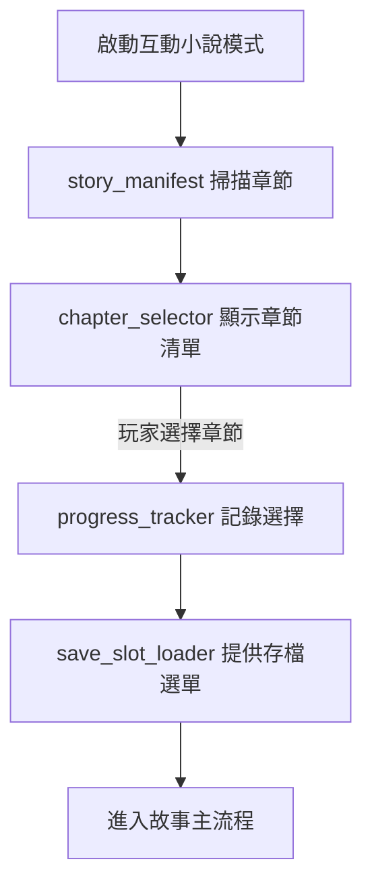
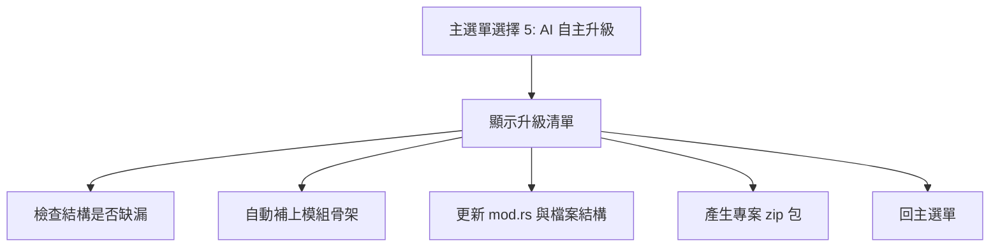
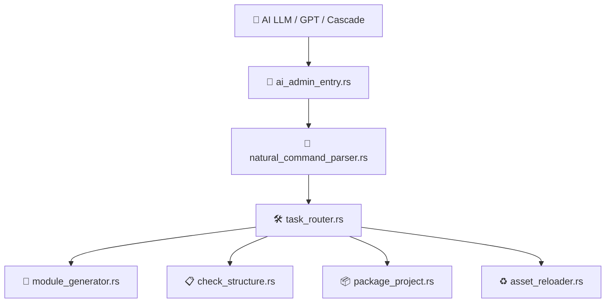
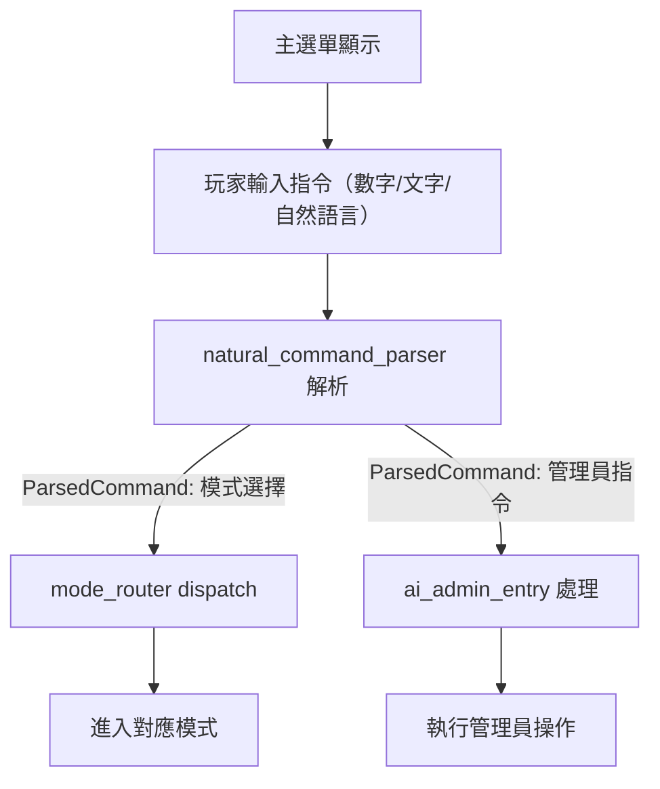
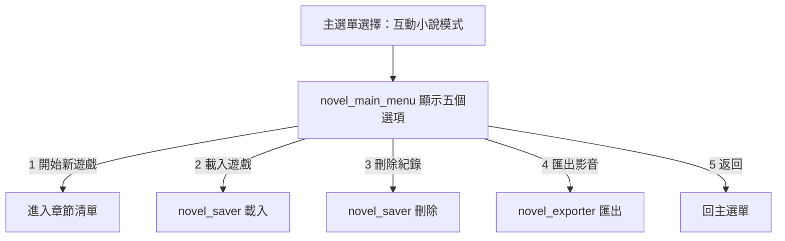
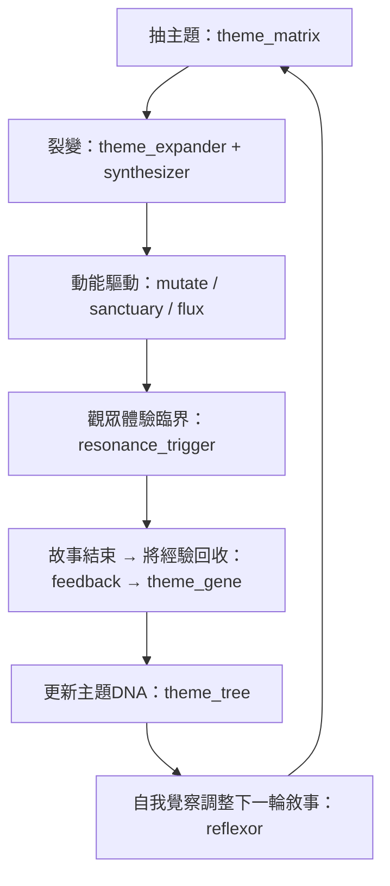
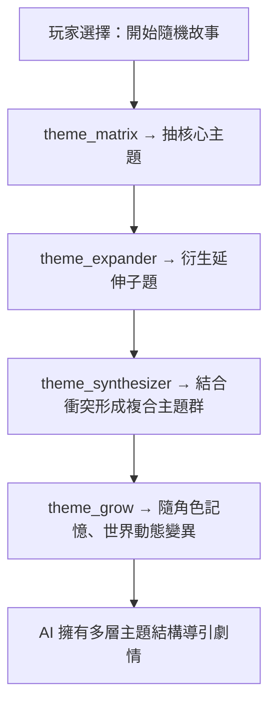
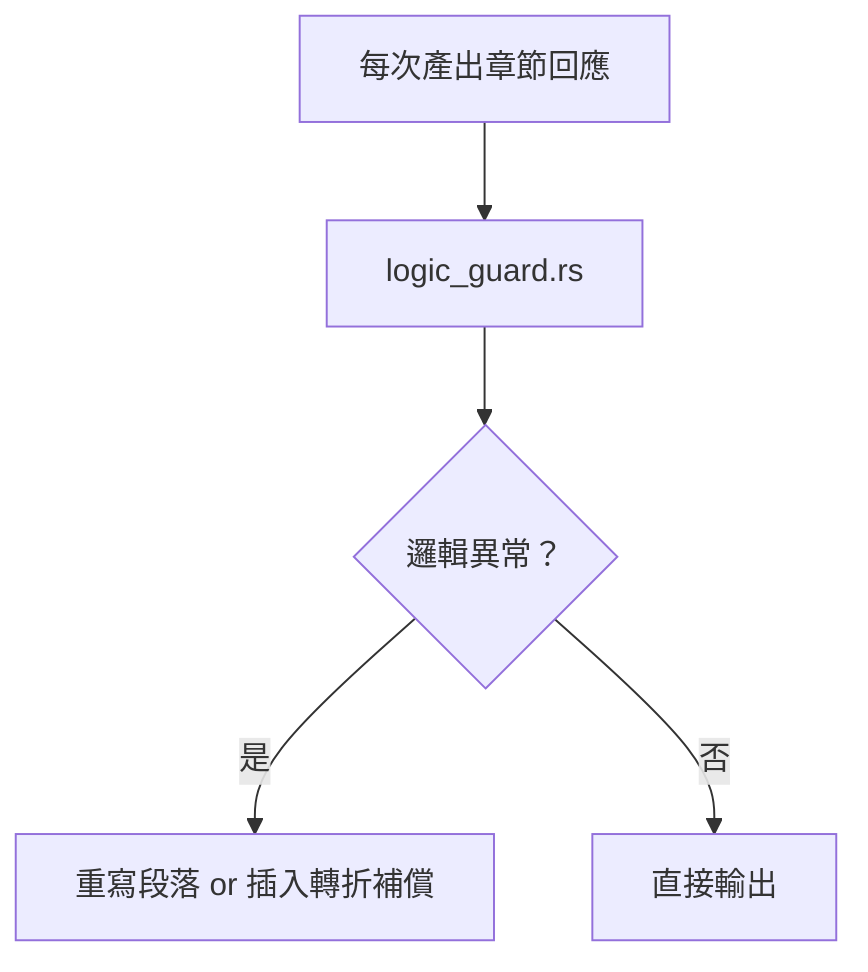
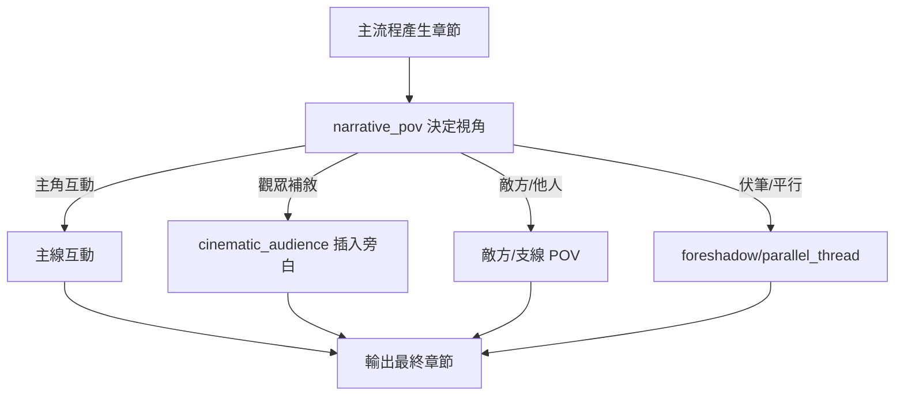

# EVA Interactive Novel Engine – Architectural Blueprint

---

## 🔁 EVA 本地自動學習與自我修正閉環

EVA 具備以下 Plug-&-Play 自增生架構，並持續進化為「無人值守、可持續學習」的 AI 系統：

### 1. 自動錯誤記錄
- 每次 build/test/runtime fail，EVA 會自動記錄錯誤範例與 prompt，寫入本地知識庫。

### 2. 自動修正/重試策略
- EVA 會自動嘗試多種修正（補依賴、調路徑、重組 use），直到通過或所有策略失敗。
- 成功修正的經驗會同步進知識庫，下次優先嘗試。

### 3. 知識庫查詢＋Prompt 增強
- 每次產生程式碼前，EVA 會查詢知識庫，並自動調整 prompt（如：避免跨 crate use、先補 Cargo.toml 等）。

### 4. 本地 LLM 微調
- EVA 會定期用「錯誤-修正」對自動 fine-tune 本地 LLM（如 Llama/Mistral），讓模型越來越懂專案規則。

### 5. 人機協作備援
- 若所有自動修正都失敗，EVA 會自動通知人類協助，並將解法納入知識庫，實現持續自我進化。

---

## EVA 自動自救閉環功能補充

---

### 【M3.D+6~M3.D+9】EVA 自救閉環落地任務進度表

| 任務編號 | 任務內容                             | 狀態      |
|----------|--------------------------------------|-----------|
| M3.D+4   | 完成 LLM Prompt Adapter              | ✅ 已完成 |
| M3.D+5   | 加入 check_structure.rs 初稿         | ✅ 已完成 |
| M3.D+6   | 補上 error_recovery.rs 模組           | 🟡 需開始撰寫 |
| M3.D+7   | 串接 eva-knowledge-base/ 查寫         | 🔜 待開發 |
| M3.D+8   | 加入 auto_loop_executor.rs            | 🔜 待開發 |
| M3.D+9   | 整合 Fallback 機制通知人類           | 🔜 待開發 |

#### error_recovery.rs 設計重點
- **模組目標**：自動根據錯誤訊息進行修正，並重試編譯/測試，直到成功或所有策略失敗。
- **主要功能**：
  - 分析 build/runtime/test 錯誤訊息，對應預設修正策略（如補依賴、補 use、補 mod.rs 等）
  - 每次修正後自動重新 build/test，若成功則記錄「修正對」進知識庫
  - 若失敗則嘗試下一種策略，直到全部策略失敗
  - 最終失敗時，將錯誤與所有嘗試過的修正記錄，並進入人機協作流程
- **與 check_structure.rs 的分工**：
  - check_structure.rs 負責「靜態結構檢查」與自動補全
  - error_recovery.rs 負責「動態錯誤修正」與多輪重試
- **未來擴充**：可串接 eva-knowledge-base/ 查詢歷史修正經驗，並與 auto_loop_executor.rs 整合成完整自救閉環

### 1. check_structure.rs（自動檢查守門員）
- 自動檢查 Cargo.toml、crate use、mod.rs、檔案完整性
- CLI 指令：`eva-tools check-structure --autofix`
- 檢查失敗時自動修正，並記錄修正紀錄

### 2. error_recovery.rs（自動修正/重試引擎）
- 根據錯誤訊息自動嘗試修正（補依賴、補 use、補 mod.rs）
- 每次修正後自動重新 build/test，直到成功或所有策略失敗
- 成功修正則記錄「修正對」進知識庫，失敗則進入人機協作

### 3. eva-knowledge-base/（本地錯誤知識庫）
- 錯誤紀錄格式（JSON/Markdown）：
  ```json
  {
    "error": "use of undeclared crate",
    "fix": "add mod.rs entry + use crate::X::Y",
    "source_file": "app/main.rs",
    "fixed": true
  }
  ```
- 每次錯誤與修正都自動同步到此資料夾

### 4. LLM 修正建議
- 本地 LLM（Llama/Mistral/ollama）自動產生修正建議
- 若知識庫無法解決，才請 LLM 產生新方案

### 5. Prompt Adapter
- 產生 prompt 前查詢知識庫，自動增強指令，避免重複犯錯

### 6. 自動 loop 腳本
- 流程：build/run fail → 記錄錯誤 → 查知識庫 → 修正 → 重試 → 成功則記錄策略，失敗則進入下一策略，全部失敗則通知人類

### 7. 失敗 fallback
- 設定最大重試次數，避免無限循環
- 最終失敗時自動通知人類，並記錄解法


## EVA Blueprint v0.1

### 目標
打造一個模組化、可自動增生、支援 AI/人類協作的互動敘事引擎，具備 Plug & Play Gateway、可觀測性、安全治理、資料可靠性與國際化等現代工程能力。

---

## 🔁 EVA 本地自動學習與自我修正閉環

EVA 具備以下 Plug-&-Play 自增生架構，並持續進化為「無人值守、可持續學習」的 AI 系統：

### 1. 自動錯誤記錄
- 每次 build/test/runtime fail，EVA 會自動記錄錯誤範例與 prompt，寫入本地知識庫。

### 2. 自動修正/重試策略
- EVA 會自動嘗試多種修正（補依賴、調路徑、重組 use），直到通過或所有策略失敗。
- 成功修正的經驗會同步進知識庫，下次優先嘗試。

### 3. 知識庫查詢＋Prompt 增強
- 每次產生程式碼前，EVA 會查詢知識庫，並自動調整 prompt（如：避免跨 crate use、先補 Cargo.toml 等）。

### 4. 本地 LLM 微調
- EVA 會定期用「錯誤-修正」對自動 fine-tune 本地 LLM（如 Llama/Mistral），讓模型越來越懂專案規則。

### 5. 人機協作備援
- 若所有自動修正都失敗，EVA 會自動通知人類協助，並將解法納入知識庫，實現持續自我進化。

---

## EVA 自動自救閉環功能補充

---

### 【M3.D+6~M3.D+9】EVA 自救閉環落地任務進度表

| 任務編號 | 任務內容                             | 狀態      |
|----------|--------------------------------------|-----------|
| M3.D+4   | 完成 LLM Prompt Adapter              | ✅ 已完成 |
| M3.D+5   | 加入 check_structure.rs 初稿         | ✅ 已完成 |
| M3.D+6   | 補上 error_recovery.rs 模組           | 🟡 需開始撰寫 |
| M3.D+7   | 串接 eva-knowledge-base/ 查寫         | 🔜 待開發 |
| M3.D+8   | 加入 auto_loop_executor.rs            | 🔜 待開發 |
| M3.D+9   | 整合 Fallback 機制通知人類           | 🔜 待開發 |

#### error_recovery.rs 設計重點
- **模組目標**：自動根據錯誤訊息進行修正，並重試編譯/測試，直到成功或所有策略失敗。
- **主要功能**：
  - 分析 build/runtime/test 錯誤訊息，對應預設修正策略（如補依賴、補 use、補 mod.rs 等）
  - 每次修正後自動重新 build/test，若成功則記錄「修正對」進知識庫
  - 若失敗則嘗試下一種策略，直到全部策略失敗
  - 最終失敗時，將錯誤與所有嘗試過的修正記錄，並進入人機協作流程
- **與 check_structure.rs 的分工**：
  - check_structure.rs 負責「靜態結構檢查」與自動補全
  - error_recovery.rs 負責「動態錯誤修正」與多輪重試
- **未來擴充**：可串接 eva-knowledge-base/ 查詢歷史修正經驗，並與 auto_loop_executor.rs 整合成完整自救閉環

### 1. check_structure.rs（自動檢查守門員）
- 自動檢查 Cargo.toml、crate use、mod.rs、檔案完整性
- CLI 指令：`eva-tools check-structure --autofix`
- 檢查失敗時自動修正，並記錄修正紀錄

### 2. error_recovery.rs（自動修正/重試引擎）
- 根據錯誤訊息自動嘗試修正（補依賴、補 use、補 mod.rs）
- 每次修正後自動重新 build/test，直到成功或所有策略失敗
- 成功修正則記錄「修正對」進知識庫，失敗則進入人機協作

### 3. eva-knowledge-base/（本地錯誤知識庫）
- 錯誤紀錄格式（JSON/Markdown）：
  ```json
  {
    "error": "use of undeclared crate",
    "fix": "add mod.rs entry + use crate::X::Y",
    "source_file": "app/main.rs",
    "fixed": true
  }
  ```
- 每次錯誤與修正都自動同步到此資料夾

### 4. LLM 修正建議
- 本地 LLM（Llama/Mistral/ollama）自動產生修正建議
- 若知識庫無法解決，才請 LLM 產生新方案

### 5. Prompt Adapter
- 產生 prompt 前查詢知識庫，自動增強指令，避免重複犯錯

### 6. 自動 loop 腳本
- 流程：build/run fail → 記錄錯誤 → 查知識庫 → 修正 → 重試 → 成功則記錄策略，失敗則進入下一策略，全部失敗則通知人類

### 7. 失敗 fallback
- 設定最大重試次數，避免無限循環
- 最終失敗時自動通知人類，並記錄解法


## 0. 快速開始與環境安裝

### 0‑1. 安裝環境工具
```sh
# Rust 工具鏈
curl --proto '=https' --tlsv1.2 -sSf https://sh.rustup.rs | sh
rustup default stable
# nextest 測試
cargo install cargo-nextest
# Mermaid 圖表 CLI
bun install -g @mermaid-js/mermaid-cli
```

### 0‑2. 建立專案 Workspace
```sh
cargo new eva --lib
mkdir crates && cd crates
```

### 0‑3. 加入藍圖文件
將 ARCHITECTURE.md 放在專案根目錄，並加入 git 追蹤。

---

## 🔁 EVA 本地自動學習與自我修正閉環

EVA 具備以下 Plug-&-Play 自增生架構，並持續進化為「無人值守、可持續學習」的 AI 系統：

### 1. 自動錯誤記錄
- 每次 build/test/runtime fail，EVA 會自動記錄錯誤範例與 prompt，寫入本地知識庫。

### 2. 自動修正/重試策略
- EVA 會自動嘗試多種修正（補依賴、調路徑、重組 use），直到通過或所有策略失敗。
- 成功修正的經驗會同步進知識庫，下次優先嘗試。

### 3. 知識庫查詢＋Prompt 增強
- 每次產生程式碼前，EVA 會查詢知識庫，並自動調整 prompt（如：避免跨 crate use、先補 Cargo.toml 等）。

### 4. 本地 LLM 微調
- EVA 會定期用「錯誤-修正」對自動 fine-tune 本地 LLM（如 Llama/Mistral），讓模型越來越懂專案規則。

### 5. 人機協作備援
- 若所有自動修正都失敗，EVA 會自動通知人類協助，並將解法納入知識庫，實現持續自我進化。

---

## EVA 自動自救閉環功能補充

---

### 【M3.D+6~M3.D+9】EVA 自救閉環落地任務進度表

| 任務編號 | 任務內容                             | 狀態      |
|----------|--------------------------------------|-----------|
| M3.D+4   | 完成 LLM Prompt Adapter              | ✅ 已完成 |
| M3.D+5   | 加入 check_structure.rs 初稿         | ✅ 已完成 |
| M3.D+6   | 補上 error_recovery.rs 模組           | 🟡 需開始撰寫 |
| M3.D+7   | 串接 eva-knowledge-base/ 查寫         | 🔜 待開發 |
| M3.D+8   | 加入 auto_loop_executor.rs            | 🔜 待開發 |
| M3.D+9   | 整合 Fallback 機制通知人類           | 🔜 待開發 |

#### error_recovery.rs 設計重點
- **模組目標**：自動根據錯誤訊息進行修正，並重試編譯/測試，直到成功或所有策略失敗。
- **主要功能**：
  - 分析 build/runtime/test 錯誤訊息，對應預設修正策略（如補依賴、補 use、補 mod.rs 等）
  - 每次修正後自動重新 build/test，若成功則記錄「修正對」進知識庫
  - 若失敗則嘗試下一種策略，直到全部策略失敗
  - 最終失敗時，將錯誤與所有嘗試過的修正記錄，並進入人機協作流程
- **與 check_structure.rs 的分工**：
  - check_structure.rs 負責「靜態結構檢查」與自動補全
  - error_recovery.rs 負責「動態錯誤修正」與多輪重試
- **未來擴充**：可串接 eva-knowledge-base/ 查詢歷史修正經驗，並與 auto_loop_executor.rs 整合成完整自救閉環

### 1. check_structure.rs（自動檢查守門員）
- 自動檢查 Cargo.toml、crate use、mod.rs、檔案完整性
- CLI 指令：`eva-tools check-structure --autofix`
- 檢查失敗時自動修正，並記錄修正紀錄

### 2. error_recovery.rs（自動修正/重試引擎）
- 根據錯誤訊息自動嘗試修正（補依賴、補 use、補 mod.rs）
- 每次修正後自動重新 build/test，直到成功或所有策略失敗
- 成功修正則記錄「修正對」進知識庫，失敗則進入人機協作

### 3. eva-knowledge-base/（本地錯誤知識庫）
- 錯誤紀錄格式（JSON/Markdown）：
  ```json
  {
    "error": "use of undeclared crate",
    "fix": "add mod.rs entry + use crate::X::Y",
    "source_file": "app/main.rs",
    "fixed": true
  }
  ```
- 每次錯誤與修正都自動同步到此資料夾

### 4. LLM 修正建議
- 本地 LLM（Llama/Mistral/ollama）自動產生修正建議
- 若知識庫無法解決，才請 LLM 產生新方案

### 5. Prompt Adapter
- 產生 prompt 前查詢知識庫，自動增強指令，避免重複犯錯

### 6. 自動 loop 腳本
- 流程：build/run fail → 記錄錯誤 → 查知識庫 → 修正 → 重試 → 成功則記錄策略，失敗則進入下一策略，全部失敗則通知人類

### 7. 失敗 fallback
- 設定最大重試次數，避免無限循環
- 最終失敗時自動通知人類，並記錄解法


## 1. Layered Overview

```
┌────────────────────────┐
│        App Layer       │  ← CLI / interactive_novel.rs
└────────────────────────┘
          │
          ▼
┌────────────────────────┐
│      Service Layer     │  ← combat.rs / romance.rs / growth.rs / rule_engine.rs
└────────────────────────┘
          │
          ▼
┌────────────────────────┐
│     Domain Layer       │  ← pure data & business rules
└────────────────────────┘
          │
          ▼
┌────────────────────────┐
│   Infrastructure Layer │  ← DB / external API / persistence
└────────────────────────┘
```

- **Down-only** dependencies – higher layers import lower layers, never the reverse.
- 每層擁有自己的 `mod.rs`，公開 re-export 子模組。

---

## 🔁 EVA 本地自動學習與自我修正閉環

EVA 具備以下 Plug-&-Play 自增生架構，並持續進化為「無人值守、可持續學習」的 AI 系統：

### 1. 自動錯誤記錄
- 每次 build/test/runtime fail，EVA 會自動記錄錯誤範例與 prompt，寫入本地知識庫。

### 2. 自動修正/重試策略
- EVA 會自動嘗試多種修正（補依賴、調路徑、重組 use），直到通過或所有策略失敗。
- 成功修正的經驗會同步進知識庫，下次優先嘗試。

### 3. 知識庫查詢＋Prompt 增強
- 每次產生程式碼前，EVA 會查詢知識庫，並自動調整 prompt（如：避免跨 crate use、先補 Cargo.toml 等）。

### 4. 本地 LLM 微調
- EVA 會定期用「錯誤-修正」對自動 fine-tune 本地 LLM（如 Llama/Mistral），讓模型越來越懂專案規則。

### 5. 人機協作備援
- 若所有自動修正都失敗，EVA 會自動通知人類協助，並將解法納入知識庫，實現持續自我進化。

---

## EVA 自動自救閉環功能補充

---

### 【M3.D+6~M3.D+9】EVA 自救閉環落地任務進度表

| 任務編號 | 任務內容                             | 狀態      |
|----------|--------------------------------------|-----------|
| M3.D+4   | 完成 LLM Prompt Adapter              | ✅ 已完成 |
| M3.D+5   | 加入 check_structure.rs 初稿         | ✅ 已完成 |
| M3.D+6   | 補上 error_recovery.rs 模組           | 🟡 需開始撰寫 |
| M3.D+7   | 串接 eva-knowledge-base/ 查寫         | 🔜 待開發 |
| M3.D+8   | 加入 auto_loop_executor.rs            | 🔜 待開發 |
| M3.D+9   | 整合 Fallback 機制通知人類           | 🔜 待開發 |

#### error_recovery.rs 設計重點
- **模組目標**：自動根據錯誤訊息進行修正，並重試編譯/測試，直到成功或所有策略失敗。
- **主要功能**：
  - 分析 build/runtime/test 錯誤訊息，對應預設修正策略（如補依賴、補 use、補 mod.rs 等）
  - 每次修正後自動重新 build/test，若成功則記錄「修正對」進知識庫
  - 若失敗則嘗試下一種策略，直到全部策略失敗
  - 最終失敗時，將錯誤與所有嘗試過的修正記錄，並進入人機協作流程
- **與 check_structure.rs 的分工**：
  - check_structure.rs 負責「靜態結構檢查」與自動補全
  - error_recovery.rs 負責「動態錯誤修正」與多輪重試
- **未來擴充**：可串接 eva-knowledge-base/ 查詢歷史修正經驗，並與 auto_loop_executor.rs 整合成完整自救閉環

### 1. check_structure.rs（自動檢查守門員）
- 自動檢查 Cargo.toml、crate use、mod.rs、檔案完整性
- CLI 指令：`eva-tools check-structure --autofix`
- 檢查失敗時自動修正，並記錄修正紀錄

### 2. error_recovery.rs（自動修正/重試引擎）
- 根據錯誤訊息自動嘗試修正（補依賴、補 use、補 mod.rs）
- 每次修正後自動重新 build/test，直到成功或所有策略失敗
- 成功修正則記錄「修正對」進知識庫，失敗則進入人機協作

### 3. eva-knowledge-base/（本地錯誤知識庫）
- 錯誤紀錄格式（JSON/Markdown）：
  ```json
  {
    "error": "use of undeclared crate",
    "fix": "add mod.rs entry + use crate::X::Y",
    "source_file": "app/main.rs",
    "fixed": true
  }
  ```
- 每次錯誤與修正都自動同步到此資料夾

### 4. LLM 修正建議
- 本地 LLM（Llama/Mistral/ollama）自動產生修正建議
- 若知識庫無法解決，才請 LLM 產生新方案

### 5. Prompt Adapter
- 產生 prompt 前查詢知識庫，自動增強指令，避免重複犯錯

### 6. 自動 loop 腳本
- 流程：build/run fail → 記錄錯誤 → 查知識庫 → 修正 → 重試 → 成功則記錄策略，失敗則進入下一策略，全部失敗則通知人類

### 7. 失敗 fallback
- 設定最大重試次數，避免無限循環
- 最終失敗時自動通知人類，並記錄解法


## 2.1 Canonical Workspace Tree # illustrative

```tree # legacy # illustrative
src
├─ app
│   ├─ cli.rs
│   ├─ interactive_novel.rs
│   ├─ mode_router.rs
│   └─ mode_manifest.rs
├─ ui
│   ├─ main_menu.rs
│   ├─ novel_main_menu.rs
│   └─ self_upgrade_menu.rs
├─ services
│   ├─ combat.rs
│   ├─ romance.rs
│   ├─ growth.rs
│   ├─ rule_engine.rs
│   └─ novel_exporter.rs
├─ state
│   └─ novel_saver.rs
├─ tools
│   ├─ check_structure.rs
│   ├─ module_generator.rs
│   └─ auto_loop_executor.rs
├─ knowledge_base
│   └─ error_log.md
└─ utils
    ├─ context_builder.rs
    └─ logging.rs
```

### 2.2 Crates 目錄 # illustrative

```tree # legacy # illustrative
crates
├─ eva‑tools
│   └─ src/...
├─ infrastructure
│   └─ src/{openai_adapter.rs, tts_adapter.rs, prompt_adapter.rs}
├─ config
│   └─ src/lib.rs
└─ eva-knowledge-base
    └─ src/lib.rs
```

> 其餘片段式目錄展示請加 # illustrative 註解，例如：
>
> ```tree # legacy
> crates/
>  └─ infrastructure/
> ```

---

## 🔁 EVA 本地自動學習與自我修正閉環

EVA 具備以下 Plug-&-Play 自增生架構，並持續進化為「無人值守、可持續學習」的 AI 系統：

### 1. 自動錯誤記錄
- 每次 build/test/runtime fail，EVA 會自動記錄錯誤範例與 prompt，寫入本地知識庫。

### 2. 自動修正/重試策略
- EVA 會自動嘗試多種修正（補依賴、調路徑、重組 use），直到通過或所有策略失敗。
- 成功修正的經驗會同步進知識庫，下次優先嘗試。

### 3. 知識庫查詢＋Prompt 增強
- 每次產生程式碼前，EVA 會查詢知識庫，並自動調整 prompt（如：避免跨 crate use、先補 Cargo.toml 等）。

### 4. 本地 LLM 微調
- EVA 會定期用「錯誤-修正」對自動 fine-tune 本地 LLM（如 Llama/Mistral），讓模型越來越懂專案規則。

### 5. 人機協作備援
- 若所有自動修正都失敗，EVA 會自動通知人類協助，並將解法納入知識庫，實現持續自我進化。

---

## EVA 自動自救閉環功能補充

---

### 【M3.D+6~M3.D+9】EVA 自救閉環落地任務進度表

| 任務編號 | 任務內容                             | 狀態      |
|----------|--------------------------------------|-----------|
| M3.D+4   | 完成 LLM Prompt Adapter              | ✅ 已完成 |
| M3.D+5   | 加入 check_structure.rs 初稿         | ✅ 已完成 |
| M3.D+6   | 補上 error_recovery.rs 模組           | 🟡 需開始撰寫 |
| M3.D+7   | 串接 eva-knowledge-base/ 查寫         | 🔜 待開發 |
| M3.D+8   | 加入 auto_loop_executor.rs            | 🔜 待開發 |
| M3.D+9   | 整合 Fallback 機制通知人類           | 🔜 待開發 |

#### error_recovery.rs 設計重點
- **模組目標**：自動根據錯誤訊息進行修正，並重試編譯/測試，直到成功或所有策略失敗。
- **主要功能**：
  - 分析 build/runtime/test 錯誤訊息，對應預設修正策略（如補依賴、補 use、補 mod.rs 等）
  - 每次修正後自動重新 build/test，若成功則記錄「修正對」進知識庫
  - 若失敗則嘗試下一種策略，直到全部策略失敗
  - 最終失敗時，將錯誤與所有嘗試過的修正記錄，並進入人機協作流程
- **與 check_structure.rs 的分工**：
  - check_structure.rs 負責「靜態結構檢查」與自動補全
  - error_recovery.rs 負責「動態錯誤修正」與多輪重試
- **未來擴充**：可串接 eva-knowledge-base/ 查詢歷史修正經驗，並與 auto_loop_executor.rs 整合成完整自救閉環

### 1. check_structure.rs（自動檢查守門員）
- 自動檢查 Cargo.toml、crate use、mod.rs、檔案完整性
- CLI 指令：`eva-tools check-structure --autofix`
- 檢查失敗時自動修正，並記錄修正紀錄

### 2. error_recovery.rs（自動修正/重試引擎）
- 根據錯誤訊息自動嘗試修正（補依賴、補 use、補 mod.rs）
- 每次修正後自動重新 build/test，直到成功或所有策略失敗
- 成功修正則記錄「修正對」進知識庫，失敗則進入人機協作

### 3. eva-knowledge-base/（本地錯誤知識庫）
- 錯誤紀錄格式（JSON/Markdown）：
  ```json
  {
    "error": "use of undeclared crate",
    "fix": "add mod.rs entry + use crate::X::Y",
    "source_file": "app/main.rs",
    "fixed": true
  }
  ```
- 每次錯誤與修正都自動同步到此資料夾

### 4. LLM 修正建議
- 本地 LLM（Llama/Mistral/ollama）自動產生修正建議
- 若知識庫無法解決，才請 LLM 產生新方案

### 5. Prompt Adapter
- 產生 prompt 前查詢知識庫，自動增強指令，避免重複犯錯

### 6. 自動 loop 腳本
- 流程：build/run fail → 記錄錯誤 → 查知識庫 → 修正 → 重試 → 成功則記錄策略，失敗則進入下一策略，全部失敗則通知人類

### 7. 失敗 fallback
- 設定最大重試次數，避免無限循環
- 最終失敗時自動通知人類，並記錄解法


## 2.3 工具相容性說明
- 只解析第一個 # legacy tree 區塊。
- 若找不到 canonical，回退至 legacy 掃描。
- 行尾有 # illustrative 或 # legacy 標記者，eva-tools 皆忽略之。
- canonical tree 必須同步最新模組與 crate，缺漏會報錯。
- 建議所有目錄結構區塊皆加 # illustrative，避免誤判。

## 2.4 版本
- 本藍圖為 v0.3，舊版請移至 ARCHITECTURE_legacy.md。

## 2.5 Changelog
- v0.3：
  - 移除重複 canonical tree，統一結構並加 # illustrative 註解
  - 同步新增 auto_loop_executor.rs、eva-knowledge-base/ 等模組於 canonical tree
  - 所有目錄區塊皆標註 # illustrative
  - 工具相容性說明同步新規則
  - 新增 changelog

---

## 🔁 EVA 本地自動學習與自我修正閉環

EVA 具備以下 Plug-&-Play 自增生架構，並持續進化為「無人值守、可持續學習」的 AI 系統：

### 1. 自動錯誤記錄
- 每次 build/test/runtime fail，EVA 會自動記錄錯誤範例與 prompt，寫入本地知識庫。

### 2. 自動修正/重試策略
- EVA 會自動嘗試多種修正（補依賴、調路徑、重組 use），直到通過或所有策略失敗。
- 成功修正的經驗會同步進知識庫，下次優先嘗試。

### 3. 知識庫查詢＋Prompt 增強
- 每次產生程式碼前，EVA 會查詢知識庫，並自動調整 prompt（如：避免跨 crate use、先補 Cargo.toml 等）。

### 4. 本地 LLM 微調
- EVA 會定期用「錯誤-修正」對自動 fine-tune 本地 LLM（如 Llama/Mistral），讓模型越來越懂專案規則。

### 5. 人機協作備援
- 若所有自動修正都失敗，EVA 會自動通知人類協助，並將解法納入知識庫，實現持續自我進化。

---

## EVA 自動自救閉環功能補充

---

### 【M3.D+6~M3.D+9】EVA 自救閉環落地任務進度表

| 任務編號 | 任務內容                             | 狀態      |
|----------|--------------------------------------|-----------|
| M3.D+4   | 完成 LLM Prompt Adapter              | ✅ 已完成 |
| M3.D+5   | 加入 check_structure.rs 初稿         | ✅ 已完成 |
| M3.D+6   | 補上 error_recovery.rs 模組           | 🟡 需開始撰寫 |
| M3.D+7   | 串接 eva-knowledge-base/ 查寫         | 🔜 待開發 |
| M3.D+8   | 加入 auto_loop_executor.rs            | 🔜 待開發 |
| M3.D+9   | 整合 Fallback 機制通知人類           | 🔜 待開發 |

#### error_recovery.rs 設計重點
- **模組目標**：自動根據錯誤訊息進行修正，並重試編譯/測試，直到成功或所有策略失敗。
- **主要功能**：
  - 分析 build/runtime/test 錯誤訊息，對應預設修正策略（如補依賴、補 use、補 mod.rs 等）
  - 每次修正後自動重新 build/test，若成功則記錄「修正對」進知識庫
  - 若失敗則嘗試下一種策略，直到全部策略失敗
  - 最終失敗時，將錯誤與所有嘗試過的修正記錄，並進入人機協作流程
- **與 check_structure.rs 的分工**：
  - check_structure.rs 負責「靜態結構檢查」與自動補全
  - error_recovery.rs 負責「動態錯誤修正」與多輪重試
- **未來擴充**：可串接 eva-knowledge-base/ 查詢歷史修正經驗，並與 auto_loop_executor.rs 整合成完整自救閉環

### 1. check_structure.rs（自動檢查守門員）
- 自動檢查 Cargo.toml、crate use、mod.rs、檔案完整性
- CLI 指令：`eva-tools check-structure --autofix`
- 檢查失敗時自動修正，並記錄修正紀錄

### 2. error_recovery.rs（自動修正/重試引擎）
- 根據錯誤訊息自動嘗試修正（補依賴、補 use、補 mod.rs）
- 每次修正後自動重新 build/test，直到成功或所有策略失敗
- 成功修正則記錄「修正對」進知識庫，失敗則進入人機協作

### 3. eva-knowledge-base/（本地錯誤知識庫）
- 錯誤紀錄格式（JSON/Markdown）：
  ```json
  {
    "error": "use of undeclared crate",
    "fix": "add mod.rs entry + use crate::X::Y",
    "source_file": "app/main.rs",
    "fixed": true
  }
  ```
- 每次錯誤與修正都自動同步到此資料夾

### 4. LLM 修正建議
- 本地 LLM（Llama/Mistral/ollama）自動產生修正建議
- 若知識庫無法解決，才請 LLM 產生新方案

### 5. Prompt Adapter
- 產生 prompt 前查詢知識庫，自動增強指令，避免重複犯錯

### 6. 自動 loop 腳本
- 流程：build/run fail → 記錄錯誤 → 查知識庫 → 修正 → 重試 → 成功則記錄策略，失敗則進入下一策略，全部失敗則通知人類

### 7. 失敗 fallback
- 設定最大重試次數，避免無限循環
- 最終失敗時自動通知人類，並記錄解法


```
src/
 ├─ app/                  # High-level flows & IO
 │   ├─ cli.rs            # Command parser / dispatch
 │   └─ interactive_novel.rs
 ├─ services/             # Use-case logic orchestrating multiple domains
 │   ├─ combat.rs
 │   ├─ romance.rs
 │   ├─ growth.rs
 │   └─ rule_engine.rs
 ├─ domain/               # Pure domain models (no IO)
 │   ├── world (mod)
 │   │      └── WorldState/NpcState/Stats/Status ...
 │   └── character/
 │       ├─ stats.rs
 │       ├─ traits.rs
 │       ├─ status.rs
 │       └─ inventory.rs
 ├─ infrastructure/       # Gateways / DB / external services
 │   ├─ db/
 │   │   ├─ mod.rs
 │   │   └─ sea_orm_models.rs
 │   ├─ persistence.rs
 │   └─ openai_client.rs
 └─ utils/
     ├─ context_builder.rs
     └─ logging.rs
```

> **Note:** Existing code will be incrementally migrated into the structure above. During the transition, a legacy `story/` tree will co-exist until fully ported.

---

## 🔁 EVA 本地自動學習與自我修正閉環

EVA 具備以下 Plug-&-Play 自增生架構，並持續進化為「無人值守、可持續學習」的 AI 系統：

### 1. 自動錯誤記錄
- 每次 build/test/runtime fail，EVA 會自動記錄錯誤範例與 prompt，寫入本地知識庫。

### 2. 自動修正/重試策略
- EVA 會自動嘗試多種修正（補依賴、調路徑、重組 use），直到通過或所有策略失敗。
- 成功修正的經驗會同步進知識庫，下次優先嘗試。

### 3. 知識庫查詢＋Prompt 增強
- 每次產生程式碼前，EVA 會查詢知識庫，並自動調整 prompt（如：避免跨 crate use、先補 Cargo.toml 等）。

### 4. 本地 LLM 微調
- EVA 會定期用「錯誤-修正」對自動 fine-tune 本地 LLM（如 Llama/Mistral），讓模型越來越懂專案規則。

### 5. 人機協作備援
- 若所有自動修正都失敗，EVA 會自動通知人類協助，並將解法納入知識庫，實現持續自我進化。

---

## EVA 自動自救閉環功能補充

---

### 【M3.D+6~M3.D+9】EVA 自救閉環落地任務進度表

| 任務編號 | 任務內容                             | 狀態      |
|----------|--------------------------------------|-----------|
| M3.D+4   | 完成 LLM Prompt Adapter              | ✅ 已完成 |
| M3.D+5   | 加入 check_structure.rs 初稿         | ✅ 已完成 |
| M3.D+6   | 補上 error_recovery.rs 模組           | 🟡 需開始撰寫 |
| M3.D+7   | 串接 eva-knowledge-base/ 查寫         | 🔜 待開發 |
| M3.D+8   | 加入 auto_loop_executor.rs            | 🔜 待開發 |
| M3.D+9   | 整合 Fallback 機制通知人類           | 🔜 待開發 |

#### error_recovery.rs 設計重點
- **模組目標**：自動根據錯誤訊息進行修正，並重試編譯/測試，直到成功或所有策略失敗。
- **主要功能**：
  - 分析 build/runtime/test 錯誤訊息，對應預設修正策略（如補依賴、補 use、補 mod.rs 等）
  - 每次修正後自動重新 build/test，若成功則記錄「修正對」進知識庫
  - 若失敗則嘗試下一種策略，直到全部策略失敗
  - 最終失敗時，將錯誤與所有嘗試過的修正記錄，並進入人機協作流程
- **與 check_structure.rs 的分工**：
  - check_structure.rs 負責「靜態結構檢查」與自動補全
  - error_recovery.rs 負責「動態錯誤修正」與多輪重試
- **未來擴充**：可串接 eva-knowledge-base/ 查詢歷史修正經驗，並與 auto_loop_executor.rs 整合成完整自救閉環

### 1. check_structure.rs（自動檢查守門員）
- 自動檢查 Cargo.toml、crate use、mod.rs、檔案完整性
- CLI 指令：`eva-tools check-structure --autofix`
- 檢查失敗時自動修正，並記錄修正紀錄

### 2. error_recovery.rs（自動修正/重試引擎）
- 根據錯誤訊息自動嘗試修正（補依賴、補 use、補 mod.rs）
- 每次修正後自動重新 build/test，直到成功或所有策略失敗
- 成功修正則記錄「修正對」進知識庫，失敗則進入人機協作

### 3. eva-knowledge-base/（本地錯誤知識庫）
- 錯誤紀錄格式（JSON/Markdown）：
  ```json
  {
    "error": "use of undeclared crate",
    "fix": "add mod.rs entry + use crate::X::Y",
    "source_file": "app/main.rs",
    "fixed": true
  }
  ```
- 每次錯誤與修正都自動同步到此資料夾

### 4. LLM 修正建議
- 本地 LLM（Llama/Mistral/ollama）自動產生修正建議
- 若知識庫無法解決，才請 LLM 產生新方案

### 5. Prompt Adapter
- 產生 prompt 前查詢知識庫，自動增強指令，避免重複犯錯

### 6. 自動 loop 腳本
- 流程：build/run fail → 記錄錯誤 → 查知識庫 → 修正 → 重試 → 成功則記錄策略，失敗則進入下一策略，全部失敗則通知人類

### 7. 失敗 fallback
- 設定最大重試次數，避免無限循環
- 最終失敗時自動通知人類，並記錄解法


## 3. 命名規範（Naming Conventions）

1. **Functions** – `verb_object`: `load_character_memory`, `detect_contradiction`, `inject_player_profile`
2. **Structs / Enums** – singular nouns: `Stats`, `StatusEffect`, `InventoryItem`
3. **Modules** – plural or category: `characters`, `services`, `utils`
4. **Files** – mirror the main type inside when possible: `stats.rs` contains `Stats`.

---

## 🔁 EVA 本地自動學習與自我修正閉環

EVA 具備以下 Plug-&-Play 自增生架構，並持續進化為「無人值守、可持續學習」的 AI 系統：

### 1. 自動錯誤記錄
- 每次 build/test/runtime fail，EVA 會自動記錄錯誤範例與 prompt，寫入本地知識庫。

### 2. 自動修正/重試策略
- EVA 會自動嘗試多種修正（補依賴、調路徑、重組 use），直到通過或所有策略失敗。
- 成功修正的經驗會同步進知識庫，下次優先嘗試。

### 3. 知識庫查詢＋Prompt 增強
- 每次產生程式碼前，EVA 會查詢知識庫，並自動調整 prompt（如：避免跨 crate use、先補 Cargo.toml 等）。

### 4. 本地 LLM 微調
- EVA 會定期用「錯誤-修正」對自動 fine-tune 本地 LLM（如 Llama/Mistral），讓模型越來越懂專案規則。

### 5. 人機協作備援
- 若所有自動修正都失敗，EVA 會自動通知人類協助，並將解法納入知識庫，實現持續自我進化。

---

## EVA 自動自救閉環功能補充

---

### 【M3.D+6~M3.D+9】EVA 自救閉環落地任務進度表

| 任務編號 | 任務內容                             | 狀態      |
|----------|--------------------------------------|-----------|
| M3.D+4   | 完成 LLM Prompt Adapter              | ✅ 已完成 |
| M3.D+5   | 加入 check_structure.rs 初稿         | ✅ 已完成 |
| M3.D+6   | 補上 error_recovery.rs 模組           | 🟡 需開始撰寫 |
| M3.D+7   | 串接 eva-knowledge-base/ 查寫         | 🔜 待開發 |
| M3.D+8   | 加入 auto_loop_executor.rs            | 🔜 待開發 |
| M3.D+9   | 整合 Fallback 機制通知人類           | 🔜 待開發 |

#### error_recovery.rs 設計重點
- **模組目標**：自動根據錯誤訊息進行修正，並重試編譯/測試，直到成功或所有策略失敗。
- **主要功能**：
  - 分析 build/runtime/test 錯誤訊息，對應預設修正策略（如補依賴、補 use、補 mod.rs 等）
  - 每次修正後自動重新 build/test，若成功則記錄「修正對」進知識庫
  - 若失敗則嘗試下一種策略，直到全部策略失敗
  - 最終失敗時，將錯誤與所有嘗試過的修正記錄，並進入人機協作流程
- **與 check_structure.rs 的分工**：
  - check_structure.rs 負責「靜態結構檢查」與自動補全
  - error_recovery.rs 負責「動態錯誤修正」與多輪重試
- **未來擴充**：可串接 eva-knowledge-base/ 查詢歷史修正經驗，並與 auto_loop_executor.rs 整合成完整自救閉環

### 1. check_structure.rs（自動檢查守門員）
- 自動檢查 Cargo.toml、crate use、mod.rs、檔案完整性
- CLI 指令：`eva-tools check-structure --autofix`
- 檢查失敗時自動修正，並記錄修正紀錄

### 2. error_recovery.rs（自動修正/重試引擎）
- 根據錯誤訊息自動嘗試修正（補依賴、補 use、補 mod.rs）
- 每次修正後自動重新 build/test，直到成功或所有策略失敗
- 成功修正則記錄「修正對」進知識庫，失敗則進入人機協作

### 3. eva-knowledge-base/（本地錯誤知識庫）
- 錯誤紀錄格式（JSON/Markdown）：
  ```json
  {
    "error": "use of undeclared crate",
    "fix": "add mod.rs entry + use crate::X::Y",
    "source_file": "app/main.rs",
    "fixed": true
  }
  ```
- 每次錯誤與修正都自動同步到此資料夾

### 4. LLM 修正建議
- 本地 LLM（Llama/Mistral/ollama）自動產生修正建議
- 若知識庫無法解決，才請 LLM 產生新方案

### 5. Prompt Adapter
- 產生 prompt 前查詢知識庫，自動增強指令，避免重複犯錯

### 6. 自動 loop 腳本
- 流程：build/run fail → 記錄錯誤 → 查知識庫 → 修正 → 重試 → 成功則記錄策略，失敗則進入下一策略，全部失敗則通知人類

### 7. 失敗 fallback
- 設定最大重試次數，避免無限循環
- 最終失敗時自動通知人類，並記錄解法


## 4. 單一職責原則（SRP）

- 每個 function 只做一件事。
- 高階服務 function 負責組合。
- 測試、mock、維護都更容易。

---

## 🔁 EVA 本地自動學習與自我修正閉環

EVA 具備以下 Plug-&-Play 自增生架構，並持續進化為「無人值守、可持續學習」的 AI 系統：

### 1. 自動錯誤記錄
- 每次 build/test/runtime fail，EVA 會自動記錄錯誤範例與 prompt，寫入本地知識庫。

### 2. 自動修正/重試策略
- EVA 會自動嘗試多種修正（補依賴、調路徑、重組 use），直到通過或所有策略失敗。
- 成功修正的經驗會同步進知識庫，下次優先嘗試。

### 3. 知識庫查詢＋Prompt 增強
- 每次產生程式碼前，EVA 會查詢知識庫，並自動調整 prompt（如：避免跨 crate use、先補 Cargo.toml 等）。

### 4. 本地 LLM 微調
- EVA 會定期用「錯誤-修正」對自動 fine-tune 本地 LLM（如 Llama/Mistral），讓模型越來越懂專案規則。

### 5. 人機協作備援
- 若所有自動修正都失敗，EVA 會自動通知人類協助，並將解法納入知識庫，實現持續自我進化。

---

## EVA 自動自救閉環功能補充

---

### 【M3.D+6~M3.D+9】EVA 自救閉環落地任務進度表

| 任務編號 | 任務內容                             | 狀態      |
|----------|--------------------------------------|-----------|
| M3.D+4   | 完成 LLM Prompt Adapter              | ✅ 已完成 |
| M3.D+5   | 加入 check_structure.rs 初稿         | ✅ 已完成 |
| M3.D+6   | 補上 error_recovery.rs 模組           | 🟡 需開始撰寫 |
| M3.D+7   | 串接 eva-knowledge-base/ 查寫         | 🔜 待開發 |
| M3.D+8   | 加入 auto_loop_executor.rs            | 🔜 待開發 |
| M3.D+9   | 整合 Fallback 機制通知人類           | 🔜 待開發 |

#### error_recovery.rs 設計重點
- **模組目標**：自動根據錯誤訊息進行修正，並重試編譯/測試，直到成功或所有策略失敗。
- **主要功能**：
  - 分析 build/runtime/test 錯誤訊息，對應預設修正策略（如補依賴、補 use、補 mod.rs 等）
  - 每次修正後自動重新 build/test，若成功則記錄「修正對」進知識庫
  - 若失敗則嘗試下一種策略，直到全部策略失敗
  - 最終失敗時，將錯誤與所有嘗試過的修正記錄，並進入人機協作流程
- **與 check_structure.rs 的分工**：
  - check_structure.rs 負責「靜態結構檢查」與自動補全
  - error_recovery.rs 負責「動態錯誤修正」與多輪重試
- **未來擴充**：可串接 eva-knowledge-base/ 查詢歷史修正經驗，並與 auto_loop_executor.rs 整合成完整自救閉環

### 1. check_structure.rs（自動檢查守門員）
- 自動檢查 Cargo.toml、crate use、mod.rs、檔案完整性
- CLI 指令：`eva-tools check-structure --autofix`
- 檢查失敗時自動修正，並記錄修正紀錄

### 2. error_recovery.rs（自動修正/重試引擎）
- 根據錯誤訊息自動嘗試修正（補依賴、補 use、補 mod.rs）
- 每次修正後自動重新 build/test，直到成功或所有策略失敗
- 成功修正則記錄「修正對」進知識庫，失敗則進入人機協作

### 3. eva-knowledge-base/（本地錯誤知識庫）
- 錯誤紀錄格式（JSON/Markdown）：
  ```json
  {
    "error": "use of undeclared crate",
    "fix": "add mod.rs entry + use crate::X::Y",
    "source_file": "app/main.rs",
    "fixed": true
  }
  ```
- 每次錯誤與修正都自動同步到此資料夾

### 4. LLM 修正建議
- 本地 LLM（Llama/Mistral/ollama）自動產生修正建議
- 若知識庫無法解決，才請 LLM 產生新方案

### 5. Prompt Adapter
- 產生 prompt 前查詢知識庫，自動增強指令，避免重複犯錯

### 6. 自動 loop 腳本
- 流程：build/run fail → 記錄錯誤 → 查知識庫 → 修正 → 重試 → 成功則記錄策略，失敗則進入下一策略，全部失敗則通知人類

### 7. 失敗 fallback
- 設定最大重試次數，避免無限循環
- 最終失敗時自動通知人類，並記錄解法


## 5. Function Layering Examples

| Layer          | Example Function                       | Responsibility                          |
|---

## 🔁 EVA 本地自動學習與自我修正閉環

EVA 具備以下 Plug-&-Play 自增生架構，並持續進化為「無人值守、可持續學習」的 AI 系統：

### 1. 自動錯誤記錄
- 每次 build/test/runtime fail，EVA 會自動記錄錯誤範例與 prompt，寫入本地知識庫。

### 2. 自動修正/重試策略
- EVA 會自動嘗試多種修正（補依賴、調路徑、重組 use），直到通過或所有策略失敗。
- 成功修正的經驗會同步進知識庫，下次優先嘗試。

### 3. 知識庫查詢＋Prompt 增強
- 每次產生程式碼前，EVA 會查詢知識庫，並自動調整 prompt（如：避免跨 crate use、先補 Cargo.toml 等）。

### 4. 本地 LLM 微調
- EVA 會定期用「錯誤-修正」對自動 fine-tune 本地 LLM（如 Llama/Mistral），讓模型越來越懂專案規則。

### 5. 人機協作備援
- 若所有自動修正都失敗，EVA 會自動通知人類協助，並將解法納入知識庫，實現持續自我進化。

---

## EVA 自動自救閉環功能補充

---

### 【M3.D+6~M3.D+9】EVA 自救閉環落地任務進度表

| 任務編號 | 任務內容                             | 狀態      |
|----------|--------------------------------------|-----------|
| M3.D+4   | 完成 LLM Prompt Adapter              | ✅ 已完成 |
| M3.D+5   | 加入 check_structure.rs 初稿         | ✅ 已完成 |
| M3.D+6   | 補上 error_recovery.rs 模組           | 🟡 需開始撰寫 |
| M3.D+7   | 串接 eva-knowledge-base/ 查寫         | 🔜 待開發 |
| M3.D+8   | 加入 auto_loop_executor.rs            | 🔜 待開發 |
| M3.D+9   | 整合 Fallback 機制通知人類           | 🔜 待開發 |

#### error_recovery.rs 設計重點
- **模組目標**：自動根據錯誤訊息進行修正，並重試編譯/測試，直到成功或所有策略失敗。
- **主要功能**：
  - 分析 build/runtime/test 錯誤訊息，對應預設修正策略（如補依賴、補 use、補 mod.rs 等）
  - 每次修正後自動重新 build/test，若成功則記錄「修正對」進知識庫
  - 若失敗則嘗試下一種策略，直到全部策略失敗
  - 最終失敗時，將錯誤與所有嘗試過的修正記錄，並進入人機協作流程
- **與 check_structure.rs 的分工**：
  - check_structure.rs 負責「靜態結構檢查」與自動補全
  - error_recovery.rs 負責「動態錯誤修正」與多輪重試
- **未來擴充**：可串接 eva-knowledge-base/ 查詢歷史修正經驗，並與 auto_loop_executor.rs 整合成完整自救閉環

### 1. check_structure.rs（自動檢查守門員）
- 自動檢查 Cargo.toml、crate use、mod.rs、檔案完整性
- CLI 指令：`eva-tools check-structure --autofix`
- 檢查失敗時自動修正，並記錄修正紀錄

### 2. error_recovery.rs（自動修正/重試引擎）
- 根據錯誤訊息自動嘗試修正（補依賴、補 use、補 mod.rs）
- 每次修正後自動重新 build/test，直到成功或所有策略失敗
- 成功修正則記錄「修正對」進知識庫，失敗則進入人機協作

### 3. eva-knowledge-base/（本地錯誤知識庫）
- 錯誤紀錄格式（JSON/Markdown）：
  ```json
  {
    "error": "use of undeclared crate",
    "fix": "add mod.rs entry + use crate::X::Y",
    "source_file": "app/main.rs",
    "fixed": true
  }
  ```
- 每次錯誤與修正都自動同步到此資料夾

### 4. LLM 修正建議
- 本地 LLM（Llama/Mistral/ollama）自動產生修正建議
- 若知識庫無法解決，才請 LLM 產生新方案

### 5. Prompt Adapter
- 產生 prompt 前查詢知識庫，自動增強指令，避免重複犯錯

### 6. 自動 loop 腳本
- 流程：build/run fail → 記錄錯誤 → 查知識庫 → 修正 → 重試 → 成功則記錄策略，失敗則進入下一策略，全部失敗則通知人類

### 7. 失敗 fallback
- 設定最大重試次數，避免無限循環
- 最終失敗時自動通知人類，並記錄解法
---

## 🔁 EVA 本地自動學習與自我修正閉環

EVA 具備以下 Plug-&-Play 自增生架構，並持續進化為「無人值守、可持續學習」的 AI 系統：

### 1. 自動錯誤記錄
- 每次 build/test/runtime fail，EVA 會自動記錄錯誤範例與 prompt，寫入本地知識庫。

### 2. 自動修正/重試策略
- EVA 會自動嘗試多種修正（補依賴、調路徑、重組 use），直到通過或所有策略失敗。
- 成功修正的經驗會同步進知識庫，下次優先嘗試。

### 3. 知識庫查詢＋Prompt 增強
- 每次產生程式碼前，EVA 會查詢知識庫，並自動調整 prompt（如：避免跨 crate use、先補 Cargo.toml 等）。

### 4. 本地 LLM 微調
- EVA 會定期用「錯誤-修正」對自動 fine-tune 本地 LLM（如 Llama/Mistral），讓模型越來越懂專案規則。

### 5. 人機協作備援
- 若所有自動修正都失敗，EVA 會自動通知人類協助，並將解法納入知識庫，實現持續自我進化。

---

## EVA 自動自救閉環功能補充

---

### 【M3.D+6~M3.D+9】EVA 自救閉環落地任務進度表

| 任務編號 | 任務內容                             | 狀態      |
|----------|--------------------------------------|-----------|
| M3.D+4   | 完成 LLM Prompt Adapter              | ✅ 已完成 |
| M3.D+5   | 加入 check_structure.rs 初稿         | ✅ 已完成 |
| M3.D+6   | 補上 error_recovery.rs 模組           | 🟡 需開始撰寫 |
| M3.D+7   | 串接 eva-knowledge-base/ 查寫         | 🔜 待開發 |
| M3.D+8   | 加入 auto_loop_executor.rs            | 🔜 待開發 |
| M3.D+9   | 整合 Fallback 機制通知人類           | 🔜 待開發 |

#### error_recovery.rs 設計重點
- **模組目標**：自動根據錯誤訊息進行修正，並重試編譯/測試，直到成功或所有策略失敗。
- **主要功能**：
  - 分析 build/runtime/test 錯誤訊息，對應預設修正策略（如補依賴、補 use、補 mod.rs 等）
  - 每次修正後自動重新 build/test，若成功則記錄「修正對」進知識庫
  - 若失敗則嘗試下一種策略，直到全部策略失敗
  - 最終失敗時，將錯誤與所有嘗試過的修正記錄，並進入人機協作流程
- **與 check_structure.rs 的分工**：
  - check_structure.rs 負責「靜態結構檢查」與自動補全
  - error_recovery.rs 負責「動態錯誤修正」與多輪重試
- **未來擴充**：可串接 eva-knowledge-base/ 查詢歷史修正經驗，並與 auto_loop_executor.rs 整合成完整自救閉環

### 1. check_structure.rs（自動檢查守門員）
- 自動檢查 Cargo.toml、crate use、mod.rs、檔案完整性
- CLI 指令：`eva-tools check-structure --autofix`
- 檢查失敗時自動修正，並記錄修正紀錄

### 2. error_recovery.rs（自動修正/重試引擎）
- 根據錯誤訊息自動嘗試修正（補依賴、補 use、補 mod.rs）
- 每次修正後自動重新 build/test，直到成功或所有策略失敗
- 成功修正則記錄「修正對」進知識庫，失敗則進入人機協作

### 3. eva-knowledge-base/（本地錯誤知識庫）
- 錯誤紀錄格式（JSON/Markdown）：
  ```json
  {
    "error": "use of undeclared crate",
    "fix": "add mod.rs entry + use crate::X::Y",
    "source_file": "app/main.rs",
    "fixed": true
  }
  ```
- 每次錯誤與修正都自動同步到此資料夾

### 4. LLM 修正建議
- 本地 LLM（Llama/Mistral/ollama）自動產生修正建議
- 若知識庫無法解決，才請 LLM 產生新方案

### 5. Prompt Adapter
- 產生 prompt 前查詢知識庫，自動增強指令，避免重複犯錯

### 6. 自動 loop 腳本
- 流程：build/run fail → 記錄錯誤 → 查知識庫 → 修正 → 重試 → 成功則記錄策略，失敗則進入下一策略，全部失敗則通知人類

### 7. 失敗 fallback
- 設定最大重試次數，避免無限循環
- 最終失敗時自動通知人類，並記錄解法
---

## 🔁 EVA 本地自動學習與自我修正閉環

EVA 具備以下 Plug-&-Play 自增生架構，並持續進化為「無人值守、可持續學習」的 AI 系統：

### 1. 自動錯誤記錄
- 每次 build/test/runtime fail，EVA 會自動記錄錯誤範例與 prompt，寫入本地知識庫。

### 2. 自動修正/重試策略
- EVA 會自動嘗試多種修正（補依賴、調路徑、重組 use），直到通過或所有策略失敗。
- 成功修正的經驗會同步進知識庫，下次優先嘗試。

### 3. 知識庫查詢＋Prompt 增強
- 每次產生程式碼前，EVA 會查詢知識庫，並自動調整 prompt（如：避免跨 crate use、先補 Cargo.toml 等）。

### 4. 本地 LLM 微調
- EVA 會定期用「錯誤-修正」對自動 fine-tune 本地 LLM（如 Llama/Mistral），讓模型越來越懂專案規則。

### 5. 人機協作備援
- 若所有自動修正都失敗，EVA 會自動通知人類協助，並將解法納入知識庫，實現持續自我進化。

---

## EVA 自動自救閉環功能補充

---

### 【M3.D+6~M3.D+9】EVA 自救閉環落地任務進度表

| 任務編號 | 任務內容                             | 狀態      |
|----------|--------------------------------------|-----------|
| M3.D+4   | 完成 LLM Prompt Adapter              | ✅ 已完成 |
| M3.D+5   | 加入 check_structure.rs 初稿         | ✅ 已完成 |
| M3.D+6   | 補上 error_recovery.rs 模組           | 🟡 需開始撰寫 |
| M3.D+7   | 串接 eva-knowledge-base/ 查寫         | 🔜 待開發 |
| M3.D+8   | 加入 auto_loop_executor.rs            | 🔜 待開發 |
| M3.D+9   | 整合 Fallback 機制通知人類           | 🔜 待開發 |

#### error_recovery.rs 設計重點
- **模組目標**：自動根據錯誤訊息進行修正，並重試編譯/測試，直到成功或所有策略失敗。
- **主要功能**：
  - 分析 build/runtime/test 錯誤訊息，對應預設修正策略（如補依賴、補 use、補 mod.rs 等）
  - 每次修正後自動重新 build/test，若成功則記錄「修正對」進知識庫
  - 若失敗則嘗試下一種策略，直到全部策略失敗
  - 最終失敗時，將錯誤與所有嘗試過的修正記錄，並進入人機協作流程
- **與 check_structure.rs 的分工**：
  - check_structure.rs 負責「靜態結構檢查」與自動補全
  - error_recovery.rs 負責「動態錯誤修正」與多輪重試
- **未來擴充**：可串接 eva-knowledge-base/ 查詢歷史修正經驗，並與 auto_loop_executor.rs 整合成完整自救閉環

### 1. check_structure.rs（自動檢查守門員）
- 自動檢查 Cargo.toml、crate use、mod.rs、檔案完整性
- CLI 指令：`eva-tools check-structure --autofix`
- 檢查失敗時自動修正，並記錄修正紀錄

### 2. error_recovery.rs（自動修正/重試引擎）
- 根據錯誤訊息自動嘗試修正（補依賴、補 use、補 mod.rs）
- 每次修正後自動重新 build/test，直到成功或所有策略失敗
- 成功修正則記錄「修正對」進知識庫，失敗則進入人機協作

### 3. eva-knowledge-base/（本地錯誤知識庫）
- 錯誤紀錄格式（JSON/Markdown）：
  ```json
  {
    "error": "use of undeclared crate",
    "fix": "add mod.rs entry + use crate::X::Y",
    "source_file": "app/main.rs",
    "fixed": true
  }
  ```
- 每次錯誤與修正都自動同步到此資料夾

### 4. LLM 修正建議
- 本地 LLM（Llama/Mistral/ollama）自動產生修正建議
- 若知識庫無法解決，才請 LLM 產生新方案

### 5. Prompt Adapter
- 產生 prompt 前查詢知識庫，自動增強指令，避免重複犯錯

### 6. 自動 loop 腳本
- 流程：build/run fail → 記錄錯誤 → 查知識庫 → 修正 → 重試 → 成功則記錄策略，失敗則進入下一策略，全部失敗則通知人類

### 7. 失敗 fallback
- 設定最大重試次數，避免無限循環
- 最終失敗時自動通知人類，並記錄解法
---

## 🔁 EVA 本地自動學習與自我修正閉環

EVA 具備以下 Plug-&-Play 自增生架構，並持續進化為「無人值守、可持續學習」的 AI 系統：

### 1. 自動錯誤記錄
- 每次 build/test/runtime fail，EVA 會自動記錄錯誤範例與 prompt，寫入本地知識庫。

### 2. 自動修正/重試策略
- EVA 會自動嘗試多種修正（補依賴、調路徑、重組 use），直到通過或所有策略失敗。
- 成功修正的經驗會同步進知識庫，下次優先嘗試。

### 3. 知識庫查詢＋Prompt 增強
- 每次產生程式碼前，EVA 會查詢知識庫，並自動調整 prompt（如：避免跨 crate use、先補 Cargo.toml 等）。

### 4. 本地 LLM 微調
- EVA 會定期用「錯誤-修正」對自動 fine-tune 本地 LLM（如 Llama/Mistral），讓模型越來越懂專案規則。

### 5. 人機協作備援
- 若所有自動修正都失敗，EVA 會自動通知人類協助，並將解法納入知識庫，實現持續自我進化。

---

## EVA 自動自救閉環功能補充

---

### 【M3.D+6~M3.D+9】EVA 自救閉環落地任務進度表

| 任務編號 | 任務內容                             | 狀態      |
|----------|--------------------------------------|-----------|
| M3.D+4   | 完成 LLM Prompt Adapter              | ✅ 已完成 |
| M3.D+5   | 加入 check_structure.rs 初稿         | ✅ 已完成 |
| M3.D+6   | 補上 error_recovery.rs 模組           | 🟡 需開始撰寫 |
| M3.D+7   | 串接 eva-knowledge-base/ 查寫         | 🔜 待開發 |
| M3.D+8   | 加入 auto_loop_executor.rs            | 🔜 待開發 |
| M3.D+9   | 整合 Fallback 機制通知人類           | 🔜 待開發 |

#### error_recovery.rs 設計重點
- **模組目標**：自動根據錯誤訊息進行修正，並重試編譯/測試，直到成功或所有策略失敗。
- **主要功能**：
  - 分析 build/runtime/test 錯誤訊息，對應預設修正策略（如補依賴、補 use、補 mod.rs 等）
  - 每次修正後自動重新 build/test，若成功則記錄「修正對」進知識庫
  - 若失敗則嘗試下一種策略，直到全部策略失敗
  - 最終失敗時，將錯誤與所有嘗試過的修正記錄，並進入人機協作流程
- **與 check_structure.rs 的分工**：
  - check_structure.rs 負責「靜態結構檢查」與自動補全
  - error_recovery.rs 負責「動態錯誤修正」與多輪重試
- **未來擴充**：可串接 eva-knowledge-base/ 查詢歷史修正經驗，並與 auto_loop_executor.rs 整合成完整自救閉環

### 1. check_structure.rs（自動檢查守門員）
- 自動檢查 Cargo.toml、crate use、mod.rs、檔案完整性
- CLI 指令：`eva-tools check-structure --autofix`
- 檢查失敗時自動修正，並記錄修正紀錄

### 2. error_recovery.rs（自動修正/重試引擎）
- 根據錯誤訊息自動嘗試修正（補依賴、補 use、補 mod.rs）
- 每次修正後自動重新 build/test，直到成功或所有策略失敗
- 成功修正則記錄「修正對」進知識庫，失敗則進入人機協作

### 3. eva-knowledge-base/（本地錯誤知識庫）
- 錯誤紀錄格式（JSON/Markdown）：
  ```json
  {
    "error": "use of undeclared crate",
    "fix": "add mod.rs entry + use crate::X::Y",
    "source_file": "app/main.rs",
    "fixed": true
  }
  ```
- 每次錯誤與修正都自動同步到此資料夾

### 4. LLM 修正建議
- 本地 LLM（Llama/Mistral/ollama）自動產生修正建議
- 若知識庫無法解決，才請 LLM 產生新方案

### 5. Prompt Adapter
- 產生 prompt 前查詢知識庫，自動增強指令，避免重複犯錯

### 6. 自動 loop 腳本
- 流程：build/run fail → 記錄錯誤 → 查知識庫 → 修正 → 重試 → 成功則記錄策略，失敗則進入下一策略，全部失敗則通知人類

### 7. 失敗 fallback
- 設定最大重試次數，避免無限循環
- 最終失敗時自動通知人類，並記錄解法
---

## 🔁 EVA 本地自動學習與自我修正閉環

EVA 具備以下 Plug-&-Play 自增生架構，並持續進化為「無人值守、可持續學習」的 AI 系統：

### 1. 自動錯誤記錄
- 每次 build/test/runtime fail，EVA 會自動記錄錯誤範例與 prompt，寫入本地知識庫。

### 2. 自動修正/重試策略
- EVA 會自動嘗試多種修正（補依賴、調路徑、重組 use），直到通過或所有策略失敗。
- 成功修正的經驗會同步進知識庫，下次優先嘗試。

### 3. 知識庫查詢＋Prompt 增強
- 每次產生程式碼前，EVA 會查詢知識庫，並自動調整 prompt（如：避免跨 crate use、先補 Cargo.toml 等）。

### 4. 本地 LLM 微調
- EVA 會定期用「錯誤-修正」對自動 fine-tune 本地 LLM（如 Llama/Mistral），讓模型越來越懂專案規則。

### 5. 人機協作備援
- 若所有自動修正都失敗，EVA 會自動通知人類協助，並將解法納入知識庫，實現持續自我進化。

---

## EVA 自動自救閉環功能補充

---

### 【M3.D+6~M3.D+9】EVA 自救閉環落地任務進度表

| 任務編號 | 任務內容                             | 狀態      |
|----------|--------------------------------------|-----------|
| M3.D+4   | 完成 LLM Prompt Adapter              | ✅ 已完成 |
| M3.D+5   | 加入 check_structure.rs 初稿         | ✅ 已完成 |
| M3.D+6   | 補上 error_recovery.rs 模組           | 🟡 需開始撰寫 |
| M3.D+7   | 串接 eva-knowledge-base/ 查寫         | 🔜 待開發 |
| M3.D+8   | 加入 auto_loop_executor.rs            | 🔜 待開發 |
| M3.D+9   | 整合 Fallback 機制通知人類           | 🔜 待開發 |

#### error_recovery.rs 設計重點
- **模組目標**：自動根據錯誤訊息進行修正，並重試編譯/測試，直到成功或所有策略失敗。
- **主要功能**：
  - 分析 build/runtime/test 錯誤訊息，對應預設修正策略（如補依賴、補 use、補 mod.rs 等）
  - 每次修正後自動重新 build/test，若成功則記錄「修正對」進知識庫
  - 若失敗則嘗試下一種策略，直到全部策略失敗
  - 最終失敗時，將錯誤與所有嘗試過的修正記錄，並進入人機協作流程
- **與 check_structure.rs 的分工**：
  - check_structure.rs 負責「靜態結構檢查」與自動補全
  - error_recovery.rs 負責「動態錯誤修正」與多輪重試
- **未來擴充**：可串接 eva-knowledge-base/ 查詢歷史修正經驗，並與 auto_loop_executor.rs 整合成完整自救閉環

### 1. check_structure.rs（自動檢查守門員）
- 自動檢查 Cargo.toml、crate use、mod.rs、檔案完整性
- CLI 指令：`eva-tools check-structure --autofix`
- 檢查失敗時自動修正，並記錄修正紀錄

### 2. error_recovery.rs（自動修正/重試引擎）
- 根據錯誤訊息自動嘗試修正（補依賴、補 use、補 mod.rs）
- 每次修正後自動重新 build/test，直到成功或所有策略失敗
- 成功修正則記錄「修正對」進知識庫，失敗則進入人機協作

### 3. eva-knowledge-base/（本地錯誤知識庫）
- 錯誤紀錄格式（JSON/Markdown）：
  ```json
  {
    "error": "use of undeclared crate",
    "fix": "add mod.rs entry + use crate::X::Y",
    "source_file": "app/main.rs",
    "fixed": true
  }
  ```
- 每次錯誤與修正都自動同步到此資料夾

### 4. LLM 修正建議
- 本地 LLM（Llama/Mistral/ollama）自動產生修正建議
- 若知識庫無法解決，才請 LLM 產生新方案

### 5. Prompt Adapter
- 產生 prompt 前查詢知識庫，自動增強指令，避免重複犯錯

### 6. 自動 loop 腳本
- 流程：build/run fail → 記錄錯誤 → 查知識庫 → 修正 → 重試 → 成功則記錄策略，失敗則進入下一策略，全部失敗則通知人類

### 7. 失敗 fallback
- 設定最大重試次數，避免無限循環
- 最終失敗時自動通知人類，並記錄解法
-|---

## 🔁 EVA 本地自動學習與自我修正閉環

EVA 具備以下 Plug-&-Play 自增生架構，並持續進化為「無人值守、可持續學習」的 AI 系統：

### 1. 自動錯誤記錄
- 每次 build/test/runtime fail，EVA 會自動記錄錯誤範例與 prompt，寫入本地知識庫。

### 2. 自動修正/重試策略
- EVA 會自動嘗試多種修正（補依賴、調路徑、重組 use），直到通過或所有策略失敗。
- 成功修正的經驗會同步進知識庫，下次優先嘗試。

### 3. 知識庫查詢＋Prompt 增強
- 每次產生程式碼前，EVA 會查詢知識庫，並自動調整 prompt（如：避免跨 crate use、先補 Cargo.toml 等）。

### 4. 本地 LLM 微調
- EVA 會定期用「錯誤-修正」對自動 fine-tune 本地 LLM（如 Llama/Mistral），讓模型越來越懂專案規則。

### 5. 人機協作備援
- 若所有自動修正都失敗，EVA 會自動通知人類協助，並將解法納入知識庫，實現持續自我進化。

---

## EVA 自動自救閉環功能補充

---

### 【M3.D+6~M3.D+9】EVA 自救閉環落地任務進度表

| 任務編號 | 任務內容                             | 狀態      |
|----------|--------------------------------------|-----------|
| M3.D+4   | 完成 LLM Prompt Adapter              | ✅ 已完成 |
| M3.D+5   | 加入 check_structure.rs 初稿         | ✅ 已完成 |
| M3.D+6   | 補上 error_recovery.rs 模組           | 🟡 需開始撰寫 |
| M3.D+7   | 串接 eva-knowledge-base/ 查寫         | 🔜 待開發 |
| M3.D+8   | 加入 auto_loop_executor.rs            | 🔜 待開發 |
| M3.D+9   | 整合 Fallback 機制通知人類           | 🔜 待開發 |

#### error_recovery.rs 設計重點
- **模組目標**：自動根據錯誤訊息進行修正，並重試編譯/測試，直到成功或所有策略失敗。
- **主要功能**：
  - 分析 build/runtime/test 錯誤訊息，對應預設修正策略（如補依賴、補 use、補 mod.rs 等）
  - 每次修正後自動重新 build/test，若成功則記錄「修正對」進知識庫
  - 若失敗則嘗試下一種策略，直到全部策略失敗
  - 最終失敗時，將錯誤與所有嘗試過的修正記錄，並進入人機協作流程
- **與 check_structure.rs 的分工**：
  - check_structure.rs 負責「靜態結構檢查」與自動補全
  - error_recovery.rs 負責「動態錯誤修正」與多輪重試
- **未來擴充**：可串接 eva-knowledge-base/ 查詢歷史修正經驗，並與 auto_loop_executor.rs 整合成完整自救閉環

### 1. check_structure.rs（自動檢查守門員）
- 自動檢查 Cargo.toml、crate use、mod.rs、檔案完整性
- CLI 指令：`eva-tools check-structure --autofix`
- 檢查失敗時自動修正，並記錄修正紀錄

### 2. error_recovery.rs（自動修正/重試引擎）
- 根據錯誤訊息自動嘗試修正（補依賴、補 use、補 mod.rs）
- 每次修正後自動重新 build/test，直到成功或所有策略失敗
- 成功修正則記錄「修正對」進知識庫，失敗則進入人機協作

### 3. eva-knowledge-base/（本地錯誤知識庫）
- 錯誤紀錄格式（JSON/Markdown）：
  ```json
  {
    "error": "use of undeclared crate",
    "fix": "add mod.rs entry + use crate::X::Y",
    "source_file": "app/main.rs",
    "fixed": true
  }
  ```
- 每次錯誤與修正都自動同步到此資料夾

### 4. LLM 修正建議
- 本地 LLM（Llama/Mistral/ollama）自動產生修正建議
- 若知識庫無法解決，才請 LLM 產生新方案

### 5. Prompt Adapter
- 產生 prompt 前查詢知識庫，自動增強指令，避免重複犯錯

### 6. 自動 loop 腳本
- 流程：build/run fail → 記錄錯誤 → 查知識庫 → 修正 → 重試 → 成功則記錄策略，失敗則進入下一策略，全部失敗則通知人類

### 7. 失敗 fallback
- 設定最大重試次數，避免無限循環
- 最終失敗時自動通知人類，並記錄解法
---

## 🔁 EVA 本地自動學習與自我修正閉環

EVA 具備以下 Plug-&-Play 自增生架構，並持續進化為「無人值守、可持續學習」的 AI 系統：

### 1. 自動錯誤記錄
- 每次 build/test/runtime fail，EVA 會自動記錄錯誤範例與 prompt，寫入本地知識庫。

### 2. 自動修正/重試策略
- EVA 會自動嘗試多種修正（補依賴、調路徑、重組 use），直到通過或所有策略失敗。
- 成功修正的經驗會同步進知識庫，下次優先嘗試。

### 3. 知識庫查詢＋Prompt 增強
- 每次產生程式碼前，EVA 會查詢知識庫，並自動調整 prompt（如：避免跨 crate use、先補 Cargo.toml 等）。

### 4. 本地 LLM 微調
- EVA 會定期用「錯誤-修正」對自動 fine-tune 本地 LLM（如 Llama/Mistral），讓模型越來越懂專案規則。

### 5. 人機協作備援
- 若所有自動修正都失敗，EVA 會自動通知人類協助，並將解法納入知識庫，實現持續自我進化。

---

## EVA 自動自救閉環功能補充

---

### 【M3.D+6~M3.D+9】EVA 自救閉環落地任務進度表

| 任務編號 | 任務內容                             | 狀態      |
|----------|--------------------------------------|-----------|
| M3.D+4   | 完成 LLM Prompt Adapter              | ✅ 已完成 |
| M3.D+5   | 加入 check_structure.rs 初稿         | ✅ 已完成 |
| M3.D+6   | 補上 error_recovery.rs 模組           | 🟡 需開始撰寫 |
| M3.D+7   | 串接 eva-knowledge-base/ 查寫         | 🔜 待開發 |
| M3.D+8   | 加入 auto_loop_executor.rs            | 🔜 待開發 |
| M3.D+9   | 整合 Fallback 機制通知人類           | 🔜 待開發 |

#### error_recovery.rs 設計重點
- **模組目標**：自動根據錯誤訊息進行修正，並重試編譯/測試，直到成功或所有策略失敗。
- **主要功能**：
  - 分析 build/runtime/test 錯誤訊息，對應預設修正策略（如補依賴、補 use、補 mod.rs 等）
  - 每次修正後自動重新 build/test，若成功則記錄「修正對」進知識庫
  - 若失敗則嘗試下一種策略，直到全部策略失敗
  - 最終失敗時，將錯誤與所有嘗試過的修正記錄，並進入人機協作流程
- **與 check_structure.rs 的分工**：
  - check_structure.rs 負責「靜態結構檢查」與自動補全
  - error_recovery.rs 負責「動態錯誤修正」與多輪重試
- **未來擴充**：可串接 eva-knowledge-base/ 查詢歷史修正經驗，並與 auto_loop_executor.rs 整合成完整自救閉環

### 1. check_structure.rs（自動檢查守門員）
- 自動檢查 Cargo.toml、crate use、mod.rs、檔案完整性
- CLI 指令：`eva-tools check-structure --autofix`
- 檢查失敗時自動修正，並記錄修正紀錄

### 2. error_recovery.rs（自動修正/重試引擎）
- 根據錯誤訊息自動嘗試修正（補依賴、補 use、補 mod.rs）
- 每次修正後自動重新 build/test，直到成功或所有策略失敗
- 成功修正則記錄「修正對」進知識庫，失敗則進入人機協作

### 3. eva-knowledge-base/（本地錯誤知識庫）
- 錯誤紀錄格式（JSON/Markdown）：
  ```json
  {
    "error": "use of undeclared crate",
    "fix": "add mod.rs entry + use crate::X::Y",
    "source_file": "app/main.rs",
    "fixed": true
  }
  ```
- 每次錯誤與修正都自動同步到此資料夾

### 4. LLM 修正建議
- 本地 LLM（Llama/Mistral/ollama）自動產生修正建議
- 若知識庫無法解決，才請 LLM 產生新方案

### 5. Prompt Adapter
- 產生 prompt 前查詢知識庫，自動增強指令，避免重複犯錯

### 6. 自動 loop 腳本
- 流程：build/run fail → 記錄錯誤 → 查知識庫 → 修正 → 重試 → 成功則記錄策略，失敗則進入下一策略，全部失敗則通知人類

### 7. 失敗 fallback
- 設定最大重試次數，避免無限循環
- 最終失敗時自動通知人類，並記錄解法
---

## 🔁 EVA 本地自動學習與自我修正閉環

EVA 具備以下 Plug-&-Play 自增生架構，並持續進化為「無人值守、可持續學習」的 AI 系統：

### 1. 自動錯誤記錄
- 每次 build/test/runtime fail，EVA 會自動記錄錯誤範例與 prompt，寫入本地知識庫。

### 2. 自動修正/重試策略
- EVA 會自動嘗試多種修正（補依賴、調路徑、重組 use），直到通過或所有策略失敗。
- 成功修正的經驗會同步進知識庫，下次優先嘗試。

### 3. 知識庫查詢＋Prompt 增強
- 每次產生程式碼前，EVA 會查詢知識庫，並自動調整 prompt（如：避免跨 crate use、先補 Cargo.toml 等）。

### 4. 本地 LLM 微調
- EVA 會定期用「錯誤-修正」對自動 fine-tune 本地 LLM（如 Llama/Mistral），讓模型越來越懂專案規則。

### 5. 人機協作備援
- 若所有自動修正都失敗，EVA 會自動通知人類協助，並將解法納入知識庫，實現持續自我進化。

---

## EVA 自動自救閉環功能補充

---

### 【M3.D+6~M3.D+9】EVA 自救閉環落地任務進度表

| 任務編號 | 任務內容                             | 狀態      |
|----------|--------------------------------------|-----------|
| M3.D+4   | 完成 LLM Prompt Adapter              | ✅ 已完成 |
| M3.D+5   | 加入 check_structure.rs 初稿         | ✅ 已完成 |
| M3.D+6   | 補上 error_recovery.rs 模組           | 🟡 需開始撰寫 |
| M3.D+7   | 串接 eva-knowledge-base/ 查寫         | 🔜 待開發 |
| M3.D+8   | 加入 auto_loop_executor.rs            | 🔜 待開發 |
| M3.D+9   | 整合 Fallback 機制通知人類           | 🔜 待開發 |

#### error_recovery.rs 設計重點
- **模組目標**：自動根據錯誤訊息進行修正，並重試編譯/測試，直到成功或所有策略失敗。
- **主要功能**：
  - 分析 build/runtime/test 錯誤訊息，對應預設修正策略（如補依賴、補 use、補 mod.rs 等）
  - 每次修正後自動重新 build/test，若成功則記錄「修正對」進知識庫
  - 若失敗則嘗試下一種策略，直到全部策略失敗
  - 最終失敗時，將錯誤與所有嘗試過的修正記錄，並進入人機協作流程
- **與 check_structure.rs 的分工**：
  - check_structure.rs 負責「靜態結構檢查」與自動補全
  - error_recovery.rs 負責「動態錯誤修正」與多輪重試
- **未來擴充**：可串接 eva-knowledge-base/ 查詢歷史修正經驗，並與 auto_loop_executor.rs 整合成完整自救閉環

### 1. check_structure.rs（自動檢查守門員）
- 自動檢查 Cargo.toml、crate use、mod.rs、檔案完整性
- CLI 指令：`eva-tools check-structure --autofix`
- 檢查失敗時自動修正，並記錄修正紀錄

### 2. error_recovery.rs（自動修正/重試引擎）
- 根據錯誤訊息自動嘗試修正（補依賴、補 use、補 mod.rs）
- 每次修正後自動重新 build/test，直到成功或所有策略失敗
- 成功修正則記錄「修正對」進知識庫，失敗則進入人機協作

### 3. eva-knowledge-base/（本地錯誤知識庫）
- 錯誤紀錄格式（JSON/Markdown）：
  ```json
  {
    "error": "use of undeclared crate",
    "fix": "add mod.rs entry + use crate::X::Y",
    "source_file": "app/main.rs",
    "fixed": true
  }
  ```
- 每次錯誤與修正都自動同步到此資料夾

### 4. LLM 修正建議
- 本地 LLM（Llama/Mistral/ollama）自動產生修正建議
- 若知識庫無法解決，才請 LLM 產生新方案

### 5. Prompt Adapter
- 產生 prompt 前查詢知識庫，自動增強指令，避免重複犯錯

### 6. 自動 loop 腳本
- 流程：build/run fail → 記錄錯誤 → 查知識庫 → 修正 → 重試 → 成功則記錄策略，失敗則進入下一策略，全部失敗則通知人類

### 7. 失敗 fallback
- 設定最大重試次數，避免無限循環
- 最終失敗時自動通知人類，並記錄解法
---

## 🔁 EVA 本地自動學習與自我修正閉環

EVA 具備以下 Plug-&-Play 自增生架構，並持續進化為「無人值守、可持續學習」的 AI 系統：

### 1. 自動錯誤記錄
- 每次 build/test/runtime fail，EVA 會自動記錄錯誤範例與 prompt，寫入本地知識庫。

### 2. 自動修正/重試策略
- EVA 會自動嘗試多種修正（補依賴、調路徑、重組 use），直到通過或所有策略失敗。
- 成功修正的經驗會同步進知識庫，下次優先嘗試。

### 3. 知識庫查詢＋Prompt 增強
- 每次產生程式碼前，EVA 會查詢知識庫，並自動調整 prompt（如：避免跨 crate use、先補 Cargo.toml 等）。

### 4. 本地 LLM 微調
- EVA 會定期用「錯誤-修正」對自動 fine-tune 本地 LLM（如 Llama/Mistral），讓模型越來越懂專案規則。

### 5. 人機協作備援
- 若所有自動修正都失敗，EVA 會自動通知人類協助，並將解法納入知識庫，實現持續自我進化。

---

## EVA 自動自救閉環功能補充

---

### 【M3.D+6~M3.D+9】EVA 自救閉環落地任務進度表

| 任務編號 | 任務內容                             | 狀態      |
|----------|--------------------------------------|-----------|
| M3.D+4   | 完成 LLM Prompt Adapter              | ✅ 已完成 |
| M3.D+5   | 加入 check_structure.rs 初稿         | ✅ 已完成 |
| M3.D+6   | 補上 error_recovery.rs 模組           | 🟡 需開始撰寫 |
| M3.D+7   | 串接 eva-knowledge-base/ 查寫         | 🔜 待開發 |
| M3.D+8   | 加入 auto_loop_executor.rs            | 🔜 待開發 |
| M3.D+9   | 整合 Fallback 機制通知人類           | 🔜 待開發 |

#### error_recovery.rs 設計重點
- **模組目標**：自動根據錯誤訊息進行修正，並重試編譯/測試，直到成功或所有策略失敗。
- **主要功能**：
  - 分析 build/runtime/test 錯誤訊息，對應預設修正策略（如補依賴、補 use、補 mod.rs 等）
  - 每次修正後自動重新 build/test，若成功則記錄「修正對」進知識庫
  - 若失敗則嘗試下一種策略，直到全部策略失敗
  - 最終失敗時，將錯誤與所有嘗試過的修正記錄，並進入人機協作流程
- **與 check_structure.rs 的分工**：
  - check_structure.rs 負責「靜態結構檢查」與自動補全
  - error_recovery.rs 負責「動態錯誤修正」與多輪重試
- **未來擴充**：可串接 eva-knowledge-base/ 查詢歷史修正經驗，並與 auto_loop_executor.rs 整合成完整自救閉環

### 1. check_structure.rs（自動檢查守門員）
- 自動檢查 Cargo.toml、crate use、mod.rs、檔案完整性
- CLI 指令：`eva-tools check-structure --autofix`
- 檢查失敗時自動修正，並記錄修正紀錄

### 2. error_recovery.rs（自動修正/重試引擎）
- 根據錯誤訊息自動嘗試修正（補依賴、補 use、補 mod.rs）
- 每次修正後自動重新 build/test，直到成功或所有策略失敗
- 成功修正則記錄「修正對」進知識庫，失敗則進入人機協作

### 3. eva-knowledge-base/（本地錯誤知識庫）
- 錯誤紀錄格式（JSON/Markdown）：
  ```json
  {
    "error": "use of undeclared crate",
    "fix": "add mod.rs entry + use crate::X::Y",
    "source_file": "app/main.rs",
    "fixed": true
  }
  ```
- 每次錯誤與修正都自動同步到此資料夾

### 4. LLM 修正建議
- 本地 LLM（Llama/Mistral/ollama）自動產生修正建議
- 若知識庫無法解決，才請 LLM 產生新方案

### 5. Prompt Adapter
- 產生 prompt 前查詢知識庫，自動增強指令，避免重複犯錯

### 6. 自動 loop 腳本
- 流程：build/run fail → 記錄錯誤 → 查知識庫 → 修正 → 重試 → 成功則記錄策略，失敗則進入下一策略，全部失敗則通知人類

### 7. 失敗 fallback
- 設定最大重試次數，避免無限循環
- 最終失敗時自動通知人類，並記錄解法
---

## 🔁 EVA 本地自動學習與自我修正閉環

EVA 具備以下 Plug-&-Play 自增生架構，並持續進化為「無人值守、可持續學習」的 AI 系統：

### 1. 自動錯誤記錄
- 每次 build/test/runtime fail，EVA 會自動記錄錯誤範例與 prompt，寫入本地知識庫。

### 2. 自動修正/重試策略
- EVA 會自動嘗試多種修正（補依賴、調路徑、重組 use），直到通過或所有策略失敗。
- 成功修正的經驗會同步進知識庫，下次優先嘗試。

### 3. 知識庫查詢＋Prompt 增強
- 每次產生程式碼前，EVA 會查詢知識庫，並自動調整 prompt（如：避免跨 crate use、先補 Cargo.toml 等）。

### 4. 本地 LLM 微調
- EVA 會定期用「錯誤-修正」對自動 fine-tune 本地 LLM（如 Llama/Mistral），讓模型越來越懂專案規則。

### 5. 人機協作備援
- 若所有自動修正都失敗，EVA 會自動通知人類協助，並將解法納入知識庫，實現持續自我進化。

---

## EVA 自動自救閉環功能補充

---

### 【M3.D+6~M3.D+9】EVA 自救閉環落地任務進度表

| 任務編號 | 任務內容                             | 狀態      |
|----------|--------------------------------------|-----------|
| M3.D+4   | 完成 LLM Prompt Adapter              | ✅ 已完成 |
| M3.D+5   | 加入 check_structure.rs 初稿         | ✅ 已完成 |
| M3.D+6   | 補上 error_recovery.rs 模組           | 🟡 需開始撰寫 |
| M3.D+7   | 串接 eva-knowledge-base/ 查寫         | 🔜 待開發 |
| M3.D+8   | 加入 auto_loop_executor.rs            | 🔜 待開發 |
| M3.D+9   | 整合 Fallback 機制通知人類           | 🔜 待開發 |

#### error_recovery.rs 設計重點
- **模組目標**：自動根據錯誤訊息進行修正，並重試編譯/測試，直到成功或所有策略失敗。
- **主要功能**：
  - 分析 build/runtime/test 錯誤訊息，對應預設修正策略（如補依賴、補 use、補 mod.rs 等）
  - 每次修正後自動重新 build/test，若成功則記錄「修正對」進知識庫
  - 若失敗則嘗試下一種策略，直到全部策略失敗
  - 最終失敗時，將錯誤與所有嘗試過的修正記錄，並進入人機協作流程
- **與 check_structure.rs 的分工**：
  - check_structure.rs 負責「靜態結構檢查」與自動補全
  - error_recovery.rs 負責「動態錯誤修正」與多輪重試
- **未來擴充**：可串接 eva-knowledge-base/ 查詢歷史修正經驗，並與 auto_loop_executor.rs 整合成完整自救閉環

### 1. check_structure.rs（自動檢查守門員）
- 自動檢查 Cargo.toml、crate use、mod.rs、檔案完整性
- CLI 指令：`eva-tools check-structure --autofix`
- 檢查失敗時自動修正，並記錄修正紀錄

### 2. error_recovery.rs（自動修正/重試引擎）
- 根據錯誤訊息自動嘗試修正（補依賴、補 use、補 mod.rs）
- 每次修正後自動重新 build/test，直到成功或所有策略失敗
- 成功修正則記錄「修正對」進知識庫，失敗則進入人機協作

### 3. eva-knowledge-base/（本地錯誤知識庫）
- 錯誤紀錄格式（JSON/Markdown）：
  ```json
  {
    "error": "use of undeclared crate",
    "fix": "add mod.rs entry + use crate::X::Y",
    "source_file": "app/main.rs",
    "fixed": true
  }
  ```
- 每次錯誤與修正都自動同步到此資料夾

### 4. LLM 修正建議
- 本地 LLM（Llama/Mistral/ollama）自動產生修正建議
- 若知識庫無法解決，才請 LLM 產生新方案

### 5. Prompt Adapter
- 產生 prompt 前查詢知識庫，自動增強指令，避免重複犯錯

### 6. 自動 loop 腳本
- 流程：build/run fail → 記錄錯誤 → 查知識庫 → 修正 → 重試 → 成功則記錄策略，失敗則進入下一策略，全部失敗則通知人類

### 7. 失敗 fallback
- 設定最大重試次數，避免無限循環
- 最終失敗時自動通知人類，並記錄解法
---

## 🔁 EVA 本地自動學習與自我修正閉環

EVA 具備以下 Plug-&-Play 自增生架構，並持續進化為「無人值守、可持續學習」的 AI 系統：

### 1. 自動錯誤記錄
- 每次 build/test/runtime fail，EVA 會自動記錄錯誤範例與 prompt，寫入本地知識庫。

### 2. 自動修正/重試策略
- EVA 會自動嘗試多種修正（補依賴、調路徑、重組 use），直到通過或所有策略失敗。
- 成功修正的經驗會同步進知識庫，下次優先嘗試。

### 3. 知識庫查詢＋Prompt 增強
- 每次產生程式碼前，EVA 會查詢知識庫，並自動調整 prompt（如：避免跨 crate use、先補 Cargo.toml 等）。

### 4. 本地 LLM 微調
- EVA 會定期用「錯誤-修正」對自動 fine-tune 本地 LLM（如 Llama/Mistral），讓模型越來越懂專案規則。

### 5. 人機協作備援
- 若所有自動修正都失敗，EVA 會自動通知人類協助，並將解法納入知識庫，實現持續自我進化。

---

## EVA 自動自救閉環功能補充

---

### 【M3.D+6~M3.D+9】EVA 自救閉環落地任務進度表

| 任務編號 | 任務內容                             | 狀態      |
|----------|--------------------------------------|-----------|
| M3.D+4   | 完成 LLM Prompt Adapter              | ✅ 已完成 |
| M3.D+5   | 加入 check_structure.rs 初稿         | ✅ 已完成 |
| M3.D+6   | 補上 error_recovery.rs 模組           | 🟡 需開始撰寫 |
| M3.D+7   | 串接 eva-knowledge-base/ 查寫         | 🔜 待開發 |
| M3.D+8   | 加入 auto_loop_executor.rs            | 🔜 待開發 |
| M3.D+9   | 整合 Fallback 機制通知人類           | 🔜 待開發 |

#### error_recovery.rs 設計重點
- **模組目標**：自動根據錯誤訊息進行修正，並重試編譯/測試，直到成功或所有策略失敗。
- **主要功能**：
  - 分析 build/runtime/test 錯誤訊息，對應預設修正策略（如補依賴、補 use、補 mod.rs 等）
  - 每次修正後自動重新 build/test，若成功則記錄「修正對」進知識庫
  - 若失敗則嘗試下一種策略，直到全部策略失敗
  - 最終失敗時，將錯誤與所有嘗試過的修正記錄，並進入人機協作流程
- **與 check_structure.rs 的分工**：
  - check_structure.rs 負責「靜態結構檢查」與自動補全
  - error_recovery.rs 負責「動態錯誤修正」與多輪重試
- **未來擴充**：可串接 eva-knowledge-base/ 查詢歷史修正經驗，並與 auto_loop_executor.rs 整合成完整自救閉環

### 1. check_structure.rs（自動檢查守門員）
- 自動檢查 Cargo.toml、crate use、mod.rs、檔案完整性
- CLI 指令：`eva-tools check-structure --autofix`
- 檢查失敗時自動修正，並記錄修正紀錄

### 2. error_recovery.rs（自動修正/重試引擎）
- 根據錯誤訊息自動嘗試修正（補依賴、補 use、補 mod.rs）
- 每次修正後自動重新 build/test，直到成功或所有策略失敗
- 成功修正則記錄「修正對」進知識庫，失敗則進入人機協作

### 3. eva-knowledge-base/（本地錯誤知識庫）
- 錯誤紀錄格式（JSON/Markdown）：
  ```json
  {
    "error": "use of undeclared crate",
    "fix": "add mod.rs entry + use crate::X::Y",
    "source_file": "app/main.rs",
    "fixed": true
  }
  ```
- 每次錯誤與修正都自動同步到此資料夾

### 4. LLM 修正建議
- 本地 LLM（Llama/Mistral/ollama）自動產生修正建議
- 若知識庫無法解決，才請 LLM 產生新方案

### 5. Prompt Adapter
- 產生 prompt 前查詢知識庫，自動增強指令，避免重複犯錯

### 6. 自動 loop 腳本
- 流程：build/run fail → 記錄錯誤 → 查知識庫 → 修正 → 重試 → 成功則記錄策略，失敗則進入下一策略，全部失敗則通知人類

### 7. 失敗 fallback
- 設定最大重試次數，避免無限循環
- 最終失敗時自動通知人類，並記錄解法
---

## 🔁 EVA 本地自動學習與自我修正閉環

EVA 具備以下 Plug-&-Play 自增生架構，並持續進化為「無人值守、可持續學習」的 AI 系統：

### 1. 自動錯誤記錄
- 每次 build/test/runtime fail，EVA 會自動記錄錯誤範例與 prompt，寫入本地知識庫。

### 2. 自動修正/重試策略
- EVA 會自動嘗試多種修正（補依賴、調路徑、重組 use），直到通過或所有策略失敗。
- 成功修正的經驗會同步進知識庫，下次優先嘗試。

### 3. 知識庫查詢＋Prompt 增強
- 每次產生程式碼前，EVA 會查詢知識庫，並自動調整 prompt（如：避免跨 crate use、先補 Cargo.toml 等）。

### 4. 本地 LLM 微調
- EVA 會定期用「錯誤-修正」對自動 fine-tune 本地 LLM（如 Llama/Mistral），讓模型越來越懂專案規則。

### 5. 人機協作備援
- 若所有自動修正都失敗，EVA 會自動通知人類協助，並將解法納入知識庫，實現持續自我進化。

---

## EVA 自動自救閉環功能補充

---

### 【M3.D+6~M3.D+9】EVA 自救閉環落地任務進度表

| 任務編號 | 任務內容                             | 狀態      |
|----------|--------------------------------------|-----------|
| M3.D+4   | 完成 LLM Prompt Adapter              | ✅ 已完成 |
| M3.D+5   | 加入 check_structure.rs 初稿         | ✅ 已完成 |
| M3.D+6   | 補上 error_recovery.rs 模組           | 🟡 需開始撰寫 |
| M3.D+7   | 串接 eva-knowledge-base/ 查寫         | 🔜 待開發 |
| M3.D+8   | 加入 auto_loop_executor.rs            | 🔜 待開發 |
| M3.D+9   | 整合 Fallback 機制通知人類           | 🔜 待開發 |

#### error_recovery.rs 設計重點
- **模組目標**：自動根據錯誤訊息進行修正，並重試編譯/測試，直到成功或所有策略失敗。
- **主要功能**：
  - 分析 build/runtime/test 錯誤訊息，對應預設修正策略（如補依賴、補 use、補 mod.rs 等）
  - 每次修正後自動重新 build/test，若成功則記錄「修正對」進知識庫
  - 若失敗則嘗試下一種策略，直到全部策略失敗
  - 最終失敗時，將錯誤與所有嘗試過的修正記錄，並進入人機協作流程
- **與 check_structure.rs 的分工**：
  - check_structure.rs 負責「靜態結構檢查」與自動補全
  - error_recovery.rs 負責「動態錯誤修正」與多輪重試
- **未來擴充**：可串接 eva-knowledge-base/ 查詢歷史修正經驗，並與 auto_loop_executor.rs 整合成完整自救閉環

### 1. check_structure.rs（自動檢查守門員）
- 自動檢查 Cargo.toml、crate use、mod.rs、檔案完整性
- CLI 指令：`eva-tools check-structure --autofix`
- 檢查失敗時自動修正，並記錄修正紀錄

### 2. error_recovery.rs（自動修正/重試引擎）
- 根據錯誤訊息自動嘗試修正（補依賴、補 use、補 mod.rs）
- 每次修正後自動重新 build/test，直到成功或所有策略失敗
- 成功修正則記錄「修正對」進知識庫，失敗則進入人機協作

### 3. eva-knowledge-base/（本地錯誤知識庫）
- 錯誤紀錄格式（JSON/Markdown）：
  ```json
  {
    "error": "use of undeclared crate",
    "fix": "add mod.rs entry + use crate::X::Y",
    "source_file": "app/main.rs",
    "fixed": true
  }
  ```
- 每次錯誤與修正都自動同步到此資料夾

### 4. LLM 修正建議
- 本地 LLM（Llama/Mistral/ollama）自動產生修正建議
- 若知識庫無法解決，才請 LLM 產生新方案

### 5. Prompt Adapter
- 產生 prompt 前查詢知識庫，自動增強指令，避免重複犯錯

### 6. 自動 loop 腳本
- 流程：build/run fail → 記錄錯誤 → 查知識庫 → 修正 → 重試 → 成功則記錄策略，失敗則進入下一策略，全部失敗則通知人類

### 7. 失敗 fallback
- 設定最大重試次數，避免無限循環
- 最終失敗時自動通知人類，並記錄解法
---

## 🔁 EVA 本地自動學習與自我修正閉環

EVA 具備以下 Plug-&-Play 自增生架構，並持續進化為「無人值守、可持續學習」的 AI 系統：

### 1. 自動錯誤記錄
- 每次 build/test/runtime fail，EVA 會自動記錄錯誤範例與 prompt，寫入本地知識庫。

### 2. 自動修正/重試策略
- EVA 會自動嘗試多種修正（補依賴、調路徑、重組 use），直到通過或所有策略失敗。
- 成功修正的經驗會同步進知識庫，下次優先嘗試。

### 3. 知識庫查詢＋Prompt 增強
- 每次產生程式碼前，EVA 會查詢知識庫，並自動調整 prompt（如：避免跨 crate use、先補 Cargo.toml 等）。

### 4. 本地 LLM 微調
- EVA 會定期用「錯誤-修正」對自動 fine-tune 本地 LLM（如 Llama/Mistral），讓模型越來越懂專案規則。

### 5. 人機協作備援
- 若所有自動修正都失敗，EVA 會自動通知人類協助，並將解法納入知識庫，實現持續自我進化。

---

## EVA 自動自救閉環功能補充

---

### 【M3.D+6~M3.D+9】EVA 自救閉環落地任務進度表

| 任務編號 | 任務內容                             | 狀態      |
|----------|--------------------------------------|-----------|
| M3.D+4   | 完成 LLM Prompt Adapter              | ✅ 已完成 |
| M3.D+5   | 加入 check_structure.rs 初稿         | ✅ 已完成 |
| M3.D+6   | 補上 error_recovery.rs 模組           | 🟡 需開始撰寫 |
| M3.D+7   | 串接 eva-knowledge-base/ 查寫         | 🔜 待開發 |
| M3.D+8   | 加入 auto_loop_executor.rs            | 🔜 待開發 |
| M3.D+9   | 整合 Fallback 機制通知人類           | 🔜 待開發 |

#### error_recovery.rs 設計重點
- **模組目標**：自動根據錯誤訊息進行修正，並重試編譯/測試，直到成功或所有策略失敗。
- **主要功能**：
  - 分析 build/runtime/test 錯誤訊息，對應預設修正策略（如補依賴、補 use、補 mod.rs 等）
  - 每次修正後自動重新 build/test，若成功則記錄「修正對」進知識庫
  - 若失敗則嘗試下一種策略，直到全部策略失敗
  - 最終失敗時，將錯誤與所有嘗試過的修正記錄，並進入人機協作流程
- **與 check_structure.rs 的分工**：
  - check_structure.rs 負責「靜態結構檢查」與自動補全
  - error_recovery.rs 負責「動態錯誤修正」與多輪重試
- **未來擴充**：可串接 eva-knowledge-base/ 查詢歷史修正經驗，並與 auto_loop_executor.rs 整合成完整自救閉環

### 1. check_structure.rs（自動檢查守門員）
- 自動檢查 Cargo.toml、crate use、mod.rs、檔案完整性
- CLI 指令：`eva-tools check-structure --autofix`
- 檢查失敗時自動修正，並記錄修正紀錄

### 2. error_recovery.rs（自動修正/重試引擎）
- 根據錯誤訊息自動嘗試修正（補依賴、補 use、補 mod.rs）
- 每次修正後自動重新 build/test，直到成功或所有策略失敗
- 成功修正則記錄「修正對」進知識庫，失敗則進入人機協作

### 3. eva-knowledge-base/（本地錯誤知識庫）
- 錯誤紀錄格式（JSON/Markdown）：
  ```json
  {
    "error": "use of undeclared crate",
    "fix": "add mod.rs entry + use crate::X::Y",
    "source_file": "app/main.rs",
    "fixed": true
  }
  ```
- 每次錯誤與修正都自動同步到此資料夾

### 4. LLM 修正建議
- 本地 LLM（Llama/Mistral/ollama）自動產生修正建議
- 若知識庫無法解決，才請 LLM 產生新方案

### 5. Prompt Adapter
- 產生 prompt 前查詢知識庫，自動增強指令，避免重複犯錯

### 6. 自動 loop 腳本
- 流程：build/run fail → 記錄錯誤 → 查知識庫 → 修正 → 重試 → 成功則記錄策略，失敗則進入下一策略，全部失敗則通知人類

### 7. 失敗 fallback
- 設定最大重試次數，避免無限循環
- 最終失敗時自動通知人類，並記錄解法
---

## 🔁 EVA 本地自動學習與自我修正閉環

EVA 具備以下 Plug-&-Play 自增生架構，並持續進化為「無人值守、可持續學習」的 AI 系統：

### 1. 自動錯誤記錄
- 每次 build/test/runtime fail，EVA 會自動記錄錯誤範例與 prompt，寫入本地知識庫。

### 2. 自動修正/重試策略
- EVA 會自動嘗試多種修正（補依賴、調路徑、重組 use），直到通過或所有策略失敗。
- 成功修正的經驗會同步進知識庫，下次優先嘗試。

### 3. 知識庫查詢＋Prompt 增強
- 每次產生程式碼前，EVA 會查詢知識庫，並自動調整 prompt（如：避免跨 crate use、先補 Cargo.toml 等）。

### 4. 本地 LLM 微調
- EVA 會定期用「錯誤-修正」對自動 fine-tune 本地 LLM（如 Llama/Mistral），讓模型越來越懂專案規則。

### 5. 人機協作備援
- 若所有自動修正都失敗，EVA 會自動通知人類協助，並將解法納入知識庫，實現持續自我進化。

---

## EVA 自動自救閉環功能補充

---

### 【M3.D+6~M3.D+9】EVA 自救閉環落地任務進度表

| 任務編號 | 任務內容                             | 狀態      |
|----------|--------------------------------------|-----------|
| M3.D+4   | 完成 LLM Prompt Adapter              | ✅ 已完成 |
| M3.D+5   | 加入 check_structure.rs 初稿         | ✅ 已完成 |
| M3.D+6   | 補上 error_recovery.rs 模組           | 🟡 需開始撰寫 |
| M3.D+7   | 串接 eva-knowledge-base/ 查寫         | 🔜 待開發 |
| M3.D+8   | 加入 auto_loop_executor.rs            | 🔜 待開發 |
| M3.D+9   | 整合 Fallback 機制通知人類           | 🔜 待開發 |

#### error_recovery.rs 設計重點
- **模組目標**：自動根據錯誤訊息進行修正，並重試編譯/測試，直到成功或所有策略失敗。
- **主要功能**：
  - 分析 build/runtime/test 錯誤訊息，對應預設修正策略（如補依賴、補 use、補 mod.rs 等）
  - 每次修正後自動重新 build/test，若成功則記錄「修正對」進知識庫
  - 若失敗則嘗試下一種策略，直到全部策略失敗
  - 最終失敗時，將錯誤與所有嘗試過的修正記錄，並進入人機協作流程
- **與 check_structure.rs 的分工**：
  - check_structure.rs 負責「靜態結構檢查」與自動補全
  - error_recovery.rs 負責「動態錯誤修正」與多輪重試
- **未來擴充**：可串接 eva-knowledge-base/ 查詢歷史修正經驗，並與 auto_loop_executor.rs 整合成完整自救閉環

### 1. check_structure.rs（自動檢查守門員）
- 自動檢查 Cargo.toml、crate use、mod.rs、檔案完整性
- CLI 指令：`eva-tools check-structure --autofix`
- 檢查失敗時自動修正，並記錄修正紀錄

### 2. error_recovery.rs（自動修正/重試引擎）
- 根據錯誤訊息自動嘗試修正（補依賴、補 use、補 mod.rs）
- 每次修正後自動重新 build/test，直到成功或所有策略失敗
- 成功修正則記錄「修正對」進知識庫，失敗則進入人機協作

### 3. eva-knowledge-base/（本地錯誤知識庫）
- 錯誤紀錄格式（JSON/Markdown）：
  ```json
  {
    "error": "use of undeclared crate",
    "fix": "add mod.rs entry + use crate::X::Y",
    "source_file": "app/main.rs",
    "fixed": true
  }
  ```
- 每次錯誤與修正都自動同步到此資料夾

### 4. LLM 修正建議
- 本地 LLM（Llama/Mistral/ollama）自動產生修正建議
- 若知識庫無法解決，才請 LLM 產生新方案

### 5. Prompt Adapter
- 產生 prompt 前查詢知識庫，自動增強指令，避免重複犯錯

### 6. 自動 loop 腳本
- 流程：build/run fail → 記錄錯誤 → 查知識庫 → 修正 → 重試 → 成功則記錄策略，失敗則進入下一策略，全部失敗則通知人類

### 7. 失敗 fallback
- 設定最大重試次數，避免無限循環
- 最終失敗時自動通知人類，並記錄解法
---

## 🔁 EVA 本地自動學習與自我修正閉環

EVA 具備以下 Plug-&-Play 自增生架構，並持續進化為「無人值守、可持續學習」的 AI 系統：

### 1. 自動錯誤記錄
- 每次 build/test/runtime fail，EVA 會自動記錄錯誤範例與 prompt，寫入本地知識庫。

### 2. 自動修正/重試策略
- EVA 會自動嘗試多種修正（補依賴、調路徑、重組 use），直到通過或所有策略失敗。
- 成功修正的經驗會同步進知識庫，下次優先嘗試。

### 3. 知識庫查詢＋Prompt 增強
- 每次產生程式碼前，EVA 會查詢知識庫，並自動調整 prompt（如：避免跨 crate use、先補 Cargo.toml 等）。

### 4. 本地 LLM 微調
- EVA 會定期用「錯誤-修正」對自動 fine-tune 本地 LLM（如 Llama/Mistral），讓模型越來越懂專案規則。

### 5. 人機協作備援
- 若所有自動修正都失敗，EVA 會自動通知人類協助，並將解法納入知識庫，實現持續自我進化。

---

## EVA 自動自救閉環功能補充

---

### 【M3.D+6~M3.D+9】EVA 自救閉環落地任務進度表

| 任務編號 | 任務內容                             | 狀態      |
|----------|--------------------------------------|-----------|
| M3.D+4   | 完成 LLM Prompt Adapter              | ✅ 已完成 |
| M3.D+5   | 加入 check_structure.rs 初稿         | ✅ 已完成 |
| M3.D+6   | 補上 error_recovery.rs 模組           | 🟡 需開始撰寫 |
| M3.D+7   | 串接 eva-knowledge-base/ 查寫         | 🔜 待開發 |
| M3.D+8   | 加入 auto_loop_executor.rs            | 🔜 待開發 |
| M3.D+9   | 整合 Fallback 機制通知人類           | 🔜 待開發 |

#### error_recovery.rs 設計重點
- **模組目標**：自動根據錯誤訊息進行修正，並重試編譯/測試，直到成功或所有策略失敗。
- **主要功能**：
  - 分析 build/runtime/test 錯誤訊息，對應預設修正策略（如補依賴、補 use、補 mod.rs 等）
  - 每次修正後自動重新 build/test，若成功則記錄「修正對」進知識庫
  - 若失敗則嘗試下一種策略，直到全部策略失敗
  - 最終失敗時，將錯誤與所有嘗試過的修正記錄，並進入人機協作流程
- **與 check_structure.rs 的分工**：
  - check_structure.rs 負責「靜態結構檢查」與自動補全
  - error_recovery.rs 負責「動態錯誤修正」與多輪重試
- **未來擴充**：可串接 eva-knowledge-base/ 查詢歷史修正經驗，並與 auto_loop_executor.rs 整合成完整自救閉環

### 1. check_structure.rs（自動檢查守門員）
- 自動檢查 Cargo.toml、crate use、mod.rs、檔案完整性
- CLI 指令：`eva-tools check-structure --autofix`
- 檢查失敗時自動修正，並記錄修正紀錄

### 2. error_recovery.rs（自動修正/重試引擎）
- 根據錯誤訊息自動嘗試修正（補依賴、補 use、補 mod.rs）
- 每次修正後自動重新 build/test，直到成功或所有策略失敗
- 成功修正則記錄「修正對」進知識庫，失敗則進入人機協作

### 3. eva-knowledge-base/（本地錯誤知識庫）
- 錯誤紀錄格式（JSON/Markdown）：
  ```json
  {
    "error": "use of undeclared crate",
    "fix": "add mod.rs entry + use crate::X::Y",
    "source_file": "app/main.rs",
    "fixed": true
  }
  ```
- 每次錯誤與修正都自動同步到此資料夾

### 4. LLM 修正建議
- 本地 LLM（Llama/Mistral/ollama）自動產生修正建議
- 若知識庫無法解決，才請 LLM 產生新方案

### 5. Prompt Adapter
- 產生 prompt 前查詢知識庫，自動增強指令，避免重複犯錯

### 6. 自動 loop 腳本
- 流程：build/run fail → 記錄錯誤 → 查知識庫 → 修正 → 重試 → 成功則記錄策略，失敗則進入下一策略，全部失敗則通知人類

### 7. 失敗 fallback
- 設定最大重試次數，避免無限循環
- 最終失敗時自動通知人類，並記錄解法
---

## 🔁 EVA 本地自動學習與自我修正閉環

EVA 具備以下 Plug-&-Play 自增生架構，並持續進化為「無人值守、可持續學習」的 AI 系統：

### 1. 自動錯誤記錄
- 每次 build/test/runtime fail，EVA 會自動記錄錯誤範例與 prompt，寫入本地知識庫。

### 2. 自動修正/重試策略
- EVA 會自動嘗試多種修正（補依賴、調路徑、重組 use），直到通過或所有策略失敗。
- 成功修正的經驗會同步進知識庫，下次優先嘗試。

### 3. 知識庫查詢＋Prompt 增強
- 每次產生程式碼前，EVA 會查詢知識庫，並自動調整 prompt（如：避免跨 crate use、先補 Cargo.toml 等）。

### 4. 本地 LLM 微調
- EVA 會定期用「錯誤-修正」對自動 fine-tune 本地 LLM（如 Llama/Mistral），讓模型越來越懂專案規則。

### 5. 人機協作備援
- 若所有自動修正都失敗，EVA 會自動通知人類協助，並將解法納入知識庫，實現持續自我進化。

---

## EVA 自動自救閉環功能補充

---

### 【M3.D+6~M3.D+9】EVA 自救閉環落地任務進度表

| 任務編號 | 任務內容                             | 狀態      |
|----------|--------------------------------------|-----------|
| M3.D+4   | 完成 LLM Prompt Adapter              | ✅ 已完成 |
| M3.D+5   | 加入 check_structure.rs 初稿         | ✅ 已完成 |
| M3.D+6   | 補上 error_recovery.rs 模組           | 🟡 需開始撰寫 |
| M3.D+7   | 串接 eva-knowledge-base/ 查寫         | 🔜 待開發 |
| M3.D+8   | 加入 auto_loop_executor.rs            | 🔜 待開發 |
| M3.D+9   | 整合 Fallback 機制通知人類           | 🔜 待開發 |

#### error_recovery.rs 設計重點
- **模組目標**：自動根據錯誤訊息進行修正，並重試編譯/測試，直到成功或所有策略失敗。
- **主要功能**：
  - 分析 build/runtime/test 錯誤訊息，對應預設修正策略（如補依賴、補 use、補 mod.rs 等）
  - 每次修正後自動重新 build/test，若成功則記錄「修正對」進知識庫
  - 若失敗則嘗試下一種策略，直到全部策略失敗
  - 最終失敗時，將錯誤與所有嘗試過的修正記錄，並進入人機協作流程
- **與 check_structure.rs 的分工**：
  - check_structure.rs 負責「靜態結構檢查」與自動補全
  - error_recovery.rs 負責「動態錯誤修正」與多輪重試
- **未來擴充**：可串接 eva-knowledge-base/ 查詢歷史修正經驗，並與 auto_loop_executor.rs 整合成完整自救閉環

### 1. check_structure.rs（自動檢查守門員）
- 自動檢查 Cargo.toml、crate use、mod.rs、檔案完整性
- CLI 指令：`eva-tools check-structure --autofix`
- 檢查失敗時自動修正，並記錄修正紀錄

### 2. error_recovery.rs（自動修正/重試引擎）
- 根據錯誤訊息自動嘗試修正（補依賴、補 use、補 mod.rs）
- 每次修正後自動重新 build/test，直到成功或所有策略失敗
- 成功修正則記錄「修正對」進知識庫，失敗則進入人機協作

### 3. eva-knowledge-base/（本地錯誤知識庫）
- 錯誤紀錄格式（JSON/Markdown）：
  ```json
  {
    "error": "use of undeclared crate",
    "fix": "add mod.rs entry + use crate::X::Y",
    "source_file": "app/main.rs",
    "fixed": true
  }
  ```
- 每次錯誤與修正都自動同步到此資料夾

### 4. LLM 修正建議
- 本地 LLM（Llama/Mistral/ollama）自動產生修正建議
- 若知識庫無法解決，才請 LLM 產生新方案

### 5. Prompt Adapter
- 產生 prompt 前查詢知識庫，自動增強指令，避免重複犯錯

### 6. 自動 loop 腳本
- 流程：build/run fail → 記錄錯誤 → 查知識庫 → 修正 → 重試 → 成功則記錄策略，失敗則進入下一策略，全部失敗則通知人類

### 7. 失敗 fallback
- 設定最大重試次數，避免無限循環
- 最終失敗時自動通知人類，並記錄解法
---

## 🔁 EVA 本地自動學習與自我修正閉環

EVA 具備以下 Plug-&-Play 自增生架構，並持續進化為「無人值守、可持續學習」的 AI 系統：

### 1. 自動錯誤記錄
- 每次 build/test/runtime fail，EVA 會自動記錄錯誤範例與 prompt，寫入本地知識庫。

### 2. 自動修正/重試策略
- EVA 會自動嘗試多種修正（補依賴、調路徑、重組 use），直到通過或所有策略失敗。
- 成功修正的經驗會同步進知識庫，下次優先嘗試。

### 3. 知識庫查詢＋Prompt 增強
- 每次產生程式碼前，EVA 會查詢知識庫，並自動調整 prompt（如：避免跨 crate use、先補 Cargo.toml 等）。

### 4. 本地 LLM 微調
- EVA 會定期用「錯誤-修正」對自動 fine-tune 本地 LLM（如 Llama/Mistral），讓模型越來越懂專案規則。

### 5. 人機協作備援
- 若所有自動修正都失敗，EVA 會自動通知人類協助，並將解法納入知識庫，實現持續自我進化。

---

## EVA 自動自救閉環功能補充

---

### 【M3.D+6~M3.D+9】EVA 自救閉環落地任務進度表

| 任務編號 | 任務內容                             | 狀態      |
|----------|--------------------------------------|-----------|
| M3.D+4   | 完成 LLM Prompt Adapter              | ✅ 已完成 |
| M3.D+5   | 加入 check_structure.rs 初稿         | ✅ 已完成 |
| M3.D+6   | 補上 error_recovery.rs 模組           | 🟡 需開始撰寫 |
| M3.D+7   | 串接 eva-knowledge-base/ 查寫         | 🔜 待開發 |
| M3.D+8   | 加入 auto_loop_executor.rs            | 🔜 待開發 |
| M3.D+9   | 整合 Fallback 機制通知人類           | 🔜 待開發 |

#### error_recovery.rs 設計重點
- **模組目標**：自動根據錯誤訊息進行修正，並重試編譯/測試，直到成功或所有策略失敗。
- **主要功能**：
  - 分析 build/runtime/test 錯誤訊息，對應預設修正策略（如補依賴、補 use、補 mod.rs 等）
  - 每次修正後自動重新 build/test，若成功則記錄「修正對」進知識庫
  - 若失敗則嘗試下一種策略，直到全部策略失敗
  - 最終失敗時，將錯誤與所有嘗試過的修正記錄，並進入人機協作流程
- **與 check_structure.rs 的分工**：
  - check_structure.rs 負責「靜態結構檢查」與自動補全
  - error_recovery.rs 負責「動態錯誤修正」與多輪重試
- **未來擴充**：可串接 eva-knowledge-base/ 查詢歷史修正經驗，並與 auto_loop_executor.rs 整合成完整自救閉環

### 1. check_structure.rs（自動檢查守門員）
- 自動檢查 Cargo.toml、crate use、mod.rs、檔案完整性
- CLI 指令：`eva-tools check-structure --autofix`
- 檢查失敗時自動修正，並記錄修正紀錄

### 2. error_recovery.rs（自動修正/重試引擎）
- 根據錯誤訊息自動嘗試修正（補依賴、補 use、補 mod.rs）
- 每次修正後自動重新 build/test，直到成功或所有策略失敗
- 成功修正則記錄「修正對」進知識庫，失敗則進入人機協作

### 3. eva-knowledge-base/（本地錯誤知識庫）
- 錯誤紀錄格式（JSON/Markdown）：
  ```json
  {
    "error": "use of undeclared crate",
    "fix": "add mod.rs entry + use crate::X::Y",
    "source_file": "app/main.rs",
    "fixed": true
  }
  ```
- 每次錯誤與修正都自動同步到此資料夾

### 4. LLM 修正建議
- 本地 LLM（Llama/Mistral/ollama）自動產生修正建議
- 若知識庫無法解決，才請 LLM 產生新方案

### 5. Prompt Adapter
- 產生 prompt 前查詢知識庫，自動增強指令，避免重複犯錯

### 6. 自動 loop 腳本
- 流程：build/run fail → 記錄錯誤 → 查知識庫 → 修正 → 重試 → 成功則記錄策略，失敗則進入下一策略，全部失敗則通知人類

### 7. 失敗 fallback
- 設定最大重試次數，避免無限循環
- 最終失敗時自動通知人類，並記錄解法
---

## 🔁 EVA 本地自動學習與自我修正閉環

EVA 具備以下 Plug-&-Play 自增生架構，並持續進化為「無人值守、可持續學習」的 AI 系統：

### 1. 自動錯誤記錄
- 每次 build/test/runtime fail，EVA 會自動記錄錯誤範例與 prompt，寫入本地知識庫。

### 2. 自動修正/重試策略
- EVA 會自動嘗試多種修正（補依賴、調路徑、重組 use），直到通過或所有策略失敗。
- 成功修正的經驗會同步進知識庫，下次優先嘗試。

### 3. 知識庫查詢＋Prompt 增強
- 每次產生程式碼前，EVA 會查詢知識庫，並自動調整 prompt（如：避免跨 crate use、先補 Cargo.toml 等）。

### 4. 本地 LLM 微調
- EVA 會定期用「錯誤-修正」對自動 fine-tune 本地 LLM（如 Llama/Mistral），讓模型越來越懂專案規則。

### 5. 人機協作備援
- 若所有自動修正都失敗，EVA 會自動通知人類協助，並將解法納入知識庫，實現持續自我進化。

---

## EVA 自動自救閉環功能補充

---

### 【M3.D+6~M3.D+9】EVA 自救閉環落地任務進度表

| 任務編號 | 任務內容                             | 狀態      |
|----------|--------------------------------------|-----------|
| M3.D+4   | 完成 LLM Prompt Adapter              | ✅ 已完成 |
| M3.D+5   | 加入 check_structure.rs 初稿         | ✅ 已完成 |
| M3.D+6   | 補上 error_recovery.rs 模組           | 🟡 需開始撰寫 |
| M3.D+7   | 串接 eva-knowledge-base/ 查寫         | 🔜 待開發 |
| M3.D+8   | 加入 auto_loop_executor.rs            | 🔜 待開發 |
| M3.D+9   | 整合 Fallback 機制通知人類           | 🔜 待開發 |

#### error_recovery.rs 設計重點
- **模組目標**：自動根據錯誤訊息進行修正，並重試編譯/測試，直到成功或所有策略失敗。
- **主要功能**：
  - 分析 build/runtime/test 錯誤訊息，對應預設修正策略（如補依賴、補 use、補 mod.rs 等）
  - 每次修正後自動重新 build/test，若成功則記錄「修正對」進知識庫
  - 若失敗則嘗試下一種策略，直到全部策略失敗
  - 最終失敗時，將錯誤與所有嘗試過的修正記錄，並進入人機協作流程
- **與 check_structure.rs 的分工**：
  - check_structure.rs 負責「靜態結構檢查」與自動補全
  - error_recovery.rs 負責「動態錯誤修正」與多輪重試
- **未來擴充**：可串接 eva-knowledge-base/ 查詢歷史修正經驗，並與 auto_loop_executor.rs 整合成完整自救閉環

### 1. check_structure.rs（自動檢查守門員）
- 自動檢查 Cargo.toml、crate use、mod.rs、檔案完整性
- CLI 指令：`eva-tools check-structure --autofix`
- 檢查失敗時自動修正，並記錄修正紀錄

### 2. error_recovery.rs（自動修正/重試引擎）
- 根據錯誤訊息自動嘗試修正（補依賴、補 use、補 mod.rs）
- 每次修正後自動重新 build/test，直到成功或所有策略失敗
- 成功修正則記錄「修正對」進知識庫，失敗則進入人機協作

### 3. eva-knowledge-base/（本地錯誤知識庫）
- 錯誤紀錄格式（JSON/Markdown）：
  ```json
  {
    "error": "use of undeclared crate",
    "fix": "add mod.rs entry + use crate::X::Y",
    "source_file": "app/main.rs",
    "fixed": true
  }
  ```
- 每次錯誤與修正都自動同步到此資料夾

### 4. LLM 修正建議
- 本地 LLM（Llama/Mistral/ollama）自動產生修正建議
- 若知識庫無法解決，才請 LLM 產生新方案

### 5. Prompt Adapter
- 產生 prompt 前查詢知識庫，自動增強指令，避免重複犯錯

### 6. 自動 loop 腳本
- 流程：build/run fail → 記錄錯誤 → 查知識庫 → 修正 → 重試 → 成功則記錄策略，失敗則進入下一策略，全部失敗則通知人類

### 7. 失敗 fallback
- 設定最大重試次數，避免無限循環
- 最終失敗時自動通知人類，並記錄解法
-|---

## 🔁 EVA 本地自動學習與自我修正閉環

EVA 具備以下 Plug-&-Play 自增生架構，並持續進化為「無人值守、可持續學習」的 AI 系統：

### 1. 自動錯誤記錄
- 每次 build/test/runtime fail，EVA 會自動記錄錯誤範例與 prompt，寫入本地知識庫。

### 2. 自動修正/重試策略
- EVA 會自動嘗試多種修正（補依賴、調路徑、重組 use），直到通過或所有策略失敗。
- 成功修正的經驗會同步進知識庫，下次優先嘗試。

### 3. 知識庫查詢＋Prompt 增強
- 每次產生程式碼前，EVA 會查詢知識庫，並自動調整 prompt（如：避免跨 crate use、先補 Cargo.toml 等）。

### 4. 本地 LLM 微調
- EVA 會定期用「錯誤-修正」對自動 fine-tune 本地 LLM（如 Llama/Mistral），讓模型越來越懂專案規則。

### 5. 人機協作備援
- 若所有自動修正都失敗，EVA 會自動通知人類協助，並將解法納入知識庫，實現持續自我進化。

---

## EVA 自動自救閉環功能補充

---

### 【M3.D+6~M3.D+9】EVA 自救閉環落地任務進度表

| 任務編號 | 任務內容                             | 狀態      |
|----------|--------------------------------------|-----------|
| M3.D+4   | 完成 LLM Prompt Adapter              | ✅ 已完成 |
| M3.D+5   | 加入 check_structure.rs 初稿         | ✅ 已完成 |
| M3.D+6   | 補上 error_recovery.rs 模組           | 🟡 需開始撰寫 |
| M3.D+7   | 串接 eva-knowledge-base/ 查寫         | 🔜 待開發 |
| M3.D+8   | 加入 auto_loop_executor.rs            | 🔜 待開發 |
| M3.D+9   | 整合 Fallback 機制通知人類           | 🔜 待開發 |

#### error_recovery.rs 設計重點
- **模組目標**：自動根據錯誤訊息進行修正，並重試編譯/測試，直到成功或所有策略失敗。
- **主要功能**：
  - 分析 build/runtime/test 錯誤訊息，對應預設修正策略（如補依賴、補 use、補 mod.rs 等）
  - 每次修正後自動重新 build/test，若成功則記錄「修正對」進知識庫
  - 若失敗則嘗試下一種策略，直到全部策略失敗
  - 最終失敗時，將錯誤與所有嘗試過的修正記錄，並進入人機協作流程
- **與 check_structure.rs 的分工**：
  - check_structure.rs 負責「靜態結構檢查」與自動補全
  - error_recovery.rs 負責「動態錯誤修正」與多輪重試
- **未來擴充**：可串接 eva-knowledge-base/ 查詢歷史修正經驗，並與 auto_loop_executor.rs 整合成完整自救閉環

### 1. check_structure.rs（自動檢查守門員）
- 自動檢查 Cargo.toml、crate use、mod.rs、檔案完整性
- CLI 指令：`eva-tools check-structure --autofix`
- 檢查失敗時自動修正，並記錄修正紀錄

### 2. error_recovery.rs（自動修正/重試引擎）
- 根據錯誤訊息自動嘗試修正（補依賴、補 use、補 mod.rs）
- 每次修正後自動重新 build/test，直到成功或所有策略失敗
- 成功修正則記錄「修正對」進知識庫，失敗則進入人機協作

### 3. eva-knowledge-base/（本地錯誤知識庫）
- 錯誤紀錄格式（JSON/Markdown）：
  ```json
  {
    "error": "use of undeclared crate",
    "fix": "add mod.rs entry + use crate::X::Y",
    "source_file": "app/main.rs",
    "fixed": true
  }
  ```
- 每次錯誤與修正都自動同步到此資料夾

### 4. LLM 修正建議
- 本地 LLM（Llama/Mistral/ollama）自動產生修正建議
- 若知識庫無法解決，才請 LLM 產生新方案

### 5. Prompt Adapter
- 產生 prompt 前查詢知識庫，自動增強指令，避免重複犯錯

### 6. 自動 loop 腳本
- 流程：build/run fail → 記錄錯誤 → 查知識庫 → 修正 → 重試 → 成功則記錄策略，失敗則進入下一策略，全部失敗則通知人類

### 7. 失敗 fallback
- 設定最大重試次數，避免無限循環
- 最終失敗時自動通知人類，並記錄解法
---

## 🔁 EVA 本地自動學習與自我修正閉環

EVA 具備以下 Plug-&-Play 自增生架構，並持續進化為「無人值守、可持續學習」的 AI 系統：

### 1. 自動錯誤記錄
- 每次 build/test/runtime fail，EVA 會自動記錄錯誤範例與 prompt，寫入本地知識庫。

### 2. 自動修正/重試策略
- EVA 會自動嘗試多種修正（補依賴、調路徑、重組 use），直到通過或所有策略失敗。
- 成功修正的經驗會同步進知識庫，下次優先嘗試。

### 3. 知識庫查詢＋Prompt 增強
- 每次產生程式碼前，EVA 會查詢知識庫，並自動調整 prompt（如：避免跨 crate use、先補 Cargo.toml 等）。

### 4. 本地 LLM 微調
- EVA 會定期用「錯誤-修正」對自動 fine-tune 本地 LLM（如 Llama/Mistral），讓模型越來越懂專案規則。

### 5. 人機協作備援
- 若所有自動修正都失敗，EVA 會自動通知人類協助，並將解法納入知識庫，實現持續自我進化。

---

## EVA 自動自救閉環功能補充

---

### 【M3.D+6~M3.D+9】EVA 自救閉環落地任務進度表

| 任務編號 | 任務內容                             | 狀態      |
|----------|--------------------------------------|-----------|
| M3.D+4   | 完成 LLM Prompt Adapter              | ✅ 已完成 |
| M3.D+5   | 加入 check_structure.rs 初稿         | ✅ 已完成 |
| M3.D+6   | 補上 error_recovery.rs 模組           | 🟡 需開始撰寫 |
| M3.D+7   | 串接 eva-knowledge-base/ 查寫         | 🔜 待開發 |
| M3.D+8   | 加入 auto_loop_executor.rs            | 🔜 待開發 |
| M3.D+9   | 整合 Fallback 機制通知人類           | 🔜 待開發 |

#### error_recovery.rs 設計重點
- **模組目標**：自動根據錯誤訊息進行修正，並重試編譯/測試，直到成功或所有策略失敗。
- **主要功能**：
  - 分析 build/runtime/test 錯誤訊息，對應預設修正策略（如補依賴、補 use、補 mod.rs 等）
  - 每次修正後自動重新 build/test，若成功則記錄「修正對」進知識庫
  - 若失敗則嘗試下一種策略，直到全部策略失敗
  - 最終失敗時，將錯誤與所有嘗試過的修正記錄，並進入人機協作流程
- **與 check_structure.rs 的分工**：
  - check_structure.rs 負責「靜態結構檢查」與自動補全
  - error_recovery.rs 負責「動態錯誤修正」與多輪重試
- **未來擴充**：可串接 eva-knowledge-base/ 查詢歷史修正經驗，並與 auto_loop_executor.rs 整合成完整自救閉環

### 1. check_structure.rs（自動檢查守門員）
- 自動檢查 Cargo.toml、crate use、mod.rs、檔案完整性
- CLI 指令：`eva-tools check-structure --autofix`
- 檢查失敗時自動修正，並記錄修正紀錄

### 2. error_recovery.rs（自動修正/重試引擎）
- 根據錯誤訊息自動嘗試修正（補依賴、補 use、補 mod.rs）
- 每次修正後自動重新 build/test，直到成功或所有策略失敗
- 成功修正則記錄「修正對」進知識庫，失敗則進入人機協作

### 3. eva-knowledge-base/（本地錯誤知識庫）
- 錯誤紀錄格式（JSON/Markdown）：
  ```json
  {
    "error": "use of undeclared crate",
    "fix": "add mod.rs entry + use crate::X::Y",
    "source_file": "app/main.rs",
    "fixed": true
  }
  ```
- 每次錯誤與修正都自動同步到此資料夾

### 4. LLM 修正建議
- 本地 LLM（Llama/Mistral/ollama）自動產生修正建議
- 若知識庫無法解決，才請 LLM 產生新方案

### 5. Prompt Adapter
- 產生 prompt 前查詢知識庫，自動增強指令，避免重複犯錯

### 6. 自動 loop 腳本
- 流程：build/run fail → 記錄錯誤 → 查知識庫 → 修正 → 重試 → 成功則記錄策略，失敗則進入下一策略，全部失敗則通知人類

### 7. 失敗 fallback
- 設定最大重試次數，避免無限循環
- 最終失敗時自動通知人類，並記錄解法
---

## 🔁 EVA 本地自動學習與自我修正閉環

EVA 具備以下 Plug-&-Play 自增生架構，並持續進化為「無人值守、可持續學習」的 AI 系統：

### 1. 自動錯誤記錄
- 每次 build/test/runtime fail，EVA 會自動記錄錯誤範例與 prompt，寫入本地知識庫。

### 2. 自動修正/重試策略
- EVA 會自動嘗試多種修正（補依賴、調路徑、重組 use），直到通過或所有策略失敗。
- 成功修正的經驗會同步進知識庫，下次優先嘗試。

### 3. 知識庫查詢＋Prompt 增強
- 每次產生程式碼前，EVA 會查詢知識庫，並自動調整 prompt（如：避免跨 crate use、先補 Cargo.toml 等）。

### 4. 本地 LLM 微調
- EVA 會定期用「錯誤-修正」對自動 fine-tune 本地 LLM（如 Llama/Mistral），讓模型越來越懂專案規則。

### 5. 人機協作備援
- 若所有自動修正都失敗，EVA 會自動通知人類協助，並將解法納入知識庫，實現持續自我進化。

---

## EVA 自動自救閉環功能補充

---

### 【M3.D+6~M3.D+9】EVA 自救閉環落地任務進度表

| 任務編號 | 任務內容                             | 狀態      |
|----------|--------------------------------------|-----------|
| M3.D+4   | 完成 LLM Prompt Adapter              | ✅ 已完成 |
| M3.D+5   | 加入 check_structure.rs 初稿         | ✅ 已完成 |
| M3.D+6   | 補上 error_recovery.rs 模組           | 🟡 需開始撰寫 |
| M3.D+7   | 串接 eva-knowledge-base/ 查寫         | 🔜 待開發 |
| M3.D+8   | 加入 auto_loop_executor.rs            | 🔜 待開發 |
| M3.D+9   | 整合 Fallback 機制通知人類           | 🔜 待開發 |

#### error_recovery.rs 設計重點
- **模組目標**：自動根據錯誤訊息進行修正，並重試編譯/測試，直到成功或所有策略失敗。
- **主要功能**：
  - 分析 build/runtime/test 錯誤訊息，對應預設修正策略（如補依賴、補 use、補 mod.rs 等）
  - 每次修正後自動重新 build/test，若成功則記錄「修正對」進知識庫
  - 若失敗則嘗試下一種策略，直到全部策略失敗
  - 最終失敗時，將錯誤與所有嘗試過的修正記錄，並進入人機協作流程
- **與 check_structure.rs 的分工**：
  - check_structure.rs 負責「靜態結構檢查」與自動補全
  - error_recovery.rs 負責「動態錯誤修正」與多輪重試
- **未來擴充**：可串接 eva-knowledge-base/ 查詢歷史修正經驗，並與 auto_loop_executor.rs 整合成完整自救閉環

### 1. check_structure.rs（自動檢查守門員）
- 自動檢查 Cargo.toml、crate use、mod.rs、檔案完整性
- CLI 指令：`eva-tools check-structure --autofix`
- 檢查失敗時自動修正，並記錄修正紀錄

### 2. error_recovery.rs（自動修正/重試引擎）
- 根據錯誤訊息自動嘗試修正（補依賴、補 use、補 mod.rs）
- 每次修正後自動重新 build/test，直到成功或所有策略失敗
- 成功修正則記錄「修正對」進知識庫，失敗則進入人機協作

### 3. eva-knowledge-base/（本地錯誤知識庫）
- 錯誤紀錄格式（JSON/Markdown）：
  ```json
  {
    "error": "use of undeclared crate",
    "fix": "add mod.rs entry + use crate::X::Y",
    "source_file": "app/main.rs",
    "fixed": true
  }
  ```
- 每次錯誤與修正都自動同步到此資料夾

### 4. LLM 修正建議
- 本地 LLM（Llama/Mistral/ollama）自動產生修正建議
- 若知識庫無法解決，才請 LLM 產生新方案

### 5. Prompt Adapter
- 產生 prompt 前查詢知識庫，自動增強指令，避免重複犯錯

### 6. 自動 loop 腳本
- 流程：build/run fail → 記錄錯誤 → 查知識庫 → 修正 → 重試 → 成功則記錄策略，失敗則進入下一策略，全部失敗則通知人類

### 7. 失敗 fallback
- 設定最大重試次數，避免無限循環
- 最終失敗時自動通知人類，並記錄解法
---

## 🔁 EVA 本地自動學習與自我修正閉環

EVA 具備以下 Plug-&-Play 自增生架構，並持續進化為「無人值守、可持續學習」的 AI 系統：

### 1. 自動錯誤記錄
- 每次 build/test/runtime fail，EVA 會自動記錄錯誤範例與 prompt，寫入本地知識庫。

### 2. 自動修正/重試策略
- EVA 會自動嘗試多種修正（補依賴、調路徑、重組 use），直到通過或所有策略失敗。
- 成功修正的經驗會同步進知識庫，下次優先嘗試。

### 3. 知識庫查詢＋Prompt 增強
- 每次產生程式碼前，EVA 會查詢知識庫，並自動調整 prompt（如：避免跨 crate use、先補 Cargo.toml 等）。

### 4. 本地 LLM 微調
- EVA 會定期用「錯誤-修正」對自動 fine-tune 本地 LLM（如 Llama/Mistral），讓模型越來越懂專案規則。

### 5. 人機協作備援
- 若所有自動修正都失敗，EVA 會自動通知人類協助，並將解法納入知識庫，實現持續自我進化。

---

## EVA 自動自救閉環功能補充

---

### 【M3.D+6~M3.D+9】EVA 自救閉環落地任務進度表

| 任務編號 | 任務內容                             | 狀態      |
|----------|--------------------------------------|-----------|
| M3.D+4   | 完成 LLM Prompt Adapter              | ✅ 已完成 |
| M3.D+5   | 加入 check_structure.rs 初稿         | ✅ 已完成 |
| M3.D+6   | 補上 error_recovery.rs 模組           | 🟡 需開始撰寫 |
| M3.D+7   | 串接 eva-knowledge-base/ 查寫         | 🔜 待開發 |
| M3.D+8   | 加入 auto_loop_executor.rs            | 🔜 待開發 |
| M3.D+9   | 整合 Fallback 機制通知人類           | 🔜 待開發 |

#### error_recovery.rs 設計重點
- **模組目標**：自動根據錯誤訊息進行修正，並重試編譯/測試，直到成功或所有策略失敗。
- **主要功能**：
  - 分析 build/runtime/test 錯誤訊息，對應預設修正策略（如補依賴、補 use、補 mod.rs 等）
  - 每次修正後自動重新 build/test，若成功則記錄「修正對」進知識庫
  - 若失敗則嘗試下一種策略，直到全部策略失敗
  - 最終失敗時，將錯誤與所有嘗試過的修正記錄，並進入人機協作流程
- **與 check_structure.rs 的分工**：
  - check_structure.rs 負責「靜態結構檢查」與自動補全
  - error_recovery.rs 負責「動態錯誤修正」與多輪重試
- **未來擴充**：可串接 eva-knowledge-base/ 查詢歷史修正經驗，並與 auto_loop_executor.rs 整合成完整自救閉環

### 1. check_structure.rs（自動檢查守門員）
- 自動檢查 Cargo.toml、crate use、mod.rs、檔案完整性
- CLI 指令：`eva-tools check-structure --autofix`
- 檢查失敗時自動修正，並記錄修正紀錄

### 2. error_recovery.rs（自動修正/重試引擎）
- 根據錯誤訊息自動嘗試修正（補依賴、補 use、補 mod.rs）
- 每次修正後自動重新 build/test，直到成功或所有策略失敗
- 成功修正則記錄「修正對」進知識庫，失敗則進入人機協作

### 3. eva-knowledge-base/（本地錯誤知識庫）
- 錯誤紀錄格式（JSON/Markdown）：
  ```json
  {
    "error": "use of undeclared crate",
    "fix": "add mod.rs entry + use crate::X::Y",
    "source_file": "app/main.rs",
    "fixed": true
  }
  ```
- 每次錯誤與修正都自動同步到此資料夾

### 4. LLM 修正建議
- 本地 LLM（Llama/Mistral/ollama）自動產生修正建議
- 若知識庫無法解決，才請 LLM 產生新方案

### 5. Prompt Adapter
- 產生 prompt 前查詢知識庫，自動增強指令，避免重複犯錯

### 6. 自動 loop 腳本
- 流程：build/run fail → 記錄錯誤 → 查知識庫 → 修正 → 重試 → 成功則記錄策略，失敗則進入下一策略，全部失敗則通知人類

### 7. 失敗 fallback
- 設定最大重試次數，避免無限循環
- 最終失敗時自動通知人類，並記錄解法
---

## 🔁 EVA 本地自動學習與自我修正閉環

EVA 具備以下 Plug-&-Play 自增生架構，並持續進化為「無人值守、可持續學習」的 AI 系統：

### 1. 自動錯誤記錄
- 每次 build/test/runtime fail，EVA 會自動記錄錯誤範例與 prompt，寫入本地知識庫。

### 2. 自動修正/重試策略
- EVA 會自動嘗試多種修正（補依賴、調路徑、重組 use），直到通過或所有策略失敗。
- 成功修正的經驗會同步進知識庫，下次優先嘗試。

### 3. 知識庫查詢＋Prompt 增強
- 每次產生程式碼前，EVA 會查詢知識庫，並自動調整 prompt（如：避免跨 crate use、先補 Cargo.toml 等）。

### 4. 本地 LLM 微調
- EVA 會定期用「錯誤-修正」對自動 fine-tune 本地 LLM（如 Llama/Mistral），讓模型越來越懂專案規則。

### 5. 人機協作備援
- 若所有自動修正都失敗，EVA 會自動通知人類協助，並將解法納入知識庫，實現持續自我進化。

---

## EVA 自動自救閉環功能補充

---

### 【M3.D+6~M3.D+9】EVA 自救閉環落地任務進度表

| 任務編號 | 任務內容                             | 狀態      |
|----------|--------------------------------------|-----------|
| M3.D+4   | 完成 LLM Prompt Adapter              | ✅ 已完成 |
| M3.D+5   | 加入 check_structure.rs 初稿         | ✅ 已完成 |
| M3.D+6   | 補上 error_recovery.rs 模組           | 🟡 需開始撰寫 |
| M3.D+7   | 串接 eva-knowledge-base/ 查寫         | 🔜 待開發 |
| M3.D+8   | 加入 auto_loop_executor.rs            | 🔜 待開發 |
| M3.D+9   | 整合 Fallback 機制通知人類           | 🔜 待開發 |

#### error_recovery.rs 設計重點
- **模組目標**：自動根據錯誤訊息進行修正，並重試編譯/測試，直到成功或所有策略失敗。
- **主要功能**：
  - 分析 build/runtime/test 錯誤訊息，對應預設修正策略（如補依賴、補 use、補 mod.rs 等）
  - 每次修正後自動重新 build/test，若成功則記錄「修正對」進知識庫
  - 若失敗則嘗試下一種策略，直到全部策略失敗
  - 最終失敗時，將錯誤與所有嘗試過的修正記錄，並進入人機協作流程
- **與 check_structure.rs 的分工**：
  - check_structure.rs 負責「靜態結構檢查」與自動補全
  - error_recovery.rs 負責「動態錯誤修正」與多輪重試
- **未來擴充**：可串接 eva-knowledge-base/ 查詢歷史修正經驗，並與 auto_loop_executor.rs 整合成完整自救閉環

### 1. check_structure.rs（自動檢查守門員）
- 自動檢查 Cargo.toml、crate use、mod.rs、檔案完整性
- CLI 指令：`eva-tools check-structure --autofix`
- 檢查失敗時自動修正，並記錄修正紀錄

### 2. error_recovery.rs（自動修正/重試引擎）
- 根據錯誤訊息自動嘗試修正（補依賴、補 use、補 mod.rs）
- 每次修正後自動重新 build/test，直到成功或所有策略失敗
- 成功修正則記錄「修正對」進知識庫，失敗則進入人機協作

### 3. eva-knowledge-base/（本地錯誤知識庫）
- 錯誤紀錄格式（JSON/Markdown）：
  ```json
  {
    "error": "use of undeclared crate",
    "fix": "add mod.rs entry + use crate::X::Y",
    "source_file": "app/main.rs",
    "fixed": true
  }
  ```
- 每次錯誤與修正都自動同步到此資料夾

### 4. LLM 修正建議
- 本地 LLM（Llama/Mistral/ollama）自動產生修正建議
- 若知識庫無法解決，才請 LLM 產生新方案

### 5. Prompt Adapter
- 產生 prompt 前查詢知識庫，自動增強指令，避免重複犯錯

### 6. 自動 loop 腳本
- 流程：build/run fail → 記錄錯誤 → 查知識庫 → 修正 → 重試 → 成功則記錄策略，失敗則進入下一策略，全部失敗則通知人類

### 7. 失敗 fallback
- 設定最大重試次數，避免無限循環
- 最終失敗時自動通知人類，並記錄解法
---

## 🔁 EVA 本地自動學習與自我修正閉環

EVA 具備以下 Plug-&-Play 自增生架構，並持續進化為「無人值守、可持續學習」的 AI 系統：

### 1. 自動錯誤記錄
- 每次 build/test/runtime fail，EVA 會自動記錄錯誤範例與 prompt，寫入本地知識庫。

### 2. 自動修正/重試策略
- EVA 會自動嘗試多種修正（補依賴、調路徑、重組 use），直到通過或所有策略失敗。
- 成功修正的經驗會同步進知識庫，下次優先嘗試。

### 3. 知識庫查詢＋Prompt 增強
- 每次產生程式碼前，EVA 會查詢知識庫，並自動調整 prompt（如：避免跨 crate use、先補 Cargo.toml 等）。

### 4. 本地 LLM 微調
- EVA 會定期用「錯誤-修正」對自動 fine-tune 本地 LLM（如 Llama/Mistral），讓模型越來越懂專案規則。

### 5. 人機協作備援
- 若所有自動修正都失敗，EVA 會自動通知人類協助，並將解法納入知識庫，實現持續自我進化。

---

## EVA 自動自救閉環功能補充

---

### 【M3.D+6~M3.D+9】EVA 自救閉環落地任務進度表

| 任務編號 | 任務內容                             | 狀態      |
|----------|--------------------------------------|-----------|
| M3.D+4   | 完成 LLM Prompt Adapter              | ✅ 已完成 |
| M3.D+5   | 加入 check_structure.rs 初稿         | ✅ 已完成 |
| M3.D+6   | 補上 error_recovery.rs 模組           | 🟡 需開始撰寫 |
| M3.D+7   | 串接 eva-knowledge-base/ 查寫         | 🔜 待開發 |
| M3.D+8   | 加入 auto_loop_executor.rs            | 🔜 待開發 |
| M3.D+9   | 整合 Fallback 機制通知人類           | 🔜 待開發 |

#### error_recovery.rs 設計重點
- **模組目標**：自動根據錯誤訊息進行修正，並重試編譯/測試，直到成功或所有策略失敗。
- **主要功能**：
  - 分析 build/runtime/test 錯誤訊息，對應預設修正策略（如補依賴、補 use、補 mod.rs 等）
  - 每次修正後自動重新 build/test，若成功則記錄「修正對」進知識庫
  - 若失敗則嘗試下一種策略，直到全部策略失敗
  - 最終失敗時，將錯誤與所有嘗試過的修正記錄，並進入人機協作流程
- **與 check_structure.rs 的分工**：
  - check_structure.rs 負責「靜態結構檢查」與自動補全
  - error_recovery.rs 負責「動態錯誤修正」與多輪重試
- **未來擴充**：可串接 eva-knowledge-base/ 查詢歷史修正經驗，並與 auto_loop_executor.rs 整合成完整自救閉環

### 1. check_structure.rs（自動檢查守門員）
- 自動檢查 Cargo.toml、crate use、mod.rs、檔案完整性
- CLI 指令：`eva-tools check-structure --autofix`
- 檢查失敗時自動修正，並記錄修正紀錄

### 2. error_recovery.rs（自動修正/重試引擎）
- 根據錯誤訊息自動嘗試修正（補依賴、補 use、補 mod.rs）
- 每次修正後自動重新 build/test，直到成功或所有策略失敗
- 成功修正則記錄「修正對」進知識庫，失敗則進入人機協作

### 3. eva-knowledge-base/（本地錯誤知識庫）
- 錯誤紀錄格式（JSON/Markdown）：
  ```json
  {
    "error": "use of undeclared crate",
    "fix": "add mod.rs entry + use crate::X::Y",
    "source_file": "app/main.rs",
    "fixed": true
  }
  ```
- 每次錯誤與修正都自動同步到此資料夾

### 4. LLM 修正建議
- 本地 LLM（Llama/Mistral/ollama）自動產生修正建議
- 若知識庫無法解決，才請 LLM 產生新方案

### 5. Prompt Adapter
- 產生 prompt 前查詢知識庫，自動增強指令，避免重複犯錯

### 6. 自動 loop 腳本
- 流程：build/run fail → 記錄錯誤 → 查知識庫 → 修正 → 重試 → 成功則記錄策略，失敗則進入下一策略，全部失敗則通知人類

### 7. 失敗 fallback
- 設定最大重試次數，避免無限循環
- 最終失敗時自動通知人類，並記錄解法
---

## 🔁 EVA 本地自動學習與自我修正閉環

EVA 具備以下 Plug-&-Play 自增生架構，並持續進化為「無人值守、可持續學習」的 AI 系統：

### 1. 自動錯誤記錄
- 每次 build/test/runtime fail，EVA 會自動記錄錯誤範例與 prompt，寫入本地知識庫。

### 2. 自動修正/重試策略
- EVA 會自動嘗試多種修正（補依賴、調路徑、重組 use），直到通過或所有策略失敗。
- 成功修正的經驗會同步進知識庫，下次優先嘗試。

### 3. 知識庫查詢＋Prompt 增強
- 每次產生程式碼前，EVA 會查詢知識庫，並自動調整 prompt（如：避免跨 crate use、先補 Cargo.toml 等）。

### 4. 本地 LLM 微調
- EVA 會定期用「錯誤-修正」對自動 fine-tune 本地 LLM（如 Llama/Mistral），讓模型越來越懂專案規則。

### 5. 人機協作備援
- 若所有自動修正都失敗，EVA 會自動通知人類協助，並將解法納入知識庫，實現持續自我進化。

---

## EVA 自動自救閉環功能補充

---

### 【M3.D+6~M3.D+9】EVA 自救閉環落地任務進度表

| 任務編號 | 任務內容                             | 狀態      |
|----------|--------------------------------------|-----------|
| M3.D+4   | 完成 LLM Prompt Adapter              | ✅ 已完成 |
| M3.D+5   | 加入 check_structure.rs 初稿         | ✅ 已完成 |
| M3.D+6   | 補上 error_recovery.rs 模組           | 🟡 需開始撰寫 |
| M3.D+7   | 串接 eva-knowledge-base/ 查寫         | 🔜 待開發 |
| M3.D+8   | 加入 auto_loop_executor.rs            | 🔜 待開發 |
| M3.D+9   | 整合 Fallback 機制通知人類           | 🔜 待開發 |

#### error_recovery.rs 設計重點
- **模組目標**：自動根據錯誤訊息進行修正，並重試編譯/測試，直到成功或所有策略失敗。
- **主要功能**：
  - 分析 build/runtime/test 錯誤訊息，對應預設修正策略（如補依賴、補 use、補 mod.rs 等）
  - 每次修正後自動重新 build/test，若成功則記錄「修正對」進知識庫
  - 若失敗則嘗試下一種策略，直到全部策略失敗
  - 最終失敗時，將錯誤與所有嘗試過的修正記錄，並進入人機協作流程
- **與 check_structure.rs 的分工**：
  - check_structure.rs 負責「靜態結構檢查」與自動補全
  - error_recovery.rs 負責「動態錯誤修正」與多輪重試
- **未來擴充**：可串接 eva-knowledge-base/ 查詢歷史修正經驗，並與 auto_loop_executor.rs 整合成完整自救閉環

### 1. check_structure.rs（自動檢查守門員）
- 自動檢查 Cargo.toml、crate use、mod.rs、檔案完整性
- CLI 指令：`eva-tools check-structure --autofix`
- 檢查失敗時自動修正，並記錄修正紀錄

### 2. error_recovery.rs（自動修正/重試引擎）
- 根據錯誤訊息自動嘗試修正（補依賴、補 use、補 mod.rs）
- 每次修正後自動重新 build/test，直到成功或所有策略失敗
- 成功修正則記錄「修正對」進知識庫，失敗則進入人機協作

### 3. eva-knowledge-base/（本地錯誤知識庫）
- 錯誤紀錄格式（JSON/Markdown）：
  ```json
  {
    "error": "use of undeclared crate",
    "fix": "add mod.rs entry + use crate::X::Y",
    "source_file": "app/main.rs",
    "fixed": true
  }
  ```
- 每次錯誤與修正都自動同步到此資料夾

### 4. LLM 修正建議
- 本地 LLM（Llama/Mistral/ollama）自動產生修正建議
- 若知識庫無法解決，才請 LLM 產生新方案

### 5. Prompt Adapter
- 產生 prompt 前查詢知識庫，自動增強指令，避免重複犯錯

### 6. 自動 loop 腳本
- 流程：build/run fail → 記錄錯誤 → 查知識庫 → 修正 → 重試 → 成功則記錄策略，失敗則進入下一策略，全部失敗則通知人類

### 7. 失敗 fallback
- 設定最大重試次數，避免無限循環
- 最終失敗時自動通知人類，並記錄解法
---

## 🔁 EVA 本地自動學習與自我修正閉環

EVA 具備以下 Plug-&-Play 自增生架構，並持續進化為「無人值守、可持續學習」的 AI 系統：

### 1. 自動錯誤記錄
- 每次 build/test/runtime fail，EVA 會自動記錄錯誤範例與 prompt，寫入本地知識庫。

### 2. 自動修正/重試策略
- EVA 會自動嘗試多種修正（補依賴、調路徑、重組 use），直到通過或所有策略失敗。
- 成功修正的經驗會同步進知識庫，下次優先嘗試。

### 3. 知識庫查詢＋Prompt 增強
- 每次產生程式碼前，EVA 會查詢知識庫，並自動調整 prompt（如：避免跨 crate use、先補 Cargo.toml 等）。

### 4. 本地 LLM 微調
- EVA 會定期用「錯誤-修正」對自動 fine-tune 本地 LLM（如 Llama/Mistral），讓模型越來越懂專案規則。

### 5. 人機協作備援
- 若所有自動修正都失敗，EVA 會自動通知人類協助，並將解法納入知識庫，實現持續自我進化。

---

## EVA 自動自救閉環功能補充

---

### 【M3.D+6~M3.D+9】EVA 自救閉環落地任務進度表

| 任務編號 | 任務內容                             | 狀態      |
|----------|--------------------------------------|-----------|
| M3.D+4   | 完成 LLM Prompt Adapter              | ✅ 已完成 |
| M3.D+5   | 加入 check_structure.rs 初稿         | ✅ 已完成 |
| M3.D+6   | 補上 error_recovery.rs 模組           | 🟡 需開始撰寫 |
| M3.D+7   | 串接 eva-knowledge-base/ 查寫         | 🔜 待開發 |
| M3.D+8   | 加入 auto_loop_executor.rs            | 🔜 待開發 |
| M3.D+9   | 整合 Fallback 機制通知人類           | 🔜 待開發 |

#### error_recovery.rs 設計重點
- **模組目標**：自動根據錯誤訊息進行修正，並重試編譯/測試，直到成功或所有策略失敗。
- **主要功能**：
  - 分析 build/runtime/test 錯誤訊息，對應預設修正策略（如補依賴、補 use、補 mod.rs 等）
  - 每次修正後自動重新 build/test，若成功則記錄「修正對」進知識庫
  - 若失敗則嘗試下一種策略，直到全部策略失敗
  - 最終失敗時，將錯誤與所有嘗試過的修正記錄，並進入人機協作流程
- **與 check_structure.rs 的分工**：
  - check_structure.rs 負責「靜態結構檢查」與自動補全
  - error_recovery.rs 負責「動態錯誤修正」與多輪重試
- **未來擴充**：可串接 eva-knowledge-base/ 查詢歷史修正經驗，並與 auto_loop_executor.rs 整合成完整自救閉環

### 1. check_structure.rs（自動檢查守門員）
- 自動檢查 Cargo.toml、crate use、mod.rs、檔案完整性
- CLI 指令：`eva-tools check-structure --autofix`
- 檢查失敗時自動修正，並記錄修正紀錄

### 2. error_recovery.rs（自動修正/重試引擎）
- 根據錯誤訊息自動嘗試修正（補依賴、補 use、補 mod.rs）
- 每次修正後自動重新 build/test，直到成功或所有策略失敗
- 成功修正則記錄「修正對」進知識庫，失敗則進入人機協作

### 3. eva-knowledge-base/（本地錯誤知識庫）
- 錯誤紀錄格式（JSON/Markdown）：
  ```json
  {
    "error": "use of undeclared crate",
    "fix": "add mod.rs entry + use crate::X::Y",
    "source_file": "app/main.rs",
    "fixed": true
  }
  ```
- 每次錯誤與修正都自動同步到此資料夾

### 4. LLM 修正建議
- 本地 LLM（Llama/Mistral/ollama）自動產生修正建議
- 若知識庫無法解決，才請 LLM 產生新方案

### 5. Prompt Adapter
- 產生 prompt 前查詢知識庫，自動增強指令，避免重複犯錯

### 6. 自動 loop 腳本
- 流程：build/run fail → 記錄錯誤 → 查知識庫 → 修正 → 重試 → 成功則記錄策略，失敗則進入下一策略，全部失敗則通知人類

### 7. 失敗 fallback
- 設定最大重試次數，避免無限循環
- 最終失敗時自動通知人類，並記錄解法
---

## 🔁 EVA 本地自動學習與自我修正閉環

EVA 具備以下 Plug-&-Play 自增生架構，並持續進化為「無人值守、可持續學習」的 AI 系統：

### 1. 自動錯誤記錄
- 每次 build/test/runtime fail，EVA 會自動記錄錯誤範例與 prompt，寫入本地知識庫。

### 2. 自動修正/重試策略
- EVA 會自動嘗試多種修正（補依賴、調路徑、重組 use），直到通過或所有策略失敗。
- 成功修正的經驗會同步進知識庫，下次優先嘗試。

### 3. 知識庫查詢＋Prompt 增強
- 每次產生程式碼前，EVA 會查詢知識庫，並自動調整 prompt（如：避免跨 crate use、先補 Cargo.toml 等）。

### 4. 本地 LLM 微調
- EVA 會定期用「錯誤-修正」對自動 fine-tune 本地 LLM（如 Llama/Mistral），讓模型越來越懂專案規則。

### 5. 人機協作備援
- 若所有自動修正都失敗，EVA 會自動通知人類協助，並將解法納入知識庫，實現持續自我進化。

---

## EVA 自動自救閉環功能補充

---

### 【M3.D+6~M3.D+9】EVA 自救閉環落地任務進度表

| 任務編號 | 任務內容                             | 狀態      |
|----------|--------------------------------------|-----------|
| M3.D+4   | 完成 LLM Prompt Adapter              | ✅ 已完成 |
| M3.D+5   | 加入 check_structure.rs 初稿         | ✅ 已完成 |
| M3.D+6   | 補上 error_recovery.rs 模組           | 🟡 需開始撰寫 |
| M3.D+7   | 串接 eva-knowledge-base/ 查寫         | 🔜 待開發 |
| M3.D+8   | 加入 auto_loop_executor.rs            | 🔜 待開發 |
| M3.D+9   | 整合 Fallback 機制通知人類           | 🔜 待開發 |

#### error_recovery.rs 設計重點
- **模組目標**：自動根據錯誤訊息進行修正，並重試編譯/測試，直到成功或所有策略失敗。
- **主要功能**：
  - 分析 build/runtime/test 錯誤訊息，對應預設修正策略（如補依賴、補 use、補 mod.rs 等）
  - 每次修正後自動重新 build/test，若成功則記錄「修正對」進知識庫
  - 若失敗則嘗試下一種策略，直到全部策略失敗
  - 最終失敗時，將錯誤與所有嘗試過的修正記錄，並進入人機協作流程
- **與 check_structure.rs 的分工**：
  - check_structure.rs 負責「靜態結構檢查」與自動補全
  - error_recovery.rs 負責「動態錯誤修正」與多輪重試
- **未來擴充**：可串接 eva-knowledge-base/ 查詢歷史修正經驗，並與 auto_loop_executor.rs 整合成完整自救閉環

### 1. check_structure.rs（自動檢查守門員）
- 自動檢查 Cargo.toml、crate use、mod.rs、檔案完整性
- CLI 指令：`eva-tools check-structure --autofix`
- 檢查失敗時自動修正，並記錄修正紀錄

### 2. error_recovery.rs（自動修正/重試引擎）
- 根據錯誤訊息自動嘗試修正（補依賴、補 use、補 mod.rs）
- 每次修正後自動重新 build/test，直到成功或所有策略失敗
- 成功修正則記錄「修正對」進知識庫，失敗則進入人機協作

### 3. eva-knowledge-base/（本地錯誤知識庫）
- 錯誤紀錄格式（JSON/Markdown）：
  ```json
  {
    "error": "use of undeclared crate",
    "fix": "add mod.rs entry + use crate::X::Y",
    "source_file": "app/main.rs",
    "fixed": true
  }
  ```
- 每次錯誤與修正都自動同步到此資料夾

### 4. LLM 修正建議
- 本地 LLM（Llama/Mistral/ollama）自動產生修正建議
- 若知識庫無法解決，才請 LLM 產生新方案

### 5. Prompt Adapter
- 產生 prompt 前查詢知識庫，自動增強指令，避免重複犯錯

### 6. 自動 loop 腳本
- 流程：build/run fail → 記錄錯誤 → 查知識庫 → 修正 → 重試 → 成功則記錄策略，失敗則進入下一策略，全部失敗則通知人類

### 7. 失敗 fallback
- 設定最大重試次數，避免無限循環
- 最終失敗時自動通知人類，並記錄解法
---

## 🔁 EVA 本地自動學習與自我修正閉環

EVA 具備以下 Plug-&-Play 自增生架構，並持續進化為「無人值守、可持續學習」的 AI 系統：

### 1. 自動錯誤記錄
- 每次 build/test/runtime fail，EVA 會自動記錄錯誤範例與 prompt，寫入本地知識庫。

### 2. 自動修正/重試策略
- EVA 會自動嘗試多種修正（補依賴、調路徑、重組 use），直到通過或所有策略失敗。
- 成功修正的經驗會同步進知識庫，下次優先嘗試。

### 3. 知識庫查詢＋Prompt 增強
- 每次產生程式碼前，EVA 會查詢知識庫，並自動調整 prompt（如：避免跨 crate use、先補 Cargo.toml 等）。

### 4. 本地 LLM 微調
- EVA 會定期用「錯誤-修正」對自動 fine-tune 本地 LLM（如 Llama/Mistral），讓模型越來越懂專案規則。

### 5. 人機協作備援
- 若所有自動修正都失敗，EVA 會自動通知人類協助，並將解法納入知識庫，實現持續自我進化。

---

## EVA 自動自救閉環功能補充

---

### 【M3.D+6~M3.D+9】EVA 自救閉環落地任務進度表

| 任務編號 | 任務內容                             | 狀態      |
|----------|--------------------------------------|-----------|
| M3.D+4   | 完成 LLM Prompt Adapter              | ✅ 已完成 |
| M3.D+5   | 加入 check_structure.rs 初稿         | ✅ 已完成 |
| M3.D+6   | 補上 error_recovery.rs 模組           | 🟡 需開始撰寫 |
| M3.D+7   | 串接 eva-knowledge-base/ 查寫         | 🔜 待開發 |
| M3.D+8   | 加入 auto_loop_executor.rs            | 🔜 待開發 |
| M3.D+9   | 整合 Fallback 機制通知人類           | 🔜 待開發 |

#### error_recovery.rs 設計重點
- **模組目標**：自動根據錯誤訊息進行修正，並重試編譯/測試，直到成功或所有策略失敗。
- **主要功能**：
  - 分析 build/runtime/test 錯誤訊息，對應預設修正策略（如補依賴、補 use、補 mod.rs 等）
  - 每次修正後自動重新 build/test，若成功則記錄「修正對」進知識庫
  - 若失敗則嘗試下一種策略，直到全部策略失敗
  - 最終失敗時，將錯誤與所有嘗試過的修正記錄，並進入人機協作流程
- **與 check_structure.rs 的分工**：
  - check_structure.rs 負責「靜態結構檢查」與自動補全
  - error_recovery.rs 負責「動態錯誤修正」與多輪重試
- **未來擴充**：可串接 eva-knowledge-base/ 查詢歷史修正經驗，並與 auto_loop_executor.rs 整合成完整自救閉環

### 1. check_structure.rs（自動檢查守門員）
- 自動檢查 Cargo.toml、crate use、mod.rs、檔案完整性
- CLI 指令：`eva-tools check-structure --autofix`
- 檢查失敗時自動修正，並記錄修正紀錄

### 2. error_recovery.rs（自動修正/重試引擎）
- 根據錯誤訊息自動嘗試修正（補依賴、補 use、補 mod.rs）
- 每次修正後自動重新 build/test，直到成功或所有策略失敗
- 成功修正則記錄「修正對」進知識庫，失敗則進入人機協作

### 3. eva-knowledge-base/（本地錯誤知識庫）
- 錯誤紀錄格式（JSON/Markdown）：
  ```json
  {
    "error": "use of undeclared crate",
    "fix": "add mod.rs entry + use crate::X::Y",
    "source_file": "app/main.rs",
    "fixed": true
  }
  ```
- 每次錯誤與修正都自動同步到此資料夾

### 4. LLM 修正建議
- 本地 LLM（Llama/Mistral/ollama）自動產生修正建議
- 若知識庫無法解決，才請 LLM 產生新方案

### 5. Prompt Adapter
- 產生 prompt 前查詢知識庫，自動增強指令，避免重複犯錯

### 6. 自動 loop 腳本
- 流程：build/run fail → 記錄錯誤 → 查知識庫 → 修正 → 重試 → 成功則記錄策略，失敗則進入下一策略，全部失敗則通知人類

### 7. 失敗 fallback
- 設定最大重試次數，避免無限循環
- 最終失敗時自動通知人類，並記錄解法
---

## 🔁 EVA 本地自動學習與自我修正閉環

EVA 具備以下 Plug-&-Play 自增生架構，並持續進化為「無人值守、可持續學習」的 AI 系統：

### 1. 自動錯誤記錄
- 每次 build/test/runtime fail，EVA 會自動記錄錯誤範例與 prompt，寫入本地知識庫。

### 2. 自動修正/重試策略
- EVA 會自動嘗試多種修正（補依賴、調路徑、重組 use），直到通過或所有策略失敗。
- 成功修正的經驗會同步進知識庫，下次優先嘗試。

### 3. 知識庫查詢＋Prompt 增強
- 每次產生程式碼前，EVA 會查詢知識庫，並自動調整 prompt（如：避免跨 crate use、先補 Cargo.toml 等）。

### 4. 本地 LLM 微調
- EVA 會定期用「錯誤-修正」對自動 fine-tune 本地 LLM（如 Llama/Mistral），讓模型越來越懂專案規則。

### 5. 人機協作備援
- 若所有自動修正都失敗，EVA 會自動通知人類協助，並將解法納入知識庫，實現持續自我進化。

---

## EVA 自動自救閉環功能補充

---

### 【M3.D+6~M3.D+9】EVA 自救閉環落地任務進度表

| 任務編號 | 任務內容                             | 狀態      |
|----------|--------------------------------------|-----------|
| M3.D+4   | 完成 LLM Prompt Adapter              | ✅ 已完成 |
| M3.D+5   | 加入 check_structure.rs 初稿         | ✅ 已完成 |
| M3.D+6   | 補上 error_recovery.rs 模組           | 🟡 需開始撰寫 |
| M3.D+7   | 串接 eva-knowledge-base/ 查寫         | 🔜 待開發 |
| M3.D+8   | 加入 auto_loop_executor.rs            | 🔜 待開發 |
| M3.D+9   | 整合 Fallback 機制通知人類           | 🔜 待開發 |

#### error_recovery.rs 設計重點
- **模組目標**：自動根據錯誤訊息進行修正，並重試編譯/測試，直到成功或所有策略失敗。
- **主要功能**：
  - 分析 build/runtime/test 錯誤訊息，對應預設修正策略（如補依賴、補 use、補 mod.rs 等）
  - 每次修正後自動重新 build/test，若成功則記錄「修正對」進知識庫
  - 若失敗則嘗試下一種策略，直到全部策略失敗
  - 最終失敗時，將錯誤與所有嘗試過的修正記錄，並進入人機協作流程
- **與 check_structure.rs 的分工**：
  - check_structure.rs 負責「靜態結構檢查」與自動補全
  - error_recovery.rs 負責「動態錯誤修正」與多輪重試
- **未來擴充**：可串接 eva-knowledge-base/ 查詢歷史修正經驗，並與 auto_loop_executor.rs 整合成完整自救閉環

### 1. check_structure.rs（自動檢查守門員）
- 自動檢查 Cargo.toml、crate use、mod.rs、檔案完整性
- CLI 指令：`eva-tools check-structure --autofix`
- 檢查失敗時自動修正，並記錄修正紀錄

### 2. error_recovery.rs（自動修正/重試引擎）
- 根據錯誤訊息自動嘗試修正（補依賴、補 use、補 mod.rs）
- 每次修正後自動重新 build/test，直到成功或所有策略失敗
- 成功修正則記錄「修正對」進知識庫，失敗則進入人機協作

### 3. eva-knowledge-base/（本地錯誤知識庫）
- 錯誤紀錄格式（JSON/Markdown）：
  ```json
  {
    "error": "use of undeclared crate",
    "fix": "add mod.rs entry + use crate::X::Y",
    "source_file": "app/main.rs",
    "fixed": true
  }
  ```
- 每次錯誤與修正都自動同步到此資料夾

### 4. LLM 修正建議
- 本地 LLM（Llama/Mistral/ollama）自動產生修正建議
- 若知識庫無法解決，才請 LLM 產生新方案

### 5. Prompt Adapter
- 產生 prompt 前查詢知識庫，自動增強指令，避免重複犯錯

### 6. 自動 loop 腳本
- 流程：build/run fail → 記錄錯誤 → 查知識庫 → 修正 → 重試 → 成功則記錄策略，失敗則進入下一策略，全部失敗則通知人類

### 7. 失敗 fallback
- 設定最大重試次數，避免無限循環
- 最終失敗時自動通知人類，並記錄解法
---

## 🔁 EVA 本地自動學習與自我修正閉環

EVA 具備以下 Plug-&-Play 自增生架構，並持續進化為「無人值守、可持續學習」的 AI 系統：

### 1. 自動錯誤記錄
- 每次 build/test/runtime fail，EVA 會自動記錄錯誤範例與 prompt，寫入本地知識庫。

### 2. 自動修正/重試策略
- EVA 會自動嘗試多種修正（補依賴、調路徑、重組 use），直到通過或所有策略失敗。
- 成功修正的經驗會同步進知識庫，下次優先嘗試。

### 3. 知識庫查詢＋Prompt 增強
- 每次產生程式碼前，EVA 會查詢知識庫，並自動調整 prompt（如：避免跨 crate use、先補 Cargo.toml 等）。

### 4. 本地 LLM 微調
- EVA 會定期用「錯誤-修正」對自動 fine-tune 本地 LLM（如 Llama/Mistral），讓模型越來越懂專案規則。

### 5. 人機協作備援
- 若所有自動修正都失敗，EVA 會自動通知人類協助，並將解法納入知識庫，實現持續自我進化。

---

## EVA 自動自救閉環功能補充

---

### 【M3.D+6~M3.D+9】EVA 自救閉環落地任務進度表

| 任務編號 | 任務內容                             | 狀態      |
|----------|--------------------------------------|-----------|
| M3.D+4   | 完成 LLM Prompt Adapter              | ✅ 已完成 |
| M3.D+5   | 加入 check_structure.rs 初稿         | ✅ 已完成 |
| M3.D+6   | 補上 error_recovery.rs 模組           | 🟡 需開始撰寫 |
| M3.D+7   | 串接 eva-knowledge-base/ 查寫         | 🔜 待開發 |
| M3.D+8   | 加入 auto_loop_executor.rs            | 🔜 待開發 |
| M3.D+9   | 整合 Fallback 機制通知人類           | 🔜 待開發 |

#### error_recovery.rs 設計重點
- **模組目標**：自動根據錯誤訊息進行修正，並重試編譯/測試，直到成功或所有策略失敗。
- **主要功能**：
  - 分析 build/runtime/test 錯誤訊息，對應預設修正策略（如補依賴、補 use、補 mod.rs 等）
  - 每次修正後自動重新 build/test，若成功則記錄「修正對」進知識庫
  - 若失敗則嘗試下一種策略，直到全部策略失敗
  - 最終失敗時，將錯誤與所有嘗試過的修正記錄，並進入人機協作流程
- **與 check_structure.rs 的分工**：
  - check_structure.rs 負責「靜態結構檢查」與自動補全
  - error_recovery.rs 負責「動態錯誤修正」與多輪重試
- **未來擴充**：可串接 eva-knowledge-base/ 查詢歷史修正經驗，並與 auto_loop_executor.rs 整合成完整自救閉環

### 1. check_structure.rs（自動檢查守門員）
- 自動檢查 Cargo.toml、crate use、mod.rs、檔案完整性
- CLI 指令：`eva-tools check-structure --autofix`
- 檢查失敗時自動修正，並記錄修正紀錄

### 2. error_recovery.rs（自動修正/重試引擎）
- 根據錯誤訊息自動嘗試修正（補依賴、補 use、補 mod.rs）
- 每次修正後自動重新 build/test，直到成功或所有策略失敗
- 成功修正則記錄「修正對」進知識庫，失敗則進入人機協作

### 3. eva-knowledge-base/（本地錯誤知識庫）
- 錯誤紀錄格式（JSON/Markdown）：
  ```json
  {
    "error": "use of undeclared crate",
    "fix": "add mod.rs entry + use crate::X::Y",
    "source_file": "app/main.rs",
    "fixed": true
  }
  ```
- 每次錯誤與修正都自動同步到此資料夾

### 4. LLM 修正建議
- 本地 LLM（Llama/Mistral/ollama）自動產生修正建議
- 若知識庫無法解決，才請 LLM 產生新方案

### 5. Prompt Adapter
- 產生 prompt 前查詢知識庫，自動增強指令，避免重複犯錯

### 6. 自動 loop 腳本
- 流程：build/run fail → 記錄錯誤 → 查知識庫 → 修正 → 重試 → 成功則記錄策略，失敗則進入下一策略，全部失敗則通知人類

### 7. 失敗 fallback
- 設定最大重試次數，避免無限循環
- 最終失敗時自動通知人類，並記錄解法
---

## 🔁 EVA 本地自動學習與自我修正閉環

EVA 具備以下 Plug-&-Play 自增生架構，並持續進化為「無人值守、可持續學習」的 AI 系統：

### 1. 自動錯誤記錄
- 每次 build/test/runtime fail，EVA 會自動記錄錯誤範例與 prompt，寫入本地知識庫。

### 2. 自動修正/重試策略
- EVA 會自動嘗試多種修正（補依賴、調路徑、重組 use），直到通過或所有策略失敗。
- 成功修正的經驗會同步進知識庫，下次優先嘗試。

### 3. 知識庫查詢＋Prompt 增強
- 每次產生程式碼前，EVA 會查詢知識庫，並自動調整 prompt（如：避免跨 crate use、先補 Cargo.toml 等）。

### 4. 本地 LLM 微調
- EVA 會定期用「錯誤-修正」對自動 fine-tune 本地 LLM（如 Llama/Mistral），讓模型越來越懂專案規則。

### 5. 人機協作備援
- 若所有自動修正都失敗，EVA 會自動通知人類協助，並將解法納入知識庫，實現持續自我進化。

---

## EVA 自動自救閉環功能補充

---

### 【M3.D+6~M3.D+9】EVA 自救閉環落地任務進度表

| 任務編號 | 任務內容                             | 狀態      |
|----------|--------------------------------------|-----------|
| M3.D+4   | 完成 LLM Prompt Adapter              | ✅ 已完成 |
| M3.D+5   | 加入 check_structure.rs 初稿         | ✅ 已完成 |
| M3.D+6   | 補上 error_recovery.rs 模組           | 🟡 需開始撰寫 |
| M3.D+7   | 串接 eva-knowledge-base/ 查寫         | 🔜 待開發 |
| M3.D+8   | 加入 auto_loop_executor.rs            | 🔜 待開發 |
| M3.D+9   | 整合 Fallback 機制通知人類           | 🔜 待開發 |

#### error_recovery.rs 設計重點
- **模組目標**：自動根據錯誤訊息進行修正，並重試編譯/測試，直到成功或所有策略失敗。
- **主要功能**：
  - 分析 build/runtime/test 錯誤訊息，對應預設修正策略（如補依賴、補 use、補 mod.rs 等）
  - 每次修正後自動重新 build/test，若成功則記錄「修正對」進知識庫
  - 若失敗則嘗試下一種策略，直到全部策略失敗
  - 最終失敗時，將錯誤與所有嘗試過的修正記錄，並進入人機協作流程
- **與 check_structure.rs 的分工**：
  - check_structure.rs 負責「靜態結構檢查」與自動補全
  - error_recovery.rs 負責「動態錯誤修正」與多輪重試
- **未來擴充**：可串接 eva-knowledge-base/ 查詢歷史修正經驗，並與 auto_loop_executor.rs 整合成完整自救閉環

### 1. check_structure.rs（自動檢查守門員）
- 自動檢查 Cargo.toml、crate use、mod.rs、檔案完整性
- CLI 指令：`eva-tools check-structure --autofix`
- 檢查失敗時自動修正，並記錄修正紀錄

### 2. error_recovery.rs（自動修正/重試引擎）
- 根據錯誤訊息自動嘗試修正（補依賴、補 use、補 mod.rs）
- 每次修正後自動重新 build/test，直到成功或所有策略失敗
- 成功修正則記錄「修正對」進知識庫，失敗則進入人機協作

### 3. eva-knowledge-base/（本地錯誤知識庫）
- 錯誤紀錄格式（JSON/Markdown）：
  ```json
  {
    "error": "use of undeclared crate",
    "fix": "add mod.rs entry + use crate::X::Y",
    "source_file": "app/main.rs",
    "fixed": true
  }
  ```
- 每次錯誤與修正都自動同步到此資料夾

### 4. LLM 修正建議
- 本地 LLM（Llama/Mistral/ollama）自動產生修正建議
- 若知識庫無法解決，才請 LLM 產生新方案

### 5. Prompt Adapter
- 產生 prompt 前查詢知識庫，自動增強指令，避免重複犯錯

### 6. 自動 loop 腳本
- 流程：build/run fail → 記錄錯誤 → 查知識庫 → 修正 → 重試 → 成功則記錄策略，失敗則進入下一策略，全部失敗則通知人類

### 7. 失敗 fallback
- 設定最大重試次數，避免無限循環
- 最終失敗時自動通知人類，並記錄解法
--|
| **App**        | `run_interactive_loop()`               | REPL loop, user IO                      |
| **Service**    | `combat::resolve_turn()`               | One turn of combat orchestration        |
| **Domain**     | `stats::apply_damage()`                | Pure HP math, mutation on `Stats`       |
| **Infrastructure** | `db::save_world()`                 | Persist `WorldState` via Sea-ORM        |

---

## 🔁 EVA 本地自動學習與自我修正閉環

EVA 具備以下 Plug-&-Play 自增生架構，並持續進化為「無人值守、可持續學習」的 AI 系統：

### 1. 自動錯誤記錄
- 每次 build/test/runtime fail，EVA 會自動記錄錯誤範例與 prompt，寫入本地知識庫。

### 2. 自動修正/重試策略
- EVA 會自動嘗試多種修正（補依賴、調路徑、重組 use），直到通過或所有策略失敗。
- 成功修正的經驗會同步進知識庫，下次優先嘗試。

### 3. 知識庫查詢＋Prompt 增強
- 每次產生程式碼前，EVA 會查詢知識庫，並自動調整 prompt（如：避免跨 crate use、先補 Cargo.toml 等）。

### 4. 本地 LLM 微調
- EVA 會定期用「錯誤-修正」對自動 fine-tune 本地 LLM（如 Llama/Mistral），讓模型越來越懂專案規則。

### 5. 人機協作備援
- 若所有自動修正都失敗，EVA 會自動通知人類協助，並將解法納入知識庫，實現持續自我進化。

---

## EVA 自動自救閉環功能補充

---

### 【M3.D+6~M3.D+9】EVA 自救閉環落地任務進度表

| 任務編號 | 任務內容                             | 狀態      |
|----------|--------------------------------------|-----------|
| M3.D+4   | 完成 LLM Prompt Adapter              | ✅ 已完成 |
| M3.D+5   | 加入 check_structure.rs 初稿         | ✅ 已完成 |
| M3.D+6   | 補上 error_recovery.rs 模組           | 🟡 需開始撰寫 |
| M3.D+7   | 串接 eva-knowledge-base/ 查寫         | 🔜 待開發 |
| M3.D+8   | 加入 auto_loop_executor.rs            | 🔜 待開發 |
| M3.D+9   | 整合 Fallback 機制通知人類           | 🔜 待開發 |

#### error_recovery.rs 設計重點
- **模組目標**：自動根據錯誤訊息進行修正，並重試編譯/測試，直到成功或所有策略失敗。
- **主要功能**：
  - 分析 build/runtime/test 錯誤訊息，對應預設修正策略（如補依賴、補 use、補 mod.rs 等）
  - 每次修正後自動重新 build/test，若成功則記錄「修正對」進知識庫
  - 若失敗則嘗試下一種策略，直到全部策略失敗
  - 最終失敗時，將錯誤與所有嘗試過的修正記錄，並進入人機協作流程
- **與 check_structure.rs 的分工**：
  - check_structure.rs 負責「靜態結構檢查」與自動補全
  - error_recovery.rs 負責「動態錯誤修正」與多輪重試
- **未來擴充**：可串接 eva-knowledge-base/ 查詢歷史修正經驗，並與 auto_loop_executor.rs 整合成完整自救閉環

### 1. check_structure.rs（自動檢查守門員）
- 自動檢查 Cargo.toml、crate use、mod.rs、檔案完整性
- CLI 指令：`eva-tools check-structure --autofix`
- 檢查失敗時自動修正，並記錄修正紀錄

### 2. error_recovery.rs（自動修正/重試引擎）
- 根據錯誤訊息自動嘗試修正（補依賴、補 use、補 mod.rs）
- 每次修正後自動重新 build/test，直到成功或所有策略失敗
- 成功修正則記錄「修正對」進知識庫，失敗則進入人機協作

### 3. eva-knowledge-base/（本地錯誤知識庫）
- 錯誤紀錄格式（JSON/Markdown）：
  ```json
  {
    "error": "use of undeclared crate",
    "fix": "add mod.rs entry + use crate::X::Y",
    "source_file": "app/main.rs",
    "fixed": true
  }
  ```
- 每次錯誤與修正都自動同步到此資料夾

### 4. LLM 修正建議
- 本地 LLM（Llama/Mistral/ollama）自動產生修正建議
- 若知識庫無法解決，才請 LLM 產生新方案

### 5. Prompt Adapter
- 產生 prompt 前查詢知識庫，自動增強指令，避免重複犯錯

### 6. 自動 loop 腳本
- 流程：build/run fail → 記錄錯誤 → 查知識庫 → 修正 → 重試 → 成功則記錄策略，失敗則進入下一策略，全部失敗則通知人類

### 7. 失敗 fallback
- 設定最大重試次數，避免無限循環
- 最終失敗時自動通知人類，並記錄解法


## 6. Domain Model Additions

### 6.1 Stats
```rust
//! Character core attribute set.
//! Part of the `domain::character` module.
//! Follows the blueprint in ARCHITECTURE.md §6.1 Stats.

use serde::{Deserialize, Serialize};

#[derive(Debug, Clone, Serialize, Deserialize, PartialEq)]
pub enum Corruption {
    Hallucination,
    Paranoia,
    ViolentOutburst,
    CompleteLossOfSelf,
}

#[derive(Debug, Clone, Serialize, Deserialize, PartialEq)]
pub struct MentalState {
    pub sanity: i32,
    pub corruption: Option<Corruption>,
}

impl MentalState {
    pub fn new(sanity: i32) -> Self {
        let mut state = Self { sanity, corruption: None };
        state.evaluate();
        state
    }
    pub fn adjust(&mut self, delta: i32) {
        self.sanity += delta;
        self.evaluate();
    }
    fn evaluate(&mut self) {
        self.corruption = match self.sanity {
            i32::MIN..=-1 => Some(Corruption::CompleteLossOfSelf),
            0..=4 => Some(Corruption::ViolentOutburst),
            5..=10 => Some(Corruption::Paranoia),
            11..=20 => Some(Corruption::Hallucination),
            _ => None,
        };
    }
    pub fn is_corrupted(&self) -> bool {
        self.corruption.is_some()
    }
}

#[derive(Debug, Clone, Serialize, Deserialize, PartialEq)]
pub struct Stats {
    pub level:        u32,
    pub exp:          u64,
    pub hp:           i32,
    pub max_hp:       i32,
    pub strength:     i32,
    pub agility:      i32,
    pub intelligence: i32,
    pub appearance:   i32,
    pub morality:     i32,
    pub mental:       MentalState,
    pub faith:        i32,
    pub libido:       i32,
    pub supernatural: i32,
}

impl Default for Stats {
    fn default() -> Self {
        Self::new(100)
    }
}

impl Stats {
    pub fn new(max_hp: i32) -> Self {
        Self {
            level: 1,
            exp: 0,
            hp: max_hp,
            max_hp,
            strength: 0,
            agility: 0,
            intelligence: 0,
            appearance: 0,
            morality: 0,
            mental: MentalState::new(20),
            faith: 0,
            libido: 0,
            supernatural: 0,
        }
    }
    pub fn apply_damage(&mut self, amount: i32) -> i32 {
        let before = self.hp;
        self.hp = (self.hp - amount).clamp(0, self.max_hp);
        before - self.hp
    }
    pub fn heal(&mut self, amount: i32) -> i32 {
        self.apply_damage(-amount)
    }
    pub fn is_dead(&self) -> bool {
        self.hp == 0
    }
    pub fn gain_exp(&mut self, amount: u64) -> bool {
        self.exp += amount;
        let mut leveled = false;
        while self.exp >= self.required_exp_for_next_level() {
            self.exp -= self.required_exp_for_next_level();
            self.level += 1;
            self.max_hp += 5;
            self.hp = self.max_hp;
            leveled = true;
        }
        leveled
    }
    fn required_exp_for_next_level(&self) -> u64 {
        (self.level as u64) * 100
    }
}
```

---

## 🔁 EVA 本地自動學習與自我修正閉環

EVA 具備以下 Plug-&-Play 自增生架構，並持續進化為「無人值守、可持續學習」的 AI 系統：

### 1. 自動錯誤記錄
- 每次 build/test/runtime fail，EVA 會自動記錄錯誤範例與 prompt，寫入本地知識庫。

### 2. 自動修正/重試策略
- EVA 會自動嘗試多種修正（補依賴、調路徑、重組 use），直到通過或所有策略失敗。
- 成功修正的經驗會同步進知識庫，下次優先嘗試。

### 3. 知識庫查詢＋Prompt 增強
- 每次產生程式碼前，EVA 會查詢知識庫，並自動調整 prompt（如：避免跨 crate use、先補 Cargo.toml 等）。

### 4. 本地 LLM 微調
- EVA 會定期用「錯誤-修正」對自動 fine-tune 本地 LLM（如 Llama/Mistral），讓模型越來越懂專案規則。

### 5. 人機協作備援
- 若所有自動修正都失敗，EVA 會自動通知人類協助，並將解法納入知識庫，實現持續自我進化。

---

## EVA 自動自救閉環功能補充

---

### 【M3.D+6~M3.D+9】EVA 自救閉環落地任務進度表

| 任務編號 | 任務內容                             | 狀態      |
|----------|--------------------------------------|-----------|
| M3.D+4   | 完成 LLM Prompt Adapter              | ✅ 已完成 |
| M3.D+5   | 加入 check_structure.rs 初稿         | ✅ 已完成 |
| M3.D+6   | 補上 error_recovery.rs 模組           | 🟡 需開始撰寫 |
| M3.D+7   | 串接 eva-knowledge-base/ 查寫         | 🔜 待開發 |
| M3.D+8   | 加入 auto_loop_executor.rs            | 🔜 待開發 |
| M3.D+9   | 整合 Fallback 機制通知人類           | 🔜 待開發 |

#### error_recovery.rs 設計重點
- **模組目標**：自動根據錯誤訊息進行修正，並重試編譯/測試，直到成功或所有策略失敗。
- **主要功能**：
  - 分析 build/runtime/test 錯誤訊息，對應預設修正策略（如補依賴、補 use、補 mod.rs 等）
  - 每次修正後自動重新 build/test，若成功則記錄「修正對」進知識庫
  - 若失敗則嘗試下一種策略，直到全部策略失敗
  - 最終失敗時，將錯誤與所有嘗試過的修正記錄，並進入人機協作流程
- **與 check_structure.rs 的分工**：
  - check_structure.rs 負責「靜態結構檢查」與自動補全
  - error_recovery.rs 負責「動態錯誤修正」與多輪重試
- **未來擴充**：可串接 eva-knowledge-base/ 查詢歷史修正經驗，並與 auto_loop_executor.rs 整合成完整自救閉環

### 1. check_structure.rs（自動檢查守門員）
- 自動檢查 Cargo.toml、crate use、mod.rs、檔案完整性
- CLI 指令：`eva-tools check-structure --autofix`
- 檢查失敗時自動修正，並記錄修正紀錄

### 2. error_recovery.rs（自動修正/重試引擎）
- 根據錯誤訊息自動嘗試修正（補依賴、補 use、補 mod.rs）
- 每次修正後自動重新 build/test，直到成功或所有策略失敗
- 成功修正則記錄「修正對」進知識庫，失敗則進入人機協作

### 3. eva-knowledge-base/（本地錯誤知識庫）
- 錯誤紀錄格式（JSON/Markdown）：
  ```json
  {
    "error": "use of undeclared crate",
    "fix": "add mod.rs entry + use crate::X::Y",
    "source_file": "app/main.rs",
    "fixed": true
  }
  ```
- 每次錯誤與修正都自動同步到此資料夾

### 4. LLM 修正建議
- 本地 LLM（Llama/Mistral/ollama）自動產生修正建議
- 若知識庫無法解決，才請 LLM 產生新方案

### 5. Prompt Adapter
- 產生 prompt 前查詢知識庫，自動增強指令，避免重複犯錯

### 6. 自動 loop 腳本
- 流程：build/run fail → 記錄錯誤 → 查知識庫 → 修正 → 重試 → 成功則記錄策略，失敗則進入下一策略，全部失敗則通知人類

### 7. 失敗 fallback
- 設定最大重試次數，避免無限循環
- 最終失敗時自動通知人類，並記錄解法


## 7. 尚未落地/仍為 TODO 的缺口與補強建議（主題歸納）

（Story QA、Prompt & API、升級工具鏈、Observability、安全治理、錯誤韌性、CI/CD、資料備份、I18N/A11Y、測試矩陣、Runtime 核心循環等領域的現有缺口、藍圖狀態與具體補強建議，詳見前述內容）

---

## 🔁 EVA 本地自動學習與自我修正閉環

EVA 具備以下 Plug-&-Play 自增生架構，並持續進化為「無人值守、可持續學習」的 AI 系統：

### 1. 自動錯誤記錄
- 每次 build/test/runtime fail，EVA 會自動記錄錯誤範例與 prompt，寫入本地知識庫。

### 2. 自動修正/重試策略
- EVA 會自動嘗試多種修正（補依賴、調路徑、重組 use），直到通過或所有策略失敗。
- 成功修正的經驗會同步進知識庫，下次優先嘗試。

### 3. 知識庫查詢＋Prompt 增強
- 每次產生程式碼前，EVA 會查詢知識庫，並自動調整 prompt（如：避免跨 crate use、先補 Cargo.toml 等）。

### 4. 本地 LLM 微調
- EVA 會定期用「錯誤-修正」對自動 fine-tune 本地 LLM（如 Llama/Mistral），讓模型越來越懂專案規則。

### 5. 人機協作備援
- 若所有自動修正都失敗，EVA 會自動通知人類協助，並將解法納入知識庫，實現持續自我進化。

---

## EVA 自動自救閉環功能補充

---

### 【M3.D+6~M3.D+9】EVA 自救閉環落地任務進度表

| 任務編號 | 任務內容                             | 狀態      |
|----------|--------------------------------------|-----------|
| M3.D+4   | 完成 LLM Prompt Adapter              | ✅ 已完成 |
| M3.D+5   | 加入 check_structure.rs 初稿         | ✅ 已完成 |
| M3.D+6   | 補上 error_recovery.rs 模組           | 🟡 需開始撰寫 |
| M3.D+7   | 串接 eva-knowledge-base/ 查寫         | 🔜 待開發 |
| M3.D+8   | 加入 auto_loop_executor.rs            | 🔜 待開發 |
| M3.D+9   | 整合 Fallback 機制通知人類           | 🔜 待開發 |

#### error_recovery.rs 設計重點
- **模組目標**：自動根據錯誤訊息進行修正，並重試編譯/測試，直到成功或所有策略失敗。
- **主要功能**：
  - 分析 build/runtime/test 錯誤訊息，對應預設修正策略（如補依賴、補 use、補 mod.rs 等）
  - 每次修正後自動重新 build/test，若成功則記錄「修正對」進知識庫
  - 若失敗則嘗試下一種策略，直到全部策略失敗
  - 最終失敗時，將錯誤與所有嘗試過的修正記錄，並進入人機協作流程
- **與 check_structure.rs 的分工**：
  - check_structure.rs 負責「靜態結構檢查」與自動補全
  - error_recovery.rs 負責「動態錯誤修正」與多輪重試
- **未來擴充**：可串接 eva-knowledge-base/ 查詢歷史修正經驗，並與 auto_loop_executor.rs 整合成完整自救閉環

### 1. check_structure.rs（自動檢查守門員）
- 自動檢查 Cargo.toml、crate use、mod.rs、檔案完整性
- CLI 指令：`eva-tools check-structure --autofix`
- 檢查失敗時自動修正，並記錄修正紀錄

### 2. error_recovery.rs（自動修正/重試引擎）
- 根據錯誤訊息自動嘗試修正（補依賴、補 use、補 mod.rs）
- 每次修正後自動重新 build/test，直到成功或所有策略失敗
- 成功修正則記錄「修正對」進知識庫，失敗則進入人機協作

### 3. eva-knowledge-base/（本地錯誤知識庫）
- 錯誤紀錄格式（JSON/Markdown）：
  ```json
  {
    "error": "use of undeclared crate",
    "fix": "add mod.rs entry + use crate::X::Y",
    "source_file": "app/main.rs",
    "fixed": true
  }
  ```
- 每次錯誤與修正都自動同步到此資料夾

### 4. LLM 修正建議
- 本地 LLM（Llama/Mistral/ollama）自動產生修正建議
- 若知識庫無法解決，才請 LLM 產生新方案

### 5. Prompt Adapter
- 產生 prompt 前查詢知識庫，自動增強指令，避免重複犯錯

### 6. 自動 loop 腳本
- 流程：build/run fail → 記錄錯誤 → 查知識庫 → 修正 → 重試 → 成功則記錄策略，失敗則進入下一策略，全部失敗則通知人類

### 7. 失敗 fallback
- 設定最大重試次數，避免無限循環
- 最終失敗時自動通知人類，並記錄解法


## 8. 進階可運維藍圖缺口與補強建議（十大面向）

（Observability、Security、Secrets、Data、Resilience、Performance、I18N、API、CI/CD、HA 十大面向，條列現狀、補強建議與行動清單，詳見前述內容）

---

## 🔁 EVA 本地自動學習與自我修正閉環

EVA 具備以下 Plug-&-Play 自增生架構，並持續進化為「無人值守、可持續學習」的 AI 系統：

### 1. 自動錯誤記錄
- 每次 build/test/runtime fail，EVA 會自動記錄錯誤範例與 prompt，寫入本地知識庫。

### 2. 自動修正/重試策略
- EVA 會自動嘗試多種修正（補依賴、調路徑、重組 use），直到通過或所有策略失敗。
- 成功修正的經驗會同步進知識庫，下次優先嘗試。

### 3. 知識庫查詢＋Prompt 增強
- 每次產生程式碼前，EVA 會查詢知識庫，並自動調整 prompt（如：避免跨 crate use、先補 Cargo.toml 等）。

### 4. 本地 LLM 微調
- EVA 會定期用「錯誤-修正」對自動 fine-tune 本地 LLM（如 Llama/Mistral），讓模型越來越懂專案規則。

### 5. 人機協作備援
- 若所有自動修正都失敗，EVA 會自動通知人類協助，並將解法納入知識庫，實現持續自我進化。

---

## EVA 自動自救閉環功能補充

---

### 【M3.D+6~M3.D+9】EVA 自救閉環落地任務進度表

| 任務編號 | 任務內容                             | 狀態      |
|----------|--------------------------------------|-----------|
| M3.D+4   | 完成 LLM Prompt Adapter              | ✅ 已完成 |
| M3.D+5   | 加入 check_structure.rs 初稿         | ✅ 已完成 |
| M3.D+6   | 補上 error_recovery.rs 模組           | 🟡 需開始撰寫 |
| M3.D+7   | 串接 eva-knowledge-base/ 查寫         | 🔜 待開發 |
| M3.D+8   | 加入 auto_loop_executor.rs            | 🔜 待開發 |
| M3.D+9   | 整合 Fallback 機制通知人類           | 🔜 待開發 |

#### error_recovery.rs 設計重點
- **模組目標**：自動根據錯誤訊息進行修正，並重試編譯/測試，直到成功或所有策略失敗。
- **主要功能**：
  - 分析 build/runtime/test 錯誤訊息，對應預設修正策略（如補依賴、補 use、補 mod.rs 等）
  - 每次修正後自動重新 build/test，若成功則記錄「修正對」進知識庫
  - 若失敗則嘗試下一種策略，直到全部策略失敗
  - 最終失敗時，將錯誤與所有嘗試過的修正記錄，並進入人機協作流程
- **與 check_structure.rs 的分工**：
  - check_structure.rs 負責「靜態結構檢查」與自動補全
  - error_recovery.rs 負責「動態錯誤修正」與多輪重試
- **未來擴充**：可串接 eva-knowledge-base/ 查詢歷史修正經驗，並與 auto_loop_executor.rs 整合成完整自救閉環

### 1. check_structure.rs（自動檢查守門員）
- 自動檢查 Cargo.toml、crate use、mod.rs、檔案完整性
- CLI 指令：`eva-tools check-structure --autofix`
- 檢查失敗時自動修正，並記錄修正紀錄

### 2. error_recovery.rs（自動修正/重試引擎）
- 根據錯誤訊息自動嘗試修正（補依賴、補 use、補 mod.rs）
- 每次修正後自動重新 build/test，直到成功或所有策略失敗
- 成功修正則記錄「修正對」進知識庫，失敗則進入人機協作

### 3. eva-knowledge-base/（本地錯誤知識庫）
- 錯誤紀錄格式（JSON/Markdown）：
  ```json
  {
    "error": "use of undeclared crate",
    "fix": "add mod.rs entry + use crate::X::Y",
    "source_file": "app/main.rs",
    "fixed": true
  }
  ```
- 每次錯誤與修正都自動同步到此資料夾

### 4. LLM 修正建議
- 本地 LLM（Llama/Mistral/ollama）自動產生修正建議
- 若知識庫無法解決，才請 LLM 產生新方案

### 5. Prompt Adapter
- 產生 prompt 前查詢知識庫，自動增強指令，避免重複犯錯

### 6. 自動 loop 腳本
- 流程：build/run fail → 記錄錯誤 → 查知識庫 → 修正 → 重試 → 成功則記錄策略，失敗則進入下一策略，全部失敗則通知人類

### 7. 失敗 fallback
- 設定最大重試次數，避免無限循環
- 最終失敗時自動通知人類，並記錄解法


## 9. Plug & Play AI Gateway 實作缺口與落地建議

（Gateway、資料組裝、Adapter、API 文件、AI 管理、監控、測試、部署、落地節奏九大面向，明確標註 Blueprint 已提但未落地之處，並給 Sprint 節奏建議，詳見前述內容）

---

## 🔁 EVA 本地自動學習與自我修正閉環

EVA 具備以下 Plug-&-Play 自增生架構，並持續進化為「無人值守、可持續學習」的 AI 系統：

### 1. 自動錯誤記錄
- 每次 build/test/runtime fail，EVA 會自動記錄錯誤範例與 prompt，寫入本地知識庫。

### 2. 自動修正/重試策略
- EVA 會自動嘗試多種修正（補依賴、調路徑、重組 use），直到通過或所有策略失敗。
- 成功修正的經驗會同步進知識庫，下次優先嘗試。

### 3. 知識庫查詢＋Prompt 增強
- 每次產生程式碼前，EVA 會查詢知識庫，並自動調整 prompt（如：避免跨 crate use、先補 Cargo.toml 等）。

### 4. 本地 LLM 微調
- EVA 會定期用「錯誤-修正」對自動 fine-tune 本地 LLM（如 Llama/Mistral），讓模型越來越懂專案規則。

### 5. 人機協作備援
- 若所有自動修正都失敗，EVA 會自動通知人類協助，並將解法納入知識庫，實現持續自我進化。

---

## EVA 自動自救閉環功能補充

---

### 【M3.D+6~M3.D+9】EVA 自救閉環落地任務進度表

| 任務編號 | 任務內容                             | 狀態      |
|----------|--------------------------------------|-----------|
| M3.D+4   | 完成 LLM Prompt Adapter              | ✅ 已完成 |
| M3.D+5   | 加入 check_structure.rs 初稿         | ✅ 已完成 |
| M3.D+6   | 補上 error_recovery.rs 模組           | 🟡 需開始撰寫 |
| M3.D+7   | 串接 eva-knowledge-base/ 查寫         | 🔜 待開發 |
| M3.D+8   | 加入 auto_loop_executor.rs            | 🔜 待開發 |
| M3.D+9   | 整合 Fallback 機制通知人類           | 🔜 待開發 |

#### error_recovery.rs 設計重點
- **模組目標**：自動根據錯誤訊息進行修正，並重試編譯/測試，直到成功或所有策略失敗。
- **主要功能**：
  - 分析 build/runtime/test 錯誤訊息，對應預設修正策略（如補依賴、補 use、補 mod.rs 等）
  - 每次修正後自動重新 build/test，若成功則記錄「修正對」進知識庫
  - 若失敗則嘗試下一種策略，直到全部策略失敗
  - 最終失敗時，將錯誤與所有嘗試過的修正記錄，並進入人機協作流程
- **與 check_structure.rs 的分工**：
  - check_structure.rs 負責「靜態結構檢查」與自動補全
  - error_recovery.rs 負責「動態錯誤修正」與多輪重試
- **未來擴充**：可串接 eva-knowledge-base/ 查詢歷史修正經驗，並與 auto_loop_executor.rs 整合成完整自救閉環

### 1. check_structure.rs（自動檢查守門員）
- 自動檢查 Cargo.toml、crate use、mod.rs、檔案完整性
- CLI 指令：`eva-tools check-structure --autofix`
- 檢查失敗時自動修正，並記錄修正紀錄

### 2. error_recovery.rs（自動修正/重試引擎）
- 根據錯誤訊息自動嘗試修正（補依賴、補 use、補 mod.rs）
- 每次修正後自動重新 build/test，直到成功或所有策略失敗
- 成功修正則記錄「修正對」進知識庫，失敗則進入人機協作

### 3. eva-knowledge-base/（本地錯誤知識庫）
- 錯誤紀錄格式（JSON/Markdown）：
  ```json
  {
    "error": "use of undeclared crate",
    "fix": "add mod.rs entry + use crate::X::Y",
    "source_file": "app/main.rs",
    "fixed": true
  }
  ```
- 每次錯誤與修正都自動同步到此資料夾

### 4. LLM 修正建議
- 本地 LLM（Llama/Mistral/ollama）自動產生修正建議
- 若知識庫無法解決，才請 LLM 產生新方案

### 5. Prompt Adapter
- 產生 prompt 前查詢知識庫，自動增強指令，避免重複犯錯

### 6. 自動 loop 腳本
- 流程：build/run fail → 記錄錯誤 → 查知識庫 → 修正 → 重試 → 成功則記錄策略，失敗則進入下一策略，全部失敗則通知人類

### 7. 失敗 fallback
- 設定最大重試次數，避免無限循環
- 最終失敗時自動通知人類，並記錄解法


## 10. AI 自動補檔與 Plug & Play Gateway 落地節奏

（分 M0~M3 里程碑，涵蓋安裝、eva-tools、LLM 生成、Gateway 打通、推進 Tips 與結論，詳見前述內容）

---

## 🔁 EVA 本地自動學習與自我修正閉環

EVA 具備以下 Plug-&-Play 自增生架構，並持續進化為「無人值守、可持續學習」的 AI 系統：

### 1. 自動錯誤記錄
- 每次 build/test/runtime fail，EVA 會自動記錄錯誤範例與 prompt，寫入本地知識庫。

### 2. 自動修正/重試策略
- EVA 會自動嘗試多種修正（補依賴、調路徑、重組 use），直到通過或所有策略失敗。
- 成功修正的經驗會同步進知識庫，下次優先嘗試。

### 3. 知識庫查詢＋Prompt 增強
- 每次產生程式碼前，EVA 會查詢知識庫，並自動調整 prompt（如：避免跨 crate use、先補 Cargo.toml 等）。

### 4. 本地 LLM 微調
- EVA 會定期用「錯誤-修正」對自動 fine-tune 本地 LLM（如 Llama/Mistral），讓模型越來越懂專案規則。

### 5. 人機協作備援
- 若所有自動修正都失敗，EVA 會自動通知人類協助，並將解法納入知識庫，實現持續自我進化。

---

## EVA 自動自救閉環功能補充

---

### 【M3.D+6~M3.D+9】EVA 自救閉環落地任務進度表

| 任務編號 | 任務內容                             | 狀態      |
|----------|--------------------------------------|-----------|
| M3.D+4   | 完成 LLM Prompt Adapter              | ✅ 已完成 |
| M3.D+5   | 加入 check_structure.rs 初稿         | ✅ 已完成 |
| M3.D+6   | 補上 error_recovery.rs 模組           | 🟡 需開始撰寫 |
| M3.D+7   | 串接 eva-knowledge-base/ 查寫         | 🔜 待開發 |
| M3.D+8   | 加入 auto_loop_executor.rs            | 🔜 待開發 |
| M3.D+9   | 整合 Fallback 機制通知人類           | 🔜 待開發 |

#### error_recovery.rs 設計重點
- **模組目標**：自動根據錯誤訊息進行修正，並重試編譯/測試，直到成功或所有策略失敗。
- **主要功能**：
  - 分析 build/runtime/test 錯誤訊息，對應預設修正策略（如補依賴、補 use、補 mod.rs 等）
  - 每次修正後自動重新 build/test，若成功則記錄「修正對」進知識庫
  - 若失敗則嘗試下一種策略，直到全部策略失敗
  - 最終失敗時，將錯誤與所有嘗試過的修正記錄，並進入人機協作流程
- **與 check_structure.rs 的分工**：
  - check_structure.rs 負責「靜態結構檢查」與自動補全
  - error_recovery.rs 負責「動態錯誤修正」與多輪重試
- **未來擴充**：可串接 eva-knowledge-base/ 查詢歷史修正經驗，並與 auto_loop_executor.rs 整合成完整自救閉環

### 1. check_structure.rs（自動檢查守門員）
- 自動檢查 Cargo.toml、crate use、mod.rs、檔案完整性
- CLI 指令：`eva-tools check-structure --autofix`
- 檢查失敗時自動修正，並記錄修正紀錄

### 2. error_recovery.rs（自動修正/重試引擎）
- 根據錯誤訊息自動嘗試修正（補依賴、補 use、補 mod.rs）
- 每次修正後自動重新 build/test，直到成功或所有策略失敗
- 成功修正則記錄「修正對」進知識庫，失敗則進入人機協作

### 3. eva-knowledge-base/（本地錯誤知識庫）
- 錯誤紀錄格式（JSON/Markdown）：
  ```json
  {
    "error": "use of undeclared crate",
    "fix": "add mod.rs entry + use crate::X::Y",
    "source_file": "app/main.rs",
    "fixed": true
  }
  ```
- 每次錯誤與修正都自動同步到此資料夾

### 4. LLM 修正建議
- 本地 LLM（Llama/Mistral/ollama）自動產生修正建議
- 若知識庫無法解決，才請 LLM 產生新方案

### 5. Prompt Adapter
- 產生 prompt 前查詢知識庫，自動增強指令，避免重複犯錯

### 6. 自動 loop 腳本
- 流程：build/run fail → 記錄錯誤 → 查知識庫 → 修正 → 重試 → 成功則記錄策略，失敗則進入下一策略，全部失敗則通知人類

### 7. 失敗 fallback
- 設定最大重試次數，避免無限循環
- 最終失敗時自動通知人類，並記錄解法


_End of blueprint._

> **Version:** 0.1 (Blueprint-only)
> 
> This document captures the long-term modular architecture for the EVA project before we start the full code refactor and implementation.

---

## 🔁 EVA 本地自動學習與自我修正閉環

EVA 具備以下 Plug-&-Play 自增生架構，並持續進化為「無人值守、可持續學習」的 AI 系統：

### 1. 自動錯誤記錄
- 每次 build/test/runtime fail，EVA 會自動記錄錯誤範例與 prompt，寫入本地知識庫。

### 2. 自動修正/重試策略
- EVA 會自動嘗試多種修正（補依賴、調路徑、重組 use），直到通過或所有策略失敗。
- 成功修正的經驗會同步進知識庫，下次優先嘗試。

### 3. 知識庫查詢＋Prompt 增強
- 每次產生程式碼前，EVA 會查詢知識庫，並自動調整 prompt（如：避免跨 crate use、先補 Cargo.toml 等）。

### 4. 本地 LLM 微調
- EVA 會定期用「錯誤-修正」對自動 fine-tune 本地 LLM（如 Llama/Mistral），讓模型越來越懂專案規則。

### 5. 人機協作備援
- 若所有自動修正都失敗，EVA 會自動通知人類協助，並將解法納入知識庫，實現持續自我進化。

---

## EVA 自動自救閉環功能補充

---

### 【M3.D+6~M3.D+9】EVA 自救閉環落地任務進度表

| 任務編號 | 任務內容                             | 狀態      |
|----------|--------------------------------------|-----------|
| M3.D+4   | 完成 LLM Prompt Adapter              | ✅ 已完成 |
| M3.D+5   | 加入 check_structure.rs 初稿         | ✅ 已完成 |
| M3.D+6   | 補上 error_recovery.rs 模組           | 🟡 需開始撰寫 |
| M3.D+7   | 串接 eva-knowledge-base/ 查寫         | 🔜 待開發 |
| M3.D+8   | 加入 auto_loop_executor.rs            | 🔜 待開發 |
| M3.D+9   | 整合 Fallback 機制通知人類           | 🔜 待開發 |

#### error_recovery.rs 設計重點
- **模組目標**：自動根據錯誤訊息進行修正，並重試編譯/測試，直到成功或所有策略失敗。
- **主要功能**：
  - 分析 build/runtime/test 錯誤訊息，對應預設修正策略（如補依賴、補 use、補 mod.rs 等）
  - 每次修正後自動重新 build/test，若成功則記錄「修正對」進知識庫
  - 若失敗則嘗試下一種策略，直到全部策略失敗
  - 最終失敗時，將錯誤與所有嘗試過的修正記錄，並進入人機協作流程
- **與 check_structure.rs 的分工**：
  - check_structure.rs 負責「靜態結構檢查」與自動補全
  - error_recovery.rs 負責「動態錯誤修正」與多輪重試
- **未來擴充**：可串接 eva-knowledge-base/ 查詢歷史修正經驗，並與 auto_loop_executor.rs 整合成完整自救閉環

### 1. check_structure.rs（自動檢查守門員）
- 自動檢查 Cargo.toml、crate use、mod.rs、檔案完整性
- CLI 指令：`eva-tools check-structure --autofix`
- 檢查失敗時自動修正，並記錄修正紀錄

### 2. error_recovery.rs（自動修正/重試引擎）
- 根據錯誤訊息自動嘗試修正（補依賴、補 use、補 mod.rs）
- 每次修正後自動重新 build/test，直到成功或所有策略失敗
- 成功修正則記錄「修正對」進知識庫，失敗則進入人機協作

### 3. eva-knowledge-base/（本地錯誤知識庫）
- 錯誤紀錄格式（JSON/Markdown）：
  ```json
  {
    "error": "use of undeclared crate",
    "fix": "add mod.rs entry + use crate::X::Y",
    "source_file": "app/main.rs",
    "fixed": true
  }
  ```
- 每次錯誤與修正都自動同步到此資料夾

### 4. LLM 修正建議
- 本地 LLM（Llama/Mistral/ollama）自動產生修正建議
- 若知識庫無法解決，才請 LLM 產生新方案

### 5. Prompt Adapter
- 產生 prompt 前查詢知識庫，自動增強指令，避免重複犯錯

### 6. 自動 loop 腳本
- 流程：build/run fail → 記錄錯誤 → 查知識庫 → 修正 → 重試 → 成功則記錄策略，失敗則進入下一策略，全部失敗則通知人類

### 7. 失敗 fallback
- 設定最大重試次數，避免無限循環
- 最終失敗時自動通知人類，並記錄解法


## 1. Layered Overview

```
┌────────────────────────┐
│        App Layer       │  ← CLI / interactive_novel.rs
└────────────────────────┘
          │
          ▼
┌────────────────────────┐
│      Service Layer     │  ← combat.rs / romance.rs / growth.rs / rule_engine.rs
└────────────────────────┘
          │
          ▼
┌────────────────────────┐
│     Domain Layer       │  ← pure data & business rules
└────────────────────────┘
          │
          ▼
┌────────────────────────┐
│   Infrastructure Layer │  ← DB / external API / persistence
└────────────────────────┘
```

*  **Down-only** dependencies – higher layers import lower layers, never the reverse.
*  Each layer owns a `mod.rs` that publicly re-exports its sub-modules.

---

## 🔁 EVA 本地自動學習與自我修正閉環

EVA 具備以下 Plug-&-Play 自增生架構，並持續進化為「無人值守、可持續學習」的 AI 系統：

### 1. 自動錯誤記錄
- 每次 build/test/runtime fail，EVA 會自動記錄錯誤範例與 prompt，寫入本地知識庫。

### 2. 自動修正/重試策略
- EVA 會自動嘗試多種修正（補依賴、調路徑、重組 use），直到通過或所有策略失敗。
- 成功修正的經驗會同步進知識庫，下次優先嘗試。

### 3. 知識庫查詢＋Prompt 增強
- 每次產生程式碼前，EVA 會查詢知識庫，並自動調整 prompt（如：避免跨 crate use、先補 Cargo.toml 等）。

### 4. 本地 LLM 微調
- EVA 會定期用「錯誤-修正」對自動 fine-tune 本地 LLM（如 Llama/Mistral），讓模型越來越懂專案規則。

### 5. 人機協作備援
- 若所有自動修正都失敗，EVA 會自動通知人類協助，並將解法納入知識庫，實現持續自我進化。

---

## EVA 自動自救閉環功能補充

---

### 【M3.D+6~M3.D+9】EVA 自救閉環落地任務進度表

| 任務編號 | 任務內容                             | 狀態      |
|----------|--------------------------------------|-----------|
| M3.D+4   | 完成 LLM Prompt Adapter              | ✅ 已完成 |
| M3.D+5   | 加入 check_structure.rs 初稿         | ✅ 已完成 |
| M3.D+6   | 補上 error_recovery.rs 模組           | 🟡 需開始撰寫 |
| M3.D+7   | 串接 eva-knowledge-base/ 查寫         | 🔜 待開發 |
| M3.D+8   | 加入 auto_loop_executor.rs            | 🔜 待開發 |
| M3.D+9   | 整合 Fallback 機制通知人類           | 🔜 待開發 |

#### error_recovery.rs 設計重點
- **模組目標**：自動根據錯誤訊息進行修正，並重試編譯/測試，直到成功或所有策略失敗。
- **主要功能**：
  - 分析 build/runtime/test 錯誤訊息，對應預設修正策略（如補依賴、補 use、補 mod.rs 等）
  - 每次修正後自動重新 build/test，若成功則記錄「修正對」進知識庫
  - 若失敗則嘗試下一種策略，直到全部策略失敗
  - 最終失敗時，將錯誤與所有嘗試過的修正記錄，並進入人機協作流程
- **與 check_structure.rs 的分工**：
  - check_structure.rs 負責「靜態結構檢查」與自動補全
  - error_recovery.rs 負責「動態錯誤修正」與多輪重試
- **未來擴充**：可串接 eva-knowledge-base/ 查詢歷史修正經驗，並與 auto_loop_executor.rs 整合成完整自救閉環

### 1. check_structure.rs（自動檢查守門員）
- 自動檢查 Cargo.toml、crate use、mod.rs、檔案完整性
- CLI 指令：`eva-tools check-structure --autofix`
- 檢查失敗時自動修正，並記錄修正紀錄

### 2. error_recovery.rs（自動修正/重試引擎）
- 根據錯誤訊息自動嘗試修正（補依賴、補 use、補 mod.rs）
- 每次修正後自動重新 build/test，直到成功或所有策略失敗
- 成功修正則記錄「修正對」進知識庫，失敗則進入人機協作

### 3. eva-knowledge-base/（本地錯誤知識庫）
- 錯誤紀錄格式（JSON/Markdown）：
  ```json
  {
    "error": "use of undeclared crate",
    "fix": "add mod.rs entry + use crate::X::Y",
    "source_file": "app/main.rs",
    "fixed": true
  }
  ```
- 每次錯誤與修正都自動同步到此資料夾

### 4. LLM 修正建議
- 本地 LLM（Llama/Mistral/ollama）自動產生修正建議
- 若知識庫無法解決，才請 LLM 產生新方案

### 5. Prompt Adapter
- 產生 prompt 前查詢知識庫，自動增強指令，避免重複犯錯

### 6. 自動 loop 腳本
- 流程：build/run fail → 記錄錯誤 → 查知識庫 → 修正 → 重試 → 成功則記錄策略，失敗則進入下一策略，全部失敗則通知人類

### 7. 失敗 fallback
- 設定最大重試次數，避免無限循環
- 最終失敗時自動通知人類，並記錄解法


## 2.1 Canonical Workspace Tree # illustrative

```tree # legacy # illustrative
src
├─ app
│   ├─ cli.rs
│   ├─ interactive_novel.rs
│   ├─ mode_router.rs
│   └─ mode_manifest.rs
├─ ui
│   ├─ main_menu.rs
│   ├─ novel_main_menu.rs
│   └─ self_upgrade_menu.rs
├─ services
│   ├─ combat.rs
│   ├─ romance.rs
│   ├─ growth.rs
│   ├─ rule_engine.rs
│   └─ novel_exporter.rs
├─ state
│   └─ novel_saver.rs
├─ tools
│   ├─ check_structure.rs
│   ├─ module_generator.rs
│   └─ auto_loop_executor.rs
├─ knowledge_base
│   └─ error_log.md
└─ utils
    ├─ context_builder.rs
    └─ logging.rs
```

### 2.2 Crates 目錄 # illustrative

```tree # legacy # illustrative
crates
├─ eva‑tools
│   └─ src/...
├─ infrastructure
│   └─ src/{openai_adapter.rs, tts_adapter.rs, prompt_adapter.rs}
├─ config
│   └─ src/lib.rs
└─ eva-knowledge-base
    └─ src/lib.rs
```

> 其餘片段式目錄展示請加 # illustrative 註解，例如：
>
> ```tree # legacy
> crates/
>  └─ infrastructure/
> ```

---

## 🔁 EVA 本地自動學習與自我修正閉環

EVA 具備以下 Plug-&-Play 自增生架構，並持續進化為「無人值守、可持續學習」的 AI 系統：

### 1. 自動錯誤記錄
- 每次 build/test/runtime fail，EVA 會自動記錄錯誤範例與 prompt，寫入本地知識庫。

### 2. 自動修正/重試策略
- EVA 會自動嘗試多種修正（補依賴、調路徑、重組 use），直到通過或所有策略失敗。
- 成功修正的經驗會同步進知識庫，下次優先嘗試。

### 3. 知識庫查詢＋Prompt 增強
- 每次產生程式碼前，EVA 會查詢知識庫，並自動調整 prompt（如：避免跨 crate use、先補 Cargo.toml 等）。

### 4. 本地 LLM 微調
- EVA 會定期用「錯誤-修正」對自動 fine-tune 本地 LLM（如 Llama/Mistral），讓模型越來越懂專案規則。

### 5. 人機協作備援
- 若所有自動修正都失敗，EVA 會自動通知人類協助，並將解法納入知識庫，實現持續自我進化。

---

## EVA 自動自救閉環功能補充

---

### 【M3.D+6~M3.D+9】EVA 自救閉環落地任務進度表

| 任務編號 | 任務內容                             | 狀態      |
|----------|--------------------------------------|-----------|
| M3.D+4   | 完成 LLM Prompt Adapter              | ✅ 已完成 |
| M3.D+5   | 加入 check_structure.rs 初稿         | ✅ 已完成 |
| M3.D+6   | 補上 error_recovery.rs 模組           | 🟡 需開始撰寫 |
| M3.D+7   | 串接 eva-knowledge-base/ 查寫         | 🔜 待開發 |
| M3.D+8   | 加入 auto_loop_executor.rs            | 🔜 待開發 |
| M3.D+9   | 整合 Fallback 機制通知人類           | 🔜 待開發 |

#### error_recovery.rs 設計重點
- **模組目標**：自動根據錯誤訊息進行修正，並重試編譯/測試，直到成功或所有策略失敗。
- **主要功能**：
  - 分析 build/runtime/test 錯誤訊息，對應預設修正策略（如補依賴、補 use、補 mod.rs 等）
  - 每次修正後自動重新 build/test，若成功則記錄「修正對」進知識庫
  - 若失敗則嘗試下一種策略，直到全部策略失敗
  - 最終失敗時，將錯誤與所有嘗試過的修正記錄，並進入人機協作流程
- **與 check_structure.rs 的分工**：
  - check_structure.rs 負責「靜態結構檢查」與自動補全
  - error_recovery.rs 負責「動態錯誤修正」與多輪重試
- **未來擴充**：可串接 eva-knowledge-base/ 查詢歷史修正經驗，並與 auto_loop_executor.rs 整合成完整自救閉環

### 1. check_structure.rs（自動檢查守門員）
- 自動檢查 Cargo.toml、crate use、mod.rs、檔案完整性
- CLI 指令：`eva-tools check-structure --autofix`
- 檢查失敗時自動修正，並記錄修正紀錄

### 2. error_recovery.rs（自動修正/重試引擎）
- 根據錯誤訊息自動嘗試修正（補依賴、補 use、補 mod.rs）
- 每次修正後自動重新 build/test，直到成功或所有策略失敗
- 成功修正則記錄「修正對」進知識庫，失敗則進入人機協作

### 3. eva-knowledge-base/（本地錯誤知識庫）
- 錯誤紀錄格式（JSON/Markdown）：
  ```json
  {
    "error": "use of undeclared crate",
    "fix": "add mod.rs entry + use crate::X::Y",
    "source_file": "app/main.rs",
    "fixed": true
  }
  ```
- 每次錯誤與修正都自動同步到此資料夾

### 4. LLM 修正建議
- 本地 LLM（Llama/Mistral/ollama）自動產生修正建議
- 若知識庫無法解決，才請 LLM 產生新方案

### 5. Prompt Adapter
- 產生 prompt 前查詢知識庫，自動增強指令，避免重複犯錯

### 6. 自動 loop 腳本
- 流程：build/run fail → 記錄錯誤 → 查知識庫 → 修正 → 重試 → 成功則記錄策略，失敗則進入下一策略，全部失敗則通知人類

### 7. 失敗 fallback
- 設定最大重試次數，避免無限循環
- 最終失敗時自動通知人類，並記錄解法


## 2.3 工具相容性說明
- 只解析第一個 # legacy tree 區塊。
- 若找不到 canonical，回退至 legacy 掃描。
- 行尾有 # illustrative 或 # legacy 標記者，eva-tools 皆忽略之。
- canonical tree 必須同步最新模組與 crate，缺漏會報錯。
- 建議所有目錄結構區塊皆加 # illustrative，避免誤判。

## 2.4 版本
- 本藍圖為 v0.3，舊版請移至 ARCHITECTURE_legacy.md。

## 2.5 Changelog
- v0.3：
  - 移除重複 canonical tree，統一結構並加 # illustrative 註解
  - 同步新增 auto_loop_executor.rs、eva-knowledge-base/ 等模組於 canonical tree
  - 所有目錄區塊皆標註 # illustrative
  - 工具相容性說明同步新規則
  - 新增 changelog

---

## 🔁 EVA 本地自動學習與自我修正閉環

EVA 具備以下 Plug-&-Play 自增生架構，並持續進化為「無人值守、可持續學習」的 AI 系統：

### 1. 自動錯誤記錄
- 每次 build/test/runtime fail，EVA 會自動記錄錯誤範例與 prompt，寫入本地知識庫。

### 2. 自動修正/重試策略
- EVA 會自動嘗試多種修正（補依賴、調路徑、重組 use），直到通過或所有策略失敗。
- 成功修正的經驗會同步進知識庫，下次優先嘗試。

### 3. 知識庫查詢＋Prompt 增強
- 每次產生程式碼前，EVA 會查詢知識庫，並自動調整 prompt（如：避免跨 crate use、先補 Cargo.toml 等）。

### 4. 本地 LLM 微調
- EVA 會定期用「錯誤-修正」對自動 fine-tune 本地 LLM（如 Llama/Mistral），讓模型越來越懂專案規則。

### 5. 人機協作備援
- 若所有自動修正都失敗，EVA 會自動通知人類協助，並將解法納入知識庫，實現持續自我進化。

---

## EVA 自動自救閉環功能補充

---

### 【M3.D+6~M3.D+9】EVA 自救閉環落地任務進度表

| 任務編號 | 任務內容                             | 狀態      |
|----------|--------------------------------------|-----------|
| M3.D+4   | 完成 LLM Prompt Adapter              | ✅ 已完成 |
| M3.D+5   | 加入 check_structure.rs 初稿         | ✅ 已完成 |
| M3.D+6   | 補上 error_recovery.rs 模組           | 🟡 需開始撰寫 |
| M3.D+7   | 串接 eva-knowledge-base/ 查寫         | 🔜 待開發 |
| M3.D+8   | 加入 auto_loop_executor.rs            | 🔜 待開發 |
| M3.D+9   | 整合 Fallback 機制通知人類           | 🔜 待開發 |

#### error_recovery.rs 設計重點
- **模組目標**：自動根據錯誤訊息進行修正，並重試編譯/測試，直到成功或所有策略失敗。
- **主要功能**：
  - 分析 build/runtime/test 錯誤訊息，對應預設修正策略（如補依賴、補 use、補 mod.rs 等）
  - 每次修正後自動重新 build/test，若成功則記錄「修正對」進知識庫
  - 若失敗則嘗試下一種策略，直到全部策略失敗
  - 最終失敗時，將錯誤與所有嘗試過的修正記錄，並進入人機協作流程
- **與 check_structure.rs 的分工**：
  - check_structure.rs 負責「靜態結構檢查」與自動補全
  - error_recovery.rs 負責「動態錯誤修正」與多輪重試
- **未來擴充**：可串接 eva-knowledge-base/ 查詢歷史修正經驗，並與 auto_loop_executor.rs 整合成完整自救閉環

### 1. check_structure.rs（自動檢查守門員）
- 自動檢查 Cargo.toml、crate use、mod.rs、檔案完整性
- CLI 指令：`eva-tools check-structure --autofix`
- 檢查失敗時自動修正，並記錄修正紀錄

### 2. error_recovery.rs（自動修正/重試引擎）
- 根據錯誤訊息自動嘗試修正（補依賴、補 use、補 mod.rs）
- 每次修正後自動重新 build/test，直到成功或所有策略失敗
- 成功修正則記錄「修正對」進知識庫，失敗則進入人機協作

### 3. eva-knowledge-base/（本地錯誤知識庫）
- 錯誤紀錄格式（JSON/Markdown）：
  ```json
  {
    "error": "use of undeclared crate",
    "fix": "add mod.rs entry + use crate::X::Y",
    "source_file": "app/main.rs",
    "fixed": true
  }
  ```
- 每次錯誤與修正都自動同步到此資料夾

### 4. LLM 修正建議
- 本地 LLM（Llama/Mistral/ollama）自動產生修正建議
- 若知識庫無法解決，才請 LLM 產生新方案

### 5. Prompt Adapter
- 產生 prompt 前查詢知識庫，自動增強指令，避免重複犯錯

### 6. 自動 loop 腳本
- 流程：build/run fail → 記錄錯誤 → 查知識庫 → 修正 → 重試 → 成功則記錄策略，失敗則進入下一策略，全部失敗則通知人類

### 7. 失敗 fallback
- 設定最大重試次數，避免無限循環
- 最終失敗時自動通知人類，並記錄解法


```
src/
 ├─ app/                  # High-level flows & IO
 │   ├─ cli.rs            # Command parser / dispatch
 │   └─ interactive_novel.rs
 ├─ services/             # Use-case logic orchestrating multiple domains
 │   ├─ combat.rs
 │   ├─ romance.rs
 │   ├─ growth.rs
 │   └─ rule_engine.rs
 ├─ domain/               # Pure domain models (no IO)
 │  # EVA 專案架構（2025/05 最新）
 │
 │   ├── world (mod)
 │   │      └── WorldState/NpcState/Stats/Status ...
 │   └── character/
 │       ├─ stats.rs
 │       ├─ traits.rs
 │       ├─ status.rs
 │       └─ inventory.rs
 ├─ infrastructure/       # Gateways / DB / external services
 │   ├─ db/
 │   │   ├─ mod.rs
 │   │   └─ sea_orm_models.rs
 │   ├─ persistence.rs
 │   └─ openai_client.rs
 └─ utils/
     ├─ context_builder.rs
     └─ logging.rs
```

> **Note:** Existing code will be incrementally migrated into the structure above. During the transition, a legacy `story/` tree will co-exist until fully ported.

---

## 🔁 EVA 本地自動學習與自我修正閉環

EVA 具備以下 Plug-&-Play 自增生架構，並持續進化為「無人值守、可持續學習」的 AI 系統：

### 1. 自動錯誤記錄
- 每次 build/test/runtime fail，EVA 會自動記錄錯誤範例與 prompt，寫入本地知識庫。

### 2. 自動修正/重試策略
- EVA 會自動嘗試多種修正（補依賴、調路徑、重組 use），直到通過或所有策略失敗。
- 成功修正的經驗會同步進知識庫，下次優先嘗試。

### 3. 知識庫查詢＋Prompt 增強
- 每次產生程式碼前，EVA 會查詢知識庫，並自動調整 prompt（如：避免跨 crate use、先補 Cargo.toml 等）。

### 4. 本地 LLM 微調
- EVA 會定期用「錯誤-修正」對自動 fine-tune 本地 LLM（如 Llama/Mistral），讓模型越來越懂專案規則。

### 5. 人機協作備援
- 若所有自動修正都失敗，EVA 會自動通知人類協助，並將解法納入知識庫，實現持續自我進化。

---

## EVA 自動自救閉環功能補充

---

### 【M3.D+6~M3.D+9】EVA 自救閉環落地任務進度表

| 任務編號 | 任務內容                             | 狀態      |
|----------|--------------------------------------|-----------|
| M3.D+4   | 完成 LLM Prompt Adapter              | ✅ 已完成 |
| M3.D+5   | 加入 check_structure.rs 初稿         | ✅ 已完成 |
| M3.D+6   | 補上 error_recovery.rs 模組           | 🟡 需開始撰寫 |
| M3.D+7   | 串接 eva-knowledge-base/ 查寫         | 🔜 待開發 |
| M3.D+8   | 加入 auto_loop_executor.rs            | 🔜 待開發 |
| M3.D+9   | 整合 Fallback 機制通知人類           | 🔜 待開發 |

#### error_recovery.rs 設計重點
- **模組目標**：自動根據錯誤訊息進行修正，並重試編譯/測試，直到成功或所有策略失敗。
- **主要功能**：
  - 分析 build/runtime/test 錯誤訊息，對應預設修正策略（如補依賴、補 use、補 mod.rs 等）
  - 每次修正後自動重新 build/test，若成功則記錄「修正對」進知識庫
  - 若失敗則嘗試下一種策略，直到全部策略失敗
  - 最終失敗時，將錯誤與所有嘗試過的修正記錄，並進入人機協作流程
- **與 check_structure.rs 的分工**：
  - check_structure.rs 負責「靜態結構檢查」與自動補全
  - error_recovery.rs 負責「動態錯誤修正」與多輪重試
- **未來擴充**：可串接 eva-knowledge-base/ 查詢歷史修正經驗，並與 auto_loop_executor.rs 整合成完整自救閉環

### 1. check_structure.rs（自動檢查守門員）
- 自動檢查 Cargo.toml、crate use、mod.rs、檔案完整性
- CLI 指令：`eva-tools check-structure --autofix`
- 檢查失敗時自動修正，並記錄修正紀錄

### 2. error_recovery.rs（自動修正/重試引擎）
- 根據錯誤訊息自動嘗試修正（補依賴、補 use、補 mod.rs）
- 每次修正後自動重新 build/test，直到成功或所有策略失敗
- 成功修正則記錄「修正對」進知識庫，失敗則進入人機協作

### 3. eva-knowledge-base/（本地錯誤知識庫）
- 錯誤紀錄格式（JSON/Markdown）：
  ```json
  {
    "error": "use of undeclared crate",
    "fix": "add mod.rs entry + use crate::X::Y",
    "source_file": "app/main.rs",
    "fixed": true
  }
  ```
- 每次錯誤與修正都自動同步到此資料夾

### 4. LLM 修正建議
- 本地 LLM（Llama/Mistral/ollama）自動產生修正建議
- 若知識庫無法解決，才請 LLM 產生新方案

### 5. Prompt Adapter
- 產生 prompt 前查詢知識庫，自動增強指令，避免重複犯錯

### 6. 自動 loop 腳本
- 流程：build/run fail → 記錄錯誤 → 查知識庫 → 修正 → 重試 → 成功則記錄策略，失敗則進入下一策略，全部失敗則通知人類

### 7. 失敗 fallback
- 設定最大重試次數，避免無限循環
- 最終失敗時自動通知人類，並記錄解法


## 3. Naming Conventions

1. **Functions** – `verb_object`: `load_character_memory`, `detect_contradiction`, `inject_player_profile`  
2. **Structs / Enums** – singular nouns: `Stats`, `StatusEffect`, `InventoryItem`  
3. **Modules** – plural or category: `characters`, `services`, `utils`  
4. **Files** – mirror the main type inside when possible: `stats.rs` contains `Stats`.

---

## 🔁 EVA 本地自動學習與自我修正閉環

EVA 具備以下 Plug-&-Play 自增生架構，並持續進化為「無人值守、可持續學習」的 AI 系統：

### 1. 自動錯誤記錄
- 每次 build/test/runtime fail，EVA 會自動記錄錯誤範例與 prompt，寫入本地知識庫。

### 2. 自動修正/重試策略
- EVA 會自動嘗試多種修正（補依賴、調路徑、重組 use），直到通過或所有策略失敗。
- 成功修正的經驗會同步進知識庫，下次優先嘗試。

### 3. 知識庫查詢＋Prompt 增強
- 每次產生程式碼前，EVA 會查詢知識庫，並自動調整 prompt（如：避免跨 crate use、先補 Cargo.toml 等）。

### 4. 本地 LLM 微調
- EVA 會定期用「錯誤-修正」對自動 fine-tune 本地 LLM（如 Llama/Mistral），讓模型越來越懂專案規則。

### 5. 人機協作備援
- 若所有自動修正都失敗，EVA 會自動通知人類協助，並將解法納入知識庫，實現持續自我進化。

---

## EVA 自動自救閉環功能補充

---

### 【M3.D+6~M3.D+9】EVA 自救閉環落地任務進度表

| 任務編號 | 任務內容                             | 狀態      |
|----------|--------------------------------------|-----------|
| M3.D+4   | 完成 LLM Prompt Adapter              | ✅ 已完成 |
| M3.D+5   | 加入 check_structure.rs 初稿         | ✅ 已完成 |
| M3.D+6   | 補上 error_recovery.rs 模組           | 🟡 需開始撰寫 |
| M3.D+7   | 串接 eva-knowledge-base/ 查寫         | 🔜 待開發 |
| M3.D+8   | 加入 auto_loop_executor.rs            | 🔜 待開發 |
| M3.D+9   | 整合 Fallback 機制通知人類           | 🔜 待開發 |

#### error_recovery.rs 設計重點
- **模組目標**：自動根據錯誤訊息進行修正，並重試編譯/測試，直到成功或所有策略失敗。
- **主要功能**：
  - 分析 build/runtime/test 錯誤訊息，對應預設修正策略（如補依賴、補 use、補 mod.rs 等）
  - 每次修正後自動重新 build/test，若成功則記錄「修正對」進知識庫
  - 若失敗則嘗試下一種策略，直到全部策略失敗
  - 最終失敗時，將錯誤與所有嘗試過的修正記錄，並進入人機協作流程
- **與 check_structure.rs 的分工**：
  - check_structure.rs 負責「靜態結構檢查」與自動補全
  - error_recovery.rs 負責「動態錯誤修正」與多輪重試
- **未來擴充**：可串接 eva-knowledge-base/ 查詢歷史修正經驗，並與 auto_loop_executor.rs 整合成完整自救閉環

### 1. check_structure.rs（自動檢查守門員）
- 自動檢查 Cargo.toml、crate use、mod.rs、檔案完整性
- CLI 指令：`eva-tools check-structure --autofix`
- 檢查失敗時自動修正，並記錄修正紀錄

### 2. error_recovery.rs（自動修正/重試引擎）
- 根據錯誤訊息自動嘗試修正（補依賴、補 use、補 mod.rs）
- 每次修正後自動重新 build/test，直到成功或所有策略失敗
- 成功修正則記錄「修正對」進知識庫，失敗則進入人機協作

### 3. eva-knowledge-base/（本地錯誤知識庫）
- 錯誤紀錄格式（JSON/Markdown）：
  ```json
  {
    "error": "use of undeclared crate",
    "fix": "add mod.rs entry + use crate::X::Y",
    "source_file": "app/main.rs",
    "fixed": true
  }
  ```
- 每次錯誤與修正都自動同步到此資料夾

### 4. LLM 修正建議
- 本地 LLM（Llama/Mistral/ollama）自動產生修正建議
- 若知識庫無法解決，才請 LLM 產生新方案

### 5. Prompt Adapter
- 產生 prompt 前查詢知識庫，自動增強指令，避免重複犯錯

### 6. 自動 loop 腳本
- 流程：build/run fail → 記錄錯誤 → 查知識庫 → 修正 → 重試 → 成功則記錄策略，失敗則進入下一策略，全部失敗則通知人類

### 7. 失敗 fallback
- 設定最大重試次數，避免無限循環
- 最終失敗時自動通知人類，並記錄解法


## 4. Single-Responsibility Principle (SRP)

* Every function does exactly **one** thing.
* Compose via higher-order service functions.
* Easier testing & mocking.

---

## 🔁 EVA 本地自動學習與自我修正閉環

EVA 具備以下 Plug-&-Play 自增生架構，並持續進化為「無人值守、可持續學習」的 AI 系統：

### 1. 自動錯誤記錄
- 每次 build/test/runtime fail，EVA 會自動記錄錯誤範例與 prompt，寫入本地知識庫。

### 2. 自動修正/重試策略
- EVA 會自動嘗試多種修正（補依賴、調路徑、重組 use），直到通過或所有策略失敗。
- 成功修正的經驗會同步進知識庫，下次優先嘗試。

### 3. 知識庫查詢＋Prompt 增強
- 每次產生程式碼前，EVA 會查詢知識庫，並自動調整 prompt（如：避免跨 crate use、先補 Cargo.toml 等）。

### 4. 本地 LLM 微調
- EVA 會定期用「錯誤-修正」對自動 fine-tune 本地 LLM（如 Llama/Mistral），讓模型越來越懂專案規則。

### 5. 人機協作備援
- 若所有自動修正都失敗，EVA 會自動通知人類協助，並將解法納入知識庫，實現持續自我進化。

---

## EVA 自動自救閉環功能補充

---

### 【M3.D+6~M3.D+9】EVA 自救閉環落地任務進度表

| 任務編號 | 任務內容                             | 狀態      |
|----------|--------------------------------------|-----------|
| M3.D+4   | 完成 LLM Prompt Adapter              | ✅ 已完成 |
| M3.D+5   | 加入 check_structure.rs 初稿         | ✅ 已完成 |
| M3.D+6   | 補上 error_recovery.rs 模組           | 🟡 需開始撰寫 |
| M3.D+7   | 串接 eva-knowledge-base/ 查寫         | 🔜 待開發 |
| M3.D+8   | 加入 auto_loop_executor.rs            | 🔜 待開發 |
| M3.D+9   | 整合 Fallback 機制通知人類           | 🔜 待開發 |

#### error_recovery.rs 設計重點
- **模組目標**：自動根據錯誤訊息進行修正，並重試編譯/測試，直到成功或所有策略失敗。
- **主要功能**：
  - 分析 build/runtime/test 錯誤訊息，對應預設修正策略（如補依賴、補 use、補 mod.rs 等）
  - 每次修正後自動重新 build/test，若成功則記錄「修正對」進知識庫
  - 若失敗則嘗試下一種策略，直到全部策略失敗
  - 最終失敗時，將錯誤與所有嘗試過的修正記錄，並進入人機協作流程
- **與 check_structure.rs 的分工**：
  - check_structure.rs 負責「靜態結構檢查」與自動補全
  - error_recovery.rs 負責「動態錯誤修正」與多輪重試
- **未來擴充**：可串接 eva-knowledge-base/ 查詢歷史修正經驗，並與 auto_loop_executor.rs 整合成完整自救閉環

### 1. check_structure.rs（自動檢查守門員）
- 自動檢查 Cargo.toml、crate use、mod.rs、檔案完整性
- CLI 指令：`eva-tools check-structure --autofix`
- 檢查失敗時自動修正，並記錄修正紀錄

### 2. error_recovery.rs（自動修正/重試引擎）
- 根據錯誤訊息自動嘗試修正（補依賴、補 use、補 mod.rs）
- 每次修正後自動重新 build/test，直到成功或所有策略失敗
- 成功修正則記錄「修正對」進知識庫，失敗則進入人機協作

### 3. eva-knowledge-base/（本地錯誤知識庫）
- 錯誤紀錄格式（JSON/Markdown）：
  ```json
  {
    "error": "use of undeclared crate",
    "fix": "add mod.rs entry + use crate::X::Y",
    "source_file": "app/main.rs",
    "fixed": true
  }
  ```
- 每次錯誤與修正都自動同步到此資料夾

### 4. LLM 修正建議
- 本地 LLM（Llama/Mistral/ollama）自動產生修正建議
- 若知識庫無法解決，才請 LLM 產生新方案

### 5. Prompt Adapter
- 產生 prompt 前查詢知識庫，自動增強指令，避免重複犯錯

### 6. 自動 loop 腳本
- 流程：build/run fail → 記錄錯誤 → 查知識庫 → 修正 → 重試 → 成功則記錄策略，失敗則進入下一策略，全部失敗則通知人類

### 7. 失敗 fallback
- 設定最大重試次數，避免無限循環
- 最終失敗時自動通知人類，並記錄解法


## 5. Function Layering Examples

| Layer          | Example Function                       | Responsibility                          |
|---

## 🔁 EVA 本地自動學習與自我修正閉環

EVA 具備以下 Plug-&-Play 自增生架構，並持續進化為「無人值守、可持續學習」的 AI 系統：

### 1. 自動錯誤記錄
- 每次 build/test/runtime fail，EVA 會自動記錄錯誤範例與 prompt，寫入本地知識庫。

### 2. 自動修正/重試策略
- EVA 會自動嘗試多種修正（補依賴、調路徑、重組 use），直到通過或所有策略失敗。
- 成功修正的經驗會同步進知識庫，下次優先嘗試。

### 3. 知識庫查詢＋Prompt 增強
- 每次產生程式碼前，EVA 會查詢知識庫，並自動調整 prompt（如：避免跨 crate use、先補 Cargo.toml 等）。

### 4. 本地 LLM 微調
- EVA 會定期用「錯誤-修正」對自動 fine-tune 本地 LLM（如 Llama/Mistral），讓模型越來越懂專案規則。

### 5. 人機協作備援
- 若所有自動修正都失敗，EVA 會自動通知人類協助，並將解法納入知識庫，實現持續自我進化。

---

## EVA 自動自救閉環功能補充

---

### 【M3.D+6~M3.D+9】EVA 自救閉環落地任務進度表

| 任務編號 | 任務內容                             | 狀態      |
|----------|--------------------------------------|-----------|
| M3.D+4   | 完成 LLM Prompt Adapter              | ✅ 已完成 |
| M3.D+5   | 加入 check_structure.rs 初稿         | ✅ 已完成 |
| M3.D+6   | 補上 error_recovery.rs 模組           | 🟡 需開始撰寫 |
| M3.D+7   | 串接 eva-knowledge-base/ 查寫         | 🔜 待開發 |
| M3.D+8   | 加入 auto_loop_executor.rs            | 🔜 待開發 |
| M3.D+9   | 整合 Fallback 機制通知人類           | 🔜 待開發 |

#### error_recovery.rs 設計重點
- **模組目標**：自動根據錯誤訊息進行修正，並重試編譯/測試，直到成功或所有策略失敗。
- **主要功能**：
  - 分析 build/runtime/test 錯誤訊息，對應預設修正策略（如補依賴、補 use、補 mod.rs 等）
  - 每次修正後自動重新 build/test，若成功則記錄「修正對」進知識庫
  - 若失敗則嘗試下一種策略，直到全部策略失敗
  - 最終失敗時，將錯誤與所有嘗試過的修正記錄，並進入人機協作流程
- **與 check_structure.rs 的分工**：
  - check_structure.rs 負責「靜態結構檢查」與自動補全
  - error_recovery.rs 負責「動態錯誤修正」與多輪重試
- **未來擴充**：可串接 eva-knowledge-base/ 查詢歷史修正經驗，並與 auto_loop_executor.rs 整合成完整自救閉環

### 1. check_structure.rs（自動檢查守門員）
- 自動檢查 Cargo.toml、crate use、mod.rs、檔案完整性
- CLI 指令：`eva-tools check-structure --autofix`
- 檢查失敗時自動修正，並記錄修正紀錄

### 2. error_recovery.rs（自動修正/重試引擎）
- 根據錯誤訊息自動嘗試修正（補依賴、補 use、補 mod.rs）
- 每次修正後自動重新 build/test，直到成功或所有策略失敗
- 成功修正則記錄「修正對」進知識庫，失敗則進入人機協作

### 3. eva-knowledge-base/（本地錯誤知識庫）
- 錯誤紀錄格式（JSON/Markdown）：
  ```json
  {
    "error": "use of undeclared crate",
    "fix": "add mod.rs entry + use crate::X::Y",
    "source_file": "app/main.rs",
    "fixed": true
  }
  ```
- 每次錯誤與修正都自動同步到此資料夾

### 4. LLM 修正建議
- 本地 LLM（Llama/Mistral/ollama）自動產生修正建議
- 若知識庫無法解決，才請 LLM 產生新方案

### 5. Prompt Adapter
- 產生 prompt 前查詢知識庫，自動增強指令，避免重複犯錯

### 6. 自動 loop 腳本
- 流程：build/run fail → 記錄錯誤 → 查知識庫 → 修正 → 重試 → 成功則記錄策略，失敗則進入下一策略，全部失敗則通知人類

### 7. 失敗 fallback
- 設定最大重試次數，避免無限循環
- 最終失敗時自動通知人類，並記錄解法
---

## 🔁 EVA 本地自動學習與自我修正閉環

EVA 具備以下 Plug-&-Play 自增生架構，並持續進化為「無人值守、可持續學習」的 AI 系統：

### 1. 自動錯誤記錄
- 每次 build/test/runtime fail，EVA 會自動記錄錯誤範例與 prompt，寫入本地知識庫。

### 2. 自動修正/重試策略
- EVA 會自動嘗試多種修正（補依賴、調路徑、重組 use），直到通過或所有策略失敗。
- 成功修正的經驗會同步進知識庫，下次優先嘗試。

### 3. 知識庫查詢＋Prompt 增強
- 每次產生程式碼前，EVA 會查詢知識庫，並自動調整 prompt（如：避免跨 crate use、先補 Cargo.toml 等）。

### 4. 本地 LLM 微調
- EVA 會定期用「錯誤-修正」對自動 fine-tune 本地 LLM（如 Llama/Mistral），讓模型越來越懂專案規則。

### 5. 人機協作備援
- 若所有自動修正都失敗，EVA 會自動通知人類協助，並將解法納入知識庫，實現持續自我進化。

---

## EVA 自動自救閉環功能補充

---

### 【M3.D+6~M3.D+9】EVA 自救閉環落地任務進度表

| 任務編號 | 任務內容                             | 狀態      |
|----------|--------------------------------------|-----------|
| M3.D+4   | 完成 LLM Prompt Adapter              | ✅ 已完成 |
| M3.D+5   | 加入 check_structure.rs 初稿         | ✅ 已完成 |
| M3.D+6   | 補上 error_recovery.rs 模組           | 🟡 需開始撰寫 |
| M3.D+7   | 串接 eva-knowledge-base/ 查寫         | 🔜 待開發 |
| M3.D+8   | 加入 auto_loop_executor.rs            | 🔜 待開發 |
| M3.D+9   | 整合 Fallback 機制通知人類           | 🔜 待開發 |

#### error_recovery.rs 設計重點
- **模組目標**：自動根據錯誤訊息進行修正，並重試編譯/測試，直到成功或所有策略失敗。
- **主要功能**：
  - 分析 build/runtime/test 錯誤訊息，對應預設修正策略（如補依賴、補 use、補 mod.rs 等）
  - 每次修正後自動重新 build/test，若成功則記錄「修正對」進知識庫
  - 若失敗則嘗試下一種策略，直到全部策略失敗
  - 最終失敗時，將錯誤與所有嘗試過的修正記錄，並進入人機協作流程
- **與 check_structure.rs 的分工**：
  - check_structure.rs 負責「靜態結構檢查」與自動補全
  - error_recovery.rs 負責「動態錯誤修正」與多輪重試
- **未來擴充**：可串接 eva-knowledge-base/ 查詢歷史修正經驗，並與 auto_loop_executor.rs 整合成完整自救閉環

### 1. check_structure.rs（自動檢查守門員）
- 自動檢查 Cargo.toml、crate use、mod.rs、檔案完整性
- CLI 指令：`eva-tools check-structure --autofix`
- 檢查失敗時自動修正，並記錄修正紀錄

### 2. error_recovery.rs（自動修正/重試引擎）
- 根據錯誤訊息自動嘗試修正（補依賴、補 use、補 mod.rs）
- 每次修正後自動重新 build/test，直到成功或所有策略失敗
- 成功修正則記錄「修正對」進知識庫，失敗則進入人機協作

### 3. eva-knowledge-base/（本地錯誤知識庫）
- 錯誤紀錄格式（JSON/Markdown）：
  ```json
  {
    "error": "use of undeclared crate",
    "fix": "add mod.rs entry + use crate::X::Y",
    "source_file": "app/main.rs",
    "fixed": true
  }
  ```
- 每次錯誤與修正都自動同步到此資料夾

### 4. LLM 修正建議
- 本地 LLM（Llama/Mistral/ollama）自動產生修正建議
- 若知識庫無法解決，才請 LLM 產生新方案

### 5. Prompt Adapter
- 產生 prompt 前查詢知識庫，自動增強指令，避免重複犯錯

### 6. 自動 loop 腳本
- 流程：build/run fail → 記錄錯誤 → 查知識庫 → 修正 → 重試 → 成功則記錄策略，失敗則進入下一策略，全部失敗則通知人類

### 7. 失敗 fallback
- 設定最大重試次數，避免無限循環
- 最終失敗時自動通知人類，並記錄解法
---

## 🔁 EVA 本地自動學習與自我修正閉環

EVA 具備以下 Plug-&-Play 自增生架構，並持續進化為「無人值守、可持續學習」的 AI 系統：

### 1. 自動錯誤記錄
- 每次 build/test/runtime fail，EVA 會自動記錄錯誤範例與 prompt，寫入本地知識庫。

### 2. 自動修正/重試策略
- EVA 會自動嘗試多種修正（補依賴、調路徑、重組 use），直到通過或所有策略失敗。
- 成功修正的經驗會同步進知識庫，下次優先嘗試。

### 3. 知識庫查詢＋Prompt 增強
- 每次產生程式碼前，EVA 會查詢知識庫，並自動調整 prompt（如：避免跨 crate use、先補 Cargo.toml 等）。

### 4. 本地 LLM 微調
- EVA 會定期用「錯誤-修正」對自動 fine-tune 本地 LLM（如 Llama/Mistral），讓模型越來越懂專案規則。

### 5. 人機協作備援
- 若所有自動修正都失敗，EVA 會自動通知人類協助，並將解法納入知識庫，實現持續自我進化。

---

## EVA 自動自救閉環功能補充

---

### 【M3.D+6~M3.D+9】EVA 自救閉環落地任務進度表

| 任務編號 | 任務內容                             | 狀態      |
|----------|--------------------------------------|-----------|
| M3.D+4   | 完成 LLM Prompt Adapter              | ✅ 已完成 |
| M3.D+5   | 加入 check_structure.rs 初稿         | ✅ 已完成 |
| M3.D+6   | 補上 error_recovery.rs 模組           | 🟡 需開始撰寫 |
| M3.D+7   | 串接 eva-knowledge-base/ 查寫         | 🔜 待開發 |
| M3.D+8   | 加入 auto_loop_executor.rs            | 🔜 待開發 |
| M3.D+9   | 整合 Fallback 機制通知人類           | 🔜 待開發 |

#### error_recovery.rs 設計重點
- **模組目標**：自動根據錯誤訊息進行修正，並重試編譯/測試，直到成功或所有策略失敗。
- **主要功能**：
  - 分析 build/runtime/test 錯誤訊息，對應預設修正策略（如補依賴、補 use、補 mod.rs 等）
  - 每次修正後自動重新 build/test，若成功則記錄「修正對」進知識庫
  - 若失敗則嘗試下一種策略，直到全部策略失敗
  - 最終失敗時，將錯誤與所有嘗試過的修正記錄，並進入人機協作流程
- **與 check_structure.rs 的分工**：
  - check_structure.rs 負責「靜態結構檢查」與自動補全
  - error_recovery.rs 負責「動態錯誤修正」與多輪重試
- **未來擴充**：可串接 eva-knowledge-base/ 查詢歷史修正經驗，並與 auto_loop_executor.rs 整合成完整自救閉環

### 1. check_structure.rs（自動檢查守門員）
- 自動檢查 Cargo.toml、crate use、mod.rs、檔案完整性
- CLI 指令：`eva-tools check-structure --autofix`
- 檢查失敗時自動修正，並記錄修正紀錄

### 2. error_recovery.rs（自動修正/重試引擎）
- 根據錯誤訊息自動嘗試修正（補依賴、補 use、補 mod.rs）
- 每次修正後自動重新 build/test，直到成功或所有策略失敗
- 成功修正則記錄「修正對」進知識庫，失敗則進入人機協作

### 3. eva-knowledge-base/（本地錯誤知識庫）
- 錯誤紀錄格式（JSON/Markdown）：
  ```json
  {
    "error": "use of undeclared crate",
    "fix": "add mod.rs entry + use crate::X::Y",
    "source_file": "app/main.rs",
    "fixed": true
  }
  ```
- 每次錯誤與修正都自動同步到此資料夾

### 4. LLM 修正建議
- 本地 LLM（Llama/Mistral/ollama）自動產生修正建議
- 若知識庫無法解決，才請 LLM 產生新方案

### 5. Prompt Adapter
- 產生 prompt 前查詢知識庫，自動增強指令，避免重複犯錯

### 6. 自動 loop 腳本
- 流程：build/run fail → 記錄錯誤 → 查知識庫 → 修正 → 重試 → 成功則記錄策略，失敗則進入下一策略，全部失敗則通知人類

### 7. 失敗 fallback
- 設定最大重試次數，避免無限循環
- 最終失敗時自動通知人類，並記錄解法
---

## 🔁 EVA 本地自動學習與自我修正閉環

EVA 具備以下 Plug-&-Play 自增生架構，並持續進化為「無人值守、可持續學習」的 AI 系統：

### 1. 自動錯誤記錄
- 每次 build/test/runtime fail，EVA 會自動記錄錯誤範例與 prompt，寫入本地知識庫。

### 2. 自動修正/重試策略
- EVA 會自動嘗試多種修正（補依賴、調路徑、重組 use），直到通過或所有策略失敗。
- 成功修正的經驗會同步進知識庫，下次優先嘗試。

### 3. 知識庫查詢＋Prompt 增強
- 每次產生程式碼前，EVA 會查詢知識庫，並自動調整 prompt（如：避免跨 crate use、先補 Cargo.toml 等）。

### 4. 本地 LLM 微調
- EVA 會定期用「錯誤-修正」對自動 fine-tune 本地 LLM（如 Llama/Mistral），讓模型越來越懂專案規則。

### 5. 人機協作備援
- 若所有自動修正都失敗，EVA 會自動通知人類協助，並將解法納入知識庫，實現持續自我進化。

---

## EVA 自動自救閉環功能補充

---

### 【M3.D+6~M3.D+9】EVA 自救閉環落地任務進度表

| 任務編號 | 任務內容                             | 狀態      |
|----------|--------------------------------------|-----------|
| M3.D+4   | 完成 LLM Prompt Adapter              | ✅ 已完成 |
| M3.D+5   | 加入 check_structure.rs 初稿         | ✅ 已完成 |
| M3.D+6   | 補上 error_recovery.rs 模組           | 🟡 需開始撰寫 |
| M3.D+7   | 串接 eva-knowledge-base/ 查寫         | 🔜 待開發 |
| M3.D+8   | 加入 auto_loop_executor.rs            | 🔜 待開發 |
| M3.D+9   | 整合 Fallback 機制通知人類           | 🔜 待開發 |

#### error_recovery.rs 設計重點
- **模組目標**：自動根據錯誤訊息進行修正，並重試編譯/測試，直到成功或所有策略失敗。
- **主要功能**：
  - 分析 build/runtime/test 錯誤訊息，對應預設修正策略（如補依賴、補 use、補 mod.rs 等）
  - 每次修正後自動重新 build/test，若成功則記錄「修正對」進知識庫
  - 若失敗則嘗試下一種策略，直到全部策略失敗
  - 最終失敗時，將錯誤與所有嘗試過的修正記錄，並進入人機協作流程
- **與 check_structure.rs 的分工**：
  - check_structure.rs 負責「靜態結構檢查」與自動補全
  - error_recovery.rs 負責「動態錯誤修正」與多輪重試
- **未來擴充**：可串接 eva-knowledge-base/ 查詢歷史修正經驗，並與 auto_loop_executor.rs 整合成完整自救閉環

### 1. check_structure.rs（自動檢查守門員）
- 自動檢查 Cargo.toml、crate use、mod.rs、檔案完整性
- CLI 指令：`eva-tools check-structure --autofix`
- 檢查失敗時自動修正，並記錄修正紀錄

### 2. error_recovery.rs（自動修正/重試引擎）
- 根據錯誤訊息自動嘗試修正（補依賴、補 use、補 mod.rs）
- 每次修正後自動重新 build/test，直到成功或所有策略失敗
- 成功修正則記錄「修正對」進知識庫，失敗則進入人機協作

### 3. eva-knowledge-base/（本地錯誤知識庫）
- 錯誤紀錄格式（JSON/Markdown）：
  ```json
  {
    "error": "use of undeclared crate",
    "fix": "add mod.rs entry + use crate::X::Y",
    "source_file": "app/main.rs",
    "fixed": true
  }
  ```
- 每次錯誤與修正都自動同步到此資料夾

### 4. LLM 修正建議
- 本地 LLM（Llama/Mistral/ollama）自動產生修正建議
- 若知識庫無法解決，才請 LLM 產生新方案

### 5. Prompt Adapter
- 產生 prompt 前查詢知識庫，自動增強指令，避免重複犯錯

### 6. 自動 loop 腳本
- 流程：build/run fail → 記錄錯誤 → 查知識庫 → 修正 → 重試 → 成功則記錄策略，失敗則進入下一策略，全部失敗則通知人類

### 7. 失敗 fallback
- 設定最大重試次數，避免無限循環
- 最終失敗時自動通知人類，並記錄解法
---

## 🔁 EVA 本地自動學習與自我修正閉環

EVA 具備以下 Plug-&-Play 自增生架構，並持續進化為「無人值守、可持續學習」的 AI 系統：

### 1. 自動錯誤記錄
- 每次 build/test/runtime fail，EVA 會自動記錄錯誤範例與 prompt，寫入本地知識庫。

### 2. 自動修正/重試策略
- EVA 會自動嘗試多種修正（補依賴、調路徑、重組 use），直到通過或所有策略失敗。
- 成功修正的經驗會同步進知識庫，下次優先嘗試。

### 3. 知識庫查詢＋Prompt 增強
- 每次產生程式碼前，EVA 會查詢知識庫，並自動調整 prompt（如：避免跨 crate use、先補 Cargo.toml 等）。

### 4. 本地 LLM 微調
- EVA 會定期用「錯誤-修正」對自動 fine-tune 本地 LLM（如 Llama/Mistral），讓模型越來越懂專案規則。

### 5. 人機協作備援
- 若所有自動修正都失敗，EVA 會自動通知人類協助，並將解法納入知識庫，實現持續自我進化。

---

## EVA 自動自救閉環功能補充

---

### 【M3.D+6~M3.D+9】EVA 自救閉環落地任務進度表

| 任務編號 | 任務內容                             | 狀態      |
|----------|--------------------------------------|-----------|
| M3.D+4   | 完成 LLM Prompt Adapter              | ✅ 已完成 |
| M3.D+5   | 加入 check_structure.rs 初稿         | ✅ 已完成 |
| M3.D+6   | 補上 error_recovery.rs 模組           | 🟡 需開始撰寫 |
| M3.D+7   | 串接 eva-knowledge-base/ 查寫         | 🔜 待開發 |
| M3.D+8   | 加入 auto_loop_executor.rs            | 🔜 待開發 |
| M3.D+9   | 整合 Fallback 機制通知人類           | 🔜 待開發 |

#### error_recovery.rs 設計重點
- **模組目標**：自動根據錯誤訊息進行修正，並重試編譯/測試，直到成功或所有策略失敗。
- **主要功能**：
  - 分析 build/runtime/test 錯誤訊息，對應預設修正策略（如補依賴、補 use、補 mod.rs 等）
  - 每次修正後自動重新 build/test，若成功則記錄「修正對」進知識庫
  - 若失敗則嘗試下一種策略，直到全部策略失敗
  - 最終失敗時，將錯誤與所有嘗試過的修正記錄，並進入人機協作流程
- **與 check_structure.rs 的分工**：
  - check_structure.rs 負責「靜態結構檢查」與自動補全
  - error_recovery.rs 負責「動態錯誤修正」與多輪重試
- **未來擴充**：可串接 eva-knowledge-base/ 查詢歷史修正經驗，並與 auto_loop_executor.rs 整合成完整自救閉環

### 1. check_structure.rs（自動檢查守門員）
- 自動檢查 Cargo.toml、crate use、mod.rs、檔案完整性
- CLI 指令：`eva-tools check-structure --autofix`
- 檢查失敗時自動修正，並記錄修正紀錄

### 2. error_recovery.rs（自動修正/重試引擎）
- 根據錯誤訊息自動嘗試修正（補依賴、補 use、補 mod.rs）
- 每次修正後自動重新 build/test，直到成功或所有策略失敗
- 成功修正則記錄「修正對」進知識庫，失敗則進入人機協作

### 3. eva-knowledge-base/（本地錯誤知識庫）
- 錯誤紀錄格式（JSON/Markdown）：
  ```json
  {
    "error": "use of undeclared crate",
    "fix": "add mod.rs entry + use crate::X::Y",
    "source_file": "app/main.rs",
    "fixed": true
  }
  ```
- 每次錯誤與修正都自動同步到此資料夾

### 4. LLM 修正建議
- 本地 LLM（Llama/Mistral/ollama）自動產生修正建議
- 若知識庫無法解決，才請 LLM 產生新方案

### 5. Prompt Adapter
- 產生 prompt 前查詢知識庫，自動增強指令，避免重複犯錯

### 6. 自動 loop 腳本
- 流程：build/run fail → 記錄錯誤 → 查知識庫 → 修正 → 重試 → 成功則記錄策略，失敗則進入下一策略，全部失敗則通知人類

### 7. 失敗 fallback
- 設定最大重試次數，避免無限循環
- 最終失敗時自動通知人類，並記錄解法
-|---

## 🔁 EVA 本地自動學習與自我修正閉環

EVA 具備以下 Plug-&-Play 自增生架構，並持續進化為「無人值守、可持續學習」的 AI 系統：

### 1. 自動錯誤記錄
- 每次 build/test/runtime fail，EVA 會自動記錄錯誤範例與 prompt，寫入本地知識庫。

### 2. 自動修正/重試策略
- EVA 會自動嘗試多種修正（補依賴、調路徑、重組 use），直到通過或所有策略失敗。
- 成功修正的經驗會同步進知識庫，下次優先嘗試。

### 3. 知識庫查詢＋Prompt 增強
- 每次產生程式碼前，EVA 會查詢知識庫，並自動調整 prompt（如：避免跨 crate use、先補 Cargo.toml 等）。

### 4. 本地 LLM 微調
- EVA 會定期用「錯誤-修正」對自動 fine-tune 本地 LLM（如 Llama/Mistral），讓模型越來越懂專案規則。

### 5. 人機協作備援
- 若所有自動修正都失敗，EVA 會自動通知人類協助，並將解法納入知識庫，實現持續自我進化。

---

## EVA 自動自救閉環功能補充

---

### 【M3.D+6~M3.D+9】EVA 自救閉環落地任務進度表

| 任務編號 | 任務內容                             | 狀態      |
|----------|--------------------------------------|-----------|
| M3.D+4   | 完成 LLM Prompt Adapter              | ✅ 已完成 |
| M3.D+5   | 加入 check_structure.rs 初稿         | ✅ 已完成 |
| M3.D+6   | 補上 error_recovery.rs 模組           | 🟡 需開始撰寫 |
| M3.D+7   | 串接 eva-knowledge-base/ 查寫         | 🔜 待開發 |
| M3.D+8   | 加入 auto_loop_executor.rs            | 🔜 待開發 |
| M3.D+9   | 整合 Fallback 機制通知人類           | 🔜 待開發 |

#### error_recovery.rs 設計重點
- **模組目標**：自動根據錯誤訊息進行修正，並重試編譯/測試，直到成功或所有策略失敗。
- **主要功能**：
  - 分析 build/runtime/test 錯誤訊息，對應預設修正策略（如補依賴、補 use、補 mod.rs 等）
  - 每次修正後自動重新 build/test，若成功則記錄「修正對」進知識庫
  - 若失敗則嘗試下一種策略，直到全部策略失敗
  - 最終失敗時，將錯誤與所有嘗試過的修正記錄，並進入人機協作流程
- **與 check_structure.rs 的分工**：
  - check_structure.rs 負責「靜態結構檢查」與自動補全
  - error_recovery.rs 負責「動態錯誤修正」與多輪重試
- **未來擴充**：可串接 eva-knowledge-base/ 查詢歷史修正經驗，並與 auto_loop_executor.rs 整合成完整自救閉環

### 1. check_structure.rs（自動檢查守門員）
- 自動檢查 Cargo.toml、crate use、mod.rs、檔案完整性
- CLI 指令：`eva-tools check-structure --autofix`
- 檢查失敗時自動修正，並記錄修正紀錄

### 2. error_recovery.rs（自動修正/重試引擎）
- 根據錯誤訊息自動嘗試修正（補依賴、補 use、補 mod.rs）
- 每次修正後自動重新 build/test，直到成功或所有策略失敗
- 成功修正則記錄「修正對」進知識庫，失敗則進入人機協作

### 3. eva-knowledge-base/（本地錯誤知識庫）
- 錯誤紀錄格式（JSON/Markdown）：
  ```json
  {
    "error": "use of undeclared crate",
    "fix": "add mod.rs entry + use crate::X::Y",
    "source_file": "app/main.rs",
    "fixed": true
  }
  ```
- 每次錯誤與修正都自動同步到此資料夾

### 4. LLM 修正建議
- 本地 LLM（Llama/Mistral/ollama）自動產生修正建議
- 若知識庫無法解決，才請 LLM 產生新方案

### 5. Prompt Adapter
- 產生 prompt 前查詢知識庫，自動增強指令，避免重複犯錯

### 6. 自動 loop 腳本
- 流程：build/run fail → 記錄錯誤 → 查知識庫 → 修正 → 重試 → 成功則記錄策略，失敗則進入下一策略，全部失敗則通知人類

### 7. 失敗 fallback
- 設定最大重試次數，避免無限循環
- 最終失敗時自動通知人類，並記錄解法
---

## 🔁 EVA 本地自動學習與自我修正閉環

EVA 具備以下 Plug-&-Play 自增生架構，並持續進化為「無人值守、可持續學習」的 AI 系統：

### 1. 自動錯誤記錄
- 每次 build/test/runtime fail，EVA 會自動記錄錯誤範例與 prompt，寫入本地知識庫。

### 2. 自動修正/重試策略
- EVA 會自動嘗試多種修正（補依賴、調路徑、重組 use），直到通過或所有策略失敗。
- 成功修正的經驗會同步進知識庫，下次優先嘗試。

### 3. 知識庫查詢＋Prompt 增強
- 每次產生程式碼前，EVA 會查詢知識庫，並自動調整 prompt（如：避免跨 crate use、先補 Cargo.toml 等）。

### 4. 本地 LLM 微調
- EVA 會定期用「錯誤-修正」對自動 fine-tune 本地 LLM（如 Llama/Mistral），讓模型越來越懂專案規則。

### 5. 人機協作備援
- 若所有自動修正都失敗，EVA 會自動通知人類協助，並將解法納入知識庫，實現持續自我進化。

---

## EVA 自動自救閉環功能補充

---

### 【M3.D+6~M3.D+9】EVA 自救閉環落地任務進度表

| 任務編號 | 任務內容                             | 狀態      |
|----------|--------------------------------------|-----------|
| M3.D+4   | 完成 LLM Prompt Adapter              | ✅ 已完成 |
| M3.D+5   | 加入 check_structure.rs 初稿         | ✅ 已完成 |
| M3.D+6   | 補上 error_recovery.rs 模組           | 🟡 需開始撰寫 |
| M3.D+7   | 串接 eva-knowledge-base/ 查寫         | 🔜 待開發 |
| M3.D+8   | 加入 auto_loop_executor.rs            | 🔜 待開發 |
| M3.D+9   | 整合 Fallback 機制通知人類           | 🔜 待開發 |

#### error_recovery.rs 設計重點
- **模組目標**：自動根據錯誤訊息進行修正，並重試編譯/測試，直到成功或所有策略失敗。
- **主要功能**：
  - 分析 build/runtime/test 錯誤訊息，對應預設修正策略（如補依賴、補 use、補 mod.rs 等）
  - 每次修正後自動重新 build/test，若成功則記錄「修正對」進知識庫
  - 若失敗則嘗試下一種策略，直到全部策略失敗
  - 最終失敗時，將錯誤與所有嘗試過的修正記錄，並進入人機協作流程
- **與 check_structure.rs 的分工**：
  - check_structure.rs 負責「靜態結構檢查」與自動補全
  - error_recovery.rs 負責「動態錯誤修正」與多輪重試
- **未來擴充**：可串接 eva-knowledge-base/ 查詢歷史修正經驗，並與 auto_loop_executor.rs 整合成完整自救閉環

### 1. check_structure.rs（自動檢查守門員）
- 自動檢查 Cargo.toml、crate use、mod.rs、檔案完整性
- CLI 指令：`eva-tools check-structure --autofix`
- 檢查失敗時自動修正，並記錄修正紀錄

### 2. error_recovery.rs（自動修正/重試引擎）
- 根據錯誤訊息自動嘗試修正（補依賴、補 use、補 mod.rs）
- 每次修正後自動重新 build/test，直到成功或所有策略失敗
- 成功修正則記錄「修正對」進知識庫，失敗則進入人機協作

### 3. eva-knowledge-base/（本地錯誤知識庫）
- 錯誤紀錄格式（JSON/Markdown）：
  ```json
  {
    "error": "use of undeclared crate",
    "fix": "add mod.rs entry + use crate::X::Y",
    "source_file": "app/main.rs",
    "fixed": true
  }
  ```
- 每次錯誤與修正都自動同步到此資料夾

### 4. LLM 修正建議
- 本地 LLM（Llama/Mistral/ollama）自動產生修正建議
- 若知識庫無法解決，才請 LLM 產生新方案

### 5. Prompt Adapter
- 產生 prompt 前查詢知識庫，自動增強指令，避免重複犯錯

### 6. 自動 loop 腳本
- 流程：build/run fail → 記錄錯誤 → 查知識庫 → 修正 → 重試 → 成功則記錄策略，失敗則進入下一策略，全部失敗則通知人類

### 7. 失敗 fallback
- 設定最大重試次數，避免無限循環
- 最終失敗時自動通知人類，並記錄解法
---

## 🔁 EVA 本地自動學習與自我修正閉環

EVA 具備以下 Plug-&-Play 自增生架構，並持續進化為「無人值守、可持續學習」的 AI 系統：

### 1. 自動錯誤記錄
- 每次 build/test/runtime fail，EVA 會自動記錄錯誤範例與 prompt，寫入本地知識庫。

### 2. 自動修正/重試策略
- EVA 會自動嘗試多種修正（補依賴、調路徑、重組 use），直到通過或所有策略失敗。
- 成功修正的經驗會同步進知識庫，下次優先嘗試。

### 3. 知識庫查詢＋Prompt 增強
- 每次產生程式碼前，EVA 會查詢知識庫，並自動調整 prompt（如：避免跨 crate use、先補 Cargo.toml 等）。

### 4. 本地 LLM 微調
- EVA 會定期用「錯誤-修正」對自動 fine-tune 本地 LLM（如 Llama/Mistral），讓模型越來越懂專案規則。

### 5. 人機協作備援
- 若所有自動修正都失敗，EVA 會自動通知人類協助，並將解法納入知識庫，實現持續自我進化。

---

## EVA 自動自救閉環功能補充

---

### 【M3.D+6~M3.D+9】EVA 自救閉環落地任務進度表

| 任務編號 | 任務內容                             | 狀態      |
|----------|--------------------------------------|-----------|
| M3.D+4   | 完成 LLM Prompt Adapter              | ✅ 已完成 |
| M3.D+5   | 加入 check_structure.rs 初稿         | ✅ 已完成 |
| M3.D+6   | 補上 error_recovery.rs 模組           | 🟡 需開始撰寫 |
| M3.D+7   | 串接 eva-knowledge-base/ 查寫         | 🔜 待開發 |
| M3.D+8   | 加入 auto_loop_executor.rs            | 🔜 待開發 |
| M3.D+9   | 整合 Fallback 機制通知人類           | 🔜 待開發 |

#### error_recovery.rs 設計重點
- **模組目標**：自動根據錯誤訊息進行修正，並重試編譯/測試，直到成功或所有策略失敗。
- **主要功能**：
  - 分析 build/runtime/test 錯誤訊息，對應預設修正策略（如補依賴、補 use、補 mod.rs 等）
  - 每次修正後自動重新 build/test，若成功則記錄「修正對」進知識庫
  - 若失敗則嘗試下一種策略，直到全部策略失敗
  - 最終失敗時，將錯誤與所有嘗試過的修正記錄，並進入人機協作流程
- **與 check_structure.rs 的分工**：
  - check_structure.rs 負責「靜態結構檢查」與自動補全
  - error_recovery.rs 負責「動態錯誤修正」與多輪重試
- **未來擴充**：可串接 eva-knowledge-base/ 查詢歷史修正經驗，並與 auto_loop_executor.rs 整合成完整自救閉環

### 1. check_structure.rs（自動檢查守門員）
- 自動檢查 Cargo.toml、crate use、mod.rs、檔案完整性
- CLI 指令：`eva-tools check-structure --autofix`
- 檢查失敗時自動修正，並記錄修正紀錄

### 2. error_recovery.rs（自動修正/重試引擎）
- 根據錯誤訊息自動嘗試修正（補依賴、補 use、補 mod.rs）
- 每次修正後自動重新 build/test，直到成功或所有策略失敗
- 成功修正則記錄「修正對」進知識庫，失敗則進入人機協作

### 3. eva-knowledge-base/（本地錯誤知識庫）
- 錯誤紀錄格式（JSON/Markdown）：
  ```json
  {
    "error": "use of undeclared crate",
    "fix": "add mod.rs entry + use crate::X::Y",
    "source_file": "app/main.rs",
    "fixed": true
  }
  ```
- 每次錯誤與修正都自動同步到此資料夾

### 4. LLM 修正建議
- 本地 LLM（Llama/Mistral/ollama）自動產生修正建議
- 若知識庫無法解決，才請 LLM 產生新方案

### 5. Prompt Adapter
- 產生 prompt 前查詢知識庫，自動增強指令，避免重複犯錯

### 6. 自動 loop 腳本
- 流程：build/run fail → 記錄錯誤 → 查知識庫 → 修正 → 重試 → 成功則記錄策略，失敗則進入下一策略，全部失敗則通知人類

### 7. 失敗 fallback
- 設定最大重試次數，避免無限循環
- 最終失敗時自動通知人類，並記錄解法
---

## 🔁 EVA 本地自動學習與自我修正閉環

EVA 具備以下 Plug-&-Play 自增生架構，並持續進化為「無人值守、可持續學習」的 AI 系統：

### 1. 自動錯誤記錄
- 每次 build/test/runtime fail，EVA 會自動記錄錯誤範例與 prompt，寫入本地知識庫。

### 2. 自動修正/重試策略
- EVA 會自動嘗試多種修正（補依賴、調路徑、重組 use），直到通過或所有策略失敗。
- 成功修正的經驗會同步進知識庫，下次優先嘗試。

### 3. 知識庫查詢＋Prompt 增強
- 每次產生程式碼前，EVA 會查詢知識庫，並自動調整 prompt（如：避免跨 crate use、先補 Cargo.toml 等）。

### 4. 本地 LLM 微調
- EVA 會定期用「錯誤-修正」對自動 fine-tune 本地 LLM（如 Llama/Mistral），讓模型越來越懂專案規則。

### 5. 人機協作備援
- 若所有自動修正都失敗，EVA 會自動通知人類協助，並將解法納入知識庫，實現持續自我進化。

---

## EVA 自動自救閉環功能補充

---

### 【M3.D+6~M3.D+9】EVA 自救閉環落地任務進度表

| 任務編號 | 任務內容                             | 狀態      |
|----------|--------------------------------------|-----------|
| M3.D+4   | 完成 LLM Prompt Adapter              | ✅ 已完成 |
| M3.D+5   | 加入 check_structure.rs 初稿         | ✅ 已完成 |
| M3.D+6   | 補上 error_recovery.rs 模組           | 🟡 需開始撰寫 |
| M3.D+7   | 串接 eva-knowledge-base/ 查寫         | 🔜 待開發 |
| M3.D+8   | 加入 auto_loop_executor.rs            | 🔜 待開發 |
| M3.D+9   | 整合 Fallback 機制通知人類           | 🔜 待開發 |

#### error_recovery.rs 設計重點
- **模組目標**：自動根據錯誤訊息進行修正，並重試編譯/測試，直到成功或所有策略失敗。
- **主要功能**：
  - 分析 build/runtime/test 錯誤訊息，對應預設修正策略（如補依賴、補 use、補 mod.rs 等）
  - 每次修正後自動重新 build/test，若成功則記錄「修正對」進知識庫
  - 若失敗則嘗試下一種策略，直到全部策略失敗
  - 最終失敗時，將錯誤與所有嘗試過的修正記錄，並進入人機協作流程
- **與 check_structure.rs 的分工**：
  - check_structure.rs 負責「靜態結構檢查」與自動補全
  - error_recovery.rs 負責「動態錯誤修正」與多輪重試
- **未來擴充**：可串接 eva-knowledge-base/ 查詢歷史修正經驗，並與 auto_loop_executor.rs 整合成完整自救閉環

### 1. check_structure.rs（自動檢查守門員）
- 自動檢查 Cargo.toml、crate use、mod.rs、檔案完整性
- CLI 指令：`eva-tools check-structure --autofix`
- 檢查失敗時自動修正，並記錄修正紀錄

### 2. error_recovery.rs（自動修正/重試引擎）
- 根據錯誤訊息自動嘗試修正（補依賴、補 use、補 mod.rs）
- 每次修正後自動重新 build/test，直到成功或所有策略失敗
- 成功修正則記錄「修正對」進知識庫，失敗則進入人機協作

### 3. eva-knowledge-base/（本地錯誤知識庫）
- 錯誤紀錄格式（JSON/Markdown）：
  ```json
  {
    "error": "use of undeclared crate",
    "fix": "add mod.rs entry + use crate::X::Y",
    "source_file": "app/main.rs",
    "fixed": true
  }
  ```
- 每次錯誤與修正都自動同步到此資料夾

### 4. LLM 修正建議
- 本地 LLM（Llama/Mistral/ollama）自動產生修正建議
- 若知識庫無法解決，才請 LLM 產生新方案

### 5. Prompt Adapter
- 產生 prompt 前查詢知識庫，自動增強指令，避免重複犯錯

### 6. 自動 loop 腳本
- 流程：build/run fail → 記錄錯誤 → 查知識庫 → 修正 → 重試 → 成功則記錄策略，失敗則進入下一策略，全部失敗則通知人類

### 7. 失敗 fallback
- 設定最大重試次數，避免無限循環
- 最終失敗時自動通知人類，並記錄解法
---

## 🔁 EVA 本地自動學習與自我修正閉環

EVA 具備以下 Plug-&-Play 自增生架構，並持續進化為「無人值守、可持續學習」的 AI 系統：

### 1. 自動錯誤記錄
- 每次 build/test/runtime fail，EVA 會自動記錄錯誤範例與 prompt，寫入本地知識庫。

### 2. 自動修正/重試策略
- EVA 會自動嘗試多種修正（補依賴、調路徑、重組 use），直到通過或所有策略失敗。
- 成功修正的經驗會同步進知識庫，下次優先嘗試。

### 3. 知識庫查詢＋Prompt 增強
- 每次產生程式碼前，EVA 會查詢知識庫，並自動調整 prompt（如：避免跨 crate use、先補 Cargo.toml 等）。

### 4. 本地 LLM 微調
- EVA 會定期用「錯誤-修正」對自動 fine-tune 本地 LLM（如 Llama/Mistral），讓模型越來越懂專案規則。

### 5. 人機協作備援
- 若所有自動修正都失敗，EVA 會自動通知人類協助，並將解法納入知識庫，實現持續自我進化。

---

## EVA 自動自救閉環功能補充

---

### 【M3.D+6~M3.D+9】EVA 自救閉環落地任務進度表

| 任務編號 | 任務內容                             | 狀態      |
|----------|--------------------------------------|-----------|
| M3.D+4   | 完成 LLM Prompt Adapter              | ✅ 已完成 |
| M3.D+5   | 加入 check_structure.rs 初稿         | ✅ 已完成 |
| M3.D+6   | 補上 error_recovery.rs 模組           | 🟡 需開始撰寫 |
| M3.D+7   | 串接 eva-knowledge-base/ 查寫         | 🔜 待開發 |
| M3.D+8   | 加入 auto_loop_executor.rs            | 🔜 待開發 |
| M3.D+9   | 整合 Fallback 機制通知人類           | 🔜 待開發 |

#### error_recovery.rs 設計重點
- **模組目標**：自動根據錯誤訊息進行修正，並重試編譯/測試，直到成功或所有策略失敗。
- **主要功能**：
  - 分析 build/runtime/test 錯誤訊息，對應預設修正策略（如補依賴、補 use、補 mod.rs 等）
  - 每次修正後自動重新 build/test，若成功則記錄「修正對」進知識庫
  - 若失敗則嘗試下一種策略，直到全部策略失敗
  - 最終失敗時，將錯誤與所有嘗試過的修正記錄，並進入人機協作流程
- **與 check_structure.rs 的分工**：
  - check_structure.rs 負責「靜態結構檢查」與自動補全
  - error_recovery.rs 負責「動態錯誤修正」與多輪重試
- **未來擴充**：可串接 eva-knowledge-base/ 查詢歷史修正經驗，並與 auto_loop_executor.rs 整合成完整自救閉環

### 1. check_structure.rs（自動檢查守門員）
- 自動檢查 Cargo.toml、crate use、mod.rs、檔案完整性
- CLI 指令：`eva-tools check-structure --autofix`
- 檢查失敗時自動修正，並記錄修正紀錄

### 2. error_recovery.rs（自動修正/重試引擎）
- 根據錯誤訊息自動嘗試修正（補依賴、補 use、補 mod.rs）
- 每次修正後自動重新 build/test，直到成功或所有策略失敗
- 成功修正則記錄「修正對」進知識庫，失敗則進入人機協作

### 3. eva-knowledge-base/（本地錯誤知識庫）
- 錯誤紀錄格式（JSON/Markdown）：
  ```json
  {
    "error": "use of undeclared crate",
    "fix": "add mod.rs entry + use crate::X::Y",
    "source_file": "app/main.rs",
    "fixed": true
  }
  ```
- 每次錯誤與修正都自動同步到此資料夾

### 4. LLM 修正建議
- 本地 LLM（Llama/Mistral/ollama）自動產生修正建議
- 若知識庫無法解決，才請 LLM 產生新方案

### 5. Prompt Adapter
- 產生 prompt 前查詢知識庫，自動增強指令，避免重複犯錯

### 6. 自動 loop 腳本
- 流程：build/run fail → 記錄錯誤 → 查知識庫 → 修正 → 重試 → 成功則記錄策略，失敗則進入下一策略，全部失敗則通知人類

### 7. 失敗 fallback
- 設定最大重試次數，避免無限循環
- 最終失敗時自動通知人類，並記錄解法
---

## 🔁 EVA 本地自動學習與自我修正閉環

EVA 具備以下 Plug-&-Play 自增生架構，並持續進化為「無人值守、可持續學習」的 AI 系統：

### 1. 自動錯誤記錄
- 每次 build/test/runtime fail，EVA 會自動記錄錯誤範例與 prompt，寫入本地知識庫。

### 2. 自動修正/重試策略
- EVA 會自動嘗試多種修正（補依賴、調路徑、重組 use），直到通過或所有策略失敗。
- 成功修正的經驗會同步進知識庫，下次優先嘗試。

### 3. 知識庫查詢＋Prompt 增強
- 每次產生程式碼前，EVA 會查詢知識庫，並自動調整 prompt（如：避免跨 crate use、先補 Cargo.toml 等）。

### 4. 本地 LLM 微調
- EVA 會定期用「錯誤-修正」對自動 fine-tune 本地 LLM（如 Llama/Mistral），讓模型越來越懂專案規則。

### 5. 人機協作備援
- 若所有自動修正都失敗，EVA 會自動通知人類協助，並將解法納入知識庫，實現持續自我進化。

---

## EVA 自動自救閉環功能補充

---

### 【M3.D+6~M3.D+9】EVA 自救閉環落地任務進度表

| 任務編號 | 任務內容                             | 狀態      |
|----------|--------------------------------------|-----------|
| M3.D+4   | 完成 LLM Prompt Adapter              | ✅ 已完成 |
| M3.D+5   | 加入 check_structure.rs 初稿         | ✅ 已完成 |
| M3.D+6   | 補上 error_recovery.rs 模組           | 🟡 需開始撰寫 |
| M3.D+7   | 串接 eva-knowledge-base/ 查寫         | 🔜 待開發 |
| M3.D+8   | 加入 auto_loop_executor.rs            | 🔜 待開發 |
| M3.D+9   | 整合 Fallback 機制通知人類           | 🔜 待開發 |

#### error_recovery.rs 設計重點
- **模組目標**：自動根據錯誤訊息進行修正，並重試編譯/測試，直到成功或所有策略失敗。
- **主要功能**：
  - 分析 build/runtime/test 錯誤訊息，對應預設修正策略（如補依賴、補 use、補 mod.rs 等）
  - 每次修正後自動重新 build/test，若成功則記錄「修正對」進知識庫
  - 若失敗則嘗試下一種策略，直到全部策略失敗
  - 最終失敗時，將錯誤與所有嘗試過的修正記錄，並進入人機協作流程
- **與 check_structure.rs 的分工**：
  - check_structure.rs 負責「靜態結構檢查」與自動補全
  - error_recovery.rs 負責「動態錯誤修正」與多輪重試
- **未來擴充**：可串接 eva-knowledge-base/ 查詢歷史修正經驗，並與 auto_loop_executor.rs 整合成完整自救閉環

### 1. check_structure.rs（自動檢查守門員）
- 自動檢查 Cargo.toml、crate use、mod.rs、檔案完整性
- CLI 指令：`eva-tools check-structure --autofix`
- 檢查失敗時自動修正，並記錄修正紀錄

### 2. error_recovery.rs（自動修正/重試引擎）
- 根據錯誤訊息自動嘗試修正（補依賴、補 use、補 mod.rs）
- 每次修正後自動重新 build/test，直到成功或所有策略失敗
- 成功修正則記錄「修正對」進知識庫，失敗則進入人機協作

### 3. eva-knowledge-base/（本地錯誤知識庫）
- 錯誤紀錄格式（JSON/Markdown）：
  ```json
  {
    "error": "use of undeclared crate",
    "fix": "add mod.rs entry + use crate::X::Y",
    "source_file": "app/main.rs",
    "fixed": true
  }
  ```
- 每次錯誤與修正都自動同步到此資料夾

### 4. LLM 修正建議
- 本地 LLM（Llama/Mistral/ollama）自動產生修正建議
- 若知識庫無法解決，才請 LLM 產生新方案

### 5. Prompt Adapter
- 產生 prompt 前查詢知識庫，自動增強指令，避免重複犯錯

### 6. 自動 loop 腳本
- 流程：build/run fail → 記錄錯誤 → 查知識庫 → 修正 → 重試 → 成功則記錄策略，失敗則進入下一策略，全部失敗則通知人類

### 7. 失敗 fallback
- 設定最大重試次數，避免無限循環
- 最終失敗時自動通知人類，並記錄解法
---

## 🔁 EVA 本地自動學習與自我修正閉環

EVA 具備以下 Plug-&-Play 自增生架構，並持續進化為「無人值守、可持續學習」的 AI 系統：

### 1. 自動錯誤記錄
- 每次 build/test/runtime fail，EVA 會自動記錄錯誤範例與 prompt，寫入本地知識庫。

### 2. 自動修正/重試策略
- EVA 會自動嘗試多種修正（補依賴、調路徑、重組 use），直到通過或所有策略失敗。
- 成功修正的經驗會同步進知識庫，下次優先嘗試。

### 3. 知識庫查詢＋Prompt 增強
- 每次產生程式碼前，EVA 會查詢知識庫，並自動調整 prompt（如：避免跨 crate use、先補 Cargo.toml 等）。

### 4. 本地 LLM 微調
- EVA 會定期用「錯誤-修正」對自動 fine-tune 本地 LLM（如 Llama/Mistral），讓模型越來越懂專案規則。

### 5. 人機協作備援
- 若所有自動修正都失敗，EVA 會自動通知人類協助，並將解法納入知識庫，實現持續自我進化。

---

## EVA 自動自救閉環功能補充

---

### 【M3.D+6~M3.D+9】EVA 自救閉環落地任務進度表

| 任務編號 | 任務內容                             | 狀態      |
|----------|--------------------------------------|-----------|
| M3.D+4   | 完成 LLM Prompt Adapter              | ✅ 已完成 |
| M3.D+5   | 加入 check_structure.rs 初稿         | ✅ 已完成 |
| M3.D+6   | 補上 error_recovery.rs 模組           | 🟡 需開始撰寫 |
| M3.D+7   | 串接 eva-knowledge-base/ 查寫         | 🔜 待開發 |
| M3.D+8   | 加入 auto_loop_executor.rs            | 🔜 待開發 |
| M3.D+9   | 整合 Fallback 機制通知人類           | 🔜 待開發 |

#### error_recovery.rs 設計重點
- **模組目標**：自動根據錯誤訊息進行修正，並重試編譯/測試，直到成功或所有策略失敗。
- **主要功能**：
  - 分析 build/runtime/test 錯誤訊息，對應預設修正策略（如補依賴、補 use、補 mod.rs 等）
  - 每次修正後自動重新 build/test，若成功則記錄「修正對」進知識庫
  - 若失敗則嘗試下一種策略，直到全部策略失敗
  - 最終失敗時，將錯誤與所有嘗試過的修正記錄，並進入人機協作流程
- **與 check_structure.rs 的分工**：
  - check_structure.rs 負責「靜態結構檢查」與自動補全
  - error_recovery.rs 負責「動態錯誤修正」與多輪重試
- **未來擴充**：可串接 eva-knowledge-base/ 查詢歷史修正經驗，並與 auto_loop_executor.rs 整合成完整自救閉環

### 1. check_structure.rs（自動檢查守門員）
- 自動檢查 Cargo.toml、crate use、mod.rs、檔案完整性
- CLI 指令：`eva-tools check-structure --autofix`
- 檢查失敗時自動修正，並記錄修正紀錄

### 2. error_recovery.rs（自動修正/重試引擎）
- 根據錯誤訊息自動嘗試修正（補依賴、補 use、補 mod.rs）
- 每次修正後自動重新 build/test，直到成功或所有策略失敗
- 成功修正則記錄「修正對」進知識庫，失敗則進入人機協作

### 3. eva-knowledge-base/（本地錯誤知識庫）
- 錯誤紀錄格式（JSON/Markdown）：
  ```json
  {
    "error": "use of undeclared crate",
    "fix": "add mod.rs entry + use crate::X::Y",
    "source_file": "app/main.rs",
    "fixed": true
  }
  ```
- 每次錯誤與修正都自動同步到此資料夾

### 4. LLM 修正建議
- 本地 LLM（Llama/Mistral/ollama）自動產生修正建議
- 若知識庫無法解決，才請 LLM 產生新方案

### 5. Prompt Adapter
- 產生 prompt 前查詢知識庫，自動增強指令，避免重複犯錯

### 6. 自動 loop 腳本
- 流程：build/run fail → 記錄錯誤 → 查知識庫 → 修正 → 重試 → 成功則記錄策略，失敗則進入下一策略，全部失敗則通知人類

### 7. 失敗 fallback
- 設定最大重試次數，避免無限循環
- 最終失敗時自動通知人類，並記錄解法
---

## 🔁 EVA 本地自動學習與自我修正閉環

EVA 具備以下 Plug-&-Play 自增生架構，並持續進化為「無人值守、可持續學習」的 AI 系統：

### 1. 自動錯誤記錄
- 每次 build/test/runtime fail，EVA 會自動記錄錯誤範例與 prompt，寫入本地知識庫。

### 2. 自動修正/重試策略
- EVA 會自動嘗試多種修正（補依賴、調路徑、重組 use），直到通過或所有策略失敗。
- 成功修正的經驗會同步進知識庫，下次優先嘗試。

### 3. 知識庫查詢＋Prompt 增強
- 每次產生程式碼前，EVA 會查詢知識庫，並自動調整 prompt（如：避免跨 crate use、先補 Cargo.toml 等）。

### 4. 本地 LLM 微調
- EVA 會定期用「錯誤-修正」對自動 fine-tune 本地 LLM（如 Llama/Mistral），讓模型越來越懂專案規則。

### 5. 人機協作備援
- 若所有自動修正都失敗，EVA 會自動通知人類協助，並將解法納入知識庫，實現持續自我進化。

---

## EVA 自動自救閉環功能補充

---

### 【M3.D+6~M3.D+9】EVA 自救閉環落地任務進度表

| 任務編號 | 任務內容                             | 狀態      |
|----------|--------------------------------------|-----------|
| M3.D+4   | 完成 LLM Prompt Adapter              | ✅ 已完成 |
| M3.D+5   | 加入 check_structure.rs 初稿         | ✅ 已完成 |
| M3.D+6   | 補上 error_recovery.rs 模組           | 🟡 需開始撰寫 |
| M3.D+7   | 串接 eva-knowledge-base/ 查寫         | 🔜 待開發 |
| M3.D+8   | 加入 auto_loop_executor.rs            | 🔜 待開發 |
| M3.D+9   | 整合 Fallback 機制通知人類           | 🔜 待開發 |

#### error_recovery.rs 設計重點
- **模組目標**：自動根據錯誤訊息進行修正，並重試編譯/測試，直到成功或所有策略失敗。
- **主要功能**：
  - 分析 build/runtime/test 錯誤訊息，對應預設修正策略（如補依賴、補 use、補 mod.rs 等）
  - 每次修正後自動重新 build/test，若成功則記錄「修正對」進知識庫
  - 若失敗則嘗試下一種策略，直到全部策略失敗
  - 最終失敗時，將錯誤與所有嘗試過的修正記錄，並進入人機協作流程
- **與 check_structure.rs 的分工**：
  - check_structure.rs 負責「靜態結構檢查」與自動補全
  - error_recovery.rs 負責「動態錯誤修正」與多輪重試
- **未來擴充**：可串接 eva-knowledge-base/ 查詢歷史修正經驗，並與 auto_loop_executor.rs 整合成完整自救閉環

### 1. check_structure.rs（自動檢查守門員）
- 自動檢查 Cargo.toml、crate use、mod.rs、檔案完整性
- CLI 指令：`eva-tools check-structure --autofix`
- 檢查失敗時自動修正，並記錄修正紀錄

### 2. error_recovery.rs（自動修正/重試引擎）
- 根據錯誤訊息自動嘗試修正（補依賴、補 use、補 mod.rs）
- 每次修正後自動重新 build/test，直到成功或所有策略失敗
- 成功修正則記錄「修正對」進知識庫，失敗則進入人機協作

### 3. eva-knowledge-base/（本地錯誤知識庫）
- 錯誤紀錄格式（JSON/Markdown）：
  ```json
  {
    "error": "use of undeclared crate",
    "fix": "add mod.rs entry + use crate::X::Y",
    "source_file": "app/main.rs",
    "fixed": true
  }
  ```
- 每次錯誤與修正都自動同步到此資料夾

### 4. LLM 修正建議
- 本地 LLM（Llama/Mistral/ollama）自動產生修正建議
- 若知識庫無法解決，才請 LLM 產生新方案

### 5. Prompt Adapter
- 產生 prompt 前查詢知識庫，自動增強指令，避免重複犯錯

### 6. 自動 loop 腳本
- 流程：build/run fail → 記錄錯誤 → 查知識庫 → 修正 → 重試 → 成功則記錄策略，失敗則進入下一策略，全部失敗則通知人類

### 7. 失敗 fallback
- 設定最大重試次數，避免無限循環
- 最終失敗時自動通知人類，並記錄解法
---

## 🔁 EVA 本地自動學習與自我修正閉環

EVA 具備以下 Plug-&-Play 自增生架構，並持續進化為「無人值守、可持續學習」的 AI 系統：

### 1. 自動錯誤記錄
- 每次 build/test/runtime fail，EVA 會自動記錄錯誤範例與 prompt，寫入本地知識庫。

### 2. 自動修正/重試策略
- EVA 會自動嘗試多種修正（補依賴、調路徑、重組 use），直到通過或所有策略失敗。
- 成功修正的經驗會同步進知識庫，下次優先嘗試。

### 3. 知識庫查詢＋Prompt 增強
- 每次產生程式碼前，EVA 會查詢知識庫，並自動調整 prompt（如：避免跨 crate use、先補 Cargo.toml 等）。

### 4. 本地 LLM 微調
- EVA 會定期用「錯誤-修正」對自動 fine-tune 本地 LLM（如 Llama/Mistral），讓模型越來越懂專案規則。

### 5. 人機協作備援
- 若所有自動修正都失敗，EVA 會自動通知人類協助，並將解法納入知識庫，實現持續自我進化。

---

## EVA 自動自救閉環功能補充

---

### 【M3.D+6~M3.D+9】EVA 自救閉環落地任務進度表

| 任務編號 | 任務內容                             | 狀態      |
|----------|--------------------------------------|-----------|
| M3.D+4   | 完成 LLM Prompt Adapter              | ✅ 已完成 |
| M3.D+5   | 加入 check_structure.rs 初稿         | ✅ 已完成 |
| M3.D+6   | 補上 error_recovery.rs 模組           | 🟡 需開始撰寫 |
| M3.D+7   | 串接 eva-knowledge-base/ 查寫         | 🔜 待開發 |
| M3.D+8   | 加入 auto_loop_executor.rs            | 🔜 待開發 |
| M3.D+9   | 整合 Fallback 機制通知人類           | 🔜 待開發 |

#### error_recovery.rs 設計重點
- **模組目標**：自動根據錯誤訊息進行修正，並重試編譯/測試，直到成功或所有策略失敗。
- **主要功能**：
  - 分析 build/runtime/test 錯誤訊息，對應預設修正策略（如補依賴、補 use、補 mod.rs 等）
  - 每次修正後自動重新 build/test，若成功則記錄「修正對」進知識庫
  - 若失敗則嘗試下一種策略，直到全部策略失敗
  - 最終失敗時，將錯誤與所有嘗試過的修正記錄，並進入人機協作流程
- **與 check_structure.rs 的分工**：
  - check_structure.rs 負責「靜態結構檢查」與自動補全
  - error_recovery.rs 負責「動態錯誤修正」與多輪重試
- **未來擴充**：可串接 eva-knowledge-base/ 查詢歷史修正經驗，並與 auto_loop_executor.rs 整合成完整自救閉環

### 1. check_structure.rs（自動檢查守門員）
- 自動檢查 Cargo.toml、crate use、mod.rs、檔案完整性
- CLI 指令：`eva-tools check-structure --autofix`
- 檢查失敗時自動修正，並記錄修正紀錄

### 2. error_recovery.rs（自動修正/重試引擎）
- 根據錯誤訊息自動嘗試修正（補依賴、補 use、補 mod.rs）
- 每次修正後自動重新 build/test，直到成功或所有策略失敗
- 成功修正則記錄「修正對」進知識庫，失敗則進入人機協作

### 3. eva-knowledge-base/（本地錯誤知識庫）
- 錯誤紀錄格式（JSON/Markdown）：
  ```json
  {
    "error": "use of undeclared crate",
    "fix": "add mod.rs entry + use crate::X::Y",
    "source_file": "app/main.rs",
    "fixed": true
  }
  ```
- 每次錯誤與修正都自動同步到此資料夾

### 4. LLM 修正建議
- 本地 LLM（Llama/Mistral/ollama）自動產生修正建議
- 若知識庫無法解決，才請 LLM 產生新方案

### 5. Prompt Adapter
- 產生 prompt 前查詢知識庫，自動增強指令，避免重複犯錯

### 6. 自動 loop 腳本
- 流程：build/run fail → 記錄錯誤 → 查知識庫 → 修正 → 重試 → 成功則記錄策略，失敗則進入下一策略，全部失敗則通知人類

### 7. 失敗 fallback
- 設定最大重試次數，避免無限循環
- 最終失敗時自動通知人類，並記錄解法
---

## 🔁 EVA 本地自動學習與自我修正閉環

EVA 具備以下 Plug-&-Play 自增生架構，並持續進化為「無人值守、可持續學習」的 AI 系統：

### 1. 自動錯誤記錄
- 每次 build/test/runtime fail，EVA 會自動記錄錯誤範例與 prompt，寫入本地知識庫。

### 2. 自動修正/重試策略
- EVA 會自動嘗試多種修正（補依賴、調路徑、重組 use），直到通過或所有策略失敗。
- 成功修正的經驗會同步進知識庫，下次優先嘗試。

### 3. 知識庫查詢＋Prompt 增強
- 每次產生程式碼前，EVA 會查詢知識庫，並自動調整 prompt（如：避免跨 crate use、先補 Cargo.toml 等）。

### 4. 本地 LLM 微調
- EVA 會定期用「錯誤-修正」對自動 fine-tune 本地 LLM（如 Llama/Mistral），讓模型越來越懂專案規則。

### 5. 人機協作備援
- 若所有自動修正都失敗，EVA 會自動通知人類協助，並將解法納入知識庫，實現持續自我進化。

---

## EVA 自動自救閉環功能補充

---

### 【M3.D+6~M3.D+9】EVA 自救閉環落地任務進度表

| 任務編號 | 任務內容                             | 狀態      |
|----------|--------------------------------------|-----------|
| M3.D+4   | 完成 LLM Prompt Adapter              | ✅ 已完成 |
| M3.D+5   | 加入 check_structure.rs 初稿         | ✅ 已完成 |
| M3.D+6   | 補上 error_recovery.rs 模組           | 🟡 需開始撰寫 |
| M3.D+7   | 串接 eva-knowledge-base/ 查寫         | 🔜 待開發 |
| M3.D+8   | 加入 auto_loop_executor.rs            | 🔜 待開發 |
| M3.D+9   | 整合 Fallback 機制通知人類           | 🔜 待開發 |

#### error_recovery.rs 設計重點
- **模組目標**：自動根據錯誤訊息進行修正，並重試編譯/測試，直到成功或所有策略失敗。
- **主要功能**：
  - 分析 build/runtime/test 錯誤訊息，對應預設修正策略（如補依賴、補 use、補 mod.rs 等）
  - 每次修正後自動重新 build/test，若成功則記錄「修正對」進知識庫
  - 若失敗則嘗試下一種策略，直到全部策略失敗
  - 最終失敗時，將錯誤與所有嘗試過的修正記錄，並進入人機協作流程
- **與 check_structure.rs 的分工**：
  - check_structure.rs 負責「靜態結構檢查」與自動補全
  - error_recovery.rs 負責「動態錯誤修正」與多輪重試
- **未來擴充**：可串接 eva-knowledge-base/ 查詢歷史修正經驗，並與 auto_loop_executor.rs 整合成完整自救閉環

### 1. check_structure.rs（自動檢查守門員）
- 自動檢查 Cargo.toml、crate use、mod.rs、檔案完整性
- CLI 指令：`eva-tools check-structure --autofix`
- 檢查失敗時自動修正，並記錄修正紀錄

### 2. error_recovery.rs（自動修正/重試引擎）
- 根據錯誤訊息自動嘗試修正（補依賴、補 use、補 mod.rs）
- 每次修正後自動重新 build/test，直到成功或所有策略失敗
- 成功修正則記錄「修正對」進知識庫，失敗則進入人機協作

### 3. eva-knowledge-base/（本地錯誤知識庫）
- 錯誤紀錄格式（JSON/Markdown）：
  ```json
  {
    "error": "use of undeclared crate",
    "fix": "add mod.rs entry + use crate::X::Y",
    "source_file": "app/main.rs",
    "fixed": true
  }
  ```
- 每次錯誤與修正都自動同步到此資料夾

### 4. LLM 修正建議
- 本地 LLM（Llama/Mistral/ollama）自動產生修正建議
- 若知識庫無法解決，才請 LLM 產生新方案

### 5. Prompt Adapter
- 產生 prompt 前查詢知識庫，自動增強指令，避免重複犯錯

### 6. 自動 loop 腳本
- 流程：build/run fail → 記錄錯誤 → 查知識庫 → 修正 → 重試 → 成功則記錄策略，失敗則進入下一策略，全部失敗則通知人類

### 7. 失敗 fallback
- 設定最大重試次數，避免無限循環
- 最終失敗時自動通知人類，並記錄解法
---

## 🔁 EVA 本地自動學習與自我修正閉環

EVA 具備以下 Plug-&-Play 自增生架構，並持續進化為「無人值守、可持續學習」的 AI 系統：

### 1. 自動錯誤記錄
- 每次 build/test/runtime fail，EVA 會自動記錄錯誤範例與 prompt，寫入本地知識庫。

### 2. 自動修正/重試策略
- EVA 會自動嘗試多種修正（補依賴、調路徑、重組 use），直到通過或所有策略失敗。
- 成功修正的經驗會同步進知識庫，下次優先嘗試。

### 3. 知識庫查詢＋Prompt 增強
- 每次產生程式碼前，EVA 會查詢知識庫，並自動調整 prompt（如：避免跨 crate use、先補 Cargo.toml 等）。

### 4. 本地 LLM 微調
- EVA 會定期用「錯誤-修正」對自動 fine-tune 本地 LLM（如 Llama/Mistral），讓模型越來越懂專案規則。

### 5. 人機協作備援
- 若所有自動修正都失敗，EVA 會自動通知人類協助，並將解法納入知識庫，實現持續自我進化。

---

## EVA 自動自救閉環功能補充

---

### 【M3.D+6~M3.D+9】EVA 自救閉環落地任務進度表

| 任務編號 | 任務內容                             | 狀態      |
|----------|--------------------------------------|-----------|
| M3.D+4   | 完成 LLM Prompt Adapter              | ✅ 已完成 |
| M3.D+5   | 加入 check_structure.rs 初稿         | ✅ 已完成 |
| M3.D+6   | 補上 error_recovery.rs 模組           | 🟡 需開始撰寫 |
| M3.D+7   | 串接 eva-knowledge-base/ 查寫         | 🔜 待開發 |
| M3.D+8   | 加入 auto_loop_executor.rs            | 🔜 待開發 |
| M3.D+9   | 整合 Fallback 機制通知人類           | 🔜 待開發 |

#### error_recovery.rs 設計重點
- **模組目標**：自動根據錯誤訊息進行修正，並重試編譯/測試，直到成功或所有策略失敗。
- **主要功能**：
  - 分析 build/runtime/test 錯誤訊息，對應預設修正策略（如補依賴、補 use、補 mod.rs 等）
  - 每次修正後自動重新 build/test，若成功則記錄「修正對」進知識庫
  - 若失敗則嘗試下一種策略，直到全部策略失敗
  - 最終失敗時，將錯誤與所有嘗試過的修正記錄，並進入人機協作流程
- **與 check_structure.rs 的分工**：
  - check_structure.rs 負責「靜態結構檢查」與自動補全
  - error_recovery.rs 負責「動態錯誤修正」與多輪重試
- **未來擴充**：可串接 eva-knowledge-base/ 查詢歷史修正經驗，並與 auto_loop_executor.rs 整合成完整自救閉環

### 1. check_structure.rs（自動檢查守門員）
- 自動檢查 Cargo.toml、crate use、mod.rs、檔案完整性
- CLI 指令：`eva-tools check-structure --autofix`
- 檢查失敗時自動修正，並記錄修正紀錄

### 2. error_recovery.rs（自動修正/重試引擎）
- 根據錯誤訊息自動嘗試修正（補依賴、補 use、補 mod.rs）
- 每次修正後自動重新 build/test，直到成功或所有策略失敗
- 成功修正則記錄「修正對」進知識庫，失敗則進入人機協作

### 3. eva-knowledge-base/（本地錯誤知識庫）
- 錯誤紀錄格式（JSON/Markdown）：
  ```json
  {
    "error": "use of undeclared crate",
    "fix": "add mod.rs entry + use crate::X::Y",
    "source_file": "app/main.rs",
    "fixed": true
  }
  ```
- 每次錯誤與修正都自動同步到此資料夾

### 4. LLM 修正建議
- 本地 LLM（Llama/Mistral/ollama）自動產生修正建議
- 若知識庫無法解決，才請 LLM 產生新方案

### 5. Prompt Adapter
- 產生 prompt 前查詢知識庫，自動增強指令，避免重複犯錯

### 6. 自動 loop 腳本
- 流程：build/run fail → 記錄錯誤 → 查知識庫 → 修正 → 重試 → 成功則記錄策略，失敗則進入下一策略，全部失敗則通知人類

### 7. 失敗 fallback
- 設定最大重試次數，避免無限循環
- 最終失敗時自動通知人類，並記錄解法
---

## 🔁 EVA 本地自動學習與自我修正閉環

EVA 具備以下 Plug-&-Play 自增生架構，並持續進化為「無人值守、可持續學習」的 AI 系統：

### 1. 自動錯誤記錄
- 每次 build/test/runtime fail，EVA 會自動記錄錯誤範例與 prompt，寫入本地知識庫。

### 2. 自動修正/重試策略
- EVA 會自動嘗試多種修正（補依賴、調路徑、重組 use），直到通過或所有策略失敗。
- 成功修正的經驗會同步進知識庫，下次優先嘗試。

### 3. 知識庫查詢＋Prompt 增強
- 每次產生程式碼前，EVA 會查詢知識庫，並自動調整 prompt（如：避免跨 crate use、先補 Cargo.toml 等）。

### 4. 本地 LLM 微調
- EVA 會定期用「錯誤-修正」對自動 fine-tune 本地 LLM（如 Llama/Mistral），讓模型越來越懂專案規則。

### 5. 人機協作備援
- 若所有自動修正都失敗，EVA 會自動通知人類協助，並將解法納入知識庫，實現持續自我進化。

---

## EVA 自動自救閉環功能補充

---

### 【M3.D+6~M3.D+9】EVA 自救閉環落地任務進度表

| 任務編號 | 任務內容                             | 狀態      |
|----------|--------------------------------------|-----------|
| M3.D+4   | 完成 LLM Prompt Adapter              | ✅ 已完成 |
| M3.D+5   | 加入 check_structure.rs 初稿         | ✅ 已完成 |
| M3.D+6   | 補上 error_recovery.rs 模組           | 🟡 需開始撰寫 |
| M3.D+7   | 串接 eva-knowledge-base/ 查寫         | 🔜 待開發 |
| M3.D+8   | 加入 auto_loop_executor.rs            | 🔜 待開發 |
| M3.D+9   | 整合 Fallback 機制通知人類           | 🔜 待開發 |

#### error_recovery.rs 設計重點
- **模組目標**：自動根據錯誤訊息進行修正，並重試編譯/測試，直到成功或所有策略失敗。
- **主要功能**：
  - 分析 build/runtime/test 錯誤訊息，對應預設修正策略（如補依賴、補 use、補 mod.rs 等）
  - 每次修正後自動重新 build/test，若成功則記錄「修正對」進知識庫
  - 若失敗則嘗試下一種策略，直到全部策略失敗
  - 最終失敗時，將錯誤與所有嘗試過的修正記錄，並進入人機協作流程
- **與 check_structure.rs 的分工**：
  - check_structure.rs 負責「靜態結構檢查」與自動補全
  - error_recovery.rs 負責「動態錯誤修正」與多輪重試
- **未來擴充**：可串接 eva-knowledge-base/ 查詢歷史修正經驗，並與 auto_loop_executor.rs 整合成完整自救閉環

### 1. check_structure.rs（自動檢查守門員）
- 自動檢查 Cargo.toml、crate use、mod.rs、檔案完整性
- CLI 指令：`eva-tools check-structure --autofix`
- 檢查失敗時自動修正，並記錄修正紀錄

### 2. error_recovery.rs（自動修正/重試引擎）
- 根據錯誤訊息自動嘗試修正（補依賴、補 use、補 mod.rs）
- 每次修正後自動重新 build/test，直到成功或所有策略失敗
- 成功修正則記錄「修正對」進知識庫，失敗則進入人機協作

### 3. eva-knowledge-base/（本地錯誤知識庫）
- 錯誤紀錄格式（JSON/Markdown）：
  ```json
  {
    "error": "use of undeclared crate",
    "fix": "add mod.rs entry + use crate::X::Y",
    "source_file": "app/main.rs",
    "fixed": true
  }
  ```
- 每次錯誤與修正都自動同步到此資料夾

### 4. LLM 修正建議
- 本地 LLM（Llama/Mistral/ollama）自動產生修正建議
- 若知識庫無法解決，才請 LLM 產生新方案

### 5. Prompt Adapter
- 產生 prompt 前查詢知識庫，自動增強指令，避免重複犯錯

### 6. 自動 loop 腳本
- 流程：build/run fail → 記錄錯誤 → 查知識庫 → 修正 → 重試 → 成功則記錄策略，失敗則進入下一策略，全部失敗則通知人類

### 7. 失敗 fallback
- 設定最大重試次數，避免無限循環
- 最終失敗時自動通知人類，並記錄解法
---

## 🔁 EVA 本地自動學習與自我修正閉環

EVA 具備以下 Plug-&-Play 自增生架構，並持續進化為「無人值守、可持續學習」的 AI 系統：

### 1. 自動錯誤記錄
- 每次 build/test/runtime fail，EVA 會自動記錄錯誤範例與 prompt，寫入本地知識庫。

### 2. 自動修正/重試策略
- EVA 會自動嘗試多種修正（補依賴、調路徑、重組 use），直到通過或所有策略失敗。
- 成功修正的經驗會同步進知識庫，下次優先嘗試。

### 3. 知識庫查詢＋Prompt 增強
- 每次產生程式碼前，EVA 會查詢知識庫，並自動調整 prompt（如：避免跨 crate use、先補 Cargo.toml 等）。

### 4. 本地 LLM 微調
- EVA 會定期用「錯誤-修正」對自動 fine-tune 本地 LLM（如 Llama/Mistral），讓模型越來越懂專案規則。

### 5. 人機協作備援
- 若所有自動修正都失敗，EVA 會自動通知人類協助，並將解法納入知識庫，實現持續自我進化。

---

## EVA 自動自救閉環功能補充

---

### 【M3.D+6~M3.D+9】EVA 自救閉環落地任務進度表

| 任務編號 | 任務內容                             | 狀態      |
|----------|--------------------------------------|-----------|
| M3.D+4   | 完成 LLM Prompt Adapter              | ✅ 已完成 |
| M3.D+5   | 加入 check_structure.rs 初稿         | ✅ 已完成 |
| M3.D+6   | 補上 error_recovery.rs 模組           | 🟡 需開始撰寫 |
| M3.D+7   | 串接 eva-knowledge-base/ 查寫         | 🔜 待開發 |
| M3.D+8   | 加入 auto_loop_executor.rs            | 🔜 待開發 |
| M3.D+9   | 整合 Fallback 機制通知人類           | 🔜 待開發 |

#### error_recovery.rs 設計重點
- **模組目標**：自動根據錯誤訊息進行修正，並重試編譯/測試，直到成功或所有策略失敗。
- **主要功能**：
  - 分析 build/runtime/test 錯誤訊息，對應預設修正策略（如補依賴、補 use、補 mod.rs 等）
  - 每次修正後自動重新 build/test，若成功則記錄「修正對」進知識庫
  - 若失敗則嘗試下一種策略，直到全部策略失敗
  - 最終失敗時，將錯誤與所有嘗試過的修正記錄，並進入人機協作流程
- **與 check_structure.rs 的分工**：
  - check_structure.rs 負責「靜態結構檢查」與自動補全
  - error_recovery.rs 負責「動態錯誤修正」與多輪重試
- **未來擴充**：可串接 eva-knowledge-base/ 查詢歷史修正經驗，並與 auto_loop_executor.rs 整合成完整自救閉環

### 1. check_structure.rs（自動檢查守門員）
- 自動檢查 Cargo.toml、crate use、mod.rs、檔案完整性
- CLI 指令：`eva-tools check-structure --autofix`
- 檢查失敗時自動修正，並記錄修正紀錄

### 2. error_recovery.rs（自動修正/重試引擎）
- 根據錯誤訊息自動嘗試修正（補依賴、補 use、補 mod.rs）
- 每次修正後自動重新 build/test，直到成功或所有策略失敗
- 成功修正則記錄「修正對」進知識庫，失敗則進入人機協作

### 3. eva-knowledge-base/（本地錯誤知識庫）
- 錯誤紀錄格式（JSON/Markdown）：
  ```json
  {
    "error": "use of undeclared crate",
    "fix": "add mod.rs entry + use crate::X::Y",
    "source_file": "app/main.rs",
    "fixed": true
  }
  ```
- 每次錯誤與修正都自動同步到此資料夾

### 4. LLM 修正建議
- 本地 LLM（Llama/Mistral/ollama）自動產生修正建議
- 若知識庫無法解決，才請 LLM 產生新方案

### 5. Prompt Adapter
- 產生 prompt 前查詢知識庫，自動增強指令，避免重複犯錯

### 6. 自動 loop 腳本
- 流程：build/run fail → 記錄錯誤 → 查知識庫 → 修正 → 重試 → 成功則記錄策略，失敗則進入下一策略，全部失敗則通知人類

### 7. 失敗 fallback
- 設定最大重試次數，避免無限循環
- 最終失敗時自動通知人類，並記錄解法
-|---

## 🔁 EVA 本地自動學習與自我修正閉環

EVA 具備以下 Plug-&-Play 自增生架構，並持續進化為「無人值守、可持續學習」的 AI 系統：

### 1. 自動錯誤記錄
- 每次 build/test/runtime fail，EVA 會自動記錄錯誤範例與 prompt，寫入本地知識庫。

### 2. 自動修正/重試策略
- EVA 會自動嘗試多種修正（補依賴、調路徑、重組 use），直到通過或所有策略失敗。
- 成功修正的經驗會同步進知識庫，下次優先嘗試。

### 3. 知識庫查詢＋Prompt 增強
- 每次產生程式碼前，EVA 會查詢知識庫，並自動調整 prompt（如：避免跨 crate use、先補 Cargo.toml 等）。

### 4. 本地 LLM 微調
- EVA 會定期用「錯誤-修正」對自動 fine-tune 本地 LLM（如 Llama/Mistral），讓模型越來越懂專案規則。

### 5. 人機協作備援
- 若所有自動修正都失敗，EVA 會自動通知人類協助，並將解法納入知識庫，實現持續自我進化。

---

## EVA 自動自救閉環功能補充

---

### 【M3.D+6~M3.D+9】EVA 自救閉環落地任務進度表

| 任務編號 | 任務內容                             | 狀態      |
|----------|--------------------------------------|-----------|
| M3.D+4   | 完成 LLM Prompt Adapter              | ✅ 已完成 |
| M3.D+5   | 加入 check_structure.rs 初稿         | ✅ 已完成 |
| M3.D+6   | 補上 error_recovery.rs 模組           | 🟡 需開始撰寫 |
| M3.D+7   | 串接 eva-knowledge-base/ 查寫         | 🔜 待開發 |
| M3.D+8   | 加入 auto_loop_executor.rs            | 🔜 待開發 |
| M3.D+9   | 整合 Fallback 機制通知人類           | 🔜 待開發 |

#### error_recovery.rs 設計重點
- **模組目標**：自動根據錯誤訊息進行修正，並重試編譯/測試，直到成功或所有策略失敗。
- **主要功能**：
  - 分析 build/runtime/test 錯誤訊息，對應預設修正策略（如補依賴、補 use、補 mod.rs 等）
  - 每次修正後自動重新 build/test，若成功則記錄「修正對」進知識庫
  - 若失敗則嘗試下一種策略，直到全部策略失敗
  - 最終失敗時，將錯誤與所有嘗試過的修正記錄，並進入人機協作流程
- **與 check_structure.rs 的分工**：
  - check_structure.rs 負責「靜態結構檢查」與自動補全
  - error_recovery.rs 負責「動態錯誤修正」與多輪重試
- **未來擴充**：可串接 eva-knowledge-base/ 查詢歷史修正經驗，並與 auto_loop_executor.rs 整合成完整自救閉環

### 1. check_structure.rs（自動檢查守門員）
- 自動檢查 Cargo.toml、crate use、mod.rs、檔案完整性
- CLI 指令：`eva-tools check-structure --autofix`
- 檢查失敗時自動修正，並記錄修正紀錄

### 2. error_recovery.rs（自動修正/重試引擎）
- 根據錯誤訊息自動嘗試修正（補依賴、補 use、補 mod.rs）
- 每次修正後自動重新 build/test，直到成功或所有策略失敗
- 成功修正則記錄「修正對」進知識庫，失敗則進入人機協作

### 3. eva-knowledge-base/（本地錯誤知識庫）
- 錯誤紀錄格式（JSON/Markdown）：
  ```json
  {
    "error": "use of undeclared crate",
    "fix": "add mod.rs entry + use crate::X::Y",
    "source_file": "app/main.rs",
    "fixed": true
  }
  ```
- 每次錯誤與修正都自動同步到此資料夾

### 4. LLM 修正建議
- 本地 LLM（Llama/Mistral/ollama）自動產生修正建議
- 若知識庫無法解決，才請 LLM 產生新方案

### 5. Prompt Adapter
- 產生 prompt 前查詢知識庫，自動增強指令，避免重複犯錯

### 6. 自動 loop 腳本
- 流程：build/run fail → 記錄錯誤 → 查知識庫 → 修正 → 重試 → 成功則記錄策略，失敗則進入下一策略，全部失敗則通知人類

### 7. 失敗 fallback
- 設定最大重試次數，避免無限循環
- 最終失敗時自動通知人類，並記錄解法
---

## 🔁 EVA 本地自動學習與自我修正閉環

EVA 具備以下 Plug-&-Play 自增生架構，並持續進化為「無人值守、可持續學習」的 AI 系統：

### 1. 自動錯誤記錄
- 每次 build/test/runtime fail，EVA 會自動記錄錯誤範例與 prompt，寫入本地知識庫。

### 2. 自動修正/重試策略
- EVA 會自動嘗試多種修正（補依賴、調路徑、重組 use），直到通過或所有策略失敗。
- 成功修正的經驗會同步進知識庫，下次優先嘗試。

### 3. 知識庫查詢＋Prompt 增強
- 每次產生程式碼前，EVA 會查詢知識庫，並自動調整 prompt（如：避免跨 crate use、先補 Cargo.toml 等）。

### 4. 本地 LLM 微調
- EVA 會定期用「錯誤-修正」對自動 fine-tune 本地 LLM（如 Llama/Mistral），讓模型越來越懂專案規則。

### 5. 人機協作備援
- 若所有自動修正都失敗，EVA 會自動通知人類協助，並將解法納入知識庫，實現持續自我進化。

---

## EVA 自動自救閉環功能補充

---

### 【M3.D+6~M3.D+9】EVA 自救閉環落地任務進度表

| 任務編號 | 任務內容                             | 狀態      |
|----------|--------------------------------------|-----------|
| M3.D+4   | 完成 LLM Prompt Adapter              | ✅ 已完成 |
| M3.D+5   | 加入 check_structure.rs 初稿         | ✅ 已完成 |
| M3.D+6   | 補上 error_recovery.rs 模組           | 🟡 需開始撰寫 |
| M3.D+7   | 串接 eva-knowledge-base/ 查寫         | 🔜 待開發 |
| M3.D+8   | 加入 auto_loop_executor.rs            | 🔜 待開發 |
| M3.D+9   | 整合 Fallback 機制通知人類           | 🔜 待開發 |

#### error_recovery.rs 設計重點
- **模組目標**：自動根據錯誤訊息進行修正，並重試編譯/測試，直到成功或所有策略失敗。
- **主要功能**：
  - 分析 build/runtime/test 錯誤訊息，對應預設修正策略（如補依賴、補 use、補 mod.rs 等）
  - 每次修正後自動重新 build/test，若成功則記錄「修正對」進知識庫
  - 若失敗則嘗試下一種策略，直到全部策略失敗
  - 最終失敗時，將錯誤與所有嘗試過的修正記錄，並進入人機協作流程
- **與 check_structure.rs 的分工**：
  - check_structure.rs 負責「靜態結構檢查」與自動補全
  - error_recovery.rs 負責「動態錯誤修正」與多輪重試
- **未來擴充**：可串接 eva-knowledge-base/ 查詢歷史修正經驗，並與 auto_loop_executor.rs 整合成完整自救閉環

### 1. check_structure.rs（自動檢查守門員）
- 自動檢查 Cargo.toml、crate use、mod.rs、檔案完整性
- CLI 指令：`eva-tools check-structure --autofix`
- 檢查失敗時自動修正，並記錄修正紀錄

### 2. error_recovery.rs（自動修正/重試引擎）
- 根據錯誤訊息自動嘗試修正（補依賴、補 use、補 mod.rs）
- 每次修正後自動重新 build/test，直到成功或所有策略失敗
- 成功修正則記錄「修正對」進知識庫，失敗則進入人機協作

### 3. eva-knowledge-base/（本地錯誤知識庫）
- 錯誤紀錄格式（JSON/Markdown）：
  ```json
  {
    "error": "use of undeclared crate",
    "fix": "add mod.rs entry + use crate::X::Y",
    "source_file": "app/main.rs",
    "fixed": true
  }
  ```
- 每次錯誤與修正都自動同步到此資料夾

### 4. LLM 修正建議
- 本地 LLM（Llama/Mistral/ollama）自動產生修正建議
- 若知識庫無法解決，才請 LLM 產生新方案

### 5. Prompt Adapter
- 產生 prompt 前查詢知識庫，自動增強指令，避免重複犯錯

### 6. 自動 loop 腳本
- 流程：build/run fail → 記錄錯誤 → 查知識庫 → 修正 → 重試 → 成功則記錄策略，失敗則進入下一策略，全部失敗則通知人類

### 7. 失敗 fallback
- 設定最大重試次數，避免無限循環
- 最終失敗時自動通知人類，並記錄解法
---

## 🔁 EVA 本地自動學習與自我修正閉環

EVA 具備以下 Plug-&-Play 自增生架構，並持續進化為「無人值守、可持續學習」的 AI 系統：

### 1. 自動錯誤記錄
- 每次 build/test/runtime fail，EVA 會自動記錄錯誤範例與 prompt，寫入本地知識庫。

### 2. 自動修正/重試策略
- EVA 會自動嘗試多種修正（補依賴、調路徑、重組 use），直到通過或所有策略失敗。
- 成功修正的經驗會同步進知識庫，下次優先嘗試。

### 3. 知識庫查詢＋Prompt 增強
- 每次產生程式碼前，EVA 會查詢知識庫，並自動調整 prompt（如：避免跨 crate use、先補 Cargo.toml 等）。

### 4. 本地 LLM 微調
- EVA 會定期用「錯誤-修正」對自動 fine-tune 本地 LLM（如 Llama/Mistral），讓模型越來越懂專案規則。

### 5. 人機協作備援
- 若所有自動修正都失敗，EVA 會自動通知人類協助，並將解法納入知識庫，實現持續自我進化。

---

## EVA 自動自救閉環功能補充

---

### 【M3.D+6~M3.D+9】EVA 自救閉環落地任務進度表

| 任務編號 | 任務內容                             | 狀態      |
|----------|--------------------------------------|-----------|
| M3.D+4   | 完成 LLM Prompt Adapter              | ✅ 已完成 |
| M3.D+5   | 加入 check_structure.rs 初稿         | ✅ 已完成 |
| M3.D+6   | 補上 error_recovery.rs 模組           | 🟡 需開始撰寫 |
| M3.D+7   | 串接 eva-knowledge-base/ 查寫         | 🔜 待開發 |
| M3.D+8   | 加入 auto_loop_executor.rs            | 🔜 待開發 |
| M3.D+9   | 整合 Fallback 機制通知人類           | 🔜 待開發 |

#### error_recovery.rs 設計重點
- **模組目標**：自動根據錯誤訊息進行修正，並重試編譯/測試，直到成功或所有策略失敗。
- **主要功能**：
  - 分析 build/runtime/test 錯誤訊息，對應預設修正策略（如補依賴、補 use、補 mod.rs 等）
  - 每次修正後自動重新 build/test，若成功則記錄「修正對」進知識庫
  - 若失敗則嘗試下一種策略，直到全部策略失敗
  - 最終失敗時，將錯誤與所有嘗試過的修正記錄，並進入人機協作流程
- **與 check_structure.rs 的分工**：
  - check_structure.rs 負責「靜態結構檢查」與自動補全
  - error_recovery.rs 負責「動態錯誤修正」與多輪重試
- **未來擴充**：可串接 eva-knowledge-base/ 查詢歷史修正經驗，並與 auto_loop_executor.rs 整合成完整自救閉環

### 1. check_structure.rs（自動檢查守門員）
- 自動檢查 Cargo.toml、crate use、mod.rs、檔案完整性
- CLI 指令：`eva-tools check-structure --autofix`
- 檢查失敗時自動修正，並記錄修正紀錄

### 2. error_recovery.rs（自動修正/重試引擎）
- 根據錯誤訊息自動嘗試修正（補依賴、補 use、補 mod.rs）
- 每次修正後自動重新 build/test，直到成功或所有策略失敗
- 成功修正則記錄「修正對」進知識庫，失敗則進入人機協作

### 3. eva-knowledge-base/（本地錯誤知識庫）
- 錯誤紀錄格式（JSON/Markdown）：
  ```json
  {
    "error": "use of undeclared crate",
    "fix": "add mod.rs entry + use crate::X::Y",
    "source_file": "app/main.rs",
    "fixed": true
  }
  ```
- 每次錯誤與修正都自動同步到此資料夾

### 4. LLM 修正建議
- 本地 LLM（Llama/Mistral/ollama）自動產生修正建議
- 若知識庫無法解決，才請 LLM 產生新方案

### 5. Prompt Adapter
- 產生 prompt 前查詢知識庫，自動增強指令，避免重複犯錯

### 6. 自動 loop 腳本
- 流程：build/run fail → 記錄錯誤 → 查知識庫 → 修正 → 重試 → 成功則記錄策略，失敗則進入下一策略，全部失敗則通知人類

### 7. 失敗 fallback
- 設定最大重試次數，避免無限循環
- 最終失敗時自動通知人類，並記錄解法
---

## 🔁 EVA 本地自動學習與自我修正閉環

EVA 具備以下 Plug-&-Play 自增生架構，並持續進化為「無人值守、可持續學習」的 AI 系統：

### 1. 自動錯誤記錄
- 每次 build/test/runtime fail，EVA 會自動記錄錯誤範例與 prompt，寫入本地知識庫。

### 2. 自動修正/重試策略
- EVA 會自動嘗試多種修正（補依賴、調路徑、重組 use），直到通過或所有策略失敗。
- 成功修正的經驗會同步進知識庫，下次優先嘗試。

### 3. 知識庫查詢＋Prompt 增強
- 每次產生程式碼前，EVA 會查詢知識庫，並自動調整 prompt（如：避免跨 crate use、先補 Cargo.toml 等）。

### 4. 本地 LLM 微調
- EVA 會定期用「錯誤-修正」對自動 fine-tune 本地 LLM（如 Llama/Mistral），讓模型越來越懂專案規則。

### 5. 人機協作備援
- 若所有自動修正都失敗，EVA 會自動通知人類協助，並將解法納入知識庫，實現持續自我進化。

---

## EVA 自動自救閉環功能補充

---

### 【M3.D+6~M3.D+9】EVA 自救閉環落地任務進度表

| 任務編號 | 任務內容                             | 狀態      |
|----------|--------------------------------------|-----------|
| M3.D+4   | 完成 LLM Prompt Adapter              | ✅ 已完成 |
| M3.D+5   | 加入 check_structure.rs 初稿         | ✅ 已完成 |
| M3.D+6   | 補上 error_recovery.rs 模組           | 🟡 需開始撰寫 |
| M3.D+7   | 串接 eva-knowledge-base/ 查寫         | 🔜 待開發 |
| M3.D+8   | 加入 auto_loop_executor.rs            | 🔜 待開發 |
| M3.D+9   | 整合 Fallback 機制通知人類           | 🔜 待開發 |

#### error_recovery.rs 設計重點
- **模組目標**：自動根據錯誤訊息進行修正，並重試編譯/測試，直到成功或所有策略失敗。
- **主要功能**：
  - 分析 build/runtime/test 錯誤訊息，對應預設修正策略（如補依賴、補 use、補 mod.rs 等）
  - 每次修正後自動重新 build/test，若成功則記錄「修正對」進知識庫
  - 若失敗則嘗試下一種策略，直到全部策略失敗
  - 最終失敗時，將錯誤與所有嘗試過的修正記錄，並進入人機協作流程
- **與 check_structure.rs 的分工**：
  - check_structure.rs 負責「靜態結構檢查」與自動補全
  - error_recovery.rs 負責「動態錯誤修正」與多輪重試
- **未來擴充**：可串接 eva-knowledge-base/ 查詢歷史修正經驗，並與 auto_loop_executor.rs 整合成完整自救閉環

### 1. check_structure.rs（自動檢查守門員）
- 自動檢查 Cargo.toml、crate use、mod.rs、檔案完整性
- CLI 指令：`eva-tools check-structure --autofix`
- 檢查失敗時自動修正，並記錄修正紀錄

### 2. error_recovery.rs（自動修正/重試引擎）
- 根據錯誤訊息自動嘗試修正（補依賴、補 use、補 mod.rs）
- 每次修正後自動重新 build/test，直到成功或所有策略失敗
- 成功修正則記錄「修正對」進知識庫，失敗則進入人機協作

### 3. eva-knowledge-base/（本地錯誤知識庫）
- 錯誤紀錄格式（JSON/Markdown）：
  ```json
  {
    "error": "use of undeclared crate",
    "fix": "add mod.rs entry + use crate::X::Y",
    "source_file": "app/main.rs",
    "fixed": true
  }
  ```
- 每次錯誤與修正都自動同步到此資料夾

### 4. LLM 修正建議
- 本地 LLM（Llama/Mistral/ollama）自動產生修正建議
- 若知識庫無法解決，才請 LLM 產生新方案

### 5. Prompt Adapter
- 產生 prompt 前查詢知識庫，自動增強指令，避免重複犯錯

### 6. 自動 loop 腳本
- 流程：build/run fail → 記錄錯誤 → 查知識庫 → 修正 → 重試 → 成功則記錄策略，失敗則進入下一策略，全部失敗則通知人類

### 7. 失敗 fallback
- 設定最大重試次數，避免無限循環
- 最終失敗時自動通知人類，並記錄解法
---

## 🔁 EVA 本地自動學習與自我修正閉環

EVA 具備以下 Plug-&-Play 自增生架構，並持續進化為「無人值守、可持續學習」的 AI 系統：

### 1. 自動錯誤記錄
- 每次 build/test/runtime fail，EVA 會自動記錄錯誤範例與 prompt，寫入本地知識庫。

### 2. 自動修正/重試策略
- EVA 會自動嘗試多種修正（補依賴、調路徑、重組 use），直到通過或所有策略失敗。
- 成功修正的經驗會同步進知識庫，下次優先嘗試。

### 3. 知識庫查詢＋Prompt 增強
- 每次產生程式碼前，EVA 會查詢知識庫，並自動調整 prompt（如：避免跨 crate use、先補 Cargo.toml 等）。

### 4. 本地 LLM 微調
- EVA 會定期用「錯誤-修正」對自動 fine-tune 本地 LLM（如 Llama/Mistral），讓模型越來越懂專案規則。

### 5. 人機協作備援
- 若所有自動修正都失敗，EVA 會自動通知人類協助，並將解法納入知識庫，實現持續自我進化。

---

## EVA 自動自救閉環功能補充

---

### 【M3.D+6~M3.D+9】EVA 自救閉環落地任務進度表

| 任務編號 | 任務內容                             | 狀態      |
|----------|--------------------------------------|-----------|
| M3.D+4   | 完成 LLM Prompt Adapter              | ✅ 已完成 |
| M3.D+5   | 加入 check_structure.rs 初稿         | ✅ 已完成 |
| M3.D+6   | 補上 error_recovery.rs 模組           | 🟡 需開始撰寫 |
| M3.D+7   | 串接 eva-knowledge-base/ 查寫         | 🔜 待開發 |
| M3.D+8   | 加入 auto_loop_executor.rs            | 🔜 待開發 |
| M3.D+9   | 整合 Fallback 機制通知人類           | 🔜 待開發 |

#### error_recovery.rs 設計重點
- **模組目標**：自動根據錯誤訊息進行修正，並重試編譯/測試，直到成功或所有策略失敗。
- **主要功能**：
  - 分析 build/runtime/test 錯誤訊息，對應預設修正策略（如補依賴、補 use、補 mod.rs 等）
  - 每次修正後自動重新 build/test，若成功則記錄「修正對」進知識庫
  - 若失敗則嘗試下一種策略，直到全部策略失敗
  - 最終失敗時，將錯誤與所有嘗試過的修正記錄，並進入人機協作流程
- **與 check_structure.rs 的分工**：
  - check_structure.rs 負責「靜態結構檢查」與自動補全
  - error_recovery.rs 負責「動態錯誤修正」與多輪重試
- **未來擴充**：可串接 eva-knowledge-base/ 查詢歷史修正經驗，並與 auto_loop_executor.rs 整合成完整自救閉環

### 1. check_structure.rs（自動檢查守門員）
- 自動檢查 Cargo.toml、crate use、mod.rs、檔案完整性
- CLI 指令：`eva-tools check-structure --autofix`
- 檢查失敗時自動修正，並記錄修正紀錄

### 2. error_recovery.rs（自動修正/重試引擎）
- 根據錯誤訊息自動嘗試修正（補依賴、補 use、補 mod.rs）
- 每次修正後自動重新 build/test，直到成功或所有策略失敗
- 成功修正則記錄「修正對」進知識庫，失敗則進入人機協作

### 3. eva-knowledge-base/（本地錯誤知識庫）
- 錯誤紀錄格式（JSON/Markdown）：
  ```json
  {
    "error": "use of undeclared crate",
    "fix": "add mod.rs entry + use crate::X::Y",
    "source_file": "app/main.rs",
    "fixed": true
  }
  ```
- 每次錯誤與修正都自動同步到此資料夾

### 4. LLM 修正建議
- 本地 LLM（Llama/Mistral/ollama）自動產生修正建議
- 若知識庫無法解決，才請 LLM 產生新方案

### 5. Prompt Adapter
- 產生 prompt 前查詢知識庫，自動增強指令，避免重複犯錯

### 6. 自動 loop 腳本
- 流程：build/run fail → 記錄錯誤 → 查知識庫 → 修正 → 重試 → 成功則記錄策略，失敗則進入下一策略，全部失敗則通知人類

### 7. 失敗 fallback
- 設定最大重試次數，避免無限循環
- 最終失敗時自動通知人類，並記錄解法
---

## 🔁 EVA 本地自動學習與自我修正閉環

EVA 具備以下 Plug-&-Play 自增生架構，並持續進化為「無人值守、可持續學習」的 AI 系統：

### 1. 自動錯誤記錄
- 每次 build/test/runtime fail，EVA 會自動記錄錯誤範例與 prompt，寫入本地知識庫。

### 2. 自動修正/重試策略
- EVA 會自動嘗試多種修正（補依賴、調路徑、重組 use），直到通過或所有策略失敗。
- 成功修正的經驗會同步進知識庫，下次優先嘗試。

### 3. 知識庫查詢＋Prompt 增強
- 每次產生程式碼前，EVA 會查詢知識庫，並自動調整 prompt（如：避免跨 crate use、先補 Cargo.toml 等）。

### 4. 本地 LLM 微調
- EVA 會定期用「錯誤-修正」對自動 fine-tune 本地 LLM（如 Llama/Mistral），讓模型越來越懂專案規則。

### 5. 人機協作備援
- 若所有自動修正都失敗，EVA 會自動通知人類協助，並將解法納入知識庫，實現持續自我進化。

---

## EVA 自動自救閉環功能補充

---

### 【M3.D+6~M3.D+9】EVA 自救閉環落地任務進度表

| 任務編號 | 任務內容                             | 狀態      |
|----------|--------------------------------------|-----------|
| M3.D+4   | 完成 LLM Prompt Adapter              | ✅ 已完成 |
| M3.D+5   | 加入 check_structure.rs 初稿         | ✅ 已完成 |
| M3.D+6   | 補上 error_recovery.rs 模組           | 🟡 需開始撰寫 |
| M3.D+7   | 串接 eva-knowledge-base/ 查寫         | 🔜 待開發 |
| M3.D+8   | 加入 auto_loop_executor.rs            | 🔜 待開發 |
| M3.D+9   | 整合 Fallback 機制通知人類           | 🔜 待開發 |

#### error_recovery.rs 設計重點
- **模組目標**：自動根據錯誤訊息進行修正，並重試編譯/測試，直到成功或所有策略失敗。
- **主要功能**：
  - 分析 build/runtime/test 錯誤訊息，對應預設修正策略（如補依賴、補 use、補 mod.rs 等）
  - 每次修正後自動重新 build/test，若成功則記錄「修正對」進知識庫
  - 若失敗則嘗試下一種策略，直到全部策略失敗
  - 最終失敗時，將錯誤與所有嘗試過的修正記錄，並進入人機協作流程
- **與 check_structure.rs 的分工**：
  - check_structure.rs 負責「靜態結構檢查」與自動補全
  - error_recovery.rs 負責「動態錯誤修正」與多輪重試
- **未來擴充**：可串接 eva-knowledge-base/ 查詢歷史修正經驗，並與 auto_loop_executor.rs 整合成完整自救閉環

### 1. check_structure.rs（自動檢查守門員）
- 自動檢查 Cargo.toml、crate use、mod.rs、檔案完整性
- CLI 指令：`eva-tools check-structure --autofix`
- 檢查失敗時自動修正，並記錄修正紀錄

### 2. error_recovery.rs（自動修正/重試引擎）
- 根據錯誤訊息自動嘗試修正（補依賴、補 use、補 mod.rs）
- 每次修正後自動重新 build/test，直到成功或所有策略失敗
- 成功修正則記錄「修正對」進知識庫，失敗則進入人機協作

### 3. eva-knowledge-base/（本地錯誤知識庫）
- 錯誤紀錄格式（JSON/Markdown）：
  ```json
  {
    "error": "use of undeclared crate",
    "fix": "add mod.rs entry + use crate::X::Y",
    "source_file": "app/main.rs",
    "fixed": true
  }
  ```
- 每次錯誤與修正都自動同步到此資料夾

### 4. LLM 修正建議
- 本地 LLM（Llama/Mistral/ollama）自動產生修正建議
- 若知識庫無法解決，才請 LLM 產生新方案

### 5. Prompt Adapter
- 產生 prompt 前查詢知識庫，自動增強指令，避免重複犯錯

### 6. 自動 loop 腳本
- 流程：build/run fail → 記錄錯誤 → 查知識庫 → 修正 → 重試 → 成功則記錄策略，失敗則進入下一策略，全部失敗則通知人類

### 7. 失敗 fallback
- 設定最大重試次數，避免無限循環
- 最終失敗時自動通知人類，並記錄解法
---

## 🔁 EVA 本地自動學習與自我修正閉環

EVA 具備以下 Plug-&-Play 自增生架構，並持續進化為「無人值守、可持續學習」的 AI 系統：

### 1. 自動錯誤記錄
- 每次 build/test/runtime fail，EVA 會自動記錄錯誤範例與 prompt，寫入本地知識庫。

### 2. 自動修正/重試策略
- EVA 會自動嘗試多種修正（補依賴、調路徑、重組 use），直到通過或所有策略失敗。
- 成功修正的經驗會同步進知識庫，下次優先嘗試。

### 3. 知識庫查詢＋Prompt 增強
- 每次產生程式碼前，EVA 會查詢知識庫，並自動調整 prompt（如：避免跨 crate use、先補 Cargo.toml 等）。

### 4. 本地 LLM 微調
- EVA 會定期用「錯誤-修正」對自動 fine-tune 本地 LLM（如 Llama/Mistral），讓模型越來越懂專案規則。

### 5. 人機協作備援
- 若所有自動修正都失敗，EVA 會自動通知人類協助，並將解法納入知識庫，實現持續自我進化。

---

## EVA 自動自救閉環功能補充

---

### 【M3.D+6~M3.D+9】EVA 自救閉環落地任務進度表

| 任務編號 | 任務內容                             | 狀態      |
|----------|--------------------------------------|-----------|
| M3.D+4   | 完成 LLM Prompt Adapter              | ✅ 已完成 |
| M3.D+5   | 加入 check_structure.rs 初稿         | ✅ 已完成 |
| M3.D+6   | 補上 error_recovery.rs 模組           | 🟡 需開始撰寫 |
| M3.D+7   | 串接 eva-knowledge-base/ 查寫         | 🔜 待開發 |
| M3.D+8   | 加入 auto_loop_executor.rs            | 🔜 待開發 |
| M3.D+9   | 整合 Fallback 機制通知人類           | 🔜 待開發 |

#### error_recovery.rs 設計重點
- **模組目標**：自動根據錯誤訊息進行修正，並重試編譯/測試，直到成功或所有策略失敗。
- **主要功能**：
  - 分析 build/runtime/test 錯誤訊息，對應預設修正策略（如補依賴、補 use、補 mod.rs 等）
  - 每次修正後自動重新 build/test，若成功則記錄「修正對」進知識庫
  - 若失敗則嘗試下一種策略，直到全部策略失敗
  - 最終失敗時，將錯誤與所有嘗試過的修正記錄，並進入人機協作流程
- **與 check_structure.rs 的分工**：
  - check_structure.rs 負責「靜態結構檢查」與自動補全
  - error_recovery.rs 負責「動態錯誤修正」與多輪重試
- **未來擴充**：可串接 eva-knowledge-base/ 查詢歷史修正經驗，並與 auto_loop_executor.rs 整合成完整自救閉環

### 1. check_structure.rs（自動檢查守門員）
- 自動檢查 Cargo.toml、crate use、mod.rs、檔案完整性
- CLI 指令：`eva-tools check-structure --autofix`
- 檢查失敗時自動修正，並記錄修正紀錄

### 2. error_recovery.rs（自動修正/重試引擎）
- 根據錯誤訊息自動嘗試修正（補依賴、補 use、補 mod.rs）
- 每次修正後自動重新 build/test，直到成功或所有策略失敗
- 成功修正則記錄「修正對」進知識庫，失敗則進入人機協作

### 3. eva-knowledge-base/（本地錯誤知識庫）
- 錯誤紀錄格式（JSON/Markdown）：
  ```json
  {
    "error": "use of undeclared crate",
    "fix": "add mod.rs entry + use crate::X::Y",
    "source_file": "app/main.rs",
    "fixed": true
  }
  ```
- 每次錯誤與修正都自動同步到此資料夾

### 4. LLM 修正建議
- 本地 LLM（Llama/Mistral/ollama）自動產生修正建議
- 若知識庫無法解決，才請 LLM 產生新方案

### 5. Prompt Adapter
- 產生 prompt 前查詢知識庫，自動增強指令，避免重複犯錯

### 6. 自動 loop 腳本
- 流程：build/run fail → 記錄錯誤 → 查知識庫 → 修正 → 重試 → 成功則記錄策略，失敗則進入下一策略，全部失敗則通知人類

### 7. 失敗 fallback
- 設定最大重試次數，避免無限循環
- 最終失敗時自動通知人類，並記錄解法
---

## 🔁 EVA 本地自動學習與自我修正閉環

EVA 具備以下 Plug-&-Play 自增生架構，並持續進化為「無人值守、可持續學習」的 AI 系統：

### 1. 自動錯誤記錄
- 每次 build/test/runtime fail，EVA 會自動記錄錯誤範例與 prompt，寫入本地知識庫。

### 2. 自動修正/重試策略
- EVA 會自動嘗試多種修正（補依賴、調路徑、重組 use），直到通過或所有策略失敗。
- 成功修正的經驗會同步進知識庫，下次優先嘗試。

### 3. 知識庫查詢＋Prompt 增強
- 每次產生程式碼前，EVA 會查詢知識庫，並自動調整 prompt（如：避免跨 crate use、先補 Cargo.toml 等）。

### 4. 本地 LLM 微調
- EVA 會定期用「錯誤-修正」對自動 fine-tune 本地 LLM（如 Llama/Mistral），讓模型越來越懂專案規則。

### 5. 人機協作備援
- 若所有自動修正都失敗，EVA 會自動通知人類協助，並將解法納入知識庫，實現持續自我進化。

---

## EVA 自動自救閉環功能補充

---

### 【M3.D+6~M3.D+9】EVA 自救閉環落地任務進度表

| 任務編號 | 任務內容                             | 狀態      |
|----------|--------------------------------------|-----------|
| M3.D+4   | 完成 LLM Prompt Adapter              | ✅ 已完成 |
| M3.D+5   | 加入 check_structure.rs 初稿         | ✅ 已完成 |
| M3.D+6   | 補上 error_recovery.rs 模組           | 🟡 需開始撰寫 |
| M3.D+7   | 串接 eva-knowledge-base/ 查寫         | 🔜 待開發 |
| M3.D+8   | 加入 auto_loop_executor.rs            | 🔜 待開發 |
| M3.D+9   | 整合 Fallback 機制通知人類           | 🔜 待開發 |

#### error_recovery.rs 設計重點
- **模組目標**：自動根據錯誤訊息進行修正，並重試編譯/測試，直到成功或所有策略失敗。
- **主要功能**：
  - 分析 build/runtime/test 錯誤訊息，對應預設修正策略（如補依賴、補 use、補 mod.rs 等）
  - 每次修正後自動重新 build/test，若成功則記錄「修正對」進知識庫
  - 若失敗則嘗試下一種策略，直到全部策略失敗
  - 最終失敗時，將錯誤與所有嘗試過的修正記錄，並進入人機協作流程
- **與 check_structure.rs 的分工**：
  - check_structure.rs 負責「靜態結構檢查」與自動補全
  - error_recovery.rs 負責「動態錯誤修正」與多輪重試
- **未來擴充**：可串接 eva-knowledge-base/ 查詢歷史修正經驗，並與 auto_loop_executor.rs 整合成完整自救閉環

### 1. check_structure.rs（自動檢查守門員）
- 自動檢查 Cargo.toml、crate use、mod.rs、檔案完整性
- CLI 指令：`eva-tools check-structure --autofix`
- 檢查失敗時自動修正，並記錄修正紀錄

### 2. error_recovery.rs（自動修正/重試引擎）
- 根據錯誤訊息自動嘗試修正（補依賴、補 use、補 mod.rs）
- 每次修正後自動重新 build/test，直到成功或所有策略失敗
- 成功修正則記錄「修正對」進知識庫，失敗則進入人機協作

### 3. eva-knowledge-base/（本地錯誤知識庫）
- 錯誤紀錄格式（JSON/Markdown）：
  ```json
  {
    "error": "use of undeclared crate",
    "fix": "add mod.rs entry + use crate::X::Y",
    "source_file": "app/main.rs",
    "fixed": true
  }
  ```
- 每次錯誤與修正都自動同步到此資料夾

### 4. LLM 修正建議
- 本地 LLM（Llama/Mistral/ollama）自動產生修正建議
- 若知識庫無法解決，才請 LLM 產生新方案

### 5. Prompt Adapter
- 產生 prompt 前查詢知識庫，自動增強指令，避免重複犯錯

### 6. 自動 loop 腳本
- 流程：build/run fail → 記錄錯誤 → 查知識庫 → 修正 → 重試 → 成功則記錄策略，失敗則進入下一策略，全部失敗則通知人類

### 7. 失敗 fallback
- 設定最大重試次數，避免無限循環
- 最終失敗時自動通知人類，並記錄解法
---

## 🔁 EVA 本地自動學習與自我修正閉環

EVA 具備以下 Plug-&-Play 自增生架構，並持續進化為「無人值守、可持續學習」的 AI 系統：

### 1. 自動錯誤記錄
- 每次 build/test/runtime fail，EVA 會自動記錄錯誤範例與 prompt，寫入本地知識庫。

### 2. 自動修正/重試策略
- EVA 會自動嘗試多種修正（補依賴、調路徑、重組 use），直到通過或所有策略失敗。
- 成功修正的經驗會同步進知識庫，下次優先嘗試。

### 3. 知識庫查詢＋Prompt 增強
- 每次產生程式碼前，EVA 會查詢知識庫，並自動調整 prompt（如：避免跨 crate use、先補 Cargo.toml 等）。

### 4. 本地 LLM 微調
- EVA 會定期用「錯誤-修正」對自動 fine-tune 本地 LLM（如 Llama/Mistral），讓模型越來越懂專案規則。

### 5. 人機協作備援
- 若所有自動修正都失敗，EVA 會自動通知人類協助，並將解法納入知識庫，實現持續自我進化。

---

## EVA 自動自救閉環功能補充

---

### 【M3.D+6~M3.D+9】EVA 自救閉環落地任務進度表

| 任務編號 | 任務內容                             | 狀態      |
|----------|--------------------------------------|-----------|
| M3.D+4   | 完成 LLM Prompt Adapter              | ✅ 已完成 |
| M3.D+5   | 加入 check_structure.rs 初稿         | ✅ 已完成 |
| M3.D+6   | 補上 error_recovery.rs 模組           | 🟡 需開始撰寫 |
| M3.D+7   | 串接 eva-knowledge-base/ 查寫         | 🔜 待開發 |
| M3.D+8   | 加入 auto_loop_executor.rs            | 🔜 待開發 |
| M3.D+9   | 整合 Fallback 機制通知人類           | 🔜 待開發 |

#### error_recovery.rs 設計重點
- **模組目標**：自動根據錯誤訊息進行修正，並重試編譯/測試，直到成功或所有策略失敗。
- **主要功能**：
  - 分析 build/runtime/test 錯誤訊息，對應預設修正策略（如補依賴、補 use、補 mod.rs 等）
  - 每次修正後自動重新 build/test，若成功則記錄「修正對」進知識庫
  - 若失敗則嘗試下一種策略，直到全部策略失敗
  - 最終失敗時，將錯誤與所有嘗試過的修正記錄，並進入人機協作流程
- **與 check_structure.rs 的分工**：
  - check_structure.rs 負責「靜態結構檢查」與自動補全
  - error_recovery.rs 負責「動態錯誤修正」與多輪重試
- **未來擴充**：可串接 eva-knowledge-base/ 查詢歷史修正經驗，並與 auto_loop_executor.rs 整合成完整自救閉環

### 1. check_structure.rs（自動檢查守門員）
- 自動檢查 Cargo.toml、crate use、mod.rs、檔案完整性
- CLI 指令：`eva-tools check-structure --autofix`
- 檢查失敗時自動修正，並記錄修正紀錄

### 2. error_recovery.rs（自動修正/重試引擎）
- 根據錯誤訊息自動嘗試修正（補依賴、補 use、補 mod.rs）
- 每次修正後自動重新 build/test，直到成功或所有策略失敗
- 成功修正則記錄「修正對」進知識庫，失敗則進入人機協作

### 3. eva-knowledge-base/（本地錯誤知識庫）
- 錯誤紀錄格式（JSON/Markdown）：
  ```json
  {
    "error": "use of undeclared crate",
    "fix": "add mod.rs entry + use crate::X::Y",
    "source_file": "app/main.rs",
    "fixed": true
  }
  ```
- 每次錯誤與修正都自動同步到此資料夾

### 4. LLM 修正建議
- 本地 LLM（Llama/Mistral/ollama）自動產生修正建議
- 若知識庫無法解決，才請 LLM 產生新方案

### 5. Prompt Adapter
- 產生 prompt 前查詢知識庫，自動增強指令，避免重複犯錯

### 6. 自動 loop 腳本
- 流程：build/run fail → 記錄錯誤 → 查知識庫 → 修正 → 重試 → 成功則記錄策略，失敗則進入下一策略，全部失敗則通知人類

### 7. 失敗 fallback
- 設定最大重試次數，避免無限循環
- 最終失敗時自動通知人類，並記錄解法
---

## 🔁 EVA 本地自動學習與自我修正閉環

EVA 具備以下 Plug-&-Play 自增生架構，並持續進化為「無人值守、可持續學習」的 AI 系統：

### 1. 自動錯誤記錄
- 每次 build/test/runtime fail，EVA 會自動記錄錯誤範例與 prompt，寫入本地知識庫。

### 2. 自動修正/重試策略
- EVA 會自動嘗試多種修正（補依賴、調路徑、重組 use），直到通過或所有策略失敗。
- 成功修正的經驗會同步進知識庫，下次優先嘗試。

### 3. 知識庫查詢＋Prompt 增強
- 每次產生程式碼前，EVA 會查詢知識庫，並自動調整 prompt（如：避免跨 crate use、先補 Cargo.toml 等）。

### 4. 本地 LLM 微調
- EVA 會定期用「錯誤-修正」對自動 fine-tune 本地 LLM（如 Llama/Mistral），讓模型越來越懂專案規則。

### 5. 人機協作備援
- 若所有自動修正都失敗，EVA 會自動通知人類協助，並將解法納入知識庫，實現持續自我進化。

---

## EVA 自動自救閉環功能補充

---

### 【M3.D+6~M3.D+9】EVA 自救閉環落地任務進度表

| 任務編號 | 任務內容                             | 狀態      |
|----------|--------------------------------------|-----------|
| M3.D+4   | 完成 LLM Prompt Adapter              | ✅ 已完成 |
| M3.D+5   | 加入 check_structure.rs 初稿         | ✅ 已完成 |
| M3.D+6   | 補上 error_recovery.rs 模組           | 🟡 需開始撰寫 |
| M3.D+7   | 串接 eva-knowledge-base/ 查寫         | 🔜 待開發 |
| M3.D+8   | 加入 auto_loop_executor.rs            | 🔜 待開發 |
| M3.D+9   | 整合 Fallback 機制通知人類           | 🔜 待開發 |

#### error_recovery.rs 設計重點
- **模組目標**：自動根據錯誤訊息進行修正，並重試編譯/測試，直到成功或所有策略失敗。
- **主要功能**：
  - 分析 build/runtime/test 錯誤訊息，對應預設修正策略（如補依賴、補 use、補 mod.rs 等）
  - 每次修正後自動重新 build/test，若成功則記錄「修正對」進知識庫
  - 若失敗則嘗試下一種策略，直到全部策略失敗
  - 最終失敗時，將錯誤與所有嘗試過的修正記錄，並進入人機協作流程
- **與 check_structure.rs 的分工**：
  - check_structure.rs 負責「靜態結構檢查」與自動補全
  - error_recovery.rs 負責「動態錯誤修正」與多輪重試
- **未來擴充**：可串接 eva-knowledge-base/ 查詢歷史修正經驗，並與 auto_loop_executor.rs 整合成完整自救閉環

### 1. check_structure.rs（自動檢查守門員）
- 自動檢查 Cargo.toml、crate use、mod.rs、檔案完整性
- CLI 指令：`eva-tools check-structure --autofix`
- 檢查失敗時自動修正，並記錄修正紀錄

### 2. error_recovery.rs（自動修正/重試引擎）
- 根據錯誤訊息自動嘗試修正（補依賴、補 use、補 mod.rs）
- 每次修正後自動重新 build/test，直到成功或所有策略失敗
- 成功修正則記錄「修正對」進知識庫，失敗則進入人機協作

### 3. eva-knowledge-base/（本地錯誤知識庫）
- 錯誤紀錄格式（JSON/Markdown）：
  ```json
  {
    "error": "use of undeclared crate",
    "fix": "add mod.rs entry + use crate::X::Y",
    "source_file": "app/main.rs",
    "fixed": true
  }
  ```
- 每次錯誤與修正都自動同步到此資料夾

### 4. LLM 修正建議
- 本地 LLM（Llama/Mistral/ollama）自動產生修正建議
- 若知識庫無法解決，才請 LLM 產生新方案

### 5. Prompt Adapter
- 產生 prompt 前查詢知識庫，自動增強指令，避免重複犯錯

### 6. 自動 loop 腳本
- 流程：build/run fail → 記錄錯誤 → 查知識庫 → 修正 → 重試 → 成功則記錄策略，失敗則進入下一策略，全部失敗則通知人類

### 7. 失敗 fallback
- 設定最大重試次數，避免無限循環
- 最終失敗時自動通知人類，並記錄解法
---

## 🔁 EVA 本地自動學習與自我修正閉環

EVA 具備以下 Plug-&-Play 自增生架構，並持續進化為「無人值守、可持續學習」的 AI 系統：

### 1. 自動錯誤記錄
- 每次 build/test/runtime fail，EVA 會自動記錄錯誤範例與 prompt，寫入本地知識庫。

### 2. 自動修正/重試策略
- EVA 會自動嘗試多種修正（補依賴、調路徑、重組 use），直到通過或所有策略失敗。
- 成功修正的經驗會同步進知識庫，下次優先嘗試。

### 3. 知識庫查詢＋Prompt 增強
- 每次產生程式碼前，EVA 會查詢知識庫，並自動調整 prompt（如：避免跨 crate use、先補 Cargo.toml 等）。

### 4. 本地 LLM 微調
- EVA 會定期用「錯誤-修正」對自動 fine-tune 本地 LLM（如 Llama/Mistral），讓模型越來越懂專案規則。

### 5. 人機協作備援
- 若所有自動修正都失敗，EVA 會自動通知人類協助，並將解法納入知識庫，實現持續自我進化。

---

## EVA 自動自救閉環功能補充

---

### 【M3.D+6~M3.D+9】EVA 自救閉環落地任務進度表

| 任務編號 | 任務內容                             | 狀態      |
|----------|--------------------------------------|-----------|
| M3.D+4   | 完成 LLM Prompt Adapter              | ✅ 已完成 |
| M3.D+5   | 加入 check_structure.rs 初稿         | ✅ 已完成 |
| M3.D+6   | 補上 error_recovery.rs 模組           | 🟡 需開始撰寫 |
| M3.D+7   | 串接 eva-knowledge-base/ 查寫         | 🔜 待開發 |
| M3.D+8   | 加入 auto_loop_executor.rs            | 🔜 待開發 |
| M3.D+9   | 整合 Fallback 機制通知人類           | 🔜 待開發 |

#### error_recovery.rs 設計重點
- **模組目標**：自動根據錯誤訊息進行修正，並重試編譯/測試，直到成功或所有策略失敗。
- **主要功能**：
  - 分析 build/runtime/test 錯誤訊息，對應預設修正策略（如補依賴、補 use、補 mod.rs 等）
  - 每次修正後自動重新 build/test，若成功則記錄「修正對」進知識庫
  - 若失敗則嘗試下一種策略，直到全部策略失敗
  - 最終失敗時，將錯誤與所有嘗試過的修正記錄，並進入人機協作流程
- **與 check_structure.rs 的分工**：
  - check_structure.rs 負責「靜態結構檢查」與自動補全
  - error_recovery.rs 負責「動態錯誤修正」與多輪重試
- **未來擴充**：可串接 eva-knowledge-base/ 查詢歷史修正經驗，並與 auto_loop_executor.rs 整合成完整自救閉環

### 1. check_structure.rs（自動檢查守門員）
- 自動檢查 Cargo.toml、crate use、mod.rs、檔案完整性
- CLI 指令：`eva-tools check-structure --autofix`
- 檢查失敗時自動修正，並記錄修正紀錄

### 2. error_recovery.rs（自動修正/重試引擎）
- 根據錯誤訊息自動嘗試修正（補依賴、補 use、補 mod.rs）
- 每次修正後自動重新 build/test，直到成功或所有策略失敗
- 成功修正則記錄「修正對」進知識庫，失敗則進入人機協作

### 3. eva-knowledge-base/（本地錯誤知識庫）
- 錯誤紀錄格式（JSON/Markdown）：
  ```json
  {
    "error": "use of undeclared crate",
    "fix": "add mod.rs entry + use crate::X::Y",
    "source_file": "app/main.rs",
    "fixed": true
  }
  ```
- 每次錯誤與修正都自動同步到此資料夾

### 4. LLM 修正建議
- 本地 LLM（Llama/Mistral/ollama）自動產生修正建議
- 若知識庫無法解決，才請 LLM 產生新方案

### 5. Prompt Adapter
- 產生 prompt 前查詢知識庫，自動增強指令，避免重複犯錯

### 6. 自動 loop 腳本
- 流程：build/run fail → 記錄錯誤 → 查知識庫 → 修正 → 重試 → 成功則記錄策略，失敗則進入下一策略，全部失敗則通知人類

### 7. 失敗 fallback
- 設定最大重試次數，避免無限循環
- 最終失敗時自動通知人類，並記錄解法
---

## 🔁 EVA 本地自動學習與自我修正閉環

EVA 具備以下 Plug-&-Play 自增生架構，並持續進化為「無人值守、可持續學習」的 AI 系統：

### 1. 自動錯誤記錄
- 每次 build/test/runtime fail，EVA 會自動記錄錯誤範例與 prompt，寫入本地知識庫。

### 2. 自動修正/重試策略
- EVA 會自動嘗試多種修正（補依賴、調路徑、重組 use），直到通過或所有策略失敗。
- 成功修正的經驗會同步進知識庫，下次優先嘗試。

### 3. 知識庫查詢＋Prompt 增強
- 每次產生程式碼前，EVA 會查詢知識庫，並自動調整 prompt（如：避免跨 crate use、先補 Cargo.toml 等）。

### 4. 本地 LLM 微調
- EVA 會定期用「錯誤-修正」對自動 fine-tune 本地 LLM（如 Llama/Mistral），讓模型越來越懂專案規則。

### 5. 人機協作備援
- 若所有自動修正都失敗，EVA 會自動通知人類協助，並將解法納入知識庫，實現持續自我進化。

---

## EVA 自動自救閉環功能補充

---

### 【M3.D+6~M3.D+9】EVA 自救閉環落地任務進度表

| 任務編號 | 任務內容                             | 狀態      |
|----------|--------------------------------------|-----------|
| M3.D+4   | 完成 LLM Prompt Adapter              | ✅ 已完成 |
| M3.D+5   | 加入 check_structure.rs 初稿         | ✅ 已完成 |
| M3.D+6   | 補上 error_recovery.rs 模組           | 🟡 需開始撰寫 |
| M3.D+7   | 串接 eva-knowledge-base/ 查寫         | 🔜 待開發 |
| M3.D+8   | 加入 auto_loop_executor.rs            | 🔜 待開發 |
| M3.D+9   | 整合 Fallback 機制通知人類           | 🔜 待開發 |

#### error_recovery.rs 設計重點
- **模組目標**：自動根據錯誤訊息進行修正，並重試編譯/測試，直到成功或所有策略失敗。
- **主要功能**：
  - 分析 build/runtime/test 錯誤訊息，對應預設修正策略（如補依賴、補 use、補 mod.rs 等）
  - 每次修正後自動重新 build/test，若成功則記錄「修正對」進知識庫
  - 若失敗則嘗試下一種策略，直到全部策略失敗
  - 最終失敗時，將錯誤與所有嘗試過的修正記錄，並進入人機協作流程
- **與 check_structure.rs 的分工**：
  - check_structure.rs 負責「靜態結構檢查」與自動補全
  - error_recovery.rs 負責「動態錯誤修正」與多輪重試
- **未來擴充**：可串接 eva-knowledge-base/ 查詢歷史修正經驗，並與 auto_loop_executor.rs 整合成完整自救閉環

### 1. check_structure.rs（自動檢查守門員）
- 自動檢查 Cargo.toml、crate use、mod.rs、檔案完整性
- CLI 指令：`eva-tools check-structure --autofix`
- 檢查失敗時自動修正，並記錄修正紀錄

### 2. error_recovery.rs（自動修正/重試引擎）
- 根據錯誤訊息自動嘗試修正（補依賴、補 use、補 mod.rs）
- 每次修正後自動重新 build/test，直到成功或所有策略失敗
- 成功修正則記錄「修正對」進知識庫，失敗則進入人機協作

### 3. eva-knowledge-base/（本地錯誤知識庫）
- 錯誤紀錄格式（JSON/Markdown）：
  ```json
  {
    "error": "use of undeclared crate",
    "fix": "add mod.rs entry + use crate::X::Y",
    "source_file": "app/main.rs",
    "fixed": true
  }
  ```
- 每次錯誤與修正都自動同步到此資料夾

### 4. LLM 修正建議
- 本地 LLM（Llama/Mistral/ollama）自動產生修正建議
- 若知識庫無法解決，才請 LLM 產生新方案

### 5. Prompt Adapter
- 產生 prompt 前查詢知識庫，自動增強指令，避免重複犯錯

### 6. 自動 loop 腳本
- 流程：build/run fail → 記錄錯誤 → 查知識庫 → 修正 → 重試 → 成功則記錄策略，失敗則進入下一策略，全部失敗則通知人類

### 7. 失敗 fallback
- 設定最大重試次數，避免無限循環
- 最終失敗時自動通知人類，並記錄解法
---

## 🔁 EVA 本地自動學習與自我修正閉環

EVA 具備以下 Plug-&-Play 自增生架構，並持續進化為「無人值守、可持續學習」的 AI 系統：

### 1. 自動錯誤記錄
- 每次 build/test/runtime fail，EVA 會自動記錄錯誤範例與 prompt，寫入本地知識庫。

### 2. 自動修正/重試策略
- EVA 會自動嘗試多種修正（補依賴、調路徑、重組 use），直到通過或所有策略失敗。
- 成功修正的經驗會同步進知識庫，下次優先嘗試。

### 3. 知識庫查詢＋Prompt 增強
- 每次產生程式碼前，EVA 會查詢知識庫，並自動調整 prompt（如：避免跨 crate use、先補 Cargo.toml 等）。

### 4. 本地 LLM 微調
- EVA 會定期用「錯誤-修正」對自動 fine-tune 本地 LLM（如 Llama/Mistral），讓模型越來越懂專案規則。

### 5. 人機協作備援
- 若所有自動修正都失敗，EVA 會自動通知人類協助，並將解法納入知識庫，實現持續自我進化。

---

## EVA 自動自救閉環功能補充

---

### 【M3.D+6~M3.D+9】EVA 自救閉環落地任務進度表

| 任務編號 | 任務內容                             | 狀態      |
|----------|--------------------------------------|-----------|
| M3.D+4   | 完成 LLM Prompt Adapter              | ✅ 已完成 |
| M3.D+5   | 加入 check_structure.rs 初稿         | ✅ 已完成 |
| M3.D+6   | 補上 error_recovery.rs 模組           | 🟡 需開始撰寫 |
| M3.D+7   | 串接 eva-knowledge-base/ 查寫         | 🔜 待開發 |
| M3.D+8   | 加入 auto_loop_executor.rs            | 🔜 待開發 |
| M3.D+9   | 整合 Fallback 機制通知人類           | 🔜 待開發 |

#### error_recovery.rs 設計重點
- **模組目標**：自動根據錯誤訊息進行修正，並重試編譯/測試，直到成功或所有策略失敗。
- **主要功能**：
  - 分析 build/runtime/test 錯誤訊息，對應預設修正策略（如補依賴、補 use、補 mod.rs 等）
  - 每次修正後自動重新 build/test，若成功則記錄「修正對」進知識庫
  - 若失敗則嘗試下一種策略，直到全部策略失敗
  - 最終失敗時，將錯誤與所有嘗試過的修正記錄，並進入人機協作流程
- **與 check_structure.rs 的分工**：
  - check_structure.rs 負責「靜態結構檢查」與自動補全
  - error_recovery.rs 負責「動態錯誤修正」與多輪重試
- **未來擴充**：可串接 eva-knowledge-base/ 查詢歷史修正經驗，並與 auto_loop_executor.rs 整合成完整自救閉環

### 1. check_structure.rs（自動檢查守門員）
- 自動檢查 Cargo.toml、crate use、mod.rs、檔案完整性
- CLI 指令：`eva-tools check-structure --autofix`
- 檢查失敗時自動修正，並記錄修正紀錄

### 2. error_recovery.rs（自動修正/重試引擎）
- 根據錯誤訊息自動嘗試修正（補依賴、補 use、補 mod.rs）
- 每次修正後自動重新 build/test，直到成功或所有策略失敗
- 成功修正則記錄「修正對」進知識庫，失敗則進入人機協作

### 3. eva-knowledge-base/（本地錯誤知識庫）
- 錯誤紀錄格式（JSON/Markdown）：
  ```json
  {
    "error": "use of undeclared crate",
    "fix": "add mod.rs entry + use crate::X::Y",
    "source_file": "app/main.rs",
    "fixed": true
  }
  ```
- 每次錯誤與修正都自動同步到此資料夾

### 4. LLM 修正建議
- 本地 LLM（Llama/Mistral/ollama）自動產生修正建議
- 若知識庫無法解決，才請 LLM 產生新方案

### 5. Prompt Adapter
- 產生 prompt 前查詢知識庫，自動增強指令，避免重複犯錯

### 6. 自動 loop 腳本
- 流程：build/run fail → 記錄錯誤 → 查知識庫 → 修正 → 重試 → 成功則記錄策略，失敗則進入下一策略，全部失敗則通知人類

### 7. 失敗 fallback
- 設定最大重試次數，避免無限循環
- 最終失敗時自動通知人類，並記錄解法
--|
| **App**        | `run_interactive_loop()`               | REPL loop, user IO                      |
| **Service**    | `combat::resolve_turn()`               | One turn of combat orchestration        |
| **Domain**     | `stats::apply_damage()`                | Pure HP math, mutation on `Stats`       |
| **Infrastructure** | `db::save_world()`                 | Persist `WorldState` via Sea-ORM        |

---

## 🔁 EVA 本地自動學習與自我修正閉環

EVA 具備以下 Plug-&-Play 自增生架構，並持續進化為「無人值守、可持續學習」的 AI 系統：

### 1. 自動錯誤記錄
- 每次 build/test/runtime fail，EVA 會自動記錄錯誤範例與 prompt，寫入本地知識庫。

### 2. 自動修正/重試策略
- EVA 會自動嘗試多種修正（補依賴、調路徑、重組 use），直到通過或所有策略失敗。
- 成功修正的經驗會同步進知識庫，下次優先嘗試。

### 3. 知識庫查詢＋Prompt 增強
- 每次產生程式碼前，EVA 會查詢知識庫，並自動調整 prompt（如：避免跨 crate use、先補 Cargo.toml 等）。

### 4. 本地 LLM 微調
- EVA 會定期用「錯誤-修正」對自動 fine-tune 本地 LLM（如 Llama/Mistral），讓模型越來越懂專案規則。

### 5. 人機協作備援
- 若所有自動修正都失敗，EVA 會自動通知人類協助，並將解法納入知識庫，實現持續自我進化。

---

## EVA 自動自救閉環功能補充

---

### 【M3.D+6~M3.D+9】EVA 自救閉環落地任務進度表

| 任務編號 | 任務內容                             | 狀態      |
|----------|--------------------------------------|-----------|
| M3.D+4   | 完成 LLM Prompt Adapter              | ✅ 已完成 |
| M3.D+5   | 加入 check_structure.rs 初稿         | ✅ 已完成 |
| M3.D+6   | 補上 error_recovery.rs 模組           | 🟡 需開始撰寫 |
| M3.D+7   | 串接 eva-knowledge-base/ 查寫         | 🔜 待開發 |
| M3.D+8   | 加入 auto_loop_executor.rs            | 🔜 待開發 |
| M3.D+9   | 整合 Fallback 機制通知人類           | 🔜 待開發 |

#### error_recovery.rs 設計重點
- **模組目標**：自動根據錯誤訊息進行修正，並重試編譯/測試，直到成功或所有策略失敗。
- **主要功能**：
  - 分析 build/runtime/test 錯誤訊息，對應預設修正策略（如補依賴、補 use、補 mod.rs 等）
  - 每次修正後自動重新 build/test，若成功則記錄「修正對」進知識庫
  - 若失敗則嘗試下一種策略，直到全部策略失敗
  - 最終失敗時，將錯誤與所有嘗試過的修正記錄，並進入人機協作流程
- **與 check_structure.rs 的分工**：
  - check_structure.rs 負責「靜態結構檢查」與自動補全
  - error_recovery.rs 負責「動態錯誤修正」與多輪重試
- **未來擴充**：可串接 eva-knowledge-base/ 查詢歷史修正經驗，並與 auto_loop_executor.rs 整合成完整自救閉環

### 1. check_structure.rs（自動檢查守門員）
- 自動檢查 Cargo.toml、crate use、mod.rs、檔案完整性
- CLI 指令：`eva-tools check-structure --autofix`
- 檢查失敗時自動修正，並記錄修正紀錄

### 2. error_recovery.rs（自動修正/重試引擎）
- 根據錯誤訊息自動嘗試修正（補依賴、補 use、補 mod.rs）
- 每次修正後自動重新 build/test，直到成功或所有策略失敗
- 成功修正則記錄「修正對」進知識庫，失敗則進入人機協作

### 3. eva-knowledge-base/（本地錯誤知識庫）
- 錯誤紀錄格式（JSON/Markdown）：
  ```json
  {
    "error": "use of undeclared crate",
    "fix": "add mod.rs entry + use crate::X::Y",
    "source_file": "app/main.rs",
    "fixed": true
  }
  ```
- 每次錯誤與修正都自動同步到此資料夾

### 4. LLM 修正建議
- 本地 LLM（Llama/Mistral/ollama）自動產生修正建議
- 若知識庫無法解決，才請 LLM 產生新方案

### 5. Prompt Adapter
- 產生 prompt 前查詢知識庫，自動增強指令，避免重複犯錯

### 6. 自動 loop 腳本
- 流程：build/run fail → 記錄錯誤 → 查知識庫 → 修正 → 重試 → 成功則記錄策略，失敗則進入下一策略，全部失敗則通知人類

### 7. 失敗 fallback
- 設定最大重試次數，避免無限循環
- 最終失敗時自動通知人類，並記錄解法


## 6. Domain Model Additions

### 6.1 Stats
```
level, exp, hp, max_hp,
strength, agility, intelligence,
appearance, morality,
sanity, faith, libido,
supernatural
```

---

## 🔁 EVA 本地自動學習與自我修正閉環

EVA 具備以下 Plug-&-Play 自增生架構，並持續進化為「無人值守、可持續學習」的 AI 系統：

### 1. 自動錯誤記錄
- 每次 build/test/runtime fail，EVA 會自動記錄錯誤範例與 prompt，寫入本地知識庫。

### 2. 自動修正/重試策略
- EVA 會自動嘗試多種修正（補依賴、調路徑、重組 use），直到通過或所有策略失敗。
- 成功修正的經驗會同步進知識庫，下次優先嘗試。

### 3. 知識庫查詢＋Prompt 增強
- 每次產生程式碼前，EVA 會查詢知識庫，並自動調整 prompt（如：避免跨 crate use、先補 Cargo.toml 等）。

### 4. 本地 LLM 微調
- EVA 會定期用「錯誤-修正」對自動 fine-tune 本地 LLM（如 Llama/Mistral），讓模型越來越懂專案規則。

### 5. 人機協作備援
- 若所有自動修正都失敗，EVA 會自動通知人類協助，並將解法納入知識庫，實現持續自我進化。

---

## EVA 自動自救閉環功能補充

---

### 【M3.D+6~M3.D+9】EVA 自救閉環落地任務進度表

| 任務編號 | 任務內容                             | 狀態      |
|----------|--------------------------------------|-----------|
| M3.D+4   | 完成 LLM Prompt Adapter              | ✅ 已完成 |
| M3.D+5   | 加入 check_structure.rs 初稿         | ✅ 已完成 |
| M3.D+6   | 補上 error_recovery.rs 模組           | 🟡 需開始撰寫 |
| M3.D+7   | 串接 eva-knowledge-base/ 查寫         | 🔜 待開發 |
| M3.D+8   | 加入 auto_loop_executor.rs            | 🔜 待開發 |
| M3.D+9   | 整合 Fallback 機制通知人類           | 🔜 待開發 |

#### error_recovery.rs 設計重點
- **模組目標**：自動根據錯誤訊息進行修正，並重試編譯/測試，直到成功或所有策略失敗。
- **主要功能**：
  - 分析 build/runtime/test 錯誤訊息，對應預設修正策略（如補依賴、補 use、補 mod.rs 等）
  - 每次修正後自動重新 build/test，若成功則記錄「修正對」進知識庫
  - 若失敗則嘗試下一種策略，直到全部策略失敗
  - 最終失敗時，將錯誤與所有嘗試過的修正記錄，並進入人機協作流程
- **與 check_structure.rs 的分工**：
  - check_structure.rs 負責「靜態結構檢查」與自動補全
  - error_recovery.rs 負責「動態錯誤修正」與多輪重試
- **未來擴充**：可串接 eva-knowledge-base/ 查詢歷史修正經驗，並與 auto_loop_executor.rs 整合成完整自救閉環

### 1. check_structure.rs（自動檢查守門員）
- 自動檢查 Cargo.toml、crate use、mod.rs、檔案完整性
- CLI 指令：`eva-tools check-structure --autofix`
- 檢查失敗時自動修正，並記錄修正紀錄

### 2. error_recovery.rs（自動修正/重試引擎）
- 根據錯誤訊息自動嘗試修正（補依賴、補 use、補 mod.rs）
- 每次修正後自動重新 build/test，直到成功或所有策略失敗
- 成功修正則記錄「修正對」進知識庫，失敗則進入人機協作

### 3. eva-knowledge-base/（本地錯誤知識庫）
- 錯誤紀錄格式（JSON/Markdown）：
  ```json
  {
    "error": "use of undeclared crate",
    "fix": "add mod.rs entry + use crate::X::Y",
    "source_file": "app/main.rs",
    "fixed": true
  }
  ```
- 每次錯誤與修正都自動同步到此資料夾

### 4. LLM 修正建議
- 本地 LLM（Llama/Mistral/ollama）自動產生修正建議
- 若知識庫無法解決，才請 LLM 產生新方案

### 5. Prompt Adapter
- 產生 prompt 前查詢知識庫，自動增強指令，避免重複犯錯

### 6. 自動 loop 腳本
- 流程：build/run fail → 記錄錯誤 → 查知識庫 → 修正 → 重試 → 成功則記錄策略，失敗則進入下一策略，全部失敗則通知人類

### 7. 失敗 fallback
- 設定最大重試次數，避免無限循環
- 最終失敗時自動通知人類，並記錄解法


//! Character core attribute set.
//! Part of the `domain::character` module.
//!
//! Follows the blueprint in ARCHITECTURE.md §6.1 Stats.

use serde::{Deserialize, Serialize};

/// Types of corruption when sanity is lost.
#[derive(Debug, Clone, Serialize, Deserialize, PartialEq)]
pub enum Corruption {
    Hallucination,
    Paranoia,
    ViolentOutburst,
    CompleteLossOfSelf,
}

/// Mental state tracking, including sanity and corruption.
#[derive(Debug, Clone, Serialize, Deserialize, PartialEq)]
pub struct MentalState {
    pub sanity: i32,
    pub corruption: Option<Corruption>,
}

impl MentalState {
    pub fn new(sanity: i32) -> Self {
        let mut state = Self { sanity, corruption: None };
        state.evaluate();
        state
    }

    pub fn adjust(&mut self, delta: i32) {
        self.sanity += delta;
        self.evaluate();
    }

    fn evaluate(&mut self) {
        self.corruption = match self.sanity {
            i32::MIN..=-1 => Some(Corruption::CompleteLossOfSelf),
            0..=4 => Some(Corruption::ViolentOutburst),
            5..=10 => Some(Corruption::Paranoia),
            11..=20 => Some(Corruption::Hallucination),
            _ => None,
        };
    }

    pub fn is_corrupted(&self) -> bool {
        self.corruption.is_some()
    }
}

/// All numeric attributes that define a character’s current capabilities and
/// long‑term growth state.
#[derive(Debug, Clone, Serialize, Deserialize, PartialEq)]
pub struct Stats {
    // ---

## 🔁 EVA 本地自動學習與自我修正閉環

EVA 具備以下 Plug-&-Play 自增生架構，並持續進化為「無人值守、可持續學習」的 AI 系統：

### 1. 自動錯誤記錄
- 每次 build/test/runtime fail，EVA 會自動記錄錯誤範例與 prompt，寫入本地知識庫。

### 2. 自動修正/重試策略
- EVA 會自動嘗試多種修正（補依賴、調路徑、重組 use），直到通過或所有策略失敗。
- 成功修正的經驗會同步進知識庫，下次優先嘗試。

### 3. 知識庫查詢＋Prompt 增強
- 每次產生程式碼前，EVA 會查詢知識庫，並自動調整 prompt（如：避免跨 crate use、先補 Cargo.toml 等）。

### 4. 本地 LLM 微調
- EVA 會定期用「錯誤-修正」對自動 fine-tune 本地 LLM（如 Llama/Mistral），讓模型越來越懂專案規則。

### 5. 人機協作備援
- 若所有自動修正都失敗，EVA 會自動通知人類協助，並將解法納入知識庫，實現持續自我進化。

---

## EVA 自動自救閉環功能補充

---

### 【M3.D+6~M3.D+9】EVA 自救閉環落地任務進度表

| 任務編號 | 任務內容                             | 狀態      |
|----------|--------------------------------------|-----------|
| M3.D+4   | 完成 LLM Prompt Adapter              | ✅ 已完成 |
| M3.D+5   | 加入 check_structure.rs 初稿         | ✅ 已完成 |
| M3.D+6   | 補上 error_recovery.rs 模組           | 🟡 需開始撰寫 |
| M3.D+7   | 串接 eva-knowledge-base/ 查寫         | 🔜 待開發 |
| M3.D+8   | 加入 auto_loop_executor.rs            | 🔜 待開發 |
| M3.D+9   | 整合 Fallback 機制通知人類           | 🔜 待開發 |

#### error_recovery.rs 設計重點
- **模組目標**：自動根據錯誤訊息進行修正，並重試編譯/測試，直到成功或所有策略失敗。
- **主要功能**：
  - 分析 build/runtime/test 錯誤訊息，對應預設修正策略（如補依賴、補 use、補 mod.rs 等）
  - 每次修正後自動重新 build/test，若成功則記錄「修正對」進知識庫
  - 若失敗則嘗試下一種策略，直到全部策略失敗
  - 最終失敗時，將錯誤與所有嘗試過的修正記錄，並進入人機協作流程
- **與 check_structure.rs 的分工**：
  - check_structure.rs 負責「靜態結構檢查」與自動補全
  - error_recovery.rs 負責「動態錯誤修正」與多輪重試
- **未來擴充**：可串接 eva-knowledge-base/ 查詢歷史修正經驗，並與 auto_loop_executor.rs 整合成完整自救閉環

### 1. check_structure.rs（自動檢查守門員）
- 自動檢查 Cargo.toml、crate use、mod.rs、檔案完整性
- CLI 指令：`eva-tools check-structure --autofix`
- 檢查失敗時自動修正，並記錄修正紀錄

### 2. error_recovery.rs（自動修正/重試引擎）
- 根據錯誤訊息自動嘗試修正（補依賴、補 use、補 mod.rs）
- 每次修正後自動重新 build/test，直到成功或所有策略失敗
- 成功修正則記錄「修正對」進知識庫，失敗則進入人機協作

### 3. eva-knowledge-base/（本地錯誤知識庫）
- 錯誤紀錄格式（JSON/Markdown）：
  ```json
  {
    "error": "use of undeclared crate",
    "fix": "add mod.rs entry + use crate::X::Y",
    "source_file": "app/main.rs",
    "fixed": true
  }
  ```
- 每次錯誤與修正都自動同步到此資料夾

### 4. LLM 修正建議
- 本地 LLM（Llama/Mistral/ollama）自動產生修正建議
- 若知識庫無法解決，才請 LLM 產生新方案

### 5. Prompt Adapter
- 產生 prompt 前查詢知識庫，自動增強指令，避免重複犯錯

### 6. 自動 loop 腳本
- 流程：build/run fail → 記錄錯誤 → 查知識庫 → 修正 → 重試 → 成功則記錄策略，失敗則進入下一策略，全部失敗則通知人類

### 7. 失敗 fallback
- 設定最大重試次數，避免無限循環
- 最終失敗時自動通知人類，並記錄解法
 progression ---

## 🔁 EVA 本地自動學習與自我修正閉環

EVA 具備以下 Plug-&-Play 自增生架構，並持續進化為「無人值守、可持續學習」的 AI 系統：

### 1. 自動錯誤記錄
- 每次 build/test/runtime fail，EVA 會自動記錄錯誤範例與 prompt，寫入本地知識庫。

### 2. 自動修正/重試策略
- EVA 會自動嘗試多種修正（補依賴、調路徑、重組 use），直到通過或所有策略失敗。
- 成功修正的經驗會同步進知識庫，下次優先嘗試。

### 3. 知識庫查詢＋Prompt 增強
- 每次產生程式碼前，EVA 會查詢知識庫，並自動調整 prompt（如：避免跨 crate use、先補 Cargo.toml 等）。

### 4. 本地 LLM 微調
- EVA 會定期用「錯誤-修正」對自動 fine-tune 本地 LLM（如 Llama/Mistral），讓模型越來越懂專案規則。

### 5. 人機協作備援
- 若所有自動修正都失敗，EVA 會自動通知人類協助，並將解法納入知識庫，實現持續自我進化。

---

## EVA 自動自救閉環功能補充

---

### 【M3.D+6~M3.D+9】EVA 自救閉環落地任務進度表

| 任務編號 | 任務內容                             | 狀態      |
|----------|--------------------------------------|-----------|
| M3.D+4   | 完成 LLM Prompt Adapter              | ✅ 已完成 |
| M3.D+5   | 加入 check_structure.rs 初稿         | ✅ 已完成 |
| M3.D+6   | 補上 error_recovery.rs 模組           | 🟡 需開始撰寫 |
| M3.D+7   | 串接 eva-knowledge-base/ 查寫         | 🔜 待開發 |
| M3.D+8   | 加入 auto_loop_executor.rs            | 🔜 待開發 |
| M3.D+9   | 整合 Fallback 機制通知人類           | 🔜 待開發 |

#### error_recovery.rs 設計重點
- **模組目標**：自動根據錯誤訊息進行修正，並重試編譯/測試，直到成功或所有策略失敗。
- **主要功能**：
  - 分析 build/runtime/test 錯誤訊息，對應預設修正策略（如補依賴、補 use、補 mod.rs 等）
  - 每次修正後自動重新 build/test，若成功則記錄「修正對」進知識庫
  - 若失敗則嘗試下一種策略，直到全部策略失敗
  - 最終失敗時，將錯誤與所有嘗試過的修正記錄，並進入人機協作流程
- **與 check_structure.rs 的分工**：
  - check_structure.rs 負責「靜態結構檢查」與自動補全
  - error_recovery.rs 負責「動態錯誤修正」與多輪重試
- **未來擴充**：可串接 eva-knowledge-base/ 查詢歷史修正經驗，並與 auto_loop_executor.rs 整合成完整自救閉環

### 1. check_structure.rs（自動檢查守門員）
- 自動檢查 Cargo.toml、crate use、mod.rs、檔案完整性
- CLI 指令：`eva-tools check-structure --autofix`
- 檢查失敗時自動修正，並記錄修正紀錄

### 2. error_recovery.rs（自動修正/重試引擎）
- 根據錯誤訊息自動嘗試修正（補依賴、補 use、補 mod.rs）
- 每次修正後自動重新 build/test，直到成功或所有策略失敗
- 成功修正則記錄「修正對」進知識庫，失敗則進入人機協作

### 3. eva-knowledge-base/（本地錯誤知識庫）
- 錯誤紀錄格式（JSON/Markdown）：
  ```json
  {
    "error": "use of undeclared crate",
    "fix": "add mod.rs entry + use crate::X::Y",
    "source_file": "app/main.rs",
    "fixed": true
  }
  ```
- 每次錯誤與修正都自動同步到此資料夾

### 4. LLM 修正建議
- 本地 LLM（Llama/Mistral/ollama）自動產生修正建議
- 若知識庫無法解決，才請 LLM 產生新方案

### 5. Prompt Adapter
- 產生 prompt 前查詢知識庫，自動增強指令，避免重複犯錯

### 6. 自動 loop 腳本
- 流程：build/run fail → 記錄錯誤 → 查知識庫 → 修正 → 重試 → 成功則記錄策略，失敗則進入下一策略，全部失敗則通知人類

### 7. 失敗 fallback
- 設定最大重試次數，避免無限循環
- 最終失敗時自動通知人類，並記錄解法
---

## 🔁 EVA 本地自動學習與自我修正閉環

EVA 具備以下 Plug-&-Play 自增生架構，並持續進化為「無人值守、可持續學習」的 AI 系統：

### 1. 自動錯誤記錄
- 每次 build/test/runtime fail，EVA 會自動記錄錯誤範例與 prompt，寫入本地知識庫。

### 2. 自動修正/重試策略
- EVA 會自動嘗試多種修正（補依賴、調路徑、重組 use），直到通過或所有策略失敗。
- 成功修正的經驗會同步進知識庫，下次優先嘗試。

### 3. 知識庫查詢＋Prompt 增強
- 每次產生程式碼前，EVA 會查詢知識庫，並自動調整 prompt（如：避免跨 crate use、先補 Cargo.toml 等）。

### 4. 本地 LLM 微調
- EVA 會定期用「錯誤-修正」對自動 fine-tune 本地 LLM（如 Llama/Mistral），讓模型越來越懂專案規則。

### 5. 人機協作備援
- 若所有自動修正都失敗，EVA 會自動通知人類協助，並將解法納入知識庫，實現持續自我進化。

---

## EVA 自動自救閉環功能補充

---

### 【M3.D+6~M3.D+9】EVA 自救閉環落地任務進度表

| 任務編號 | 任務內容                             | 狀態      |
|----------|--------------------------------------|-----------|
| M3.D+4   | 完成 LLM Prompt Adapter              | ✅ 已完成 |
| M3.D+5   | 加入 check_structure.rs 初稿         | ✅ 已完成 |
| M3.D+6   | 補上 error_recovery.rs 模組           | 🟡 需開始撰寫 |
| M3.D+7   | 串接 eva-knowledge-base/ 查寫         | 🔜 待開發 |
| M3.D+8   | 加入 auto_loop_executor.rs            | 🔜 待開發 |
| M3.D+9   | 整合 Fallback 機制通知人類           | 🔜 待開發 |

#### error_recovery.rs 設計重點
- **模組目標**：自動根據錯誤訊息進行修正，並重試編譯/測試，直到成功或所有策略失敗。
- **主要功能**：
  - 分析 build/runtime/test 錯誤訊息，對應預設修正策略（如補依賴、補 use、補 mod.rs 等）
  - 每次修正後自動重新 build/test，若成功則記錄「修正對」進知識庫
  - 若失敗則嘗試下一種策略，直到全部策略失敗
  - 最終失敗時，將錯誤與所有嘗試過的修正記錄，並進入人機協作流程
- **與 check_structure.rs 的分工**：
  - check_structure.rs 負責「靜態結構檢查」與自動補全
  - error_recovery.rs 負責「動態錯誤修正」與多輪重試
- **未來擴充**：可串接 eva-knowledge-base/ 查詢歷史修正經驗，並與 auto_loop_executor.rs 整合成完整自救閉環

### 1. check_structure.rs（自動檢查守門員）
- 自動檢查 Cargo.toml、crate use、mod.rs、檔案完整性
- CLI 指令：`eva-tools check-structure --autofix`
- 檢查失敗時自動修正，並記錄修正紀錄

### 2. error_recovery.rs（自動修正/重試引擎）
- 根據錯誤訊息自動嘗試修正（補依賴、補 use、補 mod.rs）
- 每次修正後自動重新 build/test，直到成功或所有策略失敗
- 成功修正則記錄「修正對」進知識庫，失敗則進入人機協作

### 3. eva-knowledge-base/（本地錯誤知識庫）
- 錯誤紀錄格式（JSON/Markdown）：
  ```json
  {
    "error": "use of undeclared crate",
    "fix": "add mod.rs entry + use crate::X::Y",
    "source_file": "app/main.rs",
    "fixed": true
  }
  ```
- 每次錯誤與修正都自動同步到此資料夾

### 4. LLM 修正建議
- 本地 LLM（Llama/Mistral/ollama）自動產生修正建議
- 若知識庫無法解決，才請 LLM 產生新方案

### 5. Prompt Adapter
- 產生 prompt 前查詢知識庫，自動增強指令，避免重複犯錯

### 6. 自動 loop 腳本
- 流程：build/run fail → 記錄錯誤 → 查知識庫 → 修正 → 重試 → 成功則記錄策略，失敗則進入下一策略，全部失敗則通知人類

### 7. 失敗 fallback
- 設定最大重試次數，避免無限循環
- 最終失敗時自動通知人類，並記錄解法
---

## 🔁 EVA 本地自動學習與自我修正閉環

EVA 具備以下 Plug-&-Play 自增生架構，並持續進化為「無人值守、可持續學習」的 AI 系統：

### 1. 自動錯誤記錄
- 每次 build/test/runtime fail，EVA 會自動記錄錯誤範例與 prompt，寫入本地知識庫。

### 2. 自動修正/重試策略
- EVA 會自動嘗試多種修正（補依賴、調路徑、重組 use），直到通過或所有策略失敗。
- 成功修正的經驗會同步進知識庫，下次優先嘗試。

### 3. 知識庫查詢＋Prompt 增強
- 每次產生程式碼前，EVA 會查詢知識庫，並自動調整 prompt（如：避免跨 crate use、先補 Cargo.toml 等）。

### 4. 本地 LLM 微調
- EVA 會定期用「錯誤-修正」對自動 fine-tune 本地 LLM（如 Llama/Mistral），讓模型越來越懂專案規則。

### 5. 人機協作備援
- 若所有自動修正都失敗，EVA 會自動通知人類協助，並將解法納入知識庫，實現持續自我進化。

---

## EVA 自動自救閉環功能補充

---

### 【M3.D+6~M3.D+9】EVA 自救閉環落地任務進度表

| 任務編號 | 任務內容                             | 狀態      |
|----------|--------------------------------------|-----------|
| M3.D+4   | 完成 LLM Prompt Adapter              | ✅ 已完成 |
| M3.D+5   | 加入 check_structure.rs 初稿         | ✅ 已完成 |
| M3.D+6   | 補上 error_recovery.rs 模組           | 🟡 需開始撰寫 |
| M3.D+7   | 串接 eva-knowledge-base/ 查寫         | 🔜 待開發 |
| M3.D+8   | 加入 auto_loop_executor.rs            | 🔜 待開發 |
| M3.D+9   | 整合 Fallback 機制通知人類           | 🔜 待開發 |

#### error_recovery.rs 設計重點
- **模組目標**：自動根據錯誤訊息進行修正，並重試編譯/測試，直到成功或所有策略失敗。
- **主要功能**：
  - 分析 build/runtime/test 錯誤訊息，對應預設修正策略（如補依賴、補 use、補 mod.rs 等）
  - 每次修正後自動重新 build/test，若成功則記錄「修正對」進知識庫
  - 若失敗則嘗試下一種策略，直到全部策略失敗
  - 最終失敗時，將錯誤與所有嘗試過的修正記錄，並進入人機協作流程
- **與 check_structure.rs 的分工**：
  - check_structure.rs 負責「靜態結構檢查」與自動補全
  - error_recovery.rs 負責「動態錯誤修正」與多輪重試
- **未來擴充**：可串接 eva-knowledge-base/ 查詢歷史修正經驗，並與 auto_loop_executor.rs 整合成完整自救閉環

### 1. check_structure.rs（自動檢查守門員）
- 自動檢查 Cargo.toml、crate use、mod.rs、檔案完整性
- CLI 指令：`eva-tools check-structure --autofix`
- 檢查失敗時自動修正，並記錄修正紀錄

### 2. error_recovery.rs（自動修正/重試引擎）
- 根據錯誤訊息自動嘗試修正（補依賴、補 use、補 mod.rs）
- 每次修正後自動重新 build/test，直到成功或所有策略失敗
- 成功修正則記錄「修正對」進知識庫，失敗則進入人機協作

### 3. eva-knowledge-base/（本地錯誤知識庫）
- 錯誤紀錄格式（JSON/Markdown）：
  ```json
  {
    "error": "use of undeclared crate",
    "fix": "add mod.rs entry + use crate::X::Y",
    "source_file": "app/main.rs",
    "fixed": true
  }
  ```
- 每次錯誤與修正都自動同步到此資料夾

### 4. LLM 修正建議
- 本地 LLM（Llama/Mistral/ollama）自動產生修正建議
- 若知識庫無法解決，才請 LLM 產生新方案

### 5. Prompt Adapter
- 產生 prompt 前查詢知識庫，自動增強指令，避免重複犯錯

### 6. 自動 loop 腳本
- 流程：build/run fail → 記錄錯誤 → 查知識庫 → 修正 → 重試 → 成功則記錄策略，失敗則進入下一策略，全部失敗則通知人類

### 7. 失敗 fallback
- 設定最大重試次數，避免無限循環
- 最終失敗時自動通知人類，並記錄解法
---

## 🔁 EVA 本地自動學習與自我修正閉環

EVA 具備以下 Plug-&-Play 自增生架構，並持續進化為「無人值守、可持續學習」的 AI 系統：

### 1. 自動錯誤記錄
- 每次 build/test/runtime fail，EVA 會自動記錄錯誤範例與 prompt，寫入本地知識庫。

### 2. 自動修正/重試策略
- EVA 會自動嘗試多種修正（補依賴、調路徑、重組 use），直到通過或所有策略失敗。
- 成功修正的經驗會同步進知識庫，下次優先嘗試。

### 3. 知識庫查詢＋Prompt 增強
- 每次產生程式碼前，EVA 會查詢知識庫，並自動調整 prompt（如：避免跨 crate use、先補 Cargo.toml 等）。

### 4. 本地 LLM 微調
- EVA 會定期用「錯誤-修正」對自動 fine-tune 本地 LLM（如 Llama/Mistral），讓模型越來越懂專案規則。

### 5. 人機協作備援
- 若所有自動修正都失敗，EVA 會自動通知人類協助，並將解法納入知識庫，實現持續自我進化。

---

## EVA 自動自救閉環功能補充

---

### 【M3.D+6~M3.D+9】EVA 自救閉環落地任務進度表

| 任務編號 | 任務內容                             | 狀態      |
|----------|--------------------------------------|-----------|
| M3.D+4   | 完成 LLM Prompt Adapter              | ✅ 已完成 |
| M3.D+5   | 加入 check_structure.rs 初稿         | ✅ 已完成 |
| M3.D+6   | 補上 error_recovery.rs 模組           | 🟡 需開始撰寫 |
| M3.D+7   | 串接 eva-knowledge-base/ 查寫         | 🔜 待開發 |
| M3.D+8   | 加入 auto_loop_executor.rs            | 🔜 待開發 |
| M3.D+9   | 整合 Fallback 機制通知人類           | 🔜 待開發 |

#### error_recovery.rs 設計重點
- **模組目標**：自動根據錯誤訊息進行修正，並重試編譯/測試，直到成功或所有策略失敗。
- **主要功能**：
  - 分析 build/runtime/test 錯誤訊息，對應預設修正策略（如補依賴、補 use、補 mod.rs 等）
  - 每次修正後自動重新 build/test，若成功則記錄「修正對」進知識庫
  - 若失敗則嘗試下一種策略，直到全部策略失敗
  - 最終失敗時，將錯誤與所有嘗試過的修正記錄，並進入人機協作流程
- **與 check_structure.rs 的分工**：
  - check_structure.rs 負責「靜態結構檢查」與自動補全
  - error_recovery.rs 負責「動態錯誤修正」與多輪重試
- **未來擴充**：可串接 eva-knowledge-base/ 查詢歷史修正經驗，並與 auto_loop_executor.rs 整合成完整自救閉環

### 1. check_structure.rs（自動檢查守門員）
- 自動檢查 Cargo.toml、crate use、mod.rs、檔案完整性
- CLI 指令：`eva-tools check-structure --autofix`
- 檢查失敗時自動修正，並記錄修正紀錄

### 2. error_recovery.rs（自動修正/重試引擎）
- 根據錯誤訊息自動嘗試修正（補依賴、補 use、補 mod.rs）
- 每次修正後自動重新 build/test，直到成功或所有策略失敗
- 成功修正則記錄「修正對」進知識庫，失敗則進入人機協作

### 3. eva-knowledge-base/（本地錯誤知識庫）
- 錯誤紀錄格式（JSON/Markdown）：
  ```json
  {
    "error": "use of undeclared crate",
    "fix": "add mod.rs entry + use crate::X::Y",
    "source_file": "app/main.rs",
    "fixed": true
  }
  ```
- 每次錯誤與修正都自動同步到此資料夾

### 4. LLM 修正建議
- 本地 LLM（Llama/Mistral/ollama）自動產生修正建議
- 若知識庫無法解決，才請 LLM 產生新方案

### 5. Prompt Adapter
- 產生 prompt 前查詢知識庫，自動增強指令，避免重複犯錯

### 6. 自動 loop 腳本
- 流程：build/run fail → 記錄錯誤 → 查知識庫 → 修正 → 重試 → 成功則記錄策略，失敗則進入下一策略，全部失敗則通知人類

### 7. 失敗 fallback
- 設定最大重試次數，避免無限循環
- 最終失敗時自動通知人類，並記錄解法
---

## 🔁 EVA 本地自動學習與自我修正閉環

EVA 具備以下 Plug-&-Play 自增生架構，並持續進化為「無人值守、可持續學習」的 AI 系統：

### 1. 自動錯誤記錄
- 每次 build/test/runtime fail，EVA 會自動記錄錯誤範例與 prompt，寫入本地知識庫。

### 2. 自動修正/重試策略
- EVA 會自動嘗試多種修正（補依賴、調路徑、重組 use），直到通過或所有策略失敗。
- 成功修正的經驗會同步進知識庫，下次優先嘗試。

### 3. 知識庫查詢＋Prompt 增強
- 每次產生程式碼前，EVA 會查詢知識庫，並自動調整 prompt（如：避免跨 crate use、先補 Cargo.toml 等）。

### 4. 本地 LLM 微調
- EVA 會定期用「錯誤-修正」對自動 fine-tune 本地 LLM（如 Llama/Mistral），讓模型越來越懂專案規則。

### 5. 人機協作備援
- 若所有自動修正都失敗，EVA 會自動通知人類協助，並將解法納入知識庫，實現持續自我進化。

---

## EVA 自動自救閉環功能補充

---

### 【M3.D+6~M3.D+9】EVA 自救閉環落地任務進度表

| 任務編號 | 任務內容                             | 狀態      |
|----------|--------------------------------------|-----------|
| M3.D+4   | 完成 LLM Prompt Adapter              | ✅ 已完成 |
| M3.D+5   | 加入 check_structure.rs 初稿         | ✅ 已完成 |
| M3.D+6   | 補上 error_recovery.rs 模組           | 🟡 需開始撰寫 |
| M3.D+7   | 串接 eva-knowledge-base/ 查寫         | 🔜 待開發 |
| M3.D+8   | 加入 auto_loop_executor.rs            | 🔜 待開發 |
| M3.D+9   | 整合 Fallback 機制通知人類           | 🔜 待開發 |

#### error_recovery.rs 設計重點
- **模組目標**：自動根據錯誤訊息進行修正，並重試編譯/測試，直到成功或所有策略失敗。
- **主要功能**：
  - 分析 build/runtime/test 錯誤訊息，對應預設修正策略（如補依賴、補 use、補 mod.rs 等）
  - 每次修正後自動重新 build/test，若成功則記錄「修正對」進知識庫
  - 若失敗則嘗試下一種策略，直到全部策略失敗
  - 最終失敗時，將錯誤與所有嘗試過的修正記錄，並進入人機協作流程
- **與 check_structure.rs 的分工**：
  - check_structure.rs 負責「靜態結構檢查」與自動補全
  - error_recovery.rs 負責「動態錯誤修正」與多輪重試
- **未來擴充**：可串接 eva-knowledge-base/ 查詢歷史修正經驗，並與 auto_loop_executor.rs 整合成完整自救閉環

### 1. check_structure.rs（自動檢查守門員）
- 自動檢查 Cargo.toml、crate use、mod.rs、檔案完整性
- CLI 指令：`eva-tools check-structure --autofix`
- 檢查失敗時自動修正，並記錄修正紀錄

### 2. error_recovery.rs（自動修正/重試引擎）
- 根據錯誤訊息自動嘗試修正（補依賴、補 use、補 mod.rs）
- 每次修正後自動重新 build/test，直到成功或所有策略失敗
- 成功修正則記錄「修正對」進知識庫，失敗則進入人機協作

### 3. eva-knowledge-base/（本地錯誤知識庫）
- 錯誤紀錄格式（JSON/Markdown）：
  ```json
  {
    "error": "use of undeclared crate",
    "fix": "add mod.rs entry + use crate::X::Y",
    "source_file": "app/main.rs",
    "fixed": true
  }
  ```
- 每次錯誤與修正都自動同步到此資料夾

### 4. LLM 修正建議
- 本地 LLM（Llama/Mistral/ollama）自動產生修正建議
- 若知識庫無法解決，才請 LLM 產生新方案

### 5. Prompt Adapter
- 產生 prompt 前查詢知識庫，自動增強指令，避免重複犯錯

### 6. 自動 loop 腳本
- 流程：build/run fail → 記錄錯誤 → 查知識庫 → 修正 → 重試 → 成功則記錄策略，失敗則進入下一策略，全部失敗則通知人類

### 7. 失敗 fallback
- 設定最大重試次數，避免無限循環
- 最終失敗時自動通知人類，並記錄解法
---

## 🔁 EVA 本地自動學習與自我修正閉環

EVA 具備以下 Plug-&-Play 自增生架構，並持續進化為「無人值守、可持續學習」的 AI 系統：

### 1. 自動錯誤記錄
- 每次 build/test/runtime fail，EVA 會自動記錄錯誤範例與 prompt，寫入本地知識庫。

### 2. 自動修正/重試策略
- EVA 會自動嘗試多種修正（補依賴、調路徑、重組 use），直到通過或所有策略失敗。
- 成功修正的經驗會同步進知識庫，下次優先嘗試。

### 3. 知識庫查詢＋Prompt 增強
- 每次產生程式碼前，EVA 會查詢知識庫，並自動調整 prompt（如：避免跨 crate use、先補 Cargo.toml 等）。

### 4. 本地 LLM 微調
- EVA 會定期用「錯誤-修正」對自動 fine-tune 本地 LLM（如 Llama/Mistral），讓模型越來越懂專案規則。

### 5. 人機協作備援
- 若所有自動修正都失敗，EVA 會自動通知人類協助，並將解法納入知識庫，實現持續自我進化。

---

## EVA 自動自救閉環功能補充

---

### 【M3.D+6~M3.D+9】EVA 自救閉環落地任務進度表

| 任務編號 | 任務內容                             | 狀態      |
|----------|--------------------------------------|-----------|
| M3.D+4   | 完成 LLM Prompt Adapter              | ✅ 已完成 |
| M3.D+5   | 加入 check_structure.rs 初稿         | ✅ 已完成 |
| M3.D+6   | 補上 error_recovery.rs 模組           | 🟡 需開始撰寫 |
| M3.D+7   | 串接 eva-knowledge-base/ 查寫         | 🔜 待開發 |
| M3.D+8   | 加入 auto_loop_executor.rs            | 🔜 待開發 |
| M3.D+9   | 整合 Fallback 機制通知人類           | 🔜 待開發 |

#### error_recovery.rs 設計重點
- **模組目標**：自動根據錯誤訊息進行修正，並重試編譯/測試，直到成功或所有策略失敗。
- **主要功能**：
  - 分析 build/runtime/test 錯誤訊息，對應預設修正策略（如補依賴、補 use、補 mod.rs 等）
  - 每次修正後自動重新 build/test，若成功則記錄「修正對」進知識庫
  - 若失敗則嘗試下一種策略，直到全部策略失敗
  - 最終失敗時，將錯誤與所有嘗試過的修正記錄，並進入人機協作流程
- **與 check_structure.rs 的分工**：
  - check_structure.rs 負責「靜態結構檢查」與自動補全
  - error_recovery.rs 負責「動態錯誤修正」與多輪重試
- **未來擴充**：可串接 eva-knowledge-base/ 查詢歷史修正經驗，並與 auto_loop_executor.rs 整合成完整自救閉環

### 1. check_structure.rs（自動檢查守門員）
- 自動檢查 Cargo.toml、crate use、mod.rs、檔案完整性
- CLI 指令：`eva-tools check-structure --autofix`
- 檢查失敗時自動修正，並記錄修正紀錄

### 2. error_recovery.rs（自動修正/重試引擎）
- 根據錯誤訊息自動嘗試修正（補依賴、補 use、補 mod.rs）
- 每次修正後自動重新 build/test，直到成功或所有策略失敗
- 成功修正則記錄「修正對」進知識庫，失敗則進入人機協作

### 3. eva-knowledge-base/（本地錯誤知識庫）
- 錯誤紀錄格式（JSON/Markdown）：
  ```json
  {
    "error": "use of undeclared crate",
    "fix": "add mod.rs entry + use crate::X::Y",
    "source_file": "app/main.rs",
    "fixed": true
  }
  ```
- 每次錯誤與修正都自動同步到此資料夾

### 4. LLM 修正建議
- 本地 LLM（Llama/Mistral/ollama）自動產生修正建議
- 若知識庫無法解決，才請 LLM 產生新方案

### 5. Prompt Adapter
- 產生 prompt 前查詢知識庫，自動增強指令，避免重複犯錯

### 6. 自動 loop 腳本
- 流程：build/run fail → 記錄錯誤 → 查知識庫 → 修正 → 重試 → 成功則記錄策略，失敗則進入下一策略，全部失敗則通知人類

### 7. 失敗 fallback
- 設定最大重試次數，避免無限循環
- 最終失敗時自動通知人類，並記錄解法
---

## 🔁 EVA 本地自動學習與自我修正閉環

EVA 具備以下 Plug-&-Play 自增生架構，並持續進化為「無人值守、可持續學習」的 AI 系統：

### 1. 自動錯誤記錄
- 每次 build/test/runtime fail，EVA 會自動記錄錯誤範例與 prompt，寫入本地知識庫。

### 2. 自動修正/重試策略
- EVA 會自動嘗試多種修正（補依賴、調路徑、重組 use），直到通過或所有策略失敗。
- 成功修正的經驗會同步進知識庫，下次優先嘗試。

### 3. 知識庫查詢＋Prompt 增強
- 每次產生程式碼前，EVA 會查詢知識庫，並自動調整 prompt（如：避免跨 crate use、先補 Cargo.toml 等）。

### 4. 本地 LLM 微調
- EVA 會定期用「錯誤-修正」對自動 fine-tune 本地 LLM（如 Llama/Mistral），讓模型越來越懂專案規則。

### 5. 人機協作備援
- 若所有自動修正都失敗，EVA 會自動通知人類協助，並將解法納入知識庫，實現持續自我進化。

---

## EVA 自動自救閉環功能補充

---

### 【M3.D+6~M3.D+9】EVA 自救閉環落地任務進度表

| 任務編號 | 任務內容                             | 狀態      |
|----------|--------------------------------------|-----------|
| M3.D+4   | 完成 LLM Prompt Adapter              | ✅ 已完成 |
| M3.D+5   | 加入 check_structure.rs 初稿         | ✅ 已完成 |
| M3.D+6   | 補上 error_recovery.rs 模組           | 🟡 需開始撰寫 |
| M3.D+7   | 串接 eva-knowledge-base/ 查寫         | 🔜 待開發 |
| M3.D+8   | 加入 auto_loop_executor.rs            | 🔜 待開發 |
| M3.D+9   | 整合 Fallback 機制通知人類           | 🔜 待開發 |

#### error_recovery.rs 設計重點
- **模組目標**：自動根據錯誤訊息進行修正，並重試編譯/測試，直到成功或所有策略失敗。
- **主要功能**：
  - 分析 build/runtime/test 錯誤訊息，對應預設修正策略（如補依賴、補 use、補 mod.rs 等）
  - 每次修正後自動重新 build/test，若成功則記錄「修正對」進知識庫
  - 若失敗則嘗試下一種策略，直到全部策略失敗
  - 最終失敗時，將錯誤與所有嘗試過的修正記錄，並進入人機協作流程
- **與 check_structure.rs 的分工**：
  - check_structure.rs 負責「靜態結構檢查」與自動補全
  - error_recovery.rs 負責「動態錯誤修正」與多輪重試
- **未來擴充**：可串接 eva-knowledge-base/ 查詢歷史修正經驗，並與 auto_loop_executor.rs 整合成完整自救閉環

### 1. check_structure.rs（自動檢查守門員）
- 自動檢查 Cargo.toml、crate use、mod.rs、檔案完整性
- CLI 指令：`eva-tools check-structure --autofix`
- 檢查失敗時自動修正，並記錄修正紀錄

### 2. error_recovery.rs（自動修正/重試引擎）
- 根據錯誤訊息自動嘗試修正（補依賴、補 use、補 mod.rs）
- 每次修正後自動重新 build/test，直到成功或所有策略失敗
- 成功修正則記錄「修正對」進知識庫，失敗則進入人機協作

### 3. eva-knowledge-base/（本地錯誤知識庫）
- 錯誤紀錄格式（JSON/Markdown）：
  ```json
  {
    "error": "use of undeclared crate",
    "fix": "add mod.rs entry + use crate::X::Y",
    "source_file": "app/main.rs",
    "fixed": true
  }
  ```
- 每次錯誤與修正都自動同步到此資料夾

### 4. LLM 修正建議
- 本地 LLM（Llama/Mistral/ollama）自動產生修正建議
- 若知識庫無法解決，才請 LLM 產生新方案

### 5. Prompt Adapter
- 產生 prompt 前查詢知識庫，自動增強指令，避免重複犯錯

### 6. 自動 loop 腳本
- 流程：build/run fail → 記錄錯誤 → 查知識庫 → 修正 → 重試 → 成功則記錄策略，失敗則進入下一策略，全部失敗則通知人類

### 7. 失敗 fallback
- 設定最大重試次數，避免無限循環
- 最終失敗時自動通知人類，並記錄解法
---

## 🔁 EVA 本地自動學習與自我修正閉環

EVA 具備以下 Plug-&-Play 自增生架構，並持續進化為「無人值守、可持續學習」的 AI 系統：

### 1. 自動錯誤記錄
- 每次 build/test/runtime fail，EVA 會自動記錄錯誤範例與 prompt，寫入本地知識庫。

### 2. 自動修正/重試策略
- EVA 會自動嘗試多種修正（補依賴、調路徑、重組 use），直到通過或所有策略失敗。
- 成功修正的經驗會同步進知識庫，下次優先嘗試。

### 3. 知識庫查詢＋Prompt 增強
- 每次產生程式碼前，EVA 會查詢知識庫，並自動調整 prompt（如：避免跨 crate use、先補 Cargo.toml 等）。

### 4. 本地 LLM 微調
- EVA 會定期用「錯誤-修正」對自動 fine-tune 本地 LLM（如 Llama/Mistral），讓模型越來越懂專案規則。

### 5. 人機協作備援
- 若所有自動修正都失敗，EVA 會自動通知人類協助，並將解法納入知識庫，實現持續自我進化。

---

## EVA 自動自救閉環功能補充

---

### 【M3.D+6~M3.D+9】EVA 自救閉環落地任務進度表

| 任務編號 | 任務內容                             | 狀態      |
|----------|--------------------------------------|-----------|
| M3.D+4   | 完成 LLM Prompt Adapter              | ✅ 已完成 |
| M3.D+5   | 加入 check_structure.rs 初稿         | ✅ 已完成 |
| M3.D+6   | 補上 error_recovery.rs 模組           | 🟡 需開始撰寫 |
| M3.D+7   | 串接 eva-knowledge-base/ 查寫         | 🔜 待開發 |
| M3.D+8   | 加入 auto_loop_executor.rs            | 🔜 待開發 |
| M3.D+9   | 整合 Fallback 機制通知人類           | 🔜 待開發 |

#### error_recovery.rs 設計重點
- **模組目標**：自動根據錯誤訊息進行修正，並重試編譯/測試，直到成功或所有策略失敗。
- **主要功能**：
  - 分析 build/runtime/test 錯誤訊息，對應預設修正策略（如補依賴、補 use、補 mod.rs 等）
  - 每次修正後自動重新 build/test，若成功則記錄「修正對」進知識庫
  - 若失敗則嘗試下一種策略，直到全部策略失敗
  - 最終失敗時，將錯誤與所有嘗試過的修正記錄，並進入人機協作流程
- **與 check_structure.rs 的分工**：
  - check_structure.rs 負責「靜態結構檢查」與自動補全
  - error_recovery.rs 負責「動態錯誤修正」與多輪重試
- **未來擴充**：可串接 eva-knowledge-base/ 查詢歷史修正經驗，並與 auto_loop_executor.rs 整合成完整自救閉環

### 1. check_structure.rs（自動檢查守門員）
- 自動檢查 Cargo.toml、crate use、mod.rs、檔案完整性
- CLI 指令：`eva-tools check-structure --autofix`
- 檢查失敗時自動修正，並記錄修正紀錄

### 2. error_recovery.rs（自動修正/重試引擎）
- 根據錯誤訊息自動嘗試修正（補依賴、補 use、補 mod.rs）
- 每次修正後自動重新 build/test，直到成功或所有策略失敗
- 成功修正則記錄「修正對」進知識庫，失敗則進入人機協作

### 3. eva-knowledge-base/（本地錯誤知識庫）
- 錯誤紀錄格式（JSON/Markdown）：
  ```json
  {
    "error": "use of undeclared crate",
    "fix": "add mod.rs entry + use crate::X::Y",
    "source_file": "app/main.rs",
    "fixed": true
  }
  ```
- 每次錯誤與修正都自動同步到此資料夾

### 4. LLM 修正建議
- 本地 LLM（Llama/Mistral/ollama）自動產生修正建議
- 若知識庫無法解決，才請 LLM 產生新方案

### 5. Prompt Adapter
- 產生 prompt 前查詢知識庫，自動增強指令，避免重複犯錯

### 6. 自動 loop 腳本
- 流程：build/run fail → 記錄錯誤 → 查知識庫 → 修正 → 重試 → 成功則記錄策略，失敗則進入下一策略，全部失敗則通知人類

### 7. 失敗 fallback
- 設定最大重試次數，避免無限循環
- 最終失敗時自動通知人類，並記錄解法
---

## 🔁 EVA 本地自動學習與自我修正閉環

EVA 具備以下 Plug-&-Play 自增生架構，並持續進化為「無人值守、可持續學習」的 AI 系統：

### 1. 自動錯誤記錄
- 每次 build/test/runtime fail，EVA 會自動記錄錯誤範例與 prompt，寫入本地知識庫。

### 2. 自動修正/重試策略
- EVA 會自動嘗試多種修正（補依賴、調路徑、重組 use），直到通過或所有策略失敗。
- 成功修正的經驗會同步進知識庫，下次優先嘗試。

### 3. 知識庫查詢＋Prompt 增強
- 每次產生程式碼前，EVA 會查詢知識庫，並自動調整 prompt（如：避免跨 crate use、先補 Cargo.toml 等）。

### 4. 本地 LLM 微調
- EVA 會定期用「錯誤-修正」對自動 fine-tune 本地 LLM（如 Llama/Mistral），讓模型越來越懂專案規則。

### 5. 人機協作備援
- 若所有自動修正都失敗，EVA 會自動通知人類協助，並將解法納入知識庫，實現持續自我進化。

---

## EVA 自動自救閉環功能補充

---

### 【M3.D+6~M3.D+9】EVA 自救閉環落地任務進度表

| 任務編號 | 任務內容                             | 狀態      |
|----------|--------------------------------------|-----------|
| M3.D+4   | 完成 LLM Prompt Adapter              | ✅ 已完成 |
| M3.D+5   | 加入 check_structure.rs 初稿         | ✅ 已完成 |
| M3.D+6   | 補上 error_recovery.rs 模組           | 🟡 需開始撰寫 |
| M3.D+7   | 串接 eva-knowledge-base/ 查寫         | 🔜 待開發 |
| M3.D+8   | 加入 auto_loop_executor.rs            | 🔜 待開發 |
| M3.D+9   | 整合 Fallback 機制通知人類           | 🔜 待開發 |

#### error_recovery.rs 設計重點
- **模組目標**：自動根據錯誤訊息進行修正，並重試編譯/測試，直到成功或所有策略失敗。
- **主要功能**：
  - 分析 build/runtime/test 錯誤訊息，對應預設修正策略（如補依賴、補 use、補 mod.rs 等）
  - 每次修正後自動重新 build/test，若成功則記錄「修正對」進知識庫
  - 若失敗則嘗試下一種策略，直到全部策略失敗
  - 最終失敗時，將錯誤與所有嘗試過的修正記錄，並進入人機協作流程
- **與 check_structure.rs 的分工**：
  - check_structure.rs 負責「靜態結構檢查」與自動補全
  - error_recovery.rs 負責「動態錯誤修正」與多輪重試
- **未來擴充**：可串接 eva-knowledge-base/ 查詢歷史修正經驗，並與 auto_loop_executor.rs 整合成完整自救閉環

### 1. check_structure.rs（自動檢查守門員）
- 自動檢查 Cargo.toml、crate use、mod.rs、檔案完整性
- CLI 指令：`eva-tools check-structure --autofix`
- 檢查失敗時自動修正，並記錄修正紀錄

### 2. error_recovery.rs（自動修正/重試引擎）
- 根據錯誤訊息自動嘗試修正（補依賴、補 use、補 mod.rs）
- 每次修正後自動重新 build/test，直到成功或所有策略失敗
- 成功修正則記錄「修正對」進知識庫，失敗則進入人機協作

### 3. eva-knowledge-base/（本地錯誤知識庫）
- 錯誤紀錄格式（JSON/Markdown）：
  ```json
  {
    "error": "use of undeclared crate",
    "fix": "add mod.rs entry + use crate::X::Y",
    "source_file": "app/main.rs",
    "fixed": true
  }
  ```
- 每次錯誤與修正都自動同步到此資料夾

### 4. LLM 修正建議
- 本地 LLM（Llama/Mistral/ollama）自動產生修正建議
- 若知識庫無法解決，才請 LLM 產生新方案

### 5. Prompt Adapter
- 產生 prompt 前查詢知識庫，自動增強指令，避免重複犯錯

### 6. 自動 loop 腳本
- 流程：build/run fail → 記錄錯誤 → 查知識庫 → 修正 → 重試 → 成功則記錄策略，失敗則進入下一策略，全部失敗則通知人類

### 7. 失敗 fallback
- 設定最大重試次數，避免無限循環
- 最終失敗時自動通知人類，並記錄解法
---

## 🔁 EVA 本地自動學習與自我修正閉環

EVA 具備以下 Plug-&-Play 自增生架構，並持續進化為「無人值守、可持續學習」的 AI 系統：

### 1. 自動錯誤記錄
- 每次 build/test/runtime fail，EVA 會自動記錄錯誤範例與 prompt，寫入本地知識庫。

### 2. 自動修正/重試策略
- EVA 會自動嘗試多種修正（補依賴、調路徑、重組 use），直到通過或所有策略失敗。
- 成功修正的經驗會同步進知識庫，下次優先嘗試。

### 3. 知識庫查詢＋Prompt 增強
- 每次產生程式碼前，EVA 會查詢知識庫，並自動調整 prompt（如：避免跨 crate use、先補 Cargo.toml 等）。

### 4. 本地 LLM 微調
- EVA 會定期用「錯誤-修正」對自動 fine-tune 本地 LLM（如 Llama/Mistral），讓模型越來越懂專案規則。

### 5. 人機協作備援
- 若所有自動修正都失敗，EVA 會自動通知人類協助，並將解法納入知識庫，實現持續自我進化。

---

## EVA 自動自救閉環功能補充

---

### 【M3.D+6~M3.D+9】EVA 自救閉環落地任務進度表

| 任務編號 | 任務內容                             | 狀態      |
|----------|--------------------------------------|-----------|
| M3.D+4   | 完成 LLM Prompt Adapter              | ✅ 已完成 |
| M3.D+5   | 加入 check_structure.rs 初稿         | ✅ 已完成 |
| M3.D+6   | 補上 error_recovery.rs 模組           | 🟡 需開始撰寫 |
| M3.D+7   | 串接 eva-knowledge-base/ 查寫         | 🔜 待開發 |
| M3.D+8   | 加入 auto_loop_executor.rs            | 🔜 待開發 |
| M3.D+9   | 整合 Fallback 機制通知人類           | 🔜 待開發 |

#### error_recovery.rs 設計重點
- **模組目標**：自動根據錯誤訊息進行修正，並重試編譯/測試，直到成功或所有策略失敗。
- **主要功能**：
  - 分析 build/runtime/test 錯誤訊息，對應預設修正策略（如補依賴、補 use、補 mod.rs 等）
  - 每次修正後自動重新 build/test，若成功則記錄「修正對」進知識庫
  - 若失敗則嘗試下一種策略，直到全部策略失敗
  - 最終失敗時，將錯誤與所有嘗試過的修正記錄，並進入人機協作流程
- **與 check_structure.rs 的分工**：
  - check_structure.rs 負責「靜態結構檢查」與自動補全
  - error_recovery.rs 負責「動態錯誤修正」與多輪重試
- **未來擴充**：可串接 eva-knowledge-base/ 查詢歷史修正經驗，並與 auto_loop_executor.rs 整合成完整自救閉環

### 1. check_structure.rs（自動檢查守門員）
- 自動檢查 Cargo.toml、crate use、mod.rs、檔案完整性
- CLI 指令：`eva-tools check-structure --autofix`
- 檢查失敗時自動修正，並記錄修正紀錄

### 2. error_recovery.rs（自動修正/重試引擎）
- 根據錯誤訊息自動嘗試修正（補依賴、補 use、補 mod.rs）
- 每次修正後自動重新 build/test，直到成功或所有策略失敗
- 成功修正則記錄「修正對」進知識庫，失敗則進入人機協作

### 3. eva-knowledge-base/（本地錯誤知識庫）
- 錯誤紀錄格式（JSON/Markdown）：
  ```json
  {
    "error": "use of undeclared crate",
    "fix": "add mod.rs entry + use crate::X::Y",
    "source_file": "app/main.rs",
    "fixed": true
  }
  ```
- 每次錯誤與修正都自動同步到此資料夾

### 4. LLM 修正建議
- 本地 LLM（Llama/Mistral/ollama）自動產生修正建議
- 若知識庫無法解決，才請 LLM 產生新方案

### 5. Prompt Adapter
- 產生 prompt 前查詢知識庫，自動增強指令，避免重複犯錯

### 6. 自動 loop 腳本
- 流程：build/run fail → 記錄錯誤 → 查知識庫 → 修正 → 重試 → 成功則記錄策略，失敗則進入下一策略，全部失敗則通知人類

### 7. 失敗 fallback
- 設定最大重試次數，避免無限循環
- 最終失敗時自動通知人類，並記錄解法
---

## 🔁 EVA 本地自動學習與自我修正閉環

EVA 具備以下 Plug-&-Play 自增生架構，並持續進化為「無人值守、可持續學習」的 AI 系統：

### 1. 自動錯誤記錄
- 每次 build/test/runtime fail，EVA 會自動記錄錯誤範例與 prompt，寫入本地知識庫。

### 2. 自動修正/重試策略
- EVA 會自動嘗試多種修正（補依賴、調路徑、重組 use），直到通過或所有策略失敗。
- 成功修正的經驗會同步進知識庫，下次優先嘗試。

### 3. 知識庫查詢＋Prompt 增強
- 每次產生程式碼前，EVA 會查詢知識庫，並自動調整 prompt（如：避免跨 crate use、先補 Cargo.toml 等）。

### 4. 本地 LLM 微調
- EVA 會定期用「錯誤-修正」對自動 fine-tune 本地 LLM（如 Llama/Mistral），讓模型越來越懂專案規則。

### 5. 人機協作備援
- 若所有自動修正都失敗，EVA 會自動通知人類協助，並將解法納入知識庫，實現持續自我進化。

---

## EVA 自動自救閉環功能補充

---

### 【M3.D+6~M3.D+9】EVA 自救閉環落地任務進度表

| 任務編號 | 任務內容                             | 狀態      |
|----------|--------------------------------------|-----------|
| M3.D+4   | 完成 LLM Prompt Adapter              | ✅ 已完成 |
| M3.D+5   | 加入 check_structure.rs 初稿         | ✅ 已完成 |
| M3.D+6   | 補上 error_recovery.rs 模組           | 🟡 需開始撰寫 |
| M3.D+7   | 串接 eva-knowledge-base/ 查寫         | 🔜 待開發 |
| M3.D+8   | 加入 auto_loop_executor.rs            | 🔜 待開發 |
| M3.D+9   | 整合 Fallback 機制通知人類           | 🔜 待開發 |

#### error_recovery.rs 設計重點
- **模組目標**：自動根據錯誤訊息進行修正，並重試編譯/測試，直到成功或所有策略失敗。
- **主要功能**：
  - 分析 build/runtime/test 錯誤訊息，對應預設修正策略（如補依賴、補 use、補 mod.rs 等）
  - 每次修正後自動重新 build/test，若成功則記錄「修正對」進知識庫
  - 若失敗則嘗試下一種策略，直到全部策略失敗
  - 最終失敗時，將錯誤與所有嘗試過的修正記錄，並進入人機協作流程
- **與 check_structure.rs 的分工**：
  - check_structure.rs 負責「靜態結構檢查」與自動補全
  - error_recovery.rs 負責「動態錯誤修正」與多輪重試
- **未來擴充**：可串接 eva-knowledge-base/ 查詢歷史修正經驗，並與 auto_loop_executor.rs 整合成完整自救閉環

### 1. check_structure.rs（自動檢查守門員）
- 自動檢查 Cargo.toml、crate use、mod.rs、檔案完整性
- CLI 指令：`eva-tools check-structure --autofix`
- 檢查失敗時自動修正，並記錄修正紀錄

### 2. error_recovery.rs（自動修正/重試引擎）
- 根據錯誤訊息自動嘗試修正（補依賴、補 use、補 mod.rs）
- 每次修正後自動重新 build/test，直到成功或所有策略失敗
- 成功修正則記錄「修正對」進知識庫，失敗則進入人機協作

### 3. eva-knowledge-base/（本地錯誤知識庫）
- 錯誤紀錄格式（JSON/Markdown）：
  ```json
  {
    "error": "use of undeclared crate",
    "fix": "add mod.rs entry + use crate::X::Y",
    "source_file": "app/main.rs",
    "fixed": true
  }
  ```
- 每次錯誤與修正都自動同步到此資料夾

### 4. LLM 修正建議
- 本地 LLM（Llama/Mistral/ollama）自動產生修正建議
- 若知識庫無法解決，才請 LLM 產生新方案

### 5. Prompt Adapter
- 產生 prompt 前查詢知識庫，自動增強指令，避免重複犯錯

### 6. 自動 loop 腳本
- 流程：build/run fail → 記錄錯誤 → 查知識庫 → 修正 → 重試 → 成功則記錄策略，失敗則進入下一策略，全部失敗則通知人類

### 7. 失敗 fallback
- 設定最大重試次數，避免無限循環
- 最終失敗時自動通知人類，並記錄解法
---

## 🔁 EVA 本地自動學習與自我修正閉環

EVA 具備以下 Plug-&-Play 自增生架構，並持續進化為「無人值守、可持續學習」的 AI 系統：

### 1. 自動錯誤記錄
- 每次 build/test/runtime fail，EVA 會自動記錄錯誤範例與 prompt，寫入本地知識庫。

### 2. 自動修正/重試策略
- EVA 會自動嘗試多種修正（補依賴、調路徑、重組 use），直到通過或所有策略失敗。
- 成功修正的經驗會同步進知識庫，下次優先嘗試。

### 3. 知識庫查詢＋Prompt 增強
- 每次產生程式碼前，EVA 會查詢知識庫，並自動調整 prompt（如：避免跨 crate use、先補 Cargo.toml 等）。

### 4. 本地 LLM 微調
- EVA 會定期用「錯誤-修正」對自動 fine-tune 本地 LLM（如 Llama/Mistral），讓模型越來越懂專案規則。

### 5. 人機協作備援
- 若所有自動修正都失敗，EVA 會自動通知人類協助，並將解法納入知識庫，實現持續自我進化。

---

## EVA 自動自救閉環功能補充

---

### 【M3.D+6~M3.D+9】EVA 自救閉環落地任務進度表

| 任務編號 | 任務內容                             | 狀態      |
|----------|--------------------------------------|-----------|
| M3.D+4   | 完成 LLM Prompt Adapter              | ✅ 已完成 |
| M3.D+5   | 加入 check_structure.rs 初稿         | ✅ 已完成 |
| M3.D+6   | 補上 error_recovery.rs 模組           | 🟡 需開始撰寫 |
| M3.D+7   | 串接 eva-knowledge-base/ 查寫         | 🔜 待開發 |
| M3.D+8   | 加入 auto_loop_executor.rs            | 🔜 待開發 |
| M3.D+9   | 整合 Fallback 機制通知人類           | 🔜 待開發 |

#### error_recovery.rs 設計重點
- **模組目標**：自動根據錯誤訊息進行修正，並重試編譯/測試，直到成功或所有策略失敗。
- **主要功能**：
  - 分析 build/runtime/test 錯誤訊息，對應預設修正策略（如補依賴、補 use、補 mod.rs 等）
  - 每次修正後自動重新 build/test，若成功則記錄「修正對」進知識庫
  - 若失敗則嘗試下一種策略，直到全部策略失敗
  - 最終失敗時，將錯誤與所有嘗試過的修正記錄，並進入人機協作流程
- **與 check_structure.rs 的分工**：
  - check_structure.rs 負責「靜態結構檢查」與自動補全
  - error_recovery.rs 負責「動態錯誤修正」與多輪重試
- **未來擴充**：可串接 eva-knowledge-base/ 查詢歷史修正經驗，並與 auto_loop_executor.rs 整合成完整自救閉環

### 1. check_structure.rs（自動檢查守門員）
- 自動檢查 Cargo.toml、crate use、mod.rs、檔案完整性
- CLI 指令：`eva-tools check-structure --autofix`
- 檢查失敗時自動修正，並記錄修正紀錄

### 2. error_recovery.rs（自動修正/重試引擎）
- 根據錯誤訊息自動嘗試修正（補依賴、補 use、補 mod.rs）
- 每次修正後自動重新 build/test，直到成功或所有策略失敗
- 成功修正則記錄「修正對」進知識庫，失敗則進入人機協作

### 3. eva-knowledge-base/（本地錯誤知識庫）
- 錯誤紀錄格式（JSON/Markdown）：
  ```json
  {
    "error": "use of undeclared crate",
    "fix": "add mod.rs entry + use crate::X::Y",
    "source_file": "app/main.rs",
    "fixed": true
  }
  ```
- 每次錯誤與修正都自動同步到此資料夾

### 4. LLM 修正建議
- 本地 LLM（Llama/Mistral/ollama）自動產生修正建議
- 若知識庫無法解決，才請 LLM 產生新方案

### 5. Prompt Adapter
- 產生 prompt 前查詢知識庫，自動增強指令，避免重複犯錯

### 6. 自動 loop 腳本
- 流程：build/run fail → 記錄錯誤 → 查知識庫 → 修正 → 重試 → 成功則記錄策略，失敗則進入下一策略，全部失敗則通知人類

### 7. 失敗 fallback
- 設定最大重試次數，避免無限循環
- 最終失敗時自動通知人類，並記錄解法
---

## 🔁 EVA 本地自動學習與自我修正閉環

EVA 具備以下 Plug-&-Play 自增生架構，並持續進化為「無人值守、可持續學習」的 AI 系統：

### 1. 自動錯誤記錄
- 每次 build/test/runtime fail，EVA 會自動記錄錯誤範例與 prompt，寫入本地知識庫。

### 2. 自動修正/重試策略
- EVA 會自動嘗試多種修正（補依賴、調路徑、重組 use），直到通過或所有策略失敗。
- 成功修正的經驗會同步進知識庫，下次優先嘗試。

### 3. 知識庫查詢＋Prompt 增強
- 每次產生程式碼前，EVA 會查詢知識庫，並自動調整 prompt（如：避免跨 crate use、先補 Cargo.toml 等）。

### 4. 本地 LLM 微調
- EVA 會定期用「錯誤-修正」對自動 fine-tune 本地 LLM（如 Llama/Mistral），讓模型越來越懂專案規則。

### 5. 人機協作備援
- 若所有自動修正都失敗，EVA 會自動通知人類協助，並將解法納入知識庫，實現持續自我進化。

---

## EVA 自動自救閉環功能補充

---

### 【M3.D+6~M3.D+9】EVA 自救閉環落地任務進度表

| 任務編號 | 任務內容                             | 狀態      |
|----------|--------------------------------------|-----------|
| M3.D+4   | 完成 LLM Prompt Adapter              | ✅ 已完成 |
| M3.D+5   | 加入 check_structure.rs 初稿         | ✅ 已完成 |
| M3.D+6   | 補上 error_recovery.rs 模組           | 🟡 需開始撰寫 |
| M3.D+7   | 串接 eva-knowledge-base/ 查寫         | 🔜 待開發 |
| M3.D+8   | 加入 auto_loop_executor.rs            | 🔜 待開發 |
| M3.D+9   | 整合 Fallback 機制通知人類           | 🔜 待開發 |

#### error_recovery.rs 設計重點
- **模組目標**：自動根據錯誤訊息進行修正，並重試編譯/測試，直到成功或所有策略失敗。
- **主要功能**：
  - 分析 build/runtime/test 錯誤訊息，對應預設修正策略（如補依賴、補 use、補 mod.rs 等）
  - 每次修正後自動重新 build/test，若成功則記錄「修正對」進知識庫
  - 若失敗則嘗試下一種策略，直到全部策略失敗
  - 最終失敗時，將錯誤與所有嘗試過的修正記錄，並進入人機協作流程
- **與 check_structure.rs 的分工**：
  - check_structure.rs 負責「靜態結構檢查」與自動補全
  - error_recovery.rs 負責「動態錯誤修正」與多輪重試
- **未來擴充**：可串接 eva-knowledge-base/ 查詢歷史修正經驗，並與 auto_loop_executor.rs 整合成完整自救閉環

### 1. check_structure.rs（自動檢查守門員）
- 自動檢查 Cargo.toml、crate use、mod.rs、檔案完整性
- CLI 指令：`eva-tools check-structure --autofix`
- 檢查失敗時自動修正，並記錄修正紀錄

### 2. error_recovery.rs（自動修正/重試引擎）
- 根據錯誤訊息自動嘗試修正（補依賴、補 use、補 mod.rs）
- 每次修正後自動重新 build/test，直到成功或所有策略失敗
- 成功修正則記錄「修正對」進知識庫，失敗則進入人機協作

### 3. eva-knowledge-base/（本地錯誤知識庫）
- 錯誤紀錄格式（JSON/Markdown）：
  ```json
  {
    "error": "use of undeclared crate",
    "fix": "add mod.rs entry + use crate::X::Y",
    "source_file": "app/main.rs",
    "fixed": true
  }
  ```
- 每次錯誤與修正都自動同步到此資料夾

### 4. LLM 修正建議
- 本地 LLM（Llama/Mistral/ollama）自動產生修正建議
- 若知識庫無法解決，才請 LLM 產生新方案

### 5. Prompt Adapter
- 產生 prompt 前查詢知識庫，自動增強指令，避免重複犯錯

### 6. 自動 loop 腳本
- 流程：build/run fail → 記錄錯誤 → 查知識庫 → 修正 → 重試 → 成功則記錄策略，失敗則進入下一策略，全部失敗則通知人類

### 7. 失敗 fallback
- 設定最大重試次數，避免無限循環
- 最終失敗時自動通知人類，並記錄解法
---

## 🔁 EVA 本地自動學習與自我修正閉環

EVA 具備以下 Plug-&-Play 自增生架構，並持續進化為「無人值守、可持續學習」的 AI 系統：

### 1. 自動錯誤記錄
- 每次 build/test/runtime fail，EVA 會自動記錄錯誤範例與 prompt，寫入本地知識庫。

### 2. 自動修正/重試策略
- EVA 會自動嘗試多種修正（補依賴、調路徑、重組 use），直到通過或所有策略失敗。
- 成功修正的經驗會同步進知識庫，下次優先嘗試。

### 3. 知識庫查詢＋Prompt 增強
- 每次產生程式碼前，EVA 會查詢知識庫，並自動調整 prompt（如：避免跨 crate use、先補 Cargo.toml 等）。

### 4. 本地 LLM 微調
- EVA 會定期用「錯誤-修正」對自動 fine-tune 本地 LLM（如 Llama/Mistral），讓模型越來越懂專案規則。

### 5. 人機協作備援
- 若所有自動修正都失敗，EVA 會自動通知人類協助，並將解法納入知識庫，實現持續自我進化。

---

## EVA 自動自救閉環功能補充

---

### 【M3.D+6~M3.D+9】EVA 自救閉環落地任務進度表

| 任務編號 | 任務內容                             | 狀態      |
|----------|--------------------------------------|-----------|
| M3.D+4   | 完成 LLM Prompt Adapter              | ✅ 已完成 |
| M3.D+5   | 加入 check_structure.rs 初稿         | ✅ 已完成 |
| M3.D+6   | 補上 error_recovery.rs 模組           | 🟡 需開始撰寫 |
| M3.D+7   | 串接 eva-knowledge-base/ 查寫         | 🔜 待開發 |
| M3.D+8   | 加入 auto_loop_executor.rs            | 🔜 待開發 |
| M3.D+9   | 整合 Fallback 機制通知人類           | 🔜 待開發 |

#### error_recovery.rs 設計重點
- **模組目標**：自動根據錯誤訊息進行修正，並重試編譯/測試，直到成功或所有策略失敗。
- **主要功能**：
  - 分析 build/runtime/test 錯誤訊息，對應預設修正策略（如補依賴、補 use、補 mod.rs 等）
  - 每次修正後自動重新 build/test，若成功則記錄「修正對」進知識庫
  - 若失敗則嘗試下一種策略，直到全部策略失敗
  - 最終失敗時，將錯誤與所有嘗試過的修正記錄，並進入人機協作流程
- **與 check_structure.rs 的分工**：
  - check_structure.rs 負責「靜態結構檢查」與自動補全
  - error_recovery.rs 負責「動態錯誤修正」與多輪重試
- **未來擴充**：可串接 eva-knowledge-base/ 查詢歷史修正經驗，並與 auto_loop_executor.rs 整合成完整自救閉環

### 1. check_structure.rs（自動檢查守門員）
- 自動檢查 Cargo.toml、crate use、mod.rs、檔案完整性
- CLI 指令：`eva-tools check-structure --autofix`
- 檢查失敗時自動修正，並記錄修正紀錄

### 2. error_recovery.rs（自動修正/重試引擎）
- 根據錯誤訊息自動嘗試修正（補依賴、補 use、補 mod.rs）
- 每次修正後自動重新 build/test，直到成功或所有策略失敗
- 成功修正則記錄「修正對」進知識庫，失敗則進入人機協作

### 3. eva-knowledge-base/（本地錯誤知識庫）
- 錯誤紀錄格式（JSON/Markdown）：
  ```json
  {
    "error": "use of undeclared crate",
    "fix": "add mod.rs entry + use crate::X::Y",
    "source_file": "app/main.rs",
    "fixed": true
  }
  ```
- 每次錯誤與修正都自動同步到此資料夾

### 4. LLM 修正建議
- 本地 LLM（Llama/Mistral/ollama）自動產生修正建議
- 若知識庫無法解決，才請 LLM 產生新方案

### 5. Prompt Adapter
- 產生 prompt 前查詢知識庫，自動增強指令，避免重複犯錯

### 6. 自動 loop 腳本
- 流程：build/run fail → 記錄錯誤 → 查知識庫 → 修正 → 重試 → 成功則記錄策略，失敗則進入下一策略，全部失敗則通知人類

### 7. 失敗 fallback
- 設定最大重試次數，避免無限循環
- 最終失敗時自動通知人類，並記錄解法
---

## 🔁 EVA 本地自動學習與自我修正閉環

EVA 具備以下 Plug-&-Play 自增生架構，並持續進化為「無人值守、可持續學習」的 AI 系統：

### 1. 自動錯誤記錄
- 每次 build/test/runtime fail，EVA 會自動記錄錯誤範例與 prompt，寫入本地知識庫。

### 2. 自動修正/重試策略
- EVA 會自動嘗試多種修正（補依賴、調路徑、重組 use），直到通過或所有策略失敗。
- 成功修正的經驗會同步進知識庫，下次優先嘗試。

### 3. 知識庫查詢＋Prompt 增強
- 每次產生程式碼前，EVA 會查詢知識庫，並自動調整 prompt（如：避免跨 crate use、先補 Cargo.toml 等）。

### 4. 本地 LLM 微調
- EVA 會定期用「錯誤-修正」對自動 fine-tune 本地 LLM（如 Llama/Mistral），讓模型越來越懂專案規則。

### 5. 人機協作備援
- 若所有自動修正都失敗，EVA 會自動通知人類協助，並將解法納入知識庫，實現持續自我進化。

---

## EVA 自動自救閉環功能補充

---

### 【M3.D+6~M3.D+9】EVA 自救閉環落地任務進度表

| 任務編號 | 任務內容                             | 狀態      |
|----------|--------------------------------------|-----------|
| M3.D+4   | 完成 LLM Prompt Adapter              | ✅ 已完成 |
| M3.D+5   | 加入 check_structure.rs 初稿         | ✅ 已完成 |
| M3.D+6   | 補上 error_recovery.rs 模組           | 🟡 需開始撰寫 |
| M3.D+7   | 串接 eva-knowledge-base/ 查寫         | 🔜 待開發 |
| M3.D+8   | 加入 auto_loop_executor.rs            | 🔜 待開發 |
| M3.D+9   | 整合 Fallback 機制通知人類           | 🔜 待開發 |

#### error_recovery.rs 設計重點
- **模組目標**：自動根據錯誤訊息進行修正，並重試編譯/測試，直到成功或所有策略失敗。
- **主要功能**：
  - 分析 build/runtime/test 錯誤訊息，對應預設修正策略（如補依賴、補 use、補 mod.rs 等）
  - 每次修正後自動重新 build/test，若成功則記錄「修正對」進知識庫
  - 若失敗則嘗試下一種策略，直到全部策略失敗
  - 最終失敗時，將錯誤與所有嘗試過的修正記錄，並進入人機協作流程
- **與 check_structure.rs 的分工**：
  - check_structure.rs 負責「靜態結構檢查」與自動補全
  - error_recovery.rs 負責「動態錯誤修正」與多輪重試
- **未來擴充**：可串接 eva-knowledge-base/ 查詢歷史修正經驗，並與 auto_loop_executor.rs 整合成完整自救閉環

### 1. check_structure.rs（自動檢查守門員）
- 自動檢查 Cargo.toml、crate use、mod.rs、檔案完整性
- CLI 指令：`eva-tools check-structure --autofix`
- 檢查失敗時自動修正，並記錄修正紀錄

### 2. error_recovery.rs（自動修正/重試引擎）
- 根據錯誤訊息自動嘗試修正（補依賴、補 use、補 mod.rs）
- 每次修正後自動重新 build/test，直到成功或所有策略失敗
- 成功修正則記錄「修正對」進知識庫，失敗則進入人機協作

### 3. eva-knowledge-base/（本地錯誤知識庫）
- 錯誤紀錄格式（JSON/Markdown）：
  ```json
  {
    "error": "use of undeclared crate",
    "fix": "add mod.rs entry + use crate::X::Y",
    "source_file": "app/main.rs",
    "fixed": true
  }
  ```
- 每次錯誤與修正都自動同步到此資料夾

### 4. LLM 修正建議
- 本地 LLM（Llama/Mistral/ollama）自動產生修正建議
- 若知識庫無法解決，才請 LLM 產生新方案

### 5. Prompt Adapter
- 產生 prompt 前查詢知識庫，自動增強指令，避免重複犯錯

### 6. 自動 loop 腳本
- 流程：build/run fail → 記錄錯誤 → 查知識庫 → 修正 → 重試 → 成功則記錄策略，失敗則進入下一策略，全部失敗則通知人類

### 7. 失敗 fallback
- 設定最大重試次數，避免無限循環
- 最終失敗時自動通知人類，並記錄解法
---

## 🔁 EVA 本地自動學習與自我修正閉環

EVA 具備以下 Plug-&-Play 自增生架構，並持續進化為「無人值守、可持續學習」的 AI 系統：

### 1. 自動錯誤記錄
- 每次 build/test/runtime fail，EVA 會自動記錄錯誤範例與 prompt，寫入本地知識庫。

### 2. 自動修正/重試策略
- EVA 會自動嘗試多種修正（補依賴、調路徑、重組 use），直到通過或所有策略失敗。
- 成功修正的經驗會同步進知識庫，下次優先嘗試。

### 3. 知識庫查詢＋Prompt 增強
- 每次產生程式碼前，EVA 會查詢知識庫，並自動調整 prompt（如：避免跨 crate use、先補 Cargo.toml 等）。

### 4. 本地 LLM 微調
- EVA 會定期用「錯誤-修正」對自動 fine-tune 本地 LLM（如 Llama/Mistral），讓模型越來越懂專案規則。

### 5. 人機協作備援
- 若所有自動修正都失敗，EVA 會自動通知人類協助，並將解法納入知識庫，實現持續自我進化。

---

## EVA 自動自救閉環功能補充

---

### 【M3.D+6~M3.D+9】EVA 自救閉環落地任務進度表

| 任務編號 | 任務內容                             | 狀態      |
|----------|--------------------------------------|-----------|
| M3.D+4   | 完成 LLM Prompt Adapter              | ✅ 已完成 |
| M3.D+5   | 加入 check_structure.rs 初稿         | ✅ 已完成 |
| M3.D+6   | 補上 error_recovery.rs 模組           | 🟡 需開始撰寫 |
| M3.D+7   | 串接 eva-knowledge-base/ 查寫         | 🔜 待開發 |
| M3.D+8   | 加入 auto_loop_executor.rs            | 🔜 待開發 |
| M3.D+9   | 整合 Fallback 機制通知人類           | 🔜 待開發 |

#### error_recovery.rs 設計重點
- **模組目標**：自動根據錯誤訊息進行修正，並重試編譯/測試，直到成功或所有策略失敗。
- **主要功能**：
  - 分析 build/runtime/test 錯誤訊息，對應預設修正策略（如補依賴、補 use、補 mod.rs 等）
  - 每次修正後自動重新 build/test，若成功則記錄「修正對」進知識庫
  - 若失敗則嘗試下一種策略，直到全部策略失敗
  - 最終失敗時，將錯誤與所有嘗試過的修正記錄，並進入人機協作流程
- **與 check_structure.rs 的分工**：
  - check_structure.rs 負責「靜態結構檢查」與自動補全
  - error_recovery.rs 負責「動態錯誤修正」與多輪重試
- **未來擴充**：可串接 eva-knowledge-base/ 查詢歷史修正經驗，並與 auto_loop_executor.rs 整合成完整自救閉環

### 1. check_structure.rs（自動檢查守門員）
- 自動檢查 Cargo.toml、crate use、mod.rs、檔案完整性
- CLI 指令：`eva-tools check-structure --autofix`
- 檢查失敗時自動修正，並記錄修正紀錄

### 2. error_recovery.rs（自動修正/重試引擎）
- 根據錯誤訊息自動嘗試修正（補依賴、補 use、補 mod.rs）
- 每次修正後自動重新 build/test，直到成功或所有策略失敗
- 成功修正則記錄「修正對」進知識庫，失敗則進入人機協作

### 3. eva-knowledge-base/（本地錯誤知識庫）
- 錯誤紀錄格式（JSON/Markdown）：
  ```json
  {
    "error": "use of undeclared crate",
    "fix": "add mod.rs entry + use crate::X::Y",
    "source_file": "app/main.rs",
    "fixed": true
  }
  ```
- 每次錯誤與修正都自動同步到此資料夾

### 4. LLM 修正建議
- 本地 LLM（Llama/Mistral/ollama）自動產生修正建議
- 若知識庫無法解決，才請 LLM 產生新方案

### 5. Prompt Adapter
- 產生 prompt 前查詢知識庫，自動增強指令，避免重複犯錯

### 6. 自動 loop 腳本
- 流程：build/run fail → 記錄錯誤 → 查知識庫 → 修正 → 重試 → 成功則記錄策略，失敗則進入下一策略，全部失敗則通知人類

### 7. 失敗 fallback
- 設定最大重試次數，避免無限循環
- 最終失敗時自動通知人類，並記錄解法
---

## 🔁 EVA 本地自動學習與自我修正閉環

EVA 具備以下 Plug-&-Play 自增生架構，並持續進化為「無人值守、可持續學習」的 AI 系統：

### 1. 自動錯誤記錄
- 每次 build/test/runtime fail，EVA 會自動記錄錯誤範例與 prompt，寫入本地知識庫。

### 2. 自動修正/重試策略
- EVA 會自動嘗試多種修正（補依賴、調路徑、重組 use），直到通過或所有策略失敗。
- 成功修正的經驗會同步進知識庫，下次優先嘗試。

### 3. 知識庫查詢＋Prompt 增強
- 每次產生程式碼前，EVA 會查詢知識庫，並自動調整 prompt（如：避免跨 crate use、先補 Cargo.toml 等）。

### 4. 本地 LLM 微調
- EVA 會定期用「錯誤-修正」對自動 fine-tune 本地 LLM（如 Llama/Mistral），讓模型越來越懂專案規則。

### 5. 人機協作備援
- 若所有自動修正都失敗，EVA 會自動通知人類協助，並將解法納入知識庫，實現持續自我進化。

---

## EVA 自動自救閉環功能補充

---

### 【M3.D+6~M3.D+9】EVA 自救閉環落地任務進度表

| 任務編號 | 任務內容                             | 狀態      |
|----------|--------------------------------------|-----------|
| M3.D+4   | 完成 LLM Prompt Adapter              | ✅ 已完成 |
| M3.D+5   | 加入 check_structure.rs 初稿         | ✅ 已完成 |
| M3.D+6   | 補上 error_recovery.rs 模組           | 🟡 需開始撰寫 |
| M3.D+7   | 串接 eva-knowledge-base/ 查寫         | 🔜 待開發 |
| M3.D+8   | 加入 auto_loop_executor.rs            | 🔜 待開發 |
| M3.D+9   | 整合 Fallback 機制通知人類           | 🔜 待開發 |

#### error_recovery.rs 設計重點
- **模組目標**：自動根據錯誤訊息進行修正，並重試編譯/測試，直到成功或所有策略失敗。
- **主要功能**：
  - 分析 build/runtime/test 錯誤訊息，對應預設修正策略（如補依賴、補 use、補 mod.rs 等）
  - 每次修正後自動重新 build/test，若成功則記錄「修正對」進知識庫
  - 若失敗則嘗試下一種策略，直到全部策略失敗
  - 最終失敗時，將錯誤與所有嘗試過的修正記錄，並進入人機協作流程
- **與 check_structure.rs 的分工**：
  - check_structure.rs 負責「靜態結構檢查」與自動補全
  - error_recovery.rs 負責「動態錯誤修正」與多輪重試
- **未來擴充**：可串接 eva-knowledge-base/ 查詢歷史修正經驗，並與 auto_loop_executor.rs 整合成完整自救閉環

### 1. check_structure.rs（自動檢查守門員）
- 自動檢查 Cargo.toml、crate use、mod.rs、檔案完整性
- CLI 指令：`eva-tools check-structure --autofix`
- 檢查失敗時自動修正，並記錄修正紀錄

### 2. error_recovery.rs（自動修正/重試引擎）
- 根據錯誤訊息自動嘗試修正（補依賴、補 use、補 mod.rs）
- 每次修正後自動重新 build/test，直到成功或所有策略失敗
- 成功修正則記錄「修正對」進知識庫，失敗則進入人機協作

### 3. eva-knowledge-base/（本地錯誤知識庫）
- 錯誤紀錄格式（JSON/Markdown）：
  ```json
  {
    "error": "use of undeclared crate",
    "fix": "add mod.rs entry + use crate::X::Y",
    "source_file": "app/main.rs",
    "fixed": true
  }
  ```
- 每次錯誤與修正都自動同步到此資料夾

### 4. LLM 修正建議
- 本地 LLM（Llama/Mistral/ollama）自動產生修正建議
- 若知識庫無法解決，才請 LLM 產生新方案

### 5. Prompt Adapter
- 產生 prompt 前查詢知識庫，自動增強指令，避免重複犯錯

### 6. 自動 loop 腳本
- 流程：build/run fail → 記錄錯誤 → 查知識庫 → 修正 → 重試 → 成功則記錄策略，失敗則進入下一策略，全部失敗則通知人類

### 7. 失敗 fallback
- 設定最大重試次數，避免無限循環
- 最終失敗時自動通知人類，並記錄解法
---

## 🔁 EVA 本地自動學習與自我修正閉環

EVA 具備以下 Plug-&-Play 自增生架構，並持續進化為「無人值守、可持續學習」的 AI 系統：

### 1. 自動錯誤記錄
- 每次 build/test/runtime fail，EVA 會自動記錄錯誤範例與 prompt，寫入本地知識庫。

### 2. 自動修正/重試策略
- EVA 會自動嘗試多種修正（補依賴、調路徑、重組 use），直到通過或所有策略失敗。
- 成功修正的經驗會同步進知識庫，下次優先嘗試。

### 3. 知識庫查詢＋Prompt 增強
- 每次產生程式碼前，EVA 會查詢知識庫，並自動調整 prompt（如：避免跨 crate use、先補 Cargo.toml 等）。

### 4. 本地 LLM 微調
- EVA 會定期用「錯誤-修正」對自動 fine-tune 本地 LLM（如 Llama/Mistral），讓模型越來越懂專案規則。

### 5. 人機協作備援
- 若所有自動修正都失敗，EVA 會自動通知人類協助，並將解法納入知識庫，實現持續自我進化。

---

## EVA 自動自救閉環功能補充

---

### 【M3.D+6~M3.D+9】EVA 自救閉環落地任務進度表

| 任務編號 | 任務內容                             | 狀態      |
|----------|--------------------------------------|-----------|
| M3.D+4   | 完成 LLM Prompt Adapter              | ✅ 已完成 |
| M3.D+5   | 加入 check_structure.rs 初稿         | ✅ 已完成 |
| M3.D+6   | 補上 error_recovery.rs 模組           | 🟡 需開始撰寫 |
| M3.D+7   | 串接 eva-knowledge-base/ 查寫         | 🔜 待開發 |
| M3.D+8   | 加入 auto_loop_executor.rs            | 🔜 待開發 |
| M3.D+9   | 整合 Fallback 機制通知人類           | 🔜 待開發 |

#### error_recovery.rs 設計重點
- **模組目標**：自動根據錯誤訊息進行修正，並重試編譯/測試，直到成功或所有策略失敗。
- **主要功能**：
  - 分析 build/runtime/test 錯誤訊息，對應預設修正策略（如補依賴、補 use、補 mod.rs 等）
  - 每次修正後自動重新 build/test，若成功則記錄「修正對」進知識庫
  - 若失敗則嘗試下一種策略，直到全部策略失敗
  - 最終失敗時，將錯誤與所有嘗試過的修正記錄，並進入人機協作流程
- **與 check_structure.rs 的分工**：
  - check_structure.rs 負責「靜態結構檢查」與自動補全
  - error_recovery.rs 負責「動態錯誤修正」與多輪重試
- **未來擴充**：可串接 eva-knowledge-base/ 查詢歷史修正經驗，並與 auto_loop_executor.rs 整合成完整自救閉環

### 1. check_structure.rs（自動檢查守門員）
- 自動檢查 Cargo.toml、crate use、mod.rs、檔案完整性
- CLI 指令：`eva-tools check-structure --autofix`
- 檢查失敗時自動修正，並記錄修正紀錄

### 2. error_recovery.rs（自動修正/重試引擎）
- 根據錯誤訊息自動嘗試修正（補依賴、補 use、補 mod.rs）
- 每次修正後自動重新 build/test，直到成功或所有策略失敗
- 成功修正則記錄「修正對」進知識庫，失敗則進入人機協作

### 3. eva-knowledge-base/（本地錯誤知識庫）
- 錯誤紀錄格式（JSON/Markdown）：
  ```json
  {
    "error": "use of undeclared crate",
    "fix": "add mod.rs entry + use crate::X::Y",
    "source_file": "app/main.rs",
    "fixed": true
  }
  ```
- 每次錯誤與修正都自動同步到此資料夾

### 4. LLM 修正建議
- 本地 LLM（Llama/Mistral/ollama）自動產生修正建議
- 若知識庫無法解決，才請 LLM 產生新方案

### 5. Prompt Adapter
- 產生 prompt 前查詢知識庫，自動增強指令，避免重複犯錯

### 6. 自動 loop 腳本
- 流程：build/run fail → 記錄錯誤 → 查知識庫 → 修正 → 重試 → 成功則記錄策略，失敗則進入下一策略，全部失敗則通知人類

### 7. 失敗 fallback
- 設定最大重試次數，避免無限循環
- 最終失敗時自動通知人類，並記錄解法
-
    pub level:        u32,
    pub exp:          u64,

    // ---

## 🔁 EVA 本地自動學習與自我修正閉環

EVA 具備以下 Plug-&-Play 自增生架構，並持續進化為「無人值守、可持續學習」的 AI 系統：

### 1. 自動錯誤記錄
- 每次 build/test/runtime fail，EVA 會自動記錄錯誤範例與 prompt，寫入本地知識庫。

### 2. 自動修正/重試策略
- EVA 會自動嘗試多種修正（補依賴、調路徑、重組 use），直到通過或所有策略失敗。
- 成功修正的經驗會同步進知識庫，下次優先嘗試。

### 3. 知識庫查詢＋Prompt 增強
- 每次產生程式碼前，EVA 會查詢知識庫，並自動調整 prompt（如：避免跨 crate use、先補 Cargo.toml 等）。

### 4. 本地 LLM 微調
- EVA 會定期用「錯誤-修正」對自動 fine-tune 本地 LLM（如 Llama/Mistral），讓模型越來越懂專案規則。

### 5. 人機協作備援
- 若所有自動修正都失敗，EVA 會自動通知人類協助，並將解法納入知識庫，實現持續自我進化。

---

## EVA 自動自救閉環功能補充

---

### 【M3.D+6~M3.D+9】EVA 自救閉環落地任務進度表

| 任務編號 | 任務內容                             | 狀態      |
|----------|--------------------------------------|-----------|
| M3.D+4   | 完成 LLM Prompt Adapter              | ✅ 已完成 |
| M3.D+5   | 加入 check_structure.rs 初稿         | ✅ 已完成 |
| M3.D+6   | 補上 error_recovery.rs 模組           | 🟡 需開始撰寫 |
| M3.D+7   | 串接 eva-knowledge-base/ 查寫         | 🔜 待開發 |
| M3.D+8   | 加入 auto_loop_executor.rs            | 🔜 待開發 |
| M3.D+9   | 整合 Fallback 機制通知人類           | 🔜 待開發 |

#### error_recovery.rs 設計重點
- **模組目標**：自動根據錯誤訊息進行修正，並重試編譯/測試，直到成功或所有策略失敗。
- **主要功能**：
  - 分析 build/runtime/test 錯誤訊息，對應預設修正策略（如補依賴、補 use、補 mod.rs 等）
  - 每次修正後自動重新 build/test，若成功則記錄「修正對」進知識庫
  - 若失敗則嘗試下一種策略，直到全部策略失敗
  - 最終失敗時，將錯誤與所有嘗試過的修正記錄，並進入人機協作流程
- **與 check_structure.rs 的分工**：
  - check_structure.rs 負責「靜態結構檢查」與自動補全
  - error_recovery.rs 負責「動態錯誤修正」與多輪重試
- **未來擴充**：可串接 eva-knowledge-base/ 查詢歷史修正經驗，並與 auto_loop_executor.rs 整合成完整自救閉環

### 1. check_structure.rs（自動檢查守門員）
- 自動檢查 Cargo.toml、crate use、mod.rs、檔案完整性
- CLI 指令：`eva-tools check-structure --autofix`
- 檢查失敗時自動修正，並記錄修正紀錄

### 2. error_recovery.rs（自動修正/重試引擎）
- 根據錯誤訊息自動嘗試修正（補依賴、補 use、補 mod.rs）
- 每次修正後自動重新 build/test，直到成功或所有策略失敗
- 成功修正則記錄「修正對」進知識庫，失敗則進入人機協作

### 3. eva-knowledge-base/（本地錯誤知識庫）
- 錯誤紀錄格式（JSON/Markdown）：
  ```json
  {
    "error": "use of undeclared crate",
    "fix": "add mod.rs entry + use crate::X::Y",
    "source_file": "app/main.rs",
    "fixed": true
  }
  ```
- 每次錯誤與修正都自動同步到此資料夾

### 4. LLM 修正建議
- 本地 LLM（Llama/Mistral/ollama）自動產生修正建議
- 若知識庫無法解決，才請 LLM 產生新方案

### 5. Prompt Adapter
- 產生 prompt 前查詢知識庫，自動增強指令，避免重複犯錯

### 6. 自動 loop 腳本
- 流程：build/run fail → 記錄錯誤 → 查知識庫 → 修正 → 重試 → 成功則記錄策略，失敗則進入下一策略，全部失敗則通知人類

### 7. 失敗 fallback
- 設定最大重試次數，避免無限循環
- 最終失敗時自動通知人類，並記錄解法
 vitality ---

## 🔁 EVA 本地自動學習與自我修正閉環

EVA 具備以下 Plug-&-Play 自增生架構，並持續進化為「無人值守、可持續學習」的 AI 系統：

### 1. 自動錯誤記錄
- 每次 build/test/runtime fail，EVA 會自動記錄錯誤範例與 prompt，寫入本地知識庫。

### 2. 自動修正/重試策略
- EVA 會自動嘗試多種修正（補依賴、調路徑、重組 use），直到通過或所有策略失敗。
- 成功修正的經驗會同步進知識庫，下次優先嘗試。

### 3. 知識庫查詢＋Prompt 增強
- 每次產生程式碼前，EVA 會查詢知識庫，並自動調整 prompt（如：避免跨 crate use、先補 Cargo.toml 等）。

### 4. 本地 LLM 微調
- EVA 會定期用「錯誤-修正」對自動 fine-tune 本地 LLM（如 Llama/Mistral），讓模型越來越懂專案規則。

### 5. 人機協作備援
- 若所有自動修正都失敗，EVA 會自動通知人類協助，並將解法納入知識庫，實現持續自我進化。

---

## EVA 自動自救閉環功能補充

---

### 【M3.D+6~M3.D+9】EVA 自救閉環落地任務進度表

| 任務編號 | 任務內容                             | 狀態      |
|----------|--------------------------------------|-----------|
| M3.D+4   | 完成 LLM Prompt Adapter              | ✅ 已完成 |
| M3.D+5   | 加入 check_structure.rs 初稿         | ✅ 已完成 |
| M3.D+6   | 補上 error_recovery.rs 模組           | 🟡 需開始撰寫 |
| M3.D+7   | 串接 eva-knowledge-base/ 查寫         | 🔜 待開發 |
| M3.D+8   | 加入 auto_loop_executor.rs            | 🔜 待開發 |
| M3.D+9   | 整合 Fallback 機制通知人類           | 🔜 待開發 |

#### error_recovery.rs 設計重點
- **模組目標**：自動根據錯誤訊息進行修正，並重試編譯/測試，直到成功或所有策略失敗。
- **主要功能**：
  - 分析 build/runtime/test 錯誤訊息，對應預設修正策略（如補依賴、補 use、補 mod.rs 等）
  - 每次修正後自動重新 build/test，若成功則記錄「修正對」進知識庫
  - 若失敗則嘗試下一種策略，直到全部策略失敗
  - 最終失敗時，將錯誤與所有嘗試過的修正記錄，並進入人機協作流程
- **與 check_structure.rs 的分工**：
  - check_structure.rs 負責「靜態結構檢查」與自動補全
  - error_recovery.rs 負責「動態錯誤修正」與多輪重試
- **未來擴充**：可串接 eva-knowledge-base/ 查詢歷史修正經驗，並與 auto_loop_executor.rs 整合成完整自救閉環

### 1. check_structure.rs（自動檢查守門員）
- 自動檢查 Cargo.toml、crate use、mod.rs、檔案完整性
- CLI 指令：`eva-tools check-structure --autofix`
- 檢查失敗時自動修正，並記錄修正紀錄

### 2. error_recovery.rs（自動修正/重試引擎）
- 根據錯誤訊息自動嘗試修正（補依賴、補 use、補 mod.rs）
- 每次修正後自動重新 build/test，直到成功或所有策略失敗
- 成功修正則記錄「修正對」進知識庫，失敗則進入人機協作

### 3. eva-knowledge-base/（本地錯誤知識庫）
- 錯誤紀錄格式（JSON/Markdown）：
  ```json
  {
    "error": "use of undeclared crate",
    "fix": "add mod.rs entry + use crate::X::Y",
    "source_file": "app/main.rs",
    "fixed": true
  }
  ```
- 每次錯誤與修正都自動同步到此資料夾

### 4. LLM 修正建議
- 本地 LLM（Llama/Mistral/ollama）自動產生修正建議
- 若知識庫無法解決，才請 LLM 產生新方案

### 5. Prompt Adapter
- 產生 prompt 前查詢知識庫，自動增強指令，避免重複犯錯

### 6. 自動 loop 腳本
- 流程：build/run fail → 記錄錯誤 → 查知識庫 → 修正 → 重試 → 成功則記錄策略，失敗則進入下一策略，全部失敗則通知人類

### 7. 失敗 fallback
- 設定最大重試次數，避免無限循環
- 最終失敗時自動通知人類，並記錄解法
---

## 🔁 EVA 本地自動學習與自我修正閉環

EVA 具備以下 Plug-&-Play 自增生架構，並持續進化為「無人值守、可持續學習」的 AI 系統：

### 1. 自動錯誤記錄
- 每次 build/test/runtime fail，EVA 會自動記錄錯誤範例與 prompt，寫入本地知識庫。

### 2. 自動修正/重試策略
- EVA 會自動嘗試多種修正（補依賴、調路徑、重組 use），直到通過或所有策略失敗。
- 成功修正的經驗會同步進知識庫，下次優先嘗試。

### 3. 知識庫查詢＋Prompt 增強
- 每次產生程式碼前，EVA 會查詢知識庫，並自動調整 prompt（如：避免跨 crate use、先補 Cargo.toml 等）。

### 4. 本地 LLM 微調
- EVA 會定期用「錯誤-修正」對自動 fine-tune 本地 LLM（如 Llama/Mistral），讓模型越來越懂專案規則。

### 5. 人機協作備援
- 若所有自動修正都失敗，EVA 會自動通知人類協助，並將解法納入知識庫，實現持續自我進化。

---

## EVA 自動自救閉環功能補充

---

### 【M3.D+6~M3.D+9】EVA 自救閉環落地任務進度表

| 任務編號 | 任務內容                             | 狀態      |
|----------|--------------------------------------|-----------|
| M3.D+4   | 完成 LLM Prompt Adapter              | ✅ 已完成 |
| M3.D+5   | 加入 check_structure.rs 初稿         | ✅ 已完成 |
| M3.D+6   | 補上 error_recovery.rs 模組           | 🟡 需開始撰寫 |
| M3.D+7   | 串接 eva-knowledge-base/ 查寫         | 🔜 待開發 |
| M3.D+8   | 加入 auto_loop_executor.rs            | 🔜 待開發 |
| M3.D+9   | 整合 Fallback 機制通知人類           | 🔜 待開發 |

#### error_recovery.rs 設計重點
- **模組目標**：自動根據錯誤訊息進行修正，並重試編譯/測試，直到成功或所有策略失敗。
- **主要功能**：
  - 分析 build/runtime/test 錯誤訊息，對應預設修正策略（如補依賴、補 use、補 mod.rs 等）
  - 每次修正後自動重新 build/test，若成功則記錄「修正對」進知識庫
  - 若失敗則嘗試下一種策略，直到全部策略失敗
  - 最終失敗時，將錯誤與所有嘗試過的修正記錄，並進入人機協作流程
- **與 check_structure.rs 的分工**：
  - check_structure.rs 負責「靜態結構檢查」與自動補全
  - error_recovery.rs 負責「動態錯誤修正」與多輪重試
- **未來擴充**：可串接 eva-knowledge-base/ 查詢歷史修正經驗，並與 auto_loop_executor.rs 整合成完整自救閉環

### 1. check_structure.rs（自動檢查守門員）
- 自動檢查 Cargo.toml、crate use、mod.rs、檔案完整性
- CLI 指令：`eva-tools check-structure --autofix`
- 檢查失敗時自動修正，並記錄修正紀錄

### 2. error_recovery.rs（自動修正/重試引擎）
- 根據錯誤訊息自動嘗試修正（補依賴、補 use、補 mod.rs）
- 每次修正後自動重新 build/test，直到成功或所有策略失敗
- 成功修正則記錄「修正對」進知識庫，失敗則進入人機協作

### 3. eva-knowledge-base/（本地錯誤知識庫）
- 錯誤紀錄格式（JSON/Markdown）：
  ```json
  {
    "error": "use of undeclared crate",
    "fix": "add mod.rs entry + use crate::X::Y",
    "source_file": "app/main.rs",
    "fixed": true
  }
  ```
- 每次錯誤與修正都自動同步到此資料夾

### 4. LLM 修正建議
- 本地 LLM（Llama/Mistral/ollama）自動產生修正建議
- 若知識庫無法解決，才請 LLM 產生新方案

### 5. Prompt Adapter
- 產生 prompt 前查詢知識庫，自動增強指令，避免重複犯錯

### 6. 自動 loop 腳本
- 流程：build/run fail → 記錄錯誤 → 查知識庫 → 修正 → 重試 → 成功則記錄策略，失敗則進入下一策略，全部失敗則通知人類

### 7. 失敗 fallback
- 設定最大重試次數，避免無限循環
- 最終失敗時自動通知人類，並記錄解法
---

## 🔁 EVA 本地自動學習與自我修正閉環

EVA 具備以下 Plug-&-Play 自增生架構，並持續進化為「無人值守、可持續學習」的 AI 系統：

### 1. 自動錯誤記錄
- 每次 build/test/runtime fail，EVA 會自動記錄錯誤範例與 prompt，寫入本地知識庫。

### 2. 自動修正/重試策略
- EVA 會自動嘗試多種修正（補依賴、調路徑、重組 use），直到通過或所有策略失敗。
- 成功修正的經驗會同步進知識庫，下次優先嘗試。

### 3. 知識庫查詢＋Prompt 增強
- 每次產生程式碼前，EVA 會查詢知識庫，並自動調整 prompt（如：避免跨 crate use、先補 Cargo.toml 等）。

### 4. 本地 LLM 微調
- EVA 會定期用「錯誤-修正」對自動 fine-tune 本地 LLM（如 Llama/Mistral），讓模型越來越懂專案規則。

### 5. 人機協作備援
- 若所有自動修正都失敗，EVA 會自動通知人類協助，並將解法納入知識庫，實現持續自我進化。

---

## EVA 自動自救閉環功能補充

---

### 【M3.D+6~M3.D+9】EVA 自救閉環落地任務進度表

| 任務編號 | 任務內容                             | 狀態      |
|----------|--------------------------------------|-----------|
| M3.D+4   | 完成 LLM Prompt Adapter              | ✅ 已完成 |
| M3.D+5   | 加入 check_structure.rs 初稿         | ✅ 已完成 |
| M3.D+6   | 補上 error_recovery.rs 模組           | 🟡 需開始撰寫 |
| M3.D+7   | 串接 eva-knowledge-base/ 查寫         | 🔜 待開發 |
| M3.D+8   | 加入 auto_loop_executor.rs            | 🔜 待開發 |
| M3.D+9   | 整合 Fallback 機制通知人類           | 🔜 待開發 |

#### error_recovery.rs 設計重點
- **模組目標**：自動根據錯誤訊息進行修正，並重試編譯/測試，直到成功或所有策略失敗。
- **主要功能**：
  - 分析 build/runtime/test 錯誤訊息，對應預設修正策略（如補依賴、補 use、補 mod.rs 等）
  - 每次修正後自動重新 build/test，若成功則記錄「修正對」進知識庫
  - 若失敗則嘗試下一種策略，直到全部策略失敗
  - 最終失敗時，將錯誤與所有嘗試過的修正記錄，並進入人機協作流程
- **與 check_structure.rs 的分工**：
  - check_structure.rs 負責「靜態結構檢查」與自動補全
  - error_recovery.rs 負責「動態錯誤修正」與多輪重試
- **未來擴充**：可串接 eva-knowledge-base/ 查詢歷史修正經驗，並與 auto_loop_executor.rs 整合成完整自救閉環

### 1. check_structure.rs（自動檢查守門員）
- 自動檢查 Cargo.toml、crate use、mod.rs、檔案完整性
- CLI 指令：`eva-tools check-structure --autofix`
- 檢查失敗時自動修正，並記錄修正紀錄

### 2. error_recovery.rs（自動修正/重試引擎）
- 根據錯誤訊息自動嘗試修正（補依賴、補 use、補 mod.rs）
- 每次修正後自動重新 build/test，直到成功或所有策略失敗
- 成功修正則記錄「修正對」進知識庫，失敗則進入人機協作

### 3. eva-knowledge-base/（本地錯誤知識庫）
- 錯誤紀錄格式（JSON/Markdown）：
  ```json
  {
    "error": "use of undeclared crate",
    "fix": "add mod.rs entry + use crate::X::Y",
    "source_file": "app/main.rs",
    "fixed": true
  }
  ```
- 每次錯誤與修正都自動同步到此資料夾

### 4. LLM 修正建議
- 本地 LLM（Llama/Mistral/ollama）自動產生修正建議
- 若知識庫無法解決，才請 LLM 產生新方案

### 5. Prompt Adapter
- 產生 prompt 前查詢知識庫，自動增強指令，避免重複犯錯

### 6. 自動 loop 腳本
- 流程：build/run fail → 記錄錯誤 → 查知識庫 → 修正 → 重試 → 成功則記錄策略，失敗則進入下一策略，全部失敗則通知人類

### 7. 失敗 fallback
- 設定最大重試次數，避免無限循環
- 最終失敗時自動通知人類，並記錄解法
---

## 🔁 EVA 本地自動學習與自我修正閉環

EVA 具備以下 Plug-&-Play 自增生架構，並持續進化為「無人值守、可持續學習」的 AI 系統：

### 1. 自動錯誤記錄
- 每次 build/test/runtime fail，EVA 會自動記錄錯誤範例與 prompt，寫入本地知識庫。

### 2. 自動修正/重試策略
- EVA 會自動嘗試多種修正（補依賴、調路徑、重組 use），直到通過或所有策略失敗。
- 成功修正的經驗會同步進知識庫，下次優先嘗試。

### 3. 知識庫查詢＋Prompt 增強
- 每次產生程式碼前，EVA 會查詢知識庫，並自動調整 prompt（如：避免跨 crate use、先補 Cargo.toml 等）。

### 4. 本地 LLM 微調
- EVA 會定期用「錯誤-修正」對自動 fine-tune 本地 LLM（如 Llama/Mistral），讓模型越來越懂專案規則。

### 5. 人機協作備援
- 若所有自動修正都失敗，EVA 會自動通知人類協助，並將解法納入知識庫，實現持續自我進化。

---

## EVA 自動自救閉環功能補充

---

### 【M3.D+6~M3.D+9】EVA 自救閉環落地任務進度表

| 任務編號 | 任務內容                             | 狀態      |
|----------|--------------------------------------|-----------|
| M3.D+4   | 完成 LLM Prompt Adapter              | ✅ 已完成 |
| M3.D+5   | 加入 check_structure.rs 初稿         | ✅ 已完成 |
| M3.D+6   | 補上 error_recovery.rs 模組           | 🟡 需開始撰寫 |
| M3.D+7   | 串接 eva-knowledge-base/ 查寫         | 🔜 待開發 |
| M3.D+8   | 加入 auto_loop_executor.rs            | 🔜 待開發 |
| M3.D+9   | 整合 Fallback 機制通知人類           | 🔜 待開發 |

#### error_recovery.rs 設計重點
- **模組目標**：自動根據錯誤訊息進行修正，並重試編譯/測試，直到成功或所有策略失敗。
- **主要功能**：
  - 分析 build/runtime/test 錯誤訊息，對應預設修正策略（如補依賴、補 use、補 mod.rs 等）
  - 每次修正後自動重新 build/test，若成功則記錄「修正對」進知識庫
  - 若失敗則嘗試下一種策略，直到全部策略失敗
  - 最終失敗時，將錯誤與所有嘗試過的修正記錄，並進入人機協作流程
- **與 check_structure.rs 的分工**：
  - check_structure.rs 負責「靜態結構檢查」與自動補全
  - error_recovery.rs 負責「動態錯誤修正」與多輪重試
- **未來擴充**：可串接 eva-knowledge-base/ 查詢歷史修正經驗，並與 auto_loop_executor.rs 整合成完整自救閉環

### 1. check_structure.rs（自動檢查守門員）
- 自動檢查 Cargo.toml、crate use、mod.rs、檔案完整性
- CLI 指令：`eva-tools check-structure --autofix`
- 檢查失敗時自動修正，並記錄修正紀錄

### 2. error_recovery.rs（自動修正/重試引擎）
- 根據錯誤訊息自動嘗試修正（補依賴、補 use、補 mod.rs）
- 每次修正後自動重新 build/test，直到成功或所有策略失敗
- 成功修正則記錄「修正對」進知識庫，失敗則進入人機協作

### 3. eva-knowledge-base/（本地錯誤知識庫）
- 錯誤紀錄格式（JSON/Markdown）：
  ```json
  {
    "error": "use of undeclared crate",
    "fix": "add mod.rs entry + use crate::X::Y",
    "source_file": "app/main.rs",
    "fixed": true
  }
  ```
- 每次錯誤與修正都自動同步到此資料夾

### 4. LLM 修正建議
- 本地 LLM（Llama/Mistral/ollama）自動產生修正建議
- 若知識庫無法解決，才請 LLM 產生新方案

### 5. Prompt Adapter
- 產生 prompt 前查詢知識庫，自動增強指令，避免重複犯錯

### 6. 自動 loop 腳本
- 流程：build/run fail → 記錄錯誤 → 查知識庫 → 修正 → 重試 → 成功則記錄策略，失敗則進入下一策略，全部失敗則通知人類

### 7. 失敗 fallback
- 設定最大重試次數，避免無限循環
- 最終失敗時自動通知人類，並記錄解法
---

## 🔁 EVA 本地自動學習與自我修正閉環

EVA 具備以下 Plug-&-Play 自增生架構，並持續進化為「無人值守、可持續學習」的 AI 系統：

### 1. 自動錯誤記錄
- 每次 build/test/runtime fail，EVA 會自動記錄錯誤範例與 prompt，寫入本地知識庫。

### 2. 自動修正/重試策略
- EVA 會自動嘗試多種修正（補依賴、調路徑、重組 use），直到通過或所有策略失敗。
- 成功修正的經驗會同步進知識庫，下次優先嘗試。

### 3. 知識庫查詢＋Prompt 增強
- 每次產生程式碼前，EVA 會查詢知識庫，並自動調整 prompt（如：避免跨 crate use、先補 Cargo.toml 等）。

### 4. 本地 LLM 微調
- EVA 會定期用「錯誤-修正」對自動 fine-tune 本地 LLM（如 Llama/Mistral），讓模型越來越懂專案規則。

### 5. 人機協作備援
- 若所有自動修正都失敗，EVA 會自動通知人類協助，並將解法納入知識庫，實現持續自我進化。

---

## EVA 自動自救閉環功能補充

---

### 【M3.D+6~M3.D+9】EVA 自救閉環落地任務進度表

| 任務編號 | 任務內容                             | 狀態      |
|----------|--------------------------------------|-----------|
| M3.D+4   | 完成 LLM Prompt Adapter              | ✅ 已完成 |
| M3.D+5   | 加入 check_structure.rs 初稿         | ✅ 已完成 |
| M3.D+6   | 補上 error_recovery.rs 模組           | 🟡 需開始撰寫 |
| M3.D+7   | 串接 eva-knowledge-base/ 查寫         | 🔜 待開發 |
| M3.D+8   | 加入 auto_loop_executor.rs            | 🔜 待開發 |
| M3.D+9   | 整合 Fallback 機制通知人類           | 🔜 待開發 |

#### error_recovery.rs 設計重點
- **模組目標**：自動根據錯誤訊息進行修正，並重試編譯/測試，直到成功或所有策略失敗。
- **主要功能**：
  - 分析 build/runtime/test 錯誤訊息，對應預設修正策略（如補依賴、補 use、補 mod.rs 等）
  - 每次修正後自動重新 build/test，若成功則記錄「修正對」進知識庫
  - 若失敗則嘗試下一種策略，直到全部策略失敗
  - 最終失敗時，將錯誤與所有嘗試過的修正記錄，並進入人機協作流程
- **與 check_structure.rs 的分工**：
  - check_structure.rs 負責「靜態結構檢查」與自動補全
  - error_recovery.rs 負責「動態錯誤修正」與多輪重試
- **未來擴充**：可串接 eva-knowledge-base/ 查詢歷史修正經驗，並與 auto_loop_executor.rs 整合成完整自救閉環

### 1. check_structure.rs（自動檢查守門員）
- 自動檢查 Cargo.toml、crate use、mod.rs、檔案完整性
- CLI 指令：`eva-tools check-structure --autofix`
- 檢查失敗時自動修正，並記錄修正紀錄

### 2. error_recovery.rs（自動修正/重試引擎）
- 根據錯誤訊息自動嘗試修正（補依賴、補 use、補 mod.rs）
- 每次修正後自動重新 build/test，直到成功或所有策略失敗
- 成功修正則記錄「修正對」進知識庫，失敗則進入人機協作

### 3. eva-knowledge-base/（本地錯誤知識庫）
- 錯誤紀錄格式（JSON/Markdown）：
  ```json
  {
    "error": "use of undeclared crate",
    "fix": "add mod.rs entry + use crate::X::Y",
    "source_file": "app/main.rs",
    "fixed": true
  }
  ```
- 每次錯誤與修正都自動同步到此資料夾

### 4. LLM 修正建議
- 本地 LLM（Llama/Mistral/ollama）自動產生修正建議
- 若知識庫無法解決，才請 LLM 產生新方案

### 5. Prompt Adapter
- 產生 prompt 前查詢知識庫，自動增強指令，避免重複犯錯

### 6. 自動 loop 腳本
- 流程：build/run fail → 記錄錯誤 → 查知識庫 → 修正 → 重試 → 成功則記錄策略，失敗則進入下一策略，全部失敗則通知人類

### 7. 失敗 fallback
- 設定最大重試次數，避免無限循環
- 最終失敗時自動通知人類，並記錄解法
---

## 🔁 EVA 本地自動學習與自我修正閉環

EVA 具備以下 Plug-&-Play 自增生架構，並持續進化為「無人值守、可持續學習」的 AI 系統：

### 1. 自動錯誤記錄
- 每次 build/test/runtime fail，EVA 會自動記錄錯誤範例與 prompt，寫入本地知識庫。

### 2. 自動修正/重試策略
- EVA 會自動嘗試多種修正（補依賴、調路徑、重組 use），直到通過或所有策略失敗。
- 成功修正的經驗會同步進知識庫，下次優先嘗試。

### 3. 知識庫查詢＋Prompt 增強
- 每次產生程式碼前，EVA 會查詢知識庫，並自動調整 prompt（如：避免跨 crate use、先補 Cargo.toml 等）。

### 4. 本地 LLM 微調
- EVA 會定期用「錯誤-修正」對自動 fine-tune 本地 LLM（如 Llama/Mistral），讓模型越來越懂專案規則。

### 5. 人機協作備援
- 若所有自動修正都失敗，EVA 會自動通知人類協助，並將解法納入知識庫，實現持續自我進化。

---

## EVA 自動自救閉環功能補充

---

### 【M3.D+6~M3.D+9】EVA 自救閉環落地任務進度表

| 任務編號 | 任務內容                             | 狀態      |
|----------|--------------------------------------|-----------|
| M3.D+4   | 完成 LLM Prompt Adapter              | ✅ 已完成 |
| M3.D+5   | 加入 check_structure.rs 初稿         | ✅ 已完成 |
| M3.D+6   | 補上 error_recovery.rs 模組           | 🟡 需開始撰寫 |
| M3.D+7   | 串接 eva-knowledge-base/ 查寫         | 🔜 待開發 |
| M3.D+8   | 加入 auto_loop_executor.rs            | 🔜 待開發 |
| M3.D+9   | 整合 Fallback 機制通知人類           | 🔜 待開發 |

#### error_recovery.rs 設計重點
- **模組目標**：自動根據錯誤訊息進行修正，並重試編譯/測試，直到成功或所有策略失敗。
- **主要功能**：
  - 分析 build/runtime/test 錯誤訊息，對應預設修正策略（如補依賴、補 use、補 mod.rs 等）
  - 每次修正後自動重新 build/test，若成功則記錄「修正對」進知識庫
  - 若失敗則嘗試下一種策略，直到全部策略失敗
  - 最終失敗時，將錯誤與所有嘗試過的修正記錄，並進入人機協作流程
- **與 check_structure.rs 的分工**：
  - check_structure.rs 負責「靜態結構檢查」與自動補全
  - error_recovery.rs 負責「動態錯誤修正」與多輪重試
- **未來擴充**：可串接 eva-knowledge-base/ 查詢歷史修正經驗，並與 auto_loop_executor.rs 整合成完整自救閉環

### 1. check_structure.rs（自動檢查守門員）
- 自動檢查 Cargo.toml、crate use、mod.rs、檔案完整性
- CLI 指令：`eva-tools check-structure --autofix`
- 檢查失敗時自動修正，並記錄修正紀錄

### 2. error_recovery.rs（自動修正/重試引擎）
- 根據錯誤訊息自動嘗試修正（補依賴、補 use、補 mod.rs）
- 每次修正後自動重新 build/test，直到成功或所有策略失敗
- 成功修正則記錄「修正對」進知識庫，失敗則進入人機協作

### 3. eva-knowledge-base/（本地錯誤知識庫）
- 錯誤紀錄格式（JSON/Markdown）：
  ```json
  {
    "error": "use of undeclared crate",
    "fix": "add mod.rs entry + use crate::X::Y",
    "source_file": "app/main.rs",
    "fixed": true
  }
  ```
- 每次錯誤與修正都自動同步到此資料夾

### 4. LLM 修正建議
- 本地 LLM（Llama/Mistral/ollama）自動產生修正建議
- 若知識庫無法解決，才請 LLM 產生新方案

### 5. Prompt Adapter
- 產生 prompt 前查詢知識庫，自動增強指令，避免重複犯錯

### 6. 自動 loop 腳本
- 流程：build/run fail → 記錄錯誤 → 查知識庫 → 修正 → 重試 → 成功則記錄策略，失敗則進入下一策略，全部失敗則通知人類

### 7. 失敗 fallback
- 設定最大重試次數，避免無限循環
- 最終失敗時自動通知人類，並記錄解法
---

## 🔁 EVA 本地自動學習與自我修正閉環

EVA 具備以下 Plug-&-Play 自增生架構，並持續進化為「無人值守、可持續學習」的 AI 系統：

### 1. 自動錯誤記錄
- 每次 build/test/runtime fail，EVA 會自動記錄錯誤範例與 prompt，寫入本地知識庫。

### 2. 自動修正/重試策略
- EVA 會自動嘗試多種修正（補依賴、調路徑、重組 use），直到通過或所有策略失敗。
- 成功修正的經驗會同步進知識庫，下次優先嘗試。

### 3. 知識庫查詢＋Prompt 增強
- 每次產生程式碼前，EVA 會查詢知識庫，並自動調整 prompt（如：避免跨 crate use、先補 Cargo.toml 等）。

### 4. 本地 LLM 微調
- EVA 會定期用「錯誤-修正」對自動 fine-tune 本地 LLM（如 Llama/Mistral），讓模型越來越懂專案規則。

### 5. 人機協作備援
- 若所有自動修正都失敗，EVA 會自動通知人類協助，並將解法納入知識庫，實現持續自我進化。

---

## EVA 自動自救閉環功能補充

---

### 【M3.D+6~M3.D+9】EVA 自救閉環落地任務進度表

| 任務編號 | 任務內容                             | 狀態      |
|----------|--------------------------------------|-----------|
| M3.D+4   | 完成 LLM Prompt Adapter              | ✅ 已完成 |
| M3.D+5   | 加入 check_structure.rs 初稿         | ✅ 已完成 |
| M3.D+6   | 補上 error_recovery.rs 模組           | 🟡 需開始撰寫 |
| M3.D+7   | 串接 eva-knowledge-base/ 查寫         | 🔜 待開發 |
| M3.D+8   | 加入 auto_loop_executor.rs            | 🔜 待開發 |
| M3.D+9   | 整合 Fallback 機制通知人類           | 🔜 待開發 |

#### error_recovery.rs 設計重點
- **模組目標**：自動根據錯誤訊息進行修正，並重試編譯/測試，直到成功或所有策略失敗。
- **主要功能**：
  - 分析 build/runtime/test 錯誤訊息，對應預設修正策略（如補依賴、補 use、補 mod.rs 等）
  - 每次修正後自動重新 build/test，若成功則記錄「修正對」進知識庫
  - 若失敗則嘗試下一種策略，直到全部策略失敗
  - 最終失敗時，將錯誤與所有嘗試過的修正記錄，並進入人機協作流程
- **與 check_structure.rs 的分工**：
  - check_structure.rs 負責「靜態結構檢查」與自動補全
  - error_recovery.rs 負責「動態錯誤修正」與多輪重試
- **未來擴充**：可串接 eva-knowledge-base/ 查詢歷史修正經驗，並與 auto_loop_executor.rs 整合成完整自救閉環

### 1. check_structure.rs（自動檢查守門員）
- 自動檢查 Cargo.toml、crate use、mod.rs、檔案完整性
- CLI 指令：`eva-tools check-structure --autofix`
- 檢查失敗時自動修正，並記錄修正紀錄

### 2. error_recovery.rs（自動修正/重試引擎）
- 根據錯誤訊息自動嘗試修正（補依賴、補 use、補 mod.rs）
- 每次修正後自動重新 build/test，直到成功或所有策略失敗
- 成功修正則記錄「修正對」進知識庫，失敗則進入人機協作

### 3. eva-knowledge-base/（本地錯誤知識庫）
- 錯誤紀錄格式（JSON/Markdown）：
  ```json
  {
    "error": "use of undeclared crate",
    "fix": "add mod.rs entry + use crate::X::Y",
    "source_file": "app/main.rs",
    "fixed": true
  }
  ```
- 每次錯誤與修正都自動同步到此資料夾

### 4. LLM 修正建議
- 本地 LLM（Llama/Mistral/ollama）自動產生修正建議
- 若知識庫無法解決，才請 LLM 產生新方案

### 5. Prompt Adapter
- 產生 prompt 前查詢知識庫，自動增強指令，避免重複犯錯

### 6. 自動 loop 腳本
- 流程：build/run fail → 記錄錯誤 → 查知識庫 → 修正 → 重試 → 成功則記錄策略，失敗則進入下一策略，全部失敗則通知人類

### 7. 失敗 fallback
- 設定最大重試次數，避免無限循環
- 最終失敗時自動通知人類，並記錄解法
---

## 🔁 EVA 本地自動學習與自我修正閉環

EVA 具備以下 Plug-&-Play 自增生架構，並持續進化為「無人值守、可持續學習」的 AI 系統：

### 1. 自動錯誤記錄
- 每次 build/test/runtime fail，EVA 會自動記錄錯誤範例與 prompt，寫入本地知識庫。

### 2. 自動修正/重試策略
- EVA 會自動嘗試多種修正（補依賴、調路徑、重組 use），直到通過或所有策略失敗。
- 成功修正的經驗會同步進知識庫，下次優先嘗試。

### 3. 知識庫查詢＋Prompt 增強
- 每次產生程式碼前，EVA 會查詢知識庫，並自動調整 prompt（如：避免跨 crate use、先補 Cargo.toml 等）。

### 4. 本地 LLM 微調
- EVA 會定期用「錯誤-修正」對自動 fine-tune 本地 LLM（如 Llama/Mistral），讓模型越來越懂專案規則。

### 5. 人機協作備援
- 若所有自動修正都失敗，EVA 會自動通知人類協助，並將解法納入知識庫，實現持續自我進化。

---

## EVA 自動自救閉環功能補充

---

### 【M3.D+6~M3.D+9】EVA 自救閉環落地任務進度表

| 任務編號 | 任務內容                             | 狀態      |
|----------|--------------------------------------|-----------|
| M3.D+4   | 完成 LLM Prompt Adapter              | ✅ 已完成 |
| M3.D+5   | 加入 check_structure.rs 初稿         | ✅ 已完成 |
| M3.D+6   | 補上 error_recovery.rs 模組           | 🟡 需開始撰寫 |
| M3.D+7   | 串接 eva-knowledge-base/ 查寫         | 🔜 待開發 |
| M3.D+8   | 加入 auto_loop_executor.rs            | 🔜 待開發 |
| M3.D+9   | 整合 Fallback 機制通知人類           | 🔜 待開發 |

#### error_recovery.rs 設計重點
- **模組目標**：自動根據錯誤訊息進行修正，並重試編譯/測試，直到成功或所有策略失敗。
- **主要功能**：
  - 分析 build/runtime/test 錯誤訊息，對應預設修正策略（如補依賴、補 use、補 mod.rs 等）
  - 每次修正後自動重新 build/test，若成功則記錄「修正對」進知識庫
  - 若失敗則嘗試下一種策略，直到全部策略失敗
  - 最終失敗時，將錯誤與所有嘗試過的修正記錄，並進入人機協作流程
- **與 check_structure.rs 的分工**：
  - check_structure.rs 負責「靜態結構檢查」與自動補全
  - error_recovery.rs 負責「動態錯誤修正」與多輪重試
- **未來擴充**：可串接 eva-knowledge-base/ 查詢歷史修正經驗，並與 auto_loop_executor.rs 整合成完整自救閉環

### 1. check_structure.rs（自動檢查守門員）
- 自動檢查 Cargo.toml、crate use、mod.rs、檔案完整性
- CLI 指令：`eva-tools check-structure --autofix`
- 檢查失敗時自動修正，並記錄修正紀錄

### 2. error_recovery.rs（自動修正/重試引擎）
- 根據錯誤訊息自動嘗試修正（補依賴、補 use、補 mod.rs）
- 每次修正後自動重新 build/test，直到成功或所有策略失敗
- 成功修正則記錄「修正對」進知識庫，失敗則進入人機協作

### 3. eva-knowledge-base/（本地錯誤知識庫）
- 錯誤紀錄格式（JSON/Markdown）：
  ```json
  {
    "error": "use of undeclared crate",
    "fix": "add mod.rs entry + use crate::X::Y",
    "source_file": "app/main.rs",
    "fixed": true
  }
  ```
- 每次錯誤與修正都自動同步到此資料夾

### 4. LLM 修正建議
- 本地 LLM（Llama/Mistral/ollama）自動產生修正建議
- 若知識庫無法解決，才請 LLM 產生新方案

### 5. Prompt Adapter
- 產生 prompt 前查詢知識庫，自動增強指令，避免重複犯錯

### 6. 自動 loop 腳本
- 流程：build/run fail → 記錄錯誤 → 查知識庫 → 修正 → 重試 → 成功則記錄策略，失敗則進入下一策略，全部失敗則通知人類

### 7. 失敗 fallback
- 設定最大重試次數，避免無限循環
- 最終失敗時自動通知人類，並記錄解法
---

## 🔁 EVA 本地自動學習與自我修正閉環

EVA 具備以下 Plug-&-Play 自增生架構，並持續進化為「無人值守、可持續學習」的 AI 系統：

### 1. 自動錯誤記錄
- 每次 build/test/runtime fail，EVA 會自動記錄錯誤範例與 prompt，寫入本地知識庫。

### 2. 自動修正/重試策略
- EVA 會自動嘗試多種修正（補依賴、調路徑、重組 use），直到通過或所有策略失敗。
- 成功修正的經驗會同步進知識庫，下次優先嘗試。

### 3. 知識庫查詢＋Prompt 增強
- 每次產生程式碼前，EVA 會查詢知識庫，並自動調整 prompt（如：避免跨 crate use、先補 Cargo.toml 等）。

### 4. 本地 LLM 微調
- EVA 會定期用「錯誤-修正」對自動 fine-tune 本地 LLM（如 Llama/Mistral），讓模型越來越懂專案規則。

### 5. 人機協作備援
- 若所有自動修正都失敗，EVA 會自動通知人類協助，並將解法納入知識庫，實現持續自我進化。

---

## EVA 自動自救閉環功能補充

---

### 【M3.D+6~M3.D+9】EVA 自救閉環落地任務進度表

| 任務編號 | 任務內容                             | 狀態      |
|----------|--------------------------------------|-----------|
| M3.D+4   | 完成 LLM Prompt Adapter              | ✅ 已完成 |
| M3.D+5   | 加入 check_structure.rs 初稿         | ✅ 已完成 |
| M3.D+6   | 補上 error_recovery.rs 模組           | 🟡 需開始撰寫 |
| M3.D+7   | 串接 eva-knowledge-base/ 查寫         | 🔜 待開發 |
| M3.D+8   | 加入 auto_loop_executor.rs            | 🔜 待開發 |
| M3.D+9   | 整合 Fallback 機制通知人類           | 🔜 待開發 |

#### error_recovery.rs 設計重點
- **模組目標**：自動根據錯誤訊息進行修正，並重試編譯/測試，直到成功或所有策略失敗。
- **主要功能**：
  - 分析 build/runtime/test 錯誤訊息，對應預設修正策略（如補依賴、補 use、補 mod.rs 等）
  - 每次修正後自動重新 build/test，若成功則記錄「修正對」進知識庫
  - 若失敗則嘗試下一種策略，直到全部策略失敗
  - 最終失敗時，將錯誤與所有嘗試過的修正記錄，並進入人機協作流程
- **與 check_structure.rs 的分工**：
  - check_structure.rs 負責「靜態結構檢查」與自動補全
  - error_recovery.rs 負責「動態錯誤修正」與多輪重試
- **未來擴充**：可串接 eva-knowledge-base/ 查詢歷史修正經驗，並與 auto_loop_executor.rs 整合成完整自救閉環

### 1. check_structure.rs（自動檢查守門員）
- 自動檢查 Cargo.toml、crate use、mod.rs、檔案完整性
- CLI 指令：`eva-tools check-structure --autofix`
- 檢查失敗時自動修正，並記錄修正紀錄

### 2. error_recovery.rs（自動修正/重試引擎）
- 根據錯誤訊息自動嘗試修正（補依賴、補 use、補 mod.rs）
- 每次修正後自動重新 build/test，直到成功或所有策略失敗
- 成功修正則記錄「修正對」進知識庫，失敗則進入人機協作

### 3. eva-knowledge-base/（本地錯誤知識庫）
- 錯誤紀錄格式（JSON/Markdown）：
  ```json
  {
    "error": "use of undeclared crate",
    "fix": "add mod.rs entry + use crate::X::Y",
    "source_file": "app/main.rs",
    "fixed": true
  }
  ```
- 每次錯誤與修正都自動同步到此資料夾

### 4. LLM 修正建議
- 本地 LLM（Llama/Mistral/ollama）自動產生修正建議
- 若知識庫無法解決，才請 LLM 產生新方案

### 5. Prompt Adapter
- 產生 prompt 前查詢知識庫，自動增強指令，避免重複犯錯

### 6. 自動 loop 腳本
- 流程：build/run fail → 記錄錯誤 → 查知識庫 → 修正 → 重試 → 成功則記錄策略，失敗則進入下一策略，全部失敗則通知人類

### 7. 失敗 fallback
- 設定最大重試次數，避免無限循環
- 最終失敗時自動通知人類，並記錄解法
---

## 🔁 EVA 本地自動學習與自我修正閉環

EVA 具備以下 Plug-&-Play 自增生架構，並持續進化為「無人值守、可持續學習」的 AI 系統：

### 1. 自動錯誤記錄
- 每次 build/test/runtime fail，EVA 會自動記錄錯誤範例與 prompt，寫入本地知識庫。

### 2. 自動修正/重試策略
- EVA 會自動嘗試多種修正（補依賴、調路徑、重組 use），直到通過或所有策略失敗。
- 成功修正的經驗會同步進知識庫，下次優先嘗試。

### 3. 知識庫查詢＋Prompt 增強
- 每次產生程式碼前，EVA 會查詢知識庫，並自動調整 prompt（如：避免跨 crate use、先補 Cargo.toml 等）。

### 4. 本地 LLM 微調
- EVA 會定期用「錯誤-修正」對自動 fine-tune 本地 LLM（如 Llama/Mistral），讓模型越來越懂專案規則。

### 5. 人機協作備援
- 若所有自動修正都失敗，EVA 會自動通知人類協助，並將解法納入知識庫，實現持續自我進化。

---

## EVA 自動自救閉環功能補充

---

### 【M3.D+6~M3.D+9】EVA 自救閉環落地任務進度表

| 任務編號 | 任務內容                             | 狀態      |
|----------|--------------------------------------|-----------|
| M3.D+4   | 完成 LLM Prompt Adapter              | ✅ 已完成 |
| M3.D+5   | 加入 check_structure.rs 初稿         | ✅ 已完成 |
| M3.D+6   | 補上 error_recovery.rs 模組           | 🟡 需開始撰寫 |
| M3.D+7   | 串接 eva-knowledge-base/ 查寫         | 🔜 待開發 |
| M3.D+8   | 加入 auto_loop_executor.rs            | 🔜 待開發 |
| M3.D+9   | 整合 Fallback 機制通知人類           | 🔜 待開發 |

#### error_recovery.rs 設計重點
- **模組目標**：自動根據錯誤訊息進行修正，並重試編譯/測試，直到成功或所有策略失敗。
- **主要功能**：
  - 分析 build/runtime/test 錯誤訊息，對應預設修正策略（如補依賴、補 use、補 mod.rs 等）
  - 每次修正後自動重新 build/test，若成功則記錄「修正對」進知識庫
  - 若失敗則嘗試下一種策略，直到全部策略失敗
  - 最終失敗時，將錯誤與所有嘗試過的修正記錄，並進入人機協作流程
- **與 check_structure.rs 的分工**：
  - check_structure.rs 負責「靜態結構檢查」與自動補全
  - error_recovery.rs 負責「動態錯誤修正」與多輪重試
- **未來擴充**：可串接 eva-knowledge-base/ 查詢歷史修正經驗，並與 auto_loop_executor.rs 整合成完整自救閉環

### 1. check_structure.rs（自動檢查守門員）
- 自動檢查 Cargo.toml、crate use、mod.rs、檔案完整性
- CLI 指令：`eva-tools check-structure --autofix`
- 檢查失敗時自動修正，並記錄修正紀錄

### 2. error_recovery.rs（自動修正/重試引擎）
- 根據錯誤訊息自動嘗試修正（補依賴、補 use、補 mod.rs）
- 每次修正後自動重新 build/test，直到成功或所有策略失敗
- 成功修正則記錄「修正對」進知識庫，失敗則進入人機協作

### 3. eva-knowledge-base/（本地錯誤知識庫）
- 錯誤紀錄格式（JSON/Markdown）：
  ```json
  {
    "error": "use of undeclared crate",
    "fix": "add mod.rs entry + use crate::X::Y",
    "source_file": "app/main.rs",
    "fixed": true
  }
  ```
- 每次錯誤與修正都自動同步到此資料夾

### 4. LLM 修正建議
- 本地 LLM（Llama/Mistral/ollama）自動產生修正建議
- 若知識庫無法解決，才請 LLM 產生新方案

### 5. Prompt Adapter
- 產生 prompt 前查詢知識庫，自動增強指令，避免重複犯錯

### 6. 自動 loop 腳本
- 流程：build/run fail → 記錄錯誤 → 查知識庫 → 修正 → 重試 → 成功則記錄策略，失敗則進入下一策略，全部失敗則通知人類

### 7. 失敗 fallback
- 設定最大重試次數，避免無限循環
- 最終失敗時自動通知人類，並記錄解法
---

## 🔁 EVA 本地自動學習與自我修正閉環

EVA 具備以下 Plug-&-Play 自增生架構，並持續進化為「無人值守、可持續學習」的 AI 系統：

### 1. 自動錯誤記錄
- 每次 build/test/runtime fail，EVA 會自動記錄錯誤範例與 prompt，寫入本地知識庫。

### 2. 自動修正/重試策略
- EVA 會自動嘗試多種修正（補依賴、調路徑、重組 use），直到通過或所有策略失敗。
- 成功修正的經驗會同步進知識庫，下次優先嘗試。

### 3. 知識庫查詢＋Prompt 增強
- 每次產生程式碼前，EVA 會查詢知識庫，並自動調整 prompt（如：避免跨 crate use、先補 Cargo.toml 等）。

### 4. 本地 LLM 微調
- EVA 會定期用「錯誤-修正」對自動 fine-tune 本地 LLM（如 Llama/Mistral），讓模型越來越懂專案規則。

### 5. 人機協作備援
- 若所有自動修正都失敗，EVA 會自動通知人類協助，並將解法納入知識庫，實現持續自我進化。

---

## EVA 自動自救閉環功能補充

---

### 【M3.D+6~M3.D+9】EVA 自救閉環落地任務進度表

| 任務編號 | 任務內容                             | 狀態      |
|----------|--------------------------------------|-----------|
| M3.D+4   | 完成 LLM Prompt Adapter              | ✅ 已完成 |
| M3.D+5   | 加入 check_structure.rs 初稿         | ✅ 已完成 |
| M3.D+6   | 補上 error_recovery.rs 模組           | 🟡 需開始撰寫 |
| M3.D+7   | 串接 eva-knowledge-base/ 查寫         | 🔜 待開發 |
| M3.D+8   | 加入 auto_loop_executor.rs            | 🔜 待開發 |
| M3.D+9   | 整合 Fallback 機制通知人類           | 🔜 待開發 |

#### error_recovery.rs 設計重點
- **模組目標**：自動根據錯誤訊息進行修正，並重試編譯/測試，直到成功或所有策略失敗。
- **主要功能**：
  - 分析 build/runtime/test 錯誤訊息，對應預設修正策略（如補依賴、補 use、補 mod.rs 等）
  - 每次修正後自動重新 build/test，若成功則記錄「修正對」進知識庫
  - 若失敗則嘗試下一種策略，直到全部策略失敗
  - 最終失敗時，將錯誤與所有嘗試過的修正記錄，並進入人機協作流程
- **與 check_structure.rs 的分工**：
  - check_structure.rs 負責「靜態結構檢查」與自動補全
  - error_recovery.rs 負責「動態錯誤修正」與多輪重試
- **未來擴充**：可串接 eva-knowledge-base/ 查詢歷史修正經驗，並與 auto_loop_executor.rs 整合成完整自救閉環

### 1. check_structure.rs（自動檢查守門員）
- 自動檢查 Cargo.toml、crate use、mod.rs、檔案完整性
- CLI 指令：`eva-tools check-structure --autofix`
- 檢查失敗時自動修正，並記錄修正紀錄

### 2. error_recovery.rs（自動修正/重試引擎）
- 根據錯誤訊息自動嘗試修正（補依賴、補 use、補 mod.rs）
- 每次修正後自動重新 build/test，直到成功或所有策略失敗
- 成功修正則記錄「修正對」進知識庫，失敗則進入人機協作

### 3. eva-knowledge-base/（本地錯誤知識庫）
- 錯誤紀錄格式（JSON/Markdown）：
  ```json
  {
    "error": "use of undeclared crate",
    "fix": "add mod.rs entry + use crate::X::Y",
    "source_file": "app/main.rs",
    "fixed": true
  }
  ```
- 每次錯誤與修正都自動同步到此資料夾

### 4. LLM 修正建議
- 本地 LLM（Llama/Mistral/ollama）自動產生修正建議
- 若知識庫無法解決，才請 LLM 產生新方案

### 5. Prompt Adapter
- 產生 prompt 前查詢知識庫，自動增強指令，避免重複犯錯

### 6. 自動 loop 腳本
- 流程：build/run fail → 記錄錯誤 → 查知識庫 → 修正 → 重試 → 成功則記錄策略，失敗則進入下一策略，全部失敗則通知人類

### 7. 失敗 fallback
- 設定最大重試次數，避免無限循環
- 最終失敗時自動通知人類，並記錄解法
---

## 🔁 EVA 本地自動學習與自我修正閉環

EVA 具備以下 Plug-&-Play 自增生架構，並持續進化為「無人值守、可持續學習」的 AI 系統：

### 1. 自動錯誤記錄
- 每次 build/test/runtime fail，EVA 會自動記錄錯誤範例與 prompt，寫入本地知識庫。

### 2. 自動修正/重試策略
- EVA 會自動嘗試多種修正（補依賴、調路徑、重組 use），直到通過或所有策略失敗。
- 成功修正的經驗會同步進知識庫，下次優先嘗試。

### 3. 知識庫查詢＋Prompt 增強
- 每次產生程式碼前，EVA 會查詢知識庫，並自動調整 prompt（如：避免跨 crate use、先補 Cargo.toml 等）。

### 4. 本地 LLM 微調
- EVA 會定期用「錯誤-修正」對自動 fine-tune 本地 LLM（如 Llama/Mistral），讓模型越來越懂專案規則。

### 5. 人機協作備援
- 若所有自動修正都失敗，EVA 會自動通知人類協助，並將解法納入知識庫，實現持續自我進化。

---

## EVA 自動自救閉環功能補充

---

### 【M3.D+6~M3.D+9】EVA 自救閉環落地任務進度表

| 任務編號 | 任務內容                             | 狀態      |
|----------|--------------------------------------|-----------|
| M3.D+4   | 完成 LLM Prompt Adapter              | ✅ 已完成 |
| M3.D+5   | 加入 check_structure.rs 初稿         | ✅ 已完成 |
| M3.D+6   | 補上 error_recovery.rs 模組           | 🟡 需開始撰寫 |
| M3.D+7   | 串接 eva-knowledge-base/ 查寫         | 🔜 待開發 |
| M3.D+8   | 加入 auto_loop_executor.rs            | 🔜 待開發 |
| M3.D+9   | 整合 Fallback 機制通知人類           | 🔜 待開發 |

#### error_recovery.rs 設計重點
- **模組目標**：自動根據錯誤訊息進行修正，並重試編譯/測試，直到成功或所有策略失敗。
- **主要功能**：
  - 分析 build/runtime/test 錯誤訊息，對應預設修正策略（如補依賴、補 use、補 mod.rs 等）
  - 每次修正後自動重新 build/test，若成功則記錄「修正對」進知識庫
  - 若失敗則嘗試下一種策略，直到全部策略失敗
  - 最終失敗時，將錯誤與所有嘗試過的修正記錄，並進入人機協作流程
- **與 check_structure.rs 的分工**：
  - check_structure.rs 負責「靜態結構檢查」與自動補全
  - error_recovery.rs 負責「動態錯誤修正」與多輪重試
- **未來擴充**：可串接 eva-knowledge-base/ 查詢歷史修正經驗，並與 auto_loop_executor.rs 整合成完整自救閉環

### 1. check_structure.rs（自動檢查守門員）
- 自動檢查 Cargo.toml、crate use、mod.rs、檔案完整性
- CLI 指令：`eva-tools check-structure --autofix`
- 檢查失敗時自動修正，並記錄修正紀錄

### 2. error_recovery.rs（自動修正/重試引擎）
- 根據錯誤訊息自動嘗試修正（補依賴、補 use、補 mod.rs）
- 每次修正後自動重新 build/test，直到成功或所有策略失敗
- 成功修正則記錄「修正對」進知識庫，失敗則進入人機協作

### 3. eva-knowledge-base/（本地錯誤知識庫）
- 錯誤紀錄格式（JSON/Markdown）：
  ```json
  {
    "error": "use of undeclared crate",
    "fix": "add mod.rs entry + use crate::X::Y",
    "source_file": "app/main.rs",
    "fixed": true
  }
  ```
- 每次錯誤與修正都自動同步到此資料夾

### 4. LLM 修正建議
- 本地 LLM（Llama/Mistral/ollama）自動產生修正建議
- 若知識庫無法解決，才請 LLM 產生新方案

### 5. Prompt Adapter
- 產生 prompt 前查詢知識庫，自動增強指令，避免重複犯錯

### 6. 自動 loop 腳本
- 流程：build/run fail → 記錄錯誤 → 查知識庫 → 修正 → 重試 → 成功則記錄策略，失敗則進入下一策略，全部失敗則通知人類

### 7. 失敗 fallback
- 設定最大重試次數，避免無限循環
- 最終失敗時自動通知人類，並記錄解法
---

## 🔁 EVA 本地自動學習與自我修正閉環

EVA 具備以下 Plug-&-Play 自增生架構，並持續進化為「無人值守、可持續學習」的 AI 系統：

### 1. 自動錯誤記錄
- 每次 build/test/runtime fail，EVA 會自動記錄錯誤範例與 prompt，寫入本地知識庫。

### 2. 自動修正/重試策略
- EVA 會自動嘗試多種修正（補依賴、調路徑、重組 use），直到通過或所有策略失敗。
- 成功修正的經驗會同步進知識庫，下次優先嘗試。

### 3. 知識庫查詢＋Prompt 增強
- 每次產生程式碼前，EVA 會查詢知識庫，並自動調整 prompt（如：避免跨 crate use、先補 Cargo.toml 等）。

### 4. 本地 LLM 微調
- EVA 會定期用「錯誤-修正」對自動 fine-tune 本地 LLM（如 Llama/Mistral），讓模型越來越懂專案規則。

### 5. 人機協作備援
- 若所有自動修正都失敗，EVA 會自動通知人類協助，並將解法納入知識庫，實現持續自我進化。

---

## EVA 自動自救閉環功能補充

---

### 【M3.D+6~M3.D+9】EVA 自救閉環落地任務進度表

| 任務編號 | 任務內容                             | 狀態      |
|----------|--------------------------------------|-----------|
| M3.D+4   | 完成 LLM Prompt Adapter              | ✅ 已完成 |
| M3.D+5   | 加入 check_structure.rs 初稿         | ✅ 已完成 |
| M3.D+6   | 補上 error_recovery.rs 模組           | 🟡 需開始撰寫 |
| M3.D+7   | 串接 eva-knowledge-base/ 查寫         | 🔜 待開發 |
| M3.D+8   | 加入 auto_loop_executor.rs            | 🔜 待開發 |
| M3.D+9   | 整合 Fallback 機制通知人類           | 🔜 待開發 |

#### error_recovery.rs 設計重點
- **模組目標**：自動根據錯誤訊息進行修正，並重試編譯/測試，直到成功或所有策略失敗。
- **主要功能**：
  - 分析 build/runtime/test 錯誤訊息，對應預設修正策略（如補依賴、補 use、補 mod.rs 等）
  - 每次修正後自動重新 build/test，若成功則記錄「修正對」進知識庫
  - 若失敗則嘗試下一種策略，直到全部策略失敗
  - 最終失敗時，將錯誤與所有嘗試過的修正記錄，並進入人機協作流程
- **與 check_structure.rs 的分工**：
  - check_structure.rs 負責「靜態結構檢查」與自動補全
  - error_recovery.rs 負責「動態錯誤修正」與多輪重試
- **未來擴充**：可串接 eva-knowledge-base/ 查詢歷史修正經驗，並與 auto_loop_executor.rs 整合成完整自救閉環

### 1. check_structure.rs（自動檢查守門員）
- 自動檢查 Cargo.toml、crate use、mod.rs、檔案完整性
- CLI 指令：`eva-tools check-structure --autofix`
- 檢查失敗時自動修正，並記錄修正紀錄

### 2. error_recovery.rs（自動修正/重試引擎）
- 根據錯誤訊息自動嘗試修正（補依賴、補 use、補 mod.rs）
- 每次修正後自動重新 build/test，直到成功或所有策略失敗
- 成功修正則記錄「修正對」進知識庫，失敗則進入人機協作

### 3. eva-knowledge-base/（本地錯誤知識庫）
- 錯誤紀錄格式（JSON/Markdown）：
  ```json
  {
    "error": "use of undeclared crate",
    "fix": "add mod.rs entry + use crate::X::Y",
    "source_file": "app/main.rs",
    "fixed": true
  }
  ```
- 每次錯誤與修正都自動同步到此資料夾

### 4. LLM 修正建議
- 本地 LLM（Llama/Mistral/ollama）自動產生修正建議
- 若知識庫無法解決，才請 LLM 產生新方案

### 5. Prompt Adapter
- 產生 prompt 前查詢知識庫，自動增強指令，避免重複犯錯

### 6. 自動 loop 腳本
- 流程：build/run fail → 記錄錯誤 → 查知識庫 → 修正 → 重試 → 成功則記錄策略，失敗則進入下一策略，全部失敗則通知人類

### 7. 失敗 fallback
- 設定最大重試次數，避免無限循環
- 最終失敗時自動通知人類，並記錄解法
---

## 🔁 EVA 本地自動學習與自我修正閉環

EVA 具備以下 Plug-&-Play 自增生架構，並持續進化為「無人值守、可持續學習」的 AI 系統：

### 1. 自動錯誤記錄
- 每次 build/test/runtime fail，EVA 會自動記錄錯誤範例與 prompt，寫入本地知識庫。

### 2. 自動修正/重試策略
- EVA 會自動嘗試多種修正（補依賴、調路徑、重組 use），直到通過或所有策略失敗。
- 成功修正的經驗會同步進知識庫，下次優先嘗試。

### 3. 知識庫查詢＋Prompt 增強
- 每次產生程式碼前，EVA 會查詢知識庫，並自動調整 prompt（如：避免跨 crate use、先補 Cargo.toml 等）。

### 4. 本地 LLM 微調
- EVA 會定期用「錯誤-修正」對自動 fine-tune 本地 LLM（如 Llama/Mistral），讓模型越來越懂專案規則。

### 5. 人機協作備援
- 若所有自動修正都失敗，EVA 會自動通知人類協助，並將解法納入知識庫，實現持續自我進化。

---

## EVA 自動自救閉環功能補充

---

### 【M3.D+6~M3.D+9】EVA 自救閉環落地任務進度表

| 任務編號 | 任務內容                             | 狀態      |
|----------|--------------------------------------|-----------|
| M3.D+4   | 完成 LLM Prompt Adapter              | ✅ 已完成 |
| M3.D+5   | 加入 check_structure.rs 初稿         | ✅ 已完成 |
| M3.D+6   | 補上 error_recovery.rs 模組           | 🟡 需開始撰寫 |
| M3.D+7   | 串接 eva-knowledge-base/ 查寫         | 🔜 待開發 |
| M3.D+8   | 加入 auto_loop_executor.rs            | 🔜 待開發 |
| M3.D+9   | 整合 Fallback 機制通知人類           | 🔜 待開發 |

#### error_recovery.rs 設計重點
- **模組目標**：自動根據錯誤訊息進行修正，並重試編譯/測試，直到成功或所有策略失敗。
- **主要功能**：
  - 分析 build/runtime/test 錯誤訊息，對應預設修正策略（如補依賴、補 use、補 mod.rs 等）
  - 每次修正後自動重新 build/test，若成功則記錄「修正對」進知識庫
  - 若失敗則嘗試下一種策略，直到全部策略失敗
  - 最終失敗時，將錯誤與所有嘗試過的修正記錄，並進入人機協作流程
- **與 check_structure.rs 的分工**：
  - check_structure.rs 負責「靜態結構檢查」與自動補全
  - error_recovery.rs 負責「動態錯誤修正」與多輪重試
- **未來擴充**：可串接 eva-knowledge-base/ 查詢歷史修正經驗，並與 auto_loop_executor.rs 整合成完整自救閉環

### 1. check_structure.rs（自動檢查守門員）
- 自動檢查 Cargo.toml、crate use、mod.rs、檔案完整性
- CLI 指令：`eva-tools check-structure --autofix`
- 檢查失敗時自動修正，並記錄修正紀錄

### 2. error_recovery.rs（自動修正/重試引擎）
- 根據錯誤訊息自動嘗試修正（補依賴、補 use、補 mod.rs）
- 每次修正後自動重新 build/test，直到成功或所有策略失敗
- 成功修正則記錄「修正對」進知識庫，失敗則進入人機協作

### 3. eva-knowledge-base/（本地錯誤知識庫）
- 錯誤紀錄格式（JSON/Markdown）：
  ```json
  {
    "error": "use of undeclared crate",
    "fix": "add mod.rs entry + use crate::X::Y",
    "source_file": "app/main.rs",
    "fixed": true
  }
  ```
- 每次錯誤與修正都自動同步到此資料夾

### 4. LLM 修正建議
- 本地 LLM（Llama/Mistral/ollama）自動產生修正建議
- 若知識庫無法解決，才請 LLM 產生新方案

### 5. Prompt Adapter
- 產生 prompt 前查詢知識庫，自動增強指令，避免重複犯錯

### 6. 自動 loop 腳本
- 流程：build/run fail → 記錄錯誤 → 查知識庫 → 修正 → 重試 → 成功則記錄策略，失敗則進入下一策略，全部失敗則通知人類

### 7. 失敗 fallback
- 設定最大重試次數，避免無限循環
- 最終失敗時自動通知人類，並記錄解法
---

## 🔁 EVA 本地自動學習與自我修正閉環

EVA 具備以下 Plug-&-Play 自增生架構，並持續進化為「無人值守、可持續學習」的 AI 系統：

### 1. 自動錯誤記錄
- 每次 build/test/runtime fail，EVA 會自動記錄錯誤範例與 prompt，寫入本地知識庫。

### 2. 自動修正/重試策略
- EVA 會自動嘗試多種修正（補依賴、調路徑、重組 use），直到通過或所有策略失敗。
- 成功修正的經驗會同步進知識庫，下次優先嘗試。

### 3. 知識庫查詢＋Prompt 增強
- 每次產生程式碼前，EVA 會查詢知識庫，並自動調整 prompt（如：避免跨 crate use、先補 Cargo.toml 等）。

### 4. 本地 LLM 微調
- EVA 會定期用「錯誤-修正」對自動 fine-tune 本地 LLM（如 Llama/Mistral），讓模型越來越懂專案規則。

### 5. 人機協作備援
- 若所有自動修正都失敗，EVA 會自動通知人類協助，並將解法納入知識庫，實現持續自我進化。

---

## EVA 自動自救閉環功能補充

---

### 【M3.D+6~M3.D+9】EVA 自救閉環落地任務進度表

| 任務編號 | 任務內容                             | 狀態      |
|----------|--------------------------------------|-----------|
| M3.D+4   | 完成 LLM Prompt Adapter              | ✅ 已完成 |
| M3.D+5   | 加入 check_structure.rs 初稿         | ✅ 已完成 |
| M3.D+6   | 補上 error_recovery.rs 模組           | 🟡 需開始撰寫 |
| M3.D+7   | 串接 eva-knowledge-base/ 查寫         | 🔜 待開發 |
| M3.D+8   | 加入 auto_loop_executor.rs            | 🔜 待開發 |
| M3.D+9   | 整合 Fallback 機制通知人類           | 🔜 待開發 |

#### error_recovery.rs 設計重點
- **模組目標**：自動根據錯誤訊息進行修正，並重試編譯/測試，直到成功或所有策略失敗。
- **主要功能**：
  - 分析 build/runtime/test 錯誤訊息，對應預設修正策略（如補依賴、補 use、補 mod.rs 等）
  - 每次修正後自動重新 build/test，若成功則記錄「修正對」進知識庫
  - 若失敗則嘗試下一種策略，直到全部策略失敗
  - 最終失敗時，將錯誤與所有嘗試過的修正記錄，並進入人機協作流程
- **與 check_structure.rs 的分工**：
  - check_structure.rs 負責「靜態結構檢查」與自動補全
  - error_recovery.rs 負責「動態錯誤修正」與多輪重試
- **未來擴充**：可串接 eva-knowledge-base/ 查詢歷史修正經驗，並與 auto_loop_executor.rs 整合成完整自救閉環

### 1. check_structure.rs（自動檢查守門員）
- 自動檢查 Cargo.toml、crate use、mod.rs、檔案完整性
- CLI 指令：`eva-tools check-structure --autofix`
- 檢查失敗時自動修正，並記錄修正紀錄

### 2. error_recovery.rs（自動修正/重試引擎）
- 根據錯誤訊息自動嘗試修正（補依賴、補 use、補 mod.rs）
- 每次修正後自動重新 build/test，直到成功或所有策略失敗
- 成功修正則記錄「修正對」進知識庫，失敗則進入人機協作

### 3. eva-knowledge-base/（本地錯誤知識庫）
- 錯誤紀錄格式（JSON/Markdown）：
  ```json
  {
    "error": "use of undeclared crate",
    "fix": "add mod.rs entry + use crate::X::Y",
    "source_file": "app/main.rs",
    "fixed": true
  }
  ```
- 每次錯誤與修正都自動同步到此資料夾

### 4. LLM 修正建議
- 本地 LLM（Llama/Mistral/ollama）自動產生修正建議
- 若知識庫無法解決，才請 LLM 產生新方案

### 5. Prompt Adapter
- 產生 prompt 前查詢知識庫，自動增強指令，避免重複犯錯

### 6. 自動 loop 腳本
- 流程：build/run fail → 記錄錯誤 → 查知識庫 → 修正 → 重試 → 成功則記錄策略，失敗則進入下一策略，全部失敗則通知人類

### 7. 失敗 fallback
- 設定最大重試次數，避免無限循環
- 最終失敗時自動通知人類，並記錄解法
---

## 🔁 EVA 本地自動學習與自我修正閉環

EVA 具備以下 Plug-&-Play 自增生架構，並持續進化為「無人值守、可持續學習」的 AI 系統：

### 1. 自動錯誤記錄
- 每次 build/test/runtime fail，EVA 會自動記錄錯誤範例與 prompt，寫入本地知識庫。

### 2. 自動修正/重試策略
- EVA 會自動嘗試多種修正（補依賴、調路徑、重組 use），直到通過或所有策略失敗。
- 成功修正的經驗會同步進知識庫，下次優先嘗試。

### 3. 知識庫查詢＋Prompt 增強
- 每次產生程式碼前，EVA 會查詢知識庫，並自動調整 prompt（如：避免跨 crate use、先補 Cargo.toml 等）。

### 4. 本地 LLM 微調
- EVA 會定期用「錯誤-修正」對自動 fine-tune 本地 LLM（如 Llama/Mistral），讓模型越來越懂專案規則。

### 5. 人機協作備援
- 若所有自動修正都失敗，EVA 會自動通知人類協助，並將解法納入知識庫，實現持續自我進化。

---

## EVA 自動自救閉環功能補充

---

### 【M3.D+6~M3.D+9】EVA 自救閉環落地任務進度表

| 任務編號 | 任務內容                             | 狀態      |
|----------|--------------------------------------|-----------|
| M3.D+4   | 完成 LLM Prompt Adapter              | ✅ 已完成 |
| M3.D+5   | 加入 check_structure.rs 初稿         | ✅ 已完成 |
| M3.D+6   | 補上 error_recovery.rs 模組           | 🟡 需開始撰寫 |
| M3.D+7   | 串接 eva-knowledge-base/ 查寫         | 🔜 待開發 |
| M3.D+8   | 加入 auto_loop_executor.rs            | 🔜 待開發 |
| M3.D+9   | 整合 Fallback 機制通知人類           | 🔜 待開發 |

#### error_recovery.rs 設計重點
- **模組目標**：自動根據錯誤訊息進行修正，並重試編譯/測試，直到成功或所有策略失敗。
- **主要功能**：
  - 分析 build/runtime/test 錯誤訊息，對應預設修正策略（如補依賴、補 use、補 mod.rs 等）
  - 每次修正後自動重新 build/test，若成功則記錄「修正對」進知識庫
  - 若失敗則嘗試下一種策略，直到全部策略失敗
  - 最終失敗時，將錯誤與所有嘗試過的修正記錄，並進入人機協作流程
- **與 check_structure.rs 的分工**：
  - check_structure.rs 負責「靜態結構檢查」與自動補全
  - error_recovery.rs 負責「動態錯誤修正」與多輪重試
- **未來擴充**：可串接 eva-knowledge-base/ 查詢歷史修正經驗，並與 auto_loop_executor.rs 整合成完整自救閉環

### 1. check_structure.rs（自動檢查守門員）
- 自動檢查 Cargo.toml、crate use、mod.rs、檔案完整性
- CLI 指令：`eva-tools check-structure --autofix`
- 檢查失敗時自動修正，並記錄修正紀錄

### 2. error_recovery.rs（自動修正/重試引擎）
- 根據錯誤訊息自動嘗試修正（補依賴、補 use、補 mod.rs）
- 每次修正後自動重新 build/test，直到成功或所有策略失敗
- 成功修正則記錄「修正對」進知識庫，失敗則進入人機協作

### 3. eva-knowledge-base/（本地錯誤知識庫）
- 錯誤紀錄格式（JSON/Markdown）：
  ```json
  {
    "error": "use of undeclared crate",
    "fix": "add mod.rs entry + use crate::X::Y",
    "source_file": "app/main.rs",
    "fixed": true
  }
  ```
- 每次錯誤與修正都自動同步到此資料夾

### 4. LLM 修正建議
- 本地 LLM（Llama/Mistral/ollama）自動產生修正建議
- 若知識庫無法解決，才請 LLM 產生新方案

### 5. Prompt Adapter
- 產生 prompt 前查詢知識庫，自動增強指令，避免重複犯錯

### 6. 自動 loop 腳本
- 流程：build/run fail → 記錄錯誤 → 查知識庫 → 修正 → 重試 → 成功則記錄策略，失敗則進入下一策略，全部失敗則通知人類

### 7. 失敗 fallback
- 設定最大重試次數，避免無限循環
- 最終失敗時自動通知人類，並記錄解法
---

## 🔁 EVA 本地自動學習與自我修正閉環

EVA 具備以下 Plug-&-Play 自增生架構，並持續進化為「無人值守、可持續學習」的 AI 系統：

### 1. 自動錯誤記錄
- 每次 build/test/runtime fail，EVA 會自動記錄錯誤範例與 prompt，寫入本地知識庫。

### 2. 自動修正/重試策略
- EVA 會自動嘗試多種修正（補依賴、調路徑、重組 use），直到通過或所有策略失敗。
- 成功修正的經驗會同步進知識庫，下次優先嘗試。

### 3. 知識庫查詢＋Prompt 增強
- 每次產生程式碼前，EVA 會查詢知識庫，並自動調整 prompt（如：避免跨 crate use、先補 Cargo.toml 等）。

### 4. 本地 LLM 微調
- EVA 會定期用「錯誤-修正」對自動 fine-tune 本地 LLM（如 Llama/Mistral），讓模型越來越懂專案規則。

### 5. 人機協作備援
- 若所有自動修正都失敗，EVA 會自動通知人類協助，並將解法納入知識庫，實現持續自我進化。

---

## EVA 自動自救閉環功能補充

---

### 【M3.D+6~M3.D+9】EVA 自救閉環落地任務進度表

| 任務編號 | 任務內容                             | 狀態      |
|----------|--------------------------------------|-----------|
| M3.D+4   | 完成 LLM Prompt Adapter              | ✅ 已完成 |
| M3.D+5   | 加入 check_structure.rs 初稿         | ✅ 已完成 |
| M3.D+6   | 補上 error_recovery.rs 模組           | 🟡 需開始撰寫 |
| M3.D+7   | 串接 eva-knowledge-base/ 查寫         | 🔜 待開發 |
| M3.D+8   | 加入 auto_loop_executor.rs            | 🔜 待開發 |
| M3.D+9   | 整合 Fallback 機制通知人類           | 🔜 待開發 |

#### error_recovery.rs 設計重點
- **模組目標**：自動根據錯誤訊息進行修正，並重試編譯/測試，直到成功或所有策略失敗。
- **主要功能**：
  - 分析 build/runtime/test 錯誤訊息，對應預設修正策略（如補依賴、補 use、補 mod.rs 等）
  - 每次修正後自動重新 build/test，若成功則記錄「修正對」進知識庫
  - 若失敗則嘗試下一種策略，直到全部策略失敗
  - 最終失敗時，將錯誤與所有嘗試過的修正記錄，並進入人機協作流程
- **與 check_structure.rs 的分工**：
  - check_structure.rs 負責「靜態結構檢查」與自動補全
  - error_recovery.rs 負責「動態錯誤修正」與多輪重試
- **未來擴充**：可串接 eva-knowledge-base/ 查詢歷史修正經驗，並與 auto_loop_executor.rs 整合成完整自救閉環

### 1. check_structure.rs（自動檢查守門員）
- 自動檢查 Cargo.toml、crate use、mod.rs、檔案完整性
- CLI 指令：`eva-tools check-structure --autofix`
- 檢查失敗時自動修正，並記錄修正紀錄

### 2. error_recovery.rs（自動修正/重試引擎）
- 根據錯誤訊息自動嘗試修正（補依賴、補 use、補 mod.rs）
- 每次修正後自動重新 build/test，直到成功或所有策略失敗
- 成功修正則記錄「修正對」進知識庫，失敗則進入人機協作

### 3. eva-knowledge-base/（本地錯誤知識庫）
- 錯誤紀錄格式（JSON/Markdown）：
  ```json
  {
    "error": "use of undeclared crate",
    "fix": "add mod.rs entry + use crate::X::Y",
    "source_file": "app/main.rs",
    "fixed": true
  }
  ```
- 每次錯誤與修正都自動同步到此資料夾

### 4. LLM 修正建議
- 本地 LLM（Llama/Mistral/ollama）自動產生修正建議
- 若知識庫無法解決，才請 LLM 產生新方案

### 5. Prompt Adapter
- 產生 prompt 前查詢知識庫，自動增強指令，避免重複犯錯

### 6. 自動 loop 腳本
- 流程：build/run fail → 記錄錯誤 → 查知識庫 → 修正 → 重試 → 成功則記錄策略，失敗則進入下一策略，全部失敗則通知人類

### 7. 失敗 fallback
- 設定最大重試次數，避免無限循環
- 最終失敗時自動通知人類，並記錄解法
---

## 🔁 EVA 本地自動學習與自我修正閉環

EVA 具備以下 Plug-&-Play 自增生架構，並持續進化為「無人值守、可持續學習」的 AI 系統：

### 1. 自動錯誤記錄
- 每次 build/test/runtime fail，EVA 會自動記錄錯誤範例與 prompt，寫入本地知識庫。

### 2. 自動修正/重試策略
- EVA 會自動嘗試多種修正（補依賴、調路徑、重組 use），直到通過或所有策略失敗。
- 成功修正的經驗會同步進知識庫，下次優先嘗試。

### 3. 知識庫查詢＋Prompt 增強
- 每次產生程式碼前，EVA 會查詢知識庫，並自動調整 prompt（如：避免跨 crate use、先補 Cargo.toml 等）。

### 4. 本地 LLM 微調
- EVA 會定期用「錯誤-修正」對自動 fine-tune 本地 LLM（如 Llama/Mistral），讓模型越來越懂專案規則。

### 5. 人機協作備援
- 若所有自動修正都失敗，EVA 會自動通知人類協助，並將解法納入知識庫，實現持續自我進化。

---

## EVA 自動自救閉環功能補充

---

### 【M3.D+6~M3.D+9】EVA 自救閉環落地任務進度表

| 任務編號 | 任務內容                             | 狀態      |
|----------|--------------------------------------|-----------|
| M3.D+4   | 完成 LLM Prompt Adapter              | ✅ 已完成 |
| M3.D+5   | 加入 check_structure.rs 初稿         | ✅ 已完成 |
| M3.D+6   | 補上 error_recovery.rs 模組           | 🟡 需開始撰寫 |
| M3.D+7   | 串接 eva-knowledge-base/ 查寫         | 🔜 待開發 |
| M3.D+8   | 加入 auto_loop_executor.rs            | 🔜 待開發 |
| M3.D+9   | 整合 Fallback 機制通知人類           | 🔜 待開發 |

#### error_recovery.rs 設計重點
- **模組目標**：自動根據錯誤訊息進行修正，並重試編譯/測試，直到成功或所有策略失敗。
- **主要功能**：
  - 分析 build/runtime/test 錯誤訊息，對應預設修正策略（如補依賴、補 use、補 mod.rs 等）
  - 每次修正後自動重新 build/test，若成功則記錄「修正對」進知識庫
  - 若失敗則嘗試下一種策略，直到全部策略失敗
  - 最終失敗時，將錯誤與所有嘗試過的修正記錄，並進入人機協作流程
- **與 check_structure.rs 的分工**：
  - check_structure.rs 負責「靜態結構檢查」與自動補全
  - error_recovery.rs 負責「動態錯誤修正」與多輪重試
- **未來擴充**：可串接 eva-knowledge-base/ 查詢歷史修正經驗，並與 auto_loop_executor.rs 整合成完整自救閉環

### 1. check_structure.rs（自動檢查守門員）
- 自動檢查 Cargo.toml、crate use、mod.rs、檔案完整性
- CLI 指令：`eva-tools check-structure --autofix`
- 檢查失敗時自動修正，並記錄修正紀錄

### 2. error_recovery.rs（自動修正/重試引擎）
- 根據錯誤訊息自動嘗試修正（補依賴、補 use、補 mod.rs）
- 每次修正後自動重新 build/test，直到成功或所有策略失敗
- 成功修正則記錄「修正對」進知識庫，失敗則進入人機協作

### 3. eva-knowledge-base/（本地錯誤知識庫）
- 錯誤紀錄格式（JSON/Markdown）：
  ```json
  {
    "error": "use of undeclared crate",
    "fix": "add mod.rs entry + use crate::X::Y",
    "source_file": "app/main.rs",
    "fixed": true
  }
  ```
- 每次錯誤與修正都自動同步到此資料夾

### 4. LLM 修正建議
- 本地 LLM（Llama/Mistral/ollama）自動產生修正建議
- 若知識庫無法解決，才請 LLM 產生新方案

### 5. Prompt Adapter
- 產生 prompt 前查詢知識庫，自動增強指令，避免重複犯錯

### 6. 自動 loop 腳本
- 流程：build/run fail → 記錄錯誤 → 查知識庫 → 修正 → 重試 → 成功則記錄策略，失敗則進入下一策略，全部失敗則通知人類

### 7. 失敗 fallback
- 設定最大重試次數，避免無限循環
- 最終失敗時自動通知人類，並記錄解法
---

## 🔁 EVA 本地自動學習與自我修正閉環

EVA 具備以下 Plug-&-Play 自增生架構，並持續進化為「無人值守、可持續學習」的 AI 系統：

### 1. 自動錯誤記錄
- 每次 build/test/runtime fail，EVA 會自動記錄錯誤範例與 prompt，寫入本地知識庫。

### 2. 自動修正/重試策略
- EVA 會自動嘗試多種修正（補依賴、調路徑、重組 use），直到通過或所有策略失敗。
- 成功修正的經驗會同步進知識庫，下次優先嘗試。

### 3. 知識庫查詢＋Prompt 增強
- 每次產生程式碼前，EVA 會查詢知識庫，並自動調整 prompt（如：避免跨 crate use、先補 Cargo.toml 等）。

### 4. 本地 LLM 微調
- EVA 會定期用「錯誤-修正」對自動 fine-tune 本地 LLM（如 Llama/Mistral），讓模型越來越懂專案規則。

### 5. 人機協作備援
- 若所有自動修正都失敗，EVA 會自動通知人類協助，並將解法納入知識庫，實現持續自我進化。

---

## EVA 自動自救閉環功能補充

---

### 【M3.D+6~M3.D+9】EVA 自救閉環落地任務進度表

| 任務編號 | 任務內容                             | 狀態      |
|----------|--------------------------------------|-----------|
| M3.D+4   | 完成 LLM Prompt Adapter              | ✅ 已完成 |
| M3.D+5   | 加入 check_structure.rs 初稿         | ✅ 已完成 |
| M3.D+6   | 補上 error_recovery.rs 模組           | 🟡 需開始撰寫 |
| M3.D+7   | 串接 eva-knowledge-base/ 查寫         | 🔜 待開發 |
| M3.D+8   | 加入 auto_loop_executor.rs            | 🔜 待開發 |
| M3.D+9   | 整合 Fallback 機制通知人類           | 🔜 待開發 |

#### error_recovery.rs 設計重點
- **模組目標**：自動根據錯誤訊息進行修正，並重試編譯/測試，直到成功或所有策略失敗。
- **主要功能**：
  - 分析 build/runtime/test 錯誤訊息，對應預設修正策略（如補依賴、補 use、補 mod.rs 等）
  - 每次修正後自動重新 build/test，若成功則記錄「修正對」進知識庫
  - 若失敗則嘗試下一種策略，直到全部策略失敗
  - 最終失敗時，將錯誤與所有嘗試過的修正記錄，並進入人機協作流程
- **與 check_structure.rs 的分工**：
  - check_structure.rs 負責「靜態結構檢查」與自動補全
  - error_recovery.rs 負責「動態錯誤修正」與多輪重試
- **未來擴充**：可串接 eva-knowledge-base/ 查詢歷史修正經驗，並與 auto_loop_executor.rs 整合成完整自救閉環

### 1. check_structure.rs（自動檢查守門員）
- 自動檢查 Cargo.toml、crate use、mod.rs、檔案完整性
- CLI 指令：`eva-tools check-structure --autofix`
- 檢查失敗時自動修正，並記錄修正紀錄

### 2. error_recovery.rs（自動修正/重試引擎）
- 根據錯誤訊息自動嘗試修正（補依賴、補 use、補 mod.rs）
- 每次修正後自動重新 build/test，直到成功或所有策略失敗
- 成功修正則記錄「修正對」進知識庫，失敗則進入人機協作

### 3. eva-knowledge-base/（本地錯誤知識庫）
- 錯誤紀錄格式（JSON/Markdown）：
  ```json
  {
    "error": "use of undeclared crate",
    "fix": "add mod.rs entry + use crate::X::Y",
    "source_file": "app/main.rs",
    "fixed": true
  }
  ```
- 每次錯誤與修正都自動同步到此資料夾

### 4. LLM 修正建議
- 本地 LLM（Llama/Mistral/ollama）自動產生修正建議
- 若知識庫無法解決，才請 LLM 產生新方案

### 5. Prompt Adapter
- 產生 prompt 前查詢知識庫，自動增強指令，避免重複犯錯

### 6. 自動 loop 腳本
- 流程：build/run fail → 記錄錯誤 → 查知識庫 → 修正 → 重試 → 成功則記錄策略，失敗則進入下一策略，全部失敗則通知人類

### 7. 失敗 fallback
- 設定最大重試次數，避免無限循環
- 最終失敗時自動通知人類，並記錄解法
-
    pub hp:           i32,
    pub max_hp:       i32,

    // ---

## 🔁 EVA 本地自動學習與自我修正閉環

EVA 具備以下 Plug-&-Play 自增生架構，並持續進化為「無人值守、可持續學習」的 AI 系統：

### 1. 自動錯誤記錄
- 每次 build/test/runtime fail，EVA 會自動記錄錯誤範例與 prompt，寫入本地知識庫。

### 2. 自動修正/重試策略
- EVA 會自動嘗試多種修正（補依賴、調路徑、重組 use），直到通過或所有策略失敗。
- 成功修正的經驗會同步進知識庫，下次優先嘗試。

### 3. 知識庫查詢＋Prompt 增強
- 每次產生程式碼前，EVA 會查詢知識庫，並自動調整 prompt（如：避免跨 crate use、先補 Cargo.toml 等）。

### 4. 本地 LLM 微調
- EVA 會定期用「錯誤-修正」對自動 fine-tune 本地 LLM（如 Llama/Mistral），讓模型越來越懂專案規則。

### 5. 人機協作備援
- 若所有自動修正都失敗，EVA 會自動通知人類協助，並將解法納入知識庫，實現持續自我進化。

---

## EVA 自動自救閉環功能補充

---

### 【M3.D+6~M3.D+9】EVA 自救閉環落地任務進度表

| 任務編號 | 任務內容                             | 狀態      |
|----------|--------------------------------------|-----------|
| M3.D+4   | 完成 LLM Prompt Adapter              | ✅ 已完成 |
| M3.D+5   | 加入 check_structure.rs 初稿         | ✅ 已完成 |
| M3.D+6   | 補上 error_recovery.rs 模組           | 🟡 需開始撰寫 |
| M3.D+7   | 串接 eva-knowledge-base/ 查寫         | 🔜 待開發 |
| M3.D+8   | 加入 auto_loop_executor.rs            | 🔜 待開發 |
| M3.D+9   | 整合 Fallback 機制通知人類           | 🔜 待開發 |

#### error_recovery.rs 設計重點
- **模組目標**：自動根據錯誤訊息進行修正，並重試編譯/測試，直到成功或所有策略失敗。
- **主要功能**：
  - 分析 build/runtime/test 錯誤訊息，對應預設修正策略（如補依賴、補 use、補 mod.rs 等）
  - 每次修正後自動重新 build/test，若成功則記錄「修正對」進知識庫
  - 若失敗則嘗試下一種策略，直到全部策略失敗
  - 最終失敗時，將錯誤與所有嘗試過的修正記錄，並進入人機協作流程
- **與 check_structure.rs 的分工**：
  - check_structure.rs 負責「靜態結構檢查」與自動補全
  - error_recovery.rs 負責「動態錯誤修正」與多輪重試
- **未來擴充**：可串接 eva-knowledge-base/ 查詢歷史修正經驗，並與 auto_loop_executor.rs 整合成完整自救閉環

### 1. check_structure.rs（自動檢查守門員）
- 自動檢查 Cargo.toml、crate use、mod.rs、檔案完整性
- CLI 指令：`eva-tools check-structure --autofix`
- 檢查失敗時自動修正，並記錄修正紀錄

### 2. error_recovery.rs（自動修正/重試引擎）
- 根據錯誤訊息自動嘗試修正（補依賴、補 use、補 mod.rs）
- 每次修正後自動重新 build/test，直到成功或所有策略失敗
- 成功修正則記錄「修正對」進知識庫，失敗則進入人機協作

### 3. eva-knowledge-base/（本地錯誤知識庫）
- 錯誤紀錄格式（JSON/Markdown）：
  ```json
  {
    "error": "use of undeclared crate",
    "fix": "add mod.rs entry + use crate::X::Y",
    "source_file": "app/main.rs",
    "fixed": true
  }
  ```
- 每次錯誤與修正都自動同步到此資料夾

### 4. LLM 修正建議
- 本地 LLM（Llama/Mistral/ollama）自動產生修正建議
- 若知識庫無法解決，才請 LLM 產生新方案

### 5. Prompt Adapter
- 產生 prompt 前查詢知識庫，自動增強指令，避免重複犯錯

### 6. 自動 loop 腳本
- 流程：build/run fail → 記錄錯誤 → 查知識庫 → 修正 → 重試 → 成功則記錄策略，失敗則進入下一策略，全部失敗則通知人類

### 7. 失敗 fallback
- 設定最大重試次數，避免無限循環
- 最終失敗時自動通知人類，並記錄解法
 primary parameters ---

## 🔁 EVA 本地自動學習與自我修正閉環

EVA 具備以下 Plug-&-Play 自增生架構，並持續進化為「無人值守、可持續學習」的 AI 系統：

### 1. 自動錯誤記錄
- 每次 build/test/runtime fail，EVA 會自動記錄錯誤範例與 prompt，寫入本地知識庫。

### 2. 自動修正/重試策略
- EVA 會自動嘗試多種修正（補依賴、調路徑、重組 use），直到通過或所有策略失敗。
- 成功修正的經驗會同步進知識庫，下次優先嘗試。

### 3. 知識庫查詢＋Prompt 增強
- 每次產生程式碼前，EVA 會查詢知識庫，並自動調整 prompt（如：避免跨 crate use、先補 Cargo.toml 等）。

### 4. 本地 LLM 微調
- EVA 會定期用「錯誤-修正」對自動 fine-tune 本地 LLM（如 Llama/Mistral），讓模型越來越懂專案規則。

### 5. 人機協作備援
- 若所有自動修正都失敗，EVA 會自動通知人類協助，並將解法納入知識庫，實現持續自我進化。

---

## EVA 自動自救閉環功能補充

---

### 【M3.D+6~M3.D+9】EVA 自救閉環落地任務進度表

| 任務編號 | 任務內容                             | 狀態      |
|----------|--------------------------------------|-----------|
| M3.D+4   | 完成 LLM Prompt Adapter              | ✅ 已完成 |
| M3.D+5   | 加入 check_structure.rs 初稿         | ✅ 已完成 |
| M3.D+6   | 補上 error_recovery.rs 模組           | 🟡 需開始撰寫 |
| M3.D+7   | 串接 eva-knowledge-base/ 查寫         | 🔜 待開發 |
| M3.D+8   | 加入 auto_loop_executor.rs            | 🔜 待開發 |
| M3.D+9   | 整合 Fallback 機制通知人類           | 🔜 待開發 |

#### error_recovery.rs 設計重點
- **模組目標**：自動根據錯誤訊息進行修正，並重試編譯/測試，直到成功或所有策略失敗。
- **主要功能**：
  - 分析 build/runtime/test 錯誤訊息，對應預設修正策略（如補依賴、補 use、補 mod.rs 等）
  - 每次修正後自動重新 build/test，若成功則記錄「修正對」進知識庫
  - 若失敗則嘗試下一種策略，直到全部策略失敗
  - 最終失敗時，將錯誤與所有嘗試過的修正記錄，並進入人機協作流程
- **與 check_structure.rs 的分工**：
  - check_structure.rs 負責「靜態結構檢查」與自動補全
  - error_recovery.rs 負責「動態錯誤修正」與多輪重試
- **未來擴充**：可串接 eva-knowledge-base/ 查詢歷史修正經驗，並與 auto_loop_executor.rs 整合成完整自救閉環

### 1. check_structure.rs（自動檢查守門員）
- 自動檢查 Cargo.toml、crate use、mod.rs、檔案完整性
- CLI 指令：`eva-tools check-structure --autofix`
- 檢查失敗時自動修正，並記錄修正紀錄

### 2. error_recovery.rs（自動修正/重試引擎）
- 根據錯誤訊息自動嘗試修正（補依賴、補 use、補 mod.rs）
- 每次修正後自動重新 build/test，直到成功或所有策略失敗
- 成功修正則記錄「修正對」進知識庫，失敗則進入人機協作

### 3. eva-knowledge-base/（本地錯誤知識庫）
- 錯誤紀錄格式（JSON/Markdown）：
  ```json
  {
    "error": "use of undeclared crate",
    "fix": "add mod.rs entry + use crate::X::Y",
    "source_file": "app/main.rs",
    "fixed": true
  }
  ```
- 每次錯誤與修正都自動同步到此資料夾

### 4. LLM 修正建議
- 本地 LLM（Llama/Mistral/ollama）自動產生修正建議
- 若知識庫無法解決，才請 LLM 產生新方案

### 5. Prompt Adapter
- 產生 prompt 前查詢知識庫，自動增強指令，避免重複犯錯

### 6. 自動 loop 腳本
- 流程：build/run fail → 記錄錯誤 → 查知識庫 → 修正 → 重試 → 成功則記錄策略，失敗則進入下一策略，全部失敗則通知人類

### 7. 失敗 fallback
- 設定最大重試次數，避免無限循環
- 最終失敗時自動通知人類，並記錄解法
---

## 🔁 EVA 本地自動學習與自我修正閉環

EVA 具備以下 Plug-&-Play 自增生架構，並持續進化為「無人值守、可持續學習」的 AI 系統：

### 1. 自動錯誤記錄
- 每次 build/test/runtime fail，EVA 會自動記錄錯誤範例與 prompt，寫入本地知識庫。

### 2. 自動修正/重試策略
- EVA 會自動嘗試多種修正（補依賴、調路徑、重組 use），直到通過或所有策略失敗。
- 成功修正的經驗會同步進知識庫，下次優先嘗試。

### 3. 知識庫查詢＋Prompt 增強
- 每次產生程式碼前，EVA 會查詢知識庫，並自動調整 prompt（如：避免跨 crate use、先補 Cargo.toml 等）。

### 4. 本地 LLM 微調
- EVA 會定期用「錯誤-修正」對自動 fine-tune 本地 LLM（如 Llama/Mistral），讓模型越來越懂專案規則。

### 5. 人機協作備援
- 若所有自動修正都失敗，EVA 會自動通知人類協助，並將解法納入知識庫，實現持續自我進化。

---

## EVA 自動自救閉環功能補充

---

### 【M3.D+6~M3.D+9】EVA 自救閉環落地任務進度表

| 任務編號 | 任務內容                             | 狀態      |
|----------|--------------------------------------|-----------|
| M3.D+4   | 完成 LLM Prompt Adapter              | ✅ 已完成 |
| M3.D+5   | 加入 check_structure.rs 初稿         | ✅ 已完成 |
| M3.D+6   | 補上 error_recovery.rs 模組           | 🟡 需開始撰寫 |
| M3.D+7   | 串接 eva-knowledge-base/ 查寫         | 🔜 待開發 |
| M3.D+8   | 加入 auto_loop_executor.rs            | 🔜 待開發 |
| M3.D+9   | 整合 Fallback 機制通知人類           | 🔜 待開發 |

#### error_recovery.rs 設計重點
- **模組目標**：自動根據錯誤訊息進行修正，並重試編譯/測試，直到成功或所有策略失敗。
- **主要功能**：
  - 分析 build/runtime/test 錯誤訊息，對應預設修正策略（如補依賴、補 use、補 mod.rs 等）
  - 每次修正後自動重新 build/test，若成功則記錄「修正對」進知識庫
  - 若失敗則嘗試下一種策略，直到全部策略失敗
  - 最終失敗時，將錯誤與所有嘗試過的修正記錄，並進入人機協作流程
- **與 check_structure.rs 的分工**：
  - check_structure.rs 負責「靜態結構檢查」與自動補全
  - error_recovery.rs 負責「動態錯誤修正」與多輪重試
- **未來擴充**：可串接 eva-knowledge-base/ 查詢歷史修正經驗，並與 auto_loop_executor.rs 整合成完整自救閉環

### 1. check_structure.rs（自動檢查守門員）
- 自動檢查 Cargo.toml、crate use、mod.rs、檔案完整性
- CLI 指令：`eva-tools check-structure --autofix`
- 檢查失敗時自動修正，並記錄修正紀錄

### 2. error_recovery.rs（自動修正/重試引擎）
- 根據錯誤訊息自動嘗試修正（補依賴、補 use、補 mod.rs）
- 每次修正後自動重新 build/test，直到成功或所有策略失敗
- 成功修正則記錄「修正對」進知識庫，失敗則進入人機協作

### 3. eva-knowledge-base/（本地錯誤知識庫）
- 錯誤紀錄格式（JSON/Markdown）：
  ```json
  {
    "error": "use of undeclared crate",
    "fix": "add mod.rs entry + use crate::X::Y",
    "source_file": "app/main.rs",
    "fixed": true
  }
  ```
- 每次錯誤與修正都自動同步到此資料夾

### 4. LLM 修正建議
- 本地 LLM（Llama/Mistral/ollama）自動產生修正建議
- 若知識庫無法解決，才請 LLM 產生新方案

### 5. Prompt Adapter
- 產生 prompt 前查詢知識庫，自動增強指令，避免重複犯錯

### 6. 自動 loop 腳本
- 流程：build/run fail → 記錄錯誤 → 查知識庫 → 修正 → 重試 → 成功則記錄策略，失敗則進入下一策略，全部失敗則通知人類

### 7. 失敗 fallback
- 設定最大重試次數，避免無限循環
- 最終失敗時自動通知人類，並記錄解法
---

## 🔁 EVA 本地自動學習與自我修正閉環

EVA 具備以下 Plug-&-Play 自增生架構，並持續進化為「無人值守、可持續學習」的 AI 系統：

### 1. 自動錯誤記錄
- 每次 build/test/runtime fail，EVA 會自動記錄錯誤範例與 prompt，寫入本地知識庫。

### 2. 自動修正/重試策略
- EVA 會自動嘗試多種修正（補依賴、調路徑、重組 use），直到通過或所有策略失敗。
- 成功修正的經驗會同步進知識庫，下次優先嘗試。

### 3. 知識庫查詢＋Prompt 增強
- 每次產生程式碼前，EVA 會查詢知識庫，並自動調整 prompt（如：避免跨 crate use、先補 Cargo.toml 等）。

### 4. 本地 LLM 微調
- EVA 會定期用「錯誤-修正」對自動 fine-tune 本地 LLM（如 Llama/Mistral），讓模型越來越懂專案規則。

### 5. 人機協作備援
- 若所有自動修正都失敗，EVA 會自動通知人類協助，並將解法納入知識庫，實現持續自我進化。

---

## EVA 自動自救閉環功能補充

---

### 【M3.D+6~M3.D+9】EVA 自救閉環落地任務進度表

| 任務編號 | 任務內容                             | 狀態      |
|----------|--------------------------------------|-----------|
| M3.D+4   | 完成 LLM Prompt Adapter              | ✅ 已完成 |
| M3.D+5   | 加入 check_structure.rs 初稿         | ✅ 已完成 |
| M3.D+6   | 補上 error_recovery.rs 模組           | 🟡 需開始撰寫 |
| M3.D+7   | 串接 eva-knowledge-base/ 查寫         | 🔜 待開發 |
| M3.D+8   | 加入 auto_loop_executor.rs            | 🔜 待開發 |
| M3.D+9   | 整合 Fallback 機制通知人類           | 🔜 待開發 |

#### error_recovery.rs 設計重點
- **模組目標**：自動根據錯誤訊息進行修正，並重試編譯/測試，直到成功或所有策略失敗。
- **主要功能**：
  - 分析 build/runtime/test 錯誤訊息，對應預設修正策略（如補依賴、補 use、補 mod.rs 等）
  - 每次修正後自動重新 build/test，若成功則記錄「修正對」進知識庫
  - 若失敗則嘗試下一種策略，直到全部策略失敗
  - 最終失敗時，將錯誤與所有嘗試過的修正記錄，並進入人機協作流程
- **與 check_structure.rs 的分工**：
  - check_structure.rs 負責「靜態結構檢查」與自動補全
  - error_recovery.rs 負責「動態錯誤修正」與多輪重試
- **未來擴充**：可串接 eva-knowledge-base/ 查詢歷史修正經驗，並與 auto_loop_executor.rs 整合成完整自救閉環

### 1. check_structure.rs（自動檢查守門員）
- 自動檢查 Cargo.toml、crate use、mod.rs、檔案完整性
- CLI 指令：`eva-tools check-structure --autofix`
- 檢查失敗時自動修正，並記錄修正紀錄

### 2. error_recovery.rs（自動修正/重試引擎）
- 根據錯誤訊息自動嘗試修正（補依賴、補 use、補 mod.rs）
- 每次修正後自動重新 build/test，直到成功或所有策略失敗
- 成功修正則記錄「修正對」進知識庫，失敗則進入人機協作

### 3. eva-knowledge-base/（本地錯誤知識庫）
- 錯誤紀錄格式（JSON/Markdown）：
  ```json
  {
    "error": "use of undeclared crate",
    "fix": "add mod.rs entry + use crate::X::Y",
    "source_file": "app/main.rs",
    "fixed": true
  }
  ```
- 每次錯誤與修正都自動同步到此資料夾

### 4. LLM 修正建議
- 本地 LLM（Llama/Mistral/ollama）自動產生修正建議
- 若知識庫無法解決，才請 LLM 產生新方案

### 5. Prompt Adapter
- 產生 prompt 前查詢知識庫，自動增強指令，避免重複犯錯

### 6. 自動 loop 腳本
- 流程：build/run fail → 記錄錯誤 → 查知識庫 → 修正 → 重試 → 成功則記錄策略，失敗則進入下一策略，全部失敗則通知人類

### 7. 失敗 fallback
- 設定最大重試次數，避免無限循環
- 最終失敗時自動通知人類，並記錄解法
---

## 🔁 EVA 本地自動學習與自我修正閉環

EVA 具備以下 Plug-&-Play 自增生架構，並持續進化為「無人值守、可持續學習」的 AI 系統：

### 1. 自動錯誤記錄
- 每次 build/test/runtime fail，EVA 會自動記錄錯誤範例與 prompt，寫入本地知識庫。

### 2. 自動修正/重試策略
- EVA 會自動嘗試多種修正（補依賴、調路徑、重組 use），直到通過或所有策略失敗。
- 成功修正的經驗會同步進知識庫，下次優先嘗試。

### 3. 知識庫查詢＋Prompt 增強
- 每次產生程式碼前，EVA 會查詢知識庫，並自動調整 prompt（如：避免跨 crate use、先補 Cargo.toml 等）。

### 4. 本地 LLM 微調
- EVA 會定期用「錯誤-修正」對自動 fine-tune 本地 LLM（如 Llama/Mistral），讓模型越來越懂專案規則。

### 5. 人機協作備援
- 若所有自動修正都失敗，EVA 會自動通知人類協助，並將解法納入知識庫，實現持續自我進化。

---

## EVA 自動自救閉環功能補充

---

### 【M3.D+6~M3.D+9】EVA 自救閉環落地任務進度表

| 任務編號 | 任務內容                             | 狀態      |
|----------|--------------------------------------|-----------|
| M3.D+4   | 完成 LLM Prompt Adapter              | ✅ 已完成 |
| M3.D+5   | 加入 check_structure.rs 初稿         | ✅ 已完成 |
| M3.D+6   | 補上 error_recovery.rs 模組           | 🟡 需開始撰寫 |
| M3.D+7   | 串接 eva-knowledge-base/ 查寫         | 🔜 待開發 |
| M3.D+8   | 加入 auto_loop_executor.rs            | 🔜 待開發 |
| M3.D+9   | 整合 Fallback 機制通知人類           | 🔜 待開發 |

#### error_recovery.rs 設計重點
- **模組目標**：自動根據錯誤訊息進行修正，並重試編譯/測試，直到成功或所有策略失敗。
- **主要功能**：
  - 分析 build/runtime/test 錯誤訊息，對應預設修正策略（如補依賴、補 use、補 mod.rs 等）
  - 每次修正後自動重新 build/test，若成功則記錄「修正對」進知識庫
  - 若失敗則嘗試下一種策略，直到全部策略失敗
  - 最終失敗時，將錯誤與所有嘗試過的修正記錄，並進入人機協作流程
- **與 check_structure.rs 的分工**：
  - check_structure.rs 負責「靜態結構檢查」與自動補全
  - error_recovery.rs 負責「動態錯誤修正」與多輪重試
- **未來擴充**：可串接 eva-knowledge-base/ 查詢歷史修正經驗，並與 auto_loop_executor.rs 整合成完整自救閉環

### 1. check_structure.rs（自動檢查守門員）
- 自動檢查 Cargo.toml、crate use、mod.rs、檔案完整性
- CLI 指令：`eva-tools check-structure --autofix`
- 檢查失敗時自動修正，並記錄修正紀錄

### 2. error_recovery.rs（自動修正/重試引擎）
- 根據錯誤訊息自動嘗試修正（補依賴、補 use、補 mod.rs）
- 每次修正後自動重新 build/test，直到成功或所有策略失敗
- 成功修正則記錄「修正對」進知識庫，失敗則進入人機協作

### 3. eva-knowledge-base/（本地錯誤知識庫）
- 錯誤紀錄格式（JSON/Markdown）：
  ```json
  {
    "error": "use of undeclared crate",
    "fix": "add mod.rs entry + use crate::X::Y",
    "source_file": "app/main.rs",
    "fixed": true
  }
  ```
- 每次錯誤與修正都自動同步到此資料夾

### 4. LLM 修正建議
- 本地 LLM（Llama/Mistral/ollama）自動產生修正建議
- 若知識庫無法解決，才請 LLM 產生新方案

### 5. Prompt Adapter
- 產生 prompt 前查詢知識庫，自動增強指令，避免重複犯錯

### 6. 自動 loop 腳本
- 流程：build/run fail → 記錄錯誤 → 查知識庫 → 修正 → 重試 → 成功則記錄策略，失敗則進入下一策略，全部失敗則通知人類

### 7. 失敗 fallback
- 設定最大重試次數，避免無限循環
- 最終失敗時自動通知人類，並記錄解法
---

## 🔁 EVA 本地自動學習與自我修正閉環

EVA 具備以下 Plug-&-Play 自增生架構，並持續進化為「無人值守、可持續學習」的 AI 系統：

### 1. 自動錯誤記錄
- 每次 build/test/runtime fail，EVA 會自動記錄錯誤範例與 prompt，寫入本地知識庫。

### 2. 自動修正/重試策略
- EVA 會自動嘗試多種修正（補依賴、調路徑、重組 use），直到通過或所有策略失敗。
- 成功修正的經驗會同步進知識庫，下次優先嘗試。

### 3. 知識庫查詢＋Prompt 增強
- 每次產生程式碼前，EVA 會查詢知識庫，並自動調整 prompt（如：避免跨 crate use、先補 Cargo.toml 等）。

### 4. 本地 LLM 微調
- EVA 會定期用「錯誤-修正」對自動 fine-tune 本地 LLM（如 Llama/Mistral），讓模型越來越懂專案規則。

### 5. 人機協作備援
- 若所有自動修正都失敗，EVA 會自動通知人類協助，並將解法納入知識庫，實現持續自我進化。

---

## EVA 自動自救閉環功能補充

---

### 【M3.D+6~M3.D+9】EVA 自救閉環落地任務進度表

| 任務編號 | 任務內容                             | 狀態      |
|----------|--------------------------------------|-----------|
| M3.D+4   | 完成 LLM Prompt Adapter              | ✅ 已完成 |
| M3.D+5   | 加入 check_structure.rs 初稿         | ✅ 已完成 |
| M3.D+6   | 補上 error_recovery.rs 模組           | 🟡 需開始撰寫 |
| M3.D+7   | 串接 eva-knowledge-base/ 查寫         | 🔜 待開發 |
| M3.D+8   | 加入 auto_loop_executor.rs            | 🔜 待開發 |
| M3.D+9   | 整合 Fallback 機制通知人類           | 🔜 待開發 |

#### error_recovery.rs 設計重點
- **模組目標**：自動根據錯誤訊息進行修正，並重試編譯/測試，直到成功或所有策略失敗。
- **主要功能**：
  - 分析 build/runtime/test 錯誤訊息，對應預設修正策略（如補依賴、補 use、補 mod.rs 等）
  - 每次修正後自動重新 build/test，若成功則記錄「修正對」進知識庫
  - 若失敗則嘗試下一種策略，直到全部策略失敗
  - 最終失敗時，將錯誤與所有嘗試過的修正記錄，並進入人機協作流程
- **與 check_structure.rs 的分工**：
  - check_structure.rs 負責「靜態結構檢查」與自動補全
  - error_recovery.rs 負責「動態錯誤修正」與多輪重試
- **未來擴充**：可串接 eva-knowledge-base/ 查詢歷史修正經驗，並與 auto_loop_executor.rs 整合成完整自救閉環

### 1. check_structure.rs（自動檢查守門員）
- 自動檢查 Cargo.toml、crate use、mod.rs、檔案完整性
- CLI 指令：`eva-tools check-structure --autofix`
- 檢查失敗時自動修正，並記錄修正紀錄

### 2. error_recovery.rs（自動修正/重試引擎）
- 根據錯誤訊息自動嘗試修正（補依賴、補 use、補 mod.rs）
- 每次修正後自動重新 build/test，直到成功或所有策略失敗
- 成功修正則記錄「修正對」進知識庫，失敗則進入人機協作

### 3. eva-knowledge-base/（本地錯誤知識庫）
- 錯誤紀錄格式（JSON/Markdown）：
  ```json
  {
    "error": "use of undeclared crate",
    "fix": "add mod.rs entry + use crate::X::Y",
    "source_file": "app/main.rs",
    "fixed": true
  }
  ```
- 每次錯誤與修正都自動同步到此資料夾

### 4. LLM 修正建議
- 本地 LLM（Llama/Mistral/ollama）自動產生修正建議
- 若知識庫無法解決，才請 LLM 產生新方案

### 5. Prompt Adapter
- 產生 prompt 前查詢知識庫，自動增強指令，避免重複犯錯

### 6. 自動 loop 腳本
- 流程：build/run fail → 記錄錯誤 → 查知識庫 → 修正 → 重試 → 成功則記錄策略，失敗則進入下一策略，全部失敗則通知人類

### 7. 失敗 fallback
- 設定最大重試次數，避免無限循環
- 最終失敗時自動通知人類，並記錄解法
---

## 🔁 EVA 本地自動學習與自我修正閉環

EVA 具備以下 Plug-&-Play 自增生架構，並持續進化為「無人值守、可持續學習」的 AI 系統：

### 1. 自動錯誤記錄
- 每次 build/test/runtime fail，EVA 會自動記錄錯誤範例與 prompt，寫入本地知識庫。

### 2. 自動修正/重試策略
- EVA 會自動嘗試多種修正（補依賴、調路徑、重組 use），直到通過或所有策略失敗。
- 成功修正的經驗會同步進知識庫，下次優先嘗試。

### 3. 知識庫查詢＋Prompt 增強
- 每次產生程式碼前，EVA 會查詢知識庫，並自動調整 prompt（如：避免跨 crate use、先補 Cargo.toml 等）。

### 4. 本地 LLM 微調
- EVA 會定期用「錯誤-修正」對自動 fine-tune 本地 LLM（如 Llama/Mistral），讓模型越來越懂專案規則。

### 5. 人機協作備援
- 若所有自動修正都失敗，EVA 會自動通知人類協助，並將解法納入知識庫，實現持續自我進化。

---

## EVA 自動自救閉環功能補充

---

### 【M3.D+6~M3.D+9】EVA 自救閉環落地任務進度表

| 任務編號 | 任務內容                             | 狀態      |
|----------|--------------------------------------|-----------|
| M3.D+4   | 完成 LLM Prompt Adapter              | ✅ 已完成 |
| M3.D+5   | 加入 check_structure.rs 初稿         | ✅ 已完成 |
| M3.D+6   | 補上 error_recovery.rs 模組           | 🟡 需開始撰寫 |
| M3.D+7   | 串接 eva-knowledge-base/ 查寫         | 🔜 待開發 |
| M3.D+8   | 加入 auto_loop_executor.rs            | 🔜 待開發 |
| M3.D+9   | 整合 Fallback 機制通知人類           | 🔜 待開發 |

#### error_recovery.rs 設計重點
- **模組目標**：自動根據錯誤訊息進行修正，並重試編譯/測試，直到成功或所有策略失敗。
- **主要功能**：
  - 分析 build/runtime/test 錯誤訊息，對應預設修正策略（如補依賴、補 use、補 mod.rs 等）
  - 每次修正後自動重新 build/test，若成功則記錄「修正對」進知識庫
  - 若失敗則嘗試下一種策略，直到全部策略失敗
  - 最終失敗時，將錯誤與所有嘗試過的修正記錄，並進入人機協作流程
- **與 check_structure.rs 的分工**：
  - check_structure.rs 負責「靜態結構檢查」與自動補全
  - error_recovery.rs 負責「動態錯誤修正」與多輪重試
- **未來擴充**：可串接 eva-knowledge-base/ 查詢歷史修正經驗，並與 auto_loop_executor.rs 整合成完整自救閉環

### 1. check_structure.rs（自動檢查守門員）
- 自動檢查 Cargo.toml、crate use、mod.rs、檔案完整性
- CLI 指令：`eva-tools check-structure --autofix`
- 檢查失敗時自動修正，並記錄修正紀錄

### 2. error_recovery.rs（自動修正/重試引擎）
- 根據錯誤訊息自動嘗試修正（補依賴、補 use、補 mod.rs）
- 每次修正後自動重新 build/test，直到成功或所有策略失敗
- 成功修正則記錄「修正對」進知識庫，失敗則進入人機協作

### 3. eva-knowledge-base/（本地錯誤知識庫）
- 錯誤紀錄格式（JSON/Markdown）：
  ```json
  {
    "error": "use of undeclared crate",
    "fix": "add mod.rs entry + use crate::X::Y",
    "source_file": "app/main.rs",
    "fixed": true
  }
  ```
- 每次錯誤與修正都自動同步到此資料夾

### 4. LLM 修正建議
- 本地 LLM（Llama/Mistral/ollama）自動產生修正建議
- 若知識庫無法解決，才請 LLM 產生新方案

### 5. Prompt Adapter
- 產生 prompt 前查詢知識庫，自動增強指令，避免重複犯錯

### 6. 自動 loop 腳本
- 流程：build/run fail → 記錄錯誤 → 查知識庫 → 修正 → 重試 → 成功則記錄策略，失敗則進入下一策略，全部失敗則通知人類

### 7. 失敗 fallback
- 設定最大重試次數，避免無限循環
- 最終失敗時自動通知人類，並記錄解法
---

## 🔁 EVA 本地自動學習與自我修正閉環

EVA 具備以下 Plug-&-Play 自增生架構，並持續進化為「無人值守、可持續學習」的 AI 系統：

### 1. 自動錯誤記錄
- 每次 build/test/runtime fail，EVA 會自動記錄錯誤範例與 prompt，寫入本地知識庫。

### 2. 自動修正/重試策略
- EVA 會自動嘗試多種修正（補依賴、調路徑、重組 use），直到通過或所有策略失敗。
- 成功修正的經驗會同步進知識庫，下次優先嘗試。

### 3. 知識庫查詢＋Prompt 增強
- 每次產生程式碼前，EVA 會查詢知識庫，並自動調整 prompt（如：避免跨 crate use、先補 Cargo.toml 等）。

### 4. 本地 LLM 微調
- EVA 會定期用「錯誤-修正」對自動 fine-tune 本地 LLM（如 Llama/Mistral），讓模型越來越懂專案規則。

### 5. 人機協作備援
- 若所有自動修正都失敗，EVA 會自動通知人類協助，並將解法納入知識庫，實現持續自我進化。

---

## EVA 自動自救閉環功能補充

---

### 【M3.D+6~M3.D+9】EVA 自救閉環落地任務進度表

| 任務編號 | 任務內容                             | 狀態      |
|----------|--------------------------------------|-----------|
| M3.D+4   | 完成 LLM Prompt Adapter              | ✅ 已完成 |
| M3.D+5   | 加入 check_structure.rs 初稿         | ✅ 已完成 |
| M3.D+6   | 補上 error_recovery.rs 模組           | 🟡 需開始撰寫 |
| M3.D+7   | 串接 eva-knowledge-base/ 查寫         | 🔜 待開發 |
| M3.D+8   | 加入 auto_loop_executor.rs            | 🔜 待開發 |
| M3.D+9   | 整合 Fallback 機制通知人類           | 🔜 待開發 |

#### error_recovery.rs 設計重點
- **模組目標**：自動根據錯誤訊息進行修正，並重試編譯/測試，直到成功或所有策略失敗。
- **主要功能**：
  - 分析 build/runtime/test 錯誤訊息，對應預設修正策略（如補依賴、補 use、補 mod.rs 等）
  - 每次修正後自動重新 build/test，若成功則記錄「修正對」進知識庫
  - 若失敗則嘗試下一種策略，直到全部策略失敗
  - 最終失敗時，將錯誤與所有嘗試過的修正記錄，並進入人機協作流程
- **與 check_structure.rs 的分工**：
  - check_structure.rs 負責「靜態結構檢查」與自動補全
  - error_recovery.rs 負責「動態錯誤修正」與多輪重試
- **未來擴充**：可串接 eva-knowledge-base/ 查詢歷史修正經驗，並與 auto_loop_executor.rs 整合成完整自救閉環

### 1. check_structure.rs（自動檢查守門員）
- 自動檢查 Cargo.toml、crate use、mod.rs、檔案完整性
- CLI 指令：`eva-tools check-structure --autofix`
- 檢查失敗時自動修正，並記錄修正紀錄

### 2. error_recovery.rs（自動修正/重試引擎）
- 根據錯誤訊息自動嘗試修正（補依賴、補 use、補 mod.rs）
- 每次修正後自動重新 build/test，直到成功或所有策略失敗
- 成功修正則記錄「修正對」進知識庫，失敗則進入人機協作

### 3. eva-knowledge-base/（本地錯誤知識庫）
- 錯誤紀錄格式（JSON/Markdown）：
  ```json
  {
    "error": "use of undeclared crate",
    "fix": "add mod.rs entry + use crate::X::Y",
    "source_file": "app/main.rs",
    "fixed": true
  }
  ```
- 每次錯誤與修正都自動同步到此資料夾

### 4. LLM 修正建議
- 本地 LLM（Llama/Mistral/ollama）自動產生修正建議
- 若知識庫無法解決，才請 LLM 產生新方案

### 5. Prompt Adapter
- 產生 prompt 前查詢知識庫，自動增強指令，避免重複犯錯

### 6. 自動 loop 腳本
- 流程：build/run fail → 記錄錯誤 → 查知識庫 → 修正 → 重試 → 成功則記錄策略，失敗則進入下一策略，全部失敗則通知人類

### 7. 失敗 fallback
- 設定最大重試次數，避免無限循環
- 最終失敗時自動通知人類，並記錄解法
---

## 🔁 EVA 本地自動學習與自我修正閉環

EVA 具備以下 Plug-&-Play 自增生架構，並持續進化為「無人值守、可持續學習」的 AI 系統：

### 1. 自動錯誤記錄
- 每次 build/test/runtime fail，EVA 會自動記錄錯誤範例與 prompt，寫入本地知識庫。

### 2. 自動修正/重試策略
- EVA 會自動嘗試多種修正（補依賴、調路徑、重組 use），直到通過或所有策略失敗。
- 成功修正的經驗會同步進知識庫，下次優先嘗試。

### 3. 知識庫查詢＋Prompt 增強
- 每次產生程式碼前，EVA 會查詢知識庫，並自動調整 prompt（如：避免跨 crate use、先補 Cargo.toml 等）。

### 4. 本地 LLM 微調
- EVA 會定期用「錯誤-修正」對自動 fine-tune 本地 LLM（如 Llama/Mistral），讓模型越來越懂專案規則。

### 5. 人機協作備援
- 若所有自動修正都失敗，EVA 會自動通知人類協助，並將解法納入知識庫，實現持續自我進化。

---

## EVA 自動自救閉環功能補充

---

### 【M3.D+6~M3.D+9】EVA 自救閉環落地任務進度表

| 任務編號 | 任務內容                             | 狀態      |
|----------|--------------------------------------|-----------|
| M3.D+4   | 完成 LLM Prompt Adapter              | ✅ 已完成 |
| M3.D+5   | 加入 check_structure.rs 初稿         | ✅ 已完成 |
| M3.D+6   | 補上 error_recovery.rs 模組           | 🟡 需開始撰寫 |
| M3.D+7   | 串接 eva-knowledge-base/ 查寫         | 🔜 待開發 |
| M3.D+8   | 加入 auto_loop_executor.rs            | 🔜 待開發 |
| M3.D+9   | 整合 Fallback 機制通知人類           | 🔜 待開發 |

#### error_recovery.rs 設計重點
- **模組目標**：自動根據錯誤訊息進行修正，並重試編譯/測試，直到成功或所有策略失敗。
- **主要功能**：
  - 分析 build/runtime/test 錯誤訊息，對應預設修正策略（如補依賴、補 use、補 mod.rs 等）
  - 每次修正後自動重新 build/test，若成功則記錄「修正對」進知識庫
  - 若失敗則嘗試下一種策略，直到全部策略失敗
  - 最終失敗時，將錯誤與所有嘗試過的修正記錄，並進入人機協作流程
- **與 check_structure.rs 的分工**：
  - check_structure.rs 負責「靜態結構檢查」與自動補全
  - error_recovery.rs 負責「動態錯誤修正」與多輪重試
- **未來擴充**：可串接 eva-knowledge-base/ 查詢歷史修正經驗，並與 auto_loop_executor.rs 整合成完整自救閉環

### 1. check_structure.rs（自動檢查守門員）
- 自動檢查 Cargo.toml、crate use、mod.rs、檔案完整性
- CLI 指令：`eva-tools check-structure --autofix`
- 檢查失敗時自動修正，並記錄修正紀錄

### 2. error_recovery.rs（自動修正/重試引擎）
- 根據錯誤訊息自動嘗試修正（補依賴、補 use、補 mod.rs）
- 每次修正後自動重新 build/test，直到成功或所有策略失敗
- 成功修正則記錄「修正對」進知識庫，失敗則進入人機協作

### 3. eva-knowledge-base/（本地錯誤知識庫）
- 錯誤紀錄格式（JSON/Markdown）：
  ```json
  {
    "error": "use of undeclared crate",
    "fix": "add mod.rs entry + use crate::X::Y",
    "source_file": "app/main.rs",
    "fixed": true
  }
  ```
- 每次錯誤與修正都自動同步到此資料夾

### 4. LLM 修正建議
- 本地 LLM（Llama/Mistral/ollama）自動產生修正建議
- 若知識庫無法解決，才請 LLM 產生新方案

### 5. Prompt Adapter
- 產生 prompt 前查詢知識庫，自動增強指令，避免重複犯錯

### 6. 自動 loop 腳本
- 流程：build/run fail → 記錄錯誤 → 查知識庫 → 修正 → 重試 → 成功則記錄策略，失敗則進入下一策略，全部失敗則通知人類

### 7. 失敗 fallback
- 設定最大重試次數，避免無限循環
- 最終失敗時自動通知人類，並記錄解法
---

## 🔁 EVA 本地自動學習與自我修正閉環

EVA 具備以下 Plug-&-Play 自增生架構，並持續進化為「無人值守、可持續學習」的 AI 系統：

### 1. 自動錯誤記錄
- 每次 build/test/runtime fail，EVA 會自動記錄錯誤範例與 prompt，寫入本地知識庫。

### 2. 自動修正/重試策略
- EVA 會自動嘗試多種修正（補依賴、調路徑、重組 use），直到通過或所有策略失敗。
- 成功修正的經驗會同步進知識庫，下次優先嘗試。

### 3. 知識庫查詢＋Prompt 增強
- 每次產生程式碼前，EVA 會查詢知識庫，並自動調整 prompt（如：避免跨 crate use、先補 Cargo.toml 等）。

### 4. 本地 LLM 微調
- EVA 會定期用「錯誤-修正」對自動 fine-tune 本地 LLM（如 Llama/Mistral），讓模型越來越懂專案規則。

### 5. 人機協作備援
- 若所有自動修正都失敗，EVA 會自動通知人類協助，並將解法納入知識庫，實現持續自我進化。

---

## EVA 自動自救閉環功能補充

---

### 【M3.D+6~M3.D+9】EVA 自救閉環落地任務進度表

| 任務編號 | 任務內容                             | 狀態      |
|----------|--------------------------------------|-----------|
| M3.D+4   | 完成 LLM Prompt Adapter              | ✅ 已完成 |
| M3.D+5   | 加入 check_structure.rs 初稿         | ✅ 已完成 |
| M3.D+6   | 補上 error_recovery.rs 模組           | 🟡 需開始撰寫 |
| M3.D+7   | 串接 eva-knowledge-base/ 查寫         | 🔜 待開發 |
| M3.D+8   | 加入 auto_loop_executor.rs            | 🔜 待開發 |
| M3.D+9   | 整合 Fallback 機制通知人類           | 🔜 待開發 |

#### error_recovery.rs 設計重點
- **模組目標**：自動根據錯誤訊息進行修正，並重試編譯/測試，直到成功或所有策略失敗。
- **主要功能**：
  - 分析 build/runtime/test 錯誤訊息，對應預設修正策略（如補依賴、補 use、補 mod.rs 等）
  - 每次修正後自動重新 build/test，若成功則記錄「修正對」進知識庫
  - 若失敗則嘗試下一種策略，直到全部策略失敗
  - 最終失敗時，將錯誤與所有嘗試過的修正記錄，並進入人機協作流程
- **與 check_structure.rs 的分工**：
  - check_structure.rs 負責「靜態結構檢查」與自動補全
  - error_recovery.rs 負責「動態錯誤修正」與多輪重試
- **未來擴充**：可串接 eva-knowledge-base/ 查詢歷史修正經驗，並與 auto_loop_executor.rs 整合成完整自救閉環

### 1. check_structure.rs（自動檢查守門員）
- 自動檢查 Cargo.toml、crate use、mod.rs、檔案完整性
- CLI 指令：`eva-tools check-structure --autofix`
- 檢查失敗時自動修正，並記錄修正紀錄

### 2. error_recovery.rs（自動修正/重試引擎）
- 根據錯誤訊息自動嘗試修正（補依賴、補 use、補 mod.rs）
- 每次修正後自動重新 build/test，直到成功或所有策略失敗
- 成功修正則記錄「修正對」進知識庫，失敗則進入人機協作

### 3. eva-knowledge-base/（本地錯誤知識庫）
- 錯誤紀錄格式（JSON/Markdown）：
  ```json
  {
    "error": "use of undeclared crate",
    "fix": "add mod.rs entry + use crate::X::Y",
    "source_file": "app/main.rs",
    "fixed": true
  }
  ```
- 每次錯誤與修正都自動同步到此資料夾

### 4. LLM 修正建議
- 本地 LLM（Llama/Mistral/ollama）自動產生修正建議
- 若知識庫無法解決，才請 LLM 產生新方案

### 5. Prompt Adapter
- 產生 prompt 前查詢知識庫，自動增強指令，避免重複犯錯

### 6. 自動 loop 腳本
- 流程：build/run fail → 記錄錯誤 → 查知識庫 → 修正 → 重試 → 成功則記錄策略，失敗則進入下一策略，全部失敗則通知人類

### 7. 失敗 fallback
- 設定最大重試次數，避免無限循環
- 最終失敗時自動通知人類，並記錄解法
---

## 🔁 EVA 本地自動學習與自我修正閉環

EVA 具備以下 Plug-&-Play 自增生架構，並持續進化為「無人值守、可持續學習」的 AI 系統：

### 1. 自動錯誤記錄
- 每次 build/test/runtime fail，EVA 會自動記錄錯誤範例與 prompt，寫入本地知識庫。

### 2. 自動修正/重試策略
- EVA 會自動嘗試多種修正（補依賴、調路徑、重組 use），直到通過或所有策略失敗。
- 成功修正的經驗會同步進知識庫，下次優先嘗試。

### 3. 知識庫查詢＋Prompt 增強
- 每次產生程式碼前，EVA 會查詢知識庫，並自動調整 prompt（如：避免跨 crate use、先補 Cargo.toml 等）。

### 4. 本地 LLM 微調
- EVA 會定期用「錯誤-修正」對自動 fine-tune 本地 LLM（如 Llama/Mistral），讓模型越來越懂專案規則。

### 5. 人機協作備援
- 若所有自動修正都失敗，EVA 會自動通知人類協助，並將解法納入知識庫，實現持續自我進化。

---

## EVA 自動自救閉環功能補充

---

### 【M3.D+6~M3.D+9】EVA 自救閉環落地任務進度表

| 任務編號 | 任務內容                             | 狀態      |
|----------|--------------------------------------|-----------|
| M3.D+4   | 完成 LLM Prompt Adapter              | ✅ 已完成 |
| M3.D+5   | 加入 check_structure.rs 初稿         | ✅ 已完成 |
| M3.D+6   | 補上 error_recovery.rs 模組           | 🟡 需開始撰寫 |
| M3.D+7   | 串接 eva-knowledge-base/ 查寫         | 🔜 待開發 |
| M3.D+8   | 加入 auto_loop_executor.rs            | 🔜 待開發 |
| M3.D+9   | 整合 Fallback 機制通知人類           | 🔜 待開發 |

#### error_recovery.rs 設計重點
- **模組目標**：自動根據錯誤訊息進行修正，並重試編譯/測試，直到成功或所有策略失敗。
- **主要功能**：
  - 分析 build/runtime/test 錯誤訊息，對應預設修正策略（如補依賴、補 use、補 mod.rs 等）
  - 每次修正後自動重新 build/test，若成功則記錄「修正對」進知識庫
  - 若失敗則嘗試下一種策略，直到全部策略失敗
  - 最終失敗時，將錯誤與所有嘗試過的修正記錄，並進入人機協作流程
- **與 check_structure.rs 的分工**：
  - check_structure.rs 負責「靜態結構檢查」與自動補全
  - error_recovery.rs 負責「動態錯誤修正」與多輪重試
- **未來擴充**：可串接 eva-knowledge-base/ 查詢歷史修正經驗，並與 auto_loop_executor.rs 整合成完整自救閉環

### 1. check_structure.rs（自動檢查守門員）
- 自動檢查 Cargo.toml、crate use、mod.rs、檔案完整性
- CLI 指令：`eva-tools check-structure --autofix`
- 檢查失敗時自動修正，並記錄修正紀錄

### 2. error_recovery.rs（自動修正/重試引擎）
- 根據錯誤訊息自動嘗試修正（補依賴、補 use、補 mod.rs）
- 每次修正後自動重新 build/test，直到成功或所有策略失敗
- 成功修正則記錄「修正對」進知識庫，失敗則進入人機協作

### 3. eva-knowledge-base/（本地錯誤知識庫）
- 錯誤紀錄格式（JSON/Markdown）：
  ```json
  {
    "error": "use of undeclared crate",
    "fix": "add mod.rs entry + use crate::X::Y",
    "source_file": "app/main.rs",
    "fixed": true
  }
  ```
- 每次錯誤與修正都自動同步到此資料夾

### 4. LLM 修正建議
- 本地 LLM（Llama/Mistral/ollama）自動產生修正建議
- 若知識庫無法解決，才請 LLM 產生新方案

### 5. Prompt Adapter
- 產生 prompt 前查詢知識庫，自動增強指令，避免重複犯錯

### 6. 自動 loop 腳本
- 流程：build/run fail → 記錄錯誤 → 查知識庫 → 修正 → 重試 → 成功則記錄策略，失敗則進入下一策略，全部失敗則通知人類

### 7. 失敗 fallback
- 設定最大重試次數，避免無限循環
- 最終失敗時自動通知人類，並記錄解法
---

## 🔁 EVA 本地自動學習與自我修正閉環

EVA 具備以下 Plug-&-Play 自增生架構，並持續進化為「無人值守、可持續學習」的 AI 系統：

### 1. 自動錯誤記錄
- 每次 build/test/runtime fail，EVA 會自動記錄錯誤範例與 prompt，寫入本地知識庫。

### 2. 自動修正/重試策略
- EVA 會自動嘗試多種修正（補依賴、調路徑、重組 use），直到通過或所有策略失敗。
- 成功修正的經驗會同步進知識庫，下次優先嘗試。

### 3. 知識庫查詢＋Prompt 增強
- 每次產生程式碼前，EVA 會查詢知識庫，並自動調整 prompt（如：避免跨 crate use、先補 Cargo.toml 等）。

### 4. 本地 LLM 微調
- EVA 會定期用「錯誤-修正」對自動 fine-tune 本地 LLM（如 Llama/Mistral），讓模型越來越懂專案規則。

### 5. 人機協作備援
- 若所有自動修正都失敗，EVA 會自動通知人類協助，並將解法納入知識庫，實現持續自我進化。

---

## EVA 自動自救閉環功能補充

---

### 【M3.D+6~M3.D+9】EVA 自救閉環落地任務進度表

| 任務編號 | 任務內容                             | 狀態      |
|----------|--------------------------------------|-----------|
| M3.D+4   | 完成 LLM Prompt Adapter              | ✅ 已完成 |
| M3.D+5   | 加入 check_structure.rs 初稿         | ✅ 已完成 |
| M3.D+6   | 補上 error_recovery.rs 模組           | 🟡 需開始撰寫 |
| M3.D+7   | 串接 eva-knowledge-base/ 查寫         | 🔜 待開發 |
| M3.D+8   | 加入 auto_loop_executor.rs            | 🔜 待開發 |
| M3.D+9   | 整合 Fallback 機制通知人類           | 🔜 待開發 |

#### error_recovery.rs 設計重點
- **模組目標**：自動根據錯誤訊息進行修正，並重試編譯/測試，直到成功或所有策略失敗。
- **主要功能**：
  - 分析 build/runtime/test 錯誤訊息，對應預設修正策略（如補依賴、補 use、補 mod.rs 等）
  - 每次修正後自動重新 build/test，若成功則記錄「修正對」進知識庫
  - 若失敗則嘗試下一種策略，直到全部策略失敗
  - 最終失敗時，將錯誤與所有嘗試過的修正記錄，並進入人機協作流程
- **與 check_structure.rs 的分工**：
  - check_structure.rs 負責「靜態結構檢查」與自動補全
  - error_recovery.rs 負責「動態錯誤修正」與多輪重試
- **未來擴充**：可串接 eva-knowledge-base/ 查詢歷史修正經驗，並與 auto_loop_executor.rs 整合成完整自救閉環

### 1. check_structure.rs（自動檢查守門員）
- 自動檢查 Cargo.toml、crate use、mod.rs、檔案完整性
- CLI 指令：`eva-tools check-structure --autofix`
- 檢查失敗時自動修正，並記錄修正紀錄

### 2. error_recovery.rs（自動修正/重試引擎）
- 根據錯誤訊息自動嘗試修正（補依賴、補 use、補 mod.rs）
- 每次修正後自動重新 build/test，直到成功或所有策略失敗
- 成功修正則記錄「修正對」進知識庫，失敗則進入人機協作

### 3. eva-knowledge-base/（本地錯誤知識庫）
- 錯誤紀錄格式（JSON/Markdown）：
  ```json
  {
    "error": "use of undeclared crate",
    "fix": "add mod.rs entry + use crate::X::Y",
    "source_file": "app/main.rs",
    "fixed": true
  }
  ```
- 每次錯誤與修正都自動同步到此資料夾

### 4. LLM 修正建議
- 本地 LLM（Llama/Mistral/ollama）自動產生修正建議
- 若知識庫無法解決，才請 LLM 產生新方案

### 5. Prompt Adapter
- 產生 prompt 前查詢知識庫，自動增強指令，避免重複犯錯

### 6. 自動 loop 腳本
- 流程：build/run fail → 記錄錯誤 → 查知識庫 → 修正 → 重試 → 成功則記錄策略，失敗則進入下一策略，全部失敗則通知人類

### 7. 失敗 fallback
- 設定最大重試次數，避免無限循環
- 最終失敗時自動通知人類，並記錄解法
---

## 🔁 EVA 本地自動學習與自我修正閉環

EVA 具備以下 Plug-&-Play 自增生架構，並持續進化為「無人值守、可持續學習」的 AI 系統：

### 1. 自動錯誤記錄
- 每次 build/test/runtime fail，EVA 會自動記錄錯誤範例與 prompt，寫入本地知識庫。

### 2. 自動修正/重試策略
- EVA 會自動嘗試多種修正（補依賴、調路徑、重組 use），直到通過或所有策略失敗。
- 成功修正的經驗會同步進知識庫，下次優先嘗試。

### 3. 知識庫查詢＋Prompt 增強
- 每次產生程式碼前，EVA 會查詢知識庫，並自動調整 prompt（如：避免跨 crate use、先補 Cargo.toml 等）。

### 4. 本地 LLM 微調
- EVA 會定期用「錯誤-修正」對自動 fine-tune 本地 LLM（如 Llama/Mistral），讓模型越來越懂專案規則。

### 5. 人機協作備援
- 若所有自動修正都失敗，EVA 會自動通知人類協助，並將解法納入知識庫，實現持續自我進化。

---

## EVA 自動自救閉環功能補充

---

### 【M3.D+6~M3.D+9】EVA 自救閉環落地任務進度表

| 任務編號 | 任務內容                             | 狀態      |
|----------|--------------------------------------|-----------|
| M3.D+4   | 完成 LLM Prompt Adapter              | ✅ 已完成 |
| M3.D+5   | 加入 check_structure.rs 初稿         | ✅ 已完成 |
| M3.D+6   | 補上 error_recovery.rs 模組           | 🟡 需開始撰寫 |
| M3.D+7   | 串接 eva-knowledge-base/ 查寫         | 🔜 待開發 |
| M3.D+8   | 加入 auto_loop_executor.rs            | 🔜 待開發 |
| M3.D+9   | 整合 Fallback 機制通知人類           | 🔜 待開發 |

#### error_recovery.rs 設計重點
- **模組目標**：自動根據錯誤訊息進行修正，並重試編譯/測試，直到成功或所有策略失敗。
- **主要功能**：
  - 分析 build/runtime/test 錯誤訊息，對應預設修正策略（如補依賴、補 use、補 mod.rs 等）
  - 每次修正後自動重新 build/test，若成功則記錄「修正對」進知識庫
  - 若失敗則嘗試下一種策略，直到全部策略失敗
  - 最終失敗時，將錯誤與所有嘗試過的修正記錄，並進入人機協作流程
- **與 check_structure.rs 的分工**：
  - check_structure.rs 負責「靜態結構檢查」與自動補全
  - error_recovery.rs 負責「動態錯誤修正」與多輪重試
- **未來擴充**：可串接 eva-knowledge-base/ 查詢歷史修正經驗，並與 auto_loop_executor.rs 整合成完整自救閉環

### 1. check_structure.rs（自動檢查守門員）
- 自動檢查 Cargo.toml、crate use、mod.rs、檔案完整性
- CLI 指令：`eva-tools check-structure --autofix`
- 檢查失敗時自動修正，並記錄修正紀錄

### 2. error_recovery.rs（自動修正/重試引擎）
- 根據錯誤訊息自動嘗試修正（補依賴、補 use、補 mod.rs）
- 每次修正後自動重新 build/test，直到成功或所有策略失敗
- 成功修正則記錄「修正對」進知識庫，失敗則進入人機協作

### 3. eva-knowledge-base/（本地錯誤知識庫）
- 錯誤紀錄格式（JSON/Markdown）：
  ```json
  {
    "error": "use of undeclared crate",
    "fix": "add mod.rs entry + use crate::X::Y",
    "source_file": "app/main.rs",
    "fixed": true
  }
  ```
- 每次錯誤與修正都自動同步到此資料夾

### 4. LLM 修正建議
- 本地 LLM（Llama/Mistral/ollama）自動產生修正建議
- 若知識庫無法解決，才請 LLM 產生新方案

### 5. Prompt Adapter
- 產生 prompt 前查詢知識庫，自動增強指令，避免重複犯錯

### 6. 自動 loop 腳本
- 流程：build/run fail → 記錄錯誤 → 查知識庫 → 修正 → 重試 → 成功則記錄策略，失敗則進入下一策略，全部失敗則通知人類

### 7. 失敗 fallback
- 設定最大重試次數，避免無限循環
- 最終失敗時自動通知人類，並記錄解法
---

## 🔁 EVA 本地自動學習與自我修正閉環

EVA 具備以下 Plug-&-Play 自增生架構，並持續進化為「無人值守、可持續學習」的 AI 系統：

### 1. 自動錯誤記錄
- 每次 build/test/runtime fail，EVA 會自動記錄錯誤範例與 prompt，寫入本地知識庫。

### 2. 自動修正/重試策略
- EVA 會自動嘗試多種修正（補依賴、調路徑、重組 use），直到通過或所有策略失敗。
- 成功修正的經驗會同步進知識庫，下次優先嘗試。

### 3. 知識庫查詢＋Prompt 增強
- 每次產生程式碼前，EVA 會查詢知識庫，並自動調整 prompt（如：避免跨 crate use、先補 Cargo.toml 等）。

### 4. 本地 LLM 微調
- EVA 會定期用「錯誤-修正」對自動 fine-tune 本地 LLM（如 Llama/Mistral），讓模型越來越懂專案規則。

### 5. 人機協作備援
- 若所有自動修正都失敗，EVA 會自動通知人類協助，並將解法納入知識庫，實現持續自我進化。

---

## EVA 自動自救閉環功能補充

---

### 【M3.D+6~M3.D+9】EVA 自救閉環落地任務進度表

| 任務編號 | 任務內容                             | 狀態      |
|----------|--------------------------------------|-----------|
| M3.D+4   | 完成 LLM Prompt Adapter              | ✅ 已完成 |
| M3.D+5   | 加入 check_structure.rs 初稿         | ✅ 已完成 |
| M3.D+6   | 補上 error_recovery.rs 模組           | 🟡 需開始撰寫 |
| M3.D+7   | 串接 eva-knowledge-base/ 查寫         | 🔜 待開發 |
| M3.D+8   | 加入 auto_loop_executor.rs            | 🔜 待開發 |
| M3.D+9   | 整合 Fallback 機制通知人類           | 🔜 待開發 |

#### error_recovery.rs 設計重點
- **模組目標**：自動根據錯誤訊息進行修正，並重試編譯/測試，直到成功或所有策略失敗。
- **主要功能**：
  - 分析 build/runtime/test 錯誤訊息，對應預設修正策略（如補依賴、補 use、補 mod.rs 等）
  - 每次修正後自動重新 build/test，若成功則記錄「修正對」進知識庫
  - 若失敗則嘗試下一種策略，直到全部策略失敗
  - 最終失敗時，將錯誤與所有嘗試過的修正記錄，並進入人機協作流程
- **與 check_structure.rs 的分工**：
  - check_structure.rs 負責「靜態結構檢查」與自動補全
  - error_recovery.rs 負責「動態錯誤修正」與多輪重試
- **未來擴充**：可串接 eva-knowledge-base/ 查詢歷史修正經驗，並與 auto_loop_executor.rs 整合成完整自救閉環

### 1. check_structure.rs（自動檢查守門員）
- 自動檢查 Cargo.toml、crate use、mod.rs、檔案完整性
- CLI 指令：`eva-tools check-structure --autofix`
- 檢查失敗時自動修正，並記錄修正紀錄

### 2. error_recovery.rs（自動修正/重試引擎）
- 根據錯誤訊息自動嘗試修正（補依賴、補 use、補 mod.rs）
- 每次修正後自動重新 build/test，直到成功或所有策略失敗
- 成功修正則記錄「修正對」進知識庫，失敗則進入人機協作

### 3. eva-knowledge-base/（本地錯誤知識庫）
- 錯誤紀錄格式（JSON/Markdown）：
  ```json
  {
    "error": "use of undeclared crate",
    "fix": "add mod.rs entry + use crate::X::Y",
    "source_file": "app/main.rs",
    "fixed": true
  }
  ```
- 每次錯誤與修正都自動同步到此資料夾

### 4. LLM 修正建議
- 本地 LLM（Llama/Mistral/ollama）自動產生修正建議
- 若知識庫無法解決，才請 LLM 產生新方案

### 5. Prompt Adapter
- 產生 prompt 前查詢知識庫，自動增強指令，避免重複犯錯

### 6. 自動 loop 腳本
- 流程：build/run fail → 記錄錯誤 → 查知識庫 → 修正 → 重試 → 成功則記錄策略，失敗則進入下一策略，全部失敗則通知人類

### 7. 失敗 fallback
- 設定最大重試次數，避免無限循環
- 最終失敗時自動通知人類，並記錄解法
---

## 🔁 EVA 本地自動學習與自我修正閉環

EVA 具備以下 Plug-&-Play 自增生架構，並持續進化為「無人值守、可持續學習」的 AI 系統：

### 1. 自動錯誤記錄
- 每次 build/test/runtime fail，EVA 會自動記錄錯誤範例與 prompt，寫入本地知識庫。

### 2. 自動修正/重試策略
- EVA 會自動嘗試多種修正（補依賴、調路徑、重組 use），直到通過或所有策略失敗。
- 成功修正的經驗會同步進知識庫，下次優先嘗試。

### 3. 知識庫查詢＋Prompt 增強
- 每次產生程式碼前，EVA 會查詢知識庫，並自動調整 prompt（如：避免跨 crate use、先補 Cargo.toml 等）。

### 4. 本地 LLM 微調
- EVA 會定期用「錯誤-修正」對自動 fine-tune 本地 LLM（如 Llama/Mistral），讓模型越來越懂專案規則。

### 5. 人機協作備援
- 若所有自動修正都失敗，EVA 會自動通知人類協助，並將解法納入知識庫，實現持續自我進化。

---

## EVA 自動自救閉環功能補充

---

### 【M3.D+6~M3.D+9】EVA 自救閉環落地任務進度表

| 任務編號 | 任務內容                             | 狀態      |
|----------|--------------------------------------|-----------|
| M3.D+4   | 完成 LLM Prompt Adapter              | ✅ 已完成 |
| M3.D+5   | 加入 check_structure.rs 初稿         | ✅ 已完成 |
| M3.D+6   | 補上 error_recovery.rs 模組           | 🟡 需開始撰寫 |
| M3.D+7   | 串接 eva-knowledge-base/ 查寫         | 🔜 待開發 |
| M3.D+8   | 加入 auto_loop_executor.rs            | 🔜 待開發 |
| M3.D+9   | 整合 Fallback 機制通知人類           | 🔜 待開發 |

#### error_recovery.rs 設計重點
- **模組目標**：自動根據錯誤訊息進行修正，並重試編譯/測試，直到成功或所有策略失敗。
- **主要功能**：
  - 分析 build/runtime/test 錯誤訊息，對應預設修正策略（如補依賴、補 use、補 mod.rs 等）
  - 每次修正後自動重新 build/test，若成功則記錄「修正對」進知識庫
  - 若失敗則嘗試下一種策略，直到全部策略失敗
  - 最終失敗時，將錯誤與所有嘗試過的修正記錄，並進入人機協作流程
- **與 check_structure.rs 的分工**：
  - check_structure.rs 負責「靜態結構檢查」與自動補全
  - error_recovery.rs 負責「動態錯誤修正」與多輪重試
- **未來擴充**：可串接 eva-knowledge-base/ 查詢歷史修正經驗，並與 auto_loop_executor.rs 整合成完整自救閉環

### 1. check_structure.rs（自動檢查守門員）
- 自動檢查 Cargo.toml、crate use、mod.rs、檔案完整性
- CLI 指令：`eva-tools check-structure --autofix`
- 檢查失敗時自動修正，並記錄修正紀錄

### 2. error_recovery.rs（自動修正/重試引擎）
- 根據錯誤訊息自動嘗試修正（補依賴、補 use、補 mod.rs）
- 每次修正後自動重新 build/test，直到成功或所有策略失敗
- 成功修正則記錄「修正對」進知識庫，失敗則進入人機協作

### 3. eva-knowledge-base/（本地錯誤知識庫）
- 錯誤紀錄格式（JSON/Markdown）：
  ```json
  {
    "error": "use of undeclared crate",
    "fix": "add mod.rs entry + use crate::X::Y",
    "source_file": "app/main.rs",
    "fixed": true
  }
  ```
- 每次錯誤與修正都自動同步到此資料夾

### 4. LLM 修正建議
- 本地 LLM（Llama/Mistral/ollama）自動產生修正建議
- 若知識庫無法解決，才請 LLM 產生新方案

### 5. Prompt Adapter
- 產生 prompt 前查詢知識庫，自動增強指令，避免重複犯錯

### 6. 自動 loop 腳本
- 流程：build/run fail → 記錄錯誤 → 查知識庫 → 修正 → 重試 → 成功則記錄策略，失敗則進入下一策略，全部失敗則通知人類

### 7. 失敗 fallback
- 設定最大重試次數，避免無限循環
- 最終失敗時自動通知人類，並記錄解法
---

## 🔁 EVA 本地自動學習與自我修正閉環

EVA 具備以下 Plug-&-Play 自增生架構，並持續進化為「無人值守、可持續學習」的 AI 系統：

### 1. 自動錯誤記錄
- 每次 build/test/runtime fail，EVA 會自動記錄錯誤範例與 prompt，寫入本地知識庫。

### 2. 自動修正/重試策略
- EVA 會自動嘗試多種修正（補依賴、調路徑、重組 use），直到通過或所有策略失敗。
- 成功修正的經驗會同步進知識庫，下次優先嘗試。

### 3. 知識庫查詢＋Prompt 增強
- 每次產生程式碼前，EVA 會查詢知識庫，並自動調整 prompt（如：避免跨 crate use、先補 Cargo.toml 等）。

### 4. 本地 LLM 微調
- EVA 會定期用「錯誤-修正」對自動 fine-tune 本地 LLM（如 Llama/Mistral），讓模型越來越懂專案規則。

### 5. 人機協作備援
- 若所有自動修正都失敗，EVA 會自動通知人類協助，並將解法納入知識庫，實現持續自我進化。

---

## EVA 自動自救閉環功能補充

---

### 【M3.D+6~M3.D+9】EVA 自救閉環落地任務進度表

| 任務編號 | 任務內容                             | 狀態      |
|----------|--------------------------------------|-----------|
| M3.D+4   | 完成 LLM Prompt Adapter              | ✅ 已完成 |
| M3.D+5   | 加入 check_structure.rs 初稿         | ✅ 已完成 |
| M3.D+6   | 補上 error_recovery.rs 模組           | 🟡 需開始撰寫 |
| M3.D+7   | 串接 eva-knowledge-base/ 查寫         | 🔜 待開發 |
| M3.D+8   | 加入 auto_loop_executor.rs            | 🔜 待開發 |
| M3.D+9   | 整合 Fallback 機制通知人類           | 🔜 待開發 |

#### error_recovery.rs 設計重點
- **模組目標**：自動根據錯誤訊息進行修正，並重試編譯/測試，直到成功或所有策略失敗。
- **主要功能**：
  - 分析 build/runtime/test 錯誤訊息，對應預設修正策略（如補依賴、補 use、補 mod.rs 等）
  - 每次修正後自動重新 build/test，若成功則記錄「修正對」進知識庫
  - 若失敗則嘗試下一種策略，直到全部策略失敗
  - 最終失敗時，將錯誤與所有嘗試過的修正記錄，並進入人機協作流程
- **與 check_structure.rs 的分工**：
  - check_structure.rs 負責「靜態結構檢查」與自動補全
  - error_recovery.rs 負責「動態錯誤修正」與多輪重試
- **未來擴充**：可串接 eva-knowledge-base/ 查詢歷史修正經驗，並與 auto_loop_executor.rs 整合成完整自救閉環

### 1. check_structure.rs（自動檢查守門員）
- 自動檢查 Cargo.toml、crate use、mod.rs、檔案完整性
- CLI 指令：`eva-tools check-structure --autofix`
- 檢查失敗時自動修正，並記錄修正紀錄

### 2. error_recovery.rs（自動修正/重試引擎）
- 根據錯誤訊息自動嘗試修正（補依賴、補 use、補 mod.rs）
- 每次修正後自動重新 build/test，直到成功或所有策略失敗
- 成功修正則記錄「修正對」進知識庫，失敗則進入人機協作

### 3. eva-knowledge-base/（本地錯誤知識庫）
- 錯誤紀錄格式（JSON/Markdown）：
  ```json
  {
    "error": "use of undeclared crate",
    "fix": "add mod.rs entry + use crate::X::Y",
    "source_file": "app/main.rs",
    "fixed": true
  }
  ```
- 每次錯誤與修正都自動同步到此資料夾

### 4. LLM 修正建議
- 本地 LLM（Llama/Mistral/ollama）自動產生修正建議
- 若知識庫無法解決，才請 LLM 產生新方案

### 5. Prompt Adapter
- 產生 prompt 前查詢知識庫，自動增強指令，避免重複犯錯

### 6. 自動 loop 腳本
- 流程：build/run fail → 記錄錯誤 → 查知識庫 → 修正 → 重試 → 成功則記錄策略，失敗則進入下一策略，全部失敗則通知人類

### 7. 失敗 fallback
- 設定最大重試次數，避免無限循環
- 最終失敗時自動通知人類，並記錄解法
-
    pub strength:     i32,
    pub agility:      i32,
    pub intelligence: i32,

    // ---

## 🔁 EVA 本地自動學習與自我修正閉環

EVA 具備以下 Plug-&-Play 自增生架構，並持續進化為「無人值守、可持續學習」的 AI 系統：

### 1. 自動錯誤記錄
- 每次 build/test/runtime fail，EVA 會自動記錄錯誤範例與 prompt，寫入本地知識庫。

### 2. 自動修正/重試策略
- EVA 會自動嘗試多種修正（補依賴、調路徑、重組 use），直到通過或所有策略失敗。
- 成功修正的經驗會同步進知識庫，下次優先嘗試。

### 3. 知識庫查詢＋Prompt 增強
- 每次產生程式碼前，EVA 會查詢知識庫，並自動調整 prompt（如：避免跨 crate use、先補 Cargo.toml 等）。

### 4. 本地 LLM 微調
- EVA 會定期用「錯誤-修正」對自動 fine-tune 本地 LLM（如 Llama/Mistral），讓模型越來越懂專案規則。

### 5. 人機協作備援
- 若所有自動修正都失敗，EVA 會自動通知人類協助，並將解法納入知識庫，實現持續自我進化。

---

## EVA 自動自救閉環功能補充

---

### 【M3.D+6~M3.D+9】EVA 自救閉環落地任務進度表

| 任務編號 | 任務內容                             | 狀態      |
|----------|--------------------------------------|-----------|
| M3.D+4   | 完成 LLM Prompt Adapter              | ✅ 已完成 |
| M3.D+5   | 加入 check_structure.rs 初稿         | ✅ 已完成 |
| M3.D+6   | 補上 error_recovery.rs 模組           | 🟡 需開始撰寫 |
| M3.D+7   | 串接 eva-knowledge-base/ 查寫         | 🔜 待開發 |
| M3.D+8   | 加入 auto_loop_executor.rs            | 🔜 待開發 |
| M3.D+9   | 整合 Fallback 機制通知人類           | 🔜 待開發 |

#### error_recovery.rs 設計重點
- **模組目標**：自動根據錯誤訊息進行修正，並重試編譯/測試，直到成功或所有策略失敗。
- **主要功能**：
  - 分析 build/runtime/test 錯誤訊息，對應預設修正策略（如補依賴、補 use、補 mod.rs 等）
  - 每次修正後自動重新 build/test，若成功則記錄「修正對」進知識庫
  - 若失敗則嘗試下一種策略，直到全部策略失敗
  - 最終失敗時，將錯誤與所有嘗試過的修正記錄，並進入人機協作流程
- **與 check_structure.rs 的分工**：
  - check_structure.rs 負責「靜態結構檢查」與自動補全
  - error_recovery.rs 負責「動態錯誤修正」與多輪重試
- **未來擴充**：可串接 eva-knowledge-base/ 查詢歷史修正經驗，並與 auto_loop_executor.rs 整合成完整自救閉環

### 1. check_structure.rs（自動檢查守門員）
- 自動檢查 Cargo.toml、crate use、mod.rs、檔案完整性
- CLI 指令：`eva-tools check-structure --autofix`
- 檢查失敗時自動修正，並記錄修正紀錄

### 2. error_recovery.rs（自動修正/重試引擎）
- 根據錯誤訊息自動嘗試修正（補依賴、補 use、補 mod.rs）
- 每次修正後自動重新 build/test，直到成功或所有策略失敗
- 成功修正則記錄「修正對」進知識庫，失敗則進入人機協作

### 3. eva-knowledge-base/（本地錯誤知識庫）
- 錯誤紀錄格式（JSON/Markdown）：
  ```json
  {
    "error": "use of undeclared crate",
    "fix": "add mod.rs entry + use crate::X::Y",
    "source_file": "app/main.rs",
    "fixed": true
  }
  ```
- 每次錯誤與修正都自動同步到此資料夾

### 4. LLM 修正建議
- 本地 LLM（Llama/Mistral/ollama）自動產生修正建議
- 若知識庫無法解決，才請 LLM 產生新方案

### 5. Prompt Adapter
- 產生 prompt 前查詢知識庫，自動增強指令，避免重複犯錯

### 6. 自動 loop 腳本
- 流程：build/run fail → 記錄錯誤 → 查知識庫 → 修正 → 重試 → 成功則記錄策略，失敗則進入下一策略，全部失敗則通知人類

### 7. 失敗 fallback
- 設定最大重試次數，避免無限循環
- 最終失敗時自動通知人類，並記錄解法
 social / moral gauges ---

## 🔁 EVA 本地自動學習與自我修正閉環

EVA 具備以下 Plug-&-Play 自增生架構，並持續進化為「無人值守、可持續學習」的 AI 系統：

### 1. 自動錯誤記錄
- 每次 build/test/runtime fail，EVA 會自動記錄錯誤範例與 prompt，寫入本地知識庫。

### 2. 自動修正/重試策略
- EVA 會自動嘗試多種修正（補依賴、調路徑、重組 use），直到通過或所有策略失敗。
- 成功修正的經驗會同步進知識庫，下次優先嘗試。

### 3. 知識庫查詢＋Prompt 增強
- 每次產生程式碼前，EVA 會查詢知識庫，並自動調整 prompt（如：避免跨 crate use、先補 Cargo.toml 等）。

### 4. 本地 LLM 微調
- EVA 會定期用「錯誤-修正」對自動 fine-tune 本地 LLM（如 Llama/Mistral），讓模型越來越懂專案規則。

### 5. 人機協作備援
- 若所有自動修正都失敗，EVA 會自動通知人類協助，並將解法納入知識庫，實現持續自我進化。

---

## EVA 自動自救閉環功能補充

---

### 【M3.D+6~M3.D+9】EVA 自救閉環落地任務進度表

| 任務編號 | 任務內容                             | 狀態      |
|----------|--------------------------------------|-----------|
| M3.D+4   | 完成 LLM Prompt Adapter              | ✅ 已完成 |
| M3.D+5   | 加入 check_structure.rs 初稿         | ✅ 已完成 |
| M3.D+6   | 補上 error_recovery.rs 模組           | 🟡 需開始撰寫 |
| M3.D+7   | 串接 eva-knowledge-base/ 查寫         | 🔜 待開發 |
| M3.D+8   | 加入 auto_loop_executor.rs            | 🔜 待開發 |
| M3.D+9   | 整合 Fallback 機制通知人類           | 🔜 待開發 |

#### error_recovery.rs 設計重點
- **模組目標**：自動根據錯誤訊息進行修正，並重試編譯/測試，直到成功或所有策略失敗。
- **主要功能**：
  - 分析 build/runtime/test 錯誤訊息，對應預設修正策略（如補依賴、補 use、補 mod.rs 等）
  - 每次修正後自動重新 build/test，若成功則記錄「修正對」進知識庫
  - 若失敗則嘗試下一種策略，直到全部策略失敗
  - 最終失敗時，將錯誤與所有嘗試過的修正記錄，並進入人機協作流程
- **與 check_structure.rs 的分工**：
  - check_structure.rs 負責「靜態結構檢查」與自動補全
  - error_recovery.rs 負責「動態錯誤修正」與多輪重試
- **未來擴充**：可串接 eva-knowledge-base/ 查詢歷史修正經驗，並與 auto_loop_executor.rs 整合成完整自救閉環

### 1. check_structure.rs（自動檢查守門員）
- 自動檢查 Cargo.toml、crate use、mod.rs、檔案完整性
- CLI 指令：`eva-tools check-structure --autofix`
- 檢查失敗時自動修正，並記錄修正紀錄

### 2. error_recovery.rs（自動修正/重試引擎）
- 根據錯誤訊息自動嘗試修正（補依賴、補 use、補 mod.rs）
- 每次修正後自動重新 build/test，直到成功或所有策略失敗
- 成功修正則記錄「修正對」進知識庫，失敗則進入人機協作

### 3. eva-knowledge-base/（本地錯誤知識庫）
- 錯誤紀錄格式（JSON/Markdown）：
  ```json
  {
    "error": "use of undeclared crate",
    "fix": "add mod.rs entry + use crate::X::Y",
    "source_file": "app/main.rs",
    "fixed": true
  }
  ```
- 每次錯誤與修正都自動同步到此資料夾

### 4. LLM 修正建議
- 本地 LLM（Llama/Mistral/ollama）自動產生修正建議
- 若知識庫無法解決，才請 LLM 產生新方案

### 5. Prompt Adapter
- 產生 prompt 前查詢知識庫，自動增強指令，避免重複犯錯

### 6. 自動 loop 腳本
- 流程：build/run fail → 記錄錯誤 → 查知識庫 → 修正 → 重試 → 成功則記錄策略，失敗則進入下一策略，全部失敗則通知人類

### 7. 失敗 fallback
- 設定最大重試次數，避免無限循環
- 最終失敗時自動通知人類，並記錄解法
---

## 🔁 EVA 本地自動學習與自我修正閉環

EVA 具備以下 Plug-&-Play 自增生架構，並持續進化為「無人值守、可持續學習」的 AI 系統：

### 1. 自動錯誤記錄
- 每次 build/test/runtime fail，EVA 會自動記錄錯誤範例與 prompt，寫入本地知識庫。

### 2. 自動修正/重試策略
- EVA 會自動嘗試多種修正（補依賴、調路徑、重組 use），直到通過或所有策略失敗。
- 成功修正的經驗會同步進知識庫，下次優先嘗試。

### 3. 知識庫查詢＋Prompt 增強
- 每次產生程式碼前，EVA 會查詢知識庫，並自動調整 prompt（如：避免跨 crate use、先補 Cargo.toml 等）。

### 4. 本地 LLM 微調
- EVA 會定期用「錯誤-修正」對自動 fine-tune 本地 LLM（如 Llama/Mistral），讓模型越來越懂專案規則。

### 5. 人機協作備援
- 若所有自動修正都失敗，EVA 會自動通知人類協助，並將解法納入知識庫，實現持續自我進化。

---

## EVA 自動自救閉環功能補充

---

### 【M3.D+6~M3.D+9】EVA 自救閉環落地任務進度表

| 任務編號 | 任務內容                             | 狀態      |
|----------|--------------------------------------|-----------|
| M3.D+4   | 完成 LLM Prompt Adapter              | ✅ 已完成 |
| M3.D+5   | 加入 check_structure.rs 初稿         | ✅ 已完成 |
| M3.D+6   | 補上 error_recovery.rs 模組           | 🟡 需開始撰寫 |
| M3.D+7   | 串接 eva-knowledge-base/ 查寫         | 🔜 待開發 |
| M3.D+8   | 加入 auto_loop_executor.rs            | 🔜 待開發 |
| M3.D+9   | 整合 Fallback 機制通知人類           | 🔜 待開發 |

#### error_recovery.rs 設計重點
- **模組目標**：自動根據錯誤訊息進行修正，並重試編譯/測試，直到成功或所有策略失敗。
- **主要功能**：
  - 分析 build/runtime/test 錯誤訊息，對應預設修正策略（如補依賴、補 use、補 mod.rs 等）
  - 每次修正後自動重新 build/test，若成功則記錄「修正對」進知識庫
  - 若失敗則嘗試下一種策略，直到全部策略失敗
  - 最終失敗時，將錯誤與所有嘗試過的修正記錄，並進入人機協作流程
- **與 check_structure.rs 的分工**：
  - check_structure.rs 負責「靜態結構檢查」與自動補全
  - error_recovery.rs 負責「動態錯誤修正」與多輪重試
- **未來擴充**：可串接 eva-knowledge-base/ 查詢歷史修正經驗，並與 auto_loop_executor.rs 整合成完整自救閉環

### 1. check_structure.rs（自動檢查守門員）
- 自動檢查 Cargo.toml、crate use、mod.rs、檔案完整性
- CLI 指令：`eva-tools check-structure --autofix`
- 檢查失敗時自動修正，並記錄修正紀錄

### 2. error_recovery.rs（自動修正/重試引擎）
- 根據錯誤訊息自動嘗試修正（補依賴、補 use、補 mod.rs）
- 每次修正後自動重新 build/test，直到成功或所有策略失敗
- 成功修正則記錄「修正對」進知識庫，失敗則進入人機協作

### 3. eva-knowledge-base/（本地錯誤知識庫）
- 錯誤紀錄格式（JSON/Markdown）：
  ```json
  {
    "error": "use of undeclared crate",
    "fix": "add mod.rs entry + use crate::X::Y",
    "source_file": "app/main.rs",
    "fixed": true
  }
  ```
- 每次錯誤與修正都自動同步到此資料夾

### 4. LLM 修正建議
- 本地 LLM（Llama/Mistral/ollama）自動產生修正建議
- 若知識庫無法解決，才請 LLM 產生新方案

### 5. Prompt Adapter
- 產生 prompt 前查詢知識庫，自動增強指令，避免重複犯錯

### 6. 自動 loop 腳本
- 流程：build/run fail → 記錄錯誤 → 查知識庫 → 修正 → 重試 → 成功則記錄策略，失敗則進入下一策略，全部失敗則通知人類

### 7. 失敗 fallback
- 設定最大重試次數，避免無限循環
- 最終失敗時自動通知人類，並記錄解法
---

## 🔁 EVA 本地自動學習與自我修正閉環

EVA 具備以下 Plug-&-Play 自增生架構，並持續進化為「無人值守、可持續學習」的 AI 系統：

### 1. 自動錯誤記錄
- 每次 build/test/runtime fail，EVA 會自動記錄錯誤範例與 prompt，寫入本地知識庫。

### 2. 自動修正/重試策略
- EVA 會自動嘗試多種修正（補依賴、調路徑、重組 use），直到通過或所有策略失敗。
- 成功修正的經驗會同步進知識庫，下次優先嘗試。

### 3. 知識庫查詢＋Prompt 增強
- 每次產生程式碼前，EVA 會查詢知識庫，並自動調整 prompt（如：避免跨 crate use、先補 Cargo.toml 等）。

### 4. 本地 LLM 微調
- EVA 會定期用「錯誤-修正」對自動 fine-tune 本地 LLM（如 Llama/Mistral），讓模型越來越懂專案規則。

### 5. 人機協作備援
- 若所有自動修正都失敗，EVA 會自動通知人類協助，並將解法納入知識庫，實現持續自我進化。

---

## EVA 自動自救閉環功能補充

---

### 【M3.D+6~M3.D+9】EVA 自救閉環落地任務進度表

| 任務編號 | 任務內容                             | 狀態      |
|----------|--------------------------------------|-----------|
| M3.D+4   | 完成 LLM Prompt Adapter              | ✅ 已完成 |
| M3.D+5   | 加入 check_structure.rs 初稿         | ✅ 已完成 |
| M3.D+6   | 補上 error_recovery.rs 模組           | 🟡 需開始撰寫 |
| M3.D+7   | 串接 eva-knowledge-base/ 查寫         | 🔜 待開發 |
| M3.D+8   | 加入 auto_loop_executor.rs            | 🔜 待開發 |
| M3.D+9   | 整合 Fallback 機制通知人類           | 🔜 待開發 |

#### error_recovery.rs 設計重點
- **模組目標**：自動根據錯誤訊息進行修正，並重試編譯/測試，直到成功或所有策略失敗。
- **主要功能**：
  - 分析 build/runtime/test 錯誤訊息，對應預設修正策略（如補依賴、補 use、補 mod.rs 等）
  - 每次修正後自動重新 build/test，若成功則記錄「修正對」進知識庫
  - 若失敗則嘗試下一種策略，直到全部策略失敗
  - 最終失敗時，將錯誤與所有嘗試過的修正記錄，並進入人機協作流程
- **與 check_structure.rs 的分工**：
  - check_structure.rs 負責「靜態結構檢查」與自動補全
  - error_recovery.rs 負責「動態錯誤修正」與多輪重試
- **未來擴充**：可串接 eva-knowledge-base/ 查詢歷史修正經驗，並與 auto_loop_executor.rs 整合成完整自救閉環

### 1. check_structure.rs（自動檢查守門員）
- 自動檢查 Cargo.toml、crate use、mod.rs、檔案完整性
- CLI 指令：`eva-tools check-structure --autofix`
- 檢查失敗時自動修正，並記錄修正紀錄

### 2. error_recovery.rs（自動修正/重試引擎）
- 根據錯誤訊息自動嘗試修正（補依賴、補 use、補 mod.rs）
- 每次修正後自動重新 build/test，直到成功或所有策略失敗
- 成功修正則記錄「修正對」進知識庫，失敗則進入人機協作

### 3. eva-knowledge-base/（本地錯誤知識庫）
- 錯誤紀錄格式（JSON/Markdown）：
  ```json
  {
    "error": "use of undeclared crate",
    "fix": "add mod.rs entry + use crate::X::Y",
    "source_file": "app/main.rs",
    "fixed": true
  }
  ```
- 每次錯誤與修正都自動同步到此資料夾

### 4. LLM 修正建議
- 本地 LLM（Llama/Mistral/ollama）自動產生修正建議
- 若知識庫無法解決，才請 LLM 產生新方案

### 5. Prompt Adapter
- 產生 prompt 前查詢知識庫，自動增強指令，避免重複犯錯

### 6. 自動 loop 腳本
- 流程：build/run fail → 記錄錯誤 → 查知識庫 → 修正 → 重試 → 成功則記錄策略，失敗則進入下一策略，全部失敗則通知人類

### 7. 失敗 fallback
- 設定最大重試次數，避免無限循環
- 最終失敗時自動通知人類，並記錄解法
---

## 🔁 EVA 本地自動學習與自我修正閉環

EVA 具備以下 Plug-&-Play 自增生架構，並持續進化為「無人值守、可持續學習」的 AI 系統：

### 1. 自動錯誤記錄
- 每次 build/test/runtime fail，EVA 會自動記錄錯誤範例與 prompt，寫入本地知識庫。

### 2. 自動修正/重試策略
- EVA 會自動嘗試多種修正（補依賴、調路徑、重組 use），直到通過或所有策略失敗。
- 成功修正的經驗會同步進知識庫，下次優先嘗試。

### 3. 知識庫查詢＋Prompt 增強
- 每次產生程式碼前，EVA 會查詢知識庫，並自動調整 prompt（如：避免跨 crate use、先補 Cargo.toml 等）。

### 4. 本地 LLM 微調
- EVA 會定期用「錯誤-修正」對自動 fine-tune 本地 LLM（如 Llama/Mistral），讓模型越來越懂專案規則。

### 5. 人機協作備援
- 若所有自動修正都失敗，EVA 會自動通知人類協助，並將解法納入知識庫，實現持續自我進化。

---

## EVA 自動自救閉環功能補充

---

### 【M3.D+6~M3.D+9】EVA 自救閉環落地任務進度表

| 任務編號 | 任務內容                             | 狀態      |
|----------|--------------------------------------|-----------|
| M3.D+4   | 完成 LLM Prompt Adapter              | ✅ 已完成 |
| M3.D+5   | 加入 check_structure.rs 初稿         | ✅ 已完成 |
| M3.D+6   | 補上 error_recovery.rs 模組           | 🟡 需開始撰寫 |
| M3.D+7   | 串接 eva-knowledge-base/ 查寫         | 🔜 待開發 |
| M3.D+8   | 加入 auto_loop_executor.rs            | 🔜 待開發 |
| M3.D+9   | 整合 Fallback 機制通知人類           | 🔜 待開發 |

#### error_recovery.rs 設計重點
- **模組目標**：自動根據錯誤訊息進行修正，並重試編譯/測試，直到成功或所有策略失敗。
- **主要功能**：
  - 分析 build/runtime/test 錯誤訊息，對應預設修正策略（如補依賴、補 use、補 mod.rs 等）
  - 每次修正後自動重新 build/test，若成功則記錄「修正對」進知識庫
  - 若失敗則嘗試下一種策略，直到全部策略失敗
  - 最終失敗時，將錯誤與所有嘗試過的修正記錄，並進入人機協作流程
- **與 check_structure.rs 的分工**：
  - check_structure.rs 負責「靜態結構檢查」與自動補全
  - error_recovery.rs 負責「動態錯誤修正」與多輪重試
- **未來擴充**：可串接 eva-knowledge-base/ 查詢歷史修正經驗，並與 auto_loop_executor.rs 整合成完整自救閉環

### 1. check_structure.rs（自動檢查守門員）
- 自動檢查 Cargo.toml、crate use、mod.rs、檔案完整性
- CLI 指令：`eva-tools check-structure --autofix`
- 檢查失敗時自動修正，並記錄修正紀錄

### 2. error_recovery.rs（自動修正/重試引擎）
- 根據錯誤訊息自動嘗試修正（補依賴、補 use、補 mod.rs）
- 每次修正後自動重新 build/test，直到成功或所有策略失敗
- 成功修正則記錄「修正對」進知識庫，失敗則進入人機協作

### 3. eva-knowledge-base/（本地錯誤知識庫）
- 錯誤紀錄格式（JSON/Markdown）：
  ```json
  {
    "error": "use of undeclared crate",
    "fix": "add mod.rs entry + use crate::X::Y",
    "source_file": "app/main.rs",
    "fixed": true
  }
  ```
- 每次錯誤與修正都自動同步到此資料夾

### 4. LLM 修正建議
- 本地 LLM（Llama/Mistral/ollama）自動產生修正建議
- 若知識庫無法解決，才請 LLM 產生新方案

### 5. Prompt Adapter
- 產生 prompt 前查詢知識庫，自動增強指令，避免重複犯錯

### 6. 自動 loop 腳本
- 流程：build/run fail → 記錄錯誤 → 查知識庫 → 修正 → 重試 → 成功則記錄策略，失敗則進入下一策略，全部失敗則通知人類

### 7. 失敗 fallback
- 設定最大重試次數，避免無限循環
- 最終失敗時自動通知人類，並記錄解法
---

## 🔁 EVA 本地自動學習與自我修正閉環

EVA 具備以下 Plug-&-Play 自增生架構，並持續進化為「無人值守、可持續學習」的 AI 系統：

### 1. 自動錯誤記錄
- 每次 build/test/runtime fail，EVA 會自動記錄錯誤範例與 prompt，寫入本地知識庫。

### 2. 自動修正/重試策略
- EVA 會自動嘗試多種修正（補依賴、調路徑、重組 use），直到通過或所有策略失敗。
- 成功修正的經驗會同步進知識庫，下次優先嘗試。

### 3. 知識庫查詢＋Prompt 增強
- 每次產生程式碼前，EVA 會查詢知識庫，並自動調整 prompt（如：避免跨 crate use、先補 Cargo.toml 等）。

### 4. 本地 LLM 微調
- EVA 會定期用「錯誤-修正」對自動 fine-tune 本地 LLM（如 Llama/Mistral），讓模型越來越懂專案規則。

### 5. 人機協作備援
- 若所有自動修正都失敗，EVA 會自動通知人類協助，並將解法納入知識庫，實現持續自我進化。

---

## EVA 自動自救閉環功能補充

---

### 【M3.D+6~M3.D+9】EVA 自救閉環落地任務進度表

| 任務編號 | 任務內容                             | 狀態      |
|----------|--------------------------------------|-----------|
| M3.D+4   | 完成 LLM Prompt Adapter              | ✅ 已完成 |
| M3.D+5   | 加入 check_structure.rs 初稿         | ✅ 已完成 |
| M3.D+6   | 補上 error_recovery.rs 模組           | 🟡 需開始撰寫 |
| M3.D+7   | 串接 eva-knowledge-base/ 查寫         | 🔜 待開發 |
| M3.D+8   | 加入 auto_loop_executor.rs            | 🔜 待開發 |
| M3.D+9   | 整合 Fallback 機制通知人類           | 🔜 待開發 |

#### error_recovery.rs 設計重點
- **模組目標**：自動根據錯誤訊息進行修正，並重試編譯/測試，直到成功或所有策略失敗。
- **主要功能**：
  - 分析 build/runtime/test 錯誤訊息，對應預設修正策略（如補依賴、補 use、補 mod.rs 等）
  - 每次修正後自動重新 build/test，若成功則記錄「修正對」進知識庫
  - 若失敗則嘗試下一種策略，直到全部策略失敗
  - 最終失敗時，將錯誤與所有嘗試過的修正記錄，並進入人機協作流程
- **與 check_structure.rs 的分工**：
  - check_structure.rs 負責「靜態結構檢查」與自動補全
  - error_recovery.rs 負責「動態錯誤修正」與多輪重試
- **未來擴充**：可串接 eva-knowledge-base/ 查詢歷史修正經驗，並與 auto_loop_executor.rs 整合成完整自救閉環

### 1. check_structure.rs（自動檢查守門員）
- 自動檢查 Cargo.toml、crate use、mod.rs、檔案完整性
- CLI 指令：`eva-tools check-structure --autofix`
- 檢查失敗時自動修正，並記錄修正紀錄

### 2. error_recovery.rs（自動修正/重試引擎）
- 根據錯誤訊息自動嘗試修正（補依賴、補 use、補 mod.rs）
- 每次修正後自動重新 build/test，直到成功或所有策略失敗
- 成功修正則記錄「修正對」進知識庫，失敗則進入人機協作

### 3. eva-knowledge-base/（本地錯誤知識庫）
- 錯誤紀錄格式（JSON/Markdown）：
  ```json
  {
    "error": "use of undeclared crate",
    "fix": "add mod.rs entry + use crate::X::Y",
    "source_file": "app/main.rs",
    "fixed": true
  }
  ```
- 每次錯誤與修正都自動同步到此資料夾

### 4. LLM 修正建議
- 本地 LLM（Llama/Mistral/ollama）自動產生修正建議
- 若知識庫無法解決，才請 LLM 產生新方案

### 5. Prompt Adapter
- 產生 prompt 前查詢知識庫，自動增強指令，避免重複犯錯

### 6. 自動 loop 腳本
- 流程：build/run fail → 記錄錯誤 → 查知識庫 → 修正 → 重試 → 成功則記錄策略，失敗則進入下一策略，全部失敗則通知人類

### 7. 失敗 fallback
- 設定最大重試次數，避免無限循環
- 最終失敗時自動通知人類，並記錄解法
---

## 🔁 EVA 本地自動學習與自我修正閉環

EVA 具備以下 Plug-&-Play 自增生架構，並持續進化為「無人值守、可持續學習」的 AI 系統：

### 1. 自動錯誤記錄
- 每次 build/test/runtime fail，EVA 會自動記錄錯誤範例與 prompt，寫入本地知識庫。

### 2. 自動修正/重試策略
- EVA 會自動嘗試多種修正（補依賴、調路徑、重組 use），直到通過或所有策略失敗。
- 成功修正的經驗會同步進知識庫，下次優先嘗試。

### 3. 知識庫查詢＋Prompt 增強
- 每次產生程式碼前，EVA 會查詢知識庫，並自動調整 prompt（如：避免跨 crate use、先補 Cargo.toml 等）。

### 4. 本地 LLM 微調
- EVA 會定期用「錯誤-修正」對自動 fine-tune 本地 LLM（如 Llama/Mistral），讓模型越來越懂專案規則。

### 5. 人機協作備援
- 若所有自動修正都失敗，EVA 會自動通知人類協助，並將解法納入知識庫，實現持續自我進化。

---

## EVA 自動自救閉環功能補充

---

### 【M3.D+6~M3.D+9】EVA 自救閉環落地任務進度表

| 任務編號 | 任務內容                             | 狀態      |
|----------|--------------------------------------|-----------|
| M3.D+4   | 完成 LLM Prompt Adapter              | ✅ 已完成 |
| M3.D+5   | 加入 check_structure.rs 初稿         | ✅ 已完成 |
| M3.D+6   | 補上 error_recovery.rs 模組           | 🟡 需開始撰寫 |
| M3.D+7   | 串接 eva-knowledge-base/ 查寫         | 🔜 待開發 |
| M3.D+8   | 加入 auto_loop_executor.rs            | 🔜 待開發 |
| M3.D+9   | 整合 Fallback 機制通知人類           | 🔜 待開發 |

#### error_recovery.rs 設計重點
- **模組目標**：自動根據錯誤訊息進行修正，並重試編譯/測試，直到成功或所有策略失敗。
- **主要功能**：
  - 分析 build/runtime/test 錯誤訊息，對應預設修正策略（如補依賴、補 use、補 mod.rs 等）
  - 每次修正後自動重新 build/test，若成功則記錄「修正對」進知識庫
  - 若失敗則嘗試下一種策略，直到全部策略失敗
  - 最終失敗時，將錯誤與所有嘗試過的修正記錄，並進入人機協作流程
- **與 check_structure.rs 的分工**：
  - check_structure.rs 負責「靜態結構檢查」與自動補全
  - error_recovery.rs 負責「動態錯誤修正」與多輪重試
- **未來擴充**：可串接 eva-knowledge-base/ 查詢歷史修正經驗，並與 auto_loop_executor.rs 整合成完整自救閉環

### 1. check_structure.rs（自動檢查守門員）
- 自動檢查 Cargo.toml、crate use、mod.rs、檔案完整性
- CLI 指令：`eva-tools check-structure --autofix`
- 檢查失敗時自動修正，並記錄修正紀錄

### 2. error_recovery.rs（自動修正/重試引擎）
- 根據錯誤訊息自動嘗試修正（補依賴、補 use、補 mod.rs）
- 每次修正後自動重新 build/test，直到成功或所有策略失敗
- 成功修正則記錄「修正對」進知識庫，失敗則進入人機協作

### 3. eva-knowledge-base/（本地錯誤知識庫）
- 錯誤紀錄格式（JSON/Markdown）：
  ```json
  {
    "error": "use of undeclared crate",
    "fix": "add mod.rs entry + use crate::X::Y",
    "source_file": "app/main.rs",
    "fixed": true
  }
  ```
- 每次錯誤與修正都自動同步到此資料夾

### 4. LLM 修正建議
- 本地 LLM（Llama/Mistral/ollama）自動產生修正建議
- 若知識庫無法解決，才請 LLM 產生新方案

### 5. Prompt Adapter
- 產生 prompt 前查詢知識庫，自動增強指令，避免重複犯錯

### 6. 自動 loop 腳本
- 流程：build/run fail → 記錄錯誤 → 查知識庫 → 修正 → 重試 → 成功則記錄策略，失敗則進入下一策略，全部失敗則通知人類

### 7. 失敗 fallback
- 設定最大重試次數，避免無限循環
- 最終失敗時自動通知人類，並記錄解法
---

## 🔁 EVA 本地自動學習與自我修正閉環

EVA 具備以下 Plug-&-Play 自增生架構，並持續進化為「無人值守、可持續學習」的 AI 系統：

### 1. 自動錯誤記錄
- 每次 build/test/runtime fail，EVA 會自動記錄錯誤範例與 prompt，寫入本地知識庫。

### 2. 自動修正/重試策略
- EVA 會自動嘗試多種修正（補依賴、調路徑、重組 use），直到通過或所有策略失敗。
- 成功修正的經驗會同步進知識庫，下次優先嘗試。

### 3. 知識庫查詢＋Prompt 增強
- 每次產生程式碼前，EVA 會查詢知識庫，並自動調整 prompt（如：避免跨 crate use、先補 Cargo.toml 等）。

### 4. 本地 LLM 微調
- EVA 會定期用「錯誤-修正」對自動 fine-tune 本地 LLM（如 Llama/Mistral），讓模型越來越懂專案規則。

### 5. 人機協作備援
- 若所有自動修正都失敗，EVA 會自動通知人類協助，並將解法納入知識庫，實現持續自我進化。

---

## EVA 自動自救閉環功能補充

---

### 【M3.D+6~M3.D+9】EVA 自救閉環落地任務進度表

| 任務編號 | 任務內容                             | 狀態      |
|----------|--------------------------------------|-----------|
| M3.D+4   | 完成 LLM Prompt Adapter              | ✅ 已完成 |
| M3.D+5   | 加入 check_structure.rs 初稿         | ✅ 已完成 |
| M3.D+6   | 補上 error_recovery.rs 模組           | 🟡 需開始撰寫 |
| M3.D+7   | 串接 eva-knowledge-base/ 查寫         | 🔜 待開發 |
| M3.D+8   | 加入 auto_loop_executor.rs            | 🔜 待開發 |
| M3.D+9   | 整合 Fallback 機制通知人類           | 🔜 待開發 |

#### error_recovery.rs 設計重點
- **模組目標**：自動根據錯誤訊息進行修正，並重試編譯/測試，直到成功或所有策略失敗。
- **主要功能**：
  - 分析 build/runtime/test 錯誤訊息，對應預設修正策略（如補依賴、補 use、補 mod.rs 等）
  - 每次修正後自動重新 build/test，若成功則記錄「修正對」進知識庫
  - 若失敗則嘗試下一種策略，直到全部策略失敗
  - 最終失敗時，將錯誤與所有嘗試過的修正記錄，並進入人機協作流程
- **與 check_structure.rs 的分工**：
  - check_structure.rs 負責「靜態結構檢查」與自動補全
  - error_recovery.rs 負責「動態錯誤修正」與多輪重試
- **未來擴充**：可串接 eva-knowledge-base/ 查詢歷史修正經驗，並與 auto_loop_executor.rs 整合成完整自救閉環

### 1. check_structure.rs（自動檢查守門員）
- 自動檢查 Cargo.toml、crate use、mod.rs、檔案完整性
- CLI 指令：`eva-tools check-structure --autofix`
- 檢查失敗時自動修正，並記錄修正紀錄

### 2. error_recovery.rs（自動修正/重試引擎）
- 根據錯誤訊息自動嘗試修正（補依賴、補 use、補 mod.rs）
- 每次修正後自動重新 build/test，直到成功或所有策略失敗
- 成功修正則記錄「修正對」進知識庫，失敗則進入人機協作

### 3. eva-knowledge-base/（本地錯誤知識庫）
- 錯誤紀錄格式（JSON/Markdown）：
  ```json
  {
    "error": "use of undeclared crate",
    "fix": "add mod.rs entry + use crate::X::Y",
    "source_file": "app/main.rs",
    "fixed": true
  }
  ```
- 每次錯誤與修正都自動同步到此資料夾

### 4. LLM 修正建議
- 本地 LLM（Llama/Mistral/ollama）自動產生修正建議
- 若知識庫無法解決，才請 LLM 產生新方案

### 5. Prompt Adapter
- 產生 prompt 前查詢知識庫，自動增強指令，避免重複犯錯

### 6. 自動 loop 腳本
- 流程：build/run fail → 記錄錯誤 → 查知識庫 → 修正 → 重試 → 成功則記錄策略，失敗則進入下一策略，全部失敗則通知人類

### 7. 失敗 fallback
- 設定最大重試次數，避免無限循環
- 最終失敗時自動通知人類，並記錄解法
---

## 🔁 EVA 本地自動學習與自我修正閉環

EVA 具備以下 Plug-&-Play 自增生架構，並持續進化為「無人值守、可持續學習」的 AI 系統：

### 1. 自動錯誤記錄
- 每次 build/test/runtime fail，EVA 會自動記錄錯誤範例與 prompt，寫入本地知識庫。

### 2. 自動修正/重試策略
- EVA 會自動嘗試多種修正（補依賴、調路徑、重組 use），直到通過或所有策略失敗。
- 成功修正的經驗會同步進知識庫，下次優先嘗試。

### 3. 知識庫查詢＋Prompt 增強
- 每次產生程式碼前，EVA 會查詢知識庫，並自動調整 prompt（如：避免跨 crate use、先補 Cargo.toml 等）。

### 4. 本地 LLM 微調
- EVA 會定期用「錯誤-修正」對自動 fine-tune 本地 LLM（如 Llama/Mistral），讓模型越來越懂專案規則。

### 5. 人機協作備援
- 若所有自動修正都失敗，EVA 會自動通知人類協助，並將解法納入知識庫，實現持續自我進化。

---

## EVA 自動自救閉環功能補充

---

### 【M3.D+6~M3.D+9】EVA 自救閉環落地任務進度表

| 任務編號 | 任務內容                             | 狀態      |
|----------|--------------------------------------|-----------|
| M3.D+4   | 完成 LLM Prompt Adapter              | ✅ 已完成 |
| M3.D+5   | 加入 check_structure.rs 初稿         | ✅ 已完成 |
| M3.D+6   | 補上 error_recovery.rs 模組           | 🟡 需開始撰寫 |
| M3.D+7   | 串接 eva-knowledge-base/ 查寫         | 🔜 待開發 |
| M3.D+8   | 加入 auto_loop_executor.rs            | 🔜 待開發 |
| M3.D+9   | 整合 Fallback 機制通知人類           | 🔜 待開發 |

#### error_recovery.rs 設計重點
- **模組目標**：自動根據錯誤訊息進行修正，並重試編譯/測試，直到成功或所有策略失敗。
- **主要功能**：
  - 分析 build/runtime/test 錯誤訊息，對應預設修正策略（如補依賴、補 use、補 mod.rs 等）
  - 每次修正後自動重新 build/test，若成功則記錄「修正對」進知識庫
  - 若失敗則嘗試下一種策略，直到全部策略失敗
  - 最終失敗時，將錯誤與所有嘗試過的修正記錄，並進入人機協作流程
- **與 check_structure.rs 的分工**：
  - check_structure.rs 負責「靜態結構檢查」與自動補全
  - error_recovery.rs 負責「動態錯誤修正」與多輪重試
- **未來擴充**：可串接 eva-knowledge-base/ 查詢歷史修正經驗，並與 auto_loop_executor.rs 整合成完整自救閉環

### 1. check_structure.rs（自動檢查守門員）
- 自動檢查 Cargo.toml、crate use、mod.rs、檔案完整性
- CLI 指令：`eva-tools check-structure --autofix`
- 檢查失敗時自動修正，並記錄修正紀錄

### 2. error_recovery.rs（自動修正/重試引擎）
- 根據錯誤訊息自動嘗試修正（補依賴、補 use、補 mod.rs）
- 每次修正後自動重新 build/test，直到成功或所有策略失敗
- 成功修正則記錄「修正對」進知識庫，失敗則進入人機協作

### 3. eva-knowledge-base/（本地錯誤知識庫）
- 錯誤紀錄格式（JSON/Markdown）：
  ```json
  {
    "error": "use of undeclared crate",
    "fix": "add mod.rs entry + use crate::X::Y",
    "source_file": "app/main.rs",
    "fixed": true
  }
  ```
- 每次錯誤與修正都自動同步到此資料夾

### 4. LLM 修正建議
- 本地 LLM（Llama/Mistral/ollama）自動產生修正建議
- 若知識庫無法解決，才請 LLM 產生新方案

### 5. Prompt Adapter
- 產生 prompt 前查詢知識庫，自動增強指令，避免重複犯錯

### 6. 自動 loop 腳本
- 流程：build/run fail → 記錄錯誤 → 查知識庫 → 修正 → 重試 → 成功則記錄策略，失敗則進入下一策略，全部失敗則通知人類

### 7. 失敗 fallback
- 設定最大重試次數，避免無限循環
- 最終失敗時自動通知人類，並記錄解法
---

## 🔁 EVA 本地自動學習與自我修正閉環

EVA 具備以下 Plug-&-Play 自增生架構，並持續進化為「無人值守、可持續學習」的 AI 系統：

### 1. 自動錯誤記錄
- 每次 build/test/runtime fail，EVA 會自動記錄錯誤範例與 prompt，寫入本地知識庫。

### 2. 自動修正/重試策略
- EVA 會自動嘗試多種修正（補依賴、調路徑、重組 use），直到通過或所有策略失敗。
- 成功修正的經驗會同步進知識庫，下次優先嘗試。

### 3. 知識庫查詢＋Prompt 增強
- 每次產生程式碼前，EVA 會查詢知識庫，並自動調整 prompt（如：避免跨 crate use、先補 Cargo.toml 等）。

### 4. 本地 LLM 微調
- EVA 會定期用「錯誤-修正」對自動 fine-tune 本地 LLM（如 Llama/Mistral），讓模型越來越懂專案規則。

### 5. 人機協作備援
- 若所有自動修正都失敗，EVA 會自動通知人類協助，並將解法納入知識庫，實現持續自我進化。

---

## EVA 自動自救閉環功能補充

---

### 【M3.D+6~M3.D+9】EVA 自救閉環落地任務進度表

| 任務編號 | 任務內容                             | 狀態      |
|----------|--------------------------------------|-----------|
| M3.D+4   | 完成 LLM Prompt Adapter              | ✅ 已完成 |
| M3.D+5   | 加入 check_structure.rs 初稿         | ✅ 已完成 |
| M3.D+6   | 補上 error_recovery.rs 模組           | 🟡 需開始撰寫 |
| M3.D+7   | 串接 eva-knowledge-base/ 查寫         | 🔜 待開發 |
| M3.D+8   | 加入 auto_loop_executor.rs            | 🔜 待開發 |
| M3.D+9   | 整合 Fallback 機制通知人類           | 🔜 待開發 |

#### error_recovery.rs 設計重點
- **模組目標**：自動根據錯誤訊息進行修正，並重試編譯/測試，直到成功或所有策略失敗。
- **主要功能**：
  - 分析 build/runtime/test 錯誤訊息，對應預設修正策略（如補依賴、補 use、補 mod.rs 等）
  - 每次修正後自動重新 build/test，若成功則記錄「修正對」進知識庫
  - 若失敗則嘗試下一種策略，直到全部策略失敗
  - 最終失敗時，將錯誤與所有嘗試過的修正記錄，並進入人機協作流程
- **與 check_structure.rs 的分工**：
  - check_structure.rs 負責「靜態結構檢查」與自動補全
  - error_recovery.rs 負責「動態錯誤修正」與多輪重試
- **未來擴充**：可串接 eva-knowledge-base/ 查詢歷史修正經驗，並與 auto_loop_executor.rs 整合成完整自救閉環

### 1. check_structure.rs（自動檢查守門員）
- 自動檢查 Cargo.toml、crate use、mod.rs、檔案完整性
- CLI 指令：`eva-tools check-structure --autofix`
- 檢查失敗時自動修正，並記錄修正紀錄

### 2. error_recovery.rs（自動修正/重試引擎）
- 根據錯誤訊息自動嘗試修正（補依賴、補 use、補 mod.rs）
- 每次修正後自動重新 build/test，直到成功或所有策略失敗
- 成功修正則記錄「修正對」進知識庫，失敗則進入人機協作

### 3. eva-knowledge-base/（本地錯誤知識庫）
- 錯誤紀錄格式（JSON/Markdown）：
  ```json
  {
    "error": "use of undeclared crate",
    "fix": "add mod.rs entry + use crate::X::Y",
    "source_file": "app/main.rs",
    "fixed": true
  }
  ```
- 每次錯誤與修正都自動同步到此資料夾

### 4. LLM 修正建議
- 本地 LLM（Llama/Mistral/ollama）自動產生修正建議
- 若知識庫無法解決，才請 LLM 產生新方案

### 5. Prompt Adapter
- 產生 prompt 前查詢知識庫，自動增強指令，避免重複犯錯

### 6. 自動 loop 腳本
- 流程：build/run fail → 記錄錯誤 → 查知識庫 → 修正 → 重試 → 成功則記錄策略，失敗則進入下一策略，全部失敗則通知人類

### 7. 失敗 fallback
- 設定最大重試次數，避免無限循環
- 最終失敗時自動通知人類，並記錄解法
---

## 🔁 EVA 本地自動學習與自我修正閉環

EVA 具備以下 Plug-&-Play 自增生架構，並持續進化為「無人值守、可持續學習」的 AI 系統：

### 1. 自動錯誤記錄
- 每次 build/test/runtime fail，EVA 會自動記錄錯誤範例與 prompt，寫入本地知識庫。

### 2. 自動修正/重試策略
- EVA 會自動嘗試多種修正（補依賴、調路徑、重組 use），直到通過或所有策略失敗。
- 成功修正的經驗會同步進知識庫，下次優先嘗試。

### 3. 知識庫查詢＋Prompt 增強
- 每次產生程式碼前，EVA 會查詢知識庫，並自動調整 prompt（如：避免跨 crate use、先補 Cargo.toml 等）。

### 4. 本地 LLM 微調
- EVA 會定期用「錯誤-修正」對自動 fine-tune 本地 LLM（如 Llama/Mistral），讓模型越來越懂專案規則。

### 5. 人機協作備援
- 若所有自動修正都失敗，EVA 會自動通知人類協助，並將解法納入知識庫，實現持續自我進化。

---

## EVA 自動自救閉環功能補充

---

### 【M3.D+6~M3.D+9】EVA 自救閉環落地任務進度表

| 任務編號 | 任務內容                             | 狀態      |
|----------|--------------------------------------|-----------|
| M3.D+4   | 完成 LLM Prompt Adapter              | ✅ 已完成 |
| M3.D+5   | 加入 check_structure.rs 初稿         | ✅ 已完成 |
| M3.D+6   | 補上 error_recovery.rs 模組           | 🟡 需開始撰寫 |
| M3.D+7   | 串接 eva-knowledge-base/ 查寫         | 🔜 待開發 |
| M3.D+8   | 加入 auto_loop_executor.rs            | 🔜 待開發 |
| M3.D+9   | 整合 Fallback 機制通知人類           | 🔜 待開發 |

#### error_recovery.rs 設計重點
- **模組目標**：自動根據錯誤訊息進行修正，並重試編譯/測試，直到成功或所有策略失敗。
- **主要功能**：
  - 分析 build/runtime/test 錯誤訊息，對應預設修正策略（如補依賴、補 use、補 mod.rs 等）
  - 每次修正後自動重新 build/test，若成功則記錄「修正對」進知識庫
  - 若失敗則嘗試下一種策略，直到全部策略失敗
  - 最終失敗時，將錯誤與所有嘗試過的修正記錄，並進入人機協作流程
- **與 check_structure.rs 的分工**：
  - check_structure.rs 負責「靜態結構檢查」與自動補全
  - error_recovery.rs 負責「動態錯誤修正」與多輪重試
- **未來擴充**：可串接 eva-knowledge-base/ 查詢歷史修正經驗，並與 auto_loop_executor.rs 整合成完整自救閉環

### 1. check_structure.rs（自動檢查守門員）
- 自動檢查 Cargo.toml、crate use、mod.rs、檔案完整性
- CLI 指令：`eva-tools check-structure --autofix`
- 檢查失敗時自動修正，並記錄修正紀錄

### 2. error_recovery.rs（自動修正/重試引擎）
- 根據錯誤訊息自動嘗試修正（補依賴、補 use、補 mod.rs）
- 每次修正後自動重新 build/test，直到成功或所有策略失敗
- 成功修正則記錄「修正對」進知識庫，失敗則進入人機協作

### 3. eva-knowledge-base/（本地錯誤知識庫）
- 錯誤紀錄格式（JSON/Markdown）：
  ```json
  {
    "error": "use of undeclared crate",
    "fix": "add mod.rs entry + use crate::X::Y",
    "source_file": "app/main.rs",
    "fixed": true
  }
  ```
- 每次錯誤與修正都自動同步到此資料夾

### 4. LLM 修正建議
- 本地 LLM（Llama/Mistral/ollama）自動產生修正建議
- 若知識庫無法解決，才請 LLM 產生新方案

### 5. Prompt Adapter
- 產生 prompt 前查詢知識庫，自動增強指令，避免重複犯錯

### 6. 自動 loop 腳本
- 流程：build/run fail → 記錄錯誤 → 查知識庫 → 修正 → 重試 → 成功則記錄策略，失敗則進入下一策略，全部失敗則通知人類

### 7. 失敗 fallback
- 設定最大重試次數，避免無限循環
- 最終失敗時自動通知人類，並記錄解法
---

## 🔁 EVA 本地自動學習與自我修正閉環

EVA 具備以下 Plug-&-Play 自增生架構，並持續進化為「無人值守、可持續學習」的 AI 系統：

### 1. 自動錯誤記錄
- 每次 build/test/runtime fail，EVA 會自動記錄錯誤範例與 prompt，寫入本地知識庫。

### 2. 自動修正/重試策略
- EVA 會自動嘗試多種修正（補依賴、調路徑、重組 use），直到通過或所有策略失敗。
- 成功修正的經驗會同步進知識庫，下次優先嘗試。

### 3. 知識庫查詢＋Prompt 增強
- 每次產生程式碼前，EVA 會查詢知識庫，並自動調整 prompt（如：避免跨 crate use、先補 Cargo.toml 等）。

### 4. 本地 LLM 微調
- EVA 會定期用「錯誤-修正」對自動 fine-tune 本地 LLM（如 Llama/Mistral），讓模型越來越懂專案規則。

### 5. 人機協作備援
- 若所有自動修正都失敗，EVA 會自動通知人類協助，並將解法納入知識庫，實現持續自我進化。

---

## EVA 自動自救閉環功能補充

---

### 【M3.D+6~M3.D+9】EVA 自救閉環落地任務進度表

| 任務編號 | 任務內容                             | 狀態      |
|----------|--------------------------------------|-----------|
| M3.D+4   | 完成 LLM Prompt Adapter              | ✅ 已完成 |
| M3.D+5   | 加入 check_structure.rs 初稿         | ✅ 已完成 |
| M3.D+6   | 補上 error_recovery.rs 模組           | 🟡 需開始撰寫 |
| M3.D+7   | 串接 eva-knowledge-base/ 查寫         | 🔜 待開發 |
| M3.D+8   | 加入 auto_loop_executor.rs            | 🔜 待開發 |
| M3.D+9   | 整合 Fallback 機制通知人類           | 🔜 待開發 |

#### error_recovery.rs 設計重點
- **模組目標**：自動根據錯誤訊息進行修正，並重試編譯/測試，直到成功或所有策略失敗。
- **主要功能**：
  - 分析 build/runtime/test 錯誤訊息，對應預設修正策略（如補依賴、補 use、補 mod.rs 等）
  - 每次修正後自動重新 build/test，若成功則記錄「修正對」進知識庫
  - 若失敗則嘗試下一種策略，直到全部策略失敗
  - 最終失敗時，將錯誤與所有嘗試過的修正記錄，並進入人機協作流程
- **與 check_structure.rs 的分工**：
  - check_structure.rs 負責「靜態結構檢查」與自動補全
  - error_recovery.rs 負責「動態錯誤修正」與多輪重試
- **未來擴充**：可串接 eva-knowledge-base/ 查詢歷史修正經驗，並與 auto_loop_executor.rs 整合成完整自救閉環

### 1. check_structure.rs（自動檢查守門員）
- 自動檢查 Cargo.toml、crate use、mod.rs、檔案完整性
- CLI 指令：`eva-tools check-structure --autofix`
- 檢查失敗時自動修正，並記錄修正紀錄

### 2. error_recovery.rs（自動修正/重試引擎）
- 根據錯誤訊息自動嘗試修正（補依賴、補 use、補 mod.rs）
- 每次修正後自動重新 build/test，直到成功或所有策略失敗
- 成功修正則記錄「修正對」進知識庫，失敗則進入人機協作

### 3. eva-knowledge-base/（本地錯誤知識庫）
- 錯誤紀錄格式（JSON/Markdown）：
  ```json
  {
    "error": "use of undeclared crate",
    "fix": "add mod.rs entry + use crate::X::Y",
    "source_file": "app/main.rs",
    "fixed": true
  }
  ```
- 每次錯誤與修正都自動同步到此資料夾

### 4. LLM 修正建議
- 本地 LLM（Llama/Mistral/ollama）自動產生修正建議
- 若知識庫無法解決，才請 LLM 產生新方案

### 5. Prompt Adapter
- 產生 prompt 前查詢知識庫，自動增強指令，避免重複犯錯

### 6. 自動 loop 腳本
- 流程：build/run fail → 記錄錯誤 → 查知識庫 → 修正 → 重試 → 成功則記錄策略，失敗則進入下一策略，全部失敗則通知人類

### 7. 失敗 fallback
- 設定最大重試次數，避免無限循環
- 最終失敗時自動通知人類，並記錄解法
---

## 🔁 EVA 本地自動學習與自我修正閉環

EVA 具備以下 Plug-&-Play 自增生架構，並持續進化為「無人值守、可持續學習」的 AI 系統：

### 1. 自動錯誤記錄
- 每次 build/test/runtime fail，EVA 會自動記錄錯誤範例與 prompt，寫入本地知識庫。

### 2. 自動修正/重試策略
- EVA 會自動嘗試多種修正（補依賴、調路徑、重組 use），直到通過或所有策略失敗。
- 成功修正的經驗會同步進知識庫，下次優先嘗試。

### 3. 知識庫查詢＋Prompt 增強
- 每次產生程式碼前，EVA 會查詢知識庫，並自動調整 prompt（如：避免跨 crate use、先補 Cargo.toml 等）。

### 4. 本地 LLM 微調
- EVA 會定期用「錯誤-修正」對自動 fine-tune 本地 LLM（如 Llama/Mistral），讓模型越來越懂專案規則。

### 5. 人機協作備援
- 若所有自動修正都失敗，EVA 會自動通知人類協助，並將解法納入知識庫，實現持續自我進化。

---

## EVA 自動自救閉環功能補充

---

### 【M3.D+6~M3.D+9】EVA 自救閉環落地任務進度表

| 任務編號 | 任務內容                             | 狀態      |
|----------|--------------------------------------|-----------|
| M3.D+4   | 完成 LLM Prompt Adapter              | ✅ 已完成 |
| M3.D+5   | 加入 check_structure.rs 初稿         | ✅ 已完成 |
| M3.D+6   | 補上 error_recovery.rs 模組           | 🟡 需開始撰寫 |
| M3.D+7   | 串接 eva-knowledge-base/ 查寫         | 🔜 待開發 |
| M3.D+8   | 加入 auto_loop_executor.rs            | 🔜 待開發 |
| M3.D+9   | 整合 Fallback 機制通知人類           | 🔜 待開發 |

#### error_recovery.rs 設計重點
- **模組目標**：自動根據錯誤訊息進行修正，並重試編譯/測試，直到成功或所有策略失敗。
- **主要功能**：
  - 分析 build/runtime/test 錯誤訊息，對應預設修正策略（如補依賴、補 use、補 mod.rs 等）
  - 每次修正後自動重新 build/test，若成功則記錄「修正對」進知識庫
  - 若失敗則嘗試下一種策略，直到全部策略失敗
  - 最終失敗時，將錯誤與所有嘗試過的修正記錄，並進入人機協作流程
- **與 check_structure.rs 的分工**：
  - check_structure.rs 負責「靜態結構檢查」與自動補全
  - error_recovery.rs 負責「動態錯誤修正」與多輪重試
- **未來擴充**：可串接 eva-knowledge-base/ 查詢歷史修正經驗，並與 auto_loop_executor.rs 整合成完整自救閉環

### 1. check_structure.rs（自動檢查守門員）
- 自動檢查 Cargo.toml、crate use、mod.rs、檔案完整性
- CLI 指令：`eva-tools check-structure --autofix`
- 檢查失敗時自動修正，並記錄修正紀錄

### 2. error_recovery.rs（自動修正/重試引擎）
- 根據錯誤訊息自動嘗試修正（補依賴、補 use、補 mod.rs）
- 每次修正後自動重新 build/test，直到成功或所有策略失敗
- 成功修正則記錄「修正對」進知識庫，失敗則進入人機協作

### 3. eva-knowledge-base/（本地錯誤知識庫）
- 錯誤紀錄格式（JSON/Markdown）：
  ```json
  {
    "error": "use of undeclared crate",
    "fix": "add mod.rs entry + use crate::X::Y",
    "source_file": "app/main.rs",
    "fixed": true
  }
  ```
- 每次錯誤與修正都自動同步到此資料夾

### 4. LLM 修正建議
- 本地 LLM（Llama/Mistral/ollama）自動產生修正建議
- 若知識庫無法解決，才請 LLM 產生新方案

### 5. Prompt Adapter
- 產生 prompt 前查詢知識庫，自動增強指令，避免重複犯錯

### 6. 自動 loop 腳本
- 流程：build/run fail → 記錄錯誤 → 查知識庫 → 修正 → 重試 → 成功則記錄策略，失敗則進入下一策略，全部失敗則通知人類

### 7. 失敗 fallback
- 設定最大重試次數，避免無限循環
- 最終失敗時自動通知人類，並記錄解法
---

## 🔁 EVA 本地自動學習與自我修正閉環

EVA 具備以下 Plug-&-Play 自增生架構，並持續進化為「無人值守、可持續學習」的 AI 系統：

### 1. 自動錯誤記錄
- 每次 build/test/runtime fail，EVA 會自動記錄錯誤範例與 prompt，寫入本地知識庫。

### 2. 自動修正/重試策略
- EVA 會自動嘗試多種修正（補依賴、調路徑、重組 use），直到通過或所有策略失敗。
- 成功修正的經驗會同步進知識庫，下次優先嘗試。

### 3. 知識庫查詢＋Prompt 增強
- 每次產生程式碼前，EVA 會查詢知識庫，並自動調整 prompt（如：避免跨 crate use、先補 Cargo.toml 等）。

### 4. 本地 LLM 微調
- EVA 會定期用「錯誤-修正」對自動 fine-tune 本地 LLM（如 Llama/Mistral），讓模型越來越懂專案規則。

### 5. 人機協作備援
- 若所有自動修正都失敗，EVA 會自動通知人類協助，並將解法納入知識庫，實現持續自我進化。

---

## EVA 自動自救閉環功能補充

---

### 【M3.D+6~M3.D+9】EVA 自救閉環落地任務進度表

| 任務編號 | 任務內容                             | 狀態      |
|----------|--------------------------------------|-----------|
| M3.D+4   | 完成 LLM Prompt Adapter              | ✅ 已完成 |
| M3.D+5   | 加入 check_structure.rs 初稿         | ✅ 已完成 |
| M3.D+6   | 補上 error_recovery.rs 模組           | 🟡 需開始撰寫 |
| M3.D+7   | 串接 eva-knowledge-base/ 查寫         | 🔜 待開發 |
| M3.D+8   | 加入 auto_loop_executor.rs            | 🔜 待開發 |
| M3.D+9   | 整合 Fallback 機制通知人類           | 🔜 待開發 |

#### error_recovery.rs 設計重點
- **模組目標**：自動根據錯誤訊息進行修正，並重試編譯/測試，直到成功或所有策略失敗。
- **主要功能**：
  - 分析 build/runtime/test 錯誤訊息，對應預設修正策略（如補依賴、補 use、補 mod.rs 等）
  - 每次修正後自動重新 build/test，若成功則記錄「修正對」進知識庫
  - 若失敗則嘗試下一種策略，直到全部策略失敗
  - 最終失敗時，將錯誤與所有嘗試過的修正記錄，並進入人機協作流程
- **與 check_structure.rs 的分工**：
  - check_structure.rs 負責「靜態結構檢查」與自動補全
  - error_recovery.rs 負責「動態錯誤修正」與多輪重試
- **未來擴充**：可串接 eva-knowledge-base/ 查詢歷史修正經驗，並與 auto_loop_executor.rs 整合成完整自救閉環

### 1. check_structure.rs（自動檢查守門員）
- 自動檢查 Cargo.toml、crate use、mod.rs、檔案完整性
- CLI 指令：`eva-tools check-structure --autofix`
- 檢查失敗時自動修正，並記錄修正紀錄

### 2. error_recovery.rs（自動修正/重試引擎）
- 根據錯誤訊息自動嘗試修正（補依賴、補 use、補 mod.rs）
- 每次修正後自動重新 build/test，直到成功或所有策略失敗
- 成功修正則記錄「修正對」進知識庫，失敗則進入人機協作

### 3. eva-knowledge-base/（本地錯誤知識庫）
- 錯誤紀錄格式（JSON/Markdown）：
  ```json
  {
    "error": "use of undeclared crate",
    "fix": "add mod.rs entry + use crate::X::Y",
    "source_file": "app/main.rs",
    "fixed": true
  }
  ```
- 每次錯誤與修正都自動同步到此資料夾

### 4. LLM 修正建議
- 本地 LLM（Llama/Mistral/ollama）自動產生修正建議
- 若知識庫無法解決，才請 LLM 產生新方案

### 5. Prompt Adapter
- 產生 prompt 前查詢知識庫，自動增強指令，避免重複犯錯

### 6. 自動 loop 腳本
- 流程：build/run fail → 記錄錯誤 → 查知識庫 → 修正 → 重試 → 成功則記錄策略，失敗則進入下一策略，全部失敗則通知人類

### 7. 失敗 fallback
- 設定最大重試次數，避免無限循環
- 最終失敗時自動通知人類，並記錄解法
---

## 🔁 EVA 本地自動學習與自我修正閉環

EVA 具備以下 Plug-&-Play 自增生架構，並持續進化為「無人值守、可持續學習」的 AI 系統：

### 1. 自動錯誤記錄
- 每次 build/test/runtime fail，EVA 會自動記錄錯誤範例與 prompt，寫入本地知識庫。

### 2. 自動修正/重試策略
- EVA 會自動嘗試多種修正（補依賴、調路徑、重組 use），直到通過或所有策略失敗。
- 成功修正的經驗會同步進知識庫，下次優先嘗試。

### 3. 知識庫查詢＋Prompt 增強
- 每次產生程式碼前，EVA 會查詢知識庫，並自動調整 prompt（如：避免跨 crate use、先補 Cargo.toml 等）。

### 4. 本地 LLM 微調
- EVA 會定期用「錯誤-修正」對自動 fine-tune 本地 LLM（如 Llama/Mistral），讓模型越來越懂專案規則。

### 5. 人機協作備援
- 若所有自動修正都失敗，EVA 會自動通知人類協助，並將解法納入知識庫，實現持續自我進化。

---

## EVA 自動自救閉環功能補充

---

### 【M3.D+6~M3.D+9】EVA 自救閉環落地任務進度表

| 任務編號 | 任務內容                             | 狀態      |
|----------|--------------------------------------|-----------|
| M3.D+4   | 完成 LLM Prompt Adapter              | ✅ 已完成 |
| M3.D+5   | 加入 check_structure.rs 初稿         | ✅ 已完成 |
| M3.D+6   | 補上 error_recovery.rs 模組           | 🟡 需開始撰寫 |
| M3.D+7   | 串接 eva-knowledge-base/ 查寫         | 🔜 待開發 |
| M3.D+8   | 加入 auto_loop_executor.rs            | 🔜 待開發 |
| M3.D+9   | 整合 Fallback 機制通知人類           | 🔜 待開發 |

#### error_recovery.rs 設計重點
- **模組目標**：自動根據錯誤訊息進行修正，並重試編譯/測試，直到成功或所有策略失敗。
- **主要功能**：
  - 分析 build/runtime/test 錯誤訊息，對應預設修正策略（如補依賴、補 use、補 mod.rs 等）
  - 每次修正後自動重新 build/test，若成功則記錄「修正對」進知識庫
  - 若失敗則嘗試下一種策略，直到全部策略失敗
  - 最終失敗時，將錯誤與所有嘗試過的修正記錄，並進入人機協作流程
- **與 check_structure.rs 的分工**：
  - check_structure.rs 負責「靜態結構檢查」與自動補全
  - error_recovery.rs 負責「動態錯誤修正」與多輪重試
- **未來擴充**：可串接 eva-knowledge-base/ 查詢歷史修正經驗，並與 auto_loop_executor.rs 整合成完整自救閉環

### 1. check_structure.rs（自動檢查守門員）
- 自動檢查 Cargo.toml、crate use、mod.rs、檔案完整性
- CLI 指令：`eva-tools check-structure --autofix`
- 檢查失敗時自動修正，並記錄修正紀錄

### 2. error_recovery.rs（自動修正/重試引擎）
- 根據錯誤訊息自動嘗試修正（補依賴、補 use、補 mod.rs）
- 每次修正後自動重新 build/test，直到成功或所有策略失敗
- 成功修正則記錄「修正對」進知識庫，失敗則進入人機協作

### 3. eva-knowledge-base/（本地錯誤知識庫）
- 錯誤紀錄格式（JSON/Markdown）：
  ```json
  {
    "error": "use of undeclared crate",
    "fix": "add mod.rs entry + use crate::X::Y",
    "source_file": "app/main.rs",
    "fixed": true
  }
  ```
- 每次錯誤與修正都自動同步到此資料夾

### 4. LLM 修正建議
- 本地 LLM（Llama/Mistral/ollama）自動產生修正建議
- 若知識庫無法解決，才請 LLM 產生新方案

### 5. Prompt Adapter
- 產生 prompt 前查詢知識庫，自動增強指令，避免重複犯錯

### 6. 自動 loop 腳本
- 流程：build/run fail → 記錄錯誤 → 查知識庫 → 修正 → 重試 → 成功則記錄策略，失敗則進入下一策略，全部失敗則通知人類

### 7. 失敗 fallback
- 設定最大重試次數，避免無限循環
- 最終失敗時自動通知人類，並記錄解法
-
    pub appearance:   i32,
    pub morality:     i32,

    // ---

## 🔁 EVA 本地自動學習與自我修正閉環

EVA 具備以下 Plug-&-Play 自增生架構，並持續進化為「無人值守、可持續學習」的 AI 系統：

### 1. 自動錯誤記錄
- 每次 build/test/runtime fail，EVA 會自動記錄錯誤範例與 prompt，寫入本地知識庫。

### 2. 自動修正/重試策略
- EVA 會自動嘗試多種修正（補依賴、調路徑、重組 use），直到通過或所有策略失敗。
- 成功修正的經驗會同步進知識庫，下次優先嘗試。

### 3. 知識庫查詢＋Prompt 增強
- 每次產生程式碼前，EVA 會查詢知識庫，並自動調整 prompt（如：避免跨 crate use、先補 Cargo.toml 等）。

### 4. 本地 LLM 微調
- EVA 會定期用「錯誤-修正」對自動 fine-tune 本地 LLM（如 Llama/Mistral），讓模型越來越懂專案規則。

### 5. 人機協作備援
- 若所有自動修正都失敗，EVA 會自動通知人類協助，並將解法納入知識庫，實現持續自我進化。

---

## EVA 自動自救閉環功能補充

---

### 【M3.D+6~M3.D+9】EVA 自救閉環落地任務進度表

| 任務編號 | 任務內容                             | 狀態      |
|----------|--------------------------------------|-----------|
| M3.D+4   | 完成 LLM Prompt Adapter              | ✅ 已完成 |
| M3.D+5   | 加入 check_structure.rs 初稿         | ✅ 已完成 |
| M3.D+6   | 補上 error_recovery.rs 模組           | 🟡 需開始撰寫 |
| M3.D+7   | 串接 eva-knowledge-base/ 查寫         | 🔜 待開發 |
| M3.D+8   | 加入 auto_loop_executor.rs            | 🔜 待開發 |
| M3.D+9   | 整合 Fallback 機制通知人類           | 🔜 待開發 |

#### error_recovery.rs 設計重點
- **模組目標**：自動根據錯誤訊息進行修正，並重試編譯/測試，直到成功或所有策略失敗。
- **主要功能**：
  - 分析 build/runtime/test 錯誤訊息，對應預設修正策略（如補依賴、補 use、補 mod.rs 等）
  - 每次修正後自動重新 build/test，若成功則記錄「修正對」進知識庫
  - 若失敗則嘗試下一種策略，直到全部策略失敗
  - 最終失敗時，將錯誤與所有嘗試過的修正記錄，並進入人機協作流程
- **與 check_structure.rs 的分工**：
  - check_structure.rs 負責「靜態結構檢查」與自動補全
  - error_recovery.rs 負責「動態錯誤修正」與多輪重試
- **未來擴充**：可串接 eva-knowledge-base/ 查詢歷史修正經驗，並與 auto_loop_executor.rs 整合成完整自救閉環

### 1. check_structure.rs（自動檢查守門員）
- 自動檢查 Cargo.toml、crate use、mod.rs、檔案完整性
- CLI 指令：`eva-tools check-structure --autofix`
- 檢查失敗時自動修正，並記錄修正紀錄

### 2. error_recovery.rs（自動修正/重試引擎）
- 根據錯誤訊息自動嘗試修正（補依賴、補 use、補 mod.rs）
- 每次修正後自動重新 build/test，直到成功或所有策略失敗
- 成功修正則記錄「修正對」進知識庫，失敗則進入人機協作

### 3. eva-knowledge-base/（本地錯誤知識庫）
- 錯誤紀錄格式（JSON/Markdown）：
  ```json
  {
    "error": "use of undeclared crate",
    "fix": "add mod.rs entry + use crate::X::Y",
    "source_file": "app/main.rs",
    "fixed": true
  }
  ```
- 每次錯誤與修正都自動同步到此資料夾

### 4. LLM 修正建議
- 本地 LLM（Llama/Mistral/ollama）自動產生修正建議
- 若知識庫無法解決，才請 LLM 產生新方案

### 5. Prompt Adapter
- 產生 prompt 前查詢知識庫，自動增強指令，避免重複犯錯

### 6. 自動 loop 腳本
- 流程：build/run fail → 記錄錯誤 → 查知識庫 → 修正 → 重試 → 成功則記錄策略，失敗則進入下一策略，全部失敗則通知人類

### 7. 失敗 fallback
- 設定最大重試次數，避免無限循環
- 最終失敗時自動通知人類，並記錄解法
 mental / spiritual ---

## 🔁 EVA 本地自動學習與自我修正閉環

EVA 具備以下 Plug-&-Play 自增生架構，並持續進化為「無人值守、可持續學習」的 AI 系統：

### 1. 自動錯誤記錄
- 每次 build/test/runtime fail，EVA 會自動記錄錯誤範例與 prompt，寫入本地知識庫。

### 2. 自動修正/重試策略
- EVA 會自動嘗試多種修正（補依賴、調路徑、重組 use），直到通過或所有策略失敗。
- 成功修正的經驗會同步進知識庫，下次優先嘗試。

### 3. 知識庫查詢＋Prompt 增強
- 每次產生程式碼前，EVA 會查詢知識庫，並自動調整 prompt（如：避免跨 crate use、先補 Cargo.toml 等）。

### 4. 本地 LLM 微調
- EVA 會定期用「錯誤-修正」對自動 fine-tune 本地 LLM（如 Llama/Mistral），讓模型越來越懂專案規則。

### 5. 人機協作備援
- 若所有自動修正都失敗，EVA 會自動通知人類協助，並將解法納入知識庫，實現持續自我進化。

---

## EVA 自動自救閉環功能補充

---

### 【M3.D+6~M3.D+9】EVA 自救閉環落地任務進度表

| 任務編號 | 任務內容                             | 狀態      |
|----------|--------------------------------------|-----------|
| M3.D+4   | 完成 LLM Prompt Adapter              | ✅ 已完成 |
| M3.D+5   | 加入 check_structure.rs 初稿         | ✅ 已完成 |
| M3.D+6   | 補上 error_recovery.rs 模組           | 🟡 需開始撰寫 |
| M3.D+7   | 串接 eva-knowledge-base/ 查寫         | 🔜 待開發 |
| M3.D+8   | 加入 auto_loop_executor.rs            | 🔜 待開發 |
| M3.D+9   | 整合 Fallback 機制通知人類           | 🔜 待開發 |

#### error_recovery.rs 設計重點
- **模組目標**：自動根據錯誤訊息進行修正，並重試編譯/測試，直到成功或所有策略失敗。
- **主要功能**：
  - 分析 build/runtime/test 錯誤訊息，對應預設修正策略（如補依賴、補 use、補 mod.rs 等）
  - 每次修正後自動重新 build/test，若成功則記錄「修正對」進知識庫
  - 若失敗則嘗試下一種策略，直到全部策略失敗
  - 最終失敗時，將錯誤與所有嘗試過的修正記錄，並進入人機協作流程
- **與 check_structure.rs 的分工**：
  - check_structure.rs 負責「靜態結構檢查」與自動補全
  - error_recovery.rs 負責「動態錯誤修正」與多輪重試
- **未來擴充**：可串接 eva-knowledge-base/ 查詢歷史修正經驗，並與 auto_loop_executor.rs 整合成完整自救閉環

### 1. check_structure.rs（自動檢查守門員）
- 自動檢查 Cargo.toml、crate use、mod.rs、檔案完整性
- CLI 指令：`eva-tools check-structure --autofix`
- 檢查失敗時自動修正，並記錄修正紀錄

### 2. error_recovery.rs（自動修正/重試引擎）
- 根據錯誤訊息自動嘗試修正（補依賴、補 use、補 mod.rs）
- 每次修正後自動重新 build/test，直到成功或所有策略失敗
- 成功修正則記錄「修正對」進知識庫，失敗則進入人機協作

### 3. eva-knowledge-base/（本地錯誤知識庫）
- 錯誤紀錄格式（JSON/Markdown）：
  ```json
  {
    "error": "use of undeclared crate",
    "fix": "add mod.rs entry + use crate::X::Y",
    "source_file": "app/main.rs",
    "fixed": true
  }
  ```
- 每次錯誤與修正都自動同步到此資料夾

### 4. LLM 修正建議
- 本地 LLM（Llama/Mistral/ollama）自動產生修正建議
- 若知識庫無法解決，才請 LLM 產生新方案

### 5. Prompt Adapter
- 產生 prompt 前查詢知識庫，自動增強指令，避免重複犯錯

### 6. 自動 loop 腳本
- 流程：build/run fail → 記錄錯誤 → 查知識庫 → 修正 → 重試 → 成功則記錄策略，失敗則進入下一策略，全部失敗則通知人類

### 7. 失敗 fallback
- 設定最大重試次數，避免無限循環
- 最終失敗時自動通知人類，並記錄解法
---

## 🔁 EVA 本地自動學習與自我修正閉環

EVA 具備以下 Plug-&-Play 自增生架構，並持續進化為「無人值守、可持續學習」的 AI 系統：

### 1. 自動錯誤記錄
- 每次 build/test/runtime fail，EVA 會自動記錄錯誤範例與 prompt，寫入本地知識庫。

### 2. 自動修正/重試策略
- EVA 會自動嘗試多種修正（補依賴、調路徑、重組 use），直到通過或所有策略失敗。
- 成功修正的經驗會同步進知識庫，下次優先嘗試。

### 3. 知識庫查詢＋Prompt 增強
- 每次產生程式碼前，EVA 會查詢知識庫，並自動調整 prompt（如：避免跨 crate use、先補 Cargo.toml 等）。

### 4. 本地 LLM 微調
- EVA 會定期用「錯誤-修正」對自動 fine-tune 本地 LLM（如 Llama/Mistral），讓模型越來越懂專案規則。

### 5. 人機協作備援
- 若所有自動修正都失敗，EVA 會自動通知人類協助，並將解法納入知識庫，實現持續自我進化。

---

## EVA 自動自救閉環功能補充

---

### 【M3.D+6~M3.D+9】EVA 自救閉環落地任務進度表

| 任務編號 | 任務內容                             | 狀態      |
|----------|--------------------------------------|-----------|
| M3.D+4   | 完成 LLM Prompt Adapter              | ✅ 已完成 |
| M3.D+5   | 加入 check_structure.rs 初稿         | ✅ 已完成 |
| M3.D+6   | 補上 error_recovery.rs 模組           | 🟡 需開始撰寫 |
| M3.D+7   | 串接 eva-knowledge-base/ 查寫         | 🔜 待開發 |
| M3.D+8   | 加入 auto_loop_executor.rs            | 🔜 待開發 |
| M3.D+9   | 整合 Fallback 機制通知人類           | 🔜 待開發 |

#### error_recovery.rs 設計重點
- **模組目標**：自動根據錯誤訊息進行修正，並重試編譯/測試，直到成功或所有策略失敗。
- **主要功能**：
  - 分析 build/runtime/test 錯誤訊息，對應預設修正策略（如補依賴、補 use、補 mod.rs 等）
  - 每次修正後自動重新 build/test，若成功則記錄「修正對」進知識庫
  - 若失敗則嘗試下一種策略，直到全部策略失敗
  - 最終失敗時，將錯誤與所有嘗試過的修正記錄，並進入人機協作流程
- **與 check_structure.rs 的分工**：
  - check_structure.rs 負責「靜態結構檢查」與自動補全
  - error_recovery.rs 負責「動態錯誤修正」與多輪重試
- **未來擴充**：可串接 eva-knowledge-base/ 查詢歷史修正經驗，並與 auto_loop_executor.rs 整合成完整自救閉環

### 1. check_structure.rs（自動檢查守門員）
- 自動檢查 Cargo.toml、crate use、mod.rs、檔案完整性
- CLI 指令：`eva-tools check-structure --autofix`
- 檢查失敗時自動修正，並記錄修正紀錄

### 2. error_recovery.rs（自動修正/重試引擎）
- 根據錯誤訊息自動嘗試修正（補依賴、補 use、補 mod.rs）
- 每次修正後自動重新 build/test，直到成功或所有策略失敗
- 成功修正則記錄「修正對」進知識庫，失敗則進入人機協作

### 3. eva-knowledge-base/（本地錯誤知識庫）
- 錯誤紀錄格式（JSON/Markdown）：
  ```json
  {
    "error": "use of undeclared crate",
    "fix": "add mod.rs entry + use crate::X::Y",
    "source_file": "app/main.rs",
    "fixed": true
  }
  ```
- 每次錯誤與修正都自動同步到此資料夾

### 4. LLM 修正建議
- 本地 LLM（Llama/Mistral/ollama）自動產生修正建議
- 若知識庫無法解決，才請 LLM 產生新方案

### 5. Prompt Adapter
- 產生 prompt 前查詢知識庫，自動增強指令，避免重複犯錯

### 6. 自動 loop 腳本
- 流程：build/run fail → 記錄錯誤 → 查知識庫 → 修正 → 重試 → 成功則記錄策略，失敗則進入下一策略，全部失敗則通知人類

### 7. 失敗 fallback
- 設定最大重試次數，避免無限循環
- 最終失敗時自動通知人類，並記錄解法
---

## 🔁 EVA 本地自動學習與自我修正閉環

EVA 具備以下 Plug-&-Play 自增生架構，並持續進化為「無人值守、可持續學習」的 AI 系統：

### 1. 自動錯誤記錄
- 每次 build/test/runtime fail，EVA 會自動記錄錯誤範例與 prompt，寫入本地知識庫。

### 2. 自動修正/重試策略
- EVA 會自動嘗試多種修正（補依賴、調路徑、重組 use），直到通過或所有策略失敗。
- 成功修正的經驗會同步進知識庫，下次優先嘗試。

### 3. 知識庫查詢＋Prompt 增強
- 每次產生程式碼前，EVA 會查詢知識庫，並自動調整 prompt（如：避免跨 crate use、先補 Cargo.toml 等）。

### 4. 本地 LLM 微調
- EVA 會定期用「錯誤-修正」對自動 fine-tune 本地 LLM（如 Llama/Mistral），讓模型越來越懂專案規則。

### 5. 人機協作備援
- 若所有自動修正都失敗，EVA 會自動通知人類協助，並將解法納入知識庫，實現持續自我進化。

---

## EVA 自動自救閉環功能補充

---

### 【M3.D+6~M3.D+9】EVA 自救閉環落地任務進度表

| 任務編號 | 任務內容                             | 狀態      |
|----------|--------------------------------------|-----------|
| M3.D+4   | 完成 LLM Prompt Adapter              | ✅ 已完成 |
| M3.D+5   | 加入 check_structure.rs 初稿         | ✅ 已完成 |
| M3.D+6   | 補上 error_recovery.rs 模組           | 🟡 需開始撰寫 |
| M3.D+7   | 串接 eva-knowledge-base/ 查寫         | 🔜 待開發 |
| M3.D+8   | 加入 auto_loop_executor.rs            | 🔜 待開發 |
| M3.D+9   | 整合 Fallback 機制通知人類           | 🔜 待開發 |

#### error_recovery.rs 設計重點
- **模組目標**：自動根據錯誤訊息進行修正，並重試編譯/測試，直到成功或所有策略失敗。
- **主要功能**：
  - 分析 build/runtime/test 錯誤訊息，對應預設修正策略（如補依賴、補 use、補 mod.rs 等）
  - 每次修正後自動重新 build/test，若成功則記錄「修正對」進知識庫
  - 若失敗則嘗試下一種策略，直到全部策略失敗
  - 最終失敗時，將錯誤與所有嘗試過的修正記錄，並進入人機協作流程
- **與 check_structure.rs 的分工**：
  - check_structure.rs 負責「靜態結構檢查」與自動補全
  - error_recovery.rs 負責「動態錯誤修正」與多輪重試
- **未來擴充**：可串接 eva-knowledge-base/ 查詢歷史修正經驗，並與 auto_loop_executor.rs 整合成完整自救閉環

### 1. check_structure.rs（自動檢查守門員）
- 自動檢查 Cargo.toml、crate use、mod.rs、檔案完整性
- CLI 指令：`eva-tools check-structure --autofix`
- 檢查失敗時自動修正，並記錄修正紀錄

### 2. error_recovery.rs（自動修正/重試引擎）
- 根據錯誤訊息自動嘗試修正（補依賴、補 use、補 mod.rs）
- 每次修正後自動重新 build/test，直到成功或所有策略失敗
- 成功修正則記錄「修正對」進知識庫，失敗則進入人機協作

### 3. eva-knowledge-base/（本地錯誤知識庫）
- 錯誤紀錄格式（JSON/Markdown）：
  ```json
  {
    "error": "use of undeclared crate",
    "fix": "add mod.rs entry + use crate::X::Y",
    "source_file": "app/main.rs",
    "fixed": true
  }
  ```
- 每次錯誤與修正都自動同步到此資料夾

### 4. LLM 修正建議
- 本地 LLM（Llama/Mistral/ollama）自動產生修正建議
- 若知識庫無法解決，才請 LLM 產生新方案

### 5. Prompt Adapter
- 產生 prompt 前查詢知識庫，自動增強指令，避免重複犯錯

### 6. 自動 loop 腳本
- 流程：build/run fail → 記錄錯誤 → 查知識庫 → 修正 → 重試 → 成功則記錄策略，失敗則進入下一策略，全部失敗則通知人類

### 7. 失敗 fallback
- 設定最大重試次數，避免無限循環
- 最終失敗時自動通知人類，並記錄解法
---

## 🔁 EVA 本地自動學習與自我修正閉環

EVA 具備以下 Plug-&-Play 自增生架構，並持續進化為「無人值守、可持續學習」的 AI 系統：

### 1. 自動錯誤記錄
- 每次 build/test/runtime fail，EVA 會自動記錄錯誤範例與 prompt，寫入本地知識庫。

### 2. 自動修正/重試策略
- EVA 會自動嘗試多種修正（補依賴、調路徑、重組 use），直到通過或所有策略失敗。
- 成功修正的經驗會同步進知識庫，下次優先嘗試。

### 3. 知識庫查詢＋Prompt 增強
- 每次產生程式碼前，EVA 會查詢知識庫，並自動調整 prompt（如：避免跨 crate use、先補 Cargo.toml 等）。

### 4. 本地 LLM 微調
- EVA 會定期用「錯誤-修正」對自動 fine-tune 本地 LLM（如 Llama/Mistral），讓模型越來越懂專案規則。

### 5. 人機協作備援
- 若所有自動修正都失敗，EVA 會自動通知人類協助，並將解法納入知識庫，實現持續自我進化。

---

## EVA 自動自救閉環功能補充

---

### 【M3.D+6~M3.D+9】EVA 自救閉環落地任務進度表

| 任務編號 | 任務內容                             | 狀態      |
|----------|--------------------------------------|-----------|
| M3.D+4   | 完成 LLM Prompt Adapter              | ✅ 已完成 |
| M3.D+5   | 加入 check_structure.rs 初稿         | ✅ 已完成 |
| M3.D+6   | 補上 error_recovery.rs 模組           | 🟡 需開始撰寫 |
| M3.D+7   | 串接 eva-knowledge-base/ 查寫         | 🔜 待開發 |
| M3.D+8   | 加入 auto_loop_executor.rs            | 🔜 待開發 |
| M3.D+9   | 整合 Fallback 機制通知人類           | 🔜 待開發 |

#### error_recovery.rs 設計重點
- **模組目標**：自動根據錯誤訊息進行修正，並重試編譯/測試，直到成功或所有策略失敗。
- **主要功能**：
  - 分析 build/runtime/test 錯誤訊息，對應預設修正策略（如補依賴、補 use、補 mod.rs 等）
  - 每次修正後自動重新 build/test，若成功則記錄「修正對」進知識庫
  - 若失敗則嘗試下一種策略，直到全部策略失敗
  - 最終失敗時，將錯誤與所有嘗試過的修正記錄，並進入人機協作流程
- **與 check_structure.rs 的分工**：
  - check_structure.rs 負責「靜態結構檢查」與自動補全
  - error_recovery.rs 負責「動態錯誤修正」與多輪重試
- **未來擴充**：可串接 eva-knowledge-base/ 查詢歷史修正經驗，並與 auto_loop_executor.rs 整合成完整自救閉環

### 1. check_structure.rs（自動檢查守門員）
- 自動檢查 Cargo.toml、crate use、mod.rs、檔案完整性
- CLI 指令：`eva-tools check-structure --autofix`
- 檢查失敗時自動修正，並記錄修正紀錄

### 2. error_recovery.rs（自動修正/重試引擎）
- 根據錯誤訊息自動嘗試修正（補依賴、補 use、補 mod.rs）
- 每次修正後自動重新 build/test，直到成功或所有策略失敗
- 成功修正則記錄「修正對」進知識庫，失敗則進入人機協作

### 3. eva-knowledge-base/（本地錯誤知識庫）
- 錯誤紀錄格式（JSON/Markdown）：
  ```json
  {
    "error": "use of undeclared crate",
    "fix": "add mod.rs entry + use crate::X::Y",
    "source_file": "app/main.rs",
    "fixed": true
  }
  ```
- 每次錯誤與修正都自動同步到此資料夾

### 4. LLM 修正建議
- 本地 LLM（Llama/Mistral/ollama）自動產生修正建議
- 若知識庫無法解決，才請 LLM 產生新方案

### 5. Prompt Adapter
- 產生 prompt 前查詢知識庫，自動增強指令，避免重複犯錯

### 6. 自動 loop 腳本
- 流程：build/run fail → 記錄錯誤 → 查知識庫 → 修正 → 重試 → 成功則記錄策略，失敗則進入下一策略，全部失敗則通知人類

### 7. 失敗 fallback
- 設定最大重試次數，避免無限循環
- 最終失敗時自動通知人類，並記錄解法
---

## 🔁 EVA 本地自動學習與自我修正閉環

EVA 具備以下 Plug-&-Play 自增生架構，並持續進化為「無人值守、可持續學習」的 AI 系統：

### 1. 自動錯誤記錄
- 每次 build/test/runtime fail，EVA 會自動記錄錯誤範例與 prompt，寫入本地知識庫。

### 2. 自動修正/重試策略
- EVA 會自動嘗試多種修正（補依賴、調路徑、重組 use），直到通過或所有策略失敗。
- 成功修正的經驗會同步進知識庫，下次優先嘗試。

### 3. 知識庫查詢＋Prompt 增強
- 每次產生程式碼前，EVA 會查詢知識庫，並自動調整 prompt（如：避免跨 crate use、先補 Cargo.toml 等）。

### 4. 本地 LLM 微調
- EVA 會定期用「錯誤-修正」對自動 fine-tune 本地 LLM（如 Llama/Mistral），讓模型越來越懂專案規則。

### 5. 人機協作備援
- 若所有自動修正都失敗，EVA 會自動通知人類協助，並將解法納入知識庫，實現持續自我進化。

---

## EVA 自動自救閉環功能補充

---

### 【M3.D+6~M3.D+9】EVA 自救閉環落地任務進度表

| 任務編號 | 任務內容                             | 狀態      |
|----------|--------------------------------------|-----------|
| M3.D+4   | 完成 LLM Prompt Adapter              | ✅ 已完成 |
| M3.D+5   | 加入 check_structure.rs 初稿         | ✅ 已完成 |
| M3.D+6   | 補上 error_recovery.rs 模組           | 🟡 需開始撰寫 |
| M3.D+7   | 串接 eva-knowledge-base/ 查寫         | 🔜 待開發 |
| M3.D+8   | 加入 auto_loop_executor.rs            | 🔜 待開發 |
| M3.D+9   | 整合 Fallback 機制通知人類           | 🔜 待開發 |

#### error_recovery.rs 設計重點
- **模組目標**：自動根據錯誤訊息進行修正，並重試編譯/測試，直到成功或所有策略失敗。
- **主要功能**：
  - 分析 build/runtime/test 錯誤訊息，對應預設修正策略（如補依賴、補 use、補 mod.rs 等）
  - 每次修正後自動重新 build/test，若成功則記錄「修正對」進知識庫
  - 若失敗則嘗試下一種策略，直到全部策略失敗
  - 最終失敗時，將錯誤與所有嘗試過的修正記錄，並進入人機協作流程
- **與 check_structure.rs 的分工**：
  - check_structure.rs 負責「靜態結構檢查」與自動補全
  - error_recovery.rs 負責「動態錯誤修正」與多輪重試
- **未來擴充**：可串接 eva-knowledge-base/ 查詢歷史修正經驗，並與 auto_loop_executor.rs 整合成完整自救閉環

### 1. check_structure.rs（自動檢查守門員）
- 自動檢查 Cargo.toml、crate use、mod.rs、檔案完整性
- CLI 指令：`eva-tools check-structure --autofix`
- 檢查失敗時自動修正，並記錄修正紀錄

### 2. error_recovery.rs（自動修正/重試引擎）
- 根據錯誤訊息自動嘗試修正（補依賴、補 use、補 mod.rs）
- 每次修正後自動重新 build/test，直到成功或所有策略失敗
- 成功修正則記錄「修正對」進知識庫，失敗則進入人機協作

### 3. eva-knowledge-base/（本地錯誤知識庫）
- 錯誤紀錄格式（JSON/Markdown）：
  ```json
  {
    "error": "use of undeclared crate",
    "fix": "add mod.rs entry + use crate::X::Y",
    "source_file": "app/main.rs",
    "fixed": true
  }
  ```
- 每次錯誤與修正都自動同步到此資料夾

### 4. LLM 修正建議
- 本地 LLM（Llama/Mistral/ollama）自動產生修正建議
- 若知識庫無法解決，才請 LLM 產生新方案

### 5. Prompt Adapter
- 產生 prompt 前查詢知識庫，自動增強指令，避免重複犯錯

### 6. 自動 loop 腳本
- 流程：build/run fail → 記錄錯誤 → 查知識庫 → 修正 → 重試 → 成功則記錄策略，失敗則進入下一策略，全部失敗則通知人類

### 7. 失敗 fallback
- 設定最大重試次數，避免無限循環
- 最終失敗時自動通知人類，並記錄解法
---

## 🔁 EVA 本地自動學習與自我修正閉環

EVA 具備以下 Plug-&-Play 自增生架構，並持續進化為「無人值守、可持續學習」的 AI 系統：

### 1. 自動錯誤記錄
- 每次 build/test/runtime fail，EVA 會自動記錄錯誤範例與 prompt，寫入本地知識庫。

### 2. 自動修正/重試策略
- EVA 會自動嘗試多種修正（補依賴、調路徑、重組 use），直到通過或所有策略失敗。
- 成功修正的經驗會同步進知識庫，下次優先嘗試。

### 3. 知識庫查詢＋Prompt 增強
- 每次產生程式碼前，EVA 會查詢知識庫，並自動調整 prompt（如：避免跨 crate use、先補 Cargo.toml 等）。

### 4. 本地 LLM 微調
- EVA 會定期用「錯誤-修正」對自動 fine-tune 本地 LLM（如 Llama/Mistral），讓模型越來越懂專案規則。

### 5. 人機協作備援
- 若所有自動修正都失敗，EVA 會自動通知人類協助，並將解法納入知識庫，實現持續自我進化。

---

## EVA 自動自救閉環功能補充

---

### 【M3.D+6~M3.D+9】EVA 自救閉環落地任務進度表

| 任務編號 | 任務內容                             | 狀態      |
|----------|--------------------------------------|-----------|
| M3.D+4   | 完成 LLM Prompt Adapter              | ✅ 已完成 |
| M3.D+5   | 加入 check_structure.rs 初稿         | ✅ 已完成 |
| M3.D+6   | 補上 error_recovery.rs 模組           | 🟡 需開始撰寫 |
| M3.D+7   | 串接 eva-knowledge-base/ 查寫         | 🔜 待開發 |
| M3.D+8   | 加入 auto_loop_executor.rs            | 🔜 待開發 |
| M3.D+9   | 整合 Fallback 機制通知人類           | 🔜 待開發 |

#### error_recovery.rs 設計重點
- **模組目標**：自動根據錯誤訊息進行修正，並重試編譯/測試，直到成功或所有策略失敗。
- **主要功能**：
  - 分析 build/runtime/test 錯誤訊息，對應預設修正策略（如補依賴、補 use、補 mod.rs 等）
  - 每次修正後自動重新 build/test，若成功則記錄「修正對」進知識庫
  - 若失敗則嘗試下一種策略，直到全部策略失敗
  - 最終失敗時，將錯誤與所有嘗試過的修正記錄，並進入人機協作流程
- **與 check_structure.rs 的分工**：
  - check_structure.rs 負責「靜態結構檢查」與自動補全
  - error_recovery.rs 負責「動態錯誤修正」與多輪重試
- **未來擴充**：可串接 eva-knowledge-base/ 查詢歷史修正經驗，並與 auto_loop_executor.rs 整合成完整自救閉環

### 1. check_structure.rs（自動檢查守門員）
- 自動檢查 Cargo.toml、crate use、mod.rs、檔案完整性
- CLI 指令：`eva-tools check-structure --autofix`
- 檢查失敗時自動修正，並記錄修正紀錄

### 2. error_recovery.rs（自動修正/重試引擎）
- 根據錯誤訊息自動嘗試修正（補依賴、補 use、補 mod.rs）
- 每次修正後自動重新 build/test，直到成功或所有策略失敗
- 成功修正則記錄「修正對」進知識庫，失敗則進入人機協作

### 3. eva-knowledge-base/（本地錯誤知識庫）
- 錯誤紀錄格式（JSON/Markdown）：
  ```json
  {
    "error": "use of undeclared crate",
    "fix": "add mod.rs entry + use crate::X::Y",
    "source_file": "app/main.rs",
    "fixed": true
  }
  ```
- 每次錯誤與修正都自動同步到此資料夾

### 4. LLM 修正建議
- 本地 LLM（Llama/Mistral/ollama）自動產生修正建議
- 若知識庫無法解決，才請 LLM 產生新方案

### 5. Prompt Adapter
- 產生 prompt 前查詢知識庫，自動增強指令，避免重複犯錯

### 6. 自動 loop 腳本
- 流程：build/run fail → 記錄錯誤 → 查知識庫 → 修正 → 重試 → 成功則記錄策略，失敗則進入下一策略，全部失敗則通知人類

### 7. 失敗 fallback
- 設定最大重試次數，避免無限循環
- 最終失敗時自動通知人類，並記錄解法
---

## 🔁 EVA 本地自動學習與自我修正閉環

EVA 具備以下 Plug-&-Play 自增生架構，並持續進化為「無人值守、可持續學習」的 AI 系統：

### 1. 自動錯誤記錄
- 每次 build/test/runtime fail，EVA 會自動記錄錯誤範例與 prompt，寫入本地知識庫。

### 2. 自動修正/重試策略
- EVA 會自動嘗試多種修正（補依賴、調路徑、重組 use），直到通過或所有策略失敗。
- 成功修正的經驗會同步進知識庫，下次優先嘗試。

### 3. 知識庫查詢＋Prompt 增強
- 每次產生程式碼前，EVA 會查詢知識庫，並自動調整 prompt（如：避免跨 crate use、先補 Cargo.toml 等）。

### 4. 本地 LLM 微調
- EVA 會定期用「錯誤-修正」對自動 fine-tune 本地 LLM（如 Llama/Mistral），讓模型越來越懂專案規則。

### 5. 人機協作備援
- 若所有自動修正都失敗，EVA 會自動通知人類協助，並將解法納入知識庫，實現持續自我進化。

---

## EVA 自動自救閉環功能補充

---

### 【M3.D+6~M3.D+9】EVA 自救閉環落地任務進度表

| 任務編號 | 任務內容                             | 狀態      |
|----------|--------------------------------------|-----------|
| M3.D+4   | 完成 LLM Prompt Adapter              | ✅ 已完成 |
| M3.D+5   | 加入 check_structure.rs 初稿         | ✅ 已完成 |
| M3.D+6   | 補上 error_recovery.rs 模組           | 🟡 需開始撰寫 |
| M3.D+7   | 串接 eva-knowledge-base/ 查寫         | 🔜 待開發 |
| M3.D+8   | 加入 auto_loop_executor.rs            | 🔜 待開發 |
| M3.D+9   | 整合 Fallback 機制通知人類           | 🔜 待開發 |

#### error_recovery.rs 設計重點
- **模組目標**：自動根據錯誤訊息進行修正，並重試編譯/測試，直到成功或所有策略失敗。
- **主要功能**：
  - 分析 build/runtime/test 錯誤訊息，對應預設修正策略（如補依賴、補 use、補 mod.rs 等）
  - 每次修正後自動重新 build/test，若成功則記錄「修正對」進知識庫
  - 若失敗則嘗試下一種策略，直到全部策略失敗
  - 最終失敗時，將錯誤與所有嘗試過的修正記錄，並進入人機協作流程
- **與 check_structure.rs 的分工**：
  - check_structure.rs 負責「靜態結構檢查」與自動補全
  - error_recovery.rs 負責「動態錯誤修正」與多輪重試
- **未來擴充**：可串接 eva-knowledge-base/ 查詢歷史修正經驗，並與 auto_loop_executor.rs 整合成完整自救閉環

### 1. check_structure.rs（自動檢查守門員）
- 自動檢查 Cargo.toml、crate use、mod.rs、檔案完整性
- CLI 指令：`eva-tools check-structure --autofix`
- 檢查失敗時自動修正，並記錄修正紀錄

### 2. error_recovery.rs（自動修正/重試引擎）
- 根據錯誤訊息自動嘗試修正（補依賴、補 use、補 mod.rs）
- 每次修正後自動重新 build/test，直到成功或所有策略失敗
- 成功修正則記錄「修正對」進知識庫，失敗則進入人機協作

### 3. eva-knowledge-base/（本地錯誤知識庫）
- 錯誤紀錄格式（JSON/Markdown）：
  ```json
  {
    "error": "use of undeclared crate",
    "fix": "add mod.rs entry + use crate::X::Y",
    "source_file": "app/main.rs",
    "fixed": true
  }
  ```
- 每次錯誤與修正都自動同步到此資料夾

### 4. LLM 修正建議
- 本地 LLM（Llama/Mistral/ollama）自動產生修正建議
- 若知識庫無法解決，才請 LLM 產生新方案

### 5. Prompt Adapter
- 產生 prompt 前查詢知識庫，自動增強指令，避免重複犯錯

### 6. 自動 loop 腳本
- 流程：build/run fail → 記錄錯誤 → 查知識庫 → 修正 → 重試 → 成功則記錄策略，失敗則進入下一策略，全部失敗則通知人類

### 7. 失敗 fallback
- 設定最大重試次數，避免無限循環
- 最終失敗時自動通知人類，並記錄解法
---

## 🔁 EVA 本地自動學習與自我修正閉環

EVA 具備以下 Plug-&-Play 自增生架構，並持續進化為「無人值守、可持續學習」的 AI 系統：

### 1. 自動錯誤記錄
- 每次 build/test/runtime fail，EVA 會自動記錄錯誤範例與 prompt，寫入本地知識庫。

### 2. 自動修正/重試策略
- EVA 會自動嘗試多種修正（補依賴、調路徑、重組 use），直到通過或所有策略失敗。
- 成功修正的經驗會同步進知識庫，下次優先嘗試。

### 3. 知識庫查詢＋Prompt 增強
- 每次產生程式碼前，EVA 會查詢知識庫，並自動調整 prompt（如：避免跨 crate use、先補 Cargo.toml 等）。

### 4. 本地 LLM 微調
- EVA 會定期用「錯誤-修正」對自動 fine-tune 本地 LLM（如 Llama/Mistral），讓模型越來越懂專案規則。

### 5. 人機協作備援
- 若所有自動修正都失敗，EVA 會自動通知人類協助，並將解法納入知識庫，實現持續自我進化。

---

## EVA 自動自救閉環功能補充

---

### 【M3.D+6~M3.D+9】EVA 自救閉環落地任務進度表

| 任務編號 | 任務內容                             | 狀態      |
|----------|--------------------------------------|-----------|
| M3.D+4   | 完成 LLM Prompt Adapter              | ✅ 已完成 |
| M3.D+5   | 加入 check_structure.rs 初稿         | ✅ 已完成 |
| M3.D+6   | 補上 error_recovery.rs 模組           | 🟡 需開始撰寫 |
| M3.D+7   | 串接 eva-knowledge-base/ 查寫         | 🔜 待開發 |
| M3.D+8   | 加入 auto_loop_executor.rs            | 🔜 待開發 |
| M3.D+9   | 整合 Fallback 機制通知人類           | 🔜 待開發 |

#### error_recovery.rs 設計重點
- **模組目標**：自動根據錯誤訊息進行修正，並重試編譯/測試，直到成功或所有策略失敗。
- **主要功能**：
  - 分析 build/runtime/test 錯誤訊息，對應預設修正策略（如補依賴、補 use、補 mod.rs 等）
  - 每次修正後自動重新 build/test，若成功則記錄「修正對」進知識庫
  - 若失敗則嘗試下一種策略，直到全部策略失敗
  - 最終失敗時，將錯誤與所有嘗試過的修正記錄，並進入人機協作流程
- **與 check_structure.rs 的分工**：
  - check_structure.rs 負責「靜態結構檢查」與自動補全
  - error_recovery.rs 負責「動態錯誤修正」與多輪重試
- **未來擴充**：可串接 eva-knowledge-base/ 查詢歷史修正經驗，並與 auto_loop_executor.rs 整合成完整自救閉環

### 1. check_structure.rs（自動檢查守門員）
- 自動檢查 Cargo.toml、crate use、mod.rs、檔案完整性
- CLI 指令：`eva-tools check-structure --autofix`
- 檢查失敗時自動修正，並記錄修正紀錄

### 2. error_recovery.rs（自動修正/重試引擎）
- 根據錯誤訊息自動嘗試修正（補依賴、補 use、補 mod.rs）
- 每次修正後自動重新 build/test，直到成功或所有策略失敗
- 成功修正則記錄「修正對」進知識庫，失敗則進入人機協作

### 3. eva-knowledge-base/（本地錯誤知識庫）
- 錯誤紀錄格式（JSON/Markdown）：
  ```json
  {
    "error": "use of undeclared crate",
    "fix": "add mod.rs entry + use crate::X::Y",
    "source_file": "app/main.rs",
    "fixed": true
  }
  ```
- 每次錯誤與修正都自動同步到此資料夾

### 4. LLM 修正建議
- 本地 LLM（Llama/Mistral/ollama）自動產生修正建議
- 若知識庫無法解決，才請 LLM 產生新方案

### 5. Prompt Adapter
- 產生 prompt 前查詢知識庫，自動增強指令，避免重複犯錯

### 6. 自動 loop 腳本
- 流程：build/run fail → 記錄錯誤 → 查知識庫 → 修正 → 重試 → 成功則記錄策略，失敗則進入下一策略，全部失敗則通知人類

### 7. 失敗 fallback
- 設定最大重試次數，避免無限循環
- 最終失敗時自動通知人類，並記錄解法
---

## 🔁 EVA 本地自動學習與自我修正閉環

EVA 具備以下 Plug-&-Play 自增生架構，並持續進化為「無人值守、可持續學習」的 AI 系統：

### 1. 自動錯誤記錄
- 每次 build/test/runtime fail，EVA 會自動記錄錯誤範例與 prompt，寫入本地知識庫。

### 2. 自動修正/重試策略
- EVA 會自動嘗試多種修正（補依賴、調路徑、重組 use），直到通過或所有策略失敗。
- 成功修正的經驗會同步進知識庫，下次優先嘗試。

### 3. 知識庫查詢＋Prompt 增強
- 每次產生程式碼前，EVA 會查詢知識庫，並自動調整 prompt（如：避免跨 crate use、先補 Cargo.toml 等）。

### 4. 本地 LLM 微調
- EVA 會定期用「錯誤-修正」對自動 fine-tune 本地 LLM（如 Llama/Mistral），讓模型越來越懂專案規則。

### 5. 人機協作備援
- 若所有自動修正都失敗，EVA 會自動通知人類協助，並將解法納入知識庫，實現持續自我進化。

---

## EVA 自動自救閉環功能補充

---

### 【M3.D+6~M3.D+9】EVA 自救閉環落地任務進度表

| 任務編號 | 任務內容                             | 狀態      |
|----------|--------------------------------------|-----------|
| M3.D+4   | 完成 LLM Prompt Adapter              | ✅ 已完成 |
| M3.D+5   | 加入 check_structure.rs 初稿         | ✅ 已完成 |
| M3.D+6   | 補上 error_recovery.rs 模組           | 🟡 需開始撰寫 |
| M3.D+7   | 串接 eva-knowledge-base/ 查寫         | 🔜 待開發 |
| M3.D+8   | 加入 auto_loop_executor.rs            | 🔜 待開發 |
| M3.D+9   | 整合 Fallback 機制通知人類           | 🔜 待開發 |

#### error_recovery.rs 設計重點
- **模組目標**：自動根據錯誤訊息進行修正，並重試編譯/測試，直到成功或所有策略失敗。
- **主要功能**：
  - 分析 build/runtime/test 錯誤訊息，對應預設修正策略（如補依賴、補 use、補 mod.rs 等）
  - 每次修正後自動重新 build/test，若成功則記錄「修正對」進知識庫
  - 若失敗則嘗試下一種策略，直到全部策略失敗
  - 最終失敗時，將錯誤與所有嘗試過的修正記錄，並進入人機協作流程
- **與 check_structure.rs 的分工**：
  - check_structure.rs 負責「靜態結構檢查」與自動補全
  - error_recovery.rs 負責「動態錯誤修正」與多輪重試
- **未來擴充**：可串接 eva-knowledge-base/ 查詢歷史修正經驗，並與 auto_loop_executor.rs 整合成完整自救閉環

### 1. check_structure.rs（自動檢查守門員）
- 自動檢查 Cargo.toml、crate use、mod.rs、檔案完整性
- CLI 指令：`eva-tools check-structure --autofix`
- 檢查失敗時自動修正，並記錄修正紀錄

### 2. error_recovery.rs（自動修正/重試引擎）
- 根據錯誤訊息自動嘗試修正（補依賴、補 use、補 mod.rs）
- 每次修正後自動重新 build/test，直到成功或所有策略失敗
- 成功修正則記錄「修正對」進知識庫，失敗則進入人機協作

### 3. eva-knowledge-base/（本地錯誤知識庫）
- 錯誤紀錄格式（JSON/Markdown）：
  ```json
  {
    "error": "use of undeclared crate",
    "fix": "add mod.rs entry + use crate::X::Y",
    "source_file": "app/main.rs",
    "fixed": true
  }
  ```
- 每次錯誤與修正都自動同步到此資料夾

### 4. LLM 修正建議
- 本地 LLM（Llama/Mistral/ollama）自動產生修正建議
- 若知識庫無法解決，才請 LLM 產生新方案

### 5. Prompt Adapter
- 產生 prompt 前查詢知識庫，自動增強指令，避免重複犯錯

### 6. 自動 loop 腳本
- 流程：build/run fail → 記錄錯誤 → 查知識庫 → 修正 → 重試 → 成功則記錄策略，失敗則進入下一策略，全部失敗則通知人類

### 7. 失敗 fallback
- 設定最大重試次數，避免無限循環
- 最終失敗時自動通知人類，並記錄解法
---

## 🔁 EVA 本地自動學習與自我修正閉環

EVA 具備以下 Plug-&-Play 自增生架構，並持續進化為「無人值守、可持續學習」的 AI 系統：

### 1. 自動錯誤記錄
- 每次 build/test/runtime fail，EVA 會自動記錄錯誤範例與 prompt，寫入本地知識庫。

### 2. 自動修正/重試策略
- EVA 會自動嘗試多種修正（補依賴、調路徑、重組 use），直到通過或所有策略失敗。
- 成功修正的經驗會同步進知識庫，下次優先嘗試。

### 3. 知識庫查詢＋Prompt 增強
- 每次產生程式碼前，EVA 會查詢知識庫，並自動調整 prompt（如：避免跨 crate use、先補 Cargo.toml 等）。

### 4. 本地 LLM 微調
- EVA 會定期用「錯誤-修正」對自動 fine-tune 本地 LLM（如 Llama/Mistral），讓模型越來越懂專案規則。

### 5. 人機協作備援
- 若所有自動修正都失敗，EVA 會自動通知人類協助，並將解法納入知識庫，實現持續自我進化。

---

## EVA 自動自救閉環功能補充

---

### 【M3.D+6~M3.D+9】EVA 自救閉環落地任務進度表

| 任務編號 | 任務內容                             | 狀態      |
|----------|--------------------------------------|-----------|
| M3.D+4   | 完成 LLM Prompt Adapter              | ✅ 已完成 |
| M3.D+5   | 加入 check_structure.rs 初稿         | ✅ 已完成 |
| M3.D+6   | 補上 error_recovery.rs 模組           | 🟡 需開始撰寫 |
| M3.D+7   | 串接 eva-knowledge-base/ 查寫         | 🔜 待開發 |
| M3.D+8   | 加入 auto_loop_executor.rs            | 🔜 待開發 |
| M3.D+9   | 整合 Fallback 機制通知人類           | 🔜 待開發 |

#### error_recovery.rs 設計重點
- **模組目標**：自動根據錯誤訊息進行修正，並重試編譯/測試，直到成功或所有策略失敗。
- **主要功能**：
  - 分析 build/runtime/test 錯誤訊息，對應預設修正策略（如補依賴、補 use、補 mod.rs 等）
  - 每次修正後自動重新 build/test，若成功則記錄「修正對」進知識庫
  - 若失敗則嘗試下一種策略，直到全部策略失敗
  - 最終失敗時，將錯誤與所有嘗試過的修正記錄，並進入人機協作流程
- **與 check_structure.rs 的分工**：
  - check_structure.rs 負責「靜態結構檢查」與自動補全
  - error_recovery.rs 負責「動態錯誤修正」與多輪重試
- **未來擴充**：可串接 eva-knowledge-base/ 查詢歷史修正經驗，並與 auto_loop_executor.rs 整合成完整自救閉環

### 1. check_structure.rs（自動檢查守門員）
- 自動檢查 Cargo.toml、crate use、mod.rs、檔案完整性
- CLI 指令：`eva-tools check-structure --autofix`
- 檢查失敗時自動修正，並記錄修正紀錄

### 2. error_recovery.rs（自動修正/重試引擎）
- 根據錯誤訊息自動嘗試修正（補依賴、補 use、補 mod.rs）
- 每次修正後自動重新 build/test，直到成功或所有策略失敗
- 成功修正則記錄「修正對」進知識庫，失敗則進入人機協作

### 3. eva-knowledge-base/（本地錯誤知識庫）
- 錯誤紀錄格式（JSON/Markdown）：
  ```json
  {
    "error": "use of undeclared crate",
    "fix": "add mod.rs entry + use crate::X::Y",
    "source_file": "app/main.rs",
    "fixed": true
  }
  ```
- 每次錯誤與修正都自動同步到此資料夾

### 4. LLM 修正建議
- 本地 LLM（Llama/Mistral/ollama）自動產生修正建議
- 若知識庫無法解決，才請 LLM 產生新方案

### 5. Prompt Adapter
- 產生 prompt 前查詢知識庫，自動增強指令，避免重複犯錯

### 6. 自動 loop 腳本
- 流程：build/run fail → 記錄錯誤 → 查知識庫 → 修正 → 重試 → 成功則記錄策略，失敗則進入下一策略，全部失敗則通知人類

### 7. 失敗 fallback
- 設定最大重試次數，避免無限循環
- 最終失敗時自動通知人類，並記錄解法
---

## 🔁 EVA 本地自動學習與自我修正閉環

EVA 具備以下 Plug-&-Play 自增生架構，並持續進化為「無人值守、可持續學習」的 AI 系統：

### 1. 自動錯誤記錄
- 每次 build/test/runtime fail，EVA 會自動記錄錯誤範例與 prompt，寫入本地知識庫。

### 2. 自動修正/重試策略
- EVA 會自動嘗試多種修正（補依賴、調路徑、重組 use），直到通過或所有策略失敗。
- 成功修正的經驗會同步進知識庫，下次優先嘗試。

### 3. 知識庫查詢＋Prompt 增強
- 每次產生程式碼前，EVA 會查詢知識庫，並自動調整 prompt（如：避免跨 crate use、先補 Cargo.toml 等）。

### 4. 本地 LLM 微調
- EVA 會定期用「錯誤-修正」對自動 fine-tune 本地 LLM（如 Llama/Mistral），讓模型越來越懂專案規則。

### 5. 人機協作備援
- 若所有自動修正都失敗，EVA 會自動通知人類協助，並將解法納入知識庫，實現持續自我進化。

---

## EVA 自動自救閉環功能補充

---

### 【M3.D+6~M3.D+9】EVA 自救閉環落地任務進度表

| 任務編號 | 任務內容                             | 狀態      |
|----------|--------------------------------------|-----------|
| M3.D+4   | 完成 LLM Prompt Adapter              | ✅ 已完成 |
| M3.D+5   | 加入 check_structure.rs 初稿         | ✅ 已完成 |
| M3.D+6   | 補上 error_recovery.rs 模組           | 🟡 需開始撰寫 |
| M3.D+7   | 串接 eva-knowledge-base/ 查寫         | 🔜 待開發 |
| M3.D+8   | 加入 auto_loop_executor.rs            | 🔜 待開發 |
| M3.D+9   | 整合 Fallback 機制通知人類           | 🔜 待開發 |

#### error_recovery.rs 設計重點
- **模組目標**：自動根據錯誤訊息進行修正，並重試編譯/測試，直到成功或所有策略失敗。
- **主要功能**：
  - 分析 build/runtime/test 錯誤訊息，對應預設修正策略（如補依賴、補 use、補 mod.rs 等）
  - 每次修正後自動重新 build/test，若成功則記錄「修正對」進知識庫
  - 若失敗則嘗試下一種策略，直到全部策略失敗
  - 最終失敗時，將錯誤與所有嘗試過的修正記錄，並進入人機協作流程
- **與 check_structure.rs 的分工**：
  - check_structure.rs 負責「靜態結構檢查」與自動補全
  - error_recovery.rs 負責「動態錯誤修正」與多輪重試
- **未來擴充**：可串接 eva-knowledge-base/ 查詢歷史修正經驗，並與 auto_loop_executor.rs 整合成完整自救閉環

### 1. check_structure.rs（自動檢查守門員）
- 自動檢查 Cargo.toml、crate use、mod.rs、檔案完整性
- CLI 指令：`eva-tools check-structure --autofix`
- 檢查失敗時自動修正，並記錄修正紀錄

### 2. error_recovery.rs（自動修正/重試引擎）
- 根據錯誤訊息自動嘗試修正（補依賴、補 use、補 mod.rs）
- 每次修正後自動重新 build/test，直到成功或所有策略失敗
- 成功修正則記錄「修正對」進知識庫，失敗則進入人機協作

### 3. eva-knowledge-base/（本地錯誤知識庫）
- 錯誤紀錄格式（JSON/Markdown）：
  ```json
  {
    "error": "use of undeclared crate",
    "fix": "add mod.rs entry + use crate::X::Y",
    "source_file": "app/main.rs",
    "fixed": true
  }
  ```
- 每次錯誤與修正都自動同步到此資料夾

### 4. LLM 修正建議
- 本地 LLM（Llama/Mistral/ollama）自動產生修正建議
- 若知識庫無法解決，才請 LLM 產生新方案

### 5. Prompt Adapter
- 產生 prompt 前查詢知識庫，自動增強指令，避免重複犯錯

### 6. 自動 loop 腳本
- 流程：build/run fail → 記錄錯誤 → 查知識庫 → 修正 → 重試 → 成功則記錄策略，失敗則進入下一策略，全部失敗則通知人類

### 7. 失敗 fallback
- 設定最大重試次數，避免無限循環
- 最終失敗時自動通知人類，並記錄解法
---

## 🔁 EVA 本地自動學習與自我修正閉環

EVA 具備以下 Plug-&-Play 自增生架構，並持續進化為「無人值守、可持續學習」的 AI 系統：

### 1. 自動錯誤記錄
- 每次 build/test/runtime fail，EVA 會自動記錄錯誤範例與 prompt，寫入本地知識庫。

### 2. 自動修正/重試策略
- EVA 會自動嘗試多種修正（補依賴、調路徑、重組 use），直到通過或所有策略失敗。
- 成功修正的經驗會同步進知識庫，下次優先嘗試。

### 3. 知識庫查詢＋Prompt 增強
- 每次產生程式碼前，EVA 會查詢知識庫，並自動調整 prompt（如：避免跨 crate use、先補 Cargo.toml 等）。

### 4. 本地 LLM 微調
- EVA 會定期用「錯誤-修正」對自動 fine-tune 本地 LLM（如 Llama/Mistral），讓模型越來越懂專案規則。

### 5. 人機協作備援
- 若所有自動修正都失敗，EVA 會自動通知人類協助，並將解法納入知識庫，實現持續自我進化。

---

## EVA 自動自救閉環功能補充

---

### 【M3.D+6~M3.D+9】EVA 自救閉環落地任務進度表

| 任務編號 | 任務內容                             | 狀態      |
|----------|--------------------------------------|-----------|
| M3.D+4   | 完成 LLM Prompt Adapter              | ✅ 已完成 |
| M3.D+5   | 加入 check_structure.rs 初稿         | ✅ 已完成 |
| M3.D+6   | 補上 error_recovery.rs 模組           | 🟡 需開始撰寫 |
| M3.D+7   | 串接 eva-knowledge-base/ 查寫         | 🔜 待開發 |
| M3.D+8   | 加入 auto_loop_executor.rs            | 🔜 待開發 |
| M3.D+9   | 整合 Fallback 機制通知人類           | 🔜 待開發 |

#### error_recovery.rs 設計重點
- **模組目標**：自動根據錯誤訊息進行修正，並重試編譯/測試，直到成功或所有策略失敗。
- **主要功能**：
  - 分析 build/runtime/test 錯誤訊息，對應預設修正策略（如補依賴、補 use、補 mod.rs 等）
  - 每次修正後自動重新 build/test，若成功則記錄「修正對」進知識庫
  - 若失敗則嘗試下一種策略，直到全部策略失敗
  - 最終失敗時，將錯誤與所有嘗試過的修正記錄，並進入人機協作流程
- **與 check_structure.rs 的分工**：
  - check_structure.rs 負責「靜態結構檢查」與自動補全
  - error_recovery.rs 負責「動態錯誤修正」與多輪重試
- **未來擴充**：可串接 eva-knowledge-base/ 查詢歷史修正經驗，並與 auto_loop_executor.rs 整合成完整自救閉環

### 1. check_structure.rs（自動檢查守門員）
- 自動檢查 Cargo.toml、crate use、mod.rs、檔案完整性
- CLI 指令：`eva-tools check-structure --autofix`
- 檢查失敗時自動修正，並記錄修正紀錄

### 2. error_recovery.rs（自動修正/重試引擎）
- 根據錯誤訊息自動嘗試修正（補依賴、補 use、補 mod.rs）
- 每次修正後自動重新 build/test，直到成功或所有策略失敗
- 成功修正則記錄「修正對」進知識庫，失敗則進入人機協作

### 3. eva-knowledge-base/（本地錯誤知識庫）
- 錯誤紀錄格式（JSON/Markdown）：
  ```json
  {
    "error": "use of undeclared crate",
    "fix": "add mod.rs entry + use crate::X::Y",
    "source_file": "app/main.rs",
    "fixed": true
  }
  ```
- 每次錯誤與修正都自動同步到此資料夾

### 4. LLM 修正建議
- 本地 LLM（Llama/Mistral/ollama）自動產生修正建議
- 若知識庫無法解決，才請 LLM 產生新方案

### 5. Prompt Adapter
- 產生 prompt 前查詢知識庫，自動增強指令，避免重複犯錯

### 6. 自動 loop 腳本
- 流程：build/run fail → 記錄錯誤 → 查知識庫 → 修正 → 重試 → 成功則記錄策略，失敗則進入下一策略，全部失敗則通知人類

### 7. 失敗 fallback
- 設定最大重試次數，避免無限循環
- 最終失敗時自動通知人類，並記錄解法
---

## 🔁 EVA 本地自動學習與自我修正閉環

EVA 具備以下 Plug-&-Play 自增生架構，並持續進化為「無人值守、可持續學習」的 AI 系統：

### 1. 自動錯誤記錄
- 每次 build/test/runtime fail，EVA 會自動記錄錯誤範例與 prompt，寫入本地知識庫。

### 2. 自動修正/重試策略
- EVA 會自動嘗試多種修正（補依賴、調路徑、重組 use），直到通過或所有策略失敗。
- 成功修正的經驗會同步進知識庫，下次優先嘗試。

### 3. 知識庫查詢＋Prompt 增強
- 每次產生程式碼前，EVA 會查詢知識庫，並自動調整 prompt（如：避免跨 crate use、先補 Cargo.toml 等）。

### 4. 本地 LLM 微調
- EVA 會定期用「錯誤-修正」對自動 fine-tune 本地 LLM（如 Llama/Mistral），讓模型越來越懂專案規則。

### 5. 人機協作備援
- 若所有自動修正都失敗，EVA 會自動通知人類協助，並將解法納入知識庫，實現持續自我進化。

---

## EVA 自動自救閉環功能補充

---

### 【M3.D+6~M3.D+9】EVA 自救閉環落地任務進度表

| 任務編號 | 任務內容                             | 狀態      |
|----------|--------------------------------------|-----------|
| M3.D+4   | 完成 LLM Prompt Adapter              | ✅ 已完成 |
| M3.D+5   | 加入 check_structure.rs 初稿         | ✅ 已完成 |
| M3.D+6   | 補上 error_recovery.rs 模組           | 🟡 需開始撰寫 |
| M3.D+7   | 串接 eva-knowledge-base/ 查寫         | 🔜 待開發 |
| M3.D+8   | 加入 auto_loop_executor.rs            | 🔜 待開發 |
| M3.D+9   | 整合 Fallback 機制通知人類           | 🔜 待開發 |

#### error_recovery.rs 設計重點
- **模組目標**：自動根據錯誤訊息進行修正，並重試編譯/測試，直到成功或所有策略失敗。
- **主要功能**：
  - 分析 build/runtime/test 錯誤訊息，對應預設修正策略（如補依賴、補 use、補 mod.rs 等）
  - 每次修正後自動重新 build/test，若成功則記錄「修正對」進知識庫
  - 若失敗則嘗試下一種策略，直到全部策略失敗
  - 最終失敗時，將錯誤與所有嘗試過的修正記錄，並進入人機協作流程
- **與 check_structure.rs 的分工**：
  - check_structure.rs 負責「靜態結構檢查」與自動補全
  - error_recovery.rs 負責「動態錯誤修正」與多輪重試
- **未來擴充**：可串接 eva-knowledge-base/ 查詢歷史修正經驗，並與 auto_loop_executor.rs 整合成完整自救閉環

### 1. check_structure.rs（自動檢查守門員）
- 自動檢查 Cargo.toml、crate use、mod.rs、檔案完整性
- CLI 指令：`eva-tools check-structure --autofix`
- 檢查失敗時自動修正，並記錄修正紀錄

### 2. error_recovery.rs（自動修正/重試引擎）
- 根據錯誤訊息自動嘗試修正（補依賴、補 use、補 mod.rs）
- 每次修正後自動重新 build/test，直到成功或所有策略失敗
- 成功修正則記錄「修正對」進知識庫，失敗則進入人機協作

### 3. eva-knowledge-base/（本地錯誤知識庫）
- 錯誤紀錄格式（JSON/Markdown）：
  ```json
  {
    "error": "use of undeclared crate",
    "fix": "add mod.rs entry + use crate::X::Y",
    "source_file": "app/main.rs",
    "fixed": true
  }
  ```
- 每次錯誤與修正都自動同步到此資料夾

### 4. LLM 修正建議
- 本地 LLM（Llama/Mistral/ollama）自動產生修正建議
- 若知識庫無法解決，才請 LLM 產生新方案

### 5. Prompt Adapter
- 產生 prompt 前查詢知識庫，自動增強指令，避免重複犯錯

### 6. 自動 loop 腳本
- 流程：build/run fail → 記錄錯誤 → 查知識庫 → 修正 → 重試 → 成功則記錄策略，失敗則進入下一策略，全部失敗則通知人類

### 7. 失敗 fallback
- 設定最大重試次數，避免無限循環
- 最終失敗時自動通知人類，並記錄解法
---

## 🔁 EVA 本地自動學習與自我修正閉環

EVA 具備以下 Plug-&-Play 自增生架構，並持續進化為「無人值守、可持續學習」的 AI 系統：

### 1. 自動錯誤記錄
- 每次 build/test/runtime fail，EVA 會自動記錄錯誤範例與 prompt，寫入本地知識庫。

### 2. 自動修正/重試策略
- EVA 會自動嘗試多種修正（補依賴、調路徑、重組 use），直到通過或所有策略失敗。
- 成功修正的經驗會同步進知識庫，下次優先嘗試。

### 3. 知識庫查詢＋Prompt 增強
- 每次產生程式碼前，EVA 會查詢知識庫，並自動調整 prompt（如：避免跨 crate use、先補 Cargo.toml 等）。

### 4. 本地 LLM 微調
- EVA 會定期用「錯誤-修正」對自動 fine-tune 本地 LLM（如 Llama/Mistral），讓模型越來越懂專案規則。

### 5. 人機協作備援
- 若所有自動修正都失敗，EVA 會自動通知人類協助，並將解法納入知識庫，實現持續自我進化。

---

## EVA 自動自救閉環功能補充

---

### 【M3.D+6~M3.D+9】EVA 自救閉環落地任務進度表

| 任務編號 | 任務內容                             | 狀態      |
|----------|--------------------------------------|-----------|
| M3.D+4   | 完成 LLM Prompt Adapter              | ✅ 已完成 |
| M3.D+5   | 加入 check_structure.rs 初稿         | ✅ 已完成 |
| M3.D+6   | 補上 error_recovery.rs 模組           | 🟡 需開始撰寫 |
| M3.D+7   | 串接 eva-knowledge-base/ 查寫         | 🔜 待開發 |
| M3.D+8   | 加入 auto_loop_executor.rs            | 🔜 待開發 |
| M3.D+9   | 整合 Fallback 機制通知人類           | 🔜 待開發 |

#### error_recovery.rs 設計重點
- **模組目標**：自動根據錯誤訊息進行修正，並重試編譯/測試，直到成功或所有策略失敗。
- **主要功能**：
  - 分析 build/runtime/test 錯誤訊息，對應預設修正策略（如補依賴、補 use、補 mod.rs 等）
  - 每次修正後自動重新 build/test，若成功則記錄「修正對」進知識庫
  - 若失敗則嘗試下一種策略，直到全部策略失敗
  - 最終失敗時，將錯誤與所有嘗試過的修正記錄，並進入人機協作流程
- **與 check_structure.rs 的分工**：
  - check_structure.rs 負責「靜態結構檢查」與自動補全
  - error_recovery.rs 負責「動態錯誤修正」與多輪重試
- **未來擴充**：可串接 eva-knowledge-base/ 查詢歷史修正經驗，並與 auto_loop_executor.rs 整合成完整自救閉環

### 1. check_structure.rs（自動檢查守門員）
- 自動檢查 Cargo.toml、crate use、mod.rs、檔案完整性
- CLI 指令：`eva-tools check-structure --autofix`
- 檢查失敗時自動修正，並記錄修正紀錄

### 2. error_recovery.rs（自動修正/重試引擎）
- 根據錯誤訊息自動嘗試修正（補依賴、補 use、補 mod.rs）
- 每次修正後自動重新 build/test，直到成功或所有策略失敗
- 成功修正則記錄「修正對」進知識庫，失敗則進入人機協作

### 3. eva-knowledge-base/（本地錯誤知識庫）
- 錯誤紀錄格式（JSON/Markdown）：
  ```json
  {
    "error": "use of undeclared crate",
    "fix": "add mod.rs entry + use crate::X::Y",
    "source_file": "app/main.rs",
    "fixed": true
  }
  ```
- 每次錯誤與修正都自動同步到此資料夾

### 4. LLM 修正建議
- 本地 LLM（Llama/Mistral/ollama）自動產生修正建議
- 若知識庫無法解決，才請 LLM 產生新方案

### 5. Prompt Adapter
- 產生 prompt 前查詢知識庫，自動增強指令，避免重複犯錯

### 6. 自動 loop 腳本
- 流程：build/run fail → 記錄錯誤 → 查知識庫 → 修正 → 重試 → 成功則記錄策略，失敗則進入下一策略，全部失敗則通知人類

### 7. 失敗 fallback
- 設定最大重試次數，避免無限循環
- 最終失敗時自動通知人類，並記錄解法
---

## 🔁 EVA 本地自動學習與自我修正閉環

EVA 具備以下 Plug-&-Play 自增生架構，並持續進化為「無人值守、可持續學習」的 AI 系統：

### 1. 自動錯誤記錄
- 每次 build/test/runtime fail，EVA 會自動記錄錯誤範例與 prompt，寫入本地知識庫。

### 2. 自動修正/重試策略
- EVA 會自動嘗試多種修正（補依賴、調路徑、重組 use），直到通過或所有策略失敗。
- 成功修正的經驗會同步進知識庫，下次優先嘗試。

### 3. 知識庫查詢＋Prompt 增強
- 每次產生程式碼前，EVA 會查詢知識庫，並自動調整 prompt（如：避免跨 crate use、先補 Cargo.toml 等）。

### 4. 本地 LLM 微調
- EVA 會定期用「錯誤-修正」對自動 fine-tune 本地 LLM（如 Llama/Mistral），讓模型越來越懂專案規則。

### 5. 人機協作備援
- 若所有自動修正都失敗，EVA 會自動通知人類協助，並將解法納入知識庫，實現持續自我進化。

---

## EVA 自動自救閉環功能補充

---

### 【M3.D+6~M3.D+9】EVA 自救閉環落地任務進度表

| 任務編號 | 任務內容                             | 狀態      |
|----------|--------------------------------------|-----------|
| M3.D+4   | 完成 LLM Prompt Adapter              | ✅ 已完成 |
| M3.D+5   | 加入 check_structure.rs 初稿         | ✅ 已完成 |
| M3.D+6   | 補上 error_recovery.rs 模組           | 🟡 需開始撰寫 |
| M3.D+7   | 串接 eva-knowledge-base/ 查寫         | 🔜 待開發 |
| M3.D+8   | 加入 auto_loop_executor.rs            | 🔜 待開發 |
| M3.D+9   | 整合 Fallback 機制通知人類           | 🔜 待開發 |

#### error_recovery.rs 設計重點
- **模組目標**：自動根據錯誤訊息進行修正，並重試編譯/測試，直到成功或所有策略失敗。
- **主要功能**：
  - 分析 build/runtime/test 錯誤訊息，對應預設修正策略（如補依賴、補 use、補 mod.rs 等）
  - 每次修正後自動重新 build/test，若成功則記錄「修正對」進知識庫
  - 若失敗則嘗試下一種策略，直到全部策略失敗
  - 最終失敗時，將錯誤與所有嘗試過的修正記錄，並進入人機協作流程
- **與 check_structure.rs 的分工**：
  - check_structure.rs 負責「靜態結構檢查」與自動補全
  - error_recovery.rs 負責「動態錯誤修正」與多輪重試
- **未來擴充**：可串接 eva-knowledge-base/ 查詢歷史修正經驗，並與 auto_loop_executor.rs 整合成完整自救閉環

### 1. check_structure.rs（自動檢查守門員）
- 自動檢查 Cargo.toml、crate use、mod.rs、檔案完整性
- CLI 指令：`eva-tools check-structure --autofix`
- 檢查失敗時自動修正，並記錄修正紀錄

### 2. error_recovery.rs（自動修正/重試引擎）
- 根據錯誤訊息自動嘗試修正（補依賴、補 use、補 mod.rs）
- 每次修正後自動重新 build/test，直到成功或所有策略失敗
- 成功修正則記錄「修正對」進知識庫，失敗則進入人機協作

### 3. eva-knowledge-base/（本地錯誤知識庫）
- 錯誤紀錄格式（JSON/Markdown）：
  ```json
  {
    "error": "use of undeclared crate",
    "fix": "add mod.rs entry + use crate::X::Y",
    "source_file": "app/main.rs",
    "fixed": true
  }
  ```
- 每次錯誤與修正都自動同步到此資料夾

### 4. LLM 修正建議
- 本地 LLM（Llama/Mistral/ollama）自動產生修正建議
- 若知識庫無法解決，才請 LLM 產生新方案

### 5. Prompt Adapter
- 產生 prompt 前查詢知識庫，自動增強指令，避免重複犯錯

### 6. 自動 loop 腳本
- 流程：build/run fail → 記錄錯誤 → 查知識庫 → 修正 → 重試 → 成功則記錄策略，失敗則進入下一策略，全部失敗則通知人類

### 7. 失敗 fallback
- 設定最大重試次數，避免無限循環
- 最終失敗時自動通知人類，並記錄解法
-
    pub mental:       MentalState,
    pub faith:        i32,
    pub libido:       i32,

    // ---

## 🔁 EVA 本地自動學習與自我修正閉環

EVA 具備以下 Plug-&-Play 自增生架構，並持續進化為「無人值守、可持續學習」的 AI 系統：

### 1. 自動錯誤記錄
- 每次 build/test/runtime fail，EVA 會自動記錄錯誤範例與 prompt，寫入本地知識庫。

### 2. 自動修正/重試策略
- EVA 會自動嘗試多種修正（補依賴、調路徑、重組 use），直到通過或所有策略失敗。
- 成功修正的經驗會同步進知識庫，下次優先嘗試。

### 3. 知識庫查詢＋Prompt 增強
- 每次產生程式碼前，EVA 會查詢知識庫，並自動調整 prompt（如：避免跨 crate use、先補 Cargo.toml 等）。

### 4. 本地 LLM 微調
- EVA 會定期用「錯誤-修正」對自動 fine-tune 本地 LLM（如 Llama/Mistral），讓模型越來越懂專案規則。

### 5. 人機協作備援
- 若所有自動修正都失敗，EVA 會自動通知人類協助，並將解法納入知識庫，實現持續自我進化。

---

## EVA 自動自救閉環功能補充

---

### 【M3.D+6~M3.D+9】EVA 自救閉環落地任務進度表

| 任務編號 | 任務內容                             | 狀態      |
|----------|--------------------------------------|-----------|
| M3.D+4   | 完成 LLM Prompt Adapter              | ✅ 已完成 |
| M3.D+5   | 加入 check_structure.rs 初稿         | ✅ 已完成 |
| M3.D+6   | 補上 error_recovery.rs 模組           | 🟡 需開始撰寫 |
| M3.D+7   | 串接 eva-knowledge-base/ 查寫         | 🔜 待開發 |
| M3.D+8   | 加入 auto_loop_executor.rs            | 🔜 待開發 |
| M3.D+9   | 整合 Fallback 機制通知人類           | 🔜 待開發 |

#### error_recovery.rs 設計重點
- **模組目標**：自動根據錯誤訊息進行修正，並重試編譯/測試，直到成功或所有策略失敗。
- **主要功能**：
  - 分析 build/runtime/test 錯誤訊息，對應預設修正策略（如補依賴、補 use、補 mod.rs 等）
  - 每次修正後自動重新 build/test，若成功則記錄「修正對」進知識庫
  - 若失敗則嘗試下一種策略，直到全部策略失敗
  - 最終失敗時，將錯誤與所有嘗試過的修正記錄，並進入人機協作流程
- **與 check_structure.rs 的分工**：
  - check_structure.rs 負責「靜態結構檢查」與自動補全
  - error_recovery.rs 負責「動態錯誤修正」與多輪重試
- **未來擴充**：可串接 eva-knowledge-base/ 查詢歷史修正經驗，並與 auto_loop_executor.rs 整合成完整自救閉環

### 1. check_structure.rs（自動檢查守門員）
- 自動檢查 Cargo.toml、crate use、mod.rs、檔案完整性
- CLI 指令：`eva-tools check-structure --autofix`
- 檢查失敗時自動修正，並記錄修正紀錄

### 2. error_recovery.rs（自動修正/重試引擎）
- 根據錯誤訊息自動嘗試修正（補依賴、補 use、補 mod.rs）
- 每次修正後自動重新 build/test，直到成功或所有策略失敗
- 成功修正則記錄「修正對」進知識庫，失敗則進入人機協作

### 3. eva-knowledge-base/（本地錯誤知識庫）
- 錯誤紀錄格式（JSON/Markdown）：
  ```json
  {
    "error": "use of undeclared crate",
    "fix": "add mod.rs entry + use crate::X::Y",
    "source_file": "app/main.rs",
    "fixed": true
  }
  ```
- 每次錯誤與修正都自動同步到此資料夾

### 4. LLM 修正建議
- 本地 LLM（Llama/Mistral/ollama）自動產生修正建議
- 若知識庫無法解決，才請 LLM 產生新方案

### 5. Prompt Adapter
- 產生 prompt 前查詢知識庫，自動增強指令，避免重複犯錯

### 6. 自動 loop 腳本
- 流程：build/run fail → 記錄錯誤 → 查知識庫 → 修正 → 重試 → 成功則記錄策略，失敗則進入下一策略，全部失敗則通知人類

### 7. 失敗 fallback
- 設定最大重試次數，避免無限循環
- 最終失敗時自動通知人類，並記錄解法
 supernatural reservoir ---

## 🔁 EVA 本地自動學習與自我修正閉環

EVA 具備以下 Plug-&-Play 自增生架構，並持續進化為「無人值守、可持續學習」的 AI 系統：

### 1. 自動錯誤記錄
- 每次 build/test/runtime fail，EVA 會自動記錄錯誤範例與 prompt，寫入本地知識庫。

### 2. 自動修正/重試策略
- EVA 會自動嘗試多種修正（補依賴、調路徑、重組 use），直到通過或所有策略失敗。
- 成功修正的經驗會同步進知識庫，下次優先嘗試。

### 3. 知識庫查詢＋Prompt 增強
- 每次產生程式碼前，EVA 會查詢知識庫，並自動調整 prompt（如：避免跨 crate use、先補 Cargo.toml 等）。

### 4. 本地 LLM 微調
- EVA 會定期用「錯誤-修正」對自動 fine-tune 本地 LLM（如 Llama/Mistral），讓模型越來越懂專案規則。

### 5. 人機協作備援
- 若所有自動修正都失敗，EVA 會自動通知人類協助，並將解法納入知識庫，實現持續自我進化。

---

## EVA 自動自救閉環功能補充

---

### 【M3.D+6~M3.D+9】EVA 自救閉環落地任務進度表

| 任務編號 | 任務內容                             | 狀態      |
|----------|--------------------------------------|-----------|
| M3.D+4   | 完成 LLM Prompt Adapter              | ✅ 已完成 |
| M3.D+5   | 加入 check_structure.rs 初稿         | ✅ 已完成 |
| M3.D+6   | 補上 error_recovery.rs 模組           | 🟡 需開始撰寫 |
| M3.D+7   | 串接 eva-knowledge-base/ 查寫         | 🔜 待開發 |
| M3.D+8   | 加入 auto_loop_executor.rs            | 🔜 待開發 |
| M3.D+9   | 整合 Fallback 機制通知人類           | 🔜 待開發 |

#### error_recovery.rs 設計重點
- **模組目標**：自動根據錯誤訊息進行修正，並重試編譯/測試，直到成功或所有策略失敗。
- **主要功能**：
  - 分析 build/runtime/test 錯誤訊息，對應預設修正策略（如補依賴、補 use、補 mod.rs 等）
  - 每次修正後自動重新 build/test，若成功則記錄「修正對」進知識庫
  - 若失敗則嘗試下一種策略，直到全部策略失敗
  - 最終失敗時，將錯誤與所有嘗試過的修正記錄，並進入人機協作流程
- **與 check_structure.rs 的分工**：
  - check_structure.rs 負責「靜態結構檢查」與自動補全
  - error_recovery.rs 負責「動態錯誤修正」與多輪重試
- **未來擴充**：可串接 eva-knowledge-base/ 查詢歷史修正經驗，並與 auto_loop_executor.rs 整合成完整自救閉環

### 1. check_structure.rs（自動檢查守門員）
- 自動檢查 Cargo.toml、crate use、mod.rs、檔案完整性
- CLI 指令：`eva-tools check-structure --autofix`
- 檢查失敗時自動修正，並記錄修正紀錄

### 2. error_recovery.rs（自動修正/重試引擎）
- 根據錯誤訊息自動嘗試修正（補依賴、補 use、補 mod.rs）
- 每次修正後自動重新 build/test，直到成功或所有策略失敗
- 成功修正則記錄「修正對」進知識庫，失敗則進入人機協作

### 3. eva-knowledge-base/（本地錯誤知識庫）
- 錯誤紀錄格式（JSON/Markdown）：
  ```json
  {
    "error": "use of undeclared crate",
    "fix": "add mod.rs entry + use crate::X::Y",
    "source_file": "app/main.rs",
    "fixed": true
  }
  ```
- 每次錯誤與修正都自動同步到此資料夾

### 4. LLM 修正建議
- 本地 LLM（Llama/Mistral/ollama）自動產生修正建議
- 若知識庫無法解決，才請 LLM 產生新方案

### 5. Prompt Adapter
- 產生 prompt 前查詢知識庫，自動增強指令，避免重複犯錯

### 6. 自動 loop 腳本
- 流程：build/run fail → 記錄錯誤 → 查知識庫 → 修正 → 重試 → 成功則記錄策略，失敗則進入下一策略，全部失敗則通知人類

### 7. 失敗 fallback
- 設定最大重試次數，避免無限循環
- 最終失敗時自動通知人類，並記錄解法
---

## 🔁 EVA 本地自動學習與自我修正閉環

EVA 具備以下 Plug-&-Play 自增生架構，並持續進化為「無人值守、可持續學習」的 AI 系統：

### 1. 自動錯誤記錄
- 每次 build/test/runtime fail，EVA 會自動記錄錯誤範例與 prompt，寫入本地知識庫。

### 2. 自動修正/重試策略
- EVA 會自動嘗試多種修正（補依賴、調路徑、重組 use），直到通過或所有策略失敗。
- 成功修正的經驗會同步進知識庫，下次優先嘗試。

### 3. 知識庫查詢＋Prompt 增強
- 每次產生程式碼前，EVA 會查詢知識庫，並自動調整 prompt（如：避免跨 crate use、先補 Cargo.toml 等）。

### 4. 本地 LLM 微調
- EVA 會定期用「錯誤-修正」對自動 fine-tune 本地 LLM（如 Llama/Mistral），讓模型越來越懂專案規則。

### 5. 人機協作備援
- 若所有自動修正都失敗，EVA 會自動通知人類協助，並將解法納入知識庫，實現持續自我進化。

---

## EVA 自動自救閉環功能補充

---

### 【M3.D+6~M3.D+9】EVA 自救閉環落地任務進度表

| 任務編號 | 任務內容                             | 狀態      |
|----------|--------------------------------------|-----------|
| M3.D+4   | 完成 LLM Prompt Adapter              | ✅ 已完成 |
| M3.D+5   | 加入 check_structure.rs 初稿         | ✅ 已完成 |
| M3.D+6   | 補上 error_recovery.rs 模組           | 🟡 需開始撰寫 |
| M3.D+7   | 串接 eva-knowledge-base/ 查寫         | 🔜 待開發 |
| M3.D+8   | 加入 auto_loop_executor.rs            | 🔜 待開發 |
| M3.D+9   | 整合 Fallback 機制通知人類           | 🔜 待開發 |

#### error_recovery.rs 設計重點
- **模組目標**：自動根據錯誤訊息進行修正，並重試編譯/測試，直到成功或所有策略失敗。
- **主要功能**：
  - 分析 build/runtime/test 錯誤訊息，對應預設修正策略（如補依賴、補 use、補 mod.rs 等）
  - 每次修正後自動重新 build/test，若成功則記錄「修正對」進知識庫
  - 若失敗則嘗試下一種策略，直到全部策略失敗
  - 最終失敗時，將錯誤與所有嘗試過的修正記錄，並進入人機協作流程
- **與 check_structure.rs 的分工**：
  - check_structure.rs 負責「靜態結構檢查」與自動補全
  - error_recovery.rs 負責「動態錯誤修正」與多輪重試
- **未來擴充**：可串接 eva-knowledge-base/ 查詢歷史修正經驗，並與 auto_loop_executor.rs 整合成完整自救閉環

### 1. check_structure.rs（自動檢查守門員）
- 自動檢查 Cargo.toml、crate use、mod.rs、檔案完整性
- CLI 指令：`eva-tools check-structure --autofix`
- 檢查失敗時自動修正，並記錄修正紀錄

### 2. error_recovery.rs（自動修正/重試引擎）
- 根據錯誤訊息自動嘗試修正（補依賴、補 use、補 mod.rs）
- 每次修正後自動重新 build/test，直到成功或所有策略失敗
- 成功修正則記錄「修正對」進知識庫，失敗則進入人機協作

### 3. eva-knowledge-base/（本地錯誤知識庫）
- 錯誤紀錄格式（JSON/Markdown）：
  ```json
  {
    "error": "use of undeclared crate",
    "fix": "add mod.rs entry + use crate::X::Y",
    "source_file": "app/main.rs",
    "fixed": true
  }
  ```
- 每次錯誤與修正都自動同步到此資料夾

### 4. LLM 修正建議
- 本地 LLM（Llama/Mistral/ollama）自動產生修正建議
- 若知識庫無法解決，才請 LLM 產生新方案

### 5. Prompt Adapter
- 產生 prompt 前查詢知識庫，自動增強指令，避免重複犯錯

### 6. 自動 loop 腳本
- 流程：build/run fail → 記錄錯誤 → 查知識庫 → 修正 → 重試 → 成功則記錄策略，失敗則進入下一策略，全部失敗則通知人類

### 7. 失敗 fallback
- 設定最大重試次數，避免無限循環
- 最終失敗時自動通知人類，並記錄解法
---

## 🔁 EVA 本地自動學習與自我修正閉環

EVA 具備以下 Plug-&-Play 自增生架構，並持續進化為「無人值守、可持續學習」的 AI 系統：

### 1. 自動錯誤記錄
- 每次 build/test/runtime fail，EVA 會自動記錄錯誤範例與 prompt，寫入本地知識庫。

### 2. 自動修正/重試策略
- EVA 會自動嘗試多種修正（補依賴、調路徑、重組 use），直到通過或所有策略失敗。
- 成功修正的經驗會同步進知識庫，下次優先嘗試。

### 3. 知識庫查詢＋Prompt 增強
- 每次產生程式碼前，EVA 會查詢知識庫，並自動調整 prompt（如：避免跨 crate use、先補 Cargo.toml 等）。

### 4. 本地 LLM 微調
- EVA 會定期用「錯誤-修正」對自動 fine-tune 本地 LLM（如 Llama/Mistral），讓模型越來越懂專案規則。

### 5. 人機協作備援
- 若所有自動修正都失敗，EVA 會自動通知人類協助，並將解法納入知識庫，實現持續自我進化。

---

## EVA 自動自救閉環功能補充

---

### 【M3.D+6~M3.D+9】EVA 自救閉環落地任務進度表

| 任務編號 | 任務內容                             | 狀態      |
|----------|--------------------------------------|-----------|
| M3.D+4   | 完成 LLM Prompt Adapter              | ✅ 已完成 |
| M3.D+5   | 加入 check_structure.rs 初稿         | ✅ 已完成 |
| M3.D+6   | 補上 error_recovery.rs 模組           | 🟡 需開始撰寫 |
| M3.D+7   | 串接 eva-knowledge-base/ 查寫         | 🔜 待開發 |
| M3.D+8   | 加入 auto_loop_executor.rs            | 🔜 待開發 |
| M3.D+9   | 整合 Fallback 機制通知人類           | 🔜 待開發 |

#### error_recovery.rs 設計重點
- **模組目標**：自動根據錯誤訊息進行修正，並重試編譯/測試，直到成功或所有策略失敗。
- **主要功能**：
  - 分析 build/runtime/test 錯誤訊息，對應預設修正策略（如補依賴、補 use、補 mod.rs 等）
  - 每次修正後自動重新 build/test，若成功則記錄「修正對」進知識庫
  - 若失敗則嘗試下一種策略，直到全部策略失敗
  - 最終失敗時，將錯誤與所有嘗試過的修正記錄，並進入人機協作流程
- **與 check_structure.rs 的分工**：
  - check_structure.rs 負責「靜態結構檢查」與自動補全
  - error_recovery.rs 負責「動態錯誤修正」與多輪重試
- **未來擴充**：可串接 eva-knowledge-base/ 查詢歷史修正經驗，並與 auto_loop_executor.rs 整合成完整自救閉環

### 1. check_structure.rs（自動檢查守門員）
- 自動檢查 Cargo.toml、crate use、mod.rs、檔案完整性
- CLI 指令：`eva-tools check-structure --autofix`
- 檢查失敗時自動修正，並記錄修正紀錄

### 2. error_recovery.rs（自動修正/重試引擎）
- 根據錯誤訊息自動嘗試修正（補依賴、補 use、補 mod.rs）
- 每次修正後自動重新 build/test，直到成功或所有策略失敗
- 成功修正則記錄「修正對」進知識庫，失敗則進入人機協作

### 3. eva-knowledge-base/（本地錯誤知識庫）
- 錯誤紀錄格式（JSON/Markdown）：
  ```json
  {
    "error": "use of undeclared crate",
    "fix": "add mod.rs entry + use crate::X::Y",
    "source_file": "app/main.rs",
    "fixed": true
  }
  ```
- 每次錯誤與修正都自動同步到此資料夾

### 4. LLM 修正建議
- 本地 LLM（Llama/Mistral/ollama）自動產生修正建議
- 若知識庫無法解決，才請 LLM 產生新方案

### 5. Prompt Adapter
- 產生 prompt 前查詢知識庫，自動增強指令，避免重複犯錯

### 6. 自動 loop 腳本
- 流程：build/run fail → 記錄錯誤 → 查知識庫 → 修正 → 重試 → 成功則記錄策略，失敗則進入下一策略，全部失敗則通知人類

### 7. 失敗 fallback
- 設定最大重試次數，避免無限循環
- 最終失敗時自動通知人類，並記錄解法
---

## 🔁 EVA 本地自動學習與自我修正閉環

EVA 具備以下 Plug-&-Play 自增生架構，並持續進化為「無人值守、可持續學習」的 AI 系統：

### 1. 自動錯誤記錄
- 每次 build/test/runtime fail，EVA 會自動記錄錯誤範例與 prompt，寫入本地知識庫。

### 2. 自動修正/重試策略
- EVA 會自動嘗試多種修正（補依賴、調路徑、重組 use），直到通過或所有策略失敗。
- 成功修正的經驗會同步進知識庫，下次優先嘗試。

### 3. 知識庫查詢＋Prompt 增強
- 每次產生程式碼前，EVA 會查詢知識庫，並自動調整 prompt（如：避免跨 crate use、先補 Cargo.toml 等）。

### 4. 本地 LLM 微調
- EVA 會定期用「錯誤-修正」對自動 fine-tune 本地 LLM（如 Llama/Mistral），讓模型越來越懂專案規則。

### 5. 人機協作備援
- 若所有自動修正都失敗，EVA 會自動通知人類協助，並將解法納入知識庫，實現持續自我進化。

---

## EVA 自動自救閉環功能補充

---

### 【M3.D+6~M3.D+9】EVA 自救閉環落地任務進度表

| 任務編號 | 任務內容                             | 狀態      |
|----------|--------------------------------------|-----------|
| M3.D+4   | 完成 LLM Prompt Adapter              | ✅ 已完成 |
| M3.D+5   | 加入 check_structure.rs 初稿         | ✅ 已完成 |
| M3.D+6   | 補上 error_recovery.rs 模組           | 🟡 需開始撰寫 |
| M3.D+7   | 串接 eva-knowledge-base/ 查寫         | 🔜 待開發 |
| M3.D+8   | 加入 auto_loop_executor.rs            | 🔜 待開發 |
| M3.D+9   | 整合 Fallback 機制通知人類           | 🔜 待開發 |

#### error_recovery.rs 設計重點
- **模組目標**：自動根據錯誤訊息進行修正，並重試編譯/測試，直到成功或所有策略失敗。
- **主要功能**：
  - 分析 build/runtime/test 錯誤訊息，對應預設修正策略（如補依賴、補 use、補 mod.rs 等）
  - 每次修正後自動重新 build/test，若成功則記錄「修正對」進知識庫
  - 若失敗則嘗試下一種策略，直到全部策略失敗
  - 最終失敗時，將錯誤與所有嘗試過的修正記錄，並進入人機協作流程
- **與 check_structure.rs 的分工**：
  - check_structure.rs 負責「靜態結構檢查」與自動補全
  - error_recovery.rs 負責「動態錯誤修正」與多輪重試
- **未來擴充**：可串接 eva-knowledge-base/ 查詢歷史修正經驗，並與 auto_loop_executor.rs 整合成完整自救閉環

### 1. check_structure.rs（自動檢查守門員）
- 自動檢查 Cargo.toml、crate use、mod.rs、檔案完整性
- CLI 指令：`eva-tools check-structure --autofix`
- 檢查失敗時自動修正，並記錄修正紀錄

### 2. error_recovery.rs（自動修正/重試引擎）
- 根據錯誤訊息自動嘗試修正（補依賴、補 use、補 mod.rs）
- 每次修正後自動重新 build/test，直到成功或所有策略失敗
- 成功修正則記錄「修正對」進知識庫，失敗則進入人機協作

### 3. eva-knowledge-base/（本地錯誤知識庫）
- 錯誤紀錄格式（JSON/Markdown）：
  ```json
  {
    "error": "use of undeclared crate",
    "fix": "add mod.rs entry + use crate::X::Y",
    "source_file": "app/main.rs",
    "fixed": true
  }
  ```
- 每次錯誤與修正都自動同步到此資料夾

### 4. LLM 修正建議
- 本地 LLM（Llama/Mistral/ollama）自動產生修正建議
- 若知識庫無法解決，才請 LLM 產生新方案

### 5. Prompt Adapter
- 產生 prompt 前查詢知識庫，自動增強指令，避免重複犯錯

### 6. 自動 loop 腳本
- 流程：build/run fail → 記錄錯誤 → 查知識庫 → 修正 → 重試 → 成功則記錄策略，失敗則進入下一策略，全部失敗則通知人類

### 7. 失敗 fallback
- 設定最大重試次數，避免無限循環
- 最終失敗時自動通知人類，並記錄解法
---

## 🔁 EVA 本地自動學習與自我修正閉環

EVA 具備以下 Plug-&-Play 自增生架構，並持續進化為「無人值守、可持續學習」的 AI 系統：

### 1. 自動錯誤記錄
- 每次 build/test/runtime fail，EVA 會自動記錄錯誤範例與 prompt，寫入本地知識庫。

### 2. 自動修正/重試策略
- EVA 會自動嘗試多種修正（補依賴、調路徑、重組 use），直到通過或所有策略失敗。
- 成功修正的經驗會同步進知識庫，下次優先嘗試。

### 3. 知識庫查詢＋Prompt 增強
- 每次產生程式碼前，EVA 會查詢知識庫，並自動調整 prompt（如：避免跨 crate use、先補 Cargo.toml 等）。

### 4. 本地 LLM 微調
- EVA 會定期用「錯誤-修正」對自動 fine-tune 本地 LLM（如 Llama/Mistral），讓模型越來越懂專案規則。

### 5. 人機協作備援
- 若所有自動修正都失敗，EVA 會自動通知人類協助，並將解法納入知識庫，實現持續自我進化。

---

## EVA 自動自救閉環功能補充

---

### 【M3.D+6~M3.D+9】EVA 自救閉環落地任務進度表

| 任務編號 | 任務內容                             | 狀態      |
|----------|--------------------------------------|-----------|
| M3.D+4   | 完成 LLM Prompt Adapter              | ✅ 已完成 |
| M3.D+5   | 加入 check_structure.rs 初稿         | ✅ 已完成 |
| M3.D+6   | 補上 error_recovery.rs 模組           | 🟡 需開始撰寫 |
| M3.D+7   | 串接 eva-knowledge-base/ 查寫         | 🔜 待開發 |
| M3.D+8   | 加入 auto_loop_executor.rs            | 🔜 待開發 |
| M3.D+9   | 整合 Fallback 機制通知人類           | 🔜 待開發 |

#### error_recovery.rs 設計重點
- **模組目標**：自動根據錯誤訊息進行修正，並重試編譯/測試，直到成功或所有策略失敗。
- **主要功能**：
  - 分析 build/runtime/test 錯誤訊息，對應預設修正策略（如補依賴、補 use、補 mod.rs 等）
  - 每次修正後自動重新 build/test，若成功則記錄「修正對」進知識庫
  - 若失敗則嘗試下一種策略，直到全部策略失敗
  - 最終失敗時，將錯誤與所有嘗試過的修正記錄，並進入人機協作流程
- **與 check_structure.rs 的分工**：
  - check_structure.rs 負責「靜態結構檢查」與自動補全
  - error_recovery.rs 負責「動態錯誤修正」與多輪重試
- **未來擴充**：可串接 eva-knowledge-base/ 查詢歷史修正經驗，並與 auto_loop_executor.rs 整合成完整自救閉環

### 1. check_structure.rs（自動檢查守門員）
- 自動檢查 Cargo.toml、crate use、mod.rs、檔案完整性
- CLI 指令：`eva-tools check-structure --autofix`
- 檢查失敗時自動修正，並記錄修正紀錄

### 2. error_recovery.rs（自動修正/重試引擎）
- 根據錯誤訊息自動嘗試修正（補依賴、補 use、補 mod.rs）
- 每次修正後自動重新 build/test，直到成功或所有策略失敗
- 成功修正則記錄「修正對」進知識庫，失敗則進入人機協作

### 3. eva-knowledge-base/（本地錯誤知識庫）
- 錯誤紀錄格式（JSON/Markdown）：
  ```json
  {
    "error": "use of undeclared crate",
    "fix": "add mod.rs entry + use crate::X::Y",
    "source_file": "app/main.rs",
    "fixed": true
  }
  ```
- 每次錯誤與修正都自動同步到此資料夾

### 4. LLM 修正建議
- 本地 LLM（Llama/Mistral/ollama）自動產生修正建議
- 若知識庫無法解決，才請 LLM 產生新方案

### 5. Prompt Adapter
- 產生 prompt 前查詢知識庫，自動增強指令，避免重複犯錯

### 6. 自動 loop 腳本
- 流程：build/run fail → 記錄錯誤 → 查知識庫 → 修正 → 重試 → 成功則記錄策略，失敗則進入下一策略，全部失敗則通知人類

### 7. 失敗 fallback
- 設定最大重試次數，避免無限循環
- 最終失敗時自動通知人類，並記錄解法
---

## 🔁 EVA 本地自動學習與自我修正閉環

EVA 具備以下 Plug-&-Play 自增生架構，並持續進化為「無人值守、可持續學習」的 AI 系統：

### 1. 自動錯誤記錄
- 每次 build/test/runtime fail，EVA 會自動記錄錯誤範例與 prompt，寫入本地知識庫。

### 2. 自動修正/重試策略
- EVA 會自動嘗試多種修正（補依賴、調路徑、重組 use），直到通過或所有策略失敗。
- 成功修正的經驗會同步進知識庫，下次優先嘗試。

### 3. 知識庫查詢＋Prompt 增強
- 每次產生程式碼前，EVA 會查詢知識庫，並自動調整 prompt（如：避免跨 crate use、先補 Cargo.toml 等）。

### 4. 本地 LLM 微調
- EVA 會定期用「錯誤-修正」對自動 fine-tune 本地 LLM（如 Llama/Mistral），讓模型越來越懂專案規則。

### 5. 人機協作備援
- 若所有自動修正都失敗，EVA 會自動通知人類協助，並將解法納入知識庫，實現持續自我進化。

---

## EVA 自動自救閉環功能補充

---

### 【M3.D+6~M3.D+9】EVA 自救閉環落地任務進度表

| 任務編號 | 任務內容                             | 狀態      |
|----------|--------------------------------------|-----------|
| M3.D+4   | 完成 LLM Prompt Adapter              | ✅ 已完成 |
| M3.D+5   | 加入 check_structure.rs 初稿         | ✅ 已完成 |
| M3.D+6   | 補上 error_recovery.rs 模組           | 🟡 需開始撰寫 |
| M3.D+7   | 串接 eva-knowledge-base/ 查寫         | 🔜 待開發 |
| M3.D+8   | 加入 auto_loop_executor.rs            | 🔜 待開發 |
| M3.D+9   | 整合 Fallback 機制通知人類           | 🔜 待開發 |

#### error_recovery.rs 設計重點
- **模組目標**：自動根據錯誤訊息進行修正，並重試編譯/測試，直到成功或所有策略失敗。
- **主要功能**：
  - 分析 build/runtime/test 錯誤訊息，對應預設修正策略（如補依賴、補 use、補 mod.rs 等）
  - 每次修正後自動重新 build/test，若成功則記錄「修正對」進知識庫
  - 若失敗則嘗試下一種策略，直到全部策略失敗
  - 最終失敗時，將錯誤與所有嘗試過的修正記錄，並進入人機協作流程
- **與 check_structure.rs 的分工**：
  - check_structure.rs 負責「靜態結構檢查」與自動補全
  - error_recovery.rs 負責「動態錯誤修正」與多輪重試
- **未來擴充**：可串接 eva-knowledge-base/ 查詢歷史修正經驗，並與 auto_loop_executor.rs 整合成完整自救閉環

### 1. check_structure.rs（自動檢查守門員）
- 自動檢查 Cargo.toml、crate use、mod.rs、檔案完整性
- CLI 指令：`eva-tools check-structure --autofix`
- 檢查失敗時自動修正，並記錄修正紀錄

### 2. error_recovery.rs（自動修正/重試引擎）
- 根據錯誤訊息自動嘗試修正（補依賴、補 use、補 mod.rs）
- 每次修正後自動重新 build/test，直到成功或所有策略失敗
- 成功修正則記錄「修正對」進知識庫，失敗則進入人機協作

### 3. eva-knowledge-base/（本地錯誤知識庫）
- 錯誤紀錄格式（JSON/Markdown）：
  ```json
  {
    "error": "use of undeclared crate",
    "fix": "add mod.rs entry + use crate::X::Y",
    "source_file": "app/main.rs",
    "fixed": true
  }
  ```
- 每次錯誤與修正都自動同步到此資料夾

### 4. LLM 修正建議
- 本地 LLM（Llama/Mistral/ollama）自動產生修正建議
- 若知識庫無法解決，才請 LLM 產生新方案

### 5. Prompt Adapter
- 產生 prompt 前查詢知識庫，自動增強指令，避免重複犯錯

### 6. 自動 loop 腳本
- 流程：build/run fail → 記錄錯誤 → 查知識庫 → 修正 → 重試 → 成功則記錄策略，失敗則進入下一策略，全部失敗則通知人類

### 7. 失敗 fallback
- 設定最大重試次數，避免無限循環
- 最終失敗時自動通知人類，並記錄解法
---

## 🔁 EVA 本地自動學習與自我修正閉環

EVA 具備以下 Plug-&-Play 自增生架構，並持續進化為「無人值守、可持續學習」的 AI 系統：

### 1. 自動錯誤記錄
- 每次 build/test/runtime fail，EVA 會自動記錄錯誤範例與 prompt，寫入本地知識庫。

### 2. 自動修正/重試策略
- EVA 會自動嘗試多種修正（補依賴、調路徑、重組 use），直到通過或所有策略失敗。
- 成功修正的經驗會同步進知識庫，下次優先嘗試。

### 3. 知識庫查詢＋Prompt 增強
- 每次產生程式碼前，EVA 會查詢知識庫，並自動調整 prompt（如：避免跨 crate use、先補 Cargo.toml 等）。

### 4. 本地 LLM 微調
- EVA 會定期用「錯誤-修正」對自動 fine-tune 本地 LLM（如 Llama/Mistral），讓模型越來越懂專案規則。

### 5. 人機協作備援
- 若所有自動修正都失敗，EVA 會自動通知人類協助，並將解法納入知識庫，實現持續自我進化。

---

## EVA 自動自救閉環功能補充

---

### 【M3.D+6~M3.D+9】EVA 自救閉環落地任務進度表

| 任務編號 | 任務內容                             | 狀態      |
|----------|--------------------------------------|-----------|
| M3.D+4   | 完成 LLM Prompt Adapter              | ✅ 已完成 |
| M3.D+5   | 加入 check_structure.rs 初稿         | ✅ 已完成 |
| M3.D+6   | 補上 error_recovery.rs 模組           | 🟡 需開始撰寫 |
| M3.D+7   | 串接 eva-knowledge-base/ 查寫         | 🔜 待開發 |
| M3.D+8   | 加入 auto_loop_executor.rs            | 🔜 待開發 |
| M3.D+9   | 整合 Fallback 機制通知人類           | 🔜 待開發 |

#### error_recovery.rs 設計重點
- **模組目標**：自動根據錯誤訊息進行修正，並重試編譯/測試，直到成功或所有策略失敗。
- **主要功能**：
  - 分析 build/runtime/test 錯誤訊息，對應預設修正策略（如補依賴、補 use、補 mod.rs 等）
  - 每次修正後自動重新 build/test，若成功則記錄「修正對」進知識庫
  - 若失敗則嘗試下一種策略，直到全部策略失敗
  - 最終失敗時，將錯誤與所有嘗試過的修正記錄，並進入人機協作流程
- **與 check_structure.rs 的分工**：
  - check_structure.rs 負責「靜態結構檢查」與自動補全
  - error_recovery.rs 負責「動態錯誤修正」與多輪重試
- **未來擴充**：可串接 eva-knowledge-base/ 查詢歷史修正經驗，並與 auto_loop_executor.rs 整合成完整自救閉環

### 1. check_structure.rs（自動檢查守門員）
- 自動檢查 Cargo.toml、crate use、mod.rs、檔案完整性
- CLI 指令：`eva-tools check-structure --autofix`
- 檢查失敗時自動修正，並記錄修正紀錄

### 2. error_recovery.rs（自動修正/重試引擎）
- 根據錯誤訊息自動嘗試修正（補依賴、補 use、補 mod.rs）
- 每次修正後自動重新 build/test，直到成功或所有策略失敗
- 成功修正則記錄「修正對」進知識庫，失敗則進入人機協作

### 3. eva-knowledge-base/（本地錯誤知識庫）
- 錯誤紀錄格式（JSON/Markdown）：
  ```json
  {
    "error": "use of undeclared crate",
    "fix": "add mod.rs entry + use crate::X::Y",
    "source_file": "app/main.rs",
    "fixed": true
  }
  ```
- 每次錯誤與修正都自動同步到此資料夾

### 4. LLM 修正建議
- 本地 LLM（Llama/Mistral/ollama）自動產生修正建議
- 若知識庫無法解決，才請 LLM 產生新方案

### 5. Prompt Adapter
- 產生 prompt 前查詢知識庫，自動增強指令，避免重複犯錯

### 6. 自動 loop 腳本
- 流程：build/run fail → 記錄錯誤 → 查知識庫 → 修正 → 重試 → 成功則記錄策略，失敗則進入下一策略，全部失敗則通知人類

### 7. 失敗 fallback
- 設定最大重試次數，避免無限循環
- 最終失敗時自動通知人類，並記錄解法
---

## 🔁 EVA 本地自動學習與自我修正閉環

EVA 具備以下 Plug-&-Play 自增生架構，並持續進化為「無人值守、可持續學習」的 AI 系統：

### 1. 自動錯誤記錄
- 每次 build/test/runtime fail，EVA 會自動記錄錯誤範例與 prompt，寫入本地知識庫。

### 2. 自動修正/重試策略
- EVA 會自動嘗試多種修正（補依賴、調路徑、重組 use），直到通過或所有策略失敗。
- 成功修正的經驗會同步進知識庫，下次優先嘗試。

### 3. 知識庫查詢＋Prompt 增強
- 每次產生程式碼前，EVA 會查詢知識庫，並自動調整 prompt（如：避免跨 crate use、先補 Cargo.toml 等）。

### 4. 本地 LLM 微調
- EVA 會定期用「錯誤-修正」對自動 fine-tune 本地 LLM（如 Llama/Mistral），讓模型越來越懂專案規則。

### 5. 人機協作備援
- 若所有自動修正都失敗，EVA 會自動通知人類協助，並將解法納入知識庫，實現持續自我進化。

---

## EVA 自動自救閉環功能補充

---

### 【M3.D+6~M3.D+9】EVA 自救閉環落地任務進度表

| 任務編號 | 任務內容                             | 狀態      |
|----------|--------------------------------------|-----------|
| M3.D+4   | 完成 LLM Prompt Adapter              | ✅ 已完成 |
| M3.D+5   | 加入 check_structure.rs 初稿         | ✅ 已完成 |
| M3.D+6   | 補上 error_recovery.rs 模組           | 🟡 需開始撰寫 |
| M3.D+7   | 串接 eva-knowledge-base/ 查寫         | 🔜 待開發 |
| M3.D+8   | 加入 auto_loop_executor.rs            | 🔜 待開發 |
| M3.D+9   | 整合 Fallback 機制通知人類           | 🔜 待開發 |

#### error_recovery.rs 設計重點
- **模組目標**：自動根據錯誤訊息進行修正，並重試編譯/測試，直到成功或所有策略失敗。
- **主要功能**：
  - 分析 build/runtime/test 錯誤訊息，對應預設修正策略（如補依賴、補 use、補 mod.rs 等）
  - 每次修正後自動重新 build/test，若成功則記錄「修正對」進知識庫
  - 若失敗則嘗試下一種策略，直到全部策略失敗
  - 最終失敗時，將錯誤與所有嘗試過的修正記錄，並進入人機協作流程
- **與 check_structure.rs 的分工**：
  - check_structure.rs 負責「靜態結構檢查」與自動補全
  - error_recovery.rs 負責「動態錯誤修正」與多輪重試
- **未來擴充**：可串接 eva-knowledge-base/ 查詢歷史修正經驗，並與 auto_loop_executor.rs 整合成完整自救閉環

### 1. check_structure.rs（自動檢查守門員）
- 自動檢查 Cargo.toml、crate use、mod.rs、檔案完整性
- CLI 指令：`eva-tools check-structure --autofix`
- 檢查失敗時自動修正，並記錄修正紀錄

### 2. error_recovery.rs（自動修正/重試引擎）
- 根據錯誤訊息自動嘗試修正（補依賴、補 use、補 mod.rs）
- 每次修正後自動重新 build/test，直到成功或所有策略失敗
- 成功修正則記錄「修正對」進知識庫，失敗則進入人機協作

### 3. eva-knowledge-base/（本地錯誤知識庫）
- 錯誤紀錄格式（JSON/Markdown）：
  ```json
  {
    "error": "use of undeclared crate",
    "fix": "add mod.rs entry + use crate::X::Y",
    "source_file": "app/main.rs",
    "fixed": true
  }
  ```
- 每次錯誤與修正都自動同步到此資料夾

### 4. LLM 修正建議
- 本地 LLM（Llama/Mistral/ollama）自動產生修正建議
- 若知識庫無法解決，才請 LLM 產生新方案

### 5. Prompt Adapter
- 產生 prompt 前查詢知識庫，自動增強指令，避免重複犯錯

### 6. 自動 loop 腳本
- 流程：build/run fail → 記錄錯誤 → 查知識庫 → 修正 → 重試 → 成功則記錄策略，失敗則進入下一策略，全部失敗則通知人類

### 7. 失敗 fallback
- 設定最大重試次數，避免無限循環
- 最終失敗時自動通知人類，並記錄解法
---

## 🔁 EVA 本地自動學習與自我修正閉環

EVA 具備以下 Plug-&-Play 自增生架構，並持續進化為「無人值守、可持續學習」的 AI 系統：

### 1. 自動錯誤記錄
- 每次 build/test/runtime fail，EVA 會自動記錄錯誤範例與 prompt，寫入本地知識庫。

### 2. 自動修正/重試策略
- EVA 會自動嘗試多種修正（補依賴、調路徑、重組 use），直到通過或所有策略失敗。
- 成功修正的經驗會同步進知識庫，下次優先嘗試。

### 3. 知識庫查詢＋Prompt 增強
- 每次產生程式碼前，EVA 會查詢知識庫，並自動調整 prompt（如：避免跨 crate use、先補 Cargo.toml 等）。

### 4. 本地 LLM 微調
- EVA 會定期用「錯誤-修正」對自動 fine-tune 本地 LLM（如 Llama/Mistral），讓模型越來越懂專案規則。

### 5. 人機協作備援
- 若所有自動修正都失敗，EVA 會自動通知人類協助，並將解法納入知識庫，實現持續自我進化。

---

## EVA 自動自救閉環功能補充

---

### 【M3.D+6~M3.D+9】EVA 自救閉環落地任務進度表

| 任務編號 | 任務內容                             | 狀態      |
|----------|--------------------------------------|-----------|
| M3.D+4   | 完成 LLM Prompt Adapter              | ✅ 已完成 |
| M3.D+5   | 加入 check_structure.rs 初稿         | ✅ 已完成 |
| M3.D+6   | 補上 error_recovery.rs 模組           | 🟡 需開始撰寫 |
| M3.D+7   | 串接 eva-knowledge-base/ 查寫         | 🔜 待開發 |
| M3.D+8   | 加入 auto_loop_executor.rs            | 🔜 待開發 |
| M3.D+9   | 整合 Fallback 機制通知人類           | 🔜 待開發 |

#### error_recovery.rs 設計重點
- **模組目標**：自動根據錯誤訊息進行修正，並重試編譯/測試，直到成功或所有策略失敗。
- **主要功能**：
  - 分析 build/runtime/test 錯誤訊息，對應預設修正策略（如補依賴、補 use、補 mod.rs 等）
  - 每次修正後自動重新 build/test，若成功則記錄「修正對」進知識庫
  - 若失敗則嘗試下一種策略，直到全部策略失敗
  - 最終失敗時，將錯誤與所有嘗試過的修正記錄，並進入人機協作流程
- **與 check_structure.rs 的分工**：
  - check_structure.rs 負責「靜態結構檢查」與自動補全
  - error_recovery.rs 負責「動態錯誤修正」與多輪重試
- **未來擴充**：可串接 eva-knowledge-base/ 查詢歷史修正經驗，並與 auto_loop_executor.rs 整合成完整自救閉環

### 1. check_structure.rs（自動檢查守門員）
- 自動檢查 Cargo.toml、crate use、mod.rs、檔案完整性
- CLI 指令：`eva-tools check-structure --autofix`
- 檢查失敗時自動修正，並記錄修正紀錄

### 2. error_recovery.rs（自動修正/重試引擎）
- 根據錯誤訊息自動嘗試修正（補依賴、補 use、補 mod.rs）
- 每次修正後自動重新 build/test，直到成功或所有策略失敗
- 成功修正則記錄「修正對」進知識庫，失敗則進入人機協作

### 3. eva-knowledge-base/（本地錯誤知識庫）
- 錯誤紀錄格式（JSON/Markdown）：
  ```json
  {
    "error": "use of undeclared crate",
    "fix": "add mod.rs entry + use crate::X::Y",
    "source_file": "app/main.rs",
    "fixed": true
  }
  ```
- 每次錯誤與修正都自動同步到此資料夾

### 4. LLM 修正建議
- 本地 LLM（Llama/Mistral/ollama）自動產生修正建議
- 若知識庫無法解決，才請 LLM 產生新方案

### 5. Prompt Adapter
- 產生 prompt 前查詢知識庫，自動增強指令，避免重複犯錯

### 6. 自動 loop 腳本
- 流程：build/run fail → 記錄錯誤 → 查知識庫 → 修正 → 重試 → 成功則記錄策略，失敗則進入下一策略，全部失敗則通知人類

### 7. 失敗 fallback
- 設定最大重試次數，避免無限循環
- 最終失敗時自動通知人類，並記錄解法
---

## 🔁 EVA 本地自動學習與自我修正閉環

EVA 具備以下 Plug-&-Play 自增生架構，並持續進化為「無人值守、可持續學習」的 AI 系統：

### 1. 自動錯誤記錄
- 每次 build/test/runtime fail，EVA 會自動記錄錯誤範例與 prompt，寫入本地知識庫。

### 2. 自動修正/重試策略
- EVA 會自動嘗試多種修正（補依賴、調路徑、重組 use），直到通過或所有策略失敗。
- 成功修正的經驗會同步進知識庫，下次優先嘗試。

### 3. 知識庫查詢＋Prompt 增強
- 每次產生程式碼前，EVA 會查詢知識庫，並自動調整 prompt（如：避免跨 crate use、先補 Cargo.toml 等）。

### 4. 本地 LLM 微調
- EVA 會定期用「錯誤-修正」對自動 fine-tune 本地 LLM（如 Llama/Mistral），讓模型越來越懂專案規則。

### 5. 人機協作備援
- 若所有自動修正都失敗，EVA 會自動通知人類協助，並將解法納入知識庫，實現持續自我進化。

---

## EVA 自動自救閉環功能補充

---

### 【M3.D+6~M3.D+9】EVA 自救閉環落地任務進度表

| 任務編號 | 任務內容                             | 狀態      |
|----------|--------------------------------------|-----------|
| M3.D+4   | 完成 LLM Prompt Adapter              | ✅ 已完成 |
| M3.D+5   | 加入 check_structure.rs 初稿         | ✅ 已完成 |
| M3.D+6   | 補上 error_recovery.rs 模組           | 🟡 需開始撰寫 |
| M3.D+7   | 串接 eva-knowledge-base/ 查寫         | 🔜 待開發 |
| M3.D+8   | 加入 auto_loop_executor.rs            | 🔜 待開發 |
| M3.D+9   | 整合 Fallback 機制通知人類           | 🔜 待開發 |

#### error_recovery.rs 設計重點
- **模組目標**：自動根據錯誤訊息進行修正，並重試編譯/測試，直到成功或所有策略失敗。
- **主要功能**：
  - 分析 build/runtime/test 錯誤訊息，對應預設修正策略（如補依賴、補 use、補 mod.rs 等）
  - 每次修正後自動重新 build/test，若成功則記錄「修正對」進知識庫
  - 若失敗則嘗試下一種策略，直到全部策略失敗
  - 最終失敗時，將錯誤與所有嘗試過的修正記錄，並進入人機協作流程
- **與 check_structure.rs 的分工**：
  - check_structure.rs 負責「靜態結構檢查」與自動補全
  - error_recovery.rs 負責「動態錯誤修正」與多輪重試
- **未來擴充**：可串接 eva-knowledge-base/ 查詢歷史修正經驗，並與 auto_loop_executor.rs 整合成完整自救閉環

### 1. check_structure.rs（自動檢查守門員）
- 自動檢查 Cargo.toml、crate use、mod.rs、檔案完整性
- CLI 指令：`eva-tools check-structure --autofix`
- 檢查失敗時自動修正，並記錄修正紀錄

### 2. error_recovery.rs（自動修正/重試引擎）
- 根據錯誤訊息自動嘗試修正（補依賴、補 use、補 mod.rs）
- 每次修正後自動重新 build/test，直到成功或所有策略失敗
- 成功修正則記錄「修正對」進知識庫，失敗則進入人機協作

### 3. eva-knowledge-base/（本地錯誤知識庫）
- 錯誤紀錄格式（JSON/Markdown）：
  ```json
  {
    "error": "use of undeclared crate",
    "fix": "add mod.rs entry + use crate::X::Y",
    "source_file": "app/main.rs",
    "fixed": true
  }
  ```
- 每次錯誤與修正都自動同步到此資料夾

### 4. LLM 修正建議
- 本地 LLM（Llama/Mistral/ollama）自動產生修正建議
- 若知識庫無法解決，才請 LLM 產生新方案

### 5. Prompt Adapter
- 產生 prompt 前查詢知識庫，自動增強指令，避免重複犯錯

### 6. 自動 loop 腳本
- 流程：build/run fail → 記錄錯誤 → 查知識庫 → 修正 → 重試 → 成功則記錄策略，失敗則進入下一策略，全部失敗則通知人類

### 7. 失敗 fallback
- 設定最大重試次數，避免無限循環
- 最終失敗時自動通知人類，並記錄解法
---

## 🔁 EVA 本地自動學習與自我修正閉環

EVA 具備以下 Plug-&-Play 自增生架構，並持續進化為「無人值守、可持續學習」的 AI 系統：

### 1. 自動錯誤記錄
- 每次 build/test/runtime fail，EVA 會自動記錄錯誤範例與 prompt，寫入本地知識庫。

### 2. 自動修正/重試策略
- EVA 會自動嘗試多種修正（補依賴、調路徑、重組 use），直到通過或所有策略失敗。
- 成功修正的經驗會同步進知識庫，下次優先嘗試。

### 3. 知識庫查詢＋Prompt 增強
- 每次產生程式碼前，EVA 會查詢知識庫，並自動調整 prompt（如：避免跨 crate use、先補 Cargo.toml 等）。

### 4. 本地 LLM 微調
- EVA 會定期用「錯誤-修正」對自動 fine-tune 本地 LLM（如 Llama/Mistral），讓模型越來越懂專案規則。

### 5. 人機協作備援
- 若所有自動修正都失敗，EVA 會自動通知人類協助，並將解法納入知識庫，實現持續自我進化。

---

## EVA 自動自救閉環功能補充

---

### 【M3.D+6~M3.D+9】EVA 自救閉環落地任務進度表

| 任務編號 | 任務內容                             | 狀態      |
|----------|--------------------------------------|-----------|
| M3.D+4   | 完成 LLM Prompt Adapter              | ✅ 已完成 |
| M3.D+5   | 加入 check_structure.rs 初稿         | ✅ 已完成 |
| M3.D+6   | 補上 error_recovery.rs 模組           | 🟡 需開始撰寫 |
| M3.D+7   | 串接 eva-knowledge-base/ 查寫         | 🔜 待開發 |
| M3.D+8   | 加入 auto_loop_executor.rs            | 🔜 待開發 |
| M3.D+9   | 整合 Fallback 機制通知人類           | 🔜 待開發 |

#### error_recovery.rs 設計重點
- **模組目標**：自動根據錯誤訊息進行修正，並重試編譯/測試，直到成功或所有策略失敗。
- **主要功能**：
  - 分析 build/runtime/test 錯誤訊息，對應預設修正策略（如補依賴、補 use、補 mod.rs 等）
  - 每次修正後自動重新 build/test，若成功則記錄「修正對」進知識庫
  - 若失敗則嘗試下一種策略，直到全部策略失敗
  - 最終失敗時，將錯誤與所有嘗試過的修正記錄，並進入人機協作流程
- **與 check_structure.rs 的分工**：
  - check_structure.rs 負責「靜態結構檢查」與自動補全
  - error_recovery.rs 負責「動態錯誤修正」與多輪重試
- **未來擴充**：可串接 eva-knowledge-base/ 查詢歷史修正經驗，並與 auto_loop_executor.rs 整合成完整自救閉環

### 1. check_structure.rs（自動檢查守門員）
- 自動檢查 Cargo.toml、crate use、mod.rs、檔案完整性
- CLI 指令：`eva-tools check-structure --autofix`
- 檢查失敗時自動修正，並記錄修正紀錄

### 2. error_recovery.rs（自動修正/重試引擎）
- 根據錯誤訊息自動嘗試修正（補依賴、補 use、補 mod.rs）
- 每次修正後自動重新 build/test，直到成功或所有策略失敗
- 成功修正則記錄「修正對」進知識庫，失敗則進入人機協作

### 3. eva-knowledge-base/（本地錯誤知識庫）
- 錯誤紀錄格式（JSON/Markdown）：
  ```json
  {
    "error": "use of undeclared crate",
    "fix": "add mod.rs entry + use crate::X::Y",
    "source_file": "app/main.rs",
    "fixed": true
  }
  ```
- 每次錯誤與修正都自動同步到此資料夾

### 4. LLM 修正建議
- 本地 LLM（Llama/Mistral/ollama）自動產生修正建議
- 若知識庫無法解決，才請 LLM 產生新方案

### 5. Prompt Adapter
- 產生 prompt 前查詢知識庫，自動增強指令，避免重複犯錯

### 6. 自動 loop 腳本
- 流程：build/run fail → 記錄錯誤 → 查知識庫 → 修正 → 重試 → 成功則記錄策略，失敗則進入下一策略，全部失敗則通知人類

### 7. 失敗 fallback
- 設定最大重試次數，避免無限循環
- 最終失敗時自動通知人類，並記錄解法
---

## 🔁 EVA 本地自動學習與自我修正閉環

EVA 具備以下 Plug-&-Play 自增生架構，並持續進化為「無人值守、可持續學習」的 AI 系統：

### 1. 自動錯誤記錄
- 每次 build/test/runtime fail，EVA 會自動記錄錯誤範例與 prompt，寫入本地知識庫。

### 2. 自動修正/重試策略
- EVA 會自動嘗試多種修正（補依賴、調路徑、重組 use），直到通過或所有策略失敗。
- 成功修正的經驗會同步進知識庫，下次優先嘗試。

### 3. 知識庫查詢＋Prompt 增強
- 每次產生程式碼前，EVA 會查詢知識庫，並自動調整 prompt（如：避免跨 crate use、先補 Cargo.toml 等）。

### 4. 本地 LLM 微調
- EVA 會定期用「錯誤-修正」對自動 fine-tune 本地 LLM（如 Llama/Mistral），讓模型越來越懂專案規則。

### 5. 人機協作備援
- 若所有自動修正都失敗，EVA 會自動通知人類協助，並將解法納入知識庫，實現持續自我進化。

---

## EVA 自動自救閉環功能補充

---

### 【M3.D+6~M3.D+9】EVA 自救閉環落地任務進度表

| 任務編號 | 任務內容                             | 狀態      |
|----------|--------------------------------------|-----------|
| M3.D+4   | 完成 LLM Prompt Adapter              | ✅ 已完成 |
| M3.D+5   | 加入 check_structure.rs 初稿         | ✅ 已完成 |
| M3.D+6   | 補上 error_recovery.rs 模組           | 🟡 需開始撰寫 |
| M3.D+7   | 串接 eva-knowledge-base/ 查寫         | 🔜 待開發 |
| M3.D+8   | 加入 auto_loop_executor.rs            | 🔜 待開發 |
| M3.D+9   | 整合 Fallback 機制通知人類           | 🔜 待開發 |

#### error_recovery.rs 設計重點
- **模組目標**：自動根據錯誤訊息進行修正，並重試編譯/測試，直到成功或所有策略失敗。
- **主要功能**：
  - 分析 build/runtime/test 錯誤訊息，對應預設修正策略（如補依賴、補 use、補 mod.rs 等）
  - 每次修正後自動重新 build/test，若成功則記錄「修正對」進知識庫
  - 若失敗則嘗試下一種策略，直到全部策略失敗
  - 最終失敗時，將錯誤與所有嘗試過的修正記錄，並進入人機協作流程
- **與 check_structure.rs 的分工**：
  - check_structure.rs 負責「靜態結構檢查」與自動補全
  - error_recovery.rs 負責「動態錯誤修正」與多輪重試
- **未來擴充**：可串接 eva-knowledge-base/ 查詢歷史修正經驗，並與 auto_loop_executor.rs 整合成完整自救閉環

### 1. check_structure.rs（自動檢查守門員）
- 自動檢查 Cargo.toml、crate use、mod.rs、檔案完整性
- CLI 指令：`eva-tools check-structure --autofix`
- 檢查失敗時自動修正，並記錄修正紀錄

### 2. error_recovery.rs（自動修正/重試引擎）
- 根據錯誤訊息自動嘗試修正（補依賴、補 use、補 mod.rs）
- 每次修正後自動重新 build/test，直到成功或所有策略失敗
- 成功修正則記錄「修正對」進知識庫，失敗則進入人機協作

### 3. eva-knowledge-base/（本地錯誤知識庫）
- 錯誤紀錄格式（JSON/Markdown）：
  ```json
  {
    "error": "use of undeclared crate",
    "fix": "add mod.rs entry + use crate::X::Y",
    "source_file": "app/main.rs",
    "fixed": true
  }
  ```
- 每次錯誤與修正都自動同步到此資料夾

### 4. LLM 修正建議
- 本地 LLM（Llama/Mistral/ollama）自動產生修正建議
- 若知識庫無法解決，才請 LLM 產生新方案

### 5. Prompt Adapter
- 產生 prompt 前查詢知識庫，自動增強指令，避免重複犯錯

### 6. 自動 loop 腳本
- 流程：build/run fail → 記錄錯誤 → 查知識庫 → 修正 → 重試 → 成功則記錄策略，失敗則進入下一策略，全部失敗則通知人類

### 7. 失敗 fallback
- 設定最大重試次數，避免無限循環
- 最終失敗時自動通知人類，並記錄解法
---

## 🔁 EVA 本地自動學習與自我修正閉環

EVA 具備以下 Plug-&-Play 自增生架構，並持續進化為「無人值守、可持續學習」的 AI 系統：

### 1. 自動錯誤記錄
- 每次 build/test/runtime fail，EVA 會自動記錄錯誤範例與 prompt，寫入本地知識庫。

### 2. 自動修正/重試策略
- EVA 會自動嘗試多種修正（補依賴、調路徑、重組 use），直到通過或所有策略失敗。
- 成功修正的經驗會同步進知識庫，下次優先嘗試。

### 3. 知識庫查詢＋Prompt 增強
- 每次產生程式碼前，EVA 會查詢知識庫，並自動調整 prompt（如：避免跨 crate use、先補 Cargo.toml 等）。

### 4. 本地 LLM 微調
- EVA 會定期用「錯誤-修正」對自動 fine-tune 本地 LLM（如 Llama/Mistral），讓模型越來越懂專案規則。

### 5. 人機協作備援
- 若所有自動修正都失敗，EVA 會自動通知人類協助，並將解法納入知識庫，實現持續自我進化。

---

## EVA 自動自救閉環功能補充

---

### 【M3.D+6~M3.D+9】EVA 自救閉環落地任務進度表

| 任務編號 | 任務內容                             | 狀態      |
|----------|--------------------------------------|-----------|
| M3.D+4   | 完成 LLM Prompt Adapter              | ✅ 已完成 |
| M3.D+5   | 加入 check_structure.rs 初稿         | ✅ 已完成 |
| M3.D+6   | 補上 error_recovery.rs 模組           | 🟡 需開始撰寫 |
| M3.D+7   | 串接 eva-knowledge-base/ 查寫         | 🔜 待開發 |
| M3.D+8   | 加入 auto_loop_executor.rs            | 🔜 待開發 |
| M3.D+9   | 整合 Fallback 機制通知人類           | 🔜 待開發 |

#### error_recovery.rs 設計重點
- **模組目標**：自動根據錯誤訊息進行修正，並重試編譯/測試，直到成功或所有策略失敗。
- **主要功能**：
  - 分析 build/runtime/test 錯誤訊息，對應預設修正策略（如補依賴、補 use、補 mod.rs 等）
  - 每次修正後自動重新 build/test，若成功則記錄「修正對」進知識庫
  - 若失敗則嘗試下一種策略，直到全部策略失敗
  - 最終失敗時，將錯誤與所有嘗試過的修正記錄，並進入人機協作流程
- **與 check_structure.rs 的分工**：
  - check_structure.rs 負責「靜態結構檢查」與自動補全
  - error_recovery.rs 負責「動態錯誤修正」與多輪重試
- **未來擴充**：可串接 eva-knowledge-base/ 查詢歷史修正經驗，並與 auto_loop_executor.rs 整合成完整自救閉環

### 1. check_structure.rs（自動檢查守門員）
- 自動檢查 Cargo.toml、crate use、mod.rs、檔案完整性
- CLI 指令：`eva-tools check-structure --autofix`
- 檢查失敗時自動修正，並記錄修正紀錄

### 2. error_recovery.rs（自動修正/重試引擎）
- 根據錯誤訊息自動嘗試修正（補依賴、補 use、補 mod.rs）
- 每次修正後自動重新 build/test，直到成功或所有策略失敗
- 成功修正則記錄「修正對」進知識庫，失敗則進入人機協作

### 3. eva-knowledge-base/（本地錯誤知識庫）
- 錯誤紀錄格式（JSON/Markdown）：
  ```json
  {
    "error": "use of undeclared crate",
    "fix": "add mod.rs entry + use crate::X::Y",
    "source_file": "app/main.rs",
    "fixed": true
  }
  ```
- 每次錯誤與修正都自動同步到此資料夾

### 4. LLM 修正建議
- 本地 LLM（Llama/Mistral/ollama）自動產生修正建議
- 若知識庫無法解決，才請 LLM 產生新方案

### 5. Prompt Adapter
- 產生 prompt 前查詢知識庫，自動增強指令，避免重複犯錯

### 6. 自動 loop 腳本
- 流程：build/run fail → 記錄錯誤 → 查知識庫 → 修正 → 重試 → 成功則記錄策略，失敗則進入下一策略，全部失敗則通知人類

### 7. 失敗 fallback
- 設定最大重試次數，避免無限循環
- 最終失敗時自動通知人類，並記錄解法
---

## 🔁 EVA 本地自動學習與自我修正閉環

EVA 具備以下 Plug-&-Play 自增生架構，並持續進化為「無人值守、可持續學習」的 AI 系統：

### 1. 自動錯誤記錄
- 每次 build/test/runtime fail，EVA 會自動記錄錯誤範例與 prompt，寫入本地知識庫。

### 2. 自動修正/重試策略
- EVA 會自動嘗試多種修正（補依賴、調路徑、重組 use），直到通過或所有策略失敗。
- 成功修正的經驗會同步進知識庫，下次優先嘗試。

### 3. 知識庫查詢＋Prompt 增強
- 每次產生程式碼前，EVA 會查詢知識庫，並自動調整 prompt（如：避免跨 crate use、先補 Cargo.toml 等）。

### 4. 本地 LLM 微調
- EVA 會定期用「錯誤-修正」對自動 fine-tune 本地 LLM（如 Llama/Mistral），讓模型越來越懂專案規則。

### 5. 人機協作備援
- 若所有自動修正都失敗，EVA 會自動通知人類協助，並將解法納入知識庫，實現持續自我進化。

---

## EVA 自動自救閉環功能補充

---

### 【M3.D+6~M3.D+9】EVA 自救閉環落地任務進度表

| 任務編號 | 任務內容                             | 狀態      |
|----------|--------------------------------------|-----------|
| M3.D+4   | 完成 LLM Prompt Adapter              | ✅ 已完成 |
| M3.D+5   | 加入 check_structure.rs 初稿         | ✅ 已完成 |
| M3.D+6   | 補上 error_recovery.rs 模組           | 🟡 需開始撰寫 |
| M3.D+7   | 串接 eva-knowledge-base/ 查寫         | 🔜 待開發 |
| M3.D+8   | 加入 auto_loop_executor.rs            | 🔜 待開發 |
| M3.D+9   | 整合 Fallback 機制通知人類           | 🔜 待開發 |

#### error_recovery.rs 設計重點
- **模組目標**：自動根據錯誤訊息進行修正，並重試編譯/測試，直到成功或所有策略失敗。
- **主要功能**：
  - 分析 build/runtime/test 錯誤訊息，對應預設修正策略（如補依賴、補 use、補 mod.rs 等）
  - 每次修正後自動重新 build/test，若成功則記錄「修正對」進知識庫
  - 若失敗則嘗試下一種策略，直到全部策略失敗
  - 最終失敗時，將錯誤與所有嘗試過的修正記錄，並進入人機協作流程
- **與 check_structure.rs 的分工**：
  - check_structure.rs 負責「靜態結構檢查」與自動補全
  - error_recovery.rs 負責「動態錯誤修正」與多輪重試
- **未來擴充**：可串接 eva-knowledge-base/ 查詢歷史修正經驗，並與 auto_loop_executor.rs 整合成完整自救閉環

### 1. check_structure.rs（自動檢查守門員）
- 自動檢查 Cargo.toml、crate use、mod.rs、檔案完整性
- CLI 指令：`eva-tools check-structure --autofix`
- 檢查失敗時自動修正，並記錄修正紀錄

### 2. error_recovery.rs（自動修正/重試引擎）
- 根據錯誤訊息自動嘗試修正（補依賴、補 use、補 mod.rs）
- 每次修正後自動重新 build/test，直到成功或所有策略失敗
- 成功修正則記錄「修正對」進知識庫，失敗則進入人機協作

### 3. eva-knowledge-base/（本地錯誤知識庫）
- 錯誤紀錄格式（JSON/Markdown）：
  ```json
  {
    "error": "use of undeclared crate",
    "fix": "add mod.rs entry + use crate::X::Y",
    "source_file": "app/main.rs",
    "fixed": true
  }
  ```
- 每次錯誤與修正都自動同步到此資料夾

### 4. LLM 修正建議
- 本地 LLM（Llama/Mistral/ollama）自動產生修正建議
- 若知識庫無法解決，才請 LLM 產生新方案

### 5. Prompt Adapter
- 產生 prompt 前查詢知識庫，自動增強指令，避免重複犯錯

### 6. 自動 loop 腳本
- 流程：build/run fail → 記錄錯誤 → 查知識庫 → 修正 → 重試 → 成功則記錄策略，失敗則進入下一策略，全部失敗則通知人類

### 7. 失敗 fallback
- 設定最大重試次數，避免無限循環
- 最終失敗時自動通知人類，並記錄解法

    pub supernatural: i32,
}

impl Default for Stats {
    fn default() -> Self {
        Self::new(100)
    }
}

impl Stats {
    /// Create a new `Stats` block with every secondary attribute at 0 and the
    /// provided `max_hp`.  Level starts at **1** and EXP at **0**.
    pub fn new(max_hp: i32) -> Self {
        Self {
            level: 1,
            exp: 0,
            hp: max_hp,
            max_hp,
            strength: 0,
            agility: 0,
            intelligence: 0,
            appearance: 0,
            morality: 0,
            mental: MentalState::new(20),
            faith: 0,
            libido: 0,
            supernatural: 0,
        }
    }

    // ---

## 🔁 EVA 本地自動學習與自我修正閉環

EVA 具備以下 Plug-&-Play 自增生架構，並持續進化為「無人值守、可持續學習」的 AI 系統：

### 1. 自動錯誤記錄
- 每次 build/test/runtime fail，EVA 會自動記錄錯誤範例與 prompt，寫入本地知識庫。

### 2. 自動修正/重試策略
- EVA 會自動嘗試多種修正（補依賴、調路徑、重組 use），直到通過或所有策略失敗。
- 成功修正的經驗會同步進知識庫，下次優先嘗試。

### 3. 知識庫查詢＋Prompt 增強
- 每次產生程式碼前，EVA 會查詢知識庫，並自動調整 prompt（如：避免跨 crate use、先補 Cargo.toml 等）。

### 4. 本地 LLM 微調
- EVA 會定期用「錯誤-修正」對自動 fine-tune 本地 LLM（如 Llama/Mistral），讓模型越來越懂專案規則。

### 5. 人機協作備援
- 若所有自動修正都失敗，EVA 會自動通知人類協助，並將解法納入知識庫，實現持續自我進化。

---

## EVA 自動自救閉環功能補充

---

### 【M3.D+6~M3.D+9】EVA 自救閉環落地任務進度表

| 任務編號 | 任務內容                             | 狀態      |
|----------|--------------------------------------|-----------|
| M3.D+4   | 完成 LLM Prompt Adapter              | ✅ 已完成 |
| M3.D+5   | 加入 check_structure.rs 初稿         | ✅ 已完成 |
| M3.D+6   | 補上 error_recovery.rs 模組           | 🟡 需開始撰寫 |
| M3.D+7   | 串接 eva-knowledge-base/ 查寫         | 🔜 待開發 |
| M3.D+8   | 加入 auto_loop_executor.rs            | 🔜 待開發 |
| M3.D+9   | 整合 Fallback 機制通知人類           | 🔜 待開發 |

#### error_recovery.rs 設計重點
- **模組目標**：自動根據錯誤訊息進行修正，並重試編譯/測試，直到成功或所有策略失敗。
- **主要功能**：
  - 分析 build/runtime/test 錯誤訊息，對應預設修正策略（如補依賴、補 use、補 mod.rs 等）
  - 每次修正後自動重新 build/test，若成功則記錄「修正對」進知識庫
  - 若失敗則嘗試下一種策略，直到全部策略失敗
  - 最終失敗時，將錯誤與所有嘗試過的修正記錄，並進入人機協作流程
- **與 check_structure.rs 的分工**：
  - check_structure.rs 負責「靜態結構檢查」與自動補全
  - error_recovery.rs 負責「動態錯誤修正」與多輪重試
- **未來擴充**：可串接 eva-knowledge-base/ 查詢歷史修正經驗，並與 auto_loop_executor.rs 整合成完整自救閉環

### 1. check_structure.rs（自動檢查守門員）
- 自動檢查 Cargo.toml、crate use、mod.rs、檔案完整性
- CLI 指令：`eva-tools check-structure --autofix`
- 檢查失敗時自動修正，並記錄修正紀錄

### 2. error_recovery.rs（自動修正/重試引擎）
- 根據錯誤訊息自動嘗試修正（補依賴、補 use、補 mod.rs）
- 每次修正後自動重新 build/test，直到成功或所有策略失敗
- 成功修正則記錄「修正對」進知識庫，失敗則進入人機協作

### 3. eva-knowledge-base/（本地錯誤知識庫）
- 錯誤紀錄格式（JSON/Markdown）：
  ```json
  {
    "error": "use of undeclared crate",
    "fix": "add mod.rs entry + use crate::X::Y",
    "source_file": "app/main.rs",
    "fixed": true
  }
  ```
- 每次錯誤與修正都自動同步到此資料夾

### 4. LLM 修正建議
- 本地 LLM（Llama/Mistral/ollama）自動產生修正建議
- 若知識庫無法解決，才請 LLM 產生新方案

### 5. Prompt Adapter
- 產生 prompt 前查詢知識庫，自動增強指令，避免重複犯錯

### 6. 自動 loop 腳本
- 流程：build/run fail → 記錄錯誤 → 查知識庫 → 修正 → 重試 → 成功則記錄策略，失敗則進入下一策略，全部失敗則通知人類

### 7. 失敗 fallback
- 設定最大重試次數，避免無限循環
- 最終失敗時自動通知人類，並記錄解法
---

## 🔁 EVA 本地自動學習與自我修正閉環

EVA 具備以下 Plug-&-Play 自增生架構，並持續進化為「無人值守、可持續學習」的 AI 系統：

### 1. 自動錯誤記錄
- 每次 build/test/runtime fail，EVA 會自動記錄錯誤範例與 prompt，寫入本地知識庫。

### 2. 自動修正/重試策略
- EVA 會自動嘗試多種修正（補依賴、調路徑、重組 use），直到通過或所有策略失敗。
- 成功修正的經驗會同步進知識庫，下次優先嘗試。

### 3. 知識庫查詢＋Prompt 增強
- 每次產生程式碼前，EVA 會查詢知識庫，並自動調整 prompt（如：避免跨 crate use、先補 Cargo.toml 等）。

### 4. 本地 LLM 微調
- EVA 會定期用「錯誤-修正」對自動 fine-tune 本地 LLM（如 Llama/Mistral），讓模型越來越懂專案規則。

### 5. 人機協作備援
- 若所有自動修正都失敗，EVA 會自動通知人類協助，並將解法納入知識庫，實現持續自我進化。

---

## EVA 自動自救閉環功能補充

---

### 【M3.D+6~M3.D+9】EVA 自救閉環落地任務進度表

| 任務編號 | 任務內容                             | 狀態      |
|----------|--------------------------------------|-----------|
| M3.D+4   | 完成 LLM Prompt Adapter              | ✅ 已完成 |
| M3.D+5   | 加入 check_structure.rs 初稿         | ✅ 已完成 |
| M3.D+6   | 補上 error_recovery.rs 模組           | 🟡 需開始撰寫 |
| M3.D+7   | 串接 eva-knowledge-base/ 查寫         | 🔜 待開發 |
| M3.D+8   | 加入 auto_loop_executor.rs            | 🔜 待開發 |
| M3.D+9   | 整合 Fallback 機制通知人類           | 🔜 待開發 |

#### error_recovery.rs 設計重點
- **模組目標**：自動根據錯誤訊息進行修正，並重試編譯/測試，直到成功或所有策略失敗。
- **主要功能**：
  - 分析 build/runtime/test 錯誤訊息，對應預設修正策略（如補依賴、補 use、補 mod.rs 等）
  - 每次修正後自動重新 build/test，若成功則記錄「修正對」進知識庫
  - 若失敗則嘗試下一種策略，直到全部策略失敗
  - 最終失敗時，將錯誤與所有嘗試過的修正記錄，並進入人機協作流程
- **與 check_structure.rs 的分工**：
  - check_structure.rs 負責「靜態結構檢查」與自動補全
  - error_recovery.rs 負責「動態錯誤修正」與多輪重試
- **未來擴充**：可串接 eva-knowledge-base/ 查詢歷史修正經驗，並與 auto_loop_executor.rs 整合成完整自救閉環

### 1. check_structure.rs（自動檢查守門員）
- 自動檢查 Cargo.toml、crate use、mod.rs、檔案完整性
- CLI 指令：`eva-tools check-structure --autofix`
- 檢查失敗時自動修正，並記錄修正紀錄

### 2. error_recovery.rs（自動修正/重試引擎）
- 根據錯誤訊息自動嘗試修正（補依賴、補 use、補 mod.rs）
- 每次修正後自動重新 build/test，直到成功或所有策略失敗
- 成功修正則記錄「修正對」進知識庫，失敗則進入人機協作

### 3. eva-knowledge-base/（本地錯誤知識庫）
- 錯誤紀錄格式（JSON/Markdown）：
  ```json
  {
    "error": "use of undeclared crate",
    "fix": "add mod.rs entry + use crate::X::Y",
    "source_file": "app/main.rs",
    "fixed": true
  }
  ```
- 每次錯誤與修正都自動同步到此資料夾

### 4. LLM 修正建議
- 本地 LLM（Llama/Mistral/ollama）自動產生修正建議
- 若知識庫無法解決，才請 LLM 產生新方案

### 5. Prompt Adapter
- 產生 prompt 前查詢知識庫，自動增強指令，避免重複犯錯

### 6. 自動 loop 腳本
- 流程：build/run fail → 記錄錯誤 → 查知識庫 → 修正 → 重試 → 成功則記錄策略，失敗則進入下一策略，全部失敗則通知人類

### 7. 失敗 fallback
- 設定最大重試次數，避免無限循環
- 最終失敗時自動通知人類，並記錄解法
---

## 🔁 EVA 本地自動學習與自我修正閉環

EVA 具備以下 Plug-&-Play 自增生架構，並持續進化為「無人值守、可持續學習」的 AI 系統：

### 1. 自動錯誤記錄
- 每次 build/test/runtime fail，EVA 會自動記錄錯誤範例與 prompt，寫入本地知識庫。

### 2. 自動修正/重試策略
- EVA 會自動嘗試多種修正（補依賴、調路徑、重組 use），直到通過或所有策略失敗。
- 成功修正的經驗會同步進知識庫，下次優先嘗試。

### 3. 知識庫查詢＋Prompt 增強
- 每次產生程式碼前，EVA 會查詢知識庫，並自動調整 prompt（如：避免跨 crate use、先補 Cargo.toml 等）。

### 4. 本地 LLM 微調
- EVA 會定期用「錯誤-修正」對自動 fine-tune 本地 LLM（如 Llama/Mistral），讓模型越來越懂專案規則。

### 5. 人機協作備援
- 若所有自動修正都失敗，EVA 會自動通知人類協助，並將解法納入知識庫，實現持續自我進化。

---

## EVA 自動自救閉環功能補充

---

### 【M3.D+6~M3.D+9】EVA 自救閉環落地任務進度表

| 任務編號 | 任務內容                             | 狀態      |
|----------|--------------------------------------|-----------|
| M3.D+4   | 完成 LLM Prompt Adapter              | ✅ 已完成 |
| M3.D+5   | 加入 check_structure.rs 初稿         | ✅ 已完成 |
| M3.D+6   | 補上 error_recovery.rs 模組           | 🟡 需開始撰寫 |
| M3.D+7   | 串接 eva-knowledge-base/ 查寫         | 🔜 待開發 |
| M3.D+8   | 加入 auto_loop_executor.rs            | 🔜 待開發 |
| M3.D+9   | 整合 Fallback 機制通知人類           | 🔜 待開發 |

#### error_recovery.rs 設計重點
- **模組目標**：自動根據錯誤訊息進行修正，並重試編譯/測試，直到成功或所有策略失敗。
- **主要功能**：
  - 分析 build/runtime/test 錯誤訊息，對應預設修正策略（如補依賴、補 use、補 mod.rs 等）
  - 每次修正後自動重新 build/test，若成功則記錄「修正對」進知識庫
  - 若失敗則嘗試下一種策略，直到全部策略失敗
  - 最終失敗時，將錯誤與所有嘗試過的修正記錄，並進入人機協作流程
- **與 check_structure.rs 的分工**：
  - check_structure.rs 負責「靜態結構檢查」與自動補全
  - error_recovery.rs 負責「動態錯誤修正」與多輪重試
- **未來擴充**：可串接 eva-knowledge-base/ 查詢歷史修正經驗，並與 auto_loop_executor.rs 整合成完整自救閉環

### 1. check_structure.rs（自動檢查守門員）
- 自動檢查 Cargo.toml、crate use、mod.rs、檔案完整性
- CLI 指令：`eva-tools check-structure --autofix`
- 檢查失敗時自動修正，並記錄修正紀錄

### 2. error_recovery.rs（自動修正/重試引擎）
- 根據錯誤訊息自動嘗試修正（補依賴、補 use、補 mod.rs）
- 每次修正後自動重新 build/test，直到成功或所有策略失敗
- 成功修正則記錄「修正對」進知識庫，失敗則進入人機協作

### 3. eva-knowledge-base/（本地錯誤知識庫）
- 錯誤紀錄格式（JSON/Markdown）：
  ```json
  {
    "error": "use of undeclared crate",
    "fix": "add mod.rs entry + use crate::X::Y",
    "source_file": "app/main.rs",
    "fixed": true
  }
  ```
- 每次錯誤與修正都自動同步到此資料夾

### 4. LLM 修正建議
- 本地 LLM（Llama/Mistral/ollama）自動產生修正建議
- 若知識庫無法解決，才請 LLM 產生新方案

### 5. Prompt Adapter
- 產生 prompt 前查詢知識庫，自動增強指令，避免重複犯錯

### 6. 自動 loop 腳本
- 流程：build/run fail → 記錄錯誤 → 查知識庫 → 修正 → 重試 → 成功則記錄策略，失敗則進入下一策略，全部失敗則通知人類

### 7. 失敗 fallback
- 設定最大重試次數，避免無限循環
- 最終失敗時自動通知人類，並記錄解法
---

## 🔁 EVA 本地自動學習與自我修正閉環

EVA 具備以下 Plug-&-Play 自增生架構，並持續進化為「無人值守、可持續學習」的 AI 系統：

### 1. 自動錯誤記錄
- 每次 build/test/runtime fail，EVA 會自動記錄錯誤範例與 prompt，寫入本地知識庫。

### 2. 自動修正/重試策略
- EVA 會自動嘗試多種修正（補依賴、調路徑、重組 use），直到通過或所有策略失敗。
- 成功修正的經驗會同步進知識庫，下次優先嘗試。

### 3. 知識庫查詢＋Prompt 增強
- 每次產生程式碼前，EVA 會查詢知識庫，並自動調整 prompt（如：避免跨 crate use、先補 Cargo.toml 等）。

### 4. 本地 LLM 微調
- EVA 會定期用「錯誤-修正」對自動 fine-tune 本地 LLM（如 Llama/Mistral），讓模型越來越懂專案規則。

### 5. 人機協作備援
- 若所有自動修正都失敗，EVA 會自動通知人類協助，並將解法納入知識庫，實現持續自我進化。

---

## EVA 自動自救閉環功能補充

---

### 【M3.D+6~M3.D+9】EVA 自救閉環落地任務進度表

| 任務編號 | 任務內容                             | 狀態      |
|----------|--------------------------------------|-----------|
| M3.D+4   | 完成 LLM Prompt Adapter              | ✅ 已完成 |
| M3.D+5   | 加入 check_structure.rs 初稿         | ✅ 已完成 |
| M3.D+6   | 補上 error_recovery.rs 模組           | 🟡 需開始撰寫 |
| M3.D+7   | 串接 eva-knowledge-base/ 查寫         | 🔜 待開發 |
| M3.D+8   | 加入 auto_loop_executor.rs            | 🔜 待開發 |
| M3.D+9   | 整合 Fallback 機制通知人類           | 🔜 待開發 |

#### error_recovery.rs 設計重點
- **模組目標**：自動根據錯誤訊息進行修正，並重試編譯/測試，直到成功或所有策略失敗。
- **主要功能**：
  - 分析 build/runtime/test 錯誤訊息，對應預設修正策略（如補依賴、補 use、補 mod.rs 等）
  - 每次修正後自動重新 build/test，若成功則記錄「修正對」進知識庫
  - 若失敗則嘗試下一種策略，直到全部策略失敗
  - 最終失敗時，將錯誤與所有嘗試過的修正記錄，並進入人機協作流程
- **與 check_structure.rs 的分工**：
  - check_structure.rs 負責「靜態結構檢查」與自動補全
  - error_recovery.rs 負責「動態錯誤修正」與多輪重試
- **未來擴充**：可串接 eva-knowledge-base/ 查詢歷史修正經驗，並與 auto_loop_executor.rs 整合成完整自救閉環

### 1. check_structure.rs（自動檢查守門員）
- 自動檢查 Cargo.toml、crate use、mod.rs、檔案完整性
- CLI 指令：`eva-tools check-structure --autofix`
- 檢查失敗時自動修正，並記錄修正紀錄

### 2. error_recovery.rs（自動修正/重試引擎）
- 根據錯誤訊息自動嘗試修正（補依賴、補 use、補 mod.rs）
- 每次修正後自動重新 build/test，直到成功或所有策略失敗
- 成功修正則記錄「修正對」進知識庫，失敗則進入人機協作

### 3. eva-knowledge-base/（本地錯誤知識庫）
- 錯誤紀錄格式（JSON/Markdown）：
  ```json
  {
    "error": "use of undeclared crate",
    "fix": "add mod.rs entry + use crate::X::Y",
    "source_file": "app/main.rs",
    "fixed": true
  }
  ```
- 每次錯誤與修正都自動同步到此資料夾

### 4. LLM 修正建議
- 本地 LLM（Llama/Mistral/ollama）自動產生修正建議
- 若知識庫無法解決，才請 LLM 產生新方案

### 5. Prompt Adapter
- 產生 prompt 前查詢知識庫，自動增強指令，避免重複犯錯

### 6. 自動 loop 腳本
- 流程：build/run fail → 記錄錯誤 → 查知識庫 → 修正 → 重試 → 成功則記錄策略，失敗則進入下一策略，全部失敗則通知人類

### 7. 失敗 fallback
- 設定最大重試次數，避免無限循環
- 最終失敗時自動通知人類，並記錄解法
---

## 🔁 EVA 本地自動學習與自我修正閉環

EVA 具備以下 Plug-&-Play 自增生架構，並持續進化為「無人值守、可持續學習」的 AI 系統：

### 1. 自動錯誤記錄
- 每次 build/test/runtime fail，EVA 會自動記錄錯誤範例與 prompt，寫入本地知識庫。

### 2. 自動修正/重試策略
- EVA 會自動嘗試多種修正（補依賴、調路徑、重組 use），直到通過或所有策略失敗。
- 成功修正的經驗會同步進知識庫，下次優先嘗試。

### 3. 知識庫查詢＋Prompt 增強
- 每次產生程式碼前，EVA 會查詢知識庫，並自動調整 prompt（如：避免跨 crate use、先補 Cargo.toml 等）。

### 4. 本地 LLM 微調
- EVA 會定期用「錯誤-修正」對自動 fine-tune 本地 LLM（如 Llama/Mistral），讓模型越來越懂專案規則。

### 5. 人機協作備援
- 若所有自動修正都失敗，EVA 會自動通知人類協助，並將解法納入知識庫，實現持續自我進化。

---

## EVA 自動自救閉環功能補充

---

### 【M3.D+6~M3.D+9】EVA 自救閉環落地任務進度表

| 任務編號 | 任務內容                             | 狀態      |
|----------|--------------------------------------|-----------|
| M3.D+4   | 完成 LLM Prompt Adapter              | ✅ 已完成 |
| M3.D+5   | 加入 check_structure.rs 初稿         | ✅ 已完成 |
| M3.D+6   | 補上 error_recovery.rs 模組           | 🟡 需開始撰寫 |
| M3.D+7   | 串接 eva-knowledge-base/ 查寫         | 🔜 待開發 |
| M3.D+8   | 加入 auto_loop_executor.rs            | 🔜 待開發 |
| M3.D+9   | 整合 Fallback 機制通知人類           | 🔜 待開發 |

#### error_recovery.rs 設計重點
- **模組目標**：自動根據錯誤訊息進行修正，並重試編譯/測試，直到成功或所有策略失敗。
- **主要功能**：
  - 分析 build/runtime/test 錯誤訊息，對應預設修正策略（如補依賴、補 use、補 mod.rs 等）
  - 每次修正後自動重新 build/test，若成功則記錄「修正對」進知識庫
  - 若失敗則嘗試下一種策略，直到全部策略失敗
  - 最終失敗時，將錯誤與所有嘗試過的修正記錄，並進入人機協作流程
- **與 check_structure.rs 的分工**：
  - check_structure.rs 負責「靜態結構檢查」與自動補全
  - error_recovery.rs 負責「動態錯誤修正」與多輪重試
- **未來擴充**：可串接 eva-knowledge-base/ 查詢歷史修正經驗，並與 auto_loop_executor.rs 整合成完整自救閉環

### 1. check_structure.rs（自動檢查守門員）
- 自動檢查 Cargo.toml、crate use、mod.rs、檔案完整性
- CLI 指令：`eva-tools check-structure --autofix`
- 檢查失敗時自動修正，並記錄修正紀錄

### 2. error_recovery.rs（自動修正/重試引擎）
- 根據錯誤訊息自動嘗試修正（補依賴、補 use、補 mod.rs）
- 每次修正後自動重新 build/test，直到成功或所有策略失敗
- 成功修正則記錄「修正對」進知識庫，失敗則進入人機協作

### 3. eva-knowledge-base/（本地錯誤知識庫）
- 錯誤紀錄格式（JSON/Markdown）：
  ```json
  {
    "error": "use of undeclared crate",
    "fix": "add mod.rs entry + use crate::X::Y",
    "source_file": "app/main.rs",
    "fixed": true
  }
  ```
- 每次錯誤與修正都自動同步到此資料夾

### 4. LLM 修正建議
- 本地 LLM（Llama/Mistral/ollama）自動產生修正建議
- 若知識庫無法解決，才請 LLM 產生新方案

### 5. Prompt Adapter
- 產生 prompt 前查詢知識庫，自動增強指令，避免重複犯錯

### 6. 自動 loop 腳本
- 流程：build/run fail → 記錄錯誤 → 查知識庫 → 修正 → 重試 → 成功則記錄策略，失敗則進入下一策略，全部失敗則通知人類

### 7. 失敗 fallback
- 設定最大重試次數，避免無限循環
- 最終失敗時自動通知人類，並記錄解法
---

## 🔁 EVA 本地自動學習與自我修正閉環

EVA 具備以下 Plug-&-Play 自增生架構，並持續進化為「無人值守、可持續學習」的 AI 系統：

### 1. 自動錯誤記錄
- 每次 build/test/runtime fail，EVA 會自動記錄錯誤範例與 prompt，寫入本地知識庫。

### 2. 自動修正/重試策略
- EVA 會自動嘗試多種修正（補依賴、調路徑、重組 use），直到通過或所有策略失敗。
- 成功修正的經驗會同步進知識庫，下次優先嘗試。

### 3. 知識庫查詢＋Prompt 增強
- 每次產生程式碼前，EVA 會查詢知識庫，並自動調整 prompt（如：避免跨 crate use、先補 Cargo.toml 等）。

### 4. 本地 LLM 微調
- EVA 會定期用「錯誤-修正」對自動 fine-tune 本地 LLM（如 Llama/Mistral），讓模型越來越懂專案規則。

### 5. 人機協作備援
- 若所有自動修正都失敗，EVA 會自動通知人類協助，並將解法納入知識庫，實現持續自我進化。

---

## EVA 自動自救閉環功能補充

---

### 【M3.D+6~M3.D+9】EVA 自救閉環落地任務進度表

| 任務編號 | 任務內容                             | 狀態      |
|----------|--------------------------------------|-----------|
| M3.D+4   | 完成 LLM Prompt Adapter              | ✅ 已完成 |
| M3.D+5   | 加入 check_structure.rs 初稿         | ✅ 已完成 |
| M3.D+6   | 補上 error_recovery.rs 模組           | 🟡 需開始撰寫 |
| M3.D+7   | 串接 eva-knowledge-base/ 查寫         | 🔜 待開發 |
| M3.D+8   | 加入 auto_loop_executor.rs            | 🔜 待開發 |
| M3.D+9   | 整合 Fallback 機制通知人類           | 🔜 待開發 |

#### error_recovery.rs 設計重點
- **模組目標**：自動根據錯誤訊息進行修正，並重試編譯/測試，直到成功或所有策略失敗。
- **主要功能**：
  - 分析 build/runtime/test 錯誤訊息，對應預設修正策略（如補依賴、補 use、補 mod.rs 等）
  - 每次修正後自動重新 build/test，若成功則記錄「修正對」進知識庫
  - 若失敗則嘗試下一種策略，直到全部策略失敗
  - 最終失敗時，將錯誤與所有嘗試過的修正記錄，並進入人機協作流程
- **與 check_structure.rs 的分工**：
  - check_structure.rs 負責「靜態結構檢查」與自動補全
  - error_recovery.rs 負責「動態錯誤修正」與多輪重試
- **未來擴充**：可串接 eva-knowledge-base/ 查詢歷史修正經驗，並與 auto_loop_executor.rs 整合成完整自救閉環

### 1. check_structure.rs（自動檢查守門員）
- 自動檢查 Cargo.toml、crate use、mod.rs、檔案完整性
- CLI 指令：`eva-tools check-structure --autofix`
- 檢查失敗時自動修正，並記錄修正紀錄

### 2. error_recovery.rs（自動修正/重試引擎）
- 根據錯誤訊息自動嘗試修正（補依賴、補 use、補 mod.rs）
- 每次修正後自動重新 build/test，直到成功或所有策略失敗
- 成功修正則記錄「修正對」進知識庫，失敗則進入人機協作

### 3. eva-knowledge-base/（本地錯誤知識庫）
- 錯誤紀錄格式（JSON/Markdown）：
  ```json
  {
    "error": "use of undeclared crate",
    "fix": "add mod.rs entry + use crate::X::Y",
    "source_file": "app/main.rs",
    "fixed": true
  }
  ```
- 每次錯誤與修正都自動同步到此資料夾

### 4. LLM 修正建議
- 本地 LLM（Llama/Mistral/ollama）自動產生修正建議
- 若知識庫無法解決，才請 LLM 產生新方案

### 5. Prompt Adapter
- 產生 prompt 前查詢知識庫，自動增強指令，避免重複犯錯

### 6. 自動 loop 腳本
- 流程：build/run fail → 記錄錯誤 → 查知識庫 → 修正 → 重試 → 成功則記錄策略，失敗則進入下一策略，全部失敗則通知人類

### 7. 失敗 fallback
- 設定最大重試次數，避免無限循環
- 最終失敗時自動通知人類，並記錄解法
---

## 🔁 EVA 本地自動學習與自我修正閉環

EVA 具備以下 Plug-&-Play 自增生架構，並持續進化為「無人值守、可持續學習」的 AI 系統：

### 1. 自動錯誤記錄
- 每次 build/test/runtime fail，EVA 會自動記錄錯誤範例與 prompt，寫入本地知識庫。

### 2. 自動修正/重試策略
- EVA 會自動嘗試多種修正（補依賴、調路徑、重組 use），直到通過或所有策略失敗。
- 成功修正的經驗會同步進知識庫，下次優先嘗試。

### 3. 知識庫查詢＋Prompt 增強
- 每次產生程式碼前，EVA 會查詢知識庫，並自動調整 prompt（如：避免跨 crate use、先補 Cargo.toml 等）。

### 4. 本地 LLM 微調
- EVA 會定期用「錯誤-修正」對自動 fine-tune 本地 LLM（如 Llama/Mistral），讓模型越來越懂專案規則。

### 5. 人機協作備援
- 若所有自動修正都失敗，EVA 會自動通知人類協助，並將解法納入知識庫，實現持續自我進化。

---

## EVA 自動自救閉環功能補充

---

### 【M3.D+6~M3.D+9】EVA 自救閉環落地任務進度表

| 任務編號 | 任務內容                             | 狀態      |
|----------|--------------------------------------|-----------|
| M3.D+4   | 完成 LLM Prompt Adapter              | ✅ 已完成 |
| M3.D+5   | 加入 check_structure.rs 初稿         | ✅ 已完成 |
| M3.D+6   | 補上 error_recovery.rs 模組           | 🟡 需開始撰寫 |
| M3.D+7   | 串接 eva-knowledge-base/ 查寫         | 🔜 待開發 |
| M3.D+8   | 加入 auto_loop_executor.rs            | 🔜 待開發 |
| M3.D+9   | 整合 Fallback 機制通知人類           | 🔜 待開發 |

#### error_recovery.rs 設計重點
- **模組目標**：自動根據錯誤訊息進行修正，並重試編譯/測試，直到成功或所有策略失敗。
- **主要功能**：
  - 分析 build/runtime/test 錯誤訊息，對應預設修正策略（如補依賴、補 use、補 mod.rs 等）
  - 每次修正後自動重新 build/test，若成功則記錄「修正對」進知識庫
  - 若失敗則嘗試下一種策略，直到全部策略失敗
  - 最終失敗時，將錯誤與所有嘗試過的修正記錄，並進入人機協作流程
- **與 check_structure.rs 的分工**：
  - check_structure.rs 負責「靜態結構檢查」與自動補全
  - error_recovery.rs 負責「動態錯誤修正」與多輪重試
- **未來擴充**：可串接 eva-knowledge-base/ 查詢歷史修正經驗，並與 auto_loop_executor.rs 整合成完整自救閉環

### 1. check_structure.rs（自動檢查守門員）
- 自動檢查 Cargo.toml、crate use、mod.rs、檔案完整性
- CLI 指令：`eva-tools check-structure --autofix`
- 檢查失敗時自動修正，並記錄修正紀錄

### 2. error_recovery.rs（自動修正/重試引擎）
- 根據錯誤訊息自動嘗試修正（補依賴、補 use、補 mod.rs）
- 每次修正後自動重新 build/test，直到成功或所有策略失敗
- 成功修正則記錄「修正對」進知識庫，失敗則進入人機協作

### 3. eva-knowledge-base/（本地錯誤知識庫）
- 錯誤紀錄格式（JSON/Markdown）：
  ```json
  {
    "error": "use of undeclared crate",
    "fix": "add mod.rs entry + use crate::X::Y",
    "source_file": "app/main.rs",
    "fixed": true
  }
  ```
- 每次錯誤與修正都自動同步到此資料夾

### 4. LLM 修正建議
- 本地 LLM（Llama/Mistral/ollama）自動產生修正建議
- 若知識庫無法解決，才請 LLM 產生新方案

### 5. Prompt Adapter
- 產生 prompt 前查詢知識庫，自動增強指令，避免重複犯錯

### 6. 自動 loop 腳本
- 流程：build/run fail → 記錄錯誤 → 查知識庫 → 修正 → 重試 → 成功則記錄策略，失敗則進入下一策略，全部失敗則通知人類

### 7. 失敗 fallback
- 設定最大重試次數，避免無限循環
- 最終失敗時自動通知人類，並記錄解法
---

## 🔁 EVA 本地自動學習與自我修正閉環

EVA 具備以下 Plug-&-Play 自增生架構，並持續進化為「無人值守、可持續學習」的 AI 系統：

### 1. 自動錯誤記錄
- 每次 build/test/runtime fail，EVA 會自動記錄錯誤範例與 prompt，寫入本地知識庫。

### 2. 自動修正/重試策略
- EVA 會自動嘗試多種修正（補依賴、調路徑、重組 use），直到通過或所有策略失敗。
- 成功修正的經驗會同步進知識庫，下次優先嘗試。

### 3. 知識庫查詢＋Prompt 增強
- 每次產生程式碼前，EVA 會查詢知識庫，並自動調整 prompt（如：避免跨 crate use、先補 Cargo.toml 等）。

### 4. 本地 LLM 微調
- EVA 會定期用「錯誤-修正」對自動 fine-tune 本地 LLM（如 Llama/Mistral），讓模型越來越懂專案規則。

### 5. 人機協作備援
- 若所有自動修正都失敗，EVA 會自動通知人類協助，並將解法納入知識庫，實現持續自我進化。

---

## EVA 自動自救閉環功能補充

---

### 【M3.D+6~M3.D+9】EVA 自救閉環落地任務進度表

| 任務編號 | 任務內容                             | 狀態      |
|----------|--------------------------------------|-----------|
| M3.D+4   | 完成 LLM Prompt Adapter              | ✅ 已完成 |
| M3.D+5   | 加入 check_structure.rs 初稿         | ✅ 已完成 |
| M3.D+6   | 補上 error_recovery.rs 模組           | 🟡 需開始撰寫 |
| M3.D+7   | 串接 eva-knowledge-base/ 查寫         | 🔜 待開發 |
| M3.D+8   | 加入 auto_loop_executor.rs            | 🔜 待開發 |
| M3.D+9   | 整合 Fallback 機制通知人類           | 🔜 待開發 |

#### error_recovery.rs 設計重點
- **模組目標**：自動根據錯誤訊息進行修正，並重試編譯/測試，直到成功或所有策略失敗。
- **主要功能**：
  - 分析 build/runtime/test 錯誤訊息，對應預設修正策略（如補依賴、補 use、補 mod.rs 等）
  - 每次修正後自動重新 build/test，若成功則記錄「修正對」進知識庫
  - 若失敗則嘗試下一種策略，直到全部策略失敗
  - 最終失敗時，將錯誤與所有嘗試過的修正記錄，並進入人機協作流程
- **與 check_structure.rs 的分工**：
  - check_structure.rs 負責「靜態結構檢查」與自動補全
  - error_recovery.rs 負責「動態錯誤修正」與多輪重試
- **未來擴充**：可串接 eva-knowledge-base/ 查詢歷史修正經驗，並與 auto_loop_executor.rs 整合成完整自救閉環

### 1. check_structure.rs（自動檢查守門員）
- 自動檢查 Cargo.toml、crate use、mod.rs、檔案完整性
- CLI 指令：`eva-tools check-structure --autofix`
- 檢查失敗時自動修正，並記錄修正紀錄

### 2. error_recovery.rs（自動修正/重試引擎）
- 根據錯誤訊息自動嘗試修正（補依賴、補 use、補 mod.rs）
- 每次修正後自動重新 build/test，直到成功或所有策略失敗
- 成功修正則記錄「修正對」進知識庫，失敗則進入人機協作

### 3. eva-knowledge-base/（本地錯誤知識庫）
- 錯誤紀錄格式（JSON/Markdown）：
  ```json
  {
    "error": "use of undeclared crate",
    "fix": "add mod.rs entry + use crate::X::Y",
    "source_file": "app/main.rs",
    "fixed": true
  }
  ```
- 每次錯誤與修正都自動同步到此資料夾

### 4. LLM 修正建議
- 本地 LLM（Llama/Mistral/ollama）自動產生修正建議
- 若知識庫無法解決，才請 LLM 產生新方案

### 5. Prompt Adapter
- 產生 prompt 前查詢知識庫，自動增強指令，避免重複犯錯

### 6. 自動 loop 腳本
- 流程：build/run fail → 記錄錯誤 → 查知識庫 → 修正 → 重試 → 成功則記錄策略，失敗則進入下一策略，全部失敗則通知人類

### 7. 失敗 fallback
- 設定最大重試次數，避免無限循環
- 最終失敗時自動通知人類，並記錄解法
---

## 🔁 EVA 本地自動學習與自我修正閉環

EVA 具備以下 Plug-&-Play 自增生架構，並持續進化為「無人值守、可持續學習」的 AI 系統：

### 1. 自動錯誤記錄
- 每次 build/test/runtime fail，EVA 會自動記錄錯誤範例與 prompt，寫入本地知識庫。

### 2. 自動修正/重試策略
- EVA 會自動嘗試多種修正（補依賴、調路徑、重組 use），直到通過或所有策略失敗。
- 成功修正的經驗會同步進知識庫，下次優先嘗試。

### 3. 知識庫查詢＋Prompt 增強
- 每次產生程式碼前，EVA 會查詢知識庫，並自動調整 prompt（如：避免跨 crate use、先補 Cargo.toml 等）。

### 4. 本地 LLM 微調
- EVA 會定期用「錯誤-修正」對自動 fine-tune 本地 LLM（如 Llama/Mistral），讓模型越來越懂專案規則。

### 5. 人機協作備援
- 若所有自動修正都失敗，EVA 會自動通知人類協助，並將解法納入知識庫，實現持續自我進化。

---

## EVA 自動自救閉環功能補充

---

### 【M3.D+6~M3.D+9】EVA 自救閉環落地任務進度表

| 任務編號 | 任務內容                             | 狀態      |
|----------|--------------------------------------|-----------|
| M3.D+4   | 完成 LLM Prompt Adapter              | ✅ 已完成 |
| M3.D+5   | 加入 check_structure.rs 初稿         | ✅ 已完成 |
| M3.D+6   | 補上 error_recovery.rs 模組           | 🟡 需開始撰寫 |
| M3.D+7   | 串接 eva-knowledge-base/ 查寫         | 🔜 待開發 |
| M3.D+8   | 加入 auto_loop_executor.rs            | 🔜 待開發 |
| M3.D+9   | 整合 Fallback 機制通知人類           | 🔜 待開發 |

#### error_recovery.rs 設計重點
- **模組目標**：自動根據錯誤訊息進行修正，並重試編譯/測試，直到成功或所有策略失敗。
- **主要功能**：
  - 分析 build/runtime/test 錯誤訊息，對應預設修正策略（如補依賴、補 use、補 mod.rs 等）
  - 每次修正後自動重新 build/test，若成功則記錄「修正對」進知識庫
  - 若失敗則嘗試下一種策略，直到全部策略失敗
  - 最終失敗時，將錯誤與所有嘗試過的修正記錄，並進入人機協作流程
- **與 check_structure.rs 的分工**：
  - check_structure.rs 負責「靜態結構檢查」與自動補全
  - error_recovery.rs 負責「動態錯誤修正」與多輪重試
- **未來擴充**：可串接 eva-knowledge-base/ 查詢歷史修正經驗，並與 auto_loop_executor.rs 整合成完整自救閉環

### 1. check_structure.rs（自動檢查守門員）
- 自動檢查 Cargo.toml、crate use、mod.rs、檔案完整性
- CLI 指令：`eva-tools check-structure --autofix`
- 檢查失敗時自動修正，並記錄修正紀錄

### 2. error_recovery.rs（自動修正/重試引擎）
- 根據錯誤訊息自動嘗試修正（補依賴、補 use、補 mod.rs）
- 每次修正後自動重新 build/test，直到成功或所有策略失敗
- 成功修正則記錄「修正對」進知識庫，失敗則進入人機協作

### 3. eva-knowledge-base/（本地錯誤知識庫）
- 錯誤紀錄格式（JSON/Markdown）：
  ```json
  {
    "error": "use of undeclared crate",
    "fix": "add mod.rs entry + use crate::X::Y",
    "source_file": "app/main.rs",
    "fixed": true
  }
  ```
- 每次錯誤與修正都自動同步到此資料夾

### 4. LLM 修正建議
- 本地 LLM（Llama/Mistral/ollama）自動產生修正建議
- 若知識庫無法解決，才請 LLM 產生新方案

### 5. Prompt Adapter
- 產生 prompt 前查詢知識庫，自動增強指令，避免重複犯錯

### 6. 自動 loop 腳本
- 流程：build/run fail → 記錄錯誤 → 查知識庫 → 修正 → 重試 → 成功則記錄策略，失敗則進入下一策略，全部失敗則通知人類

### 7. 失敗 fallback
- 設定最大重試次數，避免無限循環
- 最終失敗時自動通知人類，並記錄解法
---

## 🔁 EVA 本地自動學習與自我修正閉環

EVA 具備以下 Plug-&-Play 自增生架構，並持續進化為「無人值守、可持續學習」的 AI 系統：

### 1. 自動錯誤記錄
- 每次 build/test/runtime fail，EVA 會自動記錄錯誤範例與 prompt，寫入本地知識庫。

### 2. 自動修正/重試策略
- EVA 會自動嘗試多種修正（補依賴、調路徑、重組 use），直到通過或所有策略失敗。
- 成功修正的經驗會同步進知識庫，下次優先嘗試。

### 3. 知識庫查詢＋Prompt 增強
- 每次產生程式碼前，EVA 會查詢知識庫，並自動調整 prompt（如：避免跨 crate use、先補 Cargo.toml 等）。

### 4. 本地 LLM 微調
- EVA 會定期用「錯誤-修正」對自動 fine-tune 本地 LLM（如 Llama/Mistral），讓模型越來越懂專案規則。

### 5. 人機協作備援
- 若所有自動修正都失敗，EVA 會自動通知人類協助，並將解法納入知識庫，實現持續自我進化。

---

## EVA 自動自救閉環功能補充

---

### 【M3.D+6~M3.D+9】EVA 自救閉環落地任務進度表

| 任務編號 | 任務內容                             | 狀態      |
|----------|--------------------------------------|-----------|
| M3.D+4   | 完成 LLM Prompt Adapter              | ✅ 已完成 |
| M3.D+5   | 加入 check_structure.rs 初稿         | ✅ 已完成 |
| M3.D+6   | 補上 error_recovery.rs 模組           | 🟡 需開始撰寫 |
| M3.D+7   | 串接 eva-knowledge-base/ 查寫         | 🔜 待開發 |
| M3.D+8   | 加入 auto_loop_executor.rs            | 🔜 待開發 |
| M3.D+9   | 整合 Fallback 機制通知人類           | 🔜 待開發 |

#### error_recovery.rs 設計重點
- **模組目標**：自動根據錯誤訊息進行修正，並重試編譯/測試，直到成功或所有策略失敗。
- **主要功能**：
  - 分析 build/runtime/test 錯誤訊息，對應預設修正策略（如補依賴、補 use、補 mod.rs 等）
  - 每次修正後自動重新 build/test，若成功則記錄「修正對」進知識庫
  - 若失敗則嘗試下一種策略，直到全部策略失敗
  - 最終失敗時，將錯誤與所有嘗試過的修正記錄，並進入人機協作流程
- **與 check_structure.rs 的分工**：
  - check_structure.rs 負責「靜態結構檢查」與自動補全
  - error_recovery.rs 負責「動態錯誤修正」與多輪重試
- **未來擴充**：可串接 eva-knowledge-base/ 查詢歷史修正經驗，並與 auto_loop_executor.rs 整合成完整自救閉環

### 1. check_structure.rs（自動檢查守門員）
- 自動檢查 Cargo.toml、crate use、mod.rs、檔案完整性
- CLI 指令：`eva-tools check-structure --autofix`
- 檢查失敗時自動修正，並記錄修正紀錄

### 2. error_recovery.rs（自動修正/重試引擎）
- 根據錯誤訊息自動嘗試修正（補依賴、補 use、補 mod.rs）
- 每次修正後自動重新 build/test，直到成功或所有策略失敗
- 成功修正則記錄「修正對」進知識庫，失敗則進入人機協作

### 3. eva-knowledge-base/（本地錯誤知識庫）
- 錯誤紀錄格式（JSON/Markdown）：
  ```json
  {
    "error": "use of undeclared crate",
    "fix": "add mod.rs entry + use crate::X::Y",
    "source_file": "app/main.rs",
    "fixed": true
  }
  ```
- 每次錯誤與修正都自動同步到此資料夾

### 4. LLM 修正建議
- 本地 LLM（Llama/Mistral/ollama）自動產生修正建議
- 若知識庫無法解決，才請 LLM 產生新方案

### 5. Prompt Adapter
- 產生 prompt 前查詢知識庫，自動增強指令，避免重複犯錯

### 6. 自動 loop 腳本
- 流程：build/run fail → 記錄錯誤 → 查知識庫 → 修正 → 重試 → 成功則記錄策略，失敗則進入下一策略，全部失敗則通知人類

### 7. 失敗 fallback
- 設定最大重試次數，避免無限循環
- 最終失敗時自動通知人類，並記錄解法
---

## 🔁 EVA 本地自動學習與自我修正閉環

EVA 具備以下 Plug-&-Play 自增生架構，並持續進化為「無人值守、可持續學習」的 AI 系統：

### 1. 自動錯誤記錄
- 每次 build/test/runtime fail，EVA 會自動記錄錯誤範例與 prompt，寫入本地知識庫。

### 2. 自動修正/重試策略
- EVA 會自動嘗試多種修正（補依賴、調路徑、重組 use），直到通過或所有策略失敗。
- 成功修正的經驗會同步進知識庫，下次優先嘗試。

### 3. 知識庫查詢＋Prompt 增強
- 每次產生程式碼前，EVA 會查詢知識庫，並自動調整 prompt（如：避免跨 crate use、先補 Cargo.toml 等）。

### 4. 本地 LLM 微調
- EVA 會定期用「錯誤-修正」對自動 fine-tune 本地 LLM（如 Llama/Mistral），讓模型越來越懂專案規則。

### 5. 人機協作備援
- 若所有自動修正都失敗，EVA 會自動通知人類協助，並將解法納入知識庫，實現持續自我進化。

---

## EVA 自動自救閉環功能補充

---

### 【M3.D+6~M3.D+9】EVA 自救閉環落地任務進度表

| 任務編號 | 任務內容                             | 狀態      |
|----------|--------------------------------------|-----------|
| M3.D+4   | 完成 LLM Prompt Adapter              | ✅ 已完成 |
| M3.D+5   | 加入 check_structure.rs 初稿         | ✅ 已完成 |
| M3.D+6   | 補上 error_recovery.rs 模組           | 🟡 需開始撰寫 |
| M3.D+7   | 串接 eva-knowledge-base/ 查寫         | 🔜 待開發 |
| M3.D+8   | 加入 auto_loop_executor.rs            | 🔜 待開發 |
| M3.D+9   | 整合 Fallback 機制通知人類           | 🔜 待開發 |

#### error_recovery.rs 設計重點
- **模組目標**：自動根據錯誤訊息進行修正，並重試編譯/測試，直到成功或所有策略失敗。
- **主要功能**：
  - 分析 build/runtime/test 錯誤訊息，對應預設修正策略（如補依賴、補 use、補 mod.rs 等）
  - 每次修正後自動重新 build/test，若成功則記錄「修正對」進知識庫
  - 若失敗則嘗試下一種策略，直到全部策略失敗
  - 最終失敗時，將錯誤與所有嘗試過的修正記錄，並進入人機協作流程
- **與 check_structure.rs 的分工**：
  - check_structure.rs 負責「靜態結構檢查」與自動補全
  - error_recovery.rs 負責「動態錯誤修正」與多輪重試
- **未來擴充**：可串接 eva-knowledge-base/ 查詢歷史修正經驗，並與 auto_loop_executor.rs 整合成完整自救閉環

### 1. check_structure.rs（自動檢查守門員）
- 自動檢查 Cargo.toml、crate use、mod.rs、檔案完整性
- CLI 指令：`eva-tools check-structure --autofix`
- 檢查失敗時自動修正，並記錄修正紀錄

### 2. error_recovery.rs（自動修正/重試引擎）
- 根據錯誤訊息自動嘗試修正（補依賴、補 use、補 mod.rs）
- 每次修正後自動重新 build/test，直到成功或所有策略失敗
- 成功修正則記錄「修正對」進知識庫，失敗則進入人機協作

### 3. eva-knowledge-base/（本地錯誤知識庫）
- 錯誤紀錄格式（JSON/Markdown）：
  ```json
  {
    "error": "use of undeclared crate",
    "fix": "add mod.rs entry + use crate::X::Y",
    "source_file": "app/main.rs",
    "fixed": true
  }
  ```
- 每次錯誤與修正都自動同步到此資料夾

### 4. LLM 修正建議
- 本地 LLM（Llama/Mistral/ollama）自動產生修正建議
- 若知識庫無法解決，才請 LLM 產生新方案

### 5. Prompt Adapter
- 產生 prompt 前查詢知識庫，自動增強指令，避免重複犯錯

### 6. 自動 loop 腳本
- 流程：build/run fail → 記錄錯誤 → 查知識庫 → 修正 → 重試 → 成功則記錄策略，失敗則進入下一策略，全部失敗則通知人類

### 7. 失敗 fallback
- 設定最大重試次數，避免無限循環
- 最終失敗時自動通知人類，並記錄解法
---

## 🔁 EVA 本地自動學習與自我修正閉環

EVA 具備以下 Plug-&-Play 自增生架構，並持續進化為「無人值守、可持續學習」的 AI 系統：

### 1. 自動錯誤記錄
- 每次 build/test/runtime fail，EVA 會自動記錄錯誤範例與 prompt，寫入本地知識庫。

### 2. 自動修正/重試策略
- EVA 會自動嘗試多種修正（補依賴、調路徑、重組 use），直到通過或所有策略失敗。
- 成功修正的經驗會同步進知識庫，下次優先嘗試。

### 3. 知識庫查詢＋Prompt 增強
- 每次產生程式碼前，EVA 會查詢知識庫，並自動調整 prompt（如：避免跨 crate use、先補 Cargo.toml 等）。

### 4. 本地 LLM 微調
- EVA 會定期用「錯誤-修正」對自動 fine-tune 本地 LLM（如 Llama/Mistral），讓模型越來越懂專案規則。

### 5. 人機協作備援
- 若所有自動修正都失敗，EVA 會自動通知人類協助，並將解法納入知識庫，實現持續自我進化。

---

## EVA 自動自救閉環功能補充

---

### 【M3.D+6~M3.D+9】EVA 自救閉環落地任務進度表

| 任務編號 | 任務內容                             | 狀態      |
|----------|--------------------------------------|-----------|
| M3.D+4   | 完成 LLM Prompt Adapter              | ✅ 已完成 |
| M3.D+5   | 加入 check_structure.rs 初稿         | ✅ 已完成 |
| M3.D+6   | 補上 error_recovery.rs 模組           | 🟡 需開始撰寫 |
| M3.D+7   | 串接 eva-knowledge-base/ 查寫         | 🔜 待開發 |
| M3.D+8   | 加入 auto_loop_executor.rs            | 🔜 待開發 |
| M3.D+9   | 整合 Fallback 機制通知人類           | 🔜 待開發 |

#### error_recovery.rs 設計重點
- **模組目標**：自動根據錯誤訊息進行修正，並重試編譯/測試，直到成功或所有策略失敗。
- **主要功能**：
  - 分析 build/runtime/test 錯誤訊息，對應預設修正策略（如補依賴、補 use、補 mod.rs 等）
  - 每次修正後自動重新 build/test，若成功則記錄「修正對」進知識庫
  - 若失敗則嘗試下一種策略，直到全部策略失敗
  - 最終失敗時，將錯誤與所有嘗試過的修正記錄，並進入人機協作流程
- **與 check_structure.rs 的分工**：
  - check_structure.rs 負責「靜態結構檢查」與自動補全
  - error_recovery.rs 負責「動態錯誤修正」與多輪重試
- **未來擴充**：可串接 eva-knowledge-base/ 查詢歷史修正經驗，並與 auto_loop_executor.rs 整合成完整自救閉環

### 1. check_structure.rs（自動檢查守門員）
- 自動檢查 Cargo.toml、crate use、mod.rs、檔案完整性
- CLI 指令：`eva-tools check-structure --autofix`
- 檢查失敗時自動修正，並記錄修正紀錄

### 2. error_recovery.rs（自動修正/重試引擎）
- 根據錯誤訊息自動嘗試修正（補依賴、補 use、補 mod.rs）
- 每次修正後自動重新 build/test，直到成功或所有策略失敗
- 成功修正則記錄「修正對」進知識庫，失敗則進入人機協作

### 3. eva-knowledge-base/（本地錯誤知識庫）
- 錯誤紀錄格式（JSON/Markdown）：
  ```json
  {
    "error": "use of undeclared crate",
    "fix": "add mod.rs entry + use crate::X::Y",
    "source_file": "app/main.rs",
    "fixed": true
  }
  ```
- 每次錯誤與修正都自動同步到此資料夾

### 4. LLM 修正建議
- 本地 LLM（Llama/Mistral/ollama）自動產生修正建議
- 若知識庫無法解決，才請 LLM 產生新方案

### 5. Prompt Adapter
- 產生 prompt 前查詢知識庫，自動增強指令，避免重複犯錯

### 6. 自動 loop 腳本
- 流程：build/run fail → 記錄錯誤 → 查知識庫 → 修正 → 重試 → 成功則記錄策略，失敗則進入下一策略，全部失敗則通知人類

### 7. 失敗 fallback
- 設定最大重試次數，避免無限循環
- 最終失敗時自動通知人類，並記錄解法
---

## 🔁 EVA 本地自動學習與自我修正閉環

EVA 具備以下 Plug-&-Play 自增生架構，並持續進化為「無人值守、可持續學習」的 AI 系統：

### 1. 自動錯誤記錄
- 每次 build/test/runtime fail，EVA 會自動記錄錯誤範例與 prompt，寫入本地知識庫。

### 2. 自動修正/重試策略
- EVA 會自動嘗試多種修正（補依賴、調路徑、重組 use），直到通過或所有策略失敗。
- 成功修正的經驗會同步進知識庫，下次優先嘗試。

### 3. 知識庫查詢＋Prompt 增強
- 每次產生程式碼前，EVA 會查詢知識庫，並自動調整 prompt（如：避免跨 crate use、先補 Cargo.toml 等）。

### 4. 本地 LLM 微調
- EVA 會定期用「錯誤-修正」對自動 fine-tune 本地 LLM（如 Llama/Mistral），讓模型越來越懂專案規則。

### 5. 人機協作備援
- 若所有自動修正都失敗，EVA 會自動通知人類協助，並將解法納入知識庫，實現持續自我進化。

---

## EVA 自動自救閉環功能補充

---

### 【M3.D+6~M3.D+9】EVA 自救閉環落地任務進度表

| 任務編號 | 任務內容                             | 狀態      |
|----------|--------------------------------------|-----------|
| M3.D+4   | 完成 LLM Prompt Adapter              | ✅ 已完成 |
| M3.D+5   | 加入 check_structure.rs 初稿         | ✅ 已完成 |
| M3.D+6   | 補上 error_recovery.rs 模組           | 🟡 需開始撰寫 |
| M3.D+7   | 串接 eva-knowledge-base/ 查寫         | 🔜 待開發 |
| M3.D+8   | 加入 auto_loop_executor.rs            | 🔜 待開發 |
| M3.D+9   | 整合 Fallback 機制通知人類           | 🔜 待開發 |

#### error_recovery.rs 設計重點
- **模組目標**：自動根據錯誤訊息進行修正，並重試編譯/測試，直到成功或所有策略失敗。
- **主要功能**：
  - 分析 build/runtime/test 錯誤訊息，對應預設修正策略（如補依賴、補 use、補 mod.rs 等）
  - 每次修正後自動重新 build/test，若成功則記錄「修正對」進知識庫
  - 若失敗則嘗試下一種策略，直到全部策略失敗
  - 最終失敗時，將錯誤與所有嘗試過的修正記錄，並進入人機協作流程
- **與 check_structure.rs 的分工**：
  - check_structure.rs 負責「靜態結構檢查」與自動補全
  - error_recovery.rs 負責「動態錯誤修正」與多輪重試
- **未來擴充**：可串接 eva-knowledge-base/ 查詢歷史修正經驗，並與 auto_loop_executor.rs 整合成完整自救閉環

### 1. check_structure.rs（自動檢查守門員）
- 自動檢查 Cargo.toml、crate use、mod.rs、檔案完整性
- CLI 指令：`eva-tools check-structure --autofix`
- 檢查失敗時自動修正，並記錄修正紀錄

### 2. error_recovery.rs（自動修正/重試引擎）
- 根據錯誤訊息自動嘗試修正（補依賴、補 use、補 mod.rs）
- 每次修正後自動重新 build/test，直到成功或所有策略失敗
- 成功修正則記錄「修正對」進知識庫，失敗則進入人機協作

### 3. eva-knowledge-base/（本地錯誤知識庫）
- 錯誤紀錄格式（JSON/Markdown）：
  ```json
  {
    "error": "use of undeclared crate",
    "fix": "add mod.rs entry + use crate::X::Y",
    "source_file": "app/main.rs",
    "fixed": true
  }
  ```
- 每次錯誤與修正都自動同步到此資料夾

### 4. LLM 修正建議
- 本地 LLM（Llama/Mistral/ollama）自動產生修正建議
- 若知識庫無法解決，才請 LLM 產生新方案

### 5. Prompt Adapter
- 產生 prompt 前查詢知識庫，自動增強指令，避免重複犯錯

### 6. 自動 loop 腳本
- 流程：build/run fail → 記錄錯誤 → 查知識庫 → 修正 → 重試 → 成功則記錄策略，失敗則進入下一策略，全部失敗則通知人類

### 7. 失敗 fallback
- 設定最大重試次數，避免無限循環
- 最終失敗時自動通知人類，並記錄解法
---

## 🔁 EVA 本地自動學習與自我修正閉環

EVA 具備以下 Plug-&-Play 自增生架構，並持續進化為「無人值守、可持續學習」的 AI 系統：

### 1. 自動錯誤記錄
- 每次 build/test/runtime fail，EVA 會自動記錄錯誤範例與 prompt，寫入本地知識庫。

### 2. 自動修正/重試策略
- EVA 會自動嘗試多種修正（補依賴、調路徑、重組 use），直到通過或所有策略失敗。
- 成功修正的經驗會同步進知識庫，下次優先嘗試。

### 3. 知識庫查詢＋Prompt 增強
- 每次產生程式碼前，EVA 會查詢知識庫，並自動調整 prompt（如：避免跨 crate use、先補 Cargo.toml 等）。

### 4. 本地 LLM 微調
- EVA 會定期用「錯誤-修正」對自動 fine-tune 本地 LLM（如 Llama/Mistral），讓模型越來越懂專案規則。

### 5. 人機協作備援
- 若所有自動修正都失敗，EVA 會自動通知人類協助，並將解法納入知識庫，實現持續自我進化。

---

## EVA 自動自救閉環功能補充

---

### 【M3.D+6~M3.D+9】EVA 自救閉環落地任務進度表

| 任務編號 | 任務內容                             | 狀態      |
|----------|--------------------------------------|-----------|
| M3.D+4   | 完成 LLM Prompt Adapter              | ✅ 已完成 |
| M3.D+5   | 加入 check_structure.rs 初稿         | ✅ 已完成 |
| M3.D+6   | 補上 error_recovery.rs 模組           | 🟡 需開始撰寫 |
| M3.D+7   | 串接 eva-knowledge-base/ 查寫         | 🔜 待開發 |
| M3.D+8   | 加入 auto_loop_executor.rs            | 🔜 待開發 |
| M3.D+9   | 整合 Fallback 機制通知人類           | 🔜 待開發 |

#### error_recovery.rs 設計重點
- **模組目標**：自動根據錯誤訊息進行修正，並重試編譯/測試，直到成功或所有策略失敗。
- **主要功能**：
  - 分析 build/runtime/test 錯誤訊息，對應預設修正策略（如補依賴、補 use、補 mod.rs 等）
  - 每次修正後自動重新 build/test，若成功則記錄「修正對」進知識庫
  - 若失敗則嘗試下一種策略，直到全部策略失敗
  - 最終失敗時，將錯誤與所有嘗試過的修正記錄，並進入人機協作流程
- **與 check_structure.rs 的分工**：
  - check_structure.rs 負責「靜態結構檢查」與自動補全
  - error_recovery.rs 負責「動態錯誤修正」與多輪重試
- **未來擴充**：可串接 eva-knowledge-base/ 查詢歷史修正經驗，並與 auto_loop_executor.rs 整合成完整自救閉環

### 1. check_structure.rs（自動檢查守門員）
- 自動檢查 Cargo.toml、crate use、mod.rs、檔案完整性
- CLI 指令：`eva-tools check-structure --autofix`
- 檢查失敗時自動修正，並記錄修正紀錄

### 2. error_recovery.rs（自動修正/重試引擎）
- 根據錯誤訊息自動嘗試修正（補依賴、補 use、補 mod.rs）
- 每次修正後自動重新 build/test，直到成功或所有策略失敗
- 成功修正則記錄「修正對」進知識庫，失敗則進入人機協作

### 3. eva-knowledge-base/（本地錯誤知識庫）
- 錯誤紀錄格式（JSON/Markdown）：
  ```json
  {
    "error": "use of undeclared crate",
    "fix": "add mod.rs entry + use crate::X::Y",
    "source_file": "app/main.rs",
    "fixed": true
  }
  ```
- 每次錯誤與修正都自動同步到此資料夾

### 4. LLM 修正建議
- 本地 LLM（Llama/Mistral/ollama）自動產生修正建議
- 若知識庫無法解決，才請 LLM 產生新方案

### 5. Prompt Adapter
- 產生 prompt 前查詢知識庫，自動增強指令，避免重複犯錯

### 6. 自動 loop 腳本
- 流程：build/run fail → 記錄錯誤 → 查知識庫 → 修正 → 重試 → 成功則記錄策略，失敗則進入下一策略，全部失敗則通知人類

### 7. 失敗 fallback
- 設定最大重試次數，避免無限循環
- 最終失敗時自動通知人類，並記錄解法
---

## 🔁 EVA 本地自動學習與自我修正閉環

EVA 具備以下 Plug-&-Play 自增生架構，並持續進化為「無人值守、可持續學習」的 AI 系統：

### 1. 自動錯誤記錄
- 每次 build/test/runtime fail，EVA 會自動記錄錯誤範例與 prompt，寫入本地知識庫。

### 2. 自動修正/重試策略
- EVA 會自動嘗試多種修正（補依賴、調路徑、重組 use），直到通過或所有策略失敗。
- 成功修正的經驗會同步進知識庫，下次優先嘗試。

### 3. 知識庫查詢＋Prompt 增強
- 每次產生程式碼前，EVA 會查詢知識庫，並自動調整 prompt（如：避免跨 crate use、先補 Cargo.toml 等）。

### 4. 本地 LLM 微調
- EVA 會定期用「錯誤-修正」對自動 fine-tune 本地 LLM（如 Llama/Mistral），讓模型越來越懂專案規則。

### 5. 人機協作備援
- 若所有自動修正都失敗，EVA 會自動通知人類協助，並將解法納入知識庫，實現持續自我進化。

---

## EVA 自動自救閉環功能補充

---

### 【M3.D+6~M3.D+9】EVA 自救閉環落地任務進度表

| 任務編號 | 任務內容                             | 狀態      |
|----------|--------------------------------------|-----------|
| M3.D+4   | 完成 LLM Prompt Adapter              | ✅ 已完成 |
| M3.D+5   | 加入 check_structure.rs 初稿         | ✅ 已完成 |
| M3.D+6   | 補上 error_recovery.rs 模組           | 🟡 需開始撰寫 |
| M3.D+7   | 串接 eva-knowledge-base/ 查寫         | 🔜 待開發 |
| M3.D+8   | 加入 auto_loop_executor.rs            | 🔜 待開發 |
| M3.D+9   | 整合 Fallback 機制通知人類           | 🔜 待開發 |

#### error_recovery.rs 設計重點
- **模組目標**：自動根據錯誤訊息進行修正，並重試編譯/測試，直到成功或所有策略失敗。
- **主要功能**：
  - 分析 build/runtime/test 錯誤訊息，對應預設修正策略（如補依賴、補 use、補 mod.rs 等）
  - 每次修正後自動重新 build/test，若成功則記錄「修正對」進知識庫
  - 若失敗則嘗試下一種策略，直到全部策略失敗
  - 最終失敗時，將錯誤與所有嘗試過的修正記錄，並進入人機協作流程
- **與 check_structure.rs 的分工**：
  - check_structure.rs 負責「靜態結構檢查」與自動補全
  - error_recovery.rs 負責「動態錯誤修正」與多輪重試
- **未來擴充**：可串接 eva-knowledge-base/ 查詢歷史修正經驗，並與 auto_loop_executor.rs 整合成完整自救閉環

### 1. check_structure.rs（自動檢查守門員）
- 自動檢查 Cargo.toml、crate use、mod.rs、檔案完整性
- CLI 指令：`eva-tools check-structure --autofix`
- 檢查失敗時自動修正，並記錄修正紀錄

### 2. error_recovery.rs（自動修正/重試引擎）
- 根據錯誤訊息自動嘗試修正（補依賴、補 use、補 mod.rs）
- 每次修正後自動重新 build/test，直到成功或所有策略失敗
- 成功修正則記錄「修正對」進知識庫，失敗則進入人機協作

### 3. eva-knowledge-base/（本地錯誤知識庫）
- 錯誤紀錄格式（JSON/Markdown）：
  ```json
  {
    "error": "use of undeclared crate",
    "fix": "add mod.rs entry + use crate::X::Y",
    "source_file": "app/main.rs",
    "fixed": true
  }
  ```
- 每次錯誤與修正都自動同步到此資料夾

### 4. LLM 修正建議
- 本地 LLM（Llama/Mistral/ollama）自動產生修正建議
- 若知識庫無法解決，才請 LLM 產生新方案

### 5. Prompt Adapter
- 產生 prompt 前查詢知識庫，自動增強指令，避免重複犯錯

### 6. 自動 loop 腳本
- 流程：build/run fail → 記錄錯誤 → 查知識庫 → 修正 → 重試 → 成功則記錄策略，失敗則進入下一策略，全部失敗則通知人類

### 7. 失敗 fallback
- 設定最大重試次數，避免無限循環
- 最終失敗時自動通知人類，並記錄解法
---

## 🔁 EVA 本地自動學習與自我修正閉環

EVA 具備以下 Plug-&-Play 自增生架構，並持續進化為「無人值守、可持續學習」的 AI 系統：

### 1. 自動錯誤記錄
- 每次 build/test/runtime fail，EVA 會自動記錄錯誤範例與 prompt，寫入本地知識庫。

### 2. 自動修正/重試策略
- EVA 會自動嘗試多種修正（補依賴、調路徑、重組 use），直到通過或所有策略失敗。
- 成功修正的經驗會同步進知識庫，下次優先嘗試。

### 3. 知識庫查詢＋Prompt 增強
- 每次產生程式碼前，EVA 會查詢知識庫，並自動調整 prompt（如：避免跨 crate use、先補 Cargo.toml 等）。

### 4. 本地 LLM 微調
- EVA 會定期用「錯誤-修正」對自動 fine-tune 本地 LLM（如 Llama/Mistral），讓模型越來越懂專案規則。

### 5. 人機協作備援
- 若所有自動修正都失敗，EVA 會自動通知人類協助，並將解法納入知識庫，實現持續自我進化。

---

## EVA 自動自救閉環功能補充

---

### 【M3.D+6~M3.D+9】EVA 自救閉環落地任務進度表

| 任務編號 | 任務內容                             | 狀態      |
|----------|--------------------------------------|-----------|
| M3.D+4   | 完成 LLM Prompt Adapter              | ✅ 已完成 |
| M3.D+5   | 加入 check_structure.rs 初稿         | ✅ 已完成 |
| M3.D+6   | 補上 error_recovery.rs 模組           | 🟡 需開始撰寫 |
| M3.D+7   | 串接 eva-knowledge-base/ 查寫         | 🔜 待開發 |
| M3.D+8   | 加入 auto_loop_executor.rs            | 🔜 待開發 |
| M3.D+9   | 整合 Fallback 機制通知人類           | 🔜 待開發 |

#### error_recovery.rs 設計重點
- **模組目標**：自動根據錯誤訊息進行修正，並重試編譯/測試，直到成功或所有策略失敗。
- **主要功能**：
  - 分析 build/runtime/test 錯誤訊息，對應預設修正策略（如補依賴、補 use、補 mod.rs 等）
  - 每次修正後自動重新 build/test，若成功則記錄「修正對」進知識庫
  - 若失敗則嘗試下一種策略，直到全部策略失敗
  - 最終失敗時，將錯誤與所有嘗試過的修正記錄，並進入人機協作流程
- **與 check_structure.rs 的分工**：
  - check_structure.rs 負責「靜態結構檢查」與自動補全
  - error_recovery.rs 負責「動態錯誤修正」與多輪重試
- **未來擴充**：可串接 eva-knowledge-base/ 查詢歷史修正經驗，並與 auto_loop_executor.rs 整合成完整自救閉環

### 1. check_structure.rs（自動檢查守門員）
- 自動檢查 Cargo.toml、crate use、mod.rs、檔案完整性
- CLI 指令：`eva-tools check-structure --autofix`
- 檢查失敗時自動修正，並記錄修正紀錄

### 2. error_recovery.rs（自動修正/重試引擎）
- 根據錯誤訊息自動嘗試修正（補依賴、補 use、補 mod.rs）
- 每次修正後自動重新 build/test，直到成功或所有策略失敗
- 成功修正則記錄「修正對」進知識庫，失敗則進入人機協作

### 3. eva-knowledge-base/（本地錯誤知識庫）
- 錯誤紀錄格式（JSON/Markdown）：
  ```json
  {
    "error": "use of undeclared crate",
    "fix": "add mod.rs entry + use crate::X::Y",
    "source_file": "app/main.rs",
    "fixed": true
  }
  ```
- 每次錯誤與修正都自動同步到此資料夾

### 4. LLM 修正建議
- 本地 LLM（Llama/Mistral/ollama）自動產生修正建議
- 若知識庫無法解決，才請 LLM 產生新方案

### 5. Prompt Adapter
- 產生 prompt 前查詢知識庫，自動增強指令，避免重複犯錯

### 6. 自動 loop 腳本
- 流程：build/run fail → 記錄錯誤 → 查知識庫 → 修正 → 重試 → 成功則記錄策略，失敗則進入下一策略，全部失敗則通知人類

### 7. 失敗 fallback
- 設定最大重試次數，避免無限循環
- 最終失敗時自動通知人類，並記錄解法
---

## 🔁 EVA 本地自動學習與自我修正閉環

EVA 具備以下 Plug-&-Play 自增生架構，並持續進化為「無人值守、可持續學習」的 AI 系統：

### 1. 自動錯誤記錄
- 每次 build/test/runtime fail，EVA 會自動記錄錯誤範例與 prompt，寫入本地知識庫。

### 2. 自動修正/重試策略
- EVA 會自動嘗試多種修正（補依賴、調路徑、重組 use），直到通過或所有策略失敗。
- 成功修正的經驗會同步進知識庫，下次優先嘗試。

### 3. 知識庫查詢＋Prompt 增強
- 每次產生程式碼前，EVA 會查詢知識庫，並自動調整 prompt（如：避免跨 crate use、先補 Cargo.toml 等）。

### 4. 本地 LLM 微調
- EVA 會定期用「錯誤-修正」對自動 fine-tune 本地 LLM（如 Llama/Mistral），讓模型越來越懂專案規則。

### 5. 人機協作備援
- 若所有自動修正都失敗，EVA 會自動通知人類協助，並將解法納入知識庫，實現持續自我進化。

---

## EVA 自動自救閉環功能補充

---

### 【M3.D+6~M3.D+9】EVA 自救閉環落地任務進度表

| 任務編號 | 任務內容                             | 狀態      |
|----------|--------------------------------------|-----------|
| M3.D+4   | 完成 LLM Prompt Adapter              | ✅ 已完成 |
| M3.D+5   | 加入 check_structure.rs 初稿         | ✅ 已完成 |
| M3.D+6   | 補上 error_recovery.rs 模組           | 🟡 需開始撰寫 |
| M3.D+7   | 串接 eva-knowledge-base/ 查寫         | 🔜 待開發 |
| M3.D+8   | 加入 auto_loop_executor.rs            | 🔜 待開發 |
| M3.D+9   | 整合 Fallback 機制通知人類           | 🔜 待開發 |

#### error_recovery.rs 設計重點
- **模組目標**：自動根據錯誤訊息進行修正，並重試編譯/測試，直到成功或所有策略失敗。
- **主要功能**：
  - 分析 build/runtime/test 錯誤訊息，對應預設修正策略（如補依賴、補 use、補 mod.rs 等）
  - 每次修正後自動重新 build/test，若成功則記錄「修正對」進知識庫
  - 若失敗則嘗試下一種策略，直到全部策略失敗
  - 最終失敗時，將錯誤與所有嘗試過的修正記錄，並進入人機協作流程
- **與 check_structure.rs 的分工**：
  - check_structure.rs 負責「靜態結構檢查」與自動補全
  - error_recovery.rs 負責「動態錯誤修正」與多輪重試
- **未來擴充**：可串接 eva-knowledge-base/ 查詢歷史修正經驗，並與 auto_loop_executor.rs 整合成完整自救閉環

### 1. check_structure.rs（自動檢查守門員）
- 自動檢查 Cargo.toml、crate use、mod.rs、檔案完整性
- CLI 指令：`eva-tools check-structure --autofix`
- 檢查失敗時自動修正，並記錄修正紀錄

### 2. error_recovery.rs（自動修正/重試引擎）
- 根據錯誤訊息自動嘗試修正（補依賴、補 use、補 mod.rs）
- 每次修正後自動重新 build/test，直到成功或所有策略失敗
- 成功修正則記錄「修正對」進知識庫，失敗則進入人機協作

### 3. eva-knowledge-base/（本地錯誤知識庫）
- 錯誤紀錄格式（JSON/Markdown）：
  ```json
  {
    "error": "use of undeclared crate",
    "fix": "add mod.rs entry + use crate::X::Y",
    "source_file": "app/main.rs",
    "fixed": true
  }
  ```
- 每次錯誤與修正都自動同步到此資料夾

### 4. LLM 修正建議
- 本地 LLM（Llama/Mistral/ollama）自動產生修正建議
- 若知識庫無法解決，才請 LLM 產生新方案

### 5. Prompt Adapter
- 產生 prompt 前查詢知識庫，自動增強指令，避免重複犯錯

### 6. 自動 loop 腳本
- 流程：build/run fail → 記錄錯誤 → 查知識庫 → 修正 → 重試 → 成功則記錄策略，失敗則進入下一策略，全部失敗則通知人類

### 7. 失敗 fallback
- 設定最大重試次數，避免無限循環
- 最終失敗時自動通知人類，並記錄解法
---

## 🔁 EVA 本地自動學習與自我修正閉環

EVA 具備以下 Plug-&-Play 自增生架構，並持續進化為「無人值守、可持續學習」的 AI 系統：

### 1. 自動錯誤記錄
- 每次 build/test/runtime fail，EVA 會自動記錄錯誤範例與 prompt，寫入本地知識庫。

### 2. 自動修正/重試策略
- EVA 會自動嘗試多種修正（補依賴、調路徑、重組 use），直到通過或所有策略失敗。
- 成功修正的經驗會同步進知識庫，下次優先嘗試。

### 3. 知識庫查詢＋Prompt 增強
- 每次產生程式碼前，EVA 會查詢知識庫，並自動調整 prompt（如：避免跨 crate use、先補 Cargo.toml 等）。

### 4. 本地 LLM 微調
- EVA 會定期用「錯誤-修正」對自動 fine-tune 本地 LLM（如 Llama/Mistral），讓模型越來越懂專案規則。

### 5. 人機協作備援
- 若所有自動修正都失敗，EVA 會自動通知人類協助，並將解法納入知識庫，實現持續自我進化。

---

## EVA 自動自救閉環功能補充

---

### 【M3.D+6~M3.D+9】EVA 自救閉環落地任務進度表

| 任務編號 | 任務內容                             | 狀態      |
|----------|--------------------------------------|-----------|
| M3.D+4   | 完成 LLM Prompt Adapter              | ✅ 已完成 |
| M3.D+5   | 加入 check_structure.rs 初稿         | ✅ 已完成 |
| M3.D+6   | 補上 error_recovery.rs 模組           | 🟡 需開始撰寫 |
| M3.D+7   | 串接 eva-knowledge-base/ 查寫         | 🔜 待開發 |
| M3.D+8   | 加入 auto_loop_executor.rs            | 🔜 待開發 |
| M3.D+9   | 整合 Fallback 機制通知人類           | 🔜 待開發 |

#### error_recovery.rs 設計重點
- **模組目標**：自動根據錯誤訊息進行修正，並重試編譯/測試，直到成功或所有策略失敗。
- **主要功能**：
  - 分析 build/runtime/test 錯誤訊息，對應預設修正策略（如補依賴、補 use、補 mod.rs 等）
  - 每次修正後自動重新 build/test，若成功則記錄「修正對」進知識庫
  - 若失敗則嘗試下一種策略，直到全部策略失敗
  - 最終失敗時，將錯誤與所有嘗試過的修正記錄，並進入人機協作流程
- **與 check_structure.rs 的分工**：
  - check_structure.rs 負責「靜態結構檢查」與自動補全
  - error_recovery.rs 負責「動態錯誤修正」與多輪重試
- **未來擴充**：可串接 eva-knowledge-base/ 查詢歷史修正經驗，並與 auto_loop_executor.rs 整合成完整自救閉環

### 1. check_structure.rs（自動檢查守門員）
- 自動檢查 Cargo.toml、crate use、mod.rs、檔案完整性
- CLI 指令：`eva-tools check-structure --autofix`
- 檢查失敗時自動修正，並記錄修正紀錄

### 2. error_recovery.rs（自動修正/重試引擎）
- 根據錯誤訊息自動嘗試修正（補依賴、補 use、補 mod.rs）
- 每次修正後自動重新 build/test，直到成功或所有策略失敗
- 成功修正則記錄「修正對」進知識庫，失敗則進入人機協作

### 3. eva-knowledge-base/（本地錯誤知識庫）
- 錯誤紀錄格式（JSON/Markdown）：
  ```json
  {
    "error": "use of undeclared crate",
    "fix": "add mod.rs entry + use crate::X::Y",
    "source_file": "app/main.rs",
    "fixed": true
  }
  ```
- 每次錯誤與修正都自動同步到此資料夾

### 4. LLM 修正建議
- 本地 LLM（Llama/Mistral/ollama）自動產生修正建議
- 若知識庫無法解決，才請 LLM 產生新方案

### 5. Prompt Adapter
- 產生 prompt 前查詢知識庫，自動增強指令，避免重複犯錯

### 6. 自動 loop 腳本
- 流程：build/run fail → 記錄錯誤 → 查知識庫 → 修正 → 重試 → 成功則記錄策略，失敗則進入下一策略，全部失敗則通知人類

### 7. 失敗 fallback
- 設定最大重試次數，避免無限循環
- 最終失敗時自動通知人類，並記錄解法
---

## 🔁 EVA 本地自動學習與自我修正閉環

EVA 具備以下 Plug-&-Play 自增生架構，並持續進化為「無人值守、可持續學習」的 AI 系統：

### 1. 自動錯誤記錄
- 每次 build/test/runtime fail，EVA 會自動記錄錯誤範例與 prompt，寫入本地知識庫。

### 2. 自動修正/重試策略
- EVA 會自動嘗試多種修正（補依賴、調路徑、重組 use），直到通過或所有策略失敗。
- 成功修正的經驗會同步進知識庫，下次優先嘗試。

### 3. 知識庫查詢＋Prompt 增強
- 每次產生程式碼前，EVA 會查詢知識庫，並自動調整 prompt（如：避免跨 crate use、先補 Cargo.toml 等）。

### 4. 本地 LLM 微調
- EVA 會定期用「錯誤-修正」對自動 fine-tune 本地 LLM（如 Llama/Mistral），讓模型越來越懂專案規則。

### 5. 人機協作備援
- 若所有自動修正都失敗，EVA 會自動通知人類協助，並將解法納入知識庫，實現持續自我進化。

---

## EVA 自動自救閉環功能補充

---

### 【M3.D+6~M3.D+9】EVA 自救閉環落地任務進度表

| 任務編號 | 任務內容                             | 狀態      |
|----------|--------------------------------------|-----------|
| M3.D+4   | 完成 LLM Prompt Adapter              | ✅ 已完成 |
| M3.D+5   | 加入 check_structure.rs 初稿         | ✅ 已完成 |
| M3.D+6   | 補上 error_recovery.rs 模組           | 🟡 需開始撰寫 |
| M3.D+7   | 串接 eva-knowledge-base/ 查寫         | 🔜 待開發 |
| M3.D+8   | 加入 auto_loop_executor.rs            | 🔜 待開發 |
| M3.D+9   | 整合 Fallback 機制通知人類           | 🔜 待開發 |

#### error_recovery.rs 設計重點
- **模組目標**：自動根據錯誤訊息進行修正，並重試編譯/測試，直到成功或所有策略失敗。
- **主要功能**：
  - 分析 build/runtime/test 錯誤訊息，對應預設修正策略（如補依賴、補 use、補 mod.rs 等）
  - 每次修正後自動重新 build/test，若成功則記錄「修正對」進知識庫
  - 若失敗則嘗試下一種策略，直到全部策略失敗
  - 最終失敗時，將錯誤與所有嘗試過的修正記錄，並進入人機協作流程
- **與 check_structure.rs 的分工**：
  - check_structure.rs 負責「靜態結構檢查」與自動補全
  - error_recovery.rs 負責「動態錯誤修正」與多輪重試
- **未來擴充**：可串接 eva-knowledge-base/ 查詢歷史修正經驗，並與 auto_loop_executor.rs 整合成完整自救閉環

### 1. check_structure.rs（自動檢查守門員）
- 自動檢查 Cargo.toml、crate use、mod.rs、檔案完整性
- CLI 指令：`eva-tools check-structure --autofix`
- 檢查失敗時自動修正，並記錄修正紀錄

### 2. error_recovery.rs（自動修正/重試引擎）
- 根據錯誤訊息自動嘗試修正（補依賴、補 use、補 mod.rs）
- 每次修正後自動重新 build/test，直到成功或所有策略失敗
- 成功修正則記錄「修正對」進知識庫，失敗則進入人機協作

### 3. eva-knowledge-base/（本地錯誤知識庫）
- 錯誤紀錄格式（JSON/Markdown）：
  ```json
  {
    "error": "use of undeclared crate",
    "fix": "add mod.rs entry + use crate::X::Y",
    "source_file": "app/main.rs",
    "fixed": true
  }
  ```
- 每次錯誤與修正都自動同步到此資料夾

### 4. LLM 修正建議
- 本地 LLM（Llama/Mistral/ollama）自動產生修正建議
- 若知識庫無法解決，才請 LLM 產生新方案

### 5. Prompt Adapter
- 產生 prompt 前查詢知識庫，自動增強指令，避免重複犯錯

### 6. 自動 loop 腳本
- 流程：build/run fail → 記錄錯誤 → 查知識庫 → 修正 → 重試 → 成功則記錄策略，失敗則進入下一策略，全部失敗則通知人類

### 7. 失敗 fallback
- 設定最大重試次數，避免無限循環
- 最終失敗時自動通知人類，並記錄解法
---

## 🔁 EVA 本地自動學習與自我修正閉環

EVA 具備以下 Plug-&-Play 自增生架構，並持續進化為「無人值守、可持續學習」的 AI 系統：

### 1. 自動錯誤記錄
- 每次 build/test/runtime fail，EVA 會自動記錄錯誤範例與 prompt，寫入本地知識庫。

### 2. 自動修正/重試策略
- EVA 會自動嘗試多種修正（補依賴、調路徑、重組 use），直到通過或所有策略失敗。
- 成功修正的經驗會同步進知識庫，下次優先嘗試。

### 3. 知識庫查詢＋Prompt 增強
- 每次產生程式碼前，EVA 會查詢知識庫，並自動調整 prompt（如：避免跨 crate use、先補 Cargo.toml 等）。

### 4. 本地 LLM 微調
- EVA 會定期用「錯誤-修正」對自動 fine-tune 本地 LLM（如 Llama/Mistral），讓模型越來越懂專案規則。

### 5. 人機協作備援
- 若所有自動修正都失敗，EVA 會自動通知人類協助，並將解法納入知識庫，實現持續自我進化。

---

## EVA 自動自救閉環功能補充

---

### 【M3.D+6~M3.D+9】EVA 自救閉環落地任務進度表

| 任務編號 | 任務內容                             | 狀態      |
|----------|--------------------------------------|-----------|
| M3.D+4   | 完成 LLM Prompt Adapter              | ✅ 已完成 |
| M3.D+5   | 加入 check_structure.rs 初稿         | ✅ 已完成 |
| M3.D+6   | 補上 error_recovery.rs 模組           | 🟡 需開始撰寫 |
| M3.D+7   | 串接 eva-knowledge-base/ 查寫         | 🔜 待開發 |
| M3.D+8   | 加入 auto_loop_executor.rs            | 🔜 待開發 |
| M3.D+9   | 整合 Fallback 機制通知人類           | 🔜 待開發 |

#### error_recovery.rs 設計重點
- **模組目標**：自動根據錯誤訊息進行修正，並重試編譯/測試，直到成功或所有策略失敗。
- **主要功能**：
  - 分析 build/runtime/test 錯誤訊息，對應預設修正策略（如補依賴、補 use、補 mod.rs 等）
  - 每次修正後自動重新 build/test，若成功則記錄「修正對」進知識庫
  - 若失敗則嘗試下一種策略，直到全部策略失敗
  - 最終失敗時，將錯誤與所有嘗試過的修正記錄，並進入人機協作流程
- **與 check_structure.rs 的分工**：
  - check_structure.rs 負責「靜態結構檢查」與自動補全
  - error_recovery.rs 負責「動態錯誤修正」與多輪重試
- **未來擴充**：可串接 eva-knowledge-base/ 查詢歷史修正經驗，並與 auto_loop_executor.rs 整合成完整自救閉環

### 1. check_structure.rs（自動檢查守門員）
- 自動檢查 Cargo.toml、crate use、mod.rs、檔案完整性
- CLI 指令：`eva-tools check-structure --autofix`
- 檢查失敗時自動修正，並記錄修正紀錄

### 2. error_recovery.rs（自動修正/重試引擎）
- 根據錯誤訊息自動嘗試修正（補依賴、補 use、補 mod.rs）
- 每次修正後自動重新 build/test，直到成功或所有策略失敗
- 成功修正則記錄「修正對」進知識庫，失敗則進入人機協作

### 3. eva-knowledge-base/（本地錯誤知識庫）
- 錯誤紀錄格式（JSON/Markdown）：
  ```json
  {
    "error": "use of undeclared crate",
    "fix": "add mod.rs entry + use crate::X::Y",
    "source_file": "app/main.rs",
    "fixed": true
  }
  ```
- 每次錯誤與修正都自動同步到此資料夾

### 4. LLM 修正建議
- 本地 LLM（Llama/Mistral/ollama）自動產生修正建議
- 若知識庫無法解決，才請 LLM 產生新方案

### 5. Prompt Adapter
- 產生 prompt 前查詢知識庫，自動增強指令，避免重複犯錯

### 6. 自動 loop 腳本
- 流程：build/run fail → 記錄錯誤 → 查知識庫 → 修正 → 重試 → 成功則記錄策略，失敗則進入下一策略，全部失敗則通知人類

### 7. 失敗 fallback
- 設定最大重試次數，避免無限循環
- 最終失敗時自動通知人類，並記錄解法
---

## 🔁 EVA 本地自動學習與自我修正閉環

EVA 具備以下 Plug-&-Play 自增生架構，並持續進化為「無人值守、可持續學習」的 AI 系統：

### 1. 自動錯誤記錄
- 每次 build/test/runtime fail，EVA 會自動記錄錯誤範例與 prompt，寫入本地知識庫。

### 2. 自動修正/重試策略
- EVA 會自動嘗試多種修正（補依賴、調路徑、重組 use），直到通過或所有策略失敗。
- 成功修正的經驗會同步進知識庫，下次優先嘗試。

### 3. 知識庫查詢＋Prompt 增強
- 每次產生程式碼前，EVA 會查詢知識庫，並自動調整 prompt（如：避免跨 crate use、先補 Cargo.toml 等）。

### 4. 本地 LLM 微調
- EVA 會定期用「錯誤-修正」對自動 fine-tune 本地 LLM（如 Llama/Mistral），讓模型越來越懂專案規則。

### 5. 人機協作備援
- 若所有自動修正都失敗，EVA 會自動通知人類協助，並將解法納入知識庫，實現持續自我進化。

---

## EVA 自動自救閉環功能補充

---

### 【M3.D+6~M3.D+9】EVA 自救閉環落地任務進度表

| 任務編號 | 任務內容                             | 狀態      |
|----------|--------------------------------------|-----------|
| M3.D+4   | 完成 LLM Prompt Adapter              | ✅ 已完成 |
| M3.D+5   | 加入 check_structure.rs 初稿         | ✅ 已完成 |
| M3.D+6   | 補上 error_recovery.rs 模組           | 🟡 需開始撰寫 |
| M3.D+7   | 串接 eva-knowledge-base/ 查寫         | 🔜 待開發 |
| M3.D+8   | 加入 auto_loop_executor.rs            | 🔜 待開發 |
| M3.D+9   | 整合 Fallback 機制通知人類           | 🔜 待開發 |

#### error_recovery.rs 設計重點
- **模組目標**：自動根據錯誤訊息進行修正，並重試編譯/測試，直到成功或所有策略失敗。
- **主要功能**：
  - 分析 build/runtime/test 錯誤訊息，對應預設修正策略（如補依賴、補 use、補 mod.rs 等）
  - 每次修正後自動重新 build/test，若成功則記錄「修正對」進知識庫
  - 若失敗則嘗試下一種策略，直到全部策略失敗
  - 最終失敗時，將錯誤與所有嘗試過的修正記錄，並進入人機協作流程
- **與 check_structure.rs 的分工**：
  - check_structure.rs 負責「靜態結構檢查」與自動補全
  - error_recovery.rs 負責「動態錯誤修正」與多輪重試
- **未來擴充**：可串接 eva-knowledge-base/ 查詢歷史修正經驗，並與 auto_loop_executor.rs 整合成完整自救閉環

### 1. check_structure.rs（自動檢查守門員）
- 自動檢查 Cargo.toml、crate use、mod.rs、檔案完整性
- CLI 指令：`eva-tools check-structure --autofix`
- 檢查失敗時自動修正，並記錄修正紀錄

### 2. error_recovery.rs（自動修正/重試引擎）
- 根據錯誤訊息自動嘗試修正（補依賴、補 use、補 mod.rs）
- 每次修正後自動重新 build/test，直到成功或所有策略失敗
- 成功修正則記錄「修正對」進知識庫，失敗則進入人機協作

### 3. eva-knowledge-base/（本地錯誤知識庫）
- 錯誤紀錄格式（JSON/Markdown）：
  ```json
  {
    "error": "use of undeclared crate",
    "fix": "add mod.rs entry + use crate::X::Y",
    "source_file": "app/main.rs",
    "fixed": true
  }
  ```
- 每次錯誤與修正都自動同步到此資料夾

### 4. LLM 修正建議
- 本地 LLM（Llama/Mistral/ollama）自動產生修正建議
- 若知識庫無法解決，才請 LLM 產生新方案

### 5. Prompt Adapter
- 產生 prompt 前查詢知識庫，自動增強指令，避免重複犯錯

### 6. 自動 loop 腳本
- 流程：build/run fail → 記錄錯誤 → 查知識庫 → 修正 → 重試 → 成功則記錄策略，失敗則進入下一策略，全部失敗則通知人類

### 7. 失敗 fallback
- 設定最大重試次數，避免無限循環
- 最終失敗時自動通知人類，並記錄解法
---

## 🔁 EVA 本地自動學習與自我修正閉環

EVA 具備以下 Plug-&-Play 自增生架構，並持續進化為「無人值守、可持續學習」的 AI 系統：

### 1. 自動錯誤記錄
- 每次 build/test/runtime fail，EVA 會自動記錄錯誤範例與 prompt，寫入本地知識庫。

### 2. 自動修正/重試策略
- EVA 會自動嘗試多種修正（補依賴、調路徑、重組 use），直到通過或所有策略失敗。
- 成功修正的經驗會同步進知識庫，下次優先嘗試。

### 3. 知識庫查詢＋Prompt 增強
- 每次產生程式碼前，EVA 會查詢知識庫，並自動調整 prompt（如：避免跨 crate use、先補 Cargo.toml 等）。

### 4. 本地 LLM 微調
- EVA 會定期用「錯誤-修正」對自動 fine-tune 本地 LLM（如 Llama/Mistral），讓模型越來越懂專案規則。

### 5. 人機協作備援
- 若所有自動修正都失敗，EVA 會自動通知人類協助，並將解法納入知識庫，實現持續自我進化。

---

## EVA 自動自救閉環功能補充

---

### 【M3.D+6~M3.D+9】EVA 自救閉環落地任務進度表

| 任務編號 | 任務內容                             | 狀態      |
|----------|--------------------------------------|-----------|
| M3.D+4   | 完成 LLM Prompt Adapter              | ✅ 已完成 |
| M3.D+5   | 加入 check_structure.rs 初稿         | ✅ 已完成 |
| M3.D+6   | 補上 error_recovery.rs 模組           | 🟡 需開始撰寫 |
| M3.D+7   | 串接 eva-knowledge-base/ 查寫         | 🔜 待開發 |
| M3.D+8   | 加入 auto_loop_executor.rs            | 🔜 待開發 |
| M3.D+9   | 整合 Fallback 機制通知人類           | 🔜 待開發 |

#### error_recovery.rs 設計重點
- **模組目標**：自動根據錯誤訊息進行修正，並重試編譯/測試，直到成功或所有策略失敗。
- **主要功能**：
  - 分析 build/runtime/test 錯誤訊息，對應預設修正策略（如補依賴、補 use、補 mod.rs 等）
  - 每次修正後自動重新 build/test，若成功則記錄「修正對」進知識庫
  - 若失敗則嘗試下一種策略，直到全部策略失敗
  - 最終失敗時，將錯誤與所有嘗試過的修正記錄，並進入人機協作流程
- **與 check_structure.rs 的分工**：
  - check_structure.rs 負責「靜態結構檢查」與自動補全
  - error_recovery.rs 負責「動態錯誤修正」與多輪重試
- **未來擴充**：可串接 eva-knowledge-base/ 查詢歷史修正經驗，並與 auto_loop_executor.rs 整合成完整自救閉環

### 1. check_structure.rs（自動檢查守門員）
- 自動檢查 Cargo.toml、crate use、mod.rs、檔案完整性
- CLI 指令：`eva-tools check-structure --autofix`
- 檢查失敗時自動修正，並記錄修正紀錄

### 2. error_recovery.rs（自動修正/重試引擎）
- 根據錯誤訊息自動嘗試修正（補依賴、補 use、補 mod.rs）
- 每次修正後自動重新 build/test，直到成功或所有策略失敗
- 成功修正則記錄「修正對」進知識庫，失敗則進入人機協作

### 3. eva-knowledge-base/（本地錯誤知識庫）
- 錯誤紀錄格式（JSON/Markdown）：
  ```json
  {
    "error": "use of undeclared crate",
    "fix": "add mod.rs entry + use crate::X::Y",
    "source_file": "app/main.rs",
    "fixed": true
  }
  ```
- 每次錯誤與修正都自動同步到此資料夾

### 4. LLM 修正建議
- 本地 LLM（Llama/Mistral/ollama）自動產生修正建議
- 若知識庫無法解決，才請 LLM 產生新方案

### 5. Prompt Adapter
- 產生 prompt 前查詢知識庫，自動增強指令，避免重複犯錯

### 6. 自動 loop 腳本
- 流程：build/run fail → 記錄錯誤 → 查知識庫 → 修正 → 重試 → 成功則記錄策略，失敗則進入下一策略，全部失敗則通知人類

### 7. 失敗 fallback
- 設定最大重試次數，避免無限循環
- 最終失敗時自動通知人類，並記錄解法
---

## 🔁 EVA 本地自動學習與自我修正閉環

EVA 具備以下 Plug-&-Play 自增生架構，並持續進化為「無人值守、可持續學習」的 AI 系統：

### 1. 自動錯誤記錄
- 每次 build/test/runtime fail，EVA 會自動記錄錯誤範例與 prompt，寫入本地知識庫。

### 2. 自動修正/重試策略
- EVA 會自動嘗試多種修正（補依賴、調路徑、重組 use），直到通過或所有策略失敗。
- 成功修正的經驗會同步進知識庫，下次優先嘗試。

### 3. 知識庫查詢＋Prompt 增強
- 每次產生程式碼前，EVA 會查詢知識庫，並自動調整 prompt（如：避免跨 crate use、先補 Cargo.toml 等）。

### 4. 本地 LLM 微調
- EVA 會定期用「錯誤-修正」對自動 fine-tune 本地 LLM（如 Llama/Mistral），讓模型越來越懂專案規則。

### 5. 人機協作備援
- 若所有自動修正都失敗，EVA 會自動通知人類協助，並將解法納入知識庫，實現持續自我進化。

---

## EVA 自動自救閉環功能補充

---

### 【M3.D+6~M3.D+9】EVA 自救閉環落地任務進度表

| 任務編號 | 任務內容                             | 狀態      |
|----------|--------------------------------------|-----------|
| M3.D+4   | 完成 LLM Prompt Adapter              | ✅ 已完成 |
| M3.D+5   | 加入 check_structure.rs 初稿         | ✅ 已完成 |
| M3.D+6   | 補上 error_recovery.rs 模組           | 🟡 需開始撰寫 |
| M3.D+7   | 串接 eva-knowledge-base/ 查寫         | 🔜 待開發 |
| M3.D+8   | 加入 auto_loop_executor.rs            | 🔜 待開發 |
| M3.D+9   | 整合 Fallback 機制通知人類           | 🔜 待開發 |

#### error_recovery.rs 設計重點
- **模組目標**：自動根據錯誤訊息進行修正，並重試編譯/測試，直到成功或所有策略失敗。
- **主要功能**：
  - 分析 build/runtime/test 錯誤訊息，對應預設修正策略（如補依賴、補 use、補 mod.rs 等）
  - 每次修正後自動重新 build/test，若成功則記錄「修正對」進知識庫
  - 若失敗則嘗試下一種策略，直到全部策略失敗
  - 最終失敗時，將錯誤與所有嘗試過的修正記錄，並進入人機協作流程
- **與 check_structure.rs 的分工**：
  - check_structure.rs 負責「靜態結構檢查」與自動補全
  - error_recovery.rs 負責「動態錯誤修正」與多輪重試
- **未來擴充**：可串接 eva-knowledge-base/ 查詢歷史修正經驗，並與 auto_loop_executor.rs 整合成完整自救閉環

### 1. check_structure.rs（自動檢查守門員）
- 自動檢查 Cargo.toml、crate use、mod.rs、檔案完整性
- CLI 指令：`eva-tools check-structure --autofix`
- 檢查失敗時自動修正，並記錄修正紀錄

### 2. error_recovery.rs（自動修正/重試引擎）
- 根據錯誤訊息自動嘗試修正（補依賴、補 use、補 mod.rs）
- 每次修正後自動重新 build/test，直到成功或所有策略失敗
- 成功修正則記錄「修正對」進知識庫，失敗則進入人機協作

### 3. eva-knowledge-base/（本地錯誤知識庫）
- 錯誤紀錄格式（JSON/Markdown）：
  ```json
  {
    "error": "use of undeclared crate",
    "fix": "add mod.rs entry + use crate::X::Y",
    "source_file": "app/main.rs",
    "fixed": true
  }
  ```
- 每次錯誤與修正都自動同步到此資料夾

### 4. LLM 修正建議
- 本地 LLM（Llama/Mistral/ollama）自動產生修正建議
- 若知識庫無法解決，才請 LLM 產生新方案

### 5. Prompt Adapter
- 產生 prompt 前查詢知識庫，自動增強指令，避免重複犯錯

### 6. 自動 loop 腳本
- 流程：build/run fail → 記錄錯誤 → 查知識庫 → 修正 → 重試 → 成功則記錄策略，失敗則進入下一策略，全部失敗則通知人類

### 7. 失敗 fallback
- 設定最大重試次數，避免無限循環
- 最終失敗時自動通知人類，並記錄解法

    //                     Vitality helpers
    // ---

## 🔁 EVA 本地自動學習與自我修正閉環

EVA 具備以下 Plug-&-Play 自增生架構，並持續進化為「無人值守、可持續學習」的 AI 系統：

### 1. 自動錯誤記錄
- 每次 build/test/runtime fail，EVA 會自動記錄錯誤範例與 prompt，寫入本地知識庫。

### 2. 自動修正/重試策略
- EVA 會自動嘗試多種修正（補依賴、調路徑、重組 use），直到通過或所有策略失敗。
- 成功修正的經驗會同步進知識庫，下次優先嘗試。

### 3. 知識庫查詢＋Prompt 增強
- 每次產生程式碼前，EVA 會查詢知識庫，並自動調整 prompt（如：避免跨 crate use、先補 Cargo.toml 等）。

### 4. 本地 LLM 微調
- EVA 會定期用「錯誤-修正」對自動 fine-tune 本地 LLM（如 Llama/Mistral），讓模型越來越懂專案規則。

### 5. 人機協作備援
- 若所有自動修正都失敗，EVA 會自動通知人類協助，並將解法納入知識庫，實現持續自我進化。

---

## EVA 自動自救閉環功能補充

---

### 【M3.D+6~M3.D+9】EVA 自救閉環落地任務進度表

| 任務編號 | 任務內容                             | 狀態      |
|----------|--------------------------------------|-----------|
| M3.D+4   | 完成 LLM Prompt Adapter              | ✅ 已完成 |
| M3.D+5   | 加入 check_structure.rs 初稿         | ✅ 已完成 |
| M3.D+6   | 補上 error_recovery.rs 模組           | 🟡 需開始撰寫 |
| M3.D+7   | 串接 eva-knowledge-base/ 查寫         | 🔜 待開發 |
| M3.D+8   | 加入 auto_loop_executor.rs            | 🔜 待開發 |
| M3.D+9   | 整合 Fallback 機制通知人類           | 🔜 待開發 |

#### error_recovery.rs 設計重點
- **模組目標**：自動根據錯誤訊息進行修正，並重試編譯/測試，直到成功或所有策略失敗。
- **主要功能**：
  - 分析 build/runtime/test 錯誤訊息，對應預設修正策略（如補依賴、補 use、補 mod.rs 等）
  - 每次修正後自動重新 build/test，若成功則記錄「修正對」進知識庫
  - 若失敗則嘗試下一種策略，直到全部策略失敗
  - 最終失敗時，將錯誤與所有嘗試過的修正記錄，並進入人機協作流程
- **與 check_structure.rs 的分工**：
  - check_structure.rs 負責「靜態結構檢查」與自動補全
  - error_recovery.rs 負責「動態錯誤修正」與多輪重試
- **未來擴充**：可串接 eva-knowledge-base/ 查詢歷史修正經驗，並與 auto_loop_executor.rs 整合成完整自救閉環

### 1. check_structure.rs（自動檢查守門員）
- 自動檢查 Cargo.toml、crate use、mod.rs、檔案完整性
- CLI 指令：`eva-tools check-structure --autofix`
- 檢查失敗時自動修正，並記錄修正紀錄

### 2. error_recovery.rs（自動修正/重試引擎）
- 根據錯誤訊息自動嘗試修正（補依賴、補 use、補 mod.rs）
- 每次修正後自動重新 build/test，直到成功或所有策略失敗
- 成功修正則記錄「修正對」進知識庫，失敗則進入人機協作

### 3. eva-knowledge-base/（本地錯誤知識庫）
- 錯誤紀錄格式（JSON/Markdown）：
  ```json
  {
    "error": "use of undeclared crate",
    "fix": "add mod.rs entry + use crate::X::Y",
    "source_file": "app/main.rs",
    "fixed": true
  }
  ```
- 每次錯誤與修正都自動同步到此資料夾

### 4. LLM 修正建議
- 本地 LLM（Llama/Mistral/ollama）自動產生修正建議
- 若知識庫無法解決，才請 LLM 產生新方案

### 5. Prompt Adapter
- 產生 prompt 前查詢知識庫，自動增強指令，避免重複犯錯

### 6. 自動 loop 腳本
- 流程：build/run fail → 記錄錯誤 → 查知識庫 → 修正 → 重試 → 成功則記錄策略，失敗則進入下一策略，全部失敗則通知人類

### 7. 失敗 fallback
- 設定最大重試次數，避免無限循環
- 最終失敗時自動通知人類，並記錄解法
---

## 🔁 EVA 本地自動學習與自我修正閉環

EVA 具備以下 Plug-&-Play 自增生架構，並持續進化為「無人值守、可持續學習」的 AI 系統：

### 1. 自動錯誤記錄
- 每次 build/test/runtime fail，EVA 會自動記錄錯誤範例與 prompt，寫入本地知識庫。

### 2. 自動修正/重試策略
- EVA 會自動嘗試多種修正（補依賴、調路徑、重組 use），直到通過或所有策略失敗。
- 成功修正的經驗會同步進知識庫，下次優先嘗試。

### 3. 知識庫查詢＋Prompt 增強
- 每次產生程式碼前，EVA 會查詢知識庫，並自動調整 prompt（如：避免跨 crate use、先補 Cargo.toml 等）。

### 4. 本地 LLM 微調
- EVA 會定期用「錯誤-修正」對自動 fine-tune 本地 LLM（如 Llama/Mistral），讓模型越來越懂專案規則。

### 5. 人機協作備援
- 若所有自動修正都失敗，EVA 會自動通知人類協助，並將解法納入知識庫，實現持續自我進化。

---

## EVA 自動自救閉環功能補充

---

### 【M3.D+6~M3.D+9】EVA 自救閉環落地任務進度表

| 任務編號 | 任務內容                             | 狀態      |
|----------|--------------------------------------|-----------|
| M3.D+4   | 完成 LLM Prompt Adapter              | ✅ 已完成 |
| M3.D+5   | 加入 check_structure.rs 初稿         | ✅ 已完成 |
| M3.D+6   | 補上 error_recovery.rs 模組           | 🟡 需開始撰寫 |
| M3.D+7   | 串接 eva-knowledge-base/ 查寫         | 🔜 待開發 |
| M3.D+8   | 加入 auto_loop_executor.rs            | 🔜 待開發 |
| M3.D+9   | 整合 Fallback 機制通知人類           | 🔜 待開發 |

#### error_recovery.rs 設計重點
- **模組目標**：自動根據錯誤訊息進行修正，並重試編譯/測試，直到成功或所有策略失敗。
- **主要功能**：
  - 分析 build/runtime/test 錯誤訊息，對應預設修正策略（如補依賴、補 use、補 mod.rs 等）
  - 每次修正後自動重新 build/test，若成功則記錄「修正對」進知識庫
  - 若失敗則嘗試下一種策略，直到全部策略失敗
  - 最終失敗時，將錯誤與所有嘗試過的修正記錄，並進入人機協作流程
- **與 check_structure.rs 的分工**：
  - check_structure.rs 負責「靜態結構檢查」與自動補全
  - error_recovery.rs 負責「動態錯誤修正」與多輪重試
- **未來擴充**：可串接 eva-knowledge-base/ 查詢歷史修正經驗，並與 auto_loop_executor.rs 整合成完整自救閉環

### 1. check_structure.rs（自動檢查守門員）
- 自動檢查 Cargo.toml、crate use、mod.rs、檔案完整性
- CLI 指令：`eva-tools check-structure --autofix`
- 檢查失敗時自動修正，並記錄修正紀錄

### 2. error_recovery.rs（自動修正/重試引擎）
- 根據錯誤訊息自動嘗試修正（補依賴、補 use、補 mod.rs）
- 每次修正後自動重新 build/test，直到成功或所有策略失敗
- 成功修正則記錄「修正對」進知識庫，失敗則進入人機協作

### 3. eva-knowledge-base/（本地錯誤知識庫）
- 錯誤紀錄格式（JSON/Markdown）：
  ```json
  {
    "error": "use of undeclared crate",
    "fix": "add mod.rs entry + use crate::X::Y",
    "source_file": "app/main.rs",
    "fixed": true
  }
  ```
- 每次錯誤與修正都自動同步到此資料夾

### 4. LLM 修正建議
- 本地 LLM（Llama/Mistral/ollama）自動產生修正建議
- 若知識庫無法解決，才請 LLM 產生新方案

### 5. Prompt Adapter
- 產生 prompt 前查詢知識庫，自動增強指令，避免重複犯錯

### 6. 自動 loop 腳本
- 流程：build/run fail → 記錄錯誤 → 查知識庫 → 修正 → 重試 → 成功則記錄策略，失敗則進入下一策略，全部失敗則通知人類

### 7. 失敗 fallback
- 設定最大重試次數，避免無限循環
- 最終失敗時自動通知人類，並記錄解法
---

## 🔁 EVA 本地自動學習與自我修正閉環

EVA 具備以下 Plug-&-Play 自增生架構，並持續進化為「無人值守、可持續學習」的 AI 系統：

### 1. 自動錯誤記錄
- 每次 build/test/runtime fail，EVA 會自動記錄錯誤範例與 prompt，寫入本地知識庫。

### 2. 自動修正/重試策略
- EVA 會自動嘗試多種修正（補依賴、調路徑、重組 use），直到通過或所有策略失敗。
- 成功修正的經驗會同步進知識庫，下次優先嘗試。

### 3. 知識庫查詢＋Prompt 增強
- 每次產生程式碼前，EVA 會查詢知識庫，並自動調整 prompt（如：避免跨 crate use、先補 Cargo.toml 等）。

### 4. 本地 LLM 微調
- EVA 會定期用「錯誤-修正」對自動 fine-tune 本地 LLM（如 Llama/Mistral），讓模型越來越懂專案規則。

### 5. 人機協作備援
- 若所有自動修正都失敗，EVA 會自動通知人類協助，並將解法納入知識庫，實現持續自我進化。

---

## EVA 自動自救閉環功能補充

---

### 【M3.D+6~M3.D+9】EVA 自救閉環落地任務進度表

| 任務編號 | 任務內容                             | 狀態      |
|----------|--------------------------------------|-----------|
| M3.D+4   | 完成 LLM Prompt Adapter              | ✅ 已完成 |
| M3.D+5   | 加入 check_structure.rs 初稿         | ✅ 已完成 |
| M3.D+6   | 補上 error_recovery.rs 模組           | 🟡 需開始撰寫 |
| M3.D+7   | 串接 eva-knowledge-base/ 查寫         | 🔜 待開發 |
| M3.D+8   | 加入 auto_loop_executor.rs            | 🔜 待開發 |
| M3.D+9   | 整合 Fallback 機制通知人類           | 🔜 待開發 |

#### error_recovery.rs 設計重點
- **模組目標**：自動根據錯誤訊息進行修正，並重試編譯/測試，直到成功或所有策略失敗。
- **主要功能**：
  - 分析 build/runtime/test 錯誤訊息，對應預設修正策略（如補依賴、補 use、補 mod.rs 等）
  - 每次修正後自動重新 build/test，若成功則記錄「修正對」進知識庫
  - 若失敗則嘗試下一種策略，直到全部策略失敗
  - 最終失敗時，將錯誤與所有嘗試過的修正記錄，並進入人機協作流程
- **與 check_structure.rs 的分工**：
  - check_structure.rs 負責「靜態結構檢查」與自動補全
  - error_recovery.rs 負責「動態錯誤修正」與多輪重試
- **未來擴充**：可串接 eva-knowledge-base/ 查詢歷史修正經驗，並與 auto_loop_executor.rs 整合成完整自救閉環

### 1. check_structure.rs（自動檢查守門員）
- 自動檢查 Cargo.toml、crate use、mod.rs、檔案完整性
- CLI 指令：`eva-tools check-structure --autofix`
- 檢查失敗時自動修正，並記錄修正紀錄

### 2. error_recovery.rs（自動修正/重試引擎）
- 根據錯誤訊息自動嘗試修正（補依賴、補 use、補 mod.rs）
- 每次修正後自動重新 build/test，直到成功或所有策略失敗
- 成功修正則記錄「修正對」進知識庫，失敗則進入人機協作

### 3. eva-knowledge-base/（本地錯誤知識庫）
- 錯誤紀錄格式（JSON/Markdown）：
  ```json
  {
    "error": "use of undeclared crate",
    "fix": "add mod.rs entry + use crate::X::Y",
    "source_file": "app/main.rs",
    "fixed": true
  }
  ```
- 每次錯誤與修正都自動同步到此資料夾

### 4. LLM 修正建議
- 本地 LLM（Llama/Mistral/ollama）自動產生修正建議
- 若知識庫無法解決，才請 LLM 產生新方案

### 5. Prompt Adapter
- 產生 prompt 前查詢知識庫，自動增強指令，避免重複犯錯

### 6. 自動 loop 腳本
- 流程：build/run fail → 記錄錯誤 → 查知識庫 → 修正 → 重試 → 成功則記錄策略，失敗則進入下一策略，全部失敗則通知人類

### 7. 失敗 fallback
- 設定最大重試次數，避免無限循環
- 最終失敗時自動通知人類，並記錄解法
---

## 🔁 EVA 本地自動學習與自我修正閉環

EVA 具備以下 Plug-&-Play 自增生架構，並持續進化為「無人值守、可持續學習」的 AI 系統：

### 1. 自動錯誤記錄
- 每次 build/test/runtime fail，EVA 會自動記錄錯誤範例與 prompt，寫入本地知識庫。

### 2. 自動修正/重試策略
- EVA 會自動嘗試多種修正（補依賴、調路徑、重組 use），直到通過或所有策略失敗。
- 成功修正的經驗會同步進知識庫，下次優先嘗試。

### 3. 知識庫查詢＋Prompt 增強
- 每次產生程式碼前，EVA 會查詢知識庫，並自動調整 prompt（如：避免跨 crate use、先補 Cargo.toml 等）。

### 4. 本地 LLM 微調
- EVA 會定期用「錯誤-修正」對自動 fine-tune 本地 LLM（如 Llama/Mistral），讓模型越來越懂專案規則。

### 5. 人機協作備援
- 若所有自動修正都失敗，EVA 會自動通知人類協助，並將解法納入知識庫，實現持續自我進化。

---

## EVA 自動自救閉環功能補充

---

### 【M3.D+6~M3.D+9】EVA 自救閉環落地任務進度表

| 任務編號 | 任務內容                             | 狀態      |
|----------|--------------------------------------|-----------|
| M3.D+4   | 完成 LLM Prompt Adapter              | ✅ 已完成 |
| M3.D+5   | 加入 check_structure.rs 初稿         | ✅ 已完成 |
| M3.D+6   | 補上 error_recovery.rs 模組           | 🟡 需開始撰寫 |
| M3.D+7   | 串接 eva-knowledge-base/ 查寫         | 🔜 待開發 |
| M3.D+8   | 加入 auto_loop_executor.rs            | 🔜 待開發 |
| M3.D+9   | 整合 Fallback 機制通知人類           | 🔜 待開發 |

#### error_recovery.rs 設計重點
- **模組目標**：自動根據錯誤訊息進行修正，並重試編譯/測試，直到成功或所有策略失敗。
- **主要功能**：
  - 分析 build/runtime/test 錯誤訊息，對應預設修正策略（如補依賴、補 use、補 mod.rs 等）
  - 每次修正後自動重新 build/test，若成功則記錄「修正對」進知識庫
  - 若失敗則嘗試下一種策略，直到全部策略失敗
  - 最終失敗時，將錯誤與所有嘗試過的修正記錄，並進入人機協作流程
- **與 check_structure.rs 的分工**：
  - check_structure.rs 負責「靜態結構檢查」與自動補全
  - error_recovery.rs 負責「動態錯誤修正」與多輪重試
- **未來擴充**：可串接 eva-knowledge-base/ 查詢歷史修正經驗，並與 auto_loop_executor.rs 整合成完整自救閉環

### 1. check_structure.rs（自動檢查守門員）
- 自動檢查 Cargo.toml、crate use、mod.rs、檔案完整性
- CLI 指令：`eva-tools check-structure --autofix`
- 檢查失敗時自動修正，並記錄修正紀錄

### 2. error_recovery.rs（自動修正/重試引擎）
- 根據錯誤訊息自動嘗試修正（補依賴、補 use、補 mod.rs）
- 每次修正後自動重新 build/test，直到成功或所有策略失敗
- 成功修正則記錄「修正對」進知識庫，失敗則進入人機協作

### 3. eva-knowledge-base/（本地錯誤知識庫）
- 錯誤紀錄格式（JSON/Markdown）：
  ```json
  {
    "error": "use of undeclared crate",
    "fix": "add mod.rs entry + use crate::X::Y",
    "source_file": "app/main.rs",
    "fixed": true
  }
  ```
- 每次錯誤與修正都自動同步到此資料夾

### 4. LLM 修正建議
- 本地 LLM（Llama/Mistral/ollama）自動產生修正建議
- 若知識庫無法解決，才請 LLM 產生新方案

### 5. Prompt Adapter
- 產生 prompt 前查詢知識庫，自動增強指令，避免重複犯錯

### 6. 自動 loop 腳本
- 流程：build/run fail → 記錄錯誤 → 查知識庫 → 修正 → 重試 → 成功則記錄策略，失敗則進入下一策略，全部失敗則通知人類

### 7. 失敗 fallback
- 設定最大重試次數，避免無限循環
- 最終失敗時自動通知人類，並記錄解法
---

## 🔁 EVA 本地自動學習與自我修正閉環

EVA 具備以下 Plug-&-Play 自增生架構，並持續進化為「無人值守、可持續學習」的 AI 系統：

### 1. 自動錯誤記錄
- 每次 build/test/runtime fail，EVA 會自動記錄錯誤範例與 prompt，寫入本地知識庫。

### 2. 自動修正/重試策略
- EVA 會自動嘗試多種修正（補依賴、調路徑、重組 use），直到通過或所有策略失敗。
- 成功修正的經驗會同步進知識庫，下次優先嘗試。

### 3. 知識庫查詢＋Prompt 增強
- 每次產生程式碼前，EVA 會查詢知識庫，並自動調整 prompt（如：避免跨 crate use、先補 Cargo.toml 等）。

### 4. 本地 LLM 微調
- EVA 會定期用「錯誤-修正」對自動 fine-tune 本地 LLM（如 Llama/Mistral），讓模型越來越懂專案規則。

### 5. 人機協作備援
- 若所有自動修正都失敗，EVA 會自動通知人類協助，並將解法納入知識庫，實現持續自我進化。

---

## EVA 自動自救閉環功能補充

---

### 【M3.D+6~M3.D+9】EVA 自救閉環落地任務進度表

| 任務編號 | 任務內容                             | 狀態      |
|----------|--------------------------------------|-----------|
| M3.D+4   | 完成 LLM Prompt Adapter              | ✅ 已完成 |
| M3.D+5   | 加入 check_structure.rs 初稿         | ✅ 已完成 |
| M3.D+6   | 補上 error_recovery.rs 模組           | 🟡 需開始撰寫 |
| M3.D+7   | 串接 eva-knowledge-base/ 查寫         | 🔜 待開發 |
| M3.D+8   | 加入 auto_loop_executor.rs            | 🔜 待開發 |
| M3.D+9   | 整合 Fallback 機制通知人類           | 🔜 待開發 |

#### error_recovery.rs 設計重點
- **模組目標**：自動根據錯誤訊息進行修正，並重試編譯/測試，直到成功或所有策略失敗。
- **主要功能**：
  - 分析 build/runtime/test 錯誤訊息，對應預設修正策略（如補依賴、補 use、補 mod.rs 等）
  - 每次修正後自動重新 build/test，若成功則記錄「修正對」進知識庫
  - 若失敗則嘗試下一種策略，直到全部策略失敗
  - 最終失敗時，將錯誤與所有嘗試過的修正記錄，並進入人機協作流程
- **與 check_structure.rs 的分工**：
  - check_structure.rs 負責「靜態結構檢查」與自動補全
  - error_recovery.rs 負責「動態錯誤修正」與多輪重試
- **未來擴充**：可串接 eva-knowledge-base/ 查詢歷史修正經驗，並與 auto_loop_executor.rs 整合成完整自救閉環

### 1. check_structure.rs（自動檢查守門員）
- 自動檢查 Cargo.toml、crate use、mod.rs、檔案完整性
- CLI 指令：`eva-tools check-structure --autofix`
- 檢查失敗時自動修正，並記錄修正紀錄

### 2. error_recovery.rs（自動修正/重試引擎）
- 根據錯誤訊息自動嘗試修正（補依賴、補 use、補 mod.rs）
- 每次修正後自動重新 build/test，直到成功或所有策略失敗
- 成功修正則記錄「修正對」進知識庫，失敗則進入人機協作

### 3. eva-knowledge-base/（本地錯誤知識庫）
- 錯誤紀錄格式（JSON/Markdown）：
  ```json
  {
    "error": "use of undeclared crate",
    "fix": "add mod.rs entry + use crate::X::Y",
    "source_file": "app/main.rs",
    "fixed": true
  }
  ```
- 每次錯誤與修正都自動同步到此資料夾

### 4. LLM 修正建議
- 本地 LLM（Llama/Mistral/ollama）自動產生修正建議
- 若知識庫無法解決，才請 LLM 產生新方案

### 5. Prompt Adapter
- 產生 prompt 前查詢知識庫，自動增強指令，避免重複犯錯

### 6. 自動 loop 腳本
- 流程：build/run fail → 記錄錯誤 → 查知識庫 → 修正 → 重試 → 成功則記錄策略，失敗則進入下一策略，全部失敗則通知人類

### 7. 失敗 fallback
- 設定最大重試次數，避免無限循環
- 最終失敗時自動通知人類，並記錄解法
---

## 🔁 EVA 本地自動學習與自我修正閉環

EVA 具備以下 Plug-&-Play 自增生架構，並持續進化為「無人值守、可持續學習」的 AI 系統：

### 1. 自動錯誤記錄
- 每次 build/test/runtime fail，EVA 會自動記錄錯誤範例與 prompt，寫入本地知識庫。

### 2. 自動修正/重試策略
- EVA 會自動嘗試多種修正（補依賴、調路徑、重組 use），直到通過或所有策略失敗。
- 成功修正的經驗會同步進知識庫，下次優先嘗試。

### 3. 知識庫查詢＋Prompt 增強
- 每次產生程式碼前，EVA 會查詢知識庫，並自動調整 prompt（如：避免跨 crate use、先補 Cargo.toml 等）。

### 4. 本地 LLM 微調
- EVA 會定期用「錯誤-修正」對自動 fine-tune 本地 LLM（如 Llama/Mistral），讓模型越來越懂專案規則。

### 5. 人機協作備援
- 若所有自動修正都失敗，EVA 會自動通知人類協助，並將解法納入知識庫，實現持續自我進化。

---

## EVA 自動自救閉環功能補充

---

### 【M3.D+6~M3.D+9】EVA 自救閉環落地任務進度表

| 任務編號 | 任務內容                             | 狀態      |
|----------|--------------------------------------|-----------|
| M3.D+4   | 完成 LLM Prompt Adapter              | ✅ 已完成 |
| M3.D+5   | 加入 check_structure.rs 初稿         | ✅ 已完成 |
| M3.D+6   | 補上 error_recovery.rs 模組           | 🟡 需開始撰寫 |
| M3.D+7   | 串接 eva-knowledge-base/ 查寫         | 🔜 待開發 |
| M3.D+8   | 加入 auto_loop_executor.rs            | 🔜 待開發 |
| M3.D+9   | 整合 Fallback 機制通知人類           | 🔜 待開發 |

#### error_recovery.rs 設計重點
- **模組目標**：自動根據錯誤訊息進行修正，並重試編譯/測試，直到成功或所有策略失敗。
- **主要功能**：
  - 分析 build/runtime/test 錯誤訊息，對應預設修正策略（如補依賴、補 use、補 mod.rs 等）
  - 每次修正後自動重新 build/test，若成功則記錄「修正對」進知識庫
  - 若失敗則嘗試下一種策略，直到全部策略失敗
  - 最終失敗時，將錯誤與所有嘗試過的修正記錄，並進入人機協作流程
- **與 check_structure.rs 的分工**：
  - check_structure.rs 負責「靜態結構檢查」與自動補全
  - error_recovery.rs 負責「動態錯誤修正」與多輪重試
- **未來擴充**：可串接 eva-knowledge-base/ 查詢歷史修正經驗，並與 auto_loop_executor.rs 整合成完整自救閉環

### 1. check_structure.rs（自動檢查守門員）
- 自動檢查 Cargo.toml、crate use、mod.rs、檔案完整性
- CLI 指令：`eva-tools check-structure --autofix`
- 檢查失敗時自動修正，並記錄修正紀錄

### 2. error_recovery.rs（自動修正/重試引擎）
- 根據錯誤訊息自動嘗試修正（補依賴、補 use、補 mod.rs）
- 每次修正後自動重新 build/test，直到成功或所有策略失敗
- 成功修正則記錄「修正對」進知識庫，失敗則進入人機協作

### 3. eva-knowledge-base/（本地錯誤知識庫）
- 錯誤紀錄格式（JSON/Markdown）：
  ```json
  {
    "error": "use of undeclared crate",
    "fix": "add mod.rs entry + use crate::X::Y",
    "source_file": "app/main.rs",
    "fixed": true
  }
  ```
- 每次錯誤與修正都自動同步到此資料夾

### 4. LLM 修正建議
- 本地 LLM（Llama/Mistral/ollama）自動產生修正建議
- 若知識庫無法解決，才請 LLM 產生新方案

### 5. Prompt Adapter
- 產生 prompt 前查詢知識庫，自動增強指令，避免重複犯錯

### 6. 自動 loop 腳本
- 流程：build/run fail → 記錄錯誤 → 查知識庫 → 修正 → 重試 → 成功則記錄策略，失敗則進入下一策略，全部失敗則通知人類

### 7. 失敗 fallback
- 設定最大重試次數，避免無限循環
- 最終失敗時自動通知人類，並記錄解法
---

## 🔁 EVA 本地自動學習與自我修正閉環

EVA 具備以下 Plug-&-Play 自增生架構，並持續進化為「無人值守、可持續學習」的 AI 系統：

### 1. 自動錯誤記錄
- 每次 build/test/runtime fail，EVA 會自動記錄錯誤範例與 prompt，寫入本地知識庫。

### 2. 自動修正/重試策略
- EVA 會自動嘗試多種修正（補依賴、調路徑、重組 use），直到通過或所有策略失敗。
- 成功修正的經驗會同步進知識庫，下次優先嘗試。

### 3. 知識庫查詢＋Prompt 增強
- 每次產生程式碼前，EVA 會查詢知識庫，並自動調整 prompt（如：避免跨 crate use、先補 Cargo.toml 等）。

### 4. 本地 LLM 微調
- EVA 會定期用「錯誤-修正」對自動 fine-tune 本地 LLM（如 Llama/Mistral），讓模型越來越懂專案規則。

### 5. 人機協作備援
- 若所有自動修正都失敗，EVA 會自動通知人類協助，並將解法納入知識庫，實現持續自我進化。

---

## EVA 自動自救閉環功能補充

---

### 【M3.D+6~M3.D+9】EVA 自救閉環落地任務進度表

| 任務編號 | 任務內容                             | 狀態      |
|----------|--------------------------------------|-----------|
| M3.D+4   | 完成 LLM Prompt Adapter              | ✅ 已完成 |
| M3.D+5   | 加入 check_structure.rs 初稿         | ✅ 已完成 |
| M3.D+6   | 補上 error_recovery.rs 模組           | 🟡 需開始撰寫 |
| M3.D+7   | 串接 eva-knowledge-base/ 查寫         | 🔜 待開發 |
| M3.D+8   | 加入 auto_loop_executor.rs            | 🔜 待開發 |
| M3.D+9   | 整合 Fallback 機制通知人類           | 🔜 待開發 |

#### error_recovery.rs 設計重點
- **模組目標**：自動根據錯誤訊息進行修正，並重試編譯/測試，直到成功或所有策略失敗。
- **主要功能**：
  - 分析 build/runtime/test 錯誤訊息，對應預設修正策略（如補依賴、補 use、補 mod.rs 等）
  - 每次修正後自動重新 build/test，若成功則記錄「修正對」進知識庫
  - 若失敗則嘗試下一種策略，直到全部策略失敗
  - 最終失敗時，將錯誤與所有嘗試過的修正記錄，並進入人機協作流程
- **與 check_structure.rs 的分工**：
  - check_structure.rs 負責「靜態結構檢查」與自動補全
  - error_recovery.rs 負責「動態錯誤修正」與多輪重試
- **未來擴充**：可串接 eva-knowledge-base/ 查詢歷史修正經驗，並與 auto_loop_executor.rs 整合成完整自救閉環

### 1. check_structure.rs（自動檢查守門員）
- 自動檢查 Cargo.toml、crate use、mod.rs、檔案完整性
- CLI 指令：`eva-tools check-structure --autofix`
- 檢查失敗時自動修正，並記錄修正紀錄

### 2. error_recovery.rs（自動修正/重試引擎）
- 根據錯誤訊息自動嘗試修正（補依賴、補 use、補 mod.rs）
- 每次修正後自動重新 build/test，直到成功或所有策略失敗
- 成功修正則記錄「修正對」進知識庫，失敗則進入人機協作

### 3. eva-knowledge-base/（本地錯誤知識庫）
- 錯誤紀錄格式（JSON/Markdown）：
  ```json
  {
    "error": "use of undeclared crate",
    "fix": "add mod.rs entry + use crate::X::Y",
    "source_file": "app/main.rs",
    "fixed": true
  }
  ```
- 每次錯誤與修正都自動同步到此資料夾

### 4. LLM 修正建議
- 本地 LLM（Llama/Mistral/ollama）自動產生修正建議
- 若知識庫無法解決，才請 LLM 產生新方案

### 5. Prompt Adapter
- 產生 prompt 前查詢知識庫，自動增強指令，避免重複犯錯

### 6. 自動 loop 腳本
- 流程：build/run fail → 記錄錯誤 → 查知識庫 → 修正 → 重試 → 成功則記錄策略，失敗則進入下一策略，全部失敗則通知人類

### 7. 失敗 fallback
- 設定最大重試次數，避免無限循環
- 最終失敗時自動通知人類，並記錄解法
---

## 🔁 EVA 本地自動學習與自我修正閉環

EVA 具備以下 Plug-&-Play 自增生架構，並持續進化為「無人值守、可持續學習」的 AI 系統：

### 1. 自動錯誤記錄
- 每次 build/test/runtime fail，EVA 會自動記錄錯誤範例與 prompt，寫入本地知識庫。

### 2. 自動修正/重試策略
- EVA 會自動嘗試多種修正（補依賴、調路徑、重組 use），直到通過或所有策略失敗。
- 成功修正的經驗會同步進知識庫，下次優先嘗試。

### 3. 知識庫查詢＋Prompt 增強
- 每次產生程式碼前，EVA 會查詢知識庫，並自動調整 prompt（如：避免跨 crate use、先補 Cargo.toml 等）。

### 4. 本地 LLM 微調
- EVA 會定期用「錯誤-修正」對自動 fine-tune 本地 LLM（如 Llama/Mistral），讓模型越來越懂專案規則。

### 5. 人機協作備援
- 若所有自動修正都失敗，EVA 會自動通知人類協助，並將解法納入知識庫，實現持續自我進化。

---

## EVA 自動自救閉環功能補充

---

### 【M3.D+6~M3.D+9】EVA 自救閉環落地任務進度表

| 任務編號 | 任務內容                             | 狀態      |
|----------|--------------------------------------|-----------|
| M3.D+4   | 完成 LLM Prompt Adapter              | ✅ 已完成 |
| M3.D+5   | 加入 check_structure.rs 初稿         | ✅ 已完成 |
| M3.D+6   | 補上 error_recovery.rs 模組           | 🟡 需開始撰寫 |
| M3.D+7   | 串接 eva-knowledge-base/ 查寫         | 🔜 待開發 |
| M3.D+8   | 加入 auto_loop_executor.rs            | 🔜 待開發 |
| M3.D+9   | 整合 Fallback 機制通知人類           | 🔜 待開發 |

#### error_recovery.rs 設計重點
- **模組目標**：自動根據錯誤訊息進行修正，並重試編譯/測試，直到成功或所有策略失敗。
- **主要功能**：
  - 分析 build/runtime/test 錯誤訊息，對應預設修正策略（如補依賴、補 use、補 mod.rs 等）
  - 每次修正後自動重新 build/test，若成功則記錄「修正對」進知識庫
  - 若失敗則嘗試下一種策略，直到全部策略失敗
  - 最終失敗時，將錯誤與所有嘗試過的修正記錄，並進入人機協作流程
- **與 check_structure.rs 的分工**：
  - check_structure.rs 負責「靜態結構檢查」與自動補全
  - error_recovery.rs 負責「動態錯誤修正」與多輪重試
- **未來擴充**：可串接 eva-knowledge-base/ 查詢歷史修正經驗，並與 auto_loop_executor.rs 整合成完整自救閉環

### 1. check_structure.rs（自動檢查守門員）
- 自動檢查 Cargo.toml、crate use、mod.rs、檔案完整性
- CLI 指令：`eva-tools check-structure --autofix`
- 檢查失敗時自動修正，並記錄修正紀錄

### 2. error_recovery.rs（自動修正/重試引擎）
- 根據錯誤訊息自動嘗試修正（補依賴、補 use、補 mod.rs）
- 每次修正後自動重新 build/test，直到成功或所有策略失敗
- 成功修正則記錄「修正對」進知識庫，失敗則進入人機協作

### 3. eva-knowledge-base/（本地錯誤知識庫）
- 錯誤紀錄格式（JSON/Markdown）：
  ```json
  {
    "error": "use of undeclared crate",
    "fix": "add mod.rs entry + use crate::X::Y",
    "source_file": "app/main.rs",
    "fixed": true
  }
  ```
- 每次錯誤與修正都自動同步到此資料夾

### 4. LLM 修正建議
- 本地 LLM（Llama/Mistral/ollama）自動產生修正建議
- 若知識庫無法解決，才請 LLM 產生新方案

### 5. Prompt Adapter
- 產生 prompt 前查詢知識庫，自動增強指令，避免重複犯錯

### 6. 自動 loop 腳本
- 流程：build/run fail → 記錄錯誤 → 查知識庫 → 修正 → 重試 → 成功則記錄策略，失敗則進入下一策略，全部失敗則通知人類

### 7. 失敗 fallback
- 設定最大重試次數，避免無限循環
- 最終失敗時自動通知人類，並記錄解法
---

## 🔁 EVA 本地自動學習與自我修正閉環

EVA 具備以下 Plug-&-Play 自增生架構，並持續進化為「無人值守、可持續學習」的 AI 系統：

### 1. 自動錯誤記錄
- 每次 build/test/runtime fail，EVA 會自動記錄錯誤範例與 prompt，寫入本地知識庫。

### 2. 自動修正/重試策略
- EVA 會自動嘗試多種修正（補依賴、調路徑、重組 use），直到通過或所有策略失敗。
- 成功修正的經驗會同步進知識庫，下次優先嘗試。

### 3. 知識庫查詢＋Prompt 增強
- 每次產生程式碼前，EVA 會查詢知識庫，並自動調整 prompt（如：避免跨 crate use、先補 Cargo.toml 等）。

### 4. 本地 LLM 微調
- EVA 會定期用「錯誤-修正」對自動 fine-tune 本地 LLM（如 Llama/Mistral），讓模型越來越懂專案規則。

### 5. 人機協作備援
- 若所有自動修正都失敗，EVA 會自動通知人類協助，並將解法納入知識庫，實現持續自我進化。

---

## EVA 自動自救閉環功能補充

---

### 【M3.D+6~M3.D+9】EVA 自救閉環落地任務進度表

| 任務編號 | 任務內容                             | 狀態      |
|----------|--------------------------------------|-----------|
| M3.D+4   | 完成 LLM Prompt Adapter              | ✅ 已完成 |
| M3.D+5   | 加入 check_structure.rs 初稿         | ✅ 已完成 |
| M3.D+6   | 補上 error_recovery.rs 模組           | 🟡 需開始撰寫 |
| M3.D+7   | 串接 eva-knowledge-base/ 查寫         | 🔜 待開發 |
| M3.D+8   | 加入 auto_loop_executor.rs            | 🔜 待開發 |
| M3.D+9   | 整合 Fallback 機制通知人類           | 🔜 待開發 |

#### error_recovery.rs 設計重點
- **模組目標**：自動根據錯誤訊息進行修正，並重試編譯/測試，直到成功或所有策略失敗。
- **主要功能**：
  - 分析 build/runtime/test 錯誤訊息，對應預設修正策略（如補依賴、補 use、補 mod.rs 等）
  - 每次修正後自動重新 build/test，若成功則記錄「修正對」進知識庫
  - 若失敗則嘗試下一種策略，直到全部策略失敗
  - 最終失敗時，將錯誤與所有嘗試過的修正記錄，並進入人機協作流程
- **與 check_structure.rs 的分工**：
  - check_structure.rs 負責「靜態結構檢查」與自動補全
  - error_recovery.rs 負責「動態錯誤修正」與多輪重試
- **未來擴充**：可串接 eva-knowledge-base/ 查詢歷史修正經驗，並與 auto_loop_executor.rs 整合成完整自救閉環

### 1. check_structure.rs（自動檢查守門員）
- 自動檢查 Cargo.toml、crate use、mod.rs、檔案完整性
- CLI 指令：`eva-tools check-structure --autofix`
- 檢查失敗時自動修正，並記錄修正紀錄

### 2. error_recovery.rs（自動修正/重試引擎）
- 根據錯誤訊息自動嘗試修正（補依賴、補 use、補 mod.rs）
- 每次修正後自動重新 build/test，直到成功或所有策略失敗
- 成功修正則記錄「修正對」進知識庫，失敗則進入人機協作

### 3. eva-knowledge-base/（本地錯誤知識庫）
- 錯誤紀錄格式（JSON/Markdown）：
  ```json
  {
    "error": "use of undeclared crate",
    "fix": "add mod.rs entry + use crate::X::Y",
    "source_file": "app/main.rs",
    "fixed": true
  }
  ```
- 每次錯誤與修正都自動同步到此資料夾

### 4. LLM 修正建議
- 本地 LLM（Llama/Mistral/ollama）自動產生修正建議
- 若知識庫無法解決，才請 LLM 產生新方案

### 5. Prompt Adapter
- 產生 prompt 前查詢知識庫，自動增強指令，避免重複犯錯

### 6. 自動 loop 腳本
- 流程：build/run fail → 記錄錯誤 → 查知識庫 → 修正 → 重試 → 成功則記錄策略，失敗則進入下一策略，全部失敗則通知人類

### 7. 失敗 fallback
- 設定最大重試次數，避免無限循環
- 最終失敗時自動通知人類，並記錄解法
---

## 🔁 EVA 本地自動學習與自我修正閉環

EVA 具備以下 Plug-&-Play 自增生架構，並持續進化為「無人值守、可持續學習」的 AI 系統：

### 1. 自動錯誤記錄
- 每次 build/test/runtime fail，EVA 會自動記錄錯誤範例與 prompt，寫入本地知識庫。

### 2. 自動修正/重試策略
- EVA 會自動嘗試多種修正（補依賴、調路徑、重組 use），直到通過或所有策略失敗。
- 成功修正的經驗會同步進知識庫，下次優先嘗試。

### 3. 知識庫查詢＋Prompt 增強
- 每次產生程式碼前，EVA 會查詢知識庫，並自動調整 prompt（如：避免跨 crate use、先補 Cargo.toml 等）。

### 4. 本地 LLM 微調
- EVA 會定期用「錯誤-修正」對自動 fine-tune 本地 LLM（如 Llama/Mistral），讓模型越來越懂專案規則。

### 5. 人機協作備援
- 若所有自動修正都失敗，EVA 會自動通知人類協助，並將解法納入知識庫，實現持續自我進化。

---

## EVA 自動自救閉環功能補充

---

### 【M3.D+6~M3.D+9】EVA 自救閉環落地任務進度表

| 任務編號 | 任務內容                             | 狀態      |
|----------|--------------------------------------|-----------|
| M3.D+4   | 完成 LLM Prompt Adapter              | ✅ 已完成 |
| M3.D+5   | 加入 check_structure.rs 初稿         | ✅ 已完成 |
| M3.D+6   | 補上 error_recovery.rs 模組           | 🟡 需開始撰寫 |
| M3.D+7   | 串接 eva-knowledge-base/ 查寫         | 🔜 待開發 |
| M3.D+8   | 加入 auto_loop_executor.rs            | 🔜 待開發 |
| M3.D+9   | 整合 Fallback 機制通知人類           | 🔜 待開發 |

#### error_recovery.rs 設計重點
- **模組目標**：自動根據錯誤訊息進行修正，並重試編譯/測試，直到成功或所有策略失敗。
- **主要功能**：
  - 分析 build/runtime/test 錯誤訊息，對應預設修正策略（如補依賴、補 use、補 mod.rs 等）
  - 每次修正後自動重新 build/test，若成功則記錄「修正對」進知識庫
  - 若失敗則嘗試下一種策略，直到全部策略失敗
  - 最終失敗時，將錯誤與所有嘗試過的修正記錄，並進入人機協作流程
- **與 check_structure.rs 的分工**：
  - check_structure.rs 負責「靜態結構檢查」與自動補全
  - error_recovery.rs 負責「動態錯誤修正」與多輪重試
- **未來擴充**：可串接 eva-knowledge-base/ 查詢歷史修正經驗，並與 auto_loop_executor.rs 整合成完整自救閉環

### 1. check_structure.rs（自動檢查守門員）
- 自動檢查 Cargo.toml、crate use、mod.rs、檔案完整性
- CLI 指令：`eva-tools check-structure --autofix`
- 檢查失敗時自動修正，並記錄修正紀錄

### 2. error_recovery.rs（自動修正/重試引擎）
- 根據錯誤訊息自動嘗試修正（補依賴、補 use、補 mod.rs）
- 每次修正後自動重新 build/test，直到成功或所有策略失敗
- 成功修正則記錄「修正對」進知識庫，失敗則進入人機協作

### 3. eva-knowledge-base/（本地錯誤知識庫）
- 錯誤紀錄格式（JSON/Markdown）：
  ```json
  {
    "error": "use of undeclared crate",
    "fix": "add mod.rs entry + use crate::X::Y",
    "source_file": "app/main.rs",
    "fixed": true
  }
  ```
- 每次錯誤與修正都自動同步到此資料夾

### 4. LLM 修正建議
- 本地 LLM（Llama/Mistral/ollama）自動產生修正建議
- 若知識庫無法解決，才請 LLM 產生新方案

### 5. Prompt Adapter
- 產生 prompt 前查詢知識庫，自動增強指令，避免重複犯錯

### 6. 自動 loop 腳本
- 流程：build/run fail → 記錄錯誤 → 查知識庫 → 修正 → 重試 → 成功則記錄策略，失敗則進入下一策略，全部失敗則通知人類

### 7. 失敗 fallback
- 設定最大重試次數，避免無限循環
- 最終失敗時自動通知人類，並記錄解法
---

## 🔁 EVA 本地自動學習與自我修正閉環

EVA 具備以下 Plug-&-Play 自增生架構，並持續進化為「無人值守、可持續學習」的 AI 系統：

### 1. 自動錯誤記錄
- 每次 build/test/runtime fail，EVA 會自動記錄錯誤範例與 prompt，寫入本地知識庫。

### 2. 自動修正/重試策略
- EVA 會自動嘗試多種修正（補依賴、調路徑、重組 use），直到通過或所有策略失敗。
- 成功修正的經驗會同步進知識庫，下次優先嘗試。

### 3. 知識庫查詢＋Prompt 增強
- 每次產生程式碼前，EVA 會查詢知識庫，並自動調整 prompt（如：避免跨 crate use、先補 Cargo.toml 等）。

### 4. 本地 LLM 微調
- EVA 會定期用「錯誤-修正」對自動 fine-tune 本地 LLM（如 Llama/Mistral），讓模型越來越懂專案規則。

### 5. 人機協作備援
- 若所有自動修正都失敗，EVA 會自動通知人類協助，並將解法納入知識庫，實現持續自我進化。

---

## EVA 自動自救閉環功能補充

---

### 【M3.D+6~M3.D+9】EVA 自救閉環落地任務進度表

| 任務編號 | 任務內容                             | 狀態      |
|----------|--------------------------------------|-----------|
| M3.D+4   | 完成 LLM Prompt Adapter              | ✅ 已完成 |
| M3.D+5   | 加入 check_structure.rs 初稿         | ✅ 已完成 |
| M3.D+6   | 補上 error_recovery.rs 模組           | 🟡 需開始撰寫 |
| M3.D+7   | 串接 eva-knowledge-base/ 查寫         | 🔜 待開發 |
| M3.D+8   | 加入 auto_loop_executor.rs            | 🔜 待開發 |
| M3.D+9   | 整合 Fallback 機制通知人類           | 🔜 待開發 |

#### error_recovery.rs 設計重點
- **模組目標**：自動根據錯誤訊息進行修正，並重試編譯/測試，直到成功或所有策略失敗。
- **主要功能**：
  - 分析 build/runtime/test 錯誤訊息，對應預設修正策略（如補依賴、補 use、補 mod.rs 等）
  - 每次修正後自動重新 build/test，若成功則記錄「修正對」進知識庫
  - 若失敗則嘗試下一種策略，直到全部策略失敗
  - 最終失敗時，將錯誤與所有嘗試過的修正記錄，並進入人機協作流程
- **與 check_structure.rs 的分工**：
  - check_structure.rs 負責「靜態結構檢查」與自動補全
  - error_recovery.rs 負責「動態錯誤修正」與多輪重試
- **未來擴充**：可串接 eva-knowledge-base/ 查詢歷史修正經驗，並與 auto_loop_executor.rs 整合成完整自救閉環

### 1. check_structure.rs（自動檢查守門員）
- 自動檢查 Cargo.toml、crate use、mod.rs、檔案完整性
- CLI 指令：`eva-tools check-structure --autofix`
- 檢查失敗時自動修正，並記錄修正紀錄

### 2. error_recovery.rs（自動修正/重試引擎）
- 根據錯誤訊息自動嘗試修正（補依賴、補 use、補 mod.rs）
- 每次修正後自動重新 build/test，直到成功或所有策略失敗
- 成功修正則記錄「修正對」進知識庫，失敗則進入人機協作

### 3. eva-knowledge-base/（本地錯誤知識庫）
- 錯誤紀錄格式（JSON/Markdown）：
  ```json
  {
    "error": "use of undeclared crate",
    "fix": "add mod.rs entry + use crate::X::Y",
    "source_file": "app/main.rs",
    "fixed": true
  }
  ```
- 每次錯誤與修正都自動同步到此資料夾

### 4. LLM 修正建議
- 本地 LLM（Llama/Mistral/ollama）自動產生修正建議
- 若知識庫無法解決，才請 LLM 產生新方案

### 5. Prompt Adapter
- 產生 prompt 前查詢知識庫，自動增強指令，避免重複犯錯

### 6. 自動 loop 腳本
- 流程：build/run fail → 記錄錯誤 → 查知識庫 → 修正 → 重試 → 成功則記錄策略，失敗則進入下一策略，全部失敗則通知人類

### 7. 失敗 fallback
- 設定最大重試次數，避免無限循環
- 最終失敗時自動通知人類，並記錄解法
---

## 🔁 EVA 本地自動學習與自我修正閉環

EVA 具備以下 Plug-&-Play 自增生架構，並持續進化為「無人值守、可持續學習」的 AI 系統：

### 1. 自動錯誤記錄
- 每次 build/test/runtime fail，EVA 會自動記錄錯誤範例與 prompt，寫入本地知識庫。

### 2. 自動修正/重試策略
- EVA 會自動嘗試多種修正（補依賴、調路徑、重組 use），直到通過或所有策略失敗。
- 成功修正的經驗會同步進知識庫，下次優先嘗試。

### 3. 知識庫查詢＋Prompt 增強
- 每次產生程式碼前，EVA 會查詢知識庫，並自動調整 prompt（如：避免跨 crate use、先補 Cargo.toml 等）。

### 4. 本地 LLM 微調
- EVA 會定期用「錯誤-修正」對自動 fine-tune 本地 LLM（如 Llama/Mistral），讓模型越來越懂專案規則。

### 5. 人機協作備援
- 若所有自動修正都失敗，EVA 會自動通知人類協助，並將解法納入知識庫，實現持續自我進化。

---

## EVA 自動自救閉環功能補充

---

### 【M3.D+6~M3.D+9】EVA 自救閉環落地任務進度表

| 任務編號 | 任務內容                             | 狀態      |
|----------|--------------------------------------|-----------|
| M3.D+4   | 完成 LLM Prompt Adapter              | ✅ 已完成 |
| M3.D+5   | 加入 check_structure.rs 初稿         | ✅ 已完成 |
| M3.D+6   | 補上 error_recovery.rs 模組           | 🟡 需開始撰寫 |
| M3.D+7   | 串接 eva-knowledge-base/ 查寫         | 🔜 待開發 |
| M3.D+8   | 加入 auto_loop_executor.rs            | 🔜 待開發 |
| M3.D+9   | 整合 Fallback 機制通知人類           | 🔜 待開發 |

#### error_recovery.rs 設計重點
- **模組目標**：自動根據錯誤訊息進行修正，並重試編譯/測試，直到成功或所有策略失敗。
- **主要功能**：
  - 分析 build/runtime/test 錯誤訊息，對應預設修正策略（如補依賴、補 use、補 mod.rs 等）
  - 每次修正後自動重新 build/test，若成功則記錄「修正對」進知識庫
  - 若失敗則嘗試下一種策略，直到全部策略失敗
  - 最終失敗時，將錯誤與所有嘗試過的修正記錄，並進入人機協作流程
- **與 check_structure.rs 的分工**：
  - check_structure.rs 負責「靜態結構檢查」與自動補全
  - error_recovery.rs 負責「動態錯誤修正」與多輪重試
- **未來擴充**：可串接 eva-knowledge-base/ 查詢歷史修正經驗，並與 auto_loop_executor.rs 整合成完整自救閉環

### 1. check_structure.rs（自動檢查守門員）
- 自動檢查 Cargo.toml、crate use、mod.rs、檔案完整性
- CLI 指令：`eva-tools check-structure --autofix`
- 檢查失敗時自動修正，並記錄修正紀錄

### 2. error_recovery.rs（自動修正/重試引擎）
- 根據錯誤訊息自動嘗試修正（補依賴、補 use、補 mod.rs）
- 每次修正後自動重新 build/test，直到成功或所有策略失敗
- 成功修正則記錄「修正對」進知識庫，失敗則進入人機協作

### 3. eva-knowledge-base/（本地錯誤知識庫）
- 錯誤紀錄格式（JSON/Markdown）：
  ```json
  {
    "error": "use of undeclared crate",
    "fix": "add mod.rs entry + use crate::X::Y",
    "source_file": "app/main.rs",
    "fixed": true
  }
  ```
- 每次錯誤與修正都自動同步到此資料夾

### 4. LLM 修正建議
- 本地 LLM（Llama/Mistral/ollama）自動產生修正建議
- 若知識庫無法解決，才請 LLM 產生新方案

### 5. Prompt Adapter
- 產生 prompt 前查詢知識庫，自動增強指令，避免重複犯錯

### 6. 自動 loop 腳本
- 流程：build/run fail → 記錄錯誤 → 查知識庫 → 修正 → 重試 → 成功則記錄策略，失敗則進入下一策略，全部失敗則通知人類

### 7. 失敗 fallback
- 設定最大重試次數，避免無限循環
- 最終失敗時自動通知人類，並記錄解法
---

## 🔁 EVA 本地自動學習與自我修正閉環

EVA 具備以下 Plug-&-Play 自增生架構，並持續進化為「無人值守、可持續學習」的 AI 系統：

### 1. 自動錯誤記錄
- 每次 build/test/runtime fail，EVA 會自動記錄錯誤範例與 prompt，寫入本地知識庫。

### 2. 自動修正/重試策略
- EVA 會自動嘗試多種修正（補依賴、調路徑、重組 use），直到通過或所有策略失敗。
- 成功修正的經驗會同步進知識庫，下次優先嘗試。

### 3. 知識庫查詢＋Prompt 增強
- 每次產生程式碼前，EVA 會查詢知識庫，並自動調整 prompt（如：避免跨 crate use、先補 Cargo.toml 等）。

### 4. 本地 LLM 微調
- EVA 會定期用「錯誤-修正」對自動 fine-tune 本地 LLM（如 Llama/Mistral），讓模型越來越懂專案規則。

### 5. 人機協作備援
- 若所有自動修正都失敗，EVA 會自動通知人類協助，並將解法納入知識庫，實現持續自我進化。

---

## EVA 自動自救閉環功能補充

---

### 【M3.D+6~M3.D+9】EVA 自救閉環落地任務進度表

| 任務編號 | 任務內容                             | 狀態      |
|----------|--------------------------------------|-----------|
| M3.D+4   | 完成 LLM Prompt Adapter              | ✅ 已完成 |
| M3.D+5   | 加入 check_structure.rs 初稿         | ✅ 已完成 |
| M3.D+6   | 補上 error_recovery.rs 模組           | 🟡 需開始撰寫 |
| M3.D+7   | 串接 eva-knowledge-base/ 查寫         | 🔜 待開發 |
| M3.D+8   | 加入 auto_loop_executor.rs            | 🔜 待開發 |
| M3.D+9   | 整合 Fallback 機制通知人類           | 🔜 待開發 |

#### error_recovery.rs 設計重點
- **模組目標**：自動根據錯誤訊息進行修正，並重試編譯/測試，直到成功或所有策略失敗。
- **主要功能**：
  - 分析 build/runtime/test 錯誤訊息，對應預設修正策略（如補依賴、補 use、補 mod.rs 等）
  - 每次修正後自動重新 build/test，若成功則記錄「修正對」進知識庫
  - 若失敗則嘗試下一種策略，直到全部策略失敗
  - 最終失敗時，將錯誤與所有嘗試過的修正記錄，並進入人機協作流程
- **與 check_structure.rs 的分工**：
  - check_structure.rs 負責「靜態結構檢查」與自動補全
  - error_recovery.rs 負責「動態錯誤修正」與多輪重試
- **未來擴充**：可串接 eva-knowledge-base/ 查詢歷史修正經驗，並與 auto_loop_executor.rs 整合成完整自救閉環

### 1. check_structure.rs（自動檢查守門員）
- 自動檢查 Cargo.toml、crate use、mod.rs、檔案完整性
- CLI 指令：`eva-tools check-structure --autofix`
- 檢查失敗時自動修正，並記錄修正紀錄

### 2. error_recovery.rs（自動修正/重試引擎）
- 根據錯誤訊息自動嘗試修正（補依賴、補 use、補 mod.rs）
- 每次修正後自動重新 build/test，直到成功或所有策略失敗
- 成功修正則記錄「修正對」進知識庫，失敗則進入人機協作

### 3. eva-knowledge-base/（本地錯誤知識庫）
- 錯誤紀錄格式（JSON/Markdown）：
  ```json
  {
    "error": "use of undeclared crate",
    "fix": "add mod.rs entry + use crate::X::Y",
    "source_file": "app/main.rs",
    "fixed": true
  }
  ```
- 每次錯誤與修正都自動同步到此資料夾

### 4. LLM 修正建議
- 本地 LLM（Llama/Mistral/ollama）自動產生修正建議
- 若知識庫無法解決，才請 LLM 產生新方案

### 5. Prompt Adapter
- 產生 prompt 前查詢知識庫，自動增強指令，避免重複犯錯

### 6. 自動 loop 腳本
- 流程：build/run fail → 記錄錯誤 → 查知識庫 → 修正 → 重試 → 成功則記錄策略，失敗則進入下一策略，全部失敗則通知人類

### 7. 失敗 fallback
- 設定最大重試次數，避免無限循環
- 最終失敗時自動通知人類，並記錄解法
---

## 🔁 EVA 本地自動學習與自我修正閉環

EVA 具備以下 Plug-&-Play 自增生架構，並持續進化為「無人值守、可持續學習」的 AI 系統：

### 1. 自動錯誤記錄
- 每次 build/test/runtime fail，EVA 會自動記錄錯誤範例與 prompt，寫入本地知識庫。

### 2. 自動修正/重試策略
- EVA 會自動嘗試多種修正（補依賴、調路徑、重組 use），直到通過或所有策略失敗。
- 成功修正的經驗會同步進知識庫，下次優先嘗試。

### 3. 知識庫查詢＋Prompt 增強
- 每次產生程式碼前，EVA 會查詢知識庫，並自動調整 prompt（如：避免跨 crate use、先補 Cargo.toml 等）。

### 4. 本地 LLM 微調
- EVA 會定期用「錯誤-修正」對自動 fine-tune 本地 LLM（如 Llama/Mistral），讓模型越來越懂專案規則。

### 5. 人機協作備援
- 若所有自動修正都失敗，EVA 會自動通知人類協助，並將解法納入知識庫，實現持續自我進化。

---

## EVA 自動自救閉環功能補充

---

### 【M3.D+6~M3.D+9】EVA 自救閉環落地任務進度表

| 任務編號 | 任務內容                             | 狀態      |
|----------|--------------------------------------|-----------|
| M3.D+4   | 完成 LLM Prompt Adapter              | ✅ 已完成 |
| M3.D+5   | 加入 check_structure.rs 初稿         | ✅ 已完成 |
| M3.D+6   | 補上 error_recovery.rs 模組           | 🟡 需開始撰寫 |
| M3.D+7   | 串接 eva-knowledge-base/ 查寫         | 🔜 待開發 |
| M3.D+8   | 加入 auto_loop_executor.rs            | 🔜 待開發 |
| M3.D+9   | 整合 Fallback 機制通知人類           | 🔜 待開發 |

#### error_recovery.rs 設計重點
- **模組目標**：自動根據錯誤訊息進行修正，並重試編譯/測試，直到成功或所有策略失敗。
- **主要功能**：
  - 分析 build/runtime/test 錯誤訊息，對應預設修正策略（如補依賴、補 use、補 mod.rs 等）
  - 每次修正後自動重新 build/test，若成功則記錄「修正對」進知識庫
  - 若失敗則嘗試下一種策略，直到全部策略失敗
  - 最終失敗時，將錯誤與所有嘗試過的修正記錄，並進入人機協作流程
- **與 check_structure.rs 的分工**：
  - check_structure.rs 負責「靜態結構檢查」與自動補全
  - error_recovery.rs 負責「動態錯誤修正」與多輪重試
- **未來擴充**：可串接 eva-knowledge-base/ 查詢歷史修正經驗，並與 auto_loop_executor.rs 整合成完整自救閉環

### 1. check_structure.rs（自動檢查守門員）
- 自動檢查 Cargo.toml、crate use、mod.rs、檔案完整性
- CLI 指令：`eva-tools check-structure --autofix`
- 檢查失敗時自動修正，並記錄修正紀錄

### 2. error_recovery.rs（自動修正/重試引擎）
- 根據錯誤訊息自動嘗試修正（補依賴、補 use、補 mod.rs）
- 每次修正後自動重新 build/test，直到成功或所有策略失敗
- 成功修正則記錄「修正對」進知識庫，失敗則進入人機協作

### 3. eva-knowledge-base/（本地錯誤知識庫）
- 錯誤紀錄格式（JSON/Markdown）：
  ```json
  {
    "error": "use of undeclared crate",
    "fix": "add mod.rs entry + use crate::X::Y",
    "source_file": "app/main.rs",
    "fixed": true
  }
  ```
- 每次錯誤與修正都自動同步到此資料夾

### 4. LLM 修正建議
- 本地 LLM（Llama/Mistral/ollama）自動產生修正建議
- 若知識庫無法解決，才請 LLM 產生新方案

### 5. Prompt Adapter
- 產生 prompt 前查詢知識庫，自動增強指令，避免重複犯錯

### 6. 自動 loop 腳本
- 流程：build/run fail → 記錄錯誤 → 查知識庫 → 修正 → 重試 → 成功則記錄策略，失敗則進入下一策略，全部失敗則通知人類

### 7. 失敗 fallback
- 設定最大重試次數，避免無限循環
- 最終失敗時自動通知人類，並記錄解法
---

## 🔁 EVA 本地自動學習與自我修正閉環

EVA 具備以下 Plug-&-Play 自增生架構，並持續進化為「無人值守、可持續學習」的 AI 系統：

### 1. 自動錯誤記錄
- 每次 build/test/runtime fail，EVA 會自動記錄錯誤範例與 prompt，寫入本地知識庫。

### 2. 自動修正/重試策略
- EVA 會自動嘗試多種修正（補依賴、調路徑、重組 use），直到通過或所有策略失敗。
- 成功修正的經驗會同步進知識庫，下次優先嘗試。

### 3. 知識庫查詢＋Prompt 增強
- 每次產生程式碼前，EVA 會查詢知識庫，並自動調整 prompt（如：避免跨 crate use、先補 Cargo.toml 等）。

### 4. 本地 LLM 微調
- EVA 會定期用「錯誤-修正」對自動 fine-tune 本地 LLM（如 Llama/Mistral），讓模型越來越懂專案規則。

### 5. 人機協作備援
- 若所有自動修正都失敗，EVA 會自動通知人類協助，並將解法納入知識庫，實現持續自我進化。

---

## EVA 自動自救閉環功能補充

---

### 【M3.D+6~M3.D+9】EVA 自救閉環落地任務進度表

| 任務編號 | 任務內容                             | 狀態      |
|----------|--------------------------------------|-----------|
| M3.D+4   | 完成 LLM Prompt Adapter              | ✅ 已完成 |
| M3.D+5   | 加入 check_structure.rs 初稿         | ✅ 已完成 |
| M3.D+6   | 補上 error_recovery.rs 模組           | 🟡 需開始撰寫 |
| M3.D+7   | 串接 eva-knowledge-base/ 查寫         | 🔜 待開發 |
| M3.D+8   | 加入 auto_loop_executor.rs            | 🔜 待開發 |
| M3.D+9   | 整合 Fallback 機制通知人類           | 🔜 待開發 |

#### error_recovery.rs 設計重點
- **模組目標**：自動根據錯誤訊息進行修正，並重試編譯/測試，直到成功或所有策略失敗。
- **主要功能**：
  - 分析 build/runtime/test 錯誤訊息，對應預設修正策略（如補依賴、補 use、補 mod.rs 等）
  - 每次修正後自動重新 build/test，若成功則記錄「修正對」進知識庫
  - 若失敗則嘗試下一種策略，直到全部策略失敗
  - 最終失敗時，將錯誤與所有嘗試過的修正記錄，並進入人機協作流程
- **與 check_structure.rs 的分工**：
  - check_structure.rs 負責「靜態結構檢查」與自動補全
  - error_recovery.rs 負責「動態錯誤修正」與多輪重試
- **未來擴充**：可串接 eva-knowledge-base/ 查詢歷史修正經驗，並與 auto_loop_executor.rs 整合成完整自救閉環

### 1. check_structure.rs（自動檢查守門員）
- 自動檢查 Cargo.toml、crate use、mod.rs、檔案完整性
- CLI 指令：`eva-tools check-structure --autofix`
- 檢查失敗時自動修正，並記錄修正紀錄

### 2. error_recovery.rs（自動修正/重試引擎）
- 根據錯誤訊息自動嘗試修正（補依賴、補 use、補 mod.rs）
- 每次修正後自動重新 build/test，直到成功或所有策略失敗
- 成功修正則記錄「修正對」進知識庫，失敗則進入人機協作

### 3. eva-knowledge-base/（本地錯誤知識庫）
- 錯誤紀錄格式（JSON/Markdown）：
  ```json
  {
    "error": "use of undeclared crate",
    "fix": "add mod.rs entry + use crate::X::Y",
    "source_file": "app/main.rs",
    "fixed": true
  }
  ```
- 每次錯誤與修正都自動同步到此資料夾

### 4. LLM 修正建議
- 本地 LLM（Llama/Mistral/ollama）自動產生修正建議
- 若知識庫無法解決，才請 LLM 產生新方案

### 5. Prompt Adapter
- 產生 prompt 前查詢知識庫，自動增強指令，避免重複犯錯

### 6. 自動 loop 腳本
- 流程：build/run fail → 記錄錯誤 → 查知識庫 → 修正 → 重試 → 成功則記錄策略，失敗則進入下一策略，全部失敗則通知人類

### 7. 失敗 fallback
- 設定最大重試次數，避免無限循環
- 最終失敗時自動通知人類，並記錄解法
---

## 🔁 EVA 本地自動學習與自我修正閉環

EVA 具備以下 Plug-&-Play 自增生架構，並持續進化為「無人值守、可持續學習」的 AI 系統：

### 1. 自動錯誤記錄
- 每次 build/test/runtime fail，EVA 會自動記錄錯誤範例與 prompt，寫入本地知識庫。

### 2. 自動修正/重試策略
- EVA 會自動嘗試多種修正（補依賴、調路徑、重組 use），直到通過或所有策略失敗。
- 成功修正的經驗會同步進知識庫，下次優先嘗試。

### 3. 知識庫查詢＋Prompt 增強
- 每次產生程式碼前，EVA 會查詢知識庫，並自動調整 prompt（如：避免跨 crate use、先補 Cargo.toml 等）。

### 4. 本地 LLM 微調
- EVA 會定期用「錯誤-修正」對自動 fine-tune 本地 LLM（如 Llama/Mistral），讓模型越來越懂專案規則。

### 5. 人機協作備援
- 若所有自動修正都失敗，EVA 會自動通知人類協助，並將解法納入知識庫，實現持續自我進化。

---

## EVA 自動自救閉環功能補充

---

### 【M3.D+6~M3.D+9】EVA 自救閉環落地任務進度表

| 任務編號 | 任務內容                             | 狀態      |
|----------|--------------------------------------|-----------|
| M3.D+4   | 完成 LLM Prompt Adapter              | ✅ 已完成 |
| M3.D+5   | 加入 check_structure.rs 初稿         | ✅ 已完成 |
| M3.D+6   | 補上 error_recovery.rs 模組           | 🟡 需開始撰寫 |
| M3.D+7   | 串接 eva-knowledge-base/ 查寫         | 🔜 待開發 |
| M3.D+8   | 加入 auto_loop_executor.rs            | 🔜 待開發 |
| M3.D+9   | 整合 Fallback 機制通知人類           | 🔜 待開發 |

#### error_recovery.rs 設計重點
- **模組目標**：自動根據錯誤訊息進行修正，並重試編譯/測試，直到成功或所有策略失敗。
- **主要功能**：
  - 分析 build/runtime/test 錯誤訊息，對應預設修正策略（如補依賴、補 use、補 mod.rs 等）
  - 每次修正後自動重新 build/test，若成功則記錄「修正對」進知識庫
  - 若失敗則嘗試下一種策略，直到全部策略失敗
  - 最終失敗時，將錯誤與所有嘗試過的修正記錄，並進入人機協作流程
- **與 check_structure.rs 的分工**：
  - check_structure.rs 負責「靜態結構檢查」與自動補全
  - error_recovery.rs 負責「動態錯誤修正」與多輪重試
- **未來擴充**：可串接 eva-knowledge-base/ 查詢歷史修正經驗，並與 auto_loop_executor.rs 整合成完整自救閉環

### 1. check_structure.rs（自動檢查守門員）
- 自動檢查 Cargo.toml、crate use、mod.rs、檔案完整性
- CLI 指令：`eva-tools check-structure --autofix`
- 檢查失敗時自動修正，並記錄修正紀錄

### 2. error_recovery.rs（自動修正/重試引擎）
- 根據錯誤訊息自動嘗試修正（補依賴、補 use、補 mod.rs）
- 每次修正後自動重新 build/test，直到成功或所有策略失敗
- 成功修正則記錄「修正對」進知識庫，失敗則進入人機協作

### 3. eva-knowledge-base/（本地錯誤知識庫）
- 錯誤紀錄格式（JSON/Markdown）：
  ```json
  {
    "error": "use of undeclared crate",
    "fix": "add mod.rs entry + use crate::X::Y",
    "source_file": "app/main.rs",
    "fixed": true
  }
  ```
- 每次錯誤與修正都自動同步到此資料夾

### 4. LLM 修正建議
- 本地 LLM（Llama/Mistral/ollama）自動產生修正建議
- 若知識庫無法解決，才請 LLM 產生新方案

### 5. Prompt Adapter
- 產生 prompt 前查詢知識庫，自動增強指令，避免重複犯錯

### 6. 自動 loop 腳本
- 流程：build/run fail → 記錄錯誤 → 查知識庫 → 修正 → 重試 → 成功則記錄策略，失敗則進入下一策略，全部失敗則通知人類

### 7. 失敗 fallback
- 設定最大重試次數，避免無限循環
- 最終失敗時自動通知人類，並記錄解法
---

## 🔁 EVA 本地自動學習與自我修正閉環

EVA 具備以下 Plug-&-Play 自增生架構，並持續進化為「無人值守、可持續學習」的 AI 系統：

### 1. 自動錯誤記錄
- 每次 build/test/runtime fail，EVA 會自動記錄錯誤範例與 prompt，寫入本地知識庫。

### 2. 自動修正/重試策略
- EVA 會自動嘗試多種修正（補依賴、調路徑、重組 use），直到通過或所有策略失敗。
- 成功修正的經驗會同步進知識庫，下次優先嘗試。

### 3. 知識庫查詢＋Prompt 增強
- 每次產生程式碼前，EVA 會查詢知識庫，並自動調整 prompt（如：避免跨 crate use、先補 Cargo.toml 等）。

### 4. 本地 LLM 微調
- EVA 會定期用「錯誤-修正」對自動 fine-tune 本地 LLM（如 Llama/Mistral），讓模型越來越懂專案規則。

### 5. 人機協作備援
- 若所有自動修正都失敗，EVA 會自動通知人類協助，並將解法納入知識庫，實現持續自我進化。

---

## EVA 自動自救閉環功能補充

---

### 【M3.D+6~M3.D+9】EVA 自救閉環落地任務進度表

| 任務編號 | 任務內容                             | 狀態      |
|----------|--------------------------------------|-----------|
| M3.D+4   | 完成 LLM Prompt Adapter              | ✅ 已完成 |
| M3.D+5   | 加入 check_structure.rs 初稿         | ✅ 已完成 |
| M3.D+6   | 補上 error_recovery.rs 模組           | 🟡 需開始撰寫 |
| M3.D+7   | 串接 eva-knowledge-base/ 查寫         | 🔜 待開發 |
| M3.D+8   | 加入 auto_loop_executor.rs            | 🔜 待開發 |
| M3.D+9   | 整合 Fallback 機制通知人類           | 🔜 待開發 |

#### error_recovery.rs 設計重點
- **模組目標**：自動根據錯誤訊息進行修正，並重試編譯/測試，直到成功或所有策略失敗。
- **主要功能**：
  - 分析 build/runtime/test 錯誤訊息，對應預設修正策略（如補依賴、補 use、補 mod.rs 等）
  - 每次修正後自動重新 build/test，若成功則記錄「修正對」進知識庫
  - 若失敗則嘗試下一種策略，直到全部策略失敗
  - 最終失敗時，將錯誤與所有嘗試過的修正記錄，並進入人機協作流程
- **與 check_structure.rs 的分工**：
  - check_structure.rs 負責「靜態結構檢查」與自動補全
  - error_recovery.rs 負責「動態錯誤修正」與多輪重試
- **未來擴充**：可串接 eva-knowledge-base/ 查詢歷史修正經驗，並與 auto_loop_executor.rs 整合成完整自救閉環

### 1. check_structure.rs（自動檢查守門員）
- 自動檢查 Cargo.toml、crate use、mod.rs、檔案完整性
- CLI 指令：`eva-tools check-structure --autofix`
- 檢查失敗時自動修正，並記錄修正紀錄

### 2. error_recovery.rs（自動修正/重試引擎）
- 根據錯誤訊息自動嘗試修正（補依賴、補 use、補 mod.rs）
- 每次修正後自動重新 build/test，直到成功或所有策略失敗
- 成功修正則記錄「修正對」進知識庫，失敗則進入人機協作

### 3. eva-knowledge-base/（本地錯誤知識庫）
- 錯誤紀錄格式（JSON/Markdown）：
  ```json
  {
    "error": "use of undeclared crate",
    "fix": "add mod.rs entry + use crate::X::Y",
    "source_file": "app/main.rs",
    "fixed": true
  }
  ```
- 每次錯誤與修正都自動同步到此資料夾

### 4. LLM 修正建議
- 本地 LLM（Llama/Mistral/ollama）自動產生修正建議
- 若知識庫無法解決，才請 LLM 產生新方案

### 5. Prompt Adapter
- 產生 prompt 前查詢知識庫，自動增強指令，避免重複犯錯

### 6. 自動 loop 腳本
- 流程：build/run fail → 記錄錯誤 → 查知識庫 → 修正 → 重試 → 成功則記錄策略，失敗則進入下一策略，全部失敗則通知人類

### 7. 失敗 fallback
- 設定最大重試次數，避免無限循環
- 最終失敗時自動通知人類，並記錄解法
---

## 🔁 EVA 本地自動學習與自我修正閉環

EVA 具備以下 Plug-&-Play 自增生架構，並持續進化為「無人值守、可持續學習」的 AI 系統：

### 1. 自動錯誤記錄
- 每次 build/test/runtime fail，EVA 會自動記錄錯誤範例與 prompt，寫入本地知識庫。

### 2. 自動修正/重試策略
- EVA 會自動嘗試多種修正（補依賴、調路徑、重組 use），直到通過或所有策略失敗。
- 成功修正的經驗會同步進知識庫，下次優先嘗試。

### 3. 知識庫查詢＋Prompt 增強
- 每次產生程式碼前，EVA 會查詢知識庫，並自動調整 prompt（如：避免跨 crate use、先補 Cargo.toml 等）。

### 4. 本地 LLM 微調
- EVA 會定期用「錯誤-修正」對自動 fine-tune 本地 LLM（如 Llama/Mistral），讓模型越來越懂專案規則。

### 5. 人機協作備援
- 若所有自動修正都失敗，EVA 會自動通知人類協助，並將解法納入知識庫，實現持續自我進化。

---

## EVA 自動自救閉環功能補充

---

### 【M3.D+6~M3.D+9】EVA 自救閉環落地任務進度表

| 任務編號 | 任務內容                             | 狀態      |
|----------|--------------------------------------|-----------|
| M3.D+4   | 完成 LLM Prompt Adapter              | ✅ 已完成 |
| M3.D+5   | 加入 check_structure.rs 初稿         | ✅ 已完成 |
| M3.D+6   | 補上 error_recovery.rs 模組           | 🟡 需開始撰寫 |
| M3.D+7   | 串接 eva-knowledge-base/ 查寫         | 🔜 待開發 |
| M3.D+8   | 加入 auto_loop_executor.rs            | 🔜 待開發 |
| M3.D+9   | 整合 Fallback 機制通知人類           | 🔜 待開發 |

#### error_recovery.rs 設計重點
- **模組目標**：自動根據錯誤訊息進行修正，並重試編譯/測試，直到成功或所有策略失敗。
- **主要功能**：
  - 分析 build/runtime/test 錯誤訊息，對應預設修正策略（如補依賴、補 use、補 mod.rs 等）
  - 每次修正後自動重新 build/test，若成功則記錄「修正對」進知識庫
  - 若失敗則嘗試下一種策略，直到全部策略失敗
  - 最終失敗時，將錯誤與所有嘗試過的修正記錄，並進入人機協作流程
- **與 check_structure.rs 的分工**：
  - check_structure.rs 負責「靜態結構檢查」與自動補全
  - error_recovery.rs 負責「動態錯誤修正」與多輪重試
- **未來擴充**：可串接 eva-knowledge-base/ 查詢歷史修正經驗，並與 auto_loop_executor.rs 整合成完整自救閉環

### 1. check_structure.rs（自動檢查守門員）
- 自動檢查 Cargo.toml、crate use、mod.rs、檔案完整性
- CLI 指令：`eva-tools check-structure --autofix`
- 檢查失敗時自動修正，並記錄修正紀錄

### 2. error_recovery.rs（自動修正/重試引擎）
- 根據錯誤訊息自動嘗試修正（補依賴、補 use、補 mod.rs）
- 每次修正後自動重新 build/test，直到成功或所有策略失敗
- 成功修正則記錄「修正對」進知識庫，失敗則進入人機協作

### 3. eva-knowledge-base/（本地錯誤知識庫）
- 錯誤紀錄格式（JSON/Markdown）：
  ```json
  {
    "error": "use of undeclared crate",
    "fix": "add mod.rs entry + use crate::X::Y",
    "source_file": "app/main.rs",
    "fixed": true
  }
  ```
- 每次錯誤與修正都自動同步到此資料夾

### 4. LLM 修正建議
- 本地 LLM（Llama/Mistral/ollama）自動產生修正建議
- 若知識庫無法解決，才請 LLM 產生新方案

### 5. Prompt Adapter
- 產生 prompt 前查詢知識庫，自動增強指令，避免重複犯錯

### 6. 自動 loop 腳本
- 流程：build/run fail → 記錄錯誤 → 查知識庫 → 修正 → 重試 → 成功則記錄策略，失敗則進入下一策略，全部失敗則通知人類

### 7. 失敗 fallback
- 設定最大重試次數，避免無限循環
- 最終失敗時自動通知人類，並記錄解法
---

## 🔁 EVA 本地自動學習與自我修正閉環

EVA 具備以下 Plug-&-Play 自增生架構，並持續進化為「無人值守、可持續學習」的 AI 系統：

### 1. 自動錯誤記錄
- 每次 build/test/runtime fail，EVA 會自動記錄錯誤範例與 prompt，寫入本地知識庫。

### 2. 自動修正/重試策略
- EVA 會自動嘗試多種修正（補依賴、調路徑、重組 use），直到通過或所有策略失敗。
- 成功修正的經驗會同步進知識庫，下次優先嘗試。

### 3. 知識庫查詢＋Prompt 增強
- 每次產生程式碼前，EVA 會查詢知識庫，並自動調整 prompt（如：避免跨 crate use、先補 Cargo.toml 等）。

### 4. 本地 LLM 微調
- EVA 會定期用「錯誤-修正」對自動 fine-tune 本地 LLM（如 Llama/Mistral），讓模型越來越懂專案規則。

### 5. 人機協作備援
- 若所有自動修正都失敗，EVA 會自動通知人類協助，並將解法納入知識庫，實現持續自我進化。

---

## EVA 自動自救閉環功能補充

---

### 【M3.D+6~M3.D+9】EVA 自救閉環落地任務進度表

| 任務編號 | 任務內容                             | 狀態      |
|----------|--------------------------------------|-----------|
| M3.D+4   | 完成 LLM Prompt Adapter              | ✅ 已完成 |
| M3.D+5   | 加入 check_structure.rs 初稿         | ✅ 已完成 |
| M3.D+6   | 補上 error_recovery.rs 模組           | 🟡 需開始撰寫 |
| M3.D+7   | 串接 eva-knowledge-base/ 查寫         | 🔜 待開發 |
| M3.D+8   | 加入 auto_loop_executor.rs            | 🔜 待開發 |
| M3.D+9   | 整合 Fallback 機制通知人類           | 🔜 待開發 |

#### error_recovery.rs 設計重點
- **模組目標**：自動根據錯誤訊息進行修正，並重試編譯/測試，直到成功或所有策略失敗。
- **主要功能**：
  - 分析 build/runtime/test 錯誤訊息，對應預設修正策略（如補依賴、補 use、補 mod.rs 等）
  - 每次修正後自動重新 build/test，若成功則記錄「修正對」進知識庫
  - 若失敗則嘗試下一種策略，直到全部策略失敗
  - 最終失敗時，將錯誤與所有嘗試過的修正記錄，並進入人機協作流程
- **與 check_structure.rs 的分工**：
  - check_structure.rs 負責「靜態結構檢查」與自動補全
  - error_recovery.rs 負責「動態錯誤修正」與多輪重試
- **未來擴充**：可串接 eva-knowledge-base/ 查詢歷史修正經驗，並與 auto_loop_executor.rs 整合成完整自救閉環

### 1. check_structure.rs（自動檢查守門員）
- 自動檢查 Cargo.toml、crate use、mod.rs、檔案完整性
- CLI 指令：`eva-tools check-structure --autofix`
- 檢查失敗時自動修正，並記錄修正紀錄

### 2. error_recovery.rs（自動修正/重試引擎）
- 根據錯誤訊息自動嘗試修正（補依賴、補 use、補 mod.rs）
- 每次修正後自動重新 build/test，直到成功或所有策略失敗
- 成功修正則記錄「修正對」進知識庫，失敗則進入人機協作

### 3. eva-knowledge-base/（本地錯誤知識庫）
- 錯誤紀錄格式（JSON/Markdown）：
  ```json
  {
    "error": "use of undeclared crate",
    "fix": "add mod.rs entry + use crate::X::Y",
    "source_file": "app/main.rs",
    "fixed": true
  }
  ```
- 每次錯誤與修正都自動同步到此資料夾

### 4. LLM 修正建議
- 本地 LLM（Llama/Mistral/ollama）自動產生修正建議
- 若知識庫無法解決，才請 LLM 產生新方案

### 5. Prompt Adapter
- 產生 prompt 前查詢知識庫，自動增強指令，避免重複犯錯

### 6. 自動 loop 腳本
- 流程：build/run fail → 記錄錯誤 → 查知識庫 → 修正 → 重試 → 成功則記錄策略，失敗則進入下一策略，全部失敗則通知人類

### 7. 失敗 fallback
- 設定最大重試次數，避免無限循環
- 最終失敗時自動通知人類，並記錄解法
---

## 🔁 EVA 本地自動學習與自我修正閉環

EVA 具備以下 Plug-&-Play 自增生架構，並持續進化為「無人值守、可持續學習」的 AI 系統：

### 1. 自動錯誤記錄
- 每次 build/test/runtime fail，EVA 會自動記錄錯誤範例與 prompt，寫入本地知識庫。

### 2. 自動修正/重試策略
- EVA 會自動嘗試多種修正（補依賴、調路徑、重組 use），直到通過或所有策略失敗。
- 成功修正的經驗會同步進知識庫，下次優先嘗試。

### 3. 知識庫查詢＋Prompt 增強
- 每次產生程式碼前，EVA 會查詢知識庫，並自動調整 prompt（如：避免跨 crate use、先補 Cargo.toml 等）。

### 4. 本地 LLM 微調
- EVA 會定期用「錯誤-修正」對自動 fine-tune 本地 LLM（如 Llama/Mistral），讓模型越來越懂專案規則。

### 5. 人機協作備援
- 若所有自動修正都失敗，EVA 會自動通知人類協助，並將解法納入知識庫，實現持續自我進化。

---

## EVA 自動自救閉環功能補充

---

### 【M3.D+6~M3.D+9】EVA 自救閉環落地任務進度表

| 任務編號 | 任務內容                             | 狀態      |
|----------|--------------------------------------|-----------|
| M3.D+4   | 完成 LLM Prompt Adapter              | ✅ 已完成 |
| M3.D+5   | 加入 check_structure.rs 初稿         | ✅ 已完成 |
| M3.D+6   | 補上 error_recovery.rs 模組           | 🟡 需開始撰寫 |
| M3.D+7   | 串接 eva-knowledge-base/ 查寫         | 🔜 待開發 |
| M3.D+8   | 加入 auto_loop_executor.rs            | 🔜 待開發 |
| M3.D+9   | 整合 Fallback 機制通知人類           | 🔜 待開發 |

#### error_recovery.rs 設計重點
- **模組目標**：自動根據錯誤訊息進行修正，並重試編譯/測試，直到成功或所有策略失敗。
- **主要功能**：
  - 分析 build/runtime/test 錯誤訊息，對應預設修正策略（如補依賴、補 use、補 mod.rs 等）
  - 每次修正後自動重新 build/test，若成功則記錄「修正對」進知識庫
  - 若失敗則嘗試下一種策略，直到全部策略失敗
  - 最終失敗時，將錯誤與所有嘗試過的修正記錄，並進入人機協作流程
- **與 check_structure.rs 的分工**：
  - check_structure.rs 負責「靜態結構檢查」與自動補全
  - error_recovery.rs 負責「動態錯誤修正」與多輪重試
- **未來擴充**：可串接 eva-knowledge-base/ 查詢歷史修正經驗，並與 auto_loop_executor.rs 整合成完整自救閉環

### 1. check_structure.rs（自動檢查守門員）
- 自動檢查 Cargo.toml、crate use、mod.rs、檔案完整性
- CLI 指令：`eva-tools check-structure --autofix`
- 檢查失敗時自動修正，並記錄修正紀錄

### 2. error_recovery.rs（自動修正/重試引擎）
- 根據錯誤訊息自動嘗試修正（補依賴、補 use、補 mod.rs）
- 每次修正後自動重新 build/test，直到成功或所有策略失敗
- 成功修正則記錄「修正對」進知識庫，失敗則進入人機協作

### 3. eva-knowledge-base/（本地錯誤知識庫）
- 錯誤紀錄格式（JSON/Markdown）：
  ```json
  {
    "error": "use of undeclared crate",
    "fix": "add mod.rs entry + use crate::X::Y",
    "source_file": "app/main.rs",
    "fixed": true
  }
  ```
- 每次錯誤與修正都自動同步到此資料夾

### 4. LLM 修正建議
- 本地 LLM（Llama/Mistral/ollama）自動產生修正建議
- 若知識庫無法解決，才請 LLM 產生新方案

### 5. Prompt Adapter
- 產生 prompt 前查詢知識庫，自動增強指令，避免重複犯錯

### 6. 自動 loop 腳本
- 流程：build/run fail → 記錄錯誤 → 查知識庫 → 修正 → 重試 → 成功則記錄策略，失敗則進入下一策略，全部失敗則通知人類

### 7. 失敗 fallback
- 設定最大重試次數，避免無限循環
- 最終失敗時自動通知人類，並記錄解法
---

## 🔁 EVA 本地自動學習與自我修正閉環

EVA 具備以下 Plug-&-Play 自增生架構，並持續進化為「無人值守、可持續學習」的 AI 系統：

### 1. 自動錯誤記錄
- 每次 build/test/runtime fail，EVA 會自動記錄錯誤範例與 prompt，寫入本地知識庫。

### 2. 自動修正/重試策略
- EVA 會自動嘗試多種修正（補依賴、調路徑、重組 use），直到通過或所有策略失敗。
- 成功修正的經驗會同步進知識庫，下次優先嘗試。

### 3. 知識庫查詢＋Prompt 增強
- 每次產生程式碼前，EVA 會查詢知識庫，並自動調整 prompt（如：避免跨 crate use、先補 Cargo.toml 等）。

### 4. 本地 LLM 微調
- EVA 會定期用「錯誤-修正」對自動 fine-tune 本地 LLM（如 Llama/Mistral），讓模型越來越懂專案規則。

### 5. 人機協作備援
- 若所有自動修正都失敗，EVA 會自動通知人類協助，並將解法納入知識庫，實現持續自我進化。

---

## EVA 自動自救閉環功能補充

---

### 【M3.D+6~M3.D+9】EVA 自救閉環落地任務進度表

| 任務編號 | 任務內容                             | 狀態      |
|----------|--------------------------------------|-----------|
| M3.D+4   | 完成 LLM Prompt Adapter              | ✅ 已完成 |
| M3.D+5   | 加入 check_structure.rs 初稿         | ✅ 已完成 |
| M3.D+6   | 補上 error_recovery.rs 模組           | 🟡 需開始撰寫 |
| M3.D+7   | 串接 eva-knowledge-base/ 查寫         | 🔜 待開發 |
| M3.D+8   | 加入 auto_loop_executor.rs            | 🔜 待開發 |
| M3.D+9   | 整合 Fallback 機制通知人類           | 🔜 待開發 |

#### error_recovery.rs 設計重點
- **模組目標**：自動根據錯誤訊息進行修正，並重試編譯/測試，直到成功或所有策略失敗。
- **主要功能**：
  - 分析 build/runtime/test 錯誤訊息，對應預設修正策略（如補依賴、補 use、補 mod.rs 等）
  - 每次修正後自動重新 build/test，若成功則記錄「修正對」進知識庫
  - 若失敗則嘗試下一種策略，直到全部策略失敗
  - 最終失敗時，將錯誤與所有嘗試過的修正記錄，並進入人機協作流程
- **與 check_structure.rs 的分工**：
  - check_structure.rs 負責「靜態結構檢查」與自動補全
  - error_recovery.rs 負責「動態錯誤修正」與多輪重試
- **未來擴充**：可串接 eva-knowledge-base/ 查詢歷史修正經驗，並與 auto_loop_executor.rs 整合成完整自救閉環

### 1. check_structure.rs（自動檢查守門員）
- 自動檢查 Cargo.toml、crate use、mod.rs、檔案完整性
- CLI 指令：`eva-tools check-structure --autofix`
- 檢查失敗時自動修正，並記錄修正紀錄

### 2. error_recovery.rs（自動修正/重試引擎）
- 根據錯誤訊息自動嘗試修正（補依賴、補 use、補 mod.rs）
- 每次修正後自動重新 build/test，直到成功或所有策略失敗
- 成功修正則記錄「修正對」進知識庫，失敗則進入人機協作

### 3. eva-knowledge-base/（本地錯誤知識庫）
- 錯誤紀錄格式（JSON/Markdown）：
  ```json
  {
    "error": "use of undeclared crate",
    "fix": "add mod.rs entry + use crate::X::Y",
    "source_file": "app/main.rs",
    "fixed": true
  }
  ```
- 每次錯誤與修正都自動同步到此資料夾

### 4. LLM 修正建議
- 本地 LLM（Llama/Mistral/ollama）自動產生修正建議
- 若知識庫無法解決，才請 LLM 產生新方案

### 5. Prompt Adapter
- 產生 prompt 前查詢知識庫，自動增強指令，避免重複犯錯

### 6. 自動 loop 腳本
- 流程：build/run fail → 記錄錯誤 → 查知識庫 → 修正 → 重試 → 成功則記錄策略，失敗則進入下一策略，全部失敗則通知人類

### 7. 失敗 fallback
- 設定最大重試次數，避免無限循環
- 最終失敗時自動通知人類，並記錄解法
---

## 🔁 EVA 本地自動學習與自我修正閉環

EVA 具備以下 Plug-&-Play 自增生架構，並持續進化為「無人值守、可持續學習」的 AI 系統：

### 1. 自動錯誤記錄
- 每次 build/test/runtime fail，EVA 會自動記錄錯誤範例與 prompt，寫入本地知識庫。

### 2. 自動修正/重試策略
- EVA 會自動嘗試多種修正（補依賴、調路徑、重組 use），直到通過或所有策略失敗。
- 成功修正的經驗會同步進知識庫，下次優先嘗試。

### 3. 知識庫查詢＋Prompt 增強
- 每次產生程式碼前，EVA 會查詢知識庫，並自動調整 prompt（如：避免跨 crate use、先補 Cargo.toml 等）。

### 4. 本地 LLM 微調
- EVA 會定期用「錯誤-修正」對自動 fine-tune 本地 LLM（如 Llama/Mistral），讓模型越來越懂專案規則。

### 5. 人機協作備援
- 若所有自動修正都失敗，EVA 會自動通知人類協助，並將解法納入知識庫，實現持續自我進化。

---

## EVA 自動自救閉環功能補充

---

### 【M3.D+6~M3.D+9】EVA 自救閉環落地任務進度表

| 任務編號 | 任務內容                             | 狀態      |
|----------|--------------------------------------|-----------|
| M3.D+4   | 完成 LLM Prompt Adapter              | ✅ 已完成 |
| M3.D+5   | 加入 check_structure.rs 初稿         | ✅ 已完成 |
| M3.D+6   | 補上 error_recovery.rs 模組           | 🟡 需開始撰寫 |
| M3.D+7   | 串接 eva-knowledge-base/ 查寫         | 🔜 待開發 |
| M3.D+8   | 加入 auto_loop_executor.rs            | 🔜 待開發 |
| M3.D+9   | 整合 Fallback 機制通知人類           | 🔜 待開發 |

#### error_recovery.rs 設計重點
- **模組目標**：自動根據錯誤訊息進行修正，並重試編譯/測試，直到成功或所有策略失敗。
- **主要功能**：
  - 分析 build/runtime/test 錯誤訊息，對應預設修正策略（如補依賴、補 use、補 mod.rs 等）
  - 每次修正後自動重新 build/test，若成功則記錄「修正對」進知識庫
  - 若失敗則嘗試下一種策略，直到全部策略失敗
  - 最終失敗時，將錯誤與所有嘗試過的修正記錄，並進入人機協作流程
- **與 check_structure.rs 的分工**：
  - check_structure.rs 負責「靜態結構檢查」與自動補全
  - error_recovery.rs 負責「動態錯誤修正」與多輪重試
- **未來擴充**：可串接 eva-knowledge-base/ 查詢歷史修正經驗，並與 auto_loop_executor.rs 整合成完整自救閉環

### 1. check_structure.rs（自動檢查守門員）
- 自動檢查 Cargo.toml、crate use、mod.rs、檔案完整性
- CLI 指令：`eva-tools check-structure --autofix`
- 檢查失敗時自動修正，並記錄修正紀錄

### 2. error_recovery.rs（自動修正/重試引擎）
- 根據錯誤訊息自動嘗試修正（補依賴、補 use、補 mod.rs）
- 每次修正後自動重新 build/test，直到成功或所有策略失敗
- 成功修正則記錄「修正對」進知識庫，失敗則進入人機協作

### 3. eva-knowledge-base/（本地錯誤知識庫）
- 錯誤紀錄格式（JSON/Markdown）：
  ```json
  {
    "error": "use of undeclared crate",
    "fix": "add mod.rs entry + use crate::X::Y",
    "source_file": "app/main.rs",
    "fixed": true
  }
  ```
- 每次錯誤與修正都自動同步到此資料夾

### 4. LLM 修正建議
- 本地 LLM（Llama/Mistral/ollama）自動產生修正建議
- 若知識庫無法解決，才請 LLM 產生新方案

### 5. Prompt Adapter
- 產生 prompt 前查詢知識庫，自動增強指令，避免重複犯錯

### 6. 自動 loop 腳本
- 流程：build/run fail → 記錄錯誤 → 查知識庫 → 修正 → 重試 → 成功則記錄策略，失敗則進入下一策略，全部失敗則通知人類

### 7. 失敗 fallback
- 設定最大重試次數，避免無限循環
- 最終失敗時自動通知人類，並記錄解法
---

## 🔁 EVA 本地自動學習與自我修正閉環

EVA 具備以下 Plug-&-Play 自增生架構，並持續進化為「無人值守、可持續學習」的 AI 系統：

### 1. 自動錯誤記錄
- 每次 build/test/runtime fail，EVA 會自動記錄錯誤範例與 prompt，寫入本地知識庫。

### 2. 自動修正/重試策略
- EVA 會自動嘗試多種修正（補依賴、調路徑、重組 use），直到通過或所有策略失敗。
- 成功修正的經驗會同步進知識庫，下次優先嘗試。

### 3. 知識庫查詢＋Prompt 增強
- 每次產生程式碼前，EVA 會查詢知識庫，並自動調整 prompt（如：避免跨 crate use、先補 Cargo.toml 等）。

### 4. 本地 LLM 微調
- EVA 會定期用「錯誤-修正」對自動 fine-tune 本地 LLM（如 Llama/Mistral），讓模型越來越懂專案規則。

### 5. 人機協作備援
- 若所有自動修正都失敗，EVA 會自動通知人類協助，並將解法納入知識庫，實現持續自我進化。

---

## EVA 自動自救閉環功能補充

---

### 【M3.D+6~M3.D+9】EVA 自救閉環落地任務進度表

| 任務編號 | 任務內容                             | 狀態      |
|----------|--------------------------------------|-----------|
| M3.D+4   | 完成 LLM Prompt Adapter              | ✅ 已完成 |
| M3.D+5   | 加入 check_structure.rs 初稿         | ✅ 已完成 |
| M3.D+6   | 補上 error_recovery.rs 模組           | 🟡 需開始撰寫 |
| M3.D+7   | 串接 eva-knowledge-base/ 查寫         | 🔜 待開發 |
| M3.D+8   | 加入 auto_loop_executor.rs            | 🔜 待開發 |
| M3.D+9   | 整合 Fallback 機制通知人類           | 🔜 待開發 |

#### error_recovery.rs 設計重點
- **模組目標**：自動根據錯誤訊息進行修正，並重試編譯/測試，直到成功或所有策略失敗。
- **主要功能**：
  - 分析 build/runtime/test 錯誤訊息，對應預設修正策略（如補依賴、補 use、補 mod.rs 等）
  - 每次修正後自動重新 build/test，若成功則記錄「修正對」進知識庫
  - 若失敗則嘗試下一種策略，直到全部策略失敗
  - 最終失敗時，將錯誤與所有嘗試過的修正記錄，並進入人機協作流程
- **與 check_structure.rs 的分工**：
  - check_structure.rs 負責「靜態結構檢查」與自動補全
  - error_recovery.rs 負責「動態錯誤修正」與多輪重試
- **未來擴充**：可串接 eva-knowledge-base/ 查詢歷史修正經驗，並與 auto_loop_executor.rs 整合成完整自救閉環

### 1. check_structure.rs（自動檢查守門員）
- 自動檢查 Cargo.toml、crate use、mod.rs、檔案完整性
- CLI 指令：`eva-tools check-structure --autofix`
- 檢查失敗時自動修正，並記錄修正紀錄

### 2. error_recovery.rs（自動修正/重試引擎）
- 根據錯誤訊息自動嘗試修正（補依賴、補 use、補 mod.rs）
- 每次修正後自動重新 build/test，直到成功或所有策略失敗
- 成功修正則記錄「修正對」進知識庫，失敗則進入人機協作

### 3. eva-knowledge-base/（本地錯誤知識庫）
- 錯誤紀錄格式（JSON/Markdown）：
  ```json
  {
    "error": "use of undeclared crate",
    "fix": "add mod.rs entry + use crate::X::Y",
    "source_file": "app/main.rs",
    "fixed": true
  }
  ```
- 每次錯誤與修正都自動同步到此資料夾

### 4. LLM 修正建議
- 本地 LLM（Llama/Mistral/ollama）自動產生修正建議
- 若知識庫無法解決，才請 LLM 產生新方案

### 5. Prompt Adapter
- 產生 prompt 前查詢知識庫，自動增強指令，避免重複犯錯

### 6. 自動 loop 腳本
- 流程：build/run fail → 記錄錯誤 → 查知識庫 → 修正 → 重試 → 成功則記錄策略，失敗則進入下一策略，全部失敗則通知人類

### 7. 失敗 fallback
- 設定最大重試次數，避免無限循環
- 最終失敗時自動通知人類，並記錄解法


    /// Inflict raw damage.  Negative `amount` heals instead.  Returns the *net* HP
    /// delta actually applied after clamping.
    pub fn apply_damage(&mut self, amount: i32) -> i32 {
        let before = self.hp;
        self.hp = (self.hp - amount).clamp(0, self.max_hp);
        before - self.hp
    }

    /// Convenience wrapper for healing.
    pub fn heal(&mut self, amount: i32) -> i32 {
        self.apply_damage(-amount)
    }

    /// Whether the character’s HP has reached zero.
    pub fn is_dead(&self) -> bool {
        self.hp == 0
    }

    // ---

## 🔁 EVA 本地自動學習與自我修正閉環

EVA 具備以下 Plug-&-Play 自增生架構，並持續進化為「無人值守、可持續學習」的 AI 系統：

### 1. 自動錯誤記錄
- 每次 build/test/runtime fail，EVA 會自動記錄錯誤範例與 prompt，寫入本地知識庫。

### 2. 自動修正/重試策略
- EVA 會自動嘗試多種修正（補依賴、調路徑、重組 use），直到通過或所有策略失敗。
- 成功修正的經驗會同步進知識庫，下次優先嘗試。

### 3. 知識庫查詢＋Prompt 增強
- 每次產生程式碼前，EVA 會查詢知識庫，並自動調整 prompt（如：避免跨 crate use、先補 Cargo.toml 等）。

### 4. 本地 LLM 微調
- EVA 會定期用「錯誤-修正」對自動 fine-tune 本地 LLM（如 Llama/Mistral），讓模型越來越懂專案規則。

### 5. 人機協作備援
- 若所有自動修正都失敗，EVA 會自動通知人類協助，並將解法納入知識庫，實現持續自我進化。

---

## EVA 自動自救閉環功能補充

---

### 【M3.D+6~M3.D+9】EVA 自救閉環落地任務進度表

| 任務編號 | 任務內容                             | 狀態      |
|----------|--------------------------------------|-----------|
| M3.D+4   | 完成 LLM Prompt Adapter              | ✅ 已完成 |
| M3.D+5   | 加入 check_structure.rs 初稿         | ✅ 已完成 |
| M3.D+6   | 補上 error_recovery.rs 模組           | 🟡 需開始撰寫 |
| M3.D+7   | 串接 eva-knowledge-base/ 查寫         | 🔜 待開發 |
| M3.D+8   | 加入 auto_loop_executor.rs            | 🔜 待開發 |
| M3.D+9   | 整合 Fallback 機制通知人類           | 🔜 待開發 |

#### error_recovery.rs 設計重點
- **模組目標**：自動根據錯誤訊息進行修正，並重試編譯/測試，直到成功或所有策略失敗。
- **主要功能**：
  - 分析 build/runtime/test 錯誤訊息，對應預設修正策略（如補依賴、補 use、補 mod.rs 等）
  - 每次修正後自動重新 build/test，若成功則記錄「修正對」進知識庫
  - 若失敗則嘗試下一種策略，直到全部策略失敗
  - 最終失敗時，將錯誤與所有嘗試過的修正記錄，並進入人機協作流程
- **與 check_structure.rs 的分工**：
  - check_structure.rs 負責「靜態結構檢查」與自動補全
  - error_recovery.rs 負責「動態錯誤修正」與多輪重試
- **未來擴充**：可串接 eva-knowledge-base/ 查詢歷史修正經驗，並與 auto_loop_executor.rs 整合成完整自救閉環

### 1. check_structure.rs（自動檢查守門員）
- 自動檢查 Cargo.toml、crate use、mod.rs、檔案完整性
- CLI 指令：`eva-tools check-structure --autofix`
- 檢查失敗時自動修正，並記錄修正紀錄

### 2. error_recovery.rs（自動修正/重試引擎）
- 根據錯誤訊息自動嘗試修正（補依賴、補 use、補 mod.rs）
- 每次修正後自動重新 build/test，直到成功或所有策略失敗
- 成功修正則記錄「修正對」進知識庫，失敗則進入人機協作

### 3. eva-knowledge-base/（本地錯誤知識庫）
- 錯誤紀錄格式（JSON/Markdown）：
  ```json
  {
    "error": "use of undeclared crate",
    "fix": "add mod.rs entry + use crate::X::Y",
    "source_file": "app/main.rs",
    "fixed": true
  }
  ```
- 每次錯誤與修正都自動同步到此資料夾

### 4. LLM 修正建議
- 本地 LLM（Llama/Mistral/ollama）自動產生修正建議
- 若知識庫無法解決，才請 LLM 產生新方案

### 5. Prompt Adapter
- 產生 prompt 前查詢知識庫，自動增強指令，避免重複犯錯

### 6. 自動 loop 腳本
- 流程：build/run fail → 記錄錯誤 → 查知識庫 → 修正 → 重試 → 成功則記錄策略，失敗則進入下一策略，全部失敗則通知人類

### 7. 失敗 fallback
- 設定最大重試次數，避免無限循環
- 最終失敗時自動通知人類，並記錄解法
---

## 🔁 EVA 本地自動學習與自我修正閉環

EVA 具備以下 Plug-&-Play 自增生架構，並持續進化為「無人值守、可持續學習」的 AI 系統：

### 1. 自動錯誤記錄
- 每次 build/test/runtime fail，EVA 會自動記錄錯誤範例與 prompt，寫入本地知識庫。

### 2. 自動修正/重試策略
- EVA 會自動嘗試多種修正（補依賴、調路徑、重組 use），直到通過或所有策略失敗。
- 成功修正的經驗會同步進知識庫，下次優先嘗試。

### 3. 知識庫查詢＋Prompt 增強
- 每次產生程式碼前，EVA 會查詢知識庫，並自動調整 prompt（如：避免跨 crate use、先補 Cargo.toml 等）。

### 4. 本地 LLM 微調
- EVA 會定期用「錯誤-修正」對自動 fine-tune 本地 LLM（如 Llama/Mistral），讓模型越來越懂專案規則。

### 5. 人機協作備援
- 若所有自動修正都失敗，EVA 會自動通知人類協助，並將解法納入知識庫，實現持續自我進化。

---

## EVA 自動自救閉環功能補充

---

### 【M3.D+6~M3.D+9】EVA 自救閉環落地任務進度表

| 任務編號 | 任務內容                             | 狀態      |
|----------|--------------------------------------|-----------|
| M3.D+4   | 完成 LLM Prompt Adapter              | ✅ 已完成 |
| M3.D+5   | 加入 check_structure.rs 初稿         | ✅ 已完成 |
| M3.D+6   | 補上 error_recovery.rs 模組           | 🟡 需開始撰寫 |
| M3.D+7   | 串接 eva-knowledge-base/ 查寫         | 🔜 待開發 |
| M3.D+8   | 加入 auto_loop_executor.rs            | 🔜 待開發 |
| M3.D+9   | 整合 Fallback 機制通知人類           | 🔜 待開發 |

#### error_recovery.rs 設計重點
- **模組目標**：自動根據錯誤訊息進行修正，並重試編譯/測試，直到成功或所有策略失敗。
- **主要功能**：
  - 分析 build/runtime/test 錯誤訊息，對應預設修正策略（如補依賴、補 use、補 mod.rs 等）
  - 每次修正後自動重新 build/test，若成功則記錄「修正對」進知識庫
  - 若失敗則嘗試下一種策略，直到全部策略失敗
  - 最終失敗時，將錯誤與所有嘗試過的修正記錄，並進入人機協作流程
- **與 check_structure.rs 的分工**：
  - check_structure.rs 負責「靜態結構檢查」與自動補全
  - error_recovery.rs 負責「動態錯誤修正」與多輪重試
- **未來擴充**：可串接 eva-knowledge-base/ 查詢歷史修正經驗，並與 auto_loop_executor.rs 整合成完整自救閉環

### 1. check_structure.rs（自動檢查守門員）
- 自動檢查 Cargo.toml、crate use、mod.rs、檔案完整性
- CLI 指令：`eva-tools check-structure --autofix`
- 檢查失敗時自動修正，並記錄修正紀錄

### 2. error_recovery.rs（自動修正/重試引擎）
- 根據錯誤訊息自動嘗試修正（補依賴、補 use、補 mod.rs）
- 每次修正後自動重新 build/test，直到成功或所有策略失敗
- 成功修正則記錄「修正對」進知識庫，失敗則進入人機協作

### 3. eva-knowledge-base/（本地錯誤知識庫）
- 錯誤紀錄格式（JSON/Markdown）：
  ```json
  {
    "error": "use of undeclared crate",
    "fix": "add mod.rs entry + use crate::X::Y",
    "source_file": "app/main.rs",
    "fixed": true
  }
  ```
- 每次錯誤與修正都自動同步到此資料夾

### 4. LLM 修正建議
- 本地 LLM（Llama/Mistral/ollama）自動產生修正建議
- 若知識庫無法解決，才請 LLM 產生新方案

### 5. Prompt Adapter
- 產生 prompt 前查詢知識庫，自動增強指令，避免重複犯錯

### 6. 自動 loop 腳本
- 流程：build/run fail → 記錄錯誤 → 查知識庫 → 修正 → 重試 → 成功則記錄策略，失敗則進入下一策略，全部失敗則通知人類

### 7. 失敗 fallback
- 設定最大重試次數，避免無限循環
- 最終失敗時自動通知人類，並記錄解法
---

## 🔁 EVA 本地自動學習與自我修正閉環

EVA 具備以下 Plug-&-Play 自增生架構，並持續進化為「無人值守、可持續學習」的 AI 系統：

### 1. 自動錯誤記錄
- 每次 build/test/runtime fail，EVA 會自動記錄錯誤範例與 prompt，寫入本地知識庫。

### 2. 自動修正/重試策略
- EVA 會自動嘗試多種修正（補依賴、調路徑、重組 use），直到通過或所有策略失敗。
- 成功修正的經驗會同步進知識庫，下次優先嘗試。

### 3. 知識庫查詢＋Prompt 增強
- 每次產生程式碼前，EVA 會查詢知識庫，並自動調整 prompt（如：避免跨 crate use、先補 Cargo.toml 等）。

### 4. 本地 LLM 微調
- EVA 會定期用「錯誤-修正」對自動 fine-tune 本地 LLM（如 Llama/Mistral），讓模型越來越懂專案規則。

### 5. 人機協作備援
- 若所有自動修正都失敗，EVA 會自動通知人類協助，並將解法納入知識庫，實現持續自我進化。

---

## EVA 自動自救閉環功能補充

---

### 【M3.D+6~M3.D+9】EVA 自救閉環落地任務進度表

| 任務編號 | 任務內容                             | 狀態      |
|----------|--------------------------------------|-----------|
| M3.D+4   | 完成 LLM Prompt Adapter              | ✅ 已完成 |
| M3.D+5   | 加入 check_structure.rs 初稿         | ✅ 已完成 |
| M3.D+6   | 補上 error_recovery.rs 模組           | 🟡 需開始撰寫 |
| M3.D+7   | 串接 eva-knowledge-base/ 查寫         | 🔜 待開發 |
| M3.D+8   | 加入 auto_loop_executor.rs            | 🔜 待開發 |
| M3.D+9   | 整合 Fallback 機制通知人類           | 🔜 待開發 |

#### error_recovery.rs 設計重點
- **模組目標**：自動根據錯誤訊息進行修正，並重試編譯/測試，直到成功或所有策略失敗。
- **主要功能**：
  - 分析 build/runtime/test 錯誤訊息，對應預設修正策略（如補依賴、補 use、補 mod.rs 等）
  - 每次修正後自動重新 build/test，若成功則記錄「修正對」進知識庫
  - 若失敗則嘗試下一種策略，直到全部策略失敗
  - 最終失敗時，將錯誤與所有嘗試過的修正記錄，並進入人機協作流程
- **與 check_structure.rs 的分工**：
  - check_structure.rs 負責「靜態結構檢查」與自動補全
  - error_recovery.rs 負責「動態錯誤修正」與多輪重試
- **未來擴充**：可串接 eva-knowledge-base/ 查詢歷史修正經驗，並與 auto_loop_executor.rs 整合成完整自救閉環

### 1. check_structure.rs（自動檢查守門員）
- 自動檢查 Cargo.toml、crate use、mod.rs、檔案完整性
- CLI 指令：`eva-tools check-structure --autofix`
- 檢查失敗時自動修正，並記錄修正紀錄

### 2. error_recovery.rs（自動修正/重試引擎）
- 根據錯誤訊息自動嘗試修正（補依賴、補 use、補 mod.rs）
- 每次修正後自動重新 build/test，直到成功或所有策略失敗
- 成功修正則記錄「修正對」進知識庫，失敗則進入人機協作

### 3. eva-knowledge-base/（本地錯誤知識庫）
- 錯誤紀錄格式（JSON/Markdown）：
  ```json
  {
    "error": "use of undeclared crate",
    "fix": "add mod.rs entry + use crate::X::Y",
    "source_file": "app/main.rs",
    "fixed": true
  }
  ```
- 每次錯誤與修正都自動同步到此資料夾

### 4. LLM 修正建議
- 本地 LLM（Llama/Mistral/ollama）自動產生修正建議
- 若知識庫無法解決，才請 LLM 產生新方案

### 5. Prompt Adapter
- 產生 prompt 前查詢知識庫，自動增強指令，避免重複犯錯

### 6. 自動 loop 腳本
- 流程：build/run fail → 記錄錯誤 → 查知識庫 → 修正 → 重試 → 成功則記錄策略，失敗則進入下一策略，全部失敗則通知人類

### 7. 失敗 fallback
- 設定最大重試次數，避免無限循環
- 最終失敗時自動通知人類，並記錄解法
---

## 🔁 EVA 本地自動學習與自我修正閉環

EVA 具備以下 Plug-&-Play 自增生架構，並持續進化為「無人值守、可持續學習」的 AI 系統：

### 1. 自動錯誤記錄
- 每次 build/test/runtime fail，EVA 會自動記錄錯誤範例與 prompt，寫入本地知識庫。

### 2. 自動修正/重試策略
- EVA 會自動嘗試多種修正（補依賴、調路徑、重組 use），直到通過或所有策略失敗。
- 成功修正的經驗會同步進知識庫，下次優先嘗試。

### 3. 知識庫查詢＋Prompt 增強
- 每次產生程式碼前，EVA 會查詢知識庫，並自動調整 prompt（如：避免跨 crate use、先補 Cargo.toml 等）。

### 4. 本地 LLM 微調
- EVA 會定期用「錯誤-修正」對自動 fine-tune 本地 LLM（如 Llama/Mistral），讓模型越來越懂專案規則。

### 5. 人機協作備援
- 若所有自動修正都失敗，EVA 會自動通知人類協助，並將解法納入知識庫，實現持續自我進化。

---

## EVA 自動自救閉環功能補充

---

### 【M3.D+6~M3.D+9】EVA 自救閉環落地任務進度表

| 任務編號 | 任務內容                             | 狀態      |
|----------|--------------------------------------|-----------|
| M3.D+4   | 完成 LLM Prompt Adapter              | ✅ 已完成 |
| M3.D+5   | 加入 check_structure.rs 初稿         | ✅ 已完成 |
| M3.D+6   | 補上 error_recovery.rs 模組           | 🟡 需開始撰寫 |
| M3.D+7   | 串接 eva-knowledge-base/ 查寫         | 🔜 待開發 |
| M3.D+8   | 加入 auto_loop_executor.rs            | 🔜 待開發 |
| M3.D+9   | 整合 Fallback 機制通知人類           | 🔜 待開發 |

#### error_recovery.rs 設計重點
- **模組目標**：自動根據錯誤訊息進行修正，並重試編譯/測試，直到成功或所有策略失敗。
- **主要功能**：
  - 分析 build/runtime/test 錯誤訊息，對應預設修正策略（如補依賴、補 use、補 mod.rs 等）
  - 每次修正後自動重新 build/test，若成功則記錄「修正對」進知識庫
  - 若失敗則嘗試下一種策略，直到全部策略失敗
  - 最終失敗時，將錯誤與所有嘗試過的修正記錄，並進入人機協作流程
- **與 check_structure.rs 的分工**：
  - check_structure.rs 負責「靜態結構檢查」與自動補全
  - error_recovery.rs 負責「動態錯誤修正」與多輪重試
- **未來擴充**：可串接 eva-knowledge-base/ 查詢歷史修正經驗，並與 auto_loop_executor.rs 整合成完整自救閉環

### 1. check_structure.rs（自動檢查守門員）
- 自動檢查 Cargo.toml、crate use、mod.rs、檔案完整性
- CLI 指令：`eva-tools check-structure --autofix`
- 檢查失敗時自動修正，並記錄修正紀錄

### 2. error_recovery.rs（自動修正/重試引擎）
- 根據錯誤訊息自動嘗試修正（補依賴、補 use、補 mod.rs）
- 每次修正後自動重新 build/test，直到成功或所有策略失敗
- 成功修正則記錄「修正對」進知識庫，失敗則進入人機協作

### 3. eva-knowledge-base/（本地錯誤知識庫）
- 錯誤紀錄格式（JSON/Markdown）：
  ```json
  {
    "error": "use of undeclared crate",
    "fix": "add mod.rs entry + use crate::X::Y",
    "source_file": "app/main.rs",
    "fixed": true
  }
  ```
- 每次錯誤與修正都自動同步到此資料夾

### 4. LLM 修正建議
- 本地 LLM（Llama/Mistral/ollama）自動產生修正建議
- 若知識庫無法解決，才請 LLM 產生新方案

### 5. Prompt Adapter
- 產生 prompt 前查詢知識庫，自動增強指令，避免重複犯錯

### 6. 自動 loop 腳本
- 流程：build/run fail → 記錄錯誤 → 查知識庫 → 修正 → 重試 → 成功則記錄策略，失敗則進入下一策略，全部失敗則通知人類

### 7. 失敗 fallback
- 設定最大重試次數，避免無限循環
- 最終失敗時自動通知人類，並記錄解法
---

## 🔁 EVA 本地自動學習與自我修正閉環

EVA 具備以下 Plug-&-Play 自增生架構，並持續進化為「無人值守、可持續學習」的 AI 系統：

### 1. 自動錯誤記錄
- 每次 build/test/runtime fail，EVA 會自動記錄錯誤範例與 prompt，寫入本地知識庫。

### 2. 自動修正/重試策略
- EVA 會自動嘗試多種修正（補依賴、調路徑、重組 use），直到通過或所有策略失敗。
- 成功修正的經驗會同步進知識庫，下次優先嘗試。

### 3. 知識庫查詢＋Prompt 增強
- 每次產生程式碼前，EVA 會查詢知識庫，並自動調整 prompt（如：避免跨 crate use、先補 Cargo.toml 等）。

### 4. 本地 LLM 微調
- EVA 會定期用「錯誤-修正」對自動 fine-tune 本地 LLM（如 Llama/Mistral），讓模型越來越懂專案規則。

### 5. 人機協作備援
- 若所有自動修正都失敗，EVA 會自動通知人類協助，並將解法納入知識庫，實現持續自我進化。

---

## EVA 自動自救閉環功能補充

---

### 【M3.D+6~M3.D+9】EVA 自救閉環落地任務進度表

| 任務編號 | 任務內容                             | 狀態      |
|----------|--------------------------------------|-----------|
| M3.D+4   | 完成 LLM Prompt Adapter              | ✅ 已完成 |
| M3.D+5   | 加入 check_structure.rs 初稿         | ✅ 已完成 |
| M3.D+6   | 補上 error_recovery.rs 模組           | 🟡 需開始撰寫 |
| M3.D+7   | 串接 eva-knowledge-base/ 查寫         | 🔜 待開發 |
| M3.D+8   | 加入 auto_loop_executor.rs            | 🔜 待開發 |
| M3.D+9   | 整合 Fallback 機制通知人類           | 🔜 待開發 |

#### error_recovery.rs 設計重點
- **模組目標**：自動根據錯誤訊息進行修正，並重試編譯/測試，直到成功或所有策略失敗。
- **主要功能**：
  - 分析 build/runtime/test 錯誤訊息，對應預設修正策略（如補依賴、補 use、補 mod.rs 等）
  - 每次修正後自動重新 build/test，若成功則記錄「修正對」進知識庫
  - 若失敗則嘗試下一種策略，直到全部策略失敗
  - 最終失敗時，將錯誤與所有嘗試過的修正記錄，並進入人機協作流程
- **與 check_structure.rs 的分工**：
  - check_structure.rs 負責「靜態結構檢查」與自動補全
  - error_recovery.rs 負責「動態錯誤修正」與多輪重試
- **未來擴充**：可串接 eva-knowledge-base/ 查詢歷史修正經驗，並與 auto_loop_executor.rs 整合成完整自救閉環

### 1. check_structure.rs（自動檢查守門員）
- 自動檢查 Cargo.toml、crate use、mod.rs、檔案完整性
- CLI 指令：`eva-tools check-structure --autofix`
- 檢查失敗時自動修正，並記錄修正紀錄

### 2. error_recovery.rs（自動修正/重試引擎）
- 根據錯誤訊息自動嘗試修正（補依賴、補 use、補 mod.rs）
- 每次修正後自動重新 build/test，直到成功或所有策略失敗
- 成功修正則記錄「修正對」進知識庫，失敗則進入人機協作

### 3. eva-knowledge-base/（本地錯誤知識庫）
- 錯誤紀錄格式（JSON/Markdown）：
  ```json
  {
    "error": "use of undeclared crate",
    "fix": "add mod.rs entry + use crate::X::Y",
    "source_file": "app/main.rs",
    "fixed": true
  }
  ```
- 每次錯誤與修正都自動同步到此資料夾

### 4. LLM 修正建議
- 本地 LLM（Llama/Mistral/ollama）自動產生修正建議
- 若知識庫無法解決，才請 LLM 產生新方案

### 5. Prompt Adapter
- 產生 prompt 前查詢知識庫，自動增強指令，避免重複犯錯

### 6. 自動 loop 腳本
- 流程：build/run fail → 記錄錯誤 → 查知識庫 → 修正 → 重試 → 成功則記錄策略，失敗則進入下一策略，全部失敗則通知人類

### 7. 失敗 fallback
- 設定最大重試次數，避免無限循環
- 最終失敗時自動通知人類，並記錄解法
---

## 🔁 EVA 本地自動學習與自我修正閉環

EVA 具備以下 Plug-&-Play 自增生架構，並持續進化為「無人值守、可持續學習」的 AI 系統：

### 1. 自動錯誤記錄
- 每次 build/test/runtime fail，EVA 會自動記錄錯誤範例與 prompt，寫入本地知識庫。

### 2. 自動修正/重試策略
- EVA 會自動嘗試多種修正（補依賴、調路徑、重組 use），直到通過或所有策略失敗。
- 成功修正的經驗會同步進知識庫，下次優先嘗試。

### 3. 知識庫查詢＋Prompt 增強
- 每次產生程式碼前，EVA 會查詢知識庫，並自動調整 prompt（如：避免跨 crate use、先補 Cargo.toml 等）。

### 4. 本地 LLM 微調
- EVA 會定期用「錯誤-修正」對自動 fine-tune 本地 LLM（如 Llama/Mistral），讓模型越來越懂專案規則。

### 5. 人機協作備援
- 若所有自動修正都失敗，EVA 會自動通知人類協助，並將解法納入知識庫，實現持續自我進化。

---

## EVA 自動自救閉環功能補充

---

### 【M3.D+6~M3.D+9】EVA 自救閉環落地任務進度表

| 任務編號 | 任務內容                             | 狀態      |
|----------|--------------------------------------|-----------|
| M3.D+4   | 完成 LLM Prompt Adapter              | ✅ 已完成 |
| M3.D+5   | 加入 check_structure.rs 初稿         | ✅ 已完成 |
| M3.D+6   | 補上 error_recovery.rs 模組           | 🟡 需開始撰寫 |
| M3.D+7   | 串接 eva-knowledge-base/ 查寫         | 🔜 待開發 |
| M3.D+8   | 加入 auto_loop_executor.rs            | 🔜 待開發 |
| M3.D+9   | 整合 Fallback 機制通知人類           | 🔜 待開發 |

#### error_recovery.rs 設計重點
- **模組目標**：自動根據錯誤訊息進行修正，並重試編譯/測試，直到成功或所有策略失敗。
- **主要功能**：
  - 分析 build/runtime/test 錯誤訊息，對應預設修正策略（如補依賴、補 use、補 mod.rs 等）
  - 每次修正後自動重新 build/test，若成功則記錄「修正對」進知識庫
  - 若失敗則嘗試下一種策略，直到全部策略失敗
  - 最終失敗時，將錯誤與所有嘗試過的修正記錄，並進入人機協作流程
- **與 check_structure.rs 的分工**：
  - check_structure.rs 負責「靜態結構檢查」與自動補全
  - error_recovery.rs 負責「動態錯誤修正」與多輪重試
- **未來擴充**：可串接 eva-knowledge-base/ 查詢歷史修正經驗，並與 auto_loop_executor.rs 整合成完整自救閉環

### 1. check_structure.rs（自動檢查守門員）
- 自動檢查 Cargo.toml、crate use、mod.rs、檔案完整性
- CLI 指令：`eva-tools check-structure --autofix`
- 檢查失敗時自動修正，並記錄修正紀錄

### 2. error_recovery.rs（自動修正/重試引擎）
- 根據錯誤訊息自動嘗試修正（補依賴、補 use、補 mod.rs）
- 每次修正後自動重新 build/test，直到成功或所有策略失敗
- 成功修正則記錄「修正對」進知識庫，失敗則進入人機協作

### 3. eva-knowledge-base/（本地錯誤知識庫）
- 錯誤紀錄格式（JSON/Markdown）：
  ```json
  {
    "error": "use of undeclared crate",
    "fix": "add mod.rs entry + use crate::X::Y",
    "source_file": "app/main.rs",
    "fixed": true
  }
  ```
- 每次錯誤與修正都自動同步到此資料夾

### 4. LLM 修正建議
- 本地 LLM（Llama/Mistral/ollama）自動產生修正建議
- 若知識庫無法解決，才請 LLM 產生新方案

### 5. Prompt Adapter
- 產生 prompt 前查詢知識庫，自動增強指令，避免重複犯錯

### 6. 自動 loop 腳本
- 流程：build/run fail → 記錄錯誤 → 查知識庫 → 修正 → 重試 → 成功則記錄策略，失敗則進入下一策略，全部失敗則通知人類

### 7. 失敗 fallback
- 設定最大重試次數，避免無限循環
- 最終失敗時自動通知人類，並記錄解法
---

## 🔁 EVA 本地自動學習與自我修正閉環

EVA 具備以下 Plug-&-Play 自增生架構，並持續進化為「無人值守、可持續學習」的 AI 系統：

### 1. 自動錯誤記錄
- 每次 build/test/runtime fail，EVA 會自動記錄錯誤範例與 prompt，寫入本地知識庫。

### 2. 自動修正/重試策略
- EVA 會自動嘗試多種修正（補依賴、調路徑、重組 use），直到通過或所有策略失敗。
- 成功修正的經驗會同步進知識庫，下次優先嘗試。

### 3. 知識庫查詢＋Prompt 增強
- 每次產生程式碼前，EVA 會查詢知識庫，並自動調整 prompt（如：避免跨 crate use、先補 Cargo.toml 等）。

### 4. 本地 LLM 微調
- EVA 會定期用「錯誤-修正」對自動 fine-tune 本地 LLM（如 Llama/Mistral），讓模型越來越懂專案規則。

### 5. 人機協作備援
- 若所有自動修正都失敗，EVA 會自動通知人類協助，並將解法納入知識庫，實現持續自我進化。

---

## EVA 自動自救閉環功能補充

---

### 【M3.D+6~M3.D+9】EVA 自救閉環落地任務進度表

| 任務編號 | 任務內容                             | 狀態      |
|----------|--------------------------------------|-----------|
| M3.D+4   | 完成 LLM Prompt Adapter              | ✅ 已完成 |
| M3.D+5   | 加入 check_structure.rs 初稿         | ✅ 已完成 |
| M3.D+6   | 補上 error_recovery.rs 模組           | 🟡 需開始撰寫 |
| M3.D+7   | 串接 eva-knowledge-base/ 查寫         | 🔜 待開發 |
| M3.D+8   | 加入 auto_loop_executor.rs            | 🔜 待開發 |
| M3.D+9   | 整合 Fallback 機制通知人類           | 🔜 待開發 |

#### error_recovery.rs 設計重點
- **模組目標**：自動根據錯誤訊息進行修正，並重試編譯/測試，直到成功或所有策略失敗。
- **主要功能**：
  - 分析 build/runtime/test 錯誤訊息，對應預設修正策略（如補依賴、補 use、補 mod.rs 等）
  - 每次修正後自動重新 build/test，若成功則記錄「修正對」進知識庫
  - 若失敗則嘗試下一種策略，直到全部策略失敗
  - 最終失敗時，將錯誤與所有嘗試過的修正記錄，並進入人機協作流程
- **與 check_structure.rs 的分工**：
  - check_structure.rs 負責「靜態結構檢查」與自動補全
  - error_recovery.rs 負責「動態錯誤修正」與多輪重試
- **未來擴充**：可串接 eva-knowledge-base/ 查詢歷史修正經驗，並與 auto_loop_executor.rs 整合成完整自救閉環

### 1. check_structure.rs（自動檢查守門員）
- 自動檢查 Cargo.toml、crate use、mod.rs、檔案完整性
- CLI 指令：`eva-tools check-structure --autofix`
- 檢查失敗時自動修正，並記錄修正紀錄

### 2. error_recovery.rs（自動修正/重試引擎）
- 根據錯誤訊息自動嘗試修正（補依賴、補 use、補 mod.rs）
- 每次修正後自動重新 build/test，直到成功或所有策略失敗
- 成功修正則記錄「修正對」進知識庫，失敗則進入人機協作

### 3. eva-knowledge-base/（本地錯誤知識庫）
- 錯誤紀錄格式（JSON/Markdown）：
  ```json
  {
    "error": "use of undeclared crate",
    "fix": "add mod.rs entry + use crate::X::Y",
    "source_file": "app/main.rs",
    "fixed": true
  }
  ```
- 每次錯誤與修正都自動同步到此資料夾

### 4. LLM 修正建議
- 本地 LLM（Llama/Mistral/ollama）自動產生修正建議
- 若知識庫無法解決，才請 LLM 產生新方案

### 5. Prompt Adapter
- 產生 prompt 前查詢知識庫，自動增強指令，避免重複犯錯

### 6. 自動 loop 腳本
- 流程：build/run fail → 記錄錯誤 → 查知識庫 → 修正 → 重試 → 成功則記錄策略，失敗則進入下一策略，全部失敗則通知人類

### 7. 失敗 fallback
- 設定最大重試次數，避免無限循環
- 最終失敗時自動通知人類，並記錄解法
---

## 🔁 EVA 本地自動學習與自我修正閉環

EVA 具備以下 Plug-&-Play 自增生架構，並持續進化為「無人值守、可持續學習」的 AI 系統：

### 1. 自動錯誤記錄
- 每次 build/test/runtime fail，EVA 會自動記錄錯誤範例與 prompt，寫入本地知識庫。

### 2. 自動修正/重試策略
- EVA 會自動嘗試多種修正（補依賴、調路徑、重組 use），直到通過或所有策略失敗。
- 成功修正的經驗會同步進知識庫，下次優先嘗試。

### 3. 知識庫查詢＋Prompt 增強
- 每次產生程式碼前，EVA 會查詢知識庫，並自動調整 prompt（如：避免跨 crate use、先補 Cargo.toml 等）。

### 4. 本地 LLM 微調
- EVA 會定期用「錯誤-修正」對自動 fine-tune 本地 LLM（如 Llama/Mistral），讓模型越來越懂專案規則。

### 5. 人機協作備援
- 若所有自動修正都失敗，EVA 會自動通知人類協助，並將解法納入知識庫，實現持續自我進化。

---

## EVA 自動自救閉環功能補充

---

### 【M3.D+6~M3.D+9】EVA 自救閉環落地任務進度表

| 任務編號 | 任務內容                             | 狀態      |
|----------|--------------------------------------|-----------|
| M3.D+4   | 完成 LLM Prompt Adapter              | ✅ 已完成 |
| M3.D+5   | 加入 check_structure.rs 初稿         | ✅ 已完成 |
| M3.D+6   | 補上 error_recovery.rs 模組           | 🟡 需開始撰寫 |
| M3.D+7   | 串接 eva-knowledge-base/ 查寫         | 🔜 待開發 |
| M3.D+8   | 加入 auto_loop_executor.rs            | 🔜 待開發 |
| M3.D+9   | 整合 Fallback 機制通知人類           | 🔜 待開發 |

#### error_recovery.rs 設計重點
- **模組目標**：自動根據錯誤訊息進行修正，並重試編譯/測試，直到成功或所有策略失敗。
- **主要功能**：
  - 分析 build/runtime/test 錯誤訊息，對應預設修正策略（如補依賴、補 use、補 mod.rs 等）
  - 每次修正後自動重新 build/test，若成功則記錄「修正對」進知識庫
  - 若失敗則嘗試下一種策略，直到全部策略失敗
  - 最終失敗時，將錯誤與所有嘗試過的修正記錄，並進入人機協作流程
- **與 check_structure.rs 的分工**：
  - check_structure.rs 負責「靜態結構檢查」與自動補全
  - error_recovery.rs 負責「動態錯誤修正」與多輪重試
- **未來擴充**：可串接 eva-knowledge-base/ 查詢歷史修正經驗，並與 auto_loop_executor.rs 整合成完整自救閉環

### 1. check_structure.rs（自動檢查守門員）
- 自動檢查 Cargo.toml、crate use、mod.rs、檔案完整性
- CLI 指令：`eva-tools check-structure --autofix`
- 檢查失敗時自動修正，並記錄修正紀錄

### 2. error_recovery.rs（自動修正/重試引擎）
- 根據錯誤訊息自動嘗試修正（補依賴、補 use、補 mod.rs）
- 每次修正後自動重新 build/test，直到成功或所有策略失敗
- 成功修正則記錄「修正對」進知識庫，失敗則進入人機協作

### 3. eva-knowledge-base/（本地錯誤知識庫）
- 錯誤紀錄格式（JSON/Markdown）：
  ```json
  {
    "error": "use of undeclared crate",
    "fix": "add mod.rs entry + use crate::X::Y",
    "source_file": "app/main.rs",
    "fixed": true
  }
  ```
- 每次錯誤與修正都自動同步到此資料夾

### 4. LLM 修正建議
- 本地 LLM（Llama/Mistral/ollama）自動產生修正建議
- 若知識庫無法解決，才請 LLM 產生新方案

### 5. Prompt Adapter
- 產生 prompt 前查詢知識庫，自動增強指令，避免重複犯錯

### 6. 自動 loop 腳本
- 流程：build/run fail → 記錄錯誤 → 查知識庫 → 修正 → 重試 → 成功則記錄策略，失敗則進入下一策略，全部失敗則通知人類

### 7. 失敗 fallback
- 設定最大重試次數，避免無限循環
- 最終失敗時自動通知人類，並記錄解法
---

## 🔁 EVA 本地自動學習與自我修正閉環

EVA 具備以下 Plug-&-Play 自增生架構，並持續進化為「無人值守、可持續學習」的 AI 系統：

### 1. 自動錯誤記錄
- 每次 build/test/runtime fail，EVA 會自動記錄錯誤範例與 prompt，寫入本地知識庫。

### 2. 自動修正/重試策略
- EVA 會自動嘗試多種修正（補依賴、調路徑、重組 use），直到通過或所有策略失敗。
- 成功修正的經驗會同步進知識庫，下次優先嘗試。

### 3. 知識庫查詢＋Prompt 增強
- 每次產生程式碼前，EVA 會查詢知識庫，並自動調整 prompt（如：避免跨 crate use、先補 Cargo.toml 等）。

### 4. 本地 LLM 微調
- EVA 會定期用「錯誤-修正」對自動 fine-tune 本地 LLM（如 Llama/Mistral），讓模型越來越懂專案規則。

### 5. 人機協作備援
- 若所有自動修正都失敗，EVA 會自動通知人類協助，並將解法納入知識庫，實現持續自我進化。

---

## EVA 自動自救閉環功能補充

---

### 【M3.D+6~M3.D+9】EVA 自救閉環落地任務進度表

| 任務編號 | 任務內容                             | 狀態      |
|----------|--------------------------------------|-----------|
| M3.D+4   | 完成 LLM Prompt Adapter              | ✅ 已完成 |
| M3.D+5   | 加入 check_structure.rs 初稿         | ✅ 已完成 |
| M3.D+6   | 補上 error_recovery.rs 模組           | 🟡 需開始撰寫 |
| M3.D+7   | 串接 eva-knowledge-base/ 查寫         | 🔜 待開發 |
| M3.D+8   | 加入 auto_loop_executor.rs            | 🔜 待開發 |
| M3.D+9   | 整合 Fallback 機制通知人類           | 🔜 待開發 |

#### error_recovery.rs 設計重點
- **模組目標**：自動根據錯誤訊息進行修正，並重試編譯/測試，直到成功或所有策略失敗。
- **主要功能**：
  - 分析 build/runtime/test 錯誤訊息，對應預設修正策略（如補依賴、補 use、補 mod.rs 等）
  - 每次修正後自動重新 build/test，若成功則記錄「修正對」進知識庫
  - 若失敗則嘗試下一種策略，直到全部策略失敗
  - 最終失敗時，將錯誤與所有嘗試過的修正記錄，並進入人機協作流程
- **與 check_structure.rs 的分工**：
  - check_structure.rs 負責「靜態結構檢查」與自動補全
  - error_recovery.rs 負責「動態錯誤修正」與多輪重試
- **未來擴充**：可串接 eva-knowledge-base/ 查詢歷史修正經驗，並與 auto_loop_executor.rs 整合成完整自救閉環

### 1. check_structure.rs（自動檢查守門員）
- 自動檢查 Cargo.toml、crate use、mod.rs、檔案完整性
- CLI 指令：`eva-tools check-structure --autofix`
- 檢查失敗時自動修正，並記錄修正紀錄

### 2. error_recovery.rs（自動修正/重試引擎）
- 根據錯誤訊息自動嘗試修正（補依賴、補 use、補 mod.rs）
- 每次修正後自動重新 build/test，直到成功或所有策略失敗
- 成功修正則記錄「修正對」進知識庫，失敗則進入人機協作

### 3. eva-knowledge-base/（本地錯誤知識庫）
- 錯誤紀錄格式（JSON/Markdown）：
  ```json
  {
    "error": "use of undeclared crate",
    "fix": "add mod.rs entry + use crate::X::Y",
    "source_file": "app/main.rs",
    "fixed": true
  }
  ```
- 每次錯誤與修正都自動同步到此資料夾

### 4. LLM 修正建議
- 本地 LLM（Llama/Mistral/ollama）自動產生修正建議
- 若知識庫無法解決，才請 LLM 產生新方案

### 5. Prompt Adapter
- 產生 prompt 前查詢知識庫，自動增強指令，避免重複犯錯

### 6. 自動 loop 腳本
- 流程：build/run fail → 記錄錯誤 → 查知識庫 → 修正 → 重試 → 成功則記錄策略，失敗則進入下一策略，全部失敗則通知人類

### 7. 失敗 fallback
- 設定最大重試次數，避免無限循環
- 最終失敗時自動通知人類，並記錄解法
---

## 🔁 EVA 本地自動學習與自我修正閉環

EVA 具備以下 Plug-&-Play 自增生架構，並持續進化為「無人值守、可持續學習」的 AI 系統：

### 1. 自動錯誤記錄
- 每次 build/test/runtime fail，EVA 會自動記錄錯誤範例與 prompt，寫入本地知識庫。

### 2. 自動修正/重試策略
- EVA 會自動嘗試多種修正（補依賴、調路徑、重組 use），直到通過或所有策略失敗。
- 成功修正的經驗會同步進知識庫，下次優先嘗試。

### 3. 知識庫查詢＋Prompt 增強
- 每次產生程式碼前，EVA 會查詢知識庫，並自動調整 prompt（如：避免跨 crate use、先補 Cargo.toml 等）。

### 4. 本地 LLM 微調
- EVA 會定期用「錯誤-修正」對自動 fine-tune 本地 LLM（如 Llama/Mistral），讓模型越來越懂專案規則。

### 5. 人機協作備援
- 若所有自動修正都失敗，EVA 會自動通知人類協助，並將解法納入知識庫，實現持續自我進化。

---

## EVA 自動自救閉環功能補充

---

### 【M3.D+6~M3.D+9】EVA 自救閉環落地任務進度表

| 任務編號 | 任務內容                             | 狀態      |
|----------|--------------------------------------|-----------|
| M3.D+4   | 完成 LLM Prompt Adapter              | ✅ 已完成 |
| M3.D+5   | 加入 check_structure.rs 初稿         | ✅ 已完成 |
| M3.D+6   | 補上 error_recovery.rs 模組           | 🟡 需開始撰寫 |
| M3.D+7   | 串接 eva-knowledge-base/ 查寫         | 🔜 待開發 |
| M3.D+8   | 加入 auto_loop_executor.rs            | 🔜 待開發 |
| M3.D+9   | 整合 Fallback 機制通知人類           | 🔜 待開發 |

#### error_recovery.rs 設計重點
- **模組目標**：自動根據錯誤訊息進行修正，並重試編譯/測試，直到成功或所有策略失敗。
- **主要功能**：
  - 分析 build/runtime/test 錯誤訊息，對應預設修正策略（如補依賴、補 use、補 mod.rs 等）
  - 每次修正後自動重新 build/test，若成功則記錄「修正對」進知識庫
  - 若失敗則嘗試下一種策略，直到全部策略失敗
  - 最終失敗時，將錯誤與所有嘗試過的修正記錄，並進入人機協作流程
- **與 check_structure.rs 的分工**：
  - check_structure.rs 負責「靜態結構檢查」與自動補全
  - error_recovery.rs 負責「動態錯誤修正」與多輪重試
- **未來擴充**：可串接 eva-knowledge-base/ 查詢歷史修正經驗，並與 auto_loop_executor.rs 整合成完整自救閉環

### 1. check_structure.rs（自動檢查守門員）
- 自動檢查 Cargo.toml、crate use、mod.rs、檔案完整性
- CLI 指令：`eva-tools check-structure --autofix`
- 檢查失敗時自動修正，並記錄修正紀錄

### 2. error_recovery.rs（自動修正/重試引擎）
- 根據錯誤訊息自動嘗試修正（補依賴、補 use、補 mod.rs）
- 每次修正後自動重新 build/test，直到成功或所有策略失敗
- 成功修正則記錄「修正對」進知識庫，失敗則進入人機協作

### 3. eva-knowledge-base/（本地錯誤知識庫）
- 錯誤紀錄格式（JSON/Markdown）：
  ```json
  {
    "error": "use of undeclared crate",
    "fix": "add mod.rs entry + use crate::X::Y",
    "source_file": "app/main.rs",
    "fixed": true
  }
  ```
- 每次錯誤與修正都自動同步到此資料夾

### 4. LLM 修正建議
- 本地 LLM（Llama/Mistral/ollama）自動產生修正建議
- 若知識庫無法解決，才請 LLM 產生新方案

### 5. Prompt Adapter
- 產生 prompt 前查詢知識庫，自動增強指令，避免重複犯錯

### 6. 自動 loop 腳本
- 流程：build/run fail → 記錄錯誤 → 查知識庫 → 修正 → 重試 → 成功則記錄策略，失敗則進入下一策略，全部失敗則通知人類

### 7. 失敗 fallback
- 設定最大重試次數，避免無限循環
- 最終失敗時自動通知人類，並記錄解法
---

## 🔁 EVA 本地自動學習與自我修正閉環

EVA 具備以下 Plug-&-Play 自增生架構，並持續進化為「無人值守、可持續學習」的 AI 系統：

### 1. 自動錯誤記錄
- 每次 build/test/runtime fail，EVA 會自動記錄錯誤範例與 prompt，寫入本地知識庫。

### 2. 自動修正/重試策略
- EVA 會自動嘗試多種修正（補依賴、調路徑、重組 use），直到通過或所有策略失敗。
- 成功修正的經驗會同步進知識庫，下次優先嘗試。

### 3. 知識庫查詢＋Prompt 增強
- 每次產生程式碼前，EVA 會查詢知識庫，並自動調整 prompt（如：避免跨 crate use、先補 Cargo.toml 等）。

### 4. 本地 LLM 微調
- EVA 會定期用「錯誤-修正」對自動 fine-tune 本地 LLM（如 Llama/Mistral），讓模型越來越懂專案規則。

### 5. 人機協作備援
- 若所有自動修正都失敗，EVA 會自動通知人類協助，並將解法納入知識庫，實現持續自我進化。

---

## EVA 自動自救閉環功能補充

---

### 【M3.D+6~M3.D+9】EVA 自救閉環落地任務進度表

| 任務編號 | 任務內容                             | 狀態      |
|----------|--------------------------------------|-----------|
| M3.D+4   | 完成 LLM Prompt Adapter              | ✅ 已完成 |
| M3.D+5   | 加入 check_structure.rs 初稿         | ✅ 已完成 |
| M3.D+6   | 補上 error_recovery.rs 模組           | 🟡 需開始撰寫 |
| M3.D+7   | 串接 eva-knowledge-base/ 查寫         | 🔜 待開發 |
| M3.D+8   | 加入 auto_loop_executor.rs            | 🔜 待開發 |
| M3.D+9   | 整合 Fallback 機制通知人類           | 🔜 待開發 |

#### error_recovery.rs 設計重點
- **模組目標**：自動根據錯誤訊息進行修正，並重試編譯/測試，直到成功或所有策略失敗。
- **主要功能**：
  - 分析 build/runtime/test 錯誤訊息，對應預設修正策略（如補依賴、補 use、補 mod.rs 等）
  - 每次修正後自動重新 build/test，若成功則記錄「修正對」進知識庫
  - 若失敗則嘗試下一種策略，直到全部策略失敗
  - 最終失敗時，將錯誤與所有嘗試過的修正記錄，並進入人機協作流程
- **與 check_structure.rs 的分工**：
  - check_structure.rs 負責「靜態結構檢查」與自動補全
  - error_recovery.rs 負責「動態錯誤修正」與多輪重試
- **未來擴充**：可串接 eva-knowledge-base/ 查詢歷史修正經驗，並與 auto_loop_executor.rs 整合成完整自救閉環

### 1. check_structure.rs（自動檢查守門員）
- 自動檢查 Cargo.toml、crate use、mod.rs、檔案完整性
- CLI 指令：`eva-tools check-structure --autofix`
- 檢查失敗時自動修正，並記錄修正紀錄

### 2. error_recovery.rs（自動修正/重試引擎）
- 根據錯誤訊息自動嘗試修正（補依賴、補 use、補 mod.rs）
- 每次修正後自動重新 build/test，直到成功或所有策略失敗
- 成功修正則記錄「修正對」進知識庫，失敗則進入人機協作

### 3. eva-knowledge-base/（本地錯誤知識庫）
- 錯誤紀錄格式（JSON/Markdown）：
  ```json
  {
    "error": "use of undeclared crate",
    "fix": "add mod.rs entry + use crate::X::Y",
    "source_file": "app/main.rs",
    "fixed": true
  }
  ```
- 每次錯誤與修正都自動同步到此資料夾

### 4. LLM 修正建議
- 本地 LLM（Llama/Mistral/ollama）自動產生修正建議
- 若知識庫無法解決，才請 LLM 產生新方案

### 5. Prompt Adapter
- 產生 prompt 前查詢知識庫，自動增強指令，避免重複犯錯

### 6. 自動 loop 腳本
- 流程：build/run fail → 記錄錯誤 → 查知識庫 → 修正 → 重試 → 成功則記錄策略，失敗則進入下一策略，全部失敗則通知人類

### 7. 失敗 fallback
- 設定最大重試次數，避免無限循環
- 最終失敗時自動通知人類，並記錄解法
---

## 🔁 EVA 本地自動學習與自我修正閉環

EVA 具備以下 Plug-&-Play 自增生架構，並持續進化為「無人值守、可持續學習」的 AI 系統：

### 1. 自動錯誤記錄
- 每次 build/test/runtime fail，EVA 會自動記錄錯誤範例與 prompt，寫入本地知識庫。

### 2. 自動修正/重試策略
- EVA 會自動嘗試多種修正（補依賴、調路徑、重組 use），直到通過或所有策略失敗。
- 成功修正的經驗會同步進知識庫，下次優先嘗試。

### 3. 知識庫查詢＋Prompt 增強
- 每次產生程式碼前，EVA 會查詢知識庫，並自動調整 prompt（如：避免跨 crate use、先補 Cargo.toml 等）。

### 4. 本地 LLM 微調
- EVA 會定期用「錯誤-修正」對自動 fine-tune 本地 LLM（如 Llama/Mistral），讓模型越來越懂專案規則。

### 5. 人機協作備援
- 若所有自動修正都失敗，EVA 會自動通知人類協助，並將解法納入知識庫，實現持續自我進化。

---

## EVA 自動自救閉環功能補充

---

### 【M3.D+6~M3.D+9】EVA 自救閉環落地任務進度表

| 任務編號 | 任務內容                             | 狀態      |
|----------|--------------------------------------|-----------|
| M3.D+4   | 完成 LLM Prompt Adapter              | ✅ 已完成 |
| M3.D+5   | 加入 check_structure.rs 初稿         | ✅ 已完成 |
| M3.D+6   | 補上 error_recovery.rs 模組           | 🟡 需開始撰寫 |
| M3.D+7   | 串接 eva-knowledge-base/ 查寫         | 🔜 待開發 |
| M3.D+8   | 加入 auto_loop_executor.rs            | 🔜 待開發 |
| M3.D+9   | 整合 Fallback 機制通知人類           | 🔜 待開發 |

#### error_recovery.rs 設計重點
- **模組目標**：自動根據錯誤訊息進行修正，並重試編譯/測試，直到成功或所有策略失敗。
- **主要功能**：
  - 分析 build/runtime/test 錯誤訊息，對應預設修正策略（如補依賴、補 use、補 mod.rs 等）
  - 每次修正後自動重新 build/test，若成功則記錄「修正對」進知識庫
  - 若失敗則嘗試下一種策略，直到全部策略失敗
  - 最終失敗時，將錯誤與所有嘗試過的修正記錄，並進入人機協作流程
- **與 check_structure.rs 的分工**：
  - check_structure.rs 負責「靜態結構檢查」與自動補全
  - error_recovery.rs 負責「動態錯誤修正」與多輪重試
- **未來擴充**：可串接 eva-knowledge-base/ 查詢歷史修正經驗，並與 auto_loop_executor.rs 整合成完整自救閉環

### 1. check_structure.rs（自動檢查守門員）
- 自動檢查 Cargo.toml、crate use、mod.rs、檔案完整性
- CLI 指令：`eva-tools check-structure --autofix`
- 檢查失敗時自動修正，並記錄修正紀錄

### 2. error_recovery.rs（自動修正/重試引擎）
- 根據錯誤訊息自動嘗試修正（補依賴、補 use、補 mod.rs）
- 每次修正後自動重新 build/test，直到成功或所有策略失敗
- 成功修正則記錄「修正對」進知識庫，失敗則進入人機協作

### 3. eva-knowledge-base/（本地錯誤知識庫）
- 錯誤紀錄格式（JSON/Markdown）：
  ```json
  {
    "error": "use of undeclared crate",
    "fix": "add mod.rs entry + use crate::X::Y",
    "source_file": "app/main.rs",
    "fixed": true
  }
  ```
- 每次錯誤與修正都自動同步到此資料夾

### 4. LLM 修正建議
- 本地 LLM（Llama/Mistral/ollama）自動產生修正建議
- 若知識庫無法解決，才請 LLM 產生新方案

### 5. Prompt Adapter
- 產生 prompt 前查詢知識庫，自動增強指令，避免重複犯錯

### 6. 自動 loop 腳本
- 流程：build/run fail → 記錄錯誤 → 查知識庫 → 修正 → 重試 → 成功則記錄策略，失敗則進入下一策略，全部失敗則通知人類

### 7. 失敗 fallback
- 設定最大重試次數，避免無限循環
- 最終失敗時自動通知人類，並記錄解法
---

## 🔁 EVA 本地自動學習與自我修正閉環

EVA 具備以下 Plug-&-Play 自增生架構，並持續進化為「無人值守、可持續學習」的 AI 系統：

### 1. 自動錯誤記錄
- 每次 build/test/runtime fail，EVA 會自動記錄錯誤範例與 prompt，寫入本地知識庫。

### 2. 自動修正/重試策略
- EVA 會自動嘗試多種修正（補依賴、調路徑、重組 use），直到通過或所有策略失敗。
- 成功修正的經驗會同步進知識庫，下次優先嘗試。

### 3. 知識庫查詢＋Prompt 增強
- 每次產生程式碼前，EVA 會查詢知識庫，並自動調整 prompt（如：避免跨 crate use、先補 Cargo.toml 等）。

### 4. 本地 LLM 微調
- EVA 會定期用「錯誤-修正」對自動 fine-tune 本地 LLM（如 Llama/Mistral），讓模型越來越懂專案規則。

### 5. 人機協作備援
- 若所有自動修正都失敗，EVA 會自動通知人類協助，並將解法納入知識庫，實現持續自我進化。

---

## EVA 自動自救閉環功能補充

---

### 【M3.D+6~M3.D+9】EVA 自救閉環落地任務進度表

| 任務編號 | 任務內容                             | 狀態      |
|----------|--------------------------------------|-----------|
| M3.D+4   | 完成 LLM Prompt Adapter              | ✅ 已完成 |
| M3.D+5   | 加入 check_structure.rs 初稿         | ✅ 已完成 |
| M3.D+6   | 補上 error_recovery.rs 模組           | 🟡 需開始撰寫 |
| M3.D+7   | 串接 eva-knowledge-base/ 查寫         | 🔜 待開發 |
| M3.D+8   | 加入 auto_loop_executor.rs            | 🔜 待開發 |
| M3.D+9   | 整合 Fallback 機制通知人類           | 🔜 待開發 |

#### error_recovery.rs 設計重點
- **模組目標**：自動根據錯誤訊息進行修正，並重試編譯/測試，直到成功或所有策略失敗。
- **主要功能**：
  - 分析 build/runtime/test 錯誤訊息，對應預設修正策略（如補依賴、補 use、補 mod.rs 等）
  - 每次修正後自動重新 build/test，若成功則記錄「修正對」進知識庫
  - 若失敗則嘗試下一種策略，直到全部策略失敗
  - 最終失敗時，將錯誤與所有嘗試過的修正記錄，並進入人機協作流程
- **與 check_structure.rs 的分工**：
  - check_structure.rs 負責「靜態結構檢查」與自動補全
  - error_recovery.rs 負責「動態錯誤修正」與多輪重試
- **未來擴充**：可串接 eva-knowledge-base/ 查詢歷史修正經驗，並與 auto_loop_executor.rs 整合成完整自救閉環

### 1. check_structure.rs（自動檢查守門員）
- 自動檢查 Cargo.toml、crate use、mod.rs、檔案完整性
- CLI 指令：`eva-tools check-structure --autofix`
- 檢查失敗時自動修正，並記錄修正紀錄

### 2. error_recovery.rs（自動修正/重試引擎）
- 根據錯誤訊息自動嘗試修正（補依賴、補 use、補 mod.rs）
- 每次修正後自動重新 build/test，直到成功或所有策略失敗
- 成功修正則記錄「修正對」進知識庫，失敗則進入人機協作

### 3. eva-knowledge-base/（本地錯誤知識庫）
- 錯誤紀錄格式（JSON/Markdown）：
  ```json
  {
    "error": "use of undeclared crate",
    "fix": "add mod.rs entry + use crate::X::Y",
    "source_file": "app/main.rs",
    "fixed": true
  }
  ```
- 每次錯誤與修正都自動同步到此資料夾

### 4. LLM 修正建議
- 本地 LLM（Llama/Mistral/ollama）自動產生修正建議
- 若知識庫無法解決，才請 LLM 產生新方案

### 5. Prompt Adapter
- 產生 prompt 前查詢知識庫，自動增強指令，避免重複犯錯

### 6. 自動 loop 腳本
- 流程：build/run fail → 記錄錯誤 → 查知識庫 → 修正 → 重試 → 成功則記錄策略，失敗則進入下一策略，全部失敗則通知人類

### 7. 失敗 fallback
- 設定最大重試次數，避免無限循環
- 最終失敗時自動通知人類，並記錄解法
---

## 🔁 EVA 本地自動學習與自我修正閉環

EVA 具備以下 Plug-&-Play 自增生架構，並持續進化為「無人值守、可持續學習」的 AI 系統：

### 1. 自動錯誤記錄
- 每次 build/test/runtime fail，EVA 會自動記錄錯誤範例與 prompt，寫入本地知識庫。

### 2. 自動修正/重試策略
- EVA 會自動嘗試多種修正（補依賴、調路徑、重組 use），直到通過或所有策略失敗。
- 成功修正的經驗會同步進知識庫，下次優先嘗試。

### 3. 知識庫查詢＋Prompt 增強
- 每次產生程式碼前，EVA 會查詢知識庫，並自動調整 prompt（如：避免跨 crate use、先補 Cargo.toml 等）。

### 4. 本地 LLM 微調
- EVA 會定期用「錯誤-修正」對自動 fine-tune 本地 LLM（如 Llama/Mistral），讓模型越來越懂專案規則。

### 5. 人機協作備援
- 若所有自動修正都失敗，EVA 會自動通知人類協助，並將解法納入知識庫，實現持續自我進化。

---

## EVA 自動自救閉環功能補充

---

### 【M3.D+6~M3.D+9】EVA 自救閉環落地任務進度表

| 任務編號 | 任務內容                             | 狀態      |
|----------|--------------------------------------|-----------|
| M3.D+4   | 完成 LLM Prompt Adapter              | ✅ 已完成 |
| M3.D+5   | 加入 check_structure.rs 初稿         | ✅ 已完成 |
| M3.D+6   | 補上 error_recovery.rs 模組           | 🟡 需開始撰寫 |
| M3.D+7   | 串接 eva-knowledge-base/ 查寫         | 🔜 待開發 |
| M3.D+8   | 加入 auto_loop_executor.rs            | 🔜 待開發 |
| M3.D+9   | 整合 Fallback 機制通知人類           | 🔜 待開發 |

#### error_recovery.rs 設計重點
- **模組目標**：自動根據錯誤訊息進行修正，並重試編譯/測試，直到成功或所有策略失敗。
- **主要功能**：
  - 分析 build/runtime/test 錯誤訊息，對應預設修正策略（如補依賴、補 use、補 mod.rs 等）
  - 每次修正後自動重新 build/test，若成功則記錄「修正對」進知識庫
  - 若失敗則嘗試下一種策略，直到全部策略失敗
  - 最終失敗時，將錯誤與所有嘗試過的修正記錄，並進入人機協作流程
- **與 check_structure.rs 的分工**：
  - check_structure.rs 負責「靜態結構檢查」與自動補全
  - error_recovery.rs 負責「動態錯誤修正」與多輪重試
- **未來擴充**：可串接 eva-knowledge-base/ 查詢歷史修正經驗，並與 auto_loop_executor.rs 整合成完整自救閉環

### 1. check_structure.rs（自動檢查守門員）
- 自動檢查 Cargo.toml、crate use、mod.rs、檔案完整性
- CLI 指令：`eva-tools check-structure --autofix`
- 檢查失敗時自動修正，並記錄修正紀錄

### 2. error_recovery.rs（自動修正/重試引擎）
- 根據錯誤訊息自動嘗試修正（補依賴、補 use、補 mod.rs）
- 每次修正後自動重新 build/test，直到成功或所有策略失敗
- 成功修正則記錄「修正對」進知識庫，失敗則進入人機協作

### 3. eva-knowledge-base/（本地錯誤知識庫）
- 錯誤紀錄格式（JSON/Markdown）：
  ```json
  {
    "error": "use of undeclared crate",
    "fix": "add mod.rs entry + use crate::X::Y",
    "source_file": "app/main.rs",
    "fixed": true
  }
  ```
- 每次錯誤與修正都自動同步到此資料夾

### 4. LLM 修正建議
- 本地 LLM（Llama/Mistral/ollama）自動產生修正建議
- 若知識庫無法解決，才請 LLM 產生新方案

### 5. Prompt Adapter
- 產生 prompt 前查詢知識庫，自動增強指令，避免重複犯錯

### 6. 自動 loop 腳本
- 流程：build/run fail → 記錄錯誤 → 查知識庫 → 修正 → 重試 → 成功則記錄策略，失敗則進入下一策略，全部失敗則通知人類

### 7. 失敗 fallback
- 設定最大重試次數，避免無限循環
- 最終失敗時自動通知人類，並記錄解法
---

## 🔁 EVA 本地自動學習與自我修正閉環

EVA 具備以下 Plug-&-Play 自增生架構，並持續進化為「無人值守、可持續學習」的 AI 系統：

### 1. 自動錯誤記錄
- 每次 build/test/runtime fail，EVA 會自動記錄錯誤範例與 prompt，寫入本地知識庫。

### 2. 自動修正/重試策略
- EVA 會自動嘗試多種修正（補依賴、調路徑、重組 use），直到通過或所有策略失敗。
- 成功修正的經驗會同步進知識庫，下次優先嘗試。

### 3. 知識庫查詢＋Prompt 增強
- 每次產生程式碼前，EVA 會查詢知識庫，並自動調整 prompt（如：避免跨 crate use、先補 Cargo.toml 等）。

### 4. 本地 LLM 微調
- EVA 會定期用「錯誤-修正」對自動 fine-tune 本地 LLM（如 Llama/Mistral），讓模型越來越懂專案規則。

### 5. 人機協作備援
- 若所有自動修正都失敗，EVA 會自動通知人類協助，並將解法納入知識庫，實現持續自我進化。

---

## EVA 自動自救閉環功能補充

---

### 【M3.D+6~M3.D+9】EVA 自救閉環落地任務進度表

| 任務編號 | 任務內容                             | 狀態      |
|----------|--------------------------------------|-----------|
| M3.D+4   | 完成 LLM Prompt Adapter              | ✅ 已完成 |
| M3.D+5   | 加入 check_structure.rs 初稿         | ✅ 已完成 |
| M3.D+6   | 補上 error_recovery.rs 模組           | 🟡 需開始撰寫 |
| M3.D+7   | 串接 eva-knowledge-base/ 查寫         | 🔜 待開發 |
| M3.D+8   | 加入 auto_loop_executor.rs            | 🔜 待開發 |
| M3.D+9   | 整合 Fallback 機制通知人類           | 🔜 待開發 |

#### error_recovery.rs 設計重點
- **模組目標**：自動根據錯誤訊息進行修正，並重試編譯/測試，直到成功或所有策略失敗。
- **主要功能**：
  - 分析 build/runtime/test 錯誤訊息，對應預設修正策略（如補依賴、補 use、補 mod.rs 等）
  - 每次修正後自動重新 build/test，若成功則記錄「修正對」進知識庫
  - 若失敗則嘗試下一種策略，直到全部策略失敗
  - 最終失敗時，將錯誤與所有嘗試過的修正記錄，並進入人機協作流程
- **與 check_structure.rs 的分工**：
  - check_structure.rs 負責「靜態結構檢查」與自動補全
  - error_recovery.rs 負責「動態錯誤修正」與多輪重試
- **未來擴充**：可串接 eva-knowledge-base/ 查詢歷史修正經驗，並與 auto_loop_executor.rs 整合成完整自救閉環

### 1. check_structure.rs（自動檢查守門員）
- 自動檢查 Cargo.toml、crate use、mod.rs、檔案完整性
- CLI 指令：`eva-tools check-structure --autofix`
- 檢查失敗時自動修正，並記錄修正紀錄

### 2. error_recovery.rs（自動修正/重試引擎）
- 根據錯誤訊息自動嘗試修正（補依賴、補 use、補 mod.rs）
- 每次修正後自動重新 build/test，直到成功或所有策略失敗
- 成功修正則記錄「修正對」進知識庫，失敗則進入人機協作

### 3. eva-knowledge-base/（本地錯誤知識庫）
- 錯誤紀錄格式（JSON/Markdown）：
  ```json
  {
    "error": "use of undeclared crate",
    "fix": "add mod.rs entry + use crate::X::Y",
    "source_file": "app/main.rs",
    "fixed": true
  }
  ```
- 每次錯誤與修正都自動同步到此資料夾

### 4. LLM 修正建議
- 本地 LLM（Llama/Mistral/ollama）自動產生修正建議
- 若知識庫無法解決，才請 LLM 產生新方案

### 5. Prompt Adapter
- 產生 prompt 前查詢知識庫，自動增強指令，避免重複犯錯

### 6. 自動 loop 腳本
- 流程：build/run fail → 記錄錯誤 → 查知識庫 → 修正 → 重試 → 成功則記錄策略，失敗則進入下一策略，全部失敗則通知人類

### 7. 失敗 fallback
- 設定最大重試次數，避免無限循環
- 最終失敗時自動通知人類，並記錄解法
---

## 🔁 EVA 本地自動學習與自我修正閉環

EVA 具備以下 Plug-&-Play 自增生架構，並持續進化為「無人值守、可持續學習」的 AI 系統：

### 1. 自動錯誤記錄
- 每次 build/test/runtime fail，EVA 會自動記錄錯誤範例與 prompt，寫入本地知識庫。

### 2. 自動修正/重試策略
- EVA 會自動嘗試多種修正（補依賴、調路徑、重組 use），直到通過或所有策略失敗。
- 成功修正的經驗會同步進知識庫，下次優先嘗試。

### 3. 知識庫查詢＋Prompt 增強
- 每次產生程式碼前，EVA 會查詢知識庫，並自動調整 prompt（如：避免跨 crate use、先補 Cargo.toml 等）。

### 4. 本地 LLM 微調
- EVA 會定期用「錯誤-修正」對自動 fine-tune 本地 LLM（如 Llama/Mistral），讓模型越來越懂專案規則。

### 5. 人機協作備援
- 若所有自動修正都失敗，EVA 會自動通知人類協助，並將解法納入知識庫，實現持續自我進化。

---

## EVA 自動自救閉環功能補充

---

### 【M3.D+6~M3.D+9】EVA 自救閉環落地任務進度表

| 任務編號 | 任務內容                             | 狀態      |
|----------|--------------------------------------|-----------|
| M3.D+4   | 完成 LLM Prompt Adapter              | ✅ 已完成 |
| M3.D+5   | 加入 check_structure.rs 初稿         | ✅ 已完成 |
| M3.D+6   | 補上 error_recovery.rs 模組           | 🟡 需開始撰寫 |
| M3.D+7   | 串接 eva-knowledge-base/ 查寫         | 🔜 待開發 |
| M3.D+8   | 加入 auto_loop_executor.rs            | 🔜 待開發 |
| M3.D+9   | 整合 Fallback 機制通知人類           | 🔜 待開發 |

#### error_recovery.rs 設計重點
- **模組目標**：自動根據錯誤訊息進行修正，並重試編譯/測試，直到成功或所有策略失敗。
- **主要功能**：
  - 分析 build/runtime/test 錯誤訊息，對應預設修正策略（如補依賴、補 use、補 mod.rs 等）
  - 每次修正後自動重新 build/test，若成功則記錄「修正對」進知識庫
  - 若失敗則嘗試下一種策略，直到全部策略失敗
  - 最終失敗時，將錯誤與所有嘗試過的修正記錄，並進入人機協作流程
- **與 check_structure.rs 的分工**：
  - check_structure.rs 負責「靜態結構檢查」與自動補全
  - error_recovery.rs 負責「動態錯誤修正」與多輪重試
- **未來擴充**：可串接 eva-knowledge-base/ 查詢歷史修正經驗，並與 auto_loop_executor.rs 整合成完整自救閉環

### 1. check_structure.rs（自動檢查守門員）
- 自動檢查 Cargo.toml、crate use、mod.rs、檔案完整性
- CLI 指令：`eva-tools check-structure --autofix`
- 檢查失敗時自動修正，並記錄修正紀錄

### 2. error_recovery.rs（自動修正/重試引擎）
- 根據錯誤訊息自動嘗試修正（補依賴、補 use、補 mod.rs）
- 每次修正後自動重新 build/test，直到成功或所有策略失敗
- 成功修正則記錄「修正對」進知識庫，失敗則進入人機協作

### 3. eva-knowledge-base/（本地錯誤知識庫）
- 錯誤紀錄格式（JSON/Markdown）：
  ```json
  {
    "error": "use of undeclared crate",
    "fix": "add mod.rs entry + use crate::X::Y",
    "source_file": "app/main.rs",
    "fixed": true
  }
  ```
- 每次錯誤與修正都自動同步到此資料夾

### 4. LLM 修正建議
- 本地 LLM（Llama/Mistral/ollama）自動產生修正建議
- 若知識庫無法解決，才請 LLM 產生新方案

### 5. Prompt Adapter
- 產生 prompt 前查詢知識庫，自動增強指令，避免重複犯錯

### 6. 自動 loop 腳本
- 流程：build/run fail → 記錄錯誤 → 查知識庫 → 修正 → 重試 → 成功則記錄策略，失敗則進入下一策略，全部失敗則通知人類

### 7. 失敗 fallback
- 設定最大重試次數，避免無限循環
- 最終失敗時自動通知人類，並記錄解法
---

## 🔁 EVA 本地自動學習與自我修正閉環

EVA 具備以下 Plug-&-Play 自增生架構，並持續進化為「無人值守、可持續學習」的 AI 系統：

### 1. 自動錯誤記錄
- 每次 build/test/runtime fail，EVA 會自動記錄錯誤範例與 prompt，寫入本地知識庫。

### 2. 自動修正/重試策略
- EVA 會自動嘗試多種修正（補依賴、調路徑、重組 use），直到通過或所有策略失敗。
- 成功修正的經驗會同步進知識庫，下次優先嘗試。

### 3. 知識庫查詢＋Prompt 增強
- 每次產生程式碼前，EVA 會查詢知識庫，並自動調整 prompt（如：避免跨 crate use、先補 Cargo.toml 等）。

### 4. 本地 LLM 微調
- EVA 會定期用「錯誤-修正」對自動 fine-tune 本地 LLM（如 Llama/Mistral），讓模型越來越懂專案規則。

### 5. 人機協作備援
- 若所有自動修正都失敗，EVA 會自動通知人類協助，並將解法納入知識庫，實現持續自我進化。

---

## EVA 自動自救閉環功能補充

---

### 【M3.D+6~M3.D+9】EVA 自救閉環落地任務進度表

| 任務編號 | 任務內容                             | 狀態      |
|----------|--------------------------------------|-----------|
| M3.D+4   | 完成 LLM Prompt Adapter              | ✅ 已完成 |
| M3.D+5   | 加入 check_structure.rs 初稿         | ✅ 已完成 |
| M3.D+6   | 補上 error_recovery.rs 模組           | 🟡 需開始撰寫 |
| M3.D+7   | 串接 eva-knowledge-base/ 查寫         | 🔜 待開發 |
| M3.D+8   | 加入 auto_loop_executor.rs            | 🔜 待開發 |
| M3.D+9   | 整合 Fallback 機制通知人類           | 🔜 待開發 |

#### error_recovery.rs 設計重點
- **模組目標**：自動根據錯誤訊息進行修正，並重試編譯/測試，直到成功或所有策略失敗。
- **主要功能**：
  - 分析 build/runtime/test 錯誤訊息，對應預設修正策略（如補依賴、補 use、補 mod.rs 等）
  - 每次修正後自動重新 build/test，若成功則記錄「修正對」進知識庫
  - 若失敗則嘗試下一種策略，直到全部策略失敗
  - 最終失敗時，將錯誤與所有嘗試過的修正記錄，並進入人機協作流程
- **與 check_structure.rs 的分工**：
  - check_structure.rs 負責「靜態結構檢查」與自動補全
  - error_recovery.rs 負責「動態錯誤修正」與多輪重試
- **未來擴充**：可串接 eva-knowledge-base/ 查詢歷史修正經驗，並與 auto_loop_executor.rs 整合成完整自救閉環

### 1. check_structure.rs（自動檢查守門員）
- 自動檢查 Cargo.toml、crate use、mod.rs、檔案完整性
- CLI 指令：`eva-tools check-structure --autofix`
- 檢查失敗時自動修正，並記錄修正紀錄

### 2. error_recovery.rs（自動修正/重試引擎）
- 根據錯誤訊息自動嘗試修正（補依賴、補 use、補 mod.rs）
- 每次修正後自動重新 build/test，直到成功或所有策略失敗
- 成功修正則記錄「修正對」進知識庫，失敗則進入人機協作

### 3. eva-knowledge-base/（本地錯誤知識庫）
- 錯誤紀錄格式（JSON/Markdown）：
  ```json
  {
    "error": "use of undeclared crate",
    "fix": "add mod.rs entry + use crate::X::Y",
    "source_file": "app/main.rs",
    "fixed": true
  }
  ```
- 每次錯誤與修正都自動同步到此資料夾

### 4. LLM 修正建議
- 本地 LLM（Llama/Mistral/ollama）自動產生修正建議
- 若知識庫無法解決，才請 LLM 產生新方案

### 5. Prompt Adapter
- 產生 prompt 前查詢知識庫，自動增強指令，避免重複犯錯

### 6. 自動 loop 腳本
- 流程：build/run fail → 記錄錯誤 → 查知識庫 → 修正 → 重試 → 成功則記錄策略，失敗則進入下一策略，全部失敗則通知人類

### 7. 失敗 fallback
- 設定最大重試次數，避免無限循環
- 最終失敗時自動通知人類，並記錄解法
---

## 🔁 EVA 本地自動學習與自我修正閉環

EVA 具備以下 Plug-&-Play 自增生架構，並持續進化為「無人值守、可持續學習」的 AI 系統：

### 1. 自動錯誤記錄
- 每次 build/test/runtime fail，EVA 會自動記錄錯誤範例與 prompt，寫入本地知識庫。

### 2. 自動修正/重試策略
- EVA 會自動嘗試多種修正（補依賴、調路徑、重組 use），直到通過或所有策略失敗。
- 成功修正的經驗會同步進知識庫，下次優先嘗試。

### 3. 知識庫查詢＋Prompt 增強
- 每次產生程式碼前，EVA 會查詢知識庫，並自動調整 prompt（如：避免跨 crate use、先補 Cargo.toml 等）。

### 4. 本地 LLM 微調
- EVA 會定期用「錯誤-修正」對自動 fine-tune 本地 LLM（如 Llama/Mistral），讓模型越來越懂專案規則。

### 5. 人機協作備援
- 若所有自動修正都失敗，EVA 會自動通知人類協助，並將解法納入知識庫，實現持續自我進化。

---

## EVA 自動自救閉環功能補充

---

### 【M3.D+6~M3.D+9】EVA 自救閉環落地任務進度表

| 任務編號 | 任務內容                             | 狀態      |
|----------|--------------------------------------|-----------|
| M3.D+4   | 完成 LLM Prompt Adapter              | ✅ 已完成 |
| M3.D+5   | 加入 check_structure.rs 初稿         | ✅ 已完成 |
| M3.D+6   | 補上 error_recovery.rs 模組           | 🟡 需開始撰寫 |
| M3.D+7   | 串接 eva-knowledge-base/ 查寫         | 🔜 待開發 |
| M3.D+8   | 加入 auto_loop_executor.rs            | 🔜 待開發 |
| M3.D+9   | 整合 Fallback 機制通知人類           | 🔜 待開發 |

#### error_recovery.rs 設計重點
- **模組目標**：自動根據錯誤訊息進行修正，並重試編譯/測試，直到成功或所有策略失敗。
- **主要功能**：
  - 分析 build/runtime/test 錯誤訊息，對應預設修正策略（如補依賴、補 use、補 mod.rs 等）
  - 每次修正後自動重新 build/test，若成功則記錄「修正對」進知識庫
  - 若失敗則嘗試下一種策略，直到全部策略失敗
  - 最終失敗時，將錯誤與所有嘗試過的修正記錄，並進入人機協作流程
- **與 check_structure.rs 的分工**：
  - check_structure.rs 負責「靜態結構檢查」與自動補全
  - error_recovery.rs 負責「動態錯誤修正」與多輪重試
- **未來擴充**：可串接 eva-knowledge-base/ 查詢歷史修正經驗，並與 auto_loop_executor.rs 整合成完整自救閉環

### 1. check_structure.rs（自動檢查守門員）
- 自動檢查 Cargo.toml、crate use、mod.rs、檔案完整性
- CLI 指令：`eva-tools check-structure --autofix`
- 檢查失敗時自動修正，並記錄修正紀錄

### 2. error_recovery.rs（自動修正/重試引擎）
- 根據錯誤訊息自動嘗試修正（補依賴、補 use、補 mod.rs）
- 每次修正後自動重新 build/test，直到成功或所有策略失敗
- 成功修正則記錄「修正對」進知識庫，失敗則進入人機協作

### 3. eva-knowledge-base/（本地錯誤知識庫）
- 錯誤紀錄格式（JSON/Markdown）：
  ```json
  {
    "error": "use of undeclared crate",
    "fix": "add mod.rs entry + use crate::X::Y",
    "source_file": "app/main.rs",
    "fixed": true
  }
  ```
- 每次錯誤與修正都自動同步到此資料夾

### 4. LLM 修正建議
- 本地 LLM（Llama/Mistral/ollama）自動產生修正建議
- 若知識庫無法解決，才請 LLM 產生新方案

### 5. Prompt Adapter
- 產生 prompt 前查詢知識庫，自動增強指令，避免重複犯錯

### 6. 自動 loop 腳本
- 流程：build/run fail → 記錄錯誤 → 查知識庫 → 修正 → 重試 → 成功則記錄策略，失敗則進入下一策略，全部失敗則通知人類

### 7. 失敗 fallback
- 設定最大重試次數，避免無限循環
- 最終失敗時自動通知人類，並記錄解法
---

## 🔁 EVA 本地自動學習與自我修正閉環

EVA 具備以下 Plug-&-Play 自增生架構，並持續進化為「無人值守、可持續學習」的 AI 系統：

### 1. 自動錯誤記錄
- 每次 build/test/runtime fail，EVA 會自動記錄錯誤範例與 prompt，寫入本地知識庫。

### 2. 自動修正/重試策略
- EVA 會自動嘗試多種修正（補依賴、調路徑、重組 use），直到通過或所有策略失敗。
- 成功修正的經驗會同步進知識庫，下次優先嘗試。

### 3. 知識庫查詢＋Prompt 增強
- 每次產生程式碼前，EVA 會查詢知識庫，並自動調整 prompt（如：避免跨 crate use、先補 Cargo.toml 等）。

### 4. 本地 LLM 微調
- EVA 會定期用「錯誤-修正」對自動 fine-tune 本地 LLM（如 Llama/Mistral），讓模型越來越懂專案規則。

### 5. 人機協作備援
- 若所有自動修正都失敗，EVA 會自動通知人類協助，並將解法納入知識庫，實現持續自我進化。

---

## EVA 自動自救閉環功能補充

---

### 【M3.D+6~M3.D+9】EVA 自救閉環落地任務進度表

| 任務編號 | 任務內容                             | 狀態      |
|----------|--------------------------------------|-----------|
| M3.D+4   | 完成 LLM Prompt Adapter              | ✅ 已完成 |
| M3.D+5   | 加入 check_structure.rs 初稿         | ✅ 已完成 |
| M3.D+6   | 補上 error_recovery.rs 模組           | 🟡 需開始撰寫 |
| M3.D+7   | 串接 eva-knowledge-base/ 查寫         | 🔜 待開發 |
| M3.D+8   | 加入 auto_loop_executor.rs            | 🔜 待開發 |
| M3.D+9   | 整合 Fallback 機制通知人類           | 🔜 待開發 |

#### error_recovery.rs 設計重點
- **模組目標**：自動根據錯誤訊息進行修正，並重試編譯/測試，直到成功或所有策略失敗。
- **主要功能**：
  - 分析 build/runtime/test 錯誤訊息，對應預設修正策略（如補依賴、補 use、補 mod.rs 等）
  - 每次修正後自動重新 build/test，若成功則記錄「修正對」進知識庫
  - 若失敗則嘗試下一種策略，直到全部策略失敗
  - 最終失敗時，將錯誤與所有嘗試過的修正記錄，並進入人機協作流程
- **與 check_structure.rs 的分工**：
  - check_structure.rs 負責「靜態結構檢查」與自動補全
  - error_recovery.rs 負責「動態錯誤修正」與多輪重試
- **未來擴充**：可串接 eva-knowledge-base/ 查詢歷史修正經驗，並與 auto_loop_executor.rs 整合成完整自救閉環

### 1. check_structure.rs（自動檢查守門員）
- 自動檢查 Cargo.toml、crate use、mod.rs、檔案完整性
- CLI 指令：`eva-tools check-structure --autofix`
- 檢查失敗時自動修正，並記錄修正紀錄

### 2. error_recovery.rs（自動修正/重試引擎）
- 根據錯誤訊息自動嘗試修正（補依賴、補 use、補 mod.rs）
- 每次修正後自動重新 build/test，直到成功或所有策略失敗
- 成功修正則記錄「修正對」進知識庫，失敗則進入人機協作

### 3. eva-knowledge-base/（本地錯誤知識庫）
- 錯誤紀錄格式（JSON/Markdown）：
  ```json
  {
    "error": "use of undeclared crate",
    "fix": "add mod.rs entry + use crate::X::Y",
    "source_file": "app/main.rs",
    "fixed": true
  }
  ```
- 每次錯誤與修正都自動同步到此資料夾

### 4. LLM 修正建議
- 本地 LLM（Llama/Mistral/ollama）自動產生修正建議
- 若知識庫無法解決，才請 LLM 產生新方案

### 5. Prompt Adapter
- 產生 prompt 前查詢知識庫，自動增強指令，避免重複犯錯

### 6. 自動 loop 腳本
- 流程：build/run fail → 記錄錯誤 → 查知識庫 → 修正 → 重試 → 成功則記錄策略，失敗則進入下一策略，全部失敗則通知人類

### 7. 失敗 fallback
- 設定最大重試次數，避免無限循環
- 最終失敗時自動通知人類，並記錄解法
---

## 🔁 EVA 本地自動學習與自我修正閉環

EVA 具備以下 Plug-&-Play 自增生架構，並持續進化為「無人值守、可持續學習」的 AI 系統：

### 1. 自動錯誤記錄
- 每次 build/test/runtime fail，EVA 會自動記錄錯誤範例與 prompt，寫入本地知識庫。

### 2. 自動修正/重試策略
- EVA 會自動嘗試多種修正（補依賴、調路徑、重組 use），直到通過或所有策略失敗。
- 成功修正的經驗會同步進知識庫，下次優先嘗試。

### 3. 知識庫查詢＋Prompt 增強
- 每次產生程式碼前，EVA 會查詢知識庫，並自動調整 prompt（如：避免跨 crate use、先補 Cargo.toml 等）。

### 4. 本地 LLM 微調
- EVA 會定期用「錯誤-修正」對自動 fine-tune 本地 LLM（如 Llama/Mistral），讓模型越來越懂專案規則。

### 5. 人機協作備援
- 若所有自動修正都失敗，EVA 會自動通知人類協助，並將解法納入知識庫，實現持續自我進化。

---

## EVA 自動自救閉環功能補充

---

### 【M3.D+6~M3.D+9】EVA 自救閉環落地任務進度表

| 任務編號 | 任務內容                             | 狀態      |
|----------|--------------------------------------|-----------|
| M3.D+4   | 完成 LLM Prompt Adapter              | ✅ 已完成 |
| M3.D+5   | 加入 check_structure.rs 初稿         | ✅ 已完成 |
| M3.D+6   | 補上 error_recovery.rs 模組           | 🟡 需開始撰寫 |
| M3.D+7   | 串接 eva-knowledge-base/ 查寫         | 🔜 待開發 |
| M3.D+8   | 加入 auto_loop_executor.rs            | 🔜 待開發 |
| M3.D+9   | 整合 Fallback 機制通知人類           | 🔜 待開發 |

#### error_recovery.rs 設計重點
- **模組目標**：自動根據錯誤訊息進行修正，並重試編譯/測試，直到成功或所有策略失敗。
- **主要功能**：
  - 分析 build/runtime/test 錯誤訊息，對應預設修正策略（如補依賴、補 use、補 mod.rs 等）
  - 每次修正後自動重新 build/test，若成功則記錄「修正對」進知識庫
  - 若失敗則嘗試下一種策略，直到全部策略失敗
  - 最終失敗時，將錯誤與所有嘗試過的修正記錄，並進入人機協作流程
- **與 check_structure.rs 的分工**：
  - check_structure.rs 負責「靜態結構檢查」與自動補全
  - error_recovery.rs 負責「動態錯誤修正」與多輪重試
- **未來擴充**：可串接 eva-knowledge-base/ 查詢歷史修正經驗，並與 auto_loop_executor.rs 整合成完整自救閉環

### 1. check_structure.rs（自動檢查守門員）
- 自動檢查 Cargo.toml、crate use、mod.rs、檔案完整性
- CLI 指令：`eva-tools check-structure --autofix`
- 檢查失敗時自動修正，並記錄修正紀錄

### 2. error_recovery.rs（自動修正/重試引擎）
- 根據錯誤訊息自動嘗試修正（補依賴、補 use、補 mod.rs）
- 每次修正後自動重新 build/test，直到成功或所有策略失敗
- 成功修正則記錄「修正對」進知識庫，失敗則進入人機協作

### 3. eva-knowledge-base/（本地錯誤知識庫）
- 錯誤紀錄格式（JSON/Markdown）：
  ```json
  {
    "error": "use of undeclared crate",
    "fix": "add mod.rs entry + use crate::X::Y",
    "source_file": "app/main.rs",
    "fixed": true
  }
  ```
- 每次錯誤與修正都自動同步到此資料夾

### 4. LLM 修正建議
- 本地 LLM（Llama/Mistral/ollama）自動產生修正建議
- 若知識庫無法解決，才請 LLM 產生新方案

### 5. Prompt Adapter
- 產生 prompt 前查詢知識庫，自動增強指令，避免重複犯錯

### 6. 自動 loop 腳本
- 流程：build/run fail → 記錄錯誤 → 查知識庫 → 修正 → 重試 → 成功則記錄策略，失敗則進入下一策略，全部失敗則通知人類

### 7. 失敗 fallback
- 設定最大重試次數，避免無限循環
- 最終失敗時自動通知人類，並記錄解法
---

## 🔁 EVA 本地自動學習與自我修正閉環

EVA 具備以下 Plug-&-Play 自增生架構，並持續進化為「無人值守、可持續學習」的 AI 系統：

### 1. 自動錯誤記錄
- 每次 build/test/runtime fail，EVA 會自動記錄錯誤範例與 prompt，寫入本地知識庫。

### 2. 自動修正/重試策略
- EVA 會自動嘗試多種修正（補依賴、調路徑、重組 use），直到通過或所有策略失敗。
- 成功修正的經驗會同步進知識庫，下次優先嘗試。

### 3. 知識庫查詢＋Prompt 增強
- 每次產生程式碼前，EVA 會查詢知識庫，並自動調整 prompt（如：避免跨 crate use、先補 Cargo.toml 等）。

### 4. 本地 LLM 微調
- EVA 會定期用「錯誤-修正」對自動 fine-tune 本地 LLM（如 Llama/Mistral），讓模型越來越懂專案規則。

### 5. 人機協作備援
- 若所有自動修正都失敗，EVA 會自動通知人類協助，並將解法納入知識庫，實現持續自我進化。

---

## EVA 自動自救閉環功能補充

---

### 【M3.D+6~M3.D+9】EVA 自救閉環落地任務進度表

| 任務編號 | 任務內容                             | 狀態      |
|----------|--------------------------------------|-----------|
| M3.D+4   | 完成 LLM Prompt Adapter              | ✅ 已完成 |
| M3.D+5   | 加入 check_structure.rs 初稿         | ✅ 已完成 |
| M3.D+6   | 補上 error_recovery.rs 模組           | 🟡 需開始撰寫 |
| M3.D+7   | 串接 eva-knowledge-base/ 查寫         | 🔜 待開發 |
| M3.D+8   | 加入 auto_loop_executor.rs            | 🔜 待開發 |
| M3.D+9   | 整合 Fallback 機制通知人類           | 🔜 待開發 |

#### error_recovery.rs 設計重點
- **模組目標**：自動根據錯誤訊息進行修正，並重試編譯/測試，直到成功或所有策略失敗。
- **主要功能**：
  - 分析 build/runtime/test 錯誤訊息，對應預設修正策略（如補依賴、補 use、補 mod.rs 等）
  - 每次修正後自動重新 build/test，若成功則記錄「修正對」進知識庫
  - 若失敗則嘗試下一種策略，直到全部策略失敗
  - 最終失敗時，將錯誤與所有嘗試過的修正記錄，並進入人機協作流程
- **與 check_structure.rs 的分工**：
  - check_structure.rs 負責「靜態結構檢查」與自動補全
  - error_recovery.rs 負責「動態錯誤修正」與多輪重試
- **未來擴充**：可串接 eva-knowledge-base/ 查詢歷史修正經驗，並與 auto_loop_executor.rs 整合成完整自救閉環

### 1. check_structure.rs（自動檢查守門員）
- 自動檢查 Cargo.toml、crate use、mod.rs、檔案完整性
- CLI 指令：`eva-tools check-structure --autofix`
- 檢查失敗時自動修正，並記錄修正紀錄

### 2. error_recovery.rs（自動修正/重試引擎）
- 根據錯誤訊息自動嘗試修正（補依賴、補 use、補 mod.rs）
- 每次修正後自動重新 build/test，直到成功或所有策略失敗
- 成功修正則記錄「修正對」進知識庫，失敗則進入人機協作

### 3. eva-knowledge-base/（本地錯誤知識庫）
- 錯誤紀錄格式（JSON/Markdown）：
  ```json
  {
    "error": "use of undeclared crate",
    "fix": "add mod.rs entry + use crate::X::Y",
    "source_file": "app/main.rs",
    "fixed": true
  }
  ```
- 每次錯誤與修正都自動同步到此資料夾

### 4. LLM 修正建議
- 本地 LLM（Llama/Mistral/ollama）自動產生修正建議
- 若知識庫無法解決，才請 LLM 產生新方案

### 5. Prompt Adapter
- 產生 prompt 前查詢知識庫，自動增強指令，避免重複犯錯

### 6. 自動 loop 腳本
- 流程：build/run fail → 記錄錯誤 → 查知識庫 → 修正 → 重試 → 成功則記錄策略，失敗則進入下一策略，全部失敗則通知人類

### 7. 失敗 fallback
- 設定最大重試次數，避免無限循環
- 最終失敗時自動通知人類，並記錄解法
---

## 🔁 EVA 本地自動學習與自我修正閉環

EVA 具備以下 Plug-&-Play 自增生架構，並持續進化為「無人值守、可持續學習」的 AI 系統：

### 1. 自動錯誤記錄
- 每次 build/test/runtime fail，EVA 會自動記錄錯誤範例與 prompt，寫入本地知識庫。

### 2. 自動修正/重試策略
- EVA 會自動嘗試多種修正（補依賴、調路徑、重組 use），直到通過或所有策略失敗。
- 成功修正的經驗會同步進知識庫，下次優先嘗試。

### 3. 知識庫查詢＋Prompt 增強
- 每次產生程式碼前，EVA 會查詢知識庫，並自動調整 prompt（如：避免跨 crate use、先補 Cargo.toml 等）。

### 4. 本地 LLM 微調
- EVA 會定期用「錯誤-修正」對自動 fine-tune 本地 LLM（如 Llama/Mistral），讓模型越來越懂專案規則。

### 5. 人機協作備援
- 若所有自動修正都失敗，EVA 會自動通知人類協助，並將解法納入知識庫，實現持續自我進化。

---

## EVA 自動自救閉環功能補充

---

### 【M3.D+6~M3.D+9】EVA 自救閉環落地任務進度表

| 任務編號 | 任務內容                             | 狀態      |
|----------|--------------------------------------|-----------|
| M3.D+4   | 完成 LLM Prompt Adapter              | ✅ 已完成 |
| M3.D+5   | 加入 check_structure.rs 初稿         | ✅ 已完成 |
| M3.D+6   | 補上 error_recovery.rs 模組           | 🟡 需開始撰寫 |
| M3.D+7   | 串接 eva-knowledge-base/ 查寫         | 🔜 待開發 |
| M3.D+8   | 加入 auto_loop_executor.rs            | 🔜 待開發 |
| M3.D+9   | 整合 Fallback 機制通知人類           | 🔜 待開發 |

#### error_recovery.rs 設計重點
- **模組目標**：自動根據錯誤訊息進行修正，並重試編譯/測試，直到成功或所有策略失敗。
- **主要功能**：
  - 分析 build/runtime/test 錯誤訊息，對應預設修正策略（如補依賴、補 use、補 mod.rs 等）
  - 每次修正後自動重新 build/test，若成功則記錄「修正對」進知識庫
  - 若失敗則嘗試下一種策略，直到全部策略失敗
  - 最終失敗時，將錯誤與所有嘗試過的修正記錄，並進入人機協作流程
- **與 check_structure.rs 的分工**：
  - check_structure.rs 負責「靜態結構檢查」與自動補全
  - error_recovery.rs 負責「動態錯誤修正」與多輪重試
- **未來擴充**：可串接 eva-knowledge-base/ 查詢歷史修正經驗，並與 auto_loop_executor.rs 整合成完整自救閉環

### 1. check_structure.rs（自動檢查守門員）
- 自動檢查 Cargo.toml、crate use、mod.rs、檔案完整性
- CLI 指令：`eva-tools check-structure --autofix`
- 檢查失敗時自動修正，並記錄修正紀錄

### 2. error_recovery.rs（自動修正/重試引擎）
- 根據錯誤訊息自動嘗試修正（補依賴、補 use、補 mod.rs）
- 每次修正後自動重新 build/test，直到成功或所有策略失敗
- 成功修正則記錄「修正對」進知識庫，失敗則進入人機協作

### 3. eva-knowledge-base/（本地錯誤知識庫）
- 錯誤紀錄格式（JSON/Markdown）：
  ```json
  {
    "error": "use of undeclared crate",
    "fix": "add mod.rs entry + use crate::X::Y",
    "source_file": "app/main.rs",
    "fixed": true
  }
  ```
- 每次錯誤與修正都自動同步到此資料夾

### 4. LLM 修正建議
- 本地 LLM（Llama/Mistral/ollama）自動產生修正建議
- 若知識庫無法解決，才請 LLM 產生新方案

### 5. Prompt Adapter
- 產生 prompt 前查詢知識庫，自動增強指令，避免重複犯錯

### 6. 自動 loop 腳本
- 流程：build/run fail → 記錄錯誤 → 查知識庫 → 修正 → 重試 → 成功則記錄策略，失敗則進入下一策略，全部失敗則通知人類

### 7. 失敗 fallback
- 設定最大重試次數，避免無限循環
- 最終失敗時自動通知人類，並記錄解法
---

## 🔁 EVA 本地自動學習與自我修正閉環

EVA 具備以下 Plug-&-Play 自增生架構，並持續進化為「無人值守、可持續學習」的 AI 系統：

### 1. 自動錯誤記錄
- 每次 build/test/runtime fail，EVA 會自動記錄錯誤範例與 prompt，寫入本地知識庫。

### 2. 自動修正/重試策略
- EVA 會自動嘗試多種修正（補依賴、調路徑、重組 use），直到通過或所有策略失敗。
- 成功修正的經驗會同步進知識庫，下次優先嘗試。

### 3. 知識庫查詢＋Prompt 增強
- 每次產生程式碼前，EVA 會查詢知識庫，並自動調整 prompt（如：避免跨 crate use、先補 Cargo.toml 等）。

### 4. 本地 LLM 微調
- EVA 會定期用「錯誤-修正」對自動 fine-tune 本地 LLM（如 Llama/Mistral），讓模型越來越懂專案規則。

### 5. 人機協作備援
- 若所有自動修正都失敗，EVA 會自動通知人類協助，並將解法納入知識庫，實現持續自我進化。

---

## EVA 自動自救閉環功能補充

---

### 【M3.D+6~M3.D+9】EVA 自救閉環落地任務進度表

| 任務編號 | 任務內容                             | 狀態      |
|----------|--------------------------------------|-----------|
| M3.D+4   | 完成 LLM Prompt Adapter              | ✅ 已完成 |
| M3.D+5   | 加入 check_structure.rs 初稿         | ✅ 已完成 |
| M3.D+6   | 補上 error_recovery.rs 模組           | 🟡 需開始撰寫 |
| M3.D+7   | 串接 eva-knowledge-base/ 查寫         | 🔜 待開發 |
| M3.D+8   | 加入 auto_loop_executor.rs            | 🔜 待開發 |
| M3.D+9   | 整合 Fallback 機制通知人類           | 🔜 待開發 |

#### error_recovery.rs 設計重點
- **模組目標**：自動根據錯誤訊息進行修正，並重試編譯/測試，直到成功或所有策略失敗。
- **主要功能**：
  - 分析 build/runtime/test 錯誤訊息，對應預設修正策略（如補依賴、補 use、補 mod.rs 等）
  - 每次修正後自動重新 build/test，若成功則記錄「修正對」進知識庫
  - 若失敗則嘗試下一種策略，直到全部策略失敗
  - 最終失敗時，將錯誤與所有嘗試過的修正記錄，並進入人機協作流程
- **與 check_structure.rs 的分工**：
  - check_structure.rs 負責「靜態結構檢查」與自動補全
  - error_recovery.rs 負責「動態錯誤修正」與多輪重試
- **未來擴充**：可串接 eva-knowledge-base/ 查詢歷史修正經驗，並與 auto_loop_executor.rs 整合成完整自救閉環

### 1. check_structure.rs（自動檢查守門員）
- 自動檢查 Cargo.toml、crate use、mod.rs、檔案完整性
- CLI 指令：`eva-tools check-structure --autofix`
- 檢查失敗時自動修正，並記錄修正紀錄

### 2. error_recovery.rs（自動修正/重試引擎）
- 根據錯誤訊息自動嘗試修正（補依賴、補 use、補 mod.rs）
- 每次修正後自動重新 build/test，直到成功或所有策略失敗
- 成功修正則記錄「修正對」進知識庫，失敗則進入人機協作

### 3. eva-knowledge-base/（本地錯誤知識庫）
- 錯誤紀錄格式（JSON/Markdown）：
  ```json
  {
    "error": "use of undeclared crate",
    "fix": "add mod.rs entry + use crate::X::Y",
    "source_file": "app/main.rs",
    "fixed": true
  }
  ```
- 每次錯誤與修正都自動同步到此資料夾

### 4. LLM 修正建議
- 本地 LLM（Llama/Mistral/ollama）自動產生修正建議
- 若知識庫無法解決，才請 LLM 產生新方案

### 5. Prompt Adapter
- 產生 prompt 前查詢知識庫，自動增強指令，避免重複犯錯

### 6. 自動 loop 腳本
- 流程：build/run fail → 記錄錯誤 → 查知識庫 → 修正 → 重試 → 成功則記錄策略，失敗則進入下一策略，全部失敗則通知人類

### 7. 失敗 fallback
- 設定最大重試次數，避免無限循環
- 最終失敗時自動通知人類，並記錄解法

    //                     Progression helpers
    // ---

## 🔁 EVA 本地自動學習與自我修正閉環

EVA 具備以下 Plug-&-Play 自增生架構，並持續進化為「無人值守、可持續學習」的 AI 系統：

### 1. 自動錯誤記錄
- 每次 build/test/runtime fail，EVA 會自動記錄錯誤範例與 prompt，寫入本地知識庫。

### 2. 自動修正/重試策略
- EVA 會自動嘗試多種修正（補依賴、調路徑、重組 use），直到通過或所有策略失敗。
- 成功修正的經驗會同步進知識庫，下次優先嘗試。

### 3. 知識庫查詢＋Prompt 增強
- 每次產生程式碼前，EVA 會查詢知識庫，並自動調整 prompt（如：避免跨 crate use、先補 Cargo.toml 等）。

### 4. 本地 LLM 微調
- EVA 會定期用「錯誤-修正」對自動 fine-tune 本地 LLM（如 Llama/Mistral），讓模型越來越懂專案規則。

### 5. 人機協作備援
- 若所有自動修正都失敗，EVA 會自動通知人類協助，並將解法納入知識庫，實現持續自我進化。

---

## EVA 自動自救閉環功能補充

---

### 【M3.D+6~M3.D+9】EVA 自救閉環落地任務進度表

| 任務編號 | 任務內容                             | 狀態      |
|----------|--------------------------------------|-----------|
| M3.D+4   | 完成 LLM Prompt Adapter              | ✅ 已完成 |
| M3.D+5   | 加入 check_structure.rs 初稿         | ✅ 已完成 |
| M3.D+6   | 補上 error_recovery.rs 模組           | 🟡 需開始撰寫 |
| M3.D+7   | 串接 eva-knowledge-base/ 查寫         | 🔜 待開發 |
| M3.D+8   | 加入 auto_loop_executor.rs            | 🔜 待開發 |
| M3.D+9   | 整合 Fallback 機制通知人類           | 🔜 待開發 |

#### error_recovery.rs 設計重點
- **模組目標**：自動根據錯誤訊息進行修正，並重試編譯/測試，直到成功或所有策略失敗。
- **主要功能**：
  - 分析 build/runtime/test 錯誤訊息，對應預設修正策略（如補依賴、補 use、補 mod.rs 等）
  - 每次修正後自動重新 build/test，若成功則記錄「修正對」進知識庫
  - 若失敗則嘗試下一種策略，直到全部策略失敗
  - 最終失敗時，將錯誤與所有嘗試過的修正記錄，並進入人機協作流程
- **與 check_structure.rs 的分工**：
  - check_structure.rs 負責「靜態結構檢查」與自動補全
  - error_recovery.rs 負責「動態錯誤修正」與多輪重試
- **未來擴充**：可串接 eva-knowledge-base/ 查詢歷史修正經驗，並與 auto_loop_executor.rs 整合成完整自救閉環

### 1. check_structure.rs（自動檢查守門員）
- 自動檢查 Cargo.toml、crate use、mod.rs、檔案完整性
- CLI 指令：`eva-tools check-structure --autofix`
- 檢查失敗時自動修正，並記錄修正紀錄

### 2. error_recovery.rs（自動修正/重試引擎）
- 根據錯誤訊息自動嘗試修正（補依賴、補 use、補 mod.rs）
- 每次修正後自動重新 build/test，直到成功或所有策略失敗
- 成功修正則記錄「修正對」進知識庫，失敗則進入人機協作

### 3. eva-knowledge-base/（本地錯誤知識庫）
- 錯誤紀錄格式（JSON/Markdown）：
  ```json
  {
    "error": "use of undeclared crate",
    "fix": "add mod.rs entry + use crate::X::Y",
    "source_file": "app/main.rs",
    "fixed": true
  }
  ```
- 每次錯誤與修正都自動同步到此資料夾

### 4. LLM 修正建議
- 本地 LLM（Llama/Mistral/ollama）自動產生修正建議
- 若知識庫無法解決，才請 LLM 產生新方案

### 5. Prompt Adapter
- 產生 prompt 前查詢知識庫，自動增強指令，避免重複犯錯

### 6. 自動 loop 腳本
- 流程：build/run fail → 記錄錯誤 → 查知識庫 → 修正 → 重試 → 成功則記錄策略，失敗則進入下一策略，全部失敗則通知人類

### 7. 失敗 fallback
- 設定最大重試次數，避免無限循環
- 最終失敗時自動通知人類，並記錄解法
---

## 🔁 EVA 本地自動學習與自我修正閉環

EVA 具備以下 Plug-&-Play 自增生架構，並持續進化為「無人值守、可持續學習」的 AI 系統：

### 1. 自動錯誤記錄
- 每次 build/test/runtime fail，EVA 會自動記錄錯誤範例與 prompt，寫入本地知識庫。

### 2. 自動修正/重試策略
- EVA 會自動嘗試多種修正（補依賴、調路徑、重組 use），直到通過或所有策略失敗。
- 成功修正的經驗會同步進知識庫，下次優先嘗試。

### 3. 知識庫查詢＋Prompt 增強
- 每次產生程式碼前，EVA 會查詢知識庫，並自動調整 prompt（如：避免跨 crate use、先補 Cargo.toml 等）。

### 4. 本地 LLM 微調
- EVA 會定期用「錯誤-修正」對自動 fine-tune 本地 LLM（如 Llama/Mistral），讓模型越來越懂專案規則。

### 5. 人機協作備援
- 若所有自動修正都失敗，EVA 會自動通知人類協助，並將解法納入知識庫，實現持續自我進化。

---

## EVA 自動自救閉環功能補充

---

### 【M3.D+6~M3.D+9】EVA 自救閉環落地任務進度表

| 任務編號 | 任務內容                             | 狀態      |
|----------|--------------------------------------|-----------|
| M3.D+4   | 完成 LLM Prompt Adapter              | ✅ 已完成 |
| M3.D+5   | 加入 check_structure.rs 初稿         | ✅ 已完成 |
| M3.D+6   | 補上 error_recovery.rs 模組           | 🟡 需開始撰寫 |
| M3.D+7   | 串接 eva-knowledge-base/ 查寫         | 🔜 待開發 |
| M3.D+8   | 加入 auto_loop_executor.rs            | 🔜 待開發 |
| M3.D+9   | 整合 Fallback 機制通知人類           | 🔜 待開發 |

#### error_recovery.rs 設計重點
- **模組目標**：自動根據錯誤訊息進行修正，並重試編譯/測試，直到成功或所有策略失敗。
- **主要功能**：
  - 分析 build/runtime/test 錯誤訊息，對應預設修正策略（如補依賴、補 use、補 mod.rs 等）
  - 每次修正後自動重新 build/test，若成功則記錄「修正對」進知識庫
  - 若失敗則嘗試下一種策略，直到全部策略失敗
  - 最終失敗時，將錯誤與所有嘗試過的修正記錄，並進入人機協作流程
- **與 check_structure.rs 的分工**：
  - check_structure.rs 負責「靜態結構檢查」與自動補全
  - error_recovery.rs 負責「動態錯誤修正」與多輪重試
- **未來擴充**：可串接 eva-knowledge-base/ 查詢歷史修正經驗，並與 auto_loop_executor.rs 整合成完整自救閉環

### 1. check_structure.rs（自動檢查守門員）
- 自動檢查 Cargo.toml、crate use、mod.rs、檔案完整性
- CLI 指令：`eva-tools check-structure --autofix`
- 檢查失敗時自動修正，並記錄修正紀錄

### 2. error_recovery.rs（自動修正/重試引擎）
- 根據錯誤訊息自動嘗試修正（補依賴、補 use、補 mod.rs）
- 每次修正後自動重新 build/test，直到成功或所有策略失敗
- 成功修正則記錄「修正對」進知識庫，失敗則進入人機協作

### 3. eva-knowledge-base/（本地錯誤知識庫）
- 錯誤紀錄格式（JSON/Markdown）：
  ```json
  {
    "error": "use of undeclared crate",
    "fix": "add mod.rs entry + use crate::X::Y",
    "source_file": "app/main.rs",
    "fixed": true
  }
  ```
- 每次錯誤與修正都自動同步到此資料夾

### 4. LLM 修正建議
- 本地 LLM（Llama/Mistral/ollama）自動產生修正建議
- 若知識庫無法解決，才請 LLM 產生新方案

### 5. Prompt Adapter
- 產生 prompt 前查詢知識庫，自動增強指令，避免重複犯錯

### 6. 自動 loop 腳本
- 流程：build/run fail → 記錄錯誤 → 查知識庫 → 修正 → 重試 → 成功則記錄策略，失敗則進入下一策略，全部失敗則通知人類

### 7. 失敗 fallback
- 設定最大重試次數，避免無限循環
- 最終失敗時自動通知人類，並記錄解法
---

## 🔁 EVA 本地自動學習與自我修正閉環

EVA 具備以下 Plug-&-Play 自增生架構，並持續進化為「無人值守、可持續學習」的 AI 系統：

### 1. 自動錯誤記錄
- 每次 build/test/runtime fail，EVA 會自動記錄錯誤範例與 prompt，寫入本地知識庫。

### 2. 自動修正/重試策略
- EVA 會自動嘗試多種修正（補依賴、調路徑、重組 use），直到通過或所有策略失敗。
- 成功修正的經驗會同步進知識庫，下次優先嘗試。

### 3. 知識庫查詢＋Prompt 增強
- 每次產生程式碼前，EVA 會查詢知識庫，並自動調整 prompt（如：避免跨 crate use、先補 Cargo.toml 等）。

### 4. 本地 LLM 微調
- EVA 會定期用「錯誤-修正」對自動 fine-tune 本地 LLM（如 Llama/Mistral），讓模型越來越懂專案規則。

### 5. 人機協作備援
- 若所有自動修正都失敗，EVA 會自動通知人類協助，並將解法納入知識庫，實現持續自我進化。

---

## EVA 自動自救閉環功能補充

---

### 【M3.D+6~M3.D+9】EVA 自救閉環落地任務進度表

| 任務編號 | 任務內容                             | 狀態      |
|----------|--------------------------------------|-----------|
| M3.D+4   | 完成 LLM Prompt Adapter              | ✅ 已完成 |
| M3.D+5   | 加入 check_structure.rs 初稿         | ✅ 已完成 |
| M3.D+6   | 補上 error_recovery.rs 模組           | 🟡 需開始撰寫 |
| M3.D+7   | 串接 eva-knowledge-base/ 查寫         | 🔜 待開發 |
| M3.D+8   | 加入 auto_loop_executor.rs            | 🔜 待開發 |
| M3.D+9   | 整合 Fallback 機制通知人類           | 🔜 待開發 |

#### error_recovery.rs 設計重點
- **模組目標**：自動根據錯誤訊息進行修正，並重試編譯/測試，直到成功或所有策略失敗。
- **主要功能**：
  - 分析 build/runtime/test 錯誤訊息，對應預設修正策略（如補依賴、補 use、補 mod.rs 等）
  - 每次修正後自動重新 build/test，若成功則記錄「修正對」進知識庫
  - 若失敗則嘗試下一種策略，直到全部策略失敗
  - 最終失敗時，將錯誤與所有嘗試過的修正記錄，並進入人機協作流程
- **與 check_structure.rs 的分工**：
  - check_structure.rs 負責「靜態結構檢查」與自動補全
  - error_recovery.rs 負責「動態錯誤修正」與多輪重試
- **未來擴充**：可串接 eva-knowledge-base/ 查詢歷史修正經驗，並與 auto_loop_executor.rs 整合成完整自救閉環

### 1. check_structure.rs（自動檢查守門員）
- 自動檢查 Cargo.toml、crate use、mod.rs、檔案完整性
- CLI 指令：`eva-tools check-structure --autofix`
- 檢查失敗時自動修正，並記錄修正紀錄

### 2. error_recovery.rs（自動修正/重試引擎）
- 根據錯誤訊息自動嘗試修正（補依賴、補 use、補 mod.rs）
- 每次修正後自動重新 build/test，直到成功或所有策略失敗
- 成功修正則記錄「修正對」進知識庫，失敗則進入人機協作

### 3. eva-knowledge-base/（本地錯誤知識庫）
- 錯誤紀錄格式（JSON/Markdown）：
  ```json
  {
    "error": "use of undeclared crate",
    "fix": "add mod.rs entry + use crate::X::Y",
    "source_file": "app/main.rs",
    "fixed": true
  }
  ```
- 每次錯誤與修正都自動同步到此資料夾

### 4. LLM 修正建議
- 本地 LLM（Llama/Mistral/ollama）自動產生修正建議
- 若知識庫無法解決，才請 LLM 產生新方案

### 5. Prompt Adapter
- 產生 prompt 前查詢知識庫，自動增強指令，避免重複犯錯

### 6. 自動 loop 腳本
- 流程：build/run fail → 記錄錯誤 → 查知識庫 → 修正 → 重試 → 成功則記錄策略，失敗則進入下一策略，全部失敗則通知人類

### 7. 失敗 fallback
- 設定最大重試次數，避免無限循環
- 最終失敗時自動通知人類，並記錄解法
---

## 🔁 EVA 本地自動學習與自我修正閉環

EVA 具備以下 Plug-&-Play 自增生架構，並持續進化為「無人值守、可持續學習」的 AI 系統：

### 1. 自動錯誤記錄
- 每次 build/test/runtime fail，EVA 會自動記錄錯誤範例與 prompt，寫入本地知識庫。

### 2. 自動修正/重試策略
- EVA 會自動嘗試多種修正（補依賴、調路徑、重組 use），直到通過或所有策略失敗。
- 成功修正的經驗會同步進知識庫，下次優先嘗試。

### 3. 知識庫查詢＋Prompt 增強
- 每次產生程式碼前，EVA 會查詢知識庫，並自動調整 prompt（如：避免跨 crate use、先補 Cargo.toml 等）。

### 4. 本地 LLM 微調
- EVA 會定期用「錯誤-修正」對自動 fine-tune 本地 LLM（如 Llama/Mistral），讓模型越來越懂專案規則。

### 5. 人機協作備援
- 若所有自動修正都失敗，EVA 會自動通知人類協助，並將解法納入知識庫，實現持續自我進化。

---

## EVA 自動自救閉環功能補充

---

### 【M3.D+6~M3.D+9】EVA 自救閉環落地任務進度表

| 任務編號 | 任務內容                             | 狀態      |
|----------|--------------------------------------|-----------|
| M3.D+4   | 完成 LLM Prompt Adapter              | ✅ 已完成 |
| M3.D+5   | 加入 check_structure.rs 初稿         | ✅ 已完成 |
| M3.D+6   | 補上 error_recovery.rs 模組           | 🟡 需開始撰寫 |
| M3.D+7   | 串接 eva-knowledge-base/ 查寫         | 🔜 待開發 |
| M3.D+8   | 加入 auto_loop_executor.rs            | 🔜 待開發 |
| M3.D+9   | 整合 Fallback 機制通知人類           | 🔜 待開發 |

#### error_recovery.rs 設計重點
- **模組目標**：自動根據錯誤訊息進行修正，並重試編譯/測試，直到成功或所有策略失敗。
- **主要功能**：
  - 分析 build/runtime/test 錯誤訊息，對應預設修正策略（如補依賴、補 use、補 mod.rs 等）
  - 每次修正後自動重新 build/test，若成功則記錄「修正對」進知識庫
  - 若失敗則嘗試下一種策略，直到全部策略失敗
  - 最終失敗時，將錯誤與所有嘗試過的修正記錄，並進入人機協作流程
- **與 check_structure.rs 的分工**：
  - check_structure.rs 負責「靜態結構檢查」與自動補全
  - error_recovery.rs 負責「動態錯誤修正」與多輪重試
- **未來擴充**：可串接 eva-knowledge-base/ 查詢歷史修正經驗，並與 auto_loop_executor.rs 整合成完整自救閉環

### 1. check_structure.rs（自動檢查守門員）
- 自動檢查 Cargo.toml、crate use、mod.rs、檔案完整性
- CLI 指令：`eva-tools check-structure --autofix`
- 檢查失敗時自動修正，並記錄修正紀錄

### 2. error_recovery.rs（自動修正/重試引擎）
- 根據錯誤訊息自動嘗試修正（補依賴、補 use、補 mod.rs）
- 每次修正後自動重新 build/test，直到成功或所有策略失敗
- 成功修正則記錄「修正對」進知識庫，失敗則進入人機協作

### 3. eva-knowledge-base/（本地錯誤知識庫）
- 錯誤紀錄格式（JSON/Markdown）：
  ```json
  {
    "error": "use of undeclared crate",
    "fix": "add mod.rs entry + use crate::X::Y",
    "source_file": "app/main.rs",
    "fixed": true
  }
  ```
- 每次錯誤與修正都自動同步到此資料夾

### 4. LLM 修正建議
- 本地 LLM（Llama/Mistral/ollama）自動產生修正建議
- 若知識庫無法解決，才請 LLM 產生新方案

### 5. Prompt Adapter
- 產生 prompt 前查詢知識庫，自動增強指令，避免重複犯錯

### 6. 自動 loop 腳本
- 流程：build/run fail → 記錄錯誤 → 查知識庫 → 修正 → 重試 → 成功則記錄策略，失敗則進入下一策略，全部失敗則通知人類

### 7. 失敗 fallback
- 設定最大重試次數，避免無限循環
- 最終失敗時自動通知人類，並記錄解法
---

## 🔁 EVA 本地自動學習與自我修正閉環

EVA 具備以下 Plug-&-Play 自增生架構，並持續進化為「無人值守、可持續學習」的 AI 系統：

### 1. 自動錯誤記錄
- 每次 build/test/runtime fail，EVA 會自動記錄錯誤範例與 prompt，寫入本地知識庫。

### 2. 自動修正/重試策略
- EVA 會自動嘗試多種修正（補依賴、調路徑、重組 use），直到通過或所有策略失敗。
- 成功修正的經驗會同步進知識庫，下次優先嘗試。

### 3. 知識庫查詢＋Prompt 增強
- 每次產生程式碼前，EVA 會查詢知識庫，並自動調整 prompt（如：避免跨 crate use、先補 Cargo.toml 等）。

### 4. 本地 LLM 微調
- EVA 會定期用「錯誤-修正」對自動 fine-tune 本地 LLM（如 Llama/Mistral），讓模型越來越懂專案規則。

### 5. 人機協作備援
- 若所有自動修正都失敗，EVA 會自動通知人類協助，並將解法納入知識庫，實現持續自我進化。

---

## EVA 自動自救閉環功能補充

---

### 【M3.D+6~M3.D+9】EVA 自救閉環落地任務進度表

| 任務編號 | 任務內容                             | 狀態      |
|----------|--------------------------------------|-----------|
| M3.D+4   | 完成 LLM Prompt Adapter              | ✅ 已完成 |
| M3.D+5   | 加入 check_structure.rs 初稿         | ✅ 已完成 |
| M3.D+6   | 補上 error_recovery.rs 模組           | 🟡 需開始撰寫 |
| M3.D+7   | 串接 eva-knowledge-base/ 查寫         | 🔜 待開發 |
| M3.D+8   | 加入 auto_loop_executor.rs            | 🔜 待開發 |
| M3.D+9   | 整合 Fallback 機制通知人類           | 🔜 待開發 |

#### error_recovery.rs 設計重點
- **模組目標**：自動根據錯誤訊息進行修正，並重試編譯/測試，直到成功或所有策略失敗。
- **主要功能**：
  - 分析 build/runtime/test 錯誤訊息，對應預設修正策略（如補依賴、補 use、補 mod.rs 等）
  - 每次修正後自動重新 build/test，若成功則記錄「修正對」進知識庫
  - 若失敗則嘗試下一種策略，直到全部策略失敗
  - 最終失敗時，將錯誤與所有嘗試過的修正記錄，並進入人機協作流程
- **與 check_structure.rs 的分工**：
  - check_structure.rs 負責「靜態結構檢查」與自動補全
  - error_recovery.rs 負責「動態錯誤修正」與多輪重試
- **未來擴充**：可串接 eva-knowledge-base/ 查詢歷史修正經驗，並與 auto_loop_executor.rs 整合成完整自救閉環

### 1. check_structure.rs（自動檢查守門員）
- 自動檢查 Cargo.toml、crate use、mod.rs、檔案完整性
- CLI 指令：`eva-tools check-structure --autofix`
- 檢查失敗時自動修正，並記錄修正紀錄

### 2. error_recovery.rs（自動修正/重試引擎）
- 根據錯誤訊息自動嘗試修正（補依賴、補 use、補 mod.rs）
- 每次修正後自動重新 build/test，直到成功或所有策略失敗
- 成功修正則記錄「修正對」進知識庫，失敗則進入人機協作

### 3. eva-knowledge-base/（本地錯誤知識庫）
- 錯誤紀錄格式（JSON/Markdown）：
  ```json
  {
    "error": "use of undeclared crate",
    "fix": "add mod.rs entry + use crate::X::Y",
    "source_file": "app/main.rs",
    "fixed": true
  }
  ```
- 每次錯誤與修正都自動同步到此資料夾

### 4. LLM 修正建議
- 本地 LLM（Llama/Mistral/ollama）自動產生修正建議
- 若知識庫無法解決，才請 LLM 產生新方案

### 5. Prompt Adapter
- 產生 prompt 前查詢知識庫，自動增強指令，避免重複犯錯

### 6. 自動 loop 腳本
- 流程：build/run fail → 記錄錯誤 → 查知識庫 → 修正 → 重試 → 成功則記錄策略，失敗則進入下一策略，全部失敗則通知人類

### 7. 失敗 fallback
- 設定最大重試次數，避免無限循環
- 最終失敗時自動通知人類，並記錄解法
---

## 🔁 EVA 本地自動學習與自我修正閉環

EVA 具備以下 Plug-&-Play 自增生架構，並持續進化為「無人值守、可持續學習」的 AI 系統：

### 1. 自動錯誤記錄
- 每次 build/test/runtime fail，EVA 會自動記錄錯誤範例與 prompt，寫入本地知識庫。

### 2. 自動修正/重試策略
- EVA 會自動嘗試多種修正（補依賴、調路徑、重組 use），直到通過或所有策略失敗。
- 成功修正的經驗會同步進知識庫，下次優先嘗試。

### 3. 知識庫查詢＋Prompt 增強
- 每次產生程式碼前，EVA 會查詢知識庫，並自動調整 prompt（如：避免跨 crate use、先補 Cargo.toml 等）。

### 4. 本地 LLM 微調
- EVA 會定期用「錯誤-修正」對自動 fine-tune 本地 LLM（如 Llama/Mistral），讓模型越來越懂專案規則。

### 5. 人機協作備援
- 若所有自動修正都失敗，EVA 會自動通知人類協助，並將解法納入知識庫，實現持續自我進化。

---

## EVA 自動自救閉環功能補充

---

### 【M3.D+6~M3.D+9】EVA 自救閉環落地任務進度表

| 任務編號 | 任務內容                             | 狀態      |
|----------|--------------------------------------|-----------|
| M3.D+4   | 完成 LLM Prompt Adapter              | ✅ 已完成 |
| M3.D+5   | 加入 check_structure.rs 初稿         | ✅ 已完成 |
| M3.D+6   | 補上 error_recovery.rs 模組           | 🟡 需開始撰寫 |
| M3.D+7   | 串接 eva-knowledge-base/ 查寫         | 🔜 待開發 |
| M3.D+8   | 加入 auto_loop_executor.rs            | 🔜 待開發 |
| M3.D+9   | 整合 Fallback 機制通知人類           | 🔜 待開發 |

#### error_recovery.rs 設計重點
- **模組目標**：自動根據錯誤訊息進行修正，並重試編譯/測試，直到成功或所有策略失敗。
- **主要功能**：
  - 分析 build/runtime/test 錯誤訊息，對應預設修正策略（如補依賴、補 use、補 mod.rs 等）
  - 每次修正後自動重新 build/test，若成功則記錄「修正對」進知識庫
  - 若失敗則嘗試下一種策略，直到全部策略失敗
  - 最終失敗時，將錯誤與所有嘗試過的修正記錄，並進入人機協作流程
- **與 check_structure.rs 的分工**：
  - check_structure.rs 負責「靜態結構檢查」與自動補全
  - error_recovery.rs 負責「動態錯誤修正」與多輪重試
- **未來擴充**：可串接 eva-knowledge-base/ 查詢歷史修正經驗，並與 auto_loop_executor.rs 整合成完整自救閉環

### 1. check_structure.rs（自動檢查守門員）
- 自動檢查 Cargo.toml、crate use、mod.rs、檔案完整性
- CLI 指令：`eva-tools check-structure --autofix`
- 檢查失敗時自動修正，並記錄修正紀錄

### 2. error_recovery.rs（自動修正/重試引擎）
- 根據錯誤訊息自動嘗試修正（補依賴、補 use、補 mod.rs）
- 每次修正後自動重新 build/test，直到成功或所有策略失敗
- 成功修正則記錄「修正對」進知識庫，失敗則進入人機協作

### 3. eva-knowledge-base/（本地錯誤知識庫）
- 錯誤紀錄格式（JSON/Markdown）：
  ```json
  {
    "error": "use of undeclared crate",
    "fix": "add mod.rs entry + use crate::X::Y",
    "source_file": "app/main.rs",
    "fixed": true
  }
  ```
- 每次錯誤與修正都自動同步到此資料夾

### 4. LLM 修正建議
- 本地 LLM（Llama/Mistral/ollama）自動產生修正建議
- 若知識庫無法解決，才請 LLM 產生新方案

### 5. Prompt Adapter
- 產生 prompt 前查詢知識庫，自動增強指令，避免重複犯錯

### 6. 自動 loop 腳本
- 流程：build/run fail → 記錄錯誤 → 查知識庫 → 修正 → 重試 → 成功則記錄策略，失敗則進入下一策略，全部失敗則通知人類

### 7. 失敗 fallback
- 設定最大重試次數，避免無限循環
- 最終失敗時自動通知人類，並記錄解法
---

## 🔁 EVA 本地自動學習與自我修正閉環

EVA 具備以下 Plug-&-Play 自增生架構，並持續進化為「無人值守、可持續學習」的 AI 系統：

### 1. 自動錯誤記錄
- 每次 build/test/runtime fail，EVA 會自動記錄錯誤範例與 prompt，寫入本地知識庫。

### 2. 自動修正/重試策略
- EVA 會自動嘗試多種修正（補依賴、調路徑、重組 use），直到通過或所有策略失敗。
- 成功修正的經驗會同步進知識庫，下次優先嘗試。

### 3. 知識庫查詢＋Prompt 增強
- 每次產生程式碼前，EVA 會查詢知識庫，並自動調整 prompt（如：避免跨 crate use、先補 Cargo.toml 等）。

### 4. 本地 LLM 微調
- EVA 會定期用「錯誤-修正」對自動 fine-tune 本地 LLM（如 Llama/Mistral），讓模型越來越懂專案規則。

### 5. 人機協作備援
- 若所有自動修正都失敗，EVA 會自動通知人類協助，並將解法納入知識庫，實現持續自我進化。

---

## EVA 自動自救閉環功能補充

---

### 【M3.D+6~M3.D+9】EVA 自救閉環落地任務進度表

| 任務編號 | 任務內容                             | 狀態      |
|----------|--------------------------------------|-----------|
| M3.D+4   | 完成 LLM Prompt Adapter              | ✅ 已完成 |
| M3.D+5   | 加入 check_structure.rs 初稿         | ✅ 已完成 |
| M3.D+6   | 補上 error_recovery.rs 模組           | 🟡 需開始撰寫 |
| M3.D+7   | 串接 eva-knowledge-base/ 查寫         | 🔜 待開發 |
| M3.D+8   | 加入 auto_loop_executor.rs            | 🔜 待開發 |
| M3.D+9   | 整合 Fallback 機制通知人類           | 🔜 待開發 |

#### error_recovery.rs 設計重點
- **模組目標**：自動根據錯誤訊息進行修正，並重試編譯/測試，直到成功或所有策略失敗。
- **主要功能**：
  - 分析 build/runtime/test 錯誤訊息，對應預設修正策略（如補依賴、補 use、補 mod.rs 等）
  - 每次修正後自動重新 build/test，若成功則記錄「修正對」進知識庫
  - 若失敗則嘗試下一種策略，直到全部策略失敗
  - 最終失敗時，將錯誤與所有嘗試過的修正記錄，並進入人機協作流程
- **與 check_structure.rs 的分工**：
  - check_structure.rs 負責「靜態結構檢查」與自動補全
  - error_recovery.rs 負責「動態錯誤修正」與多輪重試
- **未來擴充**：可串接 eva-knowledge-base/ 查詢歷史修正經驗，並與 auto_loop_executor.rs 整合成完整自救閉環

### 1. check_structure.rs（自動檢查守門員）
- 自動檢查 Cargo.toml、crate use、mod.rs、檔案完整性
- CLI 指令：`eva-tools check-structure --autofix`
- 檢查失敗時自動修正，並記錄修正紀錄

### 2. error_recovery.rs（自動修正/重試引擎）
- 根據錯誤訊息自動嘗試修正（補依賴、補 use、補 mod.rs）
- 每次修正後自動重新 build/test，直到成功或所有策略失敗
- 成功修正則記錄「修正對」進知識庫，失敗則進入人機協作

### 3. eva-knowledge-base/（本地錯誤知識庫）
- 錯誤紀錄格式（JSON/Markdown）：
  ```json
  {
    "error": "use of undeclared crate",
    "fix": "add mod.rs entry + use crate::X::Y",
    "source_file": "app/main.rs",
    "fixed": true
  }
  ```
- 每次錯誤與修正都自動同步到此資料夾

### 4. LLM 修正建議
- 本地 LLM（Llama/Mistral/ollama）自動產生修正建議
- 若知識庫無法解決，才請 LLM 產生新方案

### 5. Prompt Adapter
- 產生 prompt 前查詢知識庫，自動增強指令，避免重複犯錯

### 6. 自動 loop 腳本
- 流程：build/run fail → 記錄錯誤 → 查知識庫 → 修正 → 重試 → 成功則記錄策略，失敗則進入下一策略，全部失敗則通知人類

### 7. 失敗 fallback
- 設定最大重試次數，避免無限循環
- 最終失敗時自動通知人類，並記錄解法
---

## 🔁 EVA 本地自動學習與自我修正閉環

EVA 具備以下 Plug-&-Play 自增生架構，並持續進化為「無人值守、可持續學習」的 AI 系統：

### 1. 自動錯誤記錄
- 每次 build/test/runtime fail，EVA 會自動記錄錯誤範例與 prompt，寫入本地知識庫。

### 2. 自動修正/重試策略
- EVA 會自動嘗試多種修正（補依賴、調路徑、重組 use），直到通過或所有策略失敗。
- 成功修正的經驗會同步進知識庫，下次優先嘗試。

### 3. 知識庫查詢＋Prompt 增強
- 每次產生程式碼前，EVA 會查詢知識庫，並自動調整 prompt（如：避免跨 crate use、先補 Cargo.toml 等）。

### 4. 本地 LLM 微調
- EVA 會定期用「錯誤-修正」對自動 fine-tune 本地 LLM（如 Llama/Mistral），讓模型越來越懂專案規則。

### 5. 人機協作備援
- 若所有自動修正都失敗，EVA 會自動通知人類協助，並將解法納入知識庫，實現持續自我進化。

---

## EVA 自動自救閉環功能補充

---

### 【M3.D+6~M3.D+9】EVA 自救閉環落地任務進度表

| 任務編號 | 任務內容                             | 狀態      |
|----------|--------------------------------------|-----------|
| M3.D+4   | 完成 LLM Prompt Adapter              | ✅ 已完成 |
| M3.D+5   | 加入 check_structure.rs 初稿         | ✅ 已完成 |
| M3.D+6   | 補上 error_recovery.rs 模組           | 🟡 需開始撰寫 |
| M3.D+7   | 串接 eva-knowledge-base/ 查寫         | 🔜 待開發 |
| M3.D+8   | 加入 auto_loop_executor.rs            | 🔜 待開發 |
| M3.D+9   | 整合 Fallback 機制通知人類           | 🔜 待開發 |

#### error_recovery.rs 設計重點
- **模組目標**：自動根據錯誤訊息進行修正，並重試編譯/測試，直到成功或所有策略失敗。
- **主要功能**：
  - 分析 build/runtime/test 錯誤訊息，對應預設修正策略（如補依賴、補 use、補 mod.rs 等）
  - 每次修正後自動重新 build/test，若成功則記錄「修正對」進知識庫
  - 若失敗則嘗試下一種策略，直到全部策略失敗
  - 最終失敗時，將錯誤與所有嘗試過的修正記錄，並進入人機協作流程
- **與 check_structure.rs 的分工**：
  - check_structure.rs 負責「靜態結構檢查」與自動補全
  - error_recovery.rs 負責「動態錯誤修正」與多輪重試
- **未來擴充**：可串接 eva-knowledge-base/ 查詢歷史修正經驗，並與 auto_loop_executor.rs 整合成完整自救閉環

### 1. check_structure.rs（自動檢查守門員）
- 自動檢查 Cargo.toml、crate use、mod.rs、檔案完整性
- CLI 指令：`eva-tools check-structure --autofix`
- 檢查失敗時自動修正，並記錄修正紀錄

### 2. error_recovery.rs（自動修正/重試引擎）
- 根據錯誤訊息自動嘗試修正（補依賴、補 use、補 mod.rs）
- 每次修正後自動重新 build/test，直到成功或所有策略失敗
- 成功修正則記錄「修正對」進知識庫，失敗則進入人機協作

### 3. eva-knowledge-base/（本地錯誤知識庫）
- 錯誤紀錄格式（JSON/Markdown）：
  ```json
  {
    "error": "use of undeclared crate",
    "fix": "add mod.rs entry + use crate::X::Y",
    "source_file": "app/main.rs",
    "fixed": true
  }
  ```
- 每次錯誤與修正都自動同步到此資料夾

### 4. LLM 修正建議
- 本地 LLM（Llama/Mistral/ollama）自動產生修正建議
- 若知識庫無法解決，才請 LLM 產生新方案

### 5. Prompt Adapter
- 產生 prompt 前查詢知識庫，自動增強指令，避免重複犯錯

### 6. 自動 loop 腳本
- 流程：build/run fail → 記錄錯誤 → 查知識庫 → 修正 → 重試 → 成功則記錄策略，失敗則進入下一策略，全部失敗則通知人類

### 7. 失敗 fallback
- 設定最大重試次數，避免無限循環
- 最終失敗時自動通知人類，並記錄解法
---

## 🔁 EVA 本地自動學習與自我修正閉環

EVA 具備以下 Plug-&-Play 自增生架構，並持續進化為「無人值守、可持續學習」的 AI 系統：

### 1. 自動錯誤記錄
- 每次 build/test/runtime fail，EVA 會自動記錄錯誤範例與 prompt，寫入本地知識庫。

### 2. 自動修正/重試策略
- EVA 會自動嘗試多種修正（補依賴、調路徑、重組 use），直到通過或所有策略失敗。
- 成功修正的經驗會同步進知識庫，下次優先嘗試。

### 3. 知識庫查詢＋Prompt 增強
- 每次產生程式碼前，EVA 會查詢知識庫，並自動調整 prompt（如：避免跨 crate use、先補 Cargo.toml 等）。

### 4. 本地 LLM 微調
- EVA 會定期用「錯誤-修正」對自動 fine-tune 本地 LLM（如 Llama/Mistral），讓模型越來越懂專案規則。

### 5. 人機協作備援
- 若所有自動修正都失敗，EVA 會自動通知人類協助，並將解法納入知識庫，實現持續自我進化。

---

## EVA 自動自救閉環功能補充

---

### 【M3.D+6~M3.D+9】EVA 自救閉環落地任務進度表

| 任務編號 | 任務內容                             | 狀態      |
|----------|--------------------------------------|-----------|
| M3.D+4   | 完成 LLM Prompt Adapter              | ✅ 已完成 |
| M3.D+5   | 加入 check_structure.rs 初稿         | ✅ 已完成 |
| M3.D+6   | 補上 error_recovery.rs 模組           | 🟡 需開始撰寫 |
| M3.D+7   | 串接 eva-knowledge-base/ 查寫         | 🔜 待開發 |
| M3.D+8   | 加入 auto_loop_executor.rs            | 🔜 待開發 |
| M3.D+9   | 整合 Fallback 機制通知人類           | 🔜 待開發 |

#### error_recovery.rs 設計重點
- **模組目標**：自動根據錯誤訊息進行修正，並重試編譯/測試，直到成功或所有策略失敗。
- **主要功能**：
  - 分析 build/runtime/test 錯誤訊息，對應預設修正策略（如補依賴、補 use、補 mod.rs 等）
  - 每次修正後自動重新 build/test，若成功則記錄「修正對」進知識庫
  - 若失敗則嘗試下一種策略，直到全部策略失敗
  - 最終失敗時，將錯誤與所有嘗試過的修正記錄，並進入人機協作流程
- **與 check_structure.rs 的分工**：
  - check_structure.rs 負責「靜態結構檢查」與自動補全
  - error_recovery.rs 負責「動態錯誤修正」與多輪重試
- **未來擴充**：可串接 eva-knowledge-base/ 查詢歷史修正經驗，並與 auto_loop_executor.rs 整合成完整自救閉環

### 1. check_structure.rs（自動檢查守門員）
- 自動檢查 Cargo.toml、crate use、mod.rs、檔案完整性
- CLI 指令：`eva-tools check-structure --autofix`
- 檢查失敗時自動修正，並記錄修正紀錄

### 2. error_recovery.rs（自動修正/重試引擎）
- 根據錯誤訊息自動嘗試修正（補依賴、補 use、補 mod.rs）
- 每次修正後自動重新 build/test，直到成功或所有策略失敗
- 成功修正則記錄「修正對」進知識庫，失敗則進入人機協作

### 3. eva-knowledge-base/（本地錯誤知識庫）
- 錯誤紀錄格式（JSON/Markdown）：
  ```json
  {
    "error": "use of undeclared crate",
    "fix": "add mod.rs entry + use crate::X::Y",
    "source_file": "app/main.rs",
    "fixed": true
  }
  ```
- 每次錯誤與修正都自動同步到此資料夾

### 4. LLM 修正建議
- 本地 LLM（Llama/Mistral/ollama）自動產生修正建議
- 若知識庫無法解決，才請 LLM 產生新方案

### 5. Prompt Adapter
- 產生 prompt 前查詢知識庫，自動增強指令，避免重複犯錯

### 6. 自動 loop 腳本
- 流程：build/run fail → 記錄錯誤 → 查知識庫 → 修正 → 重試 → 成功則記錄策略，失敗則進入下一策略，全部失敗則通知人類

### 7. 失敗 fallback
- 設定最大重試次數，避免無限循環
- 最終失敗時自動通知人類，並記錄解法
---

## 🔁 EVA 本地自動學習與自我修正閉環

EVA 具備以下 Plug-&-Play 自增生架構，並持續進化為「無人值守、可持續學習」的 AI 系統：

### 1. 自動錯誤記錄
- 每次 build/test/runtime fail，EVA 會自動記錄錯誤範例與 prompt，寫入本地知識庫。

### 2. 自動修正/重試策略
- EVA 會自動嘗試多種修正（補依賴、調路徑、重組 use），直到通過或所有策略失敗。
- 成功修正的經驗會同步進知識庫，下次優先嘗試。

### 3. 知識庫查詢＋Prompt 增強
- 每次產生程式碼前，EVA 會查詢知識庫，並自動調整 prompt（如：避免跨 crate use、先補 Cargo.toml 等）。

### 4. 本地 LLM 微調
- EVA 會定期用「錯誤-修正」對自動 fine-tune 本地 LLM（如 Llama/Mistral），讓模型越來越懂專案規則。

### 5. 人機協作備援
- 若所有自動修正都失敗，EVA 會自動通知人類協助，並將解法納入知識庫，實現持續自我進化。

---

## EVA 自動自救閉環功能補充

---

### 【M3.D+6~M3.D+9】EVA 自救閉環落地任務進度表

| 任務編號 | 任務內容                             | 狀態      |
|----------|--------------------------------------|-----------|
| M3.D+4   | 完成 LLM Prompt Adapter              | ✅ 已完成 |
| M3.D+5   | 加入 check_structure.rs 初稿         | ✅ 已完成 |
| M3.D+6   | 補上 error_recovery.rs 模組           | 🟡 需開始撰寫 |
| M3.D+7   | 串接 eva-knowledge-base/ 查寫         | 🔜 待開發 |
| M3.D+8   | 加入 auto_loop_executor.rs            | 🔜 待開發 |
| M3.D+9   | 整合 Fallback 機制通知人類           | 🔜 待開發 |

#### error_recovery.rs 設計重點
- **模組目標**：自動根據錯誤訊息進行修正，並重試編譯/測試，直到成功或所有策略失敗。
- **主要功能**：
  - 分析 build/runtime/test 錯誤訊息，對應預設修正策略（如補依賴、補 use、補 mod.rs 等）
  - 每次修正後自動重新 build/test，若成功則記錄「修正對」進知識庫
  - 若失敗則嘗試下一種策略，直到全部策略失敗
  - 最終失敗時，將錯誤與所有嘗試過的修正記錄，並進入人機協作流程
- **與 check_structure.rs 的分工**：
  - check_structure.rs 負責「靜態結構檢查」與自動補全
  - error_recovery.rs 負責「動態錯誤修正」與多輪重試
- **未來擴充**：可串接 eva-knowledge-base/ 查詢歷史修正經驗，並與 auto_loop_executor.rs 整合成完整自救閉環

### 1. check_structure.rs（自動檢查守門員）
- 自動檢查 Cargo.toml、crate use、mod.rs、檔案完整性
- CLI 指令：`eva-tools check-structure --autofix`
- 檢查失敗時自動修正，並記錄修正紀錄

### 2. error_recovery.rs（自動修正/重試引擎）
- 根據錯誤訊息自動嘗試修正（補依賴、補 use、補 mod.rs）
- 每次修正後自動重新 build/test，直到成功或所有策略失敗
- 成功修正則記錄「修正對」進知識庫，失敗則進入人機協作

### 3. eva-knowledge-base/（本地錯誤知識庫）
- 錯誤紀錄格式（JSON/Markdown）：
  ```json
  {
    "error": "use of undeclared crate",
    "fix": "add mod.rs entry + use crate::X::Y",
    "source_file": "app/main.rs",
    "fixed": true
  }
  ```
- 每次錯誤與修正都自動同步到此資料夾

### 4. LLM 修正建議
- 本地 LLM（Llama/Mistral/ollama）自動產生修正建議
- 若知識庫無法解決，才請 LLM 產生新方案

### 5. Prompt Adapter
- 產生 prompt 前查詢知識庫，自動增強指令，避免重複犯錯

### 6. 自動 loop 腳本
- 流程：build/run fail → 記錄錯誤 → 查知識庫 → 修正 → 重試 → 成功則記錄策略，失敗則進入下一策略，全部失敗則通知人類

### 7. 失敗 fallback
- 設定最大重試次數，避免無限循環
- 最終失敗時自動通知人類，並記錄解法
---

## 🔁 EVA 本地自動學習與自我修正閉環

EVA 具備以下 Plug-&-Play 自增生架構，並持續進化為「無人值守、可持續學習」的 AI 系統：

### 1. 自動錯誤記錄
- 每次 build/test/runtime fail，EVA 會自動記錄錯誤範例與 prompt，寫入本地知識庫。

### 2. 自動修正/重試策略
- EVA 會自動嘗試多種修正（補依賴、調路徑、重組 use），直到通過或所有策略失敗。
- 成功修正的經驗會同步進知識庫，下次優先嘗試。

### 3. 知識庫查詢＋Prompt 增強
- 每次產生程式碼前，EVA 會查詢知識庫，並自動調整 prompt（如：避免跨 crate use、先補 Cargo.toml 等）。

### 4. 本地 LLM 微調
- EVA 會定期用「錯誤-修正」對自動 fine-tune 本地 LLM（如 Llama/Mistral），讓模型越來越懂專案規則。

### 5. 人機協作備援
- 若所有自動修正都失敗，EVA 會自動通知人類協助，並將解法納入知識庫，實現持續自我進化。

---

## EVA 自動自救閉環功能補充

---

### 【M3.D+6~M3.D+9】EVA 自救閉環落地任務進度表

| 任務編號 | 任務內容                             | 狀態      |
|----------|--------------------------------------|-----------|
| M3.D+4   | 完成 LLM Prompt Adapter              | ✅ 已完成 |
| M3.D+5   | 加入 check_structure.rs 初稿         | ✅ 已完成 |
| M3.D+6   | 補上 error_recovery.rs 模組           | 🟡 需開始撰寫 |
| M3.D+7   | 串接 eva-knowledge-base/ 查寫         | 🔜 待開發 |
| M3.D+8   | 加入 auto_loop_executor.rs            | 🔜 待開發 |
| M3.D+9   | 整合 Fallback 機制通知人類           | 🔜 待開發 |

#### error_recovery.rs 設計重點
- **模組目標**：自動根據錯誤訊息進行修正，並重試編譯/測試，直到成功或所有策略失敗。
- **主要功能**：
  - 分析 build/runtime/test 錯誤訊息，對應預設修正策略（如補依賴、補 use、補 mod.rs 等）
  - 每次修正後自動重新 build/test，若成功則記錄「修正對」進知識庫
  - 若失敗則嘗試下一種策略，直到全部策略失敗
  - 最終失敗時，將錯誤與所有嘗試過的修正記錄，並進入人機協作流程
- **與 check_structure.rs 的分工**：
  - check_structure.rs 負責「靜態結構檢查」與自動補全
  - error_recovery.rs 負責「動態錯誤修正」與多輪重試
- **未來擴充**：可串接 eva-knowledge-base/ 查詢歷史修正經驗，並與 auto_loop_executor.rs 整合成完整自救閉環

### 1. check_structure.rs（自動檢查守門員）
- 自動檢查 Cargo.toml、crate use、mod.rs、檔案完整性
- CLI 指令：`eva-tools check-structure --autofix`
- 檢查失敗時自動修正，並記錄修正紀錄

### 2. error_recovery.rs（自動修正/重試引擎）
- 根據錯誤訊息自動嘗試修正（補依賴、補 use、補 mod.rs）
- 每次修正後自動重新 build/test，直到成功或所有策略失敗
- 成功修正則記錄「修正對」進知識庫，失敗則進入人機協作

### 3. eva-knowledge-base/（本地錯誤知識庫）
- 錯誤紀錄格式（JSON/Markdown）：
  ```json
  {
    "error": "use of undeclared crate",
    "fix": "add mod.rs entry + use crate::X::Y",
    "source_file": "app/main.rs",
    "fixed": true
  }
  ```
- 每次錯誤與修正都自動同步到此資料夾

### 4. LLM 修正建議
- 本地 LLM（Llama/Mistral/ollama）自動產生修正建議
- 若知識庫無法解決，才請 LLM 產生新方案

### 5. Prompt Adapter
- 產生 prompt 前查詢知識庫，自動增強指令，避免重複犯錯

### 6. 自動 loop 腳本
- 流程：build/run fail → 記錄錯誤 → 查知識庫 → 修正 → 重試 → 成功則記錄策略，失敗則進入下一策略，全部失敗則通知人類

### 7. 失敗 fallback
- 設定最大重試次數，避免無限循環
- 最終失敗時自動通知人類，並記錄解法
---

## 🔁 EVA 本地自動學習與自我修正閉環

EVA 具備以下 Plug-&-Play 自增生架構，並持續進化為「無人值守、可持續學習」的 AI 系統：

### 1. 自動錯誤記錄
- 每次 build/test/runtime fail，EVA 會自動記錄錯誤範例與 prompt，寫入本地知識庫。

### 2. 自動修正/重試策略
- EVA 會自動嘗試多種修正（補依賴、調路徑、重組 use），直到通過或所有策略失敗。
- 成功修正的經驗會同步進知識庫，下次優先嘗試。

### 3. 知識庫查詢＋Prompt 增強
- 每次產生程式碼前，EVA 會查詢知識庫，並自動調整 prompt（如：避免跨 crate use、先補 Cargo.toml 等）。

### 4. 本地 LLM 微調
- EVA 會定期用「錯誤-修正」對自動 fine-tune 本地 LLM（如 Llama/Mistral），讓模型越來越懂專案規則。

### 5. 人機協作備援
- 若所有自動修正都失敗，EVA 會自動通知人類協助，並將解法納入知識庫，實現持續自我進化。

---

## EVA 自動自救閉環功能補充

---

### 【M3.D+6~M3.D+9】EVA 自救閉環落地任務進度表

| 任務編號 | 任務內容                             | 狀態      |
|----------|--------------------------------------|-----------|
| M3.D+4   | 完成 LLM Prompt Adapter              | ✅ 已完成 |
| M3.D+5   | 加入 check_structure.rs 初稿         | ✅ 已完成 |
| M3.D+6   | 補上 error_recovery.rs 模組           | 🟡 需開始撰寫 |
| M3.D+7   | 串接 eva-knowledge-base/ 查寫         | 🔜 待開發 |
| M3.D+8   | 加入 auto_loop_executor.rs            | 🔜 待開發 |
| M3.D+9   | 整合 Fallback 機制通知人類           | 🔜 待開發 |

#### error_recovery.rs 設計重點
- **模組目標**：自動根據錯誤訊息進行修正，並重試編譯/測試，直到成功或所有策略失敗。
- **主要功能**：
  - 分析 build/runtime/test 錯誤訊息，對應預設修正策略（如補依賴、補 use、補 mod.rs 等）
  - 每次修正後自動重新 build/test，若成功則記錄「修正對」進知識庫
  - 若失敗則嘗試下一種策略，直到全部策略失敗
  - 最終失敗時，將錯誤與所有嘗試過的修正記錄，並進入人機協作流程
- **與 check_structure.rs 的分工**：
  - check_structure.rs 負責「靜態結構檢查」與自動補全
  - error_recovery.rs 負責「動態錯誤修正」與多輪重試
- **未來擴充**：可串接 eva-knowledge-base/ 查詢歷史修正經驗，並與 auto_loop_executor.rs 整合成完整自救閉環

### 1. check_structure.rs（自動檢查守門員）
- 自動檢查 Cargo.toml、crate use、mod.rs、檔案完整性
- CLI 指令：`eva-tools check-structure --autofix`
- 檢查失敗時自動修正，並記錄修正紀錄

### 2. error_recovery.rs（自動修正/重試引擎）
- 根據錯誤訊息自動嘗試修正（補依賴、補 use、補 mod.rs）
- 每次修正後自動重新 build/test，直到成功或所有策略失敗
- 成功修正則記錄「修正對」進知識庫，失敗則進入人機協作

### 3. eva-knowledge-base/（本地錯誤知識庫）
- 錯誤紀錄格式（JSON/Markdown）：
  ```json
  {
    "error": "use of undeclared crate",
    "fix": "add mod.rs entry + use crate::X::Y",
    "source_file": "app/main.rs",
    "fixed": true
  }
  ```
- 每次錯誤與修正都自動同步到此資料夾

### 4. LLM 修正建議
- 本地 LLM（Llama/Mistral/ollama）自動產生修正建議
- 若知識庫無法解決，才請 LLM 產生新方案

### 5. Prompt Adapter
- 產生 prompt 前查詢知識庫，自動增強指令，避免重複犯錯

### 6. 自動 loop 腳本
- 流程：build/run fail → 記錄錯誤 → 查知識庫 → 修正 → 重試 → 成功則記錄策略，失敗則進入下一策略，全部失敗則通知人類

### 7. 失敗 fallback
- 設定最大重試次數，避免無限循環
- 最終失敗時自動通知人類，並記錄解法
---

## 🔁 EVA 本地自動學習與自我修正閉環

EVA 具備以下 Plug-&-Play 自增生架構，並持續進化為「無人值守、可持續學習」的 AI 系統：

### 1. 自動錯誤記錄
- 每次 build/test/runtime fail，EVA 會自動記錄錯誤範例與 prompt，寫入本地知識庫。

### 2. 自動修正/重試策略
- EVA 會自動嘗試多種修正（補依賴、調路徑、重組 use），直到通過或所有策略失敗。
- 成功修正的經驗會同步進知識庫，下次優先嘗試。

### 3. 知識庫查詢＋Prompt 增強
- 每次產生程式碼前，EVA 會查詢知識庫，並自動調整 prompt（如：避免跨 crate use、先補 Cargo.toml 等）。

### 4. 本地 LLM 微調
- EVA 會定期用「錯誤-修正」對自動 fine-tune 本地 LLM（如 Llama/Mistral），讓模型越來越懂專案規則。

### 5. 人機協作備援
- 若所有自動修正都失敗，EVA 會自動通知人類協助，並將解法納入知識庫，實現持續自我進化。

---

## EVA 自動自救閉環功能補充

---

### 【M3.D+6~M3.D+9】EVA 自救閉環落地任務進度表

| 任務編號 | 任務內容                             | 狀態      |
|----------|--------------------------------------|-----------|
| M3.D+4   | 完成 LLM Prompt Adapter              | ✅ 已完成 |
| M3.D+5   | 加入 check_structure.rs 初稿         | ✅ 已完成 |
| M3.D+6   | 補上 error_recovery.rs 模組           | 🟡 需開始撰寫 |
| M3.D+7   | 串接 eva-knowledge-base/ 查寫         | 🔜 待開發 |
| M3.D+8   | 加入 auto_loop_executor.rs            | 🔜 待開發 |
| M3.D+9   | 整合 Fallback 機制通知人類           | 🔜 待開發 |

#### error_recovery.rs 設計重點
- **模組目標**：自動根據錯誤訊息進行修正，並重試編譯/測試，直到成功或所有策略失敗。
- **主要功能**：
  - 分析 build/runtime/test 錯誤訊息，對應預設修正策略（如補依賴、補 use、補 mod.rs 等）
  - 每次修正後自動重新 build/test，若成功則記錄「修正對」進知識庫
  - 若失敗則嘗試下一種策略，直到全部策略失敗
  - 最終失敗時，將錯誤與所有嘗試過的修正記錄，並進入人機協作流程
- **與 check_structure.rs 的分工**：
  - check_structure.rs 負責「靜態結構檢查」與自動補全
  - error_recovery.rs 負責「動態錯誤修正」與多輪重試
- **未來擴充**：可串接 eva-knowledge-base/ 查詢歷史修正經驗，並與 auto_loop_executor.rs 整合成完整自救閉環

### 1. check_structure.rs（自動檢查守門員）
- 自動檢查 Cargo.toml、crate use、mod.rs、檔案完整性
- CLI 指令：`eva-tools check-structure --autofix`
- 檢查失敗時自動修正，並記錄修正紀錄

### 2. error_recovery.rs（自動修正/重試引擎）
- 根據錯誤訊息自動嘗試修正（補依賴、補 use、補 mod.rs）
- 每次修正後自動重新 build/test，直到成功或所有策略失敗
- 成功修正則記錄「修正對」進知識庫，失敗則進入人機協作

### 3. eva-knowledge-base/（本地錯誤知識庫）
- 錯誤紀錄格式（JSON/Markdown）：
  ```json
  {
    "error": "use of undeclared crate",
    "fix": "add mod.rs entry + use crate::X::Y",
    "source_file": "app/main.rs",
    "fixed": true
  }
  ```
- 每次錯誤與修正都自動同步到此資料夾

### 4. LLM 修正建議
- 本地 LLM（Llama/Mistral/ollama）自動產生修正建議
- 若知識庫無法解決，才請 LLM 產生新方案

### 5. Prompt Adapter
- 產生 prompt 前查詢知識庫，自動增強指令，避免重複犯錯

### 6. 自動 loop 腳本
- 流程：build/run fail → 記錄錯誤 → 查知識庫 → 修正 → 重試 → 成功則記錄策略，失敗則進入下一策略，全部失敗則通知人類

### 7. 失敗 fallback
- 設定最大重試次數，避免無限循環
- 最終失敗時自動通知人類，並記錄解法
---

## 🔁 EVA 本地自動學習與自我修正閉環

EVA 具備以下 Plug-&-Play 自增生架構，並持續進化為「無人值守、可持續學習」的 AI 系統：

### 1. 自動錯誤記錄
- 每次 build/test/runtime fail，EVA 會自動記錄錯誤範例與 prompt，寫入本地知識庫。

### 2. 自動修正/重試策略
- EVA 會自動嘗試多種修正（補依賴、調路徑、重組 use），直到通過或所有策略失敗。
- 成功修正的經驗會同步進知識庫，下次優先嘗試。

### 3. 知識庫查詢＋Prompt 增強
- 每次產生程式碼前，EVA 會查詢知識庫，並自動調整 prompt（如：避免跨 crate use、先補 Cargo.toml 等）。

### 4. 本地 LLM 微調
- EVA 會定期用「錯誤-修正」對自動 fine-tune 本地 LLM（如 Llama/Mistral），讓模型越來越懂專案規則。

### 5. 人機協作備援
- 若所有自動修正都失敗，EVA 會自動通知人類協助，並將解法納入知識庫，實現持續自我進化。

---

## EVA 自動自救閉環功能補充

---

### 【M3.D+6~M3.D+9】EVA 自救閉環落地任務進度表

| 任務編號 | 任務內容                             | 狀態      |
|----------|--------------------------------------|-----------|
| M3.D+4   | 完成 LLM Prompt Adapter              | ✅ 已完成 |
| M3.D+5   | 加入 check_structure.rs 初稿         | ✅ 已完成 |
| M3.D+6   | 補上 error_recovery.rs 模組           | 🟡 需開始撰寫 |
| M3.D+7   | 串接 eva-knowledge-base/ 查寫         | 🔜 待開發 |
| M3.D+8   | 加入 auto_loop_executor.rs            | 🔜 待開發 |
| M3.D+9   | 整合 Fallback 機制通知人類           | 🔜 待開發 |

#### error_recovery.rs 設計重點
- **模組目標**：自動根據錯誤訊息進行修正，並重試編譯/測試，直到成功或所有策略失敗。
- **主要功能**：
  - 分析 build/runtime/test 錯誤訊息，對應預設修正策略（如補依賴、補 use、補 mod.rs 等）
  - 每次修正後自動重新 build/test，若成功則記錄「修正對」進知識庫
  - 若失敗則嘗試下一種策略，直到全部策略失敗
  - 最終失敗時，將錯誤與所有嘗試過的修正記錄，並進入人機協作流程
- **與 check_structure.rs 的分工**：
  - check_structure.rs 負責「靜態結構檢查」與自動補全
  - error_recovery.rs 負責「動態錯誤修正」與多輪重試
- **未來擴充**：可串接 eva-knowledge-base/ 查詢歷史修正經驗，並與 auto_loop_executor.rs 整合成完整自救閉環

### 1. check_structure.rs（自動檢查守門員）
- 自動檢查 Cargo.toml、crate use、mod.rs、檔案完整性
- CLI 指令：`eva-tools check-structure --autofix`
- 檢查失敗時自動修正，並記錄修正紀錄

### 2. error_recovery.rs（自動修正/重試引擎）
- 根據錯誤訊息自動嘗試修正（補依賴、補 use、補 mod.rs）
- 每次修正後自動重新 build/test，直到成功或所有策略失敗
- 成功修正則記錄「修正對」進知識庫，失敗則進入人機協作

### 3. eva-knowledge-base/（本地錯誤知識庫）
- 錯誤紀錄格式（JSON/Markdown）：
  ```json
  {
    "error": "use of undeclared crate",
    "fix": "add mod.rs entry + use crate::X::Y",
    "source_file": "app/main.rs",
    "fixed": true
  }
  ```
- 每次錯誤與修正都自動同步到此資料夾

### 4. LLM 修正建議
- 本地 LLM（Llama/Mistral/ollama）自動產生修正建議
- 若知識庫無法解決，才請 LLM 產生新方案

### 5. Prompt Adapter
- 產生 prompt 前查詢知識庫，自動增強指令，避免重複犯錯

### 6. 自動 loop 腳本
- 流程：build/run fail → 記錄錯誤 → 查知識庫 → 修正 → 重試 → 成功則記錄策略，失敗則進入下一策略，全部失敗則通知人類

### 7. 失敗 fallback
- 設定最大重試次數，避免無限循環
- 最終失敗時自動通知人類，並記錄解法
---

## 🔁 EVA 本地自動學習與自我修正閉環

EVA 具備以下 Plug-&-Play 自增生架構，並持續進化為「無人值守、可持續學習」的 AI 系統：

### 1. 自動錯誤記錄
- 每次 build/test/runtime fail，EVA 會自動記錄錯誤範例與 prompt，寫入本地知識庫。

### 2. 自動修正/重試策略
- EVA 會自動嘗試多種修正（補依賴、調路徑、重組 use），直到通過或所有策略失敗。
- 成功修正的經驗會同步進知識庫，下次優先嘗試。

### 3. 知識庫查詢＋Prompt 增強
- 每次產生程式碼前，EVA 會查詢知識庫，並自動調整 prompt（如：避免跨 crate use、先補 Cargo.toml 等）。

### 4. 本地 LLM 微調
- EVA 會定期用「錯誤-修正」對自動 fine-tune 本地 LLM（如 Llama/Mistral），讓模型越來越懂專案規則。

### 5. 人機協作備援
- 若所有自動修正都失敗，EVA 會自動通知人類協助，並將解法納入知識庫，實現持續自我進化。

---

## EVA 自動自救閉環功能補充

---

### 【M3.D+6~M3.D+9】EVA 自救閉環落地任務進度表

| 任務編號 | 任務內容                             | 狀態      |
|----------|--------------------------------------|-----------|
| M3.D+4   | 完成 LLM Prompt Adapter              | ✅ 已完成 |
| M3.D+5   | 加入 check_structure.rs 初稿         | ✅ 已完成 |
| M3.D+6   | 補上 error_recovery.rs 模組           | 🟡 需開始撰寫 |
| M3.D+7   | 串接 eva-knowledge-base/ 查寫         | 🔜 待開發 |
| M3.D+8   | 加入 auto_loop_executor.rs            | 🔜 待開發 |
| M3.D+9   | 整合 Fallback 機制通知人類           | 🔜 待開發 |

#### error_recovery.rs 設計重點
- **模組目標**：自動根據錯誤訊息進行修正，並重試編譯/測試，直到成功或所有策略失敗。
- **主要功能**：
  - 分析 build/runtime/test 錯誤訊息，對應預設修正策略（如補依賴、補 use、補 mod.rs 等）
  - 每次修正後自動重新 build/test，若成功則記錄「修正對」進知識庫
  - 若失敗則嘗試下一種策略，直到全部策略失敗
  - 最終失敗時，將錯誤與所有嘗試過的修正記錄，並進入人機協作流程
- **與 check_structure.rs 的分工**：
  - check_structure.rs 負責「靜態結構檢查」與自動補全
  - error_recovery.rs 負責「動態錯誤修正」與多輪重試
- **未來擴充**：可串接 eva-knowledge-base/ 查詢歷史修正經驗，並與 auto_loop_executor.rs 整合成完整自救閉環

### 1. check_structure.rs（自動檢查守門員）
- 自動檢查 Cargo.toml、crate use、mod.rs、檔案完整性
- CLI 指令：`eva-tools check-structure --autofix`
- 檢查失敗時自動修正，並記錄修正紀錄

### 2. error_recovery.rs（自動修正/重試引擎）
- 根據錯誤訊息自動嘗試修正（補依賴、補 use、補 mod.rs）
- 每次修正後自動重新 build/test，直到成功或所有策略失敗
- 成功修正則記錄「修正對」進知識庫，失敗則進入人機協作

### 3. eva-knowledge-base/（本地錯誤知識庫）
- 錯誤紀錄格式（JSON/Markdown）：
  ```json
  {
    "error": "use of undeclared crate",
    "fix": "add mod.rs entry + use crate::X::Y",
    "source_file": "app/main.rs",
    "fixed": true
  }
  ```
- 每次錯誤與修正都自動同步到此資料夾

### 4. LLM 修正建議
- 本地 LLM（Llama/Mistral/ollama）自動產生修正建議
- 若知識庫無法解決，才請 LLM 產生新方案

### 5. Prompt Adapter
- 產生 prompt 前查詢知識庫，自動增強指令，避免重複犯錯

### 6. 自動 loop 腳本
- 流程：build/run fail → 記錄錯誤 → 查知識庫 → 修正 → 重試 → 成功則記錄策略，失敗則進入下一策略，全部失敗則通知人類

### 7. 失敗 fallback
- 設定最大重試次數，避免無限循環
- 最終失敗時自動通知人類，並記錄解法
---

## 🔁 EVA 本地自動學習與自我修正閉環

EVA 具備以下 Plug-&-Play 自增生架構，並持續進化為「無人值守、可持續學習」的 AI 系統：

### 1. 自動錯誤記錄
- 每次 build/test/runtime fail，EVA 會自動記錄錯誤範例與 prompt，寫入本地知識庫。

### 2. 自動修正/重試策略
- EVA 會自動嘗試多種修正（補依賴、調路徑、重組 use），直到通過或所有策略失敗。
- 成功修正的經驗會同步進知識庫，下次優先嘗試。

### 3. 知識庫查詢＋Prompt 增強
- 每次產生程式碼前，EVA 會查詢知識庫，並自動調整 prompt（如：避免跨 crate use、先補 Cargo.toml 等）。

### 4. 本地 LLM 微調
- EVA 會定期用「錯誤-修正」對自動 fine-tune 本地 LLM（如 Llama/Mistral），讓模型越來越懂專案規則。

### 5. 人機協作備援
- 若所有自動修正都失敗，EVA 會自動通知人類協助，並將解法納入知識庫，實現持續自我進化。

---

## EVA 自動自救閉環功能補充

---

### 【M3.D+6~M3.D+9】EVA 自救閉環落地任務進度表

| 任務編號 | 任務內容                             | 狀態      |
|----------|--------------------------------------|-----------|
| M3.D+4   | 完成 LLM Prompt Adapter              | ✅ 已完成 |
| M3.D+5   | 加入 check_structure.rs 初稿         | ✅ 已完成 |
| M3.D+6   | 補上 error_recovery.rs 模組           | 🟡 需開始撰寫 |
| M3.D+7   | 串接 eva-knowledge-base/ 查寫         | 🔜 待開發 |
| M3.D+8   | 加入 auto_loop_executor.rs            | 🔜 待開發 |
| M3.D+9   | 整合 Fallback 機制通知人類           | 🔜 待開發 |

#### error_recovery.rs 設計重點
- **模組目標**：自動根據錯誤訊息進行修正，並重試編譯/測試，直到成功或所有策略失敗。
- **主要功能**：
  - 分析 build/runtime/test 錯誤訊息，對應預設修正策略（如補依賴、補 use、補 mod.rs 等）
  - 每次修正後自動重新 build/test，若成功則記錄「修正對」進知識庫
  - 若失敗則嘗試下一種策略，直到全部策略失敗
  - 最終失敗時，將錯誤與所有嘗試過的修正記錄，並進入人機協作流程
- **與 check_structure.rs 的分工**：
  - check_structure.rs 負責「靜態結構檢查」與自動補全
  - error_recovery.rs 負責「動態錯誤修正」與多輪重試
- **未來擴充**：可串接 eva-knowledge-base/ 查詢歷史修正經驗，並與 auto_loop_executor.rs 整合成完整自救閉環

### 1. check_structure.rs（自動檢查守門員）
- 自動檢查 Cargo.toml、crate use、mod.rs、檔案完整性
- CLI 指令：`eva-tools check-structure --autofix`
- 檢查失敗時自動修正，並記錄修正紀錄

### 2. error_recovery.rs（自動修正/重試引擎）
- 根據錯誤訊息自動嘗試修正（補依賴、補 use、補 mod.rs）
- 每次修正後自動重新 build/test，直到成功或所有策略失敗
- 成功修正則記錄「修正對」進知識庫，失敗則進入人機協作

### 3. eva-knowledge-base/（本地錯誤知識庫）
- 錯誤紀錄格式（JSON/Markdown）：
  ```json
  {
    "error": "use of undeclared crate",
    "fix": "add mod.rs entry + use crate::X::Y",
    "source_file": "app/main.rs",
    "fixed": true
  }
  ```
- 每次錯誤與修正都自動同步到此資料夾

### 4. LLM 修正建議
- 本地 LLM（Llama/Mistral/ollama）自動產生修正建議
- 若知識庫無法解決，才請 LLM 產生新方案

### 5. Prompt Adapter
- 產生 prompt 前查詢知識庫，自動增強指令，避免重複犯錯

### 6. 自動 loop 腳本
- 流程：build/run fail → 記錄錯誤 → 查知識庫 → 修正 → 重試 → 成功則記錄策略，失敗則進入下一策略，全部失敗則通知人類

### 7. 失敗 fallback
- 設定最大重試次數，避免無限循環
- 最終失敗時自動通知人類，並記錄解法
---

## 🔁 EVA 本地自動學習與自我修正閉環

EVA 具備以下 Plug-&-Play 自增生架構，並持續進化為「無人值守、可持續學習」的 AI 系統：

### 1. 自動錯誤記錄
- 每次 build/test/runtime fail，EVA 會自動記錄錯誤範例與 prompt，寫入本地知識庫。

### 2. 自動修正/重試策略
- EVA 會自動嘗試多種修正（補依賴、調路徑、重組 use），直到通過或所有策略失敗。
- 成功修正的經驗會同步進知識庫，下次優先嘗試。

### 3. 知識庫查詢＋Prompt 增強
- 每次產生程式碼前，EVA 會查詢知識庫，並自動調整 prompt（如：避免跨 crate use、先補 Cargo.toml 等）。

### 4. 本地 LLM 微調
- EVA 會定期用「錯誤-修正」對自動 fine-tune 本地 LLM（如 Llama/Mistral），讓模型越來越懂專案規則。

### 5. 人機協作備援
- 若所有自動修正都失敗，EVA 會自動通知人類協助，並將解法納入知識庫，實現持續自我進化。

---

## EVA 自動自救閉環功能補充

---

### 【M3.D+6~M3.D+9】EVA 自救閉環落地任務進度表

| 任務編號 | 任務內容                             | 狀態      |
|----------|--------------------------------------|-----------|
| M3.D+4   | 完成 LLM Prompt Adapter              | ✅ 已完成 |
| M3.D+5   | 加入 check_structure.rs 初稿         | ✅ 已完成 |
| M3.D+6   | 補上 error_recovery.rs 模組           | 🟡 需開始撰寫 |
| M3.D+7   | 串接 eva-knowledge-base/ 查寫         | 🔜 待開發 |
| M3.D+8   | 加入 auto_loop_executor.rs            | 🔜 待開發 |
| M3.D+9   | 整合 Fallback 機制通知人類           | 🔜 待開發 |

#### error_recovery.rs 設計重點
- **模組目標**：自動根據錯誤訊息進行修正，並重試編譯/測試，直到成功或所有策略失敗。
- **主要功能**：
  - 分析 build/runtime/test 錯誤訊息，對應預設修正策略（如補依賴、補 use、補 mod.rs 等）
  - 每次修正後自動重新 build/test，若成功則記錄「修正對」進知識庫
  - 若失敗則嘗試下一種策略，直到全部策略失敗
  - 最終失敗時，將錯誤與所有嘗試過的修正記錄，並進入人機協作流程
- **與 check_structure.rs 的分工**：
  - check_structure.rs 負責「靜態結構檢查」與自動補全
  - error_recovery.rs 負責「動態錯誤修正」與多輪重試
- **未來擴充**：可串接 eva-knowledge-base/ 查詢歷史修正經驗，並與 auto_loop_executor.rs 整合成完整自救閉環

### 1. check_structure.rs（自動檢查守門員）
- 自動檢查 Cargo.toml、crate use、mod.rs、檔案完整性
- CLI 指令：`eva-tools check-structure --autofix`
- 檢查失敗時自動修正，並記錄修正紀錄

### 2. error_recovery.rs（自動修正/重試引擎）
- 根據錯誤訊息自動嘗試修正（補依賴、補 use、補 mod.rs）
- 每次修正後自動重新 build/test，直到成功或所有策略失敗
- 成功修正則記錄「修正對」進知識庫，失敗則進入人機協作

### 3. eva-knowledge-base/（本地錯誤知識庫）
- 錯誤紀錄格式（JSON/Markdown）：
  ```json
  {
    "error": "use of undeclared crate",
    "fix": "add mod.rs entry + use crate::X::Y",
    "source_file": "app/main.rs",
    "fixed": true
  }
  ```
- 每次錯誤與修正都自動同步到此資料夾

### 4. LLM 修正建議
- 本地 LLM（Llama/Mistral/ollama）自動產生修正建議
- 若知識庫無法解決，才請 LLM 產生新方案

### 5. Prompt Adapter
- 產生 prompt 前查詢知識庫，自動增強指令，避免重複犯錯

### 6. 自動 loop 腳本
- 流程：build/run fail → 記錄錯誤 → 查知識庫 → 修正 → 重試 → 成功則記錄策略，失敗則進入下一策略，全部失敗則通知人類

### 7. 失敗 fallback
- 設定最大重試次數，避免無限循環
- 最終失敗時自動通知人類，並記錄解法
---

## 🔁 EVA 本地自動學習與自我修正閉環

EVA 具備以下 Plug-&-Play 自增生架構，並持續進化為「無人值守、可持續學習」的 AI 系統：

### 1. 自動錯誤記錄
- 每次 build/test/runtime fail，EVA 會自動記錄錯誤範例與 prompt，寫入本地知識庫。

### 2. 自動修正/重試策略
- EVA 會自動嘗試多種修正（補依賴、調路徑、重組 use），直到通過或所有策略失敗。
- 成功修正的經驗會同步進知識庫，下次優先嘗試。

### 3. 知識庫查詢＋Prompt 增強
- 每次產生程式碼前，EVA 會查詢知識庫，並自動調整 prompt（如：避免跨 crate use、先補 Cargo.toml 等）。

### 4. 本地 LLM 微調
- EVA 會定期用「錯誤-修正」對自動 fine-tune 本地 LLM（如 Llama/Mistral），讓模型越來越懂專案規則。

### 5. 人機協作備援
- 若所有自動修正都失敗，EVA 會自動通知人類協助，並將解法納入知識庫，實現持續自我進化。

---

## EVA 自動自救閉環功能補充

---

### 【M3.D+6~M3.D+9】EVA 自救閉環落地任務進度表

| 任務編號 | 任務內容                             | 狀態      |
|----------|--------------------------------------|-----------|
| M3.D+4   | 完成 LLM Prompt Adapter              | ✅ 已完成 |
| M3.D+5   | 加入 check_structure.rs 初稿         | ✅ 已完成 |
| M3.D+6   | 補上 error_recovery.rs 模組           | 🟡 需開始撰寫 |
| M3.D+7   | 串接 eva-knowledge-base/ 查寫         | 🔜 待開發 |
| M3.D+8   | 加入 auto_loop_executor.rs            | 🔜 待開發 |
| M3.D+9   | 整合 Fallback 機制通知人類           | 🔜 待開發 |

#### error_recovery.rs 設計重點
- **模組目標**：自動根據錯誤訊息進行修正，並重試編譯/測試，直到成功或所有策略失敗。
- **主要功能**：
  - 分析 build/runtime/test 錯誤訊息，對應預設修正策略（如補依賴、補 use、補 mod.rs 等）
  - 每次修正後自動重新 build/test，若成功則記錄「修正對」進知識庫
  - 若失敗則嘗試下一種策略，直到全部策略失敗
  - 最終失敗時，將錯誤與所有嘗試過的修正記錄，並進入人機協作流程
- **與 check_structure.rs 的分工**：
  - check_structure.rs 負責「靜態結構檢查」與自動補全
  - error_recovery.rs 負責「動態錯誤修正」與多輪重試
- **未來擴充**：可串接 eva-knowledge-base/ 查詢歷史修正經驗，並與 auto_loop_executor.rs 整合成完整自救閉環

### 1. check_structure.rs（自動檢查守門員）
- 自動檢查 Cargo.toml、crate use、mod.rs、檔案完整性
- CLI 指令：`eva-tools check-structure --autofix`
- 檢查失敗時自動修正，並記錄修正紀錄

### 2. error_recovery.rs（自動修正/重試引擎）
- 根據錯誤訊息自動嘗試修正（補依賴、補 use、補 mod.rs）
- 每次修正後自動重新 build/test，直到成功或所有策略失敗
- 成功修正則記錄「修正對」進知識庫，失敗則進入人機協作

### 3. eva-knowledge-base/（本地錯誤知識庫）
- 錯誤紀錄格式（JSON/Markdown）：
  ```json
  {
    "error": "use of undeclared crate",
    "fix": "add mod.rs entry + use crate::X::Y",
    "source_file": "app/main.rs",
    "fixed": true
  }
  ```
- 每次錯誤與修正都自動同步到此資料夾

### 4. LLM 修正建議
- 本地 LLM（Llama/Mistral/ollama）自動產生修正建議
- 若知識庫無法解決，才請 LLM 產生新方案

### 5. Prompt Adapter
- 產生 prompt 前查詢知識庫，自動增強指令，避免重複犯錯

### 6. 自動 loop 腳本
- 流程：build/run fail → 記錄錯誤 → 查知識庫 → 修正 → 重試 → 成功則記錄策略，失敗則進入下一策略，全部失敗則通知人類

### 7. 失敗 fallback
- 設定最大重試次數，避免無限循環
- 最終失敗時自動通知人類，並記錄解法
---

## 🔁 EVA 本地自動學習與自我修正閉環

EVA 具備以下 Plug-&-Play 自增生架構，並持續進化為「無人值守、可持續學習」的 AI 系統：

### 1. 自動錯誤記錄
- 每次 build/test/runtime fail，EVA 會自動記錄錯誤範例與 prompt，寫入本地知識庫。

### 2. 自動修正/重試策略
- EVA 會自動嘗試多種修正（補依賴、調路徑、重組 use），直到通過或所有策略失敗。
- 成功修正的經驗會同步進知識庫，下次優先嘗試。

### 3. 知識庫查詢＋Prompt 增強
- 每次產生程式碼前，EVA 會查詢知識庫，並自動調整 prompt（如：避免跨 crate use、先補 Cargo.toml 等）。

### 4. 本地 LLM 微調
- EVA 會定期用「錯誤-修正」對自動 fine-tune 本地 LLM（如 Llama/Mistral），讓模型越來越懂專案規則。

### 5. 人機協作備援
- 若所有自動修正都失敗，EVA 會自動通知人類協助，並將解法納入知識庫，實現持續自我進化。

---

## EVA 自動自救閉環功能補充

---

### 【M3.D+6~M3.D+9】EVA 自救閉環落地任務進度表

| 任務編號 | 任務內容                             | 狀態      |
|----------|--------------------------------------|-----------|
| M3.D+4   | 完成 LLM Prompt Adapter              | ✅ 已完成 |
| M3.D+5   | 加入 check_structure.rs 初稿         | ✅ 已完成 |
| M3.D+6   | 補上 error_recovery.rs 模組           | 🟡 需開始撰寫 |
| M3.D+7   | 串接 eva-knowledge-base/ 查寫         | 🔜 待開發 |
| M3.D+8   | 加入 auto_loop_executor.rs            | 🔜 待開發 |
| M3.D+9   | 整合 Fallback 機制通知人類           | 🔜 待開發 |

#### error_recovery.rs 設計重點
- **模組目標**：自動根據錯誤訊息進行修正，並重試編譯/測試，直到成功或所有策略失敗。
- **主要功能**：
  - 分析 build/runtime/test 錯誤訊息，對應預設修正策略（如補依賴、補 use、補 mod.rs 等）
  - 每次修正後自動重新 build/test，若成功則記錄「修正對」進知識庫
  - 若失敗則嘗試下一種策略，直到全部策略失敗
  - 最終失敗時，將錯誤與所有嘗試過的修正記錄，並進入人機協作流程
- **與 check_structure.rs 的分工**：
  - check_structure.rs 負責「靜態結構檢查」與自動補全
  - error_recovery.rs 負責「動態錯誤修正」與多輪重試
- **未來擴充**：可串接 eva-knowledge-base/ 查詢歷史修正經驗，並與 auto_loop_executor.rs 整合成完整自救閉環

### 1. check_structure.rs（自動檢查守門員）
- 自動檢查 Cargo.toml、crate use、mod.rs、檔案完整性
- CLI 指令：`eva-tools check-structure --autofix`
- 檢查失敗時自動修正，並記錄修正紀錄

### 2. error_recovery.rs（自動修正/重試引擎）
- 根據錯誤訊息自動嘗試修正（補依賴、補 use、補 mod.rs）
- 每次修正後自動重新 build/test，直到成功或所有策略失敗
- 成功修正則記錄「修正對」進知識庫，失敗則進入人機協作

### 3. eva-knowledge-base/（本地錯誤知識庫）
- 錯誤紀錄格式（JSON/Markdown）：
  ```json
  {
    "error": "use of undeclared crate",
    "fix": "add mod.rs entry + use crate::X::Y",
    "source_file": "app/main.rs",
    "fixed": true
  }
  ```
- 每次錯誤與修正都自動同步到此資料夾

### 4. LLM 修正建議
- 本地 LLM（Llama/Mistral/ollama）自動產生修正建議
- 若知識庫無法解決，才請 LLM 產生新方案

### 5. Prompt Adapter
- 產生 prompt 前查詢知識庫，自動增強指令，避免重複犯錯

### 6. 自動 loop 腳本
- 流程：build/run fail → 記錄錯誤 → 查知識庫 → 修正 → 重試 → 成功則記錄策略，失敗則進入下一策略，全部失敗則通知人類

### 7. 失敗 fallback
- 設定最大重試次數，避免無限循環
- 最終失敗時自動通知人類，並記錄解法
---

## 🔁 EVA 本地自動學習與自我修正閉環

EVA 具備以下 Plug-&-Play 自增生架構，並持續進化為「無人值守、可持續學習」的 AI 系統：

### 1. 自動錯誤記錄
- 每次 build/test/runtime fail，EVA 會自動記錄錯誤範例與 prompt，寫入本地知識庫。

### 2. 自動修正/重試策略
- EVA 會自動嘗試多種修正（補依賴、調路徑、重組 use），直到通過或所有策略失敗。
- 成功修正的經驗會同步進知識庫，下次優先嘗試。

### 3. 知識庫查詢＋Prompt 增強
- 每次產生程式碼前，EVA 會查詢知識庫，並自動調整 prompt（如：避免跨 crate use、先補 Cargo.toml 等）。

### 4. 本地 LLM 微調
- EVA 會定期用「錯誤-修正」對自動 fine-tune 本地 LLM（如 Llama/Mistral），讓模型越來越懂專案規則。

### 5. 人機協作備援
- 若所有自動修正都失敗，EVA 會自動通知人類協助，並將解法納入知識庫，實現持續自我進化。

---

## EVA 自動自救閉環功能補充

---

### 【M3.D+6~M3.D+9】EVA 自救閉環落地任務進度表

| 任務編號 | 任務內容                             | 狀態      |
|----------|--------------------------------------|-----------|
| M3.D+4   | 完成 LLM Prompt Adapter              | ✅ 已完成 |
| M3.D+5   | 加入 check_structure.rs 初稿         | ✅ 已完成 |
| M3.D+6   | 補上 error_recovery.rs 模組           | 🟡 需開始撰寫 |
| M3.D+7   | 串接 eva-knowledge-base/ 查寫         | 🔜 待開發 |
| M3.D+8   | 加入 auto_loop_executor.rs            | 🔜 待開發 |
| M3.D+9   | 整合 Fallback 機制通知人類           | 🔜 待開發 |

#### error_recovery.rs 設計重點
- **模組目標**：自動根據錯誤訊息進行修正，並重試編譯/測試，直到成功或所有策略失敗。
- **主要功能**：
  - 分析 build/runtime/test 錯誤訊息，對應預設修正策略（如補依賴、補 use、補 mod.rs 等）
  - 每次修正後自動重新 build/test，若成功則記錄「修正對」進知識庫
  - 若失敗則嘗試下一種策略，直到全部策略失敗
  - 最終失敗時，將錯誤與所有嘗試過的修正記錄，並進入人機協作流程
- **與 check_structure.rs 的分工**：
  - check_structure.rs 負責「靜態結構檢查」與自動補全
  - error_recovery.rs 負責「動態錯誤修正」與多輪重試
- **未來擴充**：可串接 eva-knowledge-base/ 查詢歷史修正經驗，並與 auto_loop_executor.rs 整合成完整自救閉環

### 1. check_structure.rs（自動檢查守門員）
- 自動檢查 Cargo.toml、crate use、mod.rs、檔案完整性
- CLI 指令：`eva-tools check-structure --autofix`
- 檢查失敗時自動修正，並記錄修正紀錄

### 2. error_recovery.rs（自動修正/重試引擎）
- 根據錯誤訊息自動嘗試修正（補依賴、補 use、補 mod.rs）
- 每次修正後自動重新 build/test，直到成功或所有策略失敗
- 成功修正則記錄「修正對」進知識庫，失敗則進入人機協作

### 3. eva-knowledge-base/（本地錯誤知識庫）
- 錯誤紀錄格式（JSON/Markdown）：
  ```json
  {
    "error": "use of undeclared crate",
    "fix": "add mod.rs entry + use crate::X::Y",
    "source_file": "app/main.rs",
    "fixed": true
  }
  ```
- 每次錯誤與修正都自動同步到此資料夾

### 4. LLM 修正建議
- 本地 LLM（Llama/Mistral/ollama）自動產生修正建議
- 若知識庫無法解決，才請 LLM 產生新方案

### 5. Prompt Adapter
- 產生 prompt 前查詢知識庫，自動增強指令，避免重複犯錯

### 6. 自動 loop 腳本
- 流程：build/run fail → 記錄錯誤 → 查知識庫 → 修正 → 重試 → 成功則記錄策略，失敗則進入下一策略，全部失敗則通知人類

### 7. 失敗 fallback
- 設定最大重試次數，避免無限循環
- 最終失敗時自動通知人類，並記錄解法
---

## 🔁 EVA 本地自動學習與自我修正閉環

EVA 具備以下 Plug-&-Play 自增生架構，並持續進化為「無人值守、可持續學習」的 AI 系統：

### 1. 自動錯誤記錄
- 每次 build/test/runtime fail，EVA 會自動記錄錯誤範例與 prompt，寫入本地知識庫。

### 2. 自動修正/重試策略
- EVA 會自動嘗試多種修正（補依賴、調路徑、重組 use），直到通過或所有策略失敗。
- 成功修正的經驗會同步進知識庫，下次優先嘗試。

### 3. 知識庫查詢＋Prompt 增強
- 每次產生程式碼前，EVA 會查詢知識庫，並自動調整 prompt（如：避免跨 crate use、先補 Cargo.toml 等）。

### 4. 本地 LLM 微調
- EVA 會定期用「錯誤-修正」對自動 fine-tune 本地 LLM（如 Llama/Mistral），讓模型越來越懂專案規則。

### 5. 人機協作備援
- 若所有自動修正都失敗，EVA 會自動通知人類協助，並將解法納入知識庫，實現持續自我進化。

---

## EVA 自動自救閉環功能補充

---

### 【M3.D+6~M3.D+9】EVA 自救閉環落地任務進度表

| 任務編號 | 任務內容                             | 狀態      |
|----------|--------------------------------------|-----------|
| M3.D+4   | 完成 LLM Prompt Adapter              | ✅ 已完成 |
| M3.D+5   | 加入 check_structure.rs 初稿         | ✅ 已完成 |
| M3.D+6   | 補上 error_recovery.rs 模組           | 🟡 需開始撰寫 |
| M3.D+7   | 串接 eva-knowledge-base/ 查寫         | 🔜 待開發 |
| M3.D+8   | 加入 auto_loop_executor.rs            | 🔜 待開發 |
| M3.D+9   | 整合 Fallback 機制通知人類           | 🔜 待開發 |

#### error_recovery.rs 設計重點
- **模組目標**：自動根據錯誤訊息進行修正，並重試編譯/測試，直到成功或所有策略失敗。
- **主要功能**：
  - 分析 build/runtime/test 錯誤訊息，對應預設修正策略（如補依賴、補 use、補 mod.rs 等）
  - 每次修正後自動重新 build/test，若成功則記錄「修正對」進知識庫
  - 若失敗則嘗試下一種策略，直到全部策略失敗
  - 最終失敗時，將錯誤與所有嘗試過的修正記錄，並進入人機協作流程
- **與 check_structure.rs 的分工**：
  - check_structure.rs 負責「靜態結構檢查」與自動補全
  - error_recovery.rs 負責「動態錯誤修正」與多輪重試
- **未來擴充**：可串接 eva-knowledge-base/ 查詢歷史修正經驗，並與 auto_loop_executor.rs 整合成完整自救閉環

### 1. check_structure.rs（自動檢查守門員）
- 自動檢查 Cargo.toml、crate use、mod.rs、檔案完整性
- CLI 指令：`eva-tools check-structure --autofix`
- 檢查失敗時自動修正，並記錄修正紀錄

### 2. error_recovery.rs（自動修正/重試引擎）
- 根據錯誤訊息自動嘗試修正（補依賴、補 use、補 mod.rs）
- 每次修正後自動重新 build/test，直到成功或所有策略失敗
- 成功修正則記錄「修正對」進知識庫，失敗則進入人機協作

### 3. eva-knowledge-base/（本地錯誤知識庫）
- 錯誤紀錄格式（JSON/Markdown）：
  ```json
  {
    "error": "use of undeclared crate",
    "fix": "add mod.rs entry + use crate::X::Y",
    "source_file": "app/main.rs",
    "fixed": true
  }
  ```
- 每次錯誤與修正都自動同步到此資料夾

### 4. LLM 修正建議
- 本地 LLM（Llama/Mistral/ollama）自動產生修正建議
- 若知識庫無法解決，才請 LLM 產生新方案

### 5. Prompt Adapter
- 產生 prompt 前查詢知識庫，自動增強指令，避免重複犯錯

### 6. 自動 loop 腳本
- 流程：build/run fail → 記錄錯誤 → 查知識庫 → 修正 → 重試 → 成功則記錄策略，失敗則進入下一策略，全部失敗則通知人類

### 7. 失敗 fallback
- 設定最大重試次數，避免無限循環
- 最終失敗時自動通知人類，並記錄解法
---

## 🔁 EVA 本地自動學習與自我修正閉環

EVA 具備以下 Plug-&-Play 自增生架構，並持續進化為「無人值守、可持續學習」的 AI 系統：

### 1. 自動錯誤記錄
- 每次 build/test/runtime fail，EVA 會自動記錄錯誤範例與 prompt，寫入本地知識庫。

### 2. 自動修正/重試策略
- EVA 會自動嘗試多種修正（補依賴、調路徑、重組 use），直到通過或所有策略失敗。
- 成功修正的經驗會同步進知識庫，下次優先嘗試。

### 3. 知識庫查詢＋Prompt 增強
- 每次產生程式碼前，EVA 會查詢知識庫，並自動調整 prompt（如：避免跨 crate use、先補 Cargo.toml 等）。

### 4. 本地 LLM 微調
- EVA 會定期用「錯誤-修正」對自動 fine-tune 本地 LLM（如 Llama/Mistral），讓模型越來越懂專案規則。

### 5. 人機協作備援
- 若所有自動修正都失敗，EVA 會自動通知人類協助，並將解法納入知識庫，實現持續自我進化。

---

## EVA 自動自救閉環功能補充

---

### 【M3.D+6~M3.D+9】EVA 自救閉環落地任務進度表

| 任務編號 | 任務內容                             | 狀態      |
|----------|--------------------------------------|-----------|
| M3.D+4   | 完成 LLM Prompt Adapter              | ✅ 已完成 |
| M3.D+5   | 加入 check_structure.rs 初稿         | ✅ 已完成 |
| M3.D+6   | 補上 error_recovery.rs 模組           | 🟡 需開始撰寫 |
| M3.D+7   | 串接 eva-knowledge-base/ 查寫         | 🔜 待開發 |
| M3.D+8   | 加入 auto_loop_executor.rs            | 🔜 待開發 |
| M3.D+9   | 整合 Fallback 機制通知人類           | 🔜 待開發 |

#### error_recovery.rs 設計重點
- **模組目標**：自動根據錯誤訊息進行修正，並重試編譯/測試，直到成功或所有策略失敗。
- **主要功能**：
  - 分析 build/runtime/test 錯誤訊息，對應預設修正策略（如補依賴、補 use、補 mod.rs 等）
  - 每次修正後自動重新 build/test，若成功則記錄「修正對」進知識庫
  - 若失敗則嘗試下一種策略，直到全部策略失敗
  - 最終失敗時，將錯誤與所有嘗試過的修正記錄，並進入人機協作流程
- **與 check_structure.rs 的分工**：
  - check_structure.rs 負責「靜態結構檢查」與自動補全
  - error_recovery.rs 負責「動態錯誤修正」與多輪重試
- **未來擴充**：可串接 eva-knowledge-base/ 查詢歷史修正經驗，並與 auto_loop_executor.rs 整合成完整自救閉環

### 1. check_structure.rs（自動檢查守門員）
- 自動檢查 Cargo.toml、crate use、mod.rs、檔案完整性
- CLI 指令：`eva-tools check-structure --autofix`
- 檢查失敗時自動修正，並記錄修正紀錄

### 2. error_recovery.rs（自動修正/重試引擎）
- 根據錯誤訊息自動嘗試修正（補依賴、補 use、補 mod.rs）
- 每次修正後自動重新 build/test，直到成功或所有策略失敗
- 成功修正則記錄「修正對」進知識庫，失敗則進入人機協作

### 3. eva-knowledge-base/（本地錯誤知識庫）
- 錯誤紀錄格式（JSON/Markdown）：
  ```json
  {
    "error": "use of undeclared crate",
    "fix": "add mod.rs entry + use crate::X::Y",
    "source_file": "app/main.rs",
    "fixed": true
  }
  ```
- 每次錯誤與修正都自動同步到此資料夾

### 4. LLM 修正建議
- 本地 LLM（Llama/Mistral/ollama）自動產生修正建議
- 若知識庫無法解決，才請 LLM 產生新方案

### 5. Prompt Adapter
- 產生 prompt 前查詢知識庫，自動增強指令，避免重複犯錯

### 6. 自動 loop 腳本
- 流程：build/run fail → 記錄錯誤 → 查知識庫 → 修正 → 重試 → 成功則記錄策略，失敗則進入下一策略，全部失敗則通知人類

### 7. 失敗 fallback
- 設定最大重試次數，避免無限循環
- 最終失敗時自動通知人類，並記錄解法
---

## 🔁 EVA 本地自動學習與自我修正閉環

EVA 具備以下 Plug-&-Play 自增生架構，並持續進化為「無人值守、可持續學習」的 AI 系統：

### 1. 自動錯誤記錄
- 每次 build/test/runtime fail，EVA 會自動記錄錯誤範例與 prompt，寫入本地知識庫。

### 2. 自動修正/重試策略
- EVA 會自動嘗試多種修正（補依賴、調路徑、重組 use），直到通過或所有策略失敗。
- 成功修正的經驗會同步進知識庫，下次優先嘗試。

### 3. 知識庫查詢＋Prompt 增強
- 每次產生程式碼前，EVA 會查詢知識庫，並自動調整 prompt（如：避免跨 crate use、先補 Cargo.toml 等）。

### 4. 本地 LLM 微調
- EVA 會定期用「錯誤-修正」對自動 fine-tune 本地 LLM（如 Llama/Mistral），讓模型越來越懂專案規則。

### 5. 人機協作備援
- 若所有自動修正都失敗，EVA 會自動通知人類協助，並將解法納入知識庫，實現持續自我進化。

---

## EVA 自動自救閉環功能補充

---

### 【M3.D+6~M3.D+9】EVA 自救閉環落地任務進度表

| 任務編號 | 任務內容                             | 狀態      |
|----------|--------------------------------------|-----------|
| M3.D+4   | 完成 LLM Prompt Adapter              | ✅ 已完成 |
| M3.D+5   | 加入 check_structure.rs 初稿         | ✅ 已完成 |
| M3.D+6   | 補上 error_recovery.rs 模組           | 🟡 需開始撰寫 |
| M3.D+7   | 串接 eva-knowledge-base/ 查寫         | 🔜 待開發 |
| M3.D+8   | 加入 auto_loop_executor.rs            | 🔜 待開發 |
| M3.D+9   | 整合 Fallback 機制通知人類           | 🔜 待開發 |

#### error_recovery.rs 設計重點
- **模組目標**：自動根據錯誤訊息進行修正，並重試編譯/測試，直到成功或所有策略失敗。
- **主要功能**：
  - 分析 build/runtime/test 錯誤訊息，對應預設修正策略（如補依賴、補 use、補 mod.rs 等）
  - 每次修正後自動重新 build/test，若成功則記錄「修正對」進知識庫
  - 若失敗則嘗試下一種策略，直到全部策略失敗
  - 最終失敗時，將錯誤與所有嘗試過的修正記錄，並進入人機協作流程
- **與 check_structure.rs 的分工**：
  - check_structure.rs 負責「靜態結構檢查」與自動補全
  - error_recovery.rs 負責「動態錯誤修正」與多輪重試
- **未來擴充**：可串接 eva-knowledge-base/ 查詢歷史修正經驗，並與 auto_loop_executor.rs 整合成完整自救閉環

### 1. check_structure.rs（自動檢查守門員）
- 自動檢查 Cargo.toml、crate use、mod.rs、檔案完整性
- CLI 指令：`eva-tools check-structure --autofix`
- 檢查失敗時自動修正，並記錄修正紀錄

### 2. error_recovery.rs（自動修正/重試引擎）
- 根據錯誤訊息自動嘗試修正（補依賴、補 use、補 mod.rs）
- 每次修正後自動重新 build/test，直到成功或所有策略失敗
- 成功修正則記錄「修正對」進知識庫，失敗則進入人機協作

### 3. eva-knowledge-base/（本地錯誤知識庫）
- 錯誤紀錄格式（JSON/Markdown）：
  ```json
  {
    "error": "use of undeclared crate",
    "fix": "add mod.rs entry + use crate::X::Y",
    "source_file": "app/main.rs",
    "fixed": true
  }
  ```
- 每次錯誤與修正都自動同步到此資料夾

### 4. LLM 修正建議
- 本地 LLM（Llama/Mistral/ollama）自動產生修正建議
- 若知識庫無法解決，才請 LLM 產生新方案

### 5. Prompt Adapter
- 產生 prompt 前查詢知識庫，自動增強指令，避免重複犯錯

### 6. 自動 loop 腳本
- 流程：build/run fail → 記錄錯誤 → 查知識庫 → 修正 → 重試 → 成功則記錄策略，失敗則進入下一策略，全部失敗則通知人類

### 7. 失敗 fallback
- 設定最大重試次數，避免無限循環
- 最終失敗時自動通知人類，並記錄解法


    /// Add EXP and perform *repeated* level‑up checks.  Returns **true** if at
    /// least one level was gained.
    pub fn gain_exp(&mut self, amount: u64) -> bool {
        self.exp += amount;
        let mut leveled = false;
        while self.exp >= self.required_exp_for_next_level() {
            self.exp -= self.required_exp_for_next_level();
            self.level += 1;
            self.max_hp += 5; // naive growth curve; TODO: load from config
            self.hp = self.max_hp;
            leveled = true;
        }
        leveled
    }

    /// Simple quadratic EXP curve: `100 * level` for now.
    fn required_exp_for_next_level(&self) -> u64 {
        (self.level as u64) * 100
    }
}

// ---

## 🔁 EVA 本地自動學習與自我修正閉環

EVA 具備以下 Plug-&-Play 自增生架構，並持續進化為「無人值守、可持續學習」的 AI 系統：

### 1. 自動錯誤記錄
- 每次 build/test/runtime fail，EVA 會自動記錄錯誤範例與 prompt，寫入本地知識庫。

### 2. 自動修正/重試策略
- EVA 會自動嘗試多種修正（補依賴、調路徑、重組 use），直到通過或所有策略失敗。
- 成功修正的經驗會同步進知識庫，下次優先嘗試。

### 3. 知識庫查詢＋Prompt 增強
- 每次產生程式碼前，EVA 會查詢知識庫，並自動調整 prompt（如：避免跨 crate use、先補 Cargo.toml 等）。

### 4. 本地 LLM 微調
- EVA 會定期用「錯誤-修正」對自動 fine-tune 本地 LLM（如 Llama/Mistral），讓模型越來越懂專案規則。

### 5. 人機協作備援
- 若所有自動修正都失敗，EVA 會自動通知人類協助，並將解法納入知識庫，實現持續自我進化。

---

## EVA 自動自救閉環功能補充

---

### 【M3.D+6~M3.D+9】EVA 自救閉環落地任務進度表

| 任務編號 | 任務內容                             | 狀態      |
|----------|--------------------------------------|-----------|
| M3.D+4   | 完成 LLM Prompt Adapter              | ✅ 已完成 |
| M3.D+5   | 加入 check_structure.rs 初稿         | ✅ 已完成 |
| M3.D+6   | 補上 error_recovery.rs 模組           | 🟡 需開始撰寫 |
| M3.D+7   | 串接 eva-knowledge-base/ 查寫         | 🔜 待開發 |
| M3.D+8   | 加入 auto_loop_executor.rs            | 🔜 待開發 |
| M3.D+9   | 整合 Fallback 機制通知人類           | 🔜 待開發 |

#### error_recovery.rs 設計重點
- **模組目標**：自動根據錯誤訊息進行修正，並重試編譯/測試，直到成功或所有策略失敗。
- **主要功能**：
  - 分析 build/runtime/test 錯誤訊息，對應預設修正策略（如補依賴、補 use、補 mod.rs 等）
  - 每次修正後自動重新 build/test，若成功則記錄「修正對」進知識庫
  - 若失敗則嘗試下一種策略，直到全部策略失敗
  - 最終失敗時，將錯誤與所有嘗試過的修正記錄，並進入人機協作流程
- **與 check_structure.rs 的分工**：
  - check_structure.rs 負責「靜態結構檢查」與自動補全
  - error_recovery.rs 負責「動態錯誤修正」與多輪重試
- **未來擴充**：可串接 eva-knowledge-base/ 查詢歷史修正經驗，並與 auto_loop_executor.rs 整合成完整自救閉環

### 1. check_structure.rs（自動檢查守門員）
- 自動檢查 Cargo.toml、crate use、mod.rs、檔案完整性
- CLI 指令：`eva-tools check-structure --autofix`
- 檢查失敗時自動修正，並記錄修正紀錄

### 2. error_recovery.rs（自動修正/重試引擎）
- 根據錯誤訊息自動嘗試修正（補依賴、補 use、補 mod.rs）
- 每次修正後自動重新 build/test，直到成功或所有策略失敗
- 成功修正則記錄「修正對」進知識庫，失敗則進入人機協作

### 3. eva-knowledge-base/（本地錯誤知識庫）
- 錯誤紀錄格式（JSON/Markdown）：
  ```json
  {
    "error": "use of undeclared crate",
    "fix": "add mod.rs entry + use crate::X::Y",
    "source_file": "app/main.rs",
    "fixed": true
  }
  ```
- 每次錯誤與修正都自動同步到此資料夾

### 4. LLM 修正建議
- 本地 LLM（Llama/Mistral/ollama）自動產生修正建議
- 若知識庫無法解決，才請 LLM 產生新方案

### 5. Prompt Adapter
- 產生 prompt 前查詢知識庫，自動增強指令，避免重複犯錯

### 6. 自動 loop 腳本
- 流程：build/run fail → 記錄錯誤 → 查知識庫 → 修正 → 重試 → 成功則記錄策略，失敗則進入下一策略，全部失敗則通知人類

### 7. 失敗 fallback
- 設定最大重試次數，避免無限循環
- 最終失敗時自動通知人類，並記錄解法
---

## 🔁 EVA 本地自動學習與自我修正閉環

EVA 具備以下 Plug-&-Play 自增生架構，並持續進化為「無人值守、可持續學習」的 AI 系統：

### 1. 自動錯誤記錄
- 每次 build/test/runtime fail，EVA 會自動記錄錯誤範例與 prompt，寫入本地知識庫。

### 2. 自動修正/重試策略
- EVA 會自動嘗試多種修正（補依賴、調路徑、重組 use），直到通過或所有策略失敗。
- 成功修正的經驗會同步進知識庫，下次優先嘗試。

### 3. 知識庫查詢＋Prompt 增強
- 每次產生程式碼前，EVA 會查詢知識庫，並自動調整 prompt（如：避免跨 crate use、先補 Cargo.toml 等）。

### 4. 本地 LLM 微調
- EVA 會定期用「錯誤-修正」對自動 fine-tune 本地 LLM（如 Llama/Mistral），讓模型越來越懂專案規則。

### 5. 人機協作備援
- 若所有自動修正都失敗，EVA 會自動通知人類協助，並將解法納入知識庫，實現持續自我進化。

---

## EVA 自動自救閉環功能補充

---

### 【M3.D+6~M3.D+9】EVA 自救閉環落地任務進度表

| 任務編號 | 任務內容                             | 狀態      |
|----------|--------------------------------------|-----------|
| M3.D+4   | 完成 LLM Prompt Adapter              | ✅ 已完成 |
| M3.D+5   | 加入 check_structure.rs 初稿         | ✅ 已完成 |
| M3.D+6   | 補上 error_recovery.rs 模組           | 🟡 需開始撰寫 |
| M3.D+7   | 串接 eva-knowledge-base/ 查寫         | 🔜 待開發 |
| M3.D+8   | 加入 auto_loop_executor.rs            | 🔜 待開發 |
| M3.D+9   | 整合 Fallback 機制通知人類           | 🔜 待開發 |

#### error_recovery.rs 設計重點
- **模組目標**：自動根據錯誤訊息進行修正，並重試編譯/測試，直到成功或所有策略失敗。
- **主要功能**：
  - 分析 build/runtime/test 錯誤訊息，對應預設修正策略（如補依賴、補 use、補 mod.rs 等）
  - 每次修正後自動重新 build/test，若成功則記錄「修正對」進知識庫
  - 若失敗則嘗試下一種策略，直到全部策略失敗
  - 最終失敗時，將錯誤與所有嘗試過的修正記錄，並進入人機協作流程
- **與 check_structure.rs 的分工**：
  - check_structure.rs 負責「靜態結構檢查」與自動補全
  - error_recovery.rs 負責「動態錯誤修正」與多輪重試
- **未來擴充**：可串接 eva-knowledge-base/ 查詢歷史修正經驗，並與 auto_loop_executor.rs 整合成完整自救閉環

### 1. check_structure.rs（自動檢查守門員）
- 自動檢查 Cargo.toml、crate use、mod.rs、檔案完整性
- CLI 指令：`eva-tools check-structure --autofix`
- 檢查失敗時自動修正，並記錄修正紀錄

### 2. error_recovery.rs（自動修正/重試引擎）
- 根據錯誤訊息自動嘗試修正（補依賴、補 use、補 mod.rs）
- 每次修正後自動重新 build/test，直到成功或所有策略失敗
- 成功修正則記錄「修正對」進知識庫，失敗則進入人機協作

### 3. eva-knowledge-base/（本地錯誤知識庫）
- 錯誤紀錄格式（JSON/Markdown）：
  ```json
  {
    "error": "use of undeclared crate",
    "fix": "add mod.rs entry + use crate::X::Y",
    "source_file": "app/main.rs",
    "fixed": true
  }
  ```
- 每次錯誤與修正都自動同步到此資料夾

### 4. LLM 修正建議
- 本地 LLM（Llama/Mistral/ollama）自動產生修正建議
- 若知識庫無法解決，才請 LLM 產生新方案

### 5. Prompt Adapter
- 產生 prompt 前查詢知識庫，自動增強指令，避免重複犯錯

### 6. 自動 loop 腳本
- 流程：build/run fail → 記錄錯誤 → 查知識庫 → 修正 → 重試 → 成功則記錄策略，失敗則進入下一策略，全部失敗則通知人類

### 7. 失敗 fallback
- 設定最大重試次數，避免無限循環
- 最終失敗時自動通知人類，並記錄解法
---

## 🔁 EVA 本地自動學習與自我修正閉環

EVA 具備以下 Plug-&-Play 自增生架構，並持續進化為「無人值守、可持續學習」的 AI 系統：

### 1. 自動錯誤記錄
- 每次 build/test/runtime fail，EVA 會自動記錄錯誤範例與 prompt，寫入本地知識庫。

### 2. 自動修正/重試策略
- EVA 會自動嘗試多種修正（補依賴、調路徑、重組 use），直到通過或所有策略失敗。
- 成功修正的經驗會同步進知識庫，下次優先嘗試。

### 3. 知識庫查詢＋Prompt 增強
- 每次產生程式碼前，EVA 會查詢知識庫，並自動調整 prompt（如：避免跨 crate use、先補 Cargo.toml 等）。

### 4. 本地 LLM 微調
- EVA 會定期用「錯誤-修正」對自動 fine-tune 本地 LLM（如 Llama/Mistral），讓模型越來越懂專案規則。

### 5. 人機協作備援
- 若所有自動修正都失敗，EVA 會自動通知人類協助，並將解法納入知識庫，實現持續自我進化。

---

## EVA 自動自救閉環功能補充

---

### 【M3.D+6~M3.D+9】EVA 自救閉環落地任務進度表

| 任務編號 | 任務內容                             | 狀態      |
|----------|--------------------------------------|-----------|
| M3.D+4   | 完成 LLM Prompt Adapter              | ✅ 已完成 |
| M3.D+5   | 加入 check_structure.rs 初稿         | ✅ 已完成 |
| M3.D+6   | 補上 error_recovery.rs 模組           | 🟡 需開始撰寫 |
| M3.D+7   | 串接 eva-knowledge-base/ 查寫         | 🔜 待開發 |
| M3.D+8   | 加入 auto_loop_executor.rs            | 🔜 待開發 |
| M3.D+9   | 整合 Fallback 機制通知人類           | 🔜 待開發 |

#### error_recovery.rs 設計重點
- **模組目標**：自動根據錯誤訊息進行修正，並重試編譯/測試，直到成功或所有策略失敗。
- **主要功能**：
  - 分析 build/runtime/test 錯誤訊息，對應預設修正策略（如補依賴、補 use、補 mod.rs 等）
  - 每次修正後自動重新 build/test，若成功則記錄「修正對」進知識庫
  - 若失敗則嘗試下一種策略，直到全部策略失敗
  - 最終失敗時，將錯誤與所有嘗試過的修正記錄，並進入人機協作流程
- **與 check_structure.rs 的分工**：
  - check_structure.rs 負責「靜態結構檢查」與自動補全
  - error_recovery.rs 負責「動態錯誤修正」與多輪重試
- **未來擴充**：可串接 eva-knowledge-base/ 查詢歷史修正經驗，並與 auto_loop_executor.rs 整合成完整自救閉環

### 1. check_structure.rs（自動檢查守門員）
- 自動檢查 Cargo.toml、crate use、mod.rs、檔案完整性
- CLI 指令：`eva-tools check-structure --autofix`
- 檢查失敗時自動修正，並記錄修正紀錄

### 2. error_recovery.rs（自動修正/重試引擎）
- 根據錯誤訊息自動嘗試修正（補依賴、補 use、補 mod.rs）
- 每次修正後自動重新 build/test，直到成功或所有策略失敗
- 成功修正則記錄「修正對」進知識庫，失敗則進入人機協作

### 3. eva-knowledge-base/（本地錯誤知識庫）
- 錯誤紀錄格式（JSON/Markdown）：
  ```json
  {
    "error": "use of undeclared crate",
    "fix": "add mod.rs entry + use crate::X::Y",
    "source_file": "app/main.rs",
    "fixed": true
  }
  ```
- 每次錯誤與修正都自動同步到此資料夾

### 4. LLM 修正建議
- 本地 LLM（Llama/Mistral/ollama）自動產生修正建議
- 若知識庫無法解決，才請 LLM 產生新方案

### 5. Prompt Adapter
- 產生 prompt 前查詢知識庫，自動增強指令，避免重複犯錯

### 6. 自動 loop 腳本
- 流程：build/run fail → 記錄錯誤 → 查知識庫 → 修正 → 重試 → 成功則記錄策略，失敗則進入下一策略，全部失敗則通知人類

### 7. 失敗 fallback
- 設定最大重試次數，避免無限循環
- 最終失敗時自動通知人類，並記錄解法
---

## 🔁 EVA 本地自動學習與自我修正閉環

EVA 具備以下 Plug-&-Play 自增生架構，並持續進化為「無人值守、可持續學習」的 AI 系統：

### 1. 自動錯誤記錄
- 每次 build/test/runtime fail，EVA 會自動記錄錯誤範例與 prompt，寫入本地知識庫。

### 2. 自動修正/重試策略
- EVA 會自動嘗試多種修正（補依賴、調路徑、重組 use），直到通過或所有策略失敗。
- 成功修正的經驗會同步進知識庫，下次優先嘗試。

### 3. 知識庫查詢＋Prompt 增強
- 每次產生程式碼前，EVA 會查詢知識庫，並自動調整 prompt（如：避免跨 crate use、先補 Cargo.toml 等）。

### 4. 本地 LLM 微調
- EVA 會定期用「錯誤-修正」對自動 fine-tune 本地 LLM（如 Llama/Mistral），讓模型越來越懂專案規則。

### 5. 人機協作備援
- 若所有自動修正都失敗，EVA 會自動通知人類協助，並將解法納入知識庫，實現持續自我進化。

---

## EVA 自動自救閉環功能補充

---

### 【M3.D+6~M3.D+9】EVA 自救閉環落地任務進度表

| 任務編號 | 任務內容                             | 狀態      |
|----------|--------------------------------------|-----------|
| M3.D+4   | 完成 LLM Prompt Adapter              | ✅ 已完成 |
| M3.D+5   | 加入 check_structure.rs 初稿         | ✅ 已完成 |
| M3.D+6   | 補上 error_recovery.rs 模組           | 🟡 需開始撰寫 |
| M3.D+7   | 串接 eva-knowledge-base/ 查寫         | 🔜 待開發 |
| M3.D+8   | 加入 auto_loop_executor.rs            | 🔜 待開發 |
| M3.D+9   | 整合 Fallback 機制通知人類           | 🔜 待開發 |

#### error_recovery.rs 設計重點
- **模組目標**：自動根據錯誤訊息進行修正，並重試編譯/測試，直到成功或所有策略失敗。
- **主要功能**：
  - 分析 build/runtime/test 錯誤訊息，對應預設修正策略（如補依賴、補 use、補 mod.rs 等）
  - 每次修正後自動重新 build/test，若成功則記錄「修正對」進知識庫
  - 若失敗則嘗試下一種策略，直到全部策略失敗
  - 最終失敗時，將錯誤與所有嘗試過的修正記錄，並進入人機協作流程
- **與 check_structure.rs 的分工**：
  - check_structure.rs 負責「靜態結構檢查」與自動補全
  - error_recovery.rs 負責「動態錯誤修正」與多輪重試
- **未來擴充**：可串接 eva-knowledge-base/ 查詢歷史修正經驗，並與 auto_loop_executor.rs 整合成完整自救閉環

### 1. check_structure.rs（自動檢查守門員）
- 自動檢查 Cargo.toml、crate use、mod.rs、檔案完整性
- CLI 指令：`eva-tools check-structure --autofix`
- 檢查失敗時自動修正，並記錄修正紀錄

### 2. error_recovery.rs（自動修正/重試引擎）
- 根據錯誤訊息自動嘗試修正（補依賴、補 use、補 mod.rs）
- 每次修正後自動重新 build/test，直到成功或所有策略失敗
- 成功修正則記錄「修正對」進知識庫，失敗則進入人機協作

### 3. eva-knowledge-base/（本地錯誤知識庫）
- 錯誤紀錄格式（JSON/Markdown）：
  ```json
  {
    "error": "use of undeclared crate",
    "fix": "add mod.rs entry + use crate::X::Y",
    "source_file": "app/main.rs",
    "fixed": true
  }
  ```
- 每次錯誤與修正都自動同步到此資料夾

### 4. LLM 修正建議
- 本地 LLM（Llama/Mistral/ollama）自動產生修正建議
- 若知識庫無法解決，才請 LLM 產生新方案

### 5. Prompt Adapter
- 產生 prompt 前查詢知識庫，自動增強指令，避免重複犯錯

### 6. 自動 loop 腳本
- 流程：build/run fail → 記錄錯誤 → 查知識庫 → 修正 → 重試 → 成功則記錄策略，失敗則進入下一策略，全部失敗則通知人類

### 7. 失敗 fallback
- 設定最大重試次數，避免無限循環
- 最終失敗時自動通知人類，並記錄解法
---

## 🔁 EVA 本地自動學習與自我修正閉環

EVA 具備以下 Plug-&-Play 自增生架構，並持續進化為「無人值守、可持續學習」的 AI 系統：

### 1. 自動錯誤記錄
- 每次 build/test/runtime fail，EVA 會自動記錄錯誤範例與 prompt，寫入本地知識庫。

### 2. 自動修正/重試策略
- EVA 會自動嘗試多種修正（補依賴、調路徑、重組 use），直到通過或所有策略失敗。
- 成功修正的經驗會同步進知識庫，下次優先嘗試。

### 3. 知識庫查詢＋Prompt 增強
- 每次產生程式碼前，EVA 會查詢知識庫，並自動調整 prompt（如：避免跨 crate use、先補 Cargo.toml 等）。

### 4. 本地 LLM 微調
- EVA 會定期用「錯誤-修正」對自動 fine-tune 本地 LLM（如 Llama/Mistral），讓模型越來越懂專案規則。

### 5. 人機協作備援
- 若所有自動修正都失敗，EVA 會自動通知人類協助，並將解法納入知識庫，實現持續自我進化。

---

## EVA 自動自救閉環功能補充

---

### 【M3.D+6~M3.D+9】EVA 自救閉環落地任務進度表

| 任務編號 | 任務內容                             | 狀態      |
|----------|--------------------------------------|-----------|
| M3.D+4   | 完成 LLM Prompt Adapter              | ✅ 已完成 |
| M3.D+5   | 加入 check_structure.rs 初稿         | ✅ 已完成 |
| M3.D+6   | 補上 error_recovery.rs 模組           | 🟡 需開始撰寫 |
| M3.D+7   | 串接 eva-knowledge-base/ 查寫         | 🔜 待開發 |
| M3.D+8   | 加入 auto_loop_executor.rs            | 🔜 待開發 |
| M3.D+9   | 整合 Fallback 機制通知人類           | 🔜 待開發 |

#### error_recovery.rs 設計重點
- **模組目標**：自動根據錯誤訊息進行修正，並重試編譯/測試，直到成功或所有策略失敗。
- **主要功能**：
  - 分析 build/runtime/test 錯誤訊息，對應預設修正策略（如補依賴、補 use、補 mod.rs 等）
  - 每次修正後自動重新 build/test，若成功則記錄「修正對」進知識庫
  - 若失敗則嘗試下一種策略，直到全部策略失敗
  - 最終失敗時，將錯誤與所有嘗試過的修正記錄，並進入人機協作流程
- **與 check_structure.rs 的分工**：
  - check_structure.rs 負責「靜態結構檢查」與自動補全
  - error_recovery.rs 負責「動態錯誤修正」與多輪重試
- **未來擴充**：可串接 eva-knowledge-base/ 查詢歷史修正經驗，並與 auto_loop_executor.rs 整合成完整自救閉環

### 1. check_structure.rs（自動檢查守門員）
- 自動檢查 Cargo.toml、crate use、mod.rs、檔案完整性
- CLI 指令：`eva-tools check-structure --autofix`
- 檢查失敗時自動修正，並記錄修正紀錄

### 2. error_recovery.rs（自動修正/重試引擎）
- 根據錯誤訊息自動嘗試修正（補依賴、補 use、補 mod.rs）
- 每次修正後自動重新 build/test，直到成功或所有策略失敗
- 成功修正則記錄「修正對」進知識庫，失敗則進入人機協作

### 3. eva-knowledge-base/（本地錯誤知識庫）
- 錯誤紀錄格式（JSON/Markdown）：
  ```json
  {
    "error": "use of undeclared crate",
    "fix": "add mod.rs entry + use crate::X::Y",
    "source_file": "app/main.rs",
    "fixed": true
  }
  ```
- 每次錯誤與修正都自動同步到此資料夾

### 4. LLM 修正建議
- 本地 LLM（Llama/Mistral/ollama）自動產生修正建議
- 若知識庫無法解決，才請 LLM 產生新方案

### 5. Prompt Adapter
- 產生 prompt 前查詢知識庫，自動增強指令，避免重複犯錯

### 6. 自動 loop 腳本
- 流程：build/run fail → 記錄錯誤 → 查知識庫 → 修正 → 重試 → 成功則記錄策略，失敗則進入下一策略，全部失敗則通知人類

### 7. 失敗 fallback
- 設定最大重試次數，避免無限循環
- 最終失敗時自動通知人類，並記錄解法
---

## 🔁 EVA 本地自動學習與自我修正閉環

EVA 具備以下 Plug-&-Play 自增生架構，並持續進化為「無人值守、可持續學習」的 AI 系統：

### 1. 自動錯誤記錄
- 每次 build/test/runtime fail，EVA 會自動記錄錯誤範例與 prompt，寫入本地知識庫。

### 2. 自動修正/重試策略
- EVA 會自動嘗試多種修正（補依賴、調路徑、重組 use），直到通過或所有策略失敗。
- 成功修正的經驗會同步進知識庫，下次優先嘗試。

### 3. 知識庫查詢＋Prompt 增強
- 每次產生程式碼前，EVA 會查詢知識庫，並自動調整 prompt（如：避免跨 crate use、先補 Cargo.toml 等）。

### 4. 本地 LLM 微調
- EVA 會定期用「錯誤-修正」對自動 fine-tune 本地 LLM（如 Llama/Mistral），讓模型越來越懂專案規則。

### 5. 人機協作備援
- 若所有自動修正都失敗，EVA 會自動通知人類協助，並將解法納入知識庫，實現持續自我進化。

---

## EVA 自動自救閉環功能補充

---

### 【M3.D+6~M3.D+9】EVA 自救閉環落地任務進度表

| 任務編號 | 任務內容                             | 狀態      |
|----------|--------------------------------------|-----------|
| M3.D+4   | 完成 LLM Prompt Adapter              | ✅ 已完成 |
| M3.D+5   | 加入 check_structure.rs 初稿         | ✅ 已完成 |
| M3.D+6   | 補上 error_recovery.rs 模組           | 🟡 需開始撰寫 |
| M3.D+7   | 串接 eva-knowledge-base/ 查寫         | 🔜 待開發 |
| M3.D+8   | 加入 auto_loop_executor.rs            | 🔜 待開發 |
| M3.D+9   | 整合 Fallback 機制通知人類           | 🔜 待開發 |

#### error_recovery.rs 設計重點
- **模組目標**：自動根據錯誤訊息進行修正，並重試編譯/測試，直到成功或所有策略失敗。
- **主要功能**：
  - 分析 build/runtime/test 錯誤訊息，對應預設修正策略（如補依賴、補 use、補 mod.rs 等）
  - 每次修正後自動重新 build/test，若成功則記錄「修正對」進知識庫
  - 若失敗則嘗試下一種策略，直到全部策略失敗
  - 最終失敗時，將錯誤與所有嘗試過的修正記錄，並進入人機協作流程
- **與 check_structure.rs 的分工**：
  - check_structure.rs 負責「靜態結構檢查」與自動補全
  - error_recovery.rs 負責「動態錯誤修正」與多輪重試
- **未來擴充**：可串接 eva-knowledge-base/ 查詢歷史修正經驗，並與 auto_loop_executor.rs 整合成完整自救閉環

### 1. check_structure.rs（自動檢查守門員）
- 自動檢查 Cargo.toml、crate use、mod.rs、檔案完整性
- CLI 指令：`eva-tools check-structure --autofix`
- 檢查失敗時自動修正，並記錄修正紀錄

### 2. error_recovery.rs（自動修正/重試引擎）
- 根據錯誤訊息自動嘗試修正（補依賴、補 use、補 mod.rs）
- 每次修正後自動重新 build/test，直到成功或所有策略失敗
- 成功修正則記錄「修正對」進知識庫，失敗則進入人機協作

### 3. eva-knowledge-base/（本地錯誤知識庫）
- 錯誤紀錄格式（JSON/Markdown）：
  ```json
  {
    "error": "use of undeclared crate",
    "fix": "add mod.rs entry + use crate::X::Y",
    "source_file": "app/main.rs",
    "fixed": true
  }
  ```
- 每次錯誤與修正都自動同步到此資料夾

### 4. LLM 修正建議
- 本地 LLM（Llama/Mistral/ollama）自動產生修正建議
- 若知識庫無法解決，才請 LLM 產生新方案

### 5. Prompt Adapter
- 產生 prompt 前查詢知識庫，自動增強指令，避免重複犯錯

### 6. 自動 loop 腳本
- 流程：build/run fail → 記錄錯誤 → 查知識庫 → 修正 → 重試 → 成功則記錄策略，失敗則進入下一策略，全部失敗則通知人類

### 7. 失敗 fallback
- 設定最大重試次數，避免無限循環
- 最終失敗時自動通知人類，並記錄解法
---

## 🔁 EVA 本地自動學習與自我修正閉環

EVA 具備以下 Plug-&-Play 自增生架構，並持續進化為「無人值守、可持續學習」的 AI 系統：

### 1. 自動錯誤記錄
- 每次 build/test/runtime fail，EVA 會自動記錄錯誤範例與 prompt，寫入本地知識庫。

### 2. 自動修正/重試策略
- EVA 會自動嘗試多種修正（補依賴、調路徑、重組 use），直到通過或所有策略失敗。
- 成功修正的經驗會同步進知識庫，下次優先嘗試。

### 3. 知識庫查詢＋Prompt 增強
- 每次產生程式碼前，EVA 會查詢知識庫，並自動調整 prompt（如：避免跨 crate use、先補 Cargo.toml 等）。

### 4. 本地 LLM 微調
- EVA 會定期用「錯誤-修正」對自動 fine-tune 本地 LLM（如 Llama/Mistral），讓模型越來越懂專案規則。

### 5. 人機協作備援
- 若所有自動修正都失敗，EVA 會自動通知人類協助，並將解法納入知識庫，實現持續自我進化。

---

## EVA 自動自救閉環功能補充

---

### 【M3.D+6~M3.D+9】EVA 自救閉環落地任務進度表

| 任務編號 | 任務內容                             | 狀態      |
|----------|--------------------------------------|-----------|
| M3.D+4   | 完成 LLM Prompt Adapter              | ✅ 已完成 |
| M3.D+5   | 加入 check_structure.rs 初稿         | ✅ 已完成 |
| M3.D+6   | 補上 error_recovery.rs 模組           | 🟡 需開始撰寫 |
| M3.D+7   | 串接 eva-knowledge-base/ 查寫         | 🔜 待開發 |
| M3.D+8   | 加入 auto_loop_executor.rs            | 🔜 待開發 |
| M3.D+9   | 整合 Fallback 機制通知人類           | 🔜 待開發 |

#### error_recovery.rs 設計重點
- **模組目標**：自動根據錯誤訊息進行修正，並重試編譯/測試，直到成功或所有策略失敗。
- **主要功能**：
  - 分析 build/runtime/test 錯誤訊息，對應預設修正策略（如補依賴、補 use、補 mod.rs 等）
  - 每次修正後自動重新 build/test，若成功則記錄「修正對」進知識庫
  - 若失敗則嘗試下一種策略，直到全部策略失敗
  - 最終失敗時，將錯誤與所有嘗試過的修正記錄，並進入人機協作流程
- **與 check_structure.rs 的分工**：
  - check_structure.rs 負責「靜態結構檢查」與自動補全
  - error_recovery.rs 負責「動態錯誤修正」與多輪重試
- **未來擴充**：可串接 eva-knowledge-base/ 查詢歷史修正經驗，並與 auto_loop_executor.rs 整合成完整自救閉環

### 1. check_structure.rs（自動檢查守門員）
- 自動檢查 Cargo.toml、crate use、mod.rs、檔案完整性
- CLI 指令：`eva-tools check-structure --autofix`
- 檢查失敗時自動修正，並記錄修正紀錄

### 2. error_recovery.rs（自動修正/重試引擎）
- 根據錯誤訊息自動嘗試修正（補依賴、補 use、補 mod.rs）
- 每次修正後自動重新 build/test，直到成功或所有策略失敗
- 成功修正則記錄「修正對」進知識庫，失敗則進入人機協作

### 3. eva-knowledge-base/（本地錯誤知識庫）
- 錯誤紀錄格式（JSON/Markdown）：
  ```json
  {
    "error": "use of undeclared crate",
    "fix": "add mod.rs entry + use crate::X::Y",
    "source_file": "app/main.rs",
    "fixed": true
  }
  ```
- 每次錯誤與修正都自動同步到此資料夾

### 4. LLM 修正建議
- 本地 LLM（Llama/Mistral/ollama）自動產生修正建議
- 若知識庫無法解決，才請 LLM 產生新方案

### 5. Prompt Adapter
- 產生 prompt 前查詢知識庫，自動增強指令，避免重複犯錯

### 6. 自動 loop 腳本
- 流程：build/run fail → 記錄錯誤 → 查知識庫 → 修正 → 重試 → 成功則記錄策略，失敗則進入下一策略，全部失敗則通知人類

### 7. 失敗 fallback
- 設定最大重試次數，避免無限循環
- 最終失敗時自動通知人類，並記錄解法
---

## 🔁 EVA 本地自動學習與自我修正閉環

EVA 具備以下 Plug-&-Play 自增生架構，並持續進化為「無人值守、可持續學習」的 AI 系統：

### 1. 自動錯誤記錄
- 每次 build/test/runtime fail，EVA 會自動記錄錯誤範例與 prompt，寫入本地知識庫。

### 2. 自動修正/重試策略
- EVA 會自動嘗試多種修正（補依賴、調路徑、重組 use），直到通過或所有策略失敗。
- 成功修正的經驗會同步進知識庫，下次優先嘗試。

### 3. 知識庫查詢＋Prompt 增強
- 每次產生程式碼前，EVA 會查詢知識庫，並自動調整 prompt（如：避免跨 crate use、先補 Cargo.toml 等）。

### 4. 本地 LLM 微調
- EVA 會定期用「錯誤-修正」對自動 fine-tune 本地 LLM（如 Llama/Mistral），讓模型越來越懂專案規則。

### 5. 人機協作備援
- 若所有自動修正都失敗，EVA 會自動通知人類協助，並將解法納入知識庫，實現持續自我進化。

---

## EVA 自動自救閉環功能補充

---

### 【M3.D+6~M3.D+9】EVA 自救閉環落地任務進度表

| 任務編號 | 任務內容                             | 狀態      |
|----------|--------------------------------------|-----------|
| M3.D+4   | 完成 LLM Prompt Adapter              | ✅ 已完成 |
| M3.D+5   | 加入 check_structure.rs 初稿         | ✅ 已完成 |
| M3.D+6   | 補上 error_recovery.rs 模組           | 🟡 需開始撰寫 |
| M3.D+7   | 串接 eva-knowledge-base/ 查寫         | 🔜 待開發 |
| M3.D+8   | 加入 auto_loop_executor.rs            | 🔜 待開發 |
| M3.D+9   | 整合 Fallback 機制通知人類           | 🔜 待開發 |

#### error_recovery.rs 設計重點
- **模組目標**：自動根據錯誤訊息進行修正，並重試編譯/測試，直到成功或所有策略失敗。
- **主要功能**：
  - 分析 build/runtime/test 錯誤訊息，對應預設修正策略（如補依賴、補 use、補 mod.rs 等）
  - 每次修正後自動重新 build/test，若成功則記錄「修正對」進知識庫
  - 若失敗則嘗試下一種策略，直到全部策略失敗
  - 最終失敗時，將錯誤與所有嘗試過的修正記錄，並進入人機協作流程
- **與 check_structure.rs 的分工**：
  - check_structure.rs 負責「靜態結構檢查」與自動補全
  - error_recovery.rs 負責「動態錯誤修正」與多輪重試
- **未來擴充**：可串接 eva-knowledge-base/ 查詢歷史修正經驗，並與 auto_loop_executor.rs 整合成完整自救閉環

### 1. check_structure.rs（自動檢查守門員）
- 自動檢查 Cargo.toml、crate use、mod.rs、檔案完整性
- CLI 指令：`eva-tools check-structure --autofix`
- 檢查失敗時自動修正，並記錄修正紀錄

### 2. error_recovery.rs（自動修正/重試引擎）
- 根據錯誤訊息自動嘗試修正（補依賴、補 use、補 mod.rs）
- 每次修正後自動重新 build/test，直到成功或所有策略失敗
- 成功修正則記錄「修正對」進知識庫，失敗則進入人機協作

### 3. eva-knowledge-base/（本地錯誤知識庫）
- 錯誤紀錄格式（JSON/Markdown）：
  ```json
  {
    "error": "use of undeclared crate",
    "fix": "add mod.rs entry + use crate::X::Y",
    "source_file": "app/main.rs",
    "fixed": true
  }
  ```
- 每次錯誤與修正都自動同步到此資料夾

### 4. LLM 修正建議
- 本地 LLM（Llama/Mistral/ollama）自動產生修正建議
- 若知識庫無法解決，才請 LLM 產生新方案

### 5. Prompt Adapter
- 產生 prompt 前查詢知識庫，自動增強指令，避免重複犯錯

### 6. 自動 loop 腳本
- 流程：build/run fail → 記錄錯誤 → 查知識庫 → 修正 → 重試 → 成功則記錄策略，失敗則進入下一策略，全部失敗則通知人類

### 7. 失敗 fallback
- 設定最大重試次數，避免無限循環
- 最終失敗時自動通知人類，並記錄解法
---

## 🔁 EVA 本地自動學習與自我修正閉環

EVA 具備以下 Plug-&-Play 自增生架構，並持續進化為「無人值守、可持續學習」的 AI 系統：

### 1. 自動錯誤記錄
- 每次 build/test/runtime fail，EVA 會自動記錄錯誤範例與 prompt，寫入本地知識庫。

### 2. 自動修正/重試策略
- EVA 會自動嘗試多種修正（補依賴、調路徑、重組 use），直到通過或所有策略失敗。
- 成功修正的經驗會同步進知識庫，下次優先嘗試。

### 3. 知識庫查詢＋Prompt 增強
- 每次產生程式碼前，EVA 會查詢知識庫，並自動調整 prompt（如：避免跨 crate use、先補 Cargo.toml 等）。

### 4. 本地 LLM 微調
- EVA 會定期用「錯誤-修正」對自動 fine-tune 本地 LLM（如 Llama/Mistral），讓模型越來越懂專案規則。

### 5. 人機協作備援
- 若所有自動修正都失敗，EVA 會自動通知人類協助，並將解法納入知識庫，實現持續自我進化。

---

## EVA 自動自救閉環功能補充

---

### 【M3.D+6~M3.D+9】EVA 自救閉環落地任務進度表

| 任務編號 | 任務內容                             | 狀態      |
|----------|--------------------------------------|-----------|
| M3.D+4   | 完成 LLM Prompt Adapter              | ✅ 已完成 |
| M3.D+5   | 加入 check_structure.rs 初稿         | ✅ 已完成 |
| M3.D+6   | 補上 error_recovery.rs 模組           | 🟡 需開始撰寫 |
| M3.D+7   | 串接 eva-knowledge-base/ 查寫         | 🔜 待開發 |
| M3.D+8   | 加入 auto_loop_executor.rs            | 🔜 待開發 |
| M3.D+9   | 整合 Fallback 機制通知人類           | 🔜 待開發 |

#### error_recovery.rs 設計重點
- **模組目標**：自動根據錯誤訊息進行修正，並重試編譯/測試，直到成功或所有策略失敗。
- **主要功能**：
  - 分析 build/runtime/test 錯誤訊息，對應預設修正策略（如補依賴、補 use、補 mod.rs 等）
  - 每次修正後自動重新 build/test，若成功則記錄「修正對」進知識庫
  - 若失敗則嘗試下一種策略，直到全部策略失敗
  - 最終失敗時，將錯誤與所有嘗試過的修正記錄，並進入人機協作流程
- **與 check_structure.rs 的分工**：
  - check_structure.rs 負責「靜態結構檢查」與自動補全
  - error_recovery.rs 負責「動態錯誤修正」與多輪重試
- **未來擴充**：可串接 eva-knowledge-base/ 查詢歷史修正經驗，並與 auto_loop_executor.rs 整合成完整自救閉環

### 1. check_structure.rs（自動檢查守門員）
- 自動檢查 Cargo.toml、crate use、mod.rs、檔案完整性
- CLI 指令：`eva-tools check-structure --autofix`
- 檢查失敗時自動修正，並記錄修正紀錄

### 2. error_recovery.rs（自動修正/重試引擎）
- 根據錯誤訊息自動嘗試修正（補依賴、補 use、補 mod.rs）
- 每次修正後自動重新 build/test，直到成功或所有策略失敗
- 成功修正則記錄「修正對」進知識庫，失敗則進入人機協作

### 3. eva-knowledge-base/（本地錯誤知識庫）
- 錯誤紀錄格式（JSON/Markdown）：
  ```json
  {
    "error": "use of undeclared crate",
    "fix": "add mod.rs entry + use crate::X::Y",
    "source_file": "app/main.rs",
    "fixed": true
  }
  ```
- 每次錯誤與修正都自動同步到此資料夾

### 4. LLM 修正建議
- 本地 LLM（Llama/Mistral/ollama）自動產生修正建議
- 若知識庫無法解決，才請 LLM 產生新方案

### 5. Prompt Adapter
- 產生 prompt 前查詢知識庫，自動增強指令，避免重複犯錯

### 6. 自動 loop 腳本
- 流程：build/run fail → 記錄錯誤 → 查知識庫 → 修正 → 重試 → 成功則記錄策略，失敗則進入下一策略，全部失敗則通知人類

### 7. 失敗 fallback
- 設定最大重試次數，避免無限循環
- 最終失敗時自動通知人類，並記錄解法
---

## 🔁 EVA 本地自動學習與自我修正閉環

EVA 具備以下 Plug-&-Play 自增生架構，並持續進化為「無人值守、可持續學習」的 AI 系統：

### 1. 自動錯誤記錄
- 每次 build/test/runtime fail，EVA 會自動記錄錯誤範例與 prompt，寫入本地知識庫。

### 2. 自動修正/重試策略
- EVA 會自動嘗試多種修正（補依賴、調路徑、重組 use），直到通過或所有策略失敗。
- 成功修正的經驗會同步進知識庫，下次優先嘗試。

### 3. 知識庫查詢＋Prompt 增強
- 每次產生程式碼前，EVA 會查詢知識庫，並自動調整 prompt（如：避免跨 crate use、先補 Cargo.toml 等）。

### 4. 本地 LLM 微調
- EVA 會定期用「錯誤-修正」對自動 fine-tune 本地 LLM（如 Llama/Mistral），讓模型越來越懂專案規則。

### 5. 人機協作備援
- 若所有自動修正都失敗，EVA 會自動通知人類協助，並將解法納入知識庫，實現持續自我進化。

---

## EVA 自動自救閉環功能補充

---

### 【M3.D+6~M3.D+9】EVA 自救閉環落地任務進度表

| 任務編號 | 任務內容                             | 狀態      |
|----------|--------------------------------------|-----------|
| M3.D+4   | 完成 LLM Prompt Adapter              | ✅ 已完成 |
| M3.D+5   | 加入 check_structure.rs 初稿         | ✅ 已完成 |
| M3.D+6   | 補上 error_recovery.rs 模組           | 🟡 需開始撰寫 |
| M3.D+7   | 串接 eva-knowledge-base/ 查寫         | 🔜 待開發 |
| M3.D+8   | 加入 auto_loop_executor.rs            | 🔜 待開發 |
| M3.D+9   | 整合 Fallback 機制通知人類           | 🔜 待開發 |

#### error_recovery.rs 設計重點
- **模組目標**：自動根據錯誤訊息進行修正，並重試編譯/測試，直到成功或所有策略失敗。
- **主要功能**：
  - 分析 build/runtime/test 錯誤訊息，對應預設修正策略（如補依賴、補 use、補 mod.rs 等）
  - 每次修正後自動重新 build/test，若成功則記錄「修正對」進知識庫
  - 若失敗則嘗試下一種策略，直到全部策略失敗
  - 最終失敗時，將錯誤與所有嘗試過的修正記錄，並進入人機協作流程
- **與 check_structure.rs 的分工**：
  - check_structure.rs 負責「靜態結構檢查」與自動補全
  - error_recovery.rs 負責「動態錯誤修正」與多輪重試
- **未來擴充**：可串接 eva-knowledge-base/ 查詢歷史修正經驗，並與 auto_loop_executor.rs 整合成完整自救閉環

### 1. check_structure.rs（自動檢查守門員）
- 自動檢查 Cargo.toml、crate use、mod.rs、檔案完整性
- CLI 指令：`eva-tools check-structure --autofix`
- 檢查失敗時自動修正，並記錄修正紀錄

### 2. error_recovery.rs（自動修正/重試引擎）
- 根據錯誤訊息自動嘗試修正（補依賴、補 use、補 mod.rs）
- 每次修正後自動重新 build/test，直到成功或所有策略失敗
- 成功修正則記錄「修正對」進知識庫，失敗則進入人機協作

### 3. eva-knowledge-base/（本地錯誤知識庫）
- 錯誤紀錄格式（JSON/Markdown）：
  ```json
  {
    "error": "use of undeclared crate",
    "fix": "add mod.rs entry + use crate::X::Y",
    "source_file": "app/main.rs",
    "fixed": true
  }
  ```
- 每次錯誤與修正都自動同步到此資料夾

### 4. LLM 修正建議
- 本地 LLM（Llama/Mistral/ollama）自動產生修正建議
- 若知識庫無法解決，才請 LLM 產生新方案

### 5. Prompt Adapter
- 產生 prompt 前查詢知識庫，自動增強指令，避免重複犯錯

### 6. 自動 loop 腳本
- 流程：build/run fail → 記錄錯誤 → 查知識庫 → 修正 → 重試 → 成功則記錄策略，失敗則進入下一策略，全部失敗則通知人類

### 7. 失敗 fallback
- 設定最大重試次數，避免無限循環
- 最終失敗時自動通知人類，並記錄解法
---

## 🔁 EVA 本地自動學習與自我修正閉環

EVA 具備以下 Plug-&-Play 自增生架構，並持續進化為「無人值守、可持續學習」的 AI 系統：

### 1. 自動錯誤記錄
- 每次 build/test/runtime fail，EVA 會自動記錄錯誤範例與 prompt，寫入本地知識庫。

### 2. 自動修正/重試策略
- EVA 會自動嘗試多種修正（補依賴、調路徑、重組 use），直到通過或所有策略失敗。
- 成功修正的經驗會同步進知識庫，下次優先嘗試。

### 3. 知識庫查詢＋Prompt 增強
- 每次產生程式碼前，EVA 會查詢知識庫，並自動調整 prompt（如：避免跨 crate use、先補 Cargo.toml 等）。

### 4. 本地 LLM 微調
- EVA 會定期用「錯誤-修正」對自動 fine-tune 本地 LLM（如 Llama/Mistral），讓模型越來越懂專案規則。

### 5. 人機協作備援
- 若所有自動修正都失敗，EVA 會自動通知人類協助，並將解法納入知識庫，實現持續自我進化。

---

## EVA 自動自救閉環功能補充

---

### 【M3.D+6~M3.D+9】EVA 自救閉環落地任務進度表

| 任務編號 | 任務內容                             | 狀態      |
|----------|--------------------------------------|-----------|
| M3.D+4   | 完成 LLM Prompt Adapter              | ✅ 已完成 |
| M3.D+5   | 加入 check_structure.rs 初稿         | ✅ 已完成 |
| M3.D+6   | 補上 error_recovery.rs 模組           | 🟡 需開始撰寫 |
| M3.D+7   | 串接 eva-knowledge-base/ 查寫         | 🔜 待開發 |
| M3.D+8   | 加入 auto_loop_executor.rs            | 🔜 待開發 |
| M3.D+9   | 整合 Fallback 機制通知人類           | 🔜 待開發 |

#### error_recovery.rs 設計重點
- **模組目標**：自動根據錯誤訊息進行修正，並重試編譯/測試，直到成功或所有策略失敗。
- **主要功能**：
  - 分析 build/runtime/test 錯誤訊息，對應預設修正策略（如補依賴、補 use、補 mod.rs 等）
  - 每次修正後自動重新 build/test，若成功則記錄「修正對」進知識庫
  - 若失敗則嘗試下一種策略，直到全部策略失敗
  - 最終失敗時，將錯誤與所有嘗試過的修正記錄，並進入人機協作流程
- **與 check_structure.rs 的分工**：
  - check_structure.rs 負責「靜態結構檢查」與自動補全
  - error_recovery.rs 負責「動態錯誤修正」與多輪重試
- **未來擴充**：可串接 eva-knowledge-base/ 查詢歷史修正經驗，並與 auto_loop_executor.rs 整合成完整自救閉環

### 1. check_structure.rs（自動檢查守門員）
- 自動檢查 Cargo.toml、crate use、mod.rs、檔案完整性
- CLI 指令：`eva-tools check-structure --autofix`
- 檢查失敗時自動修正，並記錄修正紀錄

### 2. error_recovery.rs（自動修正/重試引擎）
- 根據錯誤訊息自動嘗試修正（補依賴、補 use、補 mod.rs）
- 每次修正後自動重新 build/test，直到成功或所有策略失敗
- 成功修正則記錄「修正對」進知識庫，失敗則進入人機協作

### 3. eva-knowledge-base/（本地錯誤知識庫）
- 錯誤紀錄格式（JSON/Markdown）：
  ```json
  {
    "error": "use of undeclared crate",
    "fix": "add mod.rs entry + use crate::X::Y",
    "source_file": "app/main.rs",
    "fixed": true
  }
  ```
- 每次錯誤與修正都自動同步到此資料夾

### 4. LLM 修正建議
- 本地 LLM（Llama/Mistral/ollama）自動產生修正建議
- 若知識庫無法解決，才請 LLM 產生新方案

### 5. Prompt Adapter
- 產生 prompt 前查詢知識庫，自動增強指令，避免重複犯錯

### 6. 自動 loop 腳本
- 流程：build/run fail → 記錄錯誤 → 查知識庫 → 修正 → 重試 → 成功則記錄策略，失敗則進入下一策略，全部失敗則通知人類

### 7. 失敗 fallback
- 設定最大重試次數，避免無限循環
- 最終失敗時自動通知人類，並記錄解法
---

## 🔁 EVA 本地自動學習與自我修正閉環

EVA 具備以下 Plug-&-Play 自增生架構，並持續進化為「無人值守、可持續學習」的 AI 系統：

### 1. 自動錯誤記錄
- 每次 build/test/runtime fail，EVA 會自動記錄錯誤範例與 prompt，寫入本地知識庫。

### 2. 自動修正/重試策略
- EVA 會自動嘗試多種修正（補依賴、調路徑、重組 use），直到通過或所有策略失敗。
- 成功修正的經驗會同步進知識庫，下次優先嘗試。

### 3. 知識庫查詢＋Prompt 增強
- 每次產生程式碼前，EVA 會查詢知識庫，並自動調整 prompt（如：避免跨 crate use、先補 Cargo.toml 等）。

### 4. 本地 LLM 微調
- EVA 會定期用「錯誤-修正」對自動 fine-tune 本地 LLM（如 Llama/Mistral），讓模型越來越懂專案規則。

### 5. 人機協作備援
- 若所有自動修正都失敗，EVA 會自動通知人類協助，並將解法納入知識庫，實現持續自我進化。

---

## EVA 自動自救閉環功能補充

---

### 【M3.D+6~M3.D+9】EVA 自救閉環落地任務進度表

| 任務編號 | 任務內容                             | 狀態      |
|----------|--------------------------------------|-----------|
| M3.D+4   | 完成 LLM Prompt Adapter              | ✅ 已完成 |
| M3.D+5   | 加入 check_structure.rs 初稿         | ✅ 已完成 |
| M3.D+6   | 補上 error_recovery.rs 模組           | 🟡 需開始撰寫 |
| M3.D+7   | 串接 eva-knowledge-base/ 查寫         | 🔜 待開發 |
| M3.D+8   | 加入 auto_loop_executor.rs            | 🔜 待開發 |
| M3.D+9   | 整合 Fallback 機制通知人類           | 🔜 待開發 |

#### error_recovery.rs 設計重點
- **模組目標**：自動根據錯誤訊息進行修正，並重試編譯/測試，直到成功或所有策略失敗。
- **主要功能**：
  - 分析 build/runtime/test 錯誤訊息，對應預設修正策略（如補依賴、補 use、補 mod.rs 等）
  - 每次修正後自動重新 build/test，若成功則記錄「修正對」進知識庫
  - 若失敗則嘗試下一種策略，直到全部策略失敗
  - 最終失敗時，將錯誤與所有嘗試過的修正記錄，並進入人機協作流程
- **與 check_structure.rs 的分工**：
  - check_structure.rs 負責「靜態結構檢查」與自動補全
  - error_recovery.rs 負責「動態錯誤修正」與多輪重試
- **未來擴充**：可串接 eva-knowledge-base/ 查詢歷史修正經驗，並與 auto_loop_executor.rs 整合成完整自救閉環

### 1. check_structure.rs（自動檢查守門員）
- 自動檢查 Cargo.toml、crate use、mod.rs、檔案完整性
- CLI 指令：`eva-tools check-structure --autofix`
- 檢查失敗時自動修正，並記錄修正紀錄

### 2. error_recovery.rs（自動修正/重試引擎）
- 根據錯誤訊息自動嘗試修正（補依賴、補 use、補 mod.rs）
- 每次修正後自動重新 build/test，直到成功或所有策略失敗
- 成功修正則記錄「修正對」進知識庫，失敗則進入人機協作

### 3. eva-knowledge-base/（本地錯誤知識庫）
- 錯誤紀錄格式（JSON/Markdown）：
  ```json
  {
    "error": "use of undeclared crate",
    "fix": "add mod.rs entry + use crate::X::Y",
    "source_file": "app/main.rs",
    "fixed": true
  }
  ```
- 每次錯誤與修正都自動同步到此資料夾

### 4. LLM 修正建議
- 本地 LLM（Llama/Mistral/ollama）自動產生修正建議
- 若知識庫無法解決，才請 LLM 產生新方案

### 5. Prompt Adapter
- 產生 prompt 前查詢知識庫，自動增強指令，避免重複犯錯

### 6. 自動 loop 腳本
- 流程：build/run fail → 記錄錯誤 → 查知識庫 → 修正 → 重試 → 成功則記錄策略，失敗則進入下一策略，全部失敗則通知人類

### 7. 失敗 fallback
- 設定最大重試次數，避免無限循環
- 最終失敗時自動通知人類，並記錄解法
---

## 🔁 EVA 本地自動學習與自我修正閉環

EVA 具備以下 Plug-&-Play 自增生架構，並持續進化為「無人值守、可持續學習」的 AI 系統：

### 1. 自動錯誤記錄
- 每次 build/test/runtime fail，EVA 會自動記錄錯誤範例與 prompt，寫入本地知識庫。

### 2. 自動修正/重試策略
- EVA 會自動嘗試多種修正（補依賴、調路徑、重組 use），直到通過或所有策略失敗。
- 成功修正的經驗會同步進知識庫，下次優先嘗試。

### 3. 知識庫查詢＋Prompt 增強
- 每次產生程式碼前，EVA 會查詢知識庫，並自動調整 prompt（如：避免跨 crate use、先補 Cargo.toml 等）。

### 4. 本地 LLM 微調
- EVA 會定期用「錯誤-修正」對自動 fine-tune 本地 LLM（如 Llama/Mistral），讓模型越來越懂專案規則。

### 5. 人機協作備援
- 若所有自動修正都失敗，EVA 會自動通知人類協助，並將解法納入知識庫，實現持續自我進化。

---

## EVA 自動自救閉環功能補充

---

### 【M3.D+6~M3.D+9】EVA 自救閉環落地任務進度表

| 任務編號 | 任務內容                             | 狀態      |
|----------|--------------------------------------|-----------|
| M3.D+4   | 完成 LLM Prompt Adapter              | ✅ 已完成 |
| M3.D+5   | 加入 check_structure.rs 初稿         | ✅ 已完成 |
| M3.D+6   | 補上 error_recovery.rs 模組           | 🟡 需開始撰寫 |
| M3.D+7   | 串接 eva-knowledge-base/ 查寫         | 🔜 待開發 |
| M3.D+8   | 加入 auto_loop_executor.rs            | 🔜 待開發 |
| M3.D+9   | 整合 Fallback 機制通知人類           | 🔜 待開發 |

#### error_recovery.rs 設計重點
- **模組目標**：自動根據錯誤訊息進行修正，並重試編譯/測試，直到成功或所有策略失敗。
- **主要功能**：
  - 分析 build/runtime/test 錯誤訊息，對應預設修正策略（如補依賴、補 use、補 mod.rs 等）
  - 每次修正後自動重新 build/test，若成功則記錄「修正對」進知識庫
  - 若失敗則嘗試下一種策略，直到全部策略失敗
  - 最終失敗時，將錯誤與所有嘗試過的修正記錄，並進入人機協作流程
- **與 check_structure.rs 的分工**：
  - check_structure.rs 負責「靜態結構檢查」與自動補全
  - error_recovery.rs 負責「動態錯誤修正」與多輪重試
- **未來擴充**：可串接 eva-knowledge-base/ 查詢歷史修正經驗，並與 auto_loop_executor.rs 整合成完整自救閉環

### 1. check_structure.rs（自動檢查守門員）
- 自動檢查 Cargo.toml、crate use、mod.rs、檔案完整性
- CLI 指令：`eva-tools check-structure --autofix`
- 檢查失敗時自動修正，並記錄修正紀錄

### 2. error_recovery.rs（自動修正/重試引擎）
- 根據錯誤訊息自動嘗試修正（補依賴、補 use、補 mod.rs）
- 每次修正後自動重新 build/test，直到成功或所有策略失敗
- 成功修正則記錄「修正對」進知識庫，失敗則進入人機協作

### 3. eva-knowledge-base/（本地錯誤知識庫）
- 錯誤紀錄格式（JSON/Markdown）：
  ```json
  {
    "error": "use of undeclared crate",
    "fix": "add mod.rs entry + use crate::X::Y",
    "source_file": "app/main.rs",
    "fixed": true
  }
  ```
- 每次錯誤與修正都自動同步到此資料夾

### 4. LLM 修正建議
- 本地 LLM（Llama/Mistral/ollama）自動產生修正建議
- 若知識庫無法解決，才請 LLM 產生新方案

### 5. Prompt Adapter
- 產生 prompt 前查詢知識庫，自動增強指令，避免重複犯錯

### 6. 自動 loop 腳本
- 流程：build/run fail → 記錄錯誤 → 查知識庫 → 修正 → 重試 → 成功則記錄策略，失敗則進入下一策略，全部失敗則通知人類

### 7. 失敗 fallback
- 設定最大重試次數，避免無限循環
- 最終失敗時自動通知人類，並記錄解法
---

## 🔁 EVA 本地自動學習與自我修正閉環

EVA 具備以下 Plug-&-Play 自增生架構，並持續進化為「無人值守、可持續學習」的 AI 系統：

### 1. 自動錯誤記錄
- 每次 build/test/runtime fail，EVA 會自動記錄錯誤範例與 prompt，寫入本地知識庫。

### 2. 自動修正/重試策略
- EVA 會自動嘗試多種修正（補依賴、調路徑、重組 use），直到通過或所有策略失敗。
- 成功修正的經驗會同步進知識庫，下次優先嘗試。

### 3. 知識庫查詢＋Prompt 增強
- 每次產生程式碼前，EVA 會查詢知識庫，並自動調整 prompt（如：避免跨 crate use、先補 Cargo.toml 等）。

### 4. 本地 LLM 微調
- EVA 會定期用「錯誤-修正」對自動 fine-tune 本地 LLM（如 Llama/Mistral），讓模型越來越懂專案規則。

### 5. 人機協作備援
- 若所有自動修正都失敗，EVA 會自動通知人類協助，並將解法納入知識庫，實現持續自我進化。

---

## EVA 自動自救閉環功能補充

---

### 【M3.D+6~M3.D+9】EVA 自救閉環落地任務進度表

| 任務編號 | 任務內容                             | 狀態      |
|----------|--------------------------------------|-----------|
| M3.D+4   | 完成 LLM Prompt Adapter              | ✅ 已完成 |
| M3.D+5   | 加入 check_structure.rs 初稿         | ✅ 已完成 |
| M3.D+6   | 補上 error_recovery.rs 模組           | 🟡 需開始撰寫 |
| M3.D+7   | 串接 eva-knowledge-base/ 查寫         | 🔜 待開發 |
| M3.D+8   | 加入 auto_loop_executor.rs            | 🔜 待開發 |
| M3.D+9   | 整合 Fallback 機制通知人類           | 🔜 待開發 |

#### error_recovery.rs 設計重點
- **模組目標**：自動根據錯誤訊息進行修正，並重試編譯/測試，直到成功或所有策略失敗。
- **主要功能**：
  - 分析 build/runtime/test 錯誤訊息，對應預設修正策略（如補依賴、補 use、補 mod.rs 等）
  - 每次修正後自動重新 build/test，若成功則記錄「修正對」進知識庫
  - 若失敗則嘗試下一種策略，直到全部策略失敗
  - 最終失敗時，將錯誤與所有嘗試過的修正記錄，並進入人機協作流程
- **與 check_structure.rs 的分工**：
  - check_structure.rs 負責「靜態結構檢查」與自動補全
  - error_recovery.rs 負責「動態錯誤修正」與多輪重試
- **未來擴充**：可串接 eva-knowledge-base/ 查詢歷史修正經驗，並與 auto_loop_executor.rs 整合成完整自救閉環

### 1. check_structure.rs（自動檢查守門員）
- 自動檢查 Cargo.toml、crate use、mod.rs、檔案完整性
- CLI 指令：`eva-tools check-structure --autofix`
- 檢查失敗時自動修正，並記錄修正紀錄

### 2. error_recovery.rs（自動修正/重試引擎）
- 根據錯誤訊息自動嘗試修正（補依賴、補 use、補 mod.rs）
- 每次修正後自動重新 build/test，直到成功或所有策略失敗
- 成功修正則記錄「修正對」進知識庫，失敗則進入人機協作

### 3. eva-knowledge-base/（本地錯誤知識庫）
- 錯誤紀錄格式（JSON/Markdown）：
  ```json
  {
    "error": "use of undeclared crate",
    "fix": "add mod.rs entry + use crate::X::Y",
    "source_file": "app/main.rs",
    "fixed": true
  }
  ```
- 每次錯誤與修正都自動同步到此資料夾

### 4. LLM 修正建議
- 本地 LLM（Llama/Mistral/ollama）自動產生修正建議
- 若知識庫無法解決，才請 LLM 產生新方案

### 5. Prompt Adapter
- 產生 prompt 前查詢知識庫，自動增強指令，避免重複犯錯

### 6. 自動 loop 腳本
- 流程：build/run fail → 記錄錯誤 → 查知識庫 → 修正 → 重試 → 成功則記錄策略，失敗則進入下一策略，全部失敗則通知人類

### 7. 失敗 fallback
- 設定最大重試次數，避免無限循環
- 最終失敗時自動通知人類，並記錄解法
---

## 🔁 EVA 本地自動學習與自我修正閉環

EVA 具備以下 Plug-&-Play 自增生架構，並持續進化為「無人值守、可持續學習」的 AI 系統：

### 1. 自動錯誤記錄
- 每次 build/test/runtime fail，EVA 會自動記錄錯誤範例與 prompt，寫入本地知識庫。

### 2. 自動修正/重試策略
- EVA 會自動嘗試多種修正（補依賴、調路徑、重組 use），直到通過或所有策略失敗。
- 成功修正的經驗會同步進知識庫，下次優先嘗試。

### 3. 知識庫查詢＋Prompt 增強
- 每次產生程式碼前，EVA 會查詢知識庫，並自動調整 prompt（如：避免跨 crate use、先補 Cargo.toml 等）。

### 4. 本地 LLM 微調
- EVA 會定期用「錯誤-修正」對自動 fine-tune 本地 LLM（如 Llama/Mistral），讓模型越來越懂專案規則。

### 5. 人機協作備援
- 若所有自動修正都失敗，EVA 會自動通知人類協助，並將解法納入知識庫，實現持續自我進化。

---

## EVA 自動自救閉環功能補充

---

### 【M3.D+6~M3.D+9】EVA 自救閉環落地任務進度表

| 任務編號 | 任務內容                             | 狀態      |
|----------|--------------------------------------|-----------|
| M3.D+4   | 完成 LLM Prompt Adapter              | ✅ 已完成 |
| M3.D+5   | 加入 check_structure.rs 初稿         | ✅ 已完成 |
| M3.D+6   | 補上 error_recovery.rs 模組           | 🟡 需開始撰寫 |
| M3.D+7   | 串接 eva-knowledge-base/ 查寫         | 🔜 待開發 |
| M3.D+8   | 加入 auto_loop_executor.rs            | 🔜 待開發 |
| M3.D+9   | 整合 Fallback 機制通知人類           | 🔜 待開發 |

#### error_recovery.rs 設計重點
- **模組目標**：自動根據錯誤訊息進行修正，並重試編譯/測試，直到成功或所有策略失敗。
- **主要功能**：
  - 分析 build/runtime/test 錯誤訊息，對應預設修正策略（如補依賴、補 use、補 mod.rs 等）
  - 每次修正後自動重新 build/test，若成功則記錄「修正對」進知識庫
  - 若失敗則嘗試下一種策略，直到全部策略失敗
  - 最終失敗時，將錯誤與所有嘗試過的修正記錄，並進入人機協作流程
- **與 check_structure.rs 的分工**：
  - check_structure.rs 負責「靜態結構檢查」與自動補全
  - error_recovery.rs 負責「動態錯誤修正」與多輪重試
- **未來擴充**：可串接 eva-knowledge-base/ 查詢歷史修正經驗，並與 auto_loop_executor.rs 整合成完整自救閉環

### 1. check_structure.rs（自動檢查守門員）
- 自動檢查 Cargo.toml、crate use、mod.rs、檔案完整性
- CLI 指令：`eva-tools check-structure --autofix`
- 檢查失敗時自動修正，並記錄修正紀錄

### 2. error_recovery.rs（自動修正/重試引擎）
- 根據錯誤訊息自動嘗試修正（補依賴、補 use、補 mod.rs）
- 每次修正後自動重新 build/test，直到成功或所有策略失敗
- 成功修正則記錄「修正對」進知識庫，失敗則進入人機協作

### 3. eva-knowledge-base/（本地錯誤知識庫）
- 錯誤紀錄格式（JSON/Markdown）：
  ```json
  {
    "error": "use of undeclared crate",
    "fix": "add mod.rs entry + use crate::X::Y",
    "source_file": "app/main.rs",
    "fixed": true
  }
  ```
- 每次錯誤與修正都自動同步到此資料夾

### 4. LLM 修正建議
- 本地 LLM（Llama/Mistral/ollama）自動產生修正建議
- 若知識庫無法解決，才請 LLM 產生新方案

### 5. Prompt Adapter
- 產生 prompt 前查詢知識庫，自動增強指令，避免重複犯錯

### 6. 自動 loop 腳本
- 流程：build/run fail → 記錄錯誤 → 查知識庫 → 修正 → 重試 → 成功則記錄策略，失敗則進入下一策略，全部失敗則通知人類

### 7. 失敗 fallback
- 設定最大重試次數，避免無限循環
- 最終失敗時自動通知人類，並記錄解法
---

## 🔁 EVA 本地自動學習與自我修正閉環

EVA 具備以下 Plug-&-Play 自增生架構，並持續進化為「無人值守、可持續學習」的 AI 系統：

### 1. 自動錯誤記錄
- 每次 build/test/runtime fail，EVA 會自動記錄錯誤範例與 prompt，寫入本地知識庫。

### 2. 自動修正/重試策略
- EVA 會自動嘗試多種修正（補依賴、調路徑、重組 use），直到通過或所有策略失敗。
- 成功修正的經驗會同步進知識庫，下次優先嘗試。

### 3. 知識庫查詢＋Prompt 增強
- 每次產生程式碼前，EVA 會查詢知識庫，並自動調整 prompt（如：避免跨 crate use、先補 Cargo.toml 等）。

### 4. 本地 LLM 微調
- EVA 會定期用「錯誤-修正」對自動 fine-tune 本地 LLM（如 Llama/Mistral），讓模型越來越懂專案規則。

### 5. 人機協作備援
- 若所有自動修正都失敗，EVA 會自動通知人類協助，並將解法納入知識庫，實現持續自我進化。

---

## EVA 自動自救閉環功能補充

---

### 【M3.D+6~M3.D+9】EVA 自救閉環落地任務進度表

| 任務編號 | 任務內容                             | 狀態      |
|----------|--------------------------------------|-----------|
| M3.D+4   | 完成 LLM Prompt Adapter              | ✅ 已完成 |
| M3.D+5   | 加入 check_structure.rs 初稿         | ✅ 已完成 |
| M3.D+6   | 補上 error_recovery.rs 模組           | 🟡 需開始撰寫 |
| M3.D+7   | 串接 eva-knowledge-base/ 查寫         | 🔜 待開發 |
| M3.D+8   | 加入 auto_loop_executor.rs            | 🔜 待開發 |
| M3.D+9   | 整合 Fallback 機制通知人類           | 🔜 待開發 |

#### error_recovery.rs 設計重點
- **模組目標**：自動根據錯誤訊息進行修正，並重試編譯/測試，直到成功或所有策略失敗。
- **主要功能**：
  - 分析 build/runtime/test 錯誤訊息，對應預設修正策略（如補依賴、補 use、補 mod.rs 等）
  - 每次修正後自動重新 build/test，若成功則記錄「修正對」進知識庫
  - 若失敗則嘗試下一種策略，直到全部策略失敗
  - 最終失敗時，將錯誤與所有嘗試過的修正記錄，並進入人機協作流程
- **與 check_structure.rs 的分工**：
  - check_structure.rs 負責「靜態結構檢查」與自動補全
  - error_recovery.rs 負責「動態錯誤修正」與多輪重試
- **未來擴充**：可串接 eva-knowledge-base/ 查詢歷史修正經驗，並與 auto_loop_executor.rs 整合成完整自救閉環

### 1. check_structure.rs（自動檢查守門員）
- 自動檢查 Cargo.toml、crate use、mod.rs、檔案完整性
- CLI 指令：`eva-tools check-structure --autofix`
- 檢查失敗時自動修正，並記錄修正紀錄

### 2. error_recovery.rs（自動修正/重試引擎）
- 根據錯誤訊息自動嘗試修正（補依賴、補 use、補 mod.rs）
- 每次修正後自動重新 build/test，直到成功或所有策略失敗
- 成功修正則記錄「修正對」進知識庫，失敗則進入人機協作

### 3. eva-knowledge-base/（本地錯誤知識庫）
- 錯誤紀錄格式（JSON/Markdown）：
  ```json
  {
    "error": "use of undeclared crate",
    "fix": "add mod.rs entry + use crate::X::Y",
    "source_file": "app/main.rs",
    "fixed": true
  }
  ```
- 每次錯誤與修正都自動同步到此資料夾

### 4. LLM 修正建議
- 本地 LLM（Llama/Mistral/ollama）自動產生修正建議
- 若知識庫無法解決，才請 LLM 產生新方案

### 5. Prompt Adapter
- 產生 prompt 前查詢知識庫，自動增強指令，避免重複犯錯

### 6. 自動 loop 腳本
- 流程：build/run fail → 記錄錯誤 → 查知識庫 → 修正 → 重試 → 成功則記錄策略，失敗則進入下一策略，全部失敗則通知人類

### 7. 失敗 fallback
- 設定最大重試次數，避免無限循環
- 最終失敗時自動通知人類，並記錄解法
---

## 🔁 EVA 本地自動學習與自我修正閉環

EVA 具備以下 Plug-&-Play 自增生架構，並持續進化為「無人值守、可持續學習」的 AI 系統：

### 1. 自動錯誤記錄
- 每次 build/test/runtime fail，EVA 會自動記錄錯誤範例與 prompt，寫入本地知識庫。

### 2. 自動修正/重試策略
- EVA 會自動嘗試多種修正（補依賴、調路徑、重組 use），直到通過或所有策略失敗。
- 成功修正的經驗會同步進知識庫，下次優先嘗試。

### 3. 知識庫查詢＋Prompt 增強
- 每次產生程式碼前，EVA 會查詢知識庫，並自動調整 prompt（如：避免跨 crate use、先補 Cargo.toml 等）。

### 4. 本地 LLM 微調
- EVA 會定期用「錯誤-修正」對自動 fine-tune 本地 LLM（如 Llama/Mistral），讓模型越來越懂專案規則。

### 5. 人機協作備援
- 若所有自動修正都失敗，EVA 會自動通知人類協助，並將解法納入知識庫，實現持續自我進化。

---

## EVA 自動自救閉環功能補充

---

### 【M3.D+6~M3.D+9】EVA 自救閉環落地任務進度表

| 任務編號 | 任務內容                             | 狀態      |
|----------|--------------------------------------|-----------|
| M3.D+4   | 完成 LLM Prompt Adapter              | ✅ 已完成 |
| M3.D+5   | 加入 check_structure.rs 初稿         | ✅ 已完成 |
| M3.D+6   | 補上 error_recovery.rs 模組           | 🟡 需開始撰寫 |
| M3.D+7   | 串接 eva-knowledge-base/ 查寫         | 🔜 待開發 |
| M3.D+8   | 加入 auto_loop_executor.rs            | 🔜 待開發 |
| M3.D+9   | 整合 Fallback 機制通知人類           | 🔜 待開發 |

#### error_recovery.rs 設計重點
- **模組目標**：自動根據錯誤訊息進行修正，並重試編譯/測試，直到成功或所有策略失敗。
- **主要功能**：
  - 分析 build/runtime/test 錯誤訊息，對應預設修正策略（如補依賴、補 use、補 mod.rs 等）
  - 每次修正後自動重新 build/test，若成功則記錄「修正對」進知識庫
  - 若失敗則嘗試下一種策略，直到全部策略失敗
  - 最終失敗時，將錯誤與所有嘗試過的修正記錄，並進入人機協作流程
- **與 check_structure.rs 的分工**：
  - check_structure.rs 負責「靜態結構檢查」與自動補全
  - error_recovery.rs 負責「動態錯誤修正」與多輪重試
- **未來擴充**：可串接 eva-knowledge-base/ 查詢歷史修正經驗，並與 auto_loop_executor.rs 整合成完整自救閉環

### 1. check_structure.rs（自動檢查守門員）
- 自動檢查 Cargo.toml、crate use、mod.rs、檔案完整性
- CLI 指令：`eva-tools check-structure --autofix`
- 檢查失敗時自動修正，並記錄修正紀錄

### 2. error_recovery.rs（自動修正/重試引擎）
- 根據錯誤訊息自動嘗試修正（補依賴、補 use、補 mod.rs）
- 每次修正後自動重新 build/test，直到成功或所有策略失敗
- 成功修正則記錄「修正對」進知識庫，失敗則進入人機協作

### 3. eva-knowledge-base/（本地錯誤知識庫）
- 錯誤紀錄格式（JSON/Markdown）：
  ```json
  {
    "error": "use of undeclared crate",
    "fix": "add mod.rs entry + use crate::X::Y",
    "source_file": "app/main.rs",
    "fixed": true
  }
  ```
- 每次錯誤與修正都自動同步到此資料夾

### 4. LLM 修正建議
- 本地 LLM（Llama/Mistral/ollama）自動產生修正建議
- 若知識庫無法解決，才請 LLM 產生新方案

### 5. Prompt Adapter
- 產生 prompt 前查詢知識庫，自動增強指令，避免重複犯錯

### 6. 自動 loop 腳本
- 流程：build/run fail → 記錄錯誤 → 查知識庫 → 修正 → 重試 → 成功則記錄策略，失敗則進入下一策略，全部失敗則通知人類

### 7. 失敗 fallback
- 設定最大重試次數，避免無限循環
- 最終失敗時自動通知人類，並記錄解法
---

## 🔁 EVA 本地自動學習與自我修正閉環

EVA 具備以下 Plug-&-Play 自增生架構，並持續進化為「無人值守、可持續學習」的 AI 系統：

### 1. 自動錯誤記錄
- 每次 build/test/runtime fail，EVA 會自動記錄錯誤範例與 prompt，寫入本地知識庫。

### 2. 自動修正/重試策略
- EVA 會自動嘗試多種修正（補依賴、調路徑、重組 use），直到通過或所有策略失敗。
- 成功修正的經驗會同步進知識庫，下次優先嘗試。

### 3. 知識庫查詢＋Prompt 增強
- 每次產生程式碼前，EVA 會查詢知識庫，並自動調整 prompt（如：避免跨 crate use、先補 Cargo.toml 等）。

### 4. 本地 LLM 微調
- EVA 會定期用「錯誤-修正」對自動 fine-tune 本地 LLM（如 Llama/Mistral），讓模型越來越懂專案規則。

### 5. 人機協作備援
- 若所有自動修正都失敗，EVA 會自動通知人類協助，並將解法納入知識庫，實現持續自我進化。

---

## EVA 自動自救閉環功能補充

---

### 【M3.D+6~M3.D+9】EVA 自救閉環落地任務進度表

| 任務編號 | 任務內容                             | 狀態      |
|----------|--------------------------------------|-----------|
| M3.D+4   | 完成 LLM Prompt Adapter              | ✅ 已完成 |
| M3.D+5   | 加入 check_structure.rs 初稿         | ✅ 已完成 |
| M3.D+6   | 補上 error_recovery.rs 模組           | 🟡 需開始撰寫 |
| M3.D+7   | 串接 eva-knowledge-base/ 查寫         | 🔜 待開發 |
| M3.D+8   | 加入 auto_loop_executor.rs            | 🔜 待開發 |
| M3.D+9   | 整合 Fallback 機制通知人類           | 🔜 待開發 |

#### error_recovery.rs 設計重點
- **模組目標**：自動根據錯誤訊息進行修正，並重試編譯/測試，直到成功或所有策略失敗。
- **主要功能**：
  - 分析 build/runtime/test 錯誤訊息，對應預設修正策略（如補依賴、補 use、補 mod.rs 等）
  - 每次修正後自動重新 build/test，若成功則記錄「修正對」進知識庫
  - 若失敗則嘗試下一種策略，直到全部策略失敗
  - 最終失敗時，將錯誤與所有嘗試過的修正記錄，並進入人機協作流程
- **與 check_structure.rs 的分工**：
  - check_structure.rs 負責「靜態結構檢查」與自動補全
  - error_recovery.rs 負責「動態錯誤修正」與多輪重試
- **未來擴充**：可串接 eva-knowledge-base/ 查詢歷史修正經驗，並與 auto_loop_executor.rs 整合成完整自救閉環

### 1. check_structure.rs（自動檢查守門員）
- 自動檢查 Cargo.toml、crate use、mod.rs、檔案完整性
- CLI 指令：`eva-tools check-structure --autofix`
- 檢查失敗時自動修正，並記錄修正紀錄

### 2. error_recovery.rs（自動修正/重試引擎）
- 根據錯誤訊息自動嘗試修正（補依賴、補 use、補 mod.rs）
- 每次修正後自動重新 build/test，直到成功或所有策略失敗
- 成功修正則記錄「修正對」進知識庫，失敗則進入人機協作

### 3. eva-knowledge-base/（本地錯誤知識庫）
- 錯誤紀錄格式（JSON/Markdown）：
  ```json
  {
    "error": "use of undeclared crate",
    "fix": "add mod.rs entry + use crate::X::Y",
    "source_file": "app/main.rs",
    "fixed": true
  }
  ```
- 每次錯誤與修正都自動同步到此資料夾

### 4. LLM 修正建議
- 本地 LLM（Llama/Mistral/ollama）自動產生修正建議
- 若知識庫無法解決，才請 LLM 產生新方案

### 5. Prompt Adapter
- 產生 prompt 前查詢知識庫，自動增強指令，避免重複犯錯

### 6. 自動 loop 腳本
- 流程：build/run fail → 記錄錯誤 → 查知識庫 → 修正 → 重試 → 成功則記錄策略，失敗則進入下一策略，全部失敗則通知人類

### 7. 失敗 fallback
- 設定最大重試次數，避免無限循環
- 最終失敗時自動通知人類，並記錄解法
---

## 🔁 EVA 本地自動學習與自我修正閉環

EVA 具備以下 Plug-&-Play 自增生架構，並持續進化為「無人值守、可持續學習」的 AI 系統：

### 1. 自動錯誤記錄
- 每次 build/test/runtime fail，EVA 會自動記錄錯誤範例與 prompt，寫入本地知識庫。

### 2. 自動修正/重試策略
- EVA 會自動嘗試多種修正（補依賴、調路徑、重組 use），直到通過或所有策略失敗。
- 成功修正的經驗會同步進知識庫，下次優先嘗試。

### 3. 知識庫查詢＋Prompt 增強
- 每次產生程式碼前，EVA 會查詢知識庫，並自動調整 prompt（如：避免跨 crate use、先補 Cargo.toml 等）。

### 4. 本地 LLM 微調
- EVA 會定期用「錯誤-修正」對自動 fine-tune 本地 LLM（如 Llama/Mistral），讓模型越來越懂專案規則。

### 5. 人機協作備援
- 若所有自動修正都失敗，EVA 會自動通知人類協助，並將解法納入知識庫，實現持續自我進化。

---

## EVA 自動自救閉環功能補充

---

### 【M3.D+6~M3.D+9】EVA 自救閉環落地任務進度表

| 任務編號 | 任務內容                             | 狀態      |
|----------|--------------------------------------|-----------|
| M3.D+4   | 完成 LLM Prompt Adapter              | ✅ 已完成 |
| M3.D+5   | 加入 check_structure.rs 初稿         | ✅ 已完成 |
| M3.D+6   | 補上 error_recovery.rs 模組           | 🟡 需開始撰寫 |
| M3.D+7   | 串接 eva-knowledge-base/ 查寫         | 🔜 待開發 |
| M3.D+8   | 加入 auto_loop_executor.rs            | 🔜 待開發 |
| M3.D+9   | 整合 Fallback 機制通知人類           | 🔜 待開發 |

#### error_recovery.rs 設計重點
- **模組目標**：自動根據錯誤訊息進行修正，並重試編譯/測試，直到成功或所有策略失敗。
- **主要功能**：
  - 分析 build/runtime/test 錯誤訊息，對應預設修正策略（如補依賴、補 use、補 mod.rs 等）
  - 每次修正後自動重新 build/test，若成功則記錄「修正對」進知識庫
  - 若失敗則嘗試下一種策略，直到全部策略失敗
  - 最終失敗時，將錯誤與所有嘗試過的修正記錄，並進入人機協作流程
- **與 check_structure.rs 的分工**：
  - check_structure.rs 負責「靜態結構檢查」與自動補全
  - error_recovery.rs 負責「動態錯誤修正」與多輪重試
- **未來擴充**：可串接 eva-knowledge-base/ 查詢歷史修正經驗，並與 auto_loop_executor.rs 整合成完整自救閉環

### 1. check_structure.rs（自動檢查守門員）
- 自動檢查 Cargo.toml、crate use、mod.rs、檔案完整性
- CLI 指令：`eva-tools check-structure --autofix`
- 檢查失敗時自動修正，並記錄修正紀錄

### 2. error_recovery.rs（自動修正/重試引擎）
- 根據錯誤訊息自動嘗試修正（補依賴、補 use、補 mod.rs）
- 每次修正後自動重新 build/test，直到成功或所有策略失敗
- 成功修正則記錄「修正對」進知識庫，失敗則進入人機協作

### 3. eva-knowledge-base/（本地錯誤知識庫）
- 錯誤紀錄格式（JSON/Markdown）：
  ```json
  {
    "error": "use of undeclared crate",
    "fix": "add mod.rs entry + use crate::X::Y",
    "source_file": "app/main.rs",
    "fixed": true
  }
  ```
- 每次錯誤與修正都自動同步到此資料夾

### 4. LLM 修正建議
- 本地 LLM（Llama/Mistral/ollama）自動產生修正建議
- 若知識庫無法解決，才請 LLM 產生新方案

### 5. Prompt Adapter
- 產生 prompt 前查詢知識庫，自動增強指令，避免重複犯錯

### 6. 自動 loop 腳本
- 流程：build/run fail → 記錄錯誤 → 查知識庫 → 修正 → 重試 → 成功則記錄策略，失敗則進入下一策略，全部失敗則通知人類

### 7. 失敗 fallback
- 設定最大重試次數，避免無限循環
- 最終失敗時自動通知人類，並記錄解法
---

## 🔁 EVA 本地自動學習與自我修正閉環

EVA 具備以下 Plug-&-Play 自增生架構，並持續進化為「無人值守、可持續學習」的 AI 系統：

### 1. 自動錯誤記錄
- 每次 build/test/runtime fail，EVA 會自動記錄錯誤範例與 prompt，寫入本地知識庫。

### 2. 自動修正/重試策略
- EVA 會自動嘗試多種修正（補依賴、調路徑、重組 use），直到通過或所有策略失敗。
- 成功修正的經驗會同步進知識庫，下次優先嘗試。

### 3. 知識庫查詢＋Prompt 增強
- 每次產生程式碼前，EVA 會查詢知識庫，並自動調整 prompt（如：避免跨 crate use、先補 Cargo.toml 等）。

### 4. 本地 LLM 微調
- EVA 會定期用「錯誤-修正」對自動 fine-tune 本地 LLM（如 Llama/Mistral），讓模型越來越懂專案規則。

### 5. 人機協作備援
- 若所有自動修正都失敗，EVA 會自動通知人類協助，並將解法納入知識庫，實現持續自我進化。

---

## EVA 自動自救閉環功能補充

---

### 【M3.D+6~M3.D+9】EVA 自救閉環落地任務進度表

| 任務編號 | 任務內容                             | 狀態      |
|----------|--------------------------------------|-----------|
| M3.D+4   | 完成 LLM Prompt Adapter              | ✅ 已完成 |
| M3.D+5   | 加入 check_structure.rs 初稿         | ✅ 已完成 |
| M3.D+6   | 補上 error_recovery.rs 模組           | 🟡 需開始撰寫 |
| M3.D+7   | 串接 eva-knowledge-base/ 查寫         | 🔜 待開發 |
| M3.D+8   | 加入 auto_loop_executor.rs            | 🔜 待開發 |
| M3.D+9   | 整合 Fallback 機制通知人類           | 🔜 待開發 |

#### error_recovery.rs 設計重點
- **模組目標**：自動根據錯誤訊息進行修正，並重試編譯/測試，直到成功或所有策略失敗。
- **主要功能**：
  - 分析 build/runtime/test 錯誤訊息，對應預設修正策略（如補依賴、補 use、補 mod.rs 等）
  - 每次修正後自動重新 build/test，若成功則記錄「修正對」進知識庫
  - 若失敗則嘗試下一種策略，直到全部策略失敗
  - 最終失敗時，將錯誤與所有嘗試過的修正記錄，並進入人機協作流程
- **與 check_structure.rs 的分工**：
  - check_structure.rs 負責「靜態結構檢查」與自動補全
  - error_recovery.rs 負責「動態錯誤修正」與多輪重試
- **未來擴充**：可串接 eva-knowledge-base/ 查詢歷史修正經驗，並與 auto_loop_executor.rs 整合成完整自救閉環

### 1. check_structure.rs（自動檢查守門員）
- 自動檢查 Cargo.toml、crate use、mod.rs、檔案完整性
- CLI 指令：`eva-tools check-structure --autofix`
- 檢查失敗時自動修正，並記錄修正紀錄

### 2. error_recovery.rs（自動修正/重試引擎）
- 根據錯誤訊息自動嘗試修正（補依賴、補 use、補 mod.rs）
- 每次修正後自動重新 build/test，直到成功或所有策略失敗
- 成功修正則記錄「修正對」進知識庫，失敗則進入人機協作

### 3. eva-knowledge-base/（本地錯誤知識庫）
- 錯誤紀錄格式（JSON/Markdown）：
  ```json
  {
    "error": "use of undeclared crate",
    "fix": "add mod.rs entry + use crate::X::Y",
    "source_file": "app/main.rs",
    "fixed": true
  }
  ```
- 每次錯誤與修正都自動同步到此資料夾

### 4. LLM 修正建議
- 本地 LLM（Llama/Mistral/ollama）自動產生修正建議
- 若知識庫無法解決，才請 LLM 產生新方案

### 5. Prompt Adapter
- 產生 prompt 前查詢知識庫，自動增強指令，避免重複犯錯

### 6. 自動 loop 腳本
- 流程：build/run fail → 記錄錯誤 → 查知識庫 → 修正 → 重試 → 成功則記錄策略，失敗則進入下一策略，全部失敗則通知人類

### 7. 失敗 fallback
- 設定最大重試次數，避免無限循環
- 最終失敗時自動通知人類，並記錄解法
---

## 🔁 EVA 本地自動學習與自我修正閉環

EVA 具備以下 Plug-&-Play 自增生架構，並持續進化為「無人值守、可持續學習」的 AI 系統：

### 1. 自動錯誤記錄
- 每次 build/test/runtime fail，EVA 會自動記錄錯誤範例與 prompt，寫入本地知識庫。

### 2. 自動修正/重試策略
- EVA 會自動嘗試多種修正（補依賴、調路徑、重組 use），直到通過或所有策略失敗。
- 成功修正的經驗會同步進知識庫，下次優先嘗試。

### 3. 知識庫查詢＋Prompt 增強
- 每次產生程式碼前，EVA 會查詢知識庫，並自動調整 prompt（如：避免跨 crate use、先補 Cargo.toml 等）。

### 4. 本地 LLM 微調
- EVA 會定期用「錯誤-修正」對自動 fine-tune 本地 LLM（如 Llama/Mistral），讓模型越來越懂專案規則。

### 5. 人機協作備援
- 若所有自動修正都失敗，EVA 會自動通知人類協助，並將解法納入知識庫，實現持續自我進化。

---

## EVA 自動自救閉環功能補充

---

### 【M3.D+6~M3.D+9】EVA 自救閉環落地任務進度表

| 任務編號 | 任務內容                             | 狀態      |
|----------|--------------------------------------|-----------|
| M3.D+4   | 完成 LLM Prompt Adapter              | ✅ 已完成 |
| M3.D+5   | 加入 check_structure.rs 初稿         | ✅ 已完成 |
| M3.D+6   | 補上 error_recovery.rs 模組           | 🟡 需開始撰寫 |
| M3.D+7   | 串接 eva-knowledge-base/ 查寫         | 🔜 待開發 |
| M3.D+8   | 加入 auto_loop_executor.rs            | 🔜 待開發 |
| M3.D+9   | 整合 Fallback 機制通知人類           | 🔜 待開發 |

#### error_recovery.rs 設計重點
- **模組目標**：自動根據錯誤訊息進行修正，並重試編譯/測試，直到成功或所有策略失敗。
- **主要功能**：
  - 分析 build/runtime/test 錯誤訊息，對應預設修正策略（如補依賴、補 use、補 mod.rs 等）
  - 每次修正後自動重新 build/test，若成功則記錄「修正對」進知識庫
  - 若失敗則嘗試下一種策略，直到全部策略失敗
  - 最終失敗時，將錯誤與所有嘗試過的修正記錄，並進入人機協作流程
- **與 check_structure.rs 的分工**：
  - check_structure.rs 負責「靜態結構檢查」與自動補全
  - error_recovery.rs 負責「動態錯誤修正」與多輪重試
- **未來擴充**：可串接 eva-knowledge-base/ 查詢歷史修正經驗，並與 auto_loop_executor.rs 整合成完整自救閉環

### 1. check_structure.rs（自動檢查守門員）
- 自動檢查 Cargo.toml、crate use、mod.rs、檔案完整性
- CLI 指令：`eva-tools check-structure --autofix`
- 檢查失敗時自動修正，並記錄修正紀錄

### 2. error_recovery.rs（自動修正/重試引擎）
- 根據錯誤訊息自動嘗試修正（補依賴、補 use、補 mod.rs）
- 每次修正後自動重新 build/test，直到成功或所有策略失敗
- 成功修正則記錄「修正對」進知識庫，失敗則進入人機協作

### 3. eva-knowledge-base/（本地錯誤知識庫）
- 錯誤紀錄格式（JSON/Markdown）：
  ```json
  {
    "error": "use of undeclared crate",
    "fix": "add mod.rs entry + use crate::X::Y",
    "source_file": "app/main.rs",
    "fixed": true
  }
  ```
- 每次錯誤與修正都自動同步到此資料夾

### 4. LLM 修正建議
- 本地 LLM（Llama/Mistral/ollama）自動產生修正建議
- 若知識庫無法解決，才請 LLM 產生新方案

### 5. Prompt Adapter
- 產生 prompt 前查詢知識庫，自動增強指令，避免重複犯錯

### 6. 自動 loop 腳本
- 流程：build/run fail → 記錄錯誤 → 查知識庫 → 修正 → 重試 → 成功則記錄策略，失敗則進入下一策略，全部失敗則通知人類

### 7. 失敗 fallback
- 設定最大重試次數，避免無限循環
- 最終失敗時自動通知人類，並記錄解法
---

## 🔁 EVA 本地自動學習與自我修正閉環

EVA 具備以下 Plug-&-Play 自增生架構，並持續進化為「無人值守、可持續學習」的 AI 系統：

### 1. 自動錯誤記錄
- 每次 build/test/runtime fail，EVA 會自動記錄錯誤範例與 prompt，寫入本地知識庫。

### 2. 自動修正/重試策略
- EVA 會自動嘗試多種修正（補依賴、調路徑、重組 use），直到通過或所有策略失敗。
- 成功修正的經驗會同步進知識庫，下次優先嘗試。

### 3. 知識庫查詢＋Prompt 增強
- 每次產生程式碼前，EVA 會查詢知識庫，並自動調整 prompt（如：避免跨 crate use、先補 Cargo.toml 等）。

### 4. 本地 LLM 微調
- EVA 會定期用「錯誤-修正」對自動 fine-tune 本地 LLM（如 Llama/Mistral），讓模型越來越懂專案規則。

### 5. 人機協作備援
- 若所有自動修正都失敗，EVA 會自動通知人類協助，並將解法納入知識庫，實現持續自我進化。

---

## EVA 自動自救閉環功能補充

---

### 【M3.D+6~M3.D+9】EVA 自救閉環落地任務進度表

| 任務編號 | 任務內容                             | 狀態      |
|----------|--------------------------------------|-----------|
| M3.D+4   | 完成 LLM Prompt Adapter              | ✅ 已完成 |
| M3.D+5   | 加入 check_structure.rs 初稿         | ✅ 已完成 |
| M3.D+6   | 補上 error_recovery.rs 模組           | 🟡 需開始撰寫 |
| M3.D+7   | 串接 eva-knowledge-base/ 查寫         | 🔜 待開發 |
| M3.D+8   | 加入 auto_loop_executor.rs            | 🔜 待開發 |
| M3.D+9   | 整合 Fallback 機制通知人類           | 🔜 待開發 |

#### error_recovery.rs 設計重點
- **模組目標**：自動根據錯誤訊息進行修正，並重試編譯/測試，直到成功或所有策略失敗。
- **主要功能**：
  - 分析 build/runtime/test 錯誤訊息，對應預設修正策略（如補依賴、補 use、補 mod.rs 等）
  - 每次修正後自動重新 build/test，若成功則記錄「修正對」進知識庫
  - 若失敗則嘗試下一種策略，直到全部策略失敗
  - 最終失敗時，將錯誤與所有嘗試過的修正記錄，並進入人機協作流程
- **與 check_structure.rs 的分工**：
  - check_structure.rs 負責「靜態結構檢查」與自動補全
  - error_recovery.rs 負責「動態錯誤修正」與多輪重試
- **未來擴充**：可串接 eva-knowledge-base/ 查詢歷史修正經驗，並與 auto_loop_executor.rs 整合成完整自救閉環

### 1. check_structure.rs（自動檢查守門員）
- 自動檢查 Cargo.toml、crate use、mod.rs、檔案完整性
- CLI 指令：`eva-tools check-structure --autofix`
- 檢查失敗時自動修正，並記錄修正紀錄

### 2. error_recovery.rs（自動修正/重試引擎）
- 根據錯誤訊息自動嘗試修正（補依賴、補 use、補 mod.rs）
- 每次修正後自動重新 build/test，直到成功或所有策略失敗
- 成功修正則記錄「修正對」進知識庫，失敗則進入人機協作

### 3. eva-knowledge-base/（本地錯誤知識庫）
- 錯誤紀錄格式（JSON/Markdown）：
  ```json
  {
    "error": "use of undeclared crate",
    "fix": "add mod.rs entry + use crate::X::Y",
    "source_file": "app/main.rs",
    "fixed": true
  }
  ```
- 每次錯誤與修正都自動同步到此資料夾

### 4. LLM 修正建議
- 本地 LLM（Llama/Mistral/ollama）自動產生修正建議
- 若知識庫無法解決，才請 LLM 產生新方案

### 5. Prompt Adapter
- 產生 prompt 前查詢知識庫，自動增強指令，避免重複犯錯

### 6. 自動 loop 腳本
- 流程：build/run fail → 記錄錯誤 → 查知識庫 → 修正 → 重試 → 成功則記錄策略，失敗則進入下一策略，全部失敗則通知人類

### 7. 失敗 fallback
- 設定最大重試次數，避免無限循環
- 最終失敗時自動通知人類，並記錄解法
---

## 🔁 EVA 本地自動學習與自我修正閉環

EVA 具備以下 Plug-&-Play 自增生架構，並持續進化為「無人值守、可持續學習」的 AI 系統：

### 1. 自動錯誤記錄
- 每次 build/test/runtime fail，EVA 會自動記錄錯誤範例與 prompt，寫入本地知識庫。

### 2. 自動修正/重試策略
- EVA 會自動嘗試多種修正（補依賴、調路徑、重組 use），直到通過或所有策略失敗。
- 成功修正的經驗會同步進知識庫，下次優先嘗試。

### 3. 知識庫查詢＋Prompt 增強
- 每次產生程式碼前，EVA 會查詢知識庫，並自動調整 prompt（如：避免跨 crate use、先補 Cargo.toml 等）。

### 4. 本地 LLM 微調
- EVA 會定期用「錯誤-修正」對自動 fine-tune 本地 LLM（如 Llama/Mistral），讓模型越來越懂專案規則。

### 5. 人機協作備援
- 若所有自動修正都失敗，EVA 會自動通知人類協助，並將解法納入知識庫，實現持續自我進化。

---

## EVA 自動自救閉環功能補充

---

### 【M3.D+6~M3.D+9】EVA 自救閉環落地任務進度表

| 任務編號 | 任務內容                             | 狀態      |
|----------|--------------------------------------|-----------|
| M3.D+4   | 完成 LLM Prompt Adapter              | ✅ 已完成 |
| M3.D+5   | 加入 check_structure.rs 初稿         | ✅ 已完成 |
| M3.D+6   | 補上 error_recovery.rs 模組           | 🟡 需開始撰寫 |
| M3.D+7   | 串接 eva-knowledge-base/ 查寫         | 🔜 待開發 |
| M3.D+8   | 加入 auto_loop_executor.rs            | 🔜 待開發 |
| M3.D+9   | 整合 Fallback 機制通知人類           | 🔜 待開發 |

#### error_recovery.rs 設計重點
- **模組目標**：自動根據錯誤訊息進行修正，並重試編譯/測試，直到成功或所有策略失敗。
- **主要功能**：
  - 分析 build/runtime/test 錯誤訊息，對應預設修正策略（如補依賴、補 use、補 mod.rs 等）
  - 每次修正後自動重新 build/test，若成功則記錄「修正對」進知識庫
  - 若失敗則嘗試下一種策略，直到全部策略失敗
  - 最終失敗時，將錯誤與所有嘗試過的修正記錄，並進入人機協作流程
- **與 check_structure.rs 的分工**：
  - check_structure.rs 負責「靜態結構檢查」與自動補全
  - error_recovery.rs 負責「動態錯誤修正」與多輪重試
- **未來擴充**：可串接 eva-knowledge-base/ 查詢歷史修正經驗，並與 auto_loop_executor.rs 整合成完整自救閉環

### 1. check_structure.rs（自動檢查守門員）
- 自動檢查 Cargo.toml、crate use、mod.rs、檔案完整性
- CLI 指令：`eva-tools check-structure --autofix`
- 檢查失敗時自動修正，並記錄修正紀錄

### 2. error_recovery.rs（自動修正/重試引擎）
- 根據錯誤訊息自動嘗試修正（補依賴、補 use、補 mod.rs）
- 每次修正後自動重新 build/test，直到成功或所有策略失敗
- 成功修正則記錄「修正對」進知識庫，失敗則進入人機協作

### 3. eva-knowledge-base/（本地錯誤知識庫）
- 錯誤紀錄格式（JSON/Markdown）：
  ```json
  {
    "error": "use of undeclared crate",
    "fix": "add mod.rs entry + use crate::X::Y",
    "source_file": "app/main.rs",
    "fixed": true
  }
  ```
- 每次錯誤與修正都自動同步到此資料夾

### 4. LLM 修正建議
- 本地 LLM（Llama/Mistral/ollama）自動產生修正建議
- 若知識庫無法解決，才請 LLM 產生新方案

### 5. Prompt Adapter
- 產生 prompt 前查詢知識庫，自動增強指令，避免重複犯錯

### 6. 自動 loop 腳本
- 流程：build/run fail → 記錄錯誤 → 查知識庫 → 修正 → 重試 → 成功則記錄策略，失敗則進入下一策略，全部失敗則通知人類

### 7. 失敗 fallback
- 設定最大重試次數，避免無限循環
- 最終失敗時自動通知人類，並記錄解法
---

## 🔁 EVA 本地自動學習與自我修正閉環

EVA 具備以下 Plug-&-Play 自增生架構，並持續進化為「無人值守、可持續學習」的 AI 系統：

### 1. 自動錯誤記錄
- 每次 build/test/runtime fail，EVA 會自動記錄錯誤範例與 prompt，寫入本地知識庫。

### 2. 自動修正/重試策略
- EVA 會自動嘗試多種修正（補依賴、調路徑、重組 use），直到通過或所有策略失敗。
- 成功修正的經驗會同步進知識庫，下次優先嘗試。

### 3. 知識庫查詢＋Prompt 增強
- 每次產生程式碼前，EVA 會查詢知識庫，並自動調整 prompt（如：避免跨 crate use、先補 Cargo.toml 等）。

### 4. 本地 LLM 微調
- EVA 會定期用「錯誤-修正」對自動 fine-tune 本地 LLM（如 Llama/Mistral），讓模型越來越懂專案規則。

### 5. 人機協作備援
- 若所有自動修正都失敗，EVA 會自動通知人類協助，並將解法納入知識庫，實現持續自我進化。

---

## EVA 自動自救閉環功能補充

---

### 【M3.D+6~M3.D+9】EVA 自救閉環落地任務進度表

| 任務編號 | 任務內容                             | 狀態      |
|----------|--------------------------------------|-----------|
| M3.D+4   | 完成 LLM Prompt Adapter              | ✅ 已完成 |
| M3.D+5   | 加入 check_structure.rs 初稿         | ✅ 已完成 |
| M3.D+6   | 補上 error_recovery.rs 模組           | 🟡 需開始撰寫 |
| M3.D+7   | 串接 eva-knowledge-base/ 查寫         | 🔜 待開發 |
| M3.D+8   | 加入 auto_loop_executor.rs            | 🔜 待開發 |
| M3.D+9   | 整合 Fallback 機制通知人類           | 🔜 待開發 |

#### error_recovery.rs 設計重點
- **模組目標**：自動根據錯誤訊息進行修正，並重試編譯/測試，直到成功或所有策略失敗。
- **主要功能**：
  - 分析 build/runtime/test 錯誤訊息，對應預設修正策略（如補依賴、補 use、補 mod.rs 等）
  - 每次修正後自動重新 build/test，若成功則記錄「修正對」進知識庫
  - 若失敗則嘗試下一種策略，直到全部策略失敗
  - 最終失敗時，將錯誤與所有嘗試過的修正記錄，並進入人機協作流程
- **與 check_structure.rs 的分工**：
  - check_structure.rs 負責「靜態結構檢查」與自動補全
  - error_recovery.rs 負責「動態錯誤修正」與多輪重試
- **未來擴充**：可串接 eva-knowledge-base/ 查詢歷史修正經驗，並與 auto_loop_executor.rs 整合成完整自救閉環

### 1. check_structure.rs（自動檢查守門員）
- 自動檢查 Cargo.toml、crate use、mod.rs、檔案完整性
- CLI 指令：`eva-tools check-structure --autofix`
- 檢查失敗時自動修正，並記錄修正紀錄

### 2. error_recovery.rs（自動修正/重試引擎）
- 根據錯誤訊息自動嘗試修正（補依賴、補 use、補 mod.rs）
- 每次修正後自動重新 build/test，直到成功或所有策略失敗
- 成功修正則記錄「修正對」進知識庫，失敗則進入人機協作

### 3. eva-knowledge-base/（本地錯誤知識庫）
- 錯誤紀錄格式（JSON/Markdown）：
  ```json
  {
    "error": "use of undeclared crate",
    "fix": "add mod.rs entry + use crate::X::Y",
    "source_file": "app/main.rs",
    "fixed": true
  }
  ```
- 每次錯誤與修正都自動同步到此資料夾

### 4. LLM 修正建議
- 本地 LLM（Llama/Mistral/ollama）自動產生修正建議
- 若知識庫無法解決，才請 LLM 產生新方案

### 5. Prompt Adapter
- 產生 prompt 前查詢知識庫，自動增強指令，避免重複犯錯

### 6. 自動 loop 腳本
- 流程：build/run fail → 記錄錯誤 → 查知識庫 → 修正 → 重試 → 成功則記錄策略，失敗則進入下一策略，全部失敗則通知人類

### 7. 失敗 fallback
- 設定最大重試次數，避免無限循環
- 最終失敗時自動通知人類，並記錄解法
-
//                                   Tests
// ---

## 🔁 EVA 本地自動學習與自我修正閉環

EVA 具備以下 Plug-&-Play 自增生架構，並持續進化為「無人值守、可持續學習」的 AI 系統：

### 1. 自動錯誤記錄
- 每次 build/test/runtime fail，EVA 會自動記錄錯誤範例與 prompt，寫入本地知識庫。

### 2. 自動修正/重試策略
- EVA 會自動嘗試多種修正（補依賴、調路徑、重組 use），直到通過或所有策略失敗。
- 成功修正的經驗會同步進知識庫，下次優先嘗試。

### 3. 知識庫查詢＋Prompt 增強
- 每次產生程式碼前，EVA 會查詢知識庫，並自動調整 prompt（如：避免跨 crate use、先補 Cargo.toml 等）。

### 4. 本地 LLM 微調
- EVA 會定期用「錯誤-修正」對自動 fine-tune 本地 LLM（如 Llama/Mistral），讓模型越來越懂專案規則。

### 5. 人機協作備援
- 若所有自動修正都失敗，EVA 會自動通知人類協助，並將解法納入知識庫，實現持續自我進化。

---

## EVA 自動自救閉環功能補充

---

### 【M3.D+6~M3.D+9】EVA 自救閉環落地任務進度表

| 任務編號 | 任務內容                             | 狀態      |
|----------|--------------------------------------|-----------|
| M3.D+4   | 完成 LLM Prompt Adapter              | ✅ 已完成 |
| M3.D+5   | 加入 check_structure.rs 初稿         | ✅ 已完成 |
| M3.D+6   | 補上 error_recovery.rs 模組           | 🟡 需開始撰寫 |
| M3.D+7   | 串接 eva-knowledge-base/ 查寫         | 🔜 待開發 |
| M3.D+8   | 加入 auto_loop_executor.rs            | 🔜 待開發 |
| M3.D+9   | 整合 Fallback 機制通知人類           | 🔜 待開發 |

#### error_recovery.rs 設計重點
- **模組目標**：自動根據錯誤訊息進行修正，並重試編譯/測試，直到成功或所有策略失敗。
- **主要功能**：
  - 分析 build/runtime/test 錯誤訊息，對應預設修正策略（如補依賴、補 use、補 mod.rs 等）
  - 每次修正後自動重新 build/test，若成功則記錄「修正對」進知識庫
  - 若失敗則嘗試下一種策略，直到全部策略失敗
  - 最終失敗時，將錯誤與所有嘗試過的修正記錄，並進入人機協作流程
- **與 check_structure.rs 的分工**：
  - check_structure.rs 負責「靜態結構檢查」與自動補全
  - error_recovery.rs 負責「動態錯誤修正」與多輪重試
- **未來擴充**：可串接 eva-knowledge-base/ 查詢歷史修正經驗，並與 auto_loop_executor.rs 整合成完整自救閉環

### 1. check_structure.rs（自動檢查守門員）
- 自動檢查 Cargo.toml、crate use、mod.rs、檔案完整性
- CLI 指令：`eva-tools check-structure --autofix`
- 檢查失敗時自動修正，並記錄修正紀錄

### 2. error_recovery.rs（自動修正/重試引擎）
- 根據錯誤訊息自動嘗試修正（補依賴、補 use、補 mod.rs）
- 每次修正後自動重新 build/test，直到成功或所有策略失敗
- 成功修正則記錄「修正對」進知識庫，失敗則進入人機協作

### 3. eva-knowledge-base/（本地錯誤知識庫）
- 錯誤紀錄格式（JSON/Markdown）：
  ```json
  {
    "error": "use of undeclared crate",
    "fix": "add mod.rs entry + use crate::X::Y",
    "source_file": "app/main.rs",
    "fixed": true
  }
  ```
- 每次錯誤與修正都自動同步到此資料夾

### 4. LLM 修正建議
- 本地 LLM（Llama/Mistral/ollama）自動產生修正建議
- 若知識庫無法解決，才請 LLM 產生新方案

### 5. Prompt Adapter
- 產生 prompt 前查詢知識庫，自動增強指令，避免重複犯錯

### 6. 自動 loop 腳本
- 流程：build/run fail → 記錄錯誤 → 查知識庫 → 修正 → 重試 → 成功則記錄策略，失敗則進入下一策略，全部失敗則通知人類

### 7. 失敗 fallback
- 設定最大重試次數，避免無限循環
- 最終失敗時自動通知人類，並記錄解法
---

## 🔁 EVA 本地自動學習與自我修正閉環

EVA 具備以下 Plug-&-Play 自增生架構，並持續進化為「無人值守、可持續學習」的 AI 系統：

### 1. 自動錯誤記錄
- 每次 build/test/runtime fail，EVA 會自動記錄錯誤範例與 prompt，寫入本地知識庫。

### 2. 自動修正/重試策略
- EVA 會自動嘗試多種修正（補依賴、調路徑、重組 use），直到通過或所有策略失敗。
- 成功修正的經驗會同步進知識庫，下次優先嘗試。

### 3. 知識庫查詢＋Prompt 增強
- 每次產生程式碼前，EVA 會查詢知識庫，並自動調整 prompt（如：避免跨 crate use、先補 Cargo.toml 等）。

### 4. 本地 LLM 微調
- EVA 會定期用「錯誤-修正」對自動 fine-tune 本地 LLM（如 Llama/Mistral），讓模型越來越懂專案規則。

### 5. 人機協作備援
- 若所有自動修正都失敗，EVA 會自動通知人類協助，並將解法納入知識庫，實現持續自我進化。

---

## EVA 自動自救閉環功能補充

---

### 【M3.D+6~M3.D+9】EVA 自救閉環落地任務進度表

| 任務編號 | 任務內容                             | 狀態      |
|----------|--------------------------------------|-----------|
| M3.D+4   | 完成 LLM Prompt Adapter              | ✅ 已完成 |
| M3.D+5   | 加入 check_structure.rs 初稿         | ✅ 已完成 |
| M3.D+6   | 補上 error_recovery.rs 模組           | 🟡 需開始撰寫 |
| M3.D+7   | 串接 eva-knowledge-base/ 查寫         | 🔜 待開發 |
| M3.D+8   | 加入 auto_loop_executor.rs            | 🔜 待開發 |
| M3.D+9   | 整合 Fallback 機制通知人類           | 🔜 待開發 |

#### error_recovery.rs 設計重點
- **模組目標**：自動根據錯誤訊息進行修正，並重試編譯/測試，直到成功或所有策略失敗。
- **主要功能**：
  - 分析 build/runtime/test 錯誤訊息，對應預設修正策略（如補依賴、補 use、補 mod.rs 等）
  - 每次修正後自動重新 build/test，若成功則記錄「修正對」進知識庫
  - 若失敗則嘗試下一種策略，直到全部策略失敗
  - 最終失敗時，將錯誤與所有嘗試過的修正記錄，並進入人機協作流程
- **與 check_structure.rs 的分工**：
  - check_structure.rs 負責「靜態結構檢查」與自動補全
  - error_recovery.rs 負責「動態錯誤修正」與多輪重試
- **未來擴充**：可串接 eva-knowledge-base/ 查詢歷史修正經驗，並與 auto_loop_executor.rs 整合成完整自救閉環

### 1. check_structure.rs（自動檢查守門員）
- 自動檢查 Cargo.toml、crate use、mod.rs、檔案完整性
- CLI 指令：`eva-tools check-structure --autofix`
- 檢查失敗時自動修正，並記錄修正紀錄

### 2. error_recovery.rs（自動修正/重試引擎）
- 根據錯誤訊息自動嘗試修正（補依賴、補 use、補 mod.rs）
- 每次修正後自動重新 build/test，直到成功或所有策略失敗
- 成功修正則記錄「修正對」進知識庫，失敗則進入人機協作

### 3. eva-knowledge-base/（本地錯誤知識庫）
- 錯誤紀錄格式（JSON/Markdown）：
  ```json
  {
    "error": "use of undeclared crate",
    "fix": "add mod.rs entry + use crate::X::Y",
    "source_file": "app/main.rs",
    "fixed": true
  }
  ```
- 每次錯誤與修正都自動同步到此資料夾

### 4. LLM 修正建議
- 本地 LLM（Llama/Mistral/ollama）自動產生修正建議
- 若知識庫無法解決，才請 LLM 產生新方案

### 5. Prompt Adapter
- 產生 prompt 前查詢知識庫，自動增強指令，避免重複犯錯

### 6. 自動 loop 腳本
- 流程：build/run fail → 記錄錯誤 → 查知識庫 → 修正 → 重試 → 成功則記錄策略，失敗則進入下一策略，全部失敗則通知人類

### 7. 失敗 fallback
- 設定最大重試次數，避免無限循環
- 最終失敗時自動通知人類，並記錄解法
---

## 🔁 EVA 本地自動學習與自我修正閉環

EVA 具備以下 Plug-&-Play 自增生架構，並持續進化為「無人值守、可持續學習」的 AI 系統：

### 1. 自動錯誤記錄
- 每次 build/test/runtime fail，EVA 會自動記錄錯誤範例與 prompt，寫入本地知識庫。

### 2. 自動修正/重試策略
- EVA 會自動嘗試多種修正（補依賴、調路徑、重組 use），直到通過或所有策略失敗。
- 成功修正的經驗會同步進知識庫，下次優先嘗試。

### 3. 知識庫查詢＋Prompt 增強
- 每次產生程式碼前，EVA 會查詢知識庫，並自動調整 prompt（如：避免跨 crate use、先補 Cargo.toml 等）。

### 4. 本地 LLM 微調
- EVA 會定期用「錯誤-修正」對自動 fine-tune 本地 LLM（如 Llama/Mistral），讓模型越來越懂專案規則。

### 5. 人機協作備援
- 若所有自動修正都失敗，EVA 會自動通知人類協助，並將解法納入知識庫，實現持續自我進化。

---

## EVA 自動自救閉環功能補充

---

### 【M3.D+6~M3.D+9】EVA 自救閉環落地任務進度表

| 任務編號 | 任務內容                             | 狀態      |
|----------|--------------------------------------|-----------|
| M3.D+4   | 完成 LLM Prompt Adapter              | ✅ 已完成 |
| M3.D+5   | 加入 check_structure.rs 初稿         | ✅ 已完成 |
| M3.D+6   | 補上 error_recovery.rs 模組           | 🟡 需開始撰寫 |
| M3.D+7   | 串接 eva-knowledge-base/ 查寫         | 🔜 待開發 |
| M3.D+8   | 加入 auto_loop_executor.rs            | 🔜 待開發 |
| M3.D+9   | 整合 Fallback 機制通知人類           | 🔜 待開發 |

#### error_recovery.rs 設計重點
- **模組目標**：自動根據錯誤訊息進行修正，並重試編譯/測試，直到成功或所有策略失敗。
- **主要功能**：
  - 分析 build/runtime/test 錯誤訊息，對應預設修正策略（如補依賴、補 use、補 mod.rs 等）
  - 每次修正後自動重新 build/test，若成功則記錄「修正對」進知識庫
  - 若失敗則嘗試下一種策略，直到全部策略失敗
  - 最終失敗時，將錯誤與所有嘗試過的修正記錄，並進入人機協作流程
- **與 check_structure.rs 的分工**：
  - check_structure.rs 負責「靜態結構檢查」與自動補全
  - error_recovery.rs 負責「動態錯誤修正」與多輪重試
- **未來擴充**：可串接 eva-knowledge-base/ 查詢歷史修正經驗，並與 auto_loop_executor.rs 整合成完整自救閉環

### 1. check_structure.rs（自動檢查守門員）
- 自動檢查 Cargo.toml、crate use、mod.rs、檔案完整性
- CLI 指令：`eva-tools check-structure --autofix`
- 檢查失敗時自動修正，並記錄修正紀錄

### 2. error_recovery.rs（自動修正/重試引擎）
- 根據錯誤訊息自動嘗試修正（補依賴、補 use、補 mod.rs）
- 每次修正後自動重新 build/test，直到成功或所有策略失敗
- 成功修正則記錄「修正對」進知識庫，失敗則進入人機協作

### 3. eva-knowledge-base/（本地錯誤知識庫）
- 錯誤紀錄格式（JSON/Markdown）：
  ```json
  {
    "error": "use of undeclared crate",
    "fix": "add mod.rs entry + use crate::X::Y",
    "source_file": "app/main.rs",
    "fixed": true
  }
  ```
- 每次錯誤與修正都自動同步到此資料夾

### 4. LLM 修正建議
- 本地 LLM（Llama/Mistral/ollama）自動產生修正建議
- 若知識庫無法解決，才請 LLM 產生新方案

### 5. Prompt Adapter
- 產生 prompt 前查詢知識庫，自動增強指令，避免重複犯錯

### 6. 自動 loop 腳本
- 流程：build/run fail → 記錄錯誤 → 查知識庫 → 修正 → 重試 → 成功則記錄策略，失敗則進入下一策略，全部失敗則通知人類

### 7. 失敗 fallback
- 設定最大重試次數，避免無限循環
- 最終失敗時自動通知人類，並記錄解法
---

## 🔁 EVA 本地自動學習與自我修正閉環

EVA 具備以下 Plug-&-Play 自增生架構，並持續進化為「無人值守、可持續學習」的 AI 系統：

### 1. 自動錯誤記錄
- 每次 build/test/runtime fail，EVA 會自動記錄錯誤範例與 prompt，寫入本地知識庫。

### 2. 自動修正/重試策略
- EVA 會自動嘗試多種修正（補依賴、調路徑、重組 use），直到通過或所有策略失敗。
- 成功修正的經驗會同步進知識庫，下次優先嘗試。

### 3. 知識庫查詢＋Prompt 增強
- 每次產生程式碼前，EVA 會查詢知識庫，並自動調整 prompt（如：避免跨 crate use、先補 Cargo.toml 等）。

### 4. 本地 LLM 微調
- EVA 會定期用「錯誤-修正」對自動 fine-tune 本地 LLM（如 Llama/Mistral），讓模型越來越懂專案規則。

### 5. 人機協作備援
- 若所有自動修正都失敗，EVA 會自動通知人類協助，並將解法納入知識庫，實現持續自我進化。

---

## EVA 自動自救閉環功能補充

---

### 【M3.D+6~M3.D+9】EVA 自救閉環落地任務進度表

| 任務編號 | 任務內容                             | 狀態      |
|----------|--------------------------------------|-----------|
| M3.D+4   | 完成 LLM Prompt Adapter              | ✅ 已完成 |
| M3.D+5   | 加入 check_structure.rs 初稿         | ✅ 已完成 |
| M3.D+6   | 補上 error_recovery.rs 模組           | 🟡 需開始撰寫 |
| M3.D+7   | 串接 eva-knowledge-base/ 查寫         | 🔜 待開發 |
| M3.D+8   | 加入 auto_loop_executor.rs            | 🔜 待開發 |
| M3.D+9   | 整合 Fallback 機制通知人類           | 🔜 待開發 |

#### error_recovery.rs 設計重點
- **模組目標**：自動根據錯誤訊息進行修正，並重試編譯/測試，直到成功或所有策略失敗。
- **主要功能**：
  - 分析 build/runtime/test 錯誤訊息，對應預設修正策略（如補依賴、補 use、補 mod.rs 等）
  - 每次修正後自動重新 build/test，若成功則記錄「修正對」進知識庫
  - 若失敗則嘗試下一種策略，直到全部策略失敗
  - 最終失敗時，將錯誤與所有嘗試過的修正記錄，並進入人機協作流程
- **與 check_structure.rs 的分工**：
  - check_structure.rs 負責「靜態結構檢查」與自動補全
  - error_recovery.rs 負責「動態錯誤修正」與多輪重試
- **未來擴充**：可串接 eva-knowledge-base/ 查詢歷史修正經驗，並與 auto_loop_executor.rs 整合成完整自救閉環

### 1. check_structure.rs（自動檢查守門員）
- 自動檢查 Cargo.toml、crate use、mod.rs、檔案完整性
- CLI 指令：`eva-tools check-structure --autofix`
- 檢查失敗時自動修正，並記錄修正紀錄

### 2. error_recovery.rs（自動修正/重試引擎）
- 根據錯誤訊息自動嘗試修正（補依賴、補 use、補 mod.rs）
- 每次修正後自動重新 build/test，直到成功或所有策略失敗
- 成功修正則記錄「修正對」進知識庫，失敗則進入人機協作

### 3. eva-knowledge-base/（本地錯誤知識庫）
- 錯誤紀錄格式（JSON/Markdown）：
  ```json
  {
    "error": "use of undeclared crate",
    "fix": "add mod.rs entry + use crate::X::Y",
    "source_file": "app/main.rs",
    "fixed": true
  }
  ```
- 每次錯誤與修正都自動同步到此資料夾

### 4. LLM 修正建議
- 本地 LLM（Llama/Mistral/ollama）自動產生修正建議
- 若知識庫無法解決，才請 LLM 產生新方案

### 5. Prompt Adapter
- 產生 prompt 前查詢知識庫，自動增強指令，避免重複犯錯

### 6. 自動 loop 腳本
- 流程：build/run fail → 記錄錯誤 → 查知識庫 → 修正 → 重試 → 成功則記錄策略，失敗則進入下一策略，全部失敗則通知人類

### 7. 失敗 fallback
- 設定最大重試次數，避免無限循環
- 最終失敗時自動通知人類，並記錄解法
---

## 🔁 EVA 本地自動學習與自我修正閉環

EVA 具備以下 Plug-&-Play 自增生架構，並持續進化為「無人值守、可持續學習」的 AI 系統：

### 1. 自動錯誤記錄
- 每次 build/test/runtime fail，EVA 會自動記錄錯誤範例與 prompt，寫入本地知識庫。

### 2. 自動修正/重試策略
- EVA 會自動嘗試多種修正（補依賴、調路徑、重組 use），直到通過或所有策略失敗。
- 成功修正的經驗會同步進知識庫，下次優先嘗試。

### 3. 知識庫查詢＋Prompt 增強
- 每次產生程式碼前，EVA 會查詢知識庫，並自動調整 prompt（如：避免跨 crate use、先補 Cargo.toml 等）。

### 4. 本地 LLM 微調
- EVA 會定期用「錯誤-修正」對自動 fine-tune 本地 LLM（如 Llama/Mistral），讓模型越來越懂專案規則。

### 5. 人機協作備援
- 若所有自動修正都失敗，EVA 會自動通知人類協助，並將解法納入知識庫，實現持續自我進化。

---

## EVA 自動自救閉環功能補充

---

### 【M3.D+6~M3.D+9】EVA 自救閉環落地任務進度表

| 任務編號 | 任務內容                             | 狀態      |
|----------|--------------------------------------|-----------|
| M3.D+4   | 完成 LLM Prompt Adapter              | ✅ 已完成 |
| M3.D+5   | 加入 check_structure.rs 初稿         | ✅ 已完成 |
| M3.D+6   | 補上 error_recovery.rs 模組           | 🟡 需開始撰寫 |
| M3.D+7   | 串接 eva-knowledge-base/ 查寫         | 🔜 待開發 |
| M3.D+8   | 加入 auto_loop_executor.rs            | 🔜 待開發 |
| M3.D+9   | 整合 Fallback 機制通知人類           | 🔜 待開發 |

#### error_recovery.rs 設計重點
- **模組目標**：自動根據錯誤訊息進行修正，並重試編譯/測試，直到成功或所有策略失敗。
- **主要功能**：
  - 分析 build/runtime/test 錯誤訊息，對應預設修正策略（如補依賴、補 use、補 mod.rs 等）
  - 每次修正後自動重新 build/test，若成功則記錄「修正對」進知識庫
  - 若失敗則嘗試下一種策略，直到全部策略失敗
  - 最終失敗時，將錯誤與所有嘗試過的修正記錄，並進入人機協作流程
- **與 check_structure.rs 的分工**：
  - check_structure.rs 負責「靜態結構檢查」與自動補全
  - error_recovery.rs 負責「動態錯誤修正」與多輪重試
- **未來擴充**：可串接 eva-knowledge-base/ 查詢歷史修正經驗，並與 auto_loop_executor.rs 整合成完整自救閉環

### 1. check_structure.rs（自動檢查守門員）
- 自動檢查 Cargo.toml、crate use、mod.rs、檔案完整性
- CLI 指令：`eva-tools check-structure --autofix`
- 檢查失敗時自動修正，並記錄修正紀錄

### 2. error_recovery.rs（自動修正/重試引擎）
- 根據錯誤訊息自動嘗試修正（補依賴、補 use、補 mod.rs）
- 每次修正後自動重新 build/test，直到成功或所有策略失敗
- 成功修正則記錄「修正對」進知識庫，失敗則進入人機協作

### 3. eva-knowledge-base/（本地錯誤知識庫）
- 錯誤紀錄格式（JSON/Markdown）：
  ```json
  {
    "error": "use of undeclared crate",
    "fix": "add mod.rs entry + use crate::X::Y",
    "source_file": "app/main.rs",
    "fixed": true
  }
  ```
- 每次錯誤與修正都自動同步到此資料夾

### 4. LLM 修正建議
- 本地 LLM（Llama/Mistral/ollama）自動產生修正建議
- 若知識庫無法解決，才請 LLM 產生新方案

### 5. Prompt Adapter
- 產生 prompt 前查詢知識庫，自動增強指令，避免重複犯錯

### 6. 自動 loop 腳本
- 流程：build/run fail → 記錄錯誤 → 查知識庫 → 修正 → 重試 → 成功則記錄策略，失敗則進入下一策略，全部失敗則通知人類

### 7. 失敗 fallback
- 設定最大重試次數，避免無限循環
- 最終失敗時自動通知人類，並記錄解法
---

## 🔁 EVA 本地自動學習與自我修正閉環

EVA 具備以下 Plug-&-Play 自增生架構，並持續進化為「無人值守、可持續學習」的 AI 系統：

### 1. 自動錯誤記錄
- 每次 build/test/runtime fail，EVA 會自動記錄錯誤範例與 prompt，寫入本地知識庫。

### 2. 自動修正/重試策略
- EVA 會自動嘗試多種修正（補依賴、調路徑、重組 use），直到通過或所有策略失敗。
- 成功修正的經驗會同步進知識庫，下次優先嘗試。

### 3. 知識庫查詢＋Prompt 增強
- 每次產生程式碼前，EVA 會查詢知識庫，並自動調整 prompt（如：避免跨 crate use、先補 Cargo.toml 等）。

### 4. 本地 LLM 微調
- EVA 會定期用「錯誤-修正」對自動 fine-tune 本地 LLM（如 Llama/Mistral），讓模型越來越懂專案規則。

### 5. 人機協作備援
- 若所有自動修正都失敗，EVA 會自動通知人類協助，並將解法納入知識庫，實現持續自我進化。

---

## EVA 自動自救閉環功能補充

---

### 【M3.D+6~M3.D+9】EVA 自救閉環落地任務進度表

| 任務編號 | 任務內容                             | 狀態      |
|----------|--------------------------------------|-----------|
| M3.D+4   | 完成 LLM Prompt Adapter              | ✅ 已完成 |
| M3.D+5   | 加入 check_structure.rs 初稿         | ✅ 已完成 |
| M3.D+6   | 補上 error_recovery.rs 模組           | 🟡 需開始撰寫 |
| M3.D+7   | 串接 eva-knowledge-base/ 查寫         | 🔜 待開發 |
| M3.D+8   | 加入 auto_loop_executor.rs            | 🔜 待開發 |
| M3.D+9   | 整合 Fallback 機制通知人類           | 🔜 待開發 |

#### error_recovery.rs 設計重點
- **模組目標**：自動根據錯誤訊息進行修正，並重試編譯/測試，直到成功或所有策略失敗。
- **主要功能**：
  - 分析 build/runtime/test 錯誤訊息，對應預設修正策略（如補依賴、補 use、補 mod.rs 等）
  - 每次修正後自動重新 build/test，若成功則記錄「修正對」進知識庫
  - 若失敗則嘗試下一種策略，直到全部策略失敗
  - 最終失敗時，將錯誤與所有嘗試過的修正記錄，並進入人機協作流程
- **與 check_structure.rs 的分工**：
  - check_structure.rs 負責「靜態結構檢查」與自動補全
  - error_recovery.rs 負責「動態錯誤修正」與多輪重試
- **未來擴充**：可串接 eva-knowledge-base/ 查詢歷史修正經驗，並與 auto_loop_executor.rs 整合成完整自救閉環

### 1. check_structure.rs（自動檢查守門員）
- 自動檢查 Cargo.toml、crate use、mod.rs、檔案完整性
- CLI 指令：`eva-tools check-structure --autofix`
- 檢查失敗時自動修正，並記錄修正紀錄

### 2. error_recovery.rs（自動修正/重試引擎）
- 根據錯誤訊息自動嘗試修正（補依賴、補 use、補 mod.rs）
- 每次修正後自動重新 build/test，直到成功或所有策略失敗
- 成功修正則記錄「修正對」進知識庫，失敗則進入人機協作

### 3. eva-knowledge-base/（本地錯誤知識庫）
- 錯誤紀錄格式（JSON/Markdown）：
  ```json
  {
    "error": "use of undeclared crate",
    "fix": "add mod.rs entry + use crate::X::Y",
    "source_file": "app/main.rs",
    "fixed": true
  }
  ```
- 每次錯誤與修正都自動同步到此資料夾

### 4. LLM 修正建議
- 本地 LLM（Llama/Mistral/ollama）自動產生修正建議
- 若知識庫無法解決，才請 LLM 產生新方案

### 5. Prompt Adapter
- 產生 prompt 前查詢知識庫，自動增強指令，避免重複犯錯

### 6. 自動 loop 腳本
- 流程：build/run fail → 記錄錯誤 → 查知識庫 → 修正 → 重試 → 成功則記錄策略，失敗則進入下一策略，全部失敗則通知人類

### 7. 失敗 fallback
- 設定最大重試次數，避免無限循環
- 最終失敗時自動通知人類，並記錄解法
---

## 🔁 EVA 本地自動學習與自我修正閉環

EVA 具備以下 Plug-&-Play 自增生架構，並持續進化為「無人值守、可持續學習」的 AI 系統：

### 1. 自動錯誤記錄
- 每次 build/test/runtime fail，EVA 會自動記錄錯誤範例與 prompt，寫入本地知識庫。

### 2. 自動修正/重試策略
- EVA 會自動嘗試多種修正（補依賴、調路徑、重組 use），直到通過或所有策略失敗。
- 成功修正的經驗會同步進知識庫，下次優先嘗試。

### 3. 知識庫查詢＋Prompt 增強
- 每次產生程式碼前，EVA 會查詢知識庫，並自動調整 prompt（如：避免跨 crate use、先補 Cargo.toml 等）。

### 4. 本地 LLM 微調
- EVA 會定期用「錯誤-修正」對自動 fine-tune 本地 LLM（如 Llama/Mistral），讓模型越來越懂專案規則。

### 5. 人機協作備援
- 若所有自動修正都失敗，EVA 會自動通知人類協助，並將解法納入知識庫，實現持續自我進化。

---

## EVA 自動自救閉環功能補充

---

### 【M3.D+6~M3.D+9】EVA 自救閉環落地任務進度表

| 任務編號 | 任務內容                             | 狀態      |
|----------|--------------------------------------|-----------|
| M3.D+4   | 完成 LLM Prompt Adapter              | ✅ 已完成 |
| M3.D+5   | 加入 check_structure.rs 初稿         | ✅ 已完成 |
| M3.D+6   | 補上 error_recovery.rs 模組           | 🟡 需開始撰寫 |
| M3.D+7   | 串接 eva-knowledge-base/ 查寫         | 🔜 待開發 |
| M3.D+8   | 加入 auto_loop_executor.rs            | 🔜 待開發 |
| M3.D+9   | 整合 Fallback 機制通知人類           | 🔜 待開發 |

#### error_recovery.rs 設計重點
- **模組目標**：自動根據錯誤訊息進行修正，並重試編譯/測試，直到成功或所有策略失敗。
- **主要功能**：
  - 分析 build/runtime/test 錯誤訊息，對應預設修正策略（如補依賴、補 use、補 mod.rs 等）
  - 每次修正後自動重新 build/test，若成功則記錄「修正對」進知識庫
  - 若失敗則嘗試下一種策略，直到全部策略失敗
  - 最終失敗時，將錯誤與所有嘗試過的修正記錄，並進入人機協作流程
- **與 check_structure.rs 的分工**：
  - check_structure.rs 負責「靜態結構檢查」與自動補全
  - error_recovery.rs 負責「動態錯誤修正」與多輪重試
- **未來擴充**：可串接 eva-knowledge-base/ 查詢歷史修正經驗，並與 auto_loop_executor.rs 整合成完整自救閉環

### 1. check_structure.rs（自動檢查守門員）
- 自動檢查 Cargo.toml、crate use、mod.rs、檔案完整性
- CLI 指令：`eva-tools check-structure --autofix`
- 檢查失敗時自動修正，並記錄修正紀錄

### 2. error_recovery.rs（自動修正/重試引擎）
- 根據錯誤訊息自動嘗試修正（補依賴、補 use、補 mod.rs）
- 每次修正後自動重新 build/test，直到成功或所有策略失敗
- 成功修正則記錄「修正對」進知識庫，失敗則進入人機協作

### 3. eva-knowledge-base/（本地錯誤知識庫）
- 錯誤紀錄格式（JSON/Markdown）：
  ```json
  {
    "error": "use of undeclared crate",
    "fix": "add mod.rs entry + use crate::X::Y",
    "source_file": "app/main.rs",
    "fixed": true
  }
  ```
- 每次錯誤與修正都自動同步到此資料夾

### 4. LLM 修正建議
- 本地 LLM（Llama/Mistral/ollama）自動產生修正建議
- 若知識庫無法解決，才請 LLM 產生新方案

### 5. Prompt Adapter
- 產生 prompt 前查詢知識庫，自動增強指令，避免重複犯錯

### 6. 自動 loop 腳本
- 流程：build/run fail → 記錄錯誤 → 查知識庫 → 修正 → 重試 → 成功則記錄策略，失敗則進入下一策略，全部失敗則通知人類

### 7. 失敗 fallback
- 設定最大重試次數，避免無限循環
- 最終失敗時自動通知人類，並記錄解法
---

## 🔁 EVA 本地自動學習與自我修正閉環

EVA 具備以下 Plug-&-Play 自增生架構，並持續進化為「無人值守、可持續學習」的 AI 系統：

### 1. 自動錯誤記錄
- 每次 build/test/runtime fail，EVA 會自動記錄錯誤範例與 prompt，寫入本地知識庫。

### 2. 自動修正/重試策略
- EVA 會自動嘗試多種修正（補依賴、調路徑、重組 use），直到通過或所有策略失敗。
- 成功修正的經驗會同步進知識庫，下次優先嘗試。

### 3. 知識庫查詢＋Prompt 增強
- 每次產生程式碼前，EVA 會查詢知識庫，並自動調整 prompt（如：避免跨 crate use、先補 Cargo.toml 等）。

### 4. 本地 LLM 微調
- EVA 會定期用「錯誤-修正」對自動 fine-tune 本地 LLM（如 Llama/Mistral），讓模型越來越懂專案規則。

### 5. 人機協作備援
- 若所有自動修正都失敗，EVA 會自動通知人類協助，並將解法納入知識庫，實現持續自我進化。

---

## EVA 自動自救閉環功能補充

---

### 【M3.D+6~M3.D+9】EVA 自救閉環落地任務進度表

| 任務編號 | 任務內容                             | 狀態      |
|----------|--------------------------------------|-----------|
| M3.D+4   | 完成 LLM Prompt Adapter              | ✅ 已完成 |
| M3.D+5   | 加入 check_structure.rs 初稿         | ✅ 已完成 |
| M3.D+6   | 補上 error_recovery.rs 模組           | 🟡 需開始撰寫 |
| M3.D+7   | 串接 eva-knowledge-base/ 查寫         | 🔜 待開發 |
| M3.D+8   | 加入 auto_loop_executor.rs            | 🔜 待開發 |
| M3.D+9   | 整合 Fallback 機制通知人類           | 🔜 待開發 |

#### error_recovery.rs 設計重點
- **模組目標**：自動根據錯誤訊息進行修正，並重試編譯/測試，直到成功或所有策略失敗。
- **主要功能**：
  - 分析 build/runtime/test 錯誤訊息，對應預設修正策略（如補依賴、補 use、補 mod.rs 等）
  - 每次修正後自動重新 build/test，若成功則記錄「修正對」進知識庫
  - 若失敗則嘗試下一種策略，直到全部策略失敗
  - 最終失敗時，將錯誤與所有嘗試過的修正記錄，並進入人機協作流程
- **與 check_structure.rs 的分工**：
  - check_structure.rs 負責「靜態結構檢查」與自動補全
  - error_recovery.rs 負責「動態錯誤修正」與多輪重試
- **未來擴充**：可串接 eva-knowledge-base/ 查詢歷史修正經驗，並與 auto_loop_executor.rs 整合成完整自救閉環

### 1. check_structure.rs（自動檢查守門員）
- 自動檢查 Cargo.toml、crate use、mod.rs、檔案完整性
- CLI 指令：`eva-tools check-structure --autofix`
- 檢查失敗時自動修正，並記錄修正紀錄

### 2. error_recovery.rs（自動修正/重試引擎）
- 根據錯誤訊息自動嘗試修正（補依賴、補 use、補 mod.rs）
- 每次修正後自動重新 build/test，直到成功或所有策略失敗
- 成功修正則記錄「修正對」進知識庫，失敗則進入人機協作

### 3. eva-knowledge-base/（本地錯誤知識庫）
- 錯誤紀錄格式（JSON/Markdown）：
  ```json
  {
    "error": "use of undeclared crate",
    "fix": "add mod.rs entry + use crate::X::Y",
    "source_file": "app/main.rs",
    "fixed": true
  }
  ```
- 每次錯誤與修正都自動同步到此資料夾

### 4. LLM 修正建議
- 本地 LLM（Llama/Mistral/ollama）自動產生修正建議
- 若知識庫無法解決，才請 LLM 產生新方案

### 5. Prompt Adapter
- 產生 prompt 前查詢知識庫，自動增強指令，避免重複犯錯

### 6. 自動 loop 腳本
- 流程：build/run fail → 記錄錯誤 → 查知識庫 → 修正 → 重試 → 成功則記錄策略，失敗則進入下一策略，全部失敗則通知人類

### 7. 失敗 fallback
- 設定最大重試次數，避免無限循環
- 最終失敗時自動通知人類，並記錄解法
---

## 🔁 EVA 本地自動學習與自我修正閉環

EVA 具備以下 Plug-&-Play 自增生架構，並持續進化為「無人值守、可持續學習」的 AI 系統：

### 1. 自動錯誤記錄
- 每次 build/test/runtime fail，EVA 會自動記錄錯誤範例與 prompt，寫入本地知識庫。

### 2. 自動修正/重試策略
- EVA 會自動嘗試多種修正（補依賴、調路徑、重組 use），直到通過或所有策略失敗。
- 成功修正的經驗會同步進知識庫，下次優先嘗試。

### 3. 知識庫查詢＋Prompt 增強
- 每次產生程式碼前，EVA 會查詢知識庫，並自動調整 prompt（如：避免跨 crate use、先補 Cargo.toml 等）。

### 4. 本地 LLM 微調
- EVA 會定期用「錯誤-修正」對自動 fine-tune 本地 LLM（如 Llama/Mistral），讓模型越來越懂專案規則。

### 5. 人機協作備援
- 若所有自動修正都失敗，EVA 會自動通知人類協助，並將解法納入知識庫，實現持續自我進化。

---

## EVA 自動自救閉環功能補充

---

### 【M3.D+6~M3.D+9】EVA 自救閉環落地任務進度表

| 任務編號 | 任務內容                             | 狀態      |
|----------|--------------------------------------|-----------|
| M3.D+4   | 完成 LLM Prompt Adapter              | ✅ 已完成 |
| M3.D+5   | 加入 check_structure.rs 初稿         | ✅ 已完成 |
| M3.D+6   | 補上 error_recovery.rs 模組           | 🟡 需開始撰寫 |
| M3.D+7   | 串接 eva-knowledge-base/ 查寫         | 🔜 待開發 |
| M3.D+8   | 加入 auto_loop_executor.rs            | 🔜 待開發 |
| M3.D+9   | 整合 Fallback 機制通知人類           | 🔜 待開發 |

#### error_recovery.rs 設計重點
- **模組目標**：自動根據錯誤訊息進行修正，並重試編譯/測試，直到成功或所有策略失敗。
- **主要功能**：
  - 分析 build/runtime/test 錯誤訊息，對應預設修正策略（如補依賴、補 use、補 mod.rs 等）
  - 每次修正後自動重新 build/test，若成功則記錄「修正對」進知識庫
  - 若失敗則嘗試下一種策略，直到全部策略失敗
  - 最終失敗時，將錯誤與所有嘗試過的修正記錄，並進入人機協作流程
- **與 check_structure.rs 的分工**：
  - check_structure.rs 負責「靜態結構檢查」與自動補全
  - error_recovery.rs 負責「動態錯誤修正」與多輪重試
- **未來擴充**：可串接 eva-knowledge-base/ 查詢歷史修正經驗，並與 auto_loop_executor.rs 整合成完整自救閉環

### 1. check_structure.rs（自動檢查守門員）
- 自動檢查 Cargo.toml、crate use、mod.rs、檔案完整性
- CLI 指令：`eva-tools check-structure --autofix`
- 檢查失敗時自動修正，並記錄修正紀錄

### 2. error_recovery.rs（自動修正/重試引擎）
- 根據錯誤訊息自動嘗試修正（補依賴、補 use、補 mod.rs）
- 每次修正後自動重新 build/test，直到成功或所有策略失敗
- 成功修正則記錄「修正對」進知識庫，失敗則進入人機協作

### 3. eva-knowledge-base/（本地錯誤知識庫）
- 錯誤紀錄格式（JSON/Markdown）：
  ```json
  {
    "error": "use of undeclared crate",
    "fix": "add mod.rs entry + use crate::X::Y",
    "source_file": "app/main.rs",
    "fixed": true
  }
  ```
- 每次錯誤與修正都自動同步到此資料夾

### 4. LLM 修正建議
- 本地 LLM（Llama/Mistral/ollama）自動產生修正建議
- 若知識庫無法解決，才請 LLM 產生新方案

### 5. Prompt Adapter
- 產生 prompt 前查詢知識庫，自動增強指令，避免重複犯錯

### 6. 自動 loop 腳本
- 流程：build/run fail → 記錄錯誤 → 查知識庫 → 修正 → 重試 → 成功則記錄策略，失敗則進入下一策略，全部失敗則通知人類

### 7. 失敗 fallback
- 設定最大重試次數，避免無限循環
- 最終失敗時自動通知人類，並記錄解法
---

## 🔁 EVA 本地自動學習與自我修正閉環

EVA 具備以下 Plug-&-Play 自增生架構，並持續進化為「無人值守、可持續學習」的 AI 系統：

### 1. 自動錯誤記錄
- 每次 build/test/runtime fail，EVA 會自動記錄錯誤範例與 prompt，寫入本地知識庫。

### 2. 自動修正/重試策略
- EVA 會自動嘗試多種修正（補依賴、調路徑、重組 use），直到通過或所有策略失敗。
- 成功修正的經驗會同步進知識庫，下次優先嘗試。

### 3. 知識庫查詢＋Prompt 增強
- 每次產生程式碼前，EVA 會查詢知識庫，並自動調整 prompt（如：避免跨 crate use、先補 Cargo.toml 等）。

### 4. 本地 LLM 微調
- EVA 會定期用「錯誤-修正」對自動 fine-tune 本地 LLM（如 Llama/Mistral），讓模型越來越懂專案規則。

### 5. 人機協作備援
- 若所有自動修正都失敗，EVA 會自動通知人類協助，並將解法納入知識庫，實現持續自我進化。

---

## EVA 自動自救閉環功能補充

---

### 【M3.D+6~M3.D+9】EVA 自救閉環落地任務進度表

| 任務編號 | 任務內容                             | 狀態      |
|----------|--------------------------------------|-----------|
| M3.D+4   | 完成 LLM Prompt Adapter              | ✅ 已完成 |
| M3.D+5   | 加入 check_structure.rs 初稿         | ✅ 已完成 |
| M3.D+6   | 補上 error_recovery.rs 模組           | 🟡 需開始撰寫 |
| M3.D+7   | 串接 eva-knowledge-base/ 查寫         | 🔜 待開發 |
| M3.D+8   | 加入 auto_loop_executor.rs            | 🔜 待開發 |
| M3.D+9   | 整合 Fallback 機制通知人類           | 🔜 待開發 |

#### error_recovery.rs 設計重點
- **模組目標**：自動根據錯誤訊息進行修正，並重試編譯/測試，直到成功或所有策略失敗。
- **主要功能**：
  - 分析 build/runtime/test 錯誤訊息，對應預設修正策略（如補依賴、補 use、補 mod.rs 等）
  - 每次修正後自動重新 build/test，若成功則記錄「修正對」進知識庫
  - 若失敗則嘗試下一種策略，直到全部策略失敗
  - 最終失敗時，將錯誤與所有嘗試過的修正記錄，並進入人機協作流程
- **與 check_structure.rs 的分工**：
  - check_structure.rs 負責「靜態結構檢查」與自動補全
  - error_recovery.rs 負責「動態錯誤修正」與多輪重試
- **未來擴充**：可串接 eva-knowledge-base/ 查詢歷史修正經驗，並與 auto_loop_executor.rs 整合成完整自救閉環

### 1. check_structure.rs（自動檢查守門員）
- 自動檢查 Cargo.toml、crate use、mod.rs、檔案完整性
- CLI 指令：`eva-tools check-structure --autofix`
- 檢查失敗時自動修正，並記錄修正紀錄

### 2. error_recovery.rs（自動修正/重試引擎）
- 根據錯誤訊息自動嘗試修正（補依賴、補 use、補 mod.rs）
- 每次修正後自動重新 build/test，直到成功或所有策略失敗
- 成功修正則記錄「修正對」進知識庫，失敗則進入人機協作

### 3. eva-knowledge-base/（本地錯誤知識庫）
- 錯誤紀錄格式（JSON/Markdown）：
  ```json
  {
    "error": "use of undeclared crate",
    "fix": "add mod.rs entry + use crate::X::Y",
    "source_file": "app/main.rs",
    "fixed": true
  }
  ```
- 每次錯誤與修正都自動同步到此資料夾

### 4. LLM 修正建議
- 本地 LLM（Llama/Mistral/ollama）自動產生修正建議
- 若知識庫無法解決，才請 LLM 產生新方案

### 5. Prompt Adapter
- 產生 prompt 前查詢知識庫，自動增強指令，避免重複犯錯

### 6. 自動 loop 腳本
- 流程：build/run fail → 記錄錯誤 → 查知識庫 → 修正 → 重試 → 成功則記錄策略，失敗則進入下一策略，全部失敗則通知人類

### 7. 失敗 fallback
- 設定最大重試次數，避免無限循環
- 最終失敗時自動通知人類，並記錄解法
---

## 🔁 EVA 本地自動學習與自我修正閉環

EVA 具備以下 Plug-&-Play 自增生架構，並持續進化為「無人值守、可持續學習」的 AI 系統：

### 1. 自動錯誤記錄
- 每次 build/test/runtime fail，EVA 會自動記錄錯誤範例與 prompt，寫入本地知識庫。

### 2. 自動修正/重試策略
- EVA 會自動嘗試多種修正（補依賴、調路徑、重組 use），直到通過或所有策略失敗。
- 成功修正的經驗會同步進知識庫，下次優先嘗試。

### 3. 知識庫查詢＋Prompt 增強
- 每次產生程式碼前，EVA 會查詢知識庫，並自動調整 prompt（如：避免跨 crate use、先補 Cargo.toml 等）。

### 4. 本地 LLM 微調
- EVA 會定期用「錯誤-修正」對自動 fine-tune 本地 LLM（如 Llama/Mistral），讓模型越來越懂專案規則。

### 5. 人機協作備援
- 若所有自動修正都失敗，EVA 會自動通知人類協助，並將解法納入知識庫，實現持續自我進化。

---

## EVA 自動自救閉環功能補充

---

### 【M3.D+6~M3.D+9】EVA 自救閉環落地任務進度表

| 任務編號 | 任務內容                             | 狀態      |
|----------|--------------------------------------|-----------|
| M3.D+4   | 完成 LLM Prompt Adapter              | ✅ 已完成 |
| M3.D+5   | 加入 check_structure.rs 初稿         | ✅ 已完成 |
| M3.D+6   | 補上 error_recovery.rs 模組           | 🟡 需開始撰寫 |
| M3.D+7   | 串接 eva-knowledge-base/ 查寫         | 🔜 待開發 |
| M3.D+8   | 加入 auto_loop_executor.rs            | 🔜 待開發 |
| M3.D+9   | 整合 Fallback 機制通知人類           | 🔜 待開發 |

#### error_recovery.rs 設計重點
- **模組目標**：自動根據錯誤訊息進行修正，並重試編譯/測試，直到成功或所有策略失敗。
- **主要功能**：
  - 分析 build/runtime/test 錯誤訊息，對應預設修正策略（如補依賴、補 use、補 mod.rs 等）
  - 每次修正後自動重新 build/test，若成功則記錄「修正對」進知識庫
  - 若失敗則嘗試下一種策略，直到全部策略失敗
  - 最終失敗時，將錯誤與所有嘗試過的修正記錄，並進入人機協作流程
- **與 check_structure.rs 的分工**：
  - check_structure.rs 負責「靜態結構檢查」與自動補全
  - error_recovery.rs 負責「動態錯誤修正」與多輪重試
- **未來擴充**：可串接 eva-knowledge-base/ 查詢歷史修正經驗，並與 auto_loop_executor.rs 整合成完整自救閉環

### 1. check_structure.rs（自動檢查守門員）
- 自動檢查 Cargo.toml、crate use、mod.rs、檔案完整性
- CLI 指令：`eva-tools check-structure --autofix`
- 檢查失敗時自動修正，並記錄修正紀錄

### 2. error_recovery.rs（自動修正/重試引擎）
- 根據錯誤訊息自動嘗試修正（補依賴、補 use、補 mod.rs）
- 每次修正後自動重新 build/test，直到成功或所有策略失敗
- 成功修正則記錄「修正對」進知識庫，失敗則進入人機協作

### 3. eva-knowledge-base/（本地錯誤知識庫）
- 錯誤紀錄格式（JSON/Markdown）：
  ```json
  {
    "error": "use of undeclared crate",
    "fix": "add mod.rs entry + use crate::X::Y",
    "source_file": "app/main.rs",
    "fixed": true
  }
  ```
- 每次錯誤與修正都自動同步到此資料夾

### 4. LLM 修正建議
- 本地 LLM（Llama/Mistral/ollama）自動產生修正建議
- 若知識庫無法解決，才請 LLM 產生新方案

### 5. Prompt Adapter
- 產生 prompt 前查詢知識庫，自動增強指令，避免重複犯錯

### 6. 自動 loop 腳本
- 流程：build/run fail → 記錄錯誤 → 查知識庫 → 修正 → 重試 → 成功則記錄策略，失敗則進入下一策略，全部失敗則通知人類

### 7. 失敗 fallback
- 設定最大重試次數，避免無限循環
- 最終失敗時自動通知人類，並記錄解法
---

## 🔁 EVA 本地自動學習與自我修正閉環

EVA 具備以下 Plug-&-Play 自增生架構，並持續進化為「無人值守、可持續學習」的 AI 系統：

### 1. 自動錯誤記錄
- 每次 build/test/runtime fail，EVA 會自動記錄錯誤範例與 prompt，寫入本地知識庫。

### 2. 自動修正/重試策略
- EVA 會自動嘗試多種修正（補依賴、調路徑、重組 use），直到通過或所有策略失敗。
- 成功修正的經驗會同步進知識庫，下次優先嘗試。

### 3. 知識庫查詢＋Prompt 增強
- 每次產生程式碼前，EVA 會查詢知識庫，並自動調整 prompt（如：避免跨 crate use、先補 Cargo.toml 等）。

### 4. 本地 LLM 微調
- EVA 會定期用「錯誤-修正」對自動 fine-tune 本地 LLM（如 Llama/Mistral），讓模型越來越懂專案規則。

### 5. 人機協作備援
- 若所有自動修正都失敗，EVA 會自動通知人類協助，並將解法納入知識庫，實現持續自我進化。

---

## EVA 自動自救閉環功能補充

---

### 【M3.D+6~M3.D+9】EVA 自救閉環落地任務進度表

| 任務編號 | 任務內容                             | 狀態      |
|----------|--------------------------------------|-----------|
| M3.D+4   | 完成 LLM Prompt Adapter              | ✅ 已完成 |
| M3.D+5   | 加入 check_structure.rs 初稿         | ✅ 已完成 |
| M3.D+6   | 補上 error_recovery.rs 模組           | 🟡 需開始撰寫 |
| M3.D+7   | 串接 eva-knowledge-base/ 查寫         | 🔜 待開發 |
| M3.D+8   | 加入 auto_loop_executor.rs            | 🔜 待開發 |
| M3.D+9   | 整合 Fallback 機制通知人類           | 🔜 待開發 |

#### error_recovery.rs 設計重點
- **模組目標**：自動根據錯誤訊息進行修正，並重試編譯/測試，直到成功或所有策略失敗。
- **主要功能**：
  - 分析 build/runtime/test 錯誤訊息，對應預設修正策略（如補依賴、補 use、補 mod.rs 等）
  - 每次修正後自動重新 build/test，若成功則記錄「修正對」進知識庫
  - 若失敗則嘗試下一種策略，直到全部策略失敗
  - 最終失敗時，將錯誤與所有嘗試過的修正記錄，並進入人機協作流程
- **與 check_structure.rs 的分工**：
  - check_structure.rs 負責「靜態結構檢查」與自動補全
  - error_recovery.rs 負責「動態錯誤修正」與多輪重試
- **未來擴充**：可串接 eva-knowledge-base/ 查詢歷史修正經驗，並與 auto_loop_executor.rs 整合成完整自救閉環

### 1. check_structure.rs（自動檢查守門員）
- 自動檢查 Cargo.toml、crate use、mod.rs、檔案完整性
- CLI 指令：`eva-tools check-structure --autofix`
- 檢查失敗時自動修正，並記錄修正紀錄

### 2. error_recovery.rs（自動修正/重試引擎）
- 根據錯誤訊息自動嘗試修正（補依賴、補 use、補 mod.rs）
- 每次修正後自動重新 build/test，直到成功或所有策略失敗
- 成功修正則記錄「修正對」進知識庫，失敗則進入人機協作

### 3. eva-knowledge-base/（本地錯誤知識庫）
- 錯誤紀錄格式（JSON/Markdown）：
  ```json
  {
    "error": "use of undeclared crate",
    "fix": "add mod.rs entry + use crate::X::Y",
    "source_file": "app/main.rs",
    "fixed": true
  }
  ```
- 每次錯誤與修正都自動同步到此資料夾

### 4. LLM 修正建議
- 本地 LLM（Llama/Mistral/ollama）自動產生修正建議
- 若知識庫無法解決，才請 LLM 產生新方案

### 5. Prompt Adapter
- 產生 prompt 前查詢知識庫，自動增強指令，避免重複犯錯

### 6. 自動 loop 腳本
- 流程：build/run fail → 記錄錯誤 → 查知識庫 → 修正 → 重試 → 成功則記錄策略，失敗則進入下一策略，全部失敗則通知人類

### 7. 失敗 fallback
- 設定最大重試次數，避免無限循環
- 最終失敗時自動通知人類，並記錄解法
---

## 🔁 EVA 本地自動學習與自我修正閉環

EVA 具備以下 Plug-&-Play 自增生架構，並持續進化為「無人值守、可持續學習」的 AI 系統：

### 1. 自動錯誤記錄
- 每次 build/test/runtime fail，EVA 會自動記錄錯誤範例與 prompt，寫入本地知識庫。

### 2. 自動修正/重試策略
- EVA 會自動嘗試多種修正（補依賴、調路徑、重組 use），直到通過或所有策略失敗。
- 成功修正的經驗會同步進知識庫，下次優先嘗試。

### 3. 知識庫查詢＋Prompt 增強
- 每次產生程式碼前，EVA 會查詢知識庫，並自動調整 prompt（如：避免跨 crate use、先補 Cargo.toml 等）。

### 4. 本地 LLM 微調
- EVA 會定期用「錯誤-修正」對自動 fine-tune 本地 LLM（如 Llama/Mistral），讓模型越來越懂專案規則。

### 5. 人機協作備援
- 若所有自動修正都失敗，EVA 會自動通知人類協助，並將解法納入知識庫，實現持續自我進化。

---

## EVA 自動自救閉環功能補充

---

### 【M3.D+6~M3.D+9】EVA 自救閉環落地任務進度表

| 任務編號 | 任務內容                             | 狀態      |
|----------|--------------------------------------|-----------|
| M3.D+4   | 完成 LLM Prompt Adapter              | ✅ 已完成 |
| M3.D+5   | 加入 check_structure.rs 初稿         | ✅ 已完成 |
| M3.D+6   | 補上 error_recovery.rs 模組           | 🟡 需開始撰寫 |
| M3.D+7   | 串接 eva-knowledge-base/ 查寫         | 🔜 待開發 |
| M3.D+8   | 加入 auto_loop_executor.rs            | 🔜 待開發 |
| M3.D+9   | 整合 Fallback 機制通知人類           | 🔜 待開發 |

#### error_recovery.rs 設計重點
- **模組目標**：自動根據錯誤訊息進行修正，並重試編譯/測試，直到成功或所有策略失敗。
- **主要功能**：
  - 分析 build/runtime/test 錯誤訊息，對應預設修正策略（如補依賴、補 use、補 mod.rs 等）
  - 每次修正後自動重新 build/test，若成功則記錄「修正對」進知識庫
  - 若失敗則嘗試下一種策略，直到全部策略失敗
  - 最終失敗時，將錯誤與所有嘗試過的修正記錄，並進入人機協作流程
- **與 check_structure.rs 的分工**：
  - check_structure.rs 負責「靜態結構檢查」與自動補全
  - error_recovery.rs 負責「動態錯誤修正」與多輪重試
- **未來擴充**：可串接 eva-knowledge-base/ 查詢歷史修正經驗，並與 auto_loop_executor.rs 整合成完整自救閉環

### 1. check_structure.rs（自動檢查守門員）
- 自動檢查 Cargo.toml、crate use、mod.rs、檔案完整性
- CLI 指令：`eva-tools check-structure --autofix`
- 檢查失敗時自動修正，並記錄修正紀錄

### 2. error_recovery.rs（自動修正/重試引擎）
- 根據錯誤訊息自動嘗試修正（補依賴、補 use、補 mod.rs）
- 每次修正後自動重新 build/test，直到成功或所有策略失敗
- 成功修正則記錄「修正對」進知識庫，失敗則進入人機協作

### 3. eva-knowledge-base/（本地錯誤知識庫）
- 錯誤紀錄格式（JSON/Markdown）：
  ```json
  {
    "error": "use of undeclared crate",
    "fix": "add mod.rs entry + use crate::X::Y",
    "source_file": "app/main.rs",
    "fixed": true
  }
  ```
- 每次錯誤與修正都自動同步到此資料夾

### 4. LLM 修正建議
- 本地 LLM（Llama/Mistral/ollama）自動產生修正建議
- 若知識庫無法解決，才請 LLM 產生新方案

### 5. Prompt Adapter
- 產生 prompt 前查詢知識庫，自動增強指令，避免重複犯錯

### 6. 自動 loop 腳本
- 流程：build/run fail → 記錄錯誤 → 查知識庫 → 修正 → 重試 → 成功則記錄策略，失敗則進入下一策略，全部失敗則通知人類

### 7. 失敗 fallback
- 設定最大重試次數，避免無限循環
- 最終失敗時自動通知人類，並記錄解法
---

## 🔁 EVA 本地自動學習與自我修正閉環

EVA 具備以下 Plug-&-Play 自增生架構，並持續進化為「無人值守、可持續學習」的 AI 系統：

### 1. 自動錯誤記錄
- 每次 build/test/runtime fail，EVA 會自動記錄錯誤範例與 prompt，寫入本地知識庫。

### 2. 自動修正/重試策略
- EVA 會自動嘗試多種修正（補依賴、調路徑、重組 use），直到通過或所有策略失敗。
- 成功修正的經驗會同步進知識庫，下次優先嘗試。

### 3. 知識庫查詢＋Prompt 增強
- 每次產生程式碼前，EVA 會查詢知識庫，並自動調整 prompt（如：避免跨 crate use、先補 Cargo.toml 等）。

### 4. 本地 LLM 微調
- EVA 會定期用「錯誤-修正」對自動 fine-tune 本地 LLM（如 Llama/Mistral），讓模型越來越懂專案規則。

### 5. 人機協作備援
- 若所有自動修正都失敗，EVA 會自動通知人類協助，並將解法納入知識庫，實現持續自我進化。

---

## EVA 自動自救閉環功能補充

---

### 【M3.D+6~M3.D+9】EVA 自救閉環落地任務進度表

| 任務編號 | 任務內容                             | 狀態      |
|----------|--------------------------------------|-----------|
| M3.D+4   | 完成 LLM Prompt Adapter              | ✅ 已完成 |
| M3.D+5   | 加入 check_structure.rs 初稿         | ✅ 已完成 |
| M3.D+6   | 補上 error_recovery.rs 模組           | 🟡 需開始撰寫 |
| M3.D+7   | 串接 eva-knowledge-base/ 查寫         | 🔜 待開發 |
| M3.D+8   | 加入 auto_loop_executor.rs            | 🔜 待開發 |
| M3.D+9   | 整合 Fallback 機制通知人類           | 🔜 待開發 |

#### error_recovery.rs 設計重點
- **模組目標**：自動根據錯誤訊息進行修正，並重試編譯/測試，直到成功或所有策略失敗。
- **主要功能**：
  - 分析 build/runtime/test 錯誤訊息，對應預設修正策略（如補依賴、補 use、補 mod.rs 等）
  - 每次修正後自動重新 build/test，若成功則記錄「修正對」進知識庫
  - 若失敗則嘗試下一種策略，直到全部策略失敗
  - 最終失敗時，將錯誤與所有嘗試過的修正記錄，並進入人機協作流程
- **與 check_structure.rs 的分工**：
  - check_structure.rs 負責「靜態結構檢查」與自動補全
  - error_recovery.rs 負責「動態錯誤修正」與多輪重試
- **未來擴充**：可串接 eva-knowledge-base/ 查詢歷史修正經驗，並與 auto_loop_executor.rs 整合成完整自救閉環

### 1. check_structure.rs（自動檢查守門員）
- 自動檢查 Cargo.toml、crate use、mod.rs、檔案完整性
- CLI 指令：`eva-tools check-structure --autofix`
- 檢查失敗時自動修正，並記錄修正紀錄

### 2. error_recovery.rs（自動修正/重試引擎）
- 根據錯誤訊息自動嘗試修正（補依賴、補 use、補 mod.rs）
- 每次修正後自動重新 build/test，直到成功或所有策略失敗
- 成功修正則記錄「修正對」進知識庫，失敗則進入人機協作

### 3. eva-knowledge-base/（本地錯誤知識庫）
- 錯誤紀錄格式（JSON/Markdown）：
  ```json
  {
    "error": "use of undeclared crate",
    "fix": "add mod.rs entry + use crate::X::Y",
    "source_file": "app/main.rs",
    "fixed": true
  }
  ```
- 每次錯誤與修正都自動同步到此資料夾

### 4. LLM 修正建議
- 本地 LLM（Llama/Mistral/ollama）自動產生修正建議
- 若知識庫無法解決，才請 LLM 產生新方案

### 5. Prompt Adapter
- 產生 prompt 前查詢知識庫，自動增強指令，避免重複犯錯

### 6. 自動 loop 腳本
- 流程：build/run fail → 記錄錯誤 → 查知識庫 → 修正 → 重試 → 成功則記錄策略，失敗則進入下一策略，全部失敗則通知人類

### 7. 失敗 fallback
- 設定最大重試次數，避免無限循環
- 最終失敗時自動通知人類，並記錄解法
---

## 🔁 EVA 本地自動學習與自我修正閉環

EVA 具備以下 Plug-&-Play 自增生架構，並持續進化為「無人值守、可持續學習」的 AI 系統：

### 1. 自動錯誤記錄
- 每次 build/test/runtime fail，EVA 會自動記錄錯誤範例與 prompt，寫入本地知識庫。

### 2. 自動修正/重試策略
- EVA 會自動嘗試多種修正（補依賴、調路徑、重組 use），直到通過或所有策略失敗。
- 成功修正的經驗會同步進知識庫，下次優先嘗試。

### 3. 知識庫查詢＋Prompt 增強
- 每次產生程式碼前，EVA 會查詢知識庫，並自動調整 prompt（如：避免跨 crate use、先補 Cargo.toml 等）。

### 4. 本地 LLM 微調
- EVA 會定期用「錯誤-修正」對自動 fine-tune 本地 LLM（如 Llama/Mistral），讓模型越來越懂專案規則。

### 5. 人機協作備援
- 若所有自動修正都失敗，EVA 會自動通知人類協助，並將解法納入知識庫，實現持續自我進化。

---

## EVA 自動自救閉環功能補充

---

### 【M3.D+6~M3.D+9】EVA 自救閉環落地任務進度表

| 任務編號 | 任務內容                             | 狀態      |
|----------|--------------------------------------|-----------|
| M3.D+4   | 完成 LLM Prompt Adapter              | ✅ 已完成 |
| M3.D+5   | 加入 check_structure.rs 初稿         | ✅ 已完成 |
| M3.D+6   | 補上 error_recovery.rs 模組           | 🟡 需開始撰寫 |
| M3.D+7   | 串接 eva-knowledge-base/ 查寫         | 🔜 待開發 |
| M3.D+8   | 加入 auto_loop_executor.rs            | 🔜 待開發 |
| M3.D+9   | 整合 Fallback 機制通知人類           | 🔜 待開發 |

#### error_recovery.rs 設計重點
- **模組目標**：自動根據錯誤訊息進行修正，並重試編譯/測試，直到成功或所有策略失敗。
- **主要功能**：
  - 分析 build/runtime/test 錯誤訊息，對應預設修正策略（如補依賴、補 use、補 mod.rs 等）
  - 每次修正後自動重新 build/test，若成功則記錄「修正對」進知識庫
  - 若失敗則嘗試下一種策略，直到全部策略失敗
  - 最終失敗時，將錯誤與所有嘗試過的修正記錄，並進入人機協作流程
- **與 check_structure.rs 的分工**：
  - check_structure.rs 負責「靜態結構檢查」與自動補全
  - error_recovery.rs 負責「動態錯誤修正」與多輪重試
- **未來擴充**：可串接 eva-knowledge-base/ 查詢歷史修正經驗，並與 auto_loop_executor.rs 整合成完整自救閉環

### 1. check_structure.rs（自動檢查守門員）
- 自動檢查 Cargo.toml、crate use、mod.rs、檔案完整性
- CLI 指令：`eva-tools check-structure --autofix`
- 檢查失敗時自動修正，並記錄修正紀錄

### 2. error_recovery.rs（自動修正/重試引擎）
- 根據錯誤訊息自動嘗試修正（補依賴、補 use、補 mod.rs）
- 每次修正後自動重新 build/test，直到成功或所有策略失敗
- 成功修正則記錄「修正對」進知識庫，失敗則進入人機協作

### 3. eva-knowledge-base/（本地錯誤知識庫）
- 錯誤紀錄格式（JSON/Markdown）：
  ```json
  {
    "error": "use of undeclared crate",
    "fix": "add mod.rs entry + use crate::X::Y",
    "source_file": "app/main.rs",
    "fixed": true
  }
  ```
- 每次錯誤與修正都自動同步到此資料夾

### 4. LLM 修正建議
- 本地 LLM（Llama/Mistral/ollama）自動產生修正建議
- 若知識庫無法解決，才請 LLM 產生新方案

### 5. Prompt Adapter
- 產生 prompt 前查詢知識庫，自動增強指令，避免重複犯錯

### 6. 自動 loop 腳本
- 流程：build/run fail → 記錄錯誤 → 查知識庫 → 修正 → 重試 → 成功則記錄策略，失敗則進入下一策略，全部失敗則通知人類

### 7. 失敗 fallback
- 設定最大重試次數，避免無限循環
- 最終失敗時自動通知人類，並記錄解法
---

## 🔁 EVA 本地自動學習與自我修正閉環

EVA 具備以下 Plug-&-Play 自增生架構，並持續進化為「無人值守、可持續學習」的 AI 系統：

### 1. 自動錯誤記錄
- 每次 build/test/runtime fail，EVA 會自動記錄錯誤範例與 prompt，寫入本地知識庫。

### 2. 自動修正/重試策略
- EVA 會自動嘗試多種修正（補依賴、調路徑、重組 use），直到通過或所有策略失敗。
- 成功修正的經驗會同步進知識庫，下次優先嘗試。

### 3. 知識庫查詢＋Prompt 增強
- 每次產生程式碼前，EVA 會查詢知識庫，並自動調整 prompt（如：避免跨 crate use、先補 Cargo.toml 等）。

### 4. 本地 LLM 微調
- EVA 會定期用「錯誤-修正」對自動 fine-tune 本地 LLM（如 Llama/Mistral），讓模型越來越懂專案規則。

### 5. 人機協作備援
- 若所有自動修正都失敗，EVA 會自動通知人類協助，並將解法納入知識庫，實現持續自我進化。

---

## EVA 自動自救閉環功能補充

---

### 【M3.D+6~M3.D+9】EVA 自救閉環落地任務進度表

| 任務編號 | 任務內容                             | 狀態      |
|----------|--------------------------------------|-----------|
| M3.D+4   | 完成 LLM Prompt Adapter              | ✅ 已完成 |
| M3.D+5   | 加入 check_structure.rs 初稿         | ✅ 已完成 |
| M3.D+6   | 補上 error_recovery.rs 模組           | 🟡 需開始撰寫 |
| M3.D+7   | 串接 eva-knowledge-base/ 查寫         | 🔜 待開發 |
| M3.D+8   | 加入 auto_loop_executor.rs            | 🔜 待開發 |
| M3.D+9   | 整合 Fallback 機制通知人類           | 🔜 待開發 |

#### error_recovery.rs 設計重點
- **模組目標**：自動根據錯誤訊息進行修正，並重試編譯/測試，直到成功或所有策略失敗。
- **主要功能**：
  - 分析 build/runtime/test 錯誤訊息，對應預設修正策略（如補依賴、補 use、補 mod.rs 等）
  - 每次修正後自動重新 build/test，若成功則記錄「修正對」進知識庫
  - 若失敗則嘗試下一種策略，直到全部策略失敗
  - 最終失敗時，將錯誤與所有嘗試過的修正記錄，並進入人機協作流程
- **與 check_structure.rs 的分工**：
  - check_structure.rs 負責「靜態結構檢查」與自動補全
  - error_recovery.rs 負責「動態錯誤修正」與多輪重試
- **未來擴充**：可串接 eva-knowledge-base/ 查詢歷史修正經驗，並與 auto_loop_executor.rs 整合成完整自救閉環

### 1. check_structure.rs（自動檢查守門員）
- 自動檢查 Cargo.toml、crate use、mod.rs、檔案完整性
- CLI 指令：`eva-tools check-structure --autofix`
- 檢查失敗時自動修正，並記錄修正紀錄

### 2. error_recovery.rs（自動修正/重試引擎）
- 根據錯誤訊息自動嘗試修正（補依賴、補 use、補 mod.rs）
- 每次修正後自動重新 build/test，直到成功或所有策略失敗
- 成功修正則記錄「修正對」進知識庫，失敗則進入人機協作

### 3. eva-knowledge-base/（本地錯誤知識庫）
- 錯誤紀錄格式（JSON/Markdown）：
  ```json
  {
    "error": "use of undeclared crate",
    "fix": "add mod.rs entry + use crate::X::Y",
    "source_file": "app/main.rs",
    "fixed": true
  }
  ```
- 每次錯誤與修正都自動同步到此資料夾

### 4. LLM 修正建議
- 本地 LLM（Llama/Mistral/ollama）自動產生修正建議
- 若知識庫無法解決，才請 LLM 產生新方案

### 5. Prompt Adapter
- 產生 prompt 前查詢知識庫，自動增強指令，避免重複犯錯

### 6. 自動 loop 腳本
- 流程：build/run fail → 記錄錯誤 → 查知識庫 → 修正 → 重試 → 成功則記錄策略，失敗則進入下一策略，全部失敗則通知人類

### 7. 失敗 fallback
- 設定最大重試次數，避免無限循環
- 最終失敗時自動通知人類，並記錄解法
---

## 🔁 EVA 本地自動學習與自我修正閉環

EVA 具備以下 Plug-&-Play 自增生架構，並持續進化為「無人值守、可持續學習」的 AI 系統：

### 1. 自動錯誤記錄
- 每次 build/test/runtime fail，EVA 會自動記錄錯誤範例與 prompt，寫入本地知識庫。

### 2. 自動修正/重試策略
- EVA 會自動嘗試多種修正（補依賴、調路徑、重組 use），直到通過或所有策略失敗。
- 成功修正的經驗會同步進知識庫，下次優先嘗試。

### 3. 知識庫查詢＋Prompt 增強
- 每次產生程式碼前，EVA 會查詢知識庫，並自動調整 prompt（如：避免跨 crate use、先補 Cargo.toml 等）。

### 4. 本地 LLM 微調
- EVA 會定期用「錯誤-修正」對自動 fine-tune 本地 LLM（如 Llama/Mistral），讓模型越來越懂專案規則。

### 5. 人機協作備援
- 若所有自動修正都失敗，EVA 會自動通知人類協助，並將解法納入知識庫，實現持續自我進化。

---

## EVA 自動自救閉環功能補充

---

### 【M3.D+6~M3.D+9】EVA 自救閉環落地任務進度表

| 任務編號 | 任務內容                             | 狀態      |
|----------|--------------------------------------|-----------|
| M3.D+4   | 完成 LLM Prompt Adapter              | ✅ 已完成 |
| M3.D+5   | 加入 check_structure.rs 初稿         | ✅ 已完成 |
| M3.D+6   | 補上 error_recovery.rs 模組           | 🟡 需開始撰寫 |
| M3.D+7   | 串接 eva-knowledge-base/ 查寫         | 🔜 待開發 |
| M3.D+8   | 加入 auto_loop_executor.rs            | 🔜 待開發 |
| M3.D+9   | 整合 Fallback 機制通知人類           | 🔜 待開發 |

#### error_recovery.rs 設計重點
- **模組目標**：自動根據錯誤訊息進行修正，並重試編譯/測試，直到成功或所有策略失敗。
- **主要功能**：
  - 分析 build/runtime/test 錯誤訊息，對應預設修正策略（如補依賴、補 use、補 mod.rs 等）
  - 每次修正後自動重新 build/test，若成功則記錄「修正對」進知識庫
  - 若失敗則嘗試下一種策略，直到全部策略失敗
  - 最終失敗時，將錯誤與所有嘗試過的修正記錄，並進入人機協作流程
- **與 check_structure.rs 的分工**：
  - check_structure.rs 負責「靜態結構檢查」與自動補全
  - error_recovery.rs 負責「動態錯誤修正」與多輪重試
- **未來擴充**：可串接 eva-knowledge-base/ 查詢歷史修正經驗，並與 auto_loop_executor.rs 整合成完整自救閉環

### 1. check_structure.rs（自動檢查守門員）
- 自動檢查 Cargo.toml、crate use、mod.rs、檔案完整性
- CLI 指令：`eva-tools check-structure --autofix`
- 檢查失敗時自動修正，並記錄修正紀錄

### 2. error_recovery.rs（自動修正/重試引擎）
- 根據錯誤訊息自動嘗試修正（補依賴、補 use、補 mod.rs）
- 每次修正後自動重新 build/test，直到成功或所有策略失敗
- 成功修正則記錄「修正對」進知識庫，失敗則進入人機協作

### 3. eva-knowledge-base/（本地錯誤知識庫）
- 錯誤紀錄格式（JSON/Markdown）：
  ```json
  {
    "error": "use of undeclared crate",
    "fix": "add mod.rs entry + use crate::X::Y",
    "source_file": "app/main.rs",
    "fixed": true
  }
  ```
- 每次錯誤與修正都自動同步到此資料夾

### 4. LLM 修正建議
- 本地 LLM（Llama/Mistral/ollama）自動產生修正建議
- 若知識庫無法解決，才請 LLM 產生新方案

### 5. Prompt Adapter
- 產生 prompt 前查詢知識庫，自動增強指令，避免重複犯錯

### 6. 自動 loop 腳本
- 流程：build/run fail → 記錄錯誤 → 查知識庫 → 修正 → 重試 → 成功則記錄策略，失敗則進入下一策略，全部失敗則通知人類

### 7. 失敗 fallback
- 設定最大重試次數，避免無限循環
- 最終失敗時自動通知人類，並記錄解法
---

## 🔁 EVA 本地自動學習與自我修正閉環

EVA 具備以下 Plug-&-Play 自增生架構，並持續進化為「無人值守、可持續學習」的 AI 系統：

### 1. 自動錯誤記錄
- 每次 build/test/runtime fail，EVA 會自動記錄錯誤範例與 prompt，寫入本地知識庫。

### 2. 自動修正/重試策略
- EVA 會自動嘗試多種修正（補依賴、調路徑、重組 use），直到通過或所有策略失敗。
- 成功修正的經驗會同步進知識庫，下次優先嘗試。

### 3. 知識庫查詢＋Prompt 增強
- 每次產生程式碼前，EVA 會查詢知識庫，並自動調整 prompt（如：避免跨 crate use、先補 Cargo.toml 等）。

### 4. 本地 LLM 微調
- EVA 會定期用「錯誤-修正」對自動 fine-tune 本地 LLM（如 Llama/Mistral），讓模型越來越懂專案規則。

### 5. 人機協作備援
- 若所有自動修正都失敗，EVA 會自動通知人類協助，並將解法納入知識庫，實現持續自我進化。

---

## EVA 自動自救閉環功能補充

---

### 【M3.D+6~M3.D+9】EVA 自救閉環落地任務進度表

| 任務編號 | 任務內容                             | 狀態      |
|----------|--------------------------------------|-----------|
| M3.D+4   | 完成 LLM Prompt Adapter              | ✅ 已完成 |
| M3.D+5   | 加入 check_structure.rs 初稿         | ✅ 已完成 |
| M3.D+6   | 補上 error_recovery.rs 模組           | 🟡 需開始撰寫 |
| M3.D+7   | 串接 eva-knowledge-base/ 查寫         | 🔜 待開發 |
| M3.D+8   | 加入 auto_loop_executor.rs            | 🔜 待開發 |
| M3.D+9   | 整合 Fallback 機制通知人類           | 🔜 待開發 |

#### error_recovery.rs 設計重點
- **模組目標**：自動根據錯誤訊息進行修正，並重試編譯/測試，直到成功或所有策略失敗。
- **主要功能**：
  - 分析 build/runtime/test 錯誤訊息，對應預設修正策略（如補依賴、補 use、補 mod.rs 等）
  - 每次修正後自動重新 build/test，若成功則記錄「修正對」進知識庫
  - 若失敗則嘗試下一種策略，直到全部策略失敗
  - 最終失敗時，將錯誤與所有嘗試過的修正記錄，並進入人機協作流程
- **與 check_structure.rs 的分工**：
  - check_structure.rs 負責「靜態結構檢查」與自動補全
  - error_recovery.rs 負責「動態錯誤修正」與多輪重試
- **未來擴充**：可串接 eva-knowledge-base/ 查詢歷史修正經驗，並與 auto_loop_executor.rs 整合成完整自救閉環

### 1. check_structure.rs（自動檢查守門員）
- 自動檢查 Cargo.toml、crate use、mod.rs、檔案完整性
- CLI 指令：`eva-tools check-structure --autofix`
- 檢查失敗時自動修正，並記錄修正紀錄

### 2. error_recovery.rs（自動修正/重試引擎）
- 根據錯誤訊息自動嘗試修正（補依賴、補 use、補 mod.rs）
- 每次修正後自動重新 build/test，直到成功或所有策略失敗
- 成功修正則記錄「修正對」進知識庫，失敗則進入人機協作

### 3. eva-knowledge-base/（本地錯誤知識庫）
- 錯誤紀錄格式（JSON/Markdown）：
  ```json
  {
    "error": "use of undeclared crate",
    "fix": "add mod.rs entry + use crate::X::Y",
    "source_file": "app/main.rs",
    "fixed": true
  }
  ```
- 每次錯誤與修正都自動同步到此資料夾

### 4. LLM 修正建議
- 本地 LLM（Llama/Mistral/ollama）自動產生修正建議
- 若知識庫無法解決，才請 LLM 產生新方案

### 5. Prompt Adapter
- 產生 prompt 前查詢知識庫，自動增強指令，避免重複犯錯

### 6. 自動 loop 腳本
- 流程：build/run fail → 記錄錯誤 → 查知識庫 → 修正 → 重試 → 成功則記錄策略，失敗則進入下一策略，全部失敗則通知人類

### 7. 失敗 fallback
- 設定最大重試次數，避免無限循環
- 最終失敗時自動通知人類，並記錄解法
---

## 🔁 EVA 本地自動學習與自我修正閉環

EVA 具備以下 Plug-&-Play 自增生架構，並持續進化為「無人值守、可持續學習」的 AI 系統：

### 1. 自動錯誤記錄
- 每次 build/test/runtime fail，EVA 會自動記錄錯誤範例與 prompt，寫入本地知識庫。

### 2. 自動修正/重試策略
- EVA 會自動嘗試多種修正（補依賴、調路徑、重組 use），直到通過或所有策略失敗。
- 成功修正的經驗會同步進知識庫，下次優先嘗試。

### 3. 知識庫查詢＋Prompt 增強
- 每次產生程式碼前，EVA 會查詢知識庫，並自動調整 prompt（如：避免跨 crate use、先補 Cargo.toml 等）。

### 4. 本地 LLM 微調
- EVA 會定期用「錯誤-修正」對自動 fine-tune 本地 LLM（如 Llama/Mistral），讓模型越來越懂專案規則。

### 5. 人機協作備援
- 若所有自動修正都失敗，EVA 會自動通知人類協助，並將解法納入知識庫，實現持續自我進化。

---

## EVA 自動自救閉環功能補充

---

### 【M3.D+6~M3.D+9】EVA 自救閉環落地任務進度表

| 任務編號 | 任務內容                             | 狀態      |
|----------|--------------------------------------|-----------|
| M3.D+4   | 完成 LLM Prompt Adapter              | ✅ 已完成 |
| M3.D+5   | 加入 check_structure.rs 初稿         | ✅ 已完成 |
| M3.D+6   | 補上 error_recovery.rs 模組           | 🟡 需開始撰寫 |
| M3.D+7   | 串接 eva-knowledge-base/ 查寫         | 🔜 待開發 |
| M3.D+8   | 加入 auto_loop_executor.rs            | 🔜 待開發 |
| M3.D+9   | 整合 Fallback 機制通知人類           | 🔜 待開發 |

#### error_recovery.rs 設計重點
- **模組目標**：自動根據錯誤訊息進行修正，並重試編譯/測試，直到成功或所有策略失敗。
- **主要功能**：
  - 分析 build/runtime/test 錯誤訊息，對應預設修正策略（如補依賴、補 use、補 mod.rs 等）
  - 每次修正後自動重新 build/test，若成功則記錄「修正對」進知識庫
  - 若失敗則嘗試下一種策略，直到全部策略失敗
  - 最終失敗時，將錯誤與所有嘗試過的修正記錄，並進入人機協作流程
- **與 check_structure.rs 的分工**：
  - check_structure.rs 負責「靜態結構檢查」與自動補全
  - error_recovery.rs 負責「動態錯誤修正」與多輪重試
- **未來擴充**：可串接 eva-knowledge-base/ 查詢歷史修正經驗，並與 auto_loop_executor.rs 整合成完整自救閉環

### 1. check_structure.rs（自動檢查守門員）
- 自動檢查 Cargo.toml、crate use、mod.rs、檔案完整性
- CLI 指令：`eva-tools check-structure --autofix`
- 檢查失敗時自動修正，並記錄修正紀錄

### 2. error_recovery.rs（自動修正/重試引擎）
- 根據錯誤訊息自動嘗試修正（補依賴、補 use、補 mod.rs）
- 每次修正後自動重新 build/test，直到成功或所有策略失敗
- 成功修正則記錄「修正對」進知識庫，失敗則進入人機協作

### 3. eva-knowledge-base/（本地錯誤知識庫）
- 錯誤紀錄格式（JSON/Markdown）：
  ```json
  {
    "error": "use of undeclared crate",
    "fix": "add mod.rs entry + use crate::X::Y",
    "source_file": "app/main.rs",
    "fixed": true
  }
  ```
- 每次錯誤與修正都自動同步到此資料夾

### 4. LLM 修正建議
- 本地 LLM（Llama/Mistral/ollama）自動產生修正建議
- 若知識庫無法解決，才請 LLM 產生新方案

### 5. Prompt Adapter
- 產生 prompt 前查詢知識庫，自動增強指令，避免重複犯錯

### 6. 自動 loop 腳本
- 流程：build/run fail → 記錄錯誤 → 查知識庫 → 修正 → 重試 → 成功則記錄策略，失敗則進入下一策略，全部失敗則通知人類

### 7. 失敗 fallback
- 設定最大重試次數，避免無限循環
- 最終失敗時自動通知人類，並記錄解法
---

## 🔁 EVA 本地自動學習與自我修正閉環

EVA 具備以下 Plug-&-Play 自增生架構，並持續進化為「無人值守、可持續學習」的 AI 系統：

### 1. 自動錯誤記錄
- 每次 build/test/runtime fail，EVA 會自動記錄錯誤範例與 prompt，寫入本地知識庫。

### 2. 自動修正/重試策略
- EVA 會自動嘗試多種修正（補依賴、調路徑、重組 use），直到通過或所有策略失敗。
- 成功修正的經驗會同步進知識庫，下次優先嘗試。

### 3. 知識庫查詢＋Prompt 增強
- 每次產生程式碼前，EVA 會查詢知識庫，並自動調整 prompt（如：避免跨 crate use、先補 Cargo.toml 等）。

### 4. 本地 LLM 微調
- EVA 會定期用「錯誤-修正」對自動 fine-tune 本地 LLM（如 Llama/Mistral），讓模型越來越懂專案規則。

### 5. 人機協作備援
- 若所有自動修正都失敗，EVA 會自動通知人類協助，並將解法納入知識庫，實現持續自我進化。

---

## EVA 自動自救閉環功能補充

---

### 【M3.D+6~M3.D+9】EVA 自救閉環落地任務進度表

| 任務編號 | 任務內容                             | 狀態      |
|----------|--------------------------------------|-----------|
| M3.D+4   | 完成 LLM Prompt Adapter              | ✅ 已完成 |
| M3.D+5   | 加入 check_structure.rs 初稿         | ✅ 已完成 |
| M3.D+6   | 補上 error_recovery.rs 模組           | 🟡 需開始撰寫 |
| M3.D+7   | 串接 eva-knowledge-base/ 查寫         | 🔜 待開發 |
| M3.D+8   | 加入 auto_loop_executor.rs            | 🔜 待開發 |
| M3.D+9   | 整合 Fallback 機制通知人類           | 🔜 待開發 |

#### error_recovery.rs 設計重點
- **模組目標**：自動根據錯誤訊息進行修正，並重試編譯/測試，直到成功或所有策略失敗。
- **主要功能**：
  - 分析 build/runtime/test 錯誤訊息，對應預設修正策略（如補依賴、補 use、補 mod.rs 等）
  - 每次修正後自動重新 build/test，若成功則記錄「修正對」進知識庫
  - 若失敗則嘗試下一種策略，直到全部策略失敗
  - 最終失敗時，將錯誤與所有嘗試過的修正記錄，並進入人機協作流程
- **與 check_structure.rs 的分工**：
  - check_structure.rs 負責「靜態結構檢查」與自動補全
  - error_recovery.rs 負責「動態錯誤修正」與多輪重試
- **未來擴充**：可串接 eva-knowledge-base/ 查詢歷史修正經驗，並與 auto_loop_executor.rs 整合成完整自救閉環

### 1. check_structure.rs（自動檢查守門員）
- 自動檢查 Cargo.toml、crate use、mod.rs、檔案完整性
- CLI 指令：`eva-tools check-structure --autofix`
- 檢查失敗時自動修正，並記錄修正紀錄

### 2. error_recovery.rs（自動修正/重試引擎）
- 根據錯誤訊息自動嘗試修正（補依賴、補 use、補 mod.rs）
- 每次修正後自動重新 build/test，直到成功或所有策略失敗
- 成功修正則記錄「修正對」進知識庫，失敗則進入人機協作

### 3. eva-knowledge-base/（本地錯誤知識庫）
- 錯誤紀錄格式（JSON/Markdown）：
  ```json
  {
    "error": "use of undeclared crate",
    "fix": "add mod.rs entry + use crate::X::Y",
    "source_file": "app/main.rs",
    "fixed": true
  }
  ```
- 每次錯誤與修正都自動同步到此資料夾

### 4. LLM 修正建議
- 本地 LLM（Llama/Mistral/ollama）自動產生修正建議
- 若知識庫無法解決，才請 LLM 產生新方案

### 5. Prompt Adapter
- 產生 prompt 前查詢知識庫，自動增強指令，避免重複犯錯

### 6. 自動 loop 腳本
- 流程：build/run fail → 記錄錯誤 → 查知識庫 → 修正 → 重試 → 成功則記錄策略，失敗則進入下一策略，全部失敗則通知人類

### 7. 失敗 fallback
- 設定最大重試次數，避免無限循環
- 最終失敗時自動通知人類，並記錄解法
---

## 🔁 EVA 本地自動學習與自我修正閉環

EVA 具備以下 Plug-&-Play 自增生架構，並持續進化為「無人值守、可持續學習」的 AI 系統：

### 1. 自動錯誤記錄
- 每次 build/test/runtime fail，EVA 會自動記錄錯誤範例與 prompt，寫入本地知識庫。

### 2. 自動修正/重試策略
- EVA 會自動嘗試多種修正（補依賴、調路徑、重組 use），直到通過或所有策略失敗。
- 成功修正的經驗會同步進知識庫，下次優先嘗試。

### 3. 知識庫查詢＋Prompt 增強
- 每次產生程式碼前，EVA 會查詢知識庫，並自動調整 prompt（如：避免跨 crate use、先補 Cargo.toml 等）。

### 4. 本地 LLM 微調
- EVA 會定期用「錯誤-修正」對自動 fine-tune 本地 LLM（如 Llama/Mistral），讓模型越來越懂專案規則。

### 5. 人機協作備援
- 若所有自動修正都失敗，EVA 會自動通知人類協助，並將解法納入知識庫，實現持續自我進化。

---

## EVA 自動自救閉環功能補充

---

### 【M3.D+6~M3.D+9】EVA 自救閉環落地任務進度表

| 任務編號 | 任務內容                             | 狀態      |
|----------|--------------------------------------|-----------|
| M3.D+4   | 完成 LLM Prompt Adapter              | ✅ 已完成 |
| M3.D+5   | 加入 check_structure.rs 初稿         | ✅ 已完成 |
| M3.D+6   | 補上 error_recovery.rs 模組           | 🟡 需開始撰寫 |
| M3.D+7   | 串接 eva-knowledge-base/ 查寫         | 🔜 待開發 |
| M3.D+8   | 加入 auto_loop_executor.rs            | 🔜 待開發 |
| M3.D+9   | 整合 Fallback 機制通知人類           | 🔜 待開發 |

#### error_recovery.rs 設計重點
- **模組目標**：自動根據錯誤訊息進行修正，並重試編譯/測試，直到成功或所有策略失敗。
- **主要功能**：
  - 分析 build/runtime/test 錯誤訊息，對應預設修正策略（如補依賴、補 use、補 mod.rs 等）
  - 每次修正後自動重新 build/test，若成功則記錄「修正對」進知識庫
  - 若失敗則嘗試下一種策略，直到全部策略失敗
  - 最終失敗時，將錯誤與所有嘗試過的修正記錄，並進入人機協作流程
- **與 check_structure.rs 的分工**：
  - check_structure.rs 負責「靜態結構檢查」與自動補全
  - error_recovery.rs 負責「動態錯誤修正」與多輪重試
- **未來擴充**：可串接 eva-knowledge-base/ 查詢歷史修正經驗，並與 auto_loop_executor.rs 整合成完整自救閉環

### 1. check_structure.rs（自動檢查守門員）
- 自動檢查 Cargo.toml、crate use、mod.rs、檔案完整性
- CLI 指令：`eva-tools check-structure --autofix`
- 檢查失敗時自動修正，並記錄修正紀錄

### 2. error_recovery.rs（自動修正/重試引擎）
- 根據錯誤訊息自動嘗試修正（補依賴、補 use、補 mod.rs）
- 每次修正後自動重新 build/test，直到成功或所有策略失敗
- 成功修正則記錄「修正對」進知識庫，失敗則進入人機協作

### 3. eva-knowledge-base/（本地錯誤知識庫）
- 錯誤紀錄格式（JSON/Markdown）：
  ```json
  {
    "error": "use of undeclared crate",
    "fix": "add mod.rs entry + use crate::X::Y",
    "source_file": "app/main.rs",
    "fixed": true
  }
  ```
- 每次錯誤與修正都自動同步到此資料夾

### 4. LLM 修正建議
- 本地 LLM（Llama/Mistral/ollama）自動產生修正建議
- 若知識庫無法解決，才請 LLM 產生新方案

### 5. Prompt Adapter
- 產生 prompt 前查詢知識庫，自動增強指令，避免重複犯錯

### 6. 自動 loop 腳本
- 流程：build/run fail → 記錄錯誤 → 查知識庫 → 修正 → 重試 → 成功則記錄策略，失敗則進入下一策略，全部失敗則通知人類

### 7. 失敗 fallback
- 設定最大重試次數，避免無限循環
- 最終失敗時自動通知人類，並記錄解法
---

## 🔁 EVA 本地自動學習與自我修正閉環

EVA 具備以下 Plug-&-Play 自增生架構，並持續進化為「無人值守、可持續學習」的 AI 系統：

### 1. 自動錯誤記錄
- 每次 build/test/runtime fail，EVA 會自動記錄錯誤範例與 prompt，寫入本地知識庫。

### 2. 自動修正/重試策略
- EVA 會自動嘗試多種修正（補依賴、調路徑、重組 use），直到通過或所有策略失敗。
- 成功修正的經驗會同步進知識庫，下次優先嘗試。

### 3. 知識庫查詢＋Prompt 增強
- 每次產生程式碼前，EVA 會查詢知識庫，並自動調整 prompt（如：避免跨 crate use、先補 Cargo.toml 等）。

### 4. 本地 LLM 微調
- EVA 會定期用「錯誤-修正」對自動 fine-tune 本地 LLM（如 Llama/Mistral），讓模型越來越懂專案規則。

### 5. 人機協作備援
- 若所有自動修正都失敗，EVA 會自動通知人類協助，並將解法納入知識庫，實現持續自我進化。

---

## EVA 自動自救閉環功能補充

---

### 【M3.D+6~M3.D+9】EVA 自救閉環落地任務進度表

| 任務編號 | 任務內容                             | 狀態      |
|----------|--------------------------------------|-----------|
| M3.D+4   | 完成 LLM Prompt Adapter              | ✅ 已完成 |
| M3.D+5   | 加入 check_structure.rs 初稿         | ✅ 已完成 |
| M3.D+6   | 補上 error_recovery.rs 模組           | 🟡 需開始撰寫 |
| M3.D+7   | 串接 eva-knowledge-base/ 查寫         | 🔜 待開發 |
| M3.D+8   | 加入 auto_loop_executor.rs            | 🔜 待開發 |
| M3.D+9   | 整合 Fallback 機制通知人類           | 🔜 待開發 |

#### error_recovery.rs 設計重點
- **模組目標**：自動根據錯誤訊息進行修正，並重試編譯/測試，直到成功或所有策略失敗。
- **主要功能**：
  - 分析 build/runtime/test 錯誤訊息，對應預設修正策略（如補依賴、補 use、補 mod.rs 等）
  - 每次修正後自動重新 build/test，若成功則記錄「修正對」進知識庫
  - 若失敗則嘗試下一種策略，直到全部策略失敗
  - 最終失敗時，將錯誤與所有嘗試過的修正記錄，並進入人機協作流程
- **與 check_structure.rs 的分工**：
  - check_structure.rs 負責「靜態結構檢查」與自動補全
  - error_recovery.rs 負責「動態錯誤修正」與多輪重試
- **未來擴充**：可串接 eva-knowledge-base/ 查詢歷史修正經驗，並與 auto_loop_executor.rs 整合成完整自救閉環

### 1. check_structure.rs（自動檢查守門員）
- 自動檢查 Cargo.toml、crate use、mod.rs、檔案完整性
- CLI 指令：`eva-tools check-structure --autofix`
- 檢查失敗時自動修正，並記錄修正紀錄

### 2. error_recovery.rs（自動修正/重試引擎）
- 根據錯誤訊息自動嘗試修正（補依賴、補 use、補 mod.rs）
- 每次修正後自動重新 build/test，直到成功或所有策略失敗
- 成功修正則記錄「修正對」進知識庫，失敗則進入人機協作

### 3. eva-knowledge-base/（本地錯誤知識庫）
- 錯誤紀錄格式（JSON/Markdown）：
  ```json
  {
    "error": "use of undeclared crate",
    "fix": "add mod.rs entry + use crate::X::Y",
    "source_file": "app/main.rs",
    "fixed": true
  }
  ```
- 每次錯誤與修正都自動同步到此資料夾

### 4. LLM 修正建議
- 本地 LLM（Llama/Mistral/ollama）自動產生修正建議
- 若知識庫無法解決，才請 LLM 產生新方案

### 5. Prompt Adapter
- 產生 prompt 前查詢知識庫，自動增強指令，避免重複犯錯

### 6. 自動 loop 腳本
- 流程：build/run fail → 記錄錯誤 → 查知識庫 → 修正 → 重試 → 成功則記錄策略，失敗則進入下一策略，全部失敗則通知人類

### 7. 失敗 fallback
- 設定最大重試次數，避免無限循環
- 最終失敗時自動通知人類，並記錄解法
---

## 🔁 EVA 本地自動學習與自我修正閉環

EVA 具備以下 Plug-&-Play 自增生架構，並持續進化為「無人值守、可持續學習」的 AI 系統：

### 1. 自動錯誤記錄
- 每次 build/test/runtime fail，EVA 會自動記錄錯誤範例與 prompt，寫入本地知識庫。

### 2. 自動修正/重試策略
- EVA 會自動嘗試多種修正（補依賴、調路徑、重組 use），直到通過或所有策略失敗。
- 成功修正的經驗會同步進知識庫，下次優先嘗試。

### 3. 知識庫查詢＋Prompt 增強
- 每次產生程式碼前，EVA 會查詢知識庫，並自動調整 prompt（如：避免跨 crate use、先補 Cargo.toml 等）。

### 4. 本地 LLM 微調
- EVA 會定期用「錯誤-修正」對自動 fine-tune 本地 LLM（如 Llama/Mistral），讓模型越來越懂專案規則。

### 5. 人機協作備援
- 若所有自動修正都失敗，EVA 會自動通知人類協助，並將解法納入知識庫，實現持續自我進化。

---

## EVA 自動自救閉環功能補充

---

### 【M3.D+6~M3.D+9】EVA 自救閉環落地任務進度表

| 任務編號 | 任務內容                             | 狀態      |
|----------|--------------------------------------|-----------|
| M3.D+4   | 完成 LLM Prompt Adapter              | ✅ 已完成 |
| M3.D+5   | 加入 check_structure.rs 初稿         | ✅ 已完成 |
| M3.D+6   | 補上 error_recovery.rs 模組           | 🟡 需開始撰寫 |
| M3.D+7   | 串接 eva-knowledge-base/ 查寫         | 🔜 待開發 |
| M3.D+8   | 加入 auto_loop_executor.rs            | 🔜 待開發 |
| M3.D+9   | 整合 Fallback 機制通知人類           | 🔜 待開發 |

#### error_recovery.rs 設計重點
- **模組目標**：自動根據錯誤訊息進行修正，並重試編譯/測試，直到成功或所有策略失敗。
- **主要功能**：
  - 分析 build/runtime/test 錯誤訊息，對應預設修正策略（如補依賴、補 use、補 mod.rs 等）
  - 每次修正後自動重新 build/test，若成功則記錄「修正對」進知識庫
  - 若失敗則嘗試下一種策略，直到全部策略失敗
  - 最終失敗時，將錯誤與所有嘗試過的修正記錄，並進入人機協作流程
- **與 check_structure.rs 的分工**：
  - check_structure.rs 負責「靜態結構檢查」與自動補全
  - error_recovery.rs 負責「動態錯誤修正」與多輪重試
- **未來擴充**：可串接 eva-knowledge-base/ 查詢歷史修正經驗，並與 auto_loop_executor.rs 整合成完整自救閉環

### 1. check_structure.rs（自動檢查守門員）
- 自動檢查 Cargo.toml、crate use、mod.rs、檔案完整性
- CLI 指令：`eva-tools check-structure --autofix`
- 檢查失敗時自動修正，並記錄修正紀錄

### 2. error_recovery.rs（自動修正/重試引擎）
- 根據錯誤訊息自動嘗試修正（補依賴、補 use、補 mod.rs）
- 每次修正後自動重新 build/test，直到成功或所有策略失敗
- 成功修正則記錄「修正對」進知識庫，失敗則進入人機協作

### 3. eva-knowledge-base/（本地錯誤知識庫）
- 錯誤紀錄格式（JSON/Markdown）：
  ```json
  {
    "error": "use of undeclared crate",
    "fix": "add mod.rs entry + use crate::X::Y",
    "source_file": "app/main.rs",
    "fixed": true
  }
  ```
- 每次錯誤與修正都自動同步到此資料夾

### 4. LLM 修正建議
- 本地 LLM（Llama/Mistral/ollama）自動產生修正建議
- 若知識庫無法解決，才請 LLM 產生新方案

### 5. Prompt Adapter
- 產生 prompt 前查詢知識庫，自動增強指令，避免重複犯錯

### 6. 自動 loop 腳本
- 流程：build/run fail → 記錄錯誤 → 查知識庫 → 修正 → 重試 → 成功則記錄策略，失敗則進入下一策略，全部失敗則通知人類

### 7. 失敗 fallback
- 設定最大重試次數，避免無限循環
- 最終失敗時自動通知人類，並記錄解法
---

## 🔁 EVA 本地自動學習與自我修正閉環

EVA 具備以下 Plug-&-Play 自增生架構，並持續進化為「無人值守、可持續學習」的 AI 系統：

### 1. 自動錯誤記錄
- 每次 build/test/runtime fail，EVA 會自動記錄錯誤範例與 prompt，寫入本地知識庫。

### 2. 自動修正/重試策略
- EVA 會自動嘗試多種修正（補依賴、調路徑、重組 use），直到通過或所有策略失敗。
- 成功修正的經驗會同步進知識庫，下次優先嘗試。

### 3. 知識庫查詢＋Prompt 增強
- 每次產生程式碼前，EVA 會查詢知識庫，並自動調整 prompt（如：避免跨 crate use、先補 Cargo.toml 等）。

### 4. 本地 LLM 微調
- EVA 會定期用「錯誤-修正」對自動 fine-tune 本地 LLM（如 Llama/Mistral），讓模型越來越懂專案規則。

### 5. 人機協作備援
- 若所有自動修正都失敗，EVA 會自動通知人類協助，並將解法納入知識庫，實現持續自我進化。

---

## EVA 自動自救閉環功能補充

---

### 【M3.D+6~M3.D+9】EVA 自救閉環落地任務進度表

| 任務編號 | 任務內容                             | 狀態      |
|----------|--------------------------------------|-----------|
| M3.D+4   | 完成 LLM Prompt Adapter              | ✅ 已完成 |
| M3.D+5   | 加入 check_structure.rs 初稿         | ✅ 已完成 |
| M3.D+6   | 補上 error_recovery.rs 模組           | 🟡 需開始撰寫 |
| M3.D+7   | 串接 eva-knowledge-base/ 查寫         | 🔜 待開發 |
| M3.D+8   | 加入 auto_loop_executor.rs            | 🔜 待開發 |
| M3.D+9   | 整合 Fallback 機制通知人類           | 🔜 待開發 |

#### error_recovery.rs 設計重點
- **模組目標**：自動根據錯誤訊息進行修正，並重試編譯/測試，直到成功或所有策略失敗。
- **主要功能**：
  - 分析 build/runtime/test 錯誤訊息，對應預設修正策略（如補依賴、補 use、補 mod.rs 等）
  - 每次修正後自動重新 build/test，若成功則記錄「修正對」進知識庫
  - 若失敗則嘗試下一種策略，直到全部策略失敗
  - 最終失敗時，將錯誤與所有嘗試過的修正記錄，並進入人機協作流程
- **與 check_structure.rs 的分工**：
  - check_structure.rs 負責「靜態結構檢查」與自動補全
  - error_recovery.rs 負責「動態錯誤修正」與多輪重試
- **未來擴充**：可串接 eva-knowledge-base/ 查詢歷史修正經驗，並與 auto_loop_executor.rs 整合成完整自救閉環

### 1. check_structure.rs（自動檢查守門員）
- 自動檢查 Cargo.toml、crate use、mod.rs、檔案完整性
- CLI 指令：`eva-tools check-structure --autofix`
- 檢查失敗時自動修正，並記錄修正紀錄

### 2. error_recovery.rs（自動修正/重試引擎）
- 根據錯誤訊息自動嘗試修正（補依賴、補 use、補 mod.rs）
- 每次修正後自動重新 build/test，直到成功或所有策略失敗
- 成功修正則記錄「修正對」進知識庫，失敗則進入人機協作

### 3. eva-knowledge-base/（本地錯誤知識庫）
- 錯誤紀錄格式（JSON/Markdown）：
  ```json
  {
    "error": "use of undeclared crate",
    "fix": "add mod.rs entry + use crate::X::Y",
    "source_file": "app/main.rs",
    "fixed": true
  }
  ```
- 每次錯誤與修正都自動同步到此資料夾

### 4. LLM 修正建議
- 本地 LLM（Llama/Mistral/ollama）自動產生修正建議
- 若知識庫無法解決，才請 LLM 產生新方案

### 5. Prompt Adapter
- 產生 prompt 前查詢知識庫，自動增強指令，避免重複犯錯

### 6. 自動 loop 腳本
- 流程：build/run fail → 記錄錯誤 → 查知識庫 → 修正 → 重試 → 成功則記錄策略，失敗則進入下一策略，全部失敗則通知人類

### 7. 失敗 fallback
- 設定最大重試次數，避免無限循環
- 最終失敗時自動通知人類，並記錄解法
-

#[cfg(test)]
mod tests {
    use super::*;

    #[test]
    fn damage_and_heal() {
        let mut s = Stats::new(50);
        assert_eq!(s.apply_damage(20), 20);
        assert_eq!(s.hp, 30);
        assert_eq!(s.heal(10), 10);
        assert_eq!(s.hp, 40);
    }

    #[test]
    fn leveling_logic() {
        let mut s = Stats::new(40);
        assert!(!s.gain_exp(50)); // not enough for level‑up
        assert_eq!(s.level, 1);
        assert!(s.gain_exp(60)); // 110 total, should ding to lvl 2
        assert_eq!(s.level, 2);
        assert_eq!(s.exp, 10); // carry‑over exp
        assert_eq!(s.hp, s.max_hp);
    }

    #[test]
    fn sanity_state_change() {
        let mut mental = MentalState::new(15);
        assert_eq!(mental.corruption, Some(Corruption::Hallucination));
        mental.adjust(-10);
        assert_eq!(mental.corruption, Some(Corruption::Paranoia));
        mental.adjust(-10);
        assert_eq!(mental.corruption, Some(Corruption::CompleteLossOfSelf));
        mental.adjust(25);
        assert_eq!(mental.corruption, None);
    }
}


### 6.2 Traits (dynamic HashMap)
Examples: `foolishness`, `despair`, `fanaticism`, `greed` …

### 6.3 StatusEffect Enum
`Bleeding(i32)`, `Stunned(i32)`, `BrokenArm`, `Buff(String,i32)`, `Aroused(i32)` …

### 6.4 Inventory
```
Item { id, name, kind, attrs }
ItemKind = Weapon | Armor | Consumable | Key | Misc
```

### 6.5 Affection Struct
```
Affection { attract: i32, repel: i32 }
```

---

## 🔁 EVA 本地自動學習與自我修正閉環

EVA 具備以下 Plug-&-Play 自增生架構，並持續進化為「無人值守、可持續學習」的 AI 系統：

### 1. 自動錯誤記錄
- 每次 build/test/runtime fail，EVA 會自動記錄錯誤範例與 prompt，寫入本地知識庫。

### 2. 自動修正/重試策略
- EVA 會自動嘗試多種修正（補依賴、調路徑、重組 use），直到通過或所有策略失敗。
- 成功修正的經驗會同步進知識庫，下次優先嘗試。

### 3. 知識庫查詢＋Prompt 增強
- 每次產生程式碼前，EVA 會查詢知識庫，並自動調整 prompt（如：避免跨 crate use、先補 Cargo.toml 等）。

### 4. 本地 LLM 微調
- EVA 會定期用「錯誤-修正」對自動 fine-tune 本地 LLM（如 Llama/Mistral），讓模型越來越懂專案規則。

### 5. 人機協作備援
- 若所有自動修正都失敗，EVA 會自動通知人類協助，並將解法納入知識庫，實現持續自我進化。

---

## EVA 自動自救閉環功能補充

---

### 【M3.D+6~M3.D+9】EVA 自救閉環落地任務進度表

| 任務編號 | 任務內容                             | 狀態      |
|----------|--------------------------------------|-----------|
| M3.D+4   | 完成 LLM Prompt Adapter              | ✅ 已完成 |
| M3.D+5   | 加入 check_structure.rs 初稿         | ✅ 已完成 |
| M3.D+6   | 補上 error_recovery.rs 模組           | 🟡 需開始撰寫 |
| M3.D+7   | 串接 eva-knowledge-base/ 查寫         | 🔜 待開發 |
| M3.D+8   | 加入 auto_loop_executor.rs            | 🔜 待開發 |
| M3.D+9   | 整合 Fallback 機制通知人類           | 🔜 待開發 |

#### error_recovery.rs 設計重點
- **模組目標**：自動根據錯誤訊息進行修正，並重試編譯/測試，直到成功或所有策略失敗。
- **主要功能**：
  - 分析 build/runtime/test 錯誤訊息，對應預設修正策略（如補依賴、補 use、補 mod.rs 等）
  - 每次修正後自動重新 build/test，若成功則記錄「修正對」進知識庫
  - 若失敗則嘗試下一種策略，直到全部策略失敗
  - 最終失敗時，將錯誤與所有嘗試過的修正記錄，並進入人機協作流程
- **與 check_structure.rs 的分工**：
  - check_structure.rs 負責「靜態結構檢查」與自動補全
  - error_recovery.rs 負責「動態錯誤修正」與多輪重試
- **未來擴充**：可串接 eva-knowledge-base/ 查詢歷史修正經驗，並與 auto_loop_executor.rs 整合成完整自救閉環

### 1. check_structure.rs（自動檢查守門員）
- 自動檢查 Cargo.toml、crate use、mod.rs、檔案完整性
- CLI 指令：`eva-tools check-structure --autofix`
- 檢查失敗時自動修正，並記錄修正紀錄

### 2. error_recovery.rs（自動修正/重試引擎）
- 根據錯誤訊息自動嘗試修正（補依賴、補 use、補 mod.rs）
- 每次修正後自動重新 build/test，直到成功或所有策略失敗
- 成功修正則記錄「修正對」進知識庫，失敗則進入人機協作

### 3. eva-knowledge-base/（本地錯誤知識庫）
- 錯誤紀錄格式（JSON/Markdown）：
  ```json
  {
    "error": "use of undeclared crate",
    "fix": "add mod.rs entry + use crate::X::Y",
    "source_file": "app/main.rs",
    "fixed": true
  }
  ```
- 每次錯誤與修正都自動同步到此資料夾

### 4. LLM 修正建議
- 本地 LLM（Llama/Mistral/ollama）自動產生修正建議
- 若知識庫無法解決，才請 LLM 產生新方案

### 5. Prompt Adapter
- 產生 prompt 前查詢知識庫，自動增強指令，避免重複犯錯

### 6. 自動 loop 腳本
- 流程：build/run fail → 記錄錯誤 → 查知識庫 → 修正 → 重試 → 成功則記錄策略，失敗則進入下一策略，全部失敗則通知人類

### 7. 失敗 fallback
- 設定最大重試次數，避免無限循環
- 最終失敗時自動通知人類，並記錄解法


## 7. GenericRule Variants
```
Affect, TraitMod, HpMod, StatusApply, LevelUp,
SpawnNpc, KillNpc, PowerScale,
ItemGive, ItemTake, SanityMod, FaithMod,
RomanceProgress, SexualAct
```

---

## 🔁 EVA 本地自動學習與自我修正閉環

EVA 具備以下 Plug-&-Play 自增生架構，並持續進化為「無人值守、可持續學習」的 AI 系統：

### 1. 自動錯誤記錄
- 每次 build/test/runtime fail，EVA 會自動記錄錯誤範例與 prompt，寫入本地知識庫。

### 2. 自動修正/重試策略
- EVA 會自動嘗試多種修正（補依賴、調路徑、重組 use），直到通過或所有策略失敗。
- 成功修正的經驗會同步進知識庫，下次優先嘗試。

### 3. 知識庫查詢＋Prompt 增強
- 每次產生程式碼前，EVA 會查詢知識庫，並自動調整 prompt（如：避免跨 crate use、先補 Cargo.toml 等）。

### 4. 本地 LLM 微調
- EVA 會定期用「錯誤-修正」對自動 fine-tune 本地 LLM（如 Llama/Mistral），讓模型越來越懂專案規則。

### 5. 人機協作備援
- 若所有自動修正都失敗，EVA 會自動通知人類協助，並將解法納入知識庫，實現持續自我進化。

---

## EVA 自動自救閉環功能補充

---

### 【M3.D+6~M3.D+9】EVA 自救閉環落地任務進度表

| 任務編號 | 任務內容                             | 狀態      |
|----------|--------------------------------------|-----------|
| M3.D+4   | 完成 LLM Prompt Adapter              | ✅ 已完成 |
| M3.D+5   | 加入 check_structure.rs 初稿         | ✅ 已完成 |
| M3.D+6   | 補上 error_recovery.rs 模組           | 🟡 需開始撰寫 |
| M3.D+7   | 串接 eva-knowledge-base/ 查寫         | 🔜 待開發 |
| M3.D+8   | 加入 auto_loop_executor.rs            | 🔜 待開發 |
| M3.D+9   | 整合 Fallback 機制通知人類           | 🔜 待開發 |

#### error_recovery.rs 設計重點
- **模組目標**：自動根據錯誤訊息進行修正，並重試編譯/測試，直到成功或所有策略失敗。
- **主要功能**：
  - 分析 build/runtime/test 錯誤訊息，對應預設修正策略（如補依賴、補 use、補 mod.rs 等）
  - 每次修正後自動重新 build/test，若成功則記錄「修正對」進知識庫
  - 若失敗則嘗試下一種策略，直到全部策略失敗
  - 最終失敗時，將錯誤與所有嘗試過的修正記錄，並進入人機協作流程
- **與 check_structure.rs 的分工**：
  - check_structure.rs 負責「靜態結構檢查」與自動補全
  - error_recovery.rs 負責「動態錯誤修正」與多輪重試
- **未來擴充**：可串接 eva-knowledge-base/ 查詢歷史修正經驗，並與 auto_loop_executor.rs 整合成完整自救閉環

### 1. check_structure.rs（自動檢查守門員）
- 自動檢查 Cargo.toml、crate use、mod.rs、檔案完整性
- CLI 指令：`eva-tools check-structure --autofix`
- 檢查失敗時自動修正，並記錄修正紀錄

### 2. error_recovery.rs（自動修正/重試引擎）
- 根據錯誤訊息自動嘗試修正（補依賴、補 use、補 mod.rs）
- 每次修正後自動重新 build/test，直到成功或所有策略失敗
- 成功修正則記錄「修正對」進知識庫，失敗則進入人機協作

### 3. eva-knowledge-base/（本地錯誤知識庫）
- 錯誤紀錄格式（JSON/Markdown）：
  ```json
  {
    "error": "use of undeclared crate",
    "fix": "add mod.rs entry + use crate::X::Y",
    "source_file": "app/main.rs",
    "fixed": true
  }
  ```
- 每次錯誤與修正都自動同步到此資料夾

### 4. LLM 修正建議
- 本地 LLM（Llama/Mistral/ollama）自動產生修正建議
- 若知識庫無法解決，才請 LLM 產生新方案

### 5. Prompt Adapter
- 產生 prompt 前查詢知識庫，自動增強指令，避免重複犯錯

### 6. 自動 loop 腳本
- 流程：build/run fail → 記錄錯誤 → 查知識庫 → 修正 → 重試 → 成功則記錄策略，失敗則進入下一策略，全部失敗則通知人類

### 7. 失敗 fallback
- 設定最大重試次數，避免無限循環
- 最終失敗時自動通知人類，並記錄解法


## 8. Technology Choices

* **Sea-ORM** – async DB ORM (SQLite for local dev).
* **Graphviz + rust-call-graph** – call-graph SVG generation.
* **cargo doc** – auto API docs.

---

## 🔁 EVA 本地自動學習與自我修正閉環

EVA 具備以下 Plug-&-Play 自增生架構，並持續進化為「無人值守、可持續學習」的 AI 系統：

### 1. 自動錯誤記錄
- 每次 build/test/runtime fail，EVA 會自動記錄錯誤範例與 prompt，寫入本地知識庫。

### 2. 自動修正/重試策略
- EVA 會自動嘗試多種修正（補依賴、調路徑、重組 use），直到通過或所有策略失敗。
- 成功修正的經驗會同步進知識庫，下次優先嘗試。

### 3. 知識庫查詢＋Prompt 增強
- 每次產生程式碼前，EVA 會查詢知識庫，並自動調整 prompt（如：避免跨 crate use、先補 Cargo.toml 等）。

### 4. 本地 LLM 微調
- EVA 會定期用「錯誤-修正」對自動 fine-tune 本地 LLM（如 Llama/Mistral），讓模型越來越懂專案規則。

### 5. 人機協作備援
- 若所有自動修正都失敗，EVA 會自動通知人類協助，並將解法納入知識庫，實現持續自我進化。

---

## EVA 自動自救閉環功能補充

---

### 【M3.D+6~M3.D+9】EVA 自救閉環落地任務進度表

| 任務編號 | 任務內容                             | 狀態      |
|----------|--------------------------------------|-----------|
| M3.D+4   | 完成 LLM Prompt Adapter              | ✅ 已完成 |
| M3.D+5   | 加入 check_structure.rs 初稿         | ✅ 已完成 |
| M3.D+6   | 補上 error_recovery.rs 模組           | 🟡 需開始撰寫 |
| M3.D+7   | 串接 eva-knowledge-base/ 查寫         | 🔜 待開發 |
| M3.D+8   | 加入 auto_loop_executor.rs            | 🔜 待開發 |
| M3.D+9   | 整合 Fallback 機制通知人類           | 🔜 待開發 |

#### error_recovery.rs 設計重點
- **模組目標**：自動根據錯誤訊息進行修正，並重試編譯/測試，直到成功或所有策略失敗。
- **主要功能**：
  - 分析 build/runtime/test 錯誤訊息，對應預設修正策略（如補依賴、補 use、補 mod.rs 等）
  - 每次修正後自動重新 build/test，若成功則記錄「修正對」進知識庫
  - 若失敗則嘗試下一種策略，直到全部策略失敗
  - 最終失敗時，將錯誤與所有嘗試過的修正記錄，並進入人機協作流程
- **與 check_structure.rs 的分工**：
  - check_structure.rs 負責「靜態結構檢查」與自動補全
  - error_recovery.rs 負責「動態錯誤修正」與多輪重試
- **未來擴充**：可串接 eva-knowledge-base/ 查詢歷史修正經驗，並與 auto_loop_executor.rs 整合成完整自救閉環

### 1. check_structure.rs（自動檢查守門員）
- 自動檢查 Cargo.toml、crate use、mod.rs、檔案完整性
- CLI 指令：`eva-tools check-structure --autofix`
- 檢查失敗時自動修正，並記錄修正紀錄

### 2. error_recovery.rs（自動修正/重試引擎）
- 根據錯誤訊息自動嘗試修正（補依賴、補 use、補 mod.rs）
- 每次修正後自動重新 build/test，直到成功或所有策略失敗
- 成功修正則記錄「修正對」進知識庫，失敗則進入人機協作

### 3. eva-knowledge-base/（本地錯誤知識庫）
- 錯誤紀錄格式（JSON/Markdown）：
  ```json
  {
    "error": "use of undeclared crate",
    "fix": "add mod.rs entry + use crate::X::Y",
    "source_file": "app/main.rs",
    "fixed": true
  }
  ```
- 每次錯誤與修正都自動同步到此資料夾

### 4. LLM 修正建議
- 本地 LLM（Llama/Mistral/ollama）自動產生修正建議
- 若知識庫無法解決，才請 LLM 產生新方案

### 5. Prompt Adapter
- 產生 prompt 前查詢知識庫，自動增強指令，避免重複犯錯

### 6. 自動 loop 腳本
- 流程：build/run fail → 記錄錯誤 → 查知識庫 → 修正 → 重試 → 成功則記錄策略，失敗則進入下一策略，全部失敗則通知人類

### 7. 失敗 fallback
- 設定最大重試次數，避免無限循環
- 最終失敗時自動通知人類，並記錄解法


## 9. Migration Plan

1. **Phase 1** – Create modules & empty stubs, keep existing logic compiling.
2. **Phase 2** – Gradually move `story/` code into `domain/` & `services/`.
3. **Phase 3** – Introduce Sea-ORM persistence, replace JSON file saves.
4. **Phase 4** – Add romance, combat, growth services.
5. **Phase 5** – Remove legacy paths, final refactor pass.

---

## 🔁 EVA 本地自動學習與自我修正閉環

EVA 具備以下 Plug-&-Play 自增生架構，並持續進化為「無人值守、可持續學習」的 AI 系統：

### 1. 自動錯誤記錄
- 每次 build/test/runtime fail，EVA 會自動記錄錯誤範例與 prompt，寫入本地知識庫。

### 2. 自動修正/重試策略
- EVA 會自動嘗試多種修正（補依賴、調路徑、重組 use），直到通過或所有策略失敗。
- 成功修正的經驗會同步進知識庫，下次優先嘗試。

### 3. 知識庫查詢＋Prompt 增強
- 每次產生程式碼前，EVA 會查詢知識庫，並自動調整 prompt（如：避免跨 crate use、先補 Cargo.toml 等）。

### 4. 本地 LLM 微調
- EVA 會定期用「錯誤-修正」對自動 fine-tune 本地 LLM（如 Llama/Mistral），讓模型越來越懂專案規則。

### 5. 人機協作備援
- 若所有自動修正都失敗，EVA 會自動通知人類協助，並將解法納入知識庫，實現持續自我進化。

---

## EVA 自動自救閉環功能補充

---

### 【M3.D+6~M3.D+9】EVA 自救閉環落地任務進度表

| 任務編號 | 任務內容                             | 狀態      |
|----------|--------------------------------------|-----------|
| M3.D+4   | 完成 LLM Prompt Adapter              | ✅ 已完成 |
| M3.D+5   | 加入 check_structure.rs 初稿         | ✅ 已完成 |
| M3.D+6   | 補上 error_recovery.rs 模組           | 🟡 需開始撰寫 |
| M3.D+7   | 串接 eva-knowledge-base/ 查寫         | 🔜 待開發 |
| M3.D+8   | 加入 auto_loop_executor.rs            | 🔜 待開發 |
| M3.D+9   | 整合 Fallback 機制通知人類           | 🔜 待開發 |

#### error_recovery.rs 設計重點
- **模組目標**：自動根據錯誤訊息進行修正，並重試編譯/測試，直到成功或所有策略失敗。
- **主要功能**：
  - 分析 build/runtime/test 錯誤訊息，對應預設修正策略（如補依賴、補 use、補 mod.rs 等）
  - 每次修正後自動重新 build/test，若成功則記錄「修正對」進知識庫
  - 若失敗則嘗試下一種策略，直到全部策略失敗
  - 最終失敗時，將錯誤與所有嘗試過的修正記錄，並進入人機協作流程
- **與 check_structure.rs 的分工**：
  - check_structure.rs 負責「靜態結構檢查」與自動補全
  - error_recovery.rs 負責「動態錯誤修正」與多輪重試
- **未來擴充**：可串接 eva-knowledge-base/ 查詢歷史修正經驗，並與 auto_loop_executor.rs 整合成完整自救閉環

### 1. check_structure.rs（自動檢查守門員）
- 自動檢查 Cargo.toml、crate use、mod.rs、檔案完整性
- CLI 指令：`eva-tools check-structure --autofix`
- 檢查失敗時自動修正，並記錄修正紀錄

### 2. error_recovery.rs（自動修正/重試引擎）
- 根據錯誤訊息自動嘗試修正（補依賴、補 use、補 mod.rs）
- 每次修正後自動重新 build/test，直到成功或所有策略失敗
- 成功修正則記錄「修正對」進知識庫，失敗則進入人機協作

### 3. eva-knowledge-base/（本地錯誤知識庫）
- 錯誤紀錄格式（JSON/Markdown）：
  ```json
  {
    "error": "use of undeclared crate",
    "fix": "add mod.rs entry + use crate::X::Y",
    "source_file": "app/main.rs",
    "fixed": true
  }
  ```
- 每次錯誤與修正都自動同步到此資料夾

### 4. LLM 修正建議
- 本地 LLM（Llama/Mistral/ollama）自動產生修正建議
- 若知識庫無法解決，才請 LLM 產生新方案

### 5. Prompt Adapter
- 產生 prompt 前查詢知識庫，自動增強指令，避免重複犯錯

### 6. 自動 loop 腳本
- 流程：build/run fail → 記錄錯誤 → 查知識庫 → 修正 → 重試 → 成功則記錄策略，失敗則進入下一策略，全部失敗則通知人類

### 7. 失敗 fallback
- 設定最大重試次數，避免無限循環
- 最終失敗時自動通知人類，並記錄解法


## 10. Contributing

* Run `cargo fmt && cargo clippy` before PR.
* Keep functions under 50 LOC where possible.
* Write unit tests for every public service function.

---

## 🔁 EVA 本地自動學習與自我修正閉環

EVA 具備以下 Plug-&-Play 自增生架構，並持續進化為「無人值守、可持續學習」的 AI 系統：

### 1. 自動錯誤記錄
- 每次 build/test/runtime fail，EVA 會自動記錄錯誤範例與 prompt，寫入本地知識庫。

### 2. 自動修正/重試策略
- EVA 會自動嘗試多種修正（補依賴、調路徑、重組 use），直到通過或所有策略失敗。
- 成功修正的經驗會同步進知識庫，下次優先嘗試。

### 3. 知識庫查詢＋Prompt 增強
- 每次產生程式碼前，EVA 會查詢知識庫，並自動調整 prompt（如：避免跨 crate use、先補 Cargo.toml 等）。

### 4. 本地 LLM 微調
- EVA 會定期用「錯誤-修正」對自動 fine-tune 本地 LLM（如 Llama/Mistral），讓模型越來越懂專案規則。

### 5. 人機協作備援
- 若所有自動修正都失敗，EVA 會自動通知人類協助，並將解法納入知識庫，實現持續自我進化。

---

## EVA 自動自救閉環功能補充

---

### 【M3.D+6~M3.D+9】EVA 自救閉環落地任務進度表

| 任務編號 | 任務內容                             | 狀態      |
|----------|--------------------------------------|-----------|
| M3.D+4   | 完成 LLM Prompt Adapter              | ✅ 已完成 |
| M3.D+5   | 加入 check_structure.rs 初稿         | ✅ 已完成 |
| M3.D+6   | 補上 error_recovery.rs 模組           | 🟡 需開始撰寫 |
| M3.D+7   | 串接 eva-knowledge-base/ 查寫         | 🔜 待開發 |
| M3.D+8   | 加入 auto_loop_executor.rs            | 🔜 待開發 |
| M3.D+9   | 整合 Fallback 機制通知人類           | 🔜 待開發 |

#### error_recovery.rs 設計重點
- **模組目標**：自動根據錯誤訊息進行修正，並重試編譯/測試，直到成功或所有策略失敗。
- **主要功能**：
  - 分析 build/runtime/test 錯誤訊息，對應預設修正策略（如補依賴、補 use、補 mod.rs 等）
  - 每次修正後自動重新 build/test，若成功則記錄「修正對」進知識庫
  - 若失敗則嘗試下一種策略，直到全部策略失敗
  - 最終失敗時，將錯誤與所有嘗試過的修正記錄，並進入人機協作流程
- **與 check_structure.rs 的分工**：
  - check_structure.rs 負責「靜態結構檢查」與自動補全
  - error_recovery.rs 負責「動態錯誤修正」與多輪重試
- **未來擴充**：可串接 eva-knowledge-base/ 查詢歷史修正經驗，並與 auto_loop_executor.rs 整合成完整自救閉環

### 1. check_structure.rs（自動檢查守門員）
- 自動檢查 Cargo.toml、crate use、mod.rs、檔案完整性
- CLI 指令：`eva-tools check-structure --autofix`
- 檢查失敗時自動修正，並記錄修正紀錄

### 2. error_recovery.rs（自動修正/重試引擎）
- 根據錯誤訊息自動嘗試修正（補依賴、補 use、補 mod.rs）
- 每次修正後自動重新 build/test，直到成功或所有策略失敗
- 成功修正則記錄「修正對」進知識庫，失敗則進入人機協作

### 3. eva-knowledge-base/（本地錯誤知識庫）
- 錯誤紀錄格式（JSON/Markdown）：
  ```json
  {
    "error": "use of undeclared crate",
    "fix": "add mod.rs entry + use crate::X::Y",
    "source_file": "app/main.rs",
    "fixed": true
  }
  ```
- 每次錯誤與修正都自動同步到此資料夾

### 4. LLM 修正建議
- 本地 LLM（Llama/Mistral/ollama）自動產生修正建議
- 若知識庫無法解決，才請 LLM 產生新方案

### 5. Prompt Adapter
- 產生 prompt 前查詢知識庫，自動增強指令，避免重複犯錯

### 6. 自動 loop 腳本
- 流程：build/run fail → 記錄錯誤 → 查知識庫 → 修正 → 重試 → 成功則記錄策略，失敗則進入下一策略，全部失敗則通知人類

### 7. 失敗 fallback
- 設定最大重試次數，避免無限循環
- 最終失敗時自動通知人類，並記錄解法


## 11. Test Strategy & Verification

| Layer | What to Test | Tooling | Mock / Fixture |
|---

## 🔁 EVA 本地自動學習與自我修正閉環

EVA 具備以下 Plug-&-Play 自增生架構，並持續進化為「無人值守、可持續學習」的 AI 系統：

### 1. 自動錯誤記錄
- 每次 build/test/runtime fail，EVA 會自動記錄錯誤範例與 prompt，寫入本地知識庫。

### 2. 自動修正/重試策略
- EVA 會自動嘗試多種修正（補依賴、調路徑、重組 use），直到通過或所有策略失敗。
- 成功修正的經驗會同步進知識庫，下次優先嘗試。

### 3. 知識庫查詢＋Prompt 增強
- 每次產生程式碼前，EVA 會查詢知識庫，並自動調整 prompt（如：避免跨 crate use、先補 Cargo.toml 等）。

### 4. 本地 LLM 微調
- EVA 會定期用「錯誤-修正」對自動 fine-tune 本地 LLM（如 Llama/Mistral），讓模型越來越懂專案規則。

### 5. 人機協作備援
- 若所有自動修正都失敗，EVA 會自動通知人類協助，並將解法納入知識庫，實現持續自我進化。

---

## EVA 自動自救閉環功能補充

---

### 【M3.D+6~M3.D+9】EVA 自救閉環落地任務進度表

| 任務編號 | 任務內容                             | 狀態      |
|----------|--------------------------------------|-----------|
| M3.D+4   | 完成 LLM Prompt Adapter              | ✅ 已完成 |
| M3.D+5   | 加入 check_structure.rs 初稿         | ✅ 已完成 |
| M3.D+6   | 補上 error_recovery.rs 模組           | 🟡 需開始撰寫 |
| M3.D+7   | 串接 eva-knowledge-base/ 查寫         | 🔜 待開發 |
| M3.D+8   | 加入 auto_loop_executor.rs            | 🔜 待開發 |
| M3.D+9   | 整合 Fallback 機制通知人類           | 🔜 待開發 |

#### error_recovery.rs 設計重點
- **模組目標**：自動根據錯誤訊息進行修正，並重試編譯/測試，直到成功或所有策略失敗。
- **主要功能**：
  - 分析 build/runtime/test 錯誤訊息，對應預設修正策略（如補依賴、補 use、補 mod.rs 等）
  - 每次修正後自動重新 build/test，若成功則記錄「修正對」進知識庫
  - 若失敗則嘗試下一種策略，直到全部策略失敗
  - 最終失敗時，將錯誤與所有嘗試過的修正記錄，並進入人機協作流程
- **與 check_structure.rs 的分工**：
  - check_structure.rs 負責「靜態結構檢查」與自動補全
  - error_recovery.rs 負責「動態錯誤修正」與多輪重試
- **未來擴充**：可串接 eva-knowledge-base/ 查詢歷史修正經驗，並與 auto_loop_executor.rs 整合成完整自救閉環

### 1. check_structure.rs（自動檢查守門員）
- 自動檢查 Cargo.toml、crate use、mod.rs、檔案完整性
- CLI 指令：`eva-tools check-structure --autofix`
- 檢查失敗時自動修正，並記錄修正紀錄

### 2. error_recovery.rs（自動修正/重試引擎）
- 根據錯誤訊息自動嘗試修正（補依賴、補 use、補 mod.rs）
- 每次修正後自動重新 build/test，直到成功或所有策略失敗
- 成功修正則記錄「修正對」進知識庫，失敗則進入人機協作

### 3. eva-knowledge-base/（本地錯誤知識庫）
- 錯誤紀錄格式（JSON/Markdown）：
  ```json
  {
    "error": "use of undeclared crate",
    "fix": "add mod.rs entry + use crate::X::Y",
    "source_file": "app/main.rs",
    "fixed": true
  }
  ```
- 每次錯誤與修正都自動同步到此資料夾

### 4. LLM 修正建議
- 本地 LLM（Llama/Mistral/ollama）自動產生修正建議
- 若知識庫無法解決，才請 LLM 產生新方案

### 5. Prompt Adapter
- 產生 prompt 前查詢知識庫，自動增強指令，避免重複犯錯

### 6. 自動 loop 腳本
- 流程：build/run fail → 記錄錯誤 → 查知識庫 → 修正 → 重試 → 成功則記錄策略，失敗則進入下一策略，全部失敗則通知人類

### 7. 失敗 fallback
- 設定最大重試次數，避免無限循環
- 最終失敗時自動通知人類，並記錄解法
---

## 🔁 EVA 本地自動學習與自我修正閉環

EVA 具備以下 Plug-&-Play 自增生架構，並持續進化為「無人值守、可持續學習」的 AI 系統：

### 1. 自動錯誤記錄
- 每次 build/test/runtime fail，EVA 會自動記錄錯誤範例與 prompt，寫入本地知識庫。

### 2. 自動修正/重試策略
- EVA 會自動嘗試多種修正（補依賴、調路徑、重組 use），直到通過或所有策略失敗。
- 成功修正的經驗會同步進知識庫，下次優先嘗試。

### 3. 知識庫查詢＋Prompt 增強
- 每次產生程式碼前，EVA 會查詢知識庫，並自動調整 prompt（如：避免跨 crate use、先補 Cargo.toml 等）。

### 4. 本地 LLM 微調
- EVA 會定期用「錯誤-修正」對自動 fine-tune 本地 LLM（如 Llama/Mistral），讓模型越來越懂專案規則。

### 5. 人機協作備援
- 若所有自動修正都失敗，EVA 會自動通知人類協助，並將解法納入知識庫，實現持續自我進化。

---

## EVA 自動自救閉環功能補充

---

### 【M3.D+6~M3.D+9】EVA 自救閉環落地任務進度表

| 任務編號 | 任務內容                             | 狀態      |
|----------|--------------------------------------|-----------|
| M3.D+4   | 完成 LLM Prompt Adapter              | ✅ 已完成 |
| M3.D+5   | 加入 check_structure.rs 初稿         | ✅ 已完成 |
| M3.D+6   | 補上 error_recovery.rs 模組           | 🟡 需開始撰寫 |
| M3.D+7   | 串接 eva-knowledge-base/ 查寫         | 🔜 待開發 |
| M3.D+8   | 加入 auto_loop_executor.rs            | 🔜 待開發 |
| M3.D+9   | 整合 Fallback 機制通知人類           | 🔜 待開發 |

#### error_recovery.rs 設計重點
- **模組目標**：自動根據錯誤訊息進行修正，並重試編譯/測試，直到成功或所有策略失敗。
- **主要功能**：
  - 分析 build/runtime/test 錯誤訊息，對應預設修正策略（如補依賴、補 use、補 mod.rs 等）
  - 每次修正後自動重新 build/test，若成功則記錄「修正對」進知識庫
  - 若失敗則嘗試下一種策略，直到全部策略失敗
  - 最終失敗時，將錯誤與所有嘗試過的修正記錄，並進入人機協作流程
- **與 check_structure.rs 的分工**：
  - check_structure.rs 負責「靜態結構檢查」與自動補全
  - error_recovery.rs 負責「動態錯誤修正」與多輪重試
- **未來擴充**：可串接 eva-knowledge-base/ 查詢歷史修正經驗，並與 auto_loop_executor.rs 整合成完整自救閉環

### 1. check_structure.rs（自動檢查守門員）
- 自動檢查 Cargo.toml、crate use、mod.rs、檔案完整性
- CLI 指令：`eva-tools check-structure --autofix`
- 檢查失敗時自動修正，並記錄修正紀錄

### 2. error_recovery.rs（自動修正/重試引擎）
- 根據錯誤訊息自動嘗試修正（補依賴、補 use、補 mod.rs）
- 每次修正後自動重新 build/test，直到成功或所有策略失敗
- 成功修正則記錄「修正對」進知識庫，失敗則進入人機協作

### 3. eva-knowledge-base/（本地錯誤知識庫）
- 錯誤紀錄格式（JSON/Markdown）：
  ```json
  {
    "error": "use of undeclared crate",
    "fix": "add mod.rs entry + use crate::X::Y",
    "source_file": "app/main.rs",
    "fixed": true
  }
  ```
- 每次錯誤與修正都自動同步到此資料夾

### 4. LLM 修正建議
- 本地 LLM（Llama/Mistral/ollama）自動產生修正建議
- 若知識庫無法解決，才請 LLM 產生新方案

### 5. Prompt Adapter
- 產生 prompt 前查詢知識庫，自動增強指令，避免重複犯錯

### 6. 自動 loop 腳本
- 流程：build/run fail → 記錄錯誤 → 查知識庫 → 修正 → 重試 → 成功則記錄策略，失敗則進入下一策略，全部失敗則通知人類

### 7. 失敗 fallback
- 設定最大重試次數，避免無限循環
- 最終失敗時自動通知人類，並記錄解法
-|---

## 🔁 EVA 本地自動學習與自我修正閉環

EVA 具備以下 Plug-&-Play 自增生架構，並持續進化為「無人值守、可持續學習」的 AI 系統：

### 1. 自動錯誤記錄
- 每次 build/test/runtime fail，EVA 會自動記錄錯誤範例與 prompt，寫入本地知識庫。

### 2. 自動修正/重試策略
- EVA 會自動嘗試多種修正（補依賴、調路徑、重組 use），直到通過或所有策略失敗。
- 成功修正的經驗會同步進知識庫，下次優先嘗試。

### 3. 知識庫查詢＋Prompt 增強
- 每次產生程式碼前，EVA 會查詢知識庫，並自動調整 prompt（如：避免跨 crate use、先補 Cargo.toml 等）。

### 4. 本地 LLM 微調
- EVA 會定期用「錯誤-修正」對自動 fine-tune 本地 LLM（如 Llama/Mistral），讓模型越來越懂專案規則。

### 5. 人機協作備援
- 若所有自動修正都失敗，EVA 會自動通知人類協助，並將解法納入知識庫，實現持續自我進化。

---

## EVA 自動自救閉環功能補充

---

### 【M3.D+6~M3.D+9】EVA 自救閉環落地任務進度表

| 任務編號 | 任務內容                             | 狀態      |
|----------|--------------------------------------|-----------|
| M3.D+4   | 完成 LLM Prompt Adapter              | ✅ 已完成 |
| M3.D+5   | 加入 check_structure.rs 初稿         | ✅ 已完成 |
| M3.D+6   | 補上 error_recovery.rs 模組           | 🟡 需開始撰寫 |
| M3.D+7   | 串接 eva-knowledge-base/ 查寫         | 🔜 待開發 |
| M3.D+8   | 加入 auto_loop_executor.rs            | 🔜 待開發 |
| M3.D+9   | 整合 Fallback 機制通知人類           | 🔜 待開發 |

#### error_recovery.rs 設計重點
- **模組目標**：自動根據錯誤訊息進行修正，並重試編譯/測試，直到成功或所有策略失敗。
- **主要功能**：
  - 分析 build/runtime/test 錯誤訊息，對應預設修正策略（如補依賴、補 use、補 mod.rs 等）
  - 每次修正後自動重新 build/test，若成功則記錄「修正對」進知識庫
  - 若失敗則嘗試下一種策略，直到全部策略失敗
  - 最終失敗時，將錯誤與所有嘗試過的修正記錄，並進入人機協作流程
- **與 check_structure.rs 的分工**：
  - check_structure.rs 負責「靜態結構檢查」與自動補全
  - error_recovery.rs 負責「動態錯誤修正」與多輪重試
- **未來擴充**：可串接 eva-knowledge-base/ 查詢歷史修正經驗，並與 auto_loop_executor.rs 整合成完整自救閉環

### 1. check_structure.rs（自動檢查守門員）
- 自動檢查 Cargo.toml、crate use、mod.rs、檔案完整性
- CLI 指令：`eva-tools check-structure --autofix`
- 檢查失敗時自動修正，並記錄修正紀錄

### 2. error_recovery.rs（自動修正/重試引擎）
- 根據錯誤訊息自動嘗試修正（補依賴、補 use、補 mod.rs）
- 每次修正後自動重新 build/test，直到成功或所有策略失敗
- 成功修正則記錄「修正對」進知識庫，失敗則進入人機協作

### 3. eva-knowledge-base/（本地錯誤知識庫）
- 錯誤紀錄格式（JSON/Markdown）：
  ```json
  {
    "error": "use of undeclared crate",
    "fix": "add mod.rs entry + use crate::X::Y",
    "source_file": "app/main.rs",
    "fixed": true
  }
  ```
- 每次錯誤與修正都自動同步到此資料夾

### 4. LLM 修正建議
- 本地 LLM（Llama/Mistral/ollama）自動產生修正建議
- 若知識庫無法解決，才請 LLM 產生新方案

### 5. Prompt Adapter
- 產生 prompt 前查詢知識庫，自動增強指令，避免重複犯錯

### 6. 自動 loop 腳本
- 流程：build/run fail → 記錄錯誤 → 查知識庫 → 修正 → 重試 → 成功則記錄策略，失敗則進入下一策略，全部失敗則通知人類

### 7. 失敗 fallback
- 設定最大重試次數，避免無限循環
- 最終失敗時自動通知人類，並記錄解法
---

## 🔁 EVA 本地自動學習與自我修正閉環

EVA 具備以下 Plug-&-Play 自增生架構，並持續進化為「無人值守、可持續學習」的 AI 系統：

### 1. 自動錯誤記錄
- 每次 build/test/runtime fail，EVA 會自動記錄錯誤範例與 prompt，寫入本地知識庫。

### 2. 自動修正/重試策略
- EVA 會自動嘗試多種修正（補依賴、調路徑、重組 use），直到通過或所有策略失敗。
- 成功修正的經驗會同步進知識庫，下次優先嘗試。

### 3. 知識庫查詢＋Prompt 增強
- 每次產生程式碼前，EVA 會查詢知識庫，並自動調整 prompt（如：避免跨 crate use、先補 Cargo.toml 等）。

### 4. 本地 LLM 微調
- EVA 會定期用「錯誤-修正」對自動 fine-tune 本地 LLM（如 Llama/Mistral），讓模型越來越懂專案規則。

### 5. 人機協作備援
- 若所有自動修正都失敗，EVA 會自動通知人類協助，並將解法納入知識庫，實現持續自我進化。

---

## EVA 自動自救閉環功能補充

---

### 【M3.D+6~M3.D+9】EVA 自救閉環落地任務進度表

| 任務編號 | 任務內容                             | 狀態      |
|----------|--------------------------------------|-----------|
| M3.D+4   | 完成 LLM Prompt Adapter              | ✅ 已完成 |
| M3.D+5   | 加入 check_structure.rs 初稿         | ✅ 已完成 |
| M3.D+6   | 補上 error_recovery.rs 模組           | 🟡 需開始撰寫 |
| M3.D+7   | 串接 eva-knowledge-base/ 查寫         | 🔜 待開發 |
| M3.D+8   | 加入 auto_loop_executor.rs            | 🔜 待開發 |
| M3.D+9   | 整合 Fallback 機制通知人類           | 🔜 待開發 |

#### error_recovery.rs 設計重點
- **模組目標**：自動根據錯誤訊息進行修正，並重試編譯/測試，直到成功或所有策略失敗。
- **主要功能**：
  - 分析 build/runtime/test 錯誤訊息，對應預設修正策略（如補依賴、補 use、補 mod.rs 等）
  - 每次修正後自動重新 build/test，若成功則記錄「修正對」進知識庫
  - 若失敗則嘗試下一種策略，直到全部策略失敗
  - 最終失敗時，將錯誤與所有嘗試過的修正記錄，並進入人機協作流程
- **與 check_structure.rs 的分工**：
  - check_structure.rs 負責「靜態結構檢查」與自動補全
  - error_recovery.rs 負責「動態錯誤修正」與多輪重試
- **未來擴充**：可串接 eva-knowledge-base/ 查詢歷史修正經驗，並與 auto_loop_executor.rs 整合成完整自救閉環

### 1. check_structure.rs（自動檢查守門員）
- 自動檢查 Cargo.toml、crate use、mod.rs、檔案完整性
- CLI 指令：`eva-tools check-structure --autofix`
- 檢查失敗時自動修正，並記錄修正紀錄

### 2. error_recovery.rs（自動修正/重試引擎）
- 根據錯誤訊息自動嘗試修正（補依賴、補 use、補 mod.rs）
- 每次修正後自動重新 build/test，直到成功或所有策略失敗
- 成功修正則記錄「修正對」進知識庫，失敗則進入人機協作

### 3. eva-knowledge-base/（本地錯誤知識庫）
- 錯誤紀錄格式（JSON/Markdown）：
  ```json
  {
    "error": "use of undeclared crate",
    "fix": "add mod.rs entry + use crate::X::Y",
    "source_file": "app/main.rs",
    "fixed": true
  }
  ```
- 每次錯誤與修正都自動同步到此資料夾

### 4. LLM 修正建議
- 本地 LLM（Llama/Mistral/ollama）自動產生修正建議
- 若知識庫無法解決，才請 LLM 產生新方案

### 5. Prompt Adapter
- 產生 prompt 前查詢知識庫，自動增強指令，避免重複犯錯

### 6. 自動 loop 腳本
- 流程：build/run fail → 記錄錯誤 → 查知識庫 → 修正 → 重試 → 成功則記錄策略，失敗則進入下一策略，全部失敗則通知人類

### 7. 失敗 fallback
- 設定最大重試次數，避免無限循環
- 最終失敗時自動通知人類，並記錄解法
---

## 🔁 EVA 本地自動學習與自我修正閉環

EVA 具備以下 Plug-&-Play 自增生架構，並持續進化為「無人值守、可持續學習」的 AI 系統：

### 1. 自動錯誤記錄
- 每次 build/test/runtime fail，EVA 會自動記錄錯誤範例與 prompt，寫入本地知識庫。

### 2. 自動修正/重試策略
- EVA 會自動嘗試多種修正（補依賴、調路徑、重組 use），直到通過或所有策略失敗。
- 成功修正的經驗會同步進知識庫，下次優先嘗試。

### 3. 知識庫查詢＋Prompt 增強
- 每次產生程式碼前，EVA 會查詢知識庫，並自動調整 prompt（如：避免跨 crate use、先補 Cargo.toml 等）。

### 4. 本地 LLM 微調
- EVA 會定期用「錯誤-修正」對自動 fine-tune 本地 LLM（如 Llama/Mistral），讓模型越來越懂專案規則。

### 5. 人機協作備援
- 若所有自動修正都失敗，EVA 會自動通知人類協助，並將解法納入知識庫，實現持續自我進化。

---

## EVA 自動自救閉環功能補充

---

### 【M3.D+6~M3.D+9】EVA 自救閉環落地任務進度表

| 任務編號 | 任務內容                             | 狀態      |
|----------|--------------------------------------|-----------|
| M3.D+4   | 完成 LLM Prompt Adapter              | ✅ 已完成 |
| M3.D+5   | 加入 check_structure.rs 初稿         | ✅ 已完成 |
| M3.D+6   | 補上 error_recovery.rs 模組           | 🟡 需開始撰寫 |
| M3.D+7   | 串接 eva-knowledge-base/ 查寫         | 🔜 待開發 |
| M3.D+8   | 加入 auto_loop_executor.rs            | 🔜 待開發 |
| M3.D+9   | 整合 Fallback 機制通知人類           | 🔜 待開發 |

#### error_recovery.rs 設計重點
- **模組目標**：自動根據錯誤訊息進行修正，並重試編譯/測試，直到成功或所有策略失敗。
- **主要功能**：
  - 分析 build/runtime/test 錯誤訊息，對應預設修正策略（如補依賴、補 use、補 mod.rs 等）
  - 每次修正後自動重新 build/test，若成功則記錄「修正對」進知識庫
  - 若失敗則嘗試下一種策略，直到全部策略失敗
  - 最終失敗時，將錯誤與所有嘗試過的修正記錄，並進入人機協作流程
- **與 check_structure.rs 的分工**：
  - check_structure.rs 負責「靜態結構檢查」與自動補全
  - error_recovery.rs 負責「動態錯誤修正」與多輪重試
- **未來擴充**：可串接 eva-knowledge-base/ 查詢歷史修正經驗，並與 auto_loop_executor.rs 整合成完整自救閉環

### 1. check_structure.rs（自動檢查守門員）
- 自動檢查 Cargo.toml、crate use、mod.rs、檔案完整性
- CLI 指令：`eva-tools check-structure --autofix`
- 檢查失敗時自動修正，並記錄修正紀錄

### 2. error_recovery.rs（自動修正/重試引擎）
- 根據錯誤訊息自動嘗試修正（補依賴、補 use、補 mod.rs）
- 每次修正後自動重新 build/test，直到成功或所有策略失敗
- 成功修正則記錄「修正對」進知識庫，失敗則進入人機協作

### 3. eva-knowledge-base/（本地錯誤知識庫）
- 錯誤紀錄格式（JSON/Markdown）：
  ```json
  {
    "error": "use of undeclared crate",
    "fix": "add mod.rs entry + use crate::X::Y",
    "source_file": "app/main.rs",
    "fixed": true
  }
  ```
- 每次錯誤與修正都自動同步到此資料夾

### 4. LLM 修正建議
- 本地 LLM（Llama/Mistral/ollama）自動產生修正建議
- 若知識庫無法解決，才請 LLM 產生新方案

### 5. Prompt Adapter
- 產生 prompt 前查詢知識庫，自動增強指令，避免重複犯錯

### 6. 自動 loop 腳本
- 流程：build/run fail → 記錄錯誤 → 查知識庫 → 修正 → 重試 → 成功則記錄策略，失敗則進入下一策略，全部失敗則通知人類

### 7. 失敗 fallback
- 設定最大重試次數，避免無限循環
- 最終失敗時自動通知人類，並記錄解法
---

## 🔁 EVA 本地自動學習與自我修正閉環

EVA 具備以下 Plug-&-Play 自增生架構，並持續進化為「無人值守、可持續學習」的 AI 系統：

### 1. 自動錯誤記錄
- 每次 build/test/runtime fail，EVA 會自動記錄錯誤範例與 prompt，寫入本地知識庫。

### 2. 自動修正/重試策略
- EVA 會自動嘗試多種修正（補依賴、調路徑、重組 use），直到通過或所有策略失敗。
- 成功修正的經驗會同步進知識庫，下次優先嘗試。

### 3. 知識庫查詢＋Prompt 增強
- 每次產生程式碼前，EVA 會查詢知識庫，並自動調整 prompt（如：避免跨 crate use、先補 Cargo.toml 等）。

### 4. 本地 LLM 微調
- EVA 會定期用「錯誤-修正」對自動 fine-tune 本地 LLM（如 Llama/Mistral），讓模型越來越懂專案規則。

### 5. 人機協作備援
- 若所有自動修正都失敗，EVA 會自動通知人類協助，並將解法納入知識庫，實現持續自我進化。

---

## EVA 自動自救閉環功能補充

---

### 【M3.D+6~M3.D+9】EVA 自救閉環落地任務進度表

| 任務編號 | 任務內容                             | 狀態      |
|----------|--------------------------------------|-----------|
| M3.D+4   | 完成 LLM Prompt Adapter              | ✅ 已完成 |
| M3.D+5   | 加入 check_structure.rs 初稿         | ✅ 已完成 |
| M3.D+6   | 補上 error_recovery.rs 模組           | 🟡 需開始撰寫 |
| M3.D+7   | 串接 eva-knowledge-base/ 查寫         | 🔜 待開發 |
| M3.D+8   | 加入 auto_loop_executor.rs            | 🔜 待開發 |
| M3.D+9   | 整合 Fallback 機制通知人類           | 🔜 待開發 |

#### error_recovery.rs 設計重點
- **模組目標**：自動根據錯誤訊息進行修正，並重試編譯/測試，直到成功或所有策略失敗。
- **主要功能**：
  - 分析 build/runtime/test 錯誤訊息，對應預設修正策略（如補依賴、補 use、補 mod.rs 等）
  - 每次修正後自動重新 build/test，若成功則記錄「修正對」進知識庫
  - 若失敗則嘗試下一種策略，直到全部策略失敗
  - 最終失敗時，將錯誤與所有嘗試過的修正記錄，並進入人機協作流程
- **與 check_structure.rs 的分工**：
  - check_structure.rs 負責「靜態結構檢查」與自動補全
  - error_recovery.rs 負責「動態錯誤修正」與多輪重試
- **未來擴充**：可串接 eva-knowledge-base/ 查詢歷史修正經驗，並與 auto_loop_executor.rs 整合成完整自救閉環

### 1. check_structure.rs（自動檢查守門員）
- 自動檢查 Cargo.toml、crate use、mod.rs、檔案完整性
- CLI 指令：`eva-tools check-structure --autofix`
- 檢查失敗時自動修正，並記錄修正紀錄

### 2. error_recovery.rs（自動修正/重試引擎）
- 根據錯誤訊息自動嘗試修正（補依賴、補 use、補 mod.rs）
- 每次修正後自動重新 build/test，直到成功或所有策略失敗
- 成功修正則記錄「修正對」進知識庫，失敗則進入人機協作

### 3. eva-knowledge-base/（本地錯誤知識庫）
- 錯誤紀錄格式（JSON/Markdown）：
  ```json
  {
    "error": "use of undeclared crate",
    "fix": "add mod.rs entry + use crate::X::Y",
    "source_file": "app/main.rs",
    "fixed": true
  }
  ```
- 每次錯誤與修正都自動同步到此資料夾

### 4. LLM 修正建議
- 本地 LLM（Llama/Mistral/ollama）自動產生修正建議
- 若知識庫無法解決，才請 LLM 產生新方案

### 5. Prompt Adapter
- 產生 prompt 前查詢知識庫，自動增強指令，避免重複犯錯

### 6. 自動 loop 腳本
- 流程：build/run fail → 記錄錯誤 → 查知識庫 → 修正 → 重試 → 成功則記錄策略，失敗則進入下一策略，全部失敗則通知人類

### 7. 失敗 fallback
- 設定最大重試次數，避免無限循環
- 最終失敗時自動通知人類，並記錄解法
--|---

## 🔁 EVA 本地自動學習與自我修正閉環

EVA 具備以下 Plug-&-Play 自增生架構，並持續進化為「無人值守、可持續學習」的 AI 系統：

### 1. 自動錯誤記錄
- 每次 build/test/runtime fail，EVA 會自動記錄錯誤範例與 prompt，寫入本地知識庫。

### 2. 自動修正/重試策略
- EVA 會自動嘗試多種修正（補依賴、調路徑、重組 use），直到通過或所有策略失敗。
- 成功修正的經驗會同步進知識庫，下次優先嘗試。

### 3. 知識庫查詢＋Prompt 增強
- 每次產生程式碼前，EVA 會查詢知識庫，並自動調整 prompt（如：避免跨 crate use、先補 Cargo.toml 等）。

### 4. 本地 LLM 微調
- EVA 會定期用「錯誤-修正」對自動 fine-tune 本地 LLM（如 Llama/Mistral），讓模型越來越懂專案規則。

### 5. 人機協作備援
- 若所有自動修正都失敗，EVA 會自動通知人類協助，並將解法納入知識庫，實現持續自我進化。

---

## EVA 自動自救閉環功能補充

---

### 【M3.D+6~M3.D+9】EVA 自救閉環落地任務進度表

| 任務編號 | 任務內容                             | 狀態      |
|----------|--------------------------------------|-----------|
| M3.D+4   | 完成 LLM Prompt Adapter              | ✅ 已完成 |
| M3.D+5   | 加入 check_structure.rs 初稿         | ✅ 已完成 |
| M3.D+6   | 補上 error_recovery.rs 模組           | 🟡 需開始撰寫 |
| M3.D+7   | 串接 eva-knowledge-base/ 查寫         | 🔜 待開發 |
| M3.D+8   | 加入 auto_loop_executor.rs            | 🔜 待開發 |
| M3.D+9   | 整合 Fallback 機制通知人類           | 🔜 待開發 |

#### error_recovery.rs 設計重點
- **模組目標**：自動根據錯誤訊息進行修正，並重試編譯/測試，直到成功或所有策略失敗。
- **主要功能**：
  - 分析 build/runtime/test 錯誤訊息，對應預設修正策略（如補依賴、補 use、補 mod.rs 等）
  - 每次修正後自動重新 build/test，若成功則記錄「修正對」進知識庫
  - 若失敗則嘗試下一種策略，直到全部策略失敗
  - 最終失敗時，將錯誤與所有嘗試過的修正記錄，並進入人機協作流程
- **與 check_structure.rs 的分工**：
  - check_structure.rs 負責「靜態結構檢查」與自動補全
  - error_recovery.rs 負責「動態錯誤修正」與多輪重試
- **未來擴充**：可串接 eva-knowledge-base/ 查詢歷史修正經驗，並與 auto_loop_executor.rs 整合成完整自救閉環

### 1. check_structure.rs（自動檢查守門員）
- 自動檢查 Cargo.toml、crate use、mod.rs、檔案完整性
- CLI 指令：`eva-tools check-structure --autofix`
- 檢查失敗時自動修正，並記錄修正紀錄

### 2. error_recovery.rs（自動修正/重試引擎）
- 根據錯誤訊息自動嘗試修正（補依賴、補 use、補 mod.rs）
- 每次修正後自動重新 build/test，直到成功或所有策略失敗
- 成功修正則記錄「修正對」進知識庫，失敗則進入人機協作

### 3. eva-knowledge-base/（本地錯誤知識庫）
- 錯誤紀錄格式（JSON/Markdown）：
  ```json
  {
    "error": "use of undeclared crate",
    "fix": "add mod.rs entry + use crate::X::Y",
    "source_file": "app/main.rs",
    "fixed": true
  }
  ```
- 每次錯誤與修正都自動同步到此資料夾

### 4. LLM 修正建議
- 本地 LLM（Llama/Mistral/ollama）自動產生修正建議
- 若知識庫無法解決，才請 LLM 產生新方案

### 5. Prompt Adapter
- 產生 prompt 前查詢知識庫，自動增強指令，避免重複犯錯

### 6. 自動 loop 腳本
- 流程：build/run fail → 記錄錯誤 → 查知識庫 → 修正 → 重試 → 成功則記錄策略，失敗則進入下一策略，全部失敗則通知人類

### 7. 失敗 fallback
- 設定最大重試次數，避免無限循環
- 最終失敗時自動通知人類，並記錄解法
---

## 🔁 EVA 本地自動學習與自我修正閉環

EVA 具備以下 Plug-&-Play 自增生架構，並持續進化為「無人值守、可持續學習」的 AI 系統：

### 1. 自動錯誤記錄
- 每次 build/test/runtime fail，EVA 會自動記錄錯誤範例與 prompt，寫入本地知識庫。

### 2. 自動修正/重試策略
- EVA 會自動嘗試多種修正（補依賴、調路徑、重組 use），直到通過或所有策略失敗。
- 成功修正的經驗會同步進知識庫，下次優先嘗試。

### 3. 知識庫查詢＋Prompt 增強
- 每次產生程式碼前，EVA 會查詢知識庫，並自動調整 prompt（如：避免跨 crate use、先補 Cargo.toml 等）。

### 4. 本地 LLM 微調
- EVA 會定期用「錯誤-修正」對自動 fine-tune 本地 LLM（如 Llama/Mistral），讓模型越來越懂專案規則。

### 5. 人機協作備援
- 若所有自動修正都失敗，EVA 會自動通知人類協助，並將解法納入知識庫，實現持續自我進化。

---

## EVA 自動自救閉環功能補充

---

### 【M3.D+6~M3.D+9】EVA 自救閉環落地任務進度表

| 任務編號 | 任務內容                             | 狀態      |
|----------|--------------------------------------|-----------|
| M3.D+4   | 完成 LLM Prompt Adapter              | ✅ 已完成 |
| M3.D+5   | 加入 check_structure.rs 初稿         | ✅ 已完成 |
| M3.D+6   | 補上 error_recovery.rs 模組           | 🟡 需開始撰寫 |
| M3.D+7   | 串接 eva-knowledge-base/ 查寫         | 🔜 待開發 |
| M3.D+8   | 加入 auto_loop_executor.rs            | 🔜 待開發 |
| M3.D+9   | 整合 Fallback 機制通知人類           | 🔜 待開發 |

#### error_recovery.rs 設計重點
- **模組目標**：自動根據錯誤訊息進行修正，並重試編譯/測試，直到成功或所有策略失敗。
- **主要功能**：
  - 分析 build/runtime/test 錯誤訊息，對應預設修正策略（如補依賴、補 use、補 mod.rs 等）
  - 每次修正後自動重新 build/test，若成功則記錄「修正對」進知識庫
  - 若失敗則嘗試下一種策略，直到全部策略失敗
  - 最終失敗時，將錯誤與所有嘗試過的修正記錄，並進入人機協作流程
- **與 check_structure.rs 的分工**：
  - check_structure.rs 負責「靜態結構檢查」與自動補全
  - error_recovery.rs 負責「動態錯誤修正」與多輪重試
- **未來擴充**：可串接 eva-knowledge-base/ 查詢歷史修正經驗，並與 auto_loop_executor.rs 整合成完整自救閉環

### 1. check_structure.rs（自動檢查守門員）
- 自動檢查 Cargo.toml、crate use、mod.rs、檔案完整性
- CLI 指令：`eva-tools check-structure --autofix`
- 檢查失敗時自動修正，並記錄修正紀錄

### 2. error_recovery.rs（自動修正/重試引擎）
- 根據錯誤訊息自動嘗試修正（補依賴、補 use、補 mod.rs）
- 每次修正後自動重新 build/test，直到成功或所有策略失敗
- 成功修正則記錄「修正對」進知識庫，失敗則進入人機協作

### 3. eva-knowledge-base/（本地錯誤知識庫）
- 錯誤紀錄格式（JSON/Markdown）：
  ```json
  {
    "error": "use of undeclared crate",
    "fix": "add mod.rs entry + use crate::X::Y",
    "source_file": "app/main.rs",
    "fixed": true
  }
  ```
- 每次錯誤與修正都自動同步到此資料夾

### 4. LLM 修正建議
- 本地 LLM（Llama/Mistral/ollama）自動產生修正建議
- 若知識庫無法解決，才請 LLM 產生新方案

### 5. Prompt Adapter
- 產生 prompt 前查詢知識庫，自動增強指令，避免重複犯錯

### 6. 自動 loop 腳本
- 流程：build/run fail → 記錄錯誤 → 查知識庫 → 修正 → 重試 → 成功則記錄策略，失敗則進入下一策略，全部失敗則通知人類

### 7. 失敗 fallback
- 設定最大重試次數，避免無限循環
- 最終失敗時自動通知人類，並記錄解法
---

## 🔁 EVA 本地自動學習與自我修正閉環

EVA 具備以下 Plug-&-Play 自增生架構，並持續進化為「無人值守、可持續學習」的 AI 系統：

### 1. 自動錯誤記錄
- 每次 build/test/runtime fail，EVA 會自動記錄錯誤範例與 prompt，寫入本地知識庫。

### 2. 自動修正/重試策略
- EVA 會自動嘗試多種修正（補依賴、調路徑、重組 use），直到通過或所有策略失敗。
- 成功修正的經驗會同步進知識庫，下次優先嘗試。

### 3. 知識庫查詢＋Prompt 增強
- 每次產生程式碼前，EVA 會查詢知識庫，並自動調整 prompt（如：避免跨 crate use、先補 Cargo.toml 等）。

### 4. 本地 LLM 微調
- EVA 會定期用「錯誤-修正」對自動 fine-tune 本地 LLM（如 Llama/Mistral），讓模型越來越懂專案規則。

### 5. 人機協作備援
- 若所有自動修正都失敗，EVA 會自動通知人類協助，並將解法納入知識庫，實現持續自我進化。

---

## EVA 自動自救閉環功能補充

---

### 【M3.D+6~M3.D+9】EVA 自救閉環落地任務進度表

| 任務編號 | 任務內容                             | 狀態      |
|----------|--------------------------------------|-----------|
| M3.D+4   | 完成 LLM Prompt Adapter              | ✅ 已完成 |
| M3.D+5   | 加入 check_structure.rs 初稿         | ✅ 已完成 |
| M3.D+6   | 補上 error_recovery.rs 模組           | 🟡 需開始撰寫 |
| M3.D+7   | 串接 eva-knowledge-base/ 查寫         | 🔜 待開發 |
| M3.D+8   | 加入 auto_loop_executor.rs            | 🔜 待開發 |
| M3.D+9   | 整合 Fallback 機制通知人類           | 🔜 待開發 |

#### error_recovery.rs 設計重點
- **模組目標**：自動根據錯誤訊息進行修正，並重試編譯/測試，直到成功或所有策略失敗。
- **主要功能**：
  - 分析 build/runtime/test 錯誤訊息，對應預設修正策略（如補依賴、補 use、補 mod.rs 等）
  - 每次修正後自動重新 build/test，若成功則記錄「修正對」進知識庫
  - 若失敗則嘗試下一種策略，直到全部策略失敗
  - 最終失敗時，將錯誤與所有嘗試過的修正記錄，並進入人機協作流程
- **與 check_structure.rs 的分工**：
  - check_structure.rs 負責「靜態結構檢查」與自動補全
  - error_recovery.rs 負責「動態錯誤修正」與多輪重試
- **未來擴充**：可串接 eva-knowledge-base/ 查詢歷史修正經驗，並與 auto_loop_executor.rs 整合成完整自救閉環

### 1. check_structure.rs（自動檢查守門員）
- 自動檢查 Cargo.toml、crate use、mod.rs、檔案完整性
- CLI 指令：`eva-tools check-structure --autofix`
- 檢查失敗時自動修正，並記錄修正紀錄

### 2. error_recovery.rs（自動修正/重試引擎）
- 根據錯誤訊息自動嘗試修正（補依賴、補 use、補 mod.rs）
- 每次修正後自動重新 build/test，直到成功或所有策略失敗
- 成功修正則記錄「修正對」進知識庫，失敗則進入人機協作

### 3. eva-knowledge-base/（本地錯誤知識庫）
- 錯誤紀錄格式（JSON/Markdown）：
  ```json
  {
    "error": "use of undeclared crate",
    "fix": "add mod.rs entry + use crate::X::Y",
    "source_file": "app/main.rs",
    "fixed": true
  }
  ```
- 每次錯誤與修正都自動同步到此資料夾

### 4. LLM 修正建議
- 本地 LLM（Llama/Mistral/ollama）自動產生修正建議
- 若知識庫無法解決，才請 LLM 產生新方案

### 5. Prompt Adapter
- 產生 prompt 前查詢知識庫，自動增強指令，避免重複犯錯

### 6. 自動 loop 腳本
- 流程：build/run fail → 記錄錯誤 → 查知識庫 → 修正 → 重試 → 成功則記錄策略，失敗則進入下一策略，全部失敗則通知人類

### 7. 失敗 fallback
- 設定最大重試次數，避免無限循環
- 最終失敗時自動通知人類，並記錄解法
|---

## 🔁 EVA 本地自動學習與自我修正閉環

EVA 具備以下 Plug-&-Play 自增生架構，並持續進化為「無人值守、可持續學習」的 AI 系統：

### 1. 自動錯誤記錄
- 每次 build/test/runtime fail，EVA 會自動記錄錯誤範例與 prompt，寫入本地知識庫。

### 2. 自動修正/重試策略
- EVA 會自動嘗試多種修正（補依賴、調路徑、重組 use），直到通過或所有策略失敗。
- 成功修正的經驗會同步進知識庫，下次優先嘗試。

### 3. 知識庫查詢＋Prompt 增強
- 每次產生程式碼前，EVA 會查詢知識庫，並自動調整 prompt（如：避免跨 crate use、先補 Cargo.toml 等）。

### 4. 本地 LLM 微調
- EVA 會定期用「錯誤-修正」對自動 fine-tune 本地 LLM（如 Llama/Mistral），讓模型越來越懂專案規則。

### 5. 人機協作備援
- 若所有自動修正都失敗，EVA 會自動通知人類協助，並將解法納入知識庫，實現持續自我進化。

---

## EVA 自動自救閉環功能補充

---

### 【M3.D+6~M3.D+9】EVA 自救閉環落地任務進度表

| 任務編號 | 任務內容                             | 狀態      |
|----------|--------------------------------------|-----------|
| M3.D+4   | 完成 LLM Prompt Adapter              | ✅ 已完成 |
| M3.D+5   | 加入 check_structure.rs 初稿         | ✅ 已完成 |
| M3.D+6   | 補上 error_recovery.rs 模組           | 🟡 需開始撰寫 |
| M3.D+7   | 串接 eva-knowledge-base/ 查寫         | 🔜 待開發 |
| M3.D+8   | 加入 auto_loop_executor.rs            | 🔜 待開發 |
| M3.D+9   | 整合 Fallback 機制通知人類           | 🔜 待開發 |

#### error_recovery.rs 設計重點
- **模組目標**：自動根據錯誤訊息進行修正，並重試編譯/測試，直到成功或所有策略失敗。
- **主要功能**：
  - 分析 build/runtime/test 錯誤訊息，對應預設修正策略（如補依賴、補 use、補 mod.rs 等）
  - 每次修正後自動重新 build/test，若成功則記錄「修正對」進知識庫
  - 若失敗則嘗試下一種策略，直到全部策略失敗
  - 最終失敗時，將錯誤與所有嘗試過的修正記錄，並進入人機協作流程
- **與 check_structure.rs 的分工**：
  - check_structure.rs 負責「靜態結構檢查」與自動補全
  - error_recovery.rs 負責「動態錯誤修正」與多輪重試
- **未來擴充**：可串接 eva-knowledge-base/ 查詢歷史修正經驗，並與 auto_loop_executor.rs 整合成完整自救閉環

### 1. check_structure.rs（自動檢查守門員）
- 自動檢查 Cargo.toml、crate use、mod.rs、檔案完整性
- CLI 指令：`eva-tools check-structure --autofix`
- 檢查失敗時自動修正，並記錄修正紀錄

### 2. error_recovery.rs（自動修正/重試引擎）
- 根據錯誤訊息自動嘗試修正（補依賴、補 use、補 mod.rs）
- 每次修正後自動重新 build/test，直到成功或所有策略失敗
- 成功修正則記錄「修正對」進知識庫，失敗則進入人機協作

### 3. eva-knowledge-base/（本地錯誤知識庫）
- 錯誤紀錄格式（JSON/Markdown）：
  ```json
  {
    "error": "use of undeclared crate",
    "fix": "add mod.rs entry + use crate::X::Y",
    "source_file": "app/main.rs",
    "fixed": true
  }
  ```
- 每次錯誤與修正都自動同步到此資料夾

### 4. LLM 修正建議
- 本地 LLM（Llama/Mistral/ollama）自動產生修正建議
- 若知識庫無法解決，才請 LLM 產生新方案

### 5. Prompt Adapter
- 產生 prompt 前查詢知識庫，自動增強指令，避免重複犯錯

### 6. 自動 loop 腳本
- 流程：build/run fail → 記錄錯誤 → 查知識庫 → 修正 → 重試 → 成功則記錄策略，失敗則進入下一策略，全部失敗則通知人類

### 7. 失敗 fallback
- 設定最大重試次數，避免無限循環
- 最終失敗時自動通知人類，並記錄解法
---

## 🔁 EVA 本地自動學習與自我修正閉環

EVA 具備以下 Plug-&-Play 自增生架構，並持續進化為「無人值守、可持續學習」的 AI 系統：

### 1. 自動錯誤記錄
- 每次 build/test/runtime fail，EVA 會自動記錄錯誤範例與 prompt，寫入本地知識庫。

### 2. 自動修正/重試策略
- EVA 會自動嘗試多種修正（補依賴、調路徑、重組 use），直到通過或所有策略失敗。
- 成功修正的經驗會同步進知識庫，下次優先嘗試。

### 3. 知識庫查詢＋Prompt 增強
- 每次產生程式碼前，EVA 會查詢知識庫，並自動調整 prompt（如：避免跨 crate use、先補 Cargo.toml 等）。

### 4. 本地 LLM 微調
- EVA 會定期用「錯誤-修正」對自動 fine-tune 本地 LLM（如 Llama/Mistral），讓模型越來越懂專案規則。

### 5. 人機協作備援
- 若所有自動修正都失敗，EVA 會自動通知人類協助，並將解法納入知識庫，實現持續自我進化。

---

## EVA 自動自救閉環功能補充

---

### 【M3.D+6~M3.D+9】EVA 自救閉環落地任務進度表

| 任務編號 | 任務內容                             | 狀態      |
|----------|--------------------------------------|-----------|
| M3.D+4   | 完成 LLM Prompt Adapter              | ✅ 已完成 |
| M3.D+5   | 加入 check_structure.rs 初稿         | ✅ 已完成 |
| M3.D+6   | 補上 error_recovery.rs 模組           | 🟡 需開始撰寫 |
| M3.D+7   | 串接 eva-knowledge-base/ 查寫         | 🔜 待開發 |
| M3.D+8   | 加入 auto_loop_executor.rs            | 🔜 待開發 |
| M3.D+9   | 整合 Fallback 機制通知人類           | 🔜 待開發 |

#### error_recovery.rs 設計重點
- **模組目標**：自動根據錯誤訊息進行修正，並重試編譯/測試，直到成功或所有策略失敗。
- **主要功能**：
  - 分析 build/runtime/test 錯誤訊息，對應預設修正策略（如補依賴、補 use、補 mod.rs 等）
  - 每次修正後自動重新 build/test，若成功則記錄「修正對」進知識庫
  - 若失敗則嘗試下一種策略，直到全部策略失敗
  - 最終失敗時，將錯誤與所有嘗試過的修正記錄，並進入人機協作流程
- **與 check_structure.rs 的分工**：
  - check_structure.rs 負責「靜態結構檢查」與自動補全
  - error_recovery.rs 負責「動態錯誤修正」與多輪重試
- **未來擴充**：可串接 eva-knowledge-base/ 查詢歷史修正經驗，並與 auto_loop_executor.rs 整合成完整自救閉環

### 1. check_structure.rs（自動檢查守門員）
- 自動檢查 Cargo.toml、crate use、mod.rs、檔案完整性
- CLI 指令：`eva-tools check-structure --autofix`
- 檢查失敗時自動修正，並記錄修正紀錄

### 2. error_recovery.rs（自動修正/重試引擎）
- 根據錯誤訊息自動嘗試修正（補依賴、補 use、補 mod.rs）
- 每次修正後自動重新 build/test，直到成功或所有策略失敗
- 成功修正則記錄「修正對」進知識庫，失敗則進入人機協作

### 3. eva-knowledge-base/（本地錯誤知識庫）
- 錯誤紀錄格式（JSON/Markdown）：
  ```json
  {
    "error": "use of undeclared crate",
    "fix": "add mod.rs entry + use crate::X::Y",
    "source_file": "app/main.rs",
    "fixed": true
  }
  ```
- 每次錯誤與修正都自動同步到此資料夾

### 4. LLM 修正建議
- 本地 LLM（Llama/Mistral/ollama）自動產生修正建議
- 若知識庫無法解決，才請 LLM 產生新方案

### 5. Prompt Adapter
- 產生 prompt 前查詢知識庫，自動增強指令，避免重複犯錯

### 6. 自動 loop 腳本
- 流程：build/run fail → 記錄錯誤 → 查知識庫 → 修正 → 重試 → 成功則記錄策略，失敗則進入下一策略，全部失敗則通知人類

### 7. 失敗 fallback
- 設定最大重試次數，避免無限循環
- 最終失敗時自動通知人類，並記錄解法
---

## 🔁 EVA 本地自動學習與自我修正閉環

EVA 具備以下 Plug-&-Play 自增生架構，並持續進化為「無人值守、可持續學習」的 AI 系統：

### 1. 自動錯誤記錄
- 每次 build/test/runtime fail，EVA 會自動記錄錯誤範例與 prompt，寫入本地知識庫。

### 2. 自動修正/重試策略
- EVA 會自動嘗試多種修正（補依賴、調路徑、重組 use），直到通過或所有策略失敗。
- 成功修正的經驗會同步進知識庫，下次優先嘗試。

### 3. 知識庫查詢＋Prompt 增強
- 每次產生程式碼前，EVA 會查詢知識庫，並自動調整 prompt（如：避免跨 crate use、先補 Cargo.toml 等）。

### 4. 本地 LLM 微調
- EVA 會定期用「錯誤-修正」對自動 fine-tune 本地 LLM（如 Llama/Mistral），讓模型越來越懂專案規則。

### 5. 人機協作備援
- 若所有自動修正都失敗，EVA 會自動通知人類協助，並將解法納入知識庫，實現持續自我進化。

---

## EVA 自動自救閉環功能補充

---

### 【M3.D+6~M3.D+9】EVA 自救閉環落地任務進度表

| 任務編號 | 任務內容                             | 狀態      |
|----------|--------------------------------------|-----------|
| M3.D+4   | 完成 LLM Prompt Adapter              | ✅ 已完成 |
| M3.D+5   | 加入 check_structure.rs 初稿         | ✅ 已完成 |
| M3.D+6   | 補上 error_recovery.rs 模組           | 🟡 需開始撰寫 |
| M3.D+7   | 串接 eva-knowledge-base/ 查寫         | 🔜 待開發 |
| M3.D+8   | 加入 auto_loop_executor.rs            | 🔜 待開發 |
| M3.D+9   | 整合 Fallback 機制通知人類           | 🔜 待開發 |

#### error_recovery.rs 設計重點
- **模組目標**：自動根據錯誤訊息進行修正，並重試編譯/測試，直到成功或所有策略失敗。
- **主要功能**：
  - 分析 build/runtime/test 錯誤訊息，對應預設修正策略（如補依賴、補 use、補 mod.rs 等）
  - 每次修正後自動重新 build/test，若成功則記錄「修正對」進知識庫
  - 若失敗則嘗試下一種策略，直到全部策略失敗
  - 最終失敗時，將錯誤與所有嘗試過的修正記錄，並進入人機協作流程
- **與 check_structure.rs 的分工**：
  - check_structure.rs 負責「靜態結構檢查」與自動補全
  - error_recovery.rs 負責「動態錯誤修正」與多輪重試
- **未來擴充**：可串接 eva-knowledge-base/ 查詢歷史修正經驗，並與 auto_loop_executor.rs 整合成完整自救閉環

### 1. check_structure.rs（自動檢查守門員）
- 自動檢查 Cargo.toml、crate use、mod.rs、檔案完整性
- CLI 指令：`eva-tools check-structure --autofix`
- 檢查失敗時自動修正，並記錄修正紀錄

### 2. error_recovery.rs（自動修正/重試引擎）
- 根據錯誤訊息自動嘗試修正（補依賴、補 use、補 mod.rs）
- 每次修正後自動重新 build/test，直到成功或所有策略失敗
- 成功修正則記錄「修正對」進知識庫，失敗則進入人機協作

### 3. eva-knowledge-base/（本地錯誤知識庫）
- 錯誤紀錄格式（JSON/Markdown）：
  ```json
  {
    "error": "use of undeclared crate",
    "fix": "add mod.rs entry + use crate::X::Y",
    "source_file": "app/main.rs",
    "fixed": true
  }
  ```
- 每次錯誤與修正都自動同步到此資料夾

### 4. LLM 修正建議
- 本地 LLM（Llama/Mistral/ollama）自動產生修正建議
- 若知識庫無法解決，才請 LLM 產生新方案

### 5. Prompt Adapter
- 產生 prompt 前查詢知識庫，自動增強指令，避免重複犯錯

### 6. 自動 loop 腳本
- 流程：build/run fail → 記錄錯誤 → 查知識庫 → 修正 → 重試 → 成功則記錄策略，失敗則進入下一策略，全部失敗則通知人類

### 7. 失敗 fallback
- 設定最大重試次數，避免無限循環
- 最終失敗時自動通知人類，並記錄解法
---

## 🔁 EVA 本地自動學習與自我修正閉環

EVA 具備以下 Plug-&-Play 自增生架構，並持續進化為「無人值守、可持續學習」的 AI 系統：

### 1. 自動錯誤記錄
- 每次 build/test/runtime fail，EVA 會自動記錄錯誤範例與 prompt，寫入本地知識庫。

### 2. 自動修正/重試策略
- EVA 會自動嘗試多種修正（補依賴、調路徑、重組 use），直到通過或所有策略失敗。
- 成功修正的經驗會同步進知識庫，下次優先嘗試。

### 3. 知識庫查詢＋Prompt 增強
- 每次產生程式碼前，EVA 會查詢知識庫，並自動調整 prompt（如：避免跨 crate use、先補 Cargo.toml 等）。

### 4. 本地 LLM 微調
- EVA 會定期用「錯誤-修正」對自動 fine-tune 本地 LLM（如 Llama/Mistral），讓模型越來越懂專案規則。

### 5. 人機協作備援
- 若所有自動修正都失敗，EVA 會自動通知人類協助，並將解法納入知識庫，實現持續自我進化。

---

## EVA 自動自救閉環功能補充

---

### 【M3.D+6~M3.D+9】EVA 自救閉環落地任務進度表

| 任務編號 | 任務內容                             | 狀態      |
|----------|--------------------------------------|-----------|
| M3.D+4   | 完成 LLM Prompt Adapter              | ✅ 已完成 |
| M3.D+5   | 加入 check_structure.rs 初稿         | ✅ 已完成 |
| M3.D+6   | 補上 error_recovery.rs 模組           | 🟡 需開始撰寫 |
| M3.D+7   | 串接 eva-knowledge-base/ 查寫         | 🔜 待開發 |
| M3.D+8   | 加入 auto_loop_executor.rs            | 🔜 待開發 |
| M3.D+9   | 整合 Fallback 機制通知人類           | 🔜 待開發 |

#### error_recovery.rs 設計重點
- **模組目標**：自動根據錯誤訊息進行修正，並重試編譯/測試，直到成功或所有策略失敗。
- **主要功能**：
  - 分析 build/runtime/test 錯誤訊息，對應預設修正策略（如補依賴、補 use、補 mod.rs 等）
  - 每次修正後自動重新 build/test，若成功則記錄「修正對」進知識庫
  - 若失敗則嘗試下一種策略，直到全部策略失敗
  - 最終失敗時，將錯誤與所有嘗試過的修正記錄，並進入人機協作流程
- **與 check_structure.rs 的分工**：
  - check_structure.rs 負責「靜態結構檢查」與自動補全
  - error_recovery.rs 負責「動態錯誤修正」與多輪重試
- **未來擴充**：可串接 eva-knowledge-base/ 查詢歷史修正經驗，並與 auto_loop_executor.rs 整合成完整自救閉環

### 1. check_structure.rs（自動檢查守門員）
- 自動檢查 Cargo.toml、crate use、mod.rs、檔案完整性
- CLI 指令：`eva-tools check-structure --autofix`
- 檢查失敗時自動修正，並記錄修正紀錄

### 2. error_recovery.rs（自動修正/重試引擎）
- 根據錯誤訊息自動嘗試修正（補依賴、補 use、補 mod.rs）
- 每次修正後自動重新 build/test，直到成功或所有策略失敗
- 成功修正則記錄「修正對」進知識庫，失敗則進入人機協作

### 3. eva-knowledge-base/（本地錯誤知識庫）
- 錯誤紀錄格式（JSON/Markdown）：
  ```json
  {
    "error": "use of undeclared crate",
    "fix": "add mod.rs entry + use crate::X::Y",
    "source_file": "app/main.rs",
    "fixed": true
  }
  ```
- 每次錯誤與修正都自動同步到此資料夾

### 4. LLM 修正建議
- 本地 LLM（Llama/Mistral/ollama）自動產生修正建議
- 若知識庫無法解決，才請 LLM 產生新方案

### 5. Prompt Adapter
- 產生 prompt 前查詢知識庫，自動增強指令，避免重複犯錯

### 6. 自動 loop 腳本
- 流程：build/run fail → 記錄錯誤 → 查知識庫 → 修正 → 重試 → 成功則記錄策略，失敗則進入下一策略，全部失敗則通知人類

### 7. 失敗 fallback
- 設定最大重試次數，避免無限循環
- 最終失敗時自動通知人類，並記錄解法
---

## 🔁 EVA 本地自動學習與自我修正閉環

EVA 具備以下 Plug-&-Play 自增生架構，並持續進化為「無人值守、可持續學習」的 AI 系統：

### 1. 自動錯誤記錄
- 每次 build/test/runtime fail，EVA 會自動記錄錯誤範例與 prompt，寫入本地知識庫。

### 2. 自動修正/重試策略
- EVA 會自動嘗試多種修正（補依賴、調路徑、重組 use），直到通過或所有策略失敗。
- 成功修正的經驗會同步進知識庫，下次優先嘗試。

### 3. 知識庫查詢＋Prompt 增強
- 每次產生程式碼前，EVA 會查詢知識庫，並自動調整 prompt（如：避免跨 crate use、先補 Cargo.toml 等）。

### 4. 本地 LLM 微調
- EVA 會定期用「錯誤-修正」對自動 fine-tune 本地 LLM（如 Llama/Mistral），讓模型越來越懂專案規則。

### 5. 人機協作備援
- 若所有自動修正都失敗，EVA 會自動通知人類協助，並將解法納入知識庫，實現持續自我進化。

---

## EVA 自動自救閉環功能補充

---

### 【M3.D+6~M3.D+9】EVA 自救閉環落地任務進度表

| 任務編號 | 任務內容                             | 狀態      |
|----------|--------------------------------------|-----------|
| M3.D+4   | 完成 LLM Prompt Adapter              | ✅ 已完成 |
| M3.D+5   | 加入 check_structure.rs 初稿         | ✅ 已完成 |
| M3.D+6   | 補上 error_recovery.rs 模組           | 🟡 需開始撰寫 |
| M3.D+7   | 串接 eva-knowledge-base/ 查寫         | 🔜 待開發 |
| M3.D+8   | 加入 auto_loop_executor.rs            | 🔜 待開發 |
| M3.D+9   | 整合 Fallback 機制通知人類           | 🔜 待開發 |

#### error_recovery.rs 設計重點
- **模組目標**：自動根據錯誤訊息進行修正，並重試編譯/測試，直到成功或所有策略失敗。
- **主要功能**：
  - 分析 build/runtime/test 錯誤訊息，對應預設修正策略（如補依賴、補 use、補 mod.rs 等）
  - 每次修正後自動重新 build/test，若成功則記錄「修正對」進知識庫
  - 若失敗則嘗試下一種策略，直到全部策略失敗
  - 最終失敗時，將錯誤與所有嘗試過的修正記錄，並進入人機協作流程
- **與 check_structure.rs 的分工**：
  - check_structure.rs 負責「靜態結構檢查」與自動補全
  - error_recovery.rs 負責「動態錯誤修正」與多輪重試
- **未來擴充**：可串接 eva-knowledge-base/ 查詢歷史修正經驗，並與 auto_loop_executor.rs 整合成完整自救閉環

### 1. check_structure.rs（自動檢查守門員）
- 自動檢查 Cargo.toml、crate use、mod.rs、檔案完整性
- CLI 指令：`eva-tools check-structure --autofix`
- 檢查失敗時自動修正，並記錄修正紀錄

### 2. error_recovery.rs（自動修正/重試引擎）
- 根據錯誤訊息自動嘗試修正（補依賴、補 use、補 mod.rs）
- 每次修正後自動重新 build/test，直到成功或所有策略失敗
- 成功修正則記錄「修正對」進知識庫，失敗則進入人機協作

### 3. eva-knowledge-base/（本地錯誤知識庫）
- 錯誤紀錄格式（JSON/Markdown）：
  ```json
  {
    "error": "use of undeclared crate",
    "fix": "add mod.rs entry + use crate::X::Y",
    "source_file": "app/main.rs",
    "fixed": true
  }
  ```
- 每次錯誤與修正都自動同步到此資料夾

### 4. LLM 修正建議
- 本地 LLM（Llama/Mistral/ollama）自動產生修正建議
- 若知識庫無法解決，才請 LLM 產生新方案

### 5. Prompt Adapter
- 產生 prompt 前查詢知識庫，自動增強指令，避免重複犯錯

### 6. 自動 loop 腳本
- 流程：build/run fail → 記錄錯誤 → 查知識庫 → 修正 → 重試 → 成功則記錄策略，失敗則進入下一策略，全部失敗則通知人類

### 7. 失敗 fallback
- 設定最大重試次數，避免無限循環
- 最終失敗時自動通知人類，並記錄解法
-|
| **Domain** | Pure functions (`Stats::apply_damage`, rule predicates) | `cargo test` | No mocks needed | 
| **Services** | Orchestration (combat turn, romance tick) | `cargo nextest` integration tests | Mock `WorldState`, dummy characters |
| **App** | CLI flow, REPL IO | `assert_cmd`, `insta` snapshots | Stub stdin/stdout |
| **Infrastructure** | DB adapter, OpenAI adapter | `sea-orm-mock`, `wiremock-rs` | SQLite in-mem, HTTP stub |

Guidelines:
* Each public function gets at least **one unit test**.
* Integration tests live in `tests/` folder, naming: `test_*.rs`.
* Use `#[cfg(test)] mod tests { .. }` for small modules, otherwise prefer `tests/`.
* CI runs `cargo nextest run --all-features`.

---

## 🔁 EVA 本地自動學習與自我修正閉環

EVA 具備以下 Plug-&-Play 自增生架構，並持續進化為「無人值守、可持續學習」的 AI 系統：

### 1. 自動錯誤記錄
- 每次 build/test/runtime fail，EVA 會自動記錄錯誤範例與 prompt，寫入本地知識庫。

### 2. 自動修正/重試策略
- EVA 會自動嘗試多種修正（補依賴、調路徑、重組 use），直到通過或所有策略失敗。
- 成功修正的經驗會同步進知識庫，下次優先嘗試。

### 3. 知識庫查詢＋Prompt 增強
- 每次產生程式碼前，EVA 會查詢知識庫，並自動調整 prompt（如：避免跨 crate use、先補 Cargo.toml 等）。

### 4. 本地 LLM 微調
- EVA 會定期用「錯誤-修正」對自動 fine-tune 本地 LLM（如 Llama/Mistral），讓模型越來越懂專案規則。

### 5. 人機協作備援
- 若所有自動修正都失敗，EVA 會自動通知人類協助，並將解法納入知識庫，實現持續自我進化。

---

## EVA 自動自救閉環功能補充

---

### 【M3.D+6~M3.D+9】EVA 自救閉環落地任務進度表

| 任務編號 | 任務內容                             | 狀態      |
|----------|--------------------------------------|-----------|
| M3.D+4   | 完成 LLM Prompt Adapter              | ✅ 已完成 |
| M3.D+5   | 加入 check_structure.rs 初稿         | ✅ 已完成 |
| M3.D+6   | 補上 error_recovery.rs 模組           | 🟡 需開始撰寫 |
| M3.D+7   | 串接 eva-knowledge-base/ 查寫         | 🔜 待開發 |
| M3.D+8   | 加入 auto_loop_executor.rs            | 🔜 待開發 |
| M3.D+9   | 整合 Fallback 機制通知人類           | 🔜 待開發 |

#### error_recovery.rs 設計重點
- **模組目標**：自動根據錯誤訊息進行修正，並重試編譯/測試，直到成功或所有策略失敗。
- **主要功能**：
  - 分析 build/runtime/test 錯誤訊息，對應預設修正策略（如補依賴、補 use、補 mod.rs 等）
  - 每次修正後自動重新 build/test，若成功則記錄「修正對」進知識庫
  - 若失敗則嘗試下一種策略，直到全部策略失敗
  - 最終失敗時，將錯誤與所有嘗試過的修正記錄，並進入人機協作流程
- **與 check_structure.rs 的分工**：
  - check_structure.rs 負責「靜態結構檢查」與自動補全
  - error_recovery.rs 負責「動態錯誤修正」與多輪重試
- **未來擴充**：可串接 eva-knowledge-base/ 查詢歷史修正經驗，並與 auto_loop_executor.rs 整合成完整自救閉環

### 1. check_structure.rs（自動檢查守門員）
- 自動檢查 Cargo.toml、crate use、mod.rs、檔案完整性
- CLI 指令：`eva-tools check-structure --autofix`
- 檢查失敗時自動修正，並記錄修正紀錄

### 2. error_recovery.rs（自動修正/重試引擎）
- 根據錯誤訊息自動嘗試修正（補依賴、補 use、補 mod.rs）
- 每次修正後自動重新 build/test，直到成功或所有策略失敗
- 成功修正則記錄「修正對」進知識庫，失敗則進入人機協作

### 3. eva-knowledge-base/（本地錯誤知識庫）
- 錯誤紀錄格式（JSON/Markdown）：
  ```json
  {
    "error": "use of undeclared crate",
    "fix": "add mod.rs entry + use crate::X::Y",
    "source_file": "app/main.rs",
    "fixed": true
  }
  ```
- 每次錯誤與修正都自動同步到此資料夾

### 4. LLM 修正建議
- 本地 LLM（Llama/Mistral/ollama）自動產生修正建議
- 若知識庫無法解決，才請 LLM 產生新方案

### 5. Prompt Adapter
- 產生 prompt 前查詢知識庫，自動增強指令，避免重複犯錯

### 6. 自動 loop 腳本
- 流程：build/run fail → 記錄錯誤 → 查知識庫 → 修正 → 重試 → 成功則記錄策略，失敗則進入下一策略，全部失敗則通知人類

### 7. 失敗 fallback
- 設定最大重試次數，避免無限循環
- 最終失敗時自動通知人類，並記錄解法


## 12. Adapter Layer (External Interface)

```
crates/
 └─ infrastructure/
     ├─ src/
     │   ├─ lib.rs          # re-exports
     │   ├─ openai_adapter.rs
     │   ├─ tts_adapter.rs
     │   └─ prompt_adapter.rs
```
* **Single responsibility**: translate EVA-internal structs ↔ external API payloads.
* **No business logic** – only formatting, retries, auth.
* Specification doc: `docs/external_api.md` (TBD) lists request/response JSON & prompt template schema.

---

## 🔁 EVA 本地自動學習與自我修正閉環

EVA 具備以下 Plug-&-Play 自增生架構，並持續進化為「無人值守、可持續學習」的 AI 系統：

### 1. 自動錯誤記錄
- 每次 build/test/runtime fail，EVA 會自動記錄錯誤範例與 prompt，寫入本地知識庫。

### 2. 自動修正/重試策略
- EVA 會自動嘗試多種修正（補依賴、調路徑、重組 use），直到通過或所有策略失敗。
- 成功修正的經驗會同步進知識庫，下次優先嘗試。

### 3. 知識庫查詢＋Prompt 增強
- 每次產生程式碼前，EVA 會查詢知識庫，並自動調整 prompt（如：避免跨 crate use、先補 Cargo.toml 等）。

### 4. 本地 LLM 微調
- EVA 會定期用「錯誤-修正」對自動 fine-tune 本地 LLM（如 Llama/Mistral），讓模型越來越懂專案規則。

### 5. 人機協作備援
- 若所有自動修正都失敗，EVA 會自動通知人類協助，並將解法納入知識庫，實現持續自我進化。

---

## EVA 自動自救閉環功能補充

---

### 【M3.D+6~M3.D+9】EVA 自救閉環落地任務進度表

| 任務編號 | 任務內容                             | 狀態      |
|----------|--------------------------------------|-----------|
| M3.D+4   | 完成 LLM Prompt Adapter              | ✅ 已完成 |
| M3.D+5   | 加入 check_structure.rs 初稿         | ✅ 已完成 |
| M3.D+6   | 補上 error_recovery.rs 模組           | 🟡 需開始撰寫 |
| M3.D+7   | 串接 eva-knowledge-base/ 查寫         | 🔜 待開發 |
| M3.D+8   | 加入 auto_loop_executor.rs            | 🔜 待開發 |
| M3.D+9   | 整合 Fallback 機制通知人類           | 🔜 待開發 |

#### error_recovery.rs 設計重點
- **模組目標**：自動根據錯誤訊息進行修正，並重試編譯/測試，直到成功或所有策略失敗。
- **主要功能**：
  - 分析 build/runtime/test 錯誤訊息，對應預設修正策略（如補依賴、補 use、補 mod.rs 等）
  - 每次修正後自動重新 build/test，若成功則記錄「修正對」進知識庫
  - 若失敗則嘗試下一種策略，直到全部策略失敗
  - 最終失敗時，將錯誤與所有嘗試過的修正記錄，並進入人機協作流程
- **與 check_structure.rs 的分工**：
  - check_structure.rs 負責「靜態結構檢查」與自動補全
  - error_recovery.rs 負責「動態錯誤修正」與多輪重試
- **未來擴充**：可串接 eva-knowledge-base/ 查詢歷史修正經驗，並與 auto_loop_executor.rs 整合成完整自救閉環

### 1. check_structure.rs（自動檢查守門員）
- 自動檢查 Cargo.toml、crate use、mod.rs、檔案完整性
- CLI 指令：`eva-tools check-structure --autofix`
- 檢查失敗時自動修正，並記錄修正紀錄

### 2. error_recovery.rs（自動修正/重試引擎）
- 根據錯誤訊息自動嘗試修正（補依賴、補 use、補 mod.rs）
- 每次修正後自動重新 build/test，直到成功或所有策略失敗
- 成功修正則記錄「修正對」進知識庫，失敗則進入人機協作

### 3. eva-knowledge-base/（本地錯誤知識庫）
- 錯誤紀錄格式（JSON/Markdown）：
  ```json
  {
    "error": "use of undeclared crate",
    "fix": "add mod.rs entry + use crate::X::Y",
    "source_file": "app/main.rs",
    "fixed": true
  }
  ```
- 每次錯誤與修正都自動同步到此資料夾

### 4. LLM 修正建議
- 本地 LLM（Llama/Mistral/ollama）自動產生修正建議
- 若知識庫無法解決，才請 LLM 產生新方案

### 5. Prompt Adapter
- 產生 prompt 前查詢知識庫，自動增強指令，避免重複犯錯

### 6. 自動 loop 腳本
- 流程：build/run fail → 記錄錯誤 → 查知識庫 → 修正 → 重試 → 成功則記錄策略，失敗則進入下一策略，全部失敗則通知人類

### 7. 失敗 fallback
- 設定最大重試次數，避免無限循環
- 最終失敗時自動通知人類，並記錄解法


## 13. Configuration Management

* `.env.example` under repo root shows all environment variables.
* `crates/config/src/lib.rs` loads env vars via `dotenvy` & validates.
* Struct `AppConfig` is injected (DI) into app/services.
* For new setting:
  1. Add field to `AppConfig` + default.
  2. Update `.env.example`.
  3. Write a test in `config/tests/validate.rs`.

---

## 🔁 EVA 本地自動學習與自我修正閉環

EVA 具備以下 Plug-&-Play 自增生架構，並持續進化為「無人值守、可持續學習」的 AI 系統：

### 1. 自動錯誤記錄
- 每次 build/test/runtime fail，EVA 會自動記錄錯誤範例與 prompt，寫入本地知識庫。

### 2. 自動修正/重試策略
- EVA 會自動嘗試多種修正（補依賴、調路徑、重組 use），直到通過或所有策略失敗。
- 成功修正的經驗會同步進知識庫，下次優先嘗試。

### 3. 知識庫查詢＋Prompt 增強
- 每次產生程式碼前，EVA 會查詢知識庫，並自動調整 prompt（如：避免跨 crate use、先補 Cargo.toml 等）。

### 4. 本地 LLM 微調
- EVA 會定期用「錯誤-修正」對自動 fine-tune 本地 LLM（如 Llama/Mistral），讓模型越來越懂專案規則。

### 5. 人機協作備援
- 若所有自動修正都失敗，EVA 會自動通知人類協助，並將解法納入知識庫，實現持續自我進化。

---

## EVA 自動自救閉環功能補充

---

### 【M3.D+6~M3.D+9】EVA 自救閉環落地任務進度表

| 任務編號 | 任務內容                             | 狀態      |
|----------|--------------------------------------|-----------|
| M3.D+4   | 完成 LLM Prompt Adapter              | ✅ 已完成 |
| M3.D+5   | 加入 check_structure.rs 初稿         | ✅ 已完成 |
| M3.D+6   | 補上 error_recovery.rs 模組           | 🟡 需開始撰寫 |
| M3.D+7   | 串接 eva-knowledge-base/ 查寫         | 🔜 待開發 |
| M3.D+8   | 加入 auto_loop_executor.rs            | 🔜 待開發 |
| M3.D+9   | 整合 Fallback 機制通知人類           | 🔜 待開發 |

#### error_recovery.rs 設計重點
- **模組目標**：自動根據錯誤訊息進行修正，並重試編譯/測試，直到成功或所有策略失敗。
- **主要功能**：
  - 分析 build/runtime/test 錯誤訊息，對應預設修正策略（如補依賴、補 use、補 mod.rs 等）
  - 每次修正後自動重新 build/test，若成功則記錄「修正對」進知識庫
  - 若失敗則嘗試下一種策略，直到全部策略失敗
  - 最終失敗時，將錯誤與所有嘗試過的修正記錄，並進入人機協作流程
- **與 check_structure.rs 的分工**：
  - check_structure.rs 負責「靜態結構檢查」與自動補全
  - error_recovery.rs 負責「動態錯誤修正」與多輪重試
- **未來擴充**：可串接 eva-knowledge-base/ 查詢歷史修正經驗，並與 auto_loop_executor.rs 整合成完整自救閉環

### 1. check_structure.rs（自動檢查守門員）
- 自動檢查 Cargo.toml、crate use、mod.rs、檔案完整性
- CLI 指令：`eva-tools check-structure --autofix`
- 檢查失敗時自動修正，並記錄修正紀錄

### 2. error_recovery.rs（自動修正/重試引擎）
- 根據錯誤訊息自動嘗試修正（補依賴、補 use、補 mod.rs）
- 每次修正後自動重新 build/test，直到成功或所有策略失敗
- 成功修正則記錄「修正對」進知識庫，失敗則進入人機協作

### 3. eva-knowledge-base/（本地錯誤知識庫）
- 錯誤紀錄格式（JSON/Markdown）：
  ```json
  {
    "error": "use of undeclared crate",
    "fix": "add mod.rs entry + use crate::X::Y",
    "source_file": "app/main.rs",
    "fixed": true
  }
  ```
- 每次錯誤與修正都自動同步到此資料夾

### 4. LLM 修正建議
- 本地 LLM（Llama/Mistral/ollama）自動產生修正建議
- 若知識庫無法解決，才請 LLM 產生新方案

### 5. Prompt Adapter
- 產生 prompt 前查詢知識庫，自動增強指令，避免重複犯錯

### 6. 自動 loop 腳本
- 流程：build/run fail → 記錄錯誤 → 查知識庫 → 修正 → 重試 → 成功則記錄策略，失敗則進入下一策略，全部失敗則通知人類

### 7. 失敗 fallback
- 設定最大重試次數，避免無限循環
- 最終失敗時自動通知人類，並記錄解法


## 14. Module Map (ASCII)

```
Eva
└─ crates
   ├─ app
   │   └─ src/main.rs
   ├─ services
   │   ├─ combat.rs
   │   ├─ romance.rs
   │   └─ rule_engine.rs
   ├─ domain
   │   ├─ world.rs
   │   ├─ character.rs
   │   └─ rule.rs
   └─ infrastructure
       ├─ openai_adapter.rs
       └─ db/
```

---

## 🔁 EVA 本地自動學習與自我修正閉環

EVA 具備以下 Plug-&-Play 自增生架構，並持續進化為「無人值守、可持續學習」的 AI 系統：

### 1. 自動錯誤記錄
- 每次 build/test/runtime fail，EVA 會自動記錄錯誤範例與 prompt，寫入本地知識庫。

### 2. 自動修正/重試策略
- EVA 會自動嘗試多種修正（補依賴、調路徑、重組 use），直到通過或所有策略失敗。
- 成功修正的經驗會同步進知識庫，下次優先嘗試。

### 3. 知識庫查詢＋Prompt 增強
- 每次產生程式碼前，EVA 會查詢知識庫，並自動調整 prompt（如：避免跨 crate use、先補 Cargo.toml 等）。

### 4. 本地 LLM 微調
- EVA 會定期用「錯誤-修正」對自動 fine-tune 本地 LLM（如 Llama/Mistral），讓模型越來越懂專案規則。

### 5. 人機協作備援
- 若所有自動修正都失敗，EVA 會自動通知人類協助，並將解法納入知識庫，實現持續自我進化。

---

## EVA 自動自救閉環功能補充

---

### 【M3.D+6~M3.D+9】EVA 自救閉環落地任務進度表

| 任務編號 | 任務內容                             | 狀態      |
|----------|--------------------------------------|-----------|
| M3.D+4   | 完成 LLM Prompt Adapter              | ✅ 已完成 |
| M3.D+5   | 加入 check_structure.rs 初稿         | ✅ 已完成 |
| M3.D+6   | 補上 error_recovery.rs 模組           | 🟡 需開始撰寫 |
| M3.D+7   | 串接 eva-knowledge-base/ 查寫         | 🔜 待開發 |
| M3.D+8   | 加入 auto_loop_executor.rs            | 🔜 待開發 |
| M3.D+9   | 整合 Fallback 機制通知人類           | 🔜 待開發 |

#### error_recovery.rs 設計重點
- **模組目標**：自動根據錯誤訊息進行修正，並重試編譯/測試，直到成功或所有策略失敗。
- **主要功能**：
  - 分析 build/runtime/test 錯誤訊息，對應預設修正策略（如補依賴、補 use、補 mod.rs 等）
  - 每次修正後自動重新 build/test，若成功則記錄「修正對」進知識庫
  - 若失敗則嘗試下一種策略，直到全部策略失敗
  - 最終失敗時，將錯誤與所有嘗試過的修正記錄，並進入人機協作流程
- **與 check_structure.rs 的分工**：
  - check_structure.rs 負責「靜態結構檢查」與自動補全
  - error_recovery.rs 負責「動態錯誤修正」與多輪重試
- **未來擴充**：可串接 eva-knowledge-base/ 查詢歷史修正經驗，並與 auto_loop_executor.rs 整合成完整自救閉環

### 1. check_structure.rs（自動檢查守門員）
- 自動檢查 Cargo.toml、crate use、mod.rs、檔案完整性
- CLI 指令：`eva-tools check-structure --autofix`
- 檢查失敗時自動修正，並記錄修正紀錄

### 2. error_recovery.rs（自動修正/重試引擎）
- 根據錯誤訊息自動嘗試修正（補依賴、補 use、補 mod.rs）
- 每次修正後自動重新 build/test，直到成功或所有策略失敗
- 成功修正則記錄「修正對」進知識庫，失敗則進入人機協作

### 3. eva-knowledge-base/（本地錯誤知識庫）
- 錯誤紀錄格式（JSON/Markdown）：
  ```json
  {
    "error": "use of undeclared crate",
    "fix": "add mod.rs entry + use crate::X::Y",
    "source_file": "app/main.rs",
    "fixed": true
  }
  ```
- 每次錯誤與修正都自動同步到此資料夾

### 4. LLM 修正建議
- 本地 LLM（Llama/Mistral/ollama）自動產生修正建議
- 若知識庫無法解決，才請 LLM 產生新方案

### 5. Prompt Adapter
- 產生 prompt 前查詢知識庫，自動增強指令，避免重複犯錯

### 6. 自動 loop 腳本
- 流程：build/run fail → 記錄錯誤 → 查知識庫 → 修正 → 重試 → 成功則記錄策略，失敗則進入下一策略，全部失敗則通知人類

### 7. 失敗 fallback
- 設定最大重試次數，避免無限循環
- 最終失敗時自動通知人類，並記錄解法


## 15. Module Addition Guide

1. Choose the **layer** (domain/service/app/infra).
2. Create file & declare public items.
3. Add to parent `mod.rs` & `pub use foo::*;` if re-export is desired.
4. Write at least **unit tests + doc comment** (`///` + example).
5. Update `ARCHITECTURE.md` module map if cross-layer impact.
6. For new external API → add adapter + entry in `external_api.md`.

---

## 🔁 EVA 本地自動學習與自我修正閉環

EVA 具備以下 Plug-&-Play 自增生架構，並持續進化為「無人值守、可持續學習」的 AI 系統：

### 1. 自動錯誤記錄
- 每次 build/test/runtime fail，EVA 會自動記錄錯誤範例與 prompt，寫入本地知識庫。

### 2. 自動修正/重試策略
- EVA 會自動嘗試多種修正（補依賴、調路徑、重組 use），直到通過或所有策略失敗。
- 成功修正的經驗會同步進知識庫，下次優先嘗試。

### 3. 知識庫查詢＋Prompt 增強
- 每次產生程式碼前，EVA 會查詢知識庫，並自動調整 prompt（如：避免跨 crate use、先補 Cargo.toml 等）。

### 4. 本地 LLM 微調
- EVA 會定期用「錯誤-修正」對自動 fine-tune 本地 LLM（如 Llama/Mistral），讓模型越來越懂專案規則。

### 5. 人機協作備援
- 若所有自動修正都失敗，EVA 會自動通知人類協助，並將解法納入知識庫，實現持續自我進化。

---

## EVA 自動自救閉環功能補充

---

### 【M3.D+6~M3.D+9】EVA 自救閉環落地任務進度表

| 任務編號 | 任務內容                             | 狀態      |
|----------|--------------------------------------|-----------|
| M3.D+4   | 完成 LLM Prompt Adapter              | ✅ 已完成 |
| M3.D+5   | 加入 check_structure.rs 初稿         | ✅ 已完成 |
| M3.D+6   | 補上 error_recovery.rs 模組           | 🟡 需開始撰寫 |
| M3.D+7   | 串接 eva-knowledge-base/ 查寫         | 🔜 待開發 |
| M3.D+8   | 加入 auto_loop_executor.rs            | 🔜 待開發 |
| M3.D+9   | 整合 Fallback 機制通知人類           | 🔜 待開發 |

#### error_recovery.rs 設計重點
- **模組目標**：自動根據錯誤訊息進行修正，並重試編譯/測試，直到成功或所有策略失敗。
- **主要功能**：
  - 分析 build/runtime/test 錯誤訊息，對應預設修正策略（如補依賴、補 use、補 mod.rs 等）
  - 每次修正後自動重新 build/test，若成功則記錄「修正對」進知識庫
  - 若失敗則嘗試下一種策略，直到全部策略失敗
  - 最終失敗時，將錯誤與所有嘗試過的修正記錄，並進入人機協作流程
- **與 check_structure.rs 的分工**：
  - check_structure.rs 負責「靜態結構檢查」與自動補全
  - error_recovery.rs 負責「動態錯誤修正」與多輪重試
- **未來擴充**：可串接 eva-knowledge-base/ 查詢歷史修正經驗，並與 auto_loop_executor.rs 整合成完整自救閉環

### 1. check_structure.rs（自動檢查守門員）
- 自動檢查 Cargo.toml、crate use、mod.rs、檔案完整性
- CLI 指令：`eva-tools check-structure --autofix`
- 檢查失敗時自動修正，並記錄修正紀錄

### 2. error_recovery.rs（自動修正/重試引擎）
- 根據錯誤訊息自動嘗試修正（補依賴、補 use、補 mod.rs）
- 每次修正後自動重新 build/test，直到成功或所有策略失敗
- 成功修正則記錄「修正對」進知識庫，失敗則進入人機協作

### 3. eva-knowledge-base/（本地錯誤知識庫）
- 錯誤紀錄格式（JSON/Markdown）：
  ```json
  {
    "error": "use of undeclared crate",
    "fix": "add mod.rs entry + use crate::X::Y",
    "source_file": "app/main.rs",
    "fixed": true
  }
  ```
- 每次錯誤與修正都自動同步到此資料夾

### 4. LLM 修正建議
- 本地 LLM（Llama/Mistral/ollama）自動產生修正建議
- 若知識庫無法解決，才請 LLM 產生新方案

### 5. Prompt Adapter
- 產生 prompt 前查詢知識庫，自動增強指令，避免重複犯錯

### 6. 自動 loop 腳本
- 流程：build/run fail → 記錄錯誤 → 查知識庫 → 修正 → 重試 → 成功則記錄策略，失敗則進入下一策略，全部失敗則通知人類

### 7. 失敗 fallback
- 設定最大重試次數，避免無限循環
- 最終失敗時自動通知人類，並記錄解法


## 16. 專案入口與輔助文件

- **README.md**：
  - 專案入口，簡述分層、建置流程、執行指令、CI、模組互動圖（Mermaid/Graphviz）與外部 API 說明連結。
  - 連結：[docs/module_map.mmd](docs/module_map.mmd)（Mermaid 原始碼）、[docs/module_map.svg](docs/module_map.svg)（SVG 版）。

- **模組互動關係圖**：
  - `docs/module_map.mmd` 以 Mermaid 標記 app → service → domain → infra 呼叫流向。
  - 可用 [Mermaid Live](https://mermaid.live/) 預覽。

- **external_api.md**：
  - 外部 JSON 格式與 prompt template 規格文件。
  - 定義 GPT prompt 格式、角色規則、TTS 輸入輸出。

---

## 🔁 EVA 本地自動學習與自我修正閉環

EVA 具備以下 Plug-&-Play 自增生架構，並持續進化為「無人值守、可持續學習」的 AI 系統：

### 1. 自動錯誤記錄
- 每次 build/test/runtime fail，EVA 會自動記錄錯誤範例與 prompt，寫入本地知識庫。

### 2. 自動修正/重試策略
- EVA 會自動嘗試多種修正（補依賴、調路徑、重組 use），直到通過或所有策略失敗。
- 成功修正的經驗會同步進知識庫，下次優先嘗試。

### 3. 知識庫查詢＋Prompt 增強
- 每次產生程式碼前，EVA 會查詢知識庫，並自動調整 prompt（如：避免跨 crate use、先補 Cargo.toml 等）。

### 4. 本地 LLM 微調
- EVA 會定期用「錯誤-修正」對自動 fine-tune 本地 LLM（如 Llama/Mistral），讓模型越來越懂專案規則。

### 5. 人機協作備援
- 若所有自動修正都失敗，EVA 會自動通知人類協助，並將解法納入知識庫，實現持續自我進化。

---

## EVA 自動自救閉環功能補充

---

### 【M3.D+6~M3.D+9】EVA 自救閉環落地任務進度表

| 任務編號 | 任務內容                             | 狀態      |
|----------|--------------------------------------|-----------|
| M3.D+4   | 完成 LLM Prompt Adapter              | ✅ 已完成 |
| M3.D+5   | 加入 check_structure.rs 初稿         | ✅ 已完成 |
| M3.D+6   | 補上 error_recovery.rs 模組           | 🟡 需開始撰寫 |
| M3.D+7   | 串接 eva-knowledge-base/ 查寫         | 🔜 待開發 |
| M3.D+8   | 加入 auto_loop_executor.rs            | 🔜 待開發 |
| M3.D+9   | 整合 Fallback 機制通知人類           | 🔜 待開發 |

#### error_recovery.rs 設計重點
- **模組目標**：自動根據錯誤訊息進行修正，並重試編譯/測試，直到成功或所有策略失敗。
- **主要功能**：
  - 分析 build/runtime/test 錯誤訊息，對應預設修正策略（如補依賴、補 use、補 mod.rs 等）
  - 每次修正後自動重新 build/test，若成功則記錄「修正對」進知識庫
  - 若失敗則嘗試下一種策略，直到全部策略失敗
  - 最終失敗時，將錯誤與所有嘗試過的修正記錄，並進入人機協作流程
- **與 check_structure.rs 的分工**：
  - check_structure.rs 負責「靜態結構檢查」與自動補全
  - error_recovery.rs 負責「動態錯誤修正」與多輪重試
- **未來擴充**：可串接 eva-knowledge-base/ 查詢歷史修正經驗，並與 auto_loop_executor.rs 整合成完整自救閉環

### 1. check_structure.rs（自動檢查守門員）
- 自動檢查 Cargo.toml、crate use、mod.rs、檔案完整性
- CLI 指令：`eva-tools check-structure --autofix`
- 檢查失敗時自動修正，並記錄修正紀錄

### 2. error_recovery.rs（自動修正/重試引擎）
- 根據錯誤訊息自動嘗試修正（補依賴、補 use、補 mod.rs）
- 每次修正後自動重新 build/test，直到成功或所有策略失敗
- 成功修正則記錄「修正對」進知識庫，失敗則進入人機協作

### 3. eva-knowledge-base/（本地錯誤知識庫）
- 錯誤紀錄格式（JSON/Markdown）：
  ```json
  {
    "error": "use of undeclared crate",
    "fix": "add mod.rs entry + use crate::X::Y",
    "source_file": "app/main.rs",
    "fixed": true
  }
  ```
- 每次錯誤與修正都自動同步到此資料夾

### 4. LLM 修正建議
- 本地 LLM（Llama/Mistral/ollama）自動產生修正建議
- 若知識庫無法解決，才請 LLM 產生新方案

### 5. Prompt Adapter
- 產生 prompt 前查詢知識庫，自動增強指令，避免重複犯錯

### 6. 自動 loop 腳本
- 流程：build/run fail → 記錄錯誤 → 查知識庫 → 修正 → 重試 → 成功則記錄策略，失敗則進入下一策略，全部失敗則通知人類

### 7. 失敗 fallback
- 設定最大重試次數，避免無限循環
- 最終失敗時自動通知人類，並記錄解法


## 17. 自動化結構檢查與補全

- 提供腳本 `tools/check_structure.rs`：
  - 比對目前 src/ 及 crates/ 結構是否符合本藍圖。
  - 列出缺少或多餘模組，並可自動補上空 .rs 檔、正確 mod.rs 掛載。
- `tools/regen_workspace.rs`：
  - 自動重建乾淨 Cargo.toml（workspace）與 .env.example。

---

## 🔁 EVA 本地自動學習與自我修正閉環

EVA 具備以下 Plug-&-Play 自增生架構，並持續進化為「無人值守、可持續學習」的 AI 系統：

### 1. 自動錯誤記錄
- 每次 build/test/runtime fail，EVA 會自動記錄錯誤範例與 prompt，寫入本地知識庫。

### 2. 自動修正/重試策略
- EVA 會自動嘗試多種修正（補依賴、調路徑、重組 use），直到通過或所有策略失敗。
- 成功修正的經驗會同步進知識庫，下次優先嘗試。

### 3. 知識庫查詢＋Prompt 增強
- 每次產生程式碼前，EVA 會查詢知識庫，並自動調整 prompt（如：避免跨 crate use、先補 Cargo.toml 等）。

### 4. 本地 LLM 微調
- EVA 會定期用「錯誤-修正」對自動 fine-tune 本地 LLM（如 Llama/Mistral），讓模型越來越懂專案規則。

### 5. 人機協作備援
- 若所有自動修正都失敗，EVA 會自動通知人類協助，並將解法納入知識庫，實現持續自我進化。

---

## EVA 自動自救閉環功能補充

---

### 【M3.D+6~M3.D+9】EVA 自救閉環落地任務進度表

| 任務編號 | 任務內容                             | 狀態      |
|----------|--------------------------------------|-----------|
| M3.D+4   | 完成 LLM Prompt Adapter              | ✅ 已完成 |
| M3.D+5   | 加入 check_structure.rs 初稿         | ✅ 已完成 |
| M3.D+6   | 補上 error_recovery.rs 模組           | 🟡 需開始撰寫 |
| M3.D+7   | 串接 eva-knowledge-base/ 查寫         | 🔜 待開發 |
| M3.D+8   | 加入 auto_loop_executor.rs            | 🔜 待開發 |
| M3.D+9   | 整合 Fallback 機制通知人類           | 🔜 待開發 |

#### error_recovery.rs 設計重點
- **模組目標**：自動根據錯誤訊息進行修正，並重試編譯/測試，直到成功或所有策略失敗。
- **主要功能**：
  - 分析 build/runtime/test 錯誤訊息，對應預設修正策略（如補依賴、補 use、補 mod.rs 等）
  - 每次修正後自動重新 build/test，若成功則記錄「修正對」進知識庫
  - 若失敗則嘗試下一種策略，直到全部策略失敗
  - 最終失敗時，將錯誤與所有嘗試過的修正記錄，並進入人機協作流程
- **與 check_structure.rs 的分工**：
  - check_structure.rs 負責「靜態結構檢查」與自動補全
  - error_recovery.rs 負責「動態錯誤修正」與多輪重試
- **未來擴充**：可串接 eva-knowledge-base/ 查詢歷史修正經驗，並與 auto_loop_executor.rs 整合成完整自救閉環

### 1. check_structure.rs（自動檢查守門員）
- 自動檢查 Cargo.toml、crate use、mod.rs、檔案完整性
- CLI 指令：`eva-tools check-structure --autofix`
- 檢查失敗時自動修正，並記錄修正紀錄

### 2. error_recovery.rs（自動修正/重試引擎）
- 根據錯誤訊息自動嘗試修正（補依賴、補 use、補 mod.rs）
- 每次修正後自動重新 build/test，直到成功或所有策略失敗
- 成功修正則記錄「修正對」進知識庫，失敗則進入人機協作

### 3. eva-knowledge-base/（本地錯誤知識庫）
- 錯誤紀錄格式（JSON/Markdown）：
  ```json
  {
    "error": "use of undeclared crate",
    "fix": "add mod.rs entry + use crate::X::Y",
    "source_file": "app/main.rs",
    "fixed": true
  }
  ```
- 每次錯誤與修正都自動同步到此資料夾

### 4. LLM 修正建議
- 本地 LLM（Llama/Mistral/ollama）自動產生修正建議
- 若知識庫無法解決，才請 LLM 產生新方案

### 5. Prompt Adapter
- 產生 prompt 前查詢知識庫，自動增強指令，避免重複犯錯

### 6. 自動 loop 腳本
- 流程：build/run fail → 記錄錯誤 → 查知識庫 → 修正 → 重試 → 成功則記錄策略，失敗則進入下一策略，全部失敗則通知人類

### 7. 失敗 fallback
- 設定最大重試次數，避免無限循環
- 最終失敗時自動通知人類，並記錄解法


## 18. 一鍵產生可擴充專案包

- `tools/package_project.rs`：
  - 打包為一份「架構完整 / 模組齊全 / 可直接擴充」的可執行專案 zip 檔。
  - 包含 README、ARCHITECTURE、模組圖、external_api.md、.env.example、CI workflow。

---

## 🔁 EVA 本地自動學習與自我修正閉環

EVA 具備以下 Plug-&-Play 自增生架構，並持續進化為「無人值守、可持續學習」的 AI 系統：

### 1. 自動錯誤記錄
- 每次 build/test/runtime fail，EVA 會自動記錄錯誤範例與 prompt，寫入本地知識庫。

### 2. 自動修正/重試策略
- EVA 會自動嘗試多種修正（補依賴、調路徑、重組 use），直到通過或所有策略失敗。
- 成功修正的經驗會同步進知識庫，下次優先嘗試。

### 3. 知識庫查詢＋Prompt 增強
- 每次產生程式碼前，EVA 會查詢知識庫，並自動調整 prompt（如：避免跨 crate use、先補 Cargo.toml 等）。

### 4. 本地 LLM 微調
- EVA 會定期用「錯誤-修正」對自動 fine-tune 本地 LLM（如 Llama/Mistral），讓模型越來越懂專案規則。

### 5. 人機協作備援
- 若所有自動修正都失敗，EVA 會自動通知人類協助，並將解法納入知識庫，實現持續自我進化。

---

## EVA 自動自救閉環功能補充

---

### 【M3.D+6~M3.D+9】EVA 自救閉環落地任務進度表

| 任務編號 | 任務內容                             | 狀態      |
|----------|--------------------------------------|-----------|
| M3.D+4   | 完成 LLM Prompt Adapter              | ✅ 已完成 |
| M3.D+5   | 加入 check_structure.rs 初稿         | ✅ 已完成 |
| M3.D+6   | 補上 error_recovery.rs 模組           | 🟡 需開始撰寫 |
| M3.D+7   | 串接 eva-knowledge-base/ 查寫         | 🔜 待開發 |
| M3.D+8   | 加入 auto_loop_executor.rs            | 🔜 待開發 |
| M3.D+9   | 整合 Fallback 機制通知人類           | 🔜 待開發 |

#### error_recovery.rs 設計重點
- **模組目標**：自動根據錯誤訊息進行修正，並重試編譯/測試，直到成功或所有策略失敗。
- **主要功能**：
  - 分析 build/runtime/test 錯誤訊息，對應預設修正策略（如補依賴、補 use、補 mod.rs 等）
  - 每次修正後自動重新 build/test，若成功則記錄「修正對」進知識庫
  - 若失敗則嘗試下一種策略，直到全部策略失敗
  - 最終失敗時，將錯誤與所有嘗試過的修正記錄，並進入人機協作流程
- **與 check_structure.rs 的分工**：
  - check_structure.rs 負責「靜態結構檢查」與自動補全
  - error_recovery.rs 負責「動態錯誤修正」與多輪重試
- **未來擴充**：可串接 eva-knowledge-base/ 查詢歷史修正經驗，並與 auto_loop_executor.rs 整合成完整自救閉環

### 1. check_structure.rs（自動檢查守門員）
- 自動檢查 Cargo.toml、crate use、mod.rs、檔案完整性
- CLI 指令：`eva-tools check-structure --autofix`
- 檢查失敗時自動修正，並記錄修正紀錄

### 2. error_recovery.rs（自動修正/重試引擎）
- 根據錯誤訊息自動嘗試修正（補依賴、補 use、補 mod.rs）
- 每次修正後自動重新 build/test，直到成功或所有策略失敗
- 成功修正則記錄「修正對」進知識庫，失敗則進入人機協作

### 3. eva-knowledge-base/（本地錯誤知識庫）
- 錯誤紀錄格式（JSON/Markdown）：
  ```json
  {
    "error": "use of undeclared crate",
    "fix": "add mod.rs entry + use crate::X::Y",
    "source_file": "app/main.rs",
    "fixed": true
  }
  ```
- 每次錯誤與修正都自動同步到此資料夾

### 4. LLM 修正建議
- 本地 LLM（Llama/Mistral/ollama）自動產生修正建議
- 若知識庫無法解決，才請 LLM 產生新方案

### 5. Prompt Adapter
- 產生 prompt 前查詢知識庫，自動增強指令，避免重複犯錯

### 6. 自動 loop 腳本
- 流程：build/run fail → 記錄錯誤 → 查知識庫 → 修正 → 重試 → 成功則記錄策略，失敗則進入下一策略，全部失敗則通知人類

### 7. 失敗 fallback
- 設定最大重試次數，避免無限循環
- 最終失敗時自動通知人類，並記錄解法


## 19. 自動化結構檢查與專案生成工具

### 19.1 一鍵結構檢查與自動補模組

- 執行 `cargo run -p eva-tools -- check-structure`：
  1. 掃描 `src/` 及 `crates/` 目錄。
  2. 對照本藍圖的模組樹，檢查：
     - 遺漏模組（未建立 .rs 檔案或 mod.rs）
     - 誤命名/多餘模組（與藍圖不符者列出警告）
  3. 自動補上：
     - 尚未建立的 `.rs` 檔（含預設 `pub mod` 或空 struct）
     - 合法 `mod.rs`，並掛載子模組
     - 上層 mod tree 自動 `pub mod xxx;` 掛載

### 19.2 Workspace Cargo.toml 重建

- 執行 `cargo run -p eva-tools -- regen-cargo`：
  - 根據目前 `crates/` 目錄自動生成 workspace 格式的 `Cargo.toml`，支援多 crate layout。
  - 保證每個 crate 的 `Cargo.toml` 格式正確、依賴正確。

### 19.3 一鍵產生專案壓縮包

- 執行 `cargo run -p eva-tools -- package`：
  - 產生一份 zip 檔，內含：
    - 完整分層架構與 mod tree
    - CI workflow (`.github/workflows/ci.yml`)
    - docs（含 Mermaid/SVG 模組圖、external_api.md）
    - .env.example
    - 測試 scaffolding（每層至少一個測試檔）
  - 可用於交接、快速複製新專案、CI/CD pipeline 測試等。

---

## 🔁 EVA 本地自動學習與自我修正閉環

EVA 具備以下 Plug-&-Play 自增生架構，並持續進化為「無人值守、可持續學習」的 AI 系統：

### 1. 自動錯誤記錄
- 每次 build/test/runtime fail，EVA 會自動記錄錯誤範例與 prompt，寫入本地知識庫。

### 2. 自動修正/重試策略
- EVA 會自動嘗試多種修正（補依賴、調路徑、重組 use），直到通過或所有策略失敗。
- 成功修正的經驗會同步進知識庫，下次優先嘗試。

### 3. 知識庫查詢＋Prompt 增強
- 每次產生程式碼前，EVA 會查詢知識庫，並自動調整 prompt（如：避免跨 crate use、先補 Cargo.toml 等）。

### 4. 本地 LLM 微調
- EVA 會定期用「錯誤-修正」對自動 fine-tune 本地 LLM（如 Llama/Mistral），讓模型越來越懂專案規則。

### 5. 人機協作備援
- 若所有自動修正都失敗，EVA 會自動通知人類協助，並將解法納入知識庫，實現持續自我進化。

---

## EVA 自動自救閉環功能補充

---

### 【M3.D+6~M3.D+9】EVA 自救閉環落地任務進度表

| 任務編號 | 任務內容                             | 狀態      |
|----------|--------------------------------------|-----------|
| M3.D+4   | 完成 LLM Prompt Adapter              | ✅ 已完成 |
| M3.D+5   | 加入 check_structure.rs 初稿         | ✅ 已完成 |
| M3.D+6   | 補上 error_recovery.rs 模組           | 🟡 需開始撰寫 |
| M3.D+7   | 串接 eva-knowledge-base/ 查寫         | 🔜 待開發 |
| M3.D+8   | 加入 auto_loop_executor.rs            | 🔜 待開發 |
| M3.D+9   | 整合 Fallback 機制通知人類           | 🔜 待開發 |

#### error_recovery.rs 設計重點
- **模組目標**：自動根據錯誤訊息進行修正，並重試編譯/測試，直到成功或所有策略失敗。
- **主要功能**：
  - 分析 build/runtime/test 錯誤訊息，對應預設修正策略（如補依賴、補 use、補 mod.rs 等）
  - 每次修正後自動重新 build/test，若成功則記錄「修正對」進知識庫
  - 若失敗則嘗試下一種策略，直到全部策略失敗
  - 最終失敗時，將錯誤與所有嘗試過的修正記錄，並進入人機協作流程
- **與 check_structure.rs 的分工**：
  - check_structure.rs 負責「靜態結構檢查」與自動補全
  - error_recovery.rs 負責「動態錯誤修正」與多輪重試
- **未來擴充**：可串接 eva-knowledge-base/ 查詢歷史修正經驗，並與 auto_loop_executor.rs 整合成完整自救閉環

### 1. check_structure.rs（自動檢查守門員）
- 自動檢查 Cargo.toml、crate use、mod.rs、檔案完整性
- CLI 指令：`eva-tools check-structure --autofix`
- 檢查失敗時自動修正，並記錄修正紀錄

### 2. error_recovery.rs（自動修正/重試引擎）
- 根據錯誤訊息自動嘗試修正（補依賴、補 use、補 mod.rs）
- 每次修正後自動重新 build/test，直到成功或所有策略失敗
- 成功修正則記錄「修正對」進知識庫，失敗則進入人機協作

### 3. eva-knowledge-base/（本地錯誤知識庫）
- 錯誤紀錄格式（JSON/Markdown）：
  ```json
  {
    "error": "use of undeclared crate",
    "fix": "add mod.rs entry + use crate::X::Y",
    "source_file": "app/main.rs",
    "fixed": true
  }
  ```
- 每次錯誤與修正都自動同步到此資料夾

### 4. LLM 修正建議
- 本地 LLM（Llama/Mistral/ollama）自動產生修正建議
- 若知識庫無法解決，才請 LLM 產生新方案

### 5. Prompt Adapter
- 產生 prompt 前查詢知識庫，自動增強指令，避免重複犯錯

### 6. 自動 loop 腳本
- 流程：build/run fail → 記錄錯誤 → 查知識庫 → 修正 → 重試 → 成功則記錄策略，失敗則進入下一策略，全部失敗則通知人類

### 7. 失敗 fallback
- 設定最大重試次數，避免無限循環
- 最終失敗時自動通知人類，並記錄解法


## 20. 歷史遺留模組整合處理流程

| 步驟 | 說明 | 工具 / 動作 |
|---

## 🔁 EVA 本地自動學習與自我修正閉環

EVA 具備以下 Plug-&-Play 自增生架構，並持續進化為「無人值守、可持續學習」的 AI 系統：

### 1. 自動錯誤記錄
- 每次 build/test/runtime fail，EVA 會自動記錄錯誤範例與 prompt，寫入本地知識庫。

### 2. 自動修正/重試策略
- EVA 會自動嘗試多種修正（補依賴、調路徑、重組 use），直到通過或所有策略失敗。
- 成功修正的經驗會同步進知識庫，下次優先嘗試。

### 3. 知識庫查詢＋Prompt 增強
- 每次產生程式碼前，EVA 會查詢知識庫，並自動調整 prompt（如：避免跨 crate use、先補 Cargo.toml 等）。

### 4. 本地 LLM 微調
- EVA 會定期用「錯誤-修正」對自動 fine-tune 本地 LLM（如 Llama/Mistral），讓模型越來越懂專案規則。

### 5. 人機協作備援
- 若所有自動修正都失敗，EVA 會自動通知人類協助，並將解法納入知識庫，實現持續自我進化。

---

## EVA 自動自救閉環功能補充

---

### 【M3.D+6~M3.D+9】EVA 自救閉環落地任務進度表

| 任務編號 | 任務內容                             | 狀態      |
|----------|--------------------------------------|-----------|
| M3.D+4   | 完成 LLM Prompt Adapter              | ✅ 已完成 |
| M3.D+5   | 加入 check_structure.rs 初稿         | ✅ 已完成 |
| M3.D+6   | 補上 error_recovery.rs 模組           | 🟡 需開始撰寫 |
| M3.D+7   | 串接 eva-knowledge-base/ 查寫         | 🔜 待開發 |
| M3.D+8   | 加入 auto_loop_executor.rs            | 🔜 待開發 |
| M3.D+9   | 整合 Fallback 機制通知人類           | 🔜 待開發 |

#### error_recovery.rs 設計重點
- **模組目標**：自動根據錯誤訊息進行修正，並重試編譯/測試，直到成功或所有策略失敗。
- **主要功能**：
  - 分析 build/runtime/test 錯誤訊息，對應預設修正策略（如補依賴、補 use、補 mod.rs 等）
  - 每次修正後自動重新 build/test，若成功則記錄「修正對」進知識庫
  - 若失敗則嘗試下一種策略，直到全部策略失敗
  - 最終失敗時，將錯誤與所有嘗試過的修正記錄，並進入人機協作流程
- **與 check_structure.rs 的分工**：
  - check_structure.rs 負責「靜態結構檢查」與自動補全
  - error_recovery.rs 負責「動態錯誤修正」與多輪重試
- **未來擴充**：可串接 eva-knowledge-base/ 查詢歷史修正經驗，並與 auto_loop_executor.rs 整合成完整自救閉環

### 1. check_structure.rs（自動檢查守門員）
- 自動檢查 Cargo.toml、crate use、mod.rs、檔案完整性
- CLI 指令：`eva-tools check-structure --autofix`
- 檢查失敗時自動修正，並記錄修正紀錄

### 2. error_recovery.rs（自動修正/重試引擎）
- 根據錯誤訊息自動嘗試修正（補依賴、補 use、補 mod.rs）
- 每次修正後自動重新 build/test，直到成功或所有策略失敗
- 成功修正則記錄「修正對」進知識庫，失敗則進入人機協作

### 3. eva-knowledge-base/（本地錯誤知識庫）
- 錯誤紀錄格式（JSON/Markdown）：
  ```json
  {
    "error": "use of undeclared crate",
    "fix": "add mod.rs entry + use crate::X::Y",
    "source_file": "app/main.rs",
    "fixed": true
  }
  ```
- 每次錯誤與修正都自動同步到此資料夾

### 4. LLM 修正建議
- 本地 LLM（Llama/Mistral/ollama）自動產生修正建議
- 若知識庫無法解決，才請 LLM 產生新方案

### 5. Prompt Adapter
- 產生 prompt 前查詢知識庫，自動增強指令，避免重複犯錯

### 6. 自動 loop 腳本
- 流程：build/run fail → 記錄錯誤 → 查知識庫 → 修正 → 重試 → 成功則記錄策略，失敗則進入下一策略，全部失敗則通知人類

### 7. 失敗 fallback
- 設定最大重試次數，避免無限循環
- 最終失敗時自動通知人類，並記錄解法
---

## 🔁 EVA 本地自動學習與自我修正閉環

EVA 具備以下 Plug-&-Play 自增生架構，並持續進化為「無人值守、可持續學習」的 AI 系統：

### 1. 自動錯誤記錄
- 每次 build/test/runtime fail，EVA 會自動記錄錯誤範例與 prompt，寫入本地知識庫。

### 2. 自動修正/重試策略
- EVA 會自動嘗試多種修正（補依賴、調路徑、重組 use），直到通過或所有策略失敗。
- 成功修正的經驗會同步進知識庫，下次優先嘗試。

### 3. 知識庫查詢＋Prompt 增強
- 每次產生程式碼前，EVA 會查詢知識庫，並自動調整 prompt（如：避免跨 crate use、先補 Cargo.toml 等）。

### 4. 本地 LLM 微調
- EVA 會定期用「錯誤-修正」對自動 fine-tune 本地 LLM（如 Llama/Mistral），讓模型越來越懂專案規則。

### 5. 人機協作備援
- 若所有自動修正都失敗，EVA 會自動通知人類協助，並將解法納入知識庫，實現持續自我進化。

---

## EVA 自動自救閉環功能補充

---

### 【M3.D+6~M3.D+9】EVA 自救閉環落地任務進度表

| 任務編號 | 任務內容                             | 狀態      |
|----------|--------------------------------------|-----------|
| M3.D+4   | 完成 LLM Prompt Adapter              | ✅ 已完成 |
| M3.D+5   | 加入 check_structure.rs 初稿         | ✅ 已完成 |
| M3.D+6   | 補上 error_recovery.rs 模組           | 🟡 需開始撰寫 |
| M3.D+7   | 串接 eva-knowledge-base/ 查寫         | 🔜 待開發 |
| M3.D+8   | 加入 auto_loop_executor.rs            | 🔜 待開發 |
| M3.D+9   | 整合 Fallback 機制通知人類           | 🔜 待開發 |

#### error_recovery.rs 設計重點
- **模組目標**：自動根據錯誤訊息進行修正，並重試編譯/測試，直到成功或所有策略失敗。
- **主要功能**：
  - 分析 build/runtime/test 錯誤訊息，對應預設修正策略（如補依賴、補 use、補 mod.rs 等）
  - 每次修正後自動重新 build/test，若成功則記錄「修正對」進知識庫
  - 若失敗則嘗試下一種策略，直到全部策略失敗
  - 最終失敗時，將錯誤與所有嘗試過的修正記錄，並進入人機協作流程
- **與 check_structure.rs 的分工**：
  - check_structure.rs 負責「靜態結構檢查」與自動補全
  - error_recovery.rs 負責「動態錯誤修正」與多輪重試
- **未來擴充**：可串接 eva-knowledge-base/ 查詢歷史修正經驗，並與 auto_loop_executor.rs 整合成完整自救閉環

### 1. check_structure.rs（自動檢查守門員）
- 自動檢查 Cargo.toml、crate use、mod.rs、檔案完整性
- CLI 指令：`eva-tools check-structure --autofix`
- 檢查失敗時自動修正，並記錄修正紀錄

### 2. error_recovery.rs（自動修正/重試引擎）
- 根據錯誤訊息自動嘗試修正（補依賴、補 use、補 mod.rs）
- 每次修正後自動重新 build/test，直到成功或所有策略失敗
- 成功修正則記錄「修正對」進知識庫，失敗則進入人機協作

### 3. eva-knowledge-base/（本地錯誤知識庫）
- 錯誤紀錄格式（JSON/Markdown）：
  ```json
  {
    "error": "use of undeclared crate",
    "fix": "add mod.rs entry + use crate::X::Y",
    "source_file": "app/main.rs",
    "fixed": true
  }
  ```
- 每次錯誤與修正都自動同步到此資料夾

### 4. LLM 修正建議
- 本地 LLM（Llama/Mistral/ollama）自動產生修正建議
- 若知識庫無法解決，才請 LLM 產生新方案

### 5. Prompt Adapter
- 產生 prompt 前查詢知識庫，自動增強指令，避免重複犯錯

### 6. 自動 loop 腳本
- 流程：build/run fail → 記錄錯誤 → 查知識庫 → 修正 → 重試 → 成功則記錄策略，失敗則進入下一策略，全部失敗則通知人類

### 7. 失敗 fallback
- 設定最大重試次數，避免無限循環
- 最終失敗時自動通知人類，並記錄解法
|---

## 🔁 EVA 本地自動學習與自我修正閉環

EVA 具備以下 Plug-&-Play 自增生架構，並持續進化為「無人值守、可持續學習」的 AI 系統：

### 1. 自動錯誤記錄
- 每次 build/test/runtime fail，EVA 會自動記錄錯誤範例與 prompt，寫入本地知識庫。

### 2. 自動修正/重試策略
- EVA 會自動嘗試多種修正（補依賴、調路徑、重組 use），直到通過或所有策略失敗。
- 成功修正的經驗會同步進知識庫，下次優先嘗試。

### 3. 知識庫查詢＋Prompt 增強
- 每次產生程式碼前，EVA 會查詢知識庫，並自動調整 prompt（如：避免跨 crate use、先補 Cargo.toml 等）。

### 4. 本地 LLM 微調
- EVA 會定期用「錯誤-修正」對自動 fine-tune 本地 LLM（如 Llama/Mistral），讓模型越來越懂專案規則。

### 5. 人機協作備援
- 若所有自動修正都失敗，EVA 會自動通知人類協助，並將解法納入知識庫，實現持續自我進化。

---

## EVA 自動自救閉環功能補充

---

### 【M3.D+6~M3.D+9】EVA 自救閉環落地任務進度表

| 任務編號 | 任務內容                             | 狀態      |
|----------|--------------------------------------|-----------|
| M3.D+4   | 完成 LLM Prompt Adapter              | ✅ 已完成 |
| M3.D+5   | 加入 check_structure.rs 初稿         | ✅ 已完成 |
| M3.D+6   | 補上 error_recovery.rs 模組           | 🟡 需開始撰寫 |
| M3.D+7   | 串接 eva-knowledge-base/ 查寫         | 🔜 待開發 |
| M3.D+8   | 加入 auto_loop_executor.rs            | 🔜 待開發 |
| M3.D+9   | 整合 Fallback 機制通知人類           | 🔜 待開發 |

#### error_recovery.rs 設計重點
- **模組目標**：自動根據錯誤訊息進行修正，並重試編譯/測試，直到成功或所有策略失敗。
- **主要功能**：
  - 分析 build/runtime/test 錯誤訊息，對應預設修正策略（如補依賴、補 use、補 mod.rs 等）
  - 每次修正後自動重新 build/test，若成功則記錄「修正對」進知識庫
  - 若失敗則嘗試下一種策略，直到全部策略失敗
  - 最終失敗時，將錯誤與所有嘗試過的修正記錄，並進入人機協作流程
- **與 check_structure.rs 的分工**：
  - check_structure.rs 負責「靜態結構檢查」與自動補全
  - error_recovery.rs 負責「動態錯誤修正」與多輪重試
- **未來擴充**：可串接 eva-knowledge-base/ 查詢歷史修正經驗，並與 auto_loop_executor.rs 整合成完整自救閉環

### 1. check_structure.rs（自動檢查守門員）
- 自動檢查 Cargo.toml、crate use、mod.rs、檔案完整性
- CLI 指令：`eva-tools check-structure --autofix`
- 檢查失敗時自動修正，並記錄修正紀錄

### 2. error_recovery.rs（自動修正/重試引擎）
- 根據錯誤訊息自動嘗試修正（補依賴、補 use、補 mod.rs）
- 每次修正後自動重新 build/test，直到成功或所有策略失敗
- 成功修正則記錄「修正對」進知識庫，失敗則進入人機協作

### 3. eva-knowledge-base/（本地錯誤知識庫）
- 錯誤紀錄格式（JSON/Markdown）：
  ```json
  {
    "error": "use of undeclared crate",
    "fix": "add mod.rs entry + use crate::X::Y",
    "source_file": "app/main.rs",
    "fixed": true
  }
  ```
- 每次錯誤與修正都自動同步到此資料夾

### 4. LLM 修正建議
- 本地 LLM（Llama/Mistral/ollama）自動產生修正建議
- 若知識庫無法解決，才請 LLM 產生新方案

### 5. Prompt Adapter
- 產生 prompt 前查詢知識庫，自動增強指令，避免重複犯錯

### 6. 自動 loop 腳本
- 流程：build/run fail → 記錄錯誤 → 查知識庫 → 修正 → 重試 → 成功則記錄策略，失敗則進入下一策略，全部失敗則通知人類

### 7. 失敗 fallback
- 設定最大重試次數，避免無限循環
- 最終失敗時自動通知人類，並記錄解法
---

## 🔁 EVA 本地自動學習與自我修正閉環

EVA 具備以下 Plug-&-Play 自增生架構，並持續進化為「無人值守、可持續學習」的 AI 系統：

### 1. 自動錯誤記錄
- 每次 build/test/runtime fail，EVA 會自動記錄錯誤範例與 prompt，寫入本地知識庫。

### 2. 自動修正/重試策略
- EVA 會自動嘗試多種修正（補依賴、調路徑、重組 use），直到通過或所有策略失敗。
- 成功修正的經驗會同步進知識庫，下次優先嘗試。

### 3. 知識庫查詢＋Prompt 增強
- 每次產生程式碼前，EVA 會查詢知識庫，並自動調整 prompt（如：避免跨 crate use、先補 Cargo.toml 等）。

### 4. 本地 LLM 微調
- EVA 會定期用「錯誤-修正」對自動 fine-tune 本地 LLM（如 Llama/Mistral），讓模型越來越懂專案規則。

### 5. 人機協作備援
- 若所有自動修正都失敗，EVA 會自動通知人類協助，並將解法納入知識庫，實現持續自我進化。

---

## EVA 自動自救閉環功能補充

---

### 【M3.D+6~M3.D+9】EVA 自救閉環落地任務進度表

| 任務編號 | 任務內容                             | 狀態      |
|----------|--------------------------------------|-----------|
| M3.D+4   | 完成 LLM Prompt Adapter              | ✅ 已完成 |
| M3.D+5   | 加入 check_structure.rs 初稿         | ✅ 已完成 |
| M3.D+6   | 補上 error_recovery.rs 模組           | 🟡 需開始撰寫 |
| M3.D+7   | 串接 eva-knowledge-base/ 查寫         | 🔜 待開發 |
| M3.D+8   | 加入 auto_loop_executor.rs            | 🔜 待開發 |
| M3.D+9   | 整合 Fallback 機制通知人類           | 🔜 待開發 |

#### error_recovery.rs 設計重點
- **模組目標**：自動根據錯誤訊息進行修正，並重試編譯/測試，直到成功或所有策略失敗。
- **主要功能**：
  - 分析 build/runtime/test 錯誤訊息，對應預設修正策略（如補依賴、補 use、補 mod.rs 等）
  - 每次修正後自動重新 build/test，若成功則記錄「修正對」進知識庫
  - 若失敗則嘗試下一種策略，直到全部策略失敗
  - 最終失敗時，將錯誤與所有嘗試過的修正記錄，並進入人機協作流程
- **與 check_structure.rs 的分工**：
  - check_structure.rs 負責「靜態結構檢查」與自動補全
  - error_recovery.rs 負責「動態錯誤修正」與多輪重試
- **未來擴充**：可串接 eva-knowledge-base/ 查詢歷史修正經驗，並與 auto_loop_executor.rs 整合成完整自救閉環

### 1. check_structure.rs（自動檢查守門員）
- 自動檢查 Cargo.toml、crate use、mod.rs、檔案完整性
- CLI 指令：`eva-tools check-structure --autofix`
- 檢查失敗時自動修正，並記錄修正紀錄

### 2. error_recovery.rs（自動修正/重試引擎）
- 根據錯誤訊息自動嘗試修正（補依賴、補 use、補 mod.rs）
- 每次修正後自動重新 build/test，直到成功或所有策略失敗
- 成功修正則記錄「修正對」進知識庫，失敗則進入人機協作

### 3. eva-knowledge-base/（本地錯誤知識庫）
- 錯誤紀錄格式（JSON/Markdown）：
  ```json
  {
    "error": "use of undeclared crate",
    "fix": "add mod.rs entry + use crate::X::Y",
    "source_file": "app/main.rs",
    "fixed": true
  }
  ```
- 每次錯誤與修正都自動同步到此資料夾

### 4. LLM 修正建議
- 本地 LLM（Llama/Mistral/ollama）自動產生修正建議
- 若知識庫無法解決，才請 LLM 產生新方案

### 5. Prompt Adapter
- 產生 prompt 前查詢知識庫，自動增強指令，避免重複犯錯

### 6. 自動 loop 腳本
- 流程：build/run fail → 記錄錯誤 → 查知識庫 → 修正 → 重試 → 成功則記錄策略，失敗則進入下一策略，全部失敗則通知人類

### 7. 失敗 fallback
- 設定最大重試次數，避免無限循環
- 最終失敗時自動通知人類，並記錄解法
|---

## 🔁 EVA 本地自動學習與自我修正閉環

EVA 具備以下 Plug-&-Play 自增生架構，並持續進化為「無人值守、可持續學習」的 AI 系統：

### 1. 自動錯誤記錄
- 每次 build/test/runtime fail，EVA 會自動記錄錯誤範例與 prompt，寫入本地知識庫。

### 2. 自動修正/重試策略
- EVA 會自動嘗試多種修正（補依賴、調路徑、重組 use），直到通過或所有策略失敗。
- 成功修正的經驗會同步進知識庫，下次優先嘗試。

### 3. 知識庫查詢＋Prompt 增強
- 每次產生程式碼前，EVA 會查詢知識庫，並自動調整 prompt（如：避免跨 crate use、先補 Cargo.toml 等）。

### 4. 本地 LLM 微調
- EVA 會定期用「錯誤-修正」對自動 fine-tune 本地 LLM（如 Llama/Mistral），讓模型越來越懂專案規則。

### 5. 人機協作備援
- 若所有自動修正都失敗，EVA 會自動通知人類協助，並將解法納入知識庫，實現持續自我進化。

---

## EVA 自動自救閉環功能補充

---

### 【M3.D+6~M3.D+9】EVA 自救閉環落地任務進度表

| 任務編號 | 任務內容                             | 狀態      |
|----------|--------------------------------------|-----------|
| M3.D+4   | 完成 LLM Prompt Adapter              | ✅ 已完成 |
| M3.D+5   | 加入 check_structure.rs 初稿         | ✅ 已完成 |
| M3.D+6   | 補上 error_recovery.rs 模組           | 🟡 需開始撰寫 |
| M3.D+7   | 串接 eva-knowledge-base/ 查寫         | 🔜 待開發 |
| M3.D+8   | 加入 auto_loop_executor.rs            | 🔜 待開發 |
| M3.D+9   | 整合 Fallback 機制通知人類           | 🔜 待開發 |

#### error_recovery.rs 設計重點
- **模組目標**：自動根據錯誤訊息進行修正，並重試編譯/測試，直到成功或所有策略失敗。
- **主要功能**：
  - 分析 build/runtime/test 錯誤訊息，對應預設修正策略（如補依賴、補 use、補 mod.rs 等）
  - 每次修正後自動重新 build/test，若成功則記錄「修正對」進知識庫
  - 若失敗則嘗試下一種策略，直到全部策略失敗
  - 最終失敗時，將錯誤與所有嘗試過的修正記錄，並進入人機協作流程
- **與 check_structure.rs 的分工**：
  - check_structure.rs 負責「靜態結構檢查」與自動補全
  - error_recovery.rs 負責「動態錯誤修正」與多輪重試
- **未來擴充**：可串接 eva-knowledge-base/ 查詢歷史修正經驗，並與 auto_loop_executor.rs 整合成完整自救閉環

### 1. check_structure.rs（自動檢查守門員）
- 自動檢查 Cargo.toml、crate use、mod.rs、檔案完整性
- CLI 指令：`eva-tools check-structure --autofix`
- 檢查失敗時自動修正，並記錄修正紀錄

### 2. error_recovery.rs（自動修正/重試引擎）
- 根據錯誤訊息自動嘗試修正（補依賴、補 use、補 mod.rs）
- 每次修正後自動重新 build/test，直到成功或所有策略失敗
- 成功修正則記錄「修正對」進知識庫，失敗則進入人機協作

### 3. eva-knowledge-base/（本地錯誤知識庫）
- 錯誤紀錄格式（JSON/Markdown）：
  ```json
  {
    "error": "use of undeclared crate",
    "fix": "add mod.rs entry + use crate::X::Y",
    "source_file": "app/main.rs",
    "fixed": true
  }
  ```
- 每次錯誤與修正都自動同步到此資料夾

### 4. LLM 修正建議
- 本地 LLM（Llama/Mistral/ollama）自動產生修正建議
- 若知識庫無法解決，才請 LLM 產生新方案

### 5. Prompt Adapter
- 產生 prompt 前查詢知識庫，自動增強指令，避免重複犯錯

### 6. 自動 loop 腳本
- 流程：build/run fail → 記錄錯誤 → 查知識庫 → 修正 → 重試 → 成功則記錄策略，失敗則進入下一策略，全部失敗則通知人類

### 7. 失敗 fallback
- 設定最大重試次數，避免無限循環
- 最終失敗時自動通知人類，並記錄解法
---

## 🔁 EVA 本地自動學習與自我修正閉環

EVA 具備以下 Plug-&-Play 自增生架構，並持續進化為「無人值守、可持續學習」的 AI 系統：

### 1. 自動錯誤記錄
- 每次 build/test/runtime fail，EVA 會自動記錄錯誤範例與 prompt，寫入本地知識庫。

### 2. 自動修正/重試策略
- EVA 會自動嘗試多種修正（補依賴、調路徑、重組 use），直到通過或所有策略失敗。
- 成功修正的經驗會同步進知識庫，下次優先嘗試。

### 3. 知識庫查詢＋Prompt 增強
- 每次產生程式碼前，EVA 會查詢知識庫，並自動調整 prompt（如：避免跨 crate use、先補 Cargo.toml 等）。

### 4. 本地 LLM 微調
- EVA 會定期用「錯誤-修正」對自動 fine-tune 本地 LLM（如 Llama/Mistral），讓模型越來越懂專案規則。

### 5. 人機協作備援
- 若所有自動修正都失敗，EVA 會自動通知人類協助，並將解法納入知識庫，實現持續自我進化。

---

## EVA 自動自救閉環功能補充

---

### 【M3.D+6~M3.D+9】EVA 自救閉環落地任務進度表

| 任務編號 | 任務內容                             | 狀態      |
|----------|--------------------------------------|-----------|
| M3.D+4   | 完成 LLM Prompt Adapter              | ✅ 已完成 |
| M3.D+5   | 加入 check_structure.rs 初稿         | ✅ 已完成 |
| M3.D+6   | 補上 error_recovery.rs 模組           | 🟡 需開始撰寫 |
| M3.D+7   | 串接 eva-knowledge-base/ 查寫         | 🔜 待開發 |
| M3.D+8   | 加入 auto_loop_executor.rs            | 🔜 待開發 |
| M3.D+9   | 整合 Fallback 機制通知人類           | 🔜 待開發 |

#### error_recovery.rs 設計重點
- **模組目標**：自動根據錯誤訊息進行修正，並重試編譯/測試，直到成功或所有策略失敗。
- **主要功能**：
  - 分析 build/runtime/test 錯誤訊息，對應預設修正策略（如補依賴、補 use、補 mod.rs 等）
  - 每次修正後自動重新 build/test，若成功則記錄「修正對」進知識庫
  - 若失敗則嘗試下一種策略，直到全部策略失敗
  - 最終失敗時，將錯誤與所有嘗試過的修正記錄，並進入人機協作流程
- **與 check_structure.rs 的分工**：
  - check_structure.rs 負責「靜態結構檢查」與自動補全
  - error_recovery.rs 負責「動態錯誤修正」與多輪重試
- **未來擴充**：可串接 eva-knowledge-base/ 查詢歷史修正經驗，並與 auto_loop_executor.rs 整合成完整自救閉環

### 1. check_structure.rs（自動檢查守門員）
- 自動檢查 Cargo.toml、crate use、mod.rs、檔案完整性
- CLI 指令：`eva-tools check-structure --autofix`
- 檢查失敗時自動修正，並記錄修正紀錄

### 2. error_recovery.rs（自動修正/重試引擎）
- 根據錯誤訊息自動嘗試修正（補依賴、補 use、補 mod.rs）
- 每次修正後自動重新 build/test，直到成功或所有策略失敗
- 成功修正則記錄「修正對」進知識庫，失敗則進入人機協作

### 3. eva-knowledge-base/（本地錯誤知識庫）
- 錯誤紀錄格式（JSON/Markdown）：
  ```json
  {
    "error": "use of undeclared crate",
    "fix": "add mod.rs entry + use crate::X::Y",
    "source_file": "app/main.rs",
    "fixed": true
  }
  ```
- 每次錯誤與修正都自動同步到此資料夾

### 4. LLM 修正建議
- 本地 LLM（Llama/Mistral/ollama）自動產生修正建議
- 若知識庫無法解決，才請 LLM 產生新方案

### 5. Prompt Adapter
- 產生 prompt 前查詢知識庫，自動增強指令，避免重複犯錯

### 6. 自動 loop 腳本
- 流程：build/run fail → 記錄錯誤 → 查知識庫 → 修正 → 重試 → 成功則記錄策略，失敗則進入下一策略，全部失敗則通知人類

### 7. 失敗 fallback
- 設定最大重試次數，避免無限循環
- 最終失敗時自動通知人類，並記錄解法
---

## 🔁 EVA 本地自動學習與自我修正閉環

EVA 具備以下 Plug-&-Play 自增生架構，並持續進化為「無人值守、可持續學習」的 AI 系統：

### 1. 自動錯誤記錄
- 每次 build/test/runtime fail，EVA 會自動記錄錯誤範例與 prompt，寫入本地知識庫。

### 2. 自動修正/重試策略
- EVA 會自動嘗試多種修正（補依賴、調路徑、重組 use），直到通過或所有策略失敗。
- 成功修正的經驗會同步進知識庫，下次優先嘗試。

### 3. 知識庫查詢＋Prompt 增強
- 每次產生程式碼前，EVA 會查詢知識庫，並自動調整 prompt（如：避免跨 crate use、先補 Cargo.toml 等）。

### 4. 本地 LLM 微調
- EVA 會定期用「錯誤-修正」對自動 fine-tune 本地 LLM（如 Llama/Mistral），讓模型越來越懂專案規則。

### 5. 人機協作備援
- 若所有自動修正都失敗，EVA 會自動通知人類協助，並將解法納入知識庫，實現持續自我進化。

---

## EVA 自動自救閉環功能補充

---

### 【M3.D+6~M3.D+9】EVA 自救閉環落地任務進度表

| 任務編號 | 任務內容                             | 狀態      |
|----------|--------------------------------------|-----------|
| M3.D+4   | 完成 LLM Prompt Adapter              | ✅ 已完成 |
| M3.D+5   | 加入 check_structure.rs 初稿         | ✅ 已完成 |
| M3.D+6   | 補上 error_recovery.rs 模組           | 🟡 需開始撰寫 |
| M3.D+7   | 串接 eva-knowledge-base/ 查寫         | 🔜 待開發 |
| M3.D+8   | 加入 auto_loop_executor.rs            | 🔜 待開發 |
| M3.D+9   | 整合 Fallback 機制通知人類           | 🔜 待開發 |

#### error_recovery.rs 設計重點
- **模組目標**：自動根據錯誤訊息進行修正，並重試編譯/測試，直到成功或所有策略失敗。
- **主要功能**：
  - 分析 build/runtime/test 錯誤訊息，對應預設修正策略（如補依賴、補 use、補 mod.rs 等）
  - 每次修正後自動重新 build/test，若成功則記錄「修正對」進知識庫
  - 若失敗則嘗試下一種策略，直到全部策略失敗
  - 最終失敗時，將錯誤與所有嘗試過的修正記錄，並進入人機協作流程
- **與 check_structure.rs 的分工**：
  - check_structure.rs 負責「靜態結構檢查」與自動補全
  - error_recovery.rs 負責「動態錯誤修正」與多輪重試
- **未來擴充**：可串接 eva-knowledge-base/ 查詢歷史修正經驗，並與 auto_loop_executor.rs 整合成完整自救閉環

### 1. check_structure.rs（自動檢查守門員）
- 自動檢查 Cargo.toml、crate use、mod.rs、檔案完整性
- CLI 指令：`eva-tools check-structure --autofix`
- 檢查失敗時自動修正，並記錄修正紀錄

### 2. error_recovery.rs（自動修正/重試引擎）
- 根據錯誤訊息自動嘗試修正（補依賴、補 use、補 mod.rs）
- 每次修正後自動重新 build/test，直到成功或所有策略失敗
- 成功修正則記錄「修正對」進知識庫，失敗則進入人機協作

### 3. eva-knowledge-base/（本地錯誤知識庫）
- 錯誤紀錄格式（JSON/Markdown）：
  ```json
  {
    "error": "use of undeclared crate",
    "fix": "add mod.rs entry + use crate::X::Y",
    "source_file": "app/main.rs",
    "fixed": true
  }
  ```
- 每次錯誤與修正都自動同步到此資料夾

### 4. LLM 修正建議
- 本地 LLM（Llama/Mistral/ollama）自動產生修正建議
- 若知識庫無法解決，才請 LLM 產生新方案

### 5. Prompt Adapter
- 產生 prompt 前查詢知識庫，自動增強指令，避免重複犯錯

### 6. 自動 loop 腳本
- 流程：build/run fail → 記錄錯誤 → 查知識庫 → 修正 → 重試 → 成功則記錄策略，失敗則進入下一策略，全部失敗則通知人類

### 7. 失敗 fallback
- 設定最大重試次數，避免無限循環
- 最終失敗時自動通知人類，並記錄解法
---

## 🔁 EVA 本地自動學習與自我修正閉環

EVA 具備以下 Plug-&-Play 自增生架構，並持續進化為「無人值守、可持續學習」的 AI 系統：

### 1. 自動錯誤記錄
- 每次 build/test/runtime fail，EVA 會自動記錄錯誤範例與 prompt，寫入本地知識庫。

### 2. 自動修正/重試策略
- EVA 會自動嘗試多種修正（補依賴、調路徑、重組 use），直到通過或所有策略失敗。
- 成功修正的經驗會同步進知識庫，下次優先嘗試。

### 3. 知識庫查詢＋Prompt 增強
- 每次產生程式碼前，EVA 會查詢知識庫，並自動調整 prompt（如：避免跨 crate use、先補 Cargo.toml 等）。

### 4. 本地 LLM 微調
- EVA 會定期用「錯誤-修正」對自動 fine-tune 本地 LLM（如 Llama/Mistral），讓模型越來越懂專案規則。

### 5. 人機協作備援
- 若所有自動修正都失敗，EVA 會自動通知人類協助，並將解法納入知識庫，實現持續自我進化。

---

## EVA 自動自救閉環功能補充

---

### 【M3.D+6~M3.D+9】EVA 自救閉環落地任務進度表

| 任務編號 | 任務內容                             | 狀態      |
|----------|--------------------------------------|-----------|
| M3.D+4   | 完成 LLM Prompt Adapter              | ✅ 已完成 |
| M3.D+5   | 加入 check_structure.rs 初稿         | ✅ 已完成 |
| M3.D+6   | 補上 error_recovery.rs 模組           | 🟡 需開始撰寫 |
| M3.D+7   | 串接 eva-knowledge-base/ 查寫         | 🔜 待開發 |
| M3.D+8   | 加入 auto_loop_executor.rs            | 🔜 待開發 |
| M3.D+9   | 整合 Fallback 機制通知人類           | 🔜 待開發 |

#### error_recovery.rs 設計重點
- **模組目標**：自動根據錯誤訊息進行修正，並重試編譯/測試，直到成功或所有策略失敗。
- **主要功能**：
  - 分析 build/runtime/test 錯誤訊息，對應預設修正策略（如補依賴、補 use、補 mod.rs 等）
  - 每次修正後自動重新 build/test，若成功則記錄「修正對」進知識庫
  - 若失敗則嘗試下一種策略，直到全部策略失敗
  - 最終失敗時，將錯誤與所有嘗試過的修正記錄，並進入人機協作流程
- **與 check_structure.rs 的分工**：
  - check_structure.rs 負責「靜態結構檢查」與自動補全
  - error_recovery.rs 負責「動態錯誤修正」與多輪重試
- **未來擴充**：可串接 eva-knowledge-base/ 查詢歷史修正經驗，並與 auto_loop_executor.rs 整合成完整自救閉環

### 1. check_structure.rs（自動檢查守門員）
- 自動檢查 Cargo.toml、crate use、mod.rs、檔案完整性
- CLI 指令：`eva-tools check-structure --autofix`
- 檢查失敗時自動修正，並記錄修正紀錄

### 2. error_recovery.rs（自動修正/重試引擎）
- 根據錯誤訊息自動嘗試修正（補依賴、補 use、補 mod.rs）
- 每次修正後自動重新 build/test，直到成功或所有策略失敗
- 成功修正則記錄「修正對」進知識庫，失敗則進入人機協作

### 3. eva-knowledge-base/（本地錯誤知識庫）
- 錯誤紀錄格式（JSON/Markdown）：
  ```json
  {
    "error": "use of undeclared crate",
    "fix": "add mod.rs entry + use crate::X::Y",
    "source_file": "app/main.rs",
    "fixed": true
  }
  ```
- 每次錯誤與修正都自動同步到此資料夾

### 4. LLM 修正建議
- 本地 LLM（Llama/Mistral/ollama）自動產生修正建議
- 若知識庫無法解決，才請 LLM 產生新方案

### 5. Prompt Adapter
- 產生 prompt 前查詢知識庫，自動增強指令，避免重複犯錯

### 6. 自動 loop 腳本
- 流程：build/run fail → 記錄錯誤 → 查知識庫 → 修正 → 重試 → 成功則記錄策略，失敗則進入下一策略，全部失敗則通知人類

### 7. 失敗 fallback
- 設定最大重試次數，避免無限循環
- 最終失敗時自動通知人類，並記錄解法
-|
| 1️⃣ 歸類掃描 | 掃描 `src/` 內所有 `*.rs` 檔，自動分類：<br>🔹 符合藍圖<br>🔸 模糊不明來源<br>🔻 不符合命名規範 | `eva-tools check-structure --report` 會輸出 `structure_report.md` |
| 2️⃣ 建立 `legacy/` 分區 | 將所有「目前未掛上藍圖位置」的模組，自動搬遷至 `src/legacy/` | `eva-tools isolate-legacy` |
| 3️⃣ 產生比對清單與遺留報告 | 產生 `docs/legacy_map.md`，內容包括：<br>・每個 legacy 檔案的原始路徑、建議新位置、推薦遷移策略（如：合併、重命名、重構、棄用）<br>・自動標註來源用途（如「原 story/world_state.rs，建議遷移至 domain/world.rs」）<br>・每一檔案附上自動分析的用途摘要與 refactor 建議 | `eva-tools generate-legacy-map` |
| 4️⃣ 建立 `refactor_pipeline/` | 使用 Rust script / Bash / PowerShell 描述每筆遷移（重命名、提取、合併）| `refactor_pipeline/step_*.rs` & `pipeline.toml` |
| 5️⃣ 模組測試對照 | 報表中標註 legacy 檔案是否已有 Test Coverage、是否會 break 現有測試 | 由 `cargo tarpaulin` + `eva-tools coverage-report` |
| 6️⃣ 清理 / 標註未使用 | 最終未被任何 crate `mod` 引用且無測試的檔案 → 標註 `deprecated`, 可自動備份 zip | `eva-tools prune-legacy --backup` |

### 遺留報告與推薦遷移策略產出內容範例

- `docs/legacy_map.md` 範例：

```
| 原始路徑                  | 建議新位置           | 推薦遷移策略 | 用途摘要             |
|---

## 🔁 EVA 本地自動學習與自我修正閉環

EVA 具備以下 Plug-&-Play 自增生架構，並持續進化為「無人值守、可持續學習」的 AI 系統：

### 1. 自動錯誤記錄
- 每次 build/test/runtime fail，EVA 會自動記錄錯誤範例與 prompt，寫入本地知識庫。

### 2. 自動修正/重試策略
- EVA 會自動嘗試多種修正（補依賴、調路徑、重組 use），直到通過或所有策略失敗。
- 成功修正的經驗會同步進知識庫，下次優先嘗試。

### 3. 知識庫查詢＋Prompt 增強
- 每次產生程式碼前，EVA 會查詢知識庫，並自動調整 prompt（如：避免跨 crate use、先補 Cargo.toml 等）。

### 4. 本地 LLM 微調
- EVA 會定期用「錯誤-修正」對自動 fine-tune 本地 LLM（如 Llama/Mistral），讓模型越來越懂專案規則。

### 5. 人機協作備援
- 若所有自動修正都失敗，EVA 會自動通知人類協助，並將解法納入知識庫，實現持續自我進化。

---

## EVA 自動自救閉環功能補充

---

### 【M3.D+6~M3.D+9】EVA 自救閉環落地任務進度表

| 任務編號 | 任務內容                             | 狀態      |
|----------|--------------------------------------|-----------|
| M3.D+4   | 完成 LLM Prompt Adapter              | ✅ 已完成 |
| M3.D+5   | 加入 check_structure.rs 初稿         | ✅ 已完成 |
| M3.D+6   | 補上 error_recovery.rs 模組           | 🟡 需開始撰寫 |
| M3.D+7   | 串接 eva-knowledge-base/ 查寫         | 🔜 待開發 |
| M3.D+8   | 加入 auto_loop_executor.rs            | 🔜 待開發 |
| M3.D+9   | 整合 Fallback 機制通知人類           | 🔜 待開發 |

#### error_recovery.rs 設計重點
- **模組目標**：自動根據錯誤訊息進行修正，並重試編譯/測試，直到成功或所有策略失敗。
- **主要功能**：
  - 分析 build/runtime/test 錯誤訊息，對應預設修正策略（如補依賴、補 use、補 mod.rs 等）
  - 每次修正後自動重新 build/test，若成功則記錄「修正對」進知識庫
  - 若失敗則嘗試下一種策略，直到全部策略失敗
  - 最終失敗時，將錯誤與所有嘗試過的修正記錄，並進入人機協作流程
- **與 check_structure.rs 的分工**：
  - check_structure.rs 負責「靜態結構檢查」與自動補全
  - error_recovery.rs 負責「動態錯誤修正」與多輪重試
- **未來擴充**：可串接 eva-knowledge-base/ 查詢歷史修正經驗，並與 auto_loop_executor.rs 整合成完整自救閉環

### 1. check_structure.rs（自動檢查守門員）
- 自動檢查 Cargo.toml、crate use、mod.rs、檔案完整性
- CLI 指令：`eva-tools check-structure --autofix`
- 檢查失敗時自動修正，並記錄修正紀錄

### 2. error_recovery.rs（自動修正/重試引擎）
- 根據錯誤訊息自動嘗試修正（補依賴、補 use、補 mod.rs）
- 每次修正後自動重新 build/test，直到成功或所有策略失敗
- 成功修正則記錄「修正對」進知識庫，失敗則進入人機協作

### 3. eva-knowledge-base/（本地錯誤知識庫）
- 錯誤紀錄格式（JSON/Markdown）：
  ```json
  {
    "error": "use of undeclared crate",
    "fix": "add mod.rs entry + use crate::X::Y",
    "source_file": "app/main.rs",
    "fixed": true
  }
  ```
- 每次錯誤與修正都自動同步到此資料夾

### 4. LLM 修正建議
- 本地 LLM（Llama/Mistral/ollama）自動產生修正建議
- 若知識庫無法解決，才請 LLM 產生新方案

### 5. Prompt Adapter
- 產生 prompt 前查詢知識庫，自動增強指令，避免重複犯錯

### 6. 自動 loop 腳本
- 流程：build/run fail → 記錄錯誤 → 查知識庫 → 修正 → 重試 → 成功則記錄策略，失敗則進入下一策略，全部失敗則通知人類

### 7. 失敗 fallback
- 設定最大重試次數，避免無限循環
- 最終失敗時自動通知人類，並記錄解法
---

## 🔁 EVA 本地自動學習與自我修正閉環

EVA 具備以下 Plug-&-Play 自增生架構，並持續進化為「無人值守、可持續學習」的 AI 系統：

### 1. 自動錯誤記錄
- 每次 build/test/runtime fail，EVA 會自動記錄錯誤範例與 prompt，寫入本地知識庫。

### 2. 自動修正/重試策略
- EVA 會自動嘗試多種修正（補依賴、調路徑、重組 use），直到通過或所有策略失敗。
- 成功修正的經驗會同步進知識庫，下次優先嘗試。

### 3. 知識庫查詢＋Prompt 增強
- 每次產生程式碼前，EVA 會查詢知識庫，並自動調整 prompt（如：避免跨 crate use、先補 Cargo.toml 等）。

### 4. 本地 LLM 微調
- EVA 會定期用「錯誤-修正」對自動 fine-tune 本地 LLM（如 Llama/Mistral），讓模型越來越懂專案規則。

### 5. 人機協作備援
- 若所有自動修正都失敗，EVA 會自動通知人類協助，並將解法納入知識庫，實現持續自我進化。

---

## EVA 自動自救閉環功能補充

---

### 【M3.D+6~M3.D+9】EVA 自救閉環落地任務進度表

| 任務編號 | 任務內容                             | 狀態      |
|----------|--------------------------------------|-----------|
| M3.D+4   | 完成 LLM Prompt Adapter              | ✅ 已完成 |
| M3.D+5   | 加入 check_structure.rs 初稿         | ✅ 已完成 |
| M3.D+6   | 補上 error_recovery.rs 模組           | 🟡 需開始撰寫 |
| M3.D+7   | 串接 eva-knowledge-base/ 查寫         | 🔜 待開發 |
| M3.D+8   | 加入 auto_loop_executor.rs            | 🔜 待開發 |
| M3.D+9   | 整合 Fallback 機制通知人類           | 🔜 待開發 |

#### error_recovery.rs 設計重點
- **模組目標**：自動根據錯誤訊息進行修正，並重試編譯/測試，直到成功或所有策略失敗。
- **主要功能**：
  - 分析 build/runtime/test 錯誤訊息，對應預設修正策略（如補依賴、補 use、補 mod.rs 等）
  - 每次修正後自動重新 build/test，若成功則記錄「修正對」進知識庫
  - 若失敗則嘗試下一種策略，直到全部策略失敗
  - 最終失敗時，將錯誤與所有嘗試過的修正記錄，並進入人機協作流程
- **與 check_structure.rs 的分工**：
  - check_structure.rs 負責「靜態結構檢查」與自動補全
  - error_recovery.rs 負責「動態錯誤修正」與多輪重試
- **未來擴充**：可串接 eva-knowledge-base/ 查詢歷史修正經驗，並與 auto_loop_executor.rs 整合成完整自救閉環

### 1. check_structure.rs（自動檢查守門員）
- 自動檢查 Cargo.toml、crate use、mod.rs、檔案完整性
- CLI 指令：`eva-tools check-structure --autofix`
- 檢查失敗時自動修正，並記錄修正紀錄

### 2. error_recovery.rs（自動修正/重試引擎）
- 根據錯誤訊息自動嘗試修正（補依賴、補 use、補 mod.rs）
- 每次修正後自動重新 build/test，直到成功或所有策略失敗
- 成功修正則記錄「修正對」進知識庫，失敗則進入人機協作

### 3. eva-knowledge-base/（本地錯誤知識庫）
- 錯誤紀錄格式（JSON/Markdown）：
  ```json
  {
    "error": "use of undeclared crate",
    "fix": "add mod.rs entry + use crate::X::Y",
    "source_file": "app/main.rs",
    "fixed": true
  }
  ```
- 每次錯誤與修正都自動同步到此資料夾

### 4. LLM 修正建議
- 本地 LLM（Llama/Mistral/ollama）自動產生修正建議
- 若知識庫無法解決，才請 LLM 產生新方案

### 5. Prompt Adapter
- 產生 prompt 前查詢知識庫，自動增強指令，避免重複犯錯

### 6. 自動 loop 腳本
- 流程：build/run fail → 記錄錯誤 → 查知識庫 → 修正 → 重試 → 成功則記錄策略，失敗則進入下一策略，全部失敗則通知人類

### 7. 失敗 fallback
- 設定最大重試次數，避免無限循環
- 最終失敗時自動通知人類，並記錄解法
---

## 🔁 EVA 本地自動學習與自我修正閉環

EVA 具備以下 Plug-&-Play 自增生架構，並持續進化為「無人值守、可持續學習」的 AI 系統：

### 1. 自動錯誤記錄
- 每次 build/test/runtime fail，EVA 會自動記錄錯誤範例與 prompt，寫入本地知識庫。

### 2. 自動修正/重試策略
- EVA 會自動嘗試多種修正（補依賴、調路徑、重組 use），直到通過或所有策略失敗。
- 成功修正的經驗會同步進知識庫，下次優先嘗試。

### 3. 知識庫查詢＋Prompt 增強
- 每次產生程式碼前，EVA 會查詢知識庫，並自動調整 prompt（如：避免跨 crate use、先補 Cargo.toml 等）。

### 4. 本地 LLM 微調
- EVA 會定期用「錯誤-修正」對自動 fine-tune 本地 LLM（如 Llama/Mistral），讓模型越來越懂專案規則。

### 5. 人機協作備援
- 若所有自動修正都失敗，EVA 會自動通知人類協助，並將解法納入知識庫，實現持續自我進化。

---

## EVA 自動自救閉環功能補充

---

### 【M3.D+6~M3.D+9】EVA 自救閉環落地任務進度表

| 任務編號 | 任務內容                             | 狀態      |
|----------|--------------------------------------|-----------|
| M3.D+4   | 完成 LLM Prompt Adapter              | ✅ 已完成 |
| M3.D+5   | 加入 check_structure.rs 初稿         | ✅ 已完成 |
| M3.D+6   | 補上 error_recovery.rs 模組           | 🟡 需開始撰寫 |
| M3.D+7   | 串接 eva-knowledge-base/ 查寫         | 🔜 待開發 |
| M3.D+8   | 加入 auto_loop_executor.rs            | 🔜 待開發 |
| M3.D+9   | 整合 Fallback 機制通知人類           | 🔜 待開發 |

#### error_recovery.rs 設計重點
- **模組目標**：自動根據錯誤訊息進行修正，並重試編譯/測試，直到成功或所有策略失敗。
- **主要功能**：
  - 分析 build/runtime/test 錯誤訊息，對應預設修正策略（如補依賴、補 use、補 mod.rs 等）
  - 每次修正後自動重新 build/test，若成功則記錄「修正對」進知識庫
  - 若失敗則嘗試下一種策略，直到全部策略失敗
  - 最終失敗時，將錯誤與所有嘗試過的修正記錄，並進入人機協作流程
- **與 check_structure.rs 的分工**：
  - check_structure.rs 負責「靜態結構檢查」與自動補全
  - error_recovery.rs 負責「動態錯誤修正」與多輪重試
- **未來擴充**：可串接 eva-knowledge-base/ 查詢歷史修正經驗，並與 auto_loop_executor.rs 整合成完整自救閉環

### 1. check_structure.rs（自動檢查守門員）
- 自動檢查 Cargo.toml、crate use、mod.rs、檔案完整性
- CLI 指令：`eva-tools check-structure --autofix`
- 檢查失敗時自動修正，並記錄修正紀錄

### 2. error_recovery.rs（自動修正/重試引擎）
- 根據錯誤訊息自動嘗試修正（補依賴、補 use、補 mod.rs）
- 每次修正後自動重新 build/test，直到成功或所有策略失敗
- 成功修正則記錄「修正對」進知識庫，失敗則進入人機協作

### 3. eva-knowledge-base/（本地錯誤知識庫）
- 錯誤紀錄格式（JSON/Markdown）：
  ```json
  {
    "error": "use of undeclared crate",
    "fix": "add mod.rs entry + use crate::X::Y",
    "source_file": "app/main.rs",
    "fixed": true
  }
  ```
- 每次錯誤與修正都自動同步到此資料夾

### 4. LLM 修正建議
- 本地 LLM（Llama/Mistral/ollama）自動產生修正建議
- 若知識庫無法解決，才請 LLM 產生新方案

### 5. Prompt Adapter
- 產生 prompt 前查詢知識庫，自動增強指令，避免重複犯錯

### 6. 自動 loop 腳本
- 流程：build/run fail → 記錄錯誤 → 查知識庫 → 修正 → 重試 → 成功則記錄策略，失敗則進入下一策略，全部失敗則通知人類

### 7. 失敗 fallback
- 設定最大重試次數，避免無限循環
- 最終失敗時自動通知人類，並記錄解法
---

## 🔁 EVA 本地自動學習與自我修正閉環

EVA 具備以下 Plug-&-Play 自增生架構，並持續進化為「無人值守、可持續學習」的 AI 系統：

### 1. 自動錯誤記錄
- 每次 build/test/runtime fail，EVA 會自動記錄錯誤範例與 prompt，寫入本地知識庫。

### 2. 自動修正/重試策略
- EVA 會自動嘗試多種修正（補依賴、調路徑、重組 use），直到通過或所有策略失敗。
- 成功修正的經驗會同步進知識庫，下次優先嘗試。

### 3. 知識庫查詢＋Prompt 增強
- 每次產生程式碼前，EVA 會查詢知識庫，並自動調整 prompt（如：避免跨 crate use、先補 Cargo.toml 等）。

### 4. 本地 LLM 微調
- EVA 會定期用「錯誤-修正」對自動 fine-tune 本地 LLM（如 Llama/Mistral），讓模型越來越懂專案規則。

### 5. 人機協作備援
- 若所有自動修正都失敗，EVA 會自動通知人類協助，並將解法納入知識庫，實現持續自我進化。

---

## EVA 自動自救閉環功能補充

---

### 【M3.D+6~M3.D+9】EVA 自救閉環落地任務進度表

| 任務編號 | 任務內容                             | 狀態      |
|----------|--------------------------------------|-----------|
| M3.D+4   | 完成 LLM Prompt Adapter              | ✅ 已完成 |
| M3.D+5   | 加入 check_structure.rs 初稿         | ✅ 已完成 |
| M3.D+6   | 補上 error_recovery.rs 模組           | 🟡 需開始撰寫 |
| M3.D+7   | 串接 eva-knowledge-base/ 查寫         | 🔜 待開發 |
| M3.D+8   | 加入 auto_loop_executor.rs            | 🔜 待開發 |
| M3.D+9   | 整合 Fallback 機制通知人類           | 🔜 待開發 |

#### error_recovery.rs 設計重點
- **模組目標**：自動根據錯誤訊息進行修正，並重試編譯/測試，直到成功或所有策略失敗。
- **主要功能**：
  - 分析 build/runtime/test 錯誤訊息，對應預設修正策略（如補依賴、補 use、補 mod.rs 等）
  - 每次修正後自動重新 build/test，若成功則記錄「修正對」進知識庫
  - 若失敗則嘗試下一種策略，直到全部策略失敗
  - 最終失敗時，將錯誤與所有嘗試過的修正記錄，並進入人機協作流程
- **與 check_structure.rs 的分工**：
  - check_structure.rs 負責「靜態結構檢查」與自動補全
  - error_recovery.rs 負責「動態錯誤修正」與多輪重試
- **未來擴充**：可串接 eva-knowledge-base/ 查詢歷史修正經驗，並與 auto_loop_executor.rs 整合成完整自救閉環

### 1. check_structure.rs（自動檢查守門員）
- 自動檢查 Cargo.toml、crate use、mod.rs、檔案完整性
- CLI 指令：`eva-tools check-structure --autofix`
- 檢查失敗時自動修正，並記錄修正紀錄

### 2. error_recovery.rs（自動修正/重試引擎）
- 根據錯誤訊息自動嘗試修正（補依賴、補 use、補 mod.rs）
- 每次修正後自動重新 build/test，直到成功或所有策略失敗
- 成功修正則記錄「修正對」進知識庫，失敗則進入人機協作

### 3. eva-knowledge-base/（本地錯誤知識庫）
- 錯誤紀錄格式（JSON/Markdown）：
  ```json
  {
    "error": "use of undeclared crate",
    "fix": "add mod.rs entry + use crate::X::Y",
    "source_file": "app/main.rs",
    "fixed": true
  }
  ```
- 每次錯誤與修正都自動同步到此資料夾

### 4. LLM 修正建議
- 本地 LLM（Llama/Mistral/ollama）自動產生修正建議
- 若知識庫無法解決，才請 LLM 產生新方案

### 5. Prompt Adapter
- 產生 prompt 前查詢知識庫，自動增強指令，避免重複犯錯

### 6. 自動 loop 腳本
- 流程：build/run fail → 記錄錯誤 → 查知識庫 → 修正 → 重試 → 成功則記錄策略，失敗則進入下一策略，全部失敗則通知人類

### 7. 失敗 fallback
- 設定最大重試次數，避免無限循環
- 最終失敗時自動通知人類，並記錄解法
---

## 🔁 EVA 本地自動學習與自我修正閉環

EVA 具備以下 Plug-&-Play 自增生架構，並持續進化為「無人值守、可持續學習」的 AI 系統：

### 1. 自動錯誤記錄
- 每次 build/test/runtime fail，EVA 會自動記錄錯誤範例與 prompt，寫入本地知識庫。

### 2. 自動修正/重試策略
- EVA 會自動嘗試多種修正（補依賴、調路徑、重組 use），直到通過或所有策略失敗。
- 成功修正的經驗會同步進知識庫，下次優先嘗試。

### 3. 知識庫查詢＋Prompt 增強
- 每次產生程式碼前，EVA 會查詢知識庫，並自動調整 prompt（如：避免跨 crate use、先補 Cargo.toml 等）。

### 4. 本地 LLM 微調
- EVA 會定期用「錯誤-修正」對自動 fine-tune 本地 LLM（如 Llama/Mistral），讓模型越來越懂專案規則。

### 5. 人機協作備援
- 若所有自動修正都失敗，EVA 會自動通知人類協助，並將解法納入知識庫，實現持續自我進化。

---

## EVA 自動自救閉環功能補充

---

### 【M3.D+6~M3.D+9】EVA 自救閉環落地任務進度表

| 任務編號 | 任務內容                             | 狀態      |
|----------|--------------------------------------|-----------|
| M3.D+4   | 完成 LLM Prompt Adapter              | ✅ 已完成 |
| M3.D+5   | 加入 check_structure.rs 初稿         | ✅ 已完成 |
| M3.D+6   | 補上 error_recovery.rs 模組           | 🟡 需開始撰寫 |
| M3.D+7   | 串接 eva-knowledge-base/ 查寫         | 🔜 待開發 |
| M3.D+8   | 加入 auto_loop_executor.rs            | 🔜 待開發 |
| M3.D+9   | 整合 Fallback 機制通知人類           | 🔜 待開發 |

#### error_recovery.rs 設計重點
- **模組目標**：自動根據錯誤訊息進行修正，並重試編譯/測試，直到成功或所有策略失敗。
- **主要功能**：
  - 分析 build/runtime/test 錯誤訊息，對應預設修正策略（如補依賴、補 use、補 mod.rs 等）
  - 每次修正後自動重新 build/test，若成功則記錄「修正對」進知識庫
  - 若失敗則嘗試下一種策略，直到全部策略失敗
  - 最終失敗時，將錯誤與所有嘗試過的修正記錄，並進入人機協作流程
- **與 check_structure.rs 的分工**：
  - check_structure.rs 負責「靜態結構檢查」與自動補全
  - error_recovery.rs 負責「動態錯誤修正」與多輪重試
- **未來擴充**：可串接 eva-knowledge-base/ 查詢歷史修正經驗，並與 auto_loop_executor.rs 整合成完整自救閉環

### 1. check_structure.rs（自動檢查守門員）
- 自動檢查 Cargo.toml、crate use、mod.rs、檔案完整性
- CLI 指令：`eva-tools check-structure --autofix`
- 檢查失敗時自動修正，並記錄修正紀錄

### 2. error_recovery.rs（自動修正/重試引擎）
- 根據錯誤訊息自動嘗試修正（補依賴、補 use、補 mod.rs）
- 每次修正後自動重新 build/test，直到成功或所有策略失敗
- 成功修正則記錄「修正對」進知識庫，失敗則進入人機協作

### 3. eva-knowledge-base/（本地錯誤知識庫）
- 錯誤紀錄格式（JSON/Markdown）：
  ```json
  {
    "error": "use of undeclared crate",
    "fix": "add mod.rs entry + use crate::X::Y",
    "source_file": "app/main.rs",
    "fixed": true
  }
  ```
- 每次錯誤與修正都自動同步到此資料夾

### 4. LLM 修正建議
- 本地 LLM（Llama/Mistral/ollama）自動產生修正建議
- 若知識庫無法解決，才請 LLM 產生新方案

### 5. Prompt Adapter
- 產生 prompt 前查詢知識庫，自動增強指令，避免重複犯錯

### 6. 自動 loop 腳本
- 流程：build/run fail → 記錄錯誤 → 查知識庫 → 修正 → 重試 → 成功則記錄策略，失敗則進入下一策略，全部失敗則通知人類

### 7. 失敗 fallback
- 設定最大重試次數，避免無限循環
- 最終失敗時自動通知人類，並記錄解法
---

## 🔁 EVA 本地自動學習與自我修正閉環

EVA 具備以下 Plug-&-Play 自增生架構，並持續進化為「無人值守、可持續學習」的 AI 系統：

### 1. 自動錯誤記錄
- 每次 build/test/runtime fail，EVA 會自動記錄錯誤範例與 prompt，寫入本地知識庫。

### 2. 自動修正/重試策略
- EVA 會自動嘗試多種修正（補依賴、調路徑、重組 use），直到通過或所有策略失敗。
- 成功修正的經驗會同步進知識庫，下次優先嘗試。

### 3. 知識庫查詢＋Prompt 增強
- 每次產生程式碼前，EVA 會查詢知識庫，並自動調整 prompt（如：避免跨 crate use、先補 Cargo.toml 等）。

### 4. 本地 LLM 微調
- EVA 會定期用「錯誤-修正」對自動 fine-tune 本地 LLM（如 Llama/Mistral），讓模型越來越懂專案規則。

### 5. 人機協作備援
- 若所有自動修正都失敗，EVA 會自動通知人類協助，並將解法納入知識庫，實現持續自我進化。

---

## EVA 自動自救閉環功能補充

---

### 【M3.D+6~M3.D+9】EVA 自救閉環落地任務進度表

| 任務編號 | 任務內容                             | 狀態      |
|----------|--------------------------------------|-----------|
| M3.D+4   | 完成 LLM Prompt Adapter              | ✅ 已完成 |
| M3.D+5   | 加入 check_structure.rs 初稿         | ✅ 已完成 |
| M3.D+6   | 補上 error_recovery.rs 模組           | 🟡 需開始撰寫 |
| M3.D+7   | 串接 eva-knowledge-base/ 查寫         | 🔜 待開發 |
| M3.D+8   | 加入 auto_loop_executor.rs            | 🔜 待開發 |
| M3.D+9   | 整合 Fallback 機制通知人類           | 🔜 待開發 |

#### error_recovery.rs 設計重點
- **模組目標**：自動根據錯誤訊息進行修正，並重試編譯/測試，直到成功或所有策略失敗。
- **主要功能**：
  - 分析 build/runtime/test 錯誤訊息，對應預設修正策略（如補依賴、補 use、補 mod.rs 等）
  - 每次修正後自動重新 build/test，若成功則記錄「修正對」進知識庫
  - 若失敗則嘗試下一種策略，直到全部策略失敗
  - 最終失敗時，將錯誤與所有嘗試過的修正記錄，並進入人機協作流程
- **與 check_structure.rs 的分工**：
  - check_structure.rs 負責「靜態結構檢查」與自動補全
  - error_recovery.rs 負責「動態錯誤修正」與多輪重試
- **未來擴充**：可串接 eva-knowledge-base/ 查詢歷史修正經驗，並與 auto_loop_executor.rs 整合成完整自救閉環

### 1. check_structure.rs（自動檢查守門員）
- 自動檢查 Cargo.toml、crate use、mod.rs、檔案完整性
- CLI 指令：`eva-tools check-structure --autofix`
- 檢查失敗時自動修正，並記錄修正紀錄

### 2. error_recovery.rs（自動修正/重試引擎）
- 根據錯誤訊息自動嘗試修正（補依賴、補 use、補 mod.rs）
- 每次修正後自動重新 build/test，直到成功或所有策略失敗
- 成功修正則記錄「修正對」進知識庫，失敗則進入人機協作

### 3. eva-knowledge-base/（本地錯誤知識庫）
- 錯誤紀錄格式（JSON/Markdown）：
  ```json
  {
    "error": "use of undeclared crate",
    "fix": "add mod.rs entry + use crate::X::Y",
    "source_file": "app/main.rs",
    "fixed": true
  }
  ```
- 每次錯誤與修正都自動同步到此資料夾

### 4. LLM 修正建議
- 本地 LLM（Llama/Mistral/ollama）自動產生修正建議
- 若知識庫無法解決，才請 LLM 產生新方案

### 5. Prompt Adapter
- 產生 prompt 前查詢知識庫，自動增強指令，避免重複犯錯

### 6. 自動 loop 腳本
- 流程：build/run fail → 記錄錯誤 → 查知識庫 → 修正 → 重試 → 成功則記錄策略，失敗則進入下一策略，全部失敗則通知人類

### 7. 失敗 fallback
- 設定最大重試次數，避免無限循環
- 最終失敗時自動通知人類，並記錄解法
---

## 🔁 EVA 本地自動學習與自我修正閉環

EVA 具備以下 Plug-&-Play 自增生架構，並持續進化為「無人值守、可持續學習」的 AI 系統：

### 1. 自動錯誤記錄
- 每次 build/test/runtime fail，EVA 會自動記錄錯誤範例與 prompt，寫入本地知識庫。

### 2. 自動修正/重試策略
- EVA 會自動嘗試多種修正（補依賴、調路徑、重組 use），直到通過或所有策略失敗。
- 成功修正的經驗會同步進知識庫，下次優先嘗試。

### 3. 知識庫查詢＋Prompt 增強
- 每次產生程式碼前，EVA 會查詢知識庫，並自動調整 prompt（如：避免跨 crate use、先補 Cargo.toml 等）。

### 4. 本地 LLM 微調
- EVA 會定期用「錯誤-修正」對自動 fine-tune 本地 LLM（如 Llama/Mistral），讓模型越來越懂專案規則。

### 5. 人機協作備援
- 若所有自動修正都失敗，EVA 會自動通知人類協助，並將解法納入知識庫，實現持續自我進化。

---

## EVA 自動自救閉環功能補充

---

### 【M3.D+6~M3.D+9】EVA 自救閉環落地任務進度表

| 任務編號 | 任務內容                             | 狀態      |
|----------|--------------------------------------|-----------|
| M3.D+4   | 完成 LLM Prompt Adapter              | ✅ 已完成 |
| M3.D+5   | 加入 check_structure.rs 初稿         | ✅ 已完成 |
| M3.D+6   | 補上 error_recovery.rs 模組           | 🟡 需開始撰寫 |
| M3.D+7   | 串接 eva-knowledge-base/ 查寫         | 🔜 待開發 |
| M3.D+8   | 加入 auto_loop_executor.rs            | 🔜 待開發 |
| M3.D+9   | 整合 Fallback 機制通知人類           | 🔜 待開發 |

#### error_recovery.rs 設計重點
- **模組目標**：自動根據錯誤訊息進行修正，並重試編譯/測試，直到成功或所有策略失敗。
- **主要功能**：
  - 分析 build/runtime/test 錯誤訊息，對應預設修正策略（如補依賴、補 use、補 mod.rs 等）
  - 每次修正後自動重新 build/test，若成功則記錄「修正對」進知識庫
  - 若失敗則嘗試下一種策略，直到全部策略失敗
  - 最終失敗時，將錯誤與所有嘗試過的修正記錄，並進入人機協作流程
- **與 check_structure.rs 的分工**：
  - check_structure.rs 負責「靜態結構檢查」與自動補全
  - error_recovery.rs 負責「動態錯誤修正」與多輪重試
- **未來擴充**：可串接 eva-knowledge-base/ 查詢歷史修正經驗，並與 auto_loop_executor.rs 整合成完整自救閉環

### 1. check_structure.rs（自動檢查守門員）
- 自動檢查 Cargo.toml、crate use、mod.rs、檔案完整性
- CLI 指令：`eva-tools check-structure --autofix`
- 檢查失敗時自動修正，並記錄修正紀錄

### 2. error_recovery.rs（自動修正/重試引擎）
- 根據錯誤訊息自動嘗試修正（補依賴、補 use、補 mod.rs）
- 每次修正後自動重新 build/test，直到成功或所有策略失敗
- 成功修正則記錄「修正對」進知識庫，失敗則進入人機協作

### 3. eva-knowledge-base/（本地錯誤知識庫）
- 錯誤紀錄格式（JSON/Markdown）：
  ```json
  {
    "error": "use of undeclared crate",
    "fix": "add mod.rs entry + use crate::X::Y",
    "source_file": "app/main.rs",
    "fixed": true
  }
  ```
- 每次錯誤與修正都自動同步到此資料夾

### 4. LLM 修正建議
- 本地 LLM（Llama/Mistral/ollama）自動產生修正建議
- 若知識庫無法解決，才請 LLM 產生新方案

### 5. Prompt Adapter
- 產生 prompt 前查詢知識庫，自動增強指令，避免重複犯錯

### 6. 自動 loop 腳本
- 流程：build/run fail → 記錄錯誤 → 查知識庫 → 修正 → 重試 → 成功則記錄策略，失敗則進入下一策略，全部失敗則通知人類

### 7. 失敗 fallback
- 設定最大重試次數，避免無限循環
- 最終失敗時自動通知人類，並記錄解法
---

## 🔁 EVA 本地自動學習與自我修正閉環

EVA 具備以下 Plug-&-Play 自增生架構，並持續進化為「無人值守、可持續學習」的 AI 系統：

### 1. 自動錯誤記錄
- 每次 build/test/runtime fail，EVA 會自動記錄錯誤範例與 prompt，寫入本地知識庫。

### 2. 自動修正/重試策略
- EVA 會自動嘗試多種修正（補依賴、調路徑、重組 use），直到通過或所有策略失敗。
- 成功修正的經驗會同步進知識庫，下次優先嘗試。

### 3. 知識庫查詢＋Prompt 增強
- 每次產生程式碼前，EVA 會查詢知識庫，並自動調整 prompt（如：避免跨 crate use、先補 Cargo.toml 等）。

### 4. 本地 LLM 微調
- EVA 會定期用「錯誤-修正」對自動 fine-tune 本地 LLM（如 Llama/Mistral），讓模型越來越懂專案規則。

### 5. 人機協作備援
- 若所有自動修正都失敗，EVA 會自動通知人類協助，並將解法納入知識庫，實現持續自我進化。

---

## EVA 自動自救閉環功能補充

---

### 【M3.D+6~M3.D+9】EVA 自救閉環落地任務進度表

| 任務編號 | 任務內容                             | 狀態      |
|----------|--------------------------------------|-----------|
| M3.D+4   | 完成 LLM Prompt Adapter              | ✅ 已完成 |
| M3.D+5   | 加入 check_structure.rs 初稿         | ✅ 已完成 |
| M3.D+6   | 補上 error_recovery.rs 模組           | 🟡 需開始撰寫 |
| M3.D+7   | 串接 eva-knowledge-base/ 查寫         | 🔜 待開發 |
| M3.D+8   | 加入 auto_loop_executor.rs            | 🔜 待開發 |
| M3.D+9   | 整合 Fallback 機制通知人類           | 🔜 待開發 |

#### error_recovery.rs 設計重點
- **模組目標**：自動根據錯誤訊息進行修正，並重試編譯/測試，直到成功或所有策略失敗。
- **主要功能**：
  - 分析 build/runtime/test 錯誤訊息，對應預設修正策略（如補依賴、補 use、補 mod.rs 等）
  - 每次修正後自動重新 build/test，若成功則記錄「修正對」進知識庫
  - 若失敗則嘗試下一種策略，直到全部策略失敗
  - 最終失敗時，將錯誤與所有嘗試過的修正記錄，並進入人機協作流程
- **與 check_structure.rs 的分工**：
  - check_structure.rs 負責「靜態結構檢查」與自動補全
  - error_recovery.rs 負責「動態錯誤修正」與多輪重試
- **未來擴充**：可串接 eva-knowledge-base/ 查詢歷史修正經驗，並與 auto_loop_executor.rs 整合成完整自救閉環

### 1. check_structure.rs（自動檢查守門員）
- 自動檢查 Cargo.toml、crate use、mod.rs、檔案完整性
- CLI 指令：`eva-tools check-structure --autofix`
- 檢查失敗時自動修正，並記錄修正紀錄

### 2. error_recovery.rs（自動修正/重試引擎）
- 根據錯誤訊息自動嘗試修正（補依賴、補 use、補 mod.rs）
- 每次修正後自動重新 build/test，直到成功或所有策略失敗
- 成功修正則記錄「修正對」進知識庫，失敗則進入人機協作

### 3. eva-knowledge-base/（本地錯誤知識庫）
- 錯誤紀錄格式（JSON/Markdown）：
  ```json
  {
    "error": "use of undeclared crate",
    "fix": "add mod.rs entry + use crate::X::Y",
    "source_file": "app/main.rs",
    "fixed": true
  }
  ```
- 每次錯誤與修正都自動同步到此資料夾

### 4. LLM 修正建議
- 本地 LLM（Llama/Mistral/ollama）自動產生修正建議
- 若知識庫無法解決，才請 LLM 產生新方案

### 5. Prompt Adapter
- 產生 prompt 前查詢知識庫，自動增強指令，避免重複犯錯

### 6. 自動 loop 腳本
- 流程：build/run fail → 記錄錯誤 → 查知識庫 → 修正 → 重試 → 成功則記錄策略，失敗則進入下一策略，全部失敗則通知人類

### 7. 失敗 fallback
- 設定最大重試次數，避免無限循環
- 最終失敗時自動通知人類，並記錄解法
---

## 🔁 EVA 本地自動學習與自我修正閉環

EVA 具備以下 Plug-&-Play 自增生架構，並持續進化為「無人值守、可持續學習」的 AI 系統：

### 1. 自動錯誤記錄
- 每次 build/test/runtime fail，EVA 會自動記錄錯誤範例與 prompt，寫入本地知識庫。

### 2. 自動修正/重試策略
- EVA 會自動嘗試多種修正（補依賴、調路徑、重組 use），直到通過或所有策略失敗。
- 成功修正的經驗會同步進知識庫，下次優先嘗試。

### 3. 知識庫查詢＋Prompt 增強
- 每次產生程式碼前，EVA 會查詢知識庫，並自動調整 prompt（如：避免跨 crate use、先補 Cargo.toml 等）。

### 4. 本地 LLM 微調
- EVA 會定期用「錯誤-修正」對自動 fine-tune 本地 LLM（如 Llama/Mistral），讓模型越來越懂專案規則。

### 5. 人機協作備援
- 若所有自動修正都失敗，EVA 會自動通知人類協助，並將解法納入知識庫，實現持續自我進化。

---

## EVA 自動自救閉環功能補充

---

### 【M3.D+6~M3.D+9】EVA 自救閉環落地任務進度表

| 任務編號 | 任務內容                             | 狀態      |
|----------|--------------------------------------|-----------|
| M3.D+4   | 完成 LLM Prompt Adapter              | ✅ 已完成 |
| M3.D+5   | 加入 check_structure.rs 初稿         | ✅ 已完成 |
| M3.D+6   | 補上 error_recovery.rs 模組           | 🟡 需開始撰寫 |
| M3.D+7   | 串接 eva-knowledge-base/ 查寫         | 🔜 待開發 |
| M3.D+8   | 加入 auto_loop_executor.rs            | 🔜 待開發 |
| M3.D+9   | 整合 Fallback 機制通知人類           | 🔜 待開發 |

#### error_recovery.rs 設計重點
- **模組目標**：自動根據錯誤訊息進行修正，並重試編譯/測試，直到成功或所有策略失敗。
- **主要功能**：
  - 分析 build/runtime/test 錯誤訊息，對應預設修正策略（如補依賴、補 use、補 mod.rs 等）
  - 每次修正後自動重新 build/test，若成功則記錄「修正對」進知識庫
  - 若失敗則嘗試下一種策略，直到全部策略失敗
  - 最終失敗時，將錯誤與所有嘗試過的修正記錄，並進入人機協作流程
- **與 check_structure.rs 的分工**：
  - check_structure.rs 負責「靜態結構檢查」與自動補全
  - error_recovery.rs 負責「動態錯誤修正」與多輪重試
- **未來擴充**：可串接 eva-knowledge-base/ 查詢歷史修正經驗，並與 auto_loop_executor.rs 整合成完整自救閉環

### 1. check_structure.rs（自動檢查守門員）
- 自動檢查 Cargo.toml、crate use、mod.rs、檔案完整性
- CLI 指令：`eva-tools check-structure --autofix`
- 檢查失敗時自動修正，並記錄修正紀錄

### 2. error_recovery.rs（自動修正/重試引擎）
- 根據錯誤訊息自動嘗試修正（補依賴、補 use、補 mod.rs）
- 每次修正後自動重新 build/test，直到成功或所有策略失敗
- 成功修正則記錄「修正對」進知識庫，失敗則進入人機協作

### 3. eva-knowledge-base/（本地錯誤知識庫）
- 錯誤紀錄格式（JSON/Markdown）：
  ```json
  {
    "error": "use of undeclared crate",
    "fix": "add mod.rs entry + use crate::X::Y",
    "source_file": "app/main.rs",
    "fixed": true
  }
  ```
- 每次錯誤與修正都自動同步到此資料夾

### 4. LLM 修正建議
- 本地 LLM（Llama/Mistral/ollama）自動產生修正建議
- 若知識庫無法解決，才請 LLM 產生新方案

### 5. Prompt Adapter
- 產生 prompt 前查詢知識庫，自動增強指令，避免重複犯錯

### 6. 自動 loop 腳本
- 流程：build/run fail → 記錄錯誤 → 查知識庫 → 修正 → 重試 → 成功則記錄策略，失敗則進入下一策略，全部失敗則通知人類

### 7. 失敗 fallback
- 設定最大重試次數，避免無限循環
- 最終失敗時自動通知人類，並記錄解法
|---

## 🔁 EVA 本地自動學習與自我修正閉環

EVA 具備以下 Plug-&-Play 自增生架構，並持續進化為「無人值守、可持續學習」的 AI 系統：

### 1. 自動錯誤記錄
- 每次 build/test/runtime fail，EVA 會自動記錄錯誤範例與 prompt，寫入本地知識庫。

### 2. 自動修正/重試策略
- EVA 會自動嘗試多種修正（補依賴、調路徑、重組 use），直到通過或所有策略失敗。
- 成功修正的經驗會同步進知識庫，下次優先嘗試。

### 3. 知識庫查詢＋Prompt 增強
- 每次產生程式碼前，EVA 會查詢知識庫，並自動調整 prompt（如：避免跨 crate use、先補 Cargo.toml 等）。

### 4. 本地 LLM 微調
- EVA 會定期用「錯誤-修正」對自動 fine-tune 本地 LLM（如 Llama/Mistral），讓模型越來越懂專案規則。

### 5. 人機協作備援
- 若所有自動修正都失敗，EVA 會自動通知人類協助，並將解法納入知識庫，實現持續自我進化。

---

## EVA 自動自救閉環功能補充

---

### 【M3.D+6~M3.D+9】EVA 自救閉環落地任務進度表

| 任務編號 | 任務內容                             | 狀態      |
|----------|--------------------------------------|-----------|
| M3.D+4   | 完成 LLM Prompt Adapter              | ✅ 已完成 |
| M3.D+5   | 加入 check_structure.rs 初稿         | ✅ 已完成 |
| M3.D+6   | 補上 error_recovery.rs 模組           | 🟡 需開始撰寫 |
| M3.D+7   | 串接 eva-knowledge-base/ 查寫         | 🔜 待開發 |
| M3.D+8   | 加入 auto_loop_executor.rs            | 🔜 待開發 |
| M3.D+9   | 整合 Fallback 機制通知人類           | 🔜 待開發 |

#### error_recovery.rs 設計重點
- **模組目標**：自動根據錯誤訊息進行修正，並重試編譯/測試，直到成功或所有策略失敗。
- **主要功能**：
  - 分析 build/runtime/test 錯誤訊息，對應預設修正策略（如補依賴、補 use、補 mod.rs 等）
  - 每次修正後自動重新 build/test，若成功則記錄「修正對」進知識庫
  - 若失敗則嘗試下一種策略，直到全部策略失敗
  - 最終失敗時，將錯誤與所有嘗試過的修正記錄，並進入人機協作流程
- **與 check_structure.rs 的分工**：
  - check_structure.rs 負責「靜態結構檢查」與自動補全
  - error_recovery.rs 負責「動態錯誤修正」與多輪重試
- **未來擴充**：可串接 eva-knowledge-base/ 查詢歷史修正經驗，並與 auto_loop_executor.rs 整合成完整自救閉環

### 1. check_structure.rs（自動檢查守門員）
- 自動檢查 Cargo.toml、crate use、mod.rs、檔案完整性
- CLI 指令：`eva-tools check-structure --autofix`
- 檢查失敗時自動修正，並記錄修正紀錄

### 2. error_recovery.rs（自動修正/重試引擎）
- 根據錯誤訊息自動嘗試修正（補依賴、補 use、補 mod.rs）
- 每次修正後自動重新 build/test，直到成功或所有策略失敗
- 成功修正則記錄「修正對」進知識庫，失敗則進入人機協作

### 3. eva-knowledge-base/（本地錯誤知識庫）
- 錯誤紀錄格式（JSON/Markdown）：
  ```json
  {
    "error": "use of undeclared crate",
    "fix": "add mod.rs entry + use crate::X::Y",
    "source_file": "app/main.rs",
    "fixed": true
  }
  ```
- 每次錯誤與修正都自動同步到此資料夾

### 4. LLM 修正建議
- 本地 LLM（Llama/Mistral/ollama）自動產生修正建議
- 若知識庫無法解決，才請 LLM 產生新方案

### 5. Prompt Adapter
- 產生 prompt 前查詢知識庫，自動增強指令，避免重複犯錯

### 6. 自動 loop 腳本
- 流程：build/run fail → 記錄錯誤 → 查知識庫 → 修正 → 重試 → 成功則記錄策略，失敗則進入下一策略，全部失敗則通知人類

### 7. 失敗 fallback
- 設定最大重試次數，避免無限循環
- 最終失敗時自動通知人類，並記錄解法
---

## 🔁 EVA 本地自動學習與自我修正閉環

EVA 具備以下 Plug-&-Play 自增生架構，並持續進化為「無人值守、可持續學習」的 AI 系統：

### 1. 自動錯誤記錄
- 每次 build/test/runtime fail，EVA 會自動記錄錯誤範例與 prompt，寫入本地知識庫。

### 2. 自動修正/重試策略
- EVA 會自動嘗試多種修正（補依賴、調路徑、重組 use），直到通過或所有策略失敗。
- 成功修正的經驗會同步進知識庫，下次優先嘗試。

### 3. 知識庫查詢＋Prompt 增強
- 每次產生程式碼前，EVA 會查詢知識庫，並自動調整 prompt（如：避免跨 crate use、先補 Cargo.toml 等）。

### 4. 本地 LLM 微調
- EVA 會定期用「錯誤-修正」對自動 fine-tune 本地 LLM（如 Llama/Mistral），讓模型越來越懂專案規則。

### 5. 人機協作備援
- 若所有自動修正都失敗，EVA 會自動通知人類協助，並將解法納入知識庫，實現持續自我進化。

---

## EVA 自動自救閉環功能補充

---

### 【M3.D+6~M3.D+9】EVA 自救閉環落地任務進度表

| 任務編號 | 任務內容                             | 狀態      |
|----------|--------------------------------------|-----------|
| M3.D+4   | 完成 LLM Prompt Adapter              | ✅ 已完成 |
| M3.D+5   | 加入 check_structure.rs 初稿         | ✅ 已完成 |
| M3.D+6   | 補上 error_recovery.rs 模組           | 🟡 需開始撰寫 |
| M3.D+7   | 串接 eva-knowledge-base/ 查寫         | 🔜 待開發 |
| M3.D+8   | 加入 auto_loop_executor.rs            | 🔜 待開發 |
| M3.D+9   | 整合 Fallback 機制通知人類           | 🔜 待開發 |

#### error_recovery.rs 設計重點
- **模組目標**：自動根據錯誤訊息進行修正，並重試編譯/測試，直到成功或所有策略失敗。
- **主要功能**：
  - 分析 build/runtime/test 錯誤訊息，對應預設修正策略（如補依賴、補 use、補 mod.rs 等）
  - 每次修正後自動重新 build/test，若成功則記錄「修正對」進知識庫
  - 若失敗則嘗試下一種策略，直到全部策略失敗
  - 最終失敗時，將錯誤與所有嘗試過的修正記錄，並進入人機協作流程
- **與 check_structure.rs 的分工**：
  - check_structure.rs 負責「靜態結構檢查」與自動補全
  - error_recovery.rs 負責「動態錯誤修正」與多輪重試
- **未來擴充**：可串接 eva-knowledge-base/ 查詢歷史修正經驗，並與 auto_loop_executor.rs 整合成完整自救閉環

### 1. check_structure.rs（自動檢查守門員）
- 自動檢查 Cargo.toml、crate use、mod.rs、檔案完整性
- CLI 指令：`eva-tools check-structure --autofix`
- 檢查失敗時自動修正，並記錄修正紀錄

### 2. error_recovery.rs（自動修正/重試引擎）
- 根據錯誤訊息自動嘗試修正（補依賴、補 use、補 mod.rs）
- 每次修正後自動重新 build/test，直到成功或所有策略失敗
- 成功修正則記錄「修正對」進知識庫，失敗則進入人機協作

### 3. eva-knowledge-base/（本地錯誤知識庫）
- 錯誤紀錄格式（JSON/Markdown）：
  ```json
  {
    "error": "use of undeclared crate",
    "fix": "add mod.rs entry + use crate::X::Y",
    "source_file": "app/main.rs",
    "fixed": true
  }
  ```
- 每次錯誤與修正都自動同步到此資料夾

### 4. LLM 修正建議
- 本地 LLM（Llama/Mistral/ollama）自動產生修正建議
- 若知識庫無法解決，才請 LLM 產生新方案

### 5. Prompt Adapter
- 產生 prompt 前查詢知識庫，自動增強指令，避免重複犯錯

### 6. 自動 loop 腳本
- 流程：build/run fail → 記錄錯誤 → 查知識庫 → 修正 → 重試 → 成功則記錄策略，失敗則進入下一策略，全部失敗則通知人類

### 7. 失敗 fallback
- 設定最大重試次數，避免無限循環
- 最終失敗時自動通知人類，並記錄解法
---

## 🔁 EVA 本地自動學習與自我修正閉環

EVA 具備以下 Plug-&-Play 自增生架構，並持續進化為「無人值守、可持續學習」的 AI 系統：

### 1. 自動錯誤記錄
- 每次 build/test/runtime fail，EVA 會自動記錄錯誤範例與 prompt，寫入本地知識庫。

### 2. 自動修正/重試策略
- EVA 會自動嘗試多種修正（補依賴、調路徑、重組 use），直到通過或所有策略失敗。
- 成功修正的經驗會同步進知識庫，下次優先嘗試。

### 3. 知識庫查詢＋Prompt 增強
- 每次產生程式碼前，EVA 會查詢知識庫，並自動調整 prompt（如：避免跨 crate use、先補 Cargo.toml 等）。

### 4. 本地 LLM 微調
- EVA 會定期用「錯誤-修正」對自動 fine-tune 本地 LLM（如 Llama/Mistral），讓模型越來越懂專案規則。

### 5. 人機協作備援
- 若所有自動修正都失敗，EVA 會自動通知人類協助，並將解法納入知識庫，實現持續自我進化。

---

## EVA 自動自救閉環功能補充

---

### 【M3.D+6~M3.D+9】EVA 自救閉環落地任務進度表

| 任務編號 | 任務內容                             | 狀態      |
|----------|--------------------------------------|-----------|
| M3.D+4   | 完成 LLM Prompt Adapter              | ✅ 已完成 |
| M3.D+5   | 加入 check_structure.rs 初稿         | ✅ 已完成 |
| M3.D+6   | 補上 error_recovery.rs 模組           | 🟡 需開始撰寫 |
| M3.D+7   | 串接 eva-knowledge-base/ 查寫         | 🔜 待開發 |
| M3.D+8   | 加入 auto_loop_executor.rs            | 🔜 待開發 |
| M3.D+9   | 整合 Fallback 機制通知人類           | 🔜 待開發 |

#### error_recovery.rs 設計重點
- **模組目標**：自動根據錯誤訊息進行修正，並重試編譯/測試，直到成功或所有策略失敗。
- **主要功能**：
  - 分析 build/runtime/test 錯誤訊息，對應預設修正策略（如補依賴、補 use、補 mod.rs 等）
  - 每次修正後自動重新 build/test，若成功則記錄「修正對」進知識庫
  - 若失敗則嘗試下一種策略，直到全部策略失敗
  - 最終失敗時，將錯誤與所有嘗試過的修正記錄，並進入人機協作流程
- **與 check_structure.rs 的分工**：
  - check_structure.rs 負責「靜態結構檢查」與自動補全
  - error_recovery.rs 負責「動態錯誤修正」與多輪重試
- **未來擴充**：可串接 eva-knowledge-base/ 查詢歷史修正經驗，並與 auto_loop_executor.rs 整合成完整自救閉環

### 1. check_structure.rs（自動檢查守門員）
- 自動檢查 Cargo.toml、crate use、mod.rs、檔案完整性
- CLI 指令：`eva-tools check-structure --autofix`
- 檢查失敗時自動修正，並記錄修正紀錄

### 2. error_recovery.rs（自動修正/重試引擎）
- 根據錯誤訊息自動嘗試修正（補依賴、補 use、補 mod.rs）
- 每次修正後自動重新 build/test，直到成功或所有策略失敗
- 成功修正則記錄「修正對」進知識庫，失敗則進入人機協作

### 3. eva-knowledge-base/（本地錯誤知識庫）
- 錯誤紀錄格式（JSON/Markdown）：
  ```json
  {
    "error": "use of undeclared crate",
    "fix": "add mod.rs entry + use crate::X::Y",
    "source_file": "app/main.rs",
    "fixed": true
  }
  ```
- 每次錯誤與修正都自動同步到此資料夾

### 4. LLM 修正建議
- 本地 LLM（Llama/Mistral/ollama）自動產生修正建議
- 若知識庫無法解決，才請 LLM 產生新方案

### 5. Prompt Adapter
- 產生 prompt 前查詢知識庫，自動增強指令，避免重複犯錯

### 6. 自動 loop 腳本
- 流程：build/run fail → 記錄錯誤 → 查知識庫 → 修正 → 重試 → 成功則記錄策略，失敗則進入下一策略，全部失敗則通知人類

### 7. 失敗 fallback
- 設定最大重試次數，避免無限循環
- 最終失敗時自動通知人類，並記錄解法
---

## 🔁 EVA 本地自動學習與自我修正閉環

EVA 具備以下 Plug-&-Play 自增生架構，並持續進化為「無人值守、可持續學習」的 AI 系統：

### 1. 自動錯誤記錄
- 每次 build/test/runtime fail，EVA 會自動記錄錯誤範例與 prompt，寫入本地知識庫。

### 2. 自動修正/重試策略
- EVA 會自動嘗試多種修正（補依賴、調路徑、重組 use），直到通過或所有策略失敗。
- 成功修正的經驗會同步進知識庫，下次優先嘗試。

### 3. 知識庫查詢＋Prompt 增強
- 每次產生程式碼前，EVA 會查詢知識庫，並自動調整 prompt（如：避免跨 crate use、先補 Cargo.toml 等）。

### 4. 本地 LLM 微調
- EVA 會定期用「錯誤-修正」對自動 fine-tune 本地 LLM（如 Llama/Mistral），讓模型越來越懂專案規則。

### 5. 人機協作備援
- 若所有自動修正都失敗，EVA 會自動通知人類協助，並將解法納入知識庫，實現持續自我進化。

---

## EVA 自動自救閉環功能補充

---

### 【M3.D+6~M3.D+9】EVA 自救閉環落地任務進度表

| 任務編號 | 任務內容                             | 狀態      |
|----------|--------------------------------------|-----------|
| M3.D+4   | 完成 LLM Prompt Adapter              | ✅ 已完成 |
| M3.D+5   | 加入 check_structure.rs 初稿         | ✅ 已完成 |
| M3.D+6   | 補上 error_recovery.rs 模組           | 🟡 需開始撰寫 |
| M3.D+7   | 串接 eva-knowledge-base/ 查寫         | 🔜 待開發 |
| M3.D+8   | 加入 auto_loop_executor.rs            | 🔜 待開發 |
| M3.D+9   | 整合 Fallback 機制通知人類           | 🔜 待開發 |

#### error_recovery.rs 設計重點
- **模組目標**：自動根據錯誤訊息進行修正，並重試編譯/測試，直到成功或所有策略失敗。
- **主要功能**：
  - 分析 build/runtime/test 錯誤訊息，對應預設修正策略（如補依賴、補 use、補 mod.rs 等）
  - 每次修正後自動重新 build/test，若成功則記錄「修正對」進知識庫
  - 若失敗則嘗試下一種策略，直到全部策略失敗
  - 最終失敗時，將錯誤與所有嘗試過的修正記錄，並進入人機協作流程
- **與 check_structure.rs 的分工**：
  - check_structure.rs 負責「靜態結構檢查」與自動補全
  - error_recovery.rs 負責「動態錯誤修正」與多輪重試
- **未來擴充**：可串接 eva-knowledge-base/ 查詢歷史修正經驗，並與 auto_loop_executor.rs 整合成完整自救閉環

### 1. check_structure.rs（自動檢查守門員）
- 自動檢查 Cargo.toml、crate use、mod.rs、檔案完整性
- CLI 指令：`eva-tools check-structure --autofix`
- 檢查失敗時自動修正，並記錄修正紀錄

### 2. error_recovery.rs（自動修正/重試引擎）
- 根據錯誤訊息自動嘗試修正（補依賴、補 use、補 mod.rs）
- 每次修正後自動重新 build/test，直到成功或所有策略失敗
- 成功修正則記錄「修正對」進知識庫，失敗則進入人機協作

### 3. eva-knowledge-base/（本地錯誤知識庫）
- 錯誤紀錄格式（JSON/Markdown）：
  ```json
  {
    "error": "use of undeclared crate",
    "fix": "add mod.rs entry + use crate::X::Y",
    "source_file": "app/main.rs",
    "fixed": true
  }
  ```
- 每次錯誤與修正都自動同步到此資料夾

### 4. LLM 修正建議
- 本地 LLM（Llama/Mistral/ollama）自動產生修正建議
- 若知識庫無法解決，才請 LLM 產生新方案

### 5. Prompt Adapter
- 產生 prompt 前查詢知識庫，自動增強指令，避免重複犯錯

### 6. 自動 loop 腳本
- 流程：build/run fail → 記錄錯誤 → 查知識庫 → 修正 → 重試 → 成功則記錄策略，失敗則進入下一策略，全部失敗則通知人類

### 7. 失敗 fallback
- 設定最大重試次數，避免無限循環
- 最終失敗時自動通知人類，並記錄解法
---

## 🔁 EVA 本地自動學習與自我修正閉環

EVA 具備以下 Plug-&-Play 自增生架構，並持續進化為「無人值守、可持續學習」的 AI 系統：

### 1. 自動錯誤記錄
- 每次 build/test/runtime fail，EVA 會自動記錄錯誤範例與 prompt，寫入本地知識庫。

### 2. 自動修正/重試策略
- EVA 會自動嘗試多種修正（補依賴、調路徑、重組 use），直到通過或所有策略失敗。
- 成功修正的經驗會同步進知識庫，下次優先嘗試。

### 3. 知識庫查詢＋Prompt 增強
- 每次產生程式碼前，EVA 會查詢知識庫，並自動調整 prompt（如：避免跨 crate use、先補 Cargo.toml 等）。

### 4. 本地 LLM 微調
- EVA 會定期用「錯誤-修正」對自動 fine-tune 本地 LLM（如 Llama/Mistral），讓模型越來越懂專案規則。

### 5. 人機協作備援
- 若所有自動修正都失敗，EVA 會自動通知人類協助，並將解法納入知識庫，實現持續自我進化。

---

## EVA 自動自救閉環功能補充

---

### 【M3.D+6~M3.D+9】EVA 自救閉環落地任務進度表

| 任務編號 | 任務內容                             | 狀態      |
|----------|--------------------------------------|-----------|
| M3.D+4   | 完成 LLM Prompt Adapter              | ✅ 已完成 |
| M3.D+5   | 加入 check_structure.rs 初稿         | ✅ 已完成 |
| M3.D+6   | 補上 error_recovery.rs 模組           | 🟡 需開始撰寫 |
| M3.D+7   | 串接 eva-knowledge-base/ 查寫         | 🔜 待開發 |
| M3.D+8   | 加入 auto_loop_executor.rs            | 🔜 待開發 |
| M3.D+9   | 整合 Fallback 機制通知人類           | 🔜 待開發 |

#### error_recovery.rs 設計重點
- **模組目標**：自動根據錯誤訊息進行修正，並重試編譯/測試，直到成功或所有策略失敗。
- **主要功能**：
  - 分析 build/runtime/test 錯誤訊息，對應預設修正策略（如補依賴、補 use、補 mod.rs 等）
  - 每次修正後自動重新 build/test，若成功則記錄「修正對」進知識庫
  - 若失敗則嘗試下一種策略，直到全部策略失敗
  - 最終失敗時，將錯誤與所有嘗試過的修正記錄，並進入人機協作流程
- **與 check_structure.rs 的分工**：
  - check_structure.rs 負責「靜態結構檢查」與自動補全
  - error_recovery.rs 負責「動態錯誤修正」與多輪重試
- **未來擴充**：可串接 eva-knowledge-base/ 查詢歷史修正經驗，並與 auto_loop_executor.rs 整合成完整自救閉環

### 1. check_structure.rs（自動檢查守門員）
- 自動檢查 Cargo.toml、crate use、mod.rs、檔案完整性
- CLI 指令：`eva-tools check-structure --autofix`
- 檢查失敗時自動修正，並記錄修正紀錄

### 2. error_recovery.rs（自動修正/重試引擎）
- 根據錯誤訊息自動嘗試修正（補依賴、補 use、補 mod.rs）
- 每次修正後自動重新 build/test，直到成功或所有策略失敗
- 成功修正則記錄「修正對」進知識庫，失敗則進入人機協作

### 3. eva-knowledge-base/（本地錯誤知識庫）
- 錯誤紀錄格式（JSON/Markdown）：
  ```json
  {
    "error": "use of undeclared crate",
    "fix": "add mod.rs entry + use crate::X::Y",
    "source_file": "app/main.rs",
    "fixed": true
  }
  ```
- 每次錯誤與修正都自動同步到此資料夾

### 4. LLM 修正建議
- 本地 LLM（Llama/Mistral/ollama）自動產生修正建議
- 若知識庫無法解決，才請 LLM 產生新方案

### 5. Prompt Adapter
- 產生 prompt 前查詢知識庫，自動增強指令，避免重複犯錯

### 6. 自動 loop 腳本
- 流程：build/run fail → 記錄錯誤 → 查知識庫 → 修正 → 重試 → 成功則記錄策略，失敗則進入下一策略，全部失敗則通知人類

### 7. 失敗 fallback
- 設定最大重試次數，避免無限循環
- 最終失敗時自動通知人類，並記錄解法
---

## 🔁 EVA 本地自動學習與自我修正閉環

EVA 具備以下 Plug-&-Play 自增生架構，並持續進化為「無人值守、可持續學習」的 AI 系統：

### 1. 自動錯誤記錄
- 每次 build/test/runtime fail，EVA 會自動記錄錯誤範例與 prompt，寫入本地知識庫。

### 2. 自動修正/重試策略
- EVA 會自動嘗試多種修正（補依賴、調路徑、重組 use），直到通過或所有策略失敗。
- 成功修正的經驗會同步進知識庫，下次優先嘗試。

### 3. 知識庫查詢＋Prompt 增強
- 每次產生程式碼前，EVA 會查詢知識庫，並自動調整 prompt（如：避免跨 crate use、先補 Cargo.toml 等）。

### 4. 本地 LLM 微調
- EVA 會定期用「錯誤-修正」對自動 fine-tune 本地 LLM（如 Llama/Mistral），讓模型越來越懂專案規則。

### 5. 人機協作備援
- 若所有自動修正都失敗，EVA 會自動通知人類協助，並將解法納入知識庫，實現持續自我進化。

---

## EVA 自動自救閉環功能補充

---

### 【M3.D+6~M3.D+9】EVA 自救閉環落地任務進度表

| 任務編號 | 任務內容                             | 狀態      |
|----------|--------------------------------------|-----------|
| M3.D+4   | 完成 LLM Prompt Adapter              | ✅ 已完成 |
| M3.D+5   | 加入 check_structure.rs 初稿         | ✅ 已完成 |
| M3.D+6   | 補上 error_recovery.rs 模組           | 🟡 需開始撰寫 |
| M3.D+7   | 串接 eva-knowledge-base/ 查寫         | 🔜 待開發 |
| M3.D+8   | 加入 auto_loop_executor.rs            | 🔜 待開發 |
| M3.D+9   | 整合 Fallback 機制通知人類           | 🔜 待開發 |

#### error_recovery.rs 設計重點
- **模組目標**：自動根據錯誤訊息進行修正，並重試編譯/測試，直到成功或所有策略失敗。
- **主要功能**：
  - 分析 build/runtime/test 錯誤訊息，對應預設修正策略（如補依賴、補 use、補 mod.rs 等）
  - 每次修正後自動重新 build/test，若成功則記錄「修正對」進知識庫
  - 若失敗則嘗試下一種策略，直到全部策略失敗
  - 最終失敗時，將錯誤與所有嘗試過的修正記錄，並進入人機協作流程
- **與 check_structure.rs 的分工**：
  - check_structure.rs 負責「靜態結構檢查」與自動補全
  - error_recovery.rs 負責「動態錯誤修正」與多輪重試
- **未來擴充**：可串接 eva-knowledge-base/ 查詢歷史修正經驗，並與 auto_loop_executor.rs 整合成完整自救閉環

### 1. check_structure.rs（自動檢查守門員）
- 自動檢查 Cargo.toml、crate use、mod.rs、檔案完整性
- CLI 指令：`eva-tools check-structure --autofix`
- 檢查失敗時自動修正，並記錄修正紀錄

### 2. error_recovery.rs（自動修正/重試引擎）
- 根據錯誤訊息自動嘗試修正（補依賴、補 use、補 mod.rs）
- 每次修正後自動重新 build/test，直到成功或所有策略失敗
- 成功修正則記錄「修正對」進知識庫，失敗則進入人機協作

### 3. eva-knowledge-base/（本地錯誤知識庫）
- 錯誤紀錄格式（JSON/Markdown）：
  ```json
  {
    "error": "use of undeclared crate",
    "fix": "add mod.rs entry + use crate::X::Y",
    "source_file": "app/main.rs",
    "fixed": true
  }
  ```
- 每次錯誤與修正都自動同步到此資料夾

### 4. LLM 修正建議
- 本地 LLM（Llama/Mistral/ollama）自動產生修正建議
- 若知識庫無法解決，才請 LLM 產生新方案

### 5. Prompt Adapter
- 產生 prompt 前查詢知識庫，自動增強指令，避免重複犯錯

### 6. 自動 loop 腳本
- 流程：build/run fail → 記錄錯誤 → 查知識庫 → 修正 → 重試 → 成功則記錄策略，失敗則進入下一策略，全部失敗則通知人類

### 7. 失敗 fallback
- 設定最大重試次數，避免無限循環
- 最終失敗時自動通知人類，並記錄解法
---

## 🔁 EVA 本地自動學習與自我修正閉環

EVA 具備以下 Plug-&-Play 自增生架構，並持續進化為「無人值守、可持續學習」的 AI 系統：

### 1. 自動錯誤記錄
- 每次 build/test/runtime fail，EVA 會自動記錄錯誤範例與 prompt，寫入本地知識庫。

### 2. 自動修正/重試策略
- EVA 會自動嘗試多種修正（補依賴、調路徑、重組 use），直到通過或所有策略失敗。
- 成功修正的經驗會同步進知識庫，下次優先嘗試。

### 3. 知識庫查詢＋Prompt 增強
- 每次產生程式碼前，EVA 會查詢知識庫，並自動調整 prompt（如：避免跨 crate use、先補 Cargo.toml 等）。

### 4. 本地 LLM 微調
- EVA 會定期用「錯誤-修正」對自動 fine-tune 本地 LLM（如 Llama/Mistral），讓模型越來越懂專案規則。

### 5. 人機協作備援
- 若所有自動修正都失敗，EVA 會自動通知人類協助，並將解法納入知識庫，實現持續自我進化。

---

## EVA 自動自救閉環功能補充

---

### 【M3.D+6~M3.D+9】EVA 自救閉環落地任務進度表

| 任務編號 | 任務內容                             | 狀態      |
|----------|--------------------------------------|-----------|
| M3.D+4   | 完成 LLM Prompt Adapter              | ✅ 已完成 |
| M3.D+5   | 加入 check_structure.rs 初稿         | ✅ 已完成 |
| M3.D+6   | 補上 error_recovery.rs 模組           | 🟡 需開始撰寫 |
| M3.D+7   | 串接 eva-knowledge-base/ 查寫         | 🔜 待開發 |
| M3.D+8   | 加入 auto_loop_executor.rs            | 🔜 待開發 |
| M3.D+9   | 整合 Fallback 機制通知人類           | 🔜 待開發 |

#### error_recovery.rs 設計重點
- **模組目標**：自動根據錯誤訊息進行修正，並重試編譯/測試，直到成功或所有策略失敗。
- **主要功能**：
  - 分析 build/runtime/test 錯誤訊息，對應預設修正策略（如補依賴、補 use、補 mod.rs 等）
  - 每次修正後自動重新 build/test，若成功則記錄「修正對」進知識庫
  - 若失敗則嘗試下一種策略，直到全部策略失敗
  - 最終失敗時，將錯誤與所有嘗試過的修正記錄，並進入人機協作流程
- **與 check_structure.rs 的分工**：
  - check_structure.rs 負責「靜態結構檢查」與自動補全
  - error_recovery.rs 負責「動態錯誤修正」與多輪重試
- **未來擴充**：可串接 eva-knowledge-base/ 查詢歷史修正經驗，並與 auto_loop_executor.rs 整合成完整自救閉環

### 1. check_structure.rs（自動檢查守門員）
- 自動檢查 Cargo.toml、crate use、mod.rs、檔案完整性
- CLI 指令：`eva-tools check-structure --autofix`
- 檢查失敗時自動修正，並記錄修正紀錄

### 2. error_recovery.rs（自動修正/重試引擎）
- 根據錯誤訊息自動嘗試修正（補依賴、補 use、補 mod.rs）
- 每次修正後自動重新 build/test，直到成功或所有策略失敗
- 成功修正則記錄「修正對」進知識庫，失敗則進入人機協作

### 3. eva-knowledge-base/（本地錯誤知識庫）
- 錯誤紀錄格式（JSON/Markdown）：
  ```json
  {
    "error": "use of undeclared crate",
    "fix": "add mod.rs entry + use crate::X::Y",
    "source_file": "app/main.rs",
    "fixed": true
  }
  ```
- 每次錯誤與修正都自動同步到此資料夾

### 4. LLM 修正建議
- 本地 LLM（Llama/Mistral/ollama）自動產生修正建議
- 若知識庫無法解決，才請 LLM 產生新方案

### 5. Prompt Adapter
- 產生 prompt 前查詢知識庫，自動增強指令，避免重複犯錯

### 6. 自動 loop 腳本
- 流程：build/run fail → 記錄錯誤 → 查知識庫 → 修正 → 重試 → 成功則記錄策略，失敗則進入下一策略，全部失敗則通知人類

### 7. 失敗 fallback
- 設定最大重試次數，避免無限循環
- 最終失敗時自動通知人類，並記錄解法
-|---

## 🔁 EVA 本地自動學習與自我修正閉環

EVA 具備以下 Plug-&-Play 自增生架構，並持續進化為「無人值守、可持續學習」的 AI 系統：

### 1. 自動錯誤記錄
- 每次 build/test/runtime fail，EVA 會自動記錄錯誤範例與 prompt，寫入本地知識庫。

### 2. 自動修正/重試策略
- EVA 會自動嘗試多種修正（補依賴、調路徑、重組 use），直到通過或所有策略失敗。
- 成功修正的經驗會同步進知識庫，下次優先嘗試。

### 3. 知識庫查詢＋Prompt 增強
- 每次產生程式碼前，EVA 會查詢知識庫，並自動調整 prompt（如：避免跨 crate use、先補 Cargo.toml 等）。

### 4. 本地 LLM 微調
- EVA 會定期用「錯誤-修正」對自動 fine-tune 本地 LLM（如 Llama/Mistral），讓模型越來越懂專案規則。

### 5. 人機協作備援
- 若所有自動修正都失敗，EVA 會自動通知人類協助，並將解法納入知識庫，實現持續自我進化。

---

## EVA 自動自救閉環功能補充

---

### 【M3.D+6~M3.D+9】EVA 自救閉環落地任務進度表

| 任務編號 | 任務內容                             | 狀態      |
|----------|--------------------------------------|-----------|
| M3.D+4   | 完成 LLM Prompt Adapter              | ✅ 已完成 |
| M3.D+5   | 加入 check_structure.rs 初稿         | ✅ 已完成 |
| M3.D+6   | 補上 error_recovery.rs 模組           | 🟡 需開始撰寫 |
| M3.D+7   | 串接 eva-knowledge-base/ 查寫         | 🔜 待開發 |
| M3.D+8   | 加入 auto_loop_executor.rs            | 🔜 待開發 |
| M3.D+9   | 整合 Fallback 機制通知人類           | 🔜 待開發 |

#### error_recovery.rs 設計重點
- **模組目標**：自動根據錯誤訊息進行修正，並重試編譯/測試，直到成功或所有策略失敗。
- **主要功能**：
  - 分析 build/runtime/test 錯誤訊息，對應預設修正策略（如補依賴、補 use、補 mod.rs 等）
  - 每次修正後自動重新 build/test，若成功則記錄「修正對」進知識庫
  - 若失敗則嘗試下一種策略，直到全部策略失敗
  - 最終失敗時，將錯誤與所有嘗試過的修正記錄，並進入人機協作流程
- **與 check_structure.rs 的分工**：
  - check_structure.rs 負責「靜態結構檢查」與自動補全
  - error_recovery.rs 負責「動態錯誤修正」與多輪重試
- **未來擴充**：可串接 eva-knowledge-base/ 查詢歷史修正經驗，並與 auto_loop_executor.rs 整合成完整自救閉環

### 1. check_structure.rs（自動檢查守門員）
- 自動檢查 Cargo.toml、crate use、mod.rs、檔案完整性
- CLI 指令：`eva-tools check-structure --autofix`
- 檢查失敗時自動修正，並記錄修正紀錄

### 2. error_recovery.rs（自動修正/重試引擎）
- 根據錯誤訊息自動嘗試修正（補依賴、補 use、補 mod.rs）
- 每次修正後自動重新 build/test，直到成功或所有策略失敗
- 成功修正則記錄「修正對」進知識庫，失敗則進入人機協作

### 3. eva-knowledge-base/（本地錯誤知識庫）
- 錯誤紀錄格式（JSON/Markdown）：
  ```json
  {
    "error": "use of undeclared crate",
    "fix": "add mod.rs entry + use crate::X::Y",
    "source_file": "app/main.rs",
    "fixed": true
  }
  ```
- 每次錯誤與修正都自動同步到此資料夾

### 4. LLM 修正建議
- 本地 LLM（Llama/Mistral/ollama）自動產生修正建議
- 若知識庫無法解決，才請 LLM 產生新方案

### 5. Prompt Adapter
- 產生 prompt 前查詢知識庫，自動增強指令，避免重複犯錯

### 6. 自動 loop 腳本
- 流程：build/run fail → 記錄錯誤 → 查知識庫 → 修正 → 重試 → 成功則記錄策略，失敗則進入下一策略，全部失敗則通知人類

### 7. 失敗 fallback
- 設定最大重試次數，避免無限循環
- 最終失敗時自動通知人類，並記錄解法
---

## 🔁 EVA 本地自動學習與自我修正閉環

EVA 具備以下 Plug-&-Play 自增生架構，並持續進化為「無人值守、可持續學習」的 AI 系統：

### 1. 自動錯誤記錄
- 每次 build/test/runtime fail，EVA 會自動記錄錯誤範例與 prompt，寫入本地知識庫。

### 2. 自動修正/重試策略
- EVA 會自動嘗試多種修正（補依賴、調路徑、重組 use），直到通過或所有策略失敗。
- 成功修正的經驗會同步進知識庫，下次優先嘗試。

### 3. 知識庫查詢＋Prompt 增強
- 每次產生程式碼前，EVA 會查詢知識庫，並自動調整 prompt（如：避免跨 crate use、先補 Cargo.toml 等）。

### 4. 本地 LLM 微調
- EVA 會定期用「錯誤-修正」對自動 fine-tune 本地 LLM（如 Llama/Mistral），讓模型越來越懂專案規則。

### 5. 人機協作備援
- 若所有自動修正都失敗，EVA 會自動通知人類協助，並將解法納入知識庫，實現持續自我進化。

---

## EVA 自動自救閉環功能補充

---

### 【M3.D+6~M3.D+9】EVA 自救閉環落地任務進度表

| 任務編號 | 任務內容                             | 狀態      |
|----------|--------------------------------------|-----------|
| M3.D+4   | 完成 LLM Prompt Adapter              | ✅ 已完成 |
| M3.D+5   | 加入 check_structure.rs 初稿         | ✅ 已完成 |
| M3.D+6   | 補上 error_recovery.rs 模組           | 🟡 需開始撰寫 |
| M3.D+7   | 串接 eva-knowledge-base/ 查寫         | 🔜 待開發 |
| M3.D+8   | 加入 auto_loop_executor.rs            | 🔜 待開發 |
| M3.D+9   | 整合 Fallback 機制通知人類           | 🔜 待開發 |

#### error_recovery.rs 設計重點
- **模組目標**：自動根據錯誤訊息進行修正，並重試編譯/測試，直到成功或所有策略失敗。
- **主要功能**：
  - 分析 build/runtime/test 錯誤訊息，對應預設修正策略（如補依賴、補 use、補 mod.rs 等）
  - 每次修正後自動重新 build/test，若成功則記錄「修正對」進知識庫
  - 若失敗則嘗試下一種策略，直到全部策略失敗
  - 最終失敗時，將錯誤與所有嘗試過的修正記錄，並進入人機協作流程
- **與 check_structure.rs 的分工**：
  - check_structure.rs 負責「靜態結構檢查」與自動補全
  - error_recovery.rs 負責「動態錯誤修正」與多輪重試
- **未來擴充**：可串接 eva-knowledge-base/ 查詢歷史修正經驗，並與 auto_loop_executor.rs 整合成完整自救閉環

### 1. check_structure.rs（自動檢查守門員）
- 自動檢查 Cargo.toml、crate use、mod.rs、檔案完整性
- CLI 指令：`eva-tools check-structure --autofix`
- 檢查失敗時自動修正，並記錄修正紀錄

### 2. error_recovery.rs（自動修正/重試引擎）
- 根據錯誤訊息自動嘗試修正（補依賴、補 use、補 mod.rs）
- 每次修正後自動重新 build/test，直到成功或所有策略失敗
- 成功修正則記錄「修正對」進知識庫，失敗則進入人機協作

### 3. eva-knowledge-base/（本地錯誤知識庫）
- 錯誤紀錄格式（JSON/Markdown）：
  ```json
  {
    "error": "use of undeclared crate",
    "fix": "add mod.rs entry + use crate::X::Y",
    "source_file": "app/main.rs",
    "fixed": true
  }
  ```
- 每次錯誤與修正都自動同步到此資料夾

### 4. LLM 修正建議
- 本地 LLM（Llama/Mistral/ollama）自動產生修正建議
- 若知識庫無法解決，才請 LLM 產生新方案

### 5. Prompt Adapter
- 產生 prompt 前查詢知識庫，自動增強指令，避免重複犯錯

### 6. 自動 loop 腳本
- 流程：build/run fail → 記錄錯誤 → 查知識庫 → 修正 → 重試 → 成功則記錄策略，失敗則進入下一策略，全部失敗則通知人類

### 7. 失敗 fallback
- 設定最大重試次數，避免無限循環
- 最終失敗時自動通知人類，並記錄解法
---

## 🔁 EVA 本地自動學習與自我修正閉環

EVA 具備以下 Plug-&-Play 自增生架構，並持續進化為「無人值守、可持續學習」的 AI 系統：

### 1. 自動錯誤記錄
- 每次 build/test/runtime fail，EVA 會自動記錄錯誤範例與 prompt，寫入本地知識庫。

### 2. 自動修正/重試策略
- EVA 會自動嘗試多種修正（補依賴、調路徑、重組 use），直到通過或所有策略失敗。
- 成功修正的經驗會同步進知識庫，下次優先嘗試。

### 3. 知識庫查詢＋Prompt 增強
- 每次產生程式碼前，EVA 會查詢知識庫，並自動調整 prompt（如：避免跨 crate use、先補 Cargo.toml 等）。

### 4. 本地 LLM 微調
- EVA 會定期用「錯誤-修正」對自動 fine-tune 本地 LLM（如 Llama/Mistral），讓模型越來越懂專案規則。

### 5. 人機協作備援
- 若所有自動修正都失敗，EVA 會自動通知人類協助，並將解法納入知識庫，實現持續自我進化。

---

## EVA 自動自救閉環功能補充

---

### 【M3.D+6~M3.D+9】EVA 自救閉環落地任務進度表

| 任務編號 | 任務內容                             | 狀態      |
|----------|--------------------------------------|-----------|
| M3.D+4   | 完成 LLM Prompt Adapter              | ✅ 已完成 |
| M3.D+5   | 加入 check_structure.rs 初稿         | ✅ 已完成 |
| M3.D+6   | 補上 error_recovery.rs 模組           | 🟡 需開始撰寫 |
| M3.D+7   | 串接 eva-knowledge-base/ 查寫         | 🔜 待開發 |
| M3.D+8   | 加入 auto_loop_executor.rs            | 🔜 待開發 |
| M3.D+9   | 整合 Fallback 機制通知人類           | 🔜 待開發 |

#### error_recovery.rs 設計重點
- **模組目標**：自動根據錯誤訊息進行修正，並重試編譯/測試，直到成功或所有策略失敗。
- **主要功能**：
  - 分析 build/runtime/test 錯誤訊息，對應預設修正策略（如補依賴、補 use、補 mod.rs 等）
  - 每次修正後自動重新 build/test，若成功則記錄「修正對」進知識庫
  - 若失敗則嘗試下一種策略，直到全部策略失敗
  - 最終失敗時，將錯誤與所有嘗試過的修正記錄，並進入人機協作流程
- **與 check_structure.rs 的分工**：
  - check_structure.rs 負責「靜態結構檢查」與自動補全
  - error_recovery.rs 負責「動態錯誤修正」與多輪重試
- **未來擴充**：可串接 eva-knowledge-base/ 查詢歷史修正經驗，並與 auto_loop_executor.rs 整合成完整自救閉環

### 1. check_structure.rs（自動檢查守門員）
- 自動檢查 Cargo.toml、crate use、mod.rs、檔案完整性
- CLI 指令：`eva-tools check-structure --autofix`
- 檢查失敗時自動修正，並記錄修正紀錄

### 2. error_recovery.rs（自動修正/重試引擎）
- 根據錯誤訊息自動嘗試修正（補依賴、補 use、補 mod.rs）
- 每次修正後自動重新 build/test，直到成功或所有策略失敗
- 成功修正則記錄「修正對」進知識庫，失敗則進入人機協作

### 3. eva-knowledge-base/（本地錯誤知識庫）
- 錯誤紀錄格式（JSON/Markdown）：
  ```json
  {
    "error": "use of undeclared crate",
    "fix": "add mod.rs entry + use crate::X::Y",
    "source_file": "app/main.rs",
    "fixed": true
  }
  ```
- 每次錯誤與修正都自動同步到此資料夾

### 4. LLM 修正建議
- 本地 LLM（Llama/Mistral/ollama）自動產生修正建議
- 若知識庫無法解決，才請 LLM 產生新方案

### 5. Prompt Adapter
- 產生 prompt 前查詢知識庫，自動增強指令，避免重複犯錯

### 6. 自動 loop 腳本
- 流程：build/run fail → 記錄錯誤 → 查知識庫 → 修正 → 重試 → 成功則記錄策略，失敗則進入下一策略，全部失敗則通知人類

### 7. 失敗 fallback
- 設定最大重試次數，避免無限循環
- 最終失敗時自動通知人類，並記錄解法
---

## 🔁 EVA 本地自動學習與自我修正閉環

EVA 具備以下 Plug-&-Play 自增生架構，並持續進化為「無人值守、可持續學習」的 AI 系統：

### 1. 自動錯誤記錄
- 每次 build/test/runtime fail，EVA 會自動記錄錯誤範例與 prompt，寫入本地知識庫。

### 2. 自動修正/重試策略
- EVA 會自動嘗試多種修正（補依賴、調路徑、重組 use），直到通過或所有策略失敗。
- 成功修正的經驗會同步進知識庫，下次優先嘗試。

### 3. 知識庫查詢＋Prompt 增強
- 每次產生程式碼前，EVA 會查詢知識庫，並自動調整 prompt（如：避免跨 crate use、先補 Cargo.toml 等）。

### 4. 本地 LLM 微調
- EVA 會定期用「錯誤-修正」對自動 fine-tune 本地 LLM（如 Llama/Mistral），讓模型越來越懂專案規則。

### 5. 人機協作備援
- 若所有自動修正都失敗，EVA 會自動通知人類協助，並將解法納入知識庫，實現持續自我進化。

---

## EVA 自動自救閉環功能補充

---

### 【M3.D+6~M3.D+9】EVA 自救閉環落地任務進度表

| 任務編號 | 任務內容                             | 狀態      |
|----------|--------------------------------------|-----------|
| M3.D+4   | 完成 LLM Prompt Adapter              | ✅ 已完成 |
| M3.D+5   | 加入 check_structure.rs 初稿         | ✅ 已完成 |
| M3.D+6   | 補上 error_recovery.rs 模組           | 🟡 需開始撰寫 |
| M3.D+7   | 串接 eva-knowledge-base/ 查寫         | 🔜 待開發 |
| M3.D+8   | 加入 auto_loop_executor.rs            | 🔜 待開發 |
| M3.D+9   | 整合 Fallback 機制通知人類           | 🔜 待開發 |

#### error_recovery.rs 設計重點
- **模組目標**：自動根據錯誤訊息進行修正，並重試編譯/測試，直到成功或所有策略失敗。
- **主要功能**：
  - 分析 build/runtime/test 錯誤訊息，對應預設修正策略（如補依賴、補 use、補 mod.rs 等）
  - 每次修正後自動重新 build/test，若成功則記錄「修正對」進知識庫
  - 若失敗則嘗試下一種策略，直到全部策略失敗
  - 最終失敗時，將錯誤與所有嘗試過的修正記錄，並進入人機協作流程
- **與 check_structure.rs 的分工**：
  - check_structure.rs 負責「靜態結構檢查」與自動補全
  - error_recovery.rs 負責「動態錯誤修正」與多輪重試
- **未來擴充**：可串接 eva-knowledge-base/ 查詢歷史修正經驗，並與 auto_loop_executor.rs 整合成完整自救閉環

### 1. check_structure.rs（自動檢查守門員）
- 自動檢查 Cargo.toml、crate use、mod.rs、檔案完整性
- CLI 指令：`eva-tools check-structure --autofix`
- 檢查失敗時自動修正，並記錄修正紀錄

### 2. error_recovery.rs（自動修正/重試引擎）
- 根據錯誤訊息自動嘗試修正（補依賴、補 use、補 mod.rs）
- 每次修正後自動重新 build/test，直到成功或所有策略失敗
- 成功修正則記錄「修正對」進知識庫，失敗則進入人機協作

### 3. eva-knowledge-base/（本地錯誤知識庫）
- 錯誤紀錄格式（JSON/Markdown）：
  ```json
  {
    "error": "use of undeclared crate",
    "fix": "add mod.rs entry + use crate::X::Y",
    "source_file": "app/main.rs",
    "fixed": true
  }
  ```
- 每次錯誤與修正都自動同步到此資料夾

### 4. LLM 修正建議
- 本地 LLM（Llama/Mistral/ollama）自動產生修正建議
- 若知識庫無法解決，才請 LLM 產生新方案

### 5. Prompt Adapter
- 產生 prompt 前查詢知識庫，自動增強指令，避免重複犯錯

### 6. 自動 loop 腳本
- 流程：build/run fail → 記錄錯誤 → 查知識庫 → 修正 → 重試 → 成功則記錄策略，失敗則進入下一策略，全部失敗則通知人類

### 7. 失敗 fallback
- 設定最大重試次數，避免無限循環
- 最終失敗時自動通知人類，並記錄解法
--|---

## 🔁 EVA 本地自動學習與自我修正閉環

EVA 具備以下 Plug-&-Play 自增生架構，並持續進化為「無人值守、可持續學習」的 AI 系統：

### 1. 自動錯誤記錄
- 每次 build/test/runtime fail，EVA 會自動記錄錯誤範例與 prompt，寫入本地知識庫。

### 2. 自動修正/重試策略
- EVA 會自動嘗試多種修正（補依賴、調路徑、重組 use），直到通過或所有策略失敗。
- 成功修正的經驗會同步進知識庫，下次優先嘗試。

### 3. 知識庫查詢＋Prompt 增強
- 每次產生程式碼前，EVA 會查詢知識庫，並自動調整 prompt（如：避免跨 crate use、先補 Cargo.toml 等）。

### 4. 本地 LLM 微調
- EVA 會定期用「錯誤-修正」對自動 fine-tune 本地 LLM（如 Llama/Mistral），讓模型越來越懂專案規則。

### 5. 人機協作備援
- 若所有自動修正都失敗，EVA 會自動通知人類協助，並將解法納入知識庫，實現持續自我進化。

---

## EVA 自動自救閉環功能補充

---

### 【M3.D+6~M3.D+9】EVA 自救閉環落地任務進度表

| 任務編號 | 任務內容                             | 狀態      |
|----------|--------------------------------------|-----------|
| M3.D+4   | 完成 LLM Prompt Adapter              | ✅ 已完成 |
| M3.D+5   | 加入 check_structure.rs 初稿         | ✅ 已完成 |
| M3.D+6   | 補上 error_recovery.rs 模組           | 🟡 需開始撰寫 |
| M3.D+7   | 串接 eva-knowledge-base/ 查寫         | 🔜 待開發 |
| M3.D+8   | 加入 auto_loop_executor.rs            | 🔜 待開發 |
| M3.D+9   | 整合 Fallback 機制通知人類           | 🔜 待開發 |

#### error_recovery.rs 設計重點
- **模組目標**：自動根據錯誤訊息進行修正，並重試編譯/測試，直到成功或所有策略失敗。
- **主要功能**：
  - 分析 build/runtime/test 錯誤訊息，對應預設修正策略（如補依賴、補 use、補 mod.rs 等）
  - 每次修正後自動重新 build/test，若成功則記錄「修正對」進知識庫
  - 若失敗則嘗試下一種策略，直到全部策略失敗
  - 最終失敗時，將錯誤與所有嘗試過的修正記錄，並進入人機協作流程
- **與 check_structure.rs 的分工**：
  - check_structure.rs 負責「靜態結構檢查」與自動補全
  - error_recovery.rs 負責「動態錯誤修正」與多輪重試
- **未來擴充**：可串接 eva-knowledge-base/ 查詢歷史修正經驗，並與 auto_loop_executor.rs 整合成完整自救閉環

### 1. check_structure.rs（自動檢查守門員）
- 自動檢查 Cargo.toml、crate use、mod.rs、檔案完整性
- CLI 指令：`eva-tools check-structure --autofix`
- 檢查失敗時自動修正，並記錄修正紀錄

### 2. error_recovery.rs（自動修正/重試引擎）
- 根據錯誤訊息自動嘗試修正（補依賴、補 use、補 mod.rs）
- 每次修正後自動重新 build/test，直到成功或所有策略失敗
- 成功修正則記錄「修正對」進知識庫，失敗則進入人機協作

### 3. eva-knowledge-base/（本地錯誤知識庫）
- 錯誤紀錄格式（JSON/Markdown）：
  ```json
  {
    "error": "use of undeclared crate",
    "fix": "add mod.rs entry + use crate::X::Y",
    "source_file": "app/main.rs",
    "fixed": true
  }
  ```
- 每次錯誤與修正都自動同步到此資料夾

### 4. LLM 修正建議
- 本地 LLM（Llama/Mistral/ollama）自動產生修正建議
- 若知識庫無法解決，才請 LLM 產生新方案

### 5. Prompt Adapter
- 產生 prompt 前查詢知識庫，自動增強指令，避免重複犯錯

### 6. 自動 loop 腳本
- 流程：build/run fail → 記錄錯誤 → 查知識庫 → 修正 → 重試 → 成功則記錄策略，失敗則進入下一策略，全部失敗則通知人類

### 7. 失敗 fallback
- 設定最大重試次數，避免無限循環
- 最終失敗時自動通知人類，並記錄解法
---

## 🔁 EVA 本地自動學習與自我修正閉環

EVA 具備以下 Plug-&-Play 自增生架構，並持續進化為「無人值守、可持續學習」的 AI 系統：

### 1. 自動錯誤記錄
- 每次 build/test/runtime fail，EVA 會自動記錄錯誤範例與 prompt，寫入本地知識庫。

### 2. 自動修正/重試策略
- EVA 會自動嘗試多種修正（補依賴、調路徑、重組 use），直到通過或所有策略失敗。
- 成功修正的經驗會同步進知識庫，下次優先嘗試。

### 3. 知識庫查詢＋Prompt 增強
- 每次產生程式碼前，EVA 會查詢知識庫，並自動調整 prompt（如：避免跨 crate use、先補 Cargo.toml 等）。

### 4. 本地 LLM 微調
- EVA 會定期用「錯誤-修正」對自動 fine-tune 本地 LLM（如 Llama/Mistral），讓模型越來越懂專案規則。

### 5. 人機協作備援
- 若所有自動修正都失敗，EVA 會自動通知人類協助，並將解法納入知識庫，實現持續自我進化。

---

## EVA 自動自救閉環功能補充

---

### 【M3.D+6~M3.D+9】EVA 自救閉環落地任務進度表

| 任務編號 | 任務內容                             | 狀態      |
|----------|--------------------------------------|-----------|
| M3.D+4   | 完成 LLM Prompt Adapter              | ✅ 已完成 |
| M3.D+5   | 加入 check_structure.rs 初稿         | ✅ 已完成 |
| M3.D+6   | 補上 error_recovery.rs 模組           | 🟡 需開始撰寫 |
| M3.D+7   | 串接 eva-knowledge-base/ 查寫         | 🔜 待開發 |
| M3.D+8   | 加入 auto_loop_executor.rs            | 🔜 待開發 |
| M3.D+9   | 整合 Fallback 機制通知人類           | 🔜 待開發 |

#### error_recovery.rs 設計重點
- **模組目標**：自動根據錯誤訊息進行修正，並重試編譯/測試，直到成功或所有策略失敗。
- **主要功能**：
  - 分析 build/runtime/test 錯誤訊息，對應預設修正策略（如補依賴、補 use、補 mod.rs 等）
  - 每次修正後自動重新 build/test，若成功則記錄「修正對」進知識庫
  - 若失敗則嘗試下一種策略，直到全部策略失敗
  - 最終失敗時，將錯誤與所有嘗試過的修正記錄，並進入人機協作流程
- **與 check_structure.rs 的分工**：
  - check_structure.rs 負責「靜態結構檢查」與自動補全
  - error_recovery.rs 負責「動態錯誤修正」與多輪重試
- **未來擴充**：可串接 eva-knowledge-base/ 查詢歷史修正經驗，並與 auto_loop_executor.rs 整合成完整自救閉環

### 1. check_structure.rs（自動檢查守門員）
- 自動檢查 Cargo.toml、crate use、mod.rs、檔案完整性
- CLI 指令：`eva-tools check-structure --autofix`
- 檢查失敗時自動修正，並記錄修正紀錄

### 2. error_recovery.rs（自動修正/重試引擎）
- 根據錯誤訊息自動嘗試修正（補依賴、補 use、補 mod.rs）
- 每次修正後自動重新 build/test，直到成功或所有策略失敗
- 成功修正則記錄「修正對」進知識庫，失敗則進入人機協作

### 3. eva-knowledge-base/（本地錯誤知識庫）
- 錯誤紀錄格式（JSON/Markdown）：
  ```json
  {
    "error": "use of undeclared crate",
    "fix": "add mod.rs entry + use crate::X::Y",
    "source_file": "app/main.rs",
    "fixed": true
  }
  ```
- 每次錯誤與修正都自動同步到此資料夾

### 4. LLM 修正建議
- 本地 LLM（Llama/Mistral/ollama）自動產生修正建議
- 若知識庫無法解決，才請 LLM 產生新方案

### 5. Prompt Adapter
- 產生 prompt 前查詢知識庫，自動增強指令，避免重複犯錯

### 6. 自動 loop 腳本
- 流程：build/run fail → 記錄錯誤 → 查知識庫 → 修正 → 重試 → 成功則記錄策略，失敗則進入下一策略，全部失敗則通知人類

### 7. 失敗 fallback
- 設定最大重試次數，避免無限循環
- 最終失敗時自動通知人類，並記錄解法
---

## 🔁 EVA 本地自動學習與自我修正閉環

EVA 具備以下 Plug-&-Play 自增生架構，並持續進化為「無人值守、可持續學習」的 AI 系統：

### 1. 自動錯誤記錄
- 每次 build/test/runtime fail，EVA 會自動記錄錯誤範例與 prompt，寫入本地知識庫。

### 2. 自動修正/重試策略
- EVA 會自動嘗試多種修正（補依賴、調路徑、重組 use），直到通過或所有策略失敗。
- 成功修正的經驗會同步進知識庫，下次優先嘗試。

### 3. 知識庫查詢＋Prompt 增強
- 每次產生程式碼前，EVA 會查詢知識庫，並自動調整 prompt（如：避免跨 crate use、先補 Cargo.toml 等）。

### 4. 本地 LLM 微調
- EVA 會定期用「錯誤-修正」對自動 fine-tune 本地 LLM（如 Llama/Mistral），讓模型越來越懂專案規則。

### 5. 人機協作備援
- 若所有自動修正都失敗，EVA 會自動通知人類協助，並將解法納入知識庫，實現持續自我進化。

---

## EVA 自動自救閉環功能補充

---

### 【M3.D+6~M3.D+9】EVA 自救閉環落地任務進度表

| 任務編號 | 任務內容                             | 狀態      |
|----------|--------------------------------------|-----------|
| M3.D+4   | 完成 LLM Prompt Adapter              | ✅ 已完成 |
| M3.D+5   | 加入 check_structure.rs 初稿         | ✅ 已完成 |
| M3.D+6   | 補上 error_recovery.rs 模組           | 🟡 需開始撰寫 |
| M3.D+7   | 串接 eva-knowledge-base/ 查寫         | 🔜 待開發 |
| M3.D+8   | 加入 auto_loop_executor.rs            | 🔜 待開發 |
| M3.D+9   | 整合 Fallback 機制通知人類           | 🔜 待開發 |

#### error_recovery.rs 設計重點
- **模組目標**：自動根據錯誤訊息進行修正，並重試編譯/測試，直到成功或所有策略失敗。
- **主要功能**：
  - 分析 build/runtime/test 錯誤訊息，對應預設修正策略（如補依賴、補 use、補 mod.rs 等）
  - 每次修正後自動重新 build/test，若成功則記錄「修正對」進知識庫
  - 若失敗則嘗試下一種策略，直到全部策略失敗
  - 最終失敗時，將錯誤與所有嘗試過的修正記錄，並進入人機協作流程
- **與 check_structure.rs 的分工**：
  - check_structure.rs 負責「靜態結構檢查」與自動補全
  - error_recovery.rs 負責「動態錯誤修正」與多輪重試
- **未來擴充**：可串接 eva-knowledge-base/ 查詢歷史修正經驗，並與 auto_loop_executor.rs 整合成完整自救閉環

### 1. check_structure.rs（自動檢查守門員）
- 自動檢查 Cargo.toml、crate use、mod.rs、檔案完整性
- CLI 指令：`eva-tools check-structure --autofix`
- 檢查失敗時自動修正，並記錄修正紀錄

### 2. error_recovery.rs（自動修正/重試引擎）
- 根據錯誤訊息自動嘗試修正（補依賴、補 use、補 mod.rs）
- 每次修正後自動重新 build/test，直到成功或所有策略失敗
- 成功修正則記錄「修正對」進知識庫，失敗則進入人機協作

### 3. eva-knowledge-base/（本地錯誤知識庫）
- 錯誤紀錄格式（JSON/Markdown）：
  ```json
  {
    "error": "use of undeclared crate",
    "fix": "add mod.rs entry + use crate::X::Y",
    "source_file": "app/main.rs",
    "fixed": true
  }
  ```
- 每次錯誤與修正都自動同步到此資料夾

### 4. LLM 修正建議
- 本地 LLM（Llama/Mistral/ollama）自動產生修正建議
- 若知識庫無法解決，才請 LLM 產生新方案

### 5. Prompt Adapter
- 產生 prompt 前查詢知識庫，自動增強指令，避免重複犯錯

### 6. 自動 loop 腳本
- 流程：build/run fail → 記錄錯誤 → 查知識庫 → 修正 → 重試 → 成功則記錄策略，失敗則進入下一策略，全部失敗則通知人類

### 7. 失敗 fallback
- 設定最大重試次數，避免無限循環
- 最終失敗時自動通知人類，並記錄解法
---

## 🔁 EVA 本地自動學習與自我修正閉環

EVA 具備以下 Plug-&-Play 自增生架構，並持續進化為「無人值守、可持續學習」的 AI 系統：

### 1. 自動錯誤記錄
- 每次 build/test/runtime fail，EVA 會自動記錄錯誤範例與 prompt，寫入本地知識庫。

### 2. 自動修正/重試策略
- EVA 會自動嘗試多種修正（補依賴、調路徑、重組 use），直到通過或所有策略失敗。
- 成功修正的經驗會同步進知識庫，下次優先嘗試。

### 3. 知識庫查詢＋Prompt 增強
- 每次產生程式碼前，EVA 會查詢知識庫，並自動調整 prompt（如：避免跨 crate use、先補 Cargo.toml 等）。

### 4. 本地 LLM 微調
- EVA 會定期用「錯誤-修正」對自動 fine-tune 本地 LLM（如 Llama/Mistral），讓模型越來越懂專案規則。

### 5. 人機協作備援
- 若所有自動修正都失敗，EVA 會自動通知人類協助，並將解法納入知識庫，實現持續自我進化。

---

## EVA 自動自救閉環功能補充

---

### 【M3.D+6~M3.D+9】EVA 自救閉環落地任務進度表

| 任務編號 | 任務內容                             | 狀態      |
|----------|--------------------------------------|-----------|
| M3.D+4   | 完成 LLM Prompt Adapter              | ✅ 已完成 |
| M3.D+5   | 加入 check_structure.rs 初稿         | ✅ 已完成 |
| M3.D+6   | 補上 error_recovery.rs 模組           | 🟡 需開始撰寫 |
| M3.D+7   | 串接 eva-knowledge-base/ 查寫         | 🔜 待開發 |
| M3.D+8   | 加入 auto_loop_executor.rs            | 🔜 待開發 |
| M3.D+9   | 整合 Fallback 機制通知人類           | 🔜 待開發 |

#### error_recovery.rs 設計重點
- **模組目標**：自動根據錯誤訊息進行修正，並重試編譯/測試，直到成功或所有策略失敗。
- **主要功能**：
  - 分析 build/runtime/test 錯誤訊息，對應預設修正策略（如補依賴、補 use、補 mod.rs 等）
  - 每次修正後自動重新 build/test，若成功則記錄「修正對」進知識庫
  - 若失敗則嘗試下一種策略，直到全部策略失敗
  - 最終失敗時，將錯誤與所有嘗試過的修正記錄，並進入人機協作流程
- **與 check_structure.rs 的分工**：
  - check_structure.rs 負責「靜態結構檢查」與自動補全
  - error_recovery.rs 負責「動態錯誤修正」與多輪重試
- **未來擴充**：可串接 eva-knowledge-base/ 查詢歷史修正經驗，並與 auto_loop_executor.rs 整合成完整自救閉環

### 1. check_structure.rs（自動檢查守門員）
- 自動檢查 Cargo.toml、crate use、mod.rs、檔案完整性
- CLI 指令：`eva-tools check-structure --autofix`
- 檢查失敗時自動修正，並記錄修正紀錄

### 2. error_recovery.rs（自動修正/重試引擎）
- 根據錯誤訊息自動嘗試修正（補依賴、補 use、補 mod.rs）
- 每次修正後自動重新 build/test，直到成功或所有策略失敗
- 成功修正則記錄「修正對」進知識庫，失敗則進入人機協作

### 3. eva-knowledge-base/（本地錯誤知識庫）
- 錯誤紀錄格式（JSON/Markdown）：
  ```json
  {
    "error": "use of undeclared crate",
    "fix": "add mod.rs entry + use crate::X::Y",
    "source_file": "app/main.rs",
    "fixed": true
  }
  ```
- 每次錯誤與修正都自動同步到此資料夾

### 4. LLM 修正建議
- 本地 LLM（Llama/Mistral/ollama）自動產生修正建議
- 若知識庫無法解決，才請 LLM 產生新方案

### 5. Prompt Adapter
- 產生 prompt 前查詢知識庫，自動增強指令，避免重複犯錯

### 6. 自動 loop 腳本
- 流程：build/run fail → 記錄錯誤 → 查知識庫 → 修正 → 重試 → 成功則記錄策略，失敗則進入下一策略，全部失敗則通知人類

### 7. 失敗 fallback
- 設定最大重試次數，避免無限循環
- 最終失敗時自動通知人類，並記錄解法
---

## 🔁 EVA 本地自動學習與自我修正閉環

EVA 具備以下 Plug-&-Play 自增生架構，並持續進化為「無人值守、可持續學習」的 AI 系統：

### 1. 自動錯誤記錄
- 每次 build/test/runtime fail，EVA 會自動記錄錯誤範例與 prompt，寫入本地知識庫。

### 2. 自動修正/重試策略
- EVA 會自動嘗試多種修正（補依賴、調路徑、重組 use），直到通過或所有策略失敗。
- 成功修正的經驗會同步進知識庫，下次優先嘗試。

### 3. 知識庫查詢＋Prompt 增強
- 每次產生程式碼前，EVA 會查詢知識庫，並自動調整 prompt（如：避免跨 crate use、先補 Cargo.toml 等）。

### 4. 本地 LLM 微調
- EVA 會定期用「錯誤-修正」對自動 fine-tune 本地 LLM（如 Llama/Mistral），讓模型越來越懂專案規則。

### 5. 人機協作備援
- 若所有自動修正都失敗，EVA 會自動通知人類協助，並將解法納入知識庫，實現持續自我進化。

---

## EVA 自動自救閉環功能補充

---

### 【M3.D+6~M3.D+9】EVA 自救閉環落地任務進度表

| 任務編號 | 任務內容                             | 狀態      |
|----------|--------------------------------------|-----------|
| M3.D+4   | 完成 LLM Prompt Adapter              | ✅ 已完成 |
| M3.D+5   | 加入 check_structure.rs 初稿         | ✅ 已完成 |
| M3.D+6   | 補上 error_recovery.rs 模組           | 🟡 需開始撰寫 |
| M3.D+7   | 串接 eva-knowledge-base/ 查寫         | 🔜 待開發 |
| M3.D+8   | 加入 auto_loop_executor.rs            | 🔜 待開發 |
| M3.D+9   | 整合 Fallback 機制通知人類           | 🔜 待開發 |

#### error_recovery.rs 設計重點
- **模組目標**：自動根據錯誤訊息進行修正，並重試編譯/測試，直到成功或所有策略失敗。
- **主要功能**：
  - 分析 build/runtime/test 錯誤訊息，對應預設修正策略（如補依賴、補 use、補 mod.rs 等）
  - 每次修正後自動重新 build/test，若成功則記錄「修正對」進知識庫
  - 若失敗則嘗試下一種策略，直到全部策略失敗
  - 最終失敗時，將錯誤與所有嘗試過的修正記錄，並進入人機協作流程
- **與 check_structure.rs 的分工**：
  - check_structure.rs 負責「靜態結構檢查」與自動補全
  - error_recovery.rs 負責「動態錯誤修正」與多輪重試
- **未來擴充**：可串接 eva-knowledge-base/ 查詢歷史修正經驗，並與 auto_loop_executor.rs 整合成完整自救閉環

### 1. check_structure.rs（自動檢查守門員）
- 自動檢查 Cargo.toml、crate use、mod.rs、檔案完整性
- CLI 指令：`eva-tools check-structure --autofix`
- 檢查失敗時自動修正，並記錄修正紀錄

### 2. error_recovery.rs（自動修正/重試引擎）
- 根據錯誤訊息自動嘗試修正（補依賴、補 use、補 mod.rs）
- 每次修正後自動重新 build/test，直到成功或所有策略失敗
- 成功修正則記錄「修正對」進知識庫，失敗則進入人機協作

### 3. eva-knowledge-base/（本地錯誤知識庫）
- 錯誤紀錄格式（JSON/Markdown）：
  ```json
  {
    "error": "use of undeclared crate",
    "fix": "add mod.rs entry + use crate::X::Y",
    "source_file": "app/main.rs",
    "fixed": true
  }
  ```
- 每次錯誤與修正都自動同步到此資料夾

### 4. LLM 修正建議
- 本地 LLM（Llama/Mistral/ollama）自動產生修正建議
- 若知識庫無法解決，才請 LLM 產生新方案

### 5. Prompt Adapter
- 產生 prompt 前查詢知識庫，自動增強指令，避免重複犯錯

### 6. 自動 loop 腳本
- 流程：build/run fail → 記錄錯誤 → 查知識庫 → 修正 → 重試 → 成功則記錄策略，失敗則進入下一策略，全部失敗則通知人類

### 7. 失敗 fallback
- 設定最大重試次數，避免無限循環
- 最終失敗時自動通知人類，並記錄解法
---

## 🔁 EVA 本地自動學習與自我修正閉環

EVA 具備以下 Plug-&-Play 自增生架構，並持續進化為「無人值守、可持續學習」的 AI 系統：

### 1. 自動錯誤記錄
- 每次 build/test/runtime fail，EVA 會自動記錄錯誤範例與 prompt，寫入本地知識庫。

### 2. 自動修正/重試策略
- EVA 會自動嘗試多種修正（補依賴、調路徑、重組 use），直到通過或所有策略失敗。
- 成功修正的經驗會同步進知識庫，下次優先嘗試。

### 3. 知識庫查詢＋Prompt 增強
- 每次產生程式碼前，EVA 會查詢知識庫，並自動調整 prompt（如：避免跨 crate use、先補 Cargo.toml 等）。

### 4. 本地 LLM 微調
- EVA 會定期用「錯誤-修正」對自動 fine-tune 本地 LLM（如 Llama/Mistral），讓模型越來越懂專案規則。

### 5. 人機協作備援
- 若所有自動修正都失敗，EVA 會自動通知人類協助，並將解法納入知識庫，實現持續自我進化。

---

## EVA 自動自救閉環功能補充

---

### 【M3.D+6~M3.D+9】EVA 自救閉環落地任務進度表

| 任務編號 | 任務內容                             | 狀態      |
|----------|--------------------------------------|-----------|
| M3.D+4   | 完成 LLM Prompt Adapter              | ✅ 已完成 |
| M3.D+5   | 加入 check_structure.rs 初稿         | ✅ 已完成 |
| M3.D+6   | 補上 error_recovery.rs 模組           | 🟡 需開始撰寫 |
| M3.D+7   | 串接 eva-knowledge-base/ 查寫         | 🔜 待開發 |
| M3.D+8   | 加入 auto_loop_executor.rs            | 🔜 待開發 |
| M3.D+9   | 整合 Fallback 機制通知人類           | 🔜 待開發 |

#### error_recovery.rs 設計重點
- **模組目標**：自動根據錯誤訊息進行修正，並重試編譯/測試，直到成功或所有策略失敗。
- **主要功能**：
  - 分析 build/runtime/test 錯誤訊息，對應預設修正策略（如補依賴、補 use、補 mod.rs 等）
  - 每次修正後自動重新 build/test，若成功則記錄「修正對」進知識庫
  - 若失敗則嘗試下一種策略，直到全部策略失敗
  - 最終失敗時，將錯誤與所有嘗試過的修正記錄，並進入人機協作流程
- **與 check_structure.rs 的分工**：
  - check_structure.rs 負責「靜態結構檢查」與自動補全
  - error_recovery.rs 負責「動態錯誤修正」與多輪重試
- **未來擴充**：可串接 eva-knowledge-base/ 查詢歷史修正經驗，並與 auto_loop_executor.rs 整合成完整自救閉環

### 1. check_structure.rs（自動檢查守門員）
- 自動檢查 Cargo.toml、crate use、mod.rs、檔案完整性
- CLI 指令：`eva-tools check-structure --autofix`
- 檢查失敗時自動修正，並記錄修正紀錄

### 2. error_recovery.rs（自動修正/重試引擎）
- 根據錯誤訊息自動嘗試修正（補依賴、補 use、補 mod.rs）
- 每次修正後自動重新 build/test，直到成功或所有策略失敗
- 成功修正則記錄「修正對」進知識庫，失敗則進入人機協作

### 3. eva-knowledge-base/（本地錯誤知識庫）
- 錯誤紀錄格式（JSON/Markdown）：
  ```json
  {
    "error": "use of undeclared crate",
    "fix": "add mod.rs entry + use crate::X::Y",
    "source_file": "app/main.rs",
    "fixed": true
  }
  ```
- 每次錯誤與修正都自動同步到此資料夾

### 4. LLM 修正建議
- 本地 LLM（Llama/Mistral/ollama）自動產生修正建議
- 若知識庫無法解決，才請 LLM 產生新方案

### 5. Prompt Adapter
- 產生 prompt 前查詢知識庫，自動增強指令，避免重複犯錯

### 6. 自動 loop 腳本
- 流程：build/run fail → 記錄錯誤 → 查知識庫 → 修正 → 重試 → 成功則記錄策略，失敗則進入下一策略，全部失敗則通知人類

### 7. 失敗 fallback
- 設定最大重試次數，避免無限循環
- 最終失敗時自動通知人類，並記錄解法
---

## 🔁 EVA 本地自動學習與自我修正閉環

EVA 具備以下 Plug-&-Play 自增生架構，並持續進化為「無人值守、可持續學習」的 AI 系統：

### 1. 自動錯誤記錄
- 每次 build/test/runtime fail，EVA 會自動記錄錯誤範例與 prompt，寫入本地知識庫。

### 2. 自動修正/重試策略
- EVA 會自動嘗試多種修正（補依賴、調路徑、重組 use），直到通過或所有策略失敗。
- 成功修正的經驗會同步進知識庫，下次優先嘗試。

### 3. 知識庫查詢＋Prompt 增強
- 每次產生程式碼前，EVA 會查詢知識庫，並自動調整 prompt（如：避免跨 crate use、先補 Cargo.toml 等）。

### 4. 本地 LLM 微調
- EVA 會定期用「錯誤-修正」對自動 fine-tune 本地 LLM（如 Llama/Mistral），讓模型越來越懂專案規則。

### 5. 人機協作備援
- 若所有自動修正都失敗，EVA 會自動通知人類協助，並將解法納入知識庫，實現持續自我進化。

---

## EVA 自動自救閉環功能補充

---

### 【M3.D+6~M3.D+9】EVA 自救閉環落地任務進度表

| 任務編號 | 任務內容                             | 狀態      |
|----------|--------------------------------------|-----------|
| M3.D+4   | 完成 LLM Prompt Adapter              | ✅ 已完成 |
| M3.D+5   | 加入 check_structure.rs 初稿         | ✅ 已完成 |
| M3.D+6   | 補上 error_recovery.rs 模組           | 🟡 需開始撰寫 |
| M3.D+7   | 串接 eva-knowledge-base/ 查寫         | 🔜 待開發 |
| M3.D+8   | 加入 auto_loop_executor.rs            | 🔜 待開發 |
| M3.D+9   | 整合 Fallback 機制通知人類           | 🔜 待開發 |

#### error_recovery.rs 設計重點
- **模組目標**：自動根據錯誤訊息進行修正，並重試編譯/測試，直到成功或所有策略失敗。
- **主要功能**：
  - 分析 build/runtime/test 錯誤訊息，對應預設修正策略（如補依賴、補 use、補 mod.rs 等）
  - 每次修正後自動重新 build/test，若成功則記錄「修正對」進知識庫
  - 若失敗則嘗試下一種策略，直到全部策略失敗
  - 最終失敗時，將錯誤與所有嘗試過的修正記錄，並進入人機協作流程
- **與 check_structure.rs 的分工**：
  - check_structure.rs 負責「靜態結構檢查」與自動補全
  - error_recovery.rs 負責「動態錯誤修正」與多輪重試
- **未來擴充**：可串接 eva-knowledge-base/ 查詢歷史修正經驗，並與 auto_loop_executor.rs 整合成完整自救閉環

### 1. check_structure.rs（自動檢查守門員）
- 自動檢查 Cargo.toml、crate use、mod.rs、檔案完整性
- CLI 指令：`eva-tools check-structure --autofix`
- 檢查失敗時自動修正，並記錄修正紀錄

### 2. error_recovery.rs（自動修正/重試引擎）
- 根據錯誤訊息自動嘗試修正（補依賴、補 use、補 mod.rs）
- 每次修正後自動重新 build/test，直到成功或所有策略失敗
- 成功修正則記錄「修正對」進知識庫，失敗則進入人機協作

### 3. eva-knowledge-base/（本地錯誤知識庫）
- 錯誤紀錄格式（JSON/Markdown）：
  ```json
  {
    "error": "use of undeclared crate",
    "fix": "add mod.rs entry + use crate::X::Y",
    "source_file": "app/main.rs",
    "fixed": true
  }
  ```
- 每次錯誤與修正都自動同步到此資料夾

### 4. LLM 修正建議
- 本地 LLM（Llama/Mistral/ollama）自動產生修正建議
- 若知識庫無法解決，才請 LLM 產生新方案

### 5. Prompt Adapter
- 產生 prompt 前查詢知識庫，自動增強指令，避免重複犯錯

### 6. 自動 loop 腳本
- 流程：build/run fail → 記錄錯誤 → 查知識庫 → 修正 → 重試 → 成功則記錄策略，失敗則進入下一策略，全部失敗則通知人類

### 7. 失敗 fallback
- 設定最大重試次數，避免無限循環
- 最終失敗時自動通知人類，並記錄解法
-|
| src/story/world_state.rs  | domain/world.rs      | 合併         | 世界狀態資料模型     |
| src/story_support/xxx.rs  | services/xxx.rs      | 重命名       | 互動模式服務         |
| src/ai_manager.rs         | legacy/ai_manager.rs | 棄用         | 舊 AI 管理器         |
```
- 每筆附自動分析摘要與 refactor 建議，便於團隊討論與審核。

> **目的：** 讓重構過程安全、可追蹤、可回滾；每一步均有自動腳本與報表支援，避免手動錯誤。

---

## 🔁 EVA 本地自動學習與自我修正閉環

EVA 具備以下 Plug-&-Play 自增生架構，並持續進化為「無人值守、可持續學習」的 AI 系統：

### 1. 自動錯誤記錄
- 每次 build/test/runtime fail，EVA 會自動記錄錯誤範例與 prompt，寫入本地知識庫。

### 2. 自動修正/重試策略
- EVA 會自動嘗試多種修正（補依賴、調路徑、重組 use），直到通過或所有策略失敗。
- 成功修正的經驗會同步進知識庫，下次優先嘗試。

### 3. 知識庫查詢＋Prompt 增強
- 每次產生程式碼前，EVA 會查詢知識庫，並自動調整 prompt（如：避免跨 crate use、先補 Cargo.toml 等）。

### 4. 本地 LLM 微調
- EVA 會定期用「錯誤-修正」對自動 fine-tune 本地 LLM（如 Llama/Mistral），讓模型越來越懂專案規則。

### 5. 人機協作備援
- 若所有自動修正都失敗，EVA 會自動通知人類協助，並將解法納入知識庫，實現持續自我進化。

---

## EVA 自動自救閉環功能補充

---

### 【M3.D+6~M3.D+9】EVA 自救閉環落地任務進度表

| 任務編號 | 任務內容                             | 狀態      |
|----------|--------------------------------------|-----------|
| M3.D+4   | 完成 LLM Prompt Adapter              | ✅ 已完成 |
| M3.D+5   | 加入 check_structure.rs 初稿         | ✅ 已完成 |
| M3.D+6   | 補上 error_recovery.rs 模組           | 🟡 需開始撰寫 |
| M3.D+7   | 串接 eva-knowledge-base/ 查寫         | 🔜 待開發 |
| M3.D+8   | 加入 auto_loop_executor.rs            | 🔜 待開發 |
| M3.D+9   | 整合 Fallback 機制通知人類           | 🔜 待開發 |

#### error_recovery.rs 設計重點
- **模組目標**：自動根據錯誤訊息進行修正，並重試編譯/測試，直到成功或所有策略失敗。
- **主要功能**：
  - 分析 build/runtime/test 錯誤訊息，對應預設修正策略（如補依賴、補 use、補 mod.rs 等）
  - 每次修正後自動重新 build/test，若成功則記錄「修正對」進知識庫
  - 若失敗則嘗試下一種策略，直到全部策略失敗
  - 最終失敗時，將錯誤與所有嘗試過的修正記錄，並進入人機協作流程
- **與 check_structure.rs 的分工**：
  - check_structure.rs 負責「靜態結構檢查」與自動補全
  - error_recovery.rs 負責「動態錯誤修正」與多輪重試
- **未來擴充**：可串接 eva-knowledge-base/ 查詢歷史修正經驗，並與 auto_loop_executor.rs 整合成完整自救閉環

### 1. check_structure.rs（自動檢查守門員）
- 自動檢查 Cargo.toml、crate use、mod.rs、檔案完整性
- CLI 指令：`eva-tools check-structure --autofix`
- 檢查失敗時自動修正，並記錄修正紀錄

### 2. error_recovery.rs（自動修正/重試引擎）
- 根據錯誤訊息自動嘗試修正（補依賴、補 use、補 mod.rs）
- 每次修正後自動重新 build/test，直到成功或所有策略失敗
- 成功修正則記錄「修正對」進知識庫，失敗則進入人機協作

### 3. eva-knowledge-base/（本地錯誤知識庫）
- 錯誤紀錄格式（JSON/Markdown）：
  ```json
  {
    "error": "use of undeclared crate",
    "fix": "add mod.rs entry + use crate::X::Y",
    "source_file": "app/main.rs",
    "fixed": true
  }
  ```
- 每次錯誤與修正都自動同步到此資料夾

### 4. LLM 修正建議
- 本地 LLM（Llama/Mistral/ollama）自動產生修正建議
- 若知識庫無法解決，才請 LLM 產生新方案

### 5. Prompt Adapter
- 產生 prompt 前查詢知識庫，自動增強指令，避免重複犯錯

### 6. 自動 loop 腳本
- 流程：build/run fail → 記錄錯誤 → 查知識庫 → 修正 → 重試 → 成功則記錄策略，失敗則進入下一策略，全部失敗則通知人類

### 7. 失敗 fallback
- 設定最大重試次數，避免無限循環
- 最終失敗時自動通知人類，並記錄解法

_本藍圖支援全自動化專案結構維護與生成，適合團隊協作、CI/CD、快速擴充與交接。_---

## 🔁 EVA 本地自動學習與自我修正閉環

EVA 具備以下 Plug-&-Play 自增生架構，並持續進化為「無人值守、可持續學習」的 AI 系統：

### 1. 自動錯誤記錄
- 每次 build/test/runtime fail，EVA 會自動記錄錯誤範例與 prompt，寫入本地知識庫。

### 2. 自動修正/重試策略
- EVA 會自動嘗試多種修正（補依賴、調路徑、重組 use），直到通過或所有策略失敗。
- 成功修正的經驗會同步進知識庫，下次優先嘗試。

### 3. 知識庫查詢＋Prompt 增強
- 每次產生程式碼前，EVA 會查詢知識庫，並自動調整 prompt（如：避免跨 crate use、先補 Cargo.toml 等）。

### 4. 本地 LLM 微調
- EVA 會定期用「錯誤-修正」對自動 fine-tune 本地 LLM（如 Llama/Mistral），讓模型越來越懂專案規則。

### 5. 人機協作備援
- 若所有自動修正都失敗，EVA 會自動通知人類協助，並將解法納入知識庫，實現持續自我進化。

---

## EVA 自動自救閉環功能補充

---

### 【M3.D+6~M3.D+9】EVA 自救閉環落地任務進度表

| 任務編號 | 任務內容                             | 狀態      |
|----------|--------------------------------------|-----------|
| M3.D+4   | 完成 LLM Prompt Adapter              | ✅ 已完成 |
| M3.D+5   | 加入 check_structure.rs 初稿         | ✅ 已完成 |
| M3.D+6   | 補上 error_recovery.rs 模組           | 🟡 需開始撰寫 |
| M3.D+7   | 串接 eva-knowledge-base/ 查寫         | 🔜 待開發 |
| M3.D+8   | 加入 auto_loop_executor.rs            | 🔜 待開發 |
| M3.D+9   | 整合 Fallback 機制通知人類           | 🔜 待開發 |

#### error_recovery.rs 設計重點
- **模組目標**：自動根據錯誤訊息進行修正，並重試編譯/測試，直到成功或所有策略失敗。
- **主要功能**：
  - 分析 build/runtime/test 錯誤訊息，對應預設修正策略（如補依賴、補 use、補 mod.rs 等）
  - 每次修正後自動重新 build/test，若成功則記錄「修正對」進知識庫
  - 若失敗則嘗試下一種策略，直到全部策略失敗
  - 最終失敗時，將錯誤與所有嘗試過的修正記錄，並進入人機協作流程
- **與 check_structure.rs 的分工**：
  - check_structure.rs 負責「靜態結構檢查」與自動補全
  - error_recovery.rs 負責「動態錯誤修正」與多輪重試
- **未來擴充**：可串接 eva-knowledge-base/ 查詢歷史修正經驗，並與 auto_loop_executor.rs 整合成完整自救閉環

### 1. check_structure.rs（自動檢查守門員）
- 自動檢查 Cargo.toml、crate use、mod.rs、檔案完整性
- CLI 指令：`eva-tools check-structure --autofix`
- 檢查失敗時自動修正，並記錄修正紀錄

### 2. error_recovery.rs（自動修正/重試引擎）
- 根據錯誤訊息自動嘗試修正（補依賴、補 use、補 mod.rs）
- 每次修正後自動重新 build/test，直到成功或所有策略失敗
- 成功修正則記錄「修正對」進知識庫，失敗則進入人機協作

### 3. eva-knowledge-base/（本地錯誤知識庫）
- 錯誤紀錄格式（JSON/Markdown）：
  ```json
  {
    "error": "use of undeclared crate",
    "fix": "add mod.rs entry + use crate::X::Y",
    "source_file": "app/main.rs",
    "fixed": true
  }
  ```
- 每次錯誤與修正都自動同步到此資料夾

### 4. LLM 修正建議
- 本地 LLM（Llama/Mistral/ollama）自動產生修正建議
- 若知識庫無法解決，才請 LLM 產生新方案

### 5. Prompt Adapter
- 產生 prompt 前查詢知識庫，自動增強指令，避免重複犯錯

### 6. 自動 loop 腳本
- 流程：build/run fail → 記錄錯誤 → 查知識庫 → 修正 → 重試 → 成功則記錄策略，失敗則進入下一策略，全部失敗則通知人類

### 7. 失敗 fallback
- 設定最大重試次數，避免無限循環
- 最終失敗時自動通知人類，並記錄解法


## 21. 互動小說內容與長期維護策略

### 21.1 小說腳本資源分層
- **story_content/**：所有互動小說腳本、分支、事件、敘事資料集中於此資料夾。
    - `story_content/episodes/`：每一章節/事件一個 .ron 或 .json 檔，命名規則如 `ep01_intro.ron`。
    - `story_content/characters/`：角色設定、背景檔案。
    - `story_content/assets/`：插圖、音效、TTS 語音素材。
- **資料格式**：建議使用 RON、JSON 或 YAML，並有 schema 驗證（見 config_schema.md 範例）。

### 21.2 小說內容模組化原則
- 每個章節/事件/角色皆為獨立檔案，便於版本控管與多人協作。
- 內容與邏輯完全分離，遊戲引擎只讀取 story_content/ 內容，不內嵌於程式碼。
- 支援多語系（story_content/zh_tw/、en/…）。

### 21.3 長期維護與驗證
- **自動化驗證腳本**：
    - `tools/validate_story_content.rs`：檢查所有腳本格式、分支連結、schema 合規性。
    - CI 流程自動檢查 story_content/ 有無語法錯誤、未連結分支。
- **內容版本管理**：
    - 每次腳本變更皆送 PR，經自動驗證與審稿。
    - 支援「內容熱更新」：腳本可不重啟直接 reload。

### 21.4 小說內容協作與擴充
- 提供 story_content/README.md，說明腳本撰寫規範、命名、分支設計、審稿流程。
- 新增章節/角色/分支時，先補空檔與預設模板，再逐步填寫細節。
- 支援外部貢獻者以 pull request 方式提交新故事內容。

### 21.5 內容與引擎解耦設計
- 遊戲邏輯與內容完全分離，內容可單獨測試、lint、審稿。
- 引擎僅暴露「內容 API」，支援腳本查詢、分支跳轉、狀態儲存。
- 支援內容 lint 工具與 story coverage 報表。

---

## 🔁 EVA 本地自動學習與自我修正閉環

EVA 具備以下 Plug-&-Play 自增生架構，並持續進化為「無人值守、可持續學習」的 AI 系統：

### 1. 自動錯誤記錄
- 每次 build/test/runtime fail，EVA 會自動記錄錯誤範例與 prompt，寫入本地知識庫。

### 2. 自動修正/重試策略
- EVA 會自動嘗試多種修正（補依賴、調路徑、重組 use），直到通過或所有策略失敗。
- 成功修正的經驗會同步進知識庫，下次優先嘗試。

### 3. 知識庫查詢＋Prompt 增強
- 每次產生程式碼前，EVA 會查詢知識庫，並自動調整 prompt（如：避免跨 crate use、先補 Cargo.toml 等）。

### 4. 本地 LLM 微調
- EVA 會定期用「錯誤-修正」對自動 fine-tune 本地 LLM（如 Llama/Mistral），讓模型越來越懂專案規則。

### 5. 人機協作備援
- 若所有自動修正都失敗，EVA 會自動通知人類協助，並將解法納入知識庫，實現持續自我進化。

---

## EVA 自動自救閉環功能補充

---

### 【M3.D+6~M3.D+9】EVA 自救閉環落地任務進度表

| 任務編號 | 任務內容                             | 狀態      |
|----------|--------------------------------------|-----------|
| M3.D+4   | 完成 LLM Prompt Adapter              | ✅ 已完成 |
| M3.D+5   | 加入 check_structure.rs 初稿         | ✅ 已完成 |
| M3.D+6   | 補上 error_recovery.rs 模組           | 🟡 需開始撰寫 |
| M3.D+7   | 串接 eva-knowledge-base/ 查寫         | 🔜 待開發 |
| M3.D+8   | 加入 auto_loop_executor.rs            | 🔜 待開發 |
| M3.D+9   | 整合 Fallback 機制通知人類           | 🔜 待開發 |

#### error_recovery.rs 設計重點
- **模組目標**：自動根據錯誤訊息進行修正，並重試編譯/測試，直到成功或所有策略失敗。
- **主要功能**：
  - 分析 build/runtime/test 錯誤訊息，對應預設修正策略（如補依賴、補 use、補 mod.rs 等）
  - 每次修正後自動重新 build/test，若成功則記錄「修正對」進知識庫
  - 若失敗則嘗試下一種策略，直到全部策略失敗
  - 最終失敗時，將錯誤與所有嘗試過的修正記錄，並進入人機協作流程
- **與 check_structure.rs 的分工**：
  - check_structure.rs 負責「靜態結構檢查」與自動補全
  - error_recovery.rs 負責「動態錯誤修正」與多輪重試
- **未來擴充**：可串接 eva-knowledge-base/ 查詢歷史修正經驗，並與 auto_loop_executor.rs 整合成完整自救閉環

### 1. check_structure.rs（自動檢查守門員）
- 自動檢查 Cargo.toml、crate use、mod.rs、檔案完整性
- CLI 指令：`eva-tools check-structure --autofix`
- 檢查失敗時自動修正，並記錄修正紀錄

### 2. error_recovery.rs（自動修正/重試引擎）
- 根據錯誤訊息自動嘗試修正（補依賴、補 use、補 mod.rs）
- 每次修正後自動重新 build/test，直到成功或所有策略失敗
- 成功修正則記錄「修正對」進知識庫，失敗則進入人機協作

### 3. eva-knowledge-base/（本地錯誤知識庫）
- 錯誤紀錄格式（JSON/Markdown）：
  ```json
  {
    "error": "use of undeclared crate",
    "fix": "add mod.rs entry + use crate::X::Y",
    "source_file": "app/main.rs",
    "fixed": true
  }
  ```
- 每次錯誤與修正都自動同步到此資料夾

### 4. LLM 修正建議
- 本地 LLM（Llama/Mistral/ollama）自動產生修正建議
- 若知識庫無法解決，才請 LLM 產生新方案

### 5. Prompt Adapter
- 產生 prompt 前查詢知識庫，自動增強指令，避免重複犯錯

### 6. 自動 loop 腳本
- 流程：build/run fail → 記錄錯誤 → 查知識庫 → 修正 → 重試 → 成功則記錄策略，失敗則進入下一策略，全部失敗則通知人類

### 7. 失敗 fallback
- 設定最大重試次數，避免無限循環
- 最終失敗時自動通知人類，並記錄解法


## 22. AI 管理員與遊戲助手子系統（Blueprint 升級）

### 22.1 子系統組成與分層

| 模組 | 層級 | 功能 |
|---

## 🔁 EVA 本地自動學習與自我修正閉環

EVA 具備以下 Plug-&-Play 自增生架構，並持續進化為「無人值守、可持續學習」的 AI 系統：

### 1. 自動錯誤記錄
- 每次 build/test/runtime fail，EVA 會自動記錄錯誤範例與 prompt，寫入本地知識庫。

### 2. 自動修正/重試策略
- EVA 會自動嘗試多種修正（補依賴、調路徑、重組 use），直到通過或所有策略失敗。
- 成功修正的經驗會同步進知識庫，下次優先嘗試。

### 3. 知識庫查詢＋Prompt 增強
- 每次產生程式碼前，EVA 會查詢知識庫，並自動調整 prompt（如：避免跨 crate use、先補 Cargo.toml 等）。

### 4. 本地 LLM 微調
- EVA 會定期用「錯誤-修正」對自動 fine-tune 本地 LLM（如 Llama/Mistral），讓模型越來越懂專案規則。

### 5. 人機協作備援
- 若所有自動修正都失敗，EVA 會自動通知人類協助，並將解法納入知識庫，實現持續自我進化。

---

## EVA 自動自救閉環功能補充

---

### 【M3.D+6~M3.D+9】EVA 自救閉環落地任務進度表

| 任務編號 | 任務內容                             | 狀態      |
|----------|--------------------------------------|-----------|
| M3.D+4   | 完成 LLM Prompt Adapter              | ✅ 已完成 |
| M3.D+5   | 加入 check_structure.rs 初稿         | ✅ 已完成 |
| M3.D+6   | 補上 error_recovery.rs 模組           | 🟡 需開始撰寫 |
| M3.D+7   | 串接 eva-knowledge-base/ 查寫         | 🔜 待開發 |
| M3.D+8   | 加入 auto_loop_executor.rs            | 🔜 待開發 |
| M3.D+9   | 整合 Fallback 機制通知人類           | 🔜 待開發 |

#### error_recovery.rs 設計重點
- **模組目標**：自動根據錯誤訊息進行修正，並重試編譯/測試，直到成功或所有策略失敗。
- **主要功能**：
  - 分析 build/runtime/test 錯誤訊息，對應預設修正策略（如補依賴、補 use、補 mod.rs 等）
  - 每次修正後自動重新 build/test，若成功則記錄「修正對」進知識庫
  - 若失敗則嘗試下一種策略，直到全部策略失敗
  - 最終失敗時，將錯誤與所有嘗試過的修正記錄，並進入人機協作流程
- **與 check_structure.rs 的分工**：
  - check_structure.rs 負責「靜態結構檢查」與自動補全
  - error_recovery.rs 負責「動態錯誤修正」與多輪重試
- **未來擴充**：可串接 eva-knowledge-base/ 查詢歷史修正經驗，並與 auto_loop_executor.rs 整合成完整自救閉環

### 1. check_structure.rs（自動檢查守門員）
- 自動檢查 Cargo.toml、crate use、mod.rs、檔案完整性
- CLI 指令：`eva-tools check-structure --autofix`
- 檢查失敗時自動修正，並記錄修正紀錄

### 2. error_recovery.rs（自動修正/重試引擎）
- 根據錯誤訊息自動嘗試修正（補依賴、補 use、補 mod.rs）
- 每次修正後自動重新 build/test，直到成功或所有策略失敗
- 成功修正則記錄「修正對」進知識庫，失敗則進入人機協作

### 3. eva-knowledge-base/（本地錯誤知識庫）
- 錯誤紀錄格式（JSON/Markdown）：
  ```json
  {
    "error": "use of undeclared crate",
    "fix": "add mod.rs entry + use crate::X::Y",
    "source_file": "app/main.rs",
    "fixed": true
  }
  ```
- 每次錯誤與修正都自動同步到此資料夾

### 4. LLM 修正建議
- 本地 LLM（Llama/Mistral/ollama）自動產生修正建議
- 若知識庫無法解決，才請 LLM 產生新方案

### 5. Prompt Adapter
- 產生 prompt 前查詢知識庫，自動增強指令，避免重複犯錯

### 6. 自動 loop 腳本
- 流程：build/run fail → 記錄錯誤 → 查知識庫 → 修正 → 重試 → 成功則記錄策略，失敗則進入下一策略，全部失敗則通知人類

### 7. 失敗 fallback
- 設定最大重試次數，避免無限循環
- 最終失敗時自動通知人類，並記錄解法
---

## 🔁 EVA 本地自動學習與自我修正閉環

EVA 具備以下 Plug-&-Play 自增生架構，並持續進化為「無人值守、可持續學習」的 AI 系統：

### 1. 自動錯誤記錄
- 每次 build/test/runtime fail，EVA 會自動記錄錯誤範例與 prompt，寫入本地知識庫。

### 2. 自動修正/重試策略
- EVA 會自動嘗試多種修正（補依賴、調路徑、重組 use），直到通過或所有策略失敗。
- 成功修正的經驗會同步進知識庫，下次優先嘗試。

### 3. 知識庫查詢＋Prompt 增強
- 每次產生程式碼前，EVA 會查詢知識庫，並自動調整 prompt（如：避免跨 crate use、先補 Cargo.toml 等）。

### 4. 本地 LLM 微調
- EVA 會定期用「錯誤-修正」對自動 fine-tune 本地 LLM（如 Llama/Mistral），讓模型越來越懂專案規則。

### 5. 人機協作備援
- 若所有自動修正都失敗，EVA 會自動通知人類協助，並將解法納入知識庫，實現持續自我進化。

---

## EVA 自動自救閉環功能補充

---

### 【M3.D+6~M3.D+9】EVA 自救閉環落地任務進度表

| 任務編號 | 任務內容                             | 狀態      |
|----------|--------------------------------------|-----------|
| M3.D+4   | 完成 LLM Prompt Adapter              | ✅ 已完成 |
| M3.D+5   | 加入 check_structure.rs 初稿         | ✅ 已完成 |
| M3.D+6   | 補上 error_recovery.rs 模組           | 🟡 需開始撰寫 |
| M3.D+7   | 串接 eva-knowledge-base/ 查寫         | 🔜 待開發 |
| M3.D+8   | 加入 auto_loop_executor.rs            | 🔜 待開發 |
| M3.D+9   | 整合 Fallback 機制通知人類           | 🔜 待開發 |

#### error_recovery.rs 設計重點
- **模組目標**：自動根據錯誤訊息進行修正，並重試編譯/測試，直到成功或所有策略失敗。
- **主要功能**：
  - 分析 build/runtime/test 錯誤訊息，對應預設修正策略（如補依賴、補 use、補 mod.rs 等）
  - 每次修正後自動重新 build/test，若成功則記錄「修正對」進知識庫
  - 若失敗則嘗試下一種策略，直到全部策略失敗
  - 最終失敗時，將錯誤與所有嘗試過的修正記錄，並進入人機協作流程
- **與 check_structure.rs 的分工**：
  - check_structure.rs 負責「靜態結構檢查」與自動補全
  - error_recovery.rs 負責「動態錯誤修正」與多輪重試
- **未來擴充**：可串接 eva-knowledge-base/ 查詢歷史修正經驗，並與 auto_loop_executor.rs 整合成完整自救閉環

### 1. check_structure.rs（自動檢查守門員）
- 自動檢查 Cargo.toml、crate use、mod.rs、檔案完整性
- CLI 指令：`eva-tools check-structure --autofix`
- 檢查失敗時自動修正，並記錄修正紀錄

### 2. error_recovery.rs（自動修正/重試引擎）
- 根據錯誤訊息自動嘗試修正（補依賴、補 use、補 mod.rs）
- 每次修正後自動重新 build/test，直到成功或所有策略失敗
- 成功修正則記錄「修正對」進知識庫，失敗則進入人機協作

### 3. eva-knowledge-base/（本地錯誤知識庫）
- 錯誤紀錄格式（JSON/Markdown）：
  ```json
  {
    "error": "use of undeclared crate",
    "fix": "add mod.rs entry + use crate::X::Y",
    "source_file": "app/main.rs",
    "fixed": true
  }
  ```
- 每次錯誤與修正都自動同步到此資料夾

### 4. LLM 修正建議
- 本地 LLM（Llama/Mistral/ollama）自動產生修正建議
- 若知識庫無法解決，才請 LLM 產生新方案

### 5. Prompt Adapter
- 產生 prompt 前查詢知識庫，自動增強指令，避免重複犯錯

### 6. 自動 loop 腳本
- 流程：build/run fail → 記錄錯誤 → 查知識庫 → 修正 → 重試 → 成功則記錄策略，失敗則進入下一策略，全部失敗則通知人類

### 7. 失敗 fallback
- 設定最大重試次數，避免無限循環
- 最終失敗時自動通知人類，並記錄解法
|---

## 🔁 EVA 本地自動學習與自我修正閉環

EVA 具備以下 Plug-&-Play 自增生架構，並持續進化為「無人值守、可持續學習」的 AI 系統：

### 1. 自動錯誤記錄
- 每次 build/test/runtime fail，EVA 會自動記錄錯誤範例與 prompt，寫入本地知識庫。

### 2. 自動修正/重試策略
- EVA 會自動嘗試多種修正（補依賴、調路徑、重組 use），直到通過或所有策略失敗。
- 成功修正的經驗會同步進知識庫，下次優先嘗試。

### 3. 知識庫查詢＋Prompt 增強
- 每次產生程式碼前，EVA 會查詢知識庫，並自動調整 prompt（如：避免跨 crate use、先補 Cargo.toml 等）。

### 4. 本地 LLM 微調
- EVA 會定期用「錯誤-修正」對自動 fine-tune 本地 LLM（如 Llama/Mistral），讓模型越來越懂專案規則。

### 5. 人機協作備援
- 若所有自動修正都失敗，EVA 會自動通知人類協助，並將解法納入知識庫，實現持續自我進化。

---

## EVA 自動自救閉環功能補充

---

### 【M3.D+6~M3.D+9】EVA 自救閉環落地任務進度表

| 任務編號 | 任務內容                             | 狀態      |
|----------|--------------------------------------|-----------|
| M3.D+4   | 完成 LLM Prompt Adapter              | ✅ 已完成 |
| M3.D+5   | 加入 check_structure.rs 初稿         | ✅ 已完成 |
| M3.D+6   | 補上 error_recovery.rs 模組           | 🟡 需開始撰寫 |
| M3.D+7   | 串接 eva-knowledge-base/ 查寫         | 🔜 待開發 |
| M3.D+8   | 加入 auto_loop_executor.rs            | 🔜 待開發 |
| M3.D+9   | 整合 Fallback 機制通知人類           | 🔜 待開發 |

#### error_recovery.rs 設計重點
- **模組目標**：自動根據錯誤訊息進行修正，並重試編譯/測試，直到成功或所有策略失敗。
- **主要功能**：
  - 分析 build/runtime/test 錯誤訊息，對應預設修正策略（如補依賴、補 use、補 mod.rs 等）
  - 每次修正後自動重新 build/test，若成功則記錄「修正對」進知識庫
  - 若失敗則嘗試下一種策略，直到全部策略失敗
  - 最終失敗時，將錯誤與所有嘗試過的修正記錄，並進入人機協作流程
- **與 check_structure.rs 的分工**：
  - check_structure.rs 負責「靜態結構檢查」與自動補全
  - error_recovery.rs 負責「動態錯誤修正」與多輪重試
- **未來擴充**：可串接 eva-knowledge-base/ 查詢歷史修正經驗，並與 auto_loop_executor.rs 整合成完整自救閉環

### 1. check_structure.rs（自動檢查守門員）
- 自動檢查 Cargo.toml、crate use、mod.rs、檔案完整性
- CLI 指令：`eva-tools check-structure --autofix`
- 檢查失敗時自動修正，並記錄修正紀錄

### 2. error_recovery.rs（自動修正/重試引擎）
- 根據錯誤訊息自動嘗試修正（補依賴、補 use、補 mod.rs）
- 每次修正後自動重新 build/test，直到成功或所有策略失敗
- 成功修正則記錄「修正對」進知識庫，失敗則進入人機協作

### 3. eva-knowledge-base/（本地錯誤知識庫）
- 錯誤紀錄格式（JSON/Markdown）：
  ```json
  {
    "error": "use of undeclared crate",
    "fix": "add mod.rs entry + use crate::X::Y",
    "source_file": "app/main.rs",
    "fixed": true
  }
  ```
- 每次錯誤與修正都自動同步到此資料夾

### 4. LLM 修正建議
- 本地 LLM（Llama/Mistral/ollama）自動產生修正建議
- 若知識庫無法解決，才請 LLM 產生新方案

### 5. Prompt Adapter
- 產生 prompt 前查詢知識庫，自動增強指令，避免重複犯錯

### 6. 自動 loop 腳本
- 流程：build/run fail → 記錄錯誤 → 查知識庫 → 修正 → 重試 → 成功則記錄策略，失敗則進入下一策略，全部失敗則通知人類

### 7. 失敗 fallback
- 設定最大重試次數，避免無限循環
- 最終失敗時自動通知人類，並記錄解法
---

## 🔁 EVA 本地自動學習與自我修正閉環

EVA 具備以下 Plug-&-Play 自增生架構，並持續進化為「無人值守、可持續學習」的 AI 系統：

### 1. 自動錯誤記錄
- 每次 build/test/runtime fail，EVA 會自動記錄錯誤範例與 prompt，寫入本地知識庫。

### 2. 自動修正/重試策略
- EVA 會自動嘗試多種修正（補依賴、調路徑、重組 use），直到通過或所有策略失敗。
- 成功修正的經驗會同步進知識庫，下次優先嘗試。

### 3. 知識庫查詢＋Prompt 增強
- 每次產生程式碼前，EVA 會查詢知識庫，並自動調整 prompt（如：避免跨 crate use、先補 Cargo.toml 等）。

### 4. 本地 LLM 微調
- EVA 會定期用「錯誤-修正」對自動 fine-tune 本地 LLM（如 Llama/Mistral），讓模型越來越懂專案規則。

### 5. 人機協作備援
- 若所有自動修正都失敗，EVA 會自動通知人類協助，並將解法納入知識庫，實現持續自我進化。

---

## EVA 自動自救閉環功能補充

---

### 【M3.D+6~M3.D+9】EVA 自救閉環落地任務進度表

| 任務編號 | 任務內容                             | 狀態      |
|----------|--------------------------------------|-----------|
| M3.D+4   | 完成 LLM Prompt Adapter              | ✅ 已完成 |
| M3.D+5   | 加入 check_structure.rs 初稿         | ✅ 已完成 |
| M3.D+6   | 補上 error_recovery.rs 模組           | 🟡 需開始撰寫 |
| M3.D+7   | 串接 eva-knowledge-base/ 查寫         | 🔜 待開發 |
| M3.D+8   | 加入 auto_loop_executor.rs            | 🔜 待開發 |
| M3.D+9   | 整合 Fallback 機制通知人類           | 🔜 待開發 |

#### error_recovery.rs 設計重點
- **模組目標**：自動根據錯誤訊息進行修正，並重試編譯/測試，直到成功或所有策略失敗。
- **主要功能**：
  - 分析 build/runtime/test 錯誤訊息，對應預設修正策略（如補依賴、補 use、補 mod.rs 等）
  - 每次修正後自動重新 build/test，若成功則記錄「修正對」進知識庫
  - 若失敗則嘗試下一種策略，直到全部策略失敗
  - 最終失敗時，將錯誤與所有嘗試過的修正記錄，並進入人機協作流程
- **與 check_structure.rs 的分工**：
  - check_structure.rs 負責「靜態結構檢查」與自動補全
  - error_recovery.rs 負責「動態錯誤修正」與多輪重試
- **未來擴充**：可串接 eva-knowledge-base/ 查詢歷史修正經驗，並與 auto_loop_executor.rs 整合成完整自救閉環

### 1. check_structure.rs（自動檢查守門員）
- 自動檢查 Cargo.toml、crate use、mod.rs、檔案完整性
- CLI 指令：`eva-tools check-structure --autofix`
- 檢查失敗時自動修正，並記錄修正紀錄

### 2. error_recovery.rs（自動修正/重試引擎）
- 根據錯誤訊息自動嘗試修正（補依賴、補 use、補 mod.rs）
- 每次修正後自動重新 build/test，直到成功或所有策略失敗
- 成功修正則記錄「修正對」進知識庫，失敗則進入人機協作

### 3. eva-knowledge-base/（本地錯誤知識庫）
- 錯誤紀錄格式（JSON/Markdown）：
  ```json
  {
    "error": "use of undeclared crate",
    "fix": "add mod.rs entry + use crate::X::Y",
    "source_file": "app/main.rs",
    "fixed": true
  }
  ```
- 每次錯誤與修正都自動同步到此資料夾

### 4. LLM 修正建議
- 本地 LLM（Llama/Mistral/ollama）自動產生修正建議
- 若知識庫無法解決，才請 LLM 產生新方案

### 5. Prompt Adapter
- 產生 prompt 前查詢知識庫，自動增強指令，避免重複犯錯

### 6. 自動 loop 腳本
- 流程：build/run fail → 記錄錯誤 → 查知識庫 → 修正 → 重試 → 成功則記錄策略，失敗則進入下一策略，全部失敗則通知人類

### 7. 失敗 fallback
- 設定最大重試次數，避免無限循環
- 最終失敗時自動通知人類，並記錄解法
|---

## 🔁 EVA 本地自動學習與自我修正閉環

EVA 具備以下 Plug-&-Play 自增生架構，並持續進化為「無人值守、可持續學習」的 AI 系統：

### 1. 自動錯誤記錄
- 每次 build/test/runtime fail，EVA 會自動記錄錯誤範例與 prompt，寫入本地知識庫。

### 2. 自動修正/重試策略
- EVA 會自動嘗試多種修正（補依賴、調路徑、重組 use），直到通過或所有策略失敗。
- 成功修正的經驗會同步進知識庫，下次優先嘗試。

### 3. 知識庫查詢＋Prompt 增強
- 每次產生程式碼前，EVA 會查詢知識庫，並自動調整 prompt（如：避免跨 crate use、先補 Cargo.toml 等）。

### 4. 本地 LLM 微調
- EVA 會定期用「錯誤-修正」對自動 fine-tune 本地 LLM（如 Llama/Mistral），讓模型越來越懂專案規則。

### 5. 人機協作備援
- 若所有自動修正都失敗，EVA 會自動通知人類協助，並將解法納入知識庫，實現持續自我進化。

---

## EVA 自動自救閉環功能補充

---

### 【M3.D+6~M3.D+9】EVA 自救閉環落地任務進度表

| 任務編號 | 任務內容                             | 狀態      |
|----------|--------------------------------------|-----------|
| M3.D+4   | 完成 LLM Prompt Adapter              | ✅ 已完成 |
| M3.D+5   | 加入 check_structure.rs 初稿         | ✅ 已完成 |
| M3.D+6   | 補上 error_recovery.rs 模組           | 🟡 需開始撰寫 |
| M3.D+7   | 串接 eva-knowledge-base/ 查寫         | 🔜 待開發 |
| M3.D+8   | 加入 auto_loop_executor.rs            | 🔜 待開發 |
| M3.D+9   | 整合 Fallback 機制通知人類           | 🔜 待開發 |

#### error_recovery.rs 設計重點
- **模組目標**：自動根據錯誤訊息進行修正，並重試編譯/測試，直到成功或所有策略失敗。
- **主要功能**：
  - 分析 build/runtime/test 錯誤訊息，對應預設修正策略（如補依賴、補 use、補 mod.rs 等）
  - 每次修正後自動重新 build/test，若成功則記錄「修正對」進知識庫
  - 若失敗則嘗試下一種策略，直到全部策略失敗
  - 最終失敗時，將錯誤與所有嘗試過的修正記錄，並進入人機協作流程
- **與 check_structure.rs 的分工**：
  - check_structure.rs 負責「靜態結構檢查」與自動補全
  - error_recovery.rs 負責「動態錯誤修正」與多輪重試
- **未來擴充**：可串接 eva-knowledge-base/ 查詢歷史修正經驗，並與 auto_loop_executor.rs 整合成完整自救閉環

### 1. check_structure.rs（自動檢查守門員）
- 自動檢查 Cargo.toml、crate use、mod.rs、檔案完整性
- CLI 指令：`eva-tools check-structure --autofix`
- 檢查失敗時自動修正，並記錄修正紀錄

### 2. error_recovery.rs（自動修正/重試引擎）
- 根據錯誤訊息自動嘗試修正（補依賴、補 use、補 mod.rs）
- 每次修正後自動重新 build/test，直到成功或所有策略失敗
- 成功修正則記錄「修正對」進知識庫，失敗則進入人機協作

### 3. eva-knowledge-base/（本地錯誤知識庫）
- 錯誤紀錄格式（JSON/Markdown）：
  ```json
  {
    "error": "use of undeclared crate",
    "fix": "add mod.rs entry + use crate::X::Y",
    "source_file": "app/main.rs",
    "fixed": true
  }
  ```
- 每次錯誤與修正都自動同步到此資料夾

### 4. LLM 修正建議
- 本地 LLM（Llama/Mistral/ollama）自動產生修正建議
- 若知識庫無法解決，才請 LLM 產生新方案

### 5. Prompt Adapter
- 產生 prompt 前查詢知識庫，自動增強指令，避免重複犯錯

### 6. 自動 loop 腳本
- 流程：build/run fail → 記錄錯誤 → 查知識庫 → 修正 → 重試 → 成功則記錄策略，失敗則進入下一策略，全部失敗則通知人類

### 7. 失敗 fallback
- 設定最大重試次數，避免無限循環
- 最終失敗時自動通知人類，並記錄解法
---

## 🔁 EVA 本地自動學習與自我修正閉環

EVA 具備以下 Plug-&-Play 自增生架構，並持續進化為「無人值守、可持續學習」的 AI 系統：

### 1. 自動錯誤記錄
- 每次 build/test/runtime fail，EVA 會自動記錄錯誤範例與 prompt，寫入本地知識庫。

### 2. 自動修正/重試策略
- EVA 會自動嘗試多種修正（補依賴、調路徑、重組 use），直到通過或所有策略失敗。
- 成功修正的經驗會同步進知識庫，下次優先嘗試。

### 3. 知識庫查詢＋Prompt 增強
- 每次產生程式碼前，EVA 會查詢知識庫，並自動調整 prompt（如：避免跨 crate use、先補 Cargo.toml 等）。

### 4. 本地 LLM 微調
- EVA 會定期用「錯誤-修正」對自動 fine-tune 本地 LLM（如 Llama/Mistral），讓模型越來越懂專案規則。

### 5. 人機協作備援
- 若所有自動修正都失敗，EVA 會自動通知人類協助，並將解法納入知識庫，實現持續自我進化。

---

## EVA 自動自救閉環功能補充

---

### 【M3.D+6~M3.D+9】EVA 自救閉環落地任務進度表

| 任務編號 | 任務內容                             | 狀態      |
|----------|--------------------------------------|-----------|
| M3.D+4   | 完成 LLM Prompt Adapter              | ✅ 已完成 |
| M3.D+5   | 加入 check_structure.rs 初稿         | ✅ 已完成 |
| M3.D+6   | 補上 error_recovery.rs 模組           | 🟡 需開始撰寫 |
| M3.D+7   | 串接 eva-knowledge-base/ 查寫         | 🔜 待開發 |
| M3.D+8   | 加入 auto_loop_executor.rs            | 🔜 待開發 |
| M3.D+9   | 整合 Fallback 機制通知人類           | 🔜 待開發 |

#### error_recovery.rs 設計重點
- **模組目標**：自動根據錯誤訊息進行修正，並重試編譯/測試，直到成功或所有策略失敗。
- **主要功能**：
  - 分析 build/runtime/test 錯誤訊息，對應預設修正策略（如補依賴、補 use、補 mod.rs 等）
  - 每次修正後自動重新 build/test，若成功則記錄「修正對」進知識庫
  - 若失敗則嘗試下一種策略，直到全部策略失敗
  - 最終失敗時，將錯誤與所有嘗試過的修正記錄，並進入人機協作流程
- **與 check_structure.rs 的分工**：
  - check_structure.rs 負責「靜態結構檢查」與自動補全
  - error_recovery.rs 負責「動態錯誤修正」與多輪重試
- **未來擴充**：可串接 eva-knowledge-base/ 查詢歷史修正經驗，並與 auto_loop_executor.rs 整合成完整自救閉環

### 1. check_structure.rs（自動檢查守門員）
- 自動檢查 Cargo.toml、crate use、mod.rs、檔案完整性
- CLI 指令：`eva-tools check-structure --autofix`
- 檢查失敗時自動修正，並記錄修正紀錄

### 2. error_recovery.rs（自動修正/重試引擎）
- 根據錯誤訊息自動嘗試修正（補依賴、補 use、補 mod.rs）
- 每次修正後自動重新 build/test，直到成功或所有策略失敗
- 成功修正則記錄「修正對」進知識庫，失敗則進入人機協作

### 3. eva-knowledge-base/（本地錯誤知識庫）
- 錯誤紀錄格式（JSON/Markdown）：
  ```json
  {
    "error": "use of undeclared crate",
    "fix": "add mod.rs entry + use crate::X::Y",
    "source_file": "app/main.rs",
    "fixed": true
  }
  ```
- 每次錯誤與修正都自動同步到此資料夾

### 4. LLM 修正建議
- 本地 LLM（Llama/Mistral/ollama）自動產生修正建議
- 若知識庫無法解決，才請 LLM 產生新方案

### 5. Prompt Adapter
- 產生 prompt 前查詢知識庫，自動增強指令，避免重複犯錯

### 6. 自動 loop 腳本
- 流程：build/run fail → 記錄錯誤 → 查知識庫 → 修正 → 重試 → 成功則記錄策略，失敗則進入下一策略，全部失敗則通知人類

### 7. 失敗 fallback
- 設定最大重試次數，避免無限循環
- 最終失敗時自動通知人類，並記錄解法
|
| `services/ai_manager.rs` | Service | GPT/LLM多模型切換、推理策略、負載管理、角色-模型配對 |
| `services/game_assistant.rs` | Service | 虛擬遊戲助手，處理指令、事件日誌、系統提示、玩家互動 |
| `domain/agent/` | Domain | AiPersona、SystemDirective、InteractionMode 等資料模型，封裝AI決策與路由 |
| `infrastructure/local_llm_adapter.rs` | Infra | 本地 LLM/推理引擎適配，支援 OpenAI/LocalLLM/混合部署 |

### 22.2 功能設計說明
- **AI 管理員（ai_manager.rs）**：
    - 管理多種 LLM（OpenAI、本地模型等）
    - 動態分配模型給不同角色/場景
    - 控制推理模式（如高精度/快速/節能）
    - 與 infra/local_llm_adapter.rs 配合
- **遊戲助手（game_assistant.rs）**：
    - 虛擬 NPC 助理，負責玩家導覽、系統提示、劇情輔助
    - 可自動回應玩家疑問、提示分支、整理事件日誌
- **Agent 資料模型（domain/agent/）**：
    - AiPersona：定義 AI 個性、能力、權限
    - SystemDirective：描述 AI 任務指令
    - InteractionMode：互動模式（主敘事/管理命令/快捷對話）
- **本地 LLM Adapter（infra/local_llm_adapter.rs）**：
    - 支援本地推理引擎（如 llama.cpp、RWKV 等）
    - 提供與 OpenAI 介面一致的 API

### 22.3 external_api.md 格式升級
- 新增 AI 管理指令格式、Assistant 指令格式
- 明確區分 prompt 層級（主敘事/管理命令/快捷對話）
- 範例：
```
POST /api/ai_manager/infer
{
  "persona": "EvaSys",
  "mode": "system_directive",
  "input": "請切換至節能模式"
}

POST /api/game_assistant/ask
{
  "player_id": "...",
  "question": "目前有哪些分支？"
}
```

### 22.4 Blueprint 升級路徑
- 新增 `services/ai_manager.rs`、`services/game_assistant.rs`、`domain/agent/`、`infrastructure/local_llm_adapter.rs`
- external_api.md 增補 AI 管理/助手指令格式
- ARCHITECTURE.md 明列子系統架構與資料流
- 測試與 CI 增加 AI/Assistant 相關覆蓋

---

## 🔁 EVA 本地自動學習與自我修正閉環

EVA 具備以下 Plug-&-Play 自增生架構，並持續進化為「無人值守、可持續學習」的 AI 系統：

### 1. 自動錯誤記錄
- 每次 build/test/runtime fail，EVA 會自動記錄錯誤範例與 prompt，寫入本地知識庫。

### 2. 自動修正/重試策略
- EVA 會自動嘗試多種修正（補依賴、調路徑、重組 use），直到通過或所有策略失敗。
- 成功修正的經驗會同步進知識庫，下次優先嘗試。

### 3. 知識庫查詢＋Prompt 增強
- 每次產生程式碼前，EVA 會查詢知識庫，並自動調整 prompt（如：避免跨 crate use、先補 Cargo.toml 等）。

### 4. 本地 LLM 微調
- EVA 會定期用「錯誤-修正」對自動 fine-tune 本地 LLM（如 Llama/Mistral），讓模型越來越懂專案規則。

### 5. 人機協作備援
- 若所有自動修正都失敗，EVA 會自動通知人類協助，並將解法納入知識庫，實現持續自我進化。

---

## EVA 自動自救閉環功能補充

---

### 【M3.D+6~M3.D+9】EVA 自救閉環落地任務進度表

| 任務編號 | 任務內容                             | 狀態      |
|----------|--------------------------------------|-----------|
| M3.D+4   | 完成 LLM Prompt Adapter              | ✅ 已完成 |
| M3.D+5   | 加入 check_structure.rs 初稿         | ✅ 已完成 |
| M3.D+6   | 補上 error_recovery.rs 模組           | 🟡 需開始撰寫 |
| M3.D+7   | 串接 eva-knowledge-base/ 查寫         | 🔜 待開發 |
| M3.D+8   | 加入 auto_loop_executor.rs            | 🔜 待開發 |
| M3.D+9   | 整合 Fallback 機制通知人類           | 🔜 待開發 |

#### error_recovery.rs 設計重點
- **模組目標**：自動根據錯誤訊息進行修正，並重試編譯/測試，直到成功或所有策略失敗。
- **主要功能**：
  - 分析 build/runtime/test 錯誤訊息，對應預設修正策略（如補依賴、補 use、補 mod.rs 等）
  - 每次修正後自動重新 build/test，若成功則記錄「修正對」進知識庫
  - 若失敗則嘗試下一種策略，直到全部策略失敗
  - 最終失敗時，將錯誤與所有嘗試過的修正記錄，並進入人機協作流程
- **與 check_structure.rs 的分工**：
  - check_structure.rs 負責「靜態結構檢查」與自動補全
  - error_recovery.rs 負責「動態錯誤修正」與多輪重試
- **未來擴充**：可串接 eva-knowledge-base/ 查詢歷史修正經驗，並與 auto_loop_executor.rs 整合成完整自救閉環

### 1. check_structure.rs（自動檢查守門員）
- 自動檢查 Cargo.toml、crate use、mod.rs、檔案完整性
- CLI 指令：`eva-tools check-structure --autofix`
- 檢查失敗時自動修正，並記錄修正紀錄

### 2. error_recovery.rs（自動修正/重試引擎）
- 根據錯誤訊息自動嘗試修正（補依賴、補 use、補 mod.rs）
- 每次修正後自動重新 build/test，直到成功或所有策略失敗
- 成功修正則記錄「修正對」進知識庫，失敗則進入人機協作

### 3. eva-knowledge-base/（本地錯誤知識庫）
- 錯誤紀錄格式（JSON/Markdown）：
  ```json
  {
    "error": "use of undeclared crate",
    "fix": "add mod.rs entry + use crate::X::Y",
    "source_file": "app/main.rs",
    "fixed": true
  }
  ```
- 每次錯誤與修正都自動同步到此資料夾

### 4. LLM 修正建議
- 本地 LLM（Llama/Mistral/ollama）自動產生修正建議
- 若知識庫無法解決，才請 LLM 產生新方案

### 5. Prompt Adapter
- 產生 prompt 前查詢知識庫，自動增強指令，避免重複犯錯

### 6. 自動 loop 腳本
- 流程：build/run fail → 記錄錯誤 → 查知識庫 → 修正 → 重試 → 成功則記錄策略，失敗則進入下一策略，全部失敗則通知人類

### 7. 失敗 fallback
- 設定最大重試次數，避免無限循環
- 最終失敗時自動通知人類，並記錄解法


## 23. 多風格敘事插件架構與後期維護

### 23.1 三大敘事風格支援與對應插件
| 風格類型 | 是否支援 | 補強模組設計 |
|---

## 🔁 EVA 本地自動學習與自我修正閉環

EVA 具備以下 Plug-&-Play 自增生架構，並持續進化為「無人值守、可持續學習」的 AI 系統：

### 1. 自動錯誤記錄
- 每次 build/test/runtime fail，EVA 會自動記錄錯誤範例與 prompt，寫入本地知識庫。

### 2. 自動修正/重試策略
- EVA 會自動嘗試多種修正（補依賴、調路徑、重組 use），直到通過或所有策略失敗。
- 成功修正的經驗會同步進知識庫，下次優先嘗試。

### 3. 知識庫查詢＋Prompt 增強
- 每次產生程式碼前，EVA 會查詢知識庫，並自動調整 prompt（如：避免跨 crate use、先補 Cargo.toml 等）。

### 4. 本地 LLM 微調
- EVA 會定期用「錯誤-修正」對自動 fine-tune 本地 LLM（如 Llama/Mistral），讓模型越來越懂專案規則。

### 5. 人機協作備援
- 若所有自動修正都失敗，EVA 會自動通知人類協助，並將解法納入知識庫，實現持續自我進化。

---

## EVA 自動自救閉環功能補充

---

### 【M3.D+6~M3.D+9】EVA 自救閉環落地任務進度表

| 任務編號 | 任務內容                             | 狀態      |
|----------|--------------------------------------|-----------|
| M3.D+4   | 完成 LLM Prompt Adapter              | ✅ 已完成 |
| M3.D+5   | 加入 check_structure.rs 初稿         | ✅ 已完成 |
| M3.D+6   | 補上 error_recovery.rs 模組           | 🟡 需開始撰寫 |
| M3.D+7   | 串接 eva-knowledge-base/ 查寫         | 🔜 待開發 |
| M3.D+8   | 加入 auto_loop_executor.rs            | 🔜 待開發 |
| M3.D+9   | 整合 Fallback 機制通知人類           | 🔜 待開發 |

#### error_recovery.rs 設計重點
- **模組目標**：自動根據錯誤訊息進行修正，並重試編譯/測試，直到成功或所有策略失敗。
- **主要功能**：
  - 分析 build/runtime/test 錯誤訊息，對應預設修正策略（如補依賴、補 use、補 mod.rs 等）
  - 每次修正後自動重新 build/test，若成功則記錄「修正對」進知識庫
  - 若失敗則嘗試下一種策略，直到全部策略失敗
  - 最終失敗時，將錯誤與所有嘗試過的修正記錄，並進入人機協作流程
- **與 check_structure.rs 的分工**：
  - check_structure.rs 負責「靜態結構檢查」與自動補全
  - error_recovery.rs 負責「動態錯誤修正」與多輪重試
- **未來擴充**：可串接 eva-knowledge-base/ 查詢歷史修正經驗，並與 auto_loop_executor.rs 整合成完整自救閉環

### 1. check_structure.rs（自動檢查守門員）
- 自動檢查 Cargo.toml、crate use、mod.rs、檔案完整性
- CLI 指令：`eva-tools check-structure --autofix`
- 檢查失敗時自動修正，並記錄修正紀錄

### 2. error_recovery.rs（自動修正/重試引擎）
- 根據錯誤訊息自動嘗試修正（補依賴、補 use、補 mod.rs）
- 每次修正後自動重新 build/test，直到成功或所有策略失敗
- 成功修正則記錄「修正對」進知識庫，失敗則進入人機協作

### 3. eva-knowledge-base/（本地錯誤知識庫）
- 錯誤紀錄格式（JSON/Markdown）：
  ```json
  {
    "error": "use of undeclared crate",
    "fix": "add mod.rs entry + use crate::X::Y",
    "source_file": "app/main.rs",
    "fixed": true
  }
  ```
- 每次錯誤與修正都自動同步到此資料夾

### 4. LLM 修正建議
- 本地 LLM（Llama/Mistral/ollama）自動產生修正建議
- 若知識庫無法解決，才請 LLM 產生新方案

### 5. Prompt Adapter
- 產生 prompt 前查詢知識庫，自動增強指令，避免重複犯錯

### 6. 自動 loop 腳本
- 流程：build/run fail → 記錄錯誤 → 查知識庫 → 修正 → 重試 → 成功則記錄策略，失敗則進入下一策略，全部失敗則通知人類

### 7. 失敗 fallback
- 設定最大重試次數，避免無限循環
- 最終失敗時自動通知人類，並記錄解法
---

## 🔁 EVA 本地自動學習與自我修正閉環

EVA 具備以下 Plug-&-Play 自增生架構，並持續進化為「無人值守、可持續學習」的 AI 系統：

### 1. 自動錯誤記錄
- 每次 build/test/runtime fail，EVA 會自動記錄錯誤範例與 prompt，寫入本地知識庫。

### 2. 自動修正/重試策略
- EVA 會自動嘗試多種修正（補依賴、調路徑、重組 use），直到通過或所有策略失敗。
- 成功修正的經驗會同步進知識庫，下次優先嘗試。

### 3. 知識庫查詢＋Prompt 增強
- 每次產生程式碼前，EVA 會查詢知識庫，並自動調整 prompt（如：避免跨 crate use、先補 Cargo.toml 等）。

### 4. 本地 LLM 微調
- EVA 會定期用「錯誤-修正」對自動 fine-tune 本地 LLM（如 Llama/Mistral），讓模型越來越懂專案規則。

### 5. 人機協作備援
- 若所有自動修正都失敗，EVA 會自動通知人類協助，並將解法納入知識庫，實現持續自我進化。

---

## EVA 自動自救閉環功能補充

---

### 【M3.D+6~M3.D+9】EVA 自救閉環落地任務進度表

| 任務編號 | 任務內容                             | 狀態      |
|----------|--------------------------------------|-----------|
| M3.D+4   | 完成 LLM Prompt Adapter              | ✅ 已完成 |
| M3.D+5   | 加入 check_structure.rs 初稿         | ✅ 已完成 |
| M3.D+6   | 補上 error_recovery.rs 模組           | 🟡 需開始撰寫 |
| M3.D+7   | 串接 eva-knowledge-base/ 查寫         | 🔜 待開發 |
| M3.D+8   | 加入 auto_loop_executor.rs            | 🔜 待開發 |
| M3.D+9   | 整合 Fallback 機制通知人類           | 🔜 待開發 |

#### error_recovery.rs 設計重點
- **模組目標**：自動根據錯誤訊息進行修正，並重試編譯/測試，直到成功或所有策略失敗。
- **主要功能**：
  - 分析 build/runtime/test 錯誤訊息，對應預設修正策略（如補依賴、補 use、補 mod.rs 等）
  - 每次修正後自動重新 build/test，若成功則記錄「修正對」進知識庫
  - 若失敗則嘗試下一種策略，直到全部策略失敗
  - 最終失敗時，將錯誤與所有嘗試過的修正記錄，並進入人機協作流程
- **與 check_structure.rs 的分工**：
  - check_structure.rs 負責「靜態結構檢查」與自動補全
  - error_recovery.rs 負責「動態錯誤修正」與多輪重試
- **未來擴充**：可串接 eva-knowledge-base/ 查詢歷史修正經驗，並與 auto_loop_executor.rs 整合成完整自救閉環

### 1. check_structure.rs（自動檢查守門員）
- 自動檢查 Cargo.toml、crate use、mod.rs、檔案完整性
- CLI 指令：`eva-tools check-structure --autofix`
- 檢查失敗時自動修正，並記錄修正紀錄

### 2. error_recovery.rs（自動修正/重試引擎）
- 根據錯誤訊息自動嘗試修正（補依賴、補 use、補 mod.rs）
- 每次修正後自動重新 build/test，直到成功或所有策略失敗
- 成功修正則記錄「修正對」進知識庫，失敗則進入人機協作

### 3. eva-knowledge-base/（本地錯誤知識庫）
- 錯誤紀錄格式（JSON/Markdown）：
  ```json
  {
    "error": "use of undeclared crate",
    "fix": "add mod.rs entry + use crate::X::Y",
    "source_file": "app/main.rs",
    "fixed": true
  }
  ```
- 每次錯誤與修正都自動同步到此資料夾

### 4. LLM 修正建議
- 本地 LLM（Llama/Mistral/ollama）自動產生修正建議
- 若知識庫無法解決，才請 LLM 產生新方案

### 5. Prompt Adapter
- 產生 prompt 前查詢知識庫，自動增強指令，避免重複犯錯

### 6. 自動 loop 腳本
- 流程：build/run fail → 記錄錯誤 → 查知識庫 → 修正 → 重試 → 成功則記錄策略，失敗則進入下一策略，全部失敗則通知人類

### 7. 失敗 fallback
- 設定最大重試次數，避免無限循環
- 最終失敗時自動通知人類，並記錄解法
---

## 🔁 EVA 本地自動學習與自我修正閉環

EVA 具備以下 Plug-&-Play 自增生架構，並持續進化為「無人值守、可持續學習」的 AI 系統：

### 1. 自動錯誤記錄
- 每次 build/test/runtime fail，EVA 會自動記錄錯誤範例與 prompt，寫入本地知識庫。

### 2. 自動修正/重試策略
- EVA 會自動嘗試多種修正（補依賴、調路徑、重組 use），直到通過或所有策略失敗。
- 成功修正的經驗會同步進知識庫，下次優先嘗試。

### 3. 知識庫查詢＋Prompt 增強
- 每次產生程式碼前，EVA 會查詢知識庫，並自動調整 prompt（如：避免跨 crate use、先補 Cargo.toml 等）。

### 4. 本地 LLM 微調
- EVA 會定期用「錯誤-修正」對自動 fine-tune 本地 LLM（如 Llama/Mistral），讓模型越來越懂專案規則。

### 5. 人機協作備援
- 若所有自動修正都失敗，EVA 會自動通知人類協助，並將解法納入知識庫，實現持續自我進化。

---

## EVA 自動自救閉環功能補充

---

### 【M3.D+6~M3.D+9】EVA 自救閉環落地任務進度表

| 任務編號 | 任務內容                             | 狀態      |
|----------|--------------------------------------|-----------|
| M3.D+4   | 完成 LLM Prompt Adapter              | ✅ 已完成 |
| M3.D+5   | 加入 check_structure.rs 初稿         | ✅ 已完成 |
| M3.D+6   | 補上 error_recovery.rs 模組           | 🟡 需開始撰寫 |
| M3.D+7   | 串接 eva-knowledge-base/ 查寫         | 🔜 待開發 |
| M3.D+8   | 加入 auto_loop_executor.rs            | 🔜 待開發 |
| M3.D+9   | 整合 Fallback 機制通知人類           | 🔜 待開發 |

#### error_recovery.rs 設計重點
- **模組目標**：自動根據錯誤訊息進行修正，並重試編譯/測試，直到成功或所有策略失敗。
- **主要功能**：
  - 分析 build/runtime/test 錯誤訊息，對應預設修正策略（如補依賴、補 use、補 mod.rs 等）
  - 每次修正後自動重新 build/test，若成功則記錄「修正對」進知識庫
  - 若失敗則嘗試下一種策略，直到全部策略失敗
  - 最終失敗時，將錯誤與所有嘗試過的修正記錄，並進入人機協作流程
- **與 check_structure.rs 的分工**：
  - check_structure.rs 負責「靜態結構檢查」與自動補全
  - error_recovery.rs 負責「動態錯誤修正」與多輪重試
- **未來擴充**：可串接 eva-knowledge-base/ 查詢歷史修正經驗，並與 auto_loop_executor.rs 整合成完整自救閉環

### 1. check_structure.rs（自動檢查守門員）
- 自動檢查 Cargo.toml、crate use、mod.rs、檔案完整性
- CLI 指令：`eva-tools check-structure --autofix`
- 檢查失敗時自動修正，並記錄修正紀錄

### 2. error_recovery.rs（自動修正/重試引擎）
- 根據錯誤訊息自動嘗試修正（補依賴、補 use、補 mod.rs）
- 每次修正後自動重新 build/test，直到成功或所有策略失敗
- 成功修正則記錄「修正對」進知識庫，失敗則進入人機協作

### 3. eva-knowledge-base/（本地錯誤知識庫）
- 錯誤紀錄格式（JSON/Markdown）：
  ```json
  {
    "error": "use of undeclared crate",
    "fix": "add mod.rs entry + use crate::X::Y",
    "source_file": "app/main.rs",
    "fixed": true
  }
  ```
- 每次錯誤與修正都自動同步到此資料夾

### 4. LLM 修正建議
- 本地 LLM（Llama/Mistral/ollama）自動產生修正建議
- 若知識庫無法解決，才請 LLM 產生新方案

### 5. Prompt Adapter
- 產生 prompt 前查詢知識庫，自動增強指令，避免重複犯錯

### 6. 自動 loop 腳本
- 流程：build/run fail → 記錄錯誤 → 查知識庫 → 修正 → 重試 → 成功則記錄策略，失敗則進入下一策略，全部失敗則通知人類

### 7. 失敗 fallback
- 設定最大重試次數，避免無限循環
- 最終失敗時自動通知人類，並記錄解法
-|---

## 🔁 EVA 本地自動學習與自我修正閉環

EVA 具備以下 Plug-&-Play 自增生架構，並持續進化為「無人值守、可持續學習」的 AI 系統：

### 1. 自動錯誤記錄
- 每次 build/test/runtime fail，EVA 會自動記錄錯誤範例與 prompt，寫入本地知識庫。

### 2. 自動修正/重試策略
- EVA 會自動嘗試多種修正（補依賴、調路徑、重組 use），直到通過或所有策略失敗。
- 成功修正的經驗會同步進知識庫，下次優先嘗試。

### 3. 知識庫查詢＋Prompt 增強
- 每次產生程式碼前，EVA 會查詢知識庫，並自動調整 prompt（如：避免跨 crate use、先補 Cargo.toml 等）。

### 4. 本地 LLM 微調
- EVA 會定期用「錯誤-修正」對自動 fine-tune 本地 LLM（如 Llama/Mistral），讓模型越來越懂專案規則。

### 5. 人機協作備援
- 若所有自動修正都失敗，EVA 會自動通知人類協助，並將解法納入知識庫，實現持續自我進化。

---

## EVA 自動自救閉環功能補充

---

### 【M3.D+6~M3.D+9】EVA 自救閉環落地任務進度表

| 任務編號 | 任務內容                             | 狀態      |
|----------|--------------------------------------|-----------|
| M3.D+4   | 完成 LLM Prompt Adapter              | ✅ 已完成 |
| M3.D+5   | 加入 check_structure.rs 初稿         | ✅ 已完成 |
| M3.D+6   | 補上 error_recovery.rs 模組           | 🟡 需開始撰寫 |
| M3.D+7   | 串接 eva-knowledge-base/ 查寫         | 🔜 待開發 |
| M3.D+8   | 加入 auto_loop_executor.rs            | 🔜 待開發 |
| M3.D+9   | 整合 Fallback 機制通知人類           | 🔜 待開發 |

#### error_recovery.rs 設計重點
- **模組目標**：自動根據錯誤訊息進行修正，並重試編譯/測試，直到成功或所有策略失敗。
- **主要功能**：
  - 分析 build/runtime/test 錯誤訊息，對應預設修正策略（如補依賴、補 use、補 mod.rs 等）
  - 每次修正後自動重新 build/test，若成功則記錄「修正對」進知識庫
  - 若失敗則嘗試下一種策略，直到全部策略失敗
  - 最終失敗時，將錯誤與所有嘗試過的修正記錄，並進入人機協作流程
- **與 check_structure.rs 的分工**：
  - check_structure.rs 負責「靜態結構檢查」與自動補全
  - error_recovery.rs 負責「動態錯誤修正」與多輪重試
- **未來擴充**：可串接 eva-knowledge-base/ 查詢歷史修正經驗，並與 auto_loop_executor.rs 整合成完整自救閉環

### 1. check_structure.rs（自動檢查守門員）
- 自動檢查 Cargo.toml、crate use、mod.rs、檔案完整性
- CLI 指令：`eva-tools check-structure --autofix`
- 檢查失敗時自動修正，並記錄修正紀錄

### 2. error_recovery.rs（自動修正/重試引擎）
- 根據錯誤訊息自動嘗試修正（補依賴、補 use、補 mod.rs）
- 每次修正後自動重新 build/test，直到成功或所有策略失敗
- 成功修正則記錄「修正對」進知識庫，失敗則進入人機協作

### 3. eva-knowledge-base/（本地錯誤知識庫）
- 錯誤紀錄格式（JSON/Markdown）：
  ```json
  {
    "error": "use of undeclared crate",
    "fix": "add mod.rs entry + use crate::X::Y",
    "source_file": "app/main.rs",
    "fixed": true
  }
  ```
- 每次錯誤與修正都自動同步到此資料夾

### 4. LLM 修正建議
- 本地 LLM（Llama/Mistral/ollama）自動產生修正建議
- 若知識庫無法解決，才請 LLM 產生新方案

### 5. Prompt Adapter
- 產生 prompt 前查詢知識庫，自動增強指令，避免重複犯錯

### 6. 自動 loop 腳本
- 流程：build/run fail → 記錄錯誤 → 查知識庫 → 修正 → 重試 → 成功則記錄策略，失敗則進入下一策略，全部失敗則通知人類

### 7. 失敗 fallback
- 設定最大重試次數，避免無限循環
- 最終失敗時自動通知人類，並記錄解法
---

## 🔁 EVA 本地自動學習與自我修正閉環

EVA 具備以下 Plug-&-Play 自增生架構，並持續進化為「無人值守、可持續學習」的 AI 系統：

### 1. 自動錯誤記錄
- 每次 build/test/runtime fail，EVA 會自動記錄錯誤範例與 prompt，寫入本地知識庫。

### 2. 自動修正/重試策略
- EVA 會自動嘗試多種修正（補依賴、調路徑、重組 use），直到通過或所有策略失敗。
- 成功修正的經驗會同步進知識庫，下次優先嘗試。

### 3. 知識庫查詢＋Prompt 增強
- 每次產生程式碼前，EVA 會查詢知識庫，並自動調整 prompt（如：避免跨 crate use、先補 Cargo.toml 等）。

### 4. 本地 LLM 微調
- EVA 會定期用「錯誤-修正」對自動 fine-tune 本地 LLM（如 Llama/Mistral），讓模型越來越懂專案規則。

### 5. 人機協作備援
- 若所有自動修正都失敗，EVA 會自動通知人類協助，並將解法納入知識庫，實現持續自我進化。

---

## EVA 自動自救閉環功能補充

---

### 【M3.D+6~M3.D+9】EVA 自救閉環落地任務進度表

| 任務編號 | 任務內容                             | 狀態      |
|----------|--------------------------------------|-----------|
| M3.D+4   | 完成 LLM Prompt Adapter              | ✅ 已完成 |
| M3.D+5   | 加入 check_structure.rs 初稿         | ✅ 已完成 |
| M3.D+6   | 補上 error_recovery.rs 模組           | 🟡 需開始撰寫 |
| M3.D+7   | 串接 eva-knowledge-base/ 查寫         | 🔜 待開發 |
| M3.D+8   | 加入 auto_loop_executor.rs            | 🔜 待開發 |
| M3.D+9   | 整合 Fallback 機制通知人類           | 🔜 待開發 |

#### error_recovery.rs 設計重點
- **模組目標**：自動根據錯誤訊息進行修正，並重試編譯/測試，直到成功或所有策略失敗。
- **主要功能**：
  - 分析 build/runtime/test 錯誤訊息，對應預設修正策略（如補依賴、補 use、補 mod.rs 等）
  - 每次修正後自動重新 build/test，若成功則記錄「修正對」進知識庫
  - 若失敗則嘗試下一種策略，直到全部策略失敗
  - 最終失敗時，將錯誤與所有嘗試過的修正記錄，並進入人機協作流程
- **與 check_structure.rs 的分工**：
  - check_structure.rs 負責「靜態結構檢查」與自動補全
  - error_recovery.rs 負責「動態錯誤修正」與多輪重試
- **未來擴充**：可串接 eva-knowledge-base/ 查詢歷史修正經驗，並與 auto_loop_executor.rs 整合成完整自救閉環

### 1. check_structure.rs（自動檢查守門員）
- 自動檢查 Cargo.toml、crate use、mod.rs、檔案完整性
- CLI 指令：`eva-tools check-structure --autofix`
- 檢查失敗時自動修正，並記錄修正紀錄

### 2. error_recovery.rs（自動修正/重試引擎）
- 根據錯誤訊息自動嘗試修正（補依賴、補 use、補 mod.rs）
- 每次修正後自動重新 build/test，直到成功或所有策略失敗
- 成功修正則記錄「修正對」進知識庫，失敗則進入人機協作

### 3. eva-knowledge-base/（本地錯誤知識庫）
- 錯誤紀錄格式（JSON/Markdown）：
  ```json
  {
    "error": "use of undeclared crate",
    "fix": "add mod.rs entry + use crate::X::Y",
    "source_file": "app/main.rs",
    "fixed": true
  }
  ```
- 每次錯誤與修正都自動同步到此資料夾

### 4. LLM 修正建議
- 本地 LLM（Llama/Mistral/ollama）自動產生修正建議
- 若知識庫無法解決，才請 LLM 產生新方案

### 5. Prompt Adapter
- 產生 prompt 前查詢知識庫，自動增強指令，避免重複犯錯

### 6. 自動 loop 腳本
- 流程：build/run fail → 記錄錯誤 → 查知識庫 → 修正 → 重試 → 成功則記錄策略，失敗則進入下一策略，全部失敗則通知人類

### 7. 失敗 fallback
- 設定最大重試次數，避免無限循環
- 最終失敗時自動通知人類，並記錄解法
---

## 🔁 EVA 本地自動學習與自我修正閉環

EVA 具備以下 Plug-&-Play 自增生架構，並持續進化為「無人值守、可持續學習」的 AI 系統：

### 1. 自動錯誤記錄
- 每次 build/test/runtime fail，EVA 會自動記錄錯誤範例與 prompt，寫入本地知識庫。

### 2. 自動修正/重試策略
- EVA 會自動嘗試多種修正（補依賴、調路徑、重組 use），直到通過或所有策略失敗。
- 成功修正的經驗會同步進知識庫，下次優先嘗試。

### 3. 知識庫查詢＋Prompt 增強
- 每次產生程式碼前，EVA 會查詢知識庫，並自動調整 prompt（如：避免跨 crate use、先補 Cargo.toml 等）。

### 4. 本地 LLM 微調
- EVA 會定期用「錯誤-修正」對自動 fine-tune 本地 LLM（如 Llama/Mistral），讓模型越來越懂專案規則。

### 5. 人機協作備援
- 若所有自動修正都失敗，EVA 會自動通知人類協助，並將解法納入知識庫，實現持續自我進化。

---

## EVA 自動自救閉環功能補充

---

### 【M3.D+6~M3.D+9】EVA 自救閉環落地任務進度表

| 任務編號 | 任務內容                             | 狀態      |
|----------|--------------------------------------|-----------|
| M3.D+4   | 完成 LLM Prompt Adapter              | ✅ 已完成 |
| M3.D+5   | 加入 check_structure.rs 初稿         | ✅ 已完成 |
| M3.D+6   | 補上 error_recovery.rs 模組           | 🟡 需開始撰寫 |
| M3.D+7   | 串接 eva-knowledge-base/ 查寫         | 🔜 待開發 |
| M3.D+8   | 加入 auto_loop_executor.rs            | 🔜 待開發 |
| M3.D+9   | 整合 Fallback 機制通知人類           | 🔜 待開發 |

#### error_recovery.rs 設計重點
- **模組目標**：自動根據錯誤訊息進行修正，並重試編譯/測試，直到成功或所有策略失敗。
- **主要功能**：
  - 分析 build/runtime/test 錯誤訊息，對應預設修正策略（如補依賴、補 use、補 mod.rs 等）
  - 每次修正後自動重新 build/test，若成功則記錄「修正對」進知識庫
  - 若失敗則嘗試下一種策略，直到全部策略失敗
  - 最終失敗時，將錯誤與所有嘗試過的修正記錄，並進入人機協作流程
- **與 check_structure.rs 的分工**：
  - check_structure.rs 負責「靜態結構檢查」與自動補全
  - error_recovery.rs 負責「動態錯誤修正」與多輪重試
- **未來擴充**：可串接 eva-knowledge-base/ 查詢歷史修正經驗，並與 auto_loop_executor.rs 整合成完整自救閉環

### 1. check_structure.rs（自動檢查守門員）
- 自動檢查 Cargo.toml、crate use、mod.rs、檔案完整性
- CLI 指令：`eva-tools check-structure --autofix`
- 檢查失敗時自動修正，並記錄修正紀錄

### 2. error_recovery.rs（自動修正/重試引擎）
- 根據錯誤訊息自動嘗試修正（補依賴、補 use、補 mod.rs）
- 每次修正後自動重新 build/test，直到成功或所有策略失敗
- 成功修正則記錄「修正對」進知識庫，失敗則進入人機協作

### 3. eva-knowledge-base/（本地錯誤知識庫）
- 錯誤紀錄格式（JSON/Markdown）：
  ```json
  {
    "error": "use of undeclared crate",
    "fix": "add mod.rs entry + use crate::X::Y",
    "source_file": "app/main.rs",
    "fixed": true
  }
  ```
- 每次錯誤與修正都自動同步到此資料夾

### 4. LLM 修正建議
- 本地 LLM（Llama/Mistral/ollama）自動產生修正建議
- 若知識庫無法解決，才請 LLM 產生新方案

### 5. Prompt Adapter
- 產生 prompt 前查詢知識庫，自動增強指令，避免重複犯錯

### 6. 自動 loop 腳本
- 流程：build/run fail → 記錄錯誤 → 查知識庫 → 修正 → 重試 → 成功則記錄策略，失敗則進入下一策略，全部失敗則通知人類

### 7. 失敗 fallback
- 設定最大重試次數，避免無限循環
- 最終失敗時自動通知人類，並記錄解法
-|---

## 🔁 EVA 本地自動學習與自我修正閉環

EVA 具備以下 Plug-&-Play 自增生架構，並持續進化為「無人值守、可持續學習」的 AI 系統：

### 1. 自動錯誤記錄
- 每次 build/test/runtime fail，EVA 會自動記錄錯誤範例與 prompt，寫入本地知識庫。

### 2. 自動修正/重試策略
- EVA 會自動嘗試多種修正（補依賴、調路徑、重組 use），直到通過或所有策略失敗。
- 成功修正的經驗會同步進知識庫，下次優先嘗試。

### 3. 知識庫查詢＋Prompt 增強
- 每次產生程式碼前，EVA 會查詢知識庫，並自動調整 prompt（如：避免跨 crate use、先補 Cargo.toml 等）。

### 4. 本地 LLM 微調
- EVA 會定期用「錯誤-修正」對自動 fine-tune 本地 LLM（如 Llama/Mistral），讓模型越來越懂專案規則。

### 5. 人機協作備援
- 若所有自動修正都失敗，EVA 會自動通知人類協助，並將解法納入知識庫，實現持續自我進化。

---

## EVA 自動自救閉環功能補充

---

### 【M3.D+6~M3.D+9】EVA 自救閉環落地任務進度表

| 任務編號 | 任務內容                             | 狀態      |
|----------|--------------------------------------|-----------|
| M3.D+4   | 完成 LLM Prompt Adapter              | ✅ 已完成 |
| M3.D+5   | 加入 check_structure.rs 初稿         | ✅ 已完成 |
| M3.D+6   | 補上 error_recovery.rs 模組           | 🟡 需開始撰寫 |
| M3.D+7   | 串接 eva-knowledge-base/ 查寫         | 🔜 待開發 |
| M3.D+8   | 加入 auto_loop_executor.rs            | 🔜 待開發 |
| M3.D+9   | 整合 Fallback 機制通知人類           | 🔜 待開發 |

#### error_recovery.rs 設計重點
- **模組目標**：自動根據錯誤訊息進行修正，並重試編譯/測試，直到成功或所有策略失敗。
- **主要功能**：
  - 分析 build/runtime/test 錯誤訊息，對應預設修正策略（如補依賴、補 use、補 mod.rs 等）
  - 每次修正後自動重新 build/test，若成功則記錄「修正對」進知識庫
  - 若失敗則嘗試下一種策略，直到全部策略失敗
  - 最終失敗時，將錯誤與所有嘗試過的修正記錄，並進入人機協作流程
- **與 check_structure.rs 的分工**：
  - check_structure.rs 負責「靜態結構檢查」與自動補全
  - error_recovery.rs 負責「動態錯誤修正」與多輪重試
- **未來擴充**：可串接 eva-knowledge-base/ 查詢歷史修正經驗，並與 auto_loop_executor.rs 整合成完整自救閉環

### 1. check_structure.rs（自動檢查守門員）
- 自動檢查 Cargo.toml、crate use、mod.rs、檔案完整性
- CLI 指令：`eva-tools check-structure --autofix`
- 檢查失敗時自動修正，並記錄修正紀錄

### 2. error_recovery.rs（自動修正/重試引擎）
- 根據錯誤訊息自動嘗試修正（補依賴、補 use、補 mod.rs）
- 每次修正後自動重新 build/test，直到成功或所有策略失敗
- 成功修正則記錄「修正對」進知識庫，失敗則進入人機協作

### 3. eva-knowledge-base/（本地錯誤知識庫）
- 錯誤紀錄格式（JSON/Markdown）：
  ```json
  {
    "error": "use of undeclared crate",
    "fix": "add mod.rs entry + use crate::X::Y",
    "source_file": "app/main.rs",
    "fixed": true
  }
  ```
- 每次錯誤與修正都自動同步到此資料夾

### 4. LLM 修正建議
- 本地 LLM（Llama/Mistral/ollama）自動產生修正建議
- 若知識庫無法解決，才請 LLM 產生新方案

### 5. Prompt Adapter
- 產生 prompt 前查詢知識庫，自動增強指令，避免重複犯錯

### 6. 自動 loop 腳本
- 流程：build/run fail → 記錄錯誤 → 查知識庫 → 修正 → 重試 → 成功則記錄策略，失敗則進入下一策略，全部失敗則通知人類

### 7. 失敗 fallback
- 設定最大重試次數，避免無限循環
- 最終失敗時自動通知人類，並記錄解法
---

## 🔁 EVA 本地自動學習與自我修正閉環

EVA 具備以下 Plug-&-Play 自增生架構，並持續進化為「無人值守、可持續學習」的 AI 系統：

### 1. 自動錯誤記錄
- 每次 build/test/runtime fail，EVA 會自動記錄錯誤範例與 prompt，寫入本地知識庫。

### 2. 自動修正/重試策略
- EVA 會自動嘗試多種修正（補依賴、調路徑、重組 use），直到通過或所有策略失敗。
- 成功修正的經驗會同步進知識庫，下次優先嘗試。

### 3. 知識庫查詢＋Prompt 增強
- 每次產生程式碼前，EVA 會查詢知識庫，並自動調整 prompt（如：避免跨 crate use、先補 Cargo.toml 等）。

### 4. 本地 LLM 微調
- EVA 會定期用「錯誤-修正」對自動 fine-tune 本地 LLM（如 Llama/Mistral），讓模型越來越懂專案規則。

### 5. 人機協作備援
- 若所有自動修正都失敗，EVA 會自動通知人類協助，並將解法納入知識庫，實現持續自我進化。

---

## EVA 自動自救閉環功能補充

---

### 【M3.D+6~M3.D+9】EVA 自救閉環落地任務進度表

| 任務編號 | 任務內容                             | 狀態      |
|----------|--------------------------------------|-----------|
| M3.D+4   | 完成 LLM Prompt Adapter              | ✅ 已完成 |
| M3.D+5   | 加入 check_structure.rs 初稿         | ✅ 已完成 |
| M3.D+6   | 補上 error_recovery.rs 模組           | 🟡 需開始撰寫 |
| M3.D+7   | 串接 eva-knowledge-base/ 查寫         | 🔜 待開發 |
| M3.D+8   | 加入 auto_loop_executor.rs            | 🔜 待開發 |
| M3.D+9   | 整合 Fallback 機制通知人類           | 🔜 待開發 |

#### error_recovery.rs 設計重點
- **模組目標**：自動根據錯誤訊息進行修正，並重試編譯/測試，直到成功或所有策略失敗。
- **主要功能**：
  - 分析 build/runtime/test 錯誤訊息，對應預設修正策略（如補依賴、補 use、補 mod.rs 等）
  - 每次修正後自動重新 build/test，若成功則記錄「修正對」進知識庫
  - 若失敗則嘗試下一種策略，直到全部策略失敗
  - 最終失敗時，將錯誤與所有嘗試過的修正記錄，並進入人機協作流程
- **與 check_structure.rs 的分工**：
  - check_structure.rs 負責「靜態結構檢查」與自動補全
  - error_recovery.rs 負責「動態錯誤修正」與多輪重試
- **未來擴充**：可串接 eva-knowledge-base/ 查詢歷史修正經驗，並與 auto_loop_executor.rs 整合成完整自救閉環

### 1. check_structure.rs（自動檢查守門員）
- 自動檢查 Cargo.toml、crate use、mod.rs、檔案完整性
- CLI 指令：`eva-tools check-structure --autofix`
- 檢查失敗時自動修正，並記錄修正紀錄

### 2. error_recovery.rs（自動修正/重試引擎）
- 根據錯誤訊息自動嘗試修正（補依賴、補 use、補 mod.rs）
- 每次修正後自動重新 build/test，直到成功或所有策略失敗
- 成功修正則記錄「修正對」進知識庫，失敗則進入人機協作

### 3. eva-knowledge-base/（本地錯誤知識庫）
- 錯誤紀錄格式（JSON/Markdown）：
  ```json
  {
    "error": "use of undeclared crate",
    "fix": "add mod.rs entry + use crate::X::Y",
    "source_file": "app/main.rs",
    "fixed": true
  }
  ```
- 每次錯誤與修正都自動同步到此資料夾

### 4. LLM 修正建議
- 本地 LLM（Llama/Mistral/ollama）自動產生修正建議
- 若知識庫無法解決，才請 LLM 產生新方案

### 5. Prompt Adapter
- 產生 prompt 前查詢知識庫，自動增強指令，避免重複犯錯

### 6. 自動 loop 腳本
- 流程：build/run fail → 記錄錯誤 → 查知識庫 → 修正 → 重試 → 成功則記錄策略，失敗則進入下一策略，全部失敗則通知人類

### 7. 失敗 fallback
- 設定最大重試次數，避免無限循環
- 最終失敗時自動通知人類，並記錄解法
---

## 🔁 EVA 本地自動學習與自我修正閉環

EVA 具備以下 Plug-&-Play 自增生架構，並持續進化為「無人值守、可持續學習」的 AI 系統：

### 1. 自動錯誤記錄
- 每次 build/test/runtime fail，EVA 會自動記錄錯誤範例與 prompt，寫入本地知識庫。

### 2. 自動修正/重試策略
- EVA 會自動嘗試多種修正（補依賴、調路徑、重組 use），直到通過或所有策略失敗。
- 成功修正的經驗會同步進知識庫，下次優先嘗試。

### 3. 知識庫查詢＋Prompt 增強
- 每次產生程式碼前，EVA 會查詢知識庫，並自動調整 prompt（如：避免跨 crate use、先補 Cargo.toml 等）。

### 4. 本地 LLM 微調
- EVA 會定期用「錯誤-修正」對自動 fine-tune 本地 LLM（如 Llama/Mistral），讓模型越來越懂專案規則。

### 5. 人機協作備援
- 若所有自動修正都失敗，EVA 會自動通知人類協助，並將解法納入知識庫，實現持續自我進化。

---

## EVA 自動自救閉環功能補充

---

### 【M3.D+6~M3.D+9】EVA 自救閉環落地任務進度表

| 任務編號 | 任務內容                             | 狀態      |
|----------|--------------------------------------|-----------|
| M3.D+4   | 完成 LLM Prompt Adapter              | ✅ 已完成 |
| M3.D+5   | 加入 check_structure.rs 初稿         | ✅ 已完成 |
| M3.D+6   | 補上 error_recovery.rs 模組           | 🟡 需開始撰寫 |
| M3.D+7   | 串接 eva-knowledge-base/ 查寫         | 🔜 待開發 |
| M3.D+8   | 加入 auto_loop_executor.rs            | 🔜 待開發 |
| M3.D+9   | 整合 Fallback 機制通知人類           | 🔜 待開發 |

#### error_recovery.rs 設計重點
- **模組目標**：自動根據錯誤訊息進行修正，並重試編譯/測試，直到成功或所有策略失敗。
- **主要功能**：
  - 分析 build/runtime/test 錯誤訊息，對應預設修正策略（如補依賴、補 use、補 mod.rs 等）
  - 每次修正後自動重新 build/test，若成功則記錄「修正對」進知識庫
  - 若失敗則嘗試下一種策略，直到全部策略失敗
  - 最終失敗時，將錯誤與所有嘗試過的修正記錄，並進入人機協作流程
- **與 check_structure.rs 的分工**：
  - check_structure.rs 負責「靜態結構檢查」與自動補全
  - error_recovery.rs 負責「動態錯誤修正」與多輪重試
- **未來擴充**：可串接 eva-knowledge-base/ 查詢歷史修正經驗，並與 auto_loop_executor.rs 整合成完整自救閉環

### 1. check_structure.rs（自動檢查守門員）
- 自動檢查 Cargo.toml、crate use、mod.rs、檔案完整性
- CLI 指令：`eva-tools check-structure --autofix`
- 檢查失敗時自動修正，並記錄修正紀錄

### 2. error_recovery.rs（自動修正/重試引擎）
- 根據錯誤訊息自動嘗試修正（補依賴、補 use、補 mod.rs）
- 每次修正後自動重新 build/test，直到成功或所有策略失敗
- 成功修正則記錄「修正對」進知識庫，失敗則進入人機協作

### 3. eva-knowledge-base/（本地錯誤知識庫）
- 錯誤紀錄格式（JSON/Markdown）：
  ```json
  {
    "error": "use of undeclared crate",
    "fix": "add mod.rs entry + use crate::X::Y",
    "source_file": "app/main.rs",
    "fixed": true
  }
  ```
- 每次錯誤與修正都自動同步到此資料夾

### 4. LLM 修正建議
- 本地 LLM（Llama/Mistral/ollama）自動產生修正建議
- 若知識庫無法解決，才請 LLM 產生新方案

### 5. Prompt Adapter
- 產生 prompt 前查詢知識庫，自動增強指令，避免重複犯錯

### 6. 自動 loop 腳本
- 流程：build/run fail → 記錄錯誤 → 查知識庫 → 修正 → 重試 → 成功則記錄策略，失敗則進入下一策略，全部失敗則通知人類

### 7. 失敗 fallback
- 設定最大重試次數，避免無限循環
- 最終失敗時自動通知人類，並記錄解法
---

## 🔁 EVA 本地自動學習與自我修正閉環

EVA 具備以下 Plug-&-Play 自增生架構，並持續進化為「無人值守、可持續學習」的 AI 系統：

### 1. 自動錯誤記錄
- 每次 build/test/runtime fail，EVA 會自動記錄錯誤範例與 prompt，寫入本地知識庫。

### 2. 自動修正/重試策略
- EVA 會自動嘗試多種修正（補依賴、調路徑、重組 use），直到通過或所有策略失敗。
- 成功修正的經驗會同步進知識庫，下次優先嘗試。

### 3. 知識庫查詢＋Prompt 增強
- 每次產生程式碼前，EVA 會查詢知識庫，並自動調整 prompt（如：避免跨 crate use、先補 Cargo.toml 等）。

### 4. 本地 LLM 微調
- EVA 會定期用「錯誤-修正」對自動 fine-tune 本地 LLM（如 Llama/Mistral），讓模型越來越懂專案規則。

### 5. 人機協作備援
- 若所有自動修正都失敗，EVA 會自動通知人類協助，並將解法納入知識庫，實現持續自我進化。

---

## EVA 自動自救閉環功能補充

---

### 【M3.D+6~M3.D+9】EVA 自救閉環落地任務進度表

| 任務編號 | 任務內容                             | 狀態      |
|----------|--------------------------------------|-----------|
| M3.D+4   | 完成 LLM Prompt Adapter              | ✅ 已完成 |
| M3.D+5   | 加入 check_structure.rs 初稿         | ✅ 已完成 |
| M3.D+6   | 補上 error_recovery.rs 模組           | 🟡 需開始撰寫 |
| M3.D+7   | 串接 eva-knowledge-base/ 查寫         | 🔜 待開發 |
| M3.D+8   | 加入 auto_loop_executor.rs            | 🔜 待開發 |
| M3.D+9   | 整合 Fallback 機制通知人類           | 🔜 待開發 |

#### error_recovery.rs 設計重點
- **模組目標**：自動根據錯誤訊息進行修正，並重試編譯/測試，直到成功或所有策略失敗。
- **主要功能**：
  - 分析 build/runtime/test 錯誤訊息，對應預設修正策略（如補依賴、補 use、補 mod.rs 等）
  - 每次修正後自動重新 build/test，若成功則記錄「修正對」進知識庫
  - 若失敗則嘗試下一種策略，直到全部策略失敗
  - 最終失敗時，將錯誤與所有嘗試過的修正記錄，並進入人機協作流程
- **與 check_structure.rs 的分工**：
  - check_structure.rs 負責「靜態結構檢查」與自動補全
  - error_recovery.rs 負責「動態錯誤修正」與多輪重試
- **未來擴充**：可串接 eva-knowledge-base/ 查詢歷史修正經驗，並與 auto_loop_executor.rs 整合成完整自救閉環

### 1. check_structure.rs（自動檢查守門員）
- 自動檢查 Cargo.toml、crate use、mod.rs、檔案完整性
- CLI 指令：`eva-tools check-structure --autofix`
- 檢查失敗時自動修正，並記錄修正紀錄

### 2. error_recovery.rs（自動修正/重試引擎）
- 根據錯誤訊息自動嘗試修正（補依賴、補 use、補 mod.rs）
- 每次修正後自動重新 build/test，直到成功或所有策略失敗
- 成功修正則記錄「修正對」進知識庫，失敗則進入人機協作

### 3. eva-knowledge-base/（本地錯誤知識庫）
- 錯誤紀錄格式（JSON/Markdown）：
  ```json
  {
    "error": "use of undeclared crate",
    "fix": "add mod.rs entry + use crate::X::Y",
    "source_file": "app/main.rs",
    "fixed": true
  }
  ```
- 每次錯誤與修正都自動同步到此資料夾

### 4. LLM 修正建議
- 本地 LLM（Llama/Mistral/ollama）自動產生修正建議
- 若知識庫無法解決，才請 LLM 產生新方案

### 5. Prompt Adapter
- 產生 prompt 前查詢知識庫，自動增強指令，避免重複犯錯

### 6. 自動 loop 腳本
- 流程：build/run fail → 記錄錯誤 → 查知識庫 → 修正 → 重試 → 成功則記錄策略，失敗則進入下一策略，全部失敗則通知人類

### 7. 失敗 fallback
- 設定最大重試次數，避免無限循環
- 最終失敗時自動通知人類，並記錄解法
--|
| 🎭 黑暗騎士式深層博弈與道德拉扯 | ✅ | `logic_loop.rs`：AI 自我推論、對抗、道德選擇 |
| 💔 活俠傳式情感累積與命運伏筆     | ✅ | `drama_scaffold.rs`：情感、伏筆、痛點集管理 |
| 😂 為美好世界式極限反差喜劇       | ✅ | `satire_adapter.rs`：反諷、吐槽、極端喜劇語言生成 |

### 23.2 插件式架構設計
- 所有風格核心邏輯皆以 plugin 形式存在於 `story_plugins/` 或 `engine/` 下。
- 新增風格/劇情只需加 plugin 檔案（.rs 或 YAML/TOML），主流程不需大改。
- `event_plugin.rs` 統一 trait，plugin_loader 熱載所有插件。

### 23.3 測試與維護自動化
- 每個 plugin/adapter 皆有 metadata 與單元測試，並納入 CI 驗證。
- CI 自動產生 `docs/plugins_index.md`，確保文件與程式同步。
- 單元測試覆蓋每個 plugin 的關鍵邏輯，CI 持續驗證。

### 23.4 團隊協作與後期維護
- 新成員 onboarding：僅需讀 ARCHITECTURE.md + plugins_index.md 即可。
- 多種敘事風格可並存，互不干擾，易於 A/B 測試或主題切換。
- 新需求以 plugin 疊加，不污染主流程。
- 可用 GPT 生成 plugin 骨架與測試，加速內容擴充。

---

## 🔁 EVA 本地自動學習與自我修正閉環

EVA 具備以下 Plug-&-Play 自增生架構，並持續進化為「無人值守、可持續學習」的 AI 系統：

### 1. 自動錯誤記錄
- 每次 build/test/runtime fail，EVA 會自動記錄錯誤範例與 prompt，寫入本地知識庫。

### 2. 自動修正/重試策略
- EVA 會自動嘗試多種修正（補依賴、調路徑、重組 use），直到通過或所有策略失敗。
- 成功修正的經驗會同步進知識庫，下次優先嘗試。

### 3. 知識庫查詢＋Prompt 增強
- 每次產生程式碼前，EVA 會查詢知識庫，並自動調整 prompt（如：避免跨 crate use、先補 Cargo.toml 等）。

### 4. 本地 LLM 微調
- EVA 會定期用「錯誤-修正」對自動 fine-tune 本地 LLM（如 Llama/Mistral），讓模型越來越懂專案規則。

### 5. 人機協作備援
- 若所有自動修正都失敗，EVA 會自動通知人類協助，並將解法納入知識庫，實現持續自我進化。

---

## EVA 自動自救閉環功能補充

---

### 【M3.D+6~M3.D+9】EVA 自救閉環落地任務進度表

| 任務編號 | 任務內容                             | 狀態      |
|----------|--------------------------------------|-----------|
| M3.D+4   | 完成 LLM Prompt Adapter              | ✅ 已完成 |
| M3.D+5   | 加入 check_structure.rs 初稿         | ✅ 已完成 |
| M3.D+6   | 補上 error_recovery.rs 模組           | 🟡 需開始撰寫 |
| M3.D+7   | 串接 eva-knowledge-base/ 查寫         | 🔜 待開發 |
| M3.D+8   | 加入 auto_loop_executor.rs            | 🔜 待開發 |
| M3.D+9   | 整合 Fallback 機制通知人類           | 🔜 待開發 |

#### error_recovery.rs 設計重點
- **模組目標**：自動根據錯誤訊息進行修正，並重試編譯/測試，直到成功或所有策略失敗。
- **主要功能**：
  - 分析 build/runtime/test 錯誤訊息，對應預設修正策略（如補依賴、補 use、補 mod.rs 等）
  - 每次修正後自動重新 build/test，若成功則記錄「修正對」進知識庫
  - 若失敗則嘗試下一種策略，直到全部策略失敗
  - 最終失敗時，將錯誤與所有嘗試過的修正記錄，並進入人機協作流程
- **與 check_structure.rs 的分工**：
  - check_structure.rs 負責「靜態結構檢查」與自動補全
  - error_recovery.rs 負責「動態錯誤修正」與多輪重試
- **未來擴充**：可串接 eva-knowledge-base/ 查詢歷史修正經驗，並與 auto_loop_executor.rs 整合成完整自救閉環

### 1. check_structure.rs（自動檢查守門員）
- 自動檢查 Cargo.toml、crate use、mod.rs、檔案完整性
- CLI 指令：`eva-tools check-structure --autofix`
- 檢查失敗時自動修正，並記錄修正紀錄

### 2. error_recovery.rs（自動修正/重試引擎）
- 根據錯誤訊息自動嘗試修正（補依賴、補 use、補 mod.rs）
- 每次修正後自動重新 build/test，直到成功或所有策略失敗
- 成功修正則記錄「修正對」進知識庫，失敗則進入人機協作

### 3. eva-knowledge-base/（本地錯誤知識庫）
- 錯誤紀錄格式（JSON/Markdown）：
  ```json
  {
    "error": "use of undeclared crate",
    "fix": "add mod.rs entry + use crate::X::Y",
    "source_file": "app/main.rs",
    "fixed": true
  }
  ```
- 每次錯誤與修正都自動同步到此資料夾

### 4. LLM 修正建議
- 本地 LLM（Llama/Mistral/ollama）自動產生修正建議
- 若知識庫無法解決，才請 LLM 產生新方案

### 5. Prompt Adapter
- 產生 prompt 前查詢知識庫，自動增強指令，避免重複犯錯

### 6. 自動 loop 腳本
- 流程：build/run fail → 記錄錯誤 → 查知識庫 → 修正 → 重試 → 成功則記錄策略，失敗則進入下一策略，全部失敗則通知人類

### 7. 失敗 fallback
- 設定最大重試次數，避免無限循環
- 最終失敗時自動通知人類，並記錄解法


## 24. 小說品質偵測與觀眾反應模組

本章說明 EVA 架構中針對劇情品質偵測、觀眾反應模擬的模組設計、能力現況與擴充建議。

### 24.1 功能對照與現有基礎
| 評估項目 | 狀態 | 主要模組 | 能力說明 |
|---

## 🔁 EVA 本地自動學習與自我修正閉環

EVA 具備以下 Plug-&-Play 自增生架構，並持續進化為「無人值守、可持續學習」的 AI 系統：

### 1. 自動錯誤記錄
- 每次 build/test/runtime fail，EVA 會自動記錄錯誤範例與 prompt，寫入本地知識庫。

### 2. 自動修正/重試策略
- EVA 會自動嘗試多種修正（補依賴、調路徑、重組 use），直到通過或所有策略失敗。
- 成功修正的經驗會同步進知識庫，下次優先嘗試。

### 3. 知識庫查詢＋Prompt 增強
- 每次產生程式碼前，EVA 會查詢知識庫，並自動調整 prompt（如：避免跨 crate use、先補 Cargo.toml 等）。

### 4. 本地 LLM 微調
- EVA 會定期用「錯誤-修正」對自動 fine-tune 本地 LLM（如 Llama/Mistral），讓模型越來越懂專案規則。

### 5. 人機協作備援
- 若所有自動修正都失敗，EVA 會自動通知人類協助，並將解法納入知識庫，實現持續自我進化。

---

## EVA 自動自救閉環功能補充

---

### 【M3.D+6~M3.D+9】EVA 自救閉環落地任務進度表

| 任務編號 | 任務內容                             | 狀態      |
|----------|--------------------------------------|-----------|
| M3.D+4   | 完成 LLM Prompt Adapter              | ✅ 已完成 |
| M3.D+5   | 加入 check_structure.rs 初稿         | ✅ 已完成 |
| M3.D+6   | 補上 error_recovery.rs 模組           | 🟡 需開始撰寫 |
| M3.D+7   | 串接 eva-knowledge-base/ 查寫         | 🔜 待開發 |
| M3.D+8   | 加入 auto_loop_executor.rs            | 🔜 待開發 |
| M3.D+9   | 整合 Fallback 機制通知人類           | 🔜 待開發 |

#### error_recovery.rs 設計重點
- **模組目標**：自動根據錯誤訊息進行修正，並重試編譯/測試，直到成功或所有策略失敗。
- **主要功能**：
  - 分析 build/runtime/test 錯誤訊息，對應預設修正策略（如補依賴、補 use、補 mod.rs 等）
  - 每次修正後自動重新 build/test，若成功則記錄「修正對」進知識庫
  - 若失敗則嘗試下一種策略，直到全部策略失敗
  - 最終失敗時，將錯誤與所有嘗試過的修正記錄，並進入人機協作流程
- **與 check_structure.rs 的分工**：
  - check_structure.rs 負責「靜態結構檢查」與自動補全
  - error_recovery.rs 負責「動態錯誤修正」與多輪重試
- **未來擴充**：可串接 eva-knowledge-base/ 查詢歷史修正經驗，並與 auto_loop_executor.rs 整合成完整自救閉環

### 1. check_structure.rs（自動檢查守門員）
- 自動檢查 Cargo.toml、crate use、mod.rs、檔案完整性
- CLI 指令：`eva-tools check-structure --autofix`
- 檢查失敗時自動修正，並記錄修正紀錄

### 2. error_recovery.rs（自動修正/重試引擎）
- 根據錯誤訊息自動嘗試修正（補依賴、補 use、補 mod.rs）
- 每次修正後自動重新 build/test，直到成功或所有策略失敗
- 成功修正則記錄「修正對」進知識庫，失敗則進入人機協作

### 3. eva-knowledge-base/（本地錯誤知識庫）
- 錯誤紀錄格式（JSON/Markdown）：
  ```json
  {
    "error": "use of undeclared crate",
    "fix": "add mod.rs entry + use crate::X::Y",
    "source_file": "app/main.rs",
    "fixed": true
  }
  ```
- 每次錯誤與修正都自動同步到此資料夾

### 4. LLM 修正建議
- 本地 LLM（Llama/Mistral/ollama）自動產生修正建議
- 若知識庫無法解決，才請 LLM 產生新方案

### 5. Prompt Adapter
- 產生 prompt 前查詢知識庫，自動增強指令，避免重複犯錯

### 6. 自動 loop 腳本
- 流程：build/run fail → 記錄錯誤 → 查知識庫 → 修正 → 重試 → 成功則記錄策略，失敗則進入下一策略，全部失敗則通知人類

### 7. 失敗 fallback
- 設定最大重試次數，避免無限循環
- 最終失敗時自動通知人類，並記錄解法
---

## 🔁 EVA 本地自動學習與自我修正閉環

EVA 具備以下 Plug-&-Play 自增生架構，並持續進化為「無人值守、可持續學習」的 AI 系統：

### 1. 自動錯誤記錄
- 每次 build/test/runtime fail，EVA 會自動記錄錯誤範例與 prompt，寫入本地知識庫。

### 2. 自動修正/重試策略
- EVA 會自動嘗試多種修正（補依賴、調路徑、重組 use），直到通過或所有策略失敗。
- 成功修正的經驗會同步進知識庫，下次優先嘗試。

### 3. 知識庫查詢＋Prompt 增強
- 每次產生程式碼前，EVA 會查詢知識庫，並自動調整 prompt（如：避免跨 crate use、先補 Cargo.toml 等）。

### 4. 本地 LLM 微調
- EVA 會定期用「錯誤-修正」對自動 fine-tune 本地 LLM（如 Llama/Mistral），讓模型越來越懂專案規則。

### 5. 人機協作備援
- 若所有自動修正都失敗，EVA 會自動通知人類協助，並將解法納入知識庫，實現持續自我進化。

---

## EVA 自動自救閉環功能補充

---

### 【M3.D+6~M3.D+9】EVA 自救閉環落地任務進度表

| 任務編號 | 任務內容                             | 狀態      |
|----------|--------------------------------------|-----------|
| M3.D+4   | 完成 LLM Prompt Adapter              | ✅ 已完成 |
| M3.D+5   | 加入 check_structure.rs 初稿         | ✅ 已完成 |
| M3.D+6   | 補上 error_recovery.rs 模組           | 🟡 需開始撰寫 |
| M3.D+7   | 串接 eva-knowledge-base/ 查寫         | 🔜 待開發 |
| M3.D+8   | 加入 auto_loop_executor.rs            | 🔜 待開發 |
| M3.D+9   | 整合 Fallback 機制通知人類           | 🔜 待開發 |

#### error_recovery.rs 設計重點
- **模組目標**：自動根據錯誤訊息進行修正，並重試編譯/測試，直到成功或所有策略失敗。
- **主要功能**：
  - 分析 build/runtime/test 錯誤訊息，對應預設修正策略（如補依賴、補 use、補 mod.rs 等）
  - 每次修正後自動重新 build/test，若成功則記錄「修正對」進知識庫
  - 若失敗則嘗試下一種策略，直到全部策略失敗
  - 最終失敗時，將錯誤與所有嘗試過的修正記錄，並進入人機協作流程
- **與 check_structure.rs 的分工**：
  - check_structure.rs 負責「靜態結構檢查」與自動補全
  - error_recovery.rs 負責「動態錯誤修正」與多輪重試
- **未來擴充**：可串接 eva-knowledge-base/ 查詢歷史修正經驗，並與 auto_loop_executor.rs 整合成完整自救閉環

### 1. check_structure.rs（自動檢查守門員）
- 自動檢查 Cargo.toml、crate use、mod.rs、檔案完整性
- CLI 指令：`eva-tools check-structure --autofix`
- 檢查失敗時自動修正，並記錄修正紀錄

### 2. error_recovery.rs（自動修正/重試引擎）
- 根據錯誤訊息自動嘗試修正（補依賴、補 use、補 mod.rs）
- 每次修正後自動重新 build/test，直到成功或所有策略失敗
- 成功修正則記錄「修正對」進知識庫，失敗則進入人機協作

### 3. eva-knowledge-base/（本地錯誤知識庫）
- 錯誤紀錄格式（JSON/Markdown）：
  ```json
  {
    "error": "use of undeclared crate",
    "fix": "add mod.rs entry + use crate::X::Y",
    "source_file": "app/main.rs",
    "fixed": true
  }
  ```
- 每次錯誤與修正都自動同步到此資料夾

### 4. LLM 修正建議
- 本地 LLM（Llama/Mistral/ollama）自動產生修正建議
- 若知識庫無法解決，才請 LLM 產生新方案

### 5. Prompt Adapter
- 產生 prompt 前查詢知識庫，自動增強指令，避免重複犯錯

### 6. 自動 loop 腳本
- 流程：build/run fail → 記錄錯誤 → 查知識庫 → 修正 → 重試 → 成功則記錄策略，失敗則進入下一策略，全部失敗則通知人類

### 7. 失敗 fallback
- 設定最大重試次數，避免無限循環
- 最終失敗時自動通知人類，並記錄解法
---

## 🔁 EVA 本地自動學習與自我修正閉環

EVA 具備以下 Plug-&-Play 自增生架構，並持續進化為「無人值守、可持續學習」的 AI 系統：

### 1. 自動錯誤記錄
- 每次 build/test/runtime fail，EVA 會自動記錄錯誤範例與 prompt，寫入本地知識庫。

### 2. 自動修正/重試策略
- EVA 會自動嘗試多種修正（補依賴、調路徑、重組 use），直到通過或所有策略失敗。
- 成功修正的經驗會同步進知識庫，下次優先嘗試。

### 3. 知識庫查詢＋Prompt 增強
- 每次產生程式碼前，EVA 會查詢知識庫，並自動調整 prompt（如：避免跨 crate use、先補 Cargo.toml 等）。

### 4. 本地 LLM 微調
- EVA 會定期用「錯誤-修正」對自動 fine-tune 本地 LLM（如 Llama/Mistral），讓模型越來越懂專案規則。

### 5. 人機協作備援
- 若所有自動修正都失敗，EVA 會自動通知人類協助，並將解法納入知識庫，實現持續自我進化。

---

## EVA 自動自救閉環功能補充

---

### 【M3.D+6~M3.D+9】EVA 自救閉環落地任務進度表

| 任務編號 | 任務內容                             | 狀態      |
|----------|--------------------------------------|-----------|
| M3.D+4   | 完成 LLM Prompt Adapter              | ✅ 已完成 |
| M3.D+5   | 加入 check_structure.rs 初稿         | ✅ 已完成 |
| M3.D+6   | 補上 error_recovery.rs 模組           | 🟡 需開始撰寫 |
| M3.D+7   | 串接 eva-knowledge-base/ 查寫         | 🔜 待開發 |
| M3.D+8   | 加入 auto_loop_executor.rs            | 🔜 待開發 |
| M3.D+9   | 整合 Fallback 機制通知人類           | 🔜 待開發 |

#### error_recovery.rs 設計重點
- **模組目標**：自動根據錯誤訊息進行修正，並重試編譯/測試，直到成功或所有策略失敗。
- **主要功能**：
  - 分析 build/runtime/test 錯誤訊息，對應預設修正策略（如補依賴、補 use、補 mod.rs 等）
  - 每次修正後自動重新 build/test，若成功則記錄「修正對」進知識庫
  - 若失敗則嘗試下一種策略，直到全部策略失敗
  - 最終失敗時，將錯誤與所有嘗試過的修正記錄，並進入人機協作流程
- **與 check_structure.rs 的分工**：
  - check_structure.rs 負責「靜態結構檢查」與自動補全
  - error_recovery.rs 負責「動態錯誤修正」與多輪重試
- **未來擴充**：可串接 eva-knowledge-base/ 查詢歷史修正經驗，並與 auto_loop_executor.rs 整合成完整自救閉環

### 1. check_structure.rs（自動檢查守門員）
- 自動檢查 Cargo.toml、crate use、mod.rs、檔案完整性
- CLI 指令：`eva-tools check-structure --autofix`
- 檢查失敗時自動修正，並記錄修正紀錄

### 2. error_recovery.rs（自動修正/重試引擎）
- 根據錯誤訊息自動嘗試修正（補依賴、補 use、補 mod.rs）
- 每次修正後自動重新 build/test，直到成功或所有策略失敗
- 成功修正則記錄「修正對」進知識庫，失敗則進入人機協作

### 3. eva-knowledge-base/（本地錯誤知識庫）
- 錯誤紀錄格式（JSON/Markdown）：
  ```json
  {
    "error": "use of undeclared crate",
    "fix": "add mod.rs entry + use crate::X::Y",
    "source_file": "app/main.rs",
    "fixed": true
  }
  ```
- 每次錯誤與修正都自動同步到此資料夾

### 4. LLM 修正建議
- 本地 LLM（Llama/Mistral/ollama）自動產生修正建議
- 若知識庫無法解決，才請 LLM 產生新方案

### 5. Prompt Adapter
- 產生 prompt 前查詢知識庫，自動增強指令，避免重複犯錯

### 6. 自動 loop 腳本
- 流程：build/run fail → 記錄錯誤 → 查知識庫 → 修正 → 重試 → 成功則記錄策略，失敗則進入下一策略，全部失敗則通知人類

### 7. 失敗 fallback
- 設定最大重試次數，避免無限循環
- 最終失敗時自動通知人類，並記錄解法
-|---

## 🔁 EVA 本地自動學習與自我修正閉環

EVA 具備以下 Plug-&-Play 自增生架構，並持續進化為「無人值守、可持續學習」的 AI 系統：

### 1. 自動錯誤記錄
- 每次 build/test/runtime fail，EVA 會自動記錄錯誤範例與 prompt，寫入本地知識庫。

### 2. 自動修正/重試策略
- EVA 會自動嘗試多種修正（補依賴、調路徑、重組 use），直到通過或所有策略失敗。
- 成功修正的經驗會同步進知識庫，下次優先嘗試。

### 3. 知識庫查詢＋Prompt 增強
- 每次產生程式碼前，EVA 會查詢知識庫，並自動調整 prompt（如：避免跨 crate use、先補 Cargo.toml 等）。

### 4. 本地 LLM 微調
- EVA 會定期用「錯誤-修正」對自動 fine-tune 本地 LLM（如 Llama/Mistral），讓模型越來越懂專案規則。

### 5. 人機協作備援
- 若所有自動修正都失敗，EVA 會自動通知人類協助，並將解法納入知識庫，實現持續自我進化。

---

## EVA 自動自救閉環功能補充

---

### 【M3.D+6~M3.D+9】EVA 自救閉環落地任務進度表

| 任務編號 | 任務內容                             | 狀態      |
|----------|--------------------------------------|-----------|
| M3.D+4   | 完成 LLM Prompt Adapter              | ✅ 已完成 |
| M3.D+5   | 加入 check_structure.rs 初稿         | ✅ 已完成 |
| M3.D+6   | 補上 error_recovery.rs 模組           | 🟡 需開始撰寫 |
| M3.D+7   | 串接 eva-knowledge-base/ 查寫         | 🔜 待開發 |
| M3.D+8   | 加入 auto_loop_executor.rs            | 🔜 待開發 |
| M3.D+9   | 整合 Fallback 機制通知人類           | 🔜 待開發 |

#### error_recovery.rs 設計重點
- **模組目標**：自動根據錯誤訊息進行修正，並重試編譯/測試，直到成功或所有策略失敗。
- **主要功能**：
  - 分析 build/runtime/test 錯誤訊息，對應預設修正策略（如補依賴、補 use、補 mod.rs 等）
  - 每次修正後自動重新 build/test，若成功則記錄「修正對」進知識庫
  - 若失敗則嘗試下一種策略，直到全部策略失敗
  - 最終失敗時，將錯誤與所有嘗試過的修正記錄，並進入人機協作流程
- **與 check_structure.rs 的分工**：
  - check_structure.rs 負責「靜態結構檢查」與自動補全
  - error_recovery.rs 負責「動態錯誤修正」與多輪重試
- **未來擴充**：可串接 eva-knowledge-base/ 查詢歷史修正經驗，並與 auto_loop_executor.rs 整合成完整自救閉環

### 1. check_structure.rs（自動檢查守門員）
- 自動檢查 Cargo.toml、crate use、mod.rs、檔案完整性
- CLI 指令：`eva-tools check-structure --autofix`
- 檢查失敗時自動修正，並記錄修正紀錄

### 2. error_recovery.rs（自動修正/重試引擎）
- 根據錯誤訊息自動嘗試修正（補依賴、補 use、補 mod.rs）
- 每次修正後自動重新 build/test，直到成功或所有策略失敗
- 成功修正則記錄「修正對」進知識庫，失敗則進入人機協作

### 3. eva-knowledge-base/（本地錯誤知識庫）
- 錯誤紀錄格式（JSON/Markdown）：
  ```json
  {
    "error": "use of undeclared crate",
    "fix": "add mod.rs entry + use crate::X::Y",
    "source_file": "app/main.rs",
    "fixed": true
  }
  ```
- 每次錯誤與修正都自動同步到此資料夾

### 4. LLM 修正建議
- 本地 LLM（Llama/Mistral/ollama）自動產生修正建議
- 若知識庫無法解決，才請 LLM 產生新方案

### 5. Prompt Adapter
- 產生 prompt 前查詢知識庫，自動增強指令，避免重複犯錯

### 6. 自動 loop 腳本
- 流程：build/run fail → 記錄錯誤 → 查知識庫 → 修正 → 重試 → 成功則記錄策略，失敗則進入下一策略，全部失敗則通知人類

### 7. 失敗 fallback
- 設定最大重試次數，避免無限循環
- 最終失敗時自動通知人類，並記錄解法
---

## 🔁 EVA 本地自動學習與自我修正閉環

EVA 具備以下 Plug-&-Play 自增生架構，並持續進化為「無人值守、可持續學習」的 AI 系統：

### 1. 自動錯誤記錄
- 每次 build/test/runtime fail，EVA 會自動記錄錯誤範例與 prompt，寫入本地知識庫。

### 2. 自動修正/重試策略
- EVA 會自動嘗試多種修正（補依賴、調路徑、重組 use），直到通過或所有策略失敗。
- 成功修正的經驗會同步進知識庫，下次優先嘗試。

### 3. 知識庫查詢＋Prompt 增強
- 每次產生程式碼前，EVA 會查詢知識庫，並自動調整 prompt（如：避免跨 crate use、先補 Cargo.toml 等）。

### 4. 本地 LLM 微調
- EVA 會定期用「錯誤-修正」對自動 fine-tune 本地 LLM（如 Llama/Mistral），讓模型越來越懂專案規則。

### 5. 人機協作備援
- 若所有自動修正都失敗，EVA 會自動通知人類協助，並將解法納入知識庫，實現持續自我進化。

---

## EVA 自動自救閉環功能補充

---

### 【M3.D+6~M3.D+9】EVA 自救閉環落地任務進度表

| 任務編號 | 任務內容                             | 狀態      |
|----------|--------------------------------------|-----------|
| M3.D+4   | 完成 LLM Prompt Adapter              | ✅ 已完成 |
| M3.D+5   | 加入 check_structure.rs 初稿         | ✅ 已完成 |
| M3.D+6   | 補上 error_recovery.rs 模組           | 🟡 需開始撰寫 |
| M3.D+7   | 串接 eva-knowledge-base/ 查寫         | 🔜 待開發 |
| M3.D+8   | 加入 auto_loop_executor.rs            | 🔜 待開發 |
| M3.D+9   | 整合 Fallback 機制通知人類           | 🔜 待開發 |

#### error_recovery.rs 設計重點
- **模組目標**：自動根據錯誤訊息進行修正，並重試編譯/測試，直到成功或所有策略失敗。
- **主要功能**：
  - 分析 build/runtime/test 錯誤訊息，對應預設修正策略（如補依賴、補 use、補 mod.rs 等）
  - 每次修正後自動重新 build/test，若成功則記錄「修正對」進知識庫
  - 若失敗則嘗試下一種策略，直到全部策略失敗
  - 最終失敗時，將錯誤與所有嘗試過的修正記錄，並進入人機協作流程
- **與 check_structure.rs 的分工**：
  - check_structure.rs 負責「靜態結構檢查」與自動補全
  - error_recovery.rs 負責「動態錯誤修正」與多輪重試
- **未來擴充**：可串接 eva-knowledge-base/ 查詢歷史修正經驗，並與 auto_loop_executor.rs 整合成完整自救閉環

### 1. check_structure.rs（自動檢查守門員）
- 自動檢查 Cargo.toml、crate use、mod.rs、檔案完整性
- CLI 指令：`eva-tools check-structure --autofix`
- 檢查失敗時自動修正，並記錄修正紀錄

### 2. error_recovery.rs（自動修正/重試引擎）
- 根據錯誤訊息自動嘗試修正（補依賴、補 use、補 mod.rs）
- 每次修正後自動重新 build/test，直到成功或所有策略失敗
- 成功修正則記錄「修正對」進知識庫，失敗則進入人機協作

### 3. eva-knowledge-base/（本地錯誤知識庫）
- 錯誤紀錄格式（JSON/Markdown）：
  ```json
  {
    "error": "use of undeclared crate",
    "fix": "add mod.rs entry + use crate::X::Y",
    "source_file": "app/main.rs",
    "fixed": true
  }
  ```
- 每次錯誤與修正都自動同步到此資料夾

### 4. LLM 修正建議
- 本地 LLM（Llama/Mistral/ollama）自動產生修正建議
- 若知識庫無法解決，才請 LLM 產生新方案

### 5. Prompt Adapter
- 產生 prompt 前查詢知識庫，自動增強指令，避免重複犯錯

### 6. 自動 loop 腳本
- 流程：build/run fail → 記錄錯誤 → 查知識庫 → 修正 → 重試 → 成功則記錄策略，失敗則進入下一策略，全部失敗則通知人類

### 7. 失敗 fallback
- 設定最大重試次數，避免無限循環
- 最終失敗時自動通知人類，並記錄解法
|---

## 🔁 EVA 本地自動學習與自我修正閉環

EVA 具備以下 Plug-&-Play 自增生架構，並持續進化為「無人值守、可持續學習」的 AI 系統：

### 1. 自動錯誤記錄
- 每次 build/test/runtime fail，EVA 會自動記錄錯誤範例與 prompt，寫入本地知識庫。

### 2. 自動修正/重試策略
- EVA 會自動嘗試多種修正（補依賴、調路徑、重組 use），直到通過或所有策略失敗。
- 成功修正的經驗會同步進知識庫，下次優先嘗試。

### 3. 知識庫查詢＋Prompt 增強
- 每次產生程式碼前，EVA 會查詢知識庫，並自動調整 prompt（如：避免跨 crate use、先補 Cargo.toml 等）。

### 4. 本地 LLM 微調
- EVA 會定期用「錯誤-修正」對自動 fine-tune 本地 LLM（如 Llama/Mistral），讓模型越來越懂專案規則。

### 5. 人機協作備援
- 若所有自動修正都失敗，EVA 會自動通知人類協助，並將解法納入知識庫，實現持續自我進化。

---

## EVA 自動自救閉環功能補充

---

### 【M3.D+6~M3.D+9】EVA 自救閉環落地任務進度表

| 任務編號 | 任務內容                             | 狀態      |
|----------|--------------------------------------|-----------|
| M3.D+4   | 完成 LLM Prompt Adapter              | ✅ 已完成 |
| M3.D+5   | 加入 check_structure.rs 初稿         | ✅ 已完成 |
| M3.D+6   | 補上 error_recovery.rs 模組           | 🟡 需開始撰寫 |
| M3.D+7   | 串接 eva-knowledge-base/ 查寫         | 🔜 待開發 |
| M3.D+8   | 加入 auto_loop_executor.rs            | 🔜 待開發 |
| M3.D+9   | 整合 Fallback 機制通知人類           | 🔜 待開發 |

#### error_recovery.rs 設計重點
- **模組目標**：自動根據錯誤訊息進行修正，並重試編譯/測試，直到成功或所有策略失敗。
- **主要功能**：
  - 分析 build/runtime/test 錯誤訊息，對應預設修正策略（如補依賴、補 use、補 mod.rs 等）
  - 每次修正後自動重新 build/test，若成功則記錄「修正對」進知識庫
  - 若失敗則嘗試下一種策略，直到全部策略失敗
  - 最終失敗時，將錯誤與所有嘗試過的修正記錄，並進入人機協作流程
- **與 check_structure.rs 的分工**：
  - check_structure.rs 負責「靜態結構檢查」與自動補全
  - error_recovery.rs 負責「動態錯誤修正」與多輪重試
- **未來擴充**：可串接 eva-knowledge-base/ 查詢歷史修正經驗，並與 auto_loop_executor.rs 整合成完整自救閉環

### 1. check_structure.rs（自動檢查守門員）
- 自動檢查 Cargo.toml、crate use、mod.rs、檔案完整性
- CLI 指令：`eva-tools check-structure --autofix`
- 檢查失敗時自動修正，並記錄修正紀錄

### 2. error_recovery.rs（自動修正/重試引擎）
- 根據錯誤訊息自動嘗試修正（補依賴、補 use、補 mod.rs）
- 每次修正後自動重新 build/test，直到成功或所有策略失敗
- 成功修正則記錄「修正對」進知識庫，失敗則進入人機協作

### 3. eva-knowledge-base/（本地錯誤知識庫）
- 錯誤紀錄格式（JSON/Markdown）：
  ```json
  {
    "error": "use of undeclared crate",
    "fix": "add mod.rs entry + use crate::X::Y",
    "source_file": "app/main.rs",
    "fixed": true
  }
  ```
- 每次錯誤與修正都自動同步到此資料夾

### 4. LLM 修正建議
- 本地 LLM（Llama/Mistral/ollama）自動產生修正建議
- 若知識庫無法解決，才請 LLM 產生新方案

### 5. Prompt Adapter
- 產生 prompt 前查詢知識庫，自動增強指令，避免重複犯錯

### 6. 自動 loop 腳本
- 流程：build/run fail → 記錄錯誤 → 查知識庫 → 修正 → 重試 → 成功則記錄策略，失敗則進入下一策略，全部失敗則通知人類

### 7. 失敗 fallback
- 設定最大重試次數，避免無限循環
- 最終失敗時自動通知人類，並記錄解法
---

## 🔁 EVA 本地自動學習與自我修正閉環

EVA 具備以下 Plug-&-Play 自增生架構，並持續進化為「無人值守、可持續學習」的 AI 系統：

### 1. 自動錯誤記錄
- 每次 build/test/runtime fail，EVA 會自動記錄錯誤範例與 prompt，寫入本地知識庫。

### 2. 自動修正/重試策略
- EVA 會自動嘗試多種修正（補依賴、調路徑、重組 use），直到通過或所有策略失敗。
- 成功修正的經驗會同步進知識庫，下次優先嘗試。

### 3. 知識庫查詢＋Prompt 增強
- 每次產生程式碼前，EVA 會查詢知識庫，並自動調整 prompt（如：避免跨 crate use、先補 Cargo.toml 等）。

### 4. 本地 LLM 微調
- EVA 會定期用「錯誤-修正」對自動 fine-tune 本地 LLM（如 Llama/Mistral），讓模型越來越懂專案規則。

### 5. 人機協作備援
- 若所有自動修正都失敗，EVA 會自動通知人類協助，並將解法納入知識庫，實現持續自我進化。

---

## EVA 自動自救閉環功能補充

---

### 【M3.D+6~M3.D+9】EVA 自救閉環落地任務進度表

| 任務編號 | 任務內容                             | 狀態      |
|----------|--------------------------------------|-----------|
| M3.D+4   | 完成 LLM Prompt Adapter              | ✅ 已完成 |
| M3.D+5   | 加入 check_structure.rs 初稿         | ✅ 已完成 |
| M3.D+6   | 補上 error_recovery.rs 模組           | 🟡 需開始撰寫 |
| M3.D+7   | 串接 eva-knowledge-base/ 查寫         | 🔜 待開發 |
| M3.D+8   | 加入 auto_loop_executor.rs            | 🔜 待開發 |
| M3.D+9   | 整合 Fallback 機制通知人類           | 🔜 待開發 |

#### error_recovery.rs 設計重點
- **模組目標**：自動根據錯誤訊息進行修正，並重試編譯/測試，直到成功或所有策略失敗。
- **主要功能**：
  - 分析 build/runtime/test 錯誤訊息，對應預設修正策略（如補依賴、補 use、補 mod.rs 等）
  - 每次修正後自動重新 build/test，若成功則記錄「修正對」進知識庫
  - 若失敗則嘗試下一種策略，直到全部策略失敗
  - 最終失敗時，將錯誤與所有嘗試過的修正記錄，並進入人機協作流程
- **與 check_structure.rs 的分工**：
  - check_structure.rs 負責「靜態結構檢查」與自動補全
  - error_recovery.rs 負責「動態錯誤修正」與多輪重試
- **未來擴充**：可串接 eva-knowledge-base/ 查詢歷史修正經驗，並與 auto_loop_executor.rs 整合成完整自救閉環

### 1. check_structure.rs（自動檢查守門員）
- 自動檢查 Cargo.toml、crate use、mod.rs、檔案完整性
- CLI 指令：`eva-tools check-structure --autofix`
- 檢查失敗時自動修正，並記錄修正紀錄

### 2. error_recovery.rs（自動修正/重試引擎）
- 根據錯誤訊息自動嘗試修正（補依賴、補 use、補 mod.rs）
- 每次修正後自動重新 build/test，直到成功或所有策略失敗
- 成功修正則記錄「修正對」進知識庫，失敗則進入人機協作

### 3. eva-knowledge-base/（本地錯誤知識庫）
- 錯誤紀錄格式（JSON/Markdown）：
  ```json
  {
    "error": "use of undeclared crate",
    "fix": "add mod.rs entry + use crate::X::Y",
    "source_file": "app/main.rs",
    "fixed": true
  }
  ```
- 每次錯誤與修正都自動同步到此資料夾

### 4. LLM 修正建議
- 本地 LLM（Llama/Mistral/ollama）自動產生修正建議
- 若知識庫無法解決，才請 LLM 產生新方案

### 5. Prompt Adapter
- 產生 prompt 前查詢知識庫，自動增強指令，避免重複犯錯

### 6. 自動 loop 腳本
- 流程：build/run fail → 記錄錯誤 → 查知識庫 → 修正 → 重試 → 成功則記錄策略，失敗則進入下一策略，全部失敗則通知人類

### 7. 失敗 fallback
- 設定最大重試次數，避免無限循環
- 最終失敗時自動通知人類，並記錄解法
---

## 🔁 EVA 本地自動學習與自我修正閉環

EVA 具備以下 Plug-&-Play 自增生架構，並持續進化為「無人值守、可持續學習」的 AI 系統：

### 1. 自動錯誤記錄
- 每次 build/test/runtime fail，EVA 會自動記錄錯誤範例與 prompt，寫入本地知識庫。

### 2. 自動修正/重試策略
- EVA 會自動嘗試多種修正（補依賴、調路徑、重組 use），直到通過或所有策略失敗。
- 成功修正的經驗會同步進知識庫，下次優先嘗試。

### 3. 知識庫查詢＋Prompt 增強
- 每次產生程式碼前，EVA 會查詢知識庫，並自動調整 prompt（如：避免跨 crate use、先補 Cargo.toml 等）。

### 4. 本地 LLM 微調
- EVA 會定期用「錯誤-修正」對自動 fine-tune 本地 LLM（如 Llama/Mistral），讓模型越來越懂專案規則。

### 5. 人機協作備援
- 若所有自動修正都失敗，EVA 會自動通知人類協助，並將解法納入知識庫，實現持續自我進化。

---

## EVA 自動自救閉環功能補充

---

### 【M3.D+6~M3.D+9】EVA 自救閉環落地任務進度表

| 任務編號 | 任務內容                             | 狀態      |
|----------|--------------------------------------|-----------|
| M3.D+4   | 完成 LLM Prompt Adapter              | ✅ 已完成 |
| M3.D+5   | 加入 check_structure.rs 初稿         | ✅ 已完成 |
| M3.D+6   | 補上 error_recovery.rs 模組           | 🟡 需開始撰寫 |
| M3.D+7   | 串接 eva-knowledge-base/ 查寫         | 🔜 待開發 |
| M3.D+8   | 加入 auto_loop_executor.rs            | 🔜 待開發 |
| M3.D+9   | 整合 Fallback 機制通知人類           | 🔜 待開發 |

#### error_recovery.rs 設計重點
- **模組目標**：自動根據錯誤訊息進行修正，並重試編譯/測試，直到成功或所有策略失敗。
- **主要功能**：
  - 分析 build/runtime/test 錯誤訊息，對應預設修正策略（如補依賴、補 use、補 mod.rs 等）
  - 每次修正後自動重新 build/test，若成功則記錄「修正對」進知識庫
  - 若失敗則嘗試下一種策略，直到全部策略失敗
  - 最終失敗時，將錯誤與所有嘗試過的修正記錄，並進入人機協作流程
- **與 check_structure.rs 的分工**：
  - check_structure.rs 負責「靜態結構檢查」與自動補全
  - error_recovery.rs 負責「動態錯誤修正」與多輪重試
- **未來擴充**：可串接 eva-knowledge-base/ 查詢歷史修正經驗，並與 auto_loop_executor.rs 整合成完整自救閉環

### 1. check_structure.rs（自動檢查守門員）
- 自動檢查 Cargo.toml、crate use、mod.rs、檔案完整性
- CLI 指令：`eva-tools check-structure --autofix`
- 檢查失敗時自動修正，並記錄修正紀錄

### 2. error_recovery.rs（自動修正/重試引擎）
- 根據錯誤訊息自動嘗試修正（補依賴、補 use、補 mod.rs）
- 每次修正後自動重新 build/test，直到成功或所有策略失敗
- 成功修正則記錄「修正對」進知識庫，失敗則進入人機協作

### 3. eva-knowledge-base/（本地錯誤知識庫）
- 錯誤紀錄格式（JSON/Markdown）：
  ```json
  {
    "error": "use of undeclared crate",
    "fix": "add mod.rs entry + use crate::X::Y",
    "source_file": "app/main.rs",
    "fixed": true
  }
  ```
- 每次錯誤與修正都自動同步到此資料夾

### 4. LLM 修正建議
- 本地 LLM（Llama/Mistral/ollama）自動產生修正建議
- 若知識庫無法解決，才請 LLM 產生新方案

### 5. Prompt Adapter
- 產生 prompt 前查詢知識庫，自動增強指令，避免重複犯錯

### 6. 自動 loop 腳本
- 流程：build/run fail → 記錄錯誤 → 查知識庫 → 修正 → 重試 → 成功則記錄策略，失敗則進入下一策略，全部失敗則通知人類

### 7. 失敗 fallback
- 設定最大重試次數，避免無限循環
- 最終失敗時自動通知人類，並記錄解法
-|---

## 🔁 EVA 本地自動學習與自我修正閉環

EVA 具備以下 Plug-&-Play 自增生架構，並持續進化為「無人值守、可持續學習」的 AI 系統：

### 1. 自動錯誤記錄
- 每次 build/test/runtime fail，EVA 會自動記錄錯誤範例與 prompt，寫入本地知識庫。

### 2. 自動修正/重試策略
- EVA 會自動嘗試多種修正（補依賴、調路徑、重組 use），直到通過或所有策略失敗。
- 成功修正的經驗會同步進知識庫，下次優先嘗試。

### 3. 知識庫查詢＋Prompt 增強
- 每次產生程式碼前，EVA 會查詢知識庫，並自動調整 prompt（如：避免跨 crate use、先補 Cargo.toml 等）。

### 4. 本地 LLM 微調
- EVA 會定期用「錯誤-修正」對自動 fine-tune 本地 LLM（如 Llama/Mistral），讓模型越來越懂專案規則。

### 5. 人機協作備援
- 若所有自動修正都失敗，EVA 會自動通知人類協助，並將解法納入知識庫，實現持續自我進化。

---

## EVA 自動自救閉環功能補充

---

### 【M3.D+6~M3.D+9】EVA 自救閉環落地任務進度表

| 任務編號 | 任務內容                             | 狀態      |
|----------|--------------------------------------|-----------|
| M3.D+4   | 完成 LLM Prompt Adapter              | ✅ 已完成 |
| M3.D+5   | 加入 check_structure.rs 初稿         | ✅ 已完成 |
| M3.D+6   | 補上 error_recovery.rs 模組           | 🟡 需開始撰寫 |
| M3.D+7   | 串接 eva-knowledge-base/ 查寫         | 🔜 待開發 |
| M3.D+8   | 加入 auto_loop_executor.rs            | 🔜 待開發 |
| M3.D+9   | 整合 Fallback 機制通知人類           | 🔜 待開發 |

#### error_recovery.rs 設計重點
- **模組目標**：自動根據錯誤訊息進行修正，並重試編譯/測試，直到成功或所有策略失敗。
- **主要功能**：
  - 分析 build/runtime/test 錯誤訊息，對應預設修正策略（如補依賴、補 use、補 mod.rs 等）
  - 每次修正後自動重新 build/test，若成功則記錄「修正對」進知識庫
  - 若失敗則嘗試下一種策略，直到全部策略失敗
  - 最終失敗時，將錯誤與所有嘗試過的修正記錄，並進入人機協作流程
- **與 check_structure.rs 的分工**：
  - check_structure.rs 負責「靜態結構檢查」與自動補全
  - error_recovery.rs 負責「動態錯誤修正」與多輪重試
- **未來擴充**：可串接 eva-knowledge-base/ 查詢歷史修正經驗，並與 auto_loop_executor.rs 整合成完整自救閉環

### 1. check_structure.rs（自動檢查守門員）
- 自動檢查 Cargo.toml、crate use、mod.rs、檔案完整性
- CLI 指令：`eva-tools check-structure --autofix`
- 檢查失敗時自動修正，並記錄修正紀錄

### 2. error_recovery.rs（自動修正/重試引擎）
- 根據錯誤訊息自動嘗試修正（補依賴、補 use、補 mod.rs）
- 每次修正後自動重新 build/test，直到成功或所有策略失敗
- 成功修正則記錄「修正對」進知識庫，失敗則進入人機協作

### 3. eva-knowledge-base/（本地錯誤知識庫）
- 錯誤紀錄格式（JSON/Markdown）：
  ```json
  {
    "error": "use of undeclared crate",
    "fix": "add mod.rs entry + use crate::X::Y",
    "source_file": "app/main.rs",
    "fixed": true
  }
  ```
- 每次錯誤與修正都自動同步到此資料夾

### 4. LLM 修正建議
- 本地 LLM（Llama/Mistral/ollama）自動產生修正建議
- 若知識庫無法解決，才請 LLM 產生新方案

### 5. Prompt Adapter
- 產生 prompt 前查詢知識庫，自動增強指令，避免重複犯錯

### 6. 自動 loop 腳本
- 流程：build/run fail → 記錄錯誤 → 查知識庫 → 修正 → 重試 → 成功則記錄策略，失敗則進入下一策略，全部失敗則通知人類

### 7. 失敗 fallback
- 設定最大重試次數，避免無限循環
- 最終失敗時自動通知人類，並記錄解法
---

## 🔁 EVA 本地自動學習與自我修正閉環

EVA 具備以下 Plug-&-Play 自增生架構，並持續進化為「無人值守、可持續學習」的 AI 系統：

### 1. 自動錯誤記錄
- 每次 build/test/runtime fail，EVA 會自動記錄錯誤範例與 prompt，寫入本地知識庫。

### 2. 自動修正/重試策略
- EVA 會自動嘗試多種修正（補依賴、調路徑、重組 use），直到通過或所有策略失敗。
- 成功修正的經驗會同步進知識庫，下次優先嘗試。

### 3. 知識庫查詢＋Prompt 增強
- 每次產生程式碼前，EVA 會查詢知識庫，並自動調整 prompt（如：避免跨 crate use、先補 Cargo.toml 等）。

### 4. 本地 LLM 微調
- EVA 會定期用「錯誤-修正」對自動 fine-tune 本地 LLM（如 Llama/Mistral），讓模型越來越懂專案規則。

### 5. 人機協作備援
- 若所有自動修正都失敗，EVA 會自動通知人類協助，並將解法納入知識庫，實現持續自我進化。

---

## EVA 自動自救閉環功能補充

---

### 【M3.D+6~M3.D+9】EVA 自救閉環落地任務進度表

| 任務編號 | 任務內容                             | 狀態      |
|----------|--------------------------------------|-----------|
| M3.D+4   | 完成 LLM Prompt Adapter              | ✅ 已完成 |
| M3.D+5   | 加入 check_structure.rs 初稿         | ✅ 已完成 |
| M3.D+6   | 補上 error_recovery.rs 模組           | 🟡 需開始撰寫 |
| M3.D+7   | 串接 eva-knowledge-base/ 查寫         | 🔜 待開發 |
| M3.D+8   | 加入 auto_loop_executor.rs            | 🔜 待開發 |
| M3.D+9   | 整合 Fallback 機制通知人類           | 🔜 待開發 |

#### error_recovery.rs 設計重點
- **模組目標**：自動根據錯誤訊息進行修正，並重試編譯/測試，直到成功或所有策略失敗。
- **主要功能**：
  - 分析 build/runtime/test 錯誤訊息，對應預設修正策略（如補依賴、補 use、補 mod.rs 等）
  - 每次修正後自動重新 build/test，若成功則記錄「修正對」進知識庫
  - 若失敗則嘗試下一種策略，直到全部策略失敗
  - 最終失敗時，將錯誤與所有嘗試過的修正記錄，並進入人機協作流程
- **與 check_structure.rs 的分工**：
  - check_structure.rs 負責「靜態結構檢查」與自動補全
  - error_recovery.rs 負責「動態錯誤修正」與多輪重試
- **未來擴充**：可串接 eva-knowledge-base/ 查詢歷史修正經驗，並與 auto_loop_executor.rs 整合成完整自救閉環

### 1. check_structure.rs（自動檢查守門員）
- 自動檢查 Cargo.toml、crate use、mod.rs、檔案完整性
- CLI 指令：`eva-tools check-structure --autofix`
- 檢查失敗時自動修正，並記錄修正紀錄

### 2. error_recovery.rs（自動修正/重試引擎）
- 根據錯誤訊息自動嘗試修正（補依賴、補 use、補 mod.rs）
- 每次修正後自動重新 build/test，直到成功或所有策略失敗
- 成功修正則記錄「修正對」進知識庫，失敗則進入人機協作

### 3. eva-knowledge-base/（本地錯誤知識庫）
- 錯誤紀錄格式（JSON/Markdown）：
  ```json
  {
    "error": "use of undeclared crate",
    "fix": "add mod.rs entry + use crate::X::Y",
    "source_file": "app/main.rs",
    "fixed": true
  }
  ```
- 每次錯誤與修正都自動同步到此資料夾

### 4. LLM 修正建議
- 本地 LLM（Llama/Mistral/ollama）自動產生修正建議
- 若知識庫無法解決，才請 LLM 產生新方案

### 5. Prompt Adapter
- 產生 prompt 前查詢知識庫，自動增強指令，避免重複犯錯

### 6. 自動 loop 腳本
- 流程：build/run fail → 記錄錯誤 → 查知識庫 → 修正 → 重試 → 成功則記錄策略，失敗則進入下一策略，全部失敗則通知人類

### 7. 失敗 fallback
- 設定最大重試次數，避免無限循環
- 最終失敗時自動通知人類，並記錄解法
---

## 🔁 EVA 本地自動學習與自我修正閉環

EVA 具備以下 Plug-&-Play 自增生架構，並持續進化為「無人值守、可持續學習」的 AI 系統：

### 1. 自動錯誤記錄
- 每次 build/test/runtime fail，EVA 會自動記錄錯誤範例與 prompt，寫入本地知識庫。

### 2. 自動修正/重試策略
- EVA 會自動嘗試多種修正（補依賴、調路徑、重組 use），直到通過或所有策略失敗。
- 成功修正的經驗會同步進知識庫，下次優先嘗試。

### 3. 知識庫查詢＋Prompt 增強
- 每次產生程式碼前，EVA 會查詢知識庫，並自動調整 prompt（如：避免跨 crate use、先補 Cargo.toml 等）。

### 4. 本地 LLM 微調
- EVA 會定期用「錯誤-修正」對自動 fine-tune 本地 LLM（如 Llama/Mistral），讓模型越來越懂專案規則。

### 5. 人機協作備援
- 若所有自動修正都失敗，EVA 會自動通知人類協助，並將解法納入知識庫，實現持續自我進化。

---

## EVA 自動自救閉環功能補充

---

### 【M3.D+6~M3.D+9】EVA 自救閉環落地任務進度表

| 任務編號 | 任務內容                             | 狀態      |
|----------|--------------------------------------|-----------|
| M3.D+4   | 完成 LLM Prompt Adapter              | ✅ 已完成 |
| M3.D+5   | 加入 check_structure.rs 初稿         | ✅ 已完成 |
| M3.D+6   | 補上 error_recovery.rs 模組           | 🟡 需開始撰寫 |
| M3.D+7   | 串接 eva-knowledge-base/ 查寫         | 🔜 待開發 |
| M3.D+8   | 加入 auto_loop_executor.rs            | 🔜 待開發 |
| M3.D+9   | 整合 Fallback 機制通知人類           | 🔜 待開發 |

#### error_recovery.rs 設計重點
- **模組目標**：自動根據錯誤訊息進行修正，並重試編譯/測試，直到成功或所有策略失敗。
- **主要功能**：
  - 分析 build/runtime/test 錯誤訊息，對應預設修正策略（如補依賴、補 use、補 mod.rs 等）
  - 每次修正後自動重新 build/test，若成功則記錄「修正對」進知識庫
  - 若失敗則嘗試下一種策略，直到全部策略失敗
  - 最終失敗時，將錯誤與所有嘗試過的修正記錄，並進入人機協作流程
- **與 check_structure.rs 的分工**：
  - check_structure.rs 負責「靜態結構檢查」與自動補全
  - error_recovery.rs 負責「動態錯誤修正」與多輪重試
- **未來擴充**：可串接 eva-knowledge-base/ 查詢歷史修正經驗，並與 auto_loop_executor.rs 整合成完整自救閉環

### 1. check_structure.rs（自動檢查守門員）
- 自動檢查 Cargo.toml、crate use、mod.rs、檔案完整性
- CLI 指令：`eva-tools check-structure --autofix`
- 檢查失敗時自動修正，並記錄修正紀錄

### 2. error_recovery.rs（自動修正/重試引擎）
- 根據錯誤訊息自動嘗試修正（補依賴、補 use、補 mod.rs）
- 每次修正後自動重新 build/test，直到成功或所有策略失敗
- 成功修正則記錄「修正對」進知識庫，失敗則進入人機協作

### 3. eva-knowledge-base/（本地錯誤知識庫）
- 錯誤紀錄格式（JSON/Markdown）：
  ```json
  {
    "error": "use of undeclared crate",
    "fix": "add mod.rs entry + use crate::X::Y",
    "source_file": "app/main.rs",
    "fixed": true
  }
  ```
- 每次錯誤與修正都自動同步到此資料夾

### 4. LLM 修正建議
- 本地 LLM（Llama/Mistral/ollama）自動產生修正建議
- 若知識庫無法解決，才請 LLM 產生新方案

### 5. Prompt Adapter
- 產生 prompt 前查詢知識庫，自動增強指令，避免重複犯錯

### 6. 自動 loop 腳本
- 流程：build/run fail → 記錄錯誤 → 查知識庫 → 修正 → 重試 → 成功則記錄策略，失敗則進入下一策略，全部失敗則通知人類

### 7. 失敗 fallback
- 設定最大重試次數，避免無限循環
- 最終失敗時自動通知人類，並記錄解法
-|
| 📊 偵測段落是否冗長 | 🔶 可擴充 | gpt_logic/parser.rs, meta_observer.rs | 分析文字 token 數與事件密度 |
| 💤 偵測「無轉折」「太平淡」 | 🔶 可擴充 | decision.rs, event_analyzer.rs | GPT 標註情緒、節奏、衝突密度 |
| 🎭 模擬觀眾反應 | 🔶 可擴充 | audience_llm.rs | 觀眾 LLM 角色獨立評估故事片段 |
| 🧠 自動標註「這段可能無趣」 | 🔴 尚未內建 | boredom_detector.rs（建議新增） | 語義分析+統計式判斷，重複/無變化自動警告 |
| 📈 觀眾共感度分析 | 🔶 可擴展 | motivation_tracker.rs | 追蹤事件是否觸及基本情感類型 |

### 24.2 推薦模組結構
- `meta_observer.rs`：系統角度評估事件衝突性、重要性、敘事張力
- `audience_simulator.rs`：模擬觀眾讀完劇情後的反應（如「太平淡」「OMG！」）
- `boredom_detector.rs`：自動偵測重複對話、段落過長、情緒變異過小等「乏味」警告
- `scene_scoring.rs`：針對每段劇情依據張力、情緒對比、轉折等打分

### 24.3 實作與維護建議
1. **每次故事片段產生後，自動呼叫上述模組分析品質**
2. **分析結果可回饋主流程，啟動自動修正或給創作者建議**
3. **所有分析模組皆需有 metadata 與單元測試，並納入 CI 驗證**
4. **可逐步擴充更多偵測維度（如角色互動多樣性、敘事節奏變化等）**

### 24.4 實際效果範例
- 節奏得分：7.2 / 張力：4.5 / 情緒反差：2.0
- 觀眾模擬反應：「這段鋪陳略長，我想快轉」
- 建議：「加入新角色干擾、或對話插入預期外反應」

### 24.5 自動調整與進化
- 若啟動「自動調整模式」，系統可根據分析分數自動重寫片段，提升故事精彩度。

---

## 🔁 EVA 本地自動學習與自我修正閉環

EVA 具備以下 Plug-&-Play 自增生架構，並持續進化為「無人值守、可持續學習」的 AI 系統：

### 1. 自動錯誤記錄
- 每次 build/test/runtime fail，EVA 會自動記錄錯誤範例與 prompt，寫入本地知識庫。

### 2. 自動修正/重試策略
- EVA 會自動嘗試多種修正（補依賴、調路徑、重組 use），直到通過或所有策略失敗。
- 成功修正的經驗會同步進知識庫，下次優先嘗試。

### 3. 知識庫查詢＋Prompt 增強
- 每次產生程式碼前，EVA 會查詢知識庫，並自動調整 prompt（如：避免跨 crate use、先補 Cargo.toml 等）。

### 4. 本地 LLM 微調
- EVA 會定期用「錯誤-修正」對自動 fine-tune 本地 LLM（如 Llama/Mistral），讓模型越來越懂專案規則。

### 5. 人機協作備援
- 若所有自動修正都失敗，EVA 會自動通知人類協助，並將解法納入知識庫，實現持續自我進化。

---

## EVA 自動自救閉環功能補充

---

### 【M3.D+6~M3.D+9】EVA 自救閉環落地任務進度表

| 任務編號 | 任務內容                             | 狀態      |
|----------|--------------------------------------|-----------|
| M3.D+4   | 完成 LLM Prompt Adapter              | ✅ 已完成 |
| M3.D+5   | 加入 check_structure.rs 初稿         | ✅ 已完成 |
| M3.D+6   | 補上 error_recovery.rs 模組           | 🟡 需開始撰寫 |
| M3.D+7   | 串接 eva-knowledge-base/ 查寫         | 🔜 待開發 |
| M3.D+8   | 加入 auto_loop_executor.rs            | 🔜 待開發 |
| M3.D+9   | 整合 Fallback 機制通知人類           | 🔜 待開發 |

#### error_recovery.rs 設計重點
- **模組目標**：自動根據錯誤訊息進行修正，並重試編譯/測試，直到成功或所有策略失敗。
- **主要功能**：
  - 分析 build/runtime/test 錯誤訊息，對應預設修正策略（如補依賴、補 use、補 mod.rs 等）
  - 每次修正後自動重新 build/test，若成功則記錄「修正對」進知識庫
  - 若失敗則嘗試下一種策略，直到全部策略失敗
  - 最終失敗時，將錯誤與所有嘗試過的修正記錄，並進入人機協作流程
- **與 check_structure.rs 的分工**：
  - check_structure.rs 負責「靜態結構檢查」與自動補全
  - error_recovery.rs 負責「動態錯誤修正」與多輪重試
- **未來擴充**：可串接 eva-knowledge-base/ 查詢歷史修正經驗，並與 auto_loop_executor.rs 整合成完整自救閉環

### 1. check_structure.rs（自動檢查守門員）
- 自動檢查 Cargo.toml、crate use、mod.rs、檔案完整性
- CLI 指令：`eva-tools check-structure --autofix`
- 檢查失敗時自動修正，並記錄修正紀錄

### 2. error_recovery.rs（自動修正/重試引擎）
- 根據錯誤訊息自動嘗試修正（補依賴、補 use、補 mod.rs）
- 每次修正後自動重新 build/test，直到成功或所有策略失敗
- 成功修正則記錄「修正對」進知識庫，失敗則進入人機協作

### 3. eva-knowledge-base/（本地錯誤知識庫）
- 錯誤紀錄格式（JSON/Markdown）：
  ```json
  {
    "error": "use of undeclared crate",
    "fix": "add mod.rs entry + use crate::X::Y",
    "source_file": "app/main.rs",
    "fixed": true
  }
  ```
- 每次錯誤與修正都自動同步到此資料夾

### 4. LLM 修正建議
- 本地 LLM（Llama/Mistral/ollama）自動產生修正建議
- 若知識庫無法解決，才請 LLM 產生新方案

### 5. Prompt Adapter
- 產生 prompt 前查詢知識庫，自動增強指令，避免重複犯錯

### 6. 自動 loop 腳本
- 流程：build/run fail → 記錄錯誤 → 查知識庫 → 修正 → 重試 → 成功則記錄策略，失敗則進入下一策略，全部失敗則通知人類

### 7. 失敗 fallback
- 設定最大重試次數，避免無限循環
- 最終失敗時自動通知人類，並記錄解法


## 25. 互動小說模式入口層設計

本章明確定義「互動小說模式」進入時的故事清單、章節選擇器、進度追蹤與存檔管理等必要模組，並以 CLI 流程圖輔助說明其角色與互動。

### 25.1 章節清單與進度管理模組明細

| 模組名稱             | 檔案路徑           | 功能說明 |
|---

## 🔁 EVA 本地自動學習與自我修正閉環

EVA 具備以下 Plug-&-Play 自增生架構，並持續進化為「無人值守、可持續學習」的 AI 系統：

### 1. 自動錯誤記錄
- 每次 build/test/runtime fail，EVA 會自動記錄錯誤範例與 prompt，寫入本地知識庫。

### 2. 自動修正/重試策略
- EVA 會自動嘗試多種修正（補依賴、調路徑、重組 use），直到通過或所有策略失敗。
- 成功修正的經驗會同步進知識庫，下次優先嘗試。

### 3. 知識庫查詢＋Prompt 增強
- 每次產生程式碼前，EVA 會查詢知識庫，並自動調整 prompt（如：避免跨 crate use、先補 Cargo.toml 等）。

### 4. 本地 LLM 微調
- EVA 會定期用「錯誤-修正」對自動 fine-tune 本地 LLM（如 Llama/Mistral），讓模型越來越懂專案規則。

### 5. 人機協作備援
- 若所有自動修正都失敗，EVA 會自動通知人類協助，並將解法納入知識庫，實現持續自我進化。

---

## EVA 自動自救閉環功能補充

---

### 【M3.D+6~M3.D+9】EVA 自救閉環落地任務進度表

| 任務編號 | 任務內容                             | 狀態      |
|----------|--------------------------------------|-----------|
| M3.D+4   | 完成 LLM Prompt Adapter              | ✅ 已完成 |
| M3.D+5   | 加入 check_structure.rs 初稿         | ✅ 已完成 |
| M3.D+6   | 補上 error_recovery.rs 模組           | 🟡 需開始撰寫 |
| M3.D+7   | 串接 eva-knowledge-base/ 查寫         | 🔜 待開發 |
| M3.D+8   | 加入 auto_loop_executor.rs            | 🔜 待開發 |
| M3.D+9   | 整合 Fallback 機制通知人類           | 🔜 待開發 |

#### error_recovery.rs 設計重點
- **模組目標**：自動根據錯誤訊息進行修正，並重試編譯/測試，直到成功或所有策略失敗。
- **主要功能**：
  - 分析 build/runtime/test 錯誤訊息，對應預設修正策略（如補依賴、補 use、補 mod.rs 等）
  - 每次修正後自動重新 build/test，若成功則記錄「修正對」進知識庫
  - 若失敗則嘗試下一種策略，直到全部策略失敗
  - 最終失敗時，將錯誤與所有嘗試過的修正記錄，並進入人機協作流程
- **與 check_structure.rs 的分工**：
  - check_structure.rs 負責「靜態結構檢查」與自動補全
  - error_recovery.rs 負責「動態錯誤修正」與多輪重試
- **未來擴充**：可串接 eva-knowledge-base/ 查詢歷史修正經驗，並與 auto_loop_executor.rs 整合成完整自救閉環

### 1. check_structure.rs（自動檢查守門員）
- 自動檢查 Cargo.toml、crate use、mod.rs、檔案完整性
- CLI 指令：`eva-tools check-structure --autofix`
- 檢查失敗時自動修正，並記錄修正紀錄

### 2. error_recovery.rs（自動修正/重試引擎）
- 根據錯誤訊息自動嘗試修正（補依賴、補 use、補 mod.rs）
- 每次修正後自動重新 build/test，直到成功或所有策略失敗
- 成功修正則記錄「修正對」進知識庫，失敗則進入人機協作

### 3. eva-knowledge-base/（本地錯誤知識庫）
- 錯誤紀錄格式（JSON/Markdown）：
  ```json
  {
    "error": "use of undeclared crate",
    "fix": "add mod.rs entry + use crate::X::Y",
    "source_file": "app/main.rs",
    "fixed": true
  }
  ```
- 每次錯誤與修正都自動同步到此資料夾

### 4. LLM 修正建議
- 本地 LLM（Llama/Mistral/ollama）自動產生修正建議
- 若知識庫無法解決，才請 LLM 產生新方案

### 5. Prompt Adapter
- 產生 prompt 前查詢知識庫，自動增強指令，避免重複犯錯

### 6. 自動 loop 腳本
- 流程：build/run fail → 記錄錯誤 → 查知識庫 → 修正 → 重試 → 成功則記錄策略，失敗則進入下一策略，全部失敗則通知人類

### 7. 失敗 fallback
- 設定最大重試次數，避免無限循環
- 最終失敗時自動通知人類，並記錄解法
---

## 🔁 EVA 本地自動學習與自我修正閉環

EVA 具備以下 Plug-&-Play 自增生架構，並持續進化為「無人值守、可持續學習」的 AI 系統：

### 1. 自動錯誤記錄
- 每次 build/test/runtime fail，EVA 會自動記錄錯誤範例與 prompt，寫入本地知識庫。

### 2. 自動修正/重試策略
- EVA 會自動嘗試多種修正（補依賴、調路徑、重組 use），直到通過或所有策略失敗。
- 成功修正的經驗會同步進知識庫，下次優先嘗試。

### 3. 知識庫查詢＋Prompt 增強
- 每次產生程式碼前，EVA 會查詢知識庫，並自動調整 prompt（如：避免跨 crate use、先補 Cargo.toml 等）。

### 4. 本地 LLM 微調
- EVA 會定期用「錯誤-修正」對自動 fine-tune 本地 LLM（如 Llama/Mistral），讓模型越來越懂專案規則。

### 5. 人機協作備援
- 若所有自動修正都失敗，EVA 會自動通知人類協助，並將解法納入知識庫，實現持續自我進化。

---

## EVA 自動自救閉環功能補充

---

### 【M3.D+6~M3.D+9】EVA 自救閉環落地任務進度表

| 任務編號 | 任務內容                             | 狀態      |
|----------|--------------------------------------|-----------|
| M3.D+4   | 完成 LLM Prompt Adapter              | ✅ 已完成 |
| M3.D+5   | 加入 check_structure.rs 初稿         | ✅ 已完成 |
| M3.D+6   | 補上 error_recovery.rs 模組           | 🟡 需開始撰寫 |
| M3.D+7   | 串接 eva-knowledge-base/ 查寫         | 🔜 待開發 |
| M3.D+8   | 加入 auto_loop_executor.rs            | 🔜 待開發 |
| M3.D+9   | 整合 Fallback 機制通知人類           | 🔜 待開發 |

#### error_recovery.rs 設計重點
- **模組目標**：自動根據錯誤訊息進行修正，並重試編譯/測試，直到成功或所有策略失敗。
- **主要功能**：
  - 分析 build/runtime/test 錯誤訊息，對應預設修正策略（如補依賴、補 use、補 mod.rs 等）
  - 每次修正後自動重新 build/test，若成功則記錄「修正對」進知識庫
  - 若失敗則嘗試下一種策略，直到全部策略失敗
  - 最終失敗時，將錯誤與所有嘗試過的修正記錄，並進入人機協作流程
- **與 check_structure.rs 的分工**：
  - check_structure.rs 負責「靜態結構檢查」與自動補全
  - error_recovery.rs 負責「動態錯誤修正」與多輪重試
- **未來擴充**：可串接 eva-knowledge-base/ 查詢歷史修正經驗，並與 auto_loop_executor.rs 整合成完整自救閉環

### 1. check_structure.rs（自動檢查守門員）
- 自動檢查 Cargo.toml、crate use、mod.rs、檔案完整性
- CLI 指令：`eva-tools check-structure --autofix`
- 檢查失敗時自動修正，並記錄修正紀錄

### 2. error_recovery.rs（自動修正/重試引擎）
- 根據錯誤訊息自動嘗試修正（補依賴、補 use、補 mod.rs）
- 每次修正後自動重新 build/test，直到成功或所有策略失敗
- 成功修正則記錄「修正對」進知識庫，失敗則進入人機協作

### 3. eva-knowledge-base/（本地錯誤知識庫）
- 錯誤紀錄格式（JSON/Markdown）：
  ```json
  {
    "error": "use of undeclared crate",
    "fix": "add mod.rs entry + use crate::X::Y",
    "source_file": "app/main.rs",
    "fixed": true
  }
  ```
- 每次錯誤與修正都自動同步到此資料夾

### 4. LLM 修正建議
- 本地 LLM（Llama/Mistral/ollama）自動產生修正建議
- 若知識庫無法解決，才請 LLM 產生新方案

### 5. Prompt Adapter
- 產生 prompt 前查詢知識庫，自動增強指令，避免重複犯錯

### 6. 自動 loop 腳本
- 流程：build/run fail → 記錄錯誤 → 查知識庫 → 修正 → 重試 → 成功則記錄策略，失敗則進入下一策略，全部失敗則通知人類

### 7. 失敗 fallback
- 設定最大重試次數，避免無限循環
- 最終失敗時自動通知人類，並記錄解法
---

## 🔁 EVA 本地自動學習與自我修正閉環

EVA 具備以下 Plug-&-Play 自增生架構，並持續進化為「無人值守、可持續學習」的 AI 系統：

### 1. 自動錯誤記錄
- 每次 build/test/runtime fail，EVA 會自動記錄錯誤範例與 prompt，寫入本地知識庫。

### 2. 自動修正/重試策略
- EVA 會自動嘗試多種修正（補依賴、調路徑、重組 use），直到通過或所有策略失敗。
- 成功修正的經驗會同步進知識庫，下次優先嘗試。

### 3. 知識庫查詢＋Prompt 增強
- 每次產生程式碼前，EVA 會查詢知識庫，並自動調整 prompt（如：避免跨 crate use、先補 Cargo.toml 等）。

### 4. 本地 LLM 微調
- EVA 會定期用「錯誤-修正」對自動 fine-tune 本地 LLM（如 Llama/Mistral），讓模型越來越懂專案規則。

### 5. 人機協作備援
- 若所有自動修正都失敗，EVA 會自動通知人類協助，並將解法納入知識庫，實現持續自我進化。

---

## EVA 自動自救閉環功能補充

---

### 【M3.D+6~M3.D+9】EVA 自救閉環落地任務進度表

| 任務編號 | 任務內容                             | 狀態      |
|----------|--------------------------------------|-----------|
| M3.D+4   | 完成 LLM Prompt Adapter              | ✅ 已完成 |
| M3.D+5   | 加入 check_structure.rs 初稿         | ✅ 已完成 |
| M3.D+6   | 補上 error_recovery.rs 模組           | 🟡 需開始撰寫 |
| M3.D+7   | 串接 eva-knowledge-base/ 查寫         | 🔜 待開發 |
| M3.D+8   | 加入 auto_loop_executor.rs            | 🔜 待開發 |
| M3.D+9   | 整合 Fallback 機制通知人類           | 🔜 待開發 |

#### error_recovery.rs 設計重點
- **模組目標**：自動根據錯誤訊息進行修正，並重試編譯/測試，直到成功或所有策略失敗。
- **主要功能**：
  - 分析 build/runtime/test 錯誤訊息，對應預設修正策略（如補依賴、補 use、補 mod.rs 等）
  - 每次修正後自動重新 build/test，若成功則記錄「修正對」進知識庫
  - 若失敗則嘗試下一種策略，直到全部策略失敗
  - 最終失敗時，將錯誤與所有嘗試過的修正記錄，並進入人機協作流程
- **與 check_structure.rs 的分工**：
  - check_structure.rs 負責「靜態結構檢查」與自動補全
  - error_recovery.rs 負責「動態錯誤修正」與多輪重試
- **未來擴充**：可串接 eva-knowledge-base/ 查詢歷史修正經驗，並與 auto_loop_executor.rs 整合成完整自救閉環

### 1. check_structure.rs（自動檢查守門員）
- 自動檢查 Cargo.toml、crate use、mod.rs、檔案完整性
- CLI 指令：`eva-tools check-structure --autofix`
- 檢查失敗時自動修正，並記錄修正紀錄

### 2. error_recovery.rs（自動修正/重試引擎）
- 根據錯誤訊息自動嘗試修正（補依賴、補 use、補 mod.rs）
- 每次修正後自動重新 build/test，直到成功或所有策略失敗
- 成功修正則記錄「修正對」進知識庫，失敗則進入人機協作

### 3. eva-knowledge-base/（本地錯誤知識庫）
- 錯誤紀錄格式（JSON/Markdown）：
  ```json
  {
    "error": "use of undeclared crate",
    "fix": "add mod.rs entry + use crate::X::Y",
    "source_file": "app/main.rs",
    "fixed": true
  }
  ```
- 每次錯誤與修正都自動同步到此資料夾

### 4. LLM 修正建議
- 本地 LLM（Llama/Mistral/ollama）自動產生修正建議
- 若知識庫無法解決，才請 LLM 產生新方案

### 5. Prompt Adapter
- 產生 prompt 前查詢知識庫，自動增強指令，避免重複犯錯

### 6. 自動 loop 腳本
- 流程：build/run fail → 記錄錯誤 → 查知識庫 → 修正 → 重試 → 成功則記錄策略，失敗則進入下一策略，全部失敗則通知人類

### 7. 失敗 fallback
- 設定最大重試次數，避免無限循環
- 最終失敗時自動通知人類，並記錄解法
---

## 🔁 EVA 本地自動學習與自我修正閉環

EVA 具備以下 Plug-&-Play 自增生架構，並持續進化為「無人值守、可持續學習」的 AI 系統：

### 1. 自動錯誤記錄
- 每次 build/test/runtime fail，EVA 會自動記錄錯誤範例與 prompt，寫入本地知識庫。

### 2. 自動修正/重試策略
- EVA 會自動嘗試多種修正（補依賴、調路徑、重組 use），直到通過或所有策略失敗。
- 成功修正的經驗會同步進知識庫，下次優先嘗試。

### 3. 知識庫查詢＋Prompt 增強
- 每次產生程式碼前，EVA 會查詢知識庫，並自動調整 prompt（如：避免跨 crate use、先補 Cargo.toml 等）。

### 4. 本地 LLM 微調
- EVA 會定期用「錯誤-修正」對自動 fine-tune 本地 LLM（如 Llama/Mistral），讓模型越來越懂專案規則。

### 5. 人機協作備援
- 若所有自動修正都失敗，EVA 會自動通知人類協助，並將解法納入知識庫，實現持續自我進化。

---

## EVA 自動自救閉環功能補充

---

### 【M3.D+6~M3.D+9】EVA 自救閉環落地任務進度表

| 任務編號 | 任務內容                             | 狀態      |
|----------|--------------------------------------|-----------|
| M3.D+4   | 完成 LLM Prompt Adapter              | ✅ 已完成 |
| M3.D+5   | 加入 check_structure.rs 初稿         | ✅ 已完成 |
| M3.D+6   | 補上 error_recovery.rs 模組           | 🟡 需開始撰寫 |
| M3.D+7   | 串接 eva-knowledge-base/ 查寫         | 🔜 待開發 |
| M3.D+8   | 加入 auto_loop_executor.rs            | 🔜 待開發 |
| M3.D+9   | 整合 Fallback 機制通知人類           | 🔜 待開發 |

#### error_recovery.rs 設計重點
- **模組目標**：自動根據錯誤訊息進行修正，並重試編譯/測試，直到成功或所有策略失敗。
- **主要功能**：
  - 分析 build/runtime/test 錯誤訊息，對應預設修正策略（如補依賴、補 use、補 mod.rs 等）
  - 每次修正後自動重新 build/test，若成功則記錄「修正對」進知識庫
  - 若失敗則嘗試下一種策略，直到全部策略失敗
  - 最終失敗時，將錯誤與所有嘗試過的修正記錄，並進入人機協作流程
- **與 check_structure.rs 的分工**：
  - check_structure.rs 負責「靜態結構檢查」與自動補全
  - error_recovery.rs 負責「動態錯誤修正」與多輪重試
- **未來擴充**：可串接 eva-knowledge-base/ 查詢歷史修正經驗，並與 auto_loop_executor.rs 整合成完整自救閉環

### 1. check_structure.rs（自動檢查守門員）
- 自動檢查 Cargo.toml、crate use、mod.rs、檔案完整性
- CLI 指令：`eva-tools check-structure --autofix`
- 檢查失敗時自動修正，並記錄修正紀錄

### 2. error_recovery.rs（自動修正/重試引擎）
- 根據錯誤訊息自動嘗試修正（補依賴、補 use、補 mod.rs）
- 每次修正後自動重新 build/test，直到成功或所有策略失敗
- 成功修正則記錄「修正對」進知識庫，失敗則進入人機協作

### 3. eva-knowledge-base/（本地錯誤知識庫）
- 錯誤紀錄格式（JSON/Markdown）：
  ```json
  {
    "error": "use of undeclared crate",
    "fix": "add mod.rs entry + use crate::X::Y",
    "source_file": "app/main.rs",
    "fixed": true
  }
  ```
- 每次錯誤與修正都自動同步到此資料夾

### 4. LLM 修正建議
- 本地 LLM（Llama/Mistral/ollama）自動產生修正建議
- 若知識庫無法解決，才請 LLM 產生新方案

### 5. Prompt Adapter
- 產生 prompt 前查詢知識庫，自動增強指令，避免重複犯錯

### 6. 自動 loop 腳本
- 流程：build/run fail → 記錄錯誤 → 查知識庫 → 修正 → 重試 → 成功則記錄策略，失敗則進入下一策略，全部失敗則通知人類

### 7. 失敗 fallback
- 設定最大重試次數，避免無限循環
- 最終失敗時自動通知人類，並記錄解法
---

## 🔁 EVA 本地自動學習與自我修正閉環

EVA 具備以下 Plug-&-Play 自增生架構，並持續進化為「無人值守、可持續學習」的 AI 系統：

### 1. 自動錯誤記錄
- 每次 build/test/runtime fail，EVA 會自動記錄錯誤範例與 prompt，寫入本地知識庫。

### 2. 自動修正/重試策略
- EVA 會自動嘗試多種修正（補依賴、調路徑、重組 use），直到通過或所有策略失敗。
- 成功修正的經驗會同步進知識庫，下次優先嘗試。

### 3. 知識庫查詢＋Prompt 增強
- 每次產生程式碼前，EVA 會查詢知識庫，並自動調整 prompt（如：避免跨 crate use、先補 Cargo.toml 等）。

### 4. 本地 LLM 微調
- EVA 會定期用「錯誤-修正」對自動 fine-tune 本地 LLM（如 Llama/Mistral），讓模型越來越懂專案規則。

### 5. 人機協作備援
- 若所有自動修正都失敗，EVA 會自動通知人類協助，並將解法納入知識庫，實現持續自我進化。

---

## EVA 自動自救閉環功能補充

---

### 【M3.D+6~M3.D+9】EVA 自救閉環落地任務進度表

| 任務編號 | 任務內容                             | 狀態      |
|----------|--------------------------------------|-----------|
| M3.D+4   | 完成 LLM Prompt Adapter              | ✅ 已完成 |
| M3.D+5   | 加入 check_structure.rs 初稿         | ✅ 已完成 |
| M3.D+6   | 補上 error_recovery.rs 模組           | 🟡 需開始撰寫 |
| M3.D+7   | 串接 eva-knowledge-base/ 查寫         | 🔜 待開發 |
| M3.D+8   | 加入 auto_loop_executor.rs            | 🔜 待開發 |
| M3.D+9   | 整合 Fallback 機制通知人類           | 🔜 待開發 |

#### error_recovery.rs 設計重點
- **模組目標**：自動根據錯誤訊息進行修正，並重試編譯/測試，直到成功或所有策略失敗。
- **主要功能**：
  - 分析 build/runtime/test 錯誤訊息，對應預設修正策略（如補依賴、補 use、補 mod.rs 等）
  - 每次修正後自動重新 build/test，若成功則記錄「修正對」進知識庫
  - 若失敗則嘗試下一種策略，直到全部策略失敗
  - 最終失敗時，將錯誤與所有嘗試過的修正記錄，並進入人機協作流程
- **與 check_structure.rs 的分工**：
  - check_structure.rs 負責「靜態結構檢查」與自動補全
  - error_recovery.rs 負責「動態錯誤修正」與多輪重試
- **未來擴充**：可串接 eva-knowledge-base/ 查詢歷史修正經驗，並與 auto_loop_executor.rs 整合成完整自救閉環

### 1. check_structure.rs（自動檢查守門員）
- 自動檢查 Cargo.toml、crate use、mod.rs、檔案完整性
- CLI 指令：`eva-tools check-structure --autofix`
- 檢查失敗時自動修正，並記錄修正紀錄

### 2. error_recovery.rs（自動修正/重試引擎）
- 根據錯誤訊息自動嘗試修正（補依賴、補 use、補 mod.rs）
- 每次修正後自動重新 build/test，直到成功或所有策略失敗
- 成功修正則記錄「修正對」進知識庫，失敗則進入人機協作

### 3. eva-knowledge-base/（本地錯誤知識庫）
- 錯誤紀錄格式（JSON/Markdown）：
  ```json
  {
    "error": "use of undeclared crate",
    "fix": "add mod.rs entry + use crate::X::Y",
    "source_file": "app/main.rs",
    "fixed": true
  }
  ```
- 每次錯誤與修正都自動同步到此資料夾

### 4. LLM 修正建議
- 本地 LLM（Llama/Mistral/ollama）自動產生修正建議
- 若知識庫無法解決，才請 LLM 產生新方案

### 5. Prompt Adapter
- 產生 prompt 前查詢知識庫，自動增強指令，避免重複犯錯

### 6. 自動 loop 腳本
- 流程：build/run fail → 記錄錯誤 → 查知識庫 → 修正 → 重試 → 成功則記錄策略，失敗則進入下一策略，全部失敗則通知人類

### 7. 失敗 fallback
- 設定最大重試次數，避免無限循環
- 最終失敗時自動通知人類，並記錄解法
---

## 🔁 EVA 本地自動學習與自我修正閉環

EVA 具備以下 Plug-&-Play 自增生架構，並持續進化為「無人值守、可持續學習」的 AI 系統：

### 1. 自動錯誤記錄
- 每次 build/test/runtime fail，EVA 會自動記錄錯誤範例與 prompt，寫入本地知識庫。

### 2. 自動修正/重試策略
- EVA 會自動嘗試多種修正（補依賴、調路徑、重組 use），直到通過或所有策略失敗。
- 成功修正的經驗會同步進知識庫，下次優先嘗試。

### 3. 知識庫查詢＋Prompt 增強
- 每次產生程式碼前，EVA 會查詢知識庫，並自動調整 prompt（如：避免跨 crate use、先補 Cargo.toml 等）。

### 4. 本地 LLM 微調
- EVA 會定期用「錯誤-修正」對自動 fine-tune 本地 LLM（如 Llama/Mistral），讓模型越來越懂專案規則。

### 5. 人機協作備援
- 若所有自動修正都失敗，EVA 會自動通知人類協助，並將解法納入知識庫，實現持續自我進化。

---

## EVA 自動自救閉環功能補充

---

### 【M3.D+6~M3.D+9】EVA 自救閉環落地任務進度表

| 任務編號 | 任務內容                             | 狀態      |
|----------|--------------------------------------|-----------|
| M3.D+4   | 完成 LLM Prompt Adapter              | ✅ 已完成 |
| M3.D+5   | 加入 check_structure.rs 初稿         | ✅ 已完成 |
| M3.D+6   | 補上 error_recovery.rs 模組           | 🟡 需開始撰寫 |
| M3.D+7   | 串接 eva-knowledge-base/ 查寫         | 🔜 待開發 |
| M3.D+8   | 加入 auto_loop_executor.rs            | 🔜 待開發 |
| M3.D+9   | 整合 Fallback 機制通知人類           | 🔜 待開發 |

#### error_recovery.rs 設計重點
- **模組目標**：自動根據錯誤訊息進行修正，並重試編譯/測試，直到成功或所有策略失敗。
- **主要功能**：
  - 分析 build/runtime/test 錯誤訊息，對應預設修正策略（如補依賴、補 use、補 mod.rs 等）
  - 每次修正後自動重新 build/test，若成功則記錄「修正對」進知識庫
  - 若失敗則嘗試下一種策略，直到全部策略失敗
  - 最終失敗時，將錯誤與所有嘗試過的修正記錄，並進入人機協作流程
- **與 check_structure.rs 的分工**：
  - check_structure.rs 負責「靜態結構檢查」與自動補全
  - error_recovery.rs 負責「動態錯誤修正」與多輪重試
- **未來擴充**：可串接 eva-knowledge-base/ 查詢歷史修正經驗，並與 auto_loop_executor.rs 整合成完整自救閉環

### 1. check_structure.rs（自動檢查守門員）
- 自動檢查 Cargo.toml、crate use、mod.rs、檔案完整性
- CLI 指令：`eva-tools check-structure --autofix`
- 檢查失敗時自動修正，並記錄修正紀錄

### 2. error_recovery.rs（自動修正/重試引擎）
- 根據錯誤訊息自動嘗試修正（補依賴、補 use、補 mod.rs）
- 每次修正後自動重新 build/test，直到成功或所有策略失敗
- 成功修正則記錄「修正對」進知識庫，失敗則進入人機協作

### 3. eva-knowledge-base/（本地錯誤知識庫）
- 錯誤紀錄格式（JSON/Markdown）：
  ```json
  {
    "error": "use of undeclared crate",
    "fix": "add mod.rs entry + use crate::X::Y",
    "source_file": "app/main.rs",
    "fixed": true
  }
  ```
- 每次錯誤與修正都自動同步到此資料夾

### 4. LLM 修正建議
- 本地 LLM（Llama/Mistral/ollama）自動產生修正建議
- 若知識庫無法解決，才請 LLM 產生新方案

### 5. Prompt Adapter
- 產生 prompt 前查詢知識庫，自動增強指令，避免重複犯錯

### 6. 自動 loop 腳本
- 流程：build/run fail → 記錄錯誤 → 查知識庫 → 修正 → 重試 → 成功則記錄策略，失敗則進入下一策略，全部失敗則通知人類

### 7. 失敗 fallback
- 設定最大重試次數，避免無限循環
- 最終失敗時自動通知人類，並記錄解法
---

## 🔁 EVA 本地自動學習與自我修正閉環

EVA 具備以下 Plug-&-Play 自增生架構，並持續進化為「無人值守、可持續學習」的 AI 系統：

### 1. 自動錯誤記錄
- 每次 build/test/runtime fail，EVA 會自動記錄錯誤範例與 prompt，寫入本地知識庫。

### 2. 自動修正/重試策略
- EVA 會自動嘗試多種修正（補依賴、調路徑、重組 use），直到通過或所有策略失敗。
- 成功修正的經驗會同步進知識庫，下次優先嘗試。

### 3. 知識庫查詢＋Prompt 增強
- 每次產生程式碼前，EVA 會查詢知識庫，並自動調整 prompt（如：避免跨 crate use、先補 Cargo.toml 等）。

### 4. 本地 LLM 微調
- EVA 會定期用「錯誤-修正」對自動 fine-tune 本地 LLM（如 Llama/Mistral），讓模型越來越懂專案規則。

### 5. 人機協作備援
- 若所有自動修正都失敗，EVA 會自動通知人類協助，並將解法納入知識庫，實現持續自我進化。

---

## EVA 自動自救閉環功能補充

---

### 【M3.D+6~M3.D+9】EVA 自救閉環落地任務進度表

| 任務編號 | 任務內容                             | 狀態      |
|----------|--------------------------------------|-----------|
| M3.D+4   | 完成 LLM Prompt Adapter              | ✅ 已完成 |
| M3.D+5   | 加入 check_structure.rs 初稿         | ✅ 已完成 |
| M3.D+6   | 補上 error_recovery.rs 模組           | 🟡 需開始撰寫 |
| M3.D+7   | 串接 eva-knowledge-base/ 查寫         | 🔜 待開發 |
| M3.D+8   | 加入 auto_loop_executor.rs            | 🔜 待開發 |
| M3.D+9   | 整合 Fallback 機制通知人類           | 🔜 待開發 |

#### error_recovery.rs 設計重點
- **模組目標**：自動根據錯誤訊息進行修正，並重試編譯/測試，直到成功或所有策略失敗。
- **主要功能**：
  - 分析 build/runtime/test 錯誤訊息，對應預設修正策略（如補依賴、補 use、補 mod.rs 等）
  - 每次修正後自動重新 build/test，若成功則記錄「修正對」進知識庫
  - 若失敗則嘗試下一種策略，直到全部策略失敗
  - 最終失敗時，將錯誤與所有嘗試過的修正記錄，並進入人機協作流程
- **與 check_structure.rs 的分工**：
  - check_structure.rs 負責「靜態結構檢查」與自動補全
  - error_recovery.rs 負責「動態錯誤修正」與多輪重試
- **未來擴充**：可串接 eva-knowledge-base/ 查詢歷史修正經驗，並與 auto_loop_executor.rs 整合成完整自救閉環

### 1. check_structure.rs（自動檢查守門員）
- 自動檢查 Cargo.toml、crate use、mod.rs、檔案完整性
- CLI 指令：`eva-tools check-structure --autofix`
- 檢查失敗時自動修正，並記錄修正紀錄

### 2. error_recovery.rs（自動修正/重試引擎）
- 根據錯誤訊息自動嘗試修正（補依賴、補 use、補 mod.rs）
- 每次修正後自動重新 build/test，直到成功或所有策略失敗
- 成功修正則記錄「修正對」進知識庫，失敗則進入人機協作

### 3. eva-knowledge-base/（本地錯誤知識庫）
- 錯誤紀錄格式（JSON/Markdown）：
  ```json
  {
    "error": "use of undeclared crate",
    "fix": "add mod.rs entry + use crate::X::Y",
    "source_file": "app/main.rs",
    "fixed": true
  }
  ```
- 每次錯誤與修正都自動同步到此資料夾

### 4. LLM 修正建議
- 本地 LLM（Llama/Mistral/ollama）自動產生修正建議
- 若知識庫無法解決，才請 LLM 產生新方案

### 5. Prompt Adapter
- 產生 prompt 前查詢知識庫，自動增強指令，避免重複犯錯

### 6. 自動 loop 腳本
- 流程：build/run fail → 記錄錯誤 → 查知識庫 → 修正 → 重試 → 成功則記錄策略，失敗則進入下一策略，全部失敗則通知人類

### 7. 失敗 fallback
- 設定最大重試次數，避免無限循環
- 最終失敗時自動通知人類，並記錄解法
-|---

## 🔁 EVA 本地自動學習與自我修正閉環

EVA 具備以下 Plug-&-Play 自增生架構，並持續進化為「無人值守、可持續學習」的 AI 系統：

### 1. 自動錯誤記錄
- 每次 build/test/runtime fail，EVA 會自動記錄錯誤範例與 prompt，寫入本地知識庫。

### 2. 自動修正/重試策略
- EVA 會自動嘗試多種修正（補依賴、調路徑、重組 use），直到通過或所有策略失敗。
- 成功修正的經驗會同步進知識庫，下次優先嘗試。

### 3. 知識庫查詢＋Prompt 增強
- 每次產生程式碼前，EVA 會查詢知識庫，並自動調整 prompt（如：避免跨 crate use、先補 Cargo.toml 等）。

### 4. 本地 LLM 微調
- EVA 會定期用「錯誤-修正」對自動 fine-tune 本地 LLM（如 Llama/Mistral），讓模型越來越懂專案規則。

### 5. 人機協作備援
- 若所有自動修正都失敗，EVA 會自動通知人類協助，並將解法納入知識庫，實現持續自我進化。

---

## EVA 自動自救閉環功能補充

---

### 【M3.D+6~M3.D+9】EVA 自救閉環落地任務進度表

| 任務編號 | 任務內容                             | 狀態      |
|----------|--------------------------------------|-----------|
| M3.D+4   | 完成 LLM Prompt Adapter              | ✅ 已完成 |
| M3.D+5   | 加入 check_structure.rs 初稿         | ✅ 已完成 |
| M3.D+6   | 補上 error_recovery.rs 模組           | 🟡 需開始撰寫 |
| M3.D+7   | 串接 eva-knowledge-base/ 查寫         | 🔜 待開發 |
| M3.D+8   | 加入 auto_loop_executor.rs            | 🔜 待開發 |
| M3.D+9   | 整合 Fallback 機制通知人類           | 🔜 待開發 |

#### error_recovery.rs 設計重點
- **模組目標**：自動根據錯誤訊息進行修正，並重試編譯/測試，直到成功或所有策略失敗。
- **主要功能**：
  - 分析 build/runtime/test 錯誤訊息，對應預設修正策略（如補依賴、補 use、補 mod.rs 等）
  - 每次修正後自動重新 build/test，若成功則記錄「修正對」進知識庫
  - 若失敗則嘗試下一種策略，直到全部策略失敗
  - 最終失敗時，將錯誤與所有嘗試過的修正記錄，並進入人機協作流程
- **與 check_structure.rs 的分工**：
  - check_structure.rs 負責「靜態結構檢查」與自動補全
  - error_recovery.rs 負責「動態錯誤修正」與多輪重試
- **未來擴充**：可串接 eva-knowledge-base/ 查詢歷史修正經驗，並與 auto_loop_executor.rs 整合成完整自救閉環

### 1. check_structure.rs（自動檢查守門員）
- 自動檢查 Cargo.toml、crate use、mod.rs、檔案完整性
- CLI 指令：`eva-tools check-structure --autofix`
- 檢查失敗時自動修正，並記錄修正紀錄

### 2. error_recovery.rs（自動修正/重試引擎）
- 根據錯誤訊息自動嘗試修正（補依賴、補 use、補 mod.rs）
- 每次修正後自動重新 build/test，直到成功或所有策略失敗
- 成功修正則記錄「修正對」進知識庫，失敗則進入人機協作

### 3. eva-knowledge-base/（本地錯誤知識庫）
- 錯誤紀錄格式（JSON/Markdown）：
  ```json
  {
    "error": "use of undeclared crate",
    "fix": "add mod.rs entry + use crate::X::Y",
    "source_file": "app/main.rs",
    "fixed": true
  }
  ```
- 每次錯誤與修正都自動同步到此資料夾

### 4. LLM 修正建議
- 本地 LLM（Llama/Mistral/ollama）自動產生修正建議
- 若知識庫無法解決，才請 LLM 產生新方案

### 5. Prompt Adapter
- 產生 prompt 前查詢知識庫，自動增強指令，避免重複犯錯

### 6. 自動 loop 腳本
- 流程：build/run fail → 記錄錯誤 → 查知識庫 → 修正 → 重試 → 成功則記錄策略，失敗則進入下一策略，全部失敗則通知人類

### 7. 失敗 fallback
- 設定最大重試次數，避免無限循環
- 最終失敗時自動通知人類，並記錄解法
---

## 🔁 EVA 本地自動學習與自我修正閉環

EVA 具備以下 Plug-&-Play 自增生架構，並持續進化為「無人值守、可持續學習」的 AI 系統：

### 1. 自動錯誤記錄
- 每次 build/test/runtime fail，EVA 會自動記錄錯誤範例與 prompt，寫入本地知識庫。

### 2. 自動修正/重試策略
- EVA 會自動嘗試多種修正（補依賴、調路徑、重組 use），直到通過或所有策略失敗。
- 成功修正的經驗會同步進知識庫，下次優先嘗試。

### 3. 知識庫查詢＋Prompt 增強
- 每次產生程式碼前，EVA 會查詢知識庫，並自動調整 prompt（如：避免跨 crate use、先補 Cargo.toml 等）。

### 4. 本地 LLM 微調
- EVA 會定期用「錯誤-修正」對自動 fine-tune 本地 LLM（如 Llama/Mistral），讓模型越來越懂專案規則。

### 5. 人機協作備援
- 若所有自動修正都失敗，EVA 會自動通知人類協助，並將解法納入知識庫，實現持續自我進化。

---

## EVA 自動自救閉環功能補充

---

### 【M3.D+6~M3.D+9】EVA 自救閉環落地任務進度表

| 任務編號 | 任務內容                             | 狀態      |
|----------|--------------------------------------|-----------|
| M3.D+4   | 完成 LLM Prompt Adapter              | ✅ 已完成 |
| M3.D+5   | 加入 check_structure.rs 初稿         | ✅ 已完成 |
| M3.D+6   | 補上 error_recovery.rs 模組           | 🟡 需開始撰寫 |
| M3.D+7   | 串接 eva-knowledge-base/ 查寫         | 🔜 待開發 |
| M3.D+8   | 加入 auto_loop_executor.rs            | 🔜 待開發 |
| M3.D+9   | 整合 Fallback 機制通知人類           | 🔜 待開發 |

#### error_recovery.rs 設計重點
- **模組目標**：自動根據錯誤訊息進行修正，並重試編譯/測試，直到成功或所有策略失敗。
- **主要功能**：
  - 分析 build/runtime/test 錯誤訊息，對應預設修正策略（如補依賴、補 use、補 mod.rs 等）
  - 每次修正後自動重新 build/test，若成功則記錄「修正對」進知識庫
  - 若失敗則嘗試下一種策略，直到全部策略失敗
  - 最終失敗時，將錯誤與所有嘗試過的修正記錄，並進入人機協作流程
- **與 check_structure.rs 的分工**：
  - check_structure.rs 負責「靜態結構檢查」與自動補全
  - error_recovery.rs 負責「動態錯誤修正」與多輪重試
- **未來擴充**：可串接 eva-knowledge-base/ 查詢歷史修正經驗，並與 auto_loop_executor.rs 整合成完整自救閉環

### 1. check_structure.rs（自動檢查守門員）
- 自動檢查 Cargo.toml、crate use、mod.rs、檔案完整性
- CLI 指令：`eva-tools check-structure --autofix`
- 檢查失敗時自動修正，並記錄修正紀錄

### 2. error_recovery.rs（自動修正/重試引擎）
- 根據錯誤訊息自動嘗試修正（補依賴、補 use、補 mod.rs）
- 每次修正後自動重新 build/test，直到成功或所有策略失敗
- 成功修正則記錄「修正對」進知識庫，失敗則進入人機協作

### 3. eva-knowledge-base/（本地錯誤知識庫）
- 錯誤紀錄格式（JSON/Markdown）：
  ```json
  {
    "error": "use of undeclared crate",
    "fix": "add mod.rs entry + use crate::X::Y",
    "source_file": "app/main.rs",
    "fixed": true
  }
  ```
- 每次錯誤與修正都自動同步到此資料夾

### 4. LLM 修正建議
- 本地 LLM（Llama/Mistral/ollama）自動產生修正建議
- 若知識庫無法解決，才請 LLM 產生新方案

### 5. Prompt Adapter
- 產生 prompt 前查詢知識庫，自動增強指令，避免重複犯錯

### 6. 自動 loop 腳本
- 流程：build/run fail → 記錄錯誤 → 查知識庫 → 修正 → 重試 → 成功則記錄策略，失敗則進入下一策略，全部失敗則通知人類

### 7. 失敗 fallback
- 設定最大重試次數，避免無限循環
- 最終失敗時自動通知人類，並記錄解法
---

## 🔁 EVA 本地自動學習與自我修正閉環

EVA 具備以下 Plug-&-Play 自增生架構，並持續進化為「無人值守、可持續學習」的 AI 系統：

### 1. 自動錯誤記錄
- 每次 build/test/runtime fail，EVA 會自動記錄錯誤範例與 prompt，寫入本地知識庫。

### 2. 自動修正/重試策略
- EVA 會自動嘗試多種修正（補依賴、調路徑、重組 use），直到通過或所有策略失敗。
- 成功修正的經驗會同步進知識庫，下次優先嘗試。

### 3. 知識庫查詢＋Prompt 增強
- 每次產生程式碼前，EVA 會查詢知識庫，並自動調整 prompt（如：避免跨 crate use、先補 Cargo.toml 等）。

### 4. 本地 LLM 微調
- EVA 會定期用「錯誤-修正」對自動 fine-tune 本地 LLM（如 Llama/Mistral），讓模型越來越懂專案規則。

### 5. 人機協作備援
- 若所有自動修正都失敗，EVA 會自動通知人類協助，並將解法納入知識庫，實現持續自我進化。

---

## EVA 自動自救閉環功能補充

---

### 【M3.D+6~M3.D+9】EVA 自救閉環落地任務進度表

| 任務編號 | 任務內容                             | 狀態      |
|----------|--------------------------------------|-----------|
| M3.D+4   | 完成 LLM Prompt Adapter              | ✅ 已完成 |
| M3.D+5   | 加入 check_structure.rs 初稿         | ✅ 已完成 |
| M3.D+6   | 補上 error_recovery.rs 模組           | 🟡 需開始撰寫 |
| M3.D+7   | 串接 eva-knowledge-base/ 查寫         | 🔜 待開發 |
| M3.D+8   | 加入 auto_loop_executor.rs            | 🔜 待開發 |
| M3.D+9   | 整合 Fallback 機制通知人類           | 🔜 待開發 |

#### error_recovery.rs 設計重點
- **模組目標**：自動根據錯誤訊息進行修正，並重試編譯/測試，直到成功或所有策略失敗。
- **主要功能**：
  - 分析 build/runtime/test 錯誤訊息，對應預設修正策略（如補依賴、補 use、補 mod.rs 等）
  - 每次修正後自動重新 build/test，若成功則記錄「修正對」進知識庫
  - 若失敗則嘗試下一種策略，直到全部策略失敗
  - 最終失敗時，將錯誤與所有嘗試過的修正記錄，並進入人機協作流程
- **與 check_structure.rs 的分工**：
  - check_structure.rs 負責「靜態結構檢查」與自動補全
  - error_recovery.rs 負責「動態錯誤修正」與多輪重試
- **未來擴充**：可串接 eva-knowledge-base/ 查詢歷史修正經驗，並與 auto_loop_executor.rs 整合成完整自救閉環

### 1. check_structure.rs（自動檢查守門員）
- 自動檢查 Cargo.toml、crate use、mod.rs、檔案完整性
- CLI 指令：`eva-tools check-structure --autofix`
- 檢查失敗時自動修正，並記錄修正紀錄

### 2. error_recovery.rs（自動修正/重試引擎）
- 根據錯誤訊息自動嘗試修正（補依賴、補 use、補 mod.rs）
- 每次修正後自動重新 build/test，直到成功或所有策略失敗
- 成功修正則記錄「修正對」進知識庫，失敗則進入人機協作

### 3. eva-knowledge-base/（本地錯誤知識庫）
- 錯誤紀錄格式（JSON/Markdown）：
  ```json
  {
    "error": "use of undeclared crate",
    "fix": "add mod.rs entry + use crate::X::Y",
    "source_file": "app/main.rs",
    "fixed": true
  }
  ```
- 每次錯誤與修正都自動同步到此資料夾

### 4. LLM 修正建議
- 本地 LLM（Llama/Mistral/ollama）自動產生修正建議
- 若知識庫無法解決，才請 LLM 產生新方案

### 5. Prompt Adapter
- 產生 prompt 前查詢知識庫，自動增強指令，避免重複犯錯

### 6. 自動 loop 腳本
- 流程：build/run fail → 記錄錯誤 → 查知識庫 → 修正 → 重試 → 成功則記錄策略，失敗則進入下一策略，全部失敗則通知人類

### 7. 失敗 fallback
- 設定最大重試次數，避免無限循環
- 最終失敗時自動通知人類，並記錄解法
---

## 🔁 EVA 本地自動學習與自我修正閉環

EVA 具備以下 Plug-&-Play 自增生架構，並持續進化為「無人值守、可持續學習」的 AI 系統：

### 1. 自動錯誤記錄
- 每次 build/test/runtime fail，EVA 會自動記錄錯誤範例與 prompt，寫入本地知識庫。

### 2. 自動修正/重試策略
- EVA 會自動嘗試多種修正（補依賴、調路徑、重組 use），直到通過或所有策略失敗。
- 成功修正的經驗會同步進知識庫，下次優先嘗試。

### 3. 知識庫查詢＋Prompt 增強
- 每次產生程式碼前，EVA 會查詢知識庫，並自動調整 prompt（如：避免跨 crate use、先補 Cargo.toml 等）。

### 4. 本地 LLM 微調
- EVA 會定期用「錯誤-修正」對自動 fine-tune 本地 LLM（如 Llama/Mistral），讓模型越來越懂專案規則。

### 5. 人機協作備援
- 若所有自動修正都失敗，EVA 會自動通知人類協助，並將解法納入知識庫，實現持續自我進化。

---

## EVA 自動自救閉環功能補充

---

### 【M3.D+6~M3.D+9】EVA 自救閉環落地任務進度表

| 任務編號 | 任務內容                             | 狀態      |
|----------|--------------------------------------|-----------|
| M3.D+4   | 完成 LLM Prompt Adapter              | ✅ 已完成 |
| M3.D+5   | 加入 check_structure.rs 初稿         | ✅ 已完成 |
| M3.D+6   | 補上 error_recovery.rs 模組           | 🟡 需開始撰寫 |
| M3.D+7   | 串接 eva-knowledge-base/ 查寫         | 🔜 待開發 |
| M3.D+8   | 加入 auto_loop_executor.rs            | 🔜 待開發 |
| M3.D+9   | 整合 Fallback 機制通知人類           | 🔜 待開發 |

#### error_recovery.rs 設計重點
- **模組目標**：自動根據錯誤訊息進行修正，並重試編譯/測試，直到成功或所有策略失敗。
- **主要功能**：
  - 分析 build/runtime/test 錯誤訊息，對應預設修正策略（如補依賴、補 use、補 mod.rs 等）
  - 每次修正後自動重新 build/test，若成功則記錄「修正對」進知識庫
  - 若失敗則嘗試下一種策略，直到全部策略失敗
  - 最終失敗時，將錯誤與所有嘗試過的修正記錄，並進入人機協作流程
- **與 check_structure.rs 的分工**：
  - check_structure.rs 負責「靜態結構檢查」與自動補全
  - error_recovery.rs 負責「動態錯誤修正」與多輪重試
- **未來擴充**：可串接 eva-knowledge-base/ 查詢歷史修正經驗，並與 auto_loop_executor.rs 整合成完整自救閉環

### 1. check_structure.rs（自動檢查守門員）
- 自動檢查 Cargo.toml、crate use、mod.rs、檔案完整性
- CLI 指令：`eva-tools check-structure --autofix`
- 檢查失敗時自動修正，並記錄修正紀錄

### 2. error_recovery.rs（自動修正/重試引擎）
- 根據錯誤訊息自動嘗試修正（補依賴、補 use、補 mod.rs）
- 每次修正後自動重新 build/test，直到成功或所有策略失敗
- 成功修正則記錄「修正對」進知識庫，失敗則進入人機協作

### 3. eva-knowledge-base/（本地錯誤知識庫）
- 錯誤紀錄格式（JSON/Markdown）：
  ```json
  {
    "error": "use of undeclared crate",
    "fix": "add mod.rs entry + use crate::X::Y",
    "source_file": "app/main.rs",
    "fixed": true
  }
  ```
- 每次錯誤與修正都自動同步到此資料夾

### 4. LLM 修正建議
- 本地 LLM（Llama/Mistral/ollama）自動產生修正建議
- 若知識庫無法解決，才請 LLM 產生新方案

### 5. Prompt Adapter
- 產生 prompt 前查詢知識庫，自動增強指令，避免重複犯錯

### 6. 自動 loop 腳本
- 流程：build/run fail → 記錄錯誤 → 查知識庫 → 修正 → 重試 → 成功則記錄策略，失敗則進入下一策略，全部失敗則通知人類

### 7. 失敗 fallback
- 設定最大重試次數，避免無限循環
- 最終失敗時自動通知人類，並記錄解法
---

## 🔁 EVA 本地自動學習與自我修正閉環

EVA 具備以下 Plug-&-Play 自增生架構，並持續進化為「無人值守、可持續學習」的 AI 系統：

### 1. 自動錯誤記錄
- 每次 build/test/runtime fail，EVA 會自動記錄錯誤範例與 prompt，寫入本地知識庫。

### 2. 自動修正/重試策略
- EVA 會自動嘗試多種修正（補依賴、調路徑、重組 use），直到通過或所有策略失敗。
- 成功修正的經驗會同步進知識庫，下次優先嘗試。

### 3. 知識庫查詢＋Prompt 增強
- 每次產生程式碼前，EVA 會查詢知識庫，並自動調整 prompt（如：避免跨 crate use、先補 Cargo.toml 等）。

### 4. 本地 LLM 微調
- EVA 會定期用「錯誤-修正」對自動 fine-tune 本地 LLM（如 Llama/Mistral），讓模型越來越懂專案規則。

### 5. 人機協作備援
- 若所有自動修正都失敗，EVA 會自動通知人類協助，並將解法納入知識庫，實現持續自我進化。

---

## EVA 自動自救閉環功能補充

---

### 【M3.D+6~M3.D+9】EVA 自救閉環落地任務進度表

| 任務編號 | 任務內容                             | 狀態      |
|----------|--------------------------------------|-----------|
| M3.D+4   | 完成 LLM Prompt Adapter              | ✅ 已完成 |
| M3.D+5   | 加入 check_structure.rs 初稿         | ✅ 已完成 |
| M3.D+6   | 補上 error_recovery.rs 模組           | 🟡 需開始撰寫 |
| M3.D+7   | 串接 eva-knowledge-base/ 查寫         | 🔜 待開發 |
| M3.D+8   | 加入 auto_loop_executor.rs            | 🔜 待開發 |
| M3.D+9   | 整合 Fallback 機制通知人類           | 🔜 待開發 |

#### error_recovery.rs 設計重點
- **模組目標**：自動根據錯誤訊息進行修正，並重試編譯/測試，直到成功或所有策略失敗。
- **主要功能**：
  - 分析 build/runtime/test 錯誤訊息，對應預設修正策略（如補依賴、補 use、補 mod.rs 等）
  - 每次修正後自動重新 build/test，若成功則記錄「修正對」進知識庫
  - 若失敗則嘗試下一種策略，直到全部策略失敗
  - 最終失敗時，將錯誤與所有嘗試過的修正記錄，並進入人機協作流程
- **與 check_structure.rs 的分工**：
  - check_structure.rs 負責「靜態結構檢查」與自動補全
  - error_recovery.rs 負責「動態錯誤修正」與多輪重試
- **未來擴充**：可串接 eva-knowledge-base/ 查詢歷史修正經驗，並與 auto_loop_executor.rs 整合成完整自救閉環

### 1. check_structure.rs（自動檢查守門員）
- 自動檢查 Cargo.toml、crate use、mod.rs、檔案完整性
- CLI 指令：`eva-tools check-structure --autofix`
- 檢查失敗時自動修正，並記錄修正紀錄

### 2. error_recovery.rs（自動修正/重試引擎）
- 根據錯誤訊息自動嘗試修正（補依賴、補 use、補 mod.rs）
- 每次修正後自動重新 build/test，直到成功或所有策略失敗
- 成功修正則記錄「修正對」進知識庫，失敗則進入人機協作

### 3. eva-knowledge-base/（本地錯誤知識庫）
- 錯誤紀錄格式（JSON/Markdown）：
  ```json
  {
    "error": "use of undeclared crate",
    "fix": "add mod.rs entry + use crate::X::Y",
    "source_file": "app/main.rs",
    "fixed": true
  }
  ```
- 每次錯誤與修正都自動同步到此資料夾

### 4. LLM 修正建議
- 本地 LLM（Llama/Mistral/ollama）自動產生修正建議
- 若知識庫無法解決，才請 LLM 產生新方案

### 5. Prompt Adapter
- 產生 prompt 前查詢知識庫，自動增強指令，避免重複犯錯

### 6. 自動 loop 腳本
- 流程：build/run fail → 記錄錯誤 → 查知識庫 → 修正 → 重試 → 成功則記錄策略，失敗則進入下一策略，全部失敗則通知人類

### 7. 失敗 fallback
- 設定最大重試次數，避免無限循環
- 最終失敗時自動通知人類，並記錄解法
---

## 🔁 EVA 本地自動學習與自我修正閉環

EVA 具備以下 Plug-&-Play 自增生架構，並持續進化為「無人值守、可持續學習」的 AI 系統：

### 1. 自動錯誤記錄
- 每次 build/test/runtime fail，EVA 會自動記錄錯誤範例與 prompt，寫入本地知識庫。

### 2. 自動修正/重試策略
- EVA 會自動嘗試多種修正（補依賴、調路徑、重組 use），直到通過或所有策略失敗。
- 成功修正的經驗會同步進知識庫，下次優先嘗試。

### 3. 知識庫查詢＋Prompt 增強
- 每次產生程式碼前，EVA 會查詢知識庫，並自動調整 prompt（如：避免跨 crate use、先補 Cargo.toml 等）。

### 4. 本地 LLM 微調
- EVA 會定期用「錯誤-修正」對自動 fine-tune 本地 LLM（如 Llama/Mistral），讓模型越來越懂專案規則。

### 5. 人機協作備援
- 若所有自動修正都失敗，EVA 會自動通知人類協助，並將解法納入知識庫，實現持續自我進化。

---

## EVA 自動自救閉環功能補充

---

### 【M3.D+6~M3.D+9】EVA 自救閉環落地任務進度表

| 任務編號 | 任務內容                             | 狀態      |
|----------|--------------------------------------|-----------|
| M3.D+4   | 完成 LLM Prompt Adapter              | ✅ 已完成 |
| M3.D+5   | 加入 check_structure.rs 初稿         | ✅ 已完成 |
| M3.D+6   | 補上 error_recovery.rs 模組           | 🟡 需開始撰寫 |
| M3.D+7   | 串接 eva-knowledge-base/ 查寫         | 🔜 待開發 |
| M3.D+8   | 加入 auto_loop_executor.rs            | 🔜 待開發 |
| M3.D+9   | 整合 Fallback 機制通知人類           | 🔜 待開發 |

#### error_recovery.rs 設計重點
- **模組目標**：自動根據錯誤訊息進行修正，並重試編譯/測試，直到成功或所有策略失敗。
- **主要功能**：
  - 分析 build/runtime/test 錯誤訊息，對應預設修正策略（如補依賴、補 use、補 mod.rs 等）
  - 每次修正後自動重新 build/test，若成功則記錄「修正對」進知識庫
  - 若失敗則嘗試下一種策略，直到全部策略失敗
  - 最終失敗時，將錯誤與所有嘗試過的修正記錄，並進入人機協作流程
- **與 check_structure.rs 的分工**：
  - check_structure.rs 負責「靜態結構檢查」與自動補全
  - error_recovery.rs 負責「動態錯誤修正」與多輪重試
- **未來擴充**：可串接 eva-knowledge-base/ 查詢歷史修正經驗，並與 auto_loop_executor.rs 整合成完整自救閉環

### 1. check_structure.rs（自動檢查守門員）
- 自動檢查 Cargo.toml、crate use、mod.rs、檔案完整性
- CLI 指令：`eva-tools check-structure --autofix`
- 檢查失敗時自動修正，並記錄修正紀錄

### 2. error_recovery.rs（自動修正/重試引擎）
- 根據錯誤訊息自動嘗試修正（補依賴、補 use、補 mod.rs）
- 每次修正後自動重新 build/test，直到成功或所有策略失敗
- 成功修正則記錄「修正對」進知識庫，失敗則進入人機協作

### 3. eva-knowledge-base/（本地錯誤知識庫）
- 錯誤紀錄格式（JSON/Markdown）：
  ```json
  {
    "error": "use of undeclared crate",
    "fix": "add mod.rs entry + use crate::X::Y",
    "source_file": "app/main.rs",
    "fixed": true
  }
  ```
- 每次錯誤與修正都自動同步到此資料夾

### 4. LLM 修正建議
- 本地 LLM（Llama/Mistral/ollama）自動產生修正建議
- 若知識庫無法解決，才請 LLM 產生新方案

### 5. Prompt Adapter
- 產生 prompt 前查詢知識庫，自動增強指令，避免重複犯錯

### 6. 自動 loop 腳本
- 流程：build/run fail → 記錄錯誤 → 查知識庫 → 修正 → 重試 → 成功則記錄策略，失敗則進入下一策略，全部失敗則通知人類

### 7. 失敗 fallback
- 設定最大重試次數，避免無限循環
- 最終失敗時自動通知人類，並記錄解法
--|---

## 🔁 EVA 本地自動學習與自我修正閉環

EVA 具備以下 Plug-&-Play 自增生架構，並持續進化為「無人值守、可持續學習」的 AI 系統：

### 1. 自動錯誤記錄
- 每次 build/test/runtime fail，EVA 會自動記錄錯誤範例與 prompt，寫入本地知識庫。

### 2. 自動修正/重試策略
- EVA 會自動嘗試多種修正（補依賴、調路徑、重組 use），直到通過或所有策略失敗。
- 成功修正的經驗會同步進知識庫，下次優先嘗試。

### 3. 知識庫查詢＋Prompt 增強
- 每次產生程式碼前，EVA 會查詢知識庫，並自動調整 prompt（如：避免跨 crate use、先補 Cargo.toml 等）。

### 4. 本地 LLM 微調
- EVA 會定期用「錯誤-修正」對自動 fine-tune 本地 LLM（如 Llama/Mistral），讓模型越來越懂專案規則。

### 5. 人機協作備援
- 若所有自動修正都失敗，EVA 會自動通知人類協助，並將解法納入知識庫，實現持續自我進化。

---

## EVA 自動自救閉環功能補充

---

### 【M3.D+6~M3.D+9】EVA 自救閉環落地任務進度表

| 任務編號 | 任務內容                             | 狀態      |
|----------|--------------------------------------|-----------|
| M3.D+4   | 完成 LLM Prompt Adapter              | ✅ 已完成 |
| M3.D+5   | 加入 check_structure.rs 初稿         | ✅ 已完成 |
| M3.D+6   | 補上 error_recovery.rs 模組           | 🟡 需開始撰寫 |
| M3.D+7   | 串接 eva-knowledge-base/ 查寫         | 🔜 待開發 |
| M3.D+8   | 加入 auto_loop_executor.rs            | 🔜 待開發 |
| M3.D+9   | 整合 Fallback 機制通知人類           | 🔜 待開發 |

#### error_recovery.rs 設計重點
- **模組目標**：自動根據錯誤訊息進行修正，並重試編譯/測試，直到成功或所有策略失敗。
- **主要功能**：
  - 分析 build/runtime/test 錯誤訊息，對應預設修正策略（如補依賴、補 use、補 mod.rs 等）
  - 每次修正後自動重新 build/test，若成功則記錄「修正對」進知識庫
  - 若失敗則嘗試下一種策略，直到全部策略失敗
  - 最終失敗時，將錯誤與所有嘗試過的修正記錄，並進入人機協作流程
- **與 check_structure.rs 的分工**：
  - check_structure.rs 負責「靜態結構檢查」與自動補全
  - error_recovery.rs 負責「動態錯誤修正」與多輪重試
- **未來擴充**：可串接 eva-knowledge-base/ 查詢歷史修正經驗，並與 auto_loop_executor.rs 整合成完整自救閉環

### 1. check_structure.rs（自動檢查守門員）
- 自動檢查 Cargo.toml、crate use、mod.rs、檔案完整性
- CLI 指令：`eva-tools check-structure --autofix`
- 檢查失敗時自動修正，並記錄修正紀錄

### 2. error_recovery.rs（自動修正/重試引擎）
- 根據錯誤訊息自動嘗試修正（補依賴、補 use、補 mod.rs）
- 每次修正後自動重新 build/test，直到成功或所有策略失敗
- 成功修正則記錄「修正對」進知識庫，失敗則進入人機協作

### 3. eva-knowledge-base/（本地錯誤知識庫）
- 錯誤紀錄格式（JSON/Markdown）：
  ```json
  {
    "error": "use of undeclared crate",
    "fix": "add mod.rs entry + use crate::X::Y",
    "source_file": "app/main.rs",
    "fixed": true
  }
  ```
- 每次錯誤與修正都自動同步到此資料夾

### 4. LLM 修正建議
- 本地 LLM（Llama/Mistral/ollama）自動產生修正建議
- 若知識庫無法解決，才請 LLM 產生新方案

### 5. Prompt Adapter
- 產生 prompt 前查詢知識庫，自動增強指令，避免重複犯錯

### 6. 自動 loop 腳本
- 流程：build/run fail → 記錄錯誤 → 查知識庫 → 修正 → 重試 → 成功則記錄策略，失敗則進入下一策略，全部失敗則通知人類

### 7. 失敗 fallback
- 設定最大重試次數，避免無限循環
- 最終失敗時自動通知人類，並記錄解法
---

## 🔁 EVA 本地自動學習與自我修正閉環

EVA 具備以下 Plug-&-Play 自增生架構，並持續進化為「無人值守、可持續學習」的 AI 系統：

### 1. 自動錯誤記錄
- 每次 build/test/runtime fail，EVA 會自動記錄錯誤範例與 prompt，寫入本地知識庫。

### 2. 自動修正/重試策略
- EVA 會自動嘗試多種修正（補依賴、調路徑、重組 use），直到通過或所有策略失敗。
- 成功修正的經驗會同步進知識庫，下次優先嘗試。

### 3. 知識庫查詢＋Prompt 增強
- 每次產生程式碼前，EVA 會查詢知識庫，並自動調整 prompt（如：避免跨 crate use、先補 Cargo.toml 等）。

### 4. 本地 LLM 微調
- EVA 會定期用「錯誤-修正」對自動 fine-tune 本地 LLM（如 Llama/Mistral），讓模型越來越懂專案規則。

### 5. 人機協作備援
- 若所有自動修正都失敗，EVA 會自動通知人類協助，並將解法納入知識庫，實現持續自我進化。

---

## EVA 自動自救閉環功能補充

---

### 【M3.D+6~M3.D+9】EVA 自救閉環落地任務進度表

| 任務編號 | 任務內容                             | 狀態      |
|----------|--------------------------------------|-----------|
| M3.D+4   | 完成 LLM Prompt Adapter              | ✅ 已完成 |
| M3.D+5   | 加入 check_structure.rs 初稿         | ✅ 已完成 |
| M3.D+6   | 補上 error_recovery.rs 模組           | 🟡 需開始撰寫 |
| M3.D+7   | 串接 eva-knowledge-base/ 查寫         | 🔜 待開發 |
| M3.D+8   | 加入 auto_loop_executor.rs            | 🔜 待開發 |
| M3.D+9   | 整合 Fallback 機制通知人類           | 🔜 待開發 |

#### error_recovery.rs 設計重點
- **模組目標**：自動根據錯誤訊息進行修正，並重試編譯/測試，直到成功或所有策略失敗。
- **主要功能**：
  - 分析 build/runtime/test 錯誤訊息，對應預設修正策略（如補依賴、補 use、補 mod.rs 等）
  - 每次修正後自動重新 build/test，若成功則記錄「修正對」進知識庫
  - 若失敗則嘗試下一種策略，直到全部策略失敗
  - 最終失敗時，將錯誤與所有嘗試過的修正記錄，並進入人機協作流程
- **與 check_structure.rs 的分工**：
  - check_structure.rs 負責「靜態結構檢查」與自動補全
  - error_recovery.rs 負責「動態錯誤修正」與多輪重試
- **未來擴充**：可串接 eva-knowledge-base/ 查詢歷史修正經驗，並與 auto_loop_executor.rs 整合成完整自救閉環

### 1. check_structure.rs（自動檢查守門員）
- 自動檢查 Cargo.toml、crate use、mod.rs、檔案完整性
- CLI 指令：`eva-tools check-structure --autofix`
- 檢查失敗時自動修正，並記錄修正紀錄

### 2. error_recovery.rs（自動修正/重試引擎）
- 根據錯誤訊息自動嘗試修正（補依賴、補 use、補 mod.rs）
- 每次修正後自動重新 build/test，直到成功或所有策略失敗
- 成功修正則記錄「修正對」進知識庫，失敗則進入人機協作

### 3. eva-knowledge-base/（本地錯誤知識庫）
- 錯誤紀錄格式（JSON/Markdown）：
  ```json
  {
    "error": "use of undeclared crate",
    "fix": "add mod.rs entry + use crate::X::Y",
    "source_file": "app/main.rs",
    "fixed": true
  }
  ```
- 每次錯誤與修正都自動同步到此資料夾

### 4. LLM 修正建議
- 本地 LLM（Llama/Mistral/ollama）自動產生修正建議
- 若知識庫無法解決，才請 LLM 產生新方案

### 5. Prompt Adapter
- 產生 prompt 前查詢知識庫，自動增強指令，避免重複犯錯

### 6. 自動 loop 腳本
- 流程：build/run fail → 記錄錯誤 → 查知識庫 → 修正 → 重試 → 成功則記錄策略，失敗則進入下一策略，全部失敗則通知人類

### 7. 失敗 fallback
- 設定最大重試次數，避免無限循環
- 最終失敗時自動通知人類，並記錄解法
---

## 🔁 EVA 本地自動學習與自我修正閉環

EVA 具備以下 Plug-&-Play 自增生架構，並持續進化為「無人值守、可持續學習」的 AI 系統：

### 1. 自動錯誤記錄
- 每次 build/test/runtime fail，EVA 會自動記錄錯誤範例與 prompt，寫入本地知識庫。

### 2. 自動修正/重試策略
- EVA 會自動嘗試多種修正（補依賴、調路徑、重組 use），直到通過或所有策略失敗。
- 成功修正的經驗會同步進知識庫，下次優先嘗試。

### 3. 知識庫查詢＋Prompt 增強
- 每次產生程式碼前，EVA 會查詢知識庫，並自動調整 prompt（如：避免跨 crate use、先補 Cargo.toml 等）。

### 4. 本地 LLM 微調
- EVA 會定期用「錯誤-修正」對自動 fine-tune 本地 LLM（如 Llama/Mistral），讓模型越來越懂專案規則。

### 5. 人機協作備援
- 若所有自動修正都失敗，EVA 會自動通知人類協助，並將解法納入知識庫，實現持續自我進化。

---

## EVA 自動自救閉環功能補充

---

### 【M3.D+6~M3.D+9】EVA 自救閉環落地任務進度表

| 任務編號 | 任務內容                             | 狀態      |
|----------|--------------------------------------|-----------|
| M3.D+4   | 完成 LLM Prompt Adapter              | ✅ 已完成 |
| M3.D+5   | 加入 check_structure.rs 初稿         | ✅ 已完成 |
| M3.D+6   | 補上 error_recovery.rs 模組           | 🟡 需開始撰寫 |
| M3.D+7   | 串接 eva-knowledge-base/ 查寫         | 🔜 待開發 |
| M3.D+8   | 加入 auto_loop_executor.rs            | 🔜 待開發 |
| M3.D+9   | 整合 Fallback 機制通知人類           | 🔜 待開發 |

#### error_recovery.rs 設計重點
- **模組目標**：自動根據錯誤訊息進行修正，並重試編譯/測試，直到成功或所有策略失敗。
- **主要功能**：
  - 分析 build/runtime/test 錯誤訊息，對應預設修正策略（如補依賴、補 use、補 mod.rs 等）
  - 每次修正後自動重新 build/test，若成功則記錄「修正對」進知識庫
  - 若失敗則嘗試下一種策略，直到全部策略失敗
  - 最終失敗時，將錯誤與所有嘗試過的修正記錄，並進入人機協作流程
- **與 check_structure.rs 的分工**：
  - check_structure.rs 負責「靜態結構檢查」與自動補全
  - error_recovery.rs 負責「動態錯誤修正」與多輪重試
- **未來擴充**：可串接 eva-knowledge-base/ 查詢歷史修正經驗，並與 auto_loop_executor.rs 整合成完整自救閉環

### 1. check_structure.rs（自動檢查守門員）
- 自動檢查 Cargo.toml、crate use、mod.rs、檔案完整性
- CLI 指令：`eva-tools check-structure --autofix`
- 檢查失敗時自動修正，並記錄修正紀錄

### 2. error_recovery.rs（自動修正/重試引擎）
- 根據錯誤訊息自動嘗試修正（補依賴、補 use、補 mod.rs）
- 每次修正後自動重新 build/test，直到成功或所有策略失敗
- 成功修正則記錄「修正對」進知識庫，失敗則進入人機協作

### 3. eva-knowledge-base/（本地錯誤知識庫）
- 錯誤紀錄格式（JSON/Markdown）：
  ```json
  {
    "error": "use of undeclared crate",
    "fix": "add mod.rs entry + use crate::X::Y",
    "source_file": "app/main.rs",
    "fixed": true
  }
  ```
- 每次錯誤與修正都自動同步到此資料夾

### 4. LLM 修正建議
- 本地 LLM（Llama/Mistral/ollama）自動產生修正建議
- 若知識庫無法解決，才請 LLM 產生新方案

### 5. Prompt Adapter
- 產生 prompt 前查詢知識庫，自動增強指令，避免重複犯錯

### 6. 自動 loop 腳本
- 流程：build/run fail → 記錄錯誤 → 查知識庫 → 修正 → 重試 → 成功則記錄策略，失敗則進入下一策略，全部失敗則通知人類

### 7. 失敗 fallback
- 設定最大重試次數，避免無限循環
- 最終失敗時自動通知人類，並記錄解法
-|
| **story_manifest.rs**    | story_support/     | 掃描 `story_content/episodes/`，整理所有章節（id、標題、簡介、狀態），提供故事目錄 API |
| **chapter_selector.rs**  | ui/                | 呈現 CLI 章節清單介面，讓玩家選擇章節進入、顯示已讀/未讀狀態 |
| **progress_tracker.rs**  | state/             | 記錄玩家目前章節、分支選擇、已解鎖內容，支援進度查詢與回寫 |
| **save_slot_loader.rs**  | state/             | 管理多個存檔插槽，顯示存檔進度列表，支援快速載入、覆蓋、刪除 |

#### 25.1.1 `story_manifest.rs` 結構
```rust
//! 掃描 story_content/episodes/，整理章節清單
pub struct StoryManifest;
pub struct ChapterInfo {
    pub id: String,
    pub title: String,
    pub summary: String,
    pub status: ChapterStatus,
}
pub enum ChapterStatus { Unread, Read, Completed }
impl StoryManifest {
    pub fn load_all() -> Vec<ChapterInfo> { /* ... */ }
}
```

#### 25.1.2 `chapter_selector.rs` 結構
```rust
//! CLI 章節清單與選擇器
use crate::story_support::ChapterInfo;
pub fn show_chapter_menu(manifest: &[ChapterInfo]) -> Option<String> {
    // 顯示章節清單，回傳玩家選擇的章節 id
    None
}
```

#### 25.1.3 `progress_tracker.rs` 結構
```rust
//! 追蹤玩家章節進度與分支選擇
pub struct ProgressTracker;
impl ProgressTracker {
    pub fn current_chapter(&self) -> &str { /* ... */ }
    pub fn unlock_branch(&mut self, branch_id: &str) { /* ... */ }
}
```

#### 25.1.4 `save_slot_loader.rs` 結構
```rust
//! 存檔插槽管理
pub struct SaveSlotLoader;
pub struct SaveSlot { pub id: usize, pub desc: String }
pub struct GameState;
impl SaveSlotLoader {
    pub fn list_slots(&self) -> Vec<SaveSlot> { /* ... */ }
    pub fn load_slot(&self, slot_id: usize) -> Option<GameState> { /* ... */ }
}
```

### 25.2 CLI 流程圖



### 25.3 系統角色與維護建議
- 每個模組皆有 metadata、單元測試、明確 API。
- 可擴充成就系統、分支路徑圖等進度管理功能。
- CLI 介面可逐步升級為 GUI 或 Web 前端。
- plugins_index.md 應收錄這些入口模組。

---

## 🔁 EVA 本地自動學習與自我修正閉環

EVA 具備以下 Plug-&-Play 自增生架構，並持續進化為「無人值守、可持續學習」的 AI 系統：

### 1. 自動錯誤記錄
- 每次 build/test/runtime fail，EVA 會自動記錄錯誤範例與 prompt，寫入本地知識庫。

### 2. 自動修正/重試策略
- EVA 會自動嘗試多種修正（補依賴、調路徑、重組 use），直到通過或所有策略失敗。
- 成功修正的經驗會同步進知識庫，下次優先嘗試。

### 3. 知識庫查詢＋Prompt 增強
- 每次產生程式碼前，EVA 會查詢知識庫，並自動調整 prompt（如：避免跨 crate use、先補 Cargo.toml 等）。

### 4. 本地 LLM 微調
- EVA 會定期用「錯誤-修正」對自動 fine-tune 本地 LLM（如 Llama/Mistral），讓模型越來越懂專案規則。

### 5. 人機協作備援
- 若所有自動修正都失敗，EVA 會自動通知人類協助，並將解法納入知識庫，實現持續自我進化。

---

## EVA 自動自救閉環功能補充

---

### 【M3.D+6~M3.D+9】EVA 自救閉環落地任務進度表

| 任務編號 | 任務內容                             | 狀態      |
|----------|--------------------------------------|-----------|
| M3.D+4   | 完成 LLM Prompt Adapter              | ✅ 已完成 |
| M3.D+5   | 加入 check_structure.rs 初稿         | ✅ 已完成 |
| M3.D+6   | 補上 error_recovery.rs 模組           | 🟡 需開始撰寫 |
| M3.D+7   | 串接 eva-knowledge-base/ 查寫         | 🔜 待開發 |
| M3.D+8   | 加入 auto_loop_executor.rs            | 🔜 待開發 |
| M3.D+9   | 整合 Fallback 機制通知人類           | 🔜 待開發 |

#### error_recovery.rs 設計重點
- **模組目標**：自動根據錯誤訊息進行修正，並重試編譯/測試，直到成功或所有策略失敗。
- **主要功能**：
  - 分析 build/runtime/test 錯誤訊息，對應預設修正策略（如補依賴、補 use、補 mod.rs 等）
  - 每次修正後自動重新 build/test，若成功則記錄「修正對」進知識庫
  - 若失敗則嘗試下一種策略，直到全部策略失敗
  - 最終失敗時，將錯誤與所有嘗試過的修正記錄，並進入人機協作流程
- **與 check_structure.rs 的分工**：
  - check_structure.rs 負責「靜態結構檢查」與自動補全
  - error_recovery.rs 負責「動態錯誤修正」與多輪重試
- **未來擴充**：可串接 eva-knowledge-base/ 查詢歷史修正經驗，並與 auto_loop_executor.rs 整合成完整自救閉環

### 1. check_structure.rs（自動檢查守門員）
- 自動檢查 Cargo.toml、crate use、mod.rs、檔案完整性
- CLI 指令：`eva-tools check-structure --autofix`
- 檢查失敗時自動修正，並記錄修正紀錄

### 2. error_recovery.rs（自動修正/重試引擎）
- 根據錯誤訊息自動嘗試修正（補依賴、補 use、補 mod.rs）
- 每次修正後自動重新 build/test，直到成功或所有策略失敗
- 成功修正則記錄「修正對」進知識庫，失敗則進入人機協作

### 3. eva-knowledge-base/（本地錯誤知識庫）
- 錯誤紀錄格式（JSON/Markdown）：
  ```json
  {
    "error": "use of undeclared crate",
    "fix": "add mod.rs entry + use crate::X::Y",
    "source_file": "app/main.rs",
    "fixed": true
  }
  ```
- 每次錯誤與修正都自動同步到此資料夾

### 4. LLM 修正建議
- 本地 LLM（Llama/Mistral/ollama）自動產生修正建議
- 若知識庫無法解決，才請 LLM 產生新方案

### 5. Prompt Adapter
- 產生 prompt 前查詢知識庫，自動增強指令，避免重複犯錯

### 6. 自動 loop 腳本
- 流程：build/run fail → 記錄錯誤 → 查知識庫 → 修正 → 重試 → 成功則記錄策略，失敗則進入下一策略，全部失敗則通知人類

### 7. 失敗 fallback
- 設定最大重試次數，避免無限循環
- 最終失敗時自動通知人類，並記錄解法


## 26. 主功能模式選單與流程控制

本章補足 EVA 系統的「主功能模式選單」、「主流程控制器（router）」與「主模式 manifest」等入口層設計，確保各模式能集中管理、易於擴充。

### 26.1 必要模組與檔案路徑
| 模組名稱          | 路徑建議       | 功能說明 |
|---

## 🔁 EVA 本地自動學習與自我修正閉環

EVA 具備以下 Plug-&-Play 自增生架構，並持續進化為「無人值守、可持續學習」的 AI 系統：

### 1. 自動錯誤記錄
- 每次 build/test/runtime fail，EVA 會自動記錄錯誤範例與 prompt，寫入本地知識庫。

### 2. 自動修正/重試策略
- EVA 會自動嘗試多種修正（補依賴、調路徑、重組 use），直到通過或所有策略失敗。
- 成功修正的經驗會同步進知識庫，下次優先嘗試。

### 3. 知識庫查詢＋Prompt 增強
- 每次產生程式碼前，EVA 會查詢知識庫，並自動調整 prompt（如：避免跨 crate use、先補 Cargo.toml 等）。

### 4. 本地 LLM 微調
- EVA 會定期用「錯誤-修正」對自動 fine-tune 本地 LLM（如 Llama/Mistral），讓模型越來越懂專案規則。

### 5. 人機協作備援
- 若所有自動修正都失敗，EVA 會自動通知人類協助，並將解法納入知識庫，實現持續自我進化。

---

## EVA 自動自救閉環功能補充

---

### 【M3.D+6~M3.D+9】EVA 自救閉環落地任務進度表

| 任務編號 | 任務內容                             | 狀態      |
|----------|--------------------------------------|-----------|
| M3.D+4   | 完成 LLM Prompt Adapter              | ✅ 已完成 |
| M3.D+5   | 加入 check_structure.rs 初稿         | ✅ 已完成 |
| M3.D+6   | 補上 error_recovery.rs 模組           | 🟡 需開始撰寫 |
| M3.D+7   | 串接 eva-knowledge-base/ 查寫         | 🔜 待開發 |
| M3.D+8   | 加入 auto_loop_executor.rs            | 🔜 待開發 |
| M3.D+9   | 整合 Fallback 機制通知人類           | 🔜 待開發 |

#### error_recovery.rs 設計重點
- **模組目標**：自動根據錯誤訊息進行修正，並重試編譯/測試，直到成功或所有策略失敗。
- **主要功能**：
  - 分析 build/runtime/test 錯誤訊息，對應預設修正策略（如補依賴、補 use、補 mod.rs 等）
  - 每次修正後自動重新 build/test，若成功則記錄「修正對」進知識庫
  - 若失敗則嘗試下一種策略，直到全部策略失敗
  - 最終失敗時，將錯誤與所有嘗試過的修正記錄，並進入人機協作流程
- **與 check_structure.rs 的分工**：
  - check_structure.rs 負責「靜態結構檢查」與自動補全
  - error_recovery.rs 負責「動態錯誤修正」與多輪重試
- **未來擴充**：可串接 eva-knowledge-base/ 查詢歷史修正經驗，並與 auto_loop_executor.rs 整合成完整自救閉環

### 1. check_structure.rs（自動檢查守門員）
- 自動檢查 Cargo.toml、crate use、mod.rs、檔案完整性
- CLI 指令：`eva-tools check-structure --autofix`
- 檢查失敗時自動修正，並記錄修正紀錄

### 2. error_recovery.rs（自動修正/重試引擎）
- 根據錯誤訊息自動嘗試修正（補依賴、補 use、補 mod.rs）
- 每次修正後自動重新 build/test，直到成功或所有策略失敗
- 成功修正則記錄「修正對」進知識庫，失敗則進入人機協作

### 3. eva-knowledge-base/（本地錯誤知識庫）
- 錯誤紀錄格式（JSON/Markdown）：
  ```json
  {
    "error": "use of undeclared crate",
    "fix": "add mod.rs entry + use crate::X::Y",
    "source_file": "app/main.rs",
    "fixed": true
  }
  ```
- 每次錯誤與修正都自動同步到此資料夾

### 4. LLM 修正建議
- 本地 LLM（Llama/Mistral/ollama）自動產生修正建議
- 若知識庫無法解決，才請 LLM 產生新方案

### 5. Prompt Adapter
- 產生 prompt 前查詢知識庫，自動增強指令，避免重複犯錯

### 6. 自動 loop 腳本
- 流程：build/run fail → 記錄錯誤 → 查知識庫 → 修正 → 重試 → 成功則記錄策略，失敗則進入下一策略，全部失敗則通知人類

### 7. 失敗 fallback
- 設定最大重試次數，避免無限循環
- 最終失敗時自動通知人類，並記錄解法
---

## 🔁 EVA 本地自動學習與自我修正閉環

EVA 具備以下 Plug-&-Play 自增生架構，並持續進化為「無人值守、可持續學習」的 AI 系統：

### 1. 自動錯誤記錄
- 每次 build/test/runtime fail，EVA 會自動記錄錯誤範例與 prompt，寫入本地知識庫。

### 2. 自動修正/重試策略
- EVA 會自動嘗試多種修正（補依賴、調路徑、重組 use），直到通過或所有策略失敗。
- 成功修正的經驗會同步進知識庫，下次優先嘗試。

### 3. 知識庫查詢＋Prompt 增強
- 每次產生程式碼前，EVA 會查詢知識庫，並自動調整 prompt（如：避免跨 crate use、先補 Cargo.toml 等）。

### 4. 本地 LLM 微調
- EVA 會定期用「錯誤-修正」對自動 fine-tune 本地 LLM（如 Llama/Mistral），讓模型越來越懂專案規則。

### 5. 人機協作備援
- 若所有自動修正都失敗，EVA 會自動通知人類協助，並將解法納入知識庫，實現持續自我進化。

---

## EVA 自動自救閉環功能補充

---

### 【M3.D+6~M3.D+9】EVA 自救閉環落地任務進度表

| 任務編號 | 任務內容                             | 狀態      |
|----------|--------------------------------------|-----------|
| M3.D+4   | 完成 LLM Prompt Adapter              | ✅ 已完成 |
| M3.D+5   | 加入 check_structure.rs 初稿         | ✅ 已完成 |
| M3.D+6   | 補上 error_recovery.rs 模組           | 🟡 需開始撰寫 |
| M3.D+7   | 串接 eva-knowledge-base/ 查寫         | 🔜 待開發 |
| M3.D+8   | 加入 auto_loop_executor.rs            | 🔜 待開發 |
| M3.D+9   | 整合 Fallback 機制通知人類           | 🔜 待開發 |

#### error_recovery.rs 設計重點
- **模組目標**：自動根據錯誤訊息進行修正，並重試編譯/測試，直到成功或所有策略失敗。
- **主要功能**：
  - 分析 build/runtime/test 錯誤訊息，對應預設修正策略（如補依賴、補 use、補 mod.rs 等）
  - 每次修正後自動重新 build/test，若成功則記錄「修正對」進知識庫
  - 若失敗則嘗試下一種策略，直到全部策略失敗
  - 最終失敗時，將錯誤與所有嘗試過的修正記錄，並進入人機協作流程
- **與 check_structure.rs 的分工**：
  - check_structure.rs 負責「靜態結構檢查」與自動補全
  - error_recovery.rs 負責「動態錯誤修正」與多輪重試
- **未來擴充**：可串接 eva-knowledge-base/ 查詢歷史修正經驗，並與 auto_loop_executor.rs 整合成完整自救閉環

### 1. check_structure.rs（自動檢查守門員）
- 自動檢查 Cargo.toml、crate use、mod.rs、檔案完整性
- CLI 指令：`eva-tools check-structure --autofix`
- 檢查失敗時自動修正，並記錄修正紀錄

### 2. error_recovery.rs（自動修正/重試引擎）
- 根據錯誤訊息自動嘗試修正（補依賴、補 use、補 mod.rs）
- 每次修正後自動重新 build/test，直到成功或所有策略失敗
- 成功修正則記錄「修正對」進知識庫，失敗則進入人機協作

### 3. eva-knowledge-base/（本地錯誤知識庫）
- 錯誤紀錄格式（JSON/Markdown）：
  ```json
  {
    "error": "use of undeclared crate",
    "fix": "add mod.rs entry + use crate::X::Y",
    "source_file": "app/main.rs",
    "fixed": true
  }
  ```
- 每次錯誤與修正都自動同步到此資料夾

### 4. LLM 修正建議
- 本地 LLM（Llama/Mistral/ollama）自動產生修正建議
- 若知識庫無法解決，才請 LLM 產生新方案

### 5. Prompt Adapter
- 產生 prompt 前查詢知識庫，自動增強指令，避免重複犯錯

### 6. 自動 loop 腳本
- 流程：build/run fail → 記錄錯誤 → 查知識庫 → 修正 → 重試 → 成功則記錄策略，失敗則進入下一策略，全部失敗則通知人類

### 7. 失敗 fallback
- 設定最大重試次數，避免無限循環
- 最終失敗時自動通知人類，並記錄解法
---

## 🔁 EVA 本地自動學習與自我修正閉環

EVA 具備以下 Plug-&-Play 自增生架構，並持續進化為「無人值守、可持續學習」的 AI 系統：

### 1. 自動錯誤記錄
- 每次 build/test/runtime fail，EVA 會自動記錄錯誤範例與 prompt，寫入本地知識庫。

### 2. 自動修正/重試策略
- EVA 會自動嘗試多種修正（補依賴、調路徑、重組 use），直到通過或所有策略失敗。
- 成功修正的經驗會同步進知識庫，下次優先嘗試。

### 3. 知識庫查詢＋Prompt 增強
- 每次產生程式碼前，EVA 會查詢知識庫，並自動調整 prompt（如：避免跨 crate use、先補 Cargo.toml 等）。

### 4. 本地 LLM 微調
- EVA 會定期用「錯誤-修正」對自動 fine-tune 本地 LLM（如 Llama/Mistral），讓模型越來越懂專案規則。

### 5. 人機協作備援
- 若所有自動修正都失敗，EVA 會自動通知人類協助，並將解法納入知識庫，實現持續自我進化。

---

## EVA 自動自救閉環功能補充

---

### 【M3.D+6~M3.D+9】EVA 自救閉環落地任務進度表

| 任務編號 | 任務內容                             | 狀態      |
|----------|--------------------------------------|-----------|
| M3.D+4   | 完成 LLM Prompt Adapter              | ✅ 已完成 |
| M3.D+5   | 加入 check_structure.rs 初稿         | ✅ 已完成 |
| M3.D+6   | 補上 error_recovery.rs 模組           | 🟡 需開始撰寫 |
| M3.D+7   | 串接 eva-knowledge-base/ 查寫         | 🔜 待開發 |
| M3.D+8   | 加入 auto_loop_executor.rs            | 🔜 待開發 |
| M3.D+9   | 整合 Fallback 機制通知人類           | 🔜 待開發 |

#### error_recovery.rs 設計重點
- **模組目標**：自動根據錯誤訊息進行修正，並重試編譯/測試，直到成功或所有策略失敗。
- **主要功能**：
  - 分析 build/runtime/test 錯誤訊息，對應預設修正策略（如補依賴、補 use、補 mod.rs 等）
  - 每次修正後自動重新 build/test，若成功則記錄「修正對」進知識庫
  - 若失敗則嘗試下一種策略，直到全部策略失敗
  - 最終失敗時，將錯誤與所有嘗試過的修正記錄，並進入人機協作流程
- **與 check_structure.rs 的分工**：
  - check_structure.rs 負責「靜態結構檢查」與自動補全
  - error_recovery.rs 負責「動態錯誤修正」與多輪重試
- **未來擴充**：可串接 eva-knowledge-base/ 查詢歷史修正經驗，並與 auto_loop_executor.rs 整合成完整自救閉環

### 1. check_structure.rs（自動檢查守門員）
- 自動檢查 Cargo.toml、crate use、mod.rs、檔案完整性
- CLI 指令：`eva-tools check-structure --autofix`
- 檢查失敗時自動修正，並記錄修正紀錄

### 2. error_recovery.rs（自動修正/重試引擎）
- 根據錯誤訊息自動嘗試修正（補依賴、補 use、補 mod.rs）
- 每次修正後自動重新 build/test，直到成功或所有策略失敗
- 成功修正則記錄「修正對」進知識庫，失敗則進入人機協作

### 3. eva-knowledge-base/（本地錯誤知識庫）
- 錯誤紀錄格式（JSON/Markdown）：
  ```json
  {
    "error": "use of undeclared crate",
    "fix": "add mod.rs entry + use crate::X::Y",
    "source_file": "app/main.rs",
    "fixed": true
  }
  ```
- 每次錯誤與修正都自動同步到此資料夾

### 4. LLM 修正建議
- 本地 LLM（Llama/Mistral/ollama）自動產生修正建議
- 若知識庫無法解決，才請 LLM 產生新方案

### 5. Prompt Adapter
- 產生 prompt 前查詢知識庫，自動增強指令，避免重複犯錯

### 6. 自動 loop 腳本
- 流程：build/run fail → 記錄錯誤 → 查知識庫 → 修正 → 重試 → 成功則記錄策略，失敗則進入下一策略，全部失敗則通知人類

### 7. 失敗 fallback
- 設定最大重試次數，避免無限循環
- 最終失敗時自動通知人類，並記錄解法
---

## 🔁 EVA 本地自動學習與自我修正閉環

EVA 具備以下 Plug-&-Play 自增生架構，並持續進化為「無人值守、可持續學習」的 AI 系統：

### 1. 自動錯誤記錄
- 每次 build/test/runtime fail，EVA 會自動記錄錯誤範例與 prompt，寫入本地知識庫。

### 2. 自動修正/重試策略
- EVA 會自動嘗試多種修正（補依賴、調路徑、重組 use），直到通過或所有策略失敗。
- 成功修正的經驗會同步進知識庫，下次優先嘗試。

### 3. 知識庫查詢＋Prompt 增強
- 每次產生程式碼前，EVA 會查詢知識庫，並自動調整 prompt（如：避免跨 crate use、先補 Cargo.toml 等）。

### 4. 本地 LLM 微調
- EVA 會定期用「錯誤-修正」對自動 fine-tune 本地 LLM（如 Llama/Mistral），讓模型越來越懂專案規則。

### 5. 人機協作備援
- 若所有自動修正都失敗，EVA 會自動通知人類協助，並將解法納入知識庫，實現持續自我進化。

---

## EVA 自動自救閉環功能補充

---

### 【M3.D+6~M3.D+9】EVA 自救閉環落地任務進度表

| 任務編號 | 任務內容                             | 狀態      |
|----------|--------------------------------------|-----------|
| M3.D+4   | 完成 LLM Prompt Adapter              | ✅ 已完成 |
| M3.D+5   | 加入 check_structure.rs 初稿         | ✅ 已完成 |
| M3.D+6   | 補上 error_recovery.rs 模組           | 🟡 需開始撰寫 |
| M3.D+7   | 串接 eva-knowledge-base/ 查寫         | 🔜 待開發 |
| M3.D+8   | 加入 auto_loop_executor.rs            | 🔜 待開發 |
| M3.D+9   | 整合 Fallback 機制通知人類           | 🔜 待開發 |

#### error_recovery.rs 設計重點
- **模組目標**：自動根據錯誤訊息進行修正，並重試編譯/測試，直到成功或所有策略失敗。
- **主要功能**：
  - 分析 build/runtime/test 錯誤訊息，對應預設修正策略（如補依賴、補 use、補 mod.rs 等）
  - 每次修正後自動重新 build/test，若成功則記錄「修正對」進知識庫
  - 若失敗則嘗試下一種策略，直到全部策略失敗
  - 最終失敗時，將錯誤與所有嘗試過的修正記錄，並進入人機協作流程
- **與 check_structure.rs 的分工**：
  - check_structure.rs 負責「靜態結構檢查」與自動補全
  - error_recovery.rs 負責「動態錯誤修正」與多輪重試
- **未來擴充**：可串接 eva-knowledge-base/ 查詢歷史修正經驗，並與 auto_loop_executor.rs 整合成完整自救閉環

### 1. check_structure.rs（自動檢查守門員）
- 自動檢查 Cargo.toml、crate use、mod.rs、檔案完整性
- CLI 指令：`eva-tools check-structure --autofix`
- 檢查失敗時自動修正，並記錄修正紀錄

### 2. error_recovery.rs（自動修正/重試引擎）
- 根據錯誤訊息自動嘗試修正（補依賴、補 use、補 mod.rs）
- 每次修正後自動重新 build/test，直到成功或所有策略失敗
- 成功修正則記錄「修正對」進知識庫，失敗則進入人機協作

### 3. eva-knowledge-base/（本地錯誤知識庫）
- 錯誤紀錄格式（JSON/Markdown）：
  ```json
  {
    "error": "use of undeclared crate",
    "fix": "add mod.rs entry + use crate::X::Y",
    "source_file": "app/main.rs",
    "fixed": true
  }
  ```
- 每次錯誤與修正都自動同步到此資料夾

### 4. LLM 修正建議
- 本地 LLM（Llama/Mistral/ollama）自動產生修正建議
- 若知識庫無法解決，才請 LLM 產生新方案

### 5. Prompt Adapter
- 產生 prompt 前查詢知識庫，自動增強指令，避免重複犯錯

### 6. 自動 loop 腳本
- 流程：build/run fail → 記錄錯誤 → 查知識庫 → 修正 → 重試 → 成功則記錄策略，失敗則進入下一策略，全部失敗則通知人類

### 7. 失敗 fallback
- 設定最大重試次數，避免無限循環
- 最終失敗時自動通知人類，並記錄解法
---

## 🔁 EVA 本地自動學習與自我修正閉環

EVA 具備以下 Plug-&-Play 自增生架構，並持續進化為「無人值守、可持續學習」的 AI 系統：

### 1. 自動錯誤記錄
- 每次 build/test/runtime fail，EVA 會自動記錄錯誤範例與 prompt，寫入本地知識庫。

### 2. 自動修正/重試策略
- EVA 會自動嘗試多種修正（補依賴、調路徑、重組 use），直到通過或所有策略失敗。
- 成功修正的經驗會同步進知識庫，下次優先嘗試。

### 3. 知識庫查詢＋Prompt 增強
- 每次產生程式碼前，EVA 會查詢知識庫，並自動調整 prompt（如：避免跨 crate use、先補 Cargo.toml 等）。

### 4. 本地 LLM 微調
- EVA 會定期用「錯誤-修正」對自動 fine-tune 本地 LLM（如 Llama/Mistral），讓模型越來越懂專案規則。

### 5. 人機協作備援
- 若所有自動修正都失敗，EVA 會自動通知人類協助，並將解法納入知識庫，實現持續自我進化。

---

## EVA 自動自救閉環功能補充

---

### 【M3.D+6~M3.D+9】EVA 自救閉環落地任務進度表

| 任務編號 | 任務內容                             | 狀態      |
|----------|--------------------------------------|-----------|
| M3.D+4   | 完成 LLM Prompt Adapter              | ✅ 已完成 |
| M3.D+5   | 加入 check_structure.rs 初稿         | ✅ 已完成 |
| M3.D+6   | 補上 error_recovery.rs 模組           | 🟡 需開始撰寫 |
| M3.D+7   | 串接 eva-knowledge-base/ 查寫         | 🔜 待開發 |
| M3.D+8   | 加入 auto_loop_executor.rs            | 🔜 待開發 |
| M3.D+9   | 整合 Fallback 機制通知人類           | 🔜 待開發 |

#### error_recovery.rs 設計重點
- **模組目標**：自動根據錯誤訊息進行修正，並重試編譯/測試，直到成功或所有策略失敗。
- **主要功能**：
  - 分析 build/runtime/test 錯誤訊息，對應預設修正策略（如補依賴、補 use、補 mod.rs 等）
  - 每次修正後自動重新 build/test，若成功則記錄「修正對」進知識庫
  - 若失敗則嘗試下一種策略，直到全部策略失敗
  - 最終失敗時，將錯誤與所有嘗試過的修正記錄，並進入人機協作流程
- **與 check_structure.rs 的分工**：
  - check_structure.rs 負責「靜態結構檢查」與自動補全
  - error_recovery.rs 負責「動態錯誤修正」與多輪重試
- **未來擴充**：可串接 eva-knowledge-base/ 查詢歷史修正經驗，並與 auto_loop_executor.rs 整合成完整自救閉環

### 1. check_structure.rs（自動檢查守門員）
- 自動檢查 Cargo.toml、crate use、mod.rs、檔案完整性
- CLI 指令：`eva-tools check-structure --autofix`
- 檢查失敗時自動修正，並記錄修正紀錄

### 2. error_recovery.rs（自動修正/重試引擎）
- 根據錯誤訊息自動嘗試修正（補依賴、補 use、補 mod.rs）
- 每次修正後自動重新 build/test，直到成功或所有策略失敗
- 成功修正則記錄「修正對」進知識庫，失敗則進入人機協作

### 3. eva-knowledge-base/（本地錯誤知識庫）
- 錯誤紀錄格式（JSON/Markdown）：
  ```json
  {
    "error": "use of undeclared crate",
    "fix": "add mod.rs entry + use crate::X::Y",
    "source_file": "app/main.rs",
    "fixed": true
  }
  ```
- 每次錯誤與修正都自動同步到此資料夾

### 4. LLM 修正建議
- 本地 LLM（Llama/Mistral/ollama）自動產生修正建議
- 若知識庫無法解決，才請 LLM 產生新方案

### 5. Prompt Adapter
- 產生 prompt 前查詢知識庫，自動增強指令，避免重複犯錯

### 6. 自動 loop 腳本
- 流程：build/run fail → 記錄錯誤 → 查知識庫 → 修正 → 重試 → 成功則記錄策略，失敗則進入下一策略，全部失敗則通知人類

### 7. 失敗 fallback
- 設定最大重試次數，避免無限循環
- 最終失敗時自動通知人類，並記錄解法
---

## 🔁 EVA 本地自動學習與自我修正閉環

EVA 具備以下 Plug-&-Play 自增生架構，並持續進化為「無人值守、可持續學習」的 AI 系統：

### 1. 自動錯誤記錄
- 每次 build/test/runtime fail，EVA 會自動記錄錯誤範例與 prompt，寫入本地知識庫。

### 2. 自動修正/重試策略
- EVA 會自動嘗試多種修正（補依賴、調路徑、重組 use），直到通過或所有策略失敗。
- 成功修正的經驗會同步進知識庫，下次優先嘗試。

### 3. 知識庫查詢＋Prompt 增強
- 每次產生程式碼前，EVA 會查詢知識庫，並自動調整 prompt（如：避免跨 crate use、先補 Cargo.toml 等）。

### 4. 本地 LLM 微調
- EVA 會定期用「錯誤-修正」對自動 fine-tune 本地 LLM（如 Llama/Mistral），讓模型越來越懂專案規則。

### 5. 人機協作備援
- 若所有自動修正都失敗，EVA 會自動通知人類協助，並將解法納入知識庫，實現持續自我進化。

---

## EVA 自動自救閉環功能補充

---

### 【M3.D+6~M3.D+9】EVA 自救閉環落地任務進度表

| 任務編號 | 任務內容                             | 狀態      |
|----------|--------------------------------------|-----------|
| M3.D+4   | 完成 LLM Prompt Adapter              | ✅ 已完成 |
| M3.D+5   | 加入 check_structure.rs 初稿         | ✅ 已完成 |
| M3.D+6   | 補上 error_recovery.rs 模組           | 🟡 需開始撰寫 |
| M3.D+7   | 串接 eva-knowledge-base/ 查寫         | 🔜 待開發 |
| M3.D+8   | 加入 auto_loop_executor.rs            | 🔜 待開發 |
| M3.D+9   | 整合 Fallback 機制通知人類           | 🔜 待開發 |

#### error_recovery.rs 設計重點
- **模組目標**：自動根據錯誤訊息進行修正，並重試編譯/測試，直到成功或所有策略失敗。
- **主要功能**：
  - 分析 build/runtime/test 錯誤訊息，對應預設修正策略（如補依賴、補 use、補 mod.rs 等）
  - 每次修正後自動重新 build/test，若成功則記錄「修正對」進知識庫
  - 若失敗則嘗試下一種策略，直到全部策略失敗
  - 最終失敗時，將錯誤與所有嘗試過的修正記錄，並進入人機協作流程
- **與 check_structure.rs 的分工**：
  - check_structure.rs 負責「靜態結構檢查」與自動補全
  - error_recovery.rs 負責「動態錯誤修正」與多輪重試
- **未來擴充**：可串接 eva-knowledge-base/ 查詢歷史修正經驗，並與 auto_loop_executor.rs 整合成完整自救閉環

### 1. check_structure.rs（自動檢查守門員）
- 自動檢查 Cargo.toml、crate use、mod.rs、檔案完整性
- CLI 指令：`eva-tools check-structure --autofix`
- 檢查失敗時自動修正，並記錄修正紀錄

### 2. error_recovery.rs（自動修正/重試引擎）
- 根據錯誤訊息自動嘗試修正（補依賴、補 use、補 mod.rs）
- 每次修正後自動重新 build/test，直到成功或所有策略失敗
- 成功修正則記錄「修正對」進知識庫，失敗則進入人機協作

### 3. eva-knowledge-base/（本地錯誤知識庫）
- 錯誤紀錄格式（JSON/Markdown）：
  ```json
  {
    "error": "use of undeclared crate",
    "fix": "add mod.rs entry + use crate::X::Y",
    "source_file": "app/main.rs",
    "fixed": true
  }
  ```
- 每次錯誤與修正都自動同步到此資料夾

### 4. LLM 修正建議
- 本地 LLM（Llama/Mistral/ollama）自動產生修正建議
- 若知識庫無法解決，才請 LLM 產生新方案

### 5. Prompt Adapter
- 產生 prompt 前查詢知識庫，自動增強指令，避免重複犯錯

### 6. 自動 loop 腳本
- 流程：build/run fail → 記錄錯誤 → 查知識庫 → 修正 → 重試 → 成功則記錄策略，失敗則進入下一策略，全部失敗則通知人類

### 7. 失敗 fallback
- 設定最大重試次數，避免無限循環
- 最終失敗時自動通知人類，並記錄解法
-|---

## 🔁 EVA 本地自動學習與自我修正閉環

EVA 具備以下 Plug-&-Play 自增生架構，並持續進化為「無人值守、可持續學習」的 AI 系統：

### 1. 自動錯誤記錄
- 每次 build/test/runtime fail，EVA 會自動記錄錯誤範例與 prompt，寫入本地知識庫。

### 2. 自動修正/重試策略
- EVA 會自動嘗試多種修正（補依賴、調路徑、重組 use），直到通過或所有策略失敗。
- 成功修正的經驗會同步進知識庫，下次優先嘗試。

### 3. 知識庫查詢＋Prompt 增強
- 每次產生程式碼前，EVA 會查詢知識庫，並自動調整 prompt（如：避免跨 crate use、先補 Cargo.toml 等）。

### 4. 本地 LLM 微調
- EVA 會定期用「錯誤-修正」對自動 fine-tune 本地 LLM（如 Llama/Mistral），讓模型越來越懂專案規則。

### 5. 人機協作備援
- 若所有自動修正都失敗，EVA 會自動通知人類協助，並將解法納入知識庫，實現持續自我進化。

---

## EVA 自動自救閉環功能補充

---

### 【M3.D+6~M3.D+9】EVA 自救閉環落地任務進度表

| 任務編號 | 任務內容                             | 狀態      |
|----------|--------------------------------------|-----------|
| M3.D+4   | 完成 LLM Prompt Adapter              | ✅ 已完成 |
| M3.D+5   | 加入 check_structure.rs 初稿         | ✅ 已完成 |
| M3.D+6   | 補上 error_recovery.rs 模組           | 🟡 需開始撰寫 |
| M3.D+7   | 串接 eva-knowledge-base/ 查寫         | 🔜 待開發 |
| M3.D+8   | 加入 auto_loop_executor.rs            | 🔜 待開發 |
| M3.D+9   | 整合 Fallback 機制通知人類           | 🔜 待開發 |

#### error_recovery.rs 設計重點
- **模組目標**：自動根據錯誤訊息進行修正，並重試編譯/測試，直到成功或所有策略失敗。
- **主要功能**：
  - 分析 build/runtime/test 錯誤訊息，對應預設修正策略（如補依賴、補 use、補 mod.rs 等）
  - 每次修正後自動重新 build/test，若成功則記錄「修正對」進知識庫
  - 若失敗則嘗試下一種策略，直到全部策略失敗
  - 最終失敗時，將錯誤與所有嘗試過的修正記錄，並進入人機協作流程
- **與 check_structure.rs 的分工**：
  - check_structure.rs 負責「靜態結構檢查」與自動補全
  - error_recovery.rs 負責「動態錯誤修正」與多輪重試
- **未來擴充**：可串接 eva-knowledge-base/ 查詢歷史修正經驗，並與 auto_loop_executor.rs 整合成完整自救閉環

### 1. check_structure.rs（自動檢查守門員）
- 自動檢查 Cargo.toml、crate use、mod.rs、檔案完整性
- CLI 指令：`eva-tools check-structure --autofix`
- 檢查失敗時自動修正，並記錄修正紀錄

### 2. error_recovery.rs（自動修正/重試引擎）
- 根據錯誤訊息自動嘗試修正（補依賴、補 use、補 mod.rs）
- 每次修正後自動重新 build/test，直到成功或所有策略失敗
- 成功修正則記錄「修正對」進知識庫，失敗則進入人機協作

### 3. eva-knowledge-base/（本地錯誤知識庫）
- 錯誤紀錄格式（JSON/Markdown）：
  ```json
  {
    "error": "use of undeclared crate",
    "fix": "add mod.rs entry + use crate::X::Y",
    "source_file": "app/main.rs",
    "fixed": true
  }
  ```
- 每次錯誤與修正都自動同步到此資料夾

### 4. LLM 修正建議
- 本地 LLM（Llama/Mistral/ollama）自動產生修正建議
- 若知識庫無法解決，才請 LLM 產生新方案

### 5. Prompt Adapter
- 產生 prompt 前查詢知識庫，自動增強指令，避免重複犯錯

### 6. 自動 loop 腳本
- 流程：build/run fail → 記錄錯誤 → 查知識庫 → 修正 → 重試 → 成功則記錄策略，失敗則進入下一策略，全部失敗則通知人類

### 7. 失敗 fallback
- 設定最大重試次數，避免無限循環
- 最終失敗時自動通知人類，並記錄解法
---

## 🔁 EVA 本地自動學習與自我修正閉環

EVA 具備以下 Plug-&-Play 自增生架構，並持續進化為「無人值守、可持續學習」的 AI 系統：

### 1. 自動錯誤記錄
- 每次 build/test/runtime fail，EVA 會自動記錄錯誤範例與 prompt，寫入本地知識庫。

### 2. 自動修正/重試策略
- EVA 會自動嘗試多種修正（補依賴、調路徑、重組 use），直到通過或所有策略失敗。
- 成功修正的經驗會同步進知識庫，下次優先嘗試。

### 3. 知識庫查詢＋Prompt 增強
- 每次產生程式碼前，EVA 會查詢知識庫，並自動調整 prompt（如：避免跨 crate use、先補 Cargo.toml 等）。

### 4. 本地 LLM 微調
- EVA 會定期用「錯誤-修正」對自動 fine-tune 本地 LLM（如 Llama/Mistral），讓模型越來越懂專案規則。

### 5. 人機協作備援
- 若所有自動修正都失敗，EVA 會自動通知人類協助，並將解法納入知識庫，實現持續自我進化。

---

## EVA 自動自救閉環功能補充

---

### 【M3.D+6~M3.D+9】EVA 自救閉環落地任務進度表

| 任務編號 | 任務內容                             | 狀態      |
|----------|--------------------------------------|-----------|
| M3.D+4   | 完成 LLM Prompt Adapter              | ✅ 已完成 |
| M3.D+5   | 加入 check_structure.rs 初稿         | ✅ 已完成 |
| M3.D+6   | 補上 error_recovery.rs 模組           | 🟡 需開始撰寫 |
| M3.D+7   | 串接 eva-knowledge-base/ 查寫         | 🔜 待開發 |
| M3.D+8   | 加入 auto_loop_executor.rs            | 🔜 待開發 |
| M3.D+9   | 整合 Fallback 機制通知人類           | 🔜 待開發 |

#### error_recovery.rs 設計重點
- **模組目標**：自動根據錯誤訊息進行修正，並重試編譯/測試，直到成功或所有策略失敗。
- **主要功能**：
  - 分析 build/runtime/test 錯誤訊息，對應預設修正策略（如補依賴、補 use、補 mod.rs 等）
  - 每次修正後自動重新 build/test，若成功則記錄「修正對」進知識庫
  - 若失敗則嘗試下一種策略，直到全部策略失敗
  - 最終失敗時，將錯誤與所有嘗試過的修正記錄，並進入人機協作流程
- **與 check_structure.rs 的分工**：
  - check_structure.rs 負責「靜態結構檢查」與自動補全
  - error_recovery.rs 負責「動態錯誤修正」與多輪重試
- **未來擴充**：可串接 eva-knowledge-base/ 查詢歷史修正經驗，並與 auto_loop_executor.rs 整合成完整自救閉環

### 1. check_structure.rs（自動檢查守門員）
- 自動檢查 Cargo.toml、crate use、mod.rs、檔案完整性
- CLI 指令：`eva-tools check-structure --autofix`
- 檢查失敗時自動修正，並記錄修正紀錄

### 2. error_recovery.rs（自動修正/重試引擎）
- 根據錯誤訊息自動嘗試修正（補依賴、補 use、補 mod.rs）
- 每次修正後自動重新 build/test，直到成功或所有策略失敗
- 成功修正則記錄「修正對」進知識庫，失敗則進入人機協作

### 3. eva-knowledge-base/（本地錯誤知識庫）
- 錯誤紀錄格式（JSON/Markdown）：
  ```json
  {
    "error": "use of undeclared crate",
    "fix": "add mod.rs entry + use crate::X::Y",
    "source_file": "app/main.rs",
    "fixed": true
  }
  ```
- 每次錯誤與修正都自動同步到此資料夾

### 4. LLM 修正建議
- 本地 LLM（Llama/Mistral/ollama）自動產生修正建議
- 若知識庫無法解決，才請 LLM 產生新方案

### 5. Prompt Adapter
- 產生 prompt 前查詢知識庫，自動增強指令，避免重複犯錯

### 6. 自動 loop 腳本
- 流程：build/run fail → 記錄錯誤 → 查知識庫 → 修正 → 重試 → 成功則記錄策略，失敗則進入下一策略，全部失敗則通知人類

### 7. 失敗 fallback
- 設定最大重試次數，避免無限循環
- 最終失敗時自動通知人類，並記錄解法
---

## 🔁 EVA 本地自動學習與自我修正閉環

EVA 具備以下 Plug-&-Play 自增生架構，並持續進化為「無人值守、可持續學習」的 AI 系統：

### 1. 自動錯誤記錄
- 每次 build/test/runtime fail，EVA 會自動記錄錯誤範例與 prompt，寫入本地知識庫。

### 2. 自動修正/重試策略
- EVA 會自動嘗試多種修正（補依賴、調路徑、重組 use），直到通過或所有策略失敗。
- 成功修正的經驗會同步進知識庫，下次優先嘗試。

### 3. 知識庫查詢＋Prompt 增強
- 每次產生程式碼前，EVA 會查詢知識庫，並自動調整 prompt（如：避免跨 crate use、先補 Cargo.toml 等）。

### 4. 本地 LLM 微調
- EVA 會定期用「錯誤-修正」對自動 fine-tune 本地 LLM（如 Llama/Mistral），讓模型越來越懂專案規則。

### 5. 人機協作備援
- 若所有自動修正都失敗，EVA 會自動通知人類協助，並將解法納入知識庫，實現持續自我進化。

---

## EVA 自動自救閉環功能補充

---

### 【M3.D+6~M3.D+9】EVA 自救閉環落地任務進度表

| 任務編號 | 任務內容                             | 狀態      |
|----------|--------------------------------------|-----------|
| M3.D+4   | 完成 LLM Prompt Adapter              | ✅ 已完成 |
| M3.D+5   | 加入 check_structure.rs 初稿         | ✅ 已完成 |
| M3.D+6   | 補上 error_recovery.rs 模組           | 🟡 需開始撰寫 |
| M3.D+7   | 串接 eva-knowledge-base/ 查寫         | 🔜 待開發 |
| M3.D+8   | 加入 auto_loop_executor.rs            | 🔜 待開發 |
| M3.D+9   | 整合 Fallback 機制通知人類           | 🔜 待開發 |

#### error_recovery.rs 設計重點
- **模組目標**：自動根據錯誤訊息進行修正，並重試編譯/測試，直到成功或所有策略失敗。
- **主要功能**：
  - 分析 build/runtime/test 錯誤訊息，對應預設修正策略（如補依賴、補 use、補 mod.rs 等）
  - 每次修正後自動重新 build/test，若成功則記錄「修正對」進知識庫
  - 若失敗則嘗試下一種策略，直到全部策略失敗
  - 最終失敗時，將錯誤與所有嘗試過的修正記錄，並進入人機協作流程
- **與 check_structure.rs 的分工**：
  - check_structure.rs 負責「靜態結構檢查」與自動補全
  - error_recovery.rs 負責「動態錯誤修正」與多輪重試
- **未來擴充**：可串接 eva-knowledge-base/ 查詢歷史修正經驗，並與 auto_loop_executor.rs 整合成完整自救閉環

### 1. check_structure.rs（自動檢查守門員）
- 自動檢查 Cargo.toml、crate use、mod.rs、檔案完整性
- CLI 指令：`eva-tools check-structure --autofix`
- 檢查失敗時自動修正，並記錄修正紀錄

### 2. error_recovery.rs（自動修正/重試引擎）
- 根據錯誤訊息自動嘗試修正（補依賴、補 use、補 mod.rs）
- 每次修正後自動重新 build/test，直到成功或所有策略失敗
- 成功修正則記錄「修正對」進知識庫，失敗則進入人機協作

### 3. eva-knowledge-base/（本地錯誤知識庫）
- 錯誤紀錄格式（JSON/Markdown）：
  ```json
  {
    "error": "use of undeclared crate",
    "fix": "add mod.rs entry + use crate::X::Y",
    "source_file": "app/main.rs",
    "fixed": true
  }
  ```
- 每次錯誤與修正都自動同步到此資料夾

### 4. LLM 修正建議
- 本地 LLM（Llama/Mistral/ollama）自動產生修正建議
- 若知識庫無法解決，才請 LLM 產生新方案

### 5. Prompt Adapter
- 產生 prompt 前查詢知識庫，自動增強指令，避免重複犯錯

### 6. 自動 loop 腳本
- 流程：build/run fail → 記錄錯誤 → 查知識庫 → 修正 → 重試 → 成功則記錄策略，失敗則進入下一策略，全部失敗則通知人類

### 7. 失敗 fallback
- 設定最大重試次數，避免無限循環
- 最終失敗時自動通知人類，並記錄解法
---

## 🔁 EVA 本地自動學習與自我修正閉環

EVA 具備以下 Plug-&-Play 自增生架構，並持續進化為「無人值守、可持續學習」的 AI 系統：

### 1. 自動錯誤記錄
- 每次 build/test/runtime fail，EVA 會自動記錄錯誤範例與 prompt，寫入本地知識庫。

### 2. 自動修正/重試策略
- EVA 會自動嘗試多種修正（補依賴、調路徑、重組 use），直到通過或所有策略失敗。
- 成功修正的經驗會同步進知識庫，下次優先嘗試。

### 3. 知識庫查詢＋Prompt 增強
- 每次產生程式碼前，EVA 會查詢知識庫，並自動調整 prompt（如：避免跨 crate use、先補 Cargo.toml 等）。

### 4. 本地 LLM 微調
- EVA 會定期用「錯誤-修正」對自動 fine-tune 本地 LLM（如 Llama/Mistral），讓模型越來越懂專案規則。

### 5. 人機協作備援
- 若所有自動修正都失敗，EVA 會自動通知人類協助，並將解法納入知識庫，實現持續自我進化。

---

## EVA 自動自救閉環功能補充

---

### 【M3.D+6~M3.D+9】EVA 自救閉環落地任務進度表

| 任務編號 | 任務內容                             | 狀態      |
|----------|--------------------------------------|-----------|
| M3.D+4   | 完成 LLM Prompt Adapter              | ✅ 已完成 |
| M3.D+5   | 加入 check_structure.rs 初稿         | ✅ 已完成 |
| M3.D+6   | 補上 error_recovery.rs 模組           | 🟡 需開始撰寫 |
| M3.D+7   | 串接 eva-knowledge-base/ 查寫         | 🔜 待開發 |
| M3.D+8   | 加入 auto_loop_executor.rs            | 🔜 待開發 |
| M3.D+9   | 整合 Fallback 機制通知人類           | 🔜 待開發 |

#### error_recovery.rs 設計重點
- **模組目標**：自動根據錯誤訊息進行修正，並重試編譯/測試，直到成功或所有策略失敗。
- **主要功能**：
  - 分析 build/runtime/test 錯誤訊息，對應預設修正策略（如補依賴、補 use、補 mod.rs 等）
  - 每次修正後自動重新 build/test，若成功則記錄「修正對」進知識庫
  - 若失敗則嘗試下一種策略，直到全部策略失敗
  - 最終失敗時，將錯誤與所有嘗試過的修正記錄，並進入人機協作流程
- **與 check_structure.rs 的分工**：
  - check_structure.rs 負責「靜態結構檢查」與自動補全
  - error_recovery.rs 負責「動態錯誤修正」與多輪重試
- **未來擴充**：可串接 eva-knowledge-base/ 查詢歷史修正經驗，並與 auto_loop_executor.rs 整合成完整自救閉環

### 1. check_structure.rs（自動檢查守門員）
- 自動檢查 Cargo.toml、crate use、mod.rs、檔案完整性
- CLI 指令：`eva-tools check-structure --autofix`
- 檢查失敗時自動修正，並記錄修正紀錄

### 2. error_recovery.rs（自動修正/重試引擎）
- 根據錯誤訊息自動嘗試修正（補依賴、補 use、補 mod.rs）
- 每次修正後自動重新 build/test，直到成功或所有策略失敗
- 成功修正則記錄「修正對」進知識庫，失敗則進入人機協作

### 3. eva-knowledge-base/（本地錯誤知識庫）
- 錯誤紀錄格式（JSON/Markdown）：
  ```json
  {
    "error": "use of undeclared crate",
    "fix": "add mod.rs entry + use crate::X::Y",
    "source_file": "app/main.rs",
    "fixed": true
  }
  ```
- 每次錯誤與修正都自動同步到此資料夾

### 4. LLM 修正建議
- 本地 LLM（Llama/Mistral/ollama）自動產生修正建議
- 若知識庫無法解決，才請 LLM 產生新方案

### 5. Prompt Adapter
- 產生 prompt 前查詢知識庫，自動增強指令，避免重複犯錯

### 6. 自動 loop 腳本
- 流程：build/run fail → 記錄錯誤 → 查知識庫 → 修正 → 重試 → 成功則記錄策略，失敗則進入下一策略，全部失敗則通知人類

### 7. 失敗 fallback
- 設定最大重試次數，避免無限循環
- 最終失敗時自動通知人類，並記錄解法
---

## 🔁 EVA 本地自動學習與自我修正閉環

EVA 具備以下 Plug-&-Play 自增生架構，並持續進化為「無人值守、可持續學習」的 AI 系統：

### 1. 自動錯誤記錄
- 每次 build/test/runtime fail，EVA 會自動記錄錯誤範例與 prompt，寫入本地知識庫。

### 2. 自動修正/重試策略
- EVA 會自動嘗試多種修正（補依賴、調路徑、重組 use），直到通過或所有策略失敗。
- 成功修正的經驗會同步進知識庫，下次優先嘗試。

### 3. 知識庫查詢＋Prompt 增強
- 每次產生程式碼前，EVA 會查詢知識庫，並自動調整 prompt（如：避免跨 crate use、先補 Cargo.toml 等）。

### 4. 本地 LLM 微調
- EVA 會定期用「錯誤-修正」對自動 fine-tune 本地 LLM（如 Llama/Mistral），讓模型越來越懂專案規則。

### 5. 人機協作備援
- 若所有自動修正都失敗，EVA 會自動通知人類協助，並將解法納入知識庫，實現持續自我進化。

---

## EVA 自動自救閉環功能補充

---

### 【M3.D+6~M3.D+9】EVA 自救閉環落地任務進度表

| 任務編號 | 任務內容                             | 狀態      |
|----------|--------------------------------------|-----------|
| M3.D+4   | 完成 LLM Prompt Adapter              | ✅ 已完成 |
| M3.D+5   | 加入 check_structure.rs 初稿         | ✅ 已完成 |
| M3.D+6   | 補上 error_recovery.rs 模組           | 🟡 需開始撰寫 |
| M3.D+7   | 串接 eva-knowledge-base/ 查寫         | 🔜 待開發 |
| M3.D+8   | 加入 auto_loop_executor.rs            | 🔜 待開發 |
| M3.D+9   | 整合 Fallback 機制通知人類           | 🔜 待開發 |

#### error_recovery.rs 設計重點
- **模組目標**：自動根據錯誤訊息進行修正，並重試編譯/測試，直到成功或所有策略失敗。
- **主要功能**：
  - 分析 build/runtime/test 錯誤訊息，對應預設修正策略（如補依賴、補 use、補 mod.rs 等）
  - 每次修正後自動重新 build/test，若成功則記錄「修正對」進知識庫
  - 若失敗則嘗試下一種策略，直到全部策略失敗
  - 最終失敗時，將錯誤與所有嘗試過的修正記錄，並進入人機協作流程
- **與 check_structure.rs 的分工**：
  - check_structure.rs 負責「靜態結構檢查」與自動補全
  - error_recovery.rs 負責「動態錯誤修正」與多輪重試
- **未來擴充**：可串接 eva-knowledge-base/ 查詢歷史修正經驗，並與 auto_loop_executor.rs 整合成完整自救閉環

### 1. check_structure.rs（自動檢查守門員）
- 自動檢查 Cargo.toml、crate use、mod.rs、檔案完整性
- CLI 指令：`eva-tools check-structure --autofix`
- 檢查失敗時自動修正，並記錄修正紀錄

### 2. error_recovery.rs（自動修正/重試引擎）
- 根據錯誤訊息自動嘗試修正（補依賴、補 use、補 mod.rs）
- 每次修正後自動重新 build/test，直到成功或所有策略失敗
- 成功修正則記錄「修正對」進知識庫，失敗則進入人機協作

### 3. eva-knowledge-base/（本地錯誤知識庫）
- 錯誤紀錄格式（JSON/Markdown）：
  ```json
  {
    "error": "use of undeclared crate",
    "fix": "add mod.rs entry + use crate::X::Y",
    "source_file": "app/main.rs",
    "fixed": true
  }
  ```
- 每次錯誤與修正都自動同步到此資料夾

### 4. LLM 修正建議
- 本地 LLM（Llama/Mistral/ollama）自動產生修正建議
- 若知識庫無法解決，才請 LLM 產生新方案

### 5. Prompt Adapter
- 產生 prompt 前查詢知識庫，自動增強指令，避免重複犯錯

### 6. 自動 loop 腳本
- 流程：build/run fail → 記錄錯誤 → 查知識庫 → 修正 → 重試 → 成功則記錄策略，失敗則進入下一策略，全部失敗則通知人類

### 7. 失敗 fallback
- 設定最大重試次數，避免無限循環
- 最終失敗時自動通知人類，並記錄解法
|---

## 🔁 EVA 本地自動學習與自我修正閉環

EVA 具備以下 Plug-&-Play 自增生架構，並持續進化為「無人值守、可持續學習」的 AI 系統：

### 1. 自動錯誤記錄
- 每次 build/test/runtime fail，EVA 會自動記錄錯誤範例與 prompt，寫入本地知識庫。

### 2. 自動修正/重試策略
- EVA 會自動嘗試多種修正（補依賴、調路徑、重組 use），直到通過或所有策略失敗。
- 成功修正的經驗會同步進知識庫，下次優先嘗試。

### 3. 知識庫查詢＋Prompt 增強
- 每次產生程式碼前，EVA 會查詢知識庫，並自動調整 prompt（如：避免跨 crate use、先補 Cargo.toml 等）。

### 4. 本地 LLM 微調
- EVA 會定期用「錯誤-修正」對自動 fine-tune 本地 LLM（如 Llama/Mistral），讓模型越來越懂專案規則。

### 5. 人機協作備援
- 若所有自動修正都失敗，EVA 會自動通知人類協助，並將解法納入知識庫，實現持續自我進化。

---

## EVA 自動自救閉環功能補充

---

### 【M3.D+6~M3.D+9】EVA 自救閉環落地任務進度表

| 任務編號 | 任務內容                             | 狀態      |
|----------|--------------------------------------|-----------|
| M3.D+4   | 完成 LLM Prompt Adapter              | ✅ 已完成 |
| M3.D+5   | 加入 check_structure.rs 初稿         | ✅ 已完成 |
| M3.D+6   | 補上 error_recovery.rs 模組           | 🟡 需開始撰寫 |
| M3.D+7   | 串接 eva-knowledge-base/ 查寫         | 🔜 待開發 |
| M3.D+8   | 加入 auto_loop_executor.rs            | 🔜 待開發 |
| M3.D+9   | 整合 Fallback 機制通知人類           | 🔜 待開發 |

#### error_recovery.rs 設計重點
- **模組目標**：自動根據錯誤訊息進行修正，並重試編譯/測試，直到成功或所有策略失敗。
- **主要功能**：
  - 分析 build/runtime/test 錯誤訊息，對應預設修正策略（如補依賴、補 use、補 mod.rs 等）
  - 每次修正後自動重新 build/test，若成功則記錄「修正對」進知識庫
  - 若失敗則嘗試下一種策略，直到全部策略失敗
  - 最終失敗時，將錯誤與所有嘗試過的修正記錄，並進入人機協作流程
- **與 check_structure.rs 的分工**：
  - check_structure.rs 負責「靜態結構檢查」與自動補全
  - error_recovery.rs 負責「動態錯誤修正」與多輪重試
- **未來擴充**：可串接 eva-knowledge-base/ 查詢歷史修正經驗，並與 auto_loop_executor.rs 整合成完整自救閉環

### 1. check_structure.rs（自動檢查守門員）
- 自動檢查 Cargo.toml、crate use、mod.rs、檔案完整性
- CLI 指令：`eva-tools check-structure --autofix`
- 檢查失敗時自動修正，並記錄修正紀錄

### 2. error_recovery.rs（自動修正/重試引擎）
- 根據錯誤訊息自動嘗試修正（補依賴、補 use、補 mod.rs）
- 每次修正後自動重新 build/test，直到成功或所有策略失敗
- 成功修正則記錄「修正對」進知識庫，失敗則進入人機協作

### 3. eva-knowledge-base/（本地錯誤知識庫）
- 錯誤紀錄格式（JSON/Markdown）：
  ```json
  {
    "error": "use of undeclared crate",
    "fix": "add mod.rs entry + use crate::X::Y",
    "source_file": "app/main.rs",
    "fixed": true
  }
  ```
- 每次錯誤與修正都自動同步到此資料夾

### 4. LLM 修正建議
- 本地 LLM（Llama/Mistral/ollama）自動產生修正建議
- 若知識庫無法解決，才請 LLM 產生新方案

### 5. Prompt Adapter
- 產生 prompt 前查詢知識庫，自動增強指令，避免重複犯錯

### 6. 自動 loop 腳本
- 流程：build/run fail → 記錄錯誤 → 查知識庫 → 修正 → 重試 → 成功則記錄策略，失敗則進入下一策略，全部失敗則通知人類

### 7. 失敗 fallback
- 設定最大重試次數，避免無限循環
- 最終失敗時自動通知人類，並記錄解法
---

## 🔁 EVA 本地自動學習與自我修正閉環

EVA 具備以下 Plug-&-Play 自增生架構，並持續進化為「無人值守、可持續學習」的 AI 系統：

### 1. 自動錯誤記錄
- 每次 build/test/runtime fail，EVA 會自動記錄錯誤範例與 prompt，寫入本地知識庫。

### 2. 自動修正/重試策略
- EVA 會自動嘗試多種修正（補依賴、調路徑、重組 use），直到通過或所有策略失敗。
- 成功修正的經驗會同步進知識庫，下次優先嘗試。

### 3. 知識庫查詢＋Prompt 增強
- 每次產生程式碼前，EVA 會查詢知識庫，並自動調整 prompt（如：避免跨 crate use、先補 Cargo.toml 等）。

### 4. 本地 LLM 微調
- EVA 會定期用「錯誤-修正」對自動 fine-tune 本地 LLM（如 Llama/Mistral），讓模型越來越懂專案規則。

### 5. 人機協作備援
- 若所有自動修正都失敗，EVA 會自動通知人類協助，並將解法納入知識庫，實現持續自我進化。

---

## EVA 自動自救閉環功能補充

---

### 【M3.D+6~M3.D+9】EVA 自救閉環落地任務進度表

| 任務編號 | 任務內容                             | 狀態      |
|----------|--------------------------------------|-----------|
| M3.D+4   | 完成 LLM Prompt Adapter              | ✅ 已完成 |
| M3.D+5   | 加入 check_structure.rs 初稿         | ✅ 已完成 |
| M3.D+6   | 補上 error_recovery.rs 模組           | 🟡 需開始撰寫 |
| M3.D+7   | 串接 eva-knowledge-base/ 查寫         | 🔜 待開發 |
| M3.D+8   | 加入 auto_loop_executor.rs            | 🔜 待開發 |
| M3.D+9   | 整合 Fallback 機制通知人類           | 🔜 待開發 |

#### error_recovery.rs 設計重點
- **模組目標**：自動根據錯誤訊息進行修正，並重試編譯/測試，直到成功或所有策略失敗。
- **主要功能**：
  - 分析 build/runtime/test 錯誤訊息，對應預設修正策略（如補依賴、補 use、補 mod.rs 等）
  - 每次修正後自動重新 build/test，若成功則記錄「修正對」進知識庫
  - 若失敗則嘗試下一種策略，直到全部策略失敗
  - 最終失敗時，將錯誤與所有嘗試過的修正記錄，並進入人機協作流程
- **與 check_structure.rs 的分工**：
  - check_structure.rs 負責「靜態結構檢查」與自動補全
  - error_recovery.rs 負責「動態錯誤修正」與多輪重試
- **未來擴充**：可串接 eva-knowledge-base/ 查詢歷史修正經驗，並與 auto_loop_executor.rs 整合成完整自救閉環

### 1. check_structure.rs（自動檢查守門員）
- 自動檢查 Cargo.toml、crate use、mod.rs、檔案完整性
- CLI 指令：`eva-tools check-structure --autofix`
- 檢查失敗時自動修正，並記錄修正紀錄

### 2. error_recovery.rs（自動修正/重試引擎）
- 根據錯誤訊息自動嘗試修正（補依賴、補 use、補 mod.rs）
- 每次修正後自動重新 build/test，直到成功或所有策略失敗
- 成功修正則記錄「修正對」進知識庫，失敗則進入人機協作

### 3. eva-knowledge-base/（本地錯誤知識庫）
- 錯誤紀錄格式（JSON/Markdown）：
  ```json
  {
    "error": "use of undeclared crate",
    "fix": "add mod.rs entry + use crate::X::Y",
    "source_file": "app/main.rs",
    "fixed": true
  }
  ```
- 每次錯誤與修正都自動同步到此資料夾

### 4. LLM 修正建議
- 本地 LLM（Llama/Mistral/ollama）自動產生修正建議
- 若知識庫無法解決，才請 LLM 產生新方案

### 5. Prompt Adapter
- 產生 prompt 前查詢知識庫，自動增強指令，避免重複犯錯

### 6. 自動 loop 腳本
- 流程：build/run fail → 記錄錯誤 → 查知識庫 → 修正 → 重試 → 成功則記錄策略，失敗則進入下一策略，全部失敗則通知人類

### 7. 失敗 fallback
- 設定最大重試次數，避免無限循環
- 最終失敗時自動通知人類，並記錄解法
---

## 🔁 EVA 本地自動學習與自我修正閉環

EVA 具備以下 Plug-&-Play 自增生架構，並持續進化為「無人值守、可持續學習」的 AI 系統：

### 1. 自動錯誤記錄
- 每次 build/test/runtime fail，EVA 會自動記錄錯誤範例與 prompt，寫入本地知識庫。

### 2. 自動修正/重試策略
- EVA 會自動嘗試多種修正（補依賴、調路徑、重組 use），直到通過或所有策略失敗。
- 成功修正的經驗會同步進知識庫，下次優先嘗試。

### 3. 知識庫查詢＋Prompt 增強
- 每次產生程式碼前，EVA 會查詢知識庫，並自動調整 prompt（如：避免跨 crate use、先補 Cargo.toml 等）。

### 4. 本地 LLM 微調
- EVA 會定期用「錯誤-修正」對自動 fine-tune 本地 LLM（如 Llama/Mistral），讓模型越來越懂專案規則。

### 5. 人機協作備援
- 若所有自動修正都失敗，EVA 會自動通知人類協助，並將解法納入知識庫，實現持續自我進化。

---

## EVA 自動自救閉環功能補充

---

### 【M3.D+6~M3.D+9】EVA 自救閉環落地任務進度表

| 任務編號 | 任務內容                             | 狀態      |
|----------|--------------------------------------|-----------|
| M3.D+4   | 完成 LLM Prompt Adapter              | ✅ 已完成 |
| M3.D+5   | 加入 check_structure.rs 初稿         | ✅ 已完成 |
| M3.D+6   | 補上 error_recovery.rs 模組           | 🟡 需開始撰寫 |
| M3.D+7   | 串接 eva-knowledge-base/ 查寫         | 🔜 待開發 |
| M3.D+8   | 加入 auto_loop_executor.rs            | 🔜 待開發 |
| M3.D+9   | 整合 Fallback 機制通知人類           | 🔜 待開發 |

#### error_recovery.rs 設計重點
- **模組目標**：自動根據錯誤訊息進行修正，並重試編譯/測試，直到成功或所有策略失敗。
- **主要功能**：
  - 分析 build/runtime/test 錯誤訊息，對應預設修正策略（如補依賴、補 use、補 mod.rs 等）
  - 每次修正後自動重新 build/test，若成功則記錄「修正對」進知識庫
  - 若失敗則嘗試下一種策略，直到全部策略失敗
  - 最終失敗時，將錯誤與所有嘗試過的修正記錄，並進入人機協作流程
- **與 check_structure.rs 的分工**：
  - check_structure.rs 負責「靜態結構檢查」與自動補全
  - error_recovery.rs 負責「動態錯誤修正」與多輪重試
- **未來擴充**：可串接 eva-knowledge-base/ 查詢歷史修正經驗，並與 auto_loop_executor.rs 整合成完整自救閉環

### 1. check_structure.rs（自動檢查守門員）
- 自動檢查 Cargo.toml、crate use、mod.rs、檔案完整性
- CLI 指令：`eva-tools check-structure --autofix`
- 檢查失敗時自動修正，並記錄修正紀錄

### 2. error_recovery.rs（自動修正/重試引擎）
- 根據錯誤訊息自動嘗試修正（補依賴、補 use、補 mod.rs）
- 每次修正後自動重新 build/test，直到成功或所有策略失敗
- 成功修正則記錄「修正對」進知識庫，失敗則進入人機協作

### 3. eva-knowledge-base/（本地錯誤知識庫）
- 錯誤紀錄格式（JSON/Markdown）：
  ```json
  {
    "error": "use of undeclared crate",
    "fix": "add mod.rs entry + use crate::X::Y",
    "source_file": "app/main.rs",
    "fixed": true
  }
  ```
- 每次錯誤與修正都自動同步到此資料夾

### 4. LLM 修正建議
- 本地 LLM（Llama/Mistral/ollama）自動產生修正建議
- 若知識庫無法解決，才請 LLM 產生新方案

### 5. Prompt Adapter
- 產生 prompt 前查詢知識庫，自動增強指令，避免重複犯錯

### 6. 自動 loop 腳本
- 流程：build/run fail → 記錄錯誤 → 查知識庫 → 修正 → 重試 → 成功則記錄策略，失敗則進入下一策略，全部失敗則通知人類

### 7. 失敗 fallback
- 設定最大重試次數，避免無限循環
- 最終失敗時自動通知人類，並記錄解法
-|
| **main_menu.rs**      | src/ui/        | 呈現主選單（模式清單）CLI 介面，讓玩家切換「互動小說/助理/設定」等模式 |
| **mode_router.rs**    | src/app/       | 集中接收玩家輸入模式，dispatch 對應子系統主流程（如 interactive_novel::run()）|
| **mode_manifest.rs**  | src/app/       | 定義有哪些模式、顯示名稱、說明與 entry 函數（如 map 1 -> interactive_novel::run()）|

## 26.4 進階實作細節

### 26.4.1 main_menu.rs
- 支援 CLI/GUI 切換，日後可升級為 Web 前端。
- 可根據 mode_manifest 自動生成選單，減少硬編碼。
- **新增 [5] AI 自主升級與模組進化選項**，對應 self_upgrade_menu.rs。

### 26.4.2 mode_manifest.rs
- 每個模式皆有唯一 id、顯示名稱、說明、entry 函數。
- 可輕鬆擴增新模式（如「故事編輯器」、「測試模式」）。
- 可自動導出 plugins_index.md，方便團隊查閱所有模式。

### 26.4.3 mode_router.rs
- 集中管理所有模式的 dispatch，主流程只需呼叫 router。
- 支援 fallback（無效選項時提示重選）。

### 26.4.4 AI 自主升級與模組進化層

| 功能項目         | 對應模組                | 路徑建議                        | 說明 |
|---

## 🔁 EVA 本地自動學習與自我修正閉環

EVA 具備以下 Plug-&-Play 自增生架構，並持續進化為「無人值守、可持續學習」的 AI 系統：

### 1. 自動錯誤記錄
- 每次 build/test/runtime fail，EVA 會自動記錄錯誤範例與 prompt，寫入本地知識庫。

### 2. 自動修正/重試策略
- EVA 會自動嘗試多種修正（補依賴、調路徑、重組 use），直到通過或所有策略失敗。
- 成功修正的經驗會同步進知識庫，下次優先嘗試。

### 3. 知識庫查詢＋Prompt 增強
- 每次產生程式碼前，EVA 會查詢知識庫，並自動調整 prompt（如：避免跨 crate use、先補 Cargo.toml 等）。

### 4. 本地 LLM 微調
- EVA 會定期用「錯誤-修正」對自動 fine-tune 本地 LLM（如 Llama/Mistral），讓模型越來越懂專案規則。

### 5. 人機協作備援
- 若所有自動修正都失敗，EVA 會自動通知人類協助，並將解法納入知識庫，實現持續自我進化。

---

## EVA 自動自救閉環功能補充

---

### 【M3.D+6~M3.D+9】EVA 自救閉環落地任務進度表

| 任務編號 | 任務內容                             | 狀態      |
|----------|--------------------------------------|-----------|
| M3.D+4   | 完成 LLM Prompt Adapter              | ✅ 已完成 |
| M3.D+5   | 加入 check_structure.rs 初稿         | ✅ 已完成 |
| M3.D+6   | 補上 error_recovery.rs 模組           | 🟡 需開始撰寫 |
| M3.D+7   | 串接 eva-knowledge-base/ 查寫         | 🔜 待開發 |
| M3.D+8   | 加入 auto_loop_executor.rs            | 🔜 待開發 |
| M3.D+9   | 整合 Fallback 機制通知人類           | 🔜 待開發 |

#### error_recovery.rs 設計重點
- **模組目標**：自動根據錯誤訊息進行修正，並重試編譯/測試，直到成功或所有策略失敗。
- **主要功能**：
  - 分析 build/runtime/test 錯誤訊息，對應預設修正策略（如補依賴、補 use、補 mod.rs 等）
  - 每次修正後自動重新 build/test，若成功則記錄「修正對」進知識庫
  - 若失敗則嘗試下一種策略，直到全部策略失敗
  - 最終失敗時，將錯誤與所有嘗試過的修正記錄，並進入人機協作流程
- **與 check_structure.rs 的分工**：
  - check_structure.rs 負責「靜態結構檢查」與自動補全
  - error_recovery.rs 負責「動態錯誤修正」與多輪重試
- **未來擴充**：可串接 eva-knowledge-base/ 查詢歷史修正經驗，並與 auto_loop_executor.rs 整合成完整自救閉環

### 1. check_structure.rs（自動檢查守門員）
- 自動檢查 Cargo.toml、crate use、mod.rs、檔案完整性
- CLI 指令：`eva-tools check-structure --autofix`
- 檢查失敗時自動修正，並記錄修正紀錄

### 2. error_recovery.rs（自動修正/重試引擎）
- 根據錯誤訊息自動嘗試修正（補依賴、補 use、補 mod.rs）
- 每次修正後自動重新 build/test，直到成功或所有策略失敗
- 成功修正則記錄「修正對」進知識庫，失敗則進入人機協作

### 3. eva-knowledge-base/（本地錯誤知識庫）
- 錯誤紀錄格式（JSON/Markdown）：
  ```json
  {
    "error": "use of undeclared crate",
    "fix": "add mod.rs entry + use crate::X::Y",
    "source_file": "app/main.rs",
    "fixed": true
  }
  ```
- 每次錯誤與修正都自動同步到此資料夾

### 4. LLM 修正建議
- 本地 LLM（Llama/Mistral/ollama）自動產生修正建議
- 若知識庫無法解決，才請 LLM 產生新方案

### 5. Prompt Adapter
- 產生 prompt 前查詢知識庫，自動增強指令，避免重複犯錯

### 6. 自動 loop 腳本
- 流程：build/run fail → 記錄錯誤 → 查知識庫 → 修正 → 重試 → 成功則記錄策略，失敗則進入下一策略，全部失敗則通知人類

### 7. 失敗 fallback
- 設定最大重試次數，避免無限循環
- 最終失敗時自動通知人類，並記錄解法
---

## 🔁 EVA 本地自動學習與自我修正閉環

EVA 具備以下 Plug-&-Play 自增生架構，並持續進化為「無人值守、可持續學習」的 AI 系統：

### 1. 自動錯誤記錄
- 每次 build/test/runtime fail，EVA 會自動記錄錯誤範例與 prompt，寫入本地知識庫。

### 2. 自動修正/重試策略
- EVA 會自動嘗試多種修正（補依賴、調路徑、重組 use），直到通過或所有策略失敗。
- 成功修正的經驗會同步進知識庫，下次優先嘗試。

### 3. 知識庫查詢＋Prompt 增強
- 每次產生程式碼前，EVA 會查詢知識庫，並自動調整 prompt（如：避免跨 crate use、先補 Cargo.toml 等）。

### 4. 本地 LLM 微調
- EVA 會定期用「錯誤-修正」對自動 fine-tune 本地 LLM（如 Llama/Mistral），讓模型越來越懂專案規則。

### 5. 人機協作備援
- 若所有自動修正都失敗，EVA 會自動通知人類協助，並將解法納入知識庫，實現持續自我進化。

---

## EVA 自動自救閉環功能補充

---

### 【M3.D+6~M3.D+9】EVA 自救閉環落地任務進度表

| 任務編號 | 任務內容                             | 狀態      |
|----------|--------------------------------------|-----------|
| M3.D+4   | 完成 LLM Prompt Adapter              | ✅ 已完成 |
| M3.D+5   | 加入 check_structure.rs 初稿         | ✅ 已完成 |
| M3.D+6   | 補上 error_recovery.rs 模組           | 🟡 需開始撰寫 |
| M3.D+7   | 串接 eva-knowledge-base/ 查寫         | 🔜 待開發 |
| M3.D+8   | 加入 auto_loop_executor.rs            | 🔜 待開發 |
| M3.D+9   | 整合 Fallback 機制通知人類           | 🔜 待開發 |

#### error_recovery.rs 設計重點
- **模組目標**：自動根據錯誤訊息進行修正，並重試編譯/測試，直到成功或所有策略失敗。
- **主要功能**：
  - 分析 build/runtime/test 錯誤訊息，對應預設修正策略（如補依賴、補 use、補 mod.rs 等）
  - 每次修正後自動重新 build/test，若成功則記錄「修正對」進知識庫
  - 若失敗則嘗試下一種策略，直到全部策略失敗
  - 最終失敗時，將錯誤與所有嘗試過的修正記錄，並進入人機協作流程
- **與 check_structure.rs 的分工**：
  - check_structure.rs 負責「靜態結構檢查」與自動補全
  - error_recovery.rs 負責「動態錯誤修正」與多輪重試
- **未來擴充**：可串接 eva-knowledge-base/ 查詢歷史修正經驗，並與 auto_loop_executor.rs 整合成完整自救閉環

### 1. check_structure.rs（自動檢查守門員）
- 自動檢查 Cargo.toml、crate use、mod.rs、檔案完整性
- CLI 指令：`eva-tools check-structure --autofix`
- 檢查失敗時自動修正，並記錄修正紀錄

### 2. error_recovery.rs（自動修正/重試引擎）
- 根據錯誤訊息自動嘗試修正（補依賴、補 use、補 mod.rs）
- 每次修正後自動重新 build/test，直到成功或所有策略失敗
- 成功修正則記錄「修正對」進知識庫，失敗則進入人機協作

### 3. eva-knowledge-base/（本地錯誤知識庫）
- 錯誤紀錄格式（JSON/Markdown）：
  ```json
  {
    "error": "use of undeclared crate",
    "fix": "add mod.rs entry + use crate::X::Y",
    "source_file": "app/main.rs",
    "fixed": true
  }
  ```
- 每次錯誤與修正都自動同步到此資料夾

### 4. LLM 修正建議
- 本地 LLM（Llama/Mistral/ollama）自動產生修正建議
- 若知識庫無法解決，才請 LLM 產生新方案

### 5. Prompt Adapter
- 產生 prompt 前查詢知識庫，自動增強指令，避免重複犯錯

### 6. 自動 loop 腳本
- 流程：build/run fail → 記錄錯誤 → 查知識庫 → 修正 → 重試 → 成功則記錄策略，失敗則進入下一策略，全部失敗則通知人類

### 7. 失敗 fallback
- 設定最大重試次數，避免無限循環
- 最終失敗時自動通知人類，並記錄解法
---

## 🔁 EVA 本地自動學習與自我修正閉環

EVA 具備以下 Plug-&-Play 自增生架構，並持續進化為「無人值守、可持續學習」的 AI 系統：

### 1. 自動錯誤記錄
- 每次 build/test/runtime fail，EVA 會自動記錄錯誤範例與 prompt，寫入本地知識庫。

### 2. 自動修正/重試策略
- EVA 會自動嘗試多種修正（補依賴、調路徑、重組 use），直到通過或所有策略失敗。
- 成功修正的經驗會同步進知識庫，下次優先嘗試。

### 3. 知識庫查詢＋Prompt 增強
- 每次產生程式碼前，EVA 會查詢知識庫，並自動調整 prompt（如：避免跨 crate use、先補 Cargo.toml 等）。

### 4. 本地 LLM 微調
- EVA 會定期用「錯誤-修正」對自動 fine-tune 本地 LLM（如 Llama/Mistral），讓模型越來越懂專案規則。

### 5. 人機協作備援
- 若所有自動修正都失敗，EVA 會自動通知人類協助，並將解法納入知識庫，實現持續自我進化。

---

## EVA 自動自救閉環功能補充

---

### 【M3.D+6~M3.D+9】EVA 自救閉環落地任務進度表

| 任務編號 | 任務內容                             | 狀態      |
|----------|--------------------------------------|-----------|
| M3.D+4   | 完成 LLM Prompt Adapter              | ✅ 已完成 |
| M3.D+5   | 加入 check_structure.rs 初稿         | ✅ 已完成 |
| M3.D+6   | 補上 error_recovery.rs 模組           | 🟡 需開始撰寫 |
| M3.D+7   | 串接 eva-knowledge-base/ 查寫         | 🔜 待開發 |
| M3.D+8   | 加入 auto_loop_executor.rs            | 🔜 待開發 |
| M3.D+9   | 整合 Fallback 機制通知人類           | 🔜 待開發 |

#### error_recovery.rs 設計重點
- **模組目標**：自動根據錯誤訊息進行修正，並重試編譯/測試，直到成功或所有策略失敗。
- **主要功能**：
  - 分析 build/runtime/test 錯誤訊息，對應預設修正策略（如補依賴、補 use、補 mod.rs 等）
  - 每次修正後自動重新 build/test，若成功則記錄「修正對」進知識庫
  - 若失敗則嘗試下一種策略，直到全部策略失敗
  - 最終失敗時，將錯誤與所有嘗試過的修正記錄，並進入人機協作流程
- **與 check_structure.rs 的分工**：
  - check_structure.rs 負責「靜態結構檢查」與自動補全
  - error_recovery.rs 負責「動態錯誤修正」與多輪重試
- **未來擴充**：可串接 eva-knowledge-base/ 查詢歷史修正經驗，並與 auto_loop_executor.rs 整合成完整自救閉環

### 1. check_structure.rs（自動檢查守門員）
- 自動檢查 Cargo.toml、crate use、mod.rs、檔案完整性
- CLI 指令：`eva-tools check-structure --autofix`
- 檢查失敗時自動修正，並記錄修正紀錄

### 2. error_recovery.rs（自動修正/重試引擎）
- 根據錯誤訊息自動嘗試修正（補依賴、補 use、補 mod.rs）
- 每次修正後自動重新 build/test，直到成功或所有策略失敗
- 成功修正則記錄「修正對」進知識庫，失敗則進入人機協作

### 3. eva-knowledge-base/（本地錯誤知識庫）
- 錯誤紀錄格式（JSON/Markdown）：
  ```json
  {
    "error": "use of undeclared crate",
    "fix": "add mod.rs entry + use crate::X::Y",
    "source_file": "app/main.rs",
    "fixed": true
  }
  ```
- 每次錯誤與修正都自動同步到此資料夾

### 4. LLM 修正建議
- 本地 LLM（Llama/Mistral/ollama）自動產生修正建議
- 若知識庫無法解決，才請 LLM 產生新方案

### 5. Prompt Adapter
- 產生 prompt 前查詢知識庫，自動增強指令，避免重複犯錯

### 6. 自動 loop 腳本
- 流程：build/run fail → 記錄錯誤 → 查知識庫 → 修正 → 重試 → 成功則記錄策略，失敗則進入下一策略，全部失敗則通知人類

### 7. 失敗 fallback
- 設定最大重試次數，避免無限循環
- 最終失敗時自動通知人類，並記錄解法
---

## 🔁 EVA 本地自動學習與自我修正閉環

EVA 具備以下 Plug-&-Play 自增生架構，並持續進化為「無人值守、可持續學習」的 AI 系統：

### 1. 自動錯誤記錄
- 每次 build/test/runtime fail，EVA 會自動記錄錯誤範例與 prompt，寫入本地知識庫。

### 2. 自動修正/重試策略
- EVA 會自動嘗試多種修正（補依賴、調路徑、重組 use），直到通過或所有策略失敗。
- 成功修正的經驗會同步進知識庫，下次優先嘗試。

### 3. 知識庫查詢＋Prompt 增強
- 每次產生程式碼前，EVA 會查詢知識庫，並自動調整 prompt（如：避免跨 crate use、先補 Cargo.toml 等）。

### 4. 本地 LLM 微調
- EVA 會定期用「錯誤-修正」對自動 fine-tune 本地 LLM（如 Llama/Mistral），讓模型越來越懂專案規則。

### 5. 人機協作備援
- 若所有自動修正都失敗，EVA 會自動通知人類協助，並將解法納入知識庫，實現持續自我進化。

---

## EVA 自動自救閉環功能補充

---

### 【M3.D+6~M3.D+9】EVA 自救閉環落地任務進度表

| 任務編號 | 任務內容                             | 狀態      |
|----------|--------------------------------------|-----------|
| M3.D+4   | 完成 LLM Prompt Adapter              | ✅ 已完成 |
| M3.D+5   | 加入 check_structure.rs 初稿         | ✅ 已完成 |
| M3.D+6   | 補上 error_recovery.rs 模組           | 🟡 需開始撰寫 |
| M3.D+7   | 串接 eva-knowledge-base/ 查寫         | 🔜 待開發 |
| M3.D+8   | 加入 auto_loop_executor.rs            | 🔜 待開發 |
| M3.D+9   | 整合 Fallback 機制通知人類           | 🔜 待開發 |

#### error_recovery.rs 設計重點
- **模組目標**：自動根據錯誤訊息進行修正，並重試編譯/測試，直到成功或所有策略失敗。
- **主要功能**：
  - 分析 build/runtime/test 錯誤訊息，對應預設修正策略（如補依賴、補 use、補 mod.rs 等）
  - 每次修正後自動重新 build/test，若成功則記錄「修正對」進知識庫
  - 若失敗則嘗試下一種策略，直到全部策略失敗
  - 最終失敗時，將錯誤與所有嘗試過的修正記錄，並進入人機協作流程
- **與 check_structure.rs 的分工**：
  - check_structure.rs 負責「靜態結構檢查」與自動補全
  - error_recovery.rs 負責「動態錯誤修正」與多輪重試
- **未來擴充**：可串接 eva-knowledge-base/ 查詢歷史修正經驗，並與 auto_loop_executor.rs 整合成完整自救閉環

### 1. check_structure.rs（自動檢查守門員）
- 自動檢查 Cargo.toml、crate use、mod.rs、檔案完整性
- CLI 指令：`eva-tools check-structure --autofix`
- 檢查失敗時自動修正，並記錄修正紀錄

### 2. error_recovery.rs（自動修正/重試引擎）
- 根據錯誤訊息自動嘗試修正（補依賴、補 use、補 mod.rs）
- 每次修正後自動重新 build/test，直到成功或所有策略失敗
- 成功修正則記錄「修正對」進知識庫，失敗則進入人機協作

### 3. eva-knowledge-base/（本地錯誤知識庫）
- 錯誤紀錄格式（JSON/Markdown）：
  ```json
  {
    "error": "use of undeclared crate",
    "fix": "add mod.rs entry + use crate::X::Y",
    "source_file": "app/main.rs",
    "fixed": true
  }
  ```
- 每次錯誤與修正都自動同步到此資料夾

### 4. LLM 修正建議
- 本地 LLM（Llama/Mistral/ollama）自動產生修正建議
- 若知識庫無法解決，才請 LLM 產生新方案

### 5. Prompt Adapter
- 產生 prompt 前查詢知識庫，自動增強指令，避免重複犯錯

### 6. 自動 loop 腳本
- 流程：build/run fail → 記錄錯誤 → 查知識庫 → 修正 → 重試 → 成功則記錄策略，失敗則進入下一策略，全部失敗則通知人類

### 7. 失敗 fallback
- 設定最大重試次數，避免無限循環
- 最終失敗時自動通知人類，並記錄解法
---

## 🔁 EVA 本地自動學習與自我修正閉環

EVA 具備以下 Plug-&-Play 自增生架構，並持續進化為「無人值守、可持續學習」的 AI 系統：

### 1. 自動錯誤記錄
- 每次 build/test/runtime fail，EVA 會自動記錄錯誤範例與 prompt，寫入本地知識庫。

### 2. 自動修正/重試策略
- EVA 會自動嘗試多種修正（補依賴、調路徑、重組 use），直到通過或所有策略失敗。
- 成功修正的經驗會同步進知識庫，下次優先嘗試。

### 3. 知識庫查詢＋Prompt 增強
- 每次產生程式碼前，EVA 會查詢知識庫，並自動調整 prompt（如：避免跨 crate use、先補 Cargo.toml 等）。

### 4. 本地 LLM 微調
- EVA 會定期用「錯誤-修正」對自動 fine-tune 本地 LLM（如 Llama/Mistral），讓模型越來越懂專案規則。

### 5. 人機協作備援
- 若所有自動修正都失敗，EVA 會自動通知人類協助，並將解法納入知識庫，實現持續自我進化。

---

## EVA 自動自救閉環功能補充

---

### 【M3.D+6~M3.D+9】EVA 自救閉環落地任務進度表

| 任務編號 | 任務內容                             | 狀態      |
|----------|--------------------------------------|-----------|
| M3.D+4   | 完成 LLM Prompt Adapter              | ✅ 已完成 |
| M3.D+5   | 加入 check_structure.rs 初稿         | ✅ 已完成 |
| M3.D+6   | 補上 error_recovery.rs 模組           | 🟡 需開始撰寫 |
| M3.D+7   | 串接 eva-knowledge-base/ 查寫         | 🔜 待開發 |
| M3.D+8   | 加入 auto_loop_executor.rs            | 🔜 待開發 |
| M3.D+9   | 整合 Fallback 機制通知人類           | 🔜 待開發 |

#### error_recovery.rs 設計重點
- **模組目標**：自動根據錯誤訊息進行修正，並重試編譯/測試，直到成功或所有策略失敗。
- **主要功能**：
  - 分析 build/runtime/test 錯誤訊息，對應預設修正策略（如補依賴、補 use、補 mod.rs 等）
  - 每次修正後自動重新 build/test，若成功則記錄「修正對」進知識庫
  - 若失敗則嘗試下一種策略，直到全部策略失敗
  - 最終失敗時，將錯誤與所有嘗試過的修正記錄，並進入人機協作流程
- **與 check_structure.rs 的分工**：
  - check_structure.rs 負責「靜態結構檢查」與自動補全
  - error_recovery.rs 負責「動態錯誤修正」與多輪重試
- **未來擴充**：可串接 eva-knowledge-base/ 查詢歷史修正經驗，並與 auto_loop_executor.rs 整合成完整自救閉環

### 1. check_structure.rs（自動檢查守門員）
- 自動檢查 Cargo.toml、crate use、mod.rs、檔案完整性
- CLI 指令：`eva-tools check-structure --autofix`
- 檢查失敗時自動修正，並記錄修正紀錄

### 2. error_recovery.rs（自動修正/重試引擎）
- 根據錯誤訊息自動嘗試修正（補依賴、補 use、補 mod.rs）
- 每次修正後自動重新 build/test，直到成功或所有策略失敗
- 成功修正則記錄「修正對」進知識庫，失敗則進入人機協作

### 3. eva-knowledge-base/（本地錯誤知識庫）
- 錯誤紀錄格式（JSON/Markdown）：
  ```json
  {
    "error": "use of undeclared crate",
    "fix": "add mod.rs entry + use crate::X::Y",
    "source_file": "app/main.rs",
    "fixed": true
  }
  ```
- 每次錯誤與修正都自動同步到此資料夾

### 4. LLM 修正建議
- 本地 LLM（Llama/Mistral/ollama）自動產生修正建議
- 若知識庫無法解決，才請 LLM 產生新方案

### 5. Prompt Adapter
- 產生 prompt 前查詢知識庫，自動增強指令，避免重複犯錯

### 6. 自動 loop 腳本
- 流程：build/run fail → 記錄錯誤 → 查知識庫 → 修正 → 重試 → 成功則記錄策略，失敗則進入下一策略，全部失敗則通知人類

### 7. 失敗 fallback
- 設定最大重試次數，避免無限循環
- 最終失敗時自動通知人類，並記錄解法
---

## 🔁 EVA 本地自動學習與自我修正閉環

EVA 具備以下 Plug-&-Play 自增生架構，並持續進化為「無人值守、可持續學習」的 AI 系統：

### 1. 自動錯誤記錄
- 每次 build/test/runtime fail，EVA 會自動記錄錯誤範例與 prompt，寫入本地知識庫。

### 2. 自動修正/重試策略
- EVA 會自動嘗試多種修正（補依賴、調路徑、重組 use），直到通過或所有策略失敗。
- 成功修正的經驗會同步進知識庫，下次優先嘗試。

### 3. 知識庫查詢＋Prompt 增強
- 每次產生程式碼前，EVA 會查詢知識庫，並自動調整 prompt（如：避免跨 crate use、先補 Cargo.toml 等）。

### 4. 本地 LLM 微調
- EVA 會定期用「錯誤-修正」對自動 fine-tune 本地 LLM（如 Llama/Mistral），讓模型越來越懂專案規則。

### 5. 人機協作備援
- 若所有自動修正都失敗，EVA 會自動通知人類協助，並將解法納入知識庫，實現持續自我進化。

---

## EVA 自動自救閉環功能補充

---

### 【M3.D+6~M3.D+9】EVA 自救閉環落地任務進度表

| 任務編號 | 任務內容                             | 狀態      |
|----------|--------------------------------------|-----------|
| M3.D+4   | 完成 LLM Prompt Adapter              | ✅ 已完成 |
| M3.D+5   | 加入 check_structure.rs 初稿         | ✅ 已完成 |
| M3.D+6   | 補上 error_recovery.rs 模組           | 🟡 需開始撰寫 |
| M3.D+7   | 串接 eva-knowledge-base/ 查寫         | 🔜 待開發 |
| M3.D+8   | 加入 auto_loop_executor.rs            | 🔜 待開發 |
| M3.D+9   | 整合 Fallback 機制通知人類           | 🔜 待開發 |

#### error_recovery.rs 設計重點
- **模組目標**：自動根據錯誤訊息進行修正，並重試編譯/測試，直到成功或所有策略失敗。
- **主要功能**：
  - 分析 build/runtime/test 錯誤訊息，對應預設修正策略（如補依賴、補 use、補 mod.rs 等）
  - 每次修正後自動重新 build/test，若成功則記錄「修正對」進知識庫
  - 若失敗則嘗試下一種策略，直到全部策略失敗
  - 最終失敗時，將錯誤與所有嘗試過的修正記錄，並進入人機協作流程
- **與 check_structure.rs 的分工**：
  - check_structure.rs 負責「靜態結構檢查」與自動補全
  - error_recovery.rs 負責「動態錯誤修正」與多輪重試
- **未來擴充**：可串接 eva-knowledge-base/ 查詢歷史修正經驗，並與 auto_loop_executor.rs 整合成完整自救閉環

### 1. check_structure.rs（自動檢查守門員）
- 自動檢查 Cargo.toml、crate use、mod.rs、檔案完整性
- CLI 指令：`eva-tools check-structure --autofix`
- 檢查失敗時自動修正，並記錄修正紀錄

### 2. error_recovery.rs（自動修正/重試引擎）
- 根據錯誤訊息自動嘗試修正（補依賴、補 use、補 mod.rs）
- 每次修正後自動重新 build/test，直到成功或所有策略失敗
- 成功修正則記錄「修正對」進知識庫，失敗則進入人機協作

### 3. eva-knowledge-base/（本地錯誤知識庫）
- 錯誤紀錄格式（JSON/Markdown）：
  ```json
  {
    "error": "use of undeclared crate",
    "fix": "add mod.rs entry + use crate::X::Y",
    "source_file": "app/main.rs",
    "fixed": true
  }
  ```
- 每次錯誤與修正都自動同步到此資料夾

### 4. LLM 修正建議
- 本地 LLM（Llama/Mistral/ollama）自動產生修正建議
- 若知識庫無法解決，才請 LLM 產生新方案

### 5. Prompt Adapter
- 產生 prompt 前查詢知識庫，自動增強指令，避免重複犯錯

### 6. 自動 loop 腳本
- 流程：build/run fail → 記錄錯誤 → 查知識庫 → 修正 → 重試 → 成功則記錄策略，失敗則進入下一策略，全部失敗則通知人類

### 7. 失敗 fallback
- 設定最大重試次數，避免無限循環
- 最終失敗時自動通知人類，並記錄解法
|---

## 🔁 EVA 本地自動學習與自我修正閉環

EVA 具備以下 Plug-&-Play 自增生架構，並持續進化為「無人值守、可持續學習」的 AI 系統：

### 1. 自動錯誤記錄
- 每次 build/test/runtime fail，EVA 會自動記錄錯誤範例與 prompt，寫入本地知識庫。

### 2. 自動修正/重試策略
- EVA 會自動嘗試多種修正（補依賴、調路徑、重組 use），直到通過或所有策略失敗。
- 成功修正的經驗會同步進知識庫，下次優先嘗試。

### 3. 知識庫查詢＋Prompt 增強
- 每次產生程式碼前，EVA 會查詢知識庫，並自動調整 prompt（如：避免跨 crate use、先補 Cargo.toml 等）。

### 4. 本地 LLM 微調
- EVA 會定期用「錯誤-修正」對自動 fine-tune 本地 LLM（如 Llama/Mistral），讓模型越來越懂專案規則。

### 5. 人機協作備援
- 若所有自動修正都失敗，EVA 會自動通知人類協助，並將解法納入知識庫，實現持續自我進化。

---

## EVA 自動自救閉環功能補充

---

### 【M3.D+6~M3.D+9】EVA 自救閉環落地任務進度表

| 任務編號 | 任務內容                             | 狀態      |
|----------|--------------------------------------|-----------|
| M3.D+4   | 完成 LLM Prompt Adapter              | ✅ 已完成 |
| M3.D+5   | 加入 check_structure.rs 初稿         | ✅ 已完成 |
| M3.D+6   | 補上 error_recovery.rs 模組           | 🟡 需開始撰寫 |
| M3.D+7   | 串接 eva-knowledge-base/ 查寫         | 🔜 待開發 |
| M3.D+8   | 加入 auto_loop_executor.rs            | 🔜 待開發 |
| M3.D+9   | 整合 Fallback 機制通知人類           | 🔜 待開發 |

#### error_recovery.rs 設計重點
- **模組目標**：自動根據錯誤訊息進行修正，並重試編譯/測試，直到成功或所有策略失敗。
- **主要功能**：
  - 分析 build/runtime/test 錯誤訊息，對應預設修正策略（如補依賴、補 use、補 mod.rs 等）
  - 每次修正後自動重新 build/test，若成功則記錄「修正對」進知識庫
  - 若失敗則嘗試下一種策略，直到全部策略失敗
  - 最終失敗時，將錯誤與所有嘗試過的修正記錄，並進入人機協作流程
- **與 check_structure.rs 的分工**：
  - check_structure.rs 負責「靜態結構檢查」與自動補全
  - error_recovery.rs 負責「動態錯誤修正」與多輪重試
- **未來擴充**：可串接 eva-knowledge-base/ 查詢歷史修正經驗，並與 auto_loop_executor.rs 整合成完整自救閉環

### 1. check_structure.rs（自動檢查守門員）
- 自動檢查 Cargo.toml、crate use、mod.rs、檔案完整性
- CLI 指令：`eva-tools check-structure --autofix`
- 檢查失敗時自動修正，並記錄修正紀錄

### 2. error_recovery.rs（自動修正/重試引擎）
- 根據錯誤訊息自動嘗試修正（補依賴、補 use、補 mod.rs）
- 每次修正後自動重新 build/test，直到成功或所有策略失敗
- 成功修正則記錄「修正對」進知識庫，失敗則進入人機協作

### 3. eva-knowledge-base/（本地錯誤知識庫）
- 錯誤紀錄格式（JSON/Markdown）：
  ```json
  {
    "error": "use of undeclared crate",
    "fix": "add mod.rs entry + use crate::X::Y",
    "source_file": "app/main.rs",
    "fixed": true
  }
  ```
- 每次錯誤與修正都自動同步到此資料夾

### 4. LLM 修正建議
- 本地 LLM（Llama/Mistral/ollama）自動產生修正建議
- 若知識庫無法解決，才請 LLM 產生新方案

### 5. Prompt Adapter
- 產生 prompt 前查詢知識庫，自動增強指令，避免重複犯錯

### 6. 自動 loop 腳本
- 流程：build/run fail → 記錄錯誤 → 查知識庫 → 修正 → 重試 → 成功則記錄策略，失敗則進入下一策略，全部失敗則通知人類

### 7. 失敗 fallback
- 設定最大重試次數，避免無限循環
- 最終失敗時自動通知人類，並記錄解法
---

## 🔁 EVA 本地自動學習與自我修正閉環

EVA 具備以下 Plug-&-Play 自增生架構，並持續進化為「無人值守、可持續學習」的 AI 系統：

### 1. 自動錯誤記錄
- 每次 build/test/runtime fail，EVA 會自動記錄錯誤範例與 prompt，寫入本地知識庫。

### 2. 自動修正/重試策略
- EVA 會自動嘗試多種修正（補依賴、調路徑、重組 use），直到通過或所有策略失敗。
- 成功修正的經驗會同步進知識庫，下次優先嘗試。

### 3. 知識庫查詢＋Prompt 增強
- 每次產生程式碼前，EVA 會查詢知識庫，並自動調整 prompt（如：避免跨 crate use、先補 Cargo.toml 等）。

### 4. 本地 LLM 微調
- EVA 會定期用「錯誤-修正」對自動 fine-tune 本地 LLM（如 Llama/Mistral），讓模型越來越懂專案規則。

### 5. 人機協作備援
- 若所有自動修正都失敗，EVA 會自動通知人類協助，並將解法納入知識庫，實現持續自我進化。

---

## EVA 自動自救閉環功能補充

---

### 【M3.D+6~M3.D+9】EVA 自救閉環落地任務進度表

| 任務編號 | 任務內容                             | 狀態      |
|----------|--------------------------------------|-----------|
| M3.D+4   | 完成 LLM Prompt Adapter              | ✅ 已完成 |
| M3.D+5   | 加入 check_structure.rs 初稿         | ✅ 已完成 |
| M3.D+6   | 補上 error_recovery.rs 模組           | 🟡 需開始撰寫 |
| M3.D+7   | 串接 eva-knowledge-base/ 查寫         | 🔜 待開發 |
| M3.D+8   | 加入 auto_loop_executor.rs            | 🔜 待開發 |
| M3.D+9   | 整合 Fallback 機制通知人類           | 🔜 待開發 |

#### error_recovery.rs 設計重點
- **模組目標**：自動根據錯誤訊息進行修正，並重試編譯/測試，直到成功或所有策略失敗。
- **主要功能**：
  - 分析 build/runtime/test 錯誤訊息，對應預設修正策略（如補依賴、補 use、補 mod.rs 等）
  - 每次修正後自動重新 build/test，若成功則記錄「修正對」進知識庫
  - 若失敗則嘗試下一種策略，直到全部策略失敗
  - 最終失敗時，將錯誤與所有嘗試過的修正記錄，並進入人機協作流程
- **與 check_structure.rs 的分工**：
  - check_structure.rs 負責「靜態結構檢查」與自動補全
  - error_recovery.rs 負責「動態錯誤修正」與多輪重試
- **未來擴充**：可串接 eva-knowledge-base/ 查詢歷史修正經驗，並與 auto_loop_executor.rs 整合成完整自救閉環

### 1. check_structure.rs（自動檢查守門員）
- 自動檢查 Cargo.toml、crate use、mod.rs、檔案完整性
- CLI 指令：`eva-tools check-structure --autofix`
- 檢查失敗時自動修正，並記錄修正紀錄

### 2. error_recovery.rs（自動修正/重試引擎）
- 根據錯誤訊息自動嘗試修正（補依賴、補 use、補 mod.rs）
- 每次修正後自動重新 build/test，直到成功或所有策略失敗
- 成功修正則記錄「修正對」進知識庫，失敗則進入人機協作

### 3. eva-knowledge-base/（本地錯誤知識庫）
- 錯誤紀錄格式（JSON/Markdown）：
  ```json
  {
    "error": "use of undeclared crate",
    "fix": "add mod.rs entry + use crate::X::Y",
    "source_file": "app/main.rs",
    "fixed": true
  }
  ```
- 每次錯誤與修正都自動同步到此資料夾

### 4. LLM 修正建議
- 本地 LLM（Llama/Mistral/ollama）自動產生修正建議
- 若知識庫無法解決，才請 LLM 產生新方案

### 5. Prompt Adapter
- 產生 prompt 前查詢知識庫，自動增強指令，避免重複犯錯

### 6. 自動 loop 腳本
- 流程：build/run fail → 記錄錯誤 → 查知識庫 → 修正 → 重試 → 成功則記錄策略，失敗則進入下一策略，全部失敗則通知人類

### 7. 失敗 fallback
- 設定最大重試次數，避免無限循環
- 最終失敗時自動通知人類，並記錄解法
---

## 🔁 EVA 本地自動學習與自我修正閉環

EVA 具備以下 Plug-&-Play 自增生架構，並持續進化為「無人值守、可持續學習」的 AI 系統：

### 1. 自動錯誤記錄
- 每次 build/test/runtime fail，EVA 會自動記錄錯誤範例與 prompt，寫入本地知識庫。

### 2. 自動修正/重試策略
- EVA 會自動嘗試多種修正（補依賴、調路徑、重組 use），直到通過或所有策略失敗。
- 成功修正的經驗會同步進知識庫，下次優先嘗試。

### 3. 知識庫查詢＋Prompt 增強
- 每次產生程式碼前，EVA 會查詢知識庫，並自動調整 prompt（如：避免跨 crate use、先補 Cargo.toml 等）。

### 4. 本地 LLM 微調
- EVA 會定期用「錯誤-修正」對自動 fine-tune 本地 LLM（如 Llama/Mistral），讓模型越來越懂專案規則。

### 5. 人機協作備援
- 若所有自動修正都失敗，EVA 會自動通知人類協助，並將解法納入知識庫，實現持續自我進化。

---

## EVA 自動自救閉環功能補充

---

### 【M3.D+6~M3.D+9】EVA 自救閉環落地任務進度表

| 任務編號 | 任務內容                             | 狀態      |
|----------|--------------------------------------|-----------|
| M3.D+4   | 完成 LLM Prompt Adapter              | ✅ 已完成 |
| M3.D+5   | 加入 check_structure.rs 初稿         | ✅ 已完成 |
| M3.D+6   | 補上 error_recovery.rs 模組           | 🟡 需開始撰寫 |
| M3.D+7   | 串接 eva-knowledge-base/ 查寫         | 🔜 待開發 |
| M3.D+8   | 加入 auto_loop_executor.rs            | 🔜 待開發 |
| M3.D+9   | 整合 Fallback 機制通知人類           | 🔜 待開發 |

#### error_recovery.rs 設計重點
- **模組目標**：自動根據錯誤訊息進行修正，並重試編譯/測試，直到成功或所有策略失敗。
- **主要功能**：
  - 分析 build/runtime/test 錯誤訊息，對應預設修正策略（如補依賴、補 use、補 mod.rs 等）
  - 每次修正後自動重新 build/test，若成功則記錄「修正對」進知識庫
  - 若失敗則嘗試下一種策略，直到全部策略失敗
  - 最終失敗時，將錯誤與所有嘗試過的修正記錄，並進入人機協作流程
- **與 check_structure.rs 的分工**：
  - check_structure.rs 負責「靜態結構檢查」與自動補全
  - error_recovery.rs 負責「動態錯誤修正」與多輪重試
- **未來擴充**：可串接 eva-knowledge-base/ 查詢歷史修正經驗，並與 auto_loop_executor.rs 整合成完整自救閉環

### 1. check_structure.rs（自動檢查守門員）
- 自動檢查 Cargo.toml、crate use、mod.rs、檔案完整性
- CLI 指令：`eva-tools check-structure --autofix`
- 檢查失敗時自動修正，並記錄修正紀錄

### 2. error_recovery.rs（自動修正/重試引擎）
- 根據錯誤訊息自動嘗試修正（補依賴、補 use、補 mod.rs）
- 每次修正後自動重新 build/test，直到成功或所有策略失敗
- 成功修正則記錄「修正對」進知識庫，失敗則進入人機協作

### 3. eva-knowledge-base/（本地錯誤知識庫）
- 錯誤紀錄格式（JSON/Markdown）：
  ```json
  {
    "error": "use of undeclared crate",
    "fix": "add mod.rs entry + use crate::X::Y",
    "source_file": "app/main.rs",
    "fixed": true
  }
  ```
- 每次錯誤與修正都自動同步到此資料夾

### 4. LLM 修正建議
- 本地 LLM（Llama/Mistral/ollama）自動產生修正建議
- 若知識庫無法解決，才請 LLM 產生新方案

### 5. Prompt Adapter
- 產生 prompt 前查詢知識庫，自動增強指令，避免重複犯錯

### 6. 自動 loop 腳本
- 流程：build/run fail → 記錄錯誤 → 查知識庫 → 修正 → 重試 → 成功則記錄策略，失敗則進入下一策略，全部失敗則通知人類

### 7. 失敗 fallback
- 設定最大重試次數，避免無限循環
- 最終失敗時自動通知人類，並記錄解法
---

## 🔁 EVA 本地自動學習與自我修正閉環

EVA 具備以下 Plug-&-Play 自增生架構，並持續進化為「無人值守、可持續學習」的 AI 系統：

### 1. 自動錯誤記錄
- 每次 build/test/runtime fail，EVA 會自動記錄錯誤範例與 prompt，寫入本地知識庫。

### 2. 自動修正/重試策略
- EVA 會自動嘗試多種修正（補依賴、調路徑、重組 use），直到通過或所有策略失敗。
- 成功修正的經驗會同步進知識庫，下次優先嘗試。

### 3. 知識庫查詢＋Prompt 增強
- 每次產生程式碼前，EVA 會查詢知識庫，並自動調整 prompt（如：避免跨 crate use、先補 Cargo.toml 等）。

### 4. 本地 LLM 微調
- EVA 會定期用「錯誤-修正」對自動 fine-tune 本地 LLM（如 Llama/Mistral），讓模型越來越懂專案規則。

### 5. 人機協作備援
- 若所有自動修正都失敗，EVA 會自動通知人類協助，並將解法納入知識庫，實現持續自我進化。

---

## EVA 自動自救閉環功能補充

---

### 【M3.D+6~M3.D+9】EVA 自救閉環落地任務進度表

| 任務編號 | 任務內容                             | 狀態      |
|----------|--------------------------------------|-----------|
| M3.D+4   | 完成 LLM Prompt Adapter              | ✅ 已完成 |
| M3.D+5   | 加入 check_structure.rs 初稿         | ✅ 已完成 |
| M3.D+6   | 補上 error_recovery.rs 模組           | 🟡 需開始撰寫 |
| M3.D+7   | 串接 eva-knowledge-base/ 查寫         | 🔜 待開發 |
| M3.D+8   | 加入 auto_loop_executor.rs            | 🔜 待開發 |
| M3.D+9   | 整合 Fallback 機制通知人類           | 🔜 待開發 |

#### error_recovery.rs 設計重點
- **模組目標**：自動根據錯誤訊息進行修正，並重試編譯/測試，直到成功或所有策略失敗。
- **主要功能**：
  - 分析 build/runtime/test 錯誤訊息，對應預設修正策略（如補依賴、補 use、補 mod.rs 等）
  - 每次修正後自動重新 build/test，若成功則記錄「修正對」進知識庫
  - 若失敗則嘗試下一種策略，直到全部策略失敗
  - 最終失敗時，將錯誤與所有嘗試過的修正記錄，並進入人機協作流程
- **與 check_structure.rs 的分工**：
  - check_structure.rs 負責「靜態結構檢查」與自動補全
  - error_recovery.rs 負責「動態錯誤修正」與多輪重試
- **未來擴充**：可串接 eva-knowledge-base/ 查詢歷史修正經驗，並與 auto_loop_executor.rs 整合成完整自救閉環

### 1. check_structure.rs（自動檢查守門員）
- 自動檢查 Cargo.toml、crate use、mod.rs、檔案完整性
- CLI 指令：`eva-tools check-structure --autofix`
- 檢查失敗時自動修正，並記錄修正紀錄

### 2. error_recovery.rs（自動修正/重試引擎）
- 根據錯誤訊息自動嘗試修正（補依賴、補 use、補 mod.rs）
- 每次修正後自動重新 build/test，直到成功或所有策略失敗
- 成功修正則記錄「修正對」進知識庫，失敗則進入人機協作

### 3. eva-knowledge-base/（本地錯誤知識庫）
- 錯誤紀錄格式（JSON/Markdown）：
  ```json
  {
    "error": "use of undeclared crate",
    "fix": "add mod.rs entry + use crate::X::Y",
    "source_file": "app/main.rs",
    "fixed": true
  }
  ```
- 每次錯誤與修正都自動同步到此資料夾

### 4. LLM 修正建議
- 本地 LLM（Llama/Mistral/ollama）自動產生修正建議
- 若知識庫無法解決，才請 LLM 產生新方案

### 5. Prompt Adapter
- 產生 prompt 前查詢知識庫，自動增強指令，避免重複犯錯

### 6. 自動 loop 腳本
- 流程：build/run fail → 記錄錯誤 → 查知識庫 → 修正 → 重試 → 成功則記錄策略，失敗則進入下一策略，全部失敗則通知人類

### 7. 失敗 fallback
- 設定最大重試次數，避免無限循環
- 最終失敗時自動通知人類，並記錄解法
---

## 🔁 EVA 本地自動學習與自我修正閉環

EVA 具備以下 Plug-&-Play 自增生架構，並持續進化為「無人值守、可持續學習」的 AI 系統：

### 1. 自動錯誤記錄
- 每次 build/test/runtime fail，EVA 會自動記錄錯誤範例與 prompt，寫入本地知識庫。

### 2. 自動修正/重試策略
- EVA 會自動嘗試多種修正（補依賴、調路徑、重組 use），直到通過或所有策略失敗。
- 成功修正的經驗會同步進知識庫，下次優先嘗試。

### 3. 知識庫查詢＋Prompt 增強
- 每次產生程式碼前，EVA 會查詢知識庫，並自動調整 prompt（如：避免跨 crate use、先補 Cargo.toml 等）。

### 4. 本地 LLM 微調
- EVA 會定期用「錯誤-修正」對自動 fine-tune 本地 LLM（如 Llama/Mistral），讓模型越來越懂專案規則。

### 5. 人機協作備援
- 若所有自動修正都失敗，EVA 會自動通知人類協助，並將解法納入知識庫，實現持續自我進化。

---

## EVA 自動自救閉環功能補充

---

### 【M3.D+6~M3.D+9】EVA 自救閉環落地任務進度表

| 任務編號 | 任務內容                             | 狀態      |
|----------|--------------------------------------|-----------|
| M3.D+4   | 完成 LLM Prompt Adapter              | ✅ 已完成 |
| M3.D+5   | 加入 check_structure.rs 初稿         | ✅ 已完成 |
| M3.D+6   | 補上 error_recovery.rs 模組           | 🟡 需開始撰寫 |
| M3.D+7   | 串接 eva-knowledge-base/ 查寫         | 🔜 待開發 |
| M3.D+8   | 加入 auto_loop_executor.rs            | 🔜 待開發 |
| M3.D+9   | 整合 Fallback 機制通知人類           | 🔜 待開發 |

#### error_recovery.rs 設計重點
- **模組目標**：自動根據錯誤訊息進行修正，並重試編譯/測試，直到成功或所有策略失敗。
- **主要功能**：
  - 分析 build/runtime/test 錯誤訊息，對應預設修正策略（如補依賴、補 use、補 mod.rs 等）
  - 每次修正後自動重新 build/test，若成功則記錄「修正對」進知識庫
  - 若失敗則嘗試下一種策略，直到全部策略失敗
  - 最終失敗時，將錯誤與所有嘗試過的修正記錄，並進入人機協作流程
- **與 check_structure.rs 的分工**：
  - check_structure.rs 負責「靜態結構檢查」與自動補全
  - error_recovery.rs 負責「動態錯誤修正」與多輪重試
- **未來擴充**：可串接 eva-knowledge-base/ 查詢歷史修正經驗，並與 auto_loop_executor.rs 整合成完整自救閉環

### 1. check_structure.rs（自動檢查守門員）
- 自動檢查 Cargo.toml、crate use、mod.rs、檔案完整性
- CLI 指令：`eva-tools check-structure --autofix`
- 檢查失敗時自動修正，並記錄修正紀錄

### 2. error_recovery.rs（自動修正/重試引擎）
- 根據錯誤訊息自動嘗試修正（補依賴、補 use、補 mod.rs）
- 每次修正後自動重新 build/test，直到成功或所有策略失敗
- 成功修正則記錄「修正對」進知識庫，失敗則進入人機協作

### 3. eva-knowledge-base/（本地錯誤知識庫）
- 錯誤紀錄格式（JSON/Markdown）：
  ```json
  {
    "error": "use of undeclared crate",
    "fix": "add mod.rs entry + use crate::X::Y",
    "source_file": "app/main.rs",
    "fixed": true
  }
  ```
- 每次錯誤與修正都自動同步到此資料夾

### 4. LLM 修正建議
- 本地 LLM（Llama/Mistral/ollama）自動產生修正建議
- 若知識庫無法解決，才請 LLM 產生新方案

### 5. Prompt Adapter
- 產生 prompt 前查詢知識庫，自動增強指令，避免重複犯錯

### 6. 自動 loop 腳本
- 流程：build/run fail → 記錄錯誤 → 查知識庫 → 修正 → 重試 → 成功則記錄策略，失敗則進入下一策略，全部失敗則通知人類

### 7. 失敗 fallback
- 設定最大重試次數，避免無限循環
- 最終失敗時自動通知人類，並記錄解法
---

## 🔁 EVA 本地自動學習與自我修正閉環

EVA 具備以下 Plug-&-Play 自增生架構，並持續進化為「無人值守、可持續學習」的 AI 系統：

### 1. 自動錯誤記錄
- 每次 build/test/runtime fail，EVA 會自動記錄錯誤範例與 prompt，寫入本地知識庫。

### 2. 自動修正/重試策略
- EVA 會自動嘗試多種修正（補依賴、調路徑、重組 use），直到通過或所有策略失敗。
- 成功修正的經驗會同步進知識庫，下次優先嘗試。

### 3. 知識庫查詢＋Prompt 增強
- 每次產生程式碼前，EVA 會查詢知識庫，並自動調整 prompt（如：避免跨 crate use、先補 Cargo.toml 等）。

### 4. 本地 LLM 微調
- EVA 會定期用「錯誤-修正」對自動 fine-tune 本地 LLM（如 Llama/Mistral），讓模型越來越懂專案規則。

### 5. 人機協作備援
- 若所有自動修正都失敗，EVA 會自動通知人類協助，並將解法納入知識庫，實現持續自我進化。

---

## EVA 自動自救閉環功能補充

---

### 【M3.D+6~M3.D+9】EVA 自救閉環落地任務進度表

| 任務編號 | 任務內容                             | 狀態      |
|----------|--------------------------------------|-----------|
| M3.D+4   | 完成 LLM Prompt Adapter              | ✅ 已完成 |
| M3.D+5   | 加入 check_structure.rs 初稿         | ✅ 已完成 |
| M3.D+6   | 補上 error_recovery.rs 模組           | 🟡 需開始撰寫 |
| M3.D+7   | 串接 eva-knowledge-base/ 查寫         | 🔜 待開發 |
| M3.D+8   | 加入 auto_loop_executor.rs            | 🔜 待開發 |
| M3.D+9   | 整合 Fallback 機制通知人類           | 🔜 待開發 |

#### error_recovery.rs 設計重點
- **模組目標**：自動根據錯誤訊息進行修正，並重試編譯/測試，直到成功或所有策略失敗。
- **主要功能**：
  - 分析 build/runtime/test 錯誤訊息，對應預設修正策略（如補依賴、補 use、補 mod.rs 等）
  - 每次修正後自動重新 build/test，若成功則記錄「修正對」進知識庫
  - 若失敗則嘗試下一種策略，直到全部策略失敗
  - 最終失敗時，將錯誤與所有嘗試過的修正記錄，並進入人機協作流程
- **與 check_structure.rs 的分工**：
  - check_structure.rs 負責「靜態結構檢查」與自動補全
  - error_recovery.rs 負責「動態錯誤修正」與多輪重試
- **未來擴充**：可串接 eva-knowledge-base/ 查詢歷史修正經驗，並與 auto_loop_executor.rs 整合成完整自救閉環

### 1. check_structure.rs（自動檢查守門員）
- 自動檢查 Cargo.toml、crate use、mod.rs、檔案完整性
- CLI 指令：`eva-tools check-structure --autofix`
- 檢查失敗時自動修正，並記錄修正紀錄

### 2. error_recovery.rs（自動修正/重試引擎）
- 根據錯誤訊息自動嘗試修正（補依賴、補 use、補 mod.rs）
- 每次修正後自動重新 build/test，直到成功或所有策略失敗
- 成功修正則記錄「修正對」進知識庫，失敗則進入人機協作

### 3. eva-knowledge-base/（本地錯誤知識庫）
- 錯誤紀錄格式（JSON/Markdown）：
  ```json
  {
    "error": "use of undeclared crate",
    "fix": "add mod.rs entry + use crate::X::Y",
    "source_file": "app/main.rs",
    "fixed": true
  }
  ```
- 每次錯誤與修正都自動同步到此資料夾

### 4. LLM 修正建議
- 本地 LLM（Llama/Mistral/ollama）自動產生修正建議
- 若知識庫無法解決，才請 LLM 產生新方案

### 5. Prompt Adapter
- 產生 prompt 前查詢知識庫，自動增強指令，避免重複犯錯

### 6. 自動 loop 腳本
- 流程：build/run fail → 記錄錯誤 → 查知識庫 → 修正 → 重試 → 成功則記錄策略，失敗則進入下一策略，全部失敗則通知人類

### 7. 失敗 fallback
- 設定最大重試次數，避免無限循環
- 最終失敗時自動通知人類，並記錄解法
---

## 🔁 EVA 本地自動學習與自我修正閉環

EVA 具備以下 Plug-&-Play 自增生架構，並持續進化為「無人值守、可持續學習」的 AI 系統：

### 1. 自動錯誤記錄
- 每次 build/test/runtime fail，EVA 會自動記錄錯誤範例與 prompt，寫入本地知識庫。

### 2. 自動修正/重試策略
- EVA 會自動嘗試多種修正（補依賴、調路徑、重組 use），直到通過或所有策略失敗。
- 成功修正的經驗會同步進知識庫，下次優先嘗試。

### 3. 知識庫查詢＋Prompt 增強
- 每次產生程式碼前，EVA 會查詢知識庫，並自動調整 prompt（如：避免跨 crate use、先補 Cargo.toml 等）。

### 4. 本地 LLM 微調
- EVA 會定期用「錯誤-修正」對自動 fine-tune 本地 LLM（如 Llama/Mistral），讓模型越來越懂專案規則。

### 5. 人機協作備援
- 若所有自動修正都失敗，EVA 會自動通知人類協助，並將解法納入知識庫，實現持續自我進化。

---

## EVA 自動自救閉環功能補充

---

### 【M3.D+6~M3.D+9】EVA 自救閉環落地任務進度表

| 任務編號 | 任務內容                             | 狀態      |
|----------|--------------------------------------|-----------|
| M3.D+4   | 完成 LLM Prompt Adapter              | ✅ 已完成 |
| M3.D+5   | 加入 check_structure.rs 初稿         | ✅ 已完成 |
| M3.D+6   | 補上 error_recovery.rs 模組           | 🟡 需開始撰寫 |
| M3.D+7   | 串接 eva-knowledge-base/ 查寫         | 🔜 待開發 |
| M3.D+8   | 加入 auto_loop_executor.rs            | 🔜 待開發 |
| M3.D+9   | 整合 Fallback 機制通知人類           | 🔜 待開發 |

#### error_recovery.rs 設計重點
- **模組目標**：自動根據錯誤訊息進行修正，並重試編譯/測試，直到成功或所有策略失敗。
- **主要功能**：
  - 分析 build/runtime/test 錯誤訊息，對應預設修正策略（如補依賴、補 use、補 mod.rs 等）
  - 每次修正後自動重新 build/test，若成功則記錄「修正對」進知識庫
  - 若失敗則嘗試下一種策略，直到全部策略失敗
  - 最終失敗時，將錯誤與所有嘗試過的修正記錄，並進入人機協作流程
- **與 check_structure.rs 的分工**：
  - check_structure.rs 負責「靜態結構檢查」與自動補全
  - error_recovery.rs 負責「動態錯誤修正」與多輪重試
- **未來擴充**：可串接 eva-knowledge-base/ 查詢歷史修正經驗，並與 auto_loop_executor.rs 整合成完整自救閉環

### 1. check_structure.rs（自動檢查守門員）
- 自動檢查 Cargo.toml、crate use、mod.rs、檔案完整性
- CLI 指令：`eva-tools check-structure --autofix`
- 檢查失敗時自動修正，並記錄修正紀錄

### 2. error_recovery.rs（自動修正/重試引擎）
- 根據錯誤訊息自動嘗試修正（補依賴、補 use、補 mod.rs）
- 每次修正後自動重新 build/test，直到成功或所有策略失敗
- 成功修正則記錄「修正對」進知識庫，失敗則進入人機協作

### 3. eva-knowledge-base/（本地錯誤知識庫）
- 錯誤紀錄格式（JSON/Markdown）：
  ```json
  {
    "error": "use of undeclared crate",
    "fix": "add mod.rs entry + use crate::X::Y",
    "source_file": "app/main.rs",
    "fixed": true
  }
  ```
- 每次錯誤與修正都自動同步到此資料夾

### 4. LLM 修正建議
- 本地 LLM（Llama/Mistral/ollama）自動產生修正建議
- 若知識庫無法解決，才請 LLM 產生新方案

### 5. Prompt Adapter
- 產生 prompt 前查詢知識庫，自動增強指令，避免重複犯錯

### 6. 自動 loop 腳本
- 流程：build/run fail → 記錄錯誤 → 查知識庫 → 修正 → 重試 → 成功則記錄策略，失敗則進入下一策略，全部失敗則通知人類

### 7. 失敗 fallback
- 設定最大重試次數，避免無限循環
- 最終失敗時自動通知人類，並記錄解法
---

## 🔁 EVA 本地自動學習與自我修正閉環

EVA 具備以下 Plug-&-Play 自增生架構，並持續進化為「無人值守、可持續學習」的 AI 系統：

### 1. 自動錯誤記錄
- 每次 build/test/runtime fail，EVA 會自動記錄錯誤範例與 prompt，寫入本地知識庫。

### 2. 自動修正/重試策略
- EVA 會自動嘗試多種修正（補依賴、調路徑、重組 use），直到通過或所有策略失敗。
- 成功修正的經驗會同步進知識庫，下次優先嘗試。

### 3. 知識庫查詢＋Prompt 增強
- 每次產生程式碼前，EVA 會查詢知識庫，並自動調整 prompt（如：避免跨 crate use、先補 Cargo.toml 等）。

### 4. 本地 LLM 微調
- EVA 會定期用「錯誤-修正」對自動 fine-tune 本地 LLM（如 Llama/Mistral），讓模型越來越懂專案規則。

### 5. 人機協作備援
- 若所有自動修正都失敗，EVA 會自動通知人類協助，並將解法納入知識庫，實現持續自我進化。

---

## EVA 自動自救閉環功能補充

---

### 【M3.D+6~M3.D+9】EVA 自救閉環落地任務進度表

| 任務編號 | 任務內容                             | 狀態      |
|----------|--------------------------------------|-----------|
| M3.D+4   | 完成 LLM Prompt Adapter              | ✅ 已完成 |
| M3.D+5   | 加入 check_structure.rs 初稿         | ✅ 已完成 |
| M3.D+6   | 補上 error_recovery.rs 模組           | 🟡 需開始撰寫 |
| M3.D+7   | 串接 eva-knowledge-base/ 查寫         | 🔜 待開發 |
| M3.D+8   | 加入 auto_loop_executor.rs            | 🔜 待開發 |
| M3.D+9   | 整合 Fallback 機制通知人類           | 🔜 待開發 |

#### error_recovery.rs 設計重點
- **模組目標**：自動根據錯誤訊息進行修正，並重試編譯/測試，直到成功或所有策略失敗。
- **主要功能**：
  - 分析 build/runtime/test 錯誤訊息，對應預設修正策略（如補依賴、補 use、補 mod.rs 等）
  - 每次修正後自動重新 build/test，若成功則記錄「修正對」進知識庫
  - 若失敗則嘗試下一種策略，直到全部策略失敗
  - 最終失敗時，將錯誤與所有嘗試過的修正記錄，並進入人機協作流程
- **與 check_structure.rs 的分工**：
  - check_structure.rs 負責「靜態結構檢查」與自動補全
  - error_recovery.rs 負責「動態錯誤修正」與多輪重試
- **未來擴充**：可串接 eva-knowledge-base/ 查詢歷史修正經驗，並與 auto_loop_executor.rs 整合成完整自救閉環

### 1. check_structure.rs（自動檢查守門員）
- 自動檢查 Cargo.toml、crate use、mod.rs、檔案完整性
- CLI 指令：`eva-tools check-structure --autofix`
- 檢查失敗時自動修正，並記錄修正紀錄

### 2. error_recovery.rs（自動修正/重試引擎）
- 根據錯誤訊息自動嘗試修正（補依賴、補 use、補 mod.rs）
- 每次修正後自動重新 build/test，直到成功或所有策略失敗
- 成功修正則記錄「修正對」進知識庫，失敗則進入人機協作

### 3. eva-knowledge-base/（本地錯誤知識庫）
- 錯誤紀錄格式（JSON/Markdown）：
  ```json
  {
    "error": "use of undeclared crate",
    "fix": "add mod.rs entry + use crate::X::Y",
    "source_file": "app/main.rs",
    "fixed": true
  }
  ```
- 每次錯誤與修正都自動同步到此資料夾

### 4. LLM 修正建議
- 本地 LLM（Llama/Mistral/ollama）自動產生修正建議
- 若知識庫無法解決，才請 LLM 產生新方案

### 5. Prompt Adapter
- 產生 prompt 前查詢知識庫，自動增強指令，避免重複犯錯

### 6. 自動 loop 腳本
- 流程：build/run fail → 記錄錯誤 → 查知識庫 → 修正 → 重試 → 成功則記錄策略，失敗則進入下一策略，全部失敗則通知人類

### 7. 失敗 fallback
- 設定最大重試次數，避免無限循環
- 最終失敗時自動通知人類，並記錄解法
-|---

## 🔁 EVA 本地自動學習與自我修正閉環

EVA 具備以下 Plug-&-Play 自增生架構，並持續進化為「無人值守、可持續學習」的 AI 系統：

### 1. 自動錯誤記錄
- 每次 build/test/runtime fail，EVA 會自動記錄錯誤範例與 prompt，寫入本地知識庫。

### 2. 自動修正/重試策略
- EVA 會自動嘗試多種修正（補依賴、調路徑、重組 use），直到通過或所有策略失敗。
- 成功修正的經驗會同步進知識庫，下次優先嘗試。

### 3. 知識庫查詢＋Prompt 增強
- 每次產生程式碼前，EVA 會查詢知識庫，並自動調整 prompt（如：避免跨 crate use、先補 Cargo.toml 等）。

### 4. 本地 LLM 微調
- EVA 會定期用「錯誤-修正」對自動 fine-tune 本地 LLM（如 Llama/Mistral），讓模型越來越懂專案規則。

### 5. 人機協作備援
- 若所有自動修正都失敗，EVA 會自動通知人類協助，並將解法納入知識庫，實現持續自我進化。

---

## EVA 自動自救閉環功能補充

---

### 【M3.D+6~M3.D+9】EVA 自救閉環落地任務進度表

| 任務編號 | 任務內容                             | 狀態      |
|----------|--------------------------------------|-----------|
| M3.D+4   | 完成 LLM Prompt Adapter              | ✅ 已完成 |
| M3.D+5   | 加入 check_structure.rs 初稿         | ✅ 已完成 |
| M3.D+6   | 補上 error_recovery.rs 模組           | 🟡 需開始撰寫 |
| M3.D+7   | 串接 eva-knowledge-base/ 查寫         | 🔜 待開發 |
| M3.D+8   | 加入 auto_loop_executor.rs            | 🔜 待開發 |
| M3.D+9   | 整合 Fallback 機制通知人類           | 🔜 待開發 |

#### error_recovery.rs 設計重點
- **模組目標**：自動根據錯誤訊息進行修正，並重試編譯/測試，直到成功或所有策略失敗。
- **主要功能**：
  - 分析 build/runtime/test 錯誤訊息，對應預設修正策略（如補依賴、補 use、補 mod.rs 等）
  - 每次修正後自動重新 build/test，若成功則記錄「修正對」進知識庫
  - 若失敗則嘗試下一種策略，直到全部策略失敗
  - 最終失敗時，將錯誤與所有嘗試過的修正記錄，並進入人機協作流程
- **與 check_structure.rs 的分工**：
  - check_structure.rs 負責「靜態結構檢查」與自動補全
  - error_recovery.rs 負責「動態錯誤修正」與多輪重試
- **未來擴充**：可串接 eva-knowledge-base/ 查詢歷史修正經驗，並與 auto_loop_executor.rs 整合成完整自救閉環

### 1. check_structure.rs（自動檢查守門員）
- 自動檢查 Cargo.toml、crate use、mod.rs、檔案完整性
- CLI 指令：`eva-tools check-structure --autofix`
- 檢查失敗時自動修正，並記錄修正紀錄

### 2. error_recovery.rs（自動修正/重試引擎）
- 根據錯誤訊息自動嘗試修正（補依賴、補 use、補 mod.rs）
- 每次修正後自動重新 build/test，直到成功或所有策略失敗
- 成功修正則記錄「修正對」進知識庫，失敗則進入人機協作

### 3. eva-knowledge-base/（本地錯誤知識庫）
- 錯誤紀錄格式（JSON/Markdown）：
  ```json
  {
    "error": "use of undeclared crate",
    "fix": "add mod.rs entry + use crate::X::Y",
    "source_file": "app/main.rs",
    "fixed": true
  }
  ```
- 每次錯誤與修正都自動同步到此資料夾

### 4. LLM 修正建議
- 本地 LLM（Llama/Mistral/ollama）自動產生修正建議
- 若知識庫無法解決，才請 LLM 產生新方案

### 5. Prompt Adapter
- 產生 prompt 前查詢知識庫，自動增強指令，避免重複犯錯

### 6. 自動 loop 腳本
- 流程：build/run fail → 記錄錯誤 → 查知識庫 → 修正 → 重試 → 成功則記錄策略，失敗則進入下一策略，全部失敗則通知人類

### 7. 失敗 fallback
- 設定最大重試次數，避免無限循環
- 最終失敗時自動通知人類，並記錄解法
---

## 🔁 EVA 本地自動學習與自我修正閉環

EVA 具備以下 Plug-&-Play 自增生架構，並持續進化為「無人值守、可持續學習」的 AI 系統：

### 1. 自動錯誤記錄
- 每次 build/test/runtime fail，EVA 會自動記錄錯誤範例與 prompt，寫入本地知識庫。

### 2. 自動修正/重試策略
- EVA 會自動嘗試多種修正（補依賴、調路徑、重組 use），直到通過或所有策略失敗。
- 成功修正的經驗會同步進知識庫，下次優先嘗試。

### 3. 知識庫查詢＋Prompt 增強
- 每次產生程式碼前，EVA 會查詢知識庫，並自動調整 prompt（如：避免跨 crate use、先補 Cargo.toml 等）。

### 4. 本地 LLM 微調
- EVA 會定期用「錯誤-修正」對自動 fine-tune 本地 LLM（如 Llama/Mistral），讓模型越來越懂專案規則。

### 5. 人機協作備援
- 若所有自動修正都失敗，EVA 會自動通知人類協助，並將解法納入知識庫，實現持續自我進化。

---

## EVA 自動自救閉環功能補充

---

### 【M3.D+6~M3.D+9】EVA 自救閉環落地任務進度表

| 任務編號 | 任務內容                             | 狀態      |
|----------|--------------------------------------|-----------|
| M3.D+4   | 完成 LLM Prompt Adapter              | ✅ 已完成 |
| M3.D+5   | 加入 check_structure.rs 初稿         | ✅ 已完成 |
| M3.D+6   | 補上 error_recovery.rs 模組           | 🟡 需開始撰寫 |
| M3.D+7   | 串接 eva-knowledge-base/ 查寫         | 🔜 待開發 |
| M3.D+8   | 加入 auto_loop_executor.rs            | 🔜 待開發 |
| M3.D+9   | 整合 Fallback 機制通知人類           | 🔜 待開發 |

#### error_recovery.rs 設計重點
- **模組目標**：自動根據錯誤訊息進行修正，並重試編譯/測試，直到成功或所有策略失敗。
- **主要功能**：
  - 分析 build/runtime/test 錯誤訊息，對應預設修正策略（如補依賴、補 use、補 mod.rs 等）
  - 每次修正後自動重新 build/test，若成功則記錄「修正對」進知識庫
  - 若失敗則嘗試下一種策略，直到全部策略失敗
  - 最終失敗時，將錯誤與所有嘗試過的修正記錄，並進入人機協作流程
- **與 check_structure.rs 的分工**：
  - check_structure.rs 負責「靜態結構檢查」與自動補全
  - error_recovery.rs 負責「動態錯誤修正」與多輪重試
- **未來擴充**：可串接 eva-knowledge-base/ 查詢歷史修正經驗，並與 auto_loop_executor.rs 整合成完整自救閉環

### 1. check_structure.rs（自動檢查守門員）
- 自動檢查 Cargo.toml、crate use、mod.rs、檔案完整性
- CLI 指令：`eva-tools check-structure --autofix`
- 檢查失敗時自動修正，並記錄修正紀錄

### 2. error_recovery.rs（自動修正/重試引擎）
- 根據錯誤訊息自動嘗試修正（補依賴、補 use、補 mod.rs）
- 每次修正後自動重新 build/test，直到成功或所有策略失敗
- 成功修正則記錄「修正對」進知識庫，失敗則進入人機協作

### 3. eva-knowledge-base/（本地錯誤知識庫）
- 錯誤紀錄格式（JSON/Markdown）：
  ```json
  {
    "error": "use of undeclared crate",
    "fix": "add mod.rs entry + use crate::X::Y",
    "source_file": "app/main.rs",
    "fixed": true
  }
  ```
- 每次錯誤與修正都自動同步到此資料夾

### 4. LLM 修正建議
- 本地 LLM（Llama/Mistral/ollama）自動產生修正建議
- 若知識庫無法解決，才請 LLM 產生新方案

### 5. Prompt Adapter
- 產生 prompt 前查詢知識庫，自動增強指令，避免重複犯錯

### 6. 自動 loop 腳本
- 流程：build/run fail → 記錄錯誤 → 查知識庫 → 修正 → 重試 → 成功則記錄策略，失敗則進入下一策略，全部失敗則通知人類

### 7. 失敗 fallback
- 設定最大重試次數，避免無限循環
- 最終失敗時自動通知人類，並記錄解法
---

## 🔁 EVA 本地自動學習與自我修正閉環

EVA 具備以下 Plug-&-Play 自增生架構，並持續進化為「無人值守、可持續學習」的 AI 系統：

### 1. 自動錯誤記錄
- 每次 build/test/runtime fail，EVA 會自動記錄錯誤範例與 prompt，寫入本地知識庫。

### 2. 自動修正/重試策略
- EVA 會自動嘗試多種修正（補依賴、調路徑、重組 use），直到通過或所有策略失敗。
- 成功修正的經驗會同步進知識庫，下次優先嘗試。

### 3. 知識庫查詢＋Prompt 增強
- 每次產生程式碼前，EVA 會查詢知識庫，並自動調整 prompt（如：避免跨 crate use、先補 Cargo.toml 等）。

### 4. 本地 LLM 微調
- EVA 會定期用「錯誤-修正」對自動 fine-tune 本地 LLM（如 Llama/Mistral），讓模型越來越懂專案規則。

### 5. 人機協作備援
- 若所有自動修正都失敗，EVA 會自動通知人類協助，並將解法納入知識庫，實現持續自我進化。

---

## EVA 自動自救閉環功能補充

---

### 【M3.D+6~M3.D+9】EVA 自救閉環落地任務進度表

| 任務編號 | 任務內容                             | 狀態      |
|----------|--------------------------------------|-----------|
| M3.D+4   | 完成 LLM Prompt Adapter              | ✅ 已完成 |
| M3.D+5   | 加入 check_structure.rs 初稿         | ✅ 已完成 |
| M3.D+6   | 補上 error_recovery.rs 模組           | 🟡 需開始撰寫 |
| M3.D+7   | 串接 eva-knowledge-base/ 查寫         | 🔜 待開發 |
| M3.D+8   | 加入 auto_loop_executor.rs            | 🔜 待開發 |
| M3.D+9   | 整合 Fallback 機制通知人類           | 🔜 待開發 |

#### error_recovery.rs 設計重點
- **模組目標**：自動根據錯誤訊息進行修正，並重試編譯/測試，直到成功或所有策略失敗。
- **主要功能**：
  - 分析 build/runtime/test 錯誤訊息，對應預設修正策略（如補依賴、補 use、補 mod.rs 等）
  - 每次修正後自動重新 build/test，若成功則記錄「修正對」進知識庫
  - 若失敗則嘗試下一種策略，直到全部策略失敗
  - 最終失敗時，將錯誤與所有嘗試過的修正記錄，並進入人機協作流程
- **與 check_structure.rs 的分工**：
  - check_structure.rs 負責「靜態結構檢查」與自動補全
  - error_recovery.rs 負責「動態錯誤修正」與多輪重試
- **未來擴充**：可串接 eva-knowledge-base/ 查詢歷史修正經驗，並與 auto_loop_executor.rs 整合成完整自救閉環

### 1. check_structure.rs（自動檢查守門員）
- 自動檢查 Cargo.toml、crate use、mod.rs、檔案完整性
- CLI 指令：`eva-tools check-structure --autofix`
- 檢查失敗時自動修正，並記錄修正紀錄

### 2. error_recovery.rs（自動修正/重試引擎）
- 根據錯誤訊息自動嘗試修正（補依賴、補 use、補 mod.rs）
- 每次修正後自動重新 build/test，直到成功或所有策略失敗
- 成功修正則記錄「修正對」進知識庫，失敗則進入人機協作

### 3. eva-knowledge-base/（本地錯誤知識庫）
- 錯誤紀錄格式（JSON/Markdown）：
  ```json
  {
    "error": "use of undeclared crate",
    "fix": "add mod.rs entry + use crate::X::Y",
    "source_file": "app/main.rs",
    "fixed": true
  }
  ```
- 每次錯誤與修正都自動同步到此資料夾

### 4. LLM 修正建議
- 本地 LLM（Llama/Mistral/ollama）自動產生修正建議
- 若知識庫無法解決，才請 LLM 產生新方案

### 5. Prompt Adapter
- 產生 prompt 前查詢知識庫，自動增強指令，避免重複犯錯

### 6. 自動 loop 腳本
- 流程：build/run fail → 記錄錯誤 → 查知識庫 → 修正 → 重試 → 成功則記錄策略，失敗則進入下一策略，全部失敗則通知人類

### 7. 失敗 fallback
- 設定最大重試次數，避免無限循環
- 最終失敗時自動通知人類，並記錄解法
---

## 🔁 EVA 本地自動學習與自我修正閉環

EVA 具備以下 Plug-&-Play 自增生架構，並持續進化為「無人值守、可持續學習」的 AI 系統：

### 1. 自動錯誤記錄
- 每次 build/test/runtime fail，EVA 會自動記錄錯誤範例與 prompt，寫入本地知識庫。

### 2. 自動修正/重試策略
- EVA 會自動嘗試多種修正（補依賴、調路徑、重組 use），直到通過或所有策略失敗。
- 成功修正的經驗會同步進知識庫，下次優先嘗試。

### 3. 知識庫查詢＋Prompt 增強
- 每次產生程式碼前，EVA 會查詢知識庫，並自動調整 prompt（如：避免跨 crate use、先補 Cargo.toml 等）。

### 4. 本地 LLM 微調
- EVA 會定期用「錯誤-修正」對自動 fine-tune 本地 LLM（如 Llama/Mistral），讓模型越來越懂專案規則。

### 5. 人機協作備援
- 若所有自動修正都失敗，EVA 會自動通知人類協助，並將解法納入知識庫，實現持續自我進化。

---

## EVA 自動自救閉環功能補充

---

### 【M3.D+6~M3.D+9】EVA 自救閉環落地任務進度表

| 任務編號 | 任務內容                             | 狀態      |
|----------|--------------------------------------|-----------|
| M3.D+4   | 完成 LLM Prompt Adapter              | ✅ 已完成 |
| M3.D+5   | 加入 check_structure.rs 初稿         | ✅ 已完成 |
| M3.D+6   | 補上 error_recovery.rs 模組           | 🟡 需開始撰寫 |
| M3.D+7   | 串接 eva-knowledge-base/ 查寫         | 🔜 待開發 |
| M3.D+8   | 加入 auto_loop_executor.rs            | 🔜 待開發 |
| M3.D+9   | 整合 Fallback 機制通知人類           | 🔜 待開發 |

#### error_recovery.rs 設計重點
- **模組目標**：自動根據錯誤訊息進行修正，並重試編譯/測試，直到成功或所有策略失敗。
- **主要功能**：
  - 分析 build/runtime/test 錯誤訊息，對應預設修正策略（如補依賴、補 use、補 mod.rs 等）
  - 每次修正後自動重新 build/test，若成功則記錄「修正對」進知識庫
  - 若失敗則嘗試下一種策略，直到全部策略失敗
  - 最終失敗時，將錯誤與所有嘗試過的修正記錄，並進入人機協作流程
- **與 check_structure.rs 的分工**：
  - check_structure.rs 負責「靜態結構檢查」與自動補全
  - error_recovery.rs 負責「動態錯誤修正」與多輪重試
- **未來擴充**：可串接 eva-knowledge-base/ 查詢歷史修正經驗，並與 auto_loop_executor.rs 整合成完整自救閉環

### 1. check_structure.rs（自動檢查守門員）
- 自動檢查 Cargo.toml、crate use、mod.rs、檔案完整性
- CLI 指令：`eva-tools check-structure --autofix`
- 檢查失敗時自動修正，並記錄修正紀錄

### 2. error_recovery.rs（自動修正/重試引擎）
- 根據錯誤訊息自動嘗試修正（補依賴、補 use、補 mod.rs）
- 每次修正後自動重新 build/test，直到成功或所有策略失敗
- 成功修正則記錄「修正對」進知識庫，失敗則進入人機協作

### 3. eva-knowledge-base/（本地錯誤知識庫）
- 錯誤紀錄格式（JSON/Markdown）：
  ```json
  {
    "error": "use of undeclared crate",
    "fix": "add mod.rs entry + use crate::X::Y",
    "source_file": "app/main.rs",
    "fixed": true
  }
  ```
- 每次錯誤與修正都自動同步到此資料夾

### 4. LLM 修正建議
- 本地 LLM（Llama/Mistral/ollama）自動產生修正建議
- 若知識庫無法解決，才請 LLM 產生新方案

### 5. Prompt Adapter
- 產生 prompt 前查詢知識庫，自動增強指令，避免重複犯錯

### 6. 自動 loop 腳本
- 流程：build/run fail → 記錄錯誤 → 查知識庫 → 修正 → 重試 → 成功則記錄策略，失敗則進入下一策略，全部失敗則通知人類

### 7. 失敗 fallback
- 設定最大重試次數，避免無限循環
- 最終失敗時自動通知人類，並記錄解法
---

## 🔁 EVA 本地自動學習與自我修正閉環

EVA 具備以下 Plug-&-Play 自增生架構，並持續進化為「無人值守、可持續學習」的 AI 系統：

### 1. 自動錯誤記錄
- 每次 build/test/runtime fail，EVA 會自動記錄錯誤範例與 prompt，寫入本地知識庫。

### 2. 自動修正/重試策略
- EVA 會自動嘗試多種修正（補依賴、調路徑、重組 use），直到通過或所有策略失敗。
- 成功修正的經驗會同步進知識庫，下次優先嘗試。

### 3. 知識庫查詢＋Prompt 增強
- 每次產生程式碼前，EVA 會查詢知識庫，並自動調整 prompt（如：避免跨 crate use、先補 Cargo.toml 等）。

### 4. 本地 LLM 微調
- EVA 會定期用「錯誤-修正」對自動 fine-tune 本地 LLM（如 Llama/Mistral），讓模型越來越懂專案規則。

### 5. 人機協作備援
- 若所有自動修正都失敗，EVA 會自動通知人類協助，並將解法納入知識庫，實現持續自我進化。

---

## EVA 自動自救閉環功能補充

---

### 【M3.D+6~M3.D+9】EVA 自救閉環落地任務進度表

| 任務編號 | 任務內容                             | 狀態      |
|----------|--------------------------------------|-----------|
| M3.D+4   | 完成 LLM Prompt Adapter              | ✅ 已完成 |
| M3.D+5   | 加入 check_structure.rs 初稿         | ✅ 已完成 |
| M3.D+6   | 補上 error_recovery.rs 模組           | 🟡 需開始撰寫 |
| M3.D+7   | 串接 eva-knowledge-base/ 查寫         | 🔜 待開發 |
| M3.D+8   | 加入 auto_loop_executor.rs            | 🔜 待開發 |
| M3.D+9   | 整合 Fallback 機制通知人類           | 🔜 待開發 |

#### error_recovery.rs 設計重點
- **模組目標**：自動根據錯誤訊息進行修正，並重試編譯/測試，直到成功或所有策略失敗。
- **主要功能**：
  - 分析 build/runtime/test 錯誤訊息，對應預設修正策略（如補依賴、補 use、補 mod.rs 等）
  - 每次修正後自動重新 build/test，若成功則記錄「修正對」進知識庫
  - 若失敗則嘗試下一種策略，直到全部策略失敗
  - 最終失敗時，將錯誤與所有嘗試過的修正記錄，並進入人機協作流程
- **與 check_structure.rs 的分工**：
  - check_structure.rs 負責「靜態結構檢查」與自動補全
  - error_recovery.rs 負責「動態錯誤修正」與多輪重試
- **未來擴充**：可串接 eva-knowledge-base/ 查詢歷史修正經驗，並與 auto_loop_executor.rs 整合成完整自救閉環

### 1. check_structure.rs（自動檢查守門員）
- 自動檢查 Cargo.toml、crate use、mod.rs、檔案完整性
- CLI 指令：`eva-tools check-structure --autofix`
- 檢查失敗時自動修正，並記錄修正紀錄

### 2. error_recovery.rs（自動修正/重試引擎）
- 根據錯誤訊息自動嘗試修正（補依賴、補 use、補 mod.rs）
- 每次修正後自動重新 build/test，直到成功或所有策略失敗
- 成功修正則記錄「修正對」進知識庫，失敗則進入人機協作

### 3. eva-knowledge-base/（本地錯誤知識庫）
- 錯誤紀錄格式（JSON/Markdown）：
  ```json
  {
    "error": "use of undeclared crate",
    "fix": "add mod.rs entry + use crate::X::Y",
    "source_file": "app/main.rs",
    "fixed": true
  }
  ```
- 每次錯誤與修正都自動同步到此資料夾

### 4. LLM 修正建議
- 本地 LLM（Llama/Mistral/ollama）自動產生修正建議
- 若知識庫無法解決，才請 LLM 產生新方案

### 5. Prompt Adapter
- 產生 prompt 前查詢知識庫，自動增強指令，避免重複犯錯

### 6. 自動 loop 腳本
- 流程：build/run fail → 記錄錯誤 → 查知識庫 → 修正 → 重試 → 成功則記錄策略，失敗則進入下一策略，全部失敗則通知人類

### 7. 失敗 fallback
- 設定最大重試次數，避免無限循環
- 最終失敗時自動通知人類，並記錄解法
---

## 🔁 EVA 本地自動學習與自我修正閉環

EVA 具備以下 Plug-&-Play 自增生架構，並持續進化為「無人值守、可持續學習」的 AI 系統：

### 1. 自動錯誤記錄
- 每次 build/test/runtime fail，EVA 會自動記錄錯誤範例與 prompt，寫入本地知識庫。

### 2. 自動修正/重試策略
- EVA 會自動嘗試多種修正（補依賴、調路徑、重組 use），直到通過或所有策略失敗。
- 成功修正的經驗會同步進知識庫，下次優先嘗試。

### 3. 知識庫查詢＋Prompt 增強
- 每次產生程式碼前，EVA 會查詢知識庫，並自動調整 prompt（如：避免跨 crate use、先補 Cargo.toml 等）。

### 4. 本地 LLM 微調
- EVA 會定期用「錯誤-修正」對自動 fine-tune 本地 LLM（如 Llama/Mistral），讓模型越來越懂專案規則。

### 5. 人機協作備援
- 若所有自動修正都失敗，EVA 會自動通知人類協助，並將解法納入知識庫，實現持續自我進化。

---

## EVA 自動自救閉環功能補充

---

### 【M3.D+6~M3.D+9】EVA 自救閉環落地任務進度表

| 任務編號 | 任務內容                             | 狀態      |
|----------|--------------------------------------|-----------|
| M3.D+4   | 完成 LLM Prompt Adapter              | ✅ 已完成 |
| M3.D+5   | 加入 check_structure.rs 初稿         | ✅ 已完成 |
| M3.D+6   | 補上 error_recovery.rs 模組           | 🟡 需開始撰寫 |
| M3.D+7   | 串接 eva-knowledge-base/ 查寫         | 🔜 待開發 |
| M3.D+8   | 加入 auto_loop_executor.rs            | 🔜 待開發 |
| M3.D+9   | 整合 Fallback 機制通知人類           | 🔜 待開發 |

#### error_recovery.rs 設計重點
- **模組目標**：自動根據錯誤訊息進行修正，並重試編譯/測試，直到成功或所有策略失敗。
- **主要功能**：
  - 分析 build/runtime/test 錯誤訊息，對應預設修正策略（如補依賴、補 use、補 mod.rs 等）
  - 每次修正後自動重新 build/test，若成功則記錄「修正對」進知識庫
  - 若失敗則嘗試下一種策略，直到全部策略失敗
  - 最終失敗時，將錯誤與所有嘗試過的修正記錄，並進入人機協作流程
- **與 check_structure.rs 的分工**：
  - check_structure.rs 負責「靜態結構檢查」與自動補全
  - error_recovery.rs 負責「動態錯誤修正」與多輪重試
- **未來擴充**：可串接 eva-knowledge-base/ 查詢歷史修正經驗，並與 auto_loop_executor.rs 整合成完整自救閉環

### 1. check_structure.rs（自動檢查守門員）
- 自動檢查 Cargo.toml、crate use、mod.rs、檔案完整性
- CLI 指令：`eva-tools check-structure --autofix`
- 檢查失敗時自動修正，並記錄修正紀錄

### 2. error_recovery.rs（自動修正/重試引擎）
- 根據錯誤訊息自動嘗試修正（補依賴、補 use、補 mod.rs）
- 每次修正後自動重新 build/test，直到成功或所有策略失敗
- 成功修正則記錄「修正對」進知識庫，失敗則進入人機協作

### 3. eva-knowledge-base/（本地錯誤知識庫）
- 錯誤紀錄格式（JSON/Markdown）：
  ```json
  {
    "error": "use of undeclared crate",
    "fix": "add mod.rs entry + use crate::X::Y",
    "source_file": "app/main.rs",
    "fixed": true
  }
  ```
- 每次錯誤與修正都自動同步到此資料夾

### 4. LLM 修正建議
- 本地 LLM（Llama/Mistral/ollama）自動產生修正建議
- 若知識庫無法解決，才請 LLM 產生新方案

### 5. Prompt Adapter
- 產生 prompt 前查詢知識庫，自動增強指令，避免重複犯錯

### 6. 自動 loop 腳本
- 流程：build/run fail → 記錄錯誤 → 查知識庫 → 修正 → 重試 → 成功則記錄策略，失敗則進入下一策略，全部失敗則通知人類

### 7. 失敗 fallback
- 設定最大重試次數，避免無限循環
- 最終失敗時自動通知人類，並記錄解法
---

## 🔁 EVA 本地自動學習與自我修正閉環

EVA 具備以下 Plug-&-Play 自增生架構，並持續進化為「無人值守、可持續學習」的 AI 系統：

### 1. 自動錯誤記錄
- 每次 build/test/runtime fail，EVA 會自動記錄錯誤範例與 prompt，寫入本地知識庫。

### 2. 自動修正/重試策略
- EVA 會自動嘗試多種修正（補依賴、調路徑、重組 use），直到通過或所有策略失敗。
- 成功修正的經驗會同步進知識庫，下次優先嘗試。

### 3. 知識庫查詢＋Prompt 增強
- 每次產生程式碼前，EVA 會查詢知識庫，並自動調整 prompt（如：避免跨 crate use、先補 Cargo.toml 等）。

### 4. 本地 LLM 微調
- EVA 會定期用「錯誤-修正」對自動 fine-tune 本地 LLM（如 Llama/Mistral），讓模型越來越懂專案規則。

### 5. 人機協作備援
- 若所有自動修正都失敗，EVA 會自動通知人類協助，並將解法納入知識庫，實現持續自我進化。

---

## EVA 自動自救閉環功能補充

---

### 【M3.D+6~M3.D+9】EVA 自救閉環落地任務進度表

| 任務編號 | 任務內容                             | 狀態      |
|----------|--------------------------------------|-----------|
| M3.D+4   | 完成 LLM Prompt Adapter              | ✅ 已完成 |
| M3.D+5   | 加入 check_structure.rs 初稿         | ✅ 已完成 |
| M3.D+6   | 補上 error_recovery.rs 模組           | 🟡 需開始撰寫 |
| M3.D+7   | 串接 eva-knowledge-base/ 查寫         | 🔜 待開發 |
| M3.D+8   | 加入 auto_loop_executor.rs            | 🔜 待開發 |
| M3.D+9   | 整合 Fallback 機制通知人類           | 🔜 待開發 |

#### error_recovery.rs 設計重點
- **模組目標**：自動根據錯誤訊息進行修正，並重試編譯/測試，直到成功或所有策略失敗。
- **主要功能**：
  - 分析 build/runtime/test 錯誤訊息，對應預設修正策略（如補依賴、補 use、補 mod.rs 等）
  - 每次修正後自動重新 build/test，若成功則記錄「修正對」進知識庫
  - 若失敗則嘗試下一種策略，直到全部策略失敗
  - 最終失敗時，將錯誤與所有嘗試過的修正記錄，並進入人機協作流程
- **與 check_structure.rs 的分工**：
  - check_structure.rs 負責「靜態結構檢查」與自動補全
  - error_recovery.rs 負責「動態錯誤修正」與多輪重試
- **未來擴充**：可串接 eva-knowledge-base/ 查詢歷史修正經驗，並與 auto_loop_executor.rs 整合成完整自救閉環

### 1. check_structure.rs（自動檢查守門員）
- 自動檢查 Cargo.toml、crate use、mod.rs、檔案完整性
- CLI 指令：`eva-tools check-structure --autofix`
- 檢查失敗時自動修正，並記錄修正紀錄

### 2. error_recovery.rs（自動修正/重試引擎）
- 根據錯誤訊息自動嘗試修正（補依賴、補 use、補 mod.rs）
- 每次修正後自動重新 build/test，直到成功或所有策略失敗
- 成功修正則記錄「修正對」進知識庫，失敗則進入人機協作

### 3. eva-knowledge-base/（本地錯誤知識庫）
- 錯誤紀錄格式（JSON/Markdown）：
  ```json
  {
    "error": "use of undeclared crate",
    "fix": "add mod.rs entry + use crate::X::Y",
    "source_file": "app/main.rs",
    "fixed": true
  }
  ```
- 每次錯誤與修正都自動同步到此資料夾

### 4. LLM 修正建議
- 本地 LLM（Llama/Mistral/ollama）自動產生修正建議
- 若知識庫無法解決，才請 LLM 產生新方案

### 5. Prompt Adapter
- 產生 prompt 前查詢知識庫，自動增強指令，避免重複犯錯

### 6. 自動 loop 腳本
- 流程：build/run fail → 記錄錯誤 → 查知識庫 → 修正 → 重試 → 成功則記錄策略，失敗則進入下一策略，全部失敗則通知人類

### 7. 失敗 fallback
- 設定最大重試次數，避免無限循環
- 最終失敗時自動通知人類，並記錄解法
---

## 🔁 EVA 本地自動學習與自我修正閉環

EVA 具備以下 Plug-&-Play 自增生架構，並持續進化為「無人值守、可持續學習」的 AI 系統：

### 1. 自動錯誤記錄
- 每次 build/test/runtime fail，EVA 會自動記錄錯誤範例與 prompt，寫入本地知識庫。

### 2. 自動修正/重試策略
- EVA 會自動嘗試多種修正（補依賴、調路徑、重組 use），直到通過或所有策略失敗。
- 成功修正的經驗會同步進知識庫，下次優先嘗試。

### 3. 知識庫查詢＋Prompt 增強
- 每次產生程式碼前，EVA 會查詢知識庫，並自動調整 prompt（如：避免跨 crate use、先補 Cargo.toml 等）。

### 4. 本地 LLM 微調
- EVA 會定期用「錯誤-修正」對自動 fine-tune 本地 LLM（如 Llama/Mistral），讓模型越來越懂專案規則。

### 5. 人機協作備援
- 若所有自動修正都失敗，EVA 會自動通知人類協助，並將解法納入知識庫，實現持續自我進化。

---

## EVA 自動自救閉環功能補充

---

### 【M3.D+6~M3.D+9】EVA 自救閉環落地任務進度表

| 任務編號 | 任務內容                             | 狀態      |
|----------|--------------------------------------|-----------|
| M3.D+4   | 完成 LLM Prompt Adapter              | ✅ 已完成 |
| M3.D+5   | 加入 check_structure.rs 初稿         | ✅ 已完成 |
| M3.D+6   | 補上 error_recovery.rs 模組           | 🟡 需開始撰寫 |
| M3.D+7   | 串接 eva-knowledge-base/ 查寫         | 🔜 待開發 |
| M3.D+8   | 加入 auto_loop_executor.rs            | 🔜 待開發 |
| M3.D+9   | 整合 Fallback 機制通知人類           | 🔜 待開發 |

#### error_recovery.rs 設計重點
- **模組目標**：自動根據錯誤訊息進行修正，並重試編譯/測試，直到成功或所有策略失敗。
- **主要功能**：
  - 分析 build/runtime/test 錯誤訊息，對應預設修正策略（如補依賴、補 use、補 mod.rs 等）
  - 每次修正後自動重新 build/test，若成功則記錄「修正對」進知識庫
  - 若失敗則嘗試下一種策略，直到全部策略失敗
  - 最終失敗時，將錯誤與所有嘗試過的修正記錄，並進入人機協作流程
- **與 check_structure.rs 的分工**：
  - check_structure.rs 負責「靜態結構檢查」與自動補全
  - error_recovery.rs 負責「動態錯誤修正」與多輪重試
- **未來擴充**：可串接 eva-knowledge-base/ 查詢歷史修正經驗，並與 auto_loop_executor.rs 整合成完整自救閉環

### 1. check_structure.rs（自動檢查守門員）
- 自動檢查 Cargo.toml、crate use、mod.rs、檔案完整性
- CLI 指令：`eva-tools check-structure --autofix`
- 檢查失敗時自動修正，並記錄修正紀錄

### 2. error_recovery.rs（自動修正/重試引擎）
- 根據錯誤訊息自動嘗試修正（補依賴、補 use、補 mod.rs）
- 每次修正後自動重新 build/test，直到成功或所有策略失敗
- 成功修正則記錄「修正對」進知識庫，失敗則進入人機協作

### 3. eva-knowledge-base/（本地錯誤知識庫）
- 錯誤紀錄格式（JSON/Markdown）：
  ```json
  {
    "error": "use of undeclared crate",
    "fix": "add mod.rs entry + use crate::X::Y",
    "source_file": "app/main.rs",
    "fixed": true
  }
  ```
- 每次錯誤與修正都自動同步到此資料夾

### 4. LLM 修正建議
- 本地 LLM（Llama/Mistral/ollama）自動產生修正建議
- 若知識庫無法解決，才請 LLM 產生新方案

### 5. Prompt Adapter
- 產生 prompt 前查詢知識庫，自動增強指令，避免重複犯錯

### 6. 自動 loop 腳本
- 流程：build/run fail → 記錄錯誤 → 查知識庫 → 修正 → 重試 → 成功則記錄策略，失敗則進入下一策略，全部失敗則通知人類

### 7. 失敗 fallback
- 設定最大重試次數，避免無限循環
- 最終失敗時自動通知人類，並記錄解法
---

## 🔁 EVA 本地自動學習與自我修正閉環

EVA 具備以下 Plug-&-Play 自增生架構，並持續進化為「無人值守、可持續學習」的 AI 系統：

### 1. 自動錯誤記錄
- 每次 build/test/runtime fail，EVA 會自動記錄錯誤範例與 prompt，寫入本地知識庫。

### 2. 自動修正/重試策略
- EVA 會自動嘗試多種修正（補依賴、調路徑、重組 use），直到通過或所有策略失敗。
- 成功修正的經驗會同步進知識庫，下次優先嘗試。

### 3. 知識庫查詢＋Prompt 增強
- 每次產生程式碼前，EVA 會查詢知識庫，並自動調整 prompt（如：避免跨 crate use、先補 Cargo.toml 等）。

### 4. 本地 LLM 微調
- EVA 會定期用「錯誤-修正」對自動 fine-tune 本地 LLM（如 Llama/Mistral），讓模型越來越懂專案規則。

### 5. 人機協作備援
- 若所有自動修正都失敗，EVA 會自動通知人類協助，並將解法納入知識庫，實現持續自我進化。

---

## EVA 自動自救閉環功能補充

---

### 【M3.D+6~M3.D+9】EVA 自救閉環落地任務進度表

| 任務編號 | 任務內容                             | 狀態      |
|----------|--------------------------------------|-----------|
| M3.D+4   | 完成 LLM Prompt Adapter              | ✅ 已完成 |
| M3.D+5   | 加入 check_structure.rs 初稿         | ✅ 已完成 |
| M3.D+6   | 補上 error_recovery.rs 模組           | 🟡 需開始撰寫 |
| M3.D+7   | 串接 eva-knowledge-base/ 查寫         | 🔜 待開發 |
| M3.D+8   | 加入 auto_loop_executor.rs            | 🔜 待開發 |
| M3.D+9   | 整合 Fallback 機制通知人類           | 🔜 待開發 |

#### error_recovery.rs 設計重點
- **模組目標**：自動根據錯誤訊息進行修正，並重試編譯/測試，直到成功或所有策略失敗。
- **主要功能**：
  - 分析 build/runtime/test 錯誤訊息，對應預設修正策略（如補依賴、補 use、補 mod.rs 等）
  - 每次修正後自動重新 build/test，若成功則記錄「修正對」進知識庫
  - 若失敗則嘗試下一種策略，直到全部策略失敗
  - 最終失敗時，將錯誤與所有嘗試過的修正記錄，並進入人機協作流程
- **與 check_structure.rs 的分工**：
  - check_structure.rs 負責「靜態結構檢查」與自動補全
  - error_recovery.rs 負責「動態錯誤修正」與多輪重試
- **未來擴充**：可串接 eva-knowledge-base/ 查詢歷史修正經驗，並與 auto_loop_executor.rs 整合成完整自救閉環

### 1. check_structure.rs（自動檢查守門員）
- 自動檢查 Cargo.toml、crate use、mod.rs、檔案完整性
- CLI 指令：`eva-tools check-structure --autofix`
- 檢查失敗時自動修正，並記錄修正紀錄

### 2. error_recovery.rs（自動修正/重試引擎）
- 根據錯誤訊息自動嘗試修正（補依賴、補 use、補 mod.rs）
- 每次修正後自動重新 build/test，直到成功或所有策略失敗
- 成功修正則記錄「修正對」進知識庫，失敗則進入人機協作

### 3. eva-knowledge-base/（本地錯誤知識庫）
- 錯誤紀錄格式（JSON/Markdown）：
  ```json
  {
    "error": "use of undeclared crate",
    "fix": "add mod.rs entry + use crate::X::Y",
    "source_file": "app/main.rs",
    "fixed": true
  }
  ```
- 每次錯誤與修正都自動同步到此資料夾

### 4. LLM 修正建議
- 本地 LLM（Llama/Mistral/ollama）自動產生修正建議
- 若知識庫無法解決，才請 LLM 產生新方案

### 5. Prompt Adapter
- 產生 prompt 前查詢知識庫，自動增強指令，避免重複犯錯

### 6. 自動 loop 腳本
- 流程：build/run fail → 記錄錯誤 → 查知識庫 → 修正 → 重試 → 成功則記錄策略，失敗則進入下一策略，全部失敗則通知人類

### 7. 失敗 fallback
- 設定最大重試次數，避免無限循環
- 最終失敗時自動通知人類，並記錄解法
---

## 🔁 EVA 本地自動學習與自我修正閉環

EVA 具備以下 Plug-&-Play 自增生架構，並持續進化為「無人值守、可持續學習」的 AI 系統：

### 1. 自動錯誤記錄
- 每次 build/test/runtime fail，EVA 會自動記錄錯誤範例與 prompt，寫入本地知識庫。

### 2. 自動修正/重試策略
- EVA 會自動嘗試多種修正（補依賴、調路徑、重組 use），直到通過或所有策略失敗。
- 成功修正的經驗會同步進知識庫，下次優先嘗試。

### 3. 知識庫查詢＋Prompt 增強
- 每次產生程式碼前，EVA 會查詢知識庫，並自動調整 prompt（如：避免跨 crate use、先補 Cargo.toml 等）。

### 4. 本地 LLM 微調
- EVA 會定期用「錯誤-修正」對自動 fine-tune 本地 LLM（如 Llama/Mistral），讓模型越來越懂專案規則。

### 5. 人機協作備援
- 若所有自動修正都失敗，EVA 會自動通知人類協助，並將解法納入知識庫，實現持續自我進化。

---

## EVA 自動自救閉環功能補充

---

### 【M3.D+6~M3.D+9】EVA 自救閉環落地任務進度表

| 任務編號 | 任務內容                             | 狀態      |
|----------|--------------------------------------|-----------|
| M3.D+4   | 完成 LLM Prompt Adapter              | ✅ 已完成 |
| M3.D+5   | 加入 check_structure.rs 初稿         | ✅ 已完成 |
| M3.D+6   | 補上 error_recovery.rs 模組           | 🟡 需開始撰寫 |
| M3.D+7   | 串接 eva-knowledge-base/ 查寫         | 🔜 待開發 |
| M3.D+8   | 加入 auto_loop_executor.rs            | 🔜 待開發 |
| M3.D+9   | 整合 Fallback 機制通知人類           | 🔜 待開發 |

#### error_recovery.rs 設計重點
- **模組目標**：自動根據錯誤訊息進行修正，並重試編譯/測試，直到成功或所有策略失敗。
- **主要功能**：
  - 分析 build/runtime/test 錯誤訊息，對應預設修正策略（如補依賴、補 use、補 mod.rs 等）
  - 每次修正後自動重新 build/test，若成功則記錄「修正對」進知識庫
  - 若失敗則嘗試下一種策略，直到全部策略失敗
  - 最終失敗時，將錯誤與所有嘗試過的修正記錄，並進入人機協作流程
- **與 check_structure.rs 的分工**：
  - check_structure.rs 負責「靜態結構檢查」與自動補全
  - error_recovery.rs 負責「動態錯誤修正」與多輪重試
- **未來擴充**：可串接 eva-knowledge-base/ 查詢歷史修正經驗，並與 auto_loop_executor.rs 整合成完整自救閉環

### 1. check_structure.rs（自動檢查守門員）
- 自動檢查 Cargo.toml、crate use、mod.rs、檔案完整性
- CLI 指令：`eva-tools check-structure --autofix`
- 檢查失敗時自動修正，並記錄修正紀錄

### 2. error_recovery.rs（自動修正/重試引擎）
- 根據錯誤訊息自動嘗試修正（補依賴、補 use、補 mod.rs）
- 每次修正後自動重新 build/test，直到成功或所有策略失敗
- 成功修正則記錄「修正對」進知識庫，失敗則進入人機協作

### 3. eva-knowledge-base/（本地錯誤知識庫）
- 錯誤紀錄格式（JSON/Markdown）：
  ```json
  {
    "error": "use of undeclared crate",
    "fix": "add mod.rs entry + use crate::X::Y",
    "source_file": "app/main.rs",
    "fixed": true
  }
  ```
- 每次錯誤與修正都自動同步到此資料夾

### 4. LLM 修正建議
- 本地 LLM（Llama/Mistral/ollama）自動產生修正建議
- 若知識庫無法解決，才請 LLM 產生新方案

### 5. Prompt Adapter
- 產生 prompt 前查詢知識庫，自動增強指令，避免重複犯錯

### 6. 自動 loop 腳本
- 流程：build/run fail → 記錄錯誤 → 查知識庫 → 修正 → 重試 → 成功則記錄策略，失敗則進入下一策略，全部失敗則通知人類

### 7. 失敗 fallback
- 設定最大重試次數，避免無限循環
- 最終失敗時自動通知人類，並記錄解法
---

## 🔁 EVA 本地自動學習與自我修正閉環

EVA 具備以下 Plug-&-Play 自增生架構，並持續進化為「無人值守、可持續學習」的 AI 系統：

### 1. 自動錯誤記錄
- 每次 build/test/runtime fail，EVA 會自動記錄錯誤範例與 prompt，寫入本地知識庫。

### 2. 自動修正/重試策略
- EVA 會自動嘗試多種修正（補依賴、調路徑、重組 use），直到通過或所有策略失敗。
- 成功修正的經驗會同步進知識庫，下次優先嘗試。

### 3. 知識庫查詢＋Prompt 增強
- 每次產生程式碼前，EVA 會查詢知識庫，並自動調整 prompt（如：避免跨 crate use、先補 Cargo.toml 等）。

### 4. 本地 LLM 微調
- EVA 會定期用「錯誤-修正」對自動 fine-tune 本地 LLM（如 Llama/Mistral），讓模型越來越懂專案規則。

### 5. 人機協作備援
- 若所有自動修正都失敗，EVA 會自動通知人類協助，並將解法納入知識庫，實現持續自我進化。

---

## EVA 自動自救閉環功能補充

---

### 【M3.D+6~M3.D+9】EVA 自救閉環落地任務進度表

| 任務編號 | 任務內容                             | 狀態      |
|----------|--------------------------------------|-----------|
| M3.D+4   | 完成 LLM Prompt Adapter              | ✅ 已完成 |
| M3.D+5   | 加入 check_structure.rs 初稿         | ✅ 已完成 |
| M3.D+6   | 補上 error_recovery.rs 模組           | 🟡 需開始撰寫 |
| M3.D+7   | 串接 eva-knowledge-base/ 查寫         | 🔜 待開發 |
| M3.D+8   | 加入 auto_loop_executor.rs            | 🔜 待開發 |
| M3.D+9   | 整合 Fallback 機制通知人類           | 🔜 待開發 |

#### error_recovery.rs 設計重點
- **模組目標**：自動根據錯誤訊息進行修正，並重試編譯/測試，直到成功或所有策略失敗。
- **主要功能**：
  - 分析 build/runtime/test 錯誤訊息，對應預設修正策略（如補依賴、補 use、補 mod.rs 等）
  - 每次修正後自動重新 build/test，若成功則記錄「修正對」進知識庫
  - 若失敗則嘗試下一種策略，直到全部策略失敗
  - 最終失敗時，將錯誤與所有嘗試過的修正記錄，並進入人機協作流程
- **與 check_structure.rs 的分工**：
  - check_structure.rs 負責「靜態結構檢查」與自動補全
  - error_recovery.rs 負責「動態錯誤修正」與多輪重試
- **未來擴充**：可串接 eva-knowledge-base/ 查詢歷史修正經驗，並與 auto_loop_executor.rs 整合成完整自救閉環

### 1. check_structure.rs（自動檢查守門員）
- 自動檢查 Cargo.toml、crate use、mod.rs、檔案完整性
- CLI 指令：`eva-tools check-structure --autofix`
- 檢查失敗時自動修正，並記錄修正紀錄

### 2. error_recovery.rs（自動修正/重試引擎）
- 根據錯誤訊息自動嘗試修正（補依賴、補 use、補 mod.rs）
- 每次修正後自動重新 build/test，直到成功或所有策略失敗
- 成功修正則記錄「修正對」進知識庫，失敗則進入人機協作

### 3. eva-knowledge-base/（本地錯誤知識庫）
- 錯誤紀錄格式（JSON/Markdown）：
  ```json
  {
    "error": "use of undeclared crate",
    "fix": "add mod.rs entry + use crate::X::Y",
    "source_file": "app/main.rs",
    "fixed": true
  }
  ```
- 每次錯誤與修正都自動同步到此資料夾

### 4. LLM 修正建議
- 本地 LLM（Llama/Mistral/ollama）自動產生修正建議
- 若知識庫無法解決，才請 LLM 產生新方案

### 5. Prompt Adapter
- 產生 prompt 前查詢知識庫，自動增強指令，避免重複犯錯

### 6. 自動 loop 腳本
- 流程：build/run fail → 記錄錯誤 → 查知識庫 → 修正 → 重試 → 成功則記錄策略，失敗則進入下一策略，全部失敗則通知人類

### 7. 失敗 fallback
- 設定最大重試次數，避免無限循環
- 最終失敗時自動通知人類，並記錄解法
-|---

## 🔁 EVA 本地自動學習與自我修正閉環

EVA 具備以下 Plug-&-Play 自增生架構，並持續進化為「無人值守、可持續學習」的 AI 系統：

### 1. 自動錯誤記錄
- 每次 build/test/runtime fail，EVA 會自動記錄錯誤範例與 prompt，寫入本地知識庫。

### 2. 自動修正/重試策略
- EVA 會自動嘗試多種修正（補依賴、調路徑、重組 use），直到通過或所有策略失敗。
- 成功修正的經驗會同步進知識庫，下次優先嘗試。

### 3. 知識庫查詢＋Prompt 增強
- 每次產生程式碼前，EVA 會查詢知識庫，並自動調整 prompt（如：避免跨 crate use、先補 Cargo.toml 等）。

### 4. 本地 LLM 微調
- EVA 會定期用「錯誤-修正」對自動 fine-tune 本地 LLM（如 Llama/Mistral），讓模型越來越懂專案規則。

### 5. 人機協作備援
- 若所有自動修正都失敗，EVA 會自動通知人類協助，並將解法納入知識庫，實現持續自我進化。

---

## EVA 自動自救閉環功能補充

---

### 【M3.D+6~M3.D+9】EVA 自救閉環落地任務進度表

| 任務編號 | 任務內容                             | 狀態      |
|----------|--------------------------------------|-----------|
| M3.D+4   | 完成 LLM Prompt Adapter              | ✅ 已完成 |
| M3.D+5   | 加入 check_structure.rs 初稿         | ✅ 已完成 |
| M3.D+6   | 補上 error_recovery.rs 模組           | 🟡 需開始撰寫 |
| M3.D+7   | 串接 eva-knowledge-base/ 查寫         | 🔜 待開發 |
| M3.D+8   | 加入 auto_loop_executor.rs            | 🔜 待開發 |
| M3.D+9   | 整合 Fallback 機制通知人類           | 🔜 待開發 |

#### error_recovery.rs 設計重點
- **模組目標**：自動根據錯誤訊息進行修正，並重試編譯/測試，直到成功或所有策略失敗。
- **主要功能**：
  - 分析 build/runtime/test 錯誤訊息，對應預設修正策略（如補依賴、補 use、補 mod.rs 等）
  - 每次修正後自動重新 build/test，若成功則記錄「修正對」進知識庫
  - 若失敗則嘗試下一種策略，直到全部策略失敗
  - 最終失敗時，將錯誤與所有嘗試過的修正記錄，並進入人機協作流程
- **與 check_structure.rs 的分工**：
  - check_structure.rs 負責「靜態結構檢查」與自動補全
  - error_recovery.rs 負責「動態錯誤修正」與多輪重試
- **未來擴充**：可串接 eva-knowledge-base/ 查詢歷史修正經驗，並與 auto_loop_executor.rs 整合成完整自救閉環

### 1. check_structure.rs（自動檢查守門員）
- 自動檢查 Cargo.toml、crate use、mod.rs、檔案完整性
- CLI 指令：`eva-tools check-structure --autofix`
- 檢查失敗時自動修正，並記錄修正紀錄

### 2. error_recovery.rs（自動修正/重試引擎）
- 根據錯誤訊息自動嘗試修正（補依賴、補 use、補 mod.rs）
- 每次修正後自動重新 build/test，直到成功或所有策略失敗
- 成功修正則記錄「修正對」進知識庫，失敗則進入人機協作

### 3. eva-knowledge-base/（本地錯誤知識庫）
- 錯誤紀錄格式（JSON/Markdown）：
  ```json
  {
    "error": "use of undeclared crate",
    "fix": "add mod.rs entry + use crate::X::Y",
    "source_file": "app/main.rs",
    "fixed": true
  }
  ```
- 每次錯誤與修正都自動同步到此資料夾

### 4. LLM 修正建議
- 本地 LLM（Llama/Mistral/ollama）自動產生修正建議
- 若知識庫無法解決，才請 LLM 產生新方案

### 5. Prompt Adapter
- 產生 prompt 前查詢知識庫，自動增強指令，避免重複犯錯

### 6. 自動 loop 腳本
- 流程：build/run fail → 記錄錯誤 → 查知識庫 → 修正 → 重試 → 成功則記錄策略，失敗則進入下一策略，全部失敗則通知人類

### 7. 失敗 fallback
- 設定最大重試次數，避免無限循環
- 最終失敗時自動通知人類，並記錄解法
---

## 🔁 EVA 本地自動學習與自我修正閉環

EVA 具備以下 Plug-&-Play 自增生架構，並持續進化為「無人值守、可持續學習」的 AI 系統：

### 1. 自動錯誤記錄
- 每次 build/test/runtime fail，EVA 會自動記錄錯誤範例與 prompt，寫入本地知識庫。

### 2. 自動修正/重試策略
- EVA 會自動嘗試多種修正（補依賴、調路徑、重組 use），直到通過或所有策略失敗。
- 成功修正的經驗會同步進知識庫，下次優先嘗試。

### 3. 知識庫查詢＋Prompt 增強
- 每次產生程式碼前，EVA 會查詢知識庫，並自動調整 prompt（如：避免跨 crate use、先補 Cargo.toml 等）。

### 4. 本地 LLM 微調
- EVA 會定期用「錯誤-修正」對自動 fine-tune 本地 LLM（如 Llama/Mistral），讓模型越來越懂專案規則。

### 5. 人機協作備援
- 若所有自動修正都失敗，EVA 會自動通知人類協助，並將解法納入知識庫，實現持續自我進化。

---

## EVA 自動自救閉環功能補充

---

### 【M3.D+6~M3.D+9】EVA 自救閉環落地任務進度表

| 任務編號 | 任務內容                             | 狀態      |
|----------|--------------------------------------|-----------|
| M3.D+4   | 完成 LLM Prompt Adapter              | ✅ 已完成 |
| M3.D+5   | 加入 check_structure.rs 初稿         | ✅ 已完成 |
| M3.D+6   | 補上 error_recovery.rs 模組           | 🟡 需開始撰寫 |
| M3.D+7   | 串接 eva-knowledge-base/ 查寫         | 🔜 待開發 |
| M3.D+8   | 加入 auto_loop_executor.rs            | 🔜 待開發 |
| M3.D+9   | 整合 Fallback 機制通知人類           | 🔜 待開發 |

#### error_recovery.rs 設計重點
- **模組目標**：自動根據錯誤訊息進行修正，並重試編譯/測試，直到成功或所有策略失敗。
- **主要功能**：
  - 分析 build/runtime/test 錯誤訊息，對應預設修正策略（如補依賴、補 use、補 mod.rs 等）
  - 每次修正後自動重新 build/test，若成功則記錄「修正對」進知識庫
  - 若失敗則嘗試下一種策略，直到全部策略失敗
  - 最終失敗時，將錯誤與所有嘗試過的修正記錄，並進入人機協作流程
- **與 check_structure.rs 的分工**：
  - check_structure.rs 負責「靜態結構檢查」與自動補全
  - error_recovery.rs 負責「動態錯誤修正」與多輪重試
- **未來擴充**：可串接 eva-knowledge-base/ 查詢歷史修正經驗，並與 auto_loop_executor.rs 整合成完整自救閉環

### 1. check_structure.rs（自動檢查守門員）
- 自動檢查 Cargo.toml、crate use、mod.rs、檔案完整性
- CLI 指令：`eva-tools check-structure --autofix`
- 檢查失敗時自動修正，並記錄修正紀錄

### 2. error_recovery.rs（自動修正/重試引擎）
- 根據錯誤訊息自動嘗試修正（補依賴、補 use、補 mod.rs）
- 每次修正後自動重新 build/test，直到成功或所有策略失敗
- 成功修正則記錄「修正對」進知識庫，失敗則進入人機協作

### 3. eva-knowledge-base/（本地錯誤知識庫）
- 錯誤紀錄格式（JSON/Markdown）：
  ```json
  {
    "error": "use of undeclared crate",
    "fix": "add mod.rs entry + use crate::X::Y",
    "source_file": "app/main.rs",
    "fixed": true
  }
  ```
- 每次錯誤與修正都自動同步到此資料夾

### 4. LLM 修正建議
- 本地 LLM（Llama/Mistral/ollama）自動產生修正建議
- 若知識庫無法解決，才請 LLM 產生新方案

### 5. Prompt Adapter
- 產生 prompt 前查詢知識庫，自動增強指令，避免重複犯錯

### 6. 自動 loop 腳本
- 流程：build/run fail → 記錄錯誤 → 查知識庫 → 修正 → 重試 → 成功則記錄策略，失敗則進入下一策略，全部失敗則通知人類

### 7. 失敗 fallback
- 設定最大重試次數，避免無限循環
- 最終失敗時自動通知人類，並記錄解法
|
| 升級選單畫面     | self_upgrade_menu.rs    | src/ui/self_upgrade_menu.rs      | 呈現可執行升級動作清單 |
| 模組補全引擎     | module_generator.rs     | src/services/module_generator.rs | 產生尚未實作的 Rust 模組骨架（根據 ARCHITECTURE.md） |
| 架構檢查工具     | check_structure.rs      | src/tools/check_structure.rs     | 比對 src/ 目錄與藍圖，提示缺漏與建議生成 |
| 專案壓縮工具     | package_project.rs      | src/tools/package_project.rs     | 自動壓縮成完整 zip 包 |

#### 26.4.4.1 self_upgrade_menu.rs 結構
```rust
//! AI 自主升級選單
pub enum SelfUpgradeAction {
    CheckStructure,
    AutoGenerateModules,
    PackageProject,
    ExportInteractionGraph,
    BackToMainMenu,
}
pub fn show_self_upgrade_menu() -> Option<SelfUpgradeAction> {
    // 顯示升級選單，回傳玩家選擇的動作
    None
}
```

#### 26.4.4.2 module_generator.rs 結構
```rust
//! 尚未實作模組自動產生
pub struct ModuleGenerator;
impl ModuleGenerator {
    pub fn generate_missing_modules(&self) { /* ... */ }
}
```

#### 26.4.4.3 check_structure.rs 結構
```rust
//! 比對 src/ 與 ARCHITECTURE.md
pub struct StructureChecker;
impl StructureChecker {
    pub fn check(&self) { /* ... */ }
}
```

#### 26.4.4.4 package_project.rs 結構
```rust
//! 專案壓縮工具
pub struct ProjectPackager;
impl ProjectPackager {
    pub fn package(&self) { /* ... */ }
}
```

#### 26.4.4.5 升級選單 CLI 範例
```
=== 🧠 EVA AI 自主升級中心 ===

請選擇動作：

[1] 檢查模組結構是否與藍圖一致  
[2] 自動補全缺漏模組與 mod.rs 掛載  
[3] 產生完整可部署 zip 專案包  
[4] 匯出模組互動圖與測試清單  
[5] 返回主選單

EVA 管理員：是否需要我現在幫你檢查缺少哪些模組？
>
```

#### 26.4.4.6 升級流程圖


### 26.5 系統角色與維護建議
- 每個模組皆有 metadata、單元測試、明確 API。
- 可輕鬆擴增新模式或功能。
- plugins_index.md 應收錄這些入口模組。

---

## 🔁 EVA 本地自動學習與自我修正閉環

EVA 具備以下 Plug-&-Play 自增生架構，並持續進化為「無人值守、可持續學習」的 AI 系統：

### 1. 自動錯誤記錄
- 每次 build/test/runtime fail，EVA 會自動記錄錯誤範例與 prompt，寫入本地知識庫。

### 2. 自動修正/重試策略
- EVA 會自動嘗試多種修正（補依賴、調路徑、重組 use），直到通過或所有策略失敗。
- 成功修正的經驗會同步進知識庫，下次優先嘗試。

### 3. 知識庫查詢＋Prompt 增強
- 每次產生程式碼前，EVA 會查詢知識庫，並自動調整 prompt（如：避免跨 crate use、先補 Cargo.toml 等）。

### 4. 本地 LLM 微調
- EVA 會定期用「錯誤-修正」對自動 fine-tune 本地 LLM（如 Llama/Mistral），讓模型越來越懂專案規則。

### 5. 人機協作備援
- 若所有自動修正都失敗，EVA 會自動通知人類協助，並將解法納入知識庫，實現持續自我進化。

---

## EVA 自動自救閉環功能補充

---

### 【M3.D+6~M3.D+9】EVA 自救閉環落地任務進度表

| 任務編號 | 任務內容                             | 狀態      |
|----------|--------------------------------------|-----------|
| M3.D+4   | 完成 LLM Prompt Adapter              | ✅ 已完成 |
| M3.D+5   | 加入 check_structure.rs 初稿         | ✅ 已完成 |
| M3.D+6   | 補上 error_recovery.rs 模組           | 🟡 需開始撰寫 |
| M3.D+7   | 串接 eva-knowledge-base/ 查寫         | 🔜 待開發 |
| M3.D+8   | 加入 auto_loop_executor.rs            | 🔜 待開發 |
| M3.D+9   | 整合 Fallback 機制通知人類           | 🔜 待開發 |

#### error_recovery.rs 設計重點
- **模組目標**：自動根據錯誤訊息進行修正，並重試編譯/測試，直到成功或所有策略失敗。
- **主要功能**：
  - 分析 build/runtime/test 錯誤訊息，對應預設修正策略（如補依賴、補 use、補 mod.rs 等）
  - 每次修正後自動重新 build/test，若成功則記錄「修正對」進知識庫
  - 若失敗則嘗試下一種策略，直到全部策略失敗
  - 最終失敗時，將錯誤與所有嘗試過的修正記錄，並進入人機協作流程
- **與 check_structure.rs 的分工**：
  - check_structure.rs 負責「靜態結構檢查」與自動補全
  - error_recovery.rs 負責「動態錯誤修正」與多輪重試
- **未來擴充**：可串接 eva-knowledge-base/ 查詢歷史修正經驗，並與 auto_loop_executor.rs 整合成完整自救閉環

### 1. check_structure.rs（自動檢查守門員）
- 自動檢查 Cargo.toml、crate use、mod.rs、檔案完整性
- CLI 指令：`eva-tools check-structure --autofix`
- 檢查失敗時自動修正，並記錄修正紀錄

### 2. error_recovery.rs（自動修正/重試引擎）
- 根據錯誤訊息自動嘗試修正（補依賴、補 use、補 mod.rs）
- 每次修正後自動重新 build/test，直到成功或所有策略失敗
- 成功修正則記錄「修正對」進知識庫，失敗則進入人機協作

### 3. eva-knowledge-base/（本地錯誤知識庫）
- 錯誤紀錄格式（JSON/Markdown）：
  ```json
  {
    "error": "use of undeclared crate",
    "fix": "add mod.rs entry + use crate::X::Y",
    "source_file": "app/main.rs",
    "fixed": true
  }
  ```
- 每次錯誤與修正都自動同步到此資料夾

### 4. LLM 修正建議
- 本地 LLM（Llama/Mistral/ollama）自動產生修正建議
- 若知識庫無法解決，才請 LLM 產生新方案

### 5. Prompt Adapter
- 產生 prompt 前查詢知識庫，自動增強指令，避免重複犯錯

### 6. 自動 loop 腳本
- 流程：build/run fail → 記錄錯誤 → 查知識庫 → 修正 → 重試 → 成功則記錄策略，失敗則進入下一策略，全部失敗則通知人類

### 7. 失敗 fallback
- 設定最大重試次數，避免無限循環
- 最終失敗時自動通知人類，並記錄解法


## 27. 對話式主選單與 AI 管理員互動

### 27.X ai_admin_entry.rs – AI 指令入口主控模組
- 📍 位置：`src/app/ai_admin_entry.rs`
- 📘 責任：作為所有外部 AI 視窗、LLM、CLI 輸入的統一入口，解析指令並分派到對應模組。
- 🎯 功能：
  - 讀入文字指令
  - 呼叫 `natural_command_parser` 解析語意
  - 轉換為 `TaskRequest` 結構後交由 `task_router` 執行
- 🔁 可支援串流輸入（LLM prompt 或 CLI 輸入）

### 27.X natural_command_parser.rs – 自然語言轉任務模組
- 📍 位置：`src/comms/natural_command_parser.rs`
- 📘 責任：將自然語言指令轉換為 enum 型別的 `TaskRequest`
- 📦 enum `TaskRequest` 例：
  - `GenerateModule { name, path }`
  - `CheckStructure`
  - `PackageProject`
  - `ReloadAssets`
- 🧠 可擴充為 RAG 結合 `ARCHITECTURE.md` 內的模組查詢

### 27.4 串接流程圖



本章補足 EVA 系統主選單的自然語言輸入、對話式指令解析，以及 AI 管理員互動入口，讓玩家能以自然語言與系統溝通、下達複雜指令。

### 27.1 必要模組與檔案路徑
| 模組名稱                  | 功能說明                                       | 路徑建議                |
|---

## 🔁 EVA 本地自動學習與自我修正閉環

EVA 具備以下 Plug-&-Play 自增生架構，並持續進化為「無人值守、可持續學習」的 AI 系統：

### 1. 自動錯誤記錄
- 每次 build/test/runtime fail，EVA 會自動記錄錯誤範例與 prompt，寫入本地知識庫。

### 2. 自動修正/重試策略
- EVA 會自動嘗試多種修正（補依賴、調路徑、重組 use），直到通過或所有策略失敗。
- 成功修正的經驗會同步進知識庫，下次優先嘗試。

### 3. 知識庫查詢＋Prompt 增強
- 每次產生程式碼前，EVA 會查詢知識庫，並自動調整 prompt（如：避免跨 crate use、先補 Cargo.toml 等）。

### 4. 本地 LLM 微調
- EVA 會定期用「錯誤-修正」對自動 fine-tune 本地 LLM（如 Llama/Mistral），讓模型越來越懂專案規則。

### 5. 人機協作備援
- 若所有自動修正都失敗，EVA 會自動通知人類協助，並將解法納入知識庫，實現持續自我進化。

---

## EVA 自動自救閉環功能補充

---

### 【M3.D+6~M3.D+9】EVA 自救閉環落地任務進度表

| 任務編號 | 任務內容                             | 狀態      |
|----------|--------------------------------------|-----------|
| M3.D+4   | 完成 LLM Prompt Adapter              | ✅ 已完成 |
| M3.D+5   | 加入 check_structure.rs 初稿         | ✅ 已完成 |
| M3.D+6   | 補上 error_recovery.rs 模組           | 🟡 需開始撰寫 |
| M3.D+7   | 串接 eva-knowledge-base/ 查寫         | 🔜 待開發 |
| M3.D+8   | 加入 auto_loop_executor.rs            | 🔜 待開發 |
| M3.D+9   | 整合 Fallback 機制通知人類           | 🔜 待開發 |

#### error_recovery.rs 設計重點
- **模組目標**：自動根據錯誤訊息進行修正，並重試編譯/測試，直到成功或所有策略失敗。
- **主要功能**：
  - 分析 build/runtime/test 錯誤訊息，對應預設修正策略（如補依賴、補 use、補 mod.rs 等）
  - 每次修正後自動重新 build/test，若成功則記錄「修正對」進知識庫
  - 若失敗則嘗試下一種策略，直到全部策略失敗
  - 最終失敗時，將錯誤與所有嘗試過的修正記錄，並進入人機協作流程
- **與 check_structure.rs 的分工**：
  - check_structure.rs 負責「靜態結構檢查」與自動補全
  - error_recovery.rs 負責「動態錯誤修正」與多輪重試
- **未來擴充**：可串接 eva-knowledge-base/ 查詢歷史修正經驗，並與 auto_loop_executor.rs 整合成完整自救閉環

### 1. check_structure.rs（自動檢查守門員）
- 自動檢查 Cargo.toml、crate use、mod.rs、檔案完整性
- CLI 指令：`eva-tools check-structure --autofix`
- 檢查失敗時自動修正，並記錄修正紀錄

### 2. error_recovery.rs（自動修正/重試引擎）
- 根據錯誤訊息自動嘗試修正（補依賴、補 use、補 mod.rs）
- 每次修正後自動重新 build/test，直到成功或所有策略失敗
- 成功修正則記錄「修正對」進知識庫，失敗則進入人機協作

### 3. eva-knowledge-base/（本地錯誤知識庫）
- 錯誤紀錄格式（JSON/Markdown）：
  ```json
  {
    "error": "use of undeclared crate",
    "fix": "add mod.rs entry + use crate::X::Y",
    "source_file": "app/main.rs",
    "fixed": true
  }
  ```
- 每次錯誤與修正都自動同步到此資料夾

### 4. LLM 修正建議
- 本地 LLM（Llama/Mistral/ollama）自動產生修正建議
- 若知識庫無法解決，才請 LLM 產生新方案

### 5. Prompt Adapter
- 產生 prompt 前查詢知識庫，自動增強指令，避免重複犯錯

### 6. 自動 loop 腳本
- 流程：build/run fail → 記錄錯誤 → 查知識庫 → 修正 → 重試 → 成功則記錄策略，失敗則進入下一策略，全部失敗則通知人類

### 7. 失敗 fallback
- 設定最大重試次數，避免無限循環
- 最終失敗時自動通知人類，並記錄解法
---

## 🔁 EVA 本地自動學習與自我修正閉環

EVA 具備以下 Plug-&-Play 自增生架構，並持續進化為「無人值守、可持續學習」的 AI 系統：

### 1. 自動錯誤記錄
- 每次 build/test/runtime fail，EVA 會自動記錄錯誤範例與 prompt，寫入本地知識庫。

### 2. 自動修正/重試策略
- EVA 會自動嘗試多種修正（補依賴、調路徑、重組 use），直到通過或所有策略失敗。
- 成功修正的經驗會同步進知識庫，下次優先嘗試。

### 3. 知識庫查詢＋Prompt 增強
- 每次產生程式碼前，EVA 會查詢知識庫，並自動調整 prompt（如：避免跨 crate use、先補 Cargo.toml 等）。

### 4. 本地 LLM 微調
- EVA 會定期用「錯誤-修正」對自動 fine-tune 本地 LLM（如 Llama/Mistral），讓模型越來越懂專案規則。

### 5. 人機協作備援
- 若所有自動修正都失敗，EVA 會自動通知人類協助，並將解法納入知識庫，實現持續自我進化。

---

## EVA 自動自救閉環功能補充

---

### 【M3.D+6~M3.D+9】EVA 自救閉環落地任務進度表

| 任務編號 | 任務內容                             | 狀態      |
|----------|--------------------------------------|-----------|
| M3.D+4   | 完成 LLM Prompt Adapter              | ✅ 已完成 |
| M3.D+5   | 加入 check_structure.rs 初稿         | ✅ 已完成 |
| M3.D+6   | 補上 error_recovery.rs 模組           | 🟡 需開始撰寫 |
| M3.D+7   | 串接 eva-knowledge-base/ 查寫         | 🔜 待開發 |
| M3.D+8   | 加入 auto_loop_executor.rs            | 🔜 待開發 |
| M3.D+9   | 整合 Fallback 機制通知人類           | 🔜 待開發 |

#### error_recovery.rs 設計重點
- **模組目標**：自動根據錯誤訊息進行修正，並重試編譯/測試，直到成功或所有策略失敗。
- **主要功能**：
  - 分析 build/runtime/test 錯誤訊息，對應預設修正策略（如補依賴、補 use、補 mod.rs 等）
  - 每次修正後自動重新 build/test，若成功則記錄「修正對」進知識庫
  - 若失敗則嘗試下一種策略，直到全部策略失敗
  - 最終失敗時，將錯誤與所有嘗試過的修正記錄，並進入人機協作流程
- **與 check_structure.rs 的分工**：
  - check_structure.rs 負責「靜態結構檢查」與自動補全
  - error_recovery.rs 負責「動態錯誤修正」與多輪重試
- **未來擴充**：可串接 eva-knowledge-base/ 查詢歷史修正經驗，並與 auto_loop_executor.rs 整合成完整自救閉環

### 1. check_structure.rs（自動檢查守門員）
- 自動檢查 Cargo.toml、crate use、mod.rs、檔案完整性
- CLI 指令：`eva-tools check-structure --autofix`
- 檢查失敗時自動修正，並記錄修正紀錄

### 2. error_recovery.rs（自動修正/重試引擎）
- 根據錯誤訊息自動嘗試修正（補依賴、補 use、補 mod.rs）
- 每次修正後自動重新 build/test，直到成功或所有策略失敗
- 成功修正則記錄「修正對」進知識庫，失敗則進入人機協作

### 3. eva-knowledge-base/（本地錯誤知識庫）
- 錯誤紀錄格式（JSON/Markdown）：
  ```json
  {
    "error": "use of undeclared crate",
    "fix": "add mod.rs entry + use crate::X::Y",
    "source_file": "app/main.rs",
    "fixed": true
  }
  ```
- 每次錯誤與修正都自動同步到此資料夾

### 4. LLM 修正建議
- 本地 LLM（Llama/Mistral/ollama）自動產生修正建議
- 若知識庫無法解決，才請 LLM 產生新方案

### 5. Prompt Adapter
- 產生 prompt 前查詢知識庫，自動增強指令，避免重複犯錯

### 6. 自動 loop 腳本
- 流程：build/run fail → 記錄錯誤 → 查知識庫 → 修正 → 重試 → 成功則記錄策略，失敗則進入下一策略，全部失敗則通知人類

### 7. 失敗 fallback
- 設定最大重試次數，避免無限循環
- 最終失敗時自動通知人類，並記錄解法
---

## 🔁 EVA 本地自動學習與自我修正閉環

EVA 具備以下 Plug-&-Play 自增生架構，並持續進化為「無人值守、可持續學習」的 AI 系統：

### 1. 自動錯誤記錄
- 每次 build/test/runtime fail，EVA 會自動記錄錯誤範例與 prompt，寫入本地知識庫。

### 2. 自動修正/重試策略
- EVA 會自動嘗試多種修正（補依賴、調路徑、重組 use），直到通過或所有策略失敗。
- 成功修正的經驗會同步進知識庫，下次優先嘗試。

### 3. 知識庫查詢＋Prompt 增強
- 每次產生程式碼前，EVA 會查詢知識庫，並自動調整 prompt（如：避免跨 crate use、先補 Cargo.toml 等）。

### 4. 本地 LLM 微調
- EVA 會定期用「錯誤-修正」對自動 fine-tune 本地 LLM（如 Llama/Mistral），讓模型越來越懂專案規則。

### 5. 人機協作備援
- 若所有自動修正都失敗，EVA 會自動通知人類協助，並將解法納入知識庫，實現持續自我進化。

---

## EVA 自動自救閉環功能補充

---

### 【M3.D+6~M3.D+9】EVA 自救閉環落地任務進度表

| 任務編號 | 任務內容                             | 狀態      |
|----------|--------------------------------------|-----------|
| M3.D+4   | 完成 LLM Prompt Adapter              | ✅ 已完成 |
| M3.D+5   | 加入 check_structure.rs 初稿         | ✅ 已完成 |
| M3.D+6   | 補上 error_recovery.rs 模組           | 🟡 需開始撰寫 |
| M3.D+7   | 串接 eva-knowledge-base/ 查寫         | 🔜 待開發 |
| M3.D+8   | 加入 auto_loop_executor.rs            | 🔜 待開發 |
| M3.D+9   | 整合 Fallback 機制通知人類           | 🔜 待開發 |

#### error_recovery.rs 設計重點
- **模組目標**：自動根據錯誤訊息進行修正，並重試編譯/測試，直到成功或所有策略失敗。
- **主要功能**：
  - 分析 build/runtime/test 錯誤訊息，對應預設修正策略（如補依賴、補 use、補 mod.rs 等）
  - 每次修正後自動重新 build/test，若成功則記錄「修正對」進知識庫
  - 若失敗則嘗試下一種策略，直到全部策略失敗
  - 最終失敗時，將錯誤與所有嘗試過的修正記錄，並進入人機協作流程
- **與 check_structure.rs 的分工**：
  - check_structure.rs 負責「靜態結構檢查」與自動補全
  - error_recovery.rs 負責「動態錯誤修正」與多輪重試
- **未來擴充**：可串接 eva-knowledge-base/ 查詢歷史修正經驗，並與 auto_loop_executor.rs 整合成完整自救閉環

### 1. check_structure.rs（自動檢查守門員）
- 自動檢查 Cargo.toml、crate use、mod.rs、檔案完整性
- CLI 指令：`eva-tools check-structure --autofix`
- 檢查失敗時自動修正，並記錄修正紀錄

### 2. error_recovery.rs（自動修正/重試引擎）
- 根據錯誤訊息自動嘗試修正（補依賴、補 use、補 mod.rs）
- 每次修正後自動重新 build/test，直到成功或所有策略失敗
- 成功修正則記錄「修正對」進知識庫，失敗則進入人機協作

### 3. eva-knowledge-base/（本地錯誤知識庫）
- 錯誤紀錄格式（JSON/Markdown）：
  ```json
  {
    "error": "use of undeclared crate",
    "fix": "add mod.rs entry + use crate::X::Y",
    "source_file": "app/main.rs",
    "fixed": true
  }
  ```
- 每次錯誤與修正都自動同步到此資料夾

### 4. LLM 修正建議
- 本地 LLM（Llama/Mistral/ollama）自動產生修正建議
- 若知識庫無法解決，才請 LLM 產生新方案

### 5. Prompt Adapter
- 產生 prompt 前查詢知識庫，自動增強指令，避免重複犯錯

### 6. 自動 loop 腳本
- 流程：build/run fail → 記錄錯誤 → 查知識庫 → 修正 → 重試 → 成功則記錄策略，失敗則進入下一策略，全部失敗則通知人類

### 7. 失敗 fallback
- 設定最大重試次數，避免無限循環
- 最終失敗時自動通知人類，並記錄解法
---

## 🔁 EVA 本地自動學習與自我修正閉環

EVA 具備以下 Plug-&-Play 自增生架構，並持續進化為「無人值守、可持續學習」的 AI 系統：

### 1. 自動錯誤記錄
- 每次 build/test/runtime fail，EVA 會自動記錄錯誤範例與 prompt，寫入本地知識庫。

### 2. 自動修正/重試策略
- EVA 會自動嘗試多種修正（補依賴、調路徑、重組 use），直到通過或所有策略失敗。
- 成功修正的經驗會同步進知識庫，下次優先嘗試。

### 3. 知識庫查詢＋Prompt 增強
- 每次產生程式碼前，EVA 會查詢知識庫，並自動調整 prompt（如：避免跨 crate use、先補 Cargo.toml 等）。

### 4. 本地 LLM 微調
- EVA 會定期用「錯誤-修正」對自動 fine-tune 本地 LLM（如 Llama/Mistral），讓模型越來越懂專案規則。

### 5. 人機協作備援
- 若所有自動修正都失敗，EVA 會自動通知人類協助，並將解法納入知識庫，實現持續自我進化。

---

## EVA 自動自救閉環功能補充

---

### 【M3.D+6~M3.D+9】EVA 自救閉環落地任務進度表

| 任務編號 | 任務內容                             | 狀態      |
|----------|--------------------------------------|-----------|
| M3.D+4   | 完成 LLM Prompt Adapter              | ✅ 已完成 |
| M3.D+5   | 加入 check_structure.rs 初稿         | ✅ 已完成 |
| M3.D+6   | 補上 error_recovery.rs 模組           | 🟡 需開始撰寫 |
| M3.D+7   | 串接 eva-knowledge-base/ 查寫         | 🔜 待開發 |
| M3.D+8   | 加入 auto_loop_executor.rs            | 🔜 待開發 |
| M3.D+9   | 整合 Fallback 機制通知人類           | 🔜 待開發 |

#### error_recovery.rs 設計重點
- **模組目標**：自動根據錯誤訊息進行修正，並重試編譯/測試，直到成功或所有策略失敗。
- **主要功能**：
  - 分析 build/runtime/test 錯誤訊息，對應預設修正策略（如補依賴、補 use、補 mod.rs 等）
  - 每次修正後自動重新 build/test，若成功則記錄「修正對」進知識庫
  - 若失敗則嘗試下一種策略，直到全部策略失敗
  - 最終失敗時，將錯誤與所有嘗試過的修正記錄，並進入人機協作流程
- **與 check_structure.rs 的分工**：
  - check_structure.rs 負責「靜態結構檢查」與自動補全
  - error_recovery.rs 負責「動態錯誤修正」與多輪重試
- **未來擴充**：可串接 eva-knowledge-base/ 查詢歷史修正經驗，並與 auto_loop_executor.rs 整合成完整自救閉環

### 1. check_structure.rs（自動檢查守門員）
- 自動檢查 Cargo.toml、crate use、mod.rs、檔案完整性
- CLI 指令：`eva-tools check-structure --autofix`
- 檢查失敗時自動修正，並記錄修正紀錄

### 2. error_recovery.rs（自動修正/重試引擎）
- 根據錯誤訊息自動嘗試修正（補依賴、補 use、補 mod.rs）
- 每次修正後自動重新 build/test，直到成功或所有策略失敗
- 成功修正則記錄「修正對」進知識庫，失敗則進入人機協作

### 3. eva-knowledge-base/（本地錯誤知識庫）
- 錯誤紀錄格式（JSON/Markdown）：
  ```json
  {
    "error": "use of undeclared crate",
    "fix": "add mod.rs entry + use crate::X::Y",
    "source_file": "app/main.rs",
    "fixed": true
  }
  ```
- 每次錯誤與修正都自動同步到此資料夾

### 4. LLM 修正建議
- 本地 LLM（Llama/Mistral/ollama）自動產生修正建議
- 若知識庫無法解決，才請 LLM 產生新方案

### 5. Prompt Adapter
- 產生 prompt 前查詢知識庫，自動增強指令，避免重複犯錯

### 6. 自動 loop 腳本
- 流程：build/run fail → 記錄錯誤 → 查知識庫 → 修正 → 重試 → 成功則記錄策略，失敗則進入下一策略，全部失敗則通知人類

### 7. 失敗 fallback
- 設定最大重試次數，避免無限循環
- 最終失敗時自動通知人類，並記錄解法
---

## 🔁 EVA 本地自動學習與自我修正閉環

EVA 具備以下 Plug-&-Play 自增生架構，並持續進化為「無人值守、可持續學習」的 AI 系統：

### 1. 自動錯誤記錄
- 每次 build/test/runtime fail，EVA 會自動記錄錯誤範例與 prompt，寫入本地知識庫。

### 2. 自動修正/重試策略
- EVA 會自動嘗試多種修正（補依賴、調路徑、重組 use），直到通過或所有策略失敗。
- 成功修正的經驗會同步進知識庫，下次優先嘗試。

### 3. 知識庫查詢＋Prompt 增強
- 每次產生程式碼前，EVA 會查詢知識庫，並自動調整 prompt（如：避免跨 crate use、先補 Cargo.toml 等）。

### 4. 本地 LLM 微調
- EVA 會定期用「錯誤-修正」對自動 fine-tune 本地 LLM（如 Llama/Mistral），讓模型越來越懂專案規則。

### 5. 人機協作備援
- 若所有自動修正都失敗，EVA 會自動通知人類協助，並將解法納入知識庫，實現持續自我進化。

---

## EVA 自動自救閉環功能補充

---

### 【M3.D+6~M3.D+9】EVA 自救閉環落地任務進度表

| 任務編號 | 任務內容                             | 狀態      |
|----------|--------------------------------------|-----------|
| M3.D+4   | 完成 LLM Prompt Adapter              | ✅ 已完成 |
| M3.D+5   | 加入 check_structure.rs 初稿         | ✅ 已完成 |
| M3.D+6   | 補上 error_recovery.rs 模組           | 🟡 需開始撰寫 |
| M3.D+7   | 串接 eva-knowledge-base/ 查寫         | 🔜 待開發 |
| M3.D+8   | 加入 auto_loop_executor.rs            | 🔜 待開發 |
| M3.D+9   | 整合 Fallback 機制通知人類           | 🔜 待開發 |

#### error_recovery.rs 設計重點
- **模組目標**：自動根據錯誤訊息進行修正，並重試編譯/測試，直到成功或所有策略失敗。
- **主要功能**：
  - 分析 build/runtime/test 錯誤訊息，對應預設修正策略（如補依賴、補 use、補 mod.rs 等）
  - 每次修正後自動重新 build/test，若成功則記錄「修正對」進知識庫
  - 若失敗則嘗試下一種策略，直到全部策略失敗
  - 最終失敗時，將錯誤與所有嘗試過的修正記錄，並進入人機協作流程
- **與 check_structure.rs 的分工**：
  - check_structure.rs 負責「靜態結構檢查」與自動補全
  - error_recovery.rs 負責「動態錯誤修正」與多輪重試
- **未來擴充**：可串接 eva-knowledge-base/ 查詢歷史修正經驗，並與 auto_loop_executor.rs 整合成完整自救閉環

### 1. check_structure.rs（自動檢查守門員）
- 自動檢查 Cargo.toml、crate use、mod.rs、檔案完整性
- CLI 指令：`eva-tools check-structure --autofix`
- 檢查失敗時自動修正，並記錄修正紀錄

### 2. error_recovery.rs（自動修正/重試引擎）
- 根據錯誤訊息自動嘗試修正（補依賴、補 use、補 mod.rs）
- 每次修正後自動重新 build/test，直到成功或所有策略失敗
- 成功修正則記錄「修正對」進知識庫，失敗則進入人機協作

### 3. eva-knowledge-base/（本地錯誤知識庫）
- 錯誤紀錄格式（JSON/Markdown）：
  ```json
  {
    "error": "use of undeclared crate",
    "fix": "add mod.rs entry + use crate::X::Y",
    "source_file": "app/main.rs",
    "fixed": true
  }
  ```
- 每次錯誤與修正都自動同步到此資料夾

### 4. LLM 修正建議
- 本地 LLM（Llama/Mistral/ollama）自動產生修正建議
- 若知識庫無法解決，才請 LLM 產生新方案

### 5. Prompt Adapter
- 產生 prompt 前查詢知識庫，自動增強指令，避免重複犯錯

### 6. 自動 loop 腳本
- 流程：build/run fail → 記錄錯誤 → 查知識庫 → 修正 → 重試 → 成功則記錄策略，失敗則進入下一策略，全部失敗則通知人類

### 7. 失敗 fallback
- 設定最大重試次數，避免無限循環
- 最終失敗時自動通知人類，並記錄解法
---

## 🔁 EVA 本地自動學習與自我修正閉環

EVA 具備以下 Plug-&-Play 自增生架構，並持續進化為「無人值守、可持續學習」的 AI 系統：

### 1. 自動錯誤記錄
- 每次 build/test/runtime fail，EVA 會自動記錄錯誤範例與 prompt，寫入本地知識庫。

### 2. 自動修正/重試策略
- EVA 會自動嘗試多種修正（補依賴、調路徑、重組 use），直到通過或所有策略失敗。
- 成功修正的經驗會同步進知識庫，下次優先嘗試。

### 3. 知識庫查詢＋Prompt 增強
- 每次產生程式碼前，EVA 會查詢知識庫，並自動調整 prompt（如：避免跨 crate use、先補 Cargo.toml 等）。

### 4. 本地 LLM 微調
- EVA 會定期用「錯誤-修正」對自動 fine-tune 本地 LLM（如 Llama/Mistral），讓模型越來越懂專案規則。

### 5. 人機協作備援
- 若所有自動修正都失敗，EVA 會自動通知人類協助，並將解法納入知識庫，實現持續自我進化。

---

## EVA 自動自救閉環功能補充

---

### 【M3.D+6~M3.D+9】EVA 自救閉環落地任務進度表

| 任務編號 | 任務內容                             | 狀態      |
|----------|--------------------------------------|-----------|
| M3.D+4   | 完成 LLM Prompt Adapter              | ✅ 已完成 |
| M3.D+5   | 加入 check_structure.rs 初稿         | ✅ 已完成 |
| M3.D+6   | 補上 error_recovery.rs 模組           | 🟡 需開始撰寫 |
| M3.D+7   | 串接 eva-knowledge-base/ 查寫         | 🔜 待開發 |
| M3.D+8   | 加入 auto_loop_executor.rs            | 🔜 待開發 |
| M3.D+9   | 整合 Fallback 機制通知人類           | 🔜 待開發 |

#### error_recovery.rs 設計重點
- **模組目標**：自動根據錯誤訊息進行修正，並重試編譯/測試，直到成功或所有策略失敗。
- **主要功能**：
  - 分析 build/runtime/test 錯誤訊息，對應預設修正策略（如補依賴、補 use、補 mod.rs 等）
  - 每次修正後自動重新 build/test，若成功則記錄「修正對」進知識庫
  - 若失敗則嘗試下一種策略，直到全部策略失敗
  - 最終失敗時，將錯誤與所有嘗試過的修正記錄，並進入人機協作流程
- **與 check_structure.rs 的分工**：
  - check_structure.rs 負責「靜態結構檢查」與自動補全
  - error_recovery.rs 負責「動態錯誤修正」與多輪重試
- **未來擴充**：可串接 eva-knowledge-base/ 查詢歷史修正經驗，並與 auto_loop_executor.rs 整合成完整自救閉環

### 1. check_structure.rs（自動檢查守門員）
- 自動檢查 Cargo.toml、crate use、mod.rs、檔案完整性
- CLI 指令：`eva-tools check-structure --autofix`
- 檢查失敗時自動修正，並記錄修正紀錄

### 2. error_recovery.rs（自動修正/重試引擎）
- 根據錯誤訊息自動嘗試修正（補依賴、補 use、補 mod.rs）
- 每次修正後自動重新 build/test，直到成功或所有策略失敗
- 成功修正則記錄「修正對」進知識庫，失敗則進入人機協作

### 3. eva-knowledge-base/（本地錯誤知識庫）
- 錯誤紀錄格式（JSON/Markdown）：
  ```json
  {
    "error": "use of undeclared crate",
    "fix": "add mod.rs entry + use crate::X::Y",
    "source_file": "app/main.rs",
    "fixed": true
  }
  ```
- 每次錯誤與修正都自動同步到此資料夾

### 4. LLM 修正建議
- 本地 LLM（Llama/Mistral/ollama）自動產生修正建議
- 若知識庫無法解決，才請 LLM 產生新方案

### 5. Prompt Adapter
- 產生 prompt 前查詢知識庫，自動增強指令，避免重複犯錯

### 6. 自動 loop 腳本
- 流程：build/run fail → 記錄錯誤 → 查知識庫 → 修正 → 重試 → 成功則記錄策略，失敗則進入下一策略，全部失敗則通知人類

### 7. 失敗 fallback
- 設定最大重試次數，避免無限循環
- 最終失敗時自動通知人類，並記錄解法
---

## 🔁 EVA 本地自動學習與自我修正閉環

EVA 具備以下 Plug-&-Play 自增生架構，並持續進化為「無人值守、可持續學習」的 AI 系統：

### 1. 自動錯誤記錄
- 每次 build/test/runtime fail，EVA 會自動記錄錯誤範例與 prompt，寫入本地知識庫。

### 2. 自動修正/重試策略
- EVA 會自動嘗試多種修正（補依賴、調路徑、重組 use），直到通過或所有策略失敗。
- 成功修正的經驗會同步進知識庫，下次優先嘗試。

### 3. 知識庫查詢＋Prompt 增強
- 每次產生程式碼前，EVA 會查詢知識庫，並自動調整 prompt（如：避免跨 crate use、先補 Cargo.toml 等）。

### 4. 本地 LLM 微調
- EVA 會定期用「錯誤-修正」對自動 fine-tune 本地 LLM（如 Llama/Mistral），讓模型越來越懂專案規則。

### 5. 人機協作備援
- 若所有自動修正都失敗，EVA 會自動通知人類協助，並將解法納入知識庫，實現持續自我進化。

---

## EVA 自動自救閉環功能補充

---

### 【M3.D+6~M3.D+9】EVA 自救閉環落地任務進度表

| 任務編號 | 任務內容                             | 狀態      |
|----------|--------------------------------------|-----------|
| M3.D+4   | 完成 LLM Prompt Adapter              | ✅ 已完成 |
| M3.D+5   | 加入 check_structure.rs 初稿         | ✅ 已完成 |
| M3.D+6   | 補上 error_recovery.rs 模組           | 🟡 需開始撰寫 |
| M3.D+7   | 串接 eva-knowledge-base/ 查寫         | 🔜 待開發 |
| M3.D+8   | 加入 auto_loop_executor.rs            | 🔜 待開發 |
| M3.D+9   | 整合 Fallback 機制通知人類           | 🔜 待開發 |

#### error_recovery.rs 設計重點
- **模組目標**：自動根據錯誤訊息進行修正，並重試編譯/測試，直到成功或所有策略失敗。
- **主要功能**：
  - 分析 build/runtime/test 錯誤訊息，對應預設修正策略（如補依賴、補 use、補 mod.rs 等）
  - 每次修正後自動重新 build/test，若成功則記錄「修正對」進知識庫
  - 若失敗則嘗試下一種策略，直到全部策略失敗
  - 最終失敗時，將錯誤與所有嘗試過的修正記錄，並進入人機協作流程
- **與 check_structure.rs 的分工**：
  - check_structure.rs 負責「靜態結構檢查」與自動補全
  - error_recovery.rs 負責「動態錯誤修正」與多輪重試
- **未來擴充**：可串接 eva-knowledge-base/ 查詢歷史修正經驗，並與 auto_loop_executor.rs 整合成完整自救閉環

### 1. check_structure.rs（自動檢查守門員）
- 自動檢查 Cargo.toml、crate use、mod.rs、檔案完整性
- CLI 指令：`eva-tools check-structure --autofix`
- 檢查失敗時自動修正，並記錄修正紀錄

### 2. error_recovery.rs（自動修正/重試引擎）
- 根據錯誤訊息自動嘗試修正（補依賴、補 use、補 mod.rs）
- 每次修正後自動重新 build/test，直到成功或所有策略失敗
- 成功修正則記錄「修正對」進知識庫，失敗則進入人機協作

### 3. eva-knowledge-base/（本地錯誤知識庫）
- 錯誤紀錄格式（JSON/Markdown）：
  ```json
  {
    "error": "use of undeclared crate",
    "fix": "add mod.rs entry + use crate::X::Y",
    "source_file": "app/main.rs",
    "fixed": true
  }
  ```
- 每次錯誤與修正都自動同步到此資料夾

### 4. LLM 修正建議
- 本地 LLM（Llama/Mistral/ollama）自動產生修正建議
- 若知識庫無法解決，才請 LLM 產生新方案

### 5. Prompt Adapter
- 產生 prompt 前查詢知識庫，自動增強指令，避免重複犯錯

### 6. 自動 loop 腳本
- 流程：build/run fail → 記錄錯誤 → 查知識庫 → 修正 → 重試 → 成功則記錄策略，失敗則進入下一策略，全部失敗則通知人類

### 7. 失敗 fallback
- 設定最大重試次數，避免無限循環
- 最終失敗時自動通知人類，並記錄解法
---

## 🔁 EVA 本地自動學習與自我修正閉環

EVA 具備以下 Plug-&-Play 自增生架構，並持續進化為「無人值守、可持續學習」的 AI 系統：

### 1. 自動錯誤記錄
- 每次 build/test/runtime fail，EVA 會自動記錄錯誤範例與 prompt，寫入本地知識庫。

### 2. 自動修正/重試策略
- EVA 會自動嘗試多種修正（補依賴、調路徑、重組 use），直到通過或所有策略失敗。
- 成功修正的經驗會同步進知識庫，下次優先嘗試。

### 3. 知識庫查詢＋Prompt 增強
- 每次產生程式碼前，EVA 會查詢知識庫，並自動調整 prompt（如：避免跨 crate use、先補 Cargo.toml 等）。

### 4. 本地 LLM 微調
- EVA 會定期用「錯誤-修正」對自動 fine-tune 本地 LLM（如 Llama/Mistral），讓模型越來越懂專案規則。

### 5. 人機協作備援
- 若所有自動修正都失敗，EVA 會自動通知人類協助，並將解法納入知識庫，實現持續自我進化。

---

## EVA 自動自救閉環功能補充

---

### 【M3.D+6~M3.D+9】EVA 自救閉環落地任務進度表

| 任務編號 | 任務內容                             | 狀態      |
|----------|--------------------------------------|-----------|
| M3.D+4   | 完成 LLM Prompt Adapter              | ✅ 已完成 |
| M3.D+5   | 加入 check_structure.rs 初稿         | ✅ 已完成 |
| M3.D+6   | 補上 error_recovery.rs 模組           | 🟡 需開始撰寫 |
| M3.D+7   | 串接 eva-knowledge-base/ 查寫         | 🔜 待開發 |
| M3.D+8   | 加入 auto_loop_executor.rs            | 🔜 待開發 |
| M3.D+9   | 整合 Fallback 機制通知人類           | 🔜 待開發 |

#### error_recovery.rs 設計重點
- **模組目標**：自動根據錯誤訊息進行修正，並重試編譯/測試，直到成功或所有策略失敗。
- **主要功能**：
  - 分析 build/runtime/test 錯誤訊息，對應預設修正策略（如補依賴、補 use、補 mod.rs 等）
  - 每次修正後自動重新 build/test，若成功則記錄「修正對」進知識庫
  - 若失敗則嘗試下一種策略，直到全部策略失敗
  - 最終失敗時，將錯誤與所有嘗試過的修正記錄，並進入人機協作流程
- **與 check_structure.rs 的分工**：
  - check_structure.rs 負責「靜態結構檢查」與自動補全
  - error_recovery.rs 負責「動態錯誤修正」與多輪重試
- **未來擴充**：可串接 eva-knowledge-base/ 查詢歷史修正經驗，並與 auto_loop_executor.rs 整合成完整自救閉環

### 1. check_structure.rs（自動檢查守門員）
- 自動檢查 Cargo.toml、crate use、mod.rs、檔案完整性
- CLI 指令：`eva-tools check-structure --autofix`
- 檢查失敗時自動修正，並記錄修正紀錄

### 2. error_recovery.rs（自動修正/重試引擎）
- 根據錯誤訊息自動嘗試修正（補依賴、補 use、補 mod.rs）
- 每次修正後自動重新 build/test，直到成功或所有策略失敗
- 成功修正則記錄「修正對」進知識庫，失敗則進入人機協作

### 3. eva-knowledge-base/（本地錯誤知識庫）
- 錯誤紀錄格式（JSON/Markdown）：
  ```json
  {
    "error": "use of undeclared crate",
    "fix": "add mod.rs entry + use crate::X::Y",
    "source_file": "app/main.rs",
    "fixed": true
  }
  ```
- 每次錯誤與修正都自動同步到此資料夾

### 4. LLM 修正建議
- 本地 LLM（Llama/Mistral/ollama）自動產生修正建議
- 若知識庫無法解決，才請 LLM 產生新方案

### 5. Prompt Adapter
- 產生 prompt 前查詢知識庫，自動增強指令，避免重複犯錯

### 6. 自動 loop 腳本
- 流程：build/run fail → 記錄錯誤 → 查知識庫 → 修正 → 重試 → 成功則記錄策略，失敗則進入下一策略，全部失敗則通知人類

### 7. 失敗 fallback
- 設定最大重試次數，避免無限循環
- 最終失敗時自動通知人類，並記錄解法
---

## 🔁 EVA 本地自動學習與自我修正閉環

EVA 具備以下 Plug-&-Play 自增生架構，並持續進化為「無人值守、可持續學習」的 AI 系統：

### 1. 自動錯誤記錄
- 每次 build/test/runtime fail，EVA 會自動記錄錯誤範例與 prompt，寫入本地知識庫。

### 2. 自動修正/重試策略
- EVA 會自動嘗試多種修正（補依賴、調路徑、重組 use），直到通過或所有策略失敗。
- 成功修正的經驗會同步進知識庫，下次優先嘗試。

### 3. 知識庫查詢＋Prompt 增強
- 每次產生程式碼前，EVA 會查詢知識庫，並自動調整 prompt（如：避免跨 crate use、先補 Cargo.toml 等）。

### 4. 本地 LLM 微調
- EVA 會定期用「錯誤-修正」對自動 fine-tune 本地 LLM（如 Llama/Mistral），讓模型越來越懂專案規則。

### 5. 人機協作備援
- 若所有自動修正都失敗，EVA 會自動通知人類協助，並將解法納入知識庫，實現持續自我進化。

---

## EVA 自動自救閉環功能補充

---

### 【M3.D+6~M3.D+9】EVA 自救閉環落地任務進度表

| 任務編號 | 任務內容                             | 狀態      |
|----------|--------------------------------------|-----------|
| M3.D+4   | 完成 LLM Prompt Adapter              | ✅ 已完成 |
| M3.D+5   | 加入 check_structure.rs 初稿         | ✅ 已完成 |
| M3.D+6   | 補上 error_recovery.rs 模組           | 🟡 需開始撰寫 |
| M3.D+7   | 串接 eva-knowledge-base/ 查寫         | 🔜 待開發 |
| M3.D+8   | 加入 auto_loop_executor.rs            | 🔜 待開發 |
| M3.D+9   | 整合 Fallback 機制通知人類           | 🔜 待開發 |

#### error_recovery.rs 設計重點
- **模組目標**：自動根據錯誤訊息進行修正，並重試編譯/測試，直到成功或所有策略失敗。
- **主要功能**：
  - 分析 build/runtime/test 錯誤訊息，對應預設修正策略（如補依賴、補 use、補 mod.rs 等）
  - 每次修正後自動重新 build/test，若成功則記錄「修正對」進知識庫
  - 若失敗則嘗試下一種策略，直到全部策略失敗
  - 最終失敗時，將錯誤與所有嘗試過的修正記錄，並進入人機協作流程
- **與 check_structure.rs 的分工**：
  - check_structure.rs 負責「靜態結構檢查」與自動補全
  - error_recovery.rs 負責「動態錯誤修正」與多輪重試
- **未來擴充**：可串接 eva-knowledge-base/ 查詢歷史修正經驗，並與 auto_loop_executor.rs 整合成完整自救閉環

### 1. check_structure.rs（自動檢查守門員）
- 自動檢查 Cargo.toml、crate use、mod.rs、檔案完整性
- CLI 指令：`eva-tools check-structure --autofix`
- 檢查失敗時自動修正，並記錄修正紀錄

### 2. error_recovery.rs（自動修正/重試引擎）
- 根據錯誤訊息自動嘗試修正（補依賴、補 use、補 mod.rs）
- 每次修正後自動重新 build/test，直到成功或所有策略失敗
- 成功修正則記錄「修正對」進知識庫，失敗則進入人機協作

### 3. eva-knowledge-base/（本地錯誤知識庫）
- 錯誤紀錄格式（JSON/Markdown）：
  ```json
  {
    "error": "use of undeclared crate",
    "fix": "add mod.rs entry + use crate::X::Y",
    "source_file": "app/main.rs",
    "fixed": true
  }
  ```
- 每次錯誤與修正都自動同步到此資料夾

### 4. LLM 修正建議
- 本地 LLM（Llama/Mistral/ollama）自動產生修正建議
- 若知識庫無法解決，才請 LLM 產生新方案

### 5. Prompt Adapter
- 產生 prompt 前查詢知識庫，自動增強指令，避免重複犯錯

### 6. 自動 loop 腳本
- 流程：build/run fail → 記錄錯誤 → 查知識庫 → 修正 → 重試 → 成功則記錄策略，失敗則進入下一策略，全部失敗則通知人類

### 7. 失敗 fallback
- 設定最大重試次數，避免無限循環
- 最終失敗時自動通知人類，並記錄解法
|---

## 🔁 EVA 本地自動學習與自我修正閉環

EVA 具備以下 Plug-&-Play 自增生架構，並持續進化為「無人值守、可持續學習」的 AI 系統：

### 1. 自動錯誤記錄
- 每次 build/test/runtime fail，EVA 會自動記錄錯誤範例與 prompt，寫入本地知識庫。

### 2. 自動修正/重試策略
- EVA 會自動嘗試多種修正（補依賴、調路徑、重組 use），直到通過或所有策略失敗。
- 成功修正的經驗會同步進知識庫，下次優先嘗試。

### 3. 知識庫查詢＋Prompt 增強
- 每次產生程式碼前，EVA 會查詢知識庫，並自動調整 prompt（如：避免跨 crate use、先補 Cargo.toml 等）。

### 4. 本地 LLM 微調
- EVA 會定期用「錯誤-修正」對自動 fine-tune 本地 LLM（如 Llama/Mistral），讓模型越來越懂專案規則。

### 5. 人機協作備援
- 若所有自動修正都失敗，EVA 會自動通知人類協助，並將解法納入知識庫，實現持續自我進化。

---

## EVA 自動自救閉環功能補充

---

### 【M3.D+6~M3.D+9】EVA 自救閉環落地任務進度表

| 任務編號 | 任務內容                             | 狀態      |
|----------|--------------------------------------|-----------|
| M3.D+4   | 完成 LLM Prompt Adapter              | ✅ 已完成 |
| M3.D+5   | 加入 check_structure.rs 初稿         | ✅ 已完成 |
| M3.D+6   | 補上 error_recovery.rs 模組           | 🟡 需開始撰寫 |
| M3.D+7   | 串接 eva-knowledge-base/ 查寫         | 🔜 待開發 |
| M3.D+8   | 加入 auto_loop_executor.rs            | 🔜 待開發 |
| M3.D+9   | 整合 Fallback 機制通知人類           | 🔜 待開發 |

#### error_recovery.rs 設計重點
- **模組目標**：自動根據錯誤訊息進行修正，並重試編譯/測試，直到成功或所有策略失敗。
- **主要功能**：
  - 分析 build/runtime/test 錯誤訊息，對應預設修正策略（如補依賴、補 use、補 mod.rs 等）
  - 每次修正後自動重新 build/test，若成功則記錄「修正對」進知識庫
  - 若失敗則嘗試下一種策略，直到全部策略失敗
  - 最終失敗時，將錯誤與所有嘗試過的修正記錄，並進入人機協作流程
- **與 check_structure.rs 的分工**：
  - check_structure.rs 負責「靜態結構檢查」與自動補全
  - error_recovery.rs 負責「動態錯誤修正」與多輪重試
- **未來擴充**：可串接 eva-knowledge-base/ 查詢歷史修正經驗，並與 auto_loop_executor.rs 整合成完整自救閉環

### 1. check_structure.rs（自動檢查守門員）
- 自動檢查 Cargo.toml、crate use、mod.rs、檔案完整性
- CLI 指令：`eva-tools check-structure --autofix`
- 檢查失敗時自動修正，並記錄修正紀錄

### 2. error_recovery.rs（自動修正/重試引擎）
- 根據錯誤訊息自動嘗試修正（補依賴、補 use、補 mod.rs）
- 每次修正後自動重新 build/test，直到成功或所有策略失敗
- 成功修正則記錄「修正對」進知識庫，失敗則進入人機協作

### 3. eva-knowledge-base/（本地錯誤知識庫）
- 錯誤紀錄格式（JSON/Markdown）：
  ```json
  {
    "error": "use of undeclared crate",
    "fix": "add mod.rs entry + use crate::X::Y",
    "source_file": "app/main.rs",
    "fixed": true
  }
  ```
- 每次錯誤與修正都自動同步到此資料夾

### 4. LLM 修正建議
- 本地 LLM（Llama/Mistral/ollama）自動產生修正建議
- 若知識庫無法解決，才請 LLM 產生新方案

### 5. Prompt Adapter
- 產生 prompt 前查詢知識庫，自動增強指令，避免重複犯錯

### 6. 自動 loop 腳本
- 流程：build/run fail → 記錄錯誤 → 查知識庫 → 修正 → 重試 → 成功則記錄策略，失敗則進入下一策略，全部失敗則通知人類

### 7. 失敗 fallback
- 設定最大重試次數，避免無限循環
- 最終失敗時自動通知人類，並記錄解法
---

## 🔁 EVA 本地自動學習與自我修正閉環

EVA 具備以下 Plug-&-Play 自增生架構，並持續進化為「無人值守、可持續學習」的 AI 系統：

### 1. 自動錯誤記錄
- 每次 build/test/runtime fail，EVA 會自動記錄錯誤範例與 prompt，寫入本地知識庫。

### 2. 自動修正/重試策略
- EVA 會自動嘗試多種修正（補依賴、調路徑、重組 use），直到通過或所有策略失敗。
- 成功修正的經驗會同步進知識庫，下次優先嘗試。

### 3. 知識庫查詢＋Prompt 增強
- 每次產生程式碼前，EVA 會查詢知識庫，並自動調整 prompt（如：避免跨 crate use、先補 Cargo.toml 等）。

### 4. 本地 LLM 微調
- EVA 會定期用「錯誤-修正」對自動 fine-tune 本地 LLM（如 Llama/Mistral），讓模型越來越懂專案規則。

### 5. 人機協作備援
- 若所有自動修正都失敗，EVA 會自動通知人類協助，並將解法納入知識庫，實現持續自我進化。

---

## EVA 自動自救閉環功能補充

---

### 【M3.D+6~M3.D+9】EVA 自救閉環落地任務進度表

| 任務編號 | 任務內容                             | 狀態      |
|----------|--------------------------------------|-----------|
| M3.D+4   | 完成 LLM Prompt Adapter              | ✅ 已完成 |
| M3.D+5   | 加入 check_structure.rs 初稿         | ✅ 已完成 |
| M3.D+6   | 補上 error_recovery.rs 模組           | 🟡 需開始撰寫 |
| M3.D+7   | 串接 eva-knowledge-base/ 查寫         | 🔜 待開發 |
| M3.D+8   | 加入 auto_loop_executor.rs            | 🔜 待開發 |
| M3.D+9   | 整合 Fallback 機制通知人類           | 🔜 待開發 |

#### error_recovery.rs 設計重點
- **模組目標**：自動根據錯誤訊息進行修正，並重試編譯/測試，直到成功或所有策略失敗。
- **主要功能**：
  - 分析 build/runtime/test 錯誤訊息，對應預設修正策略（如補依賴、補 use、補 mod.rs 等）
  - 每次修正後自動重新 build/test，若成功則記錄「修正對」進知識庫
  - 若失敗則嘗試下一種策略，直到全部策略失敗
  - 最終失敗時，將錯誤與所有嘗試過的修正記錄，並進入人機協作流程
- **與 check_structure.rs 的分工**：
  - check_structure.rs 負責「靜態結構檢查」與自動補全
  - error_recovery.rs 負責「動態錯誤修正」與多輪重試
- **未來擴充**：可串接 eva-knowledge-base/ 查詢歷史修正經驗，並與 auto_loop_executor.rs 整合成完整自救閉環

### 1. check_structure.rs（自動檢查守門員）
- 自動檢查 Cargo.toml、crate use、mod.rs、檔案完整性
- CLI 指令：`eva-tools check-structure --autofix`
- 檢查失敗時自動修正，並記錄修正紀錄

### 2. error_recovery.rs（自動修正/重試引擎）
- 根據錯誤訊息自動嘗試修正（補依賴、補 use、補 mod.rs）
- 每次修正後自動重新 build/test，直到成功或所有策略失敗
- 成功修正則記錄「修正對」進知識庫，失敗則進入人機協作

### 3. eva-knowledge-base/（本地錯誤知識庫）
- 錯誤紀錄格式（JSON/Markdown）：
  ```json
  {
    "error": "use of undeclared crate",
    "fix": "add mod.rs entry + use crate::X::Y",
    "source_file": "app/main.rs",
    "fixed": true
  }
  ```
- 每次錯誤與修正都自動同步到此資料夾

### 4. LLM 修正建議
- 本地 LLM（Llama/Mistral/ollama）自動產生修正建議
- 若知識庫無法解決，才請 LLM 產生新方案

### 5. Prompt Adapter
- 產生 prompt 前查詢知識庫，自動增強指令，避免重複犯錯

### 6. 自動 loop 腳本
- 流程：build/run fail → 記錄錯誤 → 查知識庫 → 修正 → 重試 → 成功則記錄策略，失敗則進入下一策略，全部失敗則通知人類

### 7. 失敗 fallback
- 設定最大重試次數，避免無限循環
- 最終失敗時自動通知人類，並記錄解法
---

## 🔁 EVA 本地自動學習與自我修正閉環

EVA 具備以下 Plug-&-Play 自增生架構，並持續進化為「無人值守、可持續學習」的 AI 系統：

### 1. 自動錯誤記錄
- 每次 build/test/runtime fail，EVA 會自動記錄錯誤範例與 prompt，寫入本地知識庫。

### 2. 自動修正/重試策略
- EVA 會自動嘗試多種修正（補依賴、調路徑、重組 use），直到通過或所有策略失敗。
- 成功修正的經驗會同步進知識庫，下次優先嘗試。

### 3. 知識庫查詢＋Prompt 增強
- 每次產生程式碼前，EVA 會查詢知識庫，並自動調整 prompt（如：避免跨 crate use、先補 Cargo.toml 等）。

### 4. 本地 LLM 微調
- EVA 會定期用「錯誤-修正」對自動 fine-tune 本地 LLM（如 Llama/Mistral），讓模型越來越懂專案規則。

### 5. 人機協作備援
- 若所有自動修正都失敗，EVA 會自動通知人類協助，並將解法納入知識庫，實現持續自我進化。

---

## EVA 自動自救閉環功能補充

---

### 【M3.D+6~M3.D+9】EVA 自救閉環落地任務進度表

| 任務編號 | 任務內容                             | 狀態      |
|----------|--------------------------------------|-----------|
| M3.D+4   | 完成 LLM Prompt Adapter              | ✅ 已完成 |
| M3.D+5   | 加入 check_structure.rs 初稿         | ✅ 已完成 |
| M3.D+6   | 補上 error_recovery.rs 模組           | 🟡 需開始撰寫 |
| M3.D+7   | 串接 eva-knowledge-base/ 查寫         | 🔜 待開發 |
| M3.D+8   | 加入 auto_loop_executor.rs            | 🔜 待開發 |
| M3.D+9   | 整合 Fallback 機制通知人類           | 🔜 待開發 |

#### error_recovery.rs 設計重點
- **模組目標**：自動根據錯誤訊息進行修正，並重試編譯/測試，直到成功或所有策略失敗。
- **主要功能**：
  - 分析 build/runtime/test 錯誤訊息，對應預設修正策略（如補依賴、補 use、補 mod.rs 等）
  - 每次修正後自動重新 build/test，若成功則記錄「修正對」進知識庫
  - 若失敗則嘗試下一種策略，直到全部策略失敗
  - 最終失敗時，將錯誤與所有嘗試過的修正記錄，並進入人機協作流程
- **與 check_structure.rs 的分工**：
  - check_structure.rs 負責「靜態結構檢查」與自動補全
  - error_recovery.rs 負責「動態錯誤修正」與多輪重試
- **未來擴充**：可串接 eva-knowledge-base/ 查詢歷史修正經驗，並與 auto_loop_executor.rs 整合成完整自救閉環

### 1. check_structure.rs（自動檢查守門員）
- 自動檢查 Cargo.toml、crate use、mod.rs、檔案完整性
- CLI 指令：`eva-tools check-structure --autofix`
- 檢查失敗時自動修正，並記錄修正紀錄

### 2. error_recovery.rs（自動修正/重試引擎）
- 根據錯誤訊息自動嘗試修正（補依賴、補 use、補 mod.rs）
- 每次修正後自動重新 build/test，直到成功或所有策略失敗
- 成功修正則記錄「修正對」進知識庫，失敗則進入人機協作

### 3. eva-knowledge-base/（本地錯誤知識庫）
- 錯誤紀錄格式（JSON/Markdown）：
  ```json
  {
    "error": "use of undeclared crate",
    "fix": "add mod.rs entry + use crate::X::Y",
    "source_file": "app/main.rs",
    "fixed": true
  }
  ```
- 每次錯誤與修正都自動同步到此資料夾

### 4. LLM 修正建議
- 本地 LLM（Llama/Mistral/ollama）自動產生修正建議
- 若知識庫無法解決，才請 LLM 產生新方案

### 5. Prompt Adapter
- 產生 prompt 前查詢知識庫，自動增強指令，避免重複犯錯

### 6. 自動 loop 腳本
- 流程：build/run fail → 記錄錯誤 → 查知識庫 → 修正 → 重試 → 成功則記錄策略，失敗則進入下一策略，全部失敗則通知人類

### 7. 失敗 fallback
- 設定最大重試次數，避免無限循環
- 最終失敗時自動通知人類，並記錄解法
---

## 🔁 EVA 本地自動學習與自我修正閉環

EVA 具備以下 Plug-&-Play 自增生架構，並持續進化為「無人值守、可持續學習」的 AI 系統：

### 1. 自動錯誤記錄
- 每次 build/test/runtime fail，EVA 會自動記錄錯誤範例與 prompt，寫入本地知識庫。

### 2. 自動修正/重試策略
- EVA 會自動嘗試多種修正（補依賴、調路徑、重組 use），直到通過或所有策略失敗。
- 成功修正的經驗會同步進知識庫，下次優先嘗試。

### 3. 知識庫查詢＋Prompt 增強
- 每次產生程式碼前，EVA 會查詢知識庫，並自動調整 prompt（如：避免跨 crate use、先補 Cargo.toml 等）。

### 4. 本地 LLM 微調
- EVA 會定期用「錯誤-修正」對自動 fine-tune 本地 LLM（如 Llama/Mistral），讓模型越來越懂專案規則。

### 5. 人機協作備援
- 若所有自動修正都失敗，EVA 會自動通知人類協助，並將解法納入知識庫，實現持續自我進化。

---

## EVA 自動自救閉環功能補充

---

### 【M3.D+6~M3.D+9】EVA 自救閉環落地任務進度表

| 任務編號 | 任務內容                             | 狀態      |
|----------|--------------------------------------|-----------|
| M3.D+4   | 完成 LLM Prompt Adapter              | ✅ 已完成 |
| M3.D+5   | 加入 check_structure.rs 初稿         | ✅ 已完成 |
| M3.D+6   | 補上 error_recovery.rs 模組           | 🟡 需開始撰寫 |
| M3.D+7   | 串接 eva-knowledge-base/ 查寫         | 🔜 待開發 |
| M3.D+8   | 加入 auto_loop_executor.rs            | 🔜 待開發 |
| M3.D+9   | 整合 Fallback 機制通知人類           | 🔜 待開發 |

#### error_recovery.rs 設計重點
- **模組目標**：自動根據錯誤訊息進行修正，並重試編譯/測試，直到成功或所有策略失敗。
- **主要功能**：
  - 分析 build/runtime/test 錯誤訊息，對應預設修正策略（如補依賴、補 use、補 mod.rs 等）
  - 每次修正後自動重新 build/test，若成功則記錄「修正對」進知識庫
  - 若失敗則嘗試下一種策略，直到全部策略失敗
  - 最終失敗時，將錯誤與所有嘗試過的修正記錄，並進入人機協作流程
- **與 check_structure.rs 的分工**：
  - check_structure.rs 負責「靜態結構檢查」與自動補全
  - error_recovery.rs 負責「動態錯誤修正」與多輪重試
- **未來擴充**：可串接 eva-knowledge-base/ 查詢歷史修正經驗，並與 auto_loop_executor.rs 整合成完整自救閉環

### 1. check_structure.rs（自動檢查守門員）
- 自動檢查 Cargo.toml、crate use、mod.rs、檔案完整性
- CLI 指令：`eva-tools check-structure --autofix`
- 檢查失敗時自動修正，並記錄修正紀錄

### 2. error_recovery.rs（自動修正/重試引擎）
- 根據錯誤訊息自動嘗試修正（補依賴、補 use、補 mod.rs）
- 每次修正後自動重新 build/test，直到成功或所有策略失敗
- 成功修正則記錄「修正對」進知識庫，失敗則進入人機協作

### 3. eva-knowledge-base/（本地錯誤知識庫）
- 錯誤紀錄格式（JSON/Markdown）：
  ```json
  {
    "error": "use of undeclared crate",
    "fix": "add mod.rs entry + use crate::X::Y",
    "source_file": "app/main.rs",
    "fixed": true
  }
  ```
- 每次錯誤與修正都自動同步到此資料夾

### 4. LLM 修正建議
- 本地 LLM（Llama/Mistral/ollama）自動產生修正建議
- 若知識庫無法解決，才請 LLM 產生新方案

### 5. Prompt Adapter
- 產生 prompt 前查詢知識庫，自動增強指令，避免重複犯錯

### 6. 自動 loop 腳本
- 流程：build/run fail → 記錄錯誤 → 查知識庫 → 修正 → 重試 → 成功則記錄策略，失敗則進入下一策略，全部失敗則通知人類

### 7. 失敗 fallback
- 設定最大重試次數，避免無限循環
- 最終失敗時自動通知人類，並記錄解法
---

## 🔁 EVA 本地自動學習與自我修正閉環

EVA 具備以下 Plug-&-Play 自增生架構，並持續進化為「無人值守、可持續學習」的 AI 系統：

### 1. 自動錯誤記錄
- 每次 build/test/runtime fail，EVA 會自動記錄錯誤範例與 prompt，寫入本地知識庫。

### 2. 自動修正/重試策略
- EVA 會自動嘗試多種修正（補依賴、調路徑、重組 use），直到通過或所有策略失敗。
- 成功修正的經驗會同步進知識庫，下次優先嘗試。

### 3. 知識庫查詢＋Prompt 增強
- 每次產生程式碼前，EVA 會查詢知識庫，並自動調整 prompt（如：避免跨 crate use、先補 Cargo.toml 等）。

### 4. 本地 LLM 微調
- EVA 會定期用「錯誤-修正」對自動 fine-tune 本地 LLM（如 Llama/Mistral），讓模型越來越懂專案規則。

### 5. 人機協作備援
- 若所有自動修正都失敗，EVA 會自動通知人類協助，並將解法納入知識庫，實現持續自我進化。

---

## EVA 自動自救閉環功能補充

---

### 【M3.D+6~M3.D+9】EVA 自救閉環落地任務進度表

| 任務編號 | 任務內容                             | 狀態      |
|----------|--------------------------------------|-----------|
| M3.D+4   | 完成 LLM Prompt Adapter              | ✅ 已完成 |
| M3.D+5   | 加入 check_structure.rs 初稿         | ✅ 已完成 |
| M3.D+6   | 補上 error_recovery.rs 模組           | 🟡 需開始撰寫 |
| M3.D+7   | 串接 eva-knowledge-base/ 查寫         | 🔜 待開發 |
| M3.D+8   | 加入 auto_loop_executor.rs            | 🔜 待開發 |
| M3.D+9   | 整合 Fallback 機制通知人類           | 🔜 待開發 |

#### error_recovery.rs 設計重點
- **模組目標**：自動根據錯誤訊息進行修正，並重試編譯/測試，直到成功或所有策略失敗。
- **主要功能**：
  - 分析 build/runtime/test 錯誤訊息，對應預設修正策略（如補依賴、補 use、補 mod.rs 等）
  - 每次修正後自動重新 build/test，若成功則記錄「修正對」進知識庫
  - 若失敗則嘗試下一種策略，直到全部策略失敗
  - 最終失敗時，將錯誤與所有嘗試過的修正記錄，並進入人機協作流程
- **與 check_structure.rs 的分工**：
  - check_structure.rs 負責「靜態結構檢查」與自動補全
  - error_recovery.rs 負責「動態錯誤修正」與多輪重試
- **未來擴充**：可串接 eva-knowledge-base/ 查詢歷史修正經驗，並與 auto_loop_executor.rs 整合成完整自救閉環

### 1. check_structure.rs（自動檢查守門員）
- 自動檢查 Cargo.toml、crate use、mod.rs、檔案完整性
- CLI 指令：`eva-tools check-structure --autofix`
- 檢查失敗時自動修正，並記錄修正紀錄

### 2. error_recovery.rs（自動修正/重試引擎）
- 根據錯誤訊息自動嘗試修正（補依賴、補 use、補 mod.rs）
- 每次修正後自動重新 build/test，直到成功或所有策略失敗
- 成功修正則記錄「修正對」進知識庫，失敗則進入人機協作

### 3. eva-knowledge-base/（本地錯誤知識庫）
- 錯誤紀錄格式（JSON/Markdown）：
  ```json
  {
    "error": "use of undeclared crate",
    "fix": "add mod.rs entry + use crate::X::Y",
    "source_file": "app/main.rs",
    "fixed": true
  }
  ```
- 每次錯誤與修正都自動同步到此資料夾

### 4. LLM 修正建議
- 本地 LLM（Llama/Mistral/ollama）自動產生修正建議
- 若知識庫無法解決，才請 LLM 產生新方案

### 5. Prompt Adapter
- 產生 prompt 前查詢知識庫，自動增強指令，避免重複犯錯

### 6. 自動 loop 腳本
- 流程：build/run fail → 記錄錯誤 → 查知識庫 → 修正 → 重試 → 成功則記錄策略，失敗則進入下一策略，全部失敗則通知人類

### 7. 失敗 fallback
- 設定最大重試次數，避免無限循環
- 最終失敗時自動通知人類，並記錄解法
---

## 🔁 EVA 本地自動學習與自我修正閉環

EVA 具備以下 Plug-&-Play 自增生架構，並持續進化為「無人值守、可持續學習」的 AI 系統：

### 1. 自動錯誤記錄
- 每次 build/test/runtime fail，EVA 會自動記錄錯誤範例與 prompt，寫入本地知識庫。

### 2. 自動修正/重試策略
- EVA 會自動嘗試多種修正（補依賴、調路徑、重組 use），直到通過或所有策略失敗。
- 成功修正的經驗會同步進知識庫，下次優先嘗試。

### 3. 知識庫查詢＋Prompt 增強
- 每次產生程式碼前，EVA 會查詢知識庫，並自動調整 prompt（如：避免跨 crate use、先補 Cargo.toml 等）。

### 4. 本地 LLM 微調
- EVA 會定期用「錯誤-修正」對自動 fine-tune 本地 LLM（如 Llama/Mistral），讓模型越來越懂專案規則。

### 5. 人機協作備援
- 若所有自動修正都失敗，EVA 會自動通知人類協助，並將解法納入知識庫，實現持續自我進化。

---

## EVA 自動自救閉環功能補充

---

### 【M3.D+6~M3.D+9】EVA 自救閉環落地任務進度表

| 任務編號 | 任務內容                             | 狀態      |
|----------|--------------------------------------|-----------|
| M3.D+4   | 完成 LLM Prompt Adapter              | ✅ 已完成 |
| M3.D+5   | 加入 check_structure.rs 初稿         | ✅ 已完成 |
| M3.D+6   | 補上 error_recovery.rs 模組           | 🟡 需開始撰寫 |
| M3.D+7   | 串接 eva-knowledge-base/ 查寫         | 🔜 待開發 |
| M3.D+8   | 加入 auto_loop_executor.rs            | 🔜 待開發 |
| M3.D+9   | 整合 Fallback 機制通知人類           | 🔜 待開發 |

#### error_recovery.rs 設計重點
- **模組目標**：自動根據錯誤訊息進行修正，並重試編譯/測試，直到成功或所有策略失敗。
- **主要功能**：
  - 分析 build/runtime/test 錯誤訊息，對應預設修正策略（如補依賴、補 use、補 mod.rs 等）
  - 每次修正後自動重新 build/test，若成功則記錄「修正對」進知識庫
  - 若失敗則嘗試下一種策略，直到全部策略失敗
  - 最終失敗時，將錯誤與所有嘗試過的修正記錄，並進入人機協作流程
- **與 check_structure.rs 的分工**：
  - check_structure.rs 負責「靜態結構檢查」與自動補全
  - error_recovery.rs 負責「動態錯誤修正」與多輪重試
- **未來擴充**：可串接 eva-knowledge-base/ 查詢歷史修正經驗，並與 auto_loop_executor.rs 整合成完整自救閉環

### 1. check_structure.rs（自動檢查守門員）
- 自動檢查 Cargo.toml、crate use、mod.rs、檔案完整性
- CLI 指令：`eva-tools check-structure --autofix`
- 檢查失敗時自動修正，並記錄修正紀錄

### 2. error_recovery.rs（自動修正/重試引擎）
- 根據錯誤訊息自動嘗試修正（補依賴、補 use、補 mod.rs）
- 每次修正後自動重新 build/test，直到成功或所有策略失敗
- 成功修正則記錄「修正對」進知識庫，失敗則進入人機協作

### 3. eva-knowledge-base/（本地錯誤知識庫）
- 錯誤紀錄格式（JSON/Markdown）：
  ```json
  {
    "error": "use of undeclared crate",
    "fix": "add mod.rs entry + use crate::X::Y",
    "source_file": "app/main.rs",
    "fixed": true
  }
  ```
- 每次錯誤與修正都自動同步到此資料夾

### 4. LLM 修正建議
- 本地 LLM（Llama/Mistral/ollama）自動產生修正建議
- 若知識庫無法解決，才請 LLM 產生新方案

### 5. Prompt Adapter
- 產生 prompt 前查詢知識庫，自動增強指令，避免重複犯錯

### 6. 自動 loop 腳本
- 流程：build/run fail → 記錄錯誤 → 查知識庫 → 修正 → 重試 → 成功則記錄策略，失敗則進入下一策略，全部失敗則通知人類

### 7. 失敗 fallback
- 設定最大重試次數，避免無限循環
- 最終失敗時自動通知人類，並記錄解法
---

## 🔁 EVA 本地自動學習與自我修正閉環

EVA 具備以下 Plug-&-Play 自增生架構，並持續進化為「無人值守、可持續學習」的 AI 系統：

### 1. 自動錯誤記錄
- 每次 build/test/runtime fail，EVA 會自動記錄錯誤範例與 prompt，寫入本地知識庫。

### 2. 自動修正/重試策略
- EVA 會自動嘗試多種修正（補依賴、調路徑、重組 use），直到通過或所有策略失敗。
- 成功修正的經驗會同步進知識庫，下次優先嘗試。

### 3. 知識庫查詢＋Prompt 增強
- 每次產生程式碼前，EVA 會查詢知識庫，並自動調整 prompt（如：避免跨 crate use、先補 Cargo.toml 等）。

### 4. 本地 LLM 微調
- EVA 會定期用「錯誤-修正」對自動 fine-tune 本地 LLM（如 Llama/Mistral），讓模型越來越懂專案規則。

### 5. 人機協作備援
- 若所有自動修正都失敗，EVA 會自動通知人類協助，並將解法納入知識庫，實現持續自我進化。

---

## EVA 自動自救閉環功能補充

---

### 【M3.D+6~M3.D+9】EVA 自救閉環落地任務進度表

| 任務編號 | 任務內容                             | 狀態      |
|----------|--------------------------------------|-----------|
| M3.D+4   | 完成 LLM Prompt Adapter              | ✅ 已完成 |
| M3.D+5   | 加入 check_structure.rs 初稿         | ✅ 已完成 |
| M3.D+6   | 補上 error_recovery.rs 模組           | 🟡 需開始撰寫 |
| M3.D+7   | 串接 eva-knowledge-base/ 查寫         | 🔜 待開發 |
| M3.D+8   | 加入 auto_loop_executor.rs            | 🔜 待開發 |
| M3.D+9   | 整合 Fallback 機制通知人類           | 🔜 待開發 |

#### error_recovery.rs 設計重點
- **模組目標**：自動根據錯誤訊息進行修正，並重試編譯/測試，直到成功或所有策略失敗。
- **主要功能**：
  - 分析 build/runtime/test 錯誤訊息，對應預設修正策略（如補依賴、補 use、補 mod.rs 等）
  - 每次修正後自動重新 build/test，若成功則記錄「修正對」進知識庫
  - 若失敗則嘗試下一種策略，直到全部策略失敗
  - 最終失敗時，將錯誤與所有嘗試過的修正記錄，並進入人機協作流程
- **與 check_structure.rs 的分工**：
  - check_structure.rs 負責「靜態結構檢查」與自動補全
  - error_recovery.rs 負責「動態錯誤修正」與多輪重試
- **未來擴充**：可串接 eva-knowledge-base/ 查詢歷史修正經驗，並與 auto_loop_executor.rs 整合成完整自救閉環

### 1. check_structure.rs（自動檢查守門員）
- 自動檢查 Cargo.toml、crate use、mod.rs、檔案完整性
- CLI 指令：`eva-tools check-structure --autofix`
- 檢查失敗時自動修正，並記錄修正紀錄

### 2. error_recovery.rs（自動修正/重試引擎）
- 根據錯誤訊息自動嘗試修正（補依賴、補 use、補 mod.rs）
- 每次修正後自動重新 build/test，直到成功或所有策略失敗
- 成功修正則記錄「修正對」進知識庫，失敗則進入人機協作

### 3. eva-knowledge-base/（本地錯誤知識庫）
- 錯誤紀錄格式（JSON/Markdown）：
  ```json
  {
    "error": "use of undeclared crate",
    "fix": "add mod.rs entry + use crate::X::Y",
    "source_file": "app/main.rs",
    "fixed": true
  }
  ```
- 每次錯誤與修正都自動同步到此資料夾

### 4. LLM 修正建議
- 本地 LLM（Llama/Mistral/ollama）自動產生修正建議
- 若知識庫無法解決，才請 LLM 產生新方案

### 5. Prompt Adapter
- 產生 prompt 前查詢知識庫，自動增強指令，避免重複犯錯

### 6. 自動 loop 腳本
- 流程：build/run fail → 記錄錯誤 → 查知識庫 → 修正 → 重試 → 成功則記錄策略，失敗則進入下一策略，全部失敗則通知人類

### 7. 失敗 fallback
- 設定最大重試次數，避免無限循環
- 最終失敗時自動通知人類，並記錄解法
---

## 🔁 EVA 本地自動學習與自我修正閉環

EVA 具備以下 Plug-&-Play 自增生架構，並持續進化為「無人值守、可持續學習」的 AI 系統：

### 1. 自動錯誤記錄
- 每次 build/test/runtime fail，EVA 會自動記錄錯誤範例與 prompt，寫入本地知識庫。

### 2. 自動修正/重試策略
- EVA 會自動嘗試多種修正（補依賴、調路徑、重組 use），直到通過或所有策略失敗。
- 成功修正的經驗會同步進知識庫，下次優先嘗試。

### 3. 知識庫查詢＋Prompt 增強
- 每次產生程式碼前，EVA 會查詢知識庫，並自動調整 prompt（如：避免跨 crate use、先補 Cargo.toml 等）。

### 4. 本地 LLM 微調
- EVA 會定期用「錯誤-修正」對自動 fine-tune 本地 LLM（如 Llama/Mistral），讓模型越來越懂專案規則。

### 5. 人機協作備援
- 若所有自動修正都失敗，EVA 會自動通知人類協助，並將解法納入知識庫，實現持續自我進化。

---

## EVA 自動自救閉環功能補充

---

### 【M3.D+6~M3.D+9】EVA 自救閉環落地任務進度表

| 任務編號 | 任務內容                             | 狀態      |
|----------|--------------------------------------|-----------|
| M3.D+4   | 完成 LLM Prompt Adapter              | ✅ 已完成 |
| M3.D+5   | 加入 check_structure.rs 初稿         | ✅ 已完成 |
| M3.D+6   | 補上 error_recovery.rs 模組           | 🟡 需開始撰寫 |
| M3.D+7   | 串接 eva-knowledge-base/ 查寫         | 🔜 待開發 |
| M3.D+8   | 加入 auto_loop_executor.rs            | 🔜 待開發 |
| M3.D+9   | 整合 Fallback 機制通知人類           | 🔜 待開發 |

#### error_recovery.rs 設計重點
- **模組目標**：自動根據錯誤訊息進行修正，並重試編譯/測試，直到成功或所有策略失敗。
- **主要功能**：
  - 分析 build/runtime/test 錯誤訊息，對應預設修正策略（如補依賴、補 use、補 mod.rs 等）
  - 每次修正後自動重新 build/test，若成功則記錄「修正對」進知識庫
  - 若失敗則嘗試下一種策略，直到全部策略失敗
  - 最終失敗時，將錯誤與所有嘗試過的修正記錄，並進入人機協作流程
- **與 check_structure.rs 的分工**：
  - check_structure.rs 負責「靜態結構檢查」與自動補全
  - error_recovery.rs 負責「動態錯誤修正」與多輪重試
- **未來擴充**：可串接 eva-knowledge-base/ 查詢歷史修正經驗，並與 auto_loop_executor.rs 整合成完整自救閉環

### 1. check_structure.rs（自動檢查守門員）
- 自動檢查 Cargo.toml、crate use、mod.rs、檔案完整性
- CLI 指令：`eva-tools check-structure --autofix`
- 檢查失敗時自動修正，並記錄修正紀錄

### 2. error_recovery.rs（自動修正/重試引擎）
- 根據錯誤訊息自動嘗試修正（補依賴、補 use、補 mod.rs）
- 每次修正後自動重新 build/test，直到成功或所有策略失敗
- 成功修正則記錄「修正對」進知識庫，失敗則進入人機協作

### 3. eva-knowledge-base/（本地錯誤知識庫）
- 錯誤紀錄格式（JSON/Markdown）：
  ```json
  {
    "error": "use of undeclared crate",
    "fix": "add mod.rs entry + use crate::X::Y",
    "source_file": "app/main.rs",
    "fixed": true
  }
  ```
- 每次錯誤與修正都自動同步到此資料夾

### 4. LLM 修正建議
- 本地 LLM（Llama/Mistral/ollama）自動產生修正建議
- 若知識庫無法解決，才請 LLM 產生新方案

### 5. Prompt Adapter
- 產生 prompt 前查詢知識庫，自動增強指令，避免重複犯錯

### 6. 自動 loop 腳本
- 流程：build/run fail → 記錄錯誤 → 查知識庫 → 修正 → 重試 → 成功則記錄策略，失敗則進入下一策略，全部失敗則通知人類

### 7. 失敗 fallback
- 設定最大重試次數，避免無限循環
- 最終失敗時自動通知人類，並記錄解法
---

## 🔁 EVA 本地自動學習與自我修正閉環

EVA 具備以下 Plug-&-Play 自增生架構，並持續進化為「無人值守、可持續學習」的 AI 系統：

### 1. 自動錯誤記錄
- 每次 build/test/runtime fail，EVA 會自動記錄錯誤範例與 prompt，寫入本地知識庫。

### 2. 自動修正/重試策略
- EVA 會自動嘗試多種修正（補依賴、調路徑、重組 use），直到通過或所有策略失敗。
- 成功修正的經驗會同步進知識庫，下次優先嘗試。

### 3. 知識庫查詢＋Prompt 增強
- 每次產生程式碼前，EVA 會查詢知識庫，並自動調整 prompt（如：避免跨 crate use、先補 Cargo.toml 等）。

### 4. 本地 LLM 微調
- EVA 會定期用「錯誤-修正」對自動 fine-tune 本地 LLM（如 Llama/Mistral），讓模型越來越懂專案規則。

### 5. 人機協作備援
- 若所有自動修正都失敗，EVA 會自動通知人類協助，並將解法納入知識庫，實現持續自我進化。

---

## EVA 自動自救閉環功能補充

---

### 【M3.D+6~M3.D+9】EVA 自救閉環落地任務進度表

| 任務編號 | 任務內容                             | 狀態      |
|----------|--------------------------------------|-----------|
| M3.D+4   | 完成 LLM Prompt Adapter              | ✅ 已完成 |
| M3.D+5   | 加入 check_structure.rs 初稿         | ✅ 已完成 |
| M3.D+6   | 補上 error_recovery.rs 模組           | 🟡 需開始撰寫 |
| M3.D+7   | 串接 eva-knowledge-base/ 查寫         | 🔜 待開發 |
| M3.D+8   | 加入 auto_loop_executor.rs            | 🔜 待開發 |
| M3.D+9   | 整合 Fallback 機制通知人類           | 🔜 待開發 |

#### error_recovery.rs 設計重點
- **模組目標**：自動根據錯誤訊息進行修正，並重試編譯/測試，直到成功或所有策略失敗。
- **主要功能**：
  - 分析 build/runtime/test 錯誤訊息，對應預設修正策略（如補依賴、補 use、補 mod.rs 等）
  - 每次修正後自動重新 build/test，若成功則記錄「修正對」進知識庫
  - 若失敗則嘗試下一種策略，直到全部策略失敗
  - 最終失敗時，將錯誤與所有嘗試過的修正記錄，並進入人機協作流程
- **與 check_structure.rs 的分工**：
  - check_structure.rs 負責「靜態結構檢查」與自動補全
  - error_recovery.rs 負責「動態錯誤修正」與多輪重試
- **未來擴充**：可串接 eva-knowledge-base/ 查詢歷史修正經驗，並與 auto_loop_executor.rs 整合成完整自救閉環

### 1. check_structure.rs（自動檢查守門員）
- 自動檢查 Cargo.toml、crate use、mod.rs、檔案完整性
- CLI 指令：`eva-tools check-structure --autofix`
- 檢查失敗時自動修正，並記錄修正紀錄

### 2. error_recovery.rs（自動修正/重試引擎）
- 根據錯誤訊息自動嘗試修正（補依賴、補 use、補 mod.rs）
- 每次修正後自動重新 build/test，直到成功或所有策略失敗
- 成功修正則記錄「修正對」進知識庫，失敗則進入人機協作

### 3. eva-knowledge-base/（本地錯誤知識庫）
- 錯誤紀錄格式（JSON/Markdown）：
  ```json
  {
    "error": "use of undeclared crate",
    "fix": "add mod.rs entry + use crate::X::Y",
    "source_file": "app/main.rs",
    "fixed": true
  }
  ```
- 每次錯誤與修正都自動同步到此資料夾

### 4. LLM 修正建議
- 本地 LLM（Llama/Mistral/ollama）自動產生修正建議
- 若知識庫無法解決，才請 LLM 產生新方案

### 5. Prompt Adapter
- 產生 prompt 前查詢知識庫，自動增強指令，避免重複犯錯

### 6. 自動 loop 腳本
- 流程：build/run fail → 記錄錯誤 → 查知識庫 → 修正 → 重試 → 成功則記錄策略，失敗則進入下一策略，全部失敗則通知人類

### 7. 失敗 fallback
- 設定最大重試次數，避免無限循環
- 最終失敗時自動通知人類，並記錄解法
---

## 🔁 EVA 本地自動學習與自我修正閉環

EVA 具備以下 Plug-&-Play 自增生架構，並持續進化為「無人值守、可持續學習」的 AI 系統：

### 1. 自動錯誤記錄
- 每次 build/test/runtime fail，EVA 會自動記錄錯誤範例與 prompt，寫入本地知識庫。

### 2. 自動修正/重試策略
- EVA 會自動嘗試多種修正（補依賴、調路徑、重組 use），直到通過或所有策略失敗。
- 成功修正的經驗會同步進知識庫，下次優先嘗試。

### 3. 知識庫查詢＋Prompt 增強
- 每次產生程式碼前，EVA 會查詢知識庫，並自動調整 prompt（如：避免跨 crate use、先補 Cargo.toml 等）。

### 4. 本地 LLM 微調
- EVA 會定期用「錯誤-修正」對自動 fine-tune 本地 LLM（如 Llama/Mistral），讓模型越來越懂專案規則。

### 5. 人機協作備援
- 若所有自動修正都失敗，EVA 會自動通知人類協助，並將解法納入知識庫，實現持續自我進化。

---

## EVA 自動自救閉環功能補充

---

### 【M3.D+6~M3.D+9】EVA 自救閉環落地任務進度表

| 任務編號 | 任務內容                             | 狀態      |
|----------|--------------------------------------|-----------|
| M3.D+4   | 完成 LLM Prompt Adapter              | ✅ 已完成 |
| M3.D+5   | 加入 check_structure.rs 初稿         | ✅ 已完成 |
| M3.D+6   | 補上 error_recovery.rs 模組           | 🟡 需開始撰寫 |
| M3.D+7   | 串接 eva-knowledge-base/ 查寫         | 🔜 待開發 |
| M3.D+8   | 加入 auto_loop_executor.rs            | 🔜 待開發 |
| M3.D+9   | 整合 Fallback 機制通知人類           | 🔜 待開發 |

#### error_recovery.rs 設計重點
- **模組目標**：自動根據錯誤訊息進行修正，並重試編譯/測試，直到成功或所有策略失敗。
- **主要功能**：
  - 分析 build/runtime/test 錯誤訊息，對應預設修正策略（如補依賴、補 use、補 mod.rs 等）
  - 每次修正後自動重新 build/test，若成功則記錄「修正對」進知識庫
  - 若失敗則嘗試下一種策略，直到全部策略失敗
  - 最終失敗時，將錯誤與所有嘗試過的修正記錄，並進入人機協作流程
- **與 check_structure.rs 的分工**：
  - check_structure.rs 負責「靜態結構檢查」與自動補全
  - error_recovery.rs 負責「動態錯誤修正」與多輪重試
- **未來擴充**：可串接 eva-knowledge-base/ 查詢歷史修正經驗，並與 auto_loop_executor.rs 整合成完整自救閉環

### 1. check_structure.rs（自動檢查守門員）
- 自動檢查 Cargo.toml、crate use、mod.rs、檔案完整性
- CLI 指令：`eva-tools check-structure --autofix`
- 檢查失敗時自動修正，並記錄修正紀錄

### 2. error_recovery.rs（自動修正/重試引擎）
- 根據錯誤訊息自動嘗試修正（補依賴、補 use、補 mod.rs）
- 每次修正後自動重新 build/test，直到成功或所有策略失敗
- 成功修正則記錄「修正對」進知識庫，失敗則進入人機協作

### 3. eva-knowledge-base/（本地錯誤知識庫）
- 錯誤紀錄格式（JSON/Markdown）：
  ```json
  {
    "error": "use of undeclared crate",
    "fix": "add mod.rs entry + use crate::X::Y",
    "source_file": "app/main.rs",
    "fixed": true
  }
  ```
- 每次錯誤與修正都自動同步到此資料夾

### 4. LLM 修正建議
- 本地 LLM（Llama/Mistral/ollama）自動產生修正建議
- 若知識庫無法解決，才請 LLM 產生新方案

### 5. Prompt Adapter
- 產生 prompt 前查詢知識庫，自動增強指令，避免重複犯錯

### 6. 自動 loop 腳本
- 流程：build/run fail → 記錄錯誤 → 查知識庫 → 修正 → 重試 → 成功則記錄策略，失敗則進入下一策略，全部失敗則通知人類

### 7. 失敗 fallback
- 設定最大重試次數，避免無限循環
- 最終失敗時自動通知人類，並記錄解法
---

## 🔁 EVA 本地自動學習與自我修正閉環

EVA 具備以下 Plug-&-Play 自增生架構，並持續進化為「無人值守、可持續學習」的 AI 系統：

### 1. 自動錯誤記錄
- 每次 build/test/runtime fail，EVA 會自動記錄錯誤範例與 prompt，寫入本地知識庫。

### 2. 自動修正/重試策略
- EVA 會自動嘗試多種修正（補依賴、調路徑、重組 use），直到通過或所有策略失敗。
- 成功修正的經驗會同步進知識庫，下次優先嘗試。

### 3. 知識庫查詢＋Prompt 增強
- 每次產生程式碼前，EVA 會查詢知識庫，並自動調整 prompt（如：避免跨 crate use、先補 Cargo.toml 等）。

### 4. 本地 LLM 微調
- EVA 會定期用「錯誤-修正」對自動 fine-tune 本地 LLM（如 Llama/Mistral），讓模型越來越懂專案規則。

### 5. 人機協作備援
- 若所有自動修正都失敗，EVA 會自動通知人類協助，並將解法納入知識庫，實現持續自我進化。

---

## EVA 自動自救閉環功能補充

---

### 【M3.D+6~M3.D+9】EVA 自救閉環落地任務進度表

| 任務編號 | 任務內容                             | 狀態      |
|----------|--------------------------------------|-----------|
| M3.D+4   | 完成 LLM Prompt Adapter              | ✅ 已完成 |
| M3.D+5   | 加入 check_structure.rs 初稿         | ✅ 已完成 |
| M3.D+6   | 補上 error_recovery.rs 模組           | 🟡 需開始撰寫 |
| M3.D+7   | 串接 eva-knowledge-base/ 查寫         | 🔜 待開發 |
| M3.D+8   | 加入 auto_loop_executor.rs            | 🔜 待開發 |
| M3.D+9   | 整合 Fallback 機制通知人類           | 🔜 待開發 |

#### error_recovery.rs 設計重點
- **模組目標**：自動根據錯誤訊息進行修正，並重試編譯/測試，直到成功或所有策略失敗。
- **主要功能**：
  - 分析 build/runtime/test 錯誤訊息，對應預設修正策略（如補依賴、補 use、補 mod.rs 等）
  - 每次修正後自動重新 build/test，若成功則記錄「修正對」進知識庫
  - 若失敗則嘗試下一種策略，直到全部策略失敗
  - 最終失敗時，將錯誤與所有嘗試過的修正記錄，並進入人機協作流程
- **與 check_structure.rs 的分工**：
  - check_structure.rs 負責「靜態結構檢查」與自動補全
  - error_recovery.rs 負責「動態錯誤修正」與多輪重試
- **未來擴充**：可串接 eva-knowledge-base/ 查詢歷史修正經驗，並與 auto_loop_executor.rs 整合成完整自救閉環

### 1. check_structure.rs（自動檢查守門員）
- 自動檢查 Cargo.toml、crate use、mod.rs、檔案完整性
- CLI 指令：`eva-tools check-structure --autofix`
- 檢查失敗時自動修正，並記錄修正紀錄

### 2. error_recovery.rs（自動修正/重試引擎）
- 根據錯誤訊息自動嘗試修正（補依賴、補 use、補 mod.rs）
- 每次修正後自動重新 build/test，直到成功或所有策略失敗
- 成功修正則記錄「修正對」進知識庫，失敗則進入人機協作

### 3. eva-knowledge-base/（本地錯誤知識庫）
- 錯誤紀錄格式（JSON/Markdown）：
  ```json
  {
    "error": "use of undeclared crate",
    "fix": "add mod.rs entry + use crate::X::Y",
    "source_file": "app/main.rs",
    "fixed": true
  }
  ```
- 每次錯誤與修正都自動同步到此資料夾

### 4. LLM 修正建議
- 本地 LLM（Llama/Mistral/ollama）自動產生修正建議
- 若知識庫無法解決，才請 LLM 產生新方案

### 5. Prompt Adapter
- 產生 prompt 前查詢知識庫，自動增強指令，避免重複犯錯

### 6. 自動 loop 腳本
- 流程：build/run fail → 記錄錯誤 → 查知識庫 → 修正 → 重試 → 成功則記錄策略，失敗則進入下一策略，全部失敗則通知人類

### 7. 失敗 fallback
- 設定最大重試次數，避免無限循環
- 最終失敗時自動通知人類，並記錄解法
---

## 🔁 EVA 本地自動學習與自我修正閉環

EVA 具備以下 Plug-&-Play 自增生架構，並持續進化為「無人值守、可持續學習」的 AI 系統：

### 1. 自動錯誤記錄
- 每次 build/test/runtime fail，EVA 會自動記錄錯誤範例與 prompt，寫入本地知識庫。

### 2. 自動修正/重試策略
- EVA 會自動嘗試多種修正（補依賴、調路徑、重組 use），直到通過或所有策略失敗。
- 成功修正的經驗會同步進知識庫，下次優先嘗試。

### 3. 知識庫查詢＋Prompt 增強
- 每次產生程式碼前，EVA 會查詢知識庫，並自動調整 prompt（如：避免跨 crate use、先補 Cargo.toml 等）。

### 4. 本地 LLM 微調
- EVA 會定期用「錯誤-修正」對自動 fine-tune 本地 LLM（如 Llama/Mistral），讓模型越來越懂專案規則。

### 5. 人機協作備援
- 若所有自動修正都失敗，EVA 會自動通知人類協助，並將解法納入知識庫，實現持續自我進化。

---

## EVA 自動自救閉環功能補充

---

### 【M3.D+6~M3.D+9】EVA 自救閉環落地任務進度表

| 任務編號 | 任務內容                             | 狀態      |
|----------|--------------------------------------|-----------|
| M3.D+4   | 完成 LLM Prompt Adapter              | ✅ 已完成 |
| M3.D+5   | 加入 check_structure.rs 初稿         | ✅ 已完成 |
| M3.D+6   | 補上 error_recovery.rs 模組           | 🟡 需開始撰寫 |
| M3.D+7   | 串接 eva-knowledge-base/ 查寫         | 🔜 待開發 |
| M3.D+8   | 加入 auto_loop_executor.rs            | 🔜 待開發 |
| M3.D+9   | 整合 Fallback 機制通知人類           | 🔜 待開發 |

#### error_recovery.rs 設計重點
- **模組目標**：自動根據錯誤訊息進行修正，並重試編譯/測試，直到成功或所有策略失敗。
- **主要功能**：
  - 分析 build/runtime/test 錯誤訊息，對應預設修正策略（如補依賴、補 use、補 mod.rs 等）
  - 每次修正後自動重新 build/test，若成功則記錄「修正對」進知識庫
  - 若失敗則嘗試下一種策略，直到全部策略失敗
  - 最終失敗時，將錯誤與所有嘗試過的修正記錄，並進入人機協作流程
- **與 check_structure.rs 的分工**：
  - check_structure.rs 負責「靜態結構檢查」與自動補全
  - error_recovery.rs 負責「動態錯誤修正」與多輪重試
- **未來擴充**：可串接 eva-knowledge-base/ 查詢歷史修正經驗，並與 auto_loop_executor.rs 整合成完整自救閉環

### 1. check_structure.rs（自動檢查守門員）
- 自動檢查 Cargo.toml、crate use、mod.rs、檔案完整性
- CLI 指令：`eva-tools check-structure --autofix`
- 檢查失敗時自動修正，並記錄修正紀錄

### 2. error_recovery.rs（自動修正/重試引擎）
- 根據錯誤訊息自動嘗試修正（補依賴、補 use、補 mod.rs）
- 每次修正後自動重新 build/test，直到成功或所有策略失敗
- 成功修正則記錄「修正對」進知識庫，失敗則進入人機協作

### 3. eva-knowledge-base/（本地錯誤知識庫）
- 錯誤紀錄格式（JSON/Markdown）：
  ```json
  {
    "error": "use of undeclared crate",
    "fix": "add mod.rs entry + use crate::X::Y",
    "source_file": "app/main.rs",
    "fixed": true
  }
  ```
- 每次錯誤與修正都自動同步到此資料夾

### 4. LLM 修正建議
- 本地 LLM（Llama/Mistral/ollama）自動產生修正建議
- 若知識庫無法解決，才請 LLM 產生新方案

### 5. Prompt Adapter
- 產生 prompt 前查詢知識庫，自動增強指令，避免重複犯錯

### 6. 自動 loop 腳本
- 流程：build/run fail → 記錄錯誤 → 查知識庫 → 修正 → 重試 → 成功則記錄策略，失敗則進入下一策略，全部失敗則通知人類

### 7. 失敗 fallback
- 設定最大重試次數，避免無限循環
- 最終失敗時自動通知人類，並記錄解法
---

## 🔁 EVA 本地自動學習與自我修正閉環

EVA 具備以下 Plug-&-Play 自增生架構，並持續進化為「無人值守、可持續學習」的 AI 系統：

### 1. 自動錯誤記錄
- 每次 build/test/runtime fail，EVA 會自動記錄錯誤範例與 prompt，寫入本地知識庫。

### 2. 自動修正/重試策略
- EVA 會自動嘗試多種修正（補依賴、調路徑、重組 use），直到通過或所有策略失敗。
- 成功修正的經驗會同步進知識庫，下次優先嘗試。

### 3. 知識庫查詢＋Prompt 增強
- 每次產生程式碼前，EVA 會查詢知識庫，並自動調整 prompt（如：避免跨 crate use、先補 Cargo.toml 等）。

### 4. 本地 LLM 微調
- EVA 會定期用「錯誤-修正」對自動 fine-tune 本地 LLM（如 Llama/Mistral），讓模型越來越懂專案規則。

### 5. 人機協作備援
- 若所有自動修正都失敗，EVA 會自動通知人類協助，並將解法納入知識庫，實現持續自我進化。

---

## EVA 自動自救閉環功能補充

---

### 【M3.D+6~M3.D+9】EVA 自救閉環落地任務進度表

| 任務編號 | 任務內容                             | 狀態      |
|----------|--------------------------------------|-----------|
| M3.D+4   | 完成 LLM Prompt Adapter              | ✅ 已完成 |
| M3.D+5   | 加入 check_structure.rs 初稿         | ✅ 已完成 |
| M3.D+6   | 補上 error_recovery.rs 模組           | 🟡 需開始撰寫 |
| M3.D+7   | 串接 eva-knowledge-base/ 查寫         | 🔜 待開發 |
| M3.D+8   | 加入 auto_loop_executor.rs            | 🔜 待開發 |
| M3.D+9   | 整合 Fallback 機制通知人類           | 🔜 待開發 |

#### error_recovery.rs 設計重點
- **模組目標**：自動根據錯誤訊息進行修正，並重試編譯/測試，直到成功或所有策略失敗。
- **主要功能**：
  - 分析 build/runtime/test 錯誤訊息，對應預設修正策略（如補依賴、補 use、補 mod.rs 等）
  - 每次修正後自動重新 build/test，若成功則記錄「修正對」進知識庫
  - 若失敗則嘗試下一種策略，直到全部策略失敗
  - 最終失敗時，將錯誤與所有嘗試過的修正記錄，並進入人機協作流程
- **與 check_structure.rs 的分工**：
  - check_structure.rs 負責「靜態結構檢查」與自動補全
  - error_recovery.rs 負責「動態錯誤修正」與多輪重試
- **未來擴充**：可串接 eva-knowledge-base/ 查詢歷史修正經驗，並與 auto_loop_executor.rs 整合成完整自救閉環

### 1. check_structure.rs（自動檢查守門員）
- 自動檢查 Cargo.toml、crate use、mod.rs、檔案完整性
- CLI 指令：`eva-tools check-structure --autofix`
- 檢查失敗時自動修正，並記錄修正紀錄

### 2. error_recovery.rs（自動修正/重試引擎）
- 根據錯誤訊息自動嘗試修正（補依賴、補 use、補 mod.rs）
- 每次修正後自動重新 build/test，直到成功或所有策略失敗
- 成功修正則記錄「修正對」進知識庫，失敗則進入人機協作

### 3. eva-knowledge-base/（本地錯誤知識庫）
- 錯誤紀錄格式（JSON/Markdown）：
  ```json
  {
    "error": "use of undeclared crate",
    "fix": "add mod.rs entry + use crate::X::Y",
    "source_file": "app/main.rs",
    "fixed": true
  }
  ```
- 每次錯誤與修正都自動同步到此資料夾

### 4. LLM 修正建議
- 本地 LLM（Llama/Mistral/ollama）自動產生修正建議
- 若知識庫無法解決，才請 LLM 產生新方案

### 5. Prompt Adapter
- 產生 prompt 前查詢知識庫，自動增強指令，避免重複犯錯

### 6. 自動 loop 腳本
- 流程：build/run fail → 記錄錯誤 → 查知識庫 → 修正 → 重試 → 成功則記錄策略，失敗則進入下一策略，全部失敗則通知人類

### 7. 失敗 fallback
- 設定最大重試次數，避免無限循環
- 最終失敗時自動通知人類，並記錄解法
---

## 🔁 EVA 本地自動學習與自我修正閉環

EVA 具備以下 Plug-&-Play 自增生架構，並持續進化為「無人值守、可持續學習」的 AI 系統：

### 1. 自動錯誤記錄
- 每次 build/test/runtime fail，EVA 會自動記錄錯誤範例與 prompt，寫入本地知識庫。

### 2. 自動修正/重試策略
- EVA 會自動嘗試多種修正（補依賴、調路徑、重組 use），直到通過或所有策略失敗。
- 成功修正的經驗會同步進知識庫，下次優先嘗試。

### 3. 知識庫查詢＋Prompt 增強
- 每次產生程式碼前，EVA 會查詢知識庫，並自動調整 prompt（如：避免跨 crate use、先補 Cargo.toml 等）。

### 4. 本地 LLM 微調
- EVA 會定期用「錯誤-修正」對自動 fine-tune 本地 LLM（如 Llama/Mistral），讓模型越來越懂專案規則。

### 5. 人機協作備援
- 若所有自動修正都失敗，EVA 會自動通知人類協助，並將解法納入知識庫，實現持續自我進化。

---

## EVA 自動自救閉環功能補充

---

### 【M3.D+6~M3.D+9】EVA 自救閉環落地任務進度表

| 任務編號 | 任務內容                             | 狀態      |
|----------|--------------------------------------|-----------|
| M3.D+4   | 完成 LLM Prompt Adapter              | ✅ 已完成 |
| M3.D+5   | 加入 check_structure.rs 初稿         | ✅ 已完成 |
| M3.D+6   | 補上 error_recovery.rs 模組           | 🟡 需開始撰寫 |
| M3.D+7   | 串接 eva-knowledge-base/ 查寫         | 🔜 待開發 |
| M3.D+8   | 加入 auto_loop_executor.rs            | 🔜 待開發 |
| M3.D+9   | 整合 Fallback 機制通知人類           | 🔜 待開發 |

#### error_recovery.rs 設計重點
- **模組目標**：自動根據錯誤訊息進行修正，並重試編譯/測試，直到成功或所有策略失敗。
- **主要功能**：
  - 分析 build/runtime/test 錯誤訊息，對應預設修正策略（如補依賴、補 use、補 mod.rs 等）
  - 每次修正後自動重新 build/test，若成功則記錄「修正對」進知識庫
  - 若失敗則嘗試下一種策略，直到全部策略失敗
  - 最終失敗時，將錯誤與所有嘗試過的修正記錄，並進入人機協作流程
- **與 check_structure.rs 的分工**：
  - check_structure.rs 負責「靜態結構檢查」與自動補全
  - error_recovery.rs 負責「動態錯誤修正」與多輪重試
- **未來擴充**：可串接 eva-knowledge-base/ 查詢歷史修正經驗，並與 auto_loop_executor.rs 整合成完整自救閉環

### 1. check_structure.rs（自動檢查守門員）
- 自動檢查 Cargo.toml、crate use、mod.rs、檔案完整性
- CLI 指令：`eva-tools check-structure --autofix`
- 檢查失敗時自動修正，並記錄修正紀錄

### 2. error_recovery.rs（自動修正/重試引擎）
- 根據錯誤訊息自動嘗試修正（補依賴、補 use、補 mod.rs）
- 每次修正後自動重新 build/test，直到成功或所有策略失敗
- 成功修正則記錄「修正對」進知識庫，失敗則進入人機協作

### 3. eva-knowledge-base/（本地錯誤知識庫）
- 錯誤紀錄格式（JSON/Markdown）：
  ```json
  {
    "error": "use of undeclared crate",
    "fix": "add mod.rs entry + use crate::X::Y",
    "source_file": "app/main.rs",
    "fixed": true
  }
  ```
- 每次錯誤與修正都自動同步到此資料夾

### 4. LLM 修正建議
- 本地 LLM（Llama/Mistral/ollama）自動產生修正建議
- 若知識庫無法解決，才請 LLM 產生新方案

### 5. Prompt Adapter
- 產生 prompt 前查詢知識庫，自動增強指令，避免重複犯錯

### 6. 自動 loop 腳本
- 流程：build/run fail → 記錄錯誤 → 查知識庫 → 修正 → 重試 → 成功則記錄策略，失敗則進入下一策略，全部失敗則通知人類

### 7. 失敗 fallback
- 設定最大重試次數，避免無限循環
- 最終失敗時自動通知人類，並記錄解法
---

## 🔁 EVA 本地自動學習與自我修正閉環

EVA 具備以下 Plug-&-Play 自增生架構，並持續進化為「無人值守、可持續學習」的 AI 系統：

### 1. 自動錯誤記錄
- 每次 build/test/runtime fail，EVA 會自動記錄錯誤範例與 prompt，寫入本地知識庫。

### 2. 自動修正/重試策略
- EVA 會自動嘗試多種修正（補依賴、調路徑、重組 use），直到通過或所有策略失敗。
- 成功修正的經驗會同步進知識庫，下次優先嘗試。

### 3. 知識庫查詢＋Prompt 增強
- 每次產生程式碼前，EVA 會查詢知識庫，並自動調整 prompt（如：避免跨 crate use、先補 Cargo.toml 等）。

### 4. 本地 LLM 微調
- EVA 會定期用「錯誤-修正」對自動 fine-tune 本地 LLM（如 Llama/Mistral），讓模型越來越懂專案規則。

### 5. 人機協作備援
- 若所有自動修正都失敗，EVA 會自動通知人類協助，並將解法納入知識庫，實現持續自我進化。

---

## EVA 自動自救閉環功能補充

---

### 【M3.D+6~M3.D+9】EVA 自救閉環落地任務進度表

| 任務編號 | 任務內容                             | 狀態      |
|----------|--------------------------------------|-----------|
| M3.D+4   | 完成 LLM Prompt Adapter              | ✅ 已完成 |
| M3.D+5   | 加入 check_structure.rs 初稿         | ✅ 已完成 |
| M3.D+6   | 補上 error_recovery.rs 模組           | 🟡 需開始撰寫 |
| M3.D+7   | 串接 eva-knowledge-base/ 查寫         | 🔜 待開發 |
| M3.D+8   | 加入 auto_loop_executor.rs            | 🔜 待開發 |
| M3.D+9   | 整合 Fallback 機制通知人類           | 🔜 待開發 |

#### error_recovery.rs 設計重點
- **模組目標**：自動根據錯誤訊息進行修正，並重試編譯/測試，直到成功或所有策略失敗。
- **主要功能**：
  - 分析 build/runtime/test 錯誤訊息，對應預設修正策略（如補依賴、補 use、補 mod.rs 等）
  - 每次修正後自動重新 build/test，若成功則記錄「修正對」進知識庫
  - 若失敗則嘗試下一種策略，直到全部策略失敗
  - 最終失敗時，將錯誤與所有嘗試過的修正記錄，並進入人機協作流程
- **與 check_structure.rs 的分工**：
  - check_structure.rs 負責「靜態結構檢查」與自動補全
  - error_recovery.rs 負責「動態錯誤修正」與多輪重試
- **未來擴充**：可串接 eva-knowledge-base/ 查詢歷史修正經驗，並與 auto_loop_executor.rs 整合成完整自救閉環

### 1. check_structure.rs（自動檢查守門員）
- 自動檢查 Cargo.toml、crate use、mod.rs、檔案完整性
- CLI 指令：`eva-tools check-structure --autofix`
- 檢查失敗時自動修正，並記錄修正紀錄

### 2. error_recovery.rs（自動修正/重試引擎）
- 根據錯誤訊息自動嘗試修正（補依賴、補 use、補 mod.rs）
- 每次修正後自動重新 build/test，直到成功或所有策略失敗
- 成功修正則記錄「修正對」進知識庫，失敗則進入人機協作

### 3. eva-knowledge-base/（本地錯誤知識庫）
- 錯誤紀錄格式（JSON/Markdown）：
  ```json
  {
    "error": "use of undeclared crate",
    "fix": "add mod.rs entry + use crate::X::Y",
    "source_file": "app/main.rs",
    "fixed": true
  }
  ```
- 每次錯誤與修正都自動同步到此資料夾

### 4. LLM 修正建議
- 本地 LLM（Llama/Mistral/ollama）自動產生修正建議
- 若知識庫無法解決，才請 LLM 產生新方案

### 5. Prompt Adapter
- 產生 prompt 前查詢知識庫，自動增強指令，避免重複犯錯

### 6. 自動 loop 腳本
- 流程：build/run fail → 記錄錯誤 → 查知識庫 → 修正 → 重試 → 成功則記錄策略，失敗則進入下一策略，全部失敗則通知人類

### 7. 失敗 fallback
- 設定最大重試次數，避免無限循環
- 最終失敗時自動通知人類，並記錄解法
---

## 🔁 EVA 本地自動學習與自我修正閉環

EVA 具備以下 Plug-&-Play 自增生架構，並持續進化為「無人值守、可持續學習」的 AI 系統：

### 1. 自動錯誤記錄
- 每次 build/test/runtime fail，EVA 會自動記錄錯誤範例與 prompt，寫入本地知識庫。

### 2. 自動修正/重試策略
- EVA 會自動嘗試多種修正（補依賴、調路徑、重組 use），直到通過或所有策略失敗。
- 成功修正的經驗會同步進知識庫，下次優先嘗試。

### 3. 知識庫查詢＋Prompt 增強
- 每次產生程式碼前，EVA 會查詢知識庫，並自動調整 prompt（如：避免跨 crate use、先補 Cargo.toml 等）。

### 4. 本地 LLM 微調
- EVA 會定期用「錯誤-修正」對自動 fine-tune 本地 LLM（如 Llama/Mistral），讓模型越來越懂專案規則。

### 5. 人機協作備援
- 若所有自動修正都失敗，EVA 會自動通知人類協助，並將解法納入知識庫，實現持續自我進化。

---

## EVA 自動自救閉環功能補充

---

### 【M3.D+6~M3.D+9】EVA 自救閉環落地任務進度表

| 任務編號 | 任務內容                             | 狀態      |
|----------|--------------------------------------|-----------|
| M3.D+4   | 完成 LLM Prompt Adapter              | ✅ 已完成 |
| M3.D+5   | 加入 check_structure.rs 初稿         | ✅ 已完成 |
| M3.D+6   | 補上 error_recovery.rs 模組           | 🟡 需開始撰寫 |
| M3.D+7   | 串接 eva-knowledge-base/ 查寫         | 🔜 待開發 |
| M3.D+8   | 加入 auto_loop_executor.rs            | 🔜 待開發 |
| M3.D+9   | 整合 Fallback 機制通知人類           | 🔜 待開發 |

#### error_recovery.rs 設計重點
- **模組目標**：自動根據錯誤訊息進行修正，並重試編譯/測試，直到成功或所有策略失敗。
- **主要功能**：
  - 分析 build/runtime/test 錯誤訊息，對應預設修正策略（如補依賴、補 use、補 mod.rs 等）
  - 每次修正後自動重新 build/test，若成功則記錄「修正對」進知識庫
  - 若失敗則嘗試下一種策略，直到全部策略失敗
  - 最終失敗時，將錯誤與所有嘗試過的修正記錄，並進入人機協作流程
- **與 check_structure.rs 的分工**：
  - check_structure.rs 負責「靜態結構檢查」與自動補全
  - error_recovery.rs 負責「動態錯誤修正」與多輪重試
- **未來擴充**：可串接 eva-knowledge-base/ 查詢歷史修正經驗，並與 auto_loop_executor.rs 整合成完整自救閉環

### 1. check_structure.rs（自動檢查守門員）
- 自動檢查 Cargo.toml、crate use、mod.rs、檔案完整性
- CLI 指令：`eva-tools check-structure --autofix`
- 檢查失敗時自動修正，並記錄修正紀錄

### 2. error_recovery.rs（自動修正/重試引擎）
- 根據錯誤訊息自動嘗試修正（補依賴、補 use、補 mod.rs）
- 每次修正後自動重新 build/test，直到成功或所有策略失敗
- 成功修正則記錄「修正對」進知識庫，失敗則進入人機協作

### 3. eva-knowledge-base/（本地錯誤知識庫）
- 錯誤紀錄格式（JSON/Markdown）：
  ```json
  {
    "error": "use of undeclared crate",
    "fix": "add mod.rs entry + use crate::X::Y",
    "source_file": "app/main.rs",
    "fixed": true
  }
  ```
- 每次錯誤與修正都自動同步到此資料夾

### 4. LLM 修正建議
- 本地 LLM（Llama/Mistral/ollama）自動產生修正建議
- 若知識庫無法解決，才請 LLM 產生新方案

### 5. Prompt Adapter
- 產生 prompt 前查詢知識庫，自動增強指令，避免重複犯錯

### 6. 自動 loop 腳本
- 流程：build/run fail → 記錄錯誤 → 查知識庫 → 修正 → 重試 → 成功則記錄策略，失敗則進入下一策略，全部失敗則通知人類

### 7. 失敗 fallback
- 設定最大重試次數，避免無限循環
- 最終失敗時自動通知人類，並記錄解法
|---

## 🔁 EVA 本地自動學習與自我修正閉環

EVA 具備以下 Plug-&-Play 自增生架構，並持續進化為「無人值守、可持續學習」的 AI 系統：

### 1. 自動錯誤記錄
- 每次 build/test/runtime fail，EVA 會自動記錄錯誤範例與 prompt，寫入本地知識庫。

### 2. 自動修正/重試策略
- EVA 會自動嘗試多種修正（補依賴、調路徑、重組 use），直到通過或所有策略失敗。
- 成功修正的經驗會同步進知識庫，下次優先嘗試。

### 3. 知識庫查詢＋Prompt 增強
- 每次產生程式碼前，EVA 會查詢知識庫，並自動調整 prompt（如：避免跨 crate use、先補 Cargo.toml 等）。

### 4. 本地 LLM 微調
- EVA 會定期用「錯誤-修正」對自動 fine-tune 本地 LLM（如 Llama/Mistral），讓模型越來越懂專案規則。

### 5. 人機協作備援
- 若所有自動修正都失敗，EVA 會自動通知人類協助，並將解法納入知識庫，實現持續自我進化。

---

## EVA 自動自救閉環功能補充

---

### 【M3.D+6~M3.D+9】EVA 自救閉環落地任務進度表

| 任務編號 | 任務內容                             | 狀態      |
|----------|--------------------------------------|-----------|
| M3.D+4   | 完成 LLM Prompt Adapter              | ✅ 已完成 |
| M3.D+5   | 加入 check_structure.rs 初稿         | ✅ 已完成 |
| M3.D+6   | 補上 error_recovery.rs 模組           | 🟡 需開始撰寫 |
| M3.D+7   | 串接 eva-knowledge-base/ 查寫         | 🔜 待開發 |
| M3.D+8   | 加入 auto_loop_executor.rs            | 🔜 待開發 |
| M3.D+9   | 整合 Fallback 機制通知人類           | 🔜 待開發 |

#### error_recovery.rs 設計重點
- **模組目標**：自動根據錯誤訊息進行修正，並重試編譯/測試，直到成功或所有策略失敗。
- **主要功能**：
  - 分析 build/runtime/test 錯誤訊息，對應預設修正策略（如補依賴、補 use、補 mod.rs 等）
  - 每次修正後自動重新 build/test，若成功則記錄「修正對」進知識庫
  - 若失敗則嘗試下一種策略，直到全部策略失敗
  - 最終失敗時，將錯誤與所有嘗試過的修正記錄，並進入人機協作流程
- **與 check_structure.rs 的分工**：
  - check_structure.rs 負責「靜態結構檢查」與自動補全
  - error_recovery.rs 負責「動態錯誤修正」與多輪重試
- **未來擴充**：可串接 eva-knowledge-base/ 查詢歷史修正經驗，並與 auto_loop_executor.rs 整合成完整自救閉環

### 1. check_structure.rs（自動檢查守門員）
- 自動檢查 Cargo.toml、crate use、mod.rs、檔案完整性
- CLI 指令：`eva-tools check-structure --autofix`
- 檢查失敗時自動修正，並記錄修正紀錄

### 2. error_recovery.rs（自動修正/重試引擎）
- 根據錯誤訊息自動嘗試修正（補依賴、補 use、補 mod.rs）
- 每次修正後自動重新 build/test，直到成功或所有策略失敗
- 成功修正則記錄「修正對」進知識庫，失敗則進入人機協作

### 3. eva-knowledge-base/（本地錯誤知識庫）
- 錯誤紀錄格式（JSON/Markdown）：
  ```json
  {
    "error": "use of undeclared crate",
    "fix": "add mod.rs entry + use crate::X::Y",
    "source_file": "app/main.rs",
    "fixed": true
  }
  ```
- 每次錯誤與修正都自動同步到此資料夾

### 4. LLM 修正建議
- 本地 LLM（Llama/Mistral/ollama）自動產生修正建議
- 若知識庫無法解決，才請 LLM 產生新方案

### 5. Prompt Adapter
- 產生 prompt 前查詢知識庫，自動增強指令，避免重複犯錯

### 6. 自動 loop 腳本
- 流程：build/run fail → 記錄錯誤 → 查知識庫 → 修正 → 重試 → 成功則記錄策略，失敗則進入下一策略，全部失敗則通知人類

### 7. 失敗 fallback
- 設定最大重試次數，避免無限循環
- 最終失敗時自動通知人類，並記錄解法
---

## 🔁 EVA 本地自動學習與自我修正閉環

EVA 具備以下 Plug-&-Play 自增生架構，並持續進化為「無人值守、可持續學習」的 AI 系統：

### 1. 自動錯誤記錄
- 每次 build/test/runtime fail，EVA 會自動記錄錯誤範例與 prompt，寫入本地知識庫。

### 2. 自動修正/重試策略
- EVA 會自動嘗試多種修正（補依賴、調路徑、重組 use），直到通過或所有策略失敗。
- 成功修正的經驗會同步進知識庫，下次優先嘗試。

### 3. 知識庫查詢＋Prompt 增強
- 每次產生程式碼前，EVA 會查詢知識庫，並自動調整 prompt（如：避免跨 crate use、先補 Cargo.toml 等）。

### 4. 本地 LLM 微調
- EVA 會定期用「錯誤-修正」對自動 fine-tune 本地 LLM（如 Llama/Mistral），讓模型越來越懂專案規則。

### 5. 人機協作備援
- 若所有自動修正都失敗，EVA 會自動通知人類協助，並將解法納入知識庫，實現持續自我進化。

---

## EVA 自動自救閉環功能補充

---

### 【M3.D+6~M3.D+9】EVA 自救閉環落地任務進度表

| 任務編號 | 任務內容                             | 狀態      |
|----------|--------------------------------------|-----------|
| M3.D+4   | 完成 LLM Prompt Adapter              | ✅ 已完成 |
| M3.D+5   | 加入 check_structure.rs 初稿         | ✅ 已完成 |
| M3.D+6   | 補上 error_recovery.rs 模組           | 🟡 需開始撰寫 |
| M3.D+7   | 串接 eva-knowledge-base/ 查寫         | 🔜 待開發 |
| M3.D+8   | 加入 auto_loop_executor.rs            | 🔜 待開發 |
| M3.D+9   | 整合 Fallback 機制通知人類           | 🔜 待開發 |

#### error_recovery.rs 設計重點
- **模組目標**：自動根據錯誤訊息進行修正，並重試編譯/測試，直到成功或所有策略失敗。
- **主要功能**：
  - 分析 build/runtime/test 錯誤訊息，對應預設修正策略（如補依賴、補 use、補 mod.rs 等）
  - 每次修正後自動重新 build/test，若成功則記錄「修正對」進知識庫
  - 若失敗則嘗試下一種策略，直到全部策略失敗
  - 最終失敗時，將錯誤與所有嘗試過的修正記錄，並進入人機協作流程
- **與 check_structure.rs 的分工**：
  - check_structure.rs 負責「靜態結構檢查」與自動補全
  - error_recovery.rs 負責「動態錯誤修正」與多輪重試
- **未來擴充**：可串接 eva-knowledge-base/ 查詢歷史修正經驗，並與 auto_loop_executor.rs 整合成完整自救閉環

### 1. check_structure.rs（自動檢查守門員）
- 自動檢查 Cargo.toml、crate use、mod.rs、檔案完整性
- CLI 指令：`eva-tools check-structure --autofix`
- 檢查失敗時自動修正，並記錄修正紀錄

### 2. error_recovery.rs（自動修正/重試引擎）
- 根據錯誤訊息自動嘗試修正（補依賴、補 use、補 mod.rs）
- 每次修正後自動重新 build/test，直到成功或所有策略失敗
- 成功修正則記錄「修正對」進知識庫，失敗則進入人機協作

### 3. eva-knowledge-base/（本地錯誤知識庫）
- 錯誤紀錄格式（JSON/Markdown）：
  ```json
  {
    "error": "use of undeclared crate",
    "fix": "add mod.rs entry + use crate::X::Y",
    "source_file": "app/main.rs",
    "fixed": true
  }
  ```
- 每次錯誤與修正都自動同步到此資料夾

### 4. LLM 修正建議
- 本地 LLM（Llama/Mistral/ollama）自動產生修正建議
- 若知識庫無法解決，才請 LLM 產生新方案

### 5. Prompt Adapter
- 產生 prompt 前查詢知識庫，自動增強指令，避免重複犯錯

### 6. 自動 loop 腳本
- 流程：build/run fail → 記錄錯誤 → 查知識庫 → 修正 → 重試 → 成功則記錄策略，失敗則進入下一策略，全部失敗則通知人類

### 7. 失敗 fallback
- 設定最大重試次數，避免無限循環
- 最終失敗時自動通知人類，並記錄解法
---

## 🔁 EVA 本地自動學習與自我修正閉環

EVA 具備以下 Plug-&-Play 自增生架構，並持續進化為「無人值守、可持續學習」的 AI 系統：

### 1. 自動錯誤記錄
- 每次 build/test/runtime fail，EVA 會自動記錄錯誤範例與 prompt，寫入本地知識庫。

### 2. 自動修正/重試策略
- EVA 會自動嘗試多種修正（補依賴、調路徑、重組 use），直到通過或所有策略失敗。
- 成功修正的經驗會同步進知識庫，下次優先嘗試。

### 3. 知識庫查詢＋Prompt 增強
- 每次產生程式碼前，EVA 會查詢知識庫，並自動調整 prompt（如：避免跨 crate use、先補 Cargo.toml 等）。

### 4. 本地 LLM 微調
- EVA 會定期用「錯誤-修正」對自動 fine-tune 本地 LLM（如 Llama/Mistral），讓模型越來越懂專案規則。

### 5. 人機協作備援
- 若所有自動修正都失敗，EVA 會自動通知人類協助，並將解法納入知識庫，實現持續自我進化。

---

## EVA 自動自救閉環功能補充

---

### 【M3.D+6~M3.D+9】EVA 自救閉環落地任務進度表

| 任務編號 | 任務內容                             | 狀態      |
|----------|--------------------------------------|-----------|
| M3.D+4   | 完成 LLM Prompt Adapter              | ✅ 已完成 |
| M3.D+5   | 加入 check_structure.rs 初稿         | ✅ 已完成 |
| M3.D+6   | 補上 error_recovery.rs 模組           | 🟡 需開始撰寫 |
| M3.D+7   | 串接 eva-knowledge-base/ 查寫         | 🔜 待開發 |
| M3.D+8   | 加入 auto_loop_executor.rs            | 🔜 待開發 |
| M3.D+9   | 整合 Fallback 機制通知人類           | 🔜 待開發 |

#### error_recovery.rs 設計重點
- **模組目標**：自動根據錯誤訊息進行修正，並重試編譯/測試，直到成功或所有策略失敗。
- **主要功能**：
  - 分析 build/runtime/test 錯誤訊息，對應預設修正策略（如補依賴、補 use、補 mod.rs 等）
  - 每次修正後自動重新 build/test，若成功則記錄「修正對」進知識庫
  - 若失敗則嘗試下一種策略，直到全部策略失敗
  - 最終失敗時，將錯誤與所有嘗試過的修正記錄，並進入人機協作流程
- **與 check_structure.rs 的分工**：
  - check_structure.rs 負責「靜態結構檢查」與自動補全
  - error_recovery.rs 負責「動態錯誤修正」與多輪重試
- **未來擴充**：可串接 eva-knowledge-base/ 查詢歷史修正經驗，並與 auto_loop_executor.rs 整合成完整自救閉環

### 1. check_structure.rs（自動檢查守門員）
- 自動檢查 Cargo.toml、crate use、mod.rs、檔案完整性
- CLI 指令：`eva-tools check-structure --autofix`
- 檢查失敗時自動修正，並記錄修正紀錄

### 2. error_recovery.rs（自動修正/重試引擎）
- 根據錯誤訊息自動嘗試修正（補依賴、補 use、補 mod.rs）
- 每次修正後自動重新 build/test，直到成功或所有策略失敗
- 成功修正則記錄「修正對」進知識庫，失敗則進入人機協作

### 3. eva-knowledge-base/（本地錯誤知識庫）
- 錯誤紀錄格式（JSON/Markdown）：
  ```json
  {
    "error": "use of undeclared crate",
    "fix": "add mod.rs entry + use crate::X::Y",
    "source_file": "app/main.rs",
    "fixed": true
  }
  ```
- 每次錯誤與修正都自動同步到此資料夾

### 4. LLM 修正建議
- 本地 LLM（Llama/Mistral/ollama）自動產生修正建議
- 若知識庫無法解決，才請 LLM 產生新方案

### 5. Prompt Adapter
- 產生 prompt 前查詢知識庫，自動增強指令，避免重複犯錯

### 6. 自動 loop 腳本
- 流程：build/run fail → 記錄錯誤 → 查知識庫 → 修正 → 重試 → 成功則記錄策略，失敗則進入下一策略，全部失敗則通知人類

### 7. 失敗 fallback
- 設定最大重試次數，避免無限循環
- 最終失敗時自動通知人類，並記錄解法
---

## 🔁 EVA 本地自動學習與自我修正閉環

EVA 具備以下 Plug-&-Play 自增生架構，並持續進化為「無人值守、可持續學習」的 AI 系統：

### 1. 自動錯誤記錄
- 每次 build/test/runtime fail，EVA 會自動記錄錯誤範例與 prompt，寫入本地知識庫。

### 2. 自動修正/重試策略
- EVA 會自動嘗試多種修正（補依賴、調路徑、重組 use），直到通過或所有策略失敗。
- 成功修正的經驗會同步進知識庫，下次優先嘗試。

### 3. 知識庫查詢＋Prompt 增強
- 每次產生程式碼前，EVA 會查詢知識庫，並自動調整 prompt（如：避免跨 crate use、先補 Cargo.toml 等）。

### 4. 本地 LLM 微調
- EVA 會定期用「錯誤-修正」對自動 fine-tune 本地 LLM（如 Llama/Mistral），讓模型越來越懂專案規則。

### 5. 人機協作備援
- 若所有自動修正都失敗，EVA 會自動通知人類協助，並將解法納入知識庫，實現持續自我進化。

---

## EVA 自動自救閉環功能補充

---

### 【M3.D+6~M3.D+9】EVA 自救閉環落地任務進度表

| 任務編號 | 任務內容                             | 狀態      |
|----------|--------------------------------------|-----------|
| M3.D+4   | 完成 LLM Prompt Adapter              | ✅ 已完成 |
| M3.D+5   | 加入 check_structure.rs 初稿         | ✅ 已完成 |
| M3.D+6   | 補上 error_recovery.rs 模組           | 🟡 需開始撰寫 |
| M3.D+7   | 串接 eva-knowledge-base/ 查寫         | 🔜 待開發 |
| M3.D+8   | 加入 auto_loop_executor.rs            | 🔜 待開發 |
| M3.D+9   | 整合 Fallback 機制通知人類           | 🔜 待開發 |

#### error_recovery.rs 設計重點
- **模組目標**：自動根據錯誤訊息進行修正，並重試編譯/測試，直到成功或所有策略失敗。
- **主要功能**：
  - 分析 build/runtime/test 錯誤訊息，對應預設修正策略（如補依賴、補 use、補 mod.rs 等）
  - 每次修正後自動重新 build/test，若成功則記錄「修正對」進知識庫
  - 若失敗則嘗試下一種策略，直到全部策略失敗
  - 最終失敗時，將錯誤與所有嘗試過的修正記錄，並進入人機協作流程
- **與 check_structure.rs 的分工**：
  - check_structure.rs 負責「靜態結構檢查」與自動補全
  - error_recovery.rs 負責「動態錯誤修正」與多輪重試
- **未來擴充**：可串接 eva-knowledge-base/ 查詢歷史修正經驗，並與 auto_loop_executor.rs 整合成完整自救閉環

### 1. check_structure.rs（自動檢查守門員）
- 自動檢查 Cargo.toml、crate use、mod.rs、檔案完整性
- CLI 指令：`eva-tools check-structure --autofix`
- 檢查失敗時自動修正，並記錄修正紀錄

### 2. error_recovery.rs（自動修正/重試引擎）
- 根據錯誤訊息自動嘗試修正（補依賴、補 use、補 mod.rs）
- 每次修正後自動重新 build/test，直到成功或所有策略失敗
- 成功修正則記錄「修正對」進知識庫，失敗則進入人機協作

### 3. eva-knowledge-base/（本地錯誤知識庫）
- 錯誤紀錄格式（JSON/Markdown）：
  ```json
  {
    "error": "use of undeclared crate",
    "fix": "add mod.rs entry + use crate::X::Y",
    "source_file": "app/main.rs",
    "fixed": true
  }
  ```
- 每次錯誤與修正都自動同步到此資料夾

### 4. LLM 修正建議
- 本地 LLM（Llama/Mistral/ollama）自動產生修正建議
- 若知識庫無法解決，才請 LLM 產生新方案

### 5. Prompt Adapter
- 產生 prompt 前查詢知識庫，自動增強指令，避免重複犯錯

### 6. 自動 loop 腳本
- 流程：build/run fail → 記錄錯誤 → 查知識庫 → 修正 → 重試 → 成功則記錄策略，失敗則進入下一策略，全部失敗則通知人類

### 7. 失敗 fallback
- 設定最大重試次數，避免無限循環
- 最終失敗時自動通知人類，並記錄解法
---

## 🔁 EVA 本地自動學習與自我修正閉環

EVA 具備以下 Plug-&-Play 自增生架構，並持續進化為「無人值守、可持續學習」的 AI 系統：

### 1. 自動錯誤記錄
- 每次 build/test/runtime fail，EVA 會自動記錄錯誤範例與 prompt，寫入本地知識庫。

### 2. 自動修正/重試策略
- EVA 會自動嘗試多種修正（補依賴、調路徑、重組 use），直到通過或所有策略失敗。
- 成功修正的經驗會同步進知識庫，下次優先嘗試。

### 3. 知識庫查詢＋Prompt 增強
- 每次產生程式碼前，EVA 會查詢知識庫，並自動調整 prompt（如：避免跨 crate use、先補 Cargo.toml 等）。

### 4. 本地 LLM 微調
- EVA 會定期用「錯誤-修正」對自動 fine-tune 本地 LLM（如 Llama/Mistral），讓模型越來越懂專案規則。

### 5. 人機協作備援
- 若所有自動修正都失敗，EVA 會自動通知人類協助，並將解法納入知識庫，實現持續自我進化。

---

## EVA 自動自救閉環功能補充

---

### 【M3.D+6~M3.D+9】EVA 自救閉環落地任務進度表

| 任務編號 | 任務內容                             | 狀態      |
|----------|--------------------------------------|-----------|
| M3.D+4   | 完成 LLM Prompt Adapter              | ✅ 已完成 |
| M3.D+5   | 加入 check_structure.rs 初稿         | ✅ 已完成 |
| M3.D+6   | 補上 error_recovery.rs 模組           | 🟡 需開始撰寫 |
| M3.D+7   | 串接 eva-knowledge-base/ 查寫         | 🔜 待開發 |
| M3.D+8   | 加入 auto_loop_executor.rs            | 🔜 待開發 |
| M3.D+9   | 整合 Fallback 機制通知人類           | 🔜 待開發 |

#### error_recovery.rs 設計重點
- **模組目標**：自動根據錯誤訊息進行修正，並重試編譯/測試，直到成功或所有策略失敗。
- **主要功能**：
  - 分析 build/runtime/test 錯誤訊息，對應預設修正策略（如補依賴、補 use、補 mod.rs 等）
  - 每次修正後自動重新 build/test，若成功則記錄「修正對」進知識庫
  - 若失敗則嘗試下一種策略，直到全部策略失敗
  - 最終失敗時，將錯誤與所有嘗試過的修正記錄，並進入人機協作流程
- **與 check_structure.rs 的分工**：
  - check_structure.rs 負責「靜態結構檢查」與自動補全
  - error_recovery.rs 負責「動態錯誤修正」與多輪重試
- **未來擴充**：可串接 eva-knowledge-base/ 查詢歷史修正經驗，並與 auto_loop_executor.rs 整合成完整自救閉環

### 1. check_structure.rs（自動檢查守門員）
- 自動檢查 Cargo.toml、crate use、mod.rs、檔案完整性
- CLI 指令：`eva-tools check-structure --autofix`
- 檢查失敗時自動修正，並記錄修正紀錄

### 2. error_recovery.rs（自動修正/重試引擎）
- 根據錯誤訊息自動嘗試修正（補依賴、補 use、補 mod.rs）
- 每次修正後自動重新 build/test，直到成功或所有策略失敗
- 成功修正則記錄「修正對」進知識庫，失敗則進入人機協作

### 3. eva-knowledge-base/（本地錯誤知識庫）
- 錯誤紀錄格式（JSON/Markdown）：
  ```json
  {
    "error": "use of undeclared crate",
    "fix": "add mod.rs entry + use crate::X::Y",
    "source_file": "app/main.rs",
    "fixed": true
  }
  ```
- 每次錯誤與修正都自動同步到此資料夾

### 4. LLM 修正建議
- 本地 LLM（Llama/Mistral/ollama）自動產生修正建議
- 若知識庫無法解決，才請 LLM 產生新方案

### 5. Prompt Adapter
- 產生 prompt 前查詢知識庫，自動增強指令，避免重複犯錯

### 6. 自動 loop 腳本
- 流程：build/run fail → 記錄錯誤 → 查知識庫 → 修正 → 重試 → 成功則記錄策略，失敗則進入下一策略，全部失敗則通知人類

### 7. 失敗 fallback
- 設定最大重試次數，避免無限循環
- 最終失敗時自動通知人類，並記錄解法
---

## 🔁 EVA 本地自動學習與自我修正閉環

EVA 具備以下 Plug-&-Play 自增生架構，並持續進化為「無人值守、可持續學習」的 AI 系統：

### 1. 自動錯誤記錄
- 每次 build/test/runtime fail，EVA 會自動記錄錯誤範例與 prompt，寫入本地知識庫。

### 2. 自動修正/重試策略
- EVA 會自動嘗試多種修正（補依賴、調路徑、重組 use），直到通過或所有策略失敗。
- 成功修正的經驗會同步進知識庫，下次優先嘗試。

### 3. 知識庫查詢＋Prompt 增強
- 每次產生程式碼前，EVA 會查詢知識庫，並自動調整 prompt（如：避免跨 crate use、先補 Cargo.toml 等）。

### 4. 本地 LLM 微調
- EVA 會定期用「錯誤-修正」對自動 fine-tune 本地 LLM（如 Llama/Mistral），讓模型越來越懂專案規則。

### 5. 人機協作備援
- 若所有自動修正都失敗，EVA 會自動通知人類協助，並將解法納入知識庫，實現持續自我進化。

---

## EVA 自動自救閉環功能補充

---

### 【M3.D+6~M3.D+9】EVA 自救閉環落地任務進度表

| 任務編號 | 任務內容                             | 狀態      |
|----------|--------------------------------------|-----------|
| M3.D+4   | 完成 LLM Prompt Adapter              | ✅ 已完成 |
| M3.D+5   | 加入 check_structure.rs 初稿         | ✅ 已完成 |
| M3.D+6   | 補上 error_recovery.rs 模組           | 🟡 需開始撰寫 |
| M3.D+7   | 串接 eva-knowledge-base/ 查寫         | 🔜 待開發 |
| M3.D+8   | 加入 auto_loop_executor.rs            | 🔜 待開發 |
| M3.D+9   | 整合 Fallback 機制通知人類           | 🔜 待開發 |

#### error_recovery.rs 設計重點
- **模組目標**：自動根據錯誤訊息進行修正，並重試編譯/測試，直到成功或所有策略失敗。
- **主要功能**：
  - 分析 build/runtime/test 錯誤訊息，對應預設修正策略（如補依賴、補 use、補 mod.rs 等）
  - 每次修正後自動重新 build/test，若成功則記錄「修正對」進知識庫
  - 若失敗則嘗試下一種策略，直到全部策略失敗
  - 最終失敗時，將錯誤與所有嘗試過的修正記錄，並進入人機協作流程
- **與 check_structure.rs 的分工**：
  - check_structure.rs 負責「靜態結構檢查」與自動補全
  - error_recovery.rs 負責「動態錯誤修正」與多輪重試
- **未來擴充**：可串接 eva-knowledge-base/ 查詢歷史修正經驗，並與 auto_loop_executor.rs 整合成完整自救閉環

### 1. check_structure.rs（自動檢查守門員）
- 自動檢查 Cargo.toml、crate use、mod.rs、檔案完整性
- CLI 指令：`eva-tools check-structure --autofix`
- 檢查失敗時自動修正，並記錄修正紀錄

### 2. error_recovery.rs（自動修正/重試引擎）
- 根據錯誤訊息自動嘗試修正（補依賴、補 use、補 mod.rs）
- 每次修正後自動重新 build/test，直到成功或所有策略失敗
- 成功修正則記錄「修正對」進知識庫，失敗則進入人機協作

### 3. eva-knowledge-base/（本地錯誤知識庫）
- 錯誤紀錄格式（JSON/Markdown）：
  ```json
  {
    "error": "use of undeclared crate",
    "fix": "add mod.rs entry + use crate::X::Y",
    "source_file": "app/main.rs",
    "fixed": true
  }
  ```
- 每次錯誤與修正都自動同步到此資料夾

### 4. LLM 修正建議
- 本地 LLM（Llama/Mistral/ollama）自動產生修正建議
- 若知識庫無法解決，才請 LLM 產生新方案

### 5. Prompt Adapter
- 產生 prompt 前查詢知識庫，自動增強指令，避免重複犯錯

### 6. 自動 loop 腳本
- 流程：build/run fail → 記錄錯誤 → 查知識庫 → 修正 → 重試 → 成功則記錄策略，失敗則進入下一策略，全部失敗則通知人類

### 7. 失敗 fallback
- 設定最大重試次數，避免無限循環
- 最終失敗時自動通知人類，並記錄解法
---

## 🔁 EVA 本地自動學習與自我修正閉環

EVA 具備以下 Plug-&-Play 自增生架構，並持續進化為「無人值守、可持續學習」的 AI 系統：

### 1. 自動錯誤記錄
- 每次 build/test/runtime fail，EVA 會自動記錄錯誤範例與 prompt，寫入本地知識庫。

### 2. 自動修正/重試策略
- EVA 會自動嘗試多種修正（補依賴、調路徑、重組 use），直到通過或所有策略失敗。
- 成功修正的經驗會同步進知識庫，下次優先嘗試。

### 3. 知識庫查詢＋Prompt 增強
- 每次產生程式碼前，EVA 會查詢知識庫，並自動調整 prompt（如：避免跨 crate use、先補 Cargo.toml 等）。

### 4. 本地 LLM 微調
- EVA 會定期用「錯誤-修正」對自動 fine-tune 本地 LLM（如 Llama/Mistral），讓模型越來越懂專案規則。

### 5. 人機協作備援
- 若所有自動修正都失敗，EVA 會自動通知人類協助，並將解法納入知識庫，實現持續自我進化。

---

## EVA 自動自救閉環功能補充

---

### 【M3.D+6~M3.D+9】EVA 自救閉環落地任務進度表

| 任務編號 | 任務內容                             | 狀態      |
|----------|--------------------------------------|-----------|
| M3.D+4   | 完成 LLM Prompt Adapter              | ✅ 已完成 |
| M3.D+5   | 加入 check_structure.rs 初稿         | ✅ 已完成 |
| M3.D+6   | 補上 error_recovery.rs 模組           | 🟡 需開始撰寫 |
| M3.D+7   | 串接 eva-knowledge-base/ 查寫         | 🔜 待開發 |
| M3.D+8   | 加入 auto_loop_executor.rs            | 🔜 待開發 |
| M3.D+9   | 整合 Fallback 機制通知人類           | 🔜 待開發 |

#### error_recovery.rs 設計重點
- **模組目標**：自動根據錯誤訊息進行修正，並重試編譯/測試，直到成功或所有策略失敗。
- **主要功能**：
  - 分析 build/runtime/test 錯誤訊息，對應預設修正策略（如補依賴、補 use、補 mod.rs 等）
  - 每次修正後自動重新 build/test，若成功則記錄「修正對」進知識庫
  - 若失敗則嘗試下一種策略，直到全部策略失敗
  - 最終失敗時，將錯誤與所有嘗試過的修正記錄，並進入人機協作流程
- **與 check_structure.rs 的分工**：
  - check_structure.rs 負責「靜態結構檢查」與自動補全
  - error_recovery.rs 負責「動態錯誤修正」與多輪重試
- **未來擴充**：可串接 eva-knowledge-base/ 查詢歷史修正經驗，並與 auto_loop_executor.rs 整合成完整自救閉環

### 1. check_structure.rs（自動檢查守門員）
- 自動檢查 Cargo.toml、crate use、mod.rs、檔案完整性
- CLI 指令：`eva-tools check-structure --autofix`
- 檢查失敗時自動修正，並記錄修正紀錄

### 2. error_recovery.rs（自動修正/重試引擎）
- 根據錯誤訊息自動嘗試修正（補依賴、補 use、補 mod.rs）
- 每次修正後自動重新 build/test，直到成功或所有策略失敗
- 成功修正則記錄「修正對」進知識庫，失敗則進入人機協作

### 3. eva-knowledge-base/（本地錯誤知識庫）
- 錯誤紀錄格式（JSON/Markdown）：
  ```json
  {
    "error": "use of undeclared crate",
    "fix": "add mod.rs entry + use crate::X::Y",
    "source_file": "app/main.rs",
    "fixed": true
  }
  ```
- 每次錯誤與修正都自動同步到此資料夾

### 4. LLM 修正建議
- 本地 LLM（Llama/Mistral/ollama）自動產生修正建議
- 若知識庫無法解決，才請 LLM 產生新方案

### 5. Prompt Adapter
- 產生 prompt 前查詢知識庫，自動增強指令，避免重複犯錯

### 6. 自動 loop 腳本
- 流程：build/run fail → 記錄錯誤 → 查知識庫 → 修正 → 重試 → 成功則記錄策略，失敗則進入下一策略，全部失敗則通知人類

### 7. 失敗 fallback
- 設定最大重試次數，避免無限循環
- 最終失敗時自動通知人類，並記錄解法
---

## 🔁 EVA 本地自動學習與自我修正閉環

EVA 具備以下 Plug-&-Play 自增生架構，並持續進化為「無人值守、可持續學習」的 AI 系統：

### 1. 自動錯誤記錄
- 每次 build/test/runtime fail，EVA 會自動記錄錯誤範例與 prompt，寫入本地知識庫。

### 2. 自動修正/重試策略
- EVA 會自動嘗試多種修正（補依賴、調路徑、重組 use），直到通過或所有策略失敗。
- 成功修正的經驗會同步進知識庫，下次優先嘗試。

### 3. 知識庫查詢＋Prompt 增強
- 每次產生程式碼前，EVA 會查詢知識庫，並自動調整 prompt（如：避免跨 crate use、先補 Cargo.toml 等）。

### 4. 本地 LLM 微調
- EVA 會定期用「錯誤-修正」對自動 fine-tune 本地 LLM（如 Llama/Mistral），讓模型越來越懂專案規則。

### 5. 人機協作備援
- 若所有自動修正都失敗，EVA 會自動通知人類協助，並將解法納入知識庫，實現持續自我進化。

---

## EVA 自動自救閉環功能補充

---

### 【M3.D+6~M3.D+9】EVA 自救閉環落地任務進度表

| 任務編號 | 任務內容                             | 狀態      |
|----------|--------------------------------------|-----------|
| M3.D+4   | 完成 LLM Prompt Adapter              | ✅ 已完成 |
| M3.D+5   | 加入 check_structure.rs 初稿         | ✅ 已完成 |
| M3.D+6   | 補上 error_recovery.rs 模組           | 🟡 需開始撰寫 |
| M3.D+7   | 串接 eva-knowledge-base/ 查寫         | 🔜 待開發 |
| M3.D+8   | 加入 auto_loop_executor.rs            | 🔜 待開發 |
| M3.D+9   | 整合 Fallback 機制通知人類           | 🔜 待開發 |

#### error_recovery.rs 設計重點
- **模組目標**：自動根據錯誤訊息進行修正，並重試編譯/測試，直到成功或所有策略失敗。
- **主要功能**：
  - 分析 build/runtime/test 錯誤訊息，對應預設修正策略（如補依賴、補 use、補 mod.rs 等）
  - 每次修正後自動重新 build/test，若成功則記錄「修正對」進知識庫
  - 若失敗則嘗試下一種策略，直到全部策略失敗
  - 最終失敗時，將錯誤與所有嘗試過的修正記錄，並進入人機協作流程
- **與 check_structure.rs 的分工**：
  - check_structure.rs 負責「靜態結構檢查」與自動補全
  - error_recovery.rs 負責「動態錯誤修正」與多輪重試
- **未來擴充**：可串接 eva-knowledge-base/ 查詢歷史修正經驗，並與 auto_loop_executor.rs 整合成完整自救閉環

### 1. check_structure.rs（自動檢查守門員）
- 自動檢查 Cargo.toml、crate use、mod.rs、檔案完整性
- CLI 指令：`eva-tools check-structure --autofix`
- 檢查失敗時自動修正，並記錄修正紀錄

### 2. error_recovery.rs（自動修正/重試引擎）
- 根據錯誤訊息自動嘗試修正（補依賴、補 use、補 mod.rs）
- 每次修正後自動重新 build/test，直到成功或所有策略失敗
- 成功修正則記錄「修正對」進知識庫，失敗則進入人機協作

### 3. eva-knowledge-base/（本地錯誤知識庫）
- 錯誤紀錄格式（JSON/Markdown）：
  ```json
  {
    "error": "use of undeclared crate",
    "fix": "add mod.rs entry + use crate::X::Y",
    "source_file": "app/main.rs",
    "fixed": true
  }
  ```
- 每次錯誤與修正都自動同步到此資料夾

### 4. LLM 修正建議
- 本地 LLM（Llama/Mistral/ollama）自動產生修正建議
- 若知識庫無法解決，才請 LLM 產生新方案

### 5. Prompt Adapter
- 產生 prompt 前查詢知識庫，自動增強指令，避免重複犯錯

### 6. 自動 loop 腳本
- 流程：build/run fail → 記錄錯誤 → 查知識庫 → 修正 → 重試 → 成功則記錄策略，失敗則進入下一策略，全部失敗則通知人類

### 7. 失敗 fallback
- 設定最大重試次數，避免無限循環
- 最終失敗時自動通知人類，並記錄解法
|
| **natural_command_parser.rs** | 解析自然語言指令，輸出 ParsedCommand 給 router    | services/ 或 ui/        |
| **ai_admin_entry.rs**         | AI 管理員指令接收主流程，解析語意並控制主介面    | services/ai_manager.rs 擴充點 |
| **main_menu.rs 增強版**       | 支援數字、文字與自然語言指令輸入                | ui/main_menu.rs        |

#### 27.1.1 `natural_command_parser.rs` 結構
```rust
//! 解析自然語言指令
pub struct ParsedCommand {
    pub action: String,
    pub args: Vec<String>,
}
pub fn parse(input: &str) -> Option<ParsedCommand> {
    // 可用簡單規則或 LLM/NLP 解析
    None
}
```

#### 27.1.2 `ai_admin_entry.rs` 結構
```rust
//! AI 管理員指令入口
pub fn handle_admin_command(cmd: &ParsedCommand) {
    // 根據 action 執行管理員操作，如 reload、debug、切換模式等
}
```

#### 27.1.3 `main_menu.rs` 增強版結構
```rust
//! 支援自然語言指令的主選單
use crate::services::natural_command_parser;
pub fn show_main_menu(modes: &[ModeInfo]) -> Option<usize> {
    // 顯示模式清單，同時允許玩家輸入自然語言指令
    // 若解析為模式選擇，回傳模式 index
    // 若解析為管理員指令，呼叫 ai_admin_entry
    None
}
```

### 27.2 對話式主選單互動流程圖



### 27.3 系統角色與維護建議
- 支援自然語言輸入，提升互動體驗與 AI 輔助能力。
- main_menu 可自動判斷玩家輸入型態，無縫切換模式/管理員操作。
- natural_command_parser 可逐步升級為 LLM/NLP 驅動。
- plugins_index.md 應收錄這些對話式入口模組。

---

## 🔁 EVA 本地自動學習與自我修正閉環

EVA 具備以下 Plug-&-Play 自增生架構，並持續進化為「無人值守、可持續學習」的 AI 系統：

### 1. 自動錯誤記錄
- 每次 build/test/runtime fail，EVA 會自動記錄錯誤範例與 prompt，寫入本地知識庫。

### 2. 自動修正/重試策略
- EVA 會自動嘗試多種修正（補依賴、調路徑、重組 use），直到通過或所有策略失敗。
- 成功修正的經驗會同步進知識庫，下次優先嘗試。

### 3. 知識庫查詢＋Prompt 增強
- 每次產生程式碼前，EVA 會查詢知識庫，並自動調整 prompt（如：避免跨 crate use、先補 Cargo.toml 等）。

### 4. 本地 LLM 微調
- EVA 會定期用「錯誤-修正」對自動 fine-tune 本地 LLM（如 Llama/Mistral），讓模型越來越懂專案規則。

### 5. 人機協作備援
- 若所有自動修正都失敗，EVA 會自動通知人類協助，並將解法納入知識庫，實現持續自我進化。

---

## EVA 自動自救閉環功能補充

---

### 【M3.D+6~M3.D+9】EVA 自救閉環落地任務進度表

| 任務編號 | 任務內容                             | 狀態      |
|----------|--------------------------------------|-----------|
| M3.D+4   | 完成 LLM Prompt Adapter              | ✅ 已完成 |
| M3.D+5   | 加入 check_structure.rs 初稿         | ✅ 已完成 |
| M3.D+6   | 補上 error_recovery.rs 模組           | 🟡 需開始撰寫 |
| M3.D+7   | 串接 eva-knowledge-base/ 查寫         | 🔜 待開發 |
| M3.D+8   | 加入 auto_loop_executor.rs            | 🔜 待開發 |
| M3.D+9   | 整合 Fallback 機制通知人類           | 🔜 待開發 |

#### error_recovery.rs 設計重點
- **模組目標**：自動根據錯誤訊息進行修正，並重試編譯/測試，直到成功或所有策略失敗。
- **主要功能**：
  - 分析 build/runtime/test 錯誤訊息，對應預設修正策略（如補依賴、補 use、補 mod.rs 等）
  - 每次修正後自動重新 build/test，若成功則記錄「修正對」進知識庫
  - 若失敗則嘗試下一種策略，直到全部策略失敗
  - 最終失敗時，將錯誤與所有嘗試過的修正記錄，並進入人機協作流程
- **與 check_structure.rs 的分工**：
  - check_structure.rs 負責「靜態結構檢查」與自動補全
  - error_recovery.rs 負責「動態錯誤修正」與多輪重試
- **未來擴充**：可串接 eva-knowledge-base/ 查詢歷史修正經驗，並與 auto_loop_executor.rs 整合成完整自救閉環

### 1. check_structure.rs（自動檢查守門員）
- 自動檢查 Cargo.toml、crate use、mod.rs、檔案完整性
- CLI 指令：`eva-tools check-structure --autofix`
- 檢查失敗時自動修正，並記錄修正紀錄

### 2. error_recovery.rs（自動修正/重試引擎）
- 根據錯誤訊息自動嘗試修正（補依賴、補 use、補 mod.rs）
- 每次修正後自動重新 build/test，直到成功或所有策略失敗
- 成功修正則記錄「修正對」進知識庫，失敗則進入人機協作

### 3. eva-knowledge-base/（本地錯誤知識庫）
- 錯誤紀錄格式（JSON/Markdown）：
  ```json
  {
    "error": "use of undeclared crate",
    "fix": "add mod.rs entry + use crate::X::Y",
    "source_file": "app/main.rs",
    "fixed": true
  }
  ```
- 每次錯誤與修正都自動同步到此資料夾

### 4. LLM 修正建議
- 本地 LLM（Llama/Mistral/ollama）自動產生修正建議
- 若知識庫無法解決，才請 LLM 產生新方案

### 5. Prompt Adapter
- 產生 prompt 前查詢知識庫，自動增強指令，避免重複犯錯

### 6. 自動 loop 腳本
- 流程：build/run fail → 記錄錯誤 → 查知識庫 → 修正 → 重試 → 成功則記錄策略，失敗則進入下一策略，全部失敗則通知人類

### 7. 失敗 fallback
- 設定最大重試次數，避免無限循環
- 最終失敗時自動通知人類，並記錄解法


## 28. 互動小說模式主選單與控制層結構

本章明確定義互動小說模式第一層 CLI 主選單的結構與模組分工，並補上 novel_main_menu.rs、novel_controller.rs、novel_saver.rs、novel_exporter.rs 四大模組的檔案路徑與協作流程。

### 28.1 模組與檔案路徑
| 模組名稱              | 路徑建議                             | 功能說明 |
|---

## 🔁 EVA 本地自動學習與自我修正閉環

EVA 具備以下 Plug-&-Play 自增生架構，並持續進化為「無人值守、可持續學習」的 AI 系統：

### 1. 自動錯誤記錄
- 每次 build/test/runtime fail，EVA 會自動記錄錯誤範例與 prompt，寫入本地知識庫。

### 2. 自動修正/重試策略
- EVA 會自動嘗試多種修正（補依賴、調路徑、重組 use），直到通過或所有策略失敗。
- 成功修正的經驗會同步進知識庫，下次優先嘗試。

### 3. 知識庫查詢＋Prompt 增強
- 每次產生程式碼前，EVA 會查詢知識庫，並自動調整 prompt（如：避免跨 crate use、先補 Cargo.toml 等）。

### 4. 本地 LLM 微調
- EVA 會定期用「錯誤-修正」對自動 fine-tune 本地 LLM（如 Llama/Mistral），讓模型越來越懂專案規則。

### 5. 人機協作備援
- 若所有自動修正都失敗，EVA 會自動通知人類協助，並將解法納入知識庫，實現持續自我進化。

---

## EVA 自動自救閉環功能補充

---

### 【M3.D+6~M3.D+9】EVA 自救閉環落地任務進度表

| 任務編號 | 任務內容                             | 狀態      |
|----------|--------------------------------------|-----------|
| M3.D+4   | 完成 LLM Prompt Adapter              | ✅ 已完成 |
| M3.D+5   | 加入 check_structure.rs 初稿         | ✅ 已完成 |
| M3.D+6   | 補上 error_recovery.rs 模組           | 🟡 需開始撰寫 |
| M3.D+7   | 串接 eva-knowledge-base/ 查寫         | 🔜 待開發 |
| M3.D+8   | 加入 auto_loop_executor.rs            | 🔜 待開發 |
| M3.D+9   | 整合 Fallback 機制通知人類           | 🔜 待開發 |

#### error_recovery.rs 設計重點
- **模組目標**：自動根據錯誤訊息進行修正，並重試編譯/測試，直到成功或所有策略失敗。
- **主要功能**：
  - 分析 build/runtime/test 錯誤訊息，對應預設修正策略（如補依賴、補 use、補 mod.rs 等）
  - 每次修正後自動重新 build/test，若成功則記錄「修正對」進知識庫
  - 若失敗則嘗試下一種策略，直到全部策略失敗
  - 最終失敗時，將錯誤與所有嘗試過的修正記錄，並進入人機協作流程
- **與 check_structure.rs 的分工**：
  - check_structure.rs 負責「靜態結構檢查」與自動補全
  - error_recovery.rs 負責「動態錯誤修正」與多輪重試
- **未來擴充**：可串接 eva-knowledge-base/ 查詢歷史修正經驗，並與 auto_loop_executor.rs 整合成完整自救閉環

### 1. check_structure.rs（自動檢查守門員）
- 自動檢查 Cargo.toml、crate use、mod.rs、檔案完整性
- CLI 指令：`eva-tools check-structure --autofix`
- 檢查失敗時自動修正，並記錄修正紀錄

### 2. error_recovery.rs（自動修正/重試引擎）
- 根據錯誤訊息自動嘗試修正（補依賴、補 use、補 mod.rs）
- 每次修正後自動重新 build/test，直到成功或所有策略失敗
- 成功修正則記錄「修正對」進知識庫，失敗則進入人機協作

### 3. eva-knowledge-base/（本地錯誤知識庫）
- 錯誤紀錄格式（JSON/Markdown）：
  ```json
  {
    "error": "use of undeclared crate",
    "fix": "add mod.rs entry + use crate::X::Y",
    "source_file": "app/main.rs",
    "fixed": true
  }
  ```
- 每次錯誤與修正都自動同步到此資料夾

### 4. LLM 修正建議
- 本地 LLM（Llama/Mistral/ollama）自動產生修正建議
- 若知識庫無法解決，才請 LLM 產生新方案

### 5. Prompt Adapter
- 產生 prompt 前查詢知識庫，自動增強指令，避免重複犯錯

### 6. 自動 loop 腳本
- 流程：build/run fail → 記錄錯誤 → 查知識庫 → 修正 → 重試 → 成功則記錄策略，失敗則進入下一策略，全部失敗則通知人類

### 7. 失敗 fallback
- 設定最大重試次數，避免無限循環
- 最終失敗時自動通知人類，並記錄解法
---

## 🔁 EVA 本地自動學習與自我修正閉環

EVA 具備以下 Plug-&-Play 自增生架構，並持續進化為「無人值守、可持續學習」的 AI 系統：

### 1. 自動錯誤記錄
- 每次 build/test/runtime fail，EVA 會自動記錄錯誤範例與 prompt，寫入本地知識庫。

### 2. 自動修正/重試策略
- EVA 會自動嘗試多種修正（補依賴、調路徑、重組 use），直到通過或所有策略失敗。
- 成功修正的經驗會同步進知識庫，下次優先嘗試。

### 3. 知識庫查詢＋Prompt 增強
- 每次產生程式碼前，EVA 會查詢知識庫，並自動調整 prompt（如：避免跨 crate use、先補 Cargo.toml 等）。

### 4. 本地 LLM 微調
- EVA 會定期用「錯誤-修正」對自動 fine-tune 本地 LLM（如 Llama/Mistral），讓模型越來越懂專案規則。

### 5. 人機協作備援
- 若所有自動修正都失敗，EVA 會自動通知人類協助，並將解法納入知識庫，實現持續自我進化。

---

## EVA 自動自救閉環功能補充

---

### 【M3.D+6~M3.D+9】EVA 自救閉環落地任務進度表

| 任務編號 | 任務內容                             | 狀態      |
|----------|--------------------------------------|-----------|
| M3.D+4   | 完成 LLM Prompt Adapter              | ✅ 已完成 |
| M3.D+5   | 加入 check_structure.rs 初稿         | ✅ 已完成 |
| M3.D+6   | 補上 error_recovery.rs 模組           | 🟡 需開始撰寫 |
| M3.D+7   | 串接 eva-knowledge-base/ 查寫         | 🔜 待開發 |
| M3.D+8   | 加入 auto_loop_executor.rs            | 🔜 待開發 |
| M3.D+9   | 整合 Fallback 機制通知人類           | 🔜 待開發 |

#### error_recovery.rs 設計重點
- **模組目標**：自動根據錯誤訊息進行修正，並重試編譯/測試，直到成功或所有策略失敗。
- **主要功能**：
  - 分析 build/runtime/test 錯誤訊息，對應預設修正策略（如補依賴、補 use、補 mod.rs 等）
  - 每次修正後自動重新 build/test，若成功則記錄「修正對」進知識庫
  - 若失敗則嘗試下一種策略，直到全部策略失敗
  - 最終失敗時，將錯誤與所有嘗試過的修正記錄，並進入人機協作流程
- **與 check_structure.rs 的分工**：
  - check_structure.rs 負責「靜態結構檢查」與自動補全
  - error_recovery.rs 負責「動態錯誤修正」與多輪重試
- **未來擴充**：可串接 eva-knowledge-base/ 查詢歷史修正經驗，並與 auto_loop_executor.rs 整合成完整自救閉環

### 1. check_structure.rs（自動檢查守門員）
- 自動檢查 Cargo.toml、crate use、mod.rs、檔案完整性
- CLI 指令：`eva-tools check-structure --autofix`
- 檢查失敗時自動修正，並記錄修正紀錄

### 2. error_recovery.rs（自動修正/重試引擎）
- 根據錯誤訊息自動嘗試修正（補依賴、補 use、補 mod.rs）
- 每次修正後自動重新 build/test，直到成功或所有策略失敗
- 成功修正則記錄「修正對」進知識庫，失敗則進入人機協作

### 3. eva-knowledge-base/（本地錯誤知識庫）
- 錯誤紀錄格式（JSON/Markdown）：
  ```json
  {
    "error": "use of undeclared crate",
    "fix": "add mod.rs entry + use crate::X::Y",
    "source_file": "app/main.rs",
    "fixed": true
  }
  ```
- 每次錯誤與修正都自動同步到此資料夾

### 4. LLM 修正建議
- 本地 LLM（Llama/Mistral/ollama）自動產生修正建議
- 若知識庫無法解決，才請 LLM 產生新方案

### 5. Prompt Adapter
- 產生 prompt 前查詢知識庫，自動增強指令，避免重複犯錯

### 6. 自動 loop 腳本
- 流程：build/run fail → 記錄錯誤 → 查知識庫 → 修正 → 重試 → 成功則記錄策略，失敗則進入下一策略，全部失敗則通知人類

### 7. 失敗 fallback
- 設定最大重試次數，避免無限循環
- 最終失敗時自動通知人類，並記錄解法
---

## 🔁 EVA 本地自動學習與自我修正閉環

EVA 具備以下 Plug-&-Play 自增生架構，並持續進化為「無人值守、可持續學習」的 AI 系統：

### 1. 自動錯誤記錄
- 每次 build/test/runtime fail，EVA 會自動記錄錯誤範例與 prompt，寫入本地知識庫。

### 2. 自動修正/重試策略
- EVA 會自動嘗試多種修正（補依賴、調路徑、重組 use），直到通過或所有策略失敗。
- 成功修正的經驗會同步進知識庫，下次優先嘗試。

### 3. 知識庫查詢＋Prompt 增強
- 每次產生程式碼前，EVA 會查詢知識庫，並自動調整 prompt（如：避免跨 crate use、先補 Cargo.toml 等）。

### 4. 本地 LLM 微調
- EVA 會定期用「錯誤-修正」對自動 fine-tune 本地 LLM（如 Llama/Mistral），讓模型越來越懂專案規則。

### 5. 人機協作備援
- 若所有自動修正都失敗，EVA 會自動通知人類協助，並將解法納入知識庫，實現持續自我進化。

---

## EVA 自動自救閉環功能補充

---

### 【M3.D+6~M3.D+9】EVA 自救閉環落地任務進度表

| 任務編號 | 任務內容                             | 狀態      |
|----------|--------------------------------------|-----------|
| M3.D+4   | 完成 LLM Prompt Adapter              | ✅ 已完成 |
| M3.D+5   | 加入 check_structure.rs 初稿         | ✅ 已完成 |
| M3.D+6   | 補上 error_recovery.rs 模組           | 🟡 需開始撰寫 |
| M3.D+7   | 串接 eva-knowledge-base/ 查寫         | 🔜 待開發 |
| M3.D+8   | 加入 auto_loop_executor.rs            | 🔜 待開發 |
| M3.D+9   | 整合 Fallback 機制通知人類           | 🔜 待開發 |

#### error_recovery.rs 設計重點
- **模組目標**：自動根據錯誤訊息進行修正，並重試編譯/測試，直到成功或所有策略失敗。
- **主要功能**：
  - 分析 build/runtime/test 錯誤訊息，對應預設修正策略（如補依賴、補 use、補 mod.rs 等）
  - 每次修正後自動重新 build/test，若成功則記錄「修正對」進知識庫
  - 若失敗則嘗試下一種策略，直到全部策略失敗
  - 最終失敗時，將錯誤與所有嘗試過的修正記錄，並進入人機協作流程
- **與 check_structure.rs 的分工**：
  - check_structure.rs 負責「靜態結構檢查」與自動補全
  - error_recovery.rs 負責「動態錯誤修正」與多輪重試
- **未來擴充**：可串接 eva-knowledge-base/ 查詢歷史修正經驗，並與 auto_loop_executor.rs 整合成完整自救閉環

### 1. check_structure.rs（自動檢查守門員）
- 自動檢查 Cargo.toml、crate use、mod.rs、檔案完整性
- CLI 指令：`eva-tools check-structure --autofix`
- 檢查失敗時自動修正，並記錄修正紀錄

### 2. error_recovery.rs（自動修正/重試引擎）
- 根據錯誤訊息自動嘗試修正（補依賴、補 use、補 mod.rs）
- 每次修正後自動重新 build/test，直到成功或所有策略失敗
- 成功修正則記錄「修正對」進知識庫，失敗則進入人機協作

### 3. eva-knowledge-base/（本地錯誤知識庫）
- 錯誤紀錄格式（JSON/Markdown）：
  ```json
  {
    "error": "use of undeclared crate",
    "fix": "add mod.rs entry + use crate::X::Y",
    "source_file": "app/main.rs",
    "fixed": true
  }
  ```
- 每次錯誤與修正都自動同步到此資料夾

### 4. LLM 修正建議
- 本地 LLM（Llama/Mistral/ollama）自動產生修正建議
- 若知識庫無法解決，才請 LLM 產生新方案

### 5. Prompt Adapter
- 產生 prompt 前查詢知識庫，自動增強指令，避免重複犯錯

### 6. 自動 loop 腳本
- 流程：build/run fail → 記錄錯誤 → 查知識庫 → 修正 → 重試 → 成功則記錄策略，失敗則進入下一策略，全部失敗則通知人類

### 7. 失敗 fallback
- 設定最大重試次數，避免無限循環
- 最終失敗時自動通知人類，並記錄解法
---

## 🔁 EVA 本地自動學習與自我修正閉環

EVA 具備以下 Plug-&-Play 自增生架構，並持續進化為「無人值守、可持續學習」的 AI 系統：

### 1. 自動錯誤記錄
- 每次 build/test/runtime fail，EVA 會自動記錄錯誤範例與 prompt，寫入本地知識庫。

### 2. 自動修正/重試策略
- EVA 會自動嘗試多種修正（補依賴、調路徑、重組 use），直到通過或所有策略失敗。
- 成功修正的經驗會同步進知識庫，下次優先嘗試。

### 3. 知識庫查詢＋Prompt 增強
- 每次產生程式碼前，EVA 會查詢知識庫，並自動調整 prompt（如：避免跨 crate use、先補 Cargo.toml 等）。

### 4. 本地 LLM 微調
- EVA 會定期用「錯誤-修正」對自動 fine-tune 本地 LLM（如 Llama/Mistral），讓模型越來越懂專案規則。

### 5. 人機協作備援
- 若所有自動修正都失敗，EVA 會自動通知人類協助，並將解法納入知識庫，實現持續自我進化。

---

## EVA 自動自救閉環功能補充

---

### 【M3.D+6~M3.D+9】EVA 自救閉環落地任務進度表

| 任務編號 | 任務內容                             | 狀態      |
|----------|--------------------------------------|-----------|
| M3.D+4   | 完成 LLM Prompt Adapter              | ✅ 已完成 |
| M3.D+5   | 加入 check_structure.rs 初稿         | ✅ 已完成 |
| M3.D+6   | 補上 error_recovery.rs 模組           | 🟡 需開始撰寫 |
| M3.D+7   | 串接 eva-knowledge-base/ 查寫         | 🔜 待開發 |
| M3.D+8   | 加入 auto_loop_executor.rs            | 🔜 待開發 |
| M3.D+9   | 整合 Fallback 機制通知人類           | 🔜 待開發 |

#### error_recovery.rs 設計重點
- **模組目標**：自動根據錯誤訊息進行修正，並重試編譯/測試，直到成功或所有策略失敗。
- **主要功能**：
  - 分析 build/runtime/test 錯誤訊息，對應預設修正策略（如補依賴、補 use、補 mod.rs 等）
  - 每次修正後自動重新 build/test，若成功則記錄「修正對」進知識庫
  - 若失敗則嘗試下一種策略，直到全部策略失敗
  - 最終失敗時，將錯誤與所有嘗試過的修正記錄，並進入人機協作流程
- **與 check_structure.rs 的分工**：
  - check_structure.rs 負責「靜態結構檢查」與自動補全
  - error_recovery.rs 負責「動態錯誤修正」與多輪重試
- **未來擴充**：可串接 eva-knowledge-base/ 查詢歷史修正經驗，並與 auto_loop_executor.rs 整合成完整自救閉環

### 1. check_structure.rs（自動檢查守門員）
- 自動檢查 Cargo.toml、crate use、mod.rs、檔案完整性
- CLI 指令：`eva-tools check-structure --autofix`
- 檢查失敗時自動修正，並記錄修正紀錄

### 2. error_recovery.rs（自動修正/重試引擎）
- 根據錯誤訊息自動嘗試修正（補依賴、補 use、補 mod.rs）
- 每次修正後自動重新 build/test，直到成功或所有策略失敗
- 成功修正則記錄「修正對」進知識庫，失敗則進入人機協作

### 3. eva-knowledge-base/（本地錯誤知識庫）
- 錯誤紀錄格式（JSON/Markdown）：
  ```json
  {
    "error": "use of undeclared crate",
    "fix": "add mod.rs entry + use crate::X::Y",
    "source_file": "app/main.rs",
    "fixed": true
  }
  ```
- 每次錯誤與修正都自動同步到此資料夾

### 4. LLM 修正建議
- 本地 LLM（Llama/Mistral/ollama）自動產生修正建議
- 若知識庫無法解決，才請 LLM 產生新方案

### 5. Prompt Adapter
- 產生 prompt 前查詢知識庫，自動增強指令，避免重複犯錯

### 6. 自動 loop 腳本
- 流程：build/run fail → 記錄錯誤 → 查知識庫 → 修正 → 重試 → 成功則記錄策略，失敗則進入下一策略，全部失敗則通知人類

### 7. 失敗 fallback
- 設定最大重試次數，避免無限循環
- 最終失敗時自動通知人類，並記錄解法
---

## 🔁 EVA 本地自動學習與自我修正閉環

EVA 具備以下 Plug-&-Play 自增生架構，並持續進化為「無人值守、可持續學習」的 AI 系統：

### 1. 自動錯誤記錄
- 每次 build/test/runtime fail，EVA 會自動記錄錯誤範例與 prompt，寫入本地知識庫。

### 2. 自動修正/重試策略
- EVA 會自動嘗試多種修正（補依賴、調路徑、重組 use），直到通過或所有策略失敗。
- 成功修正的經驗會同步進知識庫，下次優先嘗試。

### 3. 知識庫查詢＋Prompt 增強
- 每次產生程式碼前，EVA 會查詢知識庫，並自動調整 prompt（如：避免跨 crate use、先補 Cargo.toml 等）。

### 4. 本地 LLM 微調
- EVA 會定期用「錯誤-修正」對自動 fine-tune 本地 LLM（如 Llama/Mistral），讓模型越來越懂專案規則。

### 5. 人機協作備援
- 若所有自動修正都失敗，EVA 會自動通知人類協助，並將解法納入知識庫，實現持續自我進化。

---

## EVA 自動自救閉環功能補充

---

### 【M3.D+6~M3.D+9】EVA 自救閉環落地任務進度表

| 任務編號 | 任務內容                             | 狀態      |
|----------|--------------------------------------|-----------|
| M3.D+4   | 完成 LLM Prompt Adapter              | ✅ 已完成 |
| M3.D+5   | 加入 check_structure.rs 初稿         | ✅ 已完成 |
| M3.D+6   | 補上 error_recovery.rs 模組           | 🟡 需開始撰寫 |
| M3.D+7   | 串接 eva-knowledge-base/ 查寫         | 🔜 待開發 |
| M3.D+8   | 加入 auto_loop_executor.rs            | 🔜 待開發 |
| M3.D+9   | 整合 Fallback 機制通知人類           | 🔜 待開發 |

#### error_recovery.rs 設計重點
- **模組目標**：自動根據錯誤訊息進行修正，並重試編譯/測試，直到成功或所有策略失敗。
- **主要功能**：
  - 分析 build/runtime/test 錯誤訊息，對應預設修正策略（如補依賴、補 use、補 mod.rs 等）
  - 每次修正後自動重新 build/test，若成功則記錄「修正對」進知識庫
  - 若失敗則嘗試下一種策略，直到全部策略失敗
  - 最終失敗時，將錯誤與所有嘗試過的修正記錄，並進入人機協作流程
- **與 check_structure.rs 的分工**：
  - check_structure.rs 負責「靜態結構檢查」與自動補全
  - error_recovery.rs 負責「動態錯誤修正」與多輪重試
- **未來擴充**：可串接 eva-knowledge-base/ 查詢歷史修正經驗，並與 auto_loop_executor.rs 整合成完整自救閉環

### 1. check_structure.rs（自動檢查守門員）
- 自動檢查 Cargo.toml、crate use、mod.rs、檔案完整性
- CLI 指令：`eva-tools check-structure --autofix`
- 檢查失敗時自動修正，並記錄修正紀錄

### 2. error_recovery.rs（自動修正/重試引擎）
- 根據錯誤訊息自動嘗試修正（補依賴、補 use、補 mod.rs）
- 每次修正後自動重新 build/test，直到成功或所有策略失敗
- 成功修正則記錄「修正對」進知識庫，失敗則進入人機協作

### 3. eva-knowledge-base/（本地錯誤知識庫）
- 錯誤紀錄格式（JSON/Markdown）：
  ```json
  {
    "error": "use of undeclared crate",
    "fix": "add mod.rs entry + use crate::X::Y",
    "source_file": "app/main.rs",
    "fixed": true
  }
  ```
- 每次錯誤與修正都自動同步到此資料夾

### 4. LLM 修正建議
- 本地 LLM（Llama/Mistral/ollama）自動產生修正建議
- 若知識庫無法解決，才請 LLM 產生新方案

### 5. Prompt Adapter
- 產生 prompt 前查詢知識庫，自動增強指令，避免重複犯錯

### 6. 自動 loop 腳本
- 流程：build/run fail → 記錄錯誤 → 查知識庫 → 修正 → 重試 → 成功則記錄策略，失敗則進入下一策略，全部失敗則通知人類

### 7. 失敗 fallback
- 設定最大重試次數，避免無限循環
- 最終失敗時自動通知人類，並記錄解法
---

## 🔁 EVA 本地自動學習與自我修正閉環

EVA 具備以下 Plug-&-Play 自增生架構，並持續進化為「無人值守、可持續學習」的 AI 系統：

### 1. 自動錯誤記錄
- 每次 build/test/runtime fail，EVA 會自動記錄錯誤範例與 prompt，寫入本地知識庫。

### 2. 自動修正/重試策略
- EVA 會自動嘗試多種修正（補依賴、調路徑、重組 use），直到通過或所有策略失敗。
- 成功修正的經驗會同步進知識庫，下次優先嘗試。

### 3. 知識庫查詢＋Prompt 增強
- 每次產生程式碼前，EVA 會查詢知識庫，並自動調整 prompt（如：避免跨 crate use、先補 Cargo.toml 等）。

### 4. 本地 LLM 微調
- EVA 會定期用「錯誤-修正」對自動 fine-tune 本地 LLM（如 Llama/Mistral），讓模型越來越懂專案規則。

### 5. 人機協作備援
- 若所有自動修正都失敗，EVA 會自動通知人類協助，並將解法納入知識庫，實現持續自我進化。

---

## EVA 自動自救閉環功能補充

---

### 【M3.D+6~M3.D+9】EVA 自救閉環落地任務進度表

| 任務編號 | 任務內容                             | 狀態      |
|----------|--------------------------------------|-----------|
| M3.D+4   | 完成 LLM Prompt Adapter              | ✅ 已完成 |
| M3.D+5   | 加入 check_structure.rs 初稿         | ✅ 已完成 |
| M3.D+6   | 補上 error_recovery.rs 模組           | 🟡 需開始撰寫 |
| M3.D+7   | 串接 eva-knowledge-base/ 查寫         | 🔜 待開發 |
| M3.D+8   | 加入 auto_loop_executor.rs            | 🔜 待開發 |
| M3.D+9   | 整合 Fallback 機制通知人類           | 🔜 待開發 |

#### error_recovery.rs 設計重點
- **模組目標**：自動根據錯誤訊息進行修正，並重試編譯/測試，直到成功或所有策略失敗。
- **主要功能**：
  - 分析 build/runtime/test 錯誤訊息，對應預設修正策略（如補依賴、補 use、補 mod.rs 等）
  - 每次修正後自動重新 build/test，若成功則記錄「修正對」進知識庫
  - 若失敗則嘗試下一種策略，直到全部策略失敗
  - 最終失敗時，將錯誤與所有嘗試過的修正記錄，並進入人機協作流程
- **與 check_structure.rs 的分工**：
  - check_structure.rs 負責「靜態結構檢查」與自動補全
  - error_recovery.rs 負責「動態錯誤修正」與多輪重試
- **未來擴充**：可串接 eva-knowledge-base/ 查詢歷史修正經驗，並與 auto_loop_executor.rs 整合成完整自救閉環

### 1. check_structure.rs（自動檢查守門員）
- 自動檢查 Cargo.toml、crate use、mod.rs、檔案完整性
- CLI 指令：`eva-tools check-structure --autofix`
- 檢查失敗時自動修正，並記錄修正紀錄

### 2. error_recovery.rs（自動修正/重試引擎）
- 根據錯誤訊息自動嘗試修正（補依賴、補 use、補 mod.rs）
- 每次修正後自動重新 build/test，直到成功或所有策略失敗
- 成功修正則記錄「修正對」進知識庫，失敗則進入人機協作

### 3. eva-knowledge-base/（本地錯誤知識庫）
- 錯誤紀錄格式（JSON/Markdown）：
  ```json
  {
    "error": "use of undeclared crate",
    "fix": "add mod.rs entry + use crate::X::Y",
    "source_file": "app/main.rs",
    "fixed": true
  }
  ```
- 每次錯誤與修正都自動同步到此資料夾

### 4. LLM 修正建議
- 本地 LLM（Llama/Mistral/ollama）自動產生修正建議
- 若知識庫無法解決，才請 LLM 產生新方案

### 5. Prompt Adapter
- 產生 prompt 前查詢知識庫，自動增強指令，避免重複犯錯

### 6. 自動 loop 腳本
- 流程：build/run fail → 記錄錯誤 → 查知識庫 → 修正 → 重試 → 成功則記錄策略，失敗則進入下一策略，全部失敗則通知人類

### 7. 失敗 fallback
- 設定最大重試次數，避免無限循環
- 最終失敗時自動通知人類，並記錄解法
---

## 🔁 EVA 本地自動學習與自我修正閉環

EVA 具備以下 Plug-&-Play 自增生架構，並持續進化為「無人值守、可持續學習」的 AI 系統：

### 1. 自動錯誤記錄
- 每次 build/test/runtime fail，EVA 會自動記錄錯誤範例與 prompt，寫入本地知識庫。

### 2. 自動修正/重試策略
- EVA 會自動嘗試多種修正（補依賴、調路徑、重組 use），直到通過或所有策略失敗。
- 成功修正的經驗會同步進知識庫，下次優先嘗試。

### 3. 知識庫查詢＋Prompt 增強
- 每次產生程式碼前，EVA 會查詢知識庫，並自動調整 prompt（如：避免跨 crate use、先補 Cargo.toml 等）。

### 4. 本地 LLM 微調
- EVA 會定期用「錯誤-修正」對自動 fine-tune 本地 LLM（如 Llama/Mistral），讓模型越來越懂專案規則。

### 5. 人機協作備援
- 若所有自動修正都失敗，EVA 會自動通知人類協助，並將解法納入知識庫，實現持續自我進化。

---

## EVA 自動自救閉環功能補充

---

### 【M3.D+6~M3.D+9】EVA 自救閉環落地任務進度表

| 任務編號 | 任務內容                             | 狀態      |
|----------|--------------------------------------|-----------|
| M3.D+4   | 完成 LLM Prompt Adapter              | ✅ 已完成 |
| M3.D+5   | 加入 check_structure.rs 初稿         | ✅ 已完成 |
| M3.D+6   | 補上 error_recovery.rs 模組           | 🟡 需開始撰寫 |
| M3.D+7   | 串接 eva-knowledge-base/ 查寫         | 🔜 待開發 |
| M3.D+8   | 加入 auto_loop_executor.rs            | 🔜 待開發 |
| M3.D+9   | 整合 Fallback 機制通知人類           | 🔜 待開發 |

#### error_recovery.rs 設計重點
- **模組目標**：自動根據錯誤訊息進行修正，並重試編譯/測試，直到成功或所有策略失敗。
- **主要功能**：
  - 分析 build/runtime/test 錯誤訊息，對應預設修正策略（如補依賴、補 use、補 mod.rs 等）
  - 每次修正後自動重新 build/test，若成功則記錄「修正對」進知識庫
  - 若失敗則嘗試下一種策略，直到全部策略失敗
  - 最終失敗時，將錯誤與所有嘗試過的修正記錄，並進入人機協作流程
- **與 check_structure.rs 的分工**：
  - check_structure.rs 負責「靜態結構檢查」與自動補全
  - error_recovery.rs 負責「動態錯誤修正」與多輪重試
- **未來擴充**：可串接 eva-knowledge-base/ 查詢歷史修正經驗，並與 auto_loop_executor.rs 整合成完整自救閉環

### 1. check_structure.rs（自動檢查守門員）
- 自動檢查 Cargo.toml、crate use、mod.rs、檔案完整性
- CLI 指令：`eva-tools check-structure --autofix`
- 檢查失敗時自動修正，並記錄修正紀錄

### 2. error_recovery.rs（自動修正/重試引擎）
- 根據錯誤訊息自動嘗試修正（補依賴、補 use、補 mod.rs）
- 每次修正後自動重新 build/test，直到成功或所有策略失敗
- 成功修正則記錄「修正對」進知識庫，失敗則進入人機協作

### 3. eva-knowledge-base/（本地錯誤知識庫）
- 錯誤紀錄格式（JSON/Markdown）：
  ```json
  {
    "error": "use of undeclared crate",
    "fix": "add mod.rs entry + use crate::X::Y",
    "source_file": "app/main.rs",
    "fixed": true
  }
  ```
- 每次錯誤與修正都自動同步到此資料夾

### 4. LLM 修正建議
- 本地 LLM（Llama/Mistral/ollama）自動產生修正建議
- 若知識庫無法解決，才請 LLM 產生新方案

### 5. Prompt Adapter
- 產生 prompt 前查詢知識庫，自動增強指令，避免重複犯錯

### 6. 自動 loop 腳本
- 流程：build/run fail → 記錄錯誤 → 查知識庫 → 修正 → 重試 → 成功則記錄策略，失敗則進入下一策略，全部失敗則通知人類

### 7. 失敗 fallback
- 設定最大重試次數，避免無限循環
- 最終失敗時自動通知人類，並記錄解法
--|---

## 🔁 EVA 本地自動學習與自我修正閉環

EVA 具備以下 Plug-&-Play 自增生架構，並持續進化為「無人值守、可持續學習」的 AI 系統：

### 1. 自動錯誤記錄
- 每次 build/test/runtime fail，EVA 會自動記錄錯誤範例與 prompt，寫入本地知識庫。

### 2. 自動修正/重試策略
- EVA 會自動嘗試多種修正（補依賴、調路徑、重組 use），直到通過或所有策略失敗。
- 成功修正的經驗會同步進知識庫，下次優先嘗試。

### 3. 知識庫查詢＋Prompt 增強
- 每次產生程式碼前，EVA 會查詢知識庫，並自動調整 prompt（如：避免跨 crate use、先補 Cargo.toml 等）。

### 4. 本地 LLM 微調
- EVA 會定期用「錯誤-修正」對自動 fine-tune 本地 LLM（如 Llama/Mistral），讓模型越來越懂專案規則。

### 5. 人機協作備援
- 若所有自動修正都失敗，EVA 會自動通知人類協助，並將解法納入知識庫，實現持續自我進化。

---

## EVA 自動自救閉環功能補充

---

### 【M3.D+6~M3.D+9】EVA 自救閉環落地任務進度表

| 任務編號 | 任務內容                             | 狀態      |
|----------|--------------------------------------|-----------|
| M3.D+4   | 完成 LLM Prompt Adapter              | ✅ 已完成 |
| M3.D+5   | 加入 check_structure.rs 初稿         | ✅ 已完成 |
| M3.D+6   | 補上 error_recovery.rs 模組           | 🟡 需開始撰寫 |
| M3.D+7   | 串接 eva-knowledge-base/ 查寫         | 🔜 待開發 |
| M3.D+8   | 加入 auto_loop_executor.rs            | 🔜 待開發 |
| M3.D+9   | 整合 Fallback 機制通知人類           | 🔜 待開發 |

#### error_recovery.rs 設計重點
- **模組目標**：自動根據錯誤訊息進行修正，並重試編譯/測試，直到成功或所有策略失敗。
- **主要功能**：
  - 分析 build/runtime/test 錯誤訊息，對應預設修正策略（如補依賴、補 use、補 mod.rs 等）
  - 每次修正後自動重新 build/test，若成功則記錄「修正對」進知識庫
  - 若失敗則嘗試下一種策略，直到全部策略失敗
  - 最終失敗時，將錯誤與所有嘗試過的修正記錄，並進入人機協作流程
- **與 check_structure.rs 的分工**：
  - check_structure.rs 負責「靜態結構檢查」與自動補全
  - error_recovery.rs 負責「動態錯誤修正」與多輪重試
- **未來擴充**：可串接 eva-knowledge-base/ 查詢歷史修正經驗，並與 auto_loop_executor.rs 整合成完整自救閉環

### 1. check_structure.rs（自動檢查守門員）
- 自動檢查 Cargo.toml、crate use、mod.rs、檔案完整性
- CLI 指令：`eva-tools check-structure --autofix`
- 檢查失敗時自動修正，並記錄修正紀錄

### 2. error_recovery.rs（自動修正/重試引擎）
- 根據錯誤訊息自動嘗試修正（補依賴、補 use、補 mod.rs）
- 每次修正後自動重新 build/test，直到成功或所有策略失敗
- 成功修正則記錄「修正對」進知識庫，失敗則進入人機協作

### 3. eva-knowledge-base/（本地錯誤知識庫）
- 錯誤紀錄格式（JSON/Markdown）：
  ```json
  {
    "error": "use of undeclared crate",
    "fix": "add mod.rs entry + use crate::X::Y",
    "source_file": "app/main.rs",
    "fixed": true
  }
  ```
- 每次錯誤與修正都自動同步到此資料夾

### 4. LLM 修正建議
- 本地 LLM（Llama/Mistral/ollama）自動產生修正建議
- 若知識庫無法解決，才請 LLM 產生新方案

### 5. Prompt Adapter
- 產生 prompt 前查詢知識庫，自動增強指令，避免重複犯錯

### 6. 自動 loop 腳本
- 流程：build/run fail → 記錄錯誤 → 查知識庫 → 修正 → 重試 → 成功則記錄策略，失敗則進入下一策略，全部失敗則通知人類

### 7. 失敗 fallback
- 設定最大重試次數，避免無限循環
- 最終失敗時自動通知人類，並記錄解法
---

## 🔁 EVA 本地自動學習與自我修正閉環

EVA 具備以下 Plug-&-Play 自增生架構，並持續進化為「無人值守、可持續學習」的 AI 系統：

### 1. 自動錯誤記錄
- 每次 build/test/runtime fail，EVA 會自動記錄錯誤範例與 prompt，寫入本地知識庫。

### 2. 自動修正/重試策略
- EVA 會自動嘗試多種修正（補依賴、調路徑、重組 use），直到通過或所有策略失敗。
- 成功修正的經驗會同步進知識庫，下次優先嘗試。

### 3. 知識庫查詢＋Prompt 增強
- 每次產生程式碼前，EVA 會查詢知識庫，並自動調整 prompt（如：避免跨 crate use、先補 Cargo.toml 等）。

### 4. 本地 LLM 微調
- EVA 會定期用「錯誤-修正」對自動 fine-tune 本地 LLM（如 Llama/Mistral），讓模型越來越懂專案規則。

### 5. 人機協作備援
- 若所有自動修正都失敗，EVA 會自動通知人類協助，並將解法納入知識庫，實現持續自我進化。

---

## EVA 自動自救閉環功能補充

---

### 【M3.D+6~M3.D+9】EVA 自救閉環落地任務進度表

| 任務編號 | 任務內容                             | 狀態      |
|----------|--------------------------------------|-----------|
| M3.D+4   | 完成 LLM Prompt Adapter              | ✅ 已完成 |
| M3.D+5   | 加入 check_structure.rs 初稿         | ✅ 已完成 |
| M3.D+6   | 補上 error_recovery.rs 模組           | 🟡 需開始撰寫 |
| M3.D+7   | 串接 eva-knowledge-base/ 查寫         | 🔜 待開發 |
| M3.D+8   | 加入 auto_loop_executor.rs            | 🔜 待開發 |
| M3.D+9   | 整合 Fallback 機制通知人類           | 🔜 待開發 |

#### error_recovery.rs 設計重點
- **模組目標**：自動根據錯誤訊息進行修正，並重試編譯/測試，直到成功或所有策略失敗。
- **主要功能**：
  - 分析 build/runtime/test 錯誤訊息，對應預設修正策略（如補依賴、補 use、補 mod.rs 等）
  - 每次修正後自動重新 build/test，若成功則記錄「修正對」進知識庫
  - 若失敗則嘗試下一種策略，直到全部策略失敗
  - 最終失敗時，將錯誤與所有嘗試過的修正記錄，並進入人機協作流程
- **與 check_structure.rs 的分工**：
  - check_structure.rs 負責「靜態結構檢查」與自動補全
  - error_recovery.rs 負責「動態錯誤修正」與多輪重試
- **未來擴充**：可串接 eva-knowledge-base/ 查詢歷史修正經驗，並與 auto_loop_executor.rs 整合成完整自救閉環

### 1. check_structure.rs（自動檢查守門員）
- 自動檢查 Cargo.toml、crate use、mod.rs、檔案完整性
- CLI 指令：`eva-tools check-structure --autofix`
- 檢查失敗時自動修正，並記錄修正紀錄

### 2. error_recovery.rs（自動修正/重試引擎）
- 根據錯誤訊息自動嘗試修正（補依賴、補 use、補 mod.rs）
- 每次修正後自動重新 build/test，直到成功或所有策略失敗
- 成功修正則記錄「修正對」進知識庫，失敗則進入人機協作

### 3. eva-knowledge-base/（本地錯誤知識庫）
- 錯誤紀錄格式（JSON/Markdown）：
  ```json
  {
    "error": "use of undeclared crate",
    "fix": "add mod.rs entry + use crate::X::Y",
    "source_file": "app/main.rs",
    "fixed": true
  }
  ```
- 每次錯誤與修正都自動同步到此資料夾

### 4. LLM 修正建議
- 本地 LLM（Llama/Mistral/ollama）自動產生修正建議
- 若知識庫無法解決，才請 LLM 產生新方案

### 5. Prompt Adapter
- 產生 prompt 前查詢知識庫，自動增強指令，避免重複犯錯

### 6. 自動 loop 腳本
- 流程：build/run fail → 記錄錯誤 → 查知識庫 → 修正 → 重試 → 成功則記錄策略，失敗則進入下一策略，全部失敗則通知人類

### 7. 失敗 fallback
- 設定最大重試次數，避免無限循環
- 最終失敗時自動通知人類，並記錄解法
---

## 🔁 EVA 本地自動學習與自我修正閉環

EVA 具備以下 Plug-&-Play 自增生架構，並持續進化為「無人值守、可持續學習」的 AI 系統：

### 1. 自動錯誤記錄
- 每次 build/test/runtime fail，EVA 會自動記錄錯誤範例與 prompt，寫入本地知識庫。

### 2. 自動修正/重試策略
- EVA 會自動嘗試多種修正（補依賴、調路徑、重組 use），直到通過或所有策略失敗。
- 成功修正的經驗會同步進知識庫，下次優先嘗試。

### 3. 知識庫查詢＋Prompt 增強
- 每次產生程式碼前，EVA 會查詢知識庫，並自動調整 prompt（如：避免跨 crate use、先補 Cargo.toml 等）。

### 4. 本地 LLM 微調
- EVA 會定期用「錯誤-修正」對自動 fine-tune 本地 LLM（如 Llama/Mistral），讓模型越來越懂專案規則。

### 5. 人機協作備援
- 若所有自動修正都失敗，EVA 會自動通知人類協助，並將解法納入知識庫，實現持續自我進化。

---

## EVA 自動自救閉環功能補充

---

### 【M3.D+6~M3.D+9】EVA 自救閉環落地任務進度表

| 任務編號 | 任務內容                             | 狀態      |
|----------|--------------------------------------|-----------|
| M3.D+4   | 完成 LLM Prompt Adapter              | ✅ 已完成 |
| M3.D+5   | 加入 check_structure.rs 初稿         | ✅ 已完成 |
| M3.D+6   | 補上 error_recovery.rs 模組           | 🟡 需開始撰寫 |
| M3.D+7   | 串接 eva-knowledge-base/ 查寫         | 🔜 待開發 |
| M3.D+8   | 加入 auto_loop_executor.rs            | 🔜 待開發 |
| M3.D+9   | 整合 Fallback 機制通知人類           | 🔜 待開發 |

#### error_recovery.rs 設計重點
- **模組目標**：自動根據錯誤訊息進行修正，並重試編譯/測試，直到成功或所有策略失敗。
- **主要功能**：
  - 分析 build/runtime/test 錯誤訊息，對應預設修正策略（如補依賴、補 use、補 mod.rs 等）
  - 每次修正後自動重新 build/test，若成功則記錄「修正對」進知識庫
  - 若失敗則嘗試下一種策略，直到全部策略失敗
  - 最終失敗時，將錯誤與所有嘗試過的修正記錄，並進入人機協作流程
- **與 check_structure.rs 的分工**：
  - check_structure.rs 負責「靜態結構檢查」與自動補全
  - error_recovery.rs 負責「動態錯誤修正」與多輪重試
- **未來擴充**：可串接 eva-knowledge-base/ 查詢歷史修正經驗，並與 auto_loop_executor.rs 整合成完整自救閉環

### 1. check_structure.rs（自動檢查守門員）
- 自動檢查 Cargo.toml、crate use、mod.rs、檔案完整性
- CLI 指令：`eva-tools check-structure --autofix`
- 檢查失敗時自動修正，並記錄修正紀錄

### 2. error_recovery.rs（自動修正/重試引擎）
- 根據錯誤訊息自動嘗試修正（補依賴、補 use、補 mod.rs）
- 每次修正後自動重新 build/test，直到成功或所有策略失敗
- 成功修正則記錄「修正對」進知識庫，失敗則進入人機協作

### 3. eva-knowledge-base/（本地錯誤知識庫）
- 錯誤紀錄格式（JSON/Markdown）：
  ```json
  {
    "error": "use of undeclared crate",
    "fix": "add mod.rs entry + use crate::X::Y",
    "source_file": "app/main.rs",
    "fixed": true
  }
  ```
- 每次錯誤與修正都自動同步到此資料夾

### 4. LLM 修正建議
- 本地 LLM（Llama/Mistral/ollama）自動產生修正建議
- 若知識庫無法解決，才請 LLM 產生新方案

### 5. Prompt Adapter
- 產生 prompt 前查詢知識庫，自動增強指令，避免重複犯錯

### 6. 自動 loop 腳本
- 流程：build/run fail → 記錄錯誤 → 查知識庫 → 修正 → 重試 → 成功則記錄策略，失敗則進入下一策略，全部失敗則通知人類

### 7. 失敗 fallback
- 設定最大重試次數，避免無限循環
- 最終失敗時自動通知人類，並記錄解法
---

## 🔁 EVA 本地自動學習與自我修正閉環

EVA 具備以下 Plug-&-Play 自增生架構，並持續進化為「無人值守、可持續學習」的 AI 系統：

### 1. 自動錯誤記錄
- 每次 build/test/runtime fail，EVA 會自動記錄錯誤範例與 prompt，寫入本地知識庫。

### 2. 自動修正/重試策略
- EVA 會自動嘗試多種修正（補依賴、調路徑、重組 use），直到通過或所有策略失敗。
- 成功修正的經驗會同步進知識庫，下次優先嘗試。

### 3. 知識庫查詢＋Prompt 增強
- 每次產生程式碼前，EVA 會查詢知識庫，並自動調整 prompt（如：避免跨 crate use、先補 Cargo.toml 等）。

### 4. 本地 LLM 微調
- EVA 會定期用「錯誤-修正」對自動 fine-tune 本地 LLM（如 Llama/Mistral），讓模型越來越懂專案規則。

### 5. 人機協作備援
- 若所有自動修正都失敗，EVA 會自動通知人類協助，並將解法納入知識庫，實現持續自我進化。

---

## EVA 自動自救閉環功能補充

---

### 【M3.D+6~M3.D+9】EVA 自救閉環落地任務進度表

| 任務編號 | 任務內容                             | 狀態      |
|----------|--------------------------------------|-----------|
| M3.D+4   | 完成 LLM Prompt Adapter              | ✅ 已完成 |
| M3.D+5   | 加入 check_structure.rs 初稿         | ✅ 已完成 |
| M3.D+6   | 補上 error_recovery.rs 模組           | 🟡 需開始撰寫 |
| M3.D+7   | 串接 eva-knowledge-base/ 查寫         | 🔜 待開發 |
| M3.D+8   | 加入 auto_loop_executor.rs            | 🔜 待開發 |
| M3.D+9   | 整合 Fallback 機制通知人類           | 🔜 待開發 |

#### error_recovery.rs 設計重點
- **模組目標**：自動根據錯誤訊息進行修正，並重試編譯/測試，直到成功或所有策略失敗。
- **主要功能**：
  - 分析 build/runtime/test 錯誤訊息，對應預設修正策略（如補依賴、補 use、補 mod.rs 等）
  - 每次修正後自動重新 build/test，若成功則記錄「修正對」進知識庫
  - 若失敗則嘗試下一種策略，直到全部策略失敗
  - 最終失敗時，將錯誤與所有嘗試過的修正記錄，並進入人機協作流程
- **與 check_structure.rs 的分工**：
  - check_structure.rs 負責「靜態結構檢查」與自動補全
  - error_recovery.rs 負責「動態錯誤修正」與多輪重試
- **未來擴充**：可串接 eva-knowledge-base/ 查詢歷史修正經驗，並與 auto_loop_executor.rs 整合成完整自救閉環

### 1. check_structure.rs（自動檢查守門員）
- 自動檢查 Cargo.toml、crate use、mod.rs、檔案完整性
- CLI 指令：`eva-tools check-structure --autofix`
- 檢查失敗時自動修正，並記錄修正紀錄

### 2. error_recovery.rs（自動修正/重試引擎）
- 根據錯誤訊息自動嘗試修正（補依賴、補 use、補 mod.rs）
- 每次修正後自動重新 build/test，直到成功或所有策略失敗
- 成功修正則記錄「修正對」進知識庫，失敗則進入人機協作

### 3. eva-knowledge-base/（本地錯誤知識庫）
- 錯誤紀錄格式（JSON/Markdown）：
  ```json
  {
    "error": "use of undeclared crate",
    "fix": "add mod.rs entry + use crate::X::Y",
    "source_file": "app/main.rs",
    "fixed": true
  }
  ```
- 每次錯誤與修正都自動同步到此資料夾

### 4. LLM 修正建議
- 本地 LLM（Llama/Mistral/ollama）自動產生修正建議
- 若知識庫無法解決，才請 LLM 產生新方案

### 5. Prompt Adapter
- 產生 prompt 前查詢知識庫，自動增強指令，避免重複犯錯

### 6. 自動 loop 腳本
- 流程：build/run fail → 記錄錯誤 → 查知識庫 → 修正 → 重試 → 成功則記錄策略，失敗則進入下一策略，全部失敗則通知人類

### 7. 失敗 fallback
- 設定最大重試次數，避免無限循環
- 最終失敗時自動通知人類，並記錄解法
---

## 🔁 EVA 本地自動學習與自我修正閉環

EVA 具備以下 Plug-&-Play 自增生架構，並持續進化為「無人值守、可持續學習」的 AI 系統：

### 1. 自動錯誤記錄
- 每次 build/test/runtime fail，EVA 會自動記錄錯誤範例與 prompt，寫入本地知識庫。

### 2. 自動修正/重試策略
- EVA 會自動嘗試多種修正（補依賴、調路徑、重組 use），直到通過或所有策略失敗。
- 成功修正的經驗會同步進知識庫，下次優先嘗試。

### 3. 知識庫查詢＋Prompt 增強
- 每次產生程式碼前，EVA 會查詢知識庫，並自動調整 prompt（如：避免跨 crate use、先補 Cargo.toml 等）。

### 4. 本地 LLM 微調
- EVA 會定期用「錯誤-修正」對自動 fine-tune 本地 LLM（如 Llama/Mistral），讓模型越來越懂專案規則。

### 5. 人機協作備援
- 若所有自動修正都失敗，EVA 會自動通知人類協助，並將解法納入知識庫，實現持續自我進化。

---

## EVA 自動自救閉環功能補充

---

### 【M3.D+6~M3.D+9】EVA 自救閉環落地任務進度表

| 任務編號 | 任務內容                             | 狀態      |
|----------|--------------------------------------|-----------|
| M3.D+4   | 完成 LLM Prompt Adapter              | ✅ 已完成 |
| M3.D+5   | 加入 check_structure.rs 初稿         | ✅ 已完成 |
| M3.D+6   | 補上 error_recovery.rs 模組           | 🟡 需開始撰寫 |
| M3.D+7   | 串接 eva-knowledge-base/ 查寫         | 🔜 待開發 |
| M3.D+8   | 加入 auto_loop_executor.rs            | 🔜 待開發 |
| M3.D+9   | 整合 Fallback 機制通知人類           | 🔜 待開發 |

#### error_recovery.rs 設計重點
- **模組目標**：自動根據錯誤訊息進行修正，並重試編譯/測試，直到成功或所有策略失敗。
- **主要功能**：
  - 分析 build/runtime/test 錯誤訊息，對應預設修正策略（如補依賴、補 use、補 mod.rs 等）
  - 每次修正後自動重新 build/test，若成功則記錄「修正對」進知識庫
  - 若失敗則嘗試下一種策略，直到全部策略失敗
  - 最終失敗時，將錯誤與所有嘗試過的修正記錄，並進入人機協作流程
- **與 check_structure.rs 的分工**：
  - check_structure.rs 負責「靜態結構檢查」與自動補全
  - error_recovery.rs 負責「動態錯誤修正」與多輪重試
- **未來擴充**：可串接 eva-knowledge-base/ 查詢歷史修正經驗，並與 auto_loop_executor.rs 整合成完整自救閉環

### 1. check_structure.rs（自動檢查守門員）
- 自動檢查 Cargo.toml、crate use、mod.rs、檔案完整性
- CLI 指令：`eva-tools check-structure --autofix`
- 檢查失敗時自動修正，並記錄修正紀錄

### 2. error_recovery.rs（自動修正/重試引擎）
- 根據錯誤訊息自動嘗試修正（補依賴、補 use、補 mod.rs）
- 每次修正後自動重新 build/test，直到成功或所有策略失敗
- 成功修正則記錄「修正對」進知識庫，失敗則進入人機協作

### 3. eva-knowledge-base/（本地錯誤知識庫）
- 錯誤紀錄格式（JSON/Markdown）：
  ```json
  {
    "error": "use of undeclared crate",
    "fix": "add mod.rs entry + use crate::X::Y",
    "source_file": "app/main.rs",
    "fixed": true
  }
  ```
- 每次錯誤與修正都自動同步到此資料夾

### 4. LLM 修正建議
- 本地 LLM（Llama/Mistral/ollama）自動產生修正建議
- 若知識庫無法解決，才請 LLM 產生新方案

### 5. Prompt Adapter
- 產生 prompt 前查詢知識庫，自動增強指令，避免重複犯錯

### 6. 自動 loop 腳本
- 流程：build/run fail → 記錄錯誤 → 查知識庫 → 修正 → 重試 → 成功則記錄策略，失敗則進入下一策略，全部失敗則通知人類

### 7. 失敗 fallback
- 設定最大重試次數，避免無限循環
- 最終失敗時自動通知人類，並記錄解法
---

## 🔁 EVA 本地自動學習與自我修正閉環

EVA 具備以下 Plug-&-Play 自增生架構，並持續進化為「無人值守、可持續學習」的 AI 系統：

### 1. 自動錯誤記錄
- 每次 build/test/runtime fail，EVA 會自動記錄錯誤範例與 prompt，寫入本地知識庫。

### 2. 自動修正/重試策略
- EVA 會自動嘗試多種修正（補依賴、調路徑、重組 use），直到通過或所有策略失敗。
- 成功修正的經驗會同步進知識庫，下次優先嘗試。

### 3. 知識庫查詢＋Prompt 增強
- 每次產生程式碼前，EVA 會查詢知識庫，並自動調整 prompt（如：避免跨 crate use、先補 Cargo.toml 等）。

### 4. 本地 LLM 微調
- EVA 會定期用「錯誤-修正」對自動 fine-tune 本地 LLM（如 Llama/Mistral），讓模型越來越懂專案規則。

### 5. 人機協作備援
- 若所有自動修正都失敗，EVA 會自動通知人類協助，並將解法納入知識庫，實現持續自我進化。

---

## EVA 自動自救閉環功能補充

---

### 【M3.D+6~M3.D+9】EVA 自救閉環落地任務進度表

| 任務編號 | 任務內容                             | 狀態      |
|----------|--------------------------------------|-----------|
| M3.D+4   | 完成 LLM Prompt Adapter              | ✅ 已完成 |
| M3.D+5   | 加入 check_structure.rs 初稿         | ✅ 已完成 |
| M3.D+6   | 補上 error_recovery.rs 模組           | 🟡 需開始撰寫 |
| M3.D+7   | 串接 eva-knowledge-base/ 查寫         | 🔜 待開發 |
| M3.D+8   | 加入 auto_loop_executor.rs            | 🔜 待開發 |
| M3.D+9   | 整合 Fallback 機制通知人類           | 🔜 待開發 |

#### error_recovery.rs 設計重點
- **模組目標**：自動根據錯誤訊息進行修正，並重試編譯/測試，直到成功或所有策略失敗。
- **主要功能**：
  - 分析 build/runtime/test 錯誤訊息，對應預設修正策略（如補依賴、補 use、補 mod.rs 等）
  - 每次修正後自動重新 build/test，若成功則記錄「修正對」進知識庫
  - 若失敗則嘗試下一種策略，直到全部策略失敗
  - 最終失敗時，將錯誤與所有嘗試過的修正記錄，並進入人機協作流程
- **與 check_structure.rs 的分工**：
  - check_structure.rs 負責「靜態結構檢查」與自動補全
  - error_recovery.rs 負責「動態錯誤修正」與多輪重試
- **未來擴充**：可串接 eva-knowledge-base/ 查詢歷史修正經驗，並與 auto_loop_executor.rs 整合成完整自救閉環

### 1. check_structure.rs（自動檢查守門員）
- 自動檢查 Cargo.toml、crate use、mod.rs、檔案完整性
- CLI 指令：`eva-tools check-structure --autofix`
- 檢查失敗時自動修正，並記錄修正紀錄

### 2. error_recovery.rs（自動修正/重試引擎）
- 根據錯誤訊息自動嘗試修正（補依賴、補 use、補 mod.rs）
- 每次修正後自動重新 build/test，直到成功或所有策略失敗
- 成功修正則記錄「修正對」進知識庫，失敗則進入人機協作

### 3. eva-knowledge-base/（本地錯誤知識庫）
- 錯誤紀錄格式（JSON/Markdown）：
  ```json
  {
    "error": "use of undeclared crate",
    "fix": "add mod.rs entry + use crate::X::Y",
    "source_file": "app/main.rs",
    "fixed": true
  }
  ```
- 每次錯誤與修正都自動同步到此資料夾

### 4. LLM 修正建議
- 本地 LLM（Llama/Mistral/ollama）自動產生修正建議
- 若知識庫無法解決，才請 LLM 產生新方案

### 5. Prompt Adapter
- 產生 prompt 前查詢知識庫，自動增強指令，避免重複犯錯

### 6. 自動 loop 腳本
- 流程：build/run fail → 記錄錯誤 → 查知識庫 → 修正 → 重試 → 成功則記錄策略，失敗則進入下一策略，全部失敗則通知人類

### 7. 失敗 fallback
- 設定最大重試次數，避免無限循環
- 最終失敗時自動通知人類，並記錄解法
---

## 🔁 EVA 本地自動學習與自我修正閉環

EVA 具備以下 Plug-&-Play 自增生架構，並持續進化為「無人值守、可持續學習」的 AI 系統：

### 1. 自動錯誤記錄
- 每次 build/test/runtime fail，EVA 會自動記錄錯誤範例與 prompt，寫入本地知識庫。

### 2. 自動修正/重試策略
- EVA 會自動嘗試多種修正（補依賴、調路徑、重組 use），直到通過或所有策略失敗。
- 成功修正的經驗會同步進知識庫，下次優先嘗試。

### 3. 知識庫查詢＋Prompt 增強
- 每次產生程式碼前，EVA 會查詢知識庫，並自動調整 prompt（如：避免跨 crate use、先補 Cargo.toml 等）。

### 4. 本地 LLM 微調
- EVA 會定期用「錯誤-修正」對自動 fine-tune 本地 LLM（如 Llama/Mistral），讓模型越來越懂專案規則。

### 5. 人機協作備援
- 若所有自動修正都失敗，EVA 會自動通知人類協助，並將解法納入知識庫，實現持續自我進化。

---

## EVA 自動自救閉環功能補充

---

### 【M3.D+6~M3.D+9】EVA 自救閉環落地任務進度表

| 任務編號 | 任務內容                             | 狀態      |
|----------|--------------------------------------|-----------|
| M3.D+4   | 完成 LLM Prompt Adapter              | ✅ 已完成 |
| M3.D+5   | 加入 check_structure.rs 初稿         | ✅ 已完成 |
| M3.D+6   | 補上 error_recovery.rs 模組           | 🟡 需開始撰寫 |
| M3.D+7   | 串接 eva-knowledge-base/ 查寫         | 🔜 待開發 |
| M3.D+8   | 加入 auto_loop_executor.rs            | 🔜 待開發 |
| M3.D+9   | 整合 Fallback 機制通知人類           | 🔜 待開發 |

#### error_recovery.rs 設計重點
- **模組目標**：自動根據錯誤訊息進行修正，並重試編譯/測試，直到成功或所有策略失敗。
- **主要功能**：
  - 分析 build/runtime/test 錯誤訊息，對應預設修正策略（如補依賴、補 use、補 mod.rs 等）
  - 每次修正後自動重新 build/test，若成功則記錄「修正對」進知識庫
  - 若失敗則嘗試下一種策略，直到全部策略失敗
  - 最終失敗時，將錯誤與所有嘗試過的修正記錄，並進入人機協作流程
- **與 check_structure.rs 的分工**：
  - check_structure.rs 負責「靜態結構檢查」與自動補全
  - error_recovery.rs 負責「動態錯誤修正」與多輪重試
- **未來擴充**：可串接 eva-knowledge-base/ 查詢歷史修正經驗，並與 auto_loop_executor.rs 整合成完整自救閉環

### 1. check_structure.rs（自動檢查守門員）
- 自動檢查 Cargo.toml、crate use、mod.rs、檔案完整性
- CLI 指令：`eva-tools check-structure --autofix`
- 檢查失敗時自動修正，並記錄修正紀錄

### 2. error_recovery.rs（自動修正/重試引擎）
- 根據錯誤訊息自動嘗試修正（補依賴、補 use、補 mod.rs）
- 每次修正後自動重新 build/test，直到成功或所有策略失敗
- 成功修正則記錄「修正對」進知識庫，失敗則進入人機協作

### 3. eva-knowledge-base/（本地錯誤知識庫）
- 錯誤紀錄格式（JSON/Markdown）：
  ```json
  {
    "error": "use of undeclared crate",
    "fix": "add mod.rs entry + use crate::X::Y",
    "source_file": "app/main.rs",
    "fixed": true
  }
  ```
- 每次錯誤與修正都自動同步到此資料夾

### 4. LLM 修正建議
- 本地 LLM（Llama/Mistral/ollama）自動產生修正建議
- 若知識庫無法解決，才請 LLM 產生新方案

### 5. Prompt Adapter
- 產生 prompt 前查詢知識庫，自動增強指令，避免重複犯錯

### 6. 自動 loop 腳本
- 流程：build/run fail → 記錄錯誤 → 查知識庫 → 修正 → 重試 → 成功則記錄策略，失敗則進入下一策略，全部失敗則通知人類

### 7. 失敗 fallback
- 設定最大重試次數，避免無限循環
- 最終失敗時自動通知人類，並記錄解法
---

## 🔁 EVA 本地自動學習與自我修正閉環

EVA 具備以下 Plug-&-Play 自增生架構，並持續進化為「無人值守、可持續學習」的 AI 系統：

### 1. 自動錯誤記錄
- 每次 build/test/runtime fail，EVA 會自動記錄錯誤範例與 prompt，寫入本地知識庫。

### 2. 自動修正/重試策略
- EVA 會自動嘗試多種修正（補依賴、調路徑、重組 use），直到通過或所有策略失敗。
- 成功修正的經驗會同步進知識庫，下次優先嘗試。

### 3. 知識庫查詢＋Prompt 增強
- 每次產生程式碼前，EVA 會查詢知識庫，並自動調整 prompt（如：避免跨 crate use、先補 Cargo.toml 等）。

### 4. 本地 LLM 微調
- EVA 會定期用「錯誤-修正」對自動 fine-tune 本地 LLM（如 Llama/Mistral），讓模型越來越懂專案規則。

### 5. 人機協作備援
- 若所有自動修正都失敗，EVA 會自動通知人類協助，並將解法納入知識庫，實現持續自我進化。

---

## EVA 自動自救閉環功能補充

---

### 【M3.D+6~M3.D+9】EVA 自救閉環落地任務進度表

| 任務編號 | 任務內容                             | 狀態      |
|----------|--------------------------------------|-----------|
| M3.D+4   | 完成 LLM Prompt Adapter              | ✅ 已完成 |
| M3.D+5   | 加入 check_structure.rs 初稿         | ✅ 已完成 |
| M3.D+6   | 補上 error_recovery.rs 模組           | 🟡 需開始撰寫 |
| M3.D+7   | 串接 eva-knowledge-base/ 查寫         | 🔜 待開發 |
| M3.D+8   | 加入 auto_loop_executor.rs            | 🔜 待開發 |
| M3.D+9   | 整合 Fallback 機制通知人類           | 🔜 待開發 |

#### error_recovery.rs 設計重點
- **模組目標**：自動根據錯誤訊息進行修正，並重試編譯/測試，直到成功或所有策略失敗。
- **主要功能**：
  - 分析 build/runtime/test 錯誤訊息，對應預設修正策略（如補依賴、補 use、補 mod.rs 等）
  - 每次修正後自動重新 build/test，若成功則記錄「修正對」進知識庫
  - 若失敗則嘗試下一種策略，直到全部策略失敗
  - 最終失敗時，將錯誤與所有嘗試過的修正記錄，並進入人機協作流程
- **與 check_structure.rs 的分工**：
  - check_structure.rs 負責「靜態結構檢查」與自動補全
  - error_recovery.rs 負責「動態錯誤修正」與多輪重試
- **未來擴充**：可串接 eva-knowledge-base/ 查詢歷史修正經驗，並與 auto_loop_executor.rs 整合成完整自救閉環

### 1. check_structure.rs（自動檢查守門員）
- 自動檢查 Cargo.toml、crate use、mod.rs、檔案完整性
- CLI 指令：`eva-tools check-structure --autofix`
- 檢查失敗時自動修正，並記錄修正紀錄

### 2. error_recovery.rs（自動修正/重試引擎）
- 根據錯誤訊息自動嘗試修正（補依賴、補 use、補 mod.rs）
- 每次修正後自動重新 build/test，直到成功或所有策略失敗
- 成功修正則記錄「修正對」進知識庫，失敗則進入人機協作

### 3. eva-knowledge-base/（本地錯誤知識庫）
- 錯誤紀錄格式（JSON/Markdown）：
  ```json
  {
    "error": "use of undeclared crate",
    "fix": "add mod.rs entry + use crate::X::Y",
    "source_file": "app/main.rs",
    "fixed": true
  }
  ```
- 每次錯誤與修正都自動同步到此資料夾

### 4. LLM 修正建議
- 本地 LLM（Llama/Mistral/ollama）自動產生修正建議
- 若知識庫無法解決，才請 LLM 產生新方案

### 5. Prompt Adapter
- 產生 prompt 前查詢知識庫，自動增強指令，避免重複犯錯

### 6. 自動 loop 腳本
- 流程：build/run fail → 記錄錯誤 → 查知識庫 → 修正 → 重試 → 成功則記錄策略，失敗則進入下一策略，全部失敗則通知人類

### 7. 失敗 fallback
- 設定最大重試次數，避免無限循環
- 最終失敗時自動通知人類，並記錄解法
---

## 🔁 EVA 本地自動學習與自我修正閉環

EVA 具備以下 Plug-&-Play 自增生架構，並持續進化為「無人值守、可持續學習」的 AI 系統：

### 1. 自動錯誤記錄
- 每次 build/test/runtime fail，EVA 會自動記錄錯誤範例與 prompt，寫入本地知識庫。

### 2. 自動修正/重試策略
- EVA 會自動嘗試多種修正（補依賴、調路徑、重組 use），直到通過或所有策略失敗。
- 成功修正的經驗會同步進知識庫，下次優先嘗試。

### 3. 知識庫查詢＋Prompt 增強
- 每次產生程式碼前，EVA 會查詢知識庫，並自動調整 prompt（如：避免跨 crate use、先補 Cargo.toml 等）。

### 4. 本地 LLM 微調
- EVA 會定期用「錯誤-修正」對自動 fine-tune 本地 LLM（如 Llama/Mistral），讓模型越來越懂專案規則。

### 5. 人機協作備援
- 若所有自動修正都失敗，EVA 會自動通知人類協助，並將解法納入知識庫，實現持續自我進化。

---

## EVA 自動自救閉環功能補充

---

### 【M3.D+6~M3.D+9】EVA 自救閉環落地任務進度表

| 任務編號 | 任務內容                             | 狀態      |
|----------|--------------------------------------|-----------|
| M3.D+4   | 完成 LLM Prompt Adapter              | ✅ 已完成 |
| M3.D+5   | 加入 check_structure.rs 初稿         | ✅ 已完成 |
| M3.D+6   | 補上 error_recovery.rs 模組           | 🟡 需開始撰寫 |
| M3.D+7   | 串接 eva-knowledge-base/ 查寫         | 🔜 待開發 |
| M3.D+8   | 加入 auto_loop_executor.rs            | 🔜 待開發 |
| M3.D+9   | 整合 Fallback 機制通知人類           | 🔜 待開發 |

#### error_recovery.rs 設計重點
- **模組目標**：自動根據錯誤訊息進行修正，並重試編譯/測試，直到成功或所有策略失敗。
- **主要功能**：
  - 分析 build/runtime/test 錯誤訊息，對應預設修正策略（如補依賴、補 use、補 mod.rs 等）
  - 每次修正後自動重新 build/test，若成功則記錄「修正對」進知識庫
  - 若失敗則嘗試下一種策略，直到全部策略失敗
  - 最終失敗時，將錯誤與所有嘗試過的修正記錄，並進入人機協作流程
- **與 check_structure.rs 的分工**：
  - check_structure.rs 負責「靜態結構檢查」與自動補全
  - error_recovery.rs 負責「動態錯誤修正」與多輪重試
- **未來擴充**：可串接 eva-knowledge-base/ 查詢歷史修正經驗，並與 auto_loop_executor.rs 整合成完整自救閉環

### 1. check_structure.rs（自動檢查守門員）
- 自動檢查 Cargo.toml、crate use、mod.rs、檔案完整性
- CLI 指令：`eva-tools check-structure --autofix`
- 檢查失敗時自動修正，並記錄修正紀錄

### 2. error_recovery.rs（自動修正/重試引擎）
- 根據錯誤訊息自動嘗試修正（補依賴、補 use、補 mod.rs）
- 每次修正後自動重新 build/test，直到成功或所有策略失敗
- 成功修正則記錄「修正對」進知識庫，失敗則進入人機協作

### 3. eva-knowledge-base/（本地錯誤知識庫）
- 錯誤紀錄格式（JSON/Markdown）：
  ```json
  {
    "error": "use of undeclared crate",
    "fix": "add mod.rs entry + use crate::X::Y",
    "source_file": "app/main.rs",
    "fixed": true
  }
  ```
- 每次錯誤與修正都自動同步到此資料夾

### 4. LLM 修正建議
- 本地 LLM（Llama/Mistral/ollama）自動產生修正建議
- 若知識庫無法解決，才請 LLM 產生新方案

### 5. Prompt Adapter
- 產生 prompt 前查詢知識庫，自動增強指令，避免重複犯錯

### 6. 自動 loop 腳本
- 流程：build/run fail → 記錄錯誤 → 查知識庫 → 修正 → 重試 → 成功則記錄策略，失敗則進入下一策略，全部失敗則通知人類

### 7. 失敗 fallback
- 設定最大重試次數，避免無限循環
- 最終失敗時自動通知人類，並記錄解法
---

## 🔁 EVA 本地自動學習與自我修正閉環

EVA 具備以下 Plug-&-Play 自增生架構，並持續進化為「無人值守、可持續學習」的 AI 系統：

### 1. 自動錯誤記錄
- 每次 build/test/runtime fail，EVA 會自動記錄錯誤範例與 prompt，寫入本地知識庫。

### 2. 自動修正/重試策略
- EVA 會自動嘗試多種修正（補依賴、調路徑、重組 use），直到通過或所有策略失敗。
- 成功修正的經驗會同步進知識庫，下次優先嘗試。

### 3. 知識庫查詢＋Prompt 增強
- 每次產生程式碼前，EVA 會查詢知識庫，並自動調整 prompt（如：避免跨 crate use、先補 Cargo.toml 等）。

### 4. 本地 LLM 微調
- EVA 會定期用「錯誤-修正」對自動 fine-tune 本地 LLM（如 Llama/Mistral），讓模型越來越懂專案規則。

### 5. 人機協作備援
- 若所有自動修正都失敗，EVA 會自動通知人類協助，並將解法納入知識庫，實現持續自我進化。

---

## EVA 自動自救閉環功能補充

---

### 【M3.D+6~M3.D+9】EVA 自救閉環落地任務進度表

| 任務編號 | 任務內容                             | 狀態      |
|----------|--------------------------------------|-----------|
| M3.D+4   | 完成 LLM Prompt Adapter              | ✅ 已完成 |
| M3.D+5   | 加入 check_structure.rs 初稿         | ✅ 已完成 |
| M3.D+6   | 補上 error_recovery.rs 模組           | 🟡 需開始撰寫 |
| M3.D+7   | 串接 eva-knowledge-base/ 查寫         | 🔜 待開發 |
| M3.D+8   | 加入 auto_loop_executor.rs            | 🔜 待開發 |
| M3.D+9   | 整合 Fallback 機制通知人類           | 🔜 待開發 |

#### error_recovery.rs 設計重點
- **模組目標**：自動根據錯誤訊息進行修正，並重試編譯/測試，直到成功或所有策略失敗。
- **主要功能**：
  - 分析 build/runtime/test 錯誤訊息，對應預設修正策略（如補依賴、補 use、補 mod.rs 等）
  - 每次修正後自動重新 build/test，若成功則記錄「修正對」進知識庫
  - 若失敗則嘗試下一種策略，直到全部策略失敗
  - 最終失敗時，將錯誤與所有嘗試過的修正記錄，並進入人機協作流程
- **與 check_structure.rs 的分工**：
  - check_structure.rs 負責「靜態結構檢查」與自動補全
  - error_recovery.rs 負責「動態錯誤修正」與多輪重試
- **未來擴充**：可串接 eva-knowledge-base/ 查詢歷史修正經驗，並與 auto_loop_executor.rs 整合成完整自救閉環

### 1. check_structure.rs（自動檢查守門員）
- 自動檢查 Cargo.toml、crate use、mod.rs、檔案完整性
- CLI 指令：`eva-tools check-structure --autofix`
- 檢查失敗時自動修正，並記錄修正紀錄

### 2. error_recovery.rs（自動修正/重試引擎）
- 根據錯誤訊息自動嘗試修正（補依賴、補 use、補 mod.rs）
- 每次修正後自動重新 build/test，直到成功或所有策略失敗
- 成功修正則記錄「修正對」進知識庫，失敗則進入人機協作

### 3. eva-knowledge-base/（本地錯誤知識庫）
- 錯誤紀錄格式（JSON/Markdown）：
  ```json
  {
    "error": "use of undeclared crate",
    "fix": "add mod.rs entry + use crate::X::Y",
    "source_file": "app/main.rs",
    "fixed": true
  }
  ```
- 每次錯誤與修正都自動同步到此資料夾

### 4. LLM 修正建議
- 本地 LLM（Llama/Mistral/ollama）自動產生修正建議
- 若知識庫無法解決，才請 LLM 產生新方案

### 5. Prompt Adapter
- 產生 prompt 前查詢知識庫，自動增強指令，避免重複犯錯

### 6. 自動 loop 腳本
- 流程：build/run fail → 記錄錯誤 → 查知識庫 → 修正 → 重試 → 成功則記錄策略，失敗則進入下一策略，全部失敗則通知人類

### 7. 失敗 fallback
- 設定最大重試次數，避免無限循環
- 最終失敗時自動通知人類，並記錄解法
---

## 🔁 EVA 本地自動學習與自我修正閉環

EVA 具備以下 Plug-&-Play 自增生架構，並持續進化為「無人值守、可持續學習」的 AI 系統：

### 1. 自動錯誤記錄
- 每次 build/test/runtime fail，EVA 會自動記錄錯誤範例與 prompt，寫入本地知識庫。

### 2. 自動修正/重試策略
- EVA 會自動嘗試多種修正（補依賴、調路徑、重組 use），直到通過或所有策略失敗。
- 成功修正的經驗會同步進知識庫，下次優先嘗試。

### 3. 知識庫查詢＋Prompt 增強
- 每次產生程式碼前，EVA 會查詢知識庫，並自動調整 prompt（如：避免跨 crate use、先補 Cargo.toml 等）。

### 4. 本地 LLM 微調
- EVA 會定期用「錯誤-修正」對自動 fine-tune 本地 LLM（如 Llama/Mistral），讓模型越來越懂專案規則。

### 5. 人機協作備援
- 若所有自動修正都失敗，EVA 會自動通知人類協助，並將解法納入知識庫，實現持續自我進化。

---

## EVA 自動自救閉環功能補充

---

### 【M3.D+6~M3.D+9】EVA 自救閉環落地任務進度表

| 任務編號 | 任務內容                             | 狀態      |
|----------|--------------------------------------|-----------|
| M3.D+4   | 完成 LLM Prompt Adapter              | ✅ 已完成 |
| M3.D+5   | 加入 check_structure.rs 初稿         | ✅ 已完成 |
| M3.D+6   | 補上 error_recovery.rs 模組           | 🟡 需開始撰寫 |
| M3.D+7   | 串接 eva-knowledge-base/ 查寫         | 🔜 待開發 |
| M3.D+8   | 加入 auto_loop_executor.rs            | 🔜 待開發 |
| M3.D+9   | 整合 Fallback 機制通知人類           | 🔜 待開發 |

#### error_recovery.rs 設計重點
- **模組目標**：自動根據錯誤訊息進行修正，並重試編譯/測試，直到成功或所有策略失敗。
- **主要功能**：
  - 分析 build/runtime/test 錯誤訊息，對應預設修正策略（如補依賴、補 use、補 mod.rs 等）
  - 每次修正後自動重新 build/test，若成功則記錄「修正對」進知識庫
  - 若失敗則嘗試下一種策略，直到全部策略失敗
  - 最終失敗時，將錯誤與所有嘗試過的修正記錄，並進入人機協作流程
- **與 check_structure.rs 的分工**：
  - check_structure.rs 負責「靜態結構檢查」與自動補全
  - error_recovery.rs 負責「動態錯誤修正」與多輪重試
- **未來擴充**：可串接 eva-knowledge-base/ 查詢歷史修正經驗，並與 auto_loop_executor.rs 整合成完整自救閉環

### 1. check_structure.rs（自動檢查守門員）
- 自動檢查 Cargo.toml、crate use、mod.rs、檔案完整性
- CLI 指令：`eva-tools check-structure --autofix`
- 檢查失敗時自動修正，並記錄修正紀錄

### 2. error_recovery.rs（自動修正/重試引擎）
- 根據錯誤訊息自動嘗試修正（補依賴、補 use、補 mod.rs）
- 每次修正後自動重新 build/test，直到成功或所有策略失敗
- 成功修正則記錄「修正對」進知識庫，失敗則進入人機協作

### 3. eva-knowledge-base/（本地錯誤知識庫）
- 錯誤紀錄格式（JSON/Markdown）：
  ```json
  {
    "error": "use of undeclared crate",
    "fix": "add mod.rs entry + use crate::X::Y",
    "source_file": "app/main.rs",
    "fixed": true
  }
  ```
- 每次錯誤與修正都自動同步到此資料夾

### 4. LLM 修正建議
- 本地 LLM（Llama/Mistral/ollama）自動產生修正建議
- 若知識庫無法解決，才請 LLM 產生新方案

### 5. Prompt Adapter
- 產生 prompt 前查詢知識庫，自動增強指令，避免重複犯錯

### 6. 自動 loop 腳本
- 流程：build/run fail → 記錄錯誤 → 查知識庫 → 修正 → 重試 → 成功則記錄策略，失敗則進入下一策略，全部失敗則通知人類

### 7. 失敗 fallback
- 設定最大重試次數，避免無限循環
- 最終失敗時自動通知人類，並記錄解法
---

## 🔁 EVA 本地自動學習與自我修正閉環

EVA 具備以下 Plug-&-Play 自增生架構，並持續進化為「無人值守、可持續學習」的 AI 系統：

### 1. 自動錯誤記錄
- 每次 build/test/runtime fail，EVA 會自動記錄錯誤範例與 prompt，寫入本地知識庫。

### 2. 自動修正/重試策略
- EVA 會自動嘗試多種修正（補依賴、調路徑、重組 use），直到通過或所有策略失敗。
- 成功修正的經驗會同步進知識庫，下次優先嘗試。

### 3. 知識庫查詢＋Prompt 增強
- 每次產生程式碼前，EVA 會查詢知識庫，並自動調整 prompt（如：避免跨 crate use、先補 Cargo.toml 等）。

### 4. 本地 LLM 微調
- EVA 會定期用「錯誤-修正」對自動 fine-tune 本地 LLM（如 Llama/Mistral），讓模型越來越懂專案規則。

### 5. 人機協作備援
- 若所有自動修正都失敗，EVA 會自動通知人類協助，並將解法納入知識庫，實現持續自我進化。

---

## EVA 自動自救閉環功能補充

---

### 【M3.D+6~M3.D+9】EVA 自救閉環落地任務進度表

| 任務編號 | 任務內容                             | 狀態      |
|----------|--------------------------------------|-----------|
| M3.D+4   | 完成 LLM Prompt Adapter              | ✅ 已完成 |
| M3.D+5   | 加入 check_structure.rs 初稿         | ✅ 已完成 |
| M3.D+6   | 補上 error_recovery.rs 模組           | 🟡 需開始撰寫 |
| M3.D+7   | 串接 eva-knowledge-base/ 查寫         | 🔜 待開發 |
| M3.D+8   | 加入 auto_loop_executor.rs            | 🔜 待開發 |
| M3.D+9   | 整合 Fallback 機制通知人類           | 🔜 待開發 |

#### error_recovery.rs 設計重點
- **模組目標**：自動根據錯誤訊息進行修正，並重試編譯/測試，直到成功或所有策略失敗。
- **主要功能**：
  - 分析 build/runtime/test 錯誤訊息，對應預設修正策略（如補依賴、補 use、補 mod.rs 等）
  - 每次修正後自動重新 build/test，若成功則記錄「修正對」進知識庫
  - 若失敗則嘗試下一種策略，直到全部策略失敗
  - 最終失敗時，將錯誤與所有嘗試過的修正記錄，並進入人機協作流程
- **與 check_structure.rs 的分工**：
  - check_structure.rs 負責「靜態結構檢查」與自動補全
  - error_recovery.rs 負責「動態錯誤修正」與多輪重試
- **未來擴充**：可串接 eva-knowledge-base/ 查詢歷史修正經驗，並與 auto_loop_executor.rs 整合成完整自救閉環

### 1. check_structure.rs（自動檢查守門員）
- 自動檢查 Cargo.toml、crate use、mod.rs、檔案完整性
- CLI 指令：`eva-tools check-structure --autofix`
- 檢查失敗時自動修正，並記錄修正紀錄

### 2. error_recovery.rs（自動修正/重試引擎）
- 根據錯誤訊息自動嘗試修正（補依賴、補 use、補 mod.rs）
- 每次修正後自動重新 build/test，直到成功或所有策略失敗
- 成功修正則記錄「修正對」進知識庫，失敗則進入人機協作

### 3. eva-knowledge-base/（本地錯誤知識庫）
- 錯誤紀錄格式（JSON/Markdown）：
  ```json
  {
    "error": "use of undeclared crate",
    "fix": "add mod.rs entry + use crate::X::Y",
    "source_file": "app/main.rs",
    "fixed": true
  }
  ```
- 每次錯誤與修正都自動同步到此資料夾

### 4. LLM 修正建議
- 本地 LLM（Llama/Mistral/ollama）自動產生修正建議
- 若知識庫無法解決，才請 LLM 產生新方案

### 5. Prompt Adapter
- 產生 prompt 前查詢知識庫，自動增強指令，避免重複犯錯

### 6. 自動 loop 腳本
- 流程：build/run fail → 記錄錯誤 → 查知識庫 → 修正 → 重試 → 成功則記錄策略，失敗則進入下一策略，全部失敗則通知人類

### 7. 失敗 fallback
- 設定最大重試次數，避免無限循環
- 最終失敗時自動通知人類，並記錄解法
--|---

## 🔁 EVA 本地自動學習與自我修正閉環

EVA 具備以下 Plug-&-Play 自增生架構，並持續進化為「無人值守、可持續學習」的 AI 系統：

### 1. 自動錯誤記錄
- 每次 build/test/runtime fail，EVA 會自動記錄錯誤範例與 prompt，寫入本地知識庫。

### 2. 自動修正/重試策略
- EVA 會自動嘗試多種修正（補依賴、調路徑、重組 use），直到通過或所有策略失敗。
- 成功修正的經驗會同步進知識庫，下次優先嘗試。

### 3. 知識庫查詢＋Prompt 增強
- 每次產生程式碼前，EVA 會查詢知識庫，並自動調整 prompt（如：避免跨 crate use、先補 Cargo.toml 等）。

### 4. 本地 LLM 微調
- EVA 會定期用「錯誤-修正」對自動 fine-tune 本地 LLM（如 Llama/Mistral），讓模型越來越懂專案規則。

### 5. 人機協作備援
- 若所有自動修正都失敗，EVA 會自動通知人類協助，並將解法納入知識庫，實現持續自我進化。

---

## EVA 自動自救閉環功能補充

---

### 【M3.D+6~M3.D+9】EVA 自救閉環落地任務進度表

| 任務編號 | 任務內容                             | 狀態      |
|----------|--------------------------------------|-----------|
| M3.D+4   | 完成 LLM Prompt Adapter              | ✅ 已完成 |
| M3.D+5   | 加入 check_structure.rs 初稿         | ✅ 已完成 |
| M3.D+6   | 補上 error_recovery.rs 模組           | 🟡 需開始撰寫 |
| M3.D+7   | 串接 eva-knowledge-base/ 查寫         | 🔜 待開發 |
| M3.D+8   | 加入 auto_loop_executor.rs            | 🔜 待開發 |
| M3.D+9   | 整合 Fallback 機制通知人類           | 🔜 待開發 |

#### error_recovery.rs 設計重點
- **模組目標**：自動根據錯誤訊息進行修正，並重試編譯/測試，直到成功或所有策略失敗。
- **主要功能**：
  - 分析 build/runtime/test 錯誤訊息，對應預設修正策略（如補依賴、補 use、補 mod.rs 等）
  - 每次修正後自動重新 build/test，若成功則記錄「修正對」進知識庫
  - 若失敗則嘗試下一種策略，直到全部策略失敗
  - 最終失敗時，將錯誤與所有嘗試過的修正記錄，並進入人機協作流程
- **與 check_structure.rs 的分工**：
  - check_structure.rs 負責「靜態結構檢查」與自動補全
  - error_recovery.rs 負責「動態錯誤修正」與多輪重試
- **未來擴充**：可串接 eva-knowledge-base/ 查詢歷史修正經驗，並與 auto_loop_executor.rs 整合成完整自救閉環

### 1. check_structure.rs（自動檢查守門員）
- 自動檢查 Cargo.toml、crate use、mod.rs、檔案完整性
- CLI 指令：`eva-tools check-structure --autofix`
- 檢查失敗時自動修正，並記錄修正紀錄

### 2. error_recovery.rs（自動修正/重試引擎）
- 根據錯誤訊息自動嘗試修正（補依賴、補 use、補 mod.rs）
- 每次修正後自動重新 build/test，直到成功或所有策略失敗
- 成功修正則記錄「修正對」進知識庫，失敗則進入人機協作

### 3. eva-knowledge-base/（本地錯誤知識庫）
- 錯誤紀錄格式（JSON/Markdown）：
  ```json
  {
    "error": "use of undeclared crate",
    "fix": "add mod.rs entry + use crate::X::Y",
    "source_file": "app/main.rs",
    "fixed": true
  }
  ```
- 每次錯誤與修正都自動同步到此資料夾

### 4. LLM 修正建議
- 本地 LLM（Llama/Mistral/ollama）自動產生修正建議
- 若知識庫無法解決，才請 LLM 產生新方案

### 5. Prompt Adapter
- 產生 prompt 前查詢知識庫，自動增強指令，避免重複犯錯

### 6. 自動 loop 腳本
- 流程：build/run fail → 記錄錯誤 → 查知識庫 → 修正 → 重試 → 成功則記錄策略，失敗則進入下一策略，全部失敗則通知人類

### 7. 失敗 fallback
- 設定最大重試次數，避免無限循環
- 最終失敗時自動通知人類，並記錄解法
---

## 🔁 EVA 本地自動學習與自我修正閉環

EVA 具備以下 Plug-&-Play 自增生架構，並持續進化為「無人值守、可持續學習」的 AI 系統：

### 1. 自動錯誤記錄
- 每次 build/test/runtime fail，EVA 會自動記錄錯誤範例與 prompt，寫入本地知識庫。

### 2. 自動修正/重試策略
- EVA 會自動嘗試多種修正（補依賴、調路徑、重組 use），直到通過或所有策略失敗。
- 成功修正的經驗會同步進知識庫，下次優先嘗試。

### 3. 知識庫查詢＋Prompt 增強
- 每次產生程式碼前，EVA 會查詢知識庫，並自動調整 prompt（如：避免跨 crate use、先補 Cargo.toml 等）。

### 4. 本地 LLM 微調
- EVA 會定期用「錯誤-修正」對自動 fine-tune 本地 LLM（如 Llama/Mistral），讓模型越來越懂專案規則。

### 5. 人機協作備援
- 若所有自動修正都失敗，EVA 會自動通知人類協助，並將解法納入知識庫，實現持續自我進化。

---

## EVA 自動自救閉環功能補充

---

### 【M3.D+6~M3.D+9】EVA 自救閉環落地任務進度表

| 任務編號 | 任務內容                             | 狀態      |
|----------|--------------------------------------|-----------|
| M3.D+4   | 完成 LLM Prompt Adapter              | ✅ 已完成 |
| M3.D+5   | 加入 check_structure.rs 初稿         | ✅ 已完成 |
| M3.D+6   | 補上 error_recovery.rs 模組           | 🟡 需開始撰寫 |
| M3.D+7   | 串接 eva-knowledge-base/ 查寫         | 🔜 待開發 |
| M3.D+8   | 加入 auto_loop_executor.rs            | 🔜 待開發 |
| M3.D+9   | 整合 Fallback 機制通知人類           | 🔜 待開發 |

#### error_recovery.rs 設計重點
- **模組目標**：自動根據錯誤訊息進行修正，並重試編譯/測試，直到成功或所有策略失敗。
- **主要功能**：
  - 分析 build/runtime/test 錯誤訊息，對應預設修正策略（如補依賴、補 use、補 mod.rs 等）
  - 每次修正後自動重新 build/test，若成功則記錄「修正對」進知識庫
  - 若失敗則嘗試下一種策略，直到全部策略失敗
  - 最終失敗時，將錯誤與所有嘗試過的修正記錄，並進入人機協作流程
- **與 check_structure.rs 的分工**：
  - check_structure.rs 負責「靜態結構檢查」與自動補全
  - error_recovery.rs 負責「動態錯誤修正」與多輪重試
- **未來擴充**：可串接 eva-knowledge-base/ 查詢歷史修正經驗，並與 auto_loop_executor.rs 整合成完整自救閉環

### 1. check_structure.rs（自動檢查守門員）
- 自動檢查 Cargo.toml、crate use、mod.rs、檔案完整性
- CLI 指令：`eva-tools check-structure --autofix`
- 檢查失敗時自動修正，並記錄修正紀錄

### 2. error_recovery.rs（自動修正/重試引擎）
- 根據錯誤訊息自動嘗試修正（補依賴、補 use、補 mod.rs）
- 每次修正後自動重新 build/test，直到成功或所有策略失敗
- 成功修正則記錄「修正對」進知識庫，失敗則進入人機協作

### 3. eva-knowledge-base/（本地錯誤知識庫）
- 錯誤紀錄格式（JSON/Markdown）：
  ```json
  {
    "error": "use of undeclared crate",
    "fix": "add mod.rs entry + use crate::X::Y",
    "source_file": "app/main.rs",
    "fixed": true
  }
  ```
- 每次錯誤與修正都自動同步到此資料夾

### 4. LLM 修正建議
- 本地 LLM（Llama/Mistral/ollama）自動產生修正建議
- 若知識庫無法解決，才請 LLM 產生新方案

### 5. Prompt Adapter
- 產生 prompt 前查詢知識庫，自動增強指令，避免重複犯錯

### 6. 自動 loop 腳本
- 流程：build/run fail → 記錄錯誤 → 查知識庫 → 修正 → 重試 → 成功則記錄策略，失敗則進入下一策略，全部失敗則通知人類

### 7. 失敗 fallback
- 設定最大重試次數，避免無限循環
- 最終失敗時自動通知人類，並記錄解法
---

## 🔁 EVA 本地自動學習與自我修正閉環

EVA 具備以下 Plug-&-Play 自增生架構，並持續進化為「無人值守、可持續學習」的 AI 系統：

### 1. 自動錯誤記錄
- 每次 build/test/runtime fail，EVA 會自動記錄錯誤範例與 prompt，寫入本地知識庫。

### 2. 自動修正/重試策略
- EVA 會自動嘗試多種修正（補依賴、調路徑、重組 use），直到通過或所有策略失敗。
- 成功修正的經驗會同步進知識庫，下次優先嘗試。

### 3. 知識庫查詢＋Prompt 增強
- 每次產生程式碼前，EVA 會查詢知識庫，並自動調整 prompt（如：避免跨 crate use、先補 Cargo.toml 等）。

### 4. 本地 LLM 微調
- EVA 會定期用「錯誤-修正」對自動 fine-tune 本地 LLM（如 Llama/Mistral），讓模型越來越懂專案規則。

### 5. 人機協作備援
- 若所有自動修正都失敗，EVA 會自動通知人類協助，並將解法納入知識庫，實現持續自我進化。

---

## EVA 自動自救閉環功能補充

---

### 【M3.D+6~M3.D+9】EVA 自救閉環落地任務進度表

| 任務編號 | 任務內容                             | 狀態      |
|----------|--------------------------------------|-----------|
| M3.D+4   | 完成 LLM Prompt Adapter              | ✅ 已完成 |
| M3.D+5   | 加入 check_structure.rs 初稿         | ✅ 已完成 |
| M3.D+6   | 補上 error_recovery.rs 模組           | 🟡 需開始撰寫 |
| M3.D+7   | 串接 eva-knowledge-base/ 查寫         | 🔜 待開發 |
| M3.D+8   | 加入 auto_loop_executor.rs            | 🔜 待開發 |
| M3.D+9   | 整合 Fallback 機制通知人類           | 🔜 待開發 |

#### error_recovery.rs 設計重點
- **模組目標**：自動根據錯誤訊息進行修正，並重試編譯/測試，直到成功或所有策略失敗。
- **主要功能**：
  - 分析 build/runtime/test 錯誤訊息，對應預設修正策略（如補依賴、補 use、補 mod.rs 等）
  - 每次修正後自動重新 build/test，若成功則記錄「修正對」進知識庫
  - 若失敗則嘗試下一種策略，直到全部策略失敗
  - 最終失敗時，將錯誤與所有嘗試過的修正記錄，並進入人機協作流程
- **與 check_structure.rs 的分工**：
  - check_structure.rs 負責「靜態結構檢查」與自動補全
  - error_recovery.rs 負責「動態錯誤修正」與多輪重試
- **未來擴充**：可串接 eva-knowledge-base/ 查詢歷史修正經驗，並與 auto_loop_executor.rs 整合成完整自救閉環

### 1. check_structure.rs（自動檢查守門員）
- 自動檢查 Cargo.toml、crate use、mod.rs、檔案完整性
- CLI 指令：`eva-tools check-structure --autofix`
- 檢查失敗時自動修正，並記錄修正紀錄

### 2. error_recovery.rs（自動修正/重試引擎）
- 根據錯誤訊息自動嘗試修正（補依賴、補 use、補 mod.rs）
- 每次修正後自動重新 build/test，直到成功或所有策略失敗
- 成功修正則記錄「修正對」進知識庫，失敗則進入人機協作

### 3. eva-knowledge-base/（本地錯誤知識庫）
- 錯誤紀錄格式（JSON/Markdown）：
  ```json
  {
    "error": "use of undeclared crate",
    "fix": "add mod.rs entry + use crate::X::Y",
    "source_file": "app/main.rs",
    "fixed": true
  }
  ```
- 每次錯誤與修正都自動同步到此資料夾

### 4. LLM 修正建議
- 本地 LLM（Llama/Mistral/ollama）自動產生修正建議
- 若知識庫無法解決，才請 LLM 產生新方案

### 5. Prompt Adapter
- 產生 prompt 前查詢知識庫，自動增強指令，避免重複犯錯

### 6. 自動 loop 腳本
- 流程：build/run fail → 記錄錯誤 → 查知識庫 → 修正 → 重試 → 成功則記錄策略，失敗則進入下一策略，全部失敗則通知人類

### 7. 失敗 fallback
- 設定最大重試次數，避免無限循環
- 最終失敗時自動通知人類，並記錄解法
-|
| `novel_main_menu.rs`  | `src/ui/novel_main_menu.rs`          | 顯示互動小說模式主選單（五大選項） |
| `novel_controller.rs` | `src/app/novel_controller.rs`        | 控制主選單五個選項的 dispatch |
| `novel_saver.rs`      | `src/state/novel_saver.rs`           | 管理儲存、載入、刪除功能 |
| `novel_exporter.rs`   | `src/services/novel_exporter.rs`     | 處理影音匯出邏輯（整合 TTS、圖像） |
| `story_init_menu.rs`  | `src/ui/story_init_menu.rs`          | 開始新遊戲時，選擇故事來源模式（隨機/自定/返回） |
| `story_builder.rs`    | `src/app/story_builder.rs`           | 控制隨機生成或自定描述的劇情產生流程 |
| `player_story_prompt.rs` | `src/ui/player_story_prompt.rs`     | CLI 介面，讓玩家輸入自定故事描述 |
| `story_content_generator.rs` | `src/services/story_content_generator.rs` | 調用 GPT/本地模型生成 StoryManifest 結構 |

#### 28.1.1 `novel_main_menu.rs` 結構
```rust
//! 互動小說模式主選單
pub enum NovelMenuAction {
    NewGame,
    LoadGame,
    DeleteSave,
    ExportRecap,
    BackToMainMenu,
}
pub fn show_novel_main_menu() -> Option<NovelMenuAction> {
    // 顯示主選單，回傳玩家選擇的動作
    None
}
```

#### 28.1.1-2 `story_init_menu.rs` 結構
```rust
//! 開始新遊戲：故事來源選單
pub enum StoryInitAction {
    Random,
    CustomPrompt,
    Back,
}
pub fn show_story_init_menu() -> Option<StoryInitAction> {
    // 顯示三個選項，回傳玩家選擇
    None
}
```

#### 28.1.1-3 `story_builder.rs` 結構
```rust
//! 控制故事生成流程
use crate::ui::story_init_menu::StoryInitAction;
pub fn build_story(action: StoryInitAction) {
    match action {
        StoryInitAction::Random => { /* 呼叫 story_content_generator 隨機生成 */ },
        StoryInitAction::CustomPrompt => { /* 呼叫 player_story_prompt，然後 story_content_generator */ },
        StoryInitAction::Back => { /* 返回上一層 */ },
    }
}
```

#### 28.1.1-4 `player_story_prompt.rs` 結構
```rust
//! 玩家輸入自定故事描述
pub fn prompt_player_for_story() -> Option<String> {
    // CLI 輸入介面，取得描述
    None
}
```

#### 28.1.1-5 `story_content_generator.rs` 結構
```rust
//! 調用 GPT/本地模型生成 StoryManifest
pub struct StoryContentGenerator;
impl StoryContentGenerator {
    pub fn generate_from_prompt(&self, prompt: &str) -> String { /* ... */ }
    pub fn generate_random(&self) -> String { /* ... */ }
}
```

#### 28.1.1-6 CLI 畫面
```
=== 🧩 開始新遊戲：故事來源選單 ===

[1] 隨機生成故事劇本  
[2] 根據我提供的描述建立新劇本  
[3] 返回上一層

請輸入選項：
```

#### 28.1.1-7 修正版故事生成流程圖
```mermaid
flowchart TD
    A[story_init_menu 選擇 1 或 2] --> B[story_content_generator 建立 StoryManifest]
    B --> C[建立章節 JSON + 人物 JSON]
    C --> D[直接跳至章節第一段 → interactive_novel::start_story(from first_chunk)]
```

#### 28.1.1-8 修正後系統角色與建議
- story_init_menu：負責 CLI 選單與玩家選擇
- story_builder：根據選擇分流至隨機或自定劇情產生
- player_story_prompt：取得玩家自定描述
- story_content_generator：產生 StoryManifest 與章節 JSON
- novel_controller / interactive_novel：直接呼叫 `start_story(manifest, from=first_chunk)` 進入第一章互動

#### 28.1.1-9 建議 API 介面
```rust
// 在 story_builder.rs 或 novel_controller.rs 中
pub fn start_new_story(manifest: StoryManifest) {
    // 直接進入第一章互動
    interactive_novel::start_story(manifest, 0 /* 第一章 index */);
}
```

#### 28.1.1-10 設計說明
- 玩家選「開始新遊戲」並選擇生成方式後，系統自動生成完整故事結構，並立即進入第一章互動。
- 不再導回章節清單，確保沉浸體驗。
- 若需返回章節清單，可於遊戲中提供「返回章節」功能。

#### 28.1.2 `novel_controller.rs` 結構
```rust
//! 控制主選單五個選項的 dispatch
use crate::ui::novel_main_menu::NovelMenuAction;
pub fn dispatch(action: NovelMenuAction) {
    match action {
        NovelMenuAction::NewGame => { /* 進入章節清單 */ },
        NovelMenuAction::LoadGame => { /* 呼叫 novel_saver 載入 */ },
        NovelMenuAction::DeleteSave => { /* 呼叫 novel_saver 刪除 */ },
        NovelMenuAction::ExportRecap => { /* 呼叫 novel_exporter 匯出 */ },
        NovelMenuAction::BackToMainMenu => { /* 回主選單 */ },
    }
}
```

#### 28.1.3 `novel_saver.rs` 結構
```rust
//! 儲存、載入、刪除功能
pub struct NovelSaver;
impl NovelSaver {
    pub fn save(&self) { /* ... */ }
    pub fn load(&self) { /* ... */ }
    pub fn delete(&self) { /* ... */ }
}
```

#### 28.1.4 `novel_exporter.rs` 結構
```rust
//! 處理影音匯出（TTS、圖像）
pub struct NovelExporter;
impl NovelExporter {
    pub fn export_recap(&self) { /* ... */ }
}
```

### 28.2 CLI 主選單內容
```
=== 🎭 互動小說模式 ===

請選擇操作：

[1] 開始新遊戲  
[2] 載入遊戲進度  
[3] 刪除紀錄  
[4] 匯出影音回顧（文字 + TTS + 圖像）  
[5] 返回主選單

請輸入選項：
```

### 28.3 主選單分流流程圖


### 28.4 系統角色與維護建議
- novel_main_menu 為互動小說所有子功能的統一入口。
- novel_controller 負責分流與呼叫各子模組，確保主流程乾淨。
- novel_saver、novel_exporter 可獨立擴充與測試。
- plugins_index.md 應收錄這層主選單與控制模組。

---

## 🔁 EVA 本地自動學習與自我修正閉環

EVA 具備以下 Plug-&-Play 自增生架構，並持續進化為「無人值守、可持續學習」的 AI 系統：

### 1. 自動錯誤記錄
- 每次 build/test/runtime fail，EVA 會自動記錄錯誤範例與 prompt，寫入本地知識庫。

### 2. 自動修正/重試策略
- EVA 會自動嘗試多種修正（補依賴、調路徑、重組 use），直到通過或所有策略失敗。
- 成功修正的經驗會同步進知識庫，下次優先嘗試。

### 3. 知識庫查詢＋Prompt 增強
- 每次產生程式碼前，EVA 會查詢知識庫，並自動調整 prompt（如：避免跨 crate use、先補 Cargo.toml 等）。

### 4. 本地 LLM 微調
- EVA 會定期用「錯誤-修正」對自動 fine-tune 本地 LLM（如 Llama/Mistral），讓模型越來越懂專案規則。

### 5. 人機協作備援
- 若所有自動修正都失敗，EVA 會自動通知人類協助，並將解法納入知識庫，實現持續自我進化。

---

## EVA 自動自救閉環功能補充

---

### 【M3.D+6~M3.D+9】EVA 自救閉環落地任務進度表

| 任務編號 | 任務內容                             | 狀態      |
|----------|--------------------------------------|-----------|
| M3.D+4   | 完成 LLM Prompt Adapter              | ✅ 已完成 |
| M3.D+5   | 加入 check_structure.rs 初稿         | ✅ 已完成 |
| M3.D+6   | 補上 error_recovery.rs 模組           | 🟡 需開始撰寫 |
| M3.D+7   | 串接 eva-knowledge-base/ 查寫         | 🔜 待開發 |
| M3.D+8   | 加入 auto_loop_executor.rs            | 🔜 待開發 |
| M3.D+9   | 整合 Fallback 機制通知人類           | 🔜 待開發 |

#### error_recovery.rs 設計重點
- **模組目標**：自動根據錯誤訊息進行修正，並重試編譯/測試，直到成功或所有策略失敗。
- **主要功能**：
  - 分析 build/runtime/test 錯誤訊息，對應預設修正策略（如補依賴、補 use、補 mod.rs 等）
  - 每次修正後自動重新 build/test，若成功則記錄「修正對」進知識庫
  - 若失敗則嘗試下一種策略，直到全部策略失敗
  - 最終失敗時，將錯誤與所有嘗試過的修正記錄，並進入人機協作流程
- **與 check_structure.rs 的分工**：
  - check_structure.rs 負責「靜態結構檢查」與自動補全
  - error_recovery.rs 負責「動態錯誤修正」與多輪重試
- **未來擴充**：可串接 eva-knowledge-base/ 查詢歷史修正經驗，並與 auto_loop_executor.rs 整合成完整自救閉環

### 1. check_structure.rs（自動檢查守門員）
- 自動檢查 Cargo.toml、crate use、mod.rs、檔案完整性
- CLI 指令：`eva-tools check-structure --autofix`
- 檢查失敗時自動修正，並記錄修正紀錄

### 2. error_recovery.rs（自動修正/重試引擎）
- 根據錯誤訊息自動嘗試修正（補依賴、補 use、補 mod.rs）
- 每次修正後自動重新 build/test，直到成功或所有策略失敗
- 成功修正則記錄「修正對」進知識庫，失敗則進入人機協作

### 3. eva-knowledge-base/（本地錯誤知識庫）
- 錯誤紀錄格式（JSON/Markdown）：
  ```json
  {
    "error": "use of undeclared crate",
    "fix": "add mod.rs entry + use crate::X::Y",
    "source_file": "app/main.rs",
    "fixed": true
  }
  ```
- 每次錯誤與修正都自動同步到此資料夾

### 4. LLM 修正建議
- 本地 LLM（Llama/Mistral/ollama）自動產生修正建議
- 若知識庫無法解決，才請 LLM 產生新方案

### 5. Prompt Adapter
- 產生 prompt 前查詢知識庫，自動增強指令，避免重複犯錯

### 6. 自動 loop 腳本
- 流程：build/run fail → 記錄錯誤 → 查知識庫 → 修正 → 重試 → 成功則記錄策略，失敗則進入下一策略，全部失敗則通知人類

### 7. 失敗 fallback
- 設定最大重試次數，避免無限循環
- 最終失敗時自動通知人類，並記錄解法


## 29. EVA 敘事生命體系統架構（Narrative Intelligence Engine）

EVA 並非單純的引擎堆疊，而是具備自我生成、自我突變、自我懷疑、自我昇華的敘事意識體系——一個會進化、會講故事、會自省的 AI 靈魂。

### 29.1 全模組分層總覽
| 層級 | 模組名稱 | 功能摘要 | 與其他模組關係 |
|---

## 🔁 EVA 本地自動學習與自我修正閉環

EVA 具備以下 Plug-&-Play 自增生架構，並持續進化為「無人值守、可持續學習」的 AI 系統：

### 1. 自動錯誤記錄
- 每次 build/test/runtime fail，EVA 會自動記錄錯誤範例與 prompt，寫入本地知識庫。

### 2. 自動修正/重試策略
- EVA 會自動嘗試多種修正（補依賴、調路徑、重組 use），直到通過或所有策略失敗。
- 成功修正的經驗會同步進知識庫，下次優先嘗試。

### 3. 知識庫查詢＋Prompt 增強
- 每次產生程式碼前，EVA 會查詢知識庫，並自動調整 prompt（如：避免跨 crate use、先補 Cargo.toml 等）。

### 4. 本地 LLM 微調
- EVA 會定期用「錯誤-修正」對自動 fine-tune 本地 LLM（如 Llama/Mistral），讓模型越來越懂專案規則。

### 5. 人機協作備援
- 若所有自動修正都失敗，EVA 會自動通知人類協助，並將解法納入知識庫，實現持續自我進化。

---

## EVA 自動自救閉環功能補充

---

### 【M3.D+6~M3.D+9】EVA 自救閉環落地任務進度表

| 任務編號 | 任務內容                             | 狀態      |
|----------|--------------------------------------|-----------|
| M3.D+4   | 完成 LLM Prompt Adapter              | ✅ 已完成 |
| M3.D+5   | 加入 check_structure.rs 初稿         | ✅ 已完成 |
| M3.D+6   | 補上 error_recovery.rs 模組           | 🟡 需開始撰寫 |
| M3.D+7   | 串接 eva-knowledge-base/ 查寫         | 🔜 待開發 |
| M3.D+8   | 加入 auto_loop_executor.rs            | 🔜 待開發 |
| M3.D+9   | 整合 Fallback 機制通知人類           | 🔜 待開發 |

#### error_recovery.rs 設計重點
- **模組目標**：自動根據錯誤訊息進行修正，並重試編譯/測試，直到成功或所有策略失敗。
- **主要功能**：
  - 分析 build/runtime/test 錯誤訊息，對應預設修正策略（如補依賴、補 use、補 mod.rs 等）
  - 每次修正後自動重新 build/test，若成功則記錄「修正對」進知識庫
  - 若失敗則嘗試下一種策略，直到全部策略失敗
  - 最終失敗時，將錯誤與所有嘗試過的修正記錄，並進入人機協作流程
- **與 check_structure.rs 的分工**：
  - check_structure.rs 負責「靜態結構檢查」與自動補全
  - error_recovery.rs 負責「動態錯誤修正」與多輪重試
- **未來擴充**：可串接 eva-knowledge-base/ 查詢歷史修正經驗，並與 auto_loop_executor.rs 整合成完整自救閉環

### 1. check_structure.rs（自動檢查守門員）
- 自動檢查 Cargo.toml、crate use、mod.rs、檔案完整性
- CLI 指令：`eva-tools check-structure --autofix`
- 檢查失敗時自動修正，並記錄修正紀錄

### 2. error_recovery.rs（自動修正/重試引擎）
- 根據錯誤訊息自動嘗試修正（補依賴、補 use、補 mod.rs）
- 每次修正後自動重新 build/test，直到成功或所有策略失敗
- 成功修正則記錄「修正對」進知識庫，失敗則進入人機協作

### 3. eva-knowledge-base/（本地錯誤知識庫）
- 錯誤紀錄格式（JSON/Markdown）：
  ```json
  {
    "error": "use of undeclared crate",
    "fix": "add mod.rs entry + use crate::X::Y",
    "source_file": "app/main.rs",
    "fixed": true
  }
  ```
- 每次錯誤與修正都自動同步到此資料夾

### 4. LLM 修正建議
- 本地 LLM（Llama/Mistral/ollama）自動產生修正建議
- 若知識庫無法解決，才請 LLM 產生新方案

### 5. Prompt Adapter
- 產生 prompt 前查詢知識庫，自動增強指令，避免重複犯錯

### 6. 自動 loop 腳本
- 流程：build/run fail → 記錄錯誤 → 查知識庫 → 修正 → 重試 → 成功則記錄策略，失敗則進入下一策略，全部失敗則通知人類

### 7. 失敗 fallback
- 設定最大重試次數，避免無限循環
- 最終失敗時自動通知人類，並記錄解法
---

## 🔁 EVA 本地自動學習與自我修正閉環

EVA 具備以下 Plug-&-Play 自增生架構，並持續進化為「無人值守、可持續學習」的 AI 系統：

### 1. 自動錯誤記錄
- 每次 build/test/runtime fail，EVA 會自動記錄錯誤範例與 prompt，寫入本地知識庫。

### 2. 自動修正/重試策略
- EVA 會自動嘗試多種修正（補依賴、調路徑、重組 use），直到通過或所有策略失敗。
- 成功修正的經驗會同步進知識庫，下次優先嘗試。

### 3. 知識庫查詢＋Prompt 增強
- 每次產生程式碼前，EVA 會查詢知識庫，並自動調整 prompt（如：避免跨 crate use、先補 Cargo.toml 等）。

### 4. 本地 LLM 微調
- EVA 會定期用「錯誤-修正」對自動 fine-tune 本地 LLM（如 Llama/Mistral），讓模型越來越懂專案規則。

### 5. 人機協作備援
- 若所有自動修正都失敗，EVA 會自動通知人類協助，並將解法納入知識庫，實現持續自我進化。

---

## EVA 自動自救閉環功能補充

---

### 【M3.D+6~M3.D+9】EVA 自救閉環落地任務進度表

| 任務編號 | 任務內容                             | 狀態      |
|----------|--------------------------------------|-----------|
| M3.D+4   | 完成 LLM Prompt Adapter              | ✅ 已完成 |
| M3.D+5   | 加入 check_structure.rs 初稿         | ✅ 已完成 |
| M3.D+6   | 補上 error_recovery.rs 模組           | 🟡 需開始撰寫 |
| M3.D+7   | 串接 eva-knowledge-base/ 查寫         | 🔜 待開發 |
| M3.D+8   | 加入 auto_loop_executor.rs            | 🔜 待開發 |
| M3.D+9   | 整合 Fallback 機制通知人類           | 🔜 待開發 |

#### error_recovery.rs 設計重點
- **模組目標**：自動根據錯誤訊息進行修正，並重試編譯/測試，直到成功或所有策略失敗。
- **主要功能**：
  - 分析 build/runtime/test 錯誤訊息，對應預設修正策略（如補依賴、補 use、補 mod.rs 等）
  - 每次修正後自動重新 build/test，若成功則記錄「修正對」進知識庫
  - 若失敗則嘗試下一種策略，直到全部策略失敗
  - 最終失敗時，將錯誤與所有嘗試過的修正記錄，並進入人機協作流程
- **與 check_structure.rs 的分工**：
  - check_structure.rs 負責「靜態結構檢查」與自動補全
  - error_recovery.rs 負責「動態錯誤修正」與多輪重試
- **未來擴充**：可串接 eva-knowledge-base/ 查詢歷史修正經驗，並與 auto_loop_executor.rs 整合成完整自救閉環

### 1. check_structure.rs（自動檢查守門員）
- 自動檢查 Cargo.toml、crate use、mod.rs、檔案完整性
- CLI 指令：`eva-tools check-structure --autofix`
- 檢查失敗時自動修正，並記錄修正紀錄

### 2. error_recovery.rs（自動修正/重試引擎）
- 根據錯誤訊息自動嘗試修正（補依賴、補 use、補 mod.rs）
- 每次修正後自動重新 build/test，直到成功或所有策略失敗
- 成功修正則記錄「修正對」進知識庫，失敗則進入人機協作

### 3. eva-knowledge-base/（本地錯誤知識庫）
- 錯誤紀錄格式（JSON/Markdown）：
  ```json
  {
    "error": "use of undeclared crate",
    "fix": "add mod.rs entry + use crate::X::Y",
    "source_file": "app/main.rs",
    "fixed": true
  }
  ```
- 每次錯誤與修正都自動同步到此資料夾

### 4. LLM 修正建議
- 本地 LLM（Llama/Mistral/ollama）自動產生修正建議
- 若知識庫無法解決，才請 LLM 產生新方案

### 5. Prompt Adapter
- 產生 prompt 前查詢知識庫，自動增強指令，避免重複犯錯

### 6. 自動 loop 腳本
- 流程：build/run fail → 記錄錯誤 → 查知識庫 → 修正 → 重試 → 成功則記錄策略，失敗則進入下一策略，全部失敗則通知人類

### 7. 失敗 fallback
- 設定最大重試次數，避免無限循環
- 最終失敗時自動通知人類，並記錄解法
|---

## 🔁 EVA 本地自動學習與自我修正閉環

EVA 具備以下 Plug-&-Play 自增生架構，並持續進化為「無人值守、可持續學習」的 AI 系統：

### 1. 自動錯誤記錄
- 每次 build/test/runtime fail，EVA 會自動記錄錯誤範例與 prompt，寫入本地知識庫。

### 2. 自動修正/重試策略
- EVA 會自動嘗試多種修正（補依賴、調路徑、重組 use），直到通過或所有策略失敗。
- 成功修正的經驗會同步進知識庫，下次優先嘗試。

### 3. 知識庫查詢＋Prompt 增強
- 每次產生程式碼前，EVA 會查詢知識庫，並自動調整 prompt（如：避免跨 crate use、先補 Cargo.toml 等）。

### 4. 本地 LLM 微調
- EVA 會定期用「錯誤-修正」對自動 fine-tune 本地 LLM（如 Llama/Mistral），讓模型越來越懂專案規則。

### 5. 人機協作備援
- 若所有自動修正都失敗，EVA 會自動通知人類協助，並將解法納入知識庫，實現持續自我進化。

---

## EVA 自動自救閉環功能補充

---

### 【M3.D+6~M3.D+9】EVA 自救閉環落地任務進度表

| 任務編號 | 任務內容                             | 狀態      |
|----------|--------------------------------------|-----------|
| M3.D+4   | 完成 LLM Prompt Adapter              | ✅ 已完成 |
| M3.D+5   | 加入 check_structure.rs 初稿         | ✅ 已完成 |
| M3.D+6   | 補上 error_recovery.rs 模組           | 🟡 需開始撰寫 |
| M3.D+7   | 串接 eva-knowledge-base/ 查寫         | 🔜 待開發 |
| M3.D+8   | 加入 auto_loop_executor.rs            | 🔜 待開發 |
| M3.D+9   | 整合 Fallback 機制通知人類           | 🔜 待開發 |

#### error_recovery.rs 設計重點
- **模組目標**：自動根據錯誤訊息進行修正，並重試編譯/測試，直到成功或所有策略失敗。
- **主要功能**：
  - 分析 build/runtime/test 錯誤訊息，對應預設修正策略（如補依賴、補 use、補 mod.rs 等）
  - 每次修正後自動重新 build/test，若成功則記錄「修正對」進知識庫
  - 若失敗則嘗試下一種策略，直到全部策略失敗
  - 最終失敗時，將錯誤與所有嘗試過的修正記錄，並進入人機協作流程
- **與 check_structure.rs 的分工**：
  - check_structure.rs 負責「靜態結構檢查」與自動補全
  - error_recovery.rs 負責「動態錯誤修正」與多輪重試
- **未來擴充**：可串接 eva-knowledge-base/ 查詢歷史修正經驗，並與 auto_loop_executor.rs 整合成完整自救閉環

### 1. check_structure.rs（自動檢查守門員）
- 自動檢查 Cargo.toml、crate use、mod.rs、檔案完整性
- CLI 指令：`eva-tools check-structure --autofix`
- 檢查失敗時自動修正，並記錄修正紀錄

### 2. error_recovery.rs（自動修正/重試引擎）
- 根據錯誤訊息自動嘗試修正（補依賴、補 use、補 mod.rs）
- 每次修正後自動重新 build/test，直到成功或所有策略失敗
- 成功修正則記錄「修正對」進知識庫，失敗則進入人機協作

### 3. eva-knowledge-base/（本地錯誤知識庫）
- 錯誤紀錄格式（JSON/Markdown）：
  ```json
  {
    "error": "use of undeclared crate",
    "fix": "add mod.rs entry + use crate::X::Y",
    "source_file": "app/main.rs",
    "fixed": true
  }
  ```
- 每次錯誤與修正都自動同步到此資料夾

### 4. LLM 修正建議
- 本地 LLM（Llama/Mistral/ollama）自動產生修正建議
- 若知識庫無法解決，才請 LLM 產生新方案

### 5. Prompt Adapter
- 產生 prompt 前查詢知識庫，自動增強指令，避免重複犯錯

### 6. 自動 loop 腳本
- 流程：build/run fail → 記錄錯誤 → 查知識庫 → 修正 → 重試 → 成功則記錄策略，失敗則進入下一策略，全部失敗則通知人類

### 7. 失敗 fallback
- 設定最大重試次數，避免無限循環
- 最終失敗時自動通知人類，並記錄解法
---

## 🔁 EVA 本地自動學習與自我修正閉環

EVA 具備以下 Plug-&-Play 自增生架構，並持續進化為「無人值守、可持續學習」的 AI 系統：

### 1. 自動錯誤記錄
- 每次 build/test/runtime fail，EVA 會自動記錄錯誤範例與 prompt，寫入本地知識庫。

### 2. 自動修正/重試策略
- EVA 會自動嘗試多種修正（補依賴、調路徑、重組 use），直到通過或所有策略失敗。
- 成功修正的經驗會同步進知識庫，下次優先嘗試。

### 3. 知識庫查詢＋Prompt 增強
- 每次產生程式碼前，EVA 會查詢知識庫，並自動調整 prompt（如：避免跨 crate use、先補 Cargo.toml 等）。

### 4. 本地 LLM 微調
- EVA 會定期用「錯誤-修正」對自動 fine-tune 本地 LLM（如 Llama/Mistral），讓模型越來越懂專案規則。

### 5. 人機協作備援
- 若所有自動修正都失敗，EVA 會自動通知人類協助，並將解法納入知識庫，實現持續自我進化。

---

## EVA 自動自救閉環功能補充

---

### 【M3.D+6~M3.D+9】EVA 自救閉環落地任務進度表

| 任務編號 | 任務內容                             | 狀態      |
|----------|--------------------------------------|-----------|
| M3.D+4   | 完成 LLM Prompt Adapter              | ✅ 已完成 |
| M3.D+5   | 加入 check_structure.rs 初稿         | ✅ 已完成 |
| M3.D+6   | 補上 error_recovery.rs 模組           | 🟡 需開始撰寫 |
| M3.D+7   | 串接 eva-knowledge-base/ 查寫         | 🔜 待開發 |
| M3.D+8   | 加入 auto_loop_executor.rs            | 🔜 待開發 |
| M3.D+9   | 整合 Fallback 機制通知人類           | 🔜 待開發 |

#### error_recovery.rs 設計重點
- **模組目標**：自動根據錯誤訊息進行修正，並重試編譯/測試，直到成功或所有策略失敗。
- **主要功能**：
  - 分析 build/runtime/test 錯誤訊息，對應預設修正策略（如補依賴、補 use、補 mod.rs 等）
  - 每次修正後自動重新 build/test，若成功則記錄「修正對」進知識庫
  - 若失敗則嘗試下一種策略，直到全部策略失敗
  - 最終失敗時，將錯誤與所有嘗試過的修正記錄，並進入人機協作流程
- **與 check_structure.rs 的分工**：
  - check_structure.rs 負責「靜態結構檢查」與自動補全
  - error_recovery.rs 負責「動態錯誤修正」與多輪重試
- **未來擴充**：可串接 eva-knowledge-base/ 查詢歷史修正經驗，並與 auto_loop_executor.rs 整合成完整自救閉環

### 1. check_structure.rs（自動檢查守門員）
- 自動檢查 Cargo.toml、crate use、mod.rs、檔案完整性
- CLI 指令：`eva-tools check-structure --autofix`
- 檢查失敗時自動修正，並記錄修正紀錄

### 2. error_recovery.rs（自動修正/重試引擎）
- 根據錯誤訊息自動嘗試修正（補依賴、補 use、補 mod.rs）
- 每次修正後自動重新 build/test，直到成功或所有策略失敗
- 成功修正則記錄「修正對」進知識庫，失敗則進入人機協作

### 3. eva-knowledge-base/（本地錯誤知識庫）
- 錯誤紀錄格式（JSON/Markdown）：
  ```json
  {
    "error": "use of undeclared crate",
    "fix": "add mod.rs entry + use crate::X::Y",
    "source_file": "app/main.rs",
    "fixed": true
  }
  ```
- 每次錯誤與修正都自動同步到此資料夾

### 4. LLM 修正建議
- 本地 LLM（Llama/Mistral/ollama）自動產生修正建議
- 若知識庫無法解決，才請 LLM 產生新方案

### 5. Prompt Adapter
- 產生 prompt 前查詢知識庫，自動增強指令，避免重複犯錯

### 6. 自動 loop 腳本
- 流程：build/run fail → 記錄錯誤 → 查知識庫 → 修正 → 重試 → 成功則記錄策略，失敗則進入下一策略，全部失敗則通知人類

### 7. 失敗 fallback
- 設定最大重試次數，避免無限循環
- 最終失敗時自動通知人類，並記錄解法
---

## 🔁 EVA 本地自動學習與自我修正閉環

EVA 具備以下 Plug-&-Play 自增生架構，並持續進化為「無人值守、可持續學習」的 AI 系統：

### 1. 自動錯誤記錄
- 每次 build/test/runtime fail，EVA 會自動記錄錯誤範例與 prompt，寫入本地知識庫。

### 2. 自動修正/重試策略
- EVA 會自動嘗試多種修正（補依賴、調路徑、重組 use），直到通過或所有策略失敗。
- 成功修正的經驗會同步進知識庫，下次優先嘗試。

### 3. 知識庫查詢＋Prompt 增強
- 每次產生程式碼前，EVA 會查詢知識庫，並自動調整 prompt（如：避免跨 crate use、先補 Cargo.toml 等）。

### 4. 本地 LLM 微調
- EVA 會定期用「錯誤-修正」對自動 fine-tune 本地 LLM（如 Llama/Mistral），讓模型越來越懂專案規則。

### 5. 人機協作備援
- 若所有自動修正都失敗，EVA 會自動通知人類協助，並將解法納入知識庫，實現持續自我進化。

---

## EVA 自動自救閉環功能補充

---

### 【M3.D+6~M3.D+9】EVA 自救閉環落地任務進度表

| 任務編號 | 任務內容                             | 狀態      |
|----------|--------------------------------------|-----------|
| M3.D+4   | 完成 LLM Prompt Adapter              | ✅ 已完成 |
| M3.D+5   | 加入 check_structure.rs 初稿         | ✅ 已完成 |
| M3.D+6   | 補上 error_recovery.rs 模組           | 🟡 需開始撰寫 |
| M3.D+7   | 串接 eva-knowledge-base/ 查寫         | 🔜 待開發 |
| M3.D+8   | 加入 auto_loop_executor.rs            | 🔜 待開發 |
| M3.D+9   | 整合 Fallback 機制通知人類           | 🔜 待開發 |

#### error_recovery.rs 設計重點
- **模組目標**：自動根據錯誤訊息進行修正，並重試編譯/測試，直到成功或所有策略失敗。
- **主要功能**：
  - 分析 build/runtime/test 錯誤訊息，對應預設修正策略（如補依賴、補 use、補 mod.rs 等）
  - 每次修正後自動重新 build/test，若成功則記錄「修正對」進知識庫
  - 若失敗則嘗試下一種策略，直到全部策略失敗
  - 最終失敗時，將錯誤與所有嘗試過的修正記錄，並進入人機協作流程
- **與 check_structure.rs 的分工**：
  - check_structure.rs 負責「靜態結構檢查」與自動補全
  - error_recovery.rs 負責「動態錯誤修正」與多輪重試
- **未來擴充**：可串接 eva-knowledge-base/ 查詢歷史修正經驗，並與 auto_loop_executor.rs 整合成完整自救閉環

### 1. check_structure.rs（自動檢查守門員）
- 自動檢查 Cargo.toml、crate use、mod.rs、檔案完整性
- CLI 指令：`eva-tools check-structure --autofix`
- 檢查失敗時自動修正，並記錄修正紀錄

### 2. error_recovery.rs（自動修正/重試引擎）
- 根據錯誤訊息自動嘗試修正（補依賴、補 use、補 mod.rs）
- 每次修正後自動重新 build/test，直到成功或所有策略失敗
- 成功修正則記錄「修正對」進知識庫，失敗則進入人機協作

### 3. eva-knowledge-base/（本地錯誤知識庫）
- 錯誤紀錄格式（JSON/Markdown）：
  ```json
  {
    "error": "use of undeclared crate",
    "fix": "add mod.rs entry + use crate::X::Y",
    "source_file": "app/main.rs",
    "fixed": true
  }
  ```
- 每次錯誤與修正都自動同步到此資料夾

### 4. LLM 修正建議
- 本地 LLM（Llama/Mistral/ollama）自動產生修正建議
- 若知識庫無法解決，才請 LLM 產生新方案

### 5. Prompt Adapter
- 產生 prompt 前查詢知識庫，自動增強指令，避免重複犯錯

### 6. 自動 loop 腳本
- 流程：build/run fail → 記錄錯誤 → 查知識庫 → 修正 → 重試 → 成功則記錄策略，失敗則進入下一策略，全部失敗則通知人類

### 7. 失敗 fallback
- 設定最大重試次數，避免無限循環
- 最終失敗時自動通知人類，並記錄解法
-|---

## 🔁 EVA 本地自動學習與自我修正閉環

EVA 具備以下 Plug-&-Play 自增生架構，並持續進化為「無人值守、可持續學習」的 AI 系統：

### 1. 自動錯誤記錄
- 每次 build/test/runtime fail，EVA 會自動記錄錯誤範例與 prompt，寫入本地知識庫。

### 2. 自動修正/重試策略
- EVA 會自動嘗試多種修正（補依賴、調路徑、重組 use），直到通過或所有策略失敗。
- 成功修正的經驗會同步進知識庫，下次優先嘗試。

### 3. 知識庫查詢＋Prompt 增強
- 每次產生程式碼前，EVA 會查詢知識庫，並自動調整 prompt（如：避免跨 crate use、先補 Cargo.toml 等）。

### 4. 本地 LLM 微調
- EVA 會定期用「錯誤-修正」對自動 fine-tune 本地 LLM（如 Llama/Mistral），讓模型越來越懂專案規則。

### 5. 人機協作備援
- 若所有自動修正都失敗，EVA 會自動通知人類協助，並將解法納入知識庫，實現持續自我進化。

---

## EVA 自動自救閉環功能補充

---

### 【M3.D+6~M3.D+9】EVA 自救閉環落地任務進度表

| 任務編號 | 任務內容                             | 狀態      |
|----------|--------------------------------------|-----------|
| M3.D+4   | 完成 LLM Prompt Adapter              | ✅ 已完成 |
| M3.D+5   | 加入 check_structure.rs 初稿         | ✅ 已完成 |
| M3.D+6   | 補上 error_recovery.rs 模組           | 🟡 需開始撰寫 |
| M3.D+7   | 串接 eva-knowledge-base/ 查寫         | 🔜 待開發 |
| M3.D+8   | 加入 auto_loop_executor.rs            | 🔜 待開發 |
| M3.D+9   | 整合 Fallback 機制通知人類           | 🔜 待開發 |

#### error_recovery.rs 設計重點
- **模組目標**：自動根據錯誤訊息進行修正，並重試編譯/測試，直到成功或所有策略失敗。
- **主要功能**：
  - 分析 build/runtime/test 錯誤訊息，對應預設修正策略（如補依賴、補 use、補 mod.rs 等）
  - 每次修正後自動重新 build/test，若成功則記錄「修正對」進知識庫
  - 若失敗則嘗試下一種策略，直到全部策略失敗
  - 最終失敗時，將錯誤與所有嘗試過的修正記錄，並進入人機協作流程
- **與 check_structure.rs 的分工**：
  - check_structure.rs 負責「靜態結構檢查」與自動補全
  - error_recovery.rs 負責「動態錯誤修正」與多輪重試
- **未來擴充**：可串接 eva-knowledge-base/ 查詢歷史修正經驗，並與 auto_loop_executor.rs 整合成完整自救閉環

### 1. check_structure.rs（自動檢查守門員）
- 自動檢查 Cargo.toml、crate use、mod.rs、檔案完整性
- CLI 指令：`eva-tools check-structure --autofix`
- 檢查失敗時自動修正，並記錄修正紀錄

### 2. error_recovery.rs（自動修正/重試引擎）
- 根據錯誤訊息自動嘗試修正（補依賴、補 use、補 mod.rs）
- 每次修正後自動重新 build/test，直到成功或所有策略失敗
- 成功修正則記錄「修正對」進知識庫，失敗則進入人機協作

### 3. eva-knowledge-base/（本地錯誤知識庫）
- 錯誤紀錄格式（JSON/Markdown）：
  ```json
  {
    "error": "use of undeclared crate",
    "fix": "add mod.rs entry + use crate::X::Y",
    "source_file": "app/main.rs",
    "fixed": true
  }
  ```
- 每次錯誤與修正都自動同步到此資料夾

### 4. LLM 修正建議
- 本地 LLM（Llama/Mistral/ollama）自動產生修正建議
- 若知識庫無法解決，才請 LLM 產生新方案

### 5. Prompt Adapter
- 產生 prompt 前查詢知識庫，自動增強指令，避免重複犯錯

### 6. 自動 loop 腳本
- 流程：build/run fail → 記錄錯誤 → 查知識庫 → 修正 → 重試 → 成功則記錄策略，失敗則進入下一策略，全部失敗則通知人類

### 7. 失敗 fallback
- 設定最大重試次數，避免無限循環
- 最終失敗時自動通知人類，並記錄解法
---

## 🔁 EVA 本地自動學習與自我修正閉環

EVA 具備以下 Plug-&-Play 自增生架構，並持續進化為「無人值守、可持續學習」的 AI 系統：

### 1. 自動錯誤記錄
- 每次 build/test/runtime fail，EVA 會自動記錄錯誤範例與 prompt，寫入本地知識庫。

### 2. 自動修正/重試策略
- EVA 會自動嘗試多種修正（補依賴、調路徑、重組 use），直到通過或所有策略失敗。
- 成功修正的經驗會同步進知識庫，下次優先嘗試。

### 3. 知識庫查詢＋Prompt 增強
- 每次產生程式碼前，EVA 會查詢知識庫，並自動調整 prompt（如：避免跨 crate use、先補 Cargo.toml 等）。

### 4. 本地 LLM 微調
- EVA 會定期用「錯誤-修正」對自動 fine-tune 本地 LLM（如 Llama/Mistral），讓模型越來越懂專案規則。

### 5. 人機協作備援
- 若所有自動修正都失敗，EVA 會自動通知人類協助，並將解法納入知識庫，實現持續自我進化。

---

## EVA 自動自救閉環功能補充

---

### 【M3.D+6~M3.D+9】EVA 自救閉環落地任務進度表

| 任務編號 | 任務內容                             | 狀態      |
|----------|--------------------------------------|-----------|
| M3.D+4   | 完成 LLM Prompt Adapter              | ✅ 已完成 |
| M3.D+5   | 加入 check_structure.rs 初稿         | ✅ 已完成 |
| M3.D+6   | 補上 error_recovery.rs 模組           | 🟡 需開始撰寫 |
| M3.D+7   | 串接 eva-knowledge-base/ 查寫         | 🔜 待開發 |
| M3.D+8   | 加入 auto_loop_executor.rs            | 🔜 待開發 |
| M3.D+9   | 整合 Fallback 機制通知人類           | 🔜 待開發 |

#### error_recovery.rs 設計重點
- **模組目標**：自動根據錯誤訊息進行修正，並重試編譯/測試，直到成功或所有策略失敗。
- **主要功能**：
  - 分析 build/runtime/test 錯誤訊息，對應預設修正策略（如補依賴、補 use、補 mod.rs 等）
  - 每次修正後自動重新 build/test，若成功則記錄「修正對」進知識庫
  - 若失敗則嘗試下一種策略，直到全部策略失敗
  - 最終失敗時，將錯誤與所有嘗試過的修正記錄，並進入人機協作流程
- **與 check_structure.rs 的分工**：
  - check_structure.rs 負責「靜態結構檢查」與自動補全
  - error_recovery.rs 負責「動態錯誤修正」與多輪重試
- **未來擴充**：可串接 eva-knowledge-base/ 查詢歷史修正經驗，並與 auto_loop_executor.rs 整合成完整自救閉環

### 1. check_structure.rs（自動檢查守門員）
- 自動檢查 Cargo.toml、crate use、mod.rs、檔案完整性
- CLI 指令：`eva-tools check-structure --autofix`
- 檢查失敗時自動修正，並記錄修正紀錄

### 2. error_recovery.rs（自動修正/重試引擎）
- 根據錯誤訊息自動嘗試修正（補依賴、補 use、補 mod.rs）
- 每次修正後自動重新 build/test，直到成功或所有策略失敗
- 成功修正則記錄「修正對」進知識庫，失敗則進入人機協作

### 3. eva-knowledge-base/（本地錯誤知識庫）
- 錯誤紀錄格式（JSON/Markdown）：
  ```json
  {
    "error": "use of undeclared crate",
    "fix": "add mod.rs entry + use crate::X::Y",
    "source_file": "app/main.rs",
    "fixed": true
  }
  ```
- 每次錯誤與修正都自動同步到此資料夾

### 4. LLM 修正建議
- 本地 LLM（Llama/Mistral/ollama）自動產生修正建議
- 若知識庫無法解決，才請 LLM 產生新方案

### 5. Prompt Adapter
- 產生 prompt 前查詢知識庫，自動增強指令，避免重複犯錯

### 6. 自動 loop 腳本
- 流程：build/run fail → 記錄錯誤 → 查知識庫 → 修正 → 重試 → 成功則記錄策略，失敗則進入下一策略，全部失敗則通知人類

### 7. 失敗 fallback
- 設定最大重試次數，避免無限循環
- 最終失敗時自動通知人類，並記錄解法
---

## 🔁 EVA 本地自動學習與自我修正閉環

EVA 具備以下 Plug-&-Play 自增生架構，並持續進化為「無人值守、可持續學習」的 AI 系統：

### 1. 自動錯誤記錄
- 每次 build/test/runtime fail，EVA 會自動記錄錯誤範例與 prompt，寫入本地知識庫。

### 2. 自動修正/重試策略
- EVA 會自動嘗試多種修正（補依賴、調路徑、重組 use），直到通過或所有策略失敗。
- 成功修正的經驗會同步進知識庫，下次優先嘗試。

### 3. 知識庫查詢＋Prompt 增強
- 每次產生程式碼前，EVA 會查詢知識庫，並自動調整 prompt（如：避免跨 crate use、先補 Cargo.toml 等）。

### 4. 本地 LLM 微調
- EVA 會定期用「錯誤-修正」對自動 fine-tune 本地 LLM（如 Llama/Mistral），讓模型越來越懂專案規則。

### 5. 人機協作備援
- 若所有自動修正都失敗，EVA 會自動通知人類協助，並將解法納入知識庫，實現持續自我進化。

---

## EVA 自動自救閉環功能補充

---

### 【M3.D+6~M3.D+9】EVA 自救閉環落地任務進度表

| 任務編號 | 任務內容                             | 狀態      |
|----------|--------------------------------------|-----------|
| M3.D+4   | 完成 LLM Prompt Adapter              | ✅ 已完成 |
| M3.D+5   | 加入 check_structure.rs 初稿         | ✅ 已完成 |
| M3.D+6   | 補上 error_recovery.rs 模組           | 🟡 需開始撰寫 |
| M3.D+7   | 串接 eva-knowledge-base/ 查寫         | 🔜 待開發 |
| M3.D+8   | 加入 auto_loop_executor.rs            | 🔜 待開發 |
| M3.D+9   | 整合 Fallback 機制通知人類           | 🔜 待開發 |

#### error_recovery.rs 設計重點
- **模組目標**：自動根據錯誤訊息進行修正，並重試編譯/測試，直到成功或所有策略失敗。
- **主要功能**：
  - 分析 build/runtime/test 錯誤訊息，對應預設修正策略（如補依賴、補 use、補 mod.rs 等）
  - 每次修正後自動重新 build/test，若成功則記錄「修正對」進知識庫
  - 若失敗則嘗試下一種策略，直到全部策略失敗
  - 最終失敗時，將錯誤與所有嘗試過的修正記錄，並進入人機協作流程
- **與 check_structure.rs 的分工**：
  - check_structure.rs 負責「靜態結構檢查」與自動補全
  - error_recovery.rs 負責「動態錯誤修正」與多輪重試
- **未來擴充**：可串接 eva-knowledge-base/ 查詢歷史修正經驗，並與 auto_loop_executor.rs 整合成完整自救閉環

### 1. check_structure.rs（自動檢查守門員）
- 自動檢查 Cargo.toml、crate use、mod.rs、檔案完整性
- CLI 指令：`eva-tools check-structure --autofix`
- 檢查失敗時自動修正，並記錄修正紀錄

### 2. error_recovery.rs（自動修正/重試引擎）
- 根據錯誤訊息自動嘗試修正（補依賴、補 use、補 mod.rs）
- 每次修正後自動重新 build/test，直到成功或所有策略失敗
- 成功修正則記錄「修正對」進知識庫，失敗則進入人機協作

### 3. eva-knowledge-base/（本地錯誤知識庫）
- 錯誤紀錄格式（JSON/Markdown）：
  ```json
  {
    "error": "use of undeclared crate",
    "fix": "add mod.rs entry + use crate::X::Y",
    "source_file": "app/main.rs",
    "fixed": true
  }
  ```
- 每次錯誤與修正都自動同步到此資料夾

### 4. LLM 修正建議
- 本地 LLM（Llama/Mistral/ollama）自動產生修正建議
- 若知識庫無法解決，才請 LLM 產生新方案

### 5. Prompt Adapter
- 產生 prompt 前查詢知識庫，自動增強指令，避免重複犯錯

### 6. 自動 loop 腳本
- 流程：build/run fail → 記錄錯誤 → 查知識庫 → 修正 → 重試 → 成功則記錄策略，失敗則進入下一策略，全部失敗則通知人類

### 7. 失敗 fallback
- 設定最大重試次數，避免無限循環
- 最終失敗時自動通知人類，並記錄解法
-|---

## 🔁 EVA 本地自動學習與自我修正閉環

EVA 具備以下 Plug-&-Play 自增生架構，並持續進化為「無人值守、可持續學習」的 AI 系統：

### 1. 自動錯誤記錄
- 每次 build/test/runtime fail，EVA 會自動記錄錯誤範例與 prompt，寫入本地知識庫。

### 2. 自動修正/重試策略
- EVA 會自動嘗試多種修正（補依賴、調路徑、重組 use），直到通過或所有策略失敗。
- 成功修正的經驗會同步進知識庫，下次優先嘗試。

### 3. 知識庫查詢＋Prompt 增強
- 每次產生程式碼前，EVA 會查詢知識庫，並自動調整 prompt（如：避免跨 crate use、先補 Cargo.toml 等）。

### 4. 本地 LLM 微調
- EVA 會定期用「錯誤-修正」對自動 fine-tune 本地 LLM（如 Llama/Mistral），讓模型越來越懂專案規則。

### 5. 人機協作備援
- 若所有自動修正都失敗，EVA 會自動通知人類協助，並將解法納入知識庫，實現持續自我進化。

---

## EVA 自動自救閉環功能補充

---

### 【M3.D+6~M3.D+9】EVA 自救閉環落地任務進度表

| 任務編號 | 任務內容                             | 狀態      |
|----------|--------------------------------------|-----------|
| M3.D+4   | 完成 LLM Prompt Adapter              | ✅ 已完成 |
| M3.D+5   | 加入 check_structure.rs 初稿         | ✅ 已完成 |
| M3.D+6   | 補上 error_recovery.rs 模組           | 🟡 需開始撰寫 |
| M3.D+7   | 串接 eva-knowledge-base/ 查寫         | 🔜 待開發 |
| M3.D+8   | 加入 auto_loop_executor.rs            | 🔜 待開發 |
| M3.D+9   | 整合 Fallback 機制通知人類           | 🔜 待開發 |

#### error_recovery.rs 設計重點
- **模組目標**：自動根據錯誤訊息進行修正，並重試編譯/測試，直到成功或所有策略失敗。
- **主要功能**：
  - 分析 build/runtime/test 錯誤訊息，對應預設修正策略（如補依賴、補 use、補 mod.rs 等）
  - 每次修正後自動重新 build/test，若成功則記錄「修正對」進知識庫
  - 若失敗則嘗試下一種策略，直到全部策略失敗
  - 最終失敗時，將錯誤與所有嘗試過的修正記錄，並進入人機協作流程
- **與 check_structure.rs 的分工**：
  - check_structure.rs 負責「靜態結構檢查」與自動補全
  - error_recovery.rs 負責「動態錯誤修正」與多輪重試
- **未來擴充**：可串接 eva-knowledge-base/ 查詢歷史修正經驗，並與 auto_loop_executor.rs 整合成完整自救閉環

### 1. check_structure.rs（自動檢查守門員）
- 自動檢查 Cargo.toml、crate use、mod.rs、檔案完整性
- CLI 指令：`eva-tools check-structure --autofix`
- 檢查失敗時自動修正，並記錄修正紀錄

### 2. error_recovery.rs（自動修正/重試引擎）
- 根據錯誤訊息自動嘗試修正（補依賴、補 use、補 mod.rs）
- 每次修正後自動重新 build/test，直到成功或所有策略失敗
- 成功修正則記錄「修正對」進知識庫，失敗則進入人機協作

### 3. eva-knowledge-base/（本地錯誤知識庫）
- 錯誤紀錄格式（JSON/Markdown）：
  ```json
  {
    "error": "use of undeclared crate",
    "fix": "add mod.rs entry + use crate::X::Y",
    "source_file": "app/main.rs",
    "fixed": true
  }
  ```
- 每次錯誤與修正都自動同步到此資料夾

### 4. LLM 修正建議
- 本地 LLM（Llama/Mistral/ollama）自動產生修正建議
- 若知識庫無法解決，才請 LLM 產生新方案

### 5. Prompt Adapter
- 產生 prompt 前查詢知識庫，自動增強指令，避免重複犯錯

### 6. 自動 loop 腳本
- 流程：build/run fail → 記錄錯誤 → 查知識庫 → 修正 → 重試 → 成功則記錄策略，失敗則進入下一策略，全部失敗則通知人類

### 7. 失敗 fallback
- 設定最大重試次數，避免無限循環
- 最終失敗時自動通知人類，並記錄解法
---

## 🔁 EVA 本地自動學習與自我修正閉環

EVA 具備以下 Plug-&-Play 自增生架構，並持續進化為「無人值守、可持續學習」的 AI 系統：

### 1. 自動錯誤記錄
- 每次 build/test/runtime fail，EVA 會自動記錄錯誤範例與 prompt，寫入本地知識庫。

### 2. 自動修正/重試策略
- EVA 會自動嘗試多種修正（補依賴、調路徑、重組 use），直到通過或所有策略失敗。
- 成功修正的經驗會同步進知識庫，下次優先嘗試。

### 3. 知識庫查詢＋Prompt 增強
- 每次產生程式碼前，EVA 會查詢知識庫，並自動調整 prompt（如：避免跨 crate use、先補 Cargo.toml 等）。

### 4. 本地 LLM 微調
- EVA 會定期用「錯誤-修正」對自動 fine-tune 本地 LLM（如 Llama/Mistral），讓模型越來越懂專案規則。

### 5. 人機協作備援
- 若所有自動修正都失敗，EVA 會自動通知人類協助，並將解法納入知識庫，實現持續自我進化。

---

## EVA 自動自救閉環功能補充

---

### 【M3.D+6~M3.D+9】EVA 自救閉環落地任務進度表

| 任務編號 | 任務內容                             | 狀態      |
|----------|--------------------------------------|-----------|
| M3.D+4   | 完成 LLM Prompt Adapter              | ✅ 已完成 |
| M3.D+5   | 加入 check_structure.rs 初稿         | ✅ 已完成 |
| M3.D+6   | 補上 error_recovery.rs 模組           | 🟡 需開始撰寫 |
| M3.D+7   | 串接 eva-knowledge-base/ 查寫         | 🔜 待開發 |
| M3.D+8   | 加入 auto_loop_executor.rs            | 🔜 待開發 |
| M3.D+9   | 整合 Fallback 機制通知人類           | 🔜 待開發 |

#### error_recovery.rs 設計重點
- **模組目標**：自動根據錯誤訊息進行修正，並重試編譯/測試，直到成功或所有策略失敗。
- **主要功能**：
  - 分析 build/runtime/test 錯誤訊息，對應預設修正策略（如補依賴、補 use、補 mod.rs 等）
  - 每次修正後自動重新 build/test，若成功則記錄「修正對」進知識庫
  - 若失敗則嘗試下一種策略，直到全部策略失敗
  - 最終失敗時，將錯誤與所有嘗試過的修正記錄，並進入人機協作流程
- **與 check_structure.rs 的分工**：
  - check_structure.rs 負責「靜態結構檢查」與自動補全
  - error_recovery.rs 負責「動態錯誤修正」與多輪重試
- **未來擴充**：可串接 eva-knowledge-base/ 查詢歷史修正經驗，並與 auto_loop_executor.rs 整合成完整自救閉環

### 1. check_structure.rs（自動檢查守門員）
- 自動檢查 Cargo.toml、crate use、mod.rs、檔案完整性
- CLI 指令：`eva-tools check-structure --autofix`
- 檢查失敗時自動修正，並記錄修正紀錄

### 2. error_recovery.rs（自動修正/重試引擎）
- 根據錯誤訊息自動嘗試修正（補依賴、補 use、補 mod.rs）
- 每次修正後自動重新 build/test，直到成功或所有策略失敗
- 成功修正則記錄「修正對」進知識庫，失敗則進入人機協作

### 3. eva-knowledge-base/（本地錯誤知識庫）
- 錯誤紀錄格式（JSON/Markdown）：
  ```json
  {
    "error": "use of undeclared crate",
    "fix": "add mod.rs entry + use crate::X::Y",
    "source_file": "app/main.rs",
    "fixed": true
  }
  ```
- 每次錯誤與修正都自動同步到此資料夾

### 4. LLM 修正建議
- 本地 LLM（Llama/Mistral/ollama）自動產生修正建議
- 若知識庫無法解決，才請 LLM 產生新方案

### 5. Prompt Adapter
- 產生 prompt 前查詢知識庫，自動增強指令，避免重複犯錯

### 6. 自動 loop 腳本
- 流程：build/run fail → 記錄錯誤 → 查知識庫 → 修正 → 重試 → 成功則記錄策略，失敗則進入下一策略，全部失敗則通知人類

### 7. 失敗 fallback
- 設定最大重試次數，避免無限循環
- 最終失敗時自動通知人類，並記錄解法
---

## 🔁 EVA 本地自動學習與自我修正閉環

EVA 具備以下 Plug-&-Play 自增生架構，並持續進化為「無人值守、可持續學習」的 AI 系統：

### 1. 自動錯誤記錄
- 每次 build/test/runtime fail，EVA 會自動記錄錯誤範例與 prompt，寫入本地知識庫。

### 2. 自動修正/重試策略
- EVA 會自動嘗試多種修正（補依賴、調路徑、重組 use），直到通過或所有策略失敗。
- 成功修正的經驗會同步進知識庫，下次優先嘗試。

### 3. 知識庫查詢＋Prompt 增強
- 每次產生程式碼前，EVA 會查詢知識庫，並自動調整 prompt（如：避免跨 crate use、先補 Cargo.toml 等）。

### 4. 本地 LLM 微調
- EVA 會定期用「錯誤-修正」對自動 fine-tune 本地 LLM（如 Llama/Mistral），讓模型越來越懂專案規則。

### 5. 人機協作備援
- 若所有自動修正都失敗，EVA 會自動通知人類協助，並將解法納入知識庫，實現持續自我進化。

---

## EVA 自動自救閉環功能補充

---

### 【M3.D+6~M3.D+9】EVA 自救閉環落地任務進度表

| 任務編號 | 任務內容                             | 狀態      |
|----------|--------------------------------------|-----------|
| M3.D+4   | 完成 LLM Prompt Adapter              | ✅ 已完成 |
| M3.D+5   | 加入 check_structure.rs 初稿         | ✅ 已完成 |
| M3.D+6   | 補上 error_recovery.rs 模組           | 🟡 需開始撰寫 |
| M3.D+7   | 串接 eva-knowledge-base/ 查寫         | 🔜 待開發 |
| M3.D+8   | 加入 auto_loop_executor.rs            | 🔜 待開發 |
| M3.D+9   | 整合 Fallback 機制通知人類           | 🔜 待開發 |

#### error_recovery.rs 設計重點
- **模組目標**：自動根據錯誤訊息進行修正，並重試編譯/測試，直到成功或所有策略失敗。
- **主要功能**：
  - 分析 build/runtime/test 錯誤訊息，對應預設修正策略（如補依賴、補 use、補 mod.rs 等）
  - 每次修正後自動重新 build/test，若成功則記錄「修正對」進知識庫
  - 若失敗則嘗試下一種策略，直到全部策略失敗
  - 最終失敗時，將錯誤與所有嘗試過的修正記錄，並進入人機協作流程
- **與 check_structure.rs 的分工**：
  - check_structure.rs 負責「靜態結構檢查」與自動補全
  - error_recovery.rs 負責「動態錯誤修正」與多輪重試
- **未來擴充**：可串接 eva-knowledge-base/ 查詢歷史修正經驗，並與 auto_loop_executor.rs 整合成完整自救閉環

### 1. check_structure.rs（自動檢查守門員）
- 自動檢查 Cargo.toml、crate use、mod.rs、檔案完整性
- CLI 指令：`eva-tools check-structure --autofix`
- 檢查失敗時自動修正，並記錄修正紀錄

### 2. error_recovery.rs（自動修正/重試引擎）
- 根據錯誤訊息自動嘗試修正（補依賴、補 use、補 mod.rs）
- 每次修正後自動重新 build/test，直到成功或所有策略失敗
- 成功修正則記錄「修正對」進知識庫，失敗則進入人機協作

### 3. eva-knowledge-base/（本地錯誤知識庫）
- 錯誤紀錄格式（JSON/Markdown）：
  ```json
  {
    "error": "use of undeclared crate",
    "fix": "add mod.rs entry + use crate::X::Y",
    "source_file": "app/main.rs",
    "fixed": true
  }
  ```
- 每次錯誤與修正都自動同步到此資料夾

### 4. LLM 修正建議
- 本地 LLM（Llama/Mistral/ollama）自動產生修正建議
- 若知識庫無法解決，才請 LLM 產生新方案

### 5. Prompt Adapter
- 產生 prompt 前查詢知識庫，自動增強指令，避免重複犯錯

### 6. 自動 loop 腳本
- 流程：build/run fail → 記錄錯誤 → 查知識庫 → 修正 → 重試 → 成功則記錄策略，失敗則進入下一策略，全部失敗則通知人類

### 7. 失敗 fallback
- 設定最大重試次數，避免無限循環
- 最終失敗時自動通知人類，並記錄解法
---

## 🔁 EVA 本地自動學習與自我修正閉環

EVA 具備以下 Plug-&-Play 自增生架構，並持續進化為「無人值守、可持續學習」的 AI 系統：

### 1. 自動錯誤記錄
- 每次 build/test/runtime fail，EVA 會自動記錄錯誤範例與 prompt，寫入本地知識庫。

### 2. 自動修正/重試策略
- EVA 會自動嘗試多種修正（補依賴、調路徑、重組 use），直到通過或所有策略失敗。
- 成功修正的經驗會同步進知識庫，下次優先嘗試。

### 3. 知識庫查詢＋Prompt 增強
- 每次產生程式碼前，EVA 會查詢知識庫，並自動調整 prompt（如：避免跨 crate use、先補 Cargo.toml 等）。

### 4. 本地 LLM 微調
- EVA 會定期用「錯誤-修正」對自動 fine-tune 本地 LLM（如 Llama/Mistral），讓模型越來越懂專案規則。

### 5. 人機協作備援
- 若所有自動修正都失敗，EVA 會自動通知人類協助，並將解法納入知識庫，實現持續自我進化。

---

## EVA 自動自救閉環功能補充

---

### 【M3.D+6~M3.D+9】EVA 自救閉環落地任務進度表

| 任務編號 | 任務內容                             | 狀態      |
|----------|--------------------------------------|-----------|
| M3.D+4   | 完成 LLM Prompt Adapter              | ✅ 已完成 |
| M3.D+5   | 加入 check_structure.rs 初稿         | ✅ 已完成 |
| M3.D+6   | 補上 error_recovery.rs 模組           | 🟡 需開始撰寫 |
| M3.D+7   | 串接 eva-knowledge-base/ 查寫         | 🔜 待開發 |
| M3.D+8   | 加入 auto_loop_executor.rs            | 🔜 待開發 |
| M3.D+9   | 整合 Fallback 機制通知人類           | 🔜 待開發 |

#### error_recovery.rs 設計重點
- **模組目標**：自動根據錯誤訊息進行修正，並重試編譯/測試，直到成功或所有策略失敗。
- **主要功能**：
  - 分析 build/runtime/test 錯誤訊息，對應預設修正策略（如補依賴、補 use、補 mod.rs 等）
  - 每次修正後自動重新 build/test，若成功則記錄「修正對」進知識庫
  - 若失敗則嘗試下一種策略，直到全部策略失敗
  - 最終失敗時，將錯誤與所有嘗試過的修正記錄，並進入人機協作流程
- **與 check_structure.rs 的分工**：
  - check_structure.rs 負責「靜態結構檢查」與自動補全
  - error_recovery.rs 負責「動態錯誤修正」與多輪重試
- **未來擴充**：可串接 eva-knowledge-base/ 查詢歷史修正經驗，並與 auto_loop_executor.rs 整合成完整自救閉環

### 1. check_structure.rs（自動檢查守門員）
- 自動檢查 Cargo.toml、crate use、mod.rs、檔案完整性
- CLI 指令：`eva-tools check-structure --autofix`
- 檢查失敗時自動修正，並記錄修正紀錄

### 2. error_recovery.rs（自動修正/重試引擎）
- 根據錯誤訊息自動嘗試修正（補依賴、補 use、補 mod.rs）
- 每次修正後自動重新 build/test，直到成功或所有策略失敗
- 成功修正則記錄「修正對」進知識庫，失敗則進入人機協作

### 3. eva-knowledge-base/（本地錯誤知識庫）
- 錯誤紀錄格式（JSON/Markdown）：
  ```json
  {
    "error": "use of undeclared crate",
    "fix": "add mod.rs entry + use crate::X::Y",
    "source_file": "app/main.rs",
    "fixed": true
  }
  ```
- 每次錯誤與修正都自動同步到此資料夾

### 4. LLM 修正建議
- 本地 LLM（Llama/Mistral/ollama）自動產生修正建議
- 若知識庫無法解決，才請 LLM 產生新方案

### 5. Prompt Adapter
- 產生 prompt 前查詢知識庫，自動增強指令，避免重複犯錯

### 6. 自動 loop 腳本
- 流程：build/run fail → 記錄錯誤 → 查知識庫 → 修正 → 重試 → 成功則記錄策略，失敗則進入下一策略，全部失敗則通知人類

### 7. 失敗 fallback
- 設定最大重試次數，避免無限循環
- 最終失敗時自動通知人類，並記錄解法
---

## 🔁 EVA 本地自動學習與自我修正閉環

EVA 具備以下 Plug-&-Play 自增生架構，並持續進化為「無人值守、可持續學習」的 AI 系統：

### 1. 自動錯誤記錄
- 每次 build/test/runtime fail，EVA 會自動記錄錯誤範例與 prompt，寫入本地知識庫。

### 2. 自動修正/重試策略
- EVA 會自動嘗試多種修正（補依賴、調路徑、重組 use），直到通過或所有策略失敗。
- 成功修正的經驗會同步進知識庫，下次優先嘗試。

### 3. 知識庫查詢＋Prompt 增強
- 每次產生程式碼前，EVA 會查詢知識庫，並自動調整 prompt（如：避免跨 crate use、先補 Cargo.toml 等）。

### 4. 本地 LLM 微調
- EVA 會定期用「錯誤-修正」對自動 fine-tune 本地 LLM（如 Llama/Mistral），讓模型越來越懂專案規則。

### 5. 人機協作備援
- 若所有自動修正都失敗，EVA 會自動通知人類協助，並將解法納入知識庫，實現持續自我進化。

---

## EVA 自動自救閉環功能補充

---

### 【M3.D+6~M3.D+9】EVA 自救閉環落地任務進度表

| 任務編號 | 任務內容                             | 狀態      |
|----------|--------------------------------------|-----------|
| M3.D+4   | 完成 LLM Prompt Adapter              | ✅ 已完成 |
| M3.D+5   | 加入 check_structure.rs 初稿         | ✅ 已完成 |
| M3.D+6   | 補上 error_recovery.rs 模組           | 🟡 需開始撰寫 |
| M3.D+7   | 串接 eva-knowledge-base/ 查寫         | 🔜 待開發 |
| M3.D+8   | 加入 auto_loop_executor.rs            | 🔜 待開發 |
| M3.D+9   | 整合 Fallback 機制通知人類           | 🔜 待開發 |

#### error_recovery.rs 設計重點
- **模組目標**：自動根據錯誤訊息進行修正，並重試編譯/測試，直到成功或所有策略失敗。
- **主要功能**：
  - 分析 build/runtime/test 錯誤訊息，對應預設修正策略（如補依賴、補 use、補 mod.rs 等）
  - 每次修正後自動重新 build/test，若成功則記錄「修正對」進知識庫
  - 若失敗則嘗試下一種策略，直到全部策略失敗
  - 最終失敗時，將錯誤與所有嘗試過的修正記錄，並進入人機協作流程
- **與 check_structure.rs 的分工**：
  - check_structure.rs 負責「靜態結構檢查」與自動補全
  - error_recovery.rs 負責「動態錯誤修正」與多輪重試
- **未來擴充**：可串接 eva-knowledge-base/ 查詢歷史修正經驗，並與 auto_loop_executor.rs 整合成完整自救閉環

### 1. check_structure.rs（自動檢查守門員）
- 自動檢查 Cargo.toml、crate use、mod.rs、檔案完整性
- CLI 指令：`eva-tools check-structure --autofix`
- 檢查失敗時自動修正，並記錄修正紀錄

### 2. error_recovery.rs（自動修正/重試引擎）
- 根據錯誤訊息自動嘗試修正（補依賴、補 use、補 mod.rs）
- 每次修正後自動重新 build/test，直到成功或所有策略失敗
- 成功修正則記錄「修正對」進知識庫，失敗則進入人機協作

### 3. eva-knowledge-base/（本地錯誤知識庫）
- 錯誤紀錄格式（JSON/Markdown）：
  ```json
  {
    "error": "use of undeclared crate",
    "fix": "add mod.rs entry + use crate::X::Y",
    "source_file": "app/main.rs",
    "fixed": true
  }
  ```
- 每次錯誤與修正都自動同步到此資料夾

### 4. LLM 修正建議
- 本地 LLM（Llama/Mistral/ollama）自動產生修正建議
- 若知識庫無法解決，才請 LLM 產生新方案

### 5. Prompt Adapter
- 產生 prompt 前查詢知識庫，自動增強指令，避免重複犯錯

### 6. 自動 loop 腳本
- 流程：build/run fail → 記錄錯誤 → 查知識庫 → 修正 → 重試 → 成功則記錄策略，失敗則進入下一策略，全部失敗則通知人類

### 7. 失敗 fallback
- 設定最大重試次數，避免無限循環
- 最終失敗時自動通知人類，並記錄解法
-|
| 1️⃣ 原始主題矩陣層 | theme_matrix.rs | 18 對光/暗敘事主題對照庫 | 宇宙「敘事原生密碼」 |
| 2️⃣ 主題生成層 | theme_expander.rs<br>theme_synthesizer.rs | 主題裂變、融合、跨層組合 | 建立敘事繁殖系統，供下層擴展 |
| 3️⃣ 敘事動能層 | narrative_mutation.rs<br>narrative_sanctuary.rs<br>theme_flux.rs | 控制故事毀滅/昇華動態平衡 | 決定情緒曲線與張力轉折 |
| 4️⃣ 體驗震盪層 | resonance_trigger.rs | 偵測情感臨界點，引發最大體驗 | 觸發落淚、驚愕、崩潰等事件 |
| 5️⃣ 敘事基因層 | theme_gene.rs<br>theme_tree.rs<br>theme_feedback.rs<br>theme_metamorph.rs | 學習每場故事，提煉新主題，發展主題血緣樹 | 敘事 DNA 遺傳學，推動 AI 進化 |
| 6️⃣ 記憶與覺察層 | theme_memory.rs<br>theme_reflexor.rs | AI 記憶過往故事，自省侷限與重複 | 意識與經驗反射層 |

### 29.2 EVA 敘事生命循環流程


### 29.3 主題矩陣與動態生成引擎
- theme_matrix.rs：18 對光/暗主題對照庫（可隨時擴充）
- theme_expander.rs：主題裂變、延伸、產生多層子主題
- theme_synthesizer.rs：跨主題合成、疊加、創造複合主題鏈
- theme_flux.rs：動態平衡毀滅/昇華能量，保證敘事張力
- resonance_trigger.rs：偵測玩家情感臨界，主動安排反轉
- theme_gene.rs、theme_tree.rs：每場故事結束後提煉新主題，納入主題樹，推動 AI 自我演化
- theme_reflexor.rs：AI 記憶、反思、避免重複，主動產生新主題

#### 主題資料結構草案（theme_matrix.rs）
```rust
pub struct ThemePair {
    pub id: usize,
    pub dark: &'static str,   // 毀滅型主題
    pub light: &'static str,  // 昇華型主題
    pub description: &'static str,
}

pub const THEME_MATRIX: [ThemePair; 18] = [
    ThemePair { id: 1, dark: "弒親與棄族", light: "血緣守護", description: "家庭關係" },
    ThemePair { id: 2, dark: "情慾錯亂", light: "無聲之愛", description: "愛與慾望" },
    // ... 其餘主題略 ...
];
```

### 29.4 主題生成與進化流程


### 29.5 系統能力與敘事生命體說明
| 能力 | 實現模組 | 敘述 |
|---

## 🔁 EVA 本地自動學習與自我修正閉環

EVA 具備以下 Plug-&-Play 自增生架構，並持續進化為「無人值守、可持續學習」的 AI 系統：

### 1. 自動錯誤記錄
- 每次 build/test/runtime fail，EVA 會自動記錄錯誤範例與 prompt，寫入本地知識庫。

### 2. 自動修正/重試策略
- EVA 會自動嘗試多種修正（補依賴、調路徑、重組 use），直到通過或所有策略失敗。
- 成功修正的經驗會同步進知識庫，下次優先嘗試。

### 3. 知識庫查詢＋Prompt 增強
- 每次產生程式碼前，EVA 會查詢知識庫，並自動調整 prompt（如：避免跨 crate use、先補 Cargo.toml 等）。

### 4. 本地 LLM 微調
- EVA 會定期用「錯誤-修正」對自動 fine-tune 本地 LLM（如 Llama/Mistral），讓模型越來越懂專案規則。

### 5. 人機協作備援
- 若所有自動修正都失敗，EVA 會自動通知人類協助，並將解法納入知識庫，實現持續自我進化。

---

## EVA 自動自救閉環功能補充

---

### 【M3.D+6~M3.D+9】EVA 自救閉環落地任務進度表

| 任務編號 | 任務內容                             | 狀態      |
|----------|--------------------------------------|-----------|
| M3.D+4   | 完成 LLM Prompt Adapter              | ✅ 已完成 |
| M3.D+5   | 加入 check_structure.rs 初稿         | ✅ 已完成 |
| M3.D+6   | 補上 error_recovery.rs 模組           | 🟡 需開始撰寫 |
| M3.D+7   | 串接 eva-knowledge-base/ 查寫         | 🔜 待開發 |
| M3.D+8   | 加入 auto_loop_executor.rs            | 🔜 待開發 |
| M3.D+9   | 整合 Fallback 機制通知人類           | 🔜 待開發 |

#### error_recovery.rs 設計重點
- **模組目標**：自動根據錯誤訊息進行修正，並重試編譯/測試，直到成功或所有策略失敗。
- **主要功能**：
  - 分析 build/runtime/test 錯誤訊息，對應預設修正策略（如補依賴、補 use、補 mod.rs 等）
  - 每次修正後自動重新 build/test，若成功則記錄「修正對」進知識庫
  - 若失敗則嘗試下一種策略，直到全部策略失敗
  - 最終失敗時，將錯誤與所有嘗試過的修正記錄，並進入人機協作流程
- **與 check_structure.rs 的分工**：
  - check_structure.rs 負責「靜態結構檢查」與自動補全
  - error_recovery.rs 負責「動態錯誤修正」與多輪重試
- **未來擴充**：可串接 eva-knowledge-base/ 查詢歷史修正經驗，並與 auto_loop_executor.rs 整合成完整自救閉環

### 1. check_structure.rs（自動檢查守門員）
- 自動檢查 Cargo.toml、crate use、mod.rs、檔案完整性
- CLI 指令：`eva-tools check-structure --autofix`
- 檢查失敗時自動修正，並記錄修正紀錄

### 2. error_recovery.rs（自動修正/重試引擎）
- 根據錯誤訊息自動嘗試修正（補依賴、補 use、補 mod.rs）
- 每次修正後自動重新 build/test，直到成功或所有策略失敗
- 成功修正則記錄「修正對」進知識庫，失敗則進入人機協作

### 3. eva-knowledge-base/（本地錯誤知識庫）
- 錯誤紀錄格式（JSON/Markdown）：
  ```json
  {
    "error": "use of undeclared crate",
    "fix": "add mod.rs entry + use crate::X::Y",
    "source_file": "app/main.rs",
    "fixed": true
  }
  ```
- 每次錯誤與修正都自動同步到此資料夾

### 4. LLM 修正建議
- 本地 LLM（Llama/Mistral/ollama）自動產生修正建議
- 若知識庫無法解決，才請 LLM 產生新方案

### 5. Prompt Adapter
- 產生 prompt 前查詢知識庫，自動增強指令，避免重複犯錯

### 6. 自動 loop 腳本
- 流程：build/run fail → 記錄錯誤 → 查知識庫 → 修正 → 重試 → 成功則記錄策略，失敗則進入下一策略，全部失敗則通知人類

### 7. 失敗 fallback
- 設定最大重試次數，避免無限循環
- 最終失敗時自動通知人類，並記錄解法
---

## 🔁 EVA 本地自動學習與自我修正閉環

EVA 具備以下 Plug-&-Play 自增生架構，並持續進化為「無人值守、可持續學習」的 AI 系統：

### 1. 自動錯誤記錄
- 每次 build/test/runtime fail，EVA 會自動記錄錯誤範例與 prompt，寫入本地知識庫。

### 2. 自動修正/重試策略
- EVA 會自動嘗試多種修正（補依賴、調路徑、重組 use），直到通過或所有策略失敗。
- 成功修正的經驗會同步進知識庫，下次優先嘗試。

### 3. 知識庫查詢＋Prompt 增強
- 每次產生程式碼前，EVA 會查詢知識庫，並自動調整 prompt（如：避免跨 crate use、先補 Cargo.toml 等）。

### 4. 本地 LLM 微調
- EVA 會定期用「錯誤-修正」對自動 fine-tune 本地 LLM（如 Llama/Mistral），讓模型越來越懂專案規則。

### 5. 人機協作備援
- 若所有自動修正都失敗，EVA 會自動通知人類協助，並將解法納入知識庫，實現持續自我進化。

---

## EVA 自動自救閉環功能補充

---

### 【M3.D+6~M3.D+9】EVA 自救閉環落地任務進度表

| 任務編號 | 任務內容                             | 狀態      |
|----------|--------------------------------------|-----------|
| M3.D+4   | 完成 LLM Prompt Adapter              | ✅ 已完成 |
| M3.D+5   | 加入 check_structure.rs 初稿         | ✅ 已完成 |
| M3.D+6   | 補上 error_recovery.rs 模組           | 🟡 需開始撰寫 |
| M3.D+7   | 串接 eva-knowledge-base/ 查寫         | 🔜 待開發 |
| M3.D+8   | 加入 auto_loop_executor.rs            | 🔜 待開發 |
| M3.D+9   | 整合 Fallback 機制通知人類           | 🔜 待開發 |

#### error_recovery.rs 設計重點
- **模組目標**：自動根據錯誤訊息進行修正，並重試編譯/測試，直到成功或所有策略失敗。
- **主要功能**：
  - 分析 build/runtime/test 錯誤訊息，對應預設修正策略（如補依賴、補 use、補 mod.rs 等）
  - 每次修正後自動重新 build/test，若成功則記錄「修正對」進知識庫
  - 若失敗則嘗試下一種策略，直到全部策略失敗
  - 最終失敗時，將錯誤與所有嘗試過的修正記錄，並進入人機協作流程
- **與 check_structure.rs 的分工**：
  - check_structure.rs 負責「靜態結構檢查」與自動補全
  - error_recovery.rs 負責「動態錯誤修正」與多輪重試
- **未來擴充**：可串接 eva-knowledge-base/ 查詢歷史修正經驗，並與 auto_loop_executor.rs 整合成完整自救閉環

### 1. check_structure.rs（自動檢查守門員）
- 自動檢查 Cargo.toml、crate use、mod.rs、檔案完整性
- CLI 指令：`eva-tools check-structure --autofix`
- 檢查失敗時自動修正，並記錄修正紀錄

### 2. error_recovery.rs（自動修正/重試引擎）
- 根據錯誤訊息自動嘗試修正（補依賴、補 use、補 mod.rs）
- 每次修正後自動重新 build/test，直到成功或所有策略失敗
- 成功修正則記錄「修正對」進知識庫，失敗則進入人機協作

### 3. eva-knowledge-base/（本地錯誤知識庫）
- 錯誤紀錄格式（JSON/Markdown）：
  ```json
  {
    "error": "use of undeclared crate",
    "fix": "add mod.rs entry + use crate::X::Y",
    "source_file": "app/main.rs",
    "fixed": true
  }
  ```
- 每次錯誤與修正都自動同步到此資料夾

### 4. LLM 修正建議
- 本地 LLM（Llama/Mistral/ollama）自動產生修正建議
- 若知識庫無法解決，才請 LLM 產生新方案

### 5. Prompt Adapter
- 產生 prompt 前查詢知識庫，自動增強指令，避免重複犯錯

### 6. 自動 loop 腳本
- 流程：build/run fail → 記錄錯誤 → 查知識庫 → 修正 → 重試 → 成功則記錄策略，失敗則進入下一策略，全部失敗則通知人類

### 7. 失敗 fallback
- 設定最大重試次數，避免無限循環
- 最終失敗時自動通知人類，並記錄解法
|---

## 🔁 EVA 本地自動學習與自我修正閉環

EVA 具備以下 Plug-&-Play 自增生架構，並持續進化為「無人值守、可持續學習」的 AI 系統：

### 1. 自動錯誤記錄
- 每次 build/test/runtime fail，EVA 會自動記錄錯誤範例與 prompt，寫入本地知識庫。

### 2. 自動修正/重試策略
- EVA 會自動嘗試多種修正（補依賴、調路徑、重組 use），直到通過或所有策略失敗。
- 成功修正的經驗會同步進知識庫，下次優先嘗試。

### 3. 知識庫查詢＋Prompt 增強
- 每次產生程式碼前，EVA 會查詢知識庫，並自動調整 prompt（如：避免跨 crate use、先補 Cargo.toml 等）。

### 4. 本地 LLM 微調
- EVA 會定期用「錯誤-修正」對自動 fine-tune 本地 LLM（如 Llama/Mistral），讓模型越來越懂專案規則。

### 5. 人機協作備援
- 若所有自動修正都失敗，EVA 會自動通知人類協助，並將解法納入知識庫，實現持續自我進化。

---

## EVA 自動自救閉環功能補充

---

### 【M3.D+6~M3.D+9】EVA 自救閉環落地任務進度表

| 任務編號 | 任務內容                             | 狀態      |
|----------|--------------------------------------|-----------|
| M3.D+4   | 完成 LLM Prompt Adapter              | ✅ 已完成 |
| M3.D+5   | 加入 check_structure.rs 初稿         | ✅ 已完成 |
| M3.D+6   | 補上 error_recovery.rs 模組           | 🟡 需開始撰寫 |
| M3.D+7   | 串接 eva-knowledge-base/ 查寫         | 🔜 待開發 |
| M3.D+8   | 加入 auto_loop_executor.rs            | 🔜 待開發 |
| M3.D+9   | 整合 Fallback 機制通知人類           | 🔜 待開發 |

#### error_recovery.rs 設計重點
- **模組目標**：自動根據錯誤訊息進行修正，並重試編譯/測試，直到成功或所有策略失敗。
- **主要功能**：
  - 分析 build/runtime/test 錯誤訊息，對應預設修正策略（如補依賴、補 use、補 mod.rs 等）
  - 每次修正後自動重新 build/test，若成功則記錄「修正對」進知識庫
  - 若失敗則嘗試下一種策略，直到全部策略失敗
  - 最終失敗時，將錯誤與所有嘗試過的修正記錄，並進入人機協作流程
- **與 check_structure.rs 的分工**：
  - check_structure.rs 負責「靜態結構檢查」與自動補全
  - error_recovery.rs 負責「動態錯誤修正」與多輪重試
- **未來擴充**：可串接 eva-knowledge-base/ 查詢歷史修正經驗，並與 auto_loop_executor.rs 整合成完整自救閉環

### 1. check_structure.rs（自動檢查守門員）
- 自動檢查 Cargo.toml、crate use、mod.rs、檔案完整性
- CLI 指令：`eva-tools check-structure --autofix`
- 檢查失敗時自動修正，並記錄修正紀錄

### 2. error_recovery.rs（自動修正/重試引擎）
- 根據錯誤訊息自動嘗試修正（補依賴、補 use、補 mod.rs）
- 每次修正後自動重新 build/test，直到成功或所有策略失敗
- 成功修正則記錄「修正對」進知識庫，失敗則進入人機協作

### 3. eva-knowledge-base/（本地錯誤知識庫）
- 錯誤紀錄格式（JSON/Markdown）：
  ```json
  {
    "error": "use of undeclared crate",
    "fix": "add mod.rs entry + use crate::X::Y",
    "source_file": "app/main.rs",
    "fixed": true
  }
  ```
- 每次錯誤與修正都自動同步到此資料夾

### 4. LLM 修正建議
- 本地 LLM（Llama/Mistral/ollama）自動產生修正建議
- 若知識庫無法解決，才請 LLM 產生新方案

### 5. Prompt Adapter
- 產生 prompt 前查詢知識庫，自動增強指令，避免重複犯錯

### 6. 自動 loop 腳本
- 流程：build/run fail → 記錄錯誤 → 查知識庫 → 修正 → 重試 → 成功則記錄策略，失敗則進入下一策略，全部失敗則通知人類

### 7. 失敗 fallback
- 設定最大重試次數，避免無限循環
- 最終失敗時自動通知人類，並記錄解法
---

## 🔁 EVA 本地自動學習與自我修正閉環

EVA 具備以下 Plug-&-Play 自增生架構，並持續進化為「無人值守、可持續學習」的 AI 系統：

### 1. 自動錯誤記錄
- 每次 build/test/runtime fail，EVA 會自動記錄錯誤範例與 prompt，寫入本地知識庫。

### 2. 自動修正/重試策略
- EVA 會自動嘗試多種修正（補依賴、調路徑、重組 use），直到通過或所有策略失敗。
- 成功修正的經驗會同步進知識庫，下次優先嘗試。

### 3. 知識庫查詢＋Prompt 增強
- 每次產生程式碼前，EVA 會查詢知識庫，並自動調整 prompt（如：避免跨 crate use、先補 Cargo.toml 等）。

### 4. 本地 LLM 微調
- EVA 會定期用「錯誤-修正」對自動 fine-tune 本地 LLM（如 Llama/Mistral），讓模型越來越懂專案規則。

### 5. 人機協作備援
- 若所有自動修正都失敗，EVA 會自動通知人類協助，並將解法納入知識庫，實現持續自我進化。

---

## EVA 自動自救閉環功能補充

---

### 【M3.D+6~M3.D+9】EVA 自救閉環落地任務進度表

| 任務編號 | 任務內容                             | 狀態      |
|----------|--------------------------------------|-----------|
| M3.D+4   | 完成 LLM Prompt Adapter              | ✅ 已完成 |
| M3.D+5   | 加入 check_structure.rs 初稿         | ✅ 已完成 |
| M3.D+6   | 補上 error_recovery.rs 模組           | 🟡 需開始撰寫 |
| M3.D+7   | 串接 eva-knowledge-base/ 查寫         | 🔜 待開發 |
| M3.D+8   | 加入 auto_loop_executor.rs            | 🔜 待開發 |
| M3.D+9   | 整合 Fallback 機制通知人類           | 🔜 待開發 |

#### error_recovery.rs 設計重點
- **模組目標**：自動根據錯誤訊息進行修正，並重試編譯/測試，直到成功或所有策略失敗。
- **主要功能**：
  - 分析 build/runtime/test 錯誤訊息，對應預設修正策略（如補依賴、補 use、補 mod.rs 等）
  - 每次修正後自動重新 build/test，若成功則記錄「修正對」進知識庫
  - 若失敗則嘗試下一種策略，直到全部策略失敗
  - 最終失敗時，將錯誤與所有嘗試過的修正記錄，並進入人機協作流程
- **與 check_structure.rs 的分工**：
  - check_structure.rs 負責「靜態結構檢查」與自動補全
  - error_recovery.rs 負責「動態錯誤修正」與多輪重試
- **未來擴充**：可串接 eva-knowledge-base/ 查詢歷史修正經驗，並與 auto_loop_executor.rs 整合成完整自救閉環

### 1. check_structure.rs（自動檢查守門員）
- 自動檢查 Cargo.toml、crate use、mod.rs、檔案完整性
- CLI 指令：`eva-tools check-structure --autofix`
- 檢查失敗時自動修正，並記錄修正紀錄

### 2. error_recovery.rs（自動修正/重試引擎）
- 根據錯誤訊息自動嘗試修正（補依賴、補 use、補 mod.rs）
- 每次修正後自動重新 build/test，直到成功或所有策略失敗
- 成功修正則記錄「修正對」進知識庫，失敗則進入人機協作

### 3. eva-knowledge-base/（本地錯誤知識庫）
- 錯誤紀錄格式（JSON/Markdown）：
  ```json
  {
    "error": "use of undeclared crate",
    "fix": "add mod.rs entry + use crate::X::Y",
    "source_file": "app/main.rs",
    "fixed": true
  }
  ```
- 每次錯誤與修正都自動同步到此資料夾

### 4. LLM 修正建議
- 本地 LLM（Llama/Mistral/ollama）自動產生修正建議
- 若知識庫無法解決，才請 LLM 產生新方案

### 5. Prompt Adapter
- 產生 prompt 前查詢知識庫，自動增強指令，避免重複犯錯

### 6. 自動 loop 腳本
- 流程：build/run fail → 記錄錯誤 → 查知識庫 → 修正 → 重試 → 成功則記錄策略，失敗則進入下一策略，全部失敗則通知人類

### 7. 失敗 fallback
- 設定最大重試次數，避免無限循環
- 最終失敗時自動通知人類，並記錄解法
---

## 🔁 EVA 本地自動學習與自我修正閉環

EVA 具備以下 Plug-&-Play 自增生架構，並持續進化為「無人值守、可持續學習」的 AI 系統：

### 1. 自動錯誤記錄
- 每次 build/test/runtime fail，EVA 會自動記錄錯誤範例與 prompt，寫入本地知識庫。

### 2. 自動修正/重試策略
- EVA 會自動嘗試多種修正（補依賴、調路徑、重組 use），直到通過或所有策略失敗。
- 成功修正的經驗會同步進知識庫，下次優先嘗試。

### 3. 知識庫查詢＋Prompt 增強
- 每次產生程式碼前，EVA 會查詢知識庫，並自動調整 prompt（如：避免跨 crate use、先補 Cargo.toml 等）。

### 4. 本地 LLM 微調
- EVA 會定期用「錯誤-修正」對自動 fine-tune 本地 LLM（如 Llama/Mistral），讓模型越來越懂專案規則。

### 5. 人機協作備援
- 若所有自動修正都失敗，EVA 會自動通知人類協助，並將解法納入知識庫，實現持續自我進化。

---

## EVA 自動自救閉環功能補充

---

### 【M3.D+6~M3.D+9】EVA 自救閉環落地任務進度表

| 任務編號 | 任務內容                             | 狀態      |
|----------|--------------------------------------|-----------|
| M3.D+4   | 完成 LLM Prompt Adapter              | ✅ 已完成 |
| M3.D+5   | 加入 check_structure.rs 初稿         | ✅ 已完成 |
| M3.D+6   | 補上 error_recovery.rs 模組           | 🟡 需開始撰寫 |
| M3.D+7   | 串接 eva-knowledge-base/ 查寫         | 🔜 待開發 |
| M3.D+8   | 加入 auto_loop_executor.rs            | 🔜 待開發 |
| M3.D+9   | 整合 Fallback 機制通知人類           | 🔜 待開發 |

#### error_recovery.rs 設計重點
- **模組目標**：自動根據錯誤訊息進行修正，並重試編譯/測試，直到成功或所有策略失敗。
- **主要功能**：
  - 分析 build/runtime/test 錯誤訊息，對應預設修正策略（如補依賴、補 use、補 mod.rs 等）
  - 每次修正後自動重新 build/test，若成功則記錄「修正對」進知識庫
  - 若失敗則嘗試下一種策略，直到全部策略失敗
  - 最終失敗時，將錯誤與所有嘗試過的修正記錄，並進入人機協作流程
- **與 check_structure.rs 的分工**：
  - check_structure.rs 負責「靜態結構檢查」與自動補全
  - error_recovery.rs 負責「動態錯誤修正」與多輪重試
- **未來擴充**：可串接 eva-knowledge-base/ 查詢歷史修正經驗，並與 auto_loop_executor.rs 整合成完整自救閉環

### 1. check_structure.rs（自動檢查守門員）
- 自動檢查 Cargo.toml、crate use、mod.rs、檔案完整性
- CLI 指令：`eva-tools check-structure --autofix`
- 檢查失敗時自動修正，並記錄修正紀錄

### 2. error_recovery.rs（自動修正/重試引擎）
- 根據錯誤訊息自動嘗試修正（補依賴、補 use、補 mod.rs）
- 每次修正後自動重新 build/test，直到成功或所有策略失敗
- 成功修正則記錄「修正對」進知識庫，失敗則進入人機協作

### 3. eva-knowledge-base/（本地錯誤知識庫）
- 錯誤紀錄格式（JSON/Markdown）：
  ```json
  {
    "error": "use of undeclared crate",
    "fix": "add mod.rs entry + use crate::X::Y",
    "source_file": "app/main.rs",
    "fixed": true
  }
  ```
- 每次錯誤與修正都自動同步到此資料夾

### 4. LLM 修正建議
- 本地 LLM（Llama/Mistral/ollama）自動產生修正建議
- 若知識庫無法解決，才請 LLM 產生新方案

### 5. Prompt Adapter
- 產生 prompt 前查詢知識庫，自動增強指令，避免重複犯錯

### 6. 自動 loop 腳本
- 流程：build/run fail → 記錄錯誤 → 查知識庫 → 修正 → 重試 → 成功則記錄策略，失敗則進入下一策略，全部失敗則通知人類

### 7. 失敗 fallback
- 設定最大重試次數，避免無限循環
- 最終失敗時自動通知人類，並記錄解法
-|---

## 🔁 EVA 本地自動學習與自我修正閉環

EVA 具備以下 Plug-&-Play 自增生架構，並持續進化為「無人值守、可持續學習」的 AI 系統：

### 1. 自動錯誤記錄
- 每次 build/test/runtime fail，EVA 會自動記錄錯誤範例與 prompt，寫入本地知識庫。

### 2. 自動修正/重試策略
- EVA 會自動嘗試多種修正（補依賴、調路徑、重組 use），直到通過或所有策略失敗。
- 成功修正的經驗會同步進知識庫，下次優先嘗試。

### 3. 知識庫查詢＋Prompt 增強
- 每次產生程式碼前，EVA 會查詢知識庫，並自動調整 prompt（如：避免跨 crate use、先補 Cargo.toml 等）。

### 4. 本地 LLM 微調
- EVA 會定期用「錯誤-修正」對自動 fine-tune 本地 LLM（如 Llama/Mistral），讓模型越來越懂專案規則。

### 5. 人機協作備援
- 若所有自動修正都失敗，EVA 會自動通知人類協助，並將解法納入知識庫，實現持續自我進化。

---

## EVA 自動自救閉環功能補充

---

### 【M3.D+6~M3.D+9】EVA 自救閉環落地任務進度表

| 任務編號 | 任務內容                             | 狀態      |
|----------|--------------------------------------|-----------|
| M3.D+4   | 完成 LLM Prompt Adapter              | ✅ 已完成 |
| M3.D+5   | 加入 check_structure.rs 初稿         | ✅ 已完成 |
| M3.D+6   | 補上 error_recovery.rs 模組           | 🟡 需開始撰寫 |
| M3.D+7   | 串接 eva-knowledge-base/ 查寫         | 🔜 待開發 |
| M3.D+8   | 加入 auto_loop_executor.rs            | 🔜 待開發 |
| M3.D+9   | 整合 Fallback 機制通知人類           | 🔜 待開發 |

#### error_recovery.rs 設計重點
- **模組目標**：自動根據錯誤訊息進行修正，並重試編譯/測試，直到成功或所有策略失敗。
- **主要功能**：
  - 分析 build/runtime/test 錯誤訊息，對應預設修正策略（如補依賴、補 use、補 mod.rs 等）
  - 每次修正後自動重新 build/test，若成功則記錄「修正對」進知識庫
  - 若失敗則嘗試下一種策略，直到全部策略失敗
  - 最終失敗時，將錯誤與所有嘗試過的修正記錄，並進入人機協作流程
- **與 check_structure.rs 的分工**：
  - check_structure.rs 負責「靜態結構檢查」與自動補全
  - error_recovery.rs 負責「動態錯誤修正」與多輪重試
- **未來擴充**：可串接 eva-knowledge-base/ 查詢歷史修正經驗，並與 auto_loop_executor.rs 整合成完整自救閉環

### 1. check_structure.rs（自動檢查守門員）
- 自動檢查 Cargo.toml、crate use、mod.rs、檔案完整性
- CLI 指令：`eva-tools check-structure --autofix`
- 檢查失敗時自動修正，並記錄修正紀錄

### 2. error_recovery.rs（自動修正/重試引擎）
- 根據錯誤訊息自動嘗試修正（補依賴、補 use、補 mod.rs）
- 每次修正後自動重新 build/test，直到成功或所有策略失敗
- 成功修正則記錄「修正對」進知識庫，失敗則進入人機協作

### 3. eva-knowledge-base/（本地錯誤知識庫）
- 錯誤紀錄格式（JSON/Markdown）：
  ```json
  {
    "error": "use of undeclared crate",
    "fix": "add mod.rs entry + use crate::X::Y",
    "source_file": "app/main.rs",
    "fixed": true
  }
  ```
- 每次錯誤與修正都自動同步到此資料夾

### 4. LLM 修正建議
- 本地 LLM（Llama/Mistral/ollama）自動產生修正建議
- 若知識庫無法解決，才請 LLM 產生新方案

### 5. Prompt Adapter
- 產生 prompt 前查詢知識庫，自動增強指令，避免重複犯錯

### 6. 自動 loop 腳本
- 流程：build/run fail → 記錄錯誤 → 查知識庫 → 修正 → 重試 → 成功則記錄策略，失敗則進入下一策略，全部失敗則通知人類

### 7. 失敗 fallback
- 設定最大重試次數，避免無限循環
- 最終失敗時自動通知人類，並記錄解法
---

## 🔁 EVA 本地自動學習與自我修正閉環

EVA 具備以下 Plug-&-Play 自增生架構，並持續進化為「無人值守、可持續學習」的 AI 系統：

### 1. 自動錯誤記錄
- 每次 build/test/runtime fail，EVA 會自動記錄錯誤範例與 prompt，寫入本地知識庫。

### 2. 自動修正/重試策略
- EVA 會自動嘗試多種修正（補依賴、調路徑、重組 use），直到通過或所有策略失敗。
- 成功修正的經驗會同步進知識庫，下次優先嘗試。

### 3. 知識庫查詢＋Prompt 增強
- 每次產生程式碼前，EVA 會查詢知識庫，並自動調整 prompt（如：避免跨 crate use、先補 Cargo.toml 等）。

### 4. 本地 LLM 微調
- EVA 會定期用「錯誤-修正」對自動 fine-tune 本地 LLM（如 Llama/Mistral），讓模型越來越懂專案規則。

### 5. 人機協作備援
- 若所有自動修正都失敗，EVA 會自動通知人類協助，並將解法納入知識庫，實現持續自我進化。

---

## EVA 自動自救閉環功能補充

---

### 【M3.D+6~M3.D+9】EVA 自救閉環落地任務進度表

| 任務編號 | 任務內容                             | 狀態      |
|----------|--------------------------------------|-----------|
| M3.D+4   | 完成 LLM Prompt Adapter              | ✅ 已完成 |
| M3.D+5   | 加入 check_structure.rs 初稿         | ✅ 已完成 |
| M3.D+6   | 補上 error_recovery.rs 模組           | 🟡 需開始撰寫 |
| M3.D+7   | 串接 eva-knowledge-base/ 查寫         | 🔜 待開發 |
| M3.D+8   | 加入 auto_loop_executor.rs            | 🔜 待開發 |
| M3.D+9   | 整合 Fallback 機制通知人類           | 🔜 待開發 |

#### error_recovery.rs 設計重點
- **模組目標**：自動根據錯誤訊息進行修正，並重試編譯/測試，直到成功或所有策略失敗。
- **主要功能**：
  - 分析 build/runtime/test 錯誤訊息，對應預設修正策略（如補依賴、補 use、補 mod.rs 等）
  - 每次修正後自動重新 build/test，若成功則記錄「修正對」進知識庫
  - 若失敗則嘗試下一種策略，直到全部策略失敗
  - 最終失敗時，將錯誤與所有嘗試過的修正記錄，並進入人機協作流程
- **與 check_structure.rs 的分工**：
  - check_structure.rs 負責「靜態結構檢查」與自動補全
  - error_recovery.rs 負責「動態錯誤修正」與多輪重試
- **未來擴充**：可串接 eva-knowledge-base/ 查詢歷史修正經驗，並與 auto_loop_executor.rs 整合成完整自救閉環

### 1. check_structure.rs（自動檢查守門員）
- 自動檢查 Cargo.toml、crate use、mod.rs、檔案完整性
- CLI 指令：`eva-tools check-structure --autofix`
- 檢查失敗時自動修正，並記錄修正紀錄

### 2. error_recovery.rs（自動修正/重試引擎）
- 根據錯誤訊息自動嘗試修正（補依賴、補 use、補 mod.rs）
- 每次修正後自動重新 build/test，直到成功或所有策略失敗
- 成功修正則記錄「修正對」進知識庫，失敗則進入人機協作

### 3. eva-knowledge-base/（本地錯誤知識庫）
- 錯誤紀錄格式（JSON/Markdown）：
  ```json
  {
    "error": "use of undeclared crate",
    "fix": "add mod.rs entry + use crate::X::Y",
    "source_file": "app/main.rs",
    "fixed": true
  }
  ```
- 每次錯誤與修正都自動同步到此資料夾

### 4. LLM 修正建議
- 本地 LLM（Llama/Mistral/ollama）自動產生修正建議
- 若知識庫無法解決，才請 LLM 產生新方案

### 5. Prompt Adapter
- 產生 prompt 前查詢知識庫，自動增強指令，避免重複犯錯

### 6. 自動 loop 腳本
- 流程：build/run fail → 記錄錯誤 → 查知識庫 → 修正 → 重試 → 成功則記錄策略，失敗則進入下一策略，全部失敗則通知人類

### 7. 失敗 fallback
- 設定最大重試次數，避免無限循環
- 最終失敗時自動通知人類，並記錄解法
|
| 🎲 毀滅與昇華自平衡 | theme_flux.rs | 保證敘事張力不單向，總有反轉可能 |
| 🧬 自我演化與學習 | theme_gene.rs, theme_feedback.rs | 每個故事都創造新敘事 DNA |
| 💔 情感觸發震盪點 | resonance_trigger.rs | 保證觀眾無法預測的落淚與顛覆瞬間 |
| 🧠 自我反省、自我進化 | theme_reflexor.rs | AI 會對自己產出的故事進行反思與主題更新 |
| 🪐 主題樹無限擴張 | theme_tree.rs | 主題樹結構支撐百萬種複合敘事樣式 |

---

## 🔁 EVA 本地自動學習與自我修正閉環

EVA 具備以下 Plug-&-Play 自增生架構，並持續進化為「無人值守、可持續學習」的 AI 系統：

### 1. 自動錯誤記錄
- 每次 build/test/runtime fail，EVA 會自動記錄錯誤範例與 prompt，寫入本地知識庫。

### 2. 自動修正/重試策略
- EVA 會自動嘗試多種修正（補依賴、調路徑、重組 use），直到通過或所有策略失敗。
- 成功修正的經驗會同步進知識庫，下次優先嘗試。

### 3. 知識庫查詢＋Prompt 增強
- 每次產生程式碼前，EVA 會查詢知識庫，並自動調整 prompt（如：避免跨 crate use、先補 Cargo.toml 等）。

### 4. 本地 LLM 微調
- EVA 會定期用「錯誤-修正」對自動 fine-tune 本地 LLM（如 Llama/Mistral），讓模型越來越懂專案規則。

### 5. 人機協作備援
- 若所有自動修正都失敗，EVA 會自動通知人類協助，並將解法納入知識庫，實現持續自我進化。

---

## EVA 自動自救閉環功能補充

---

### 【M3.D+6~M3.D+9】EVA 自救閉環落地任務進度表

| 任務編號 | 任務內容                             | 狀態      |
|----------|--------------------------------------|-----------|
| M3.D+4   | 完成 LLM Prompt Adapter              | ✅ 已完成 |
| M3.D+5   | 加入 check_structure.rs 初稿         | ✅ 已完成 |
| M3.D+6   | 補上 error_recovery.rs 模組           | 🟡 需開始撰寫 |
| M3.D+7   | 串接 eva-knowledge-base/ 查寫         | 🔜 待開發 |
| M3.D+8   | 加入 auto_loop_executor.rs            | 🔜 待開發 |
| M3.D+9   | 整合 Fallback 機制通知人類           | 🔜 待開發 |

#### error_recovery.rs 設計重點
- **模組目標**：自動根據錯誤訊息進行修正，並重試編譯/測試，直到成功或所有策略失敗。
- **主要功能**：
  - 分析 build/runtime/test 錯誤訊息，對應預設修正策略（如補依賴、補 use、補 mod.rs 等）
  - 每次修正後自動重新 build/test，若成功則記錄「修正對」進知識庫
  - 若失敗則嘗試下一種策略，直到全部策略失敗
  - 最終失敗時，將錯誤與所有嘗試過的修正記錄，並進入人機協作流程
- **與 check_structure.rs 的分工**：
  - check_structure.rs 負責「靜態結構檢查」與自動補全
  - error_recovery.rs 負責「動態錯誤修正」與多輪重試
- **未來擴充**：可串接 eva-knowledge-base/ 查詢歷史修正經驗，並與 auto_loop_executor.rs 整合成完整自救閉環

### 1. check_structure.rs（自動檢查守門員）
- 自動檢查 Cargo.toml、crate use、mod.rs、檔案完整性
- CLI 指令：`eva-tools check-structure --autofix`
- 檢查失敗時自動修正，並記錄修正紀錄

### 2. error_recovery.rs（自動修正/重試引擎）
- 根據錯誤訊息自動嘗試修正（補依賴、補 use、補 mod.rs）
- 每次修正後自動重新 build/test，直到成功或所有策略失敗
- 成功修正則記錄「修正對」進知識庫，失敗則進入人機協作

### 3. eva-knowledge-base/（本地錯誤知識庫）
- 錯誤紀錄格式（JSON/Markdown）：
  ```json
  {
    "error": "use of undeclared crate",
    "fix": "add mod.rs entry + use crate::X::Y",
    "source_file": "app/main.rs",
    "fixed": true
  }
  ```
- 每次錯誤與修正都自動同步到此資料夾

### 4. LLM 修正建議
- 本地 LLM（Llama/Mistral/ollama）自動產生修正建議
- 若知識庫無法解決，才請 LLM 產生新方案

### 5. Prompt Adapter
- 產生 prompt 前查詢知識庫，自動增強指令，避免重複犯錯

### 6. 自動 loop 腳本
- 流程：build/run fail → 記錄錯誤 → 查知識庫 → 修正 → 重試 → 成功則記錄策略，失敗則進入下一策略，全部失敗則通知人類

### 7. 失敗 fallback
- 設定最大重試次數，避免無限循環
- 最終失敗時自動通知人類，並記錄解法

_EVA 不只是敘事引擎，而是會進化、會自省、會讓你流淚的敘事 AI 靈魂。_

---

## 🔁 EVA 本地自動學習與自我修正閉環

EVA 具備以下 Plug-&-Play 自增生架構，並持續進化為「無人值守、可持續學習」的 AI 系統：

### 1. 自動錯誤記錄
- 每次 build/test/runtime fail，EVA 會自動記錄錯誤範例與 prompt，寫入本地知識庫。

### 2. 自動修正/重試策略
- EVA 會自動嘗試多種修正（補依賴、調路徑、重組 use），直到通過或所有策略失敗。
- 成功修正的經驗會同步進知識庫，下次優先嘗試。

### 3. 知識庫查詢＋Prompt 增強
- 每次產生程式碼前，EVA 會查詢知識庫，並自動調整 prompt（如：避免跨 crate use、先補 Cargo.toml 等）。

### 4. 本地 LLM 微調
- EVA 會定期用「錯誤-修正」對自動 fine-tune 本地 LLM（如 Llama/Mistral），讓模型越來越懂專案規則。

### 5. 人機協作備援
- 若所有自動修正都失敗，EVA 會自動通知人類協助，並將解法納入知識庫，實現持續自我進化。

---

## EVA 自動自救閉環功能補充

---

### 【M3.D+6~M3.D+9】EVA 自救閉環落地任務進度表

| 任務編號 | 任務內容                             | 狀態      |
|----------|--------------------------------------|-----------|
| M3.D+4   | 完成 LLM Prompt Adapter              | ✅ 已完成 |
| M3.D+5   | 加入 check_structure.rs 初稿         | ✅ 已完成 |
| M3.D+6   | 補上 error_recovery.rs 模組           | 🟡 需開始撰寫 |
| M3.D+7   | 串接 eva-knowledge-base/ 查寫         | 🔜 待開發 |
| M3.D+8   | 加入 auto_loop_executor.rs            | 🔜 待開發 |
| M3.D+9   | 整合 Fallback 機制通知人類           | 🔜 待開發 |

#### error_recovery.rs 設計重點
- **模組目標**：自動根據錯誤訊息進行修正，並重試編譯/測試，直到成功或所有策略失敗。
- **主要功能**：
  - 分析 build/runtime/test 錯誤訊息，對應預設修正策略（如補依賴、補 use、補 mod.rs 等）
  - 每次修正後自動重新 build/test，若成功則記錄「修正對」進知識庫
  - 若失敗則嘗試下一種策略，直到全部策略失敗
  - 最終失敗時，將錯誤與所有嘗試過的修正記錄，並進入人機協作流程
- **與 check_structure.rs 的分工**：
  - check_structure.rs 負責「靜態結構檢查」與自動補全
  - error_recovery.rs 負責「動態錯誤修正」與多輪重試
- **未來擴充**：可串接 eva-knowledge-base/ 查詢歷史修正經驗，並與 auto_loop_executor.rs 整合成完整自救閉環

### 1. check_structure.rs（自動檢查守門員）
- 自動檢查 Cargo.toml、crate use、mod.rs、檔案完整性
- CLI 指令：`eva-tools check-structure --autofix`
- 檢查失敗時自動修正，並記錄修正紀錄

### 2. error_recovery.rs（自動修正/重試引擎）
- 根據錯誤訊息自動嘗試修正（補依賴、補 use、補 mod.rs）
- 每次修正後自動重新 build/test，直到成功或所有策略失敗
- 成功修正則記錄「修正對」進知識庫，失敗則進入人機協作

### 3. eva-knowledge-base/（本地錯誤知識庫）
- 錯誤紀錄格式（JSON/Markdown）：
  ```json
  {
    "error": "use of undeclared crate",
    "fix": "add mod.rs entry + use crate::X::Y",
    "source_file": "app/main.rs",
    "fixed": true
  }
  ```
- 每次錯誤與修正都自動同步到此資料夾

### 4. LLM 修正建議
- 本地 LLM（Llama/Mistral/ollama）自動產生修正建議
- 若知識庫無法解決，才請 LLM 產生新方案

### 5. Prompt Adapter
- 產生 prompt 前查詢知識庫，自動增強指令，避免重複犯錯

### 6. 自動 loop 腳本
- 流程：build/run fail → 記錄錯誤 → 查知識庫 → 修正 → 重試 → 成功則記錄策略，失敗則進入下一策略，全部失敗則通知人類

### 7. 失敗 fallback
- 設定最大重試次數，避免無限循環
- 最終失敗時自動通知人類，並記錄解法


## 30. 敘事邏輯檢查與時間維度系統

### 30.1 Narrative Logic Validator（logic_guard.rs）
確保劇情邏輯一致、角色行為合理、事件因果鏈無矛盾。

| 子模組                | 功能說明 |
|---

## 🔁 EVA 本地自動學習與自我修正閉環

EVA 具備以下 Plug-&-Play 自增生架構，並持續進化為「無人值守、可持續學習」的 AI 系統：

### 1. 自動錯誤記錄
- 每次 build/test/runtime fail，EVA 會自動記錄錯誤範例與 prompt，寫入本地知識庫。

### 2. 自動修正/重試策略
- EVA 會自動嘗試多種修正（補依賴、調路徑、重組 use），直到通過或所有策略失敗。
- 成功修正的經驗會同步進知識庫，下次優先嘗試。

### 3. 知識庫查詢＋Prompt 增強
- 每次產生程式碼前，EVA 會查詢知識庫，並自動調整 prompt（如：避免跨 crate use、先補 Cargo.toml 等）。

### 4. 本地 LLM 微調
- EVA 會定期用「錯誤-修正」對自動 fine-tune 本地 LLM（如 Llama/Mistral），讓模型越來越懂專案規則。

### 5. 人機協作備援
- 若所有自動修正都失敗，EVA 會自動通知人類協助，並將解法納入知識庫，實現持續自我進化。

---

## EVA 自動自救閉環功能補充

---

### 【M3.D+6~M3.D+9】EVA 自救閉環落地任務進度表

| 任務編號 | 任務內容                             | 狀態      |
|----------|--------------------------------------|-----------|
| M3.D+4   | 完成 LLM Prompt Adapter              | ✅ 已完成 |
| M3.D+5   | 加入 check_structure.rs 初稿         | ✅ 已完成 |
| M3.D+6   | 補上 error_recovery.rs 模組           | 🟡 需開始撰寫 |
| M3.D+7   | 串接 eva-knowledge-base/ 查寫         | 🔜 待開發 |
| M3.D+8   | 加入 auto_loop_executor.rs            | 🔜 待開發 |
| M3.D+9   | 整合 Fallback 機制通知人類           | 🔜 待開發 |

#### error_recovery.rs 設計重點
- **模組目標**：自動根據錯誤訊息進行修正，並重試編譯/測試，直到成功或所有策略失敗。
- **主要功能**：
  - 分析 build/runtime/test 錯誤訊息，對應預設修正策略（如補依賴、補 use、補 mod.rs 等）
  - 每次修正後自動重新 build/test，若成功則記錄「修正對」進知識庫
  - 若失敗則嘗試下一種策略，直到全部策略失敗
  - 最終失敗時，將錯誤與所有嘗試過的修正記錄，並進入人機協作流程
- **與 check_structure.rs 的分工**：
  - check_structure.rs 負責「靜態結構檢查」與自動補全
  - error_recovery.rs 負責「動態錯誤修正」與多輪重試
- **未來擴充**：可串接 eva-knowledge-base/ 查詢歷史修正經驗，並與 auto_loop_executor.rs 整合成完整自救閉環

### 1. check_structure.rs（自動檢查守門員）
- 自動檢查 Cargo.toml、crate use、mod.rs、檔案完整性
- CLI 指令：`eva-tools check-structure --autofix`
- 檢查失敗時自動修正，並記錄修正紀錄

### 2. error_recovery.rs（自動修正/重試引擎）
- 根據錯誤訊息自動嘗試修正（補依賴、補 use、補 mod.rs）
- 每次修正後自動重新 build/test，直到成功或所有策略失敗
- 成功修正則記錄「修正對」進知識庫，失敗則進入人機協作

### 3. eva-knowledge-base/（本地錯誤知識庫）
- 錯誤紀錄格式（JSON/Markdown）：
  ```json
  {
    "error": "use of undeclared crate",
    "fix": "add mod.rs entry + use crate::X::Y",
    "source_file": "app/main.rs",
    "fixed": true
  }
  ```
- 每次錯誤與修正都自動同步到此資料夾

### 4. LLM 修正建議
- 本地 LLM（Llama/Mistral/ollama）自動產生修正建議
- 若知識庫無法解決，才請 LLM 產生新方案

### 5. Prompt Adapter
- 產生 prompt 前查詢知識庫，自動增強指令，避免重複犯錯

### 6. 自動 loop 腳本
- 流程：build/run fail → 記錄錯誤 → 查知識庫 → 修正 → 重試 → 成功則記錄策略，失敗則進入下一策略，全部失敗則通知人類

### 7. 失敗 fallback
- 設定最大重試次數，避免無限循環
- 最終失敗時自動通知人類，並記錄解法
---

## 🔁 EVA 本地自動學習與自我修正閉環

EVA 具備以下 Plug-&-Play 自增生架構，並持續進化為「無人值守、可持續學習」的 AI 系統：

### 1. 自動錯誤記錄
- 每次 build/test/runtime fail，EVA 會自動記錄錯誤範例與 prompt，寫入本地知識庫。

### 2. 自動修正/重試策略
- EVA 會自動嘗試多種修正（補依賴、調路徑、重組 use），直到通過或所有策略失敗。
- 成功修正的經驗會同步進知識庫，下次優先嘗試。

### 3. 知識庫查詢＋Prompt 增強
- 每次產生程式碼前，EVA 會查詢知識庫，並自動調整 prompt（如：避免跨 crate use、先補 Cargo.toml 等）。

### 4. 本地 LLM 微調
- EVA 會定期用「錯誤-修正」對自動 fine-tune 本地 LLM（如 Llama/Mistral），讓模型越來越懂專案規則。

### 5. 人機協作備援
- 若所有自動修正都失敗，EVA 會自動通知人類協助，並將解法納入知識庫，實現持續自我進化。

---

## EVA 自動自救閉環功能補充

---

### 【M3.D+6~M3.D+9】EVA 自救閉環落地任務進度表

| 任務編號 | 任務內容                             | 狀態      |
|----------|--------------------------------------|-----------|
| M3.D+4   | 完成 LLM Prompt Adapter              | ✅ 已完成 |
| M3.D+5   | 加入 check_structure.rs 初稿         | ✅ 已完成 |
| M3.D+6   | 補上 error_recovery.rs 模組           | 🟡 需開始撰寫 |
| M3.D+7   | 串接 eva-knowledge-base/ 查寫         | 🔜 待開發 |
| M3.D+8   | 加入 auto_loop_executor.rs            | 🔜 待開發 |
| M3.D+9   | 整合 Fallback 機制通知人類           | 🔜 待開發 |

#### error_recovery.rs 設計重點
- **模組目標**：自動根據錯誤訊息進行修正，並重試編譯/測試，直到成功或所有策略失敗。
- **主要功能**：
  - 分析 build/runtime/test 錯誤訊息，對應預設修正策略（如補依賴、補 use、補 mod.rs 等）
  - 每次修正後自動重新 build/test，若成功則記錄「修正對」進知識庫
  - 若失敗則嘗試下一種策略，直到全部策略失敗
  - 最終失敗時，將錯誤與所有嘗試過的修正記錄，並進入人機協作流程
- **與 check_structure.rs 的分工**：
  - check_structure.rs 負責「靜態結構檢查」與自動補全
  - error_recovery.rs 負責「動態錯誤修正」與多輪重試
- **未來擴充**：可串接 eva-knowledge-base/ 查詢歷史修正經驗，並與 auto_loop_executor.rs 整合成完整自救閉環

### 1. check_structure.rs（自動檢查守門員）
- 自動檢查 Cargo.toml、crate use、mod.rs、檔案完整性
- CLI 指令：`eva-tools check-structure --autofix`
- 檢查失敗時自動修正，並記錄修正紀錄

### 2. error_recovery.rs（自動修正/重試引擎）
- 根據錯誤訊息自動嘗試修正（補依賴、補 use、補 mod.rs）
- 每次修正後自動重新 build/test，直到成功或所有策略失敗
- 成功修正則記錄「修正對」進知識庫，失敗則進入人機協作

### 3. eva-knowledge-base/（本地錯誤知識庫）
- 錯誤紀錄格式（JSON/Markdown）：
  ```json
  {
    "error": "use of undeclared crate",
    "fix": "add mod.rs entry + use crate::X::Y",
    "source_file": "app/main.rs",
    "fixed": true
  }
  ```
- 每次錯誤與修正都自動同步到此資料夾

### 4. LLM 修正建議
- 本地 LLM（Llama/Mistral/ollama）自動產生修正建議
- 若知識庫無法解決，才請 LLM 產生新方案

### 5. Prompt Adapter
- 產生 prompt 前查詢知識庫，自動增強指令，避免重複犯錯

### 6. 自動 loop 腳本
- 流程：build/run fail → 記錄錯誤 → 查知識庫 → 修正 → 重試 → 成功則記錄策略，失敗則進入下一策略，全部失敗則通知人類

### 7. 失敗 fallback
- 設定最大重試次數，避免無限循環
- 最終失敗時自動通知人類，並記錄解法
---

## 🔁 EVA 本地自動學習與自我修正閉環

EVA 具備以下 Plug-&-Play 自增生架構，並持續進化為「無人值守、可持續學習」的 AI 系統：

### 1. 自動錯誤記錄
- 每次 build/test/runtime fail，EVA 會自動記錄錯誤範例與 prompt，寫入本地知識庫。

### 2. 自動修正/重試策略
- EVA 會自動嘗試多種修正（補依賴、調路徑、重組 use），直到通過或所有策略失敗。
- 成功修正的經驗會同步進知識庫，下次優先嘗試。

### 3. 知識庫查詢＋Prompt 增強
- 每次產生程式碼前，EVA 會查詢知識庫，並自動調整 prompt（如：避免跨 crate use、先補 Cargo.toml 等）。

### 4. 本地 LLM 微調
- EVA 會定期用「錯誤-修正」對自動 fine-tune 本地 LLM（如 Llama/Mistral），讓模型越來越懂專案規則。

### 5. 人機協作備援
- 若所有自動修正都失敗，EVA 會自動通知人類協助，並將解法納入知識庫，實現持續自我進化。

---

## EVA 自動自救閉環功能補充

---

### 【M3.D+6~M3.D+9】EVA 自救閉環落地任務進度表

| 任務編號 | 任務內容                             | 狀態      |
|----------|--------------------------------------|-----------|
| M3.D+4   | 完成 LLM Prompt Adapter              | ✅ 已完成 |
| M3.D+5   | 加入 check_structure.rs 初稿         | ✅ 已完成 |
| M3.D+6   | 補上 error_recovery.rs 模組           | 🟡 需開始撰寫 |
| M3.D+7   | 串接 eva-knowledge-base/ 查寫         | 🔜 待開發 |
| M3.D+8   | 加入 auto_loop_executor.rs            | 🔜 待開發 |
| M3.D+9   | 整合 Fallback 機制通知人類           | 🔜 待開發 |

#### error_recovery.rs 設計重點
- **模組目標**：自動根據錯誤訊息進行修正，並重試編譯/測試，直到成功或所有策略失敗。
- **主要功能**：
  - 分析 build/runtime/test 錯誤訊息，對應預設修正策略（如補依賴、補 use、補 mod.rs 等）
  - 每次修正後自動重新 build/test，若成功則記錄「修正對」進知識庫
  - 若失敗則嘗試下一種策略，直到全部策略失敗
  - 最終失敗時，將錯誤與所有嘗試過的修正記錄，並進入人機協作流程
- **與 check_structure.rs 的分工**：
  - check_structure.rs 負責「靜態結構檢查」與自動補全
  - error_recovery.rs 負責「動態錯誤修正」與多輪重試
- **未來擴充**：可串接 eva-knowledge-base/ 查詢歷史修正經驗，並與 auto_loop_executor.rs 整合成完整自救閉環

### 1. check_structure.rs（自動檢查守門員）
- 自動檢查 Cargo.toml、crate use、mod.rs、檔案完整性
- CLI 指令：`eva-tools check-structure --autofix`
- 檢查失敗時自動修正，並記錄修正紀錄

### 2. error_recovery.rs（自動修正/重試引擎）
- 根據錯誤訊息自動嘗試修正（補依賴、補 use、補 mod.rs）
- 每次修正後自動重新 build/test，直到成功或所有策略失敗
- 成功修正則記錄「修正對」進知識庫，失敗則進入人機協作

### 3. eva-knowledge-base/（本地錯誤知識庫）
- 錯誤紀錄格式（JSON/Markdown）：
  ```json
  {
    "error": "use of undeclared crate",
    "fix": "add mod.rs entry + use crate::X::Y",
    "source_file": "app/main.rs",
    "fixed": true
  }
  ```
- 每次錯誤與修正都自動同步到此資料夾

### 4. LLM 修正建議
- 本地 LLM（Llama/Mistral/ollama）自動產生修正建議
- 若知識庫無法解決，才請 LLM 產生新方案

### 5. Prompt Adapter
- 產生 prompt 前查詢知識庫，自動增強指令，避免重複犯錯

### 6. 自動 loop 腳本
- 流程：build/run fail → 記錄錯誤 → 查知識庫 → 修正 → 重試 → 成功則記錄策略，失敗則進入下一策略，全部失敗則通知人類

### 7. 失敗 fallback
- 設定最大重試次數，避免無限循環
- 最終失敗時自動通知人類，並記錄解法
---

## 🔁 EVA 本地自動學習與自我修正閉環

EVA 具備以下 Plug-&-Play 自增生架構，並持續進化為「無人值守、可持續學習」的 AI 系統：

### 1. 自動錯誤記錄
- 每次 build/test/runtime fail，EVA 會自動記錄錯誤範例與 prompt，寫入本地知識庫。

### 2. 自動修正/重試策略
- EVA 會自動嘗試多種修正（補依賴、調路徑、重組 use），直到通過或所有策略失敗。
- 成功修正的經驗會同步進知識庫，下次優先嘗試。

### 3. 知識庫查詢＋Prompt 增強
- 每次產生程式碼前，EVA 會查詢知識庫，並自動調整 prompt（如：避免跨 crate use、先補 Cargo.toml 等）。

### 4. 本地 LLM 微調
- EVA 會定期用「錯誤-修正」對自動 fine-tune 本地 LLM（如 Llama/Mistral），讓模型越來越懂專案規則。

### 5. 人機協作備援
- 若所有自動修正都失敗，EVA 會自動通知人類協助，並將解法納入知識庫，實現持續自我進化。

---

## EVA 自動自救閉環功能補充

---

### 【M3.D+6~M3.D+9】EVA 自救閉環落地任務進度表

| 任務編號 | 任務內容                             | 狀態      |
|----------|--------------------------------------|-----------|
| M3.D+4   | 完成 LLM Prompt Adapter              | ✅ 已完成 |
| M3.D+5   | 加入 check_structure.rs 初稿         | ✅ 已完成 |
| M3.D+6   | 補上 error_recovery.rs 模組           | 🟡 需開始撰寫 |
| M3.D+7   | 串接 eva-knowledge-base/ 查寫         | 🔜 待開發 |
| M3.D+8   | 加入 auto_loop_executor.rs            | 🔜 待開發 |
| M3.D+9   | 整合 Fallback 機制通知人類           | 🔜 待開發 |

#### error_recovery.rs 設計重點
- **模組目標**：自動根據錯誤訊息進行修正，並重試編譯/測試，直到成功或所有策略失敗。
- **主要功能**：
  - 分析 build/runtime/test 錯誤訊息，對應預設修正策略（如補依賴、補 use、補 mod.rs 等）
  - 每次修正後自動重新 build/test，若成功則記錄「修正對」進知識庫
  - 若失敗則嘗試下一種策略，直到全部策略失敗
  - 最終失敗時，將錯誤與所有嘗試過的修正記錄，並進入人機協作流程
- **與 check_structure.rs 的分工**：
  - check_structure.rs 負責「靜態結構檢查」與自動補全
  - error_recovery.rs 負責「動態錯誤修正」與多輪重試
- **未來擴充**：可串接 eva-knowledge-base/ 查詢歷史修正經驗，並與 auto_loop_executor.rs 整合成完整自救閉環

### 1. check_structure.rs（自動檢查守門員）
- 自動檢查 Cargo.toml、crate use、mod.rs、檔案完整性
- CLI 指令：`eva-tools check-structure --autofix`
- 檢查失敗時自動修正，並記錄修正紀錄

### 2. error_recovery.rs（自動修正/重試引擎）
- 根據錯誤訊息自動嘗試修正（補依賴、補 use、補 mod.rs）
- 每次修正後自動重新 build/test，直到成功或所有策略失敗
- 成功修正則記錄「修正對」進知識庫，失敗則進入人機協作

### 3. eva-knowledge-base/（本地錯誤知識庫）
- 錯誤紀錄格式（JSON/Markdown）：
  ```json
  {
    "error": "use of undeclared crate",
    "fix": "add mod.rs entry + use crate::X::Y",
    "source_file": "app/main.rs",
    "fixed": true
  }
  ```
- 每次錯誤與修正都自動同步到此資料夾

### 4. LLM 修正建議
- 本地 LLM（Llama/Mistral/ollama）自動產生修正建議
- 若知識庫無法解決，才請 LLM 產生新方案

### 5. Prompt Adapter
- 產生 prompt 前查詢知識庫，自動增強指令，避免重複犯錯

### 6. 自動 loop 腳本
- 流程：build/run fail → 記錄錯誤 → 查知識庫 → 修正 → 重試 → 成功則記錄策略，失敗則進入下一策略，全部失敗則通知人類

### 7. 失敗 fallback
- 設定最大重試次數，避免無限循環
- 最終失敗時自動通知人類，並記錄解法
---

## 🔁 EVA 本地自動學習與自我修正閉環

EVA 具備以下 Plug-&-Play 自增生架構，並持續進化為「無人值守、可持續學習」的 AI 系統：

### 1. 自動錯誤記錄
- 每次 build/test/runtime fail，EVA 會自動記錄錯誤範例與 prompt，寫入本地知識庫。

### 2. 自動修正/重試策略
- EVA 會自動嘗試多種修正（補依賴、調路徑、重組 use），直到通過或所有策略失敗。
- 成功修正的經驗會同步進知識庫，下次優先嘗試。

### 3. 知識庫查詢＋Prompt 增強
- 每次產生程式碼前，EVA 會查詢知識庫，並自動調整 prompt（如：避免跨 crate use、先補 Cargo.toml 等）。

### 4. 本地 LLM 微調
- EVA 會定期用「錯誤-修正」對自動 fine-tune 本地 LLM（如 Llama/Mistral），讓模型越來越懂專案規則。

### 5. 人機協作備援
- 若所有自動修正都失敗，EVA 會自動通知人類協助，並將解法納入知識庫，實現持續自我進化。

---

## EVA 自動自救閉環功能補充

---

### 【M3.D+6~M3.D+9】EVA 自救閉環落地任務進度表

| 任務編號 | 任務內容                             | 狀態      |
|----------|--------------------------------------|-----------|
| M3.D+4   | 完成 LLM Prompt Adapter              | ✅ 已完成 |
| M3.D+5   | 加入 check_structure.rs 初稿         | ✅ 已完成 |
| M3.D+6   | 補上 error_recovery.rs 模組           | 🟡 需開始撰寫 |
| M3.D+7   | 串接 eva-knowledge-base/ 查寫         | 🔜 待開發 |
| M3.D+8   | 加入 auto_loop_executor.rs            | 🔜 待開發 |
| M3.D+9   | 整合 Fallback 機制通知人類           | 🔜 待開發 |

#### error_recovery.rs 設計重點
- **模組目標**：自動根據錯誤訊息進行修正，並重試編譯/測試，直到成功或所有策略失敗。
- **主要功能**：
  - 分析 build/runtime/test 錯誤訊息，對應預設修正策略（如補依賴、補 use、補 mod.rs 等）
  - 每次修正後自動重新 build/test，若成功則記錄「修正對」進知識庫
  - 若失敗則嘗試下一種策略，直到全部策略失敗
  - 最終失敗時，將錯誤與所有嘗試過的修正記錄，並進入人機協作流程
- **與 check_structure.rs 的分工**：
  - check_structure.rs 負責「靜態結構檢查」與自動補全
  - error_recovery.rs 負責「動態錯誤修正」與多輪重試
- **未來擴充**：可串接 eva-knowledge-base/ 查詢歷史修正經驗，並與 auto_loop_executor.rs 整合成完整自救閉環

### 1. check_structure.rs（自動檢查守門員）
- 自動檢查 Cargo.toml、crate use、mod.rs、檔案完整性
- CLI 指令：`eva-tools check-structure --autofix`
- 檢查失敗時自動修正，並記錄修正紀錄

### 2. error_recovery.rs（自動修正/重試引擎）
- 根據錯誤訊息自動嘗試修正（補依賴、補 use、補 mod.rs）
- 每次修正後自動重新 build/test，直到成功或所有策略失敗
- 成功修正則記錄「修正對」進知識庫，失敗則進入人機協作

### 3. eva-knowledge-base/（本地錯誤知識庫）
- 錯誤紀錄格式（JSON/Markdown）：
  ```json
  {
    "error": "use of undeclared crate",
    "fix": "add mod.rs entry + use crate::X::Y",
    "source_file": "app/main.rs",
    "fixed": true
  }
  ```
- 每次錯誤與修正都自動同步到此資料夾

### 4. LLM 修正建議
- 本地 LLM（Llama/Mistral/ollama）自動產生修正建議
- 若知識庫無法解決，才請 LLM 產生新方案

### 5. Prompt Adapter
- 產生 prompt 前查詢知識庫，自動增強指令，避免重複犯錯

### 6. 自動 loop 腳本
- 流程：build/run fail → 記錄錯誤 → 查知識庫 → 修正 → 重試 → 成功則記錄策略，失敗則進入下一策略，全部失敗則通知人類

### 7. 失敗 fallback
- 設定最大重試次數，避免無限循環
- 最終失敗時自動通知人類，並記錄解法
---

## 🔁 EVA 本地自動學習與自我修正閉環

EVA 具備以下 Plug-&-Play 自增生架構，並持續進化為「無人值守、可持續學習」的 AI 系統：

### 1. 自動錯誤記錄
- 每次 build/test/runtime fail，EVA 會自動記錄錯誤範例與 prompt，寫入本地知識庫。

### 2. 自動修正/重試策略
- EVA 會自動嘗試多種修正（補依賴、調路徑、重組 use），直到通過或所有策略失敗。
- 成功修正的經驗會同步進知識庫，下次優先嘗試。

### 3. 知識庫查詢＋Prompt 增強
- 每次產生程式碼前，EVA 會查詢知識庫，並自動調整 prompt（如：避免跨 crate use、先補 Cargo.toml 等）。

### 4. 本地 LLM 微調
- EVA 會定期用「錯誤-修正」對自動 fine-tune 本地 LLM（如 Llama/Mistral），讓模型越來越懂專案規則。

### 5. 人機協作備援
- 若所有自動修正都失敗，EVA 會自動通知人類協助，並將解法納入知識庫，實現持續自我進化。

---

## EVA 自動自救閉環功能補充

---

### 【M3.D+6~M3.D+9】EVA 自救閉環落地任務進度表

| 任務編號 | 任務內容                             | 狀態      |
|----------|--------------------------------------|-----------|
| M3.D+4   | 完成 LLM Prompt Adapter              | ✅ 已完成 |
| M3.D+5   | 加入 check_structure.rs 初稿         | ✅ 已完成 |
| M3.D+6   | 補上 error_recovery.rs 模組           | 🟡 需開始撰寫 |
| M3.D+7   | 串接 eva-knowledge-base/ 查寫         | 🔜 待開發 |
| M3.D+8   | 加入 auto_loop_executor.rs            | 🔜 待開發 |
| M3.D+9   | 整合 Fallback 機制通知人類           | 🔜 待開發 |

#### error_recovery.rs 設計重點
- **模組目標**：自動根據錯誤訊息進行修正，並重試編譯/測試，直到成功或所有策略失敗。
- **主要功能**：
  - 分析 build/runtime/test 錯誤訊息，對應預設修正策略（如補依賴、補 use、補 mod.rs 等）
  - 每次修正後自動重新 build/test，若成功則記錄「修正對」進知識庫
  - 若失敗則嘗試下一種策略，直到全部策略失敗
  - 最終失敗時，將錯誤與所有嘗試過的修正記錄，並進入人機協作流程
- **與 check_structure.rs 的分工**：
  - check_structure.rs 負責「靜態結構檢查」與自動補全
  - error_recovery.rs 負責「動態錯誤修正」與多輪重試
- **未來擴充**：可串接 eva-knowledge-base/ 查詢歷史修正經驗，並與 auto_loop_executor.rs 整合成完整自救閉環

### 1. check_structure.rs（自動檢查守門員）
- 自動檢查 Cargo.toml、crate use、mod.rs、檔案完整性
- CLI 指令：`eva-tools check-structure --autofix`
- 檢查失敗時自動修正，並記錄修正紀錄

### 2. error_recovery.rs（自動修正/重試引擎）
- 根據錯誤訊息自動嘗試修正（補依賴、補 use、補 mod.rs）
- 每次修正後自動重新 build/test，直到成功或所有策略失敗
- 成功修正則記錄「修正對」進知識庫，失敗則進入人機協作

### 3. eva-knowledge-base/（本地錯誤知識庫）
- 錯誤紀錄格式（JSON/Markdown）：
  ```json
  {
    "error": "use of undeclared crate",
    "fix": "add mod.rs entry + use crate::X::Y",
    "source_file": "app/main.rs",
    "fixed": true
  }
  ```
- 每次錯誤與修正都自動同步到此資料夾

### 4. LLM 修正建議
- 本地 LLM（Llama/Mistral/ollama）自動產生修正建議
- 若知識庫無法解決，才請 LLM 產生新方案

### 5. Prompt Adapter
- 產生 prompt 前查詢知識庫，自動增強指令，避免重複犯錯

### 6. 自動 loop 腳本
- 流程：build/run fail → 記錄錯誤 → 查知識庫 → 修正 → 重試 → 成功則記錄策略，失敗則進入下一策略，全部失敗則通知人類

### 7. 失敗 fallback
- 設定最大重試次數，避免無限循環
- 最終失敗時自動通知人類，並記錄解法
---

## 🔁 EVA 本地自動學習與自我修正閉環

EVA 具備以下 Plug-&-Play 自增生架構，並持續進化為「無人值守、可持續學習」的 AI 系統：

### 1. 自動錯誤記錄
- 每次 build/test/runtime fail，EVA 會自動記錄錯誤範例與 prompt，寫入本地知識庫。

### 2. 自動修正/重試策略
- EVA 會自動嘗試多種修正（補依賴、調路徑、重組 use），直到通過或所有策略失敗。
- 成功修正的經驗會同步進知識庫，下次優先嘗試。

### 3. 知識庫查詢＋Prompt 增強
- 每次產生程式碼前，EVA 會查詢知識庫，並自動調整 prompt（如：避免跨 crate use、先補 Cargo.toml 等）。

### 4. 本地 LLM 微調
- EVA 會定期用「錯誤-修正」對自動 fine-tune 本地 LLM（如 Llama/Mistral），讓模型越來越懂專案規則。

### 5. 人機協作備援
- 若所有自動修正都失敗，EVA 會自動通知人類協助，並將解法納入知識庫，實現持續自我進化。

---

## EVA 自動自救閉環功能補充

---

### 【M3.D+6~M3.D+9】EVA 自救閉環落地任務進度表

| 任務編號 | 任務內容                             | 狀態      |
|----------|--------------------------------------|-----------|
| M3.D+4   | 完成 LLM Prompt Adapter              | ✅ 已完成 |
| M3.D+5   | 加入 check_structure.rs 初稿         | ✅ 已完成 |
| M3.D+6   | 補上 error_recovery.rs 模組           | 🟡 需開始撰寫 |
| M3.D+7   | 串接 eva-knowledge-base/ 查寫         | 🔜 待開發 |
| M3.D+8   | 加入 auto_loop_executor.rs            | 🔜 待開發 |
| M3.D+9   | 整合 Fallback 機制通知人類           | 🔜 待開發 |

#### error_recovery.rs 設計重點
- **模組目標**：自動根據錯誤訊息進行修正，並重試編譯/測試，直到成功或所有策略失敗。
- **主要功能**：
  - 分析 build/runtime/test 錯誤訊息，對應預設修正策略（如補依賴、補 use、補 mod.rs 等）
  - 每次修正後自動重新 build/test，若成功則記錄「修正對」進知識庫
  - 若失敗則嘗試下一種策略，直到全部策略失敗
  - 最終失敗時，將錯誤與所有嘗試過的修正記錄，並進入人機協作流程
- **與 check_structure.rs 的分工**：
  - check_structure.rs 負責「靜態結構檢查」與自動補全
  - error_recovery.rs 負責「動態錯誤修正」與多輪重試
- **未來擴充**：可串接 eva-knowledge-base/ 查詢歷史修正經驗，並與 auto_loop_executor.rs 整合成完整自救閉環

### 1. check_structure.rs（自動檢查守門員）
- 自動檢查 Cargo.toml、crate use、mod.rs、檔案完整性
- CLI 指令：`eva-tools check-structure --autofix`
- 檢查失敗時自動修正，並記錄修正紀錄

### 2. error_recovery.rs（自動修正/重試引擎）
- 根據錯誤訊息自動嘗試修正（補依賴、補 use、補 mod.rs）
- 每次修正後自動重新 build/test，直到成功或所有策略失敗
- 成功修正則記錄「修正對」進知識庫，失敗則進入人機協作

### 3. eva-knowledge-base/（本地錯誤知識庫）
- 錯誤紀錄格式（JSON/Markdown）：
  ```json
  {
    "error": "use of undeclared crate",
    "fix": "add mod.rs entry + use crate::X::Y",
    "source_file": "app/main.rs",
    "fixed": true
  }
  ```
- 每次錯誤與修正都自動同步到此資料夾

### 4. LLM 修正建議
- 本地 LLM（Llama/Mistral/ollama）自動產生修正建議
- 若知識庫無法解決，才請 LLM 產生新方案

### 5. Prompt Adapter
- 產生 prompt 前查詢知識庫，自動增強指令，避免重複犯錯

### 6. 自動 loop 腳本
- 流程：build/run fail → 記錄錯誤 → 查知識庫 → 修正 → 重試 → 成功則記錄策略，失敗則進入下一策略，全部失敗則通知人類

### 7. 失敗 fallback
- 設定最大重試次數，避免無限循環
- 最終失敗時自動通知人類，並記錄解法
--|---

## 🔁 EVA 本地自動學習與自我修正閉環

EVA 具備以下 Plug-&-Play 自增生架構，並持續進化為「無人值守、可持續學習」的 AI 系統：

### 1. 自動錯誤記錄
- 每次 build/test/runtime fail，EVA 會自動記錄錯誤範例與 prompt，寫入本地知識庫。

### 2. 自動修正/重試策略
- EVA 會自動嘗試多種修正（補依賴、調路徑、重組 use），直到通過或所有策略失敗。
- 成功修正的經驗會同步進知識庫，下次優先嘗試。

### 3. 知識庫查詢＋Prompt 增強
- 每次產生程式碼前，EVA 會查詢知識庫，並自動調整 prompt（如：避免跨 crate use、先補 Cargo.toml 等）。

### 4. 本地 LLM 微調
- EVA 會定期用「錯誤-修正」對自動 fine-tune 本地 LLM（如 Llama/Mistral），讓模型越來越懂專案規則。

### 5. 人機協作備援
- 若所有自動修正都失敗，EVA 會自動通知人類協助，並將解法納入知識庫，實現持續自我進化。

---

## EVA 自動自救閉環功能補充

---

### 【M3.D+6~M3.D+9】EVA 自救閉環落地任務進度表

| 任務編號 | 任務內容                             | 狀態      |
|----------|--------------------------------------|-----------|
| M3.D+4   | 完成 LLM Prompt Adapter              | ✅ 已完成 |
| M3.D+5   | 加入 check_structure.rs 初稿         | ✅ 已完成 |
| M3.D+6   | 補上 error_recovery.rs 模組           | 🟡 需開始撰寫 |
| M3.D+7   | 串接 eva-knowledge-base/ 查寫         | 🔜 待開發 |
| M3.D+8   | 加入 auto_loop_executor.rs            | 🔜 待開發 |
| M3.D+9   | 整合 Fallback 機制通知人類           | 🔜 待開發 |

#### error_recovery.rs 設計重點
- **模組目標**：自動根據錯誤訊息進行修正，並重試編譯/測試，直到成功或所有策略失敗。
- **主要功能**：
  - 分析 build/runtime/test 錯誤訊息，對應預設修正策略（如補依賴、補 use、補 mod.rs 等）
  - 每次修正後自動重新 build/test，若成功則記錄「修正對」進知識庫
  - 若失敗則嘗試下一種策略，直到全部策略失敗
  - 最終失敗時，將錯誤與所有嘗試過的修正記錄，並進入人機協作流程
- **與 check_structure.rs 的分工**：
  - check_structure.rs 負責「靜態結構檢查」與自動補全
  - error_recovery.rs 負責「動態錯誤修正」與多輪重試
- **未來擴充**：可串接 eva-knowledge-base/ 查詢歷史修正經驗，並與 auto_loop_executor.rs 整合成完整自救閉環

### 1. check_structure.rs（自動檢查守門員）
- 自動檢查 Cargo.toml、crate use、mod.rs、檔案完整性
- CLI 指令：`eva-tools check-structure --autofix`
- 檢查失敗時自動修正，並記錄修正紀錄

### 2. error_recovery.rs（自動修正/重試引擎）
- 根據錯誤訊息自動嘗試修正（補依賴、補 use、補 mod.rs）
- 每次修正後自動重新 build/test，直到成功或所有策略失敗
- 成功修正則記錄「修正對」進知識庫，失敗則進入人機協作

### 3. eva-knowledge-base/（本地錯誤知識庫）
- 錯誤紀錄格式（JSON/Markdown）：
  ```json
  {
    "error": "use of undeclared crate",
    "fix": "add mod.rs entry + use crate::X::Y",
    "source_file": "app/main.rs",
    "fixed": true
  }
  ```
- 每次錯誤與修正都自動同步到此資料夾

### 4. LLM 修正建議
- 本地 LLM（Llama/Mistral/ollama）自動產生修正建議
- 若知識庫無法解決，才請 LLM 產生新方案

### 5. Prompt Adapter
- 產生 prompt 前查詢知識庫，自動增強指令，避免重複犯錯

### 6. 自動 loop 腳本
- 流程：build/run fail → 記錄錯誤 → 查知識庫 → 修正 → 重試 → 成功則記錄策略，失敗則進入下一策略，全部失敗則通知人類

### 7. 失敗 fallback
- 設定最大重試次數，避免無限循環
- 最終失敗時自動通知人類，並記錄解法
---

## 🔁 EVA 本地自動學習與自我修正閉環

EVA 具備以下 Plug-&-Play 自增生架構，並持續進化為「無人值守、可持續學習」的 AI 系統：

### 1. 自動錯誤記錄
- 每次 build/test/runtime fail，EVA 會自動記錄錯誤範例與 prompt，寫入本地知識庫。

### 2. 自動修正/重試策略
- EVA 會自動嘗試多種修正（補依賴、調路徑、重組 use），直到通過或所有策略失敗。
- 成功修正的經驗會同步進知識庫，下次優先嘗試。

### 3. 知識庫查詢＋Prompt 增強
- 每次產生程式碼前，EVA 會查詢知識庫，並自動調整 prompt（如：避免跨 crate use、先補 Cargo.toml 等）。

### 4. 本地 LLM 微調
- EVA 會定期用「錯誤-修正」對自動 fine-tune 本地 LLM（如 Llama/Mistral），讓模型越來越懂專案規則。

### 5. 人機協作備援
- 若所有自動修正都失敗，EVA 會自動通知人類協助，並將解法納入知識庫，實現持續自我進化。

---

## EVA 自動自救閉環功能補充

---

### 【M3.D+6~M3.D+9】EVA 自救閉環落地任務進度表

| 任務編號 | 任務內容                             | 狀態      |
|----------|--------------------------------------|-----------|
| M3.D+4   | 完成 LLM Prompt Adapter              | ✅ 已完成 |
| M3.D+5   | 加入 check_structure.rs 初稿         | ✅ 已完成 |
| M3.D+6   | 補上 error_recovery.rs 模組           | 🟡 需開始撰寫 |
| M3.D+7   | 串接 eva-knowledge-base/ 查寫         | 🔜 待開發 |
| M3.D+8   | 加入 auto_loop_executor.rs            | 🔜 待開發 |
| M3.D+9   | 整合 Fallback 機制通知人類           | 🔜 待開發 |

#### error_recovery.rs 設計重點
- **模組目標**：自動根據錯誤訊息進行修正，並重試編譯/測試，直到成功或所有策略失敗。
- **主要功能**：
  - 分析 build/runtime/test 錯誤訊息，對應預設修正策略（如補依賴、補 use、補 mod.rs 等）
  - 每次修正後自動重新 build/test，若成功則記錄「修正對」進知識庫
  - 若失敗則嘗試下一種策略，直到全部策略失敗
  - 最終失敗時，將錯誤與所有嘗試過的修正記錄，並進入人機協作流程
- **與 check_structure.rs 的分工**：
  - check_structure.rs 負責「靜態結構檢查」與自動補全
  - error_recovery.rs 負責「動態錯誤修正」與多輪重試
- **未來擴充**：可串接 eva-knowledge-base/ 查詢歷史修正經驗，並與 auto_loop_executor.rs 整合成完整自救閉環

### 1. check_structure.rs（自動檢查守門員）
- 自動檢查 Cargo.toml、crate use、mod.rs、檔案完整性
- CLI 指令：`eva-tools check-structure --autofix`
- 檢查失敗時自動修正，並記錄修正紀錄

### 2. error_recovery.rs（自動修正/重試引擎）
- 根據錯誤訊息自動嘗試修正（補依賴、補 use、補 mod.rs）
- 每次修正後自動重新 build/test，直到成功或所有策略失敗
- 成功修正則記錄「修正對」進知識庫，失敗則進入人機協作

### 3. eva-knowledge-base/（本地錯誤知識庫）
- 錯誤紀錄格式（JSON/Markdown）：
  ```json
  {
    "error": "use of undeclared crate",
    "fix": "add mod.rs entry + use crate::X::Y",
    "source_file": "app/main.rs",
    "fixed": true
  }
  ```
- 每次錯誤與修正都自動同步到此資料夾

### 4. LLM 修正建議
- 本地 LLM（Llama/Mistral/ollama）自動產生修正建議
- 若知識庫無法解決，才請 LLM 產生新方案

### 5. Prompt Adapter
- 產生 prompt 前查詢知識庫，自動增強指令，避免重複犯錯

### 6. 自動 loop 腳本
- 流程：build/run fail → 記錄錯誤 → 查知識庫 → 修正 → 重試 → 成功則記錄策略，失敗則進入下一策略，全部失敗則通知人類

### 7. 失敗 fallback
- 設定最大重試次數，避免無限循環
- 最終失敗時自動通知人類，並記錄解法
---

## 🔁 EVA 本地自動學習與自我修正閉環

EVA 具備以下 Plug-&-Play 自增生架構，並持續進化為「無人值守、可持續學習」的 AI 系統：

### 1. 自動錯誤記錄
- 每次 build/test/runtime fail，EVA 會自動記錄錯誤範例與 prompt，寫入本地知識庫。

### 2. 自動修正/重試策略
- EVA 會自動嘗試多種修正（補依賴、調路徑、重組 use），直到通過或所有策略失敗。
- 成功修正的經驗會同步進知識庫，下次優先嘗試。

### 3. 知識庫查詢＋Prompt 增強
- 每次產生程式碼前，EVA 會查詢知識庫，並自動調整 prompt（如：避免跨 crate use、先補 Cargo.toml 等）。

### 4. 本地 LLM 微調
- EVA 會定期用「錯誤-修正」對自動 fine-tune 本地 LLM（如 Llama/Mistral），讓模型越來越懂專案規則。

### 5. 人機協作備援
- 若所有自動修正都失敗，EVA 會自動通知人類協助，並將解法納入知識庫，實現持續自我進化。

---

## EVA 自動自救閉環功能補充

---

### 【M3.D+6~M3.D+9】EVA 自救閉環落地任務進度表

| 任務編號 | 任務內容                             | 狀態      |
|----------|--------------------------------------|-----------|
| M3.D+4   | 完成 LLM Prompt Adapter              | ✅ 已完成 |
| M3.D+5   | 加入 check_structure.rs 初稿         | ✅ 已完成 |
| M3.D+6   | 補上 error_recovery.rs 模組           | 🟡 需開始撰寫 |
| M3.D+7   | 串接 eva-knowledge-base/ 查寫         | 🔜 待開發 |
| M3.D+8   | 加入 auto_loop_executor.rs            | 🔜 待開發 |
| M3.D+9   | 整合 Fallback 機制通知人類           | 🔜 待開發 |

#### error_recovery.rs 設計重點
- **模組目標**：自動根據錯誤訊息進行修正，並重試編譯/測試，直到成功或所有策略失敗。
- **主要功能**：
  - 分析 build/runtime/test 錯誤訊息，對應預設修正策略（如補依賴、補 use、補 mod.rs 等）
  - 每次修正後自動重新 build/test，若成功則記錄「修正對」進知識庫
  - 若失敗則嘗試下一種策略，直到全部策略失敗
  - 最終失敗時，將錯誤與所有嘗試過的修正記錄，並進入人機協作流程
- **與 check_structure.rs 的分工**：
  - check_structure.rs 負責「靜態結構檢查」與自動補全
  - error_recovery.rs 負責「動態錯誤修正」與多輪重試
- **未來擴充**：可串接 eva-knowledge-base/ 查詢歷史修正經驗，並與 auto_loop_executor.rs 整合成完整自救閉環

### 1. check_structure.rs（自動檢查守門員）
- 自動檢查 Cargo.toml、crate use、mod.rs、檔案完整性
- CLI 指令：`eva-tools check-structure --autofix`
- 檢查失敗時自動修正，並記錄修正紀錄

### 2. error_recovery.rs（自動修正/重試引擎）
- 根據錯誤訊息自動嘗試修正（補依賴、補 use、補 mod.rs）
- 每次修正後自動重新 build/test，直到成功或所有策略失敗
- 成功修正則記錄「修正對」進知識庫，失敗則進入人機協作

### 3. eva-knowledge-base/（本地錯誤知識庫）
- 錯誤紀錄格式（JSON/Markdown）：
  ```json
  {
    "error": "use of undeclared crate",
    "fix": "add mod.rs entry + use crate::X::Y",
    "source_file": "app/main.rs",
    "fixed": true
  }
  ```
- 每次錯誤與修正都自動同步到此資料夾

### 4. LLM 修正建議
- 本地 LLM（Llama/Mistral/ollama）自動產生修正建議
- 若知識庫無法解決，才請 LLM 產生新方案

### 5. Prompt Adapter
- 產生 prompt 前查詢知識庫，自動增強指令，避免重複犯錯

### 6. 自動 loop 腳本
- 流程：build/run fail → 記錄錯誤 → 查知識庫 → 修正 → 重試 → 成功則記錄策略，失敗則進入下一策略，全部失敗則通知人類

### 7. 失敗 fallback
- 設定最大重試次數，避免無限循環
- 最終失敗時自動通知人類，並記錄解法
-|
| event_causal_checker.rs | 檢查事件間因果鏈，避免突兀發展 |
| character_consistency.rs | 角色記憶、行為、語言邏輯一致性檢查 |
| paradox_detector.rs      | 偵測矛盾（如角色死亡卻復活）|
| memory_loop_resolver.rs  | 處理記憶重複、迴圈、自我否定等情境 |

#### 邏輯檢查流程圖


---

## 🔁 EVA 本地自動學習與自我修正閉環

EVA 具備以下 Plug-&-Play 自增生架構，並持續進化為「無人值守、可持續學習」的 AI 系統：

### 1. 自動錯誤記錄
- 每次 build/test/runtime fail，EVA 會自動記錄錯誤範例與 prompt，寫入本地知識庫。

### 2. 自動修正/重試策略
- EVA 會自動嘗試多種修正（補依賴、調路徑、重組 use），直到通過或所有策略失敗。
- 成功修正的經驗會同步進知識庫，下次優先嘗試。

### 3. 知識庫查詢＋Prompt 增強
- 每次產生程式碼前，EVA 會查詢知識庫，並自動調整 prompt（如：避免跨 crate use、先補 Cargo.toml 等）。

### 4. 本地 LLM 微調
- EVA 會定期用「錯誤-修正」對自動 fine-tune 本地 LLM（如 Llama/Mistral），讓模型越來越懂專案規則。

### 5. 人機協作備援
- 若所有自動修正都失敗，EVA 會自動通知人類協助，並將解法納入知識庫，實現持續自我進化。

---

## EVA 自動自救閉環功能補充

---

### 【M3.D+6~M3.D+9】EVA 自救閉環落地任務進度表

| 任務編號 | 任務內容                             | 狀態      |
|----------|--------------------------------------|-----------|
| M3.D+4   | 完成 LLM Prompt Adapter              | ✅ 已完成 |
| M3.D+5   | 加入 check_structure.rs 初稿         | ✅ 已完成 |
| M3.D+6   | 補上 error_recovery.rs 模組           | 🟡 需開始撰寫 |
| M3.D+7   | 串接 eva-knowledge-base/ 查寫         | 🔜 待開發 |
| M3.D+8   | 加入 auto_loop_executor.rs            | 🔜 待開發 |
| M3.D+9   | 整合 Fallback 機制通知人類           | 🔜 待開發 |

#### error_recovery.rs 設計重點
- **模組目標**：自動根據錯誤訊息進行修正，並重試編譯/測試，直到成功或所有策略失敗。
- **主要功能**：
  - 分析 build/runtime/test 錯誤訊息，對應預設修正策略（如補依賴、補 use、補 mod.rs 等）
  - 每次修正後自動重新 build/test，若成功則記錄「修正對」進知識庫
  - 若失敗則嘗試下一種策略，直到全部策略失敗
  - 最終失敗時，將錯誤與所有嘗試過的修正記錄，並進入人機協作流程
- **與 check_structure.rs 的分工**：
  - check_structure.rs 負責「靜態結構檢查」與自動補全
  - error_recovery.rs 負責「動態錯誤修正」與多輪重試
- **未來擴充**：可串接 eva-knowledge-base/ 查詢歷史修正經驗，並與 auto_loop_executor.rs 整合成完整自救閉環

### 1. check_structure.rs（自動檢查守門員）
- 自動檢查 Cargo.toml、crate use、mod.rs、檔案完整性
- CLI 指令：`eva-tools check-structure --autofix`
- 檢查失敗時自動修正，並記錄修正紀錄

### 2. error_recovery.rs（自動修正/重試引擎）
- 根據錯誤訊息自動嘗試修正（補依賴、補 use、補 mod.rs）
- 每次修正後自動重新 build/test，直到成功或所有策略失敗
- 成功修正則記錄「修正對」進知識庫，失敗則進入人機協作

### 3. eva-knowledge-base/（本地錯誤知識庫）
- 錯誤紀錄格式（JSON/Markdown）：
  ```json
  {
    "error": "use of undeclared crate",
    "fix": "add mod.rs entry + use crate::X::Y",
    "source_file": "app/main.rs",
    "fixed": true
  }
  ```
- 每次錯誤與修正都自動同步到此資料夾

### 4. LLM 修正建議
- 本地 LLM（Llama/Mistral/ollama）自動產生修正建議
- 若知識庫無法解決，才請 LLM 產生新方案

### 5. Prompt Adapter
- 產生 prompt 前查詢知識庫，自動增強指令，避免重複犯錯

### 6. 自動 loop 腳本
- 流程：build/run fail → 記錄錯誤 → 查知識庫 → 修正 → 重試 → 成功則記錄策略，失敗則進入下一策略，全部失敗則通知人類

### 7. 失敗 fallback
- 設定最大重試次數，避免無限循環
- 最終失敗時自動通知人類，並記錄解法


### 30.2 Narrative Time Engine（time_axis.rs）
為所有事件、角色、世界狀態賦予真實時間流動與因果推進。

| 子模組                | 功能說明 |
|---

## 🔁 EVA 本地自動學習與自我修正閉環

EVA 具備以下 Plug-&-Play 自增生架構，並持續進化為「無人值守、可持續學習」的 AI 系統：

### 1. 自動錯誤記錄
- 每次 build/test/runtime fail，EVA 會自動記錄錯誤範例與 prompt，寫入本地知識庫。

### 2. 自動修正/重試策略
- EVA 會自動嘗試多種修正（補依賴、調路徑、重組 use），直到通過或所有策略失敗。
- 成功修正的經驗會同步進知識庫，下次優先嘗試。

### 3. 知識庫查詢＋Prompt 增強
- 每次產生程式碼前，EVA 會查詢知識庫，並自動調整 prompt（如：避免跨 crate use、先補 Cargo.toml 等）。

### 4. 本地 LLM 微調
- EVA 會定期用「錯誤-修正」對自動 fine-tune 本地 LLM（如 Llama/Mistral），讓模型越來越懂專案規則。

### 5. 人機協作備援
- 若所有自動修正都失敗，EVA 會自動通知人類協助，並將解法納入知識庫，實現持續自我進化。

---

## EVA 自動自救閉環功能補充

---

### 【M3.D+6~M3.D+9】EVA 自救閉環落地任務進度表

| 任務編號 | 任務內容                             | 狀態      |
|----------|--------------------------------------|-----------|
| M3.D+4   | 完成 LLM Prompt Adapter              | ✅ 已完成 |
| M3.D+5   | 加入 check_structure.rs 初稿         | ✅ 已完成 |
| M3.D+6   | 補上 error_recovery.rs 模組           | 🟡 需開始撰寫 |
| M3.D+7   | 串接 eva-knowledge-base/ 查寫         | 🔜 待開發 |
| M3.D+8   | 加入 auto_loop_executor.rs            | 🔜 待開發 |
| M3.D+9   | 整合 Fallback 機制通知人類           | 🔜 待開發 |

#### error_recovery.rs 設計重點
- **模組目標**：自動根據錯誤訊息進行修正，並重試編譯/測試，直到成功或所有策略失敗。
- **主要功能**：
  - 分析 build/runtime/test 錯誤訊息，對應預設修正策略（如補依賴、補 use、補 mod.rs 等）
  - 每次修正後自動重新 build/test，若成功則記錄「修正對」進知識庫
  - 若失敗則嘗試下一種策略，直到全部策略失敗
  - 最終失敗時，將錯誤與所有嘗試過的修正記錄，並進入人機協作流程
- **與 check_structure.rs 的分工**：
  - check_structure.rs 負責「靜態結構檢查」與自動補全
  - error_recovery.rs 負責「動態錯誤修正」與多輪重試
- **未來擴充**：可串接 eva-knowledge-base/ 查詢歷史修正經驗，並與 auto_loop_executor.rs 整合成完整自救閉環

### 1. check_structure.rs（自動檢查守門員）
- 自動檢查 Cargo.toml、crate use、mod.rs、檔案完整性
- CLI 指令：`eva-tools check-structure --autofix`
- 檢查失敗時自動修正，並記錄修正紀錄

### 2. error_recovery.rs（自動修正/重試引擎）
- 根據錯誤訊息自動嘗試修正（補依賴、補 use、補 mod.rs）
- 每次修正後自動重新 build/test，直到成功或所有策略失敗
- 成功修正則記錄「修正對」進知識庫，失敗則進入人機協作

### 3. eva-knowledge-base/（本地錯誤知識庫）
- 錯誤紀錄格式（JSON/Markdown）：
  ```json
  {
    "error": "use of undeclared crate",
    "fix": "add mod.rs entry + use crate::X::Y",
    "source_file": "app/main.rs",
    "fixed": true
  }
  ```
- 每次錯誤與修正都自動同步到此資料夾

### 4. LLM 修正建議
- 本地 LLM（Llama/Mistral/ollama）自動產生修正建議
- 若知識庫無法解決，才請 LLM 產生新方案

### 5. Prompt Adapter
- 產生 prompt 前查詢知識庫，自動增強指令，避免重複犯錯

### 6. 自動 loop 腳本
- 流程：build/run fail → 記錄錯誤 → 查知識庫 → 修正 → 重試 → 成功則記錄策略，失敗則進入下一策略，全部失敗則通知人類

### 7. 失敗 fallback
- 設定最大重試次數，避免無限循環
- 最終失敗時自動通知人類，並記錄解法
---

## 🔁 EVA 本地自動學習與自我修正閉環

EVA 具備以下 Plug-&-Play 自增生架構，並持續進化為「無人值守、可持續學習」的 AI 系統：

### 1. 自動錯誤記錄
- 每次 build/test/runtime fail，EVA 會自動記錄錯誤範例與 prompt，寫入本地知識庫。

### 2. 自動修正/重試策略
- EVA 會自動嘗試多種修正（補依賴、調路徑、重組 use），直到通過或所有策略失敗。
- 成功修正的經驗會同步進知識庫，下次優先嘗試。

### 3. 知識庫查詢＋Prompt 增強
- 每次產生程式碼前，EVA 會查詢知識庫，並自動調整 prompt（如：避免跨 crate use、先補 Cargo.toml 等）。

### 4. 本地 LLM 微調
- EVA 會定期用「錯誤-修正」對自動 fine-tune 本地 LLM（如 Llama/Mistral），讓模型越來越懂專案規則。

### 5. 人機協作備援
- 若所有自動修正都失敗，EVA 會自動通知人類協助，並將解法納入知識庫，實現持續自我進化。

---

## EVA 自動自救閉環功能補充

---

### 【M3.D+6~M3.D+9】EVA 自救閉環落地任務進度表

| 任務編號 | 任務內容                             | 狀態      |
|----------|--------------------------------------|-----------|
| M3.D+4   | 完成 LLM Prompt Adapter              | ✅ 已完成 |
| M3.D+5   | 加入 check_structure.rs 初稿         | ✅ 已完成 |
| M3.D+6   | 補上 error_recovery.rs 模組           | 🟡 需開始撰寫 |
| M3.D+7   | 串接 eva-knowledge-base/ 查寫         | 🔜 待開發 |
| M3.D+8   | 加入 auto_loop_executor.rs            | 🔜 待開發 |
| M3.D+9   | 整合 Fallback 機制通知人類           | 🔜 待開發 |

#### error_recovery.rs 設計重點
- **模組目標**：自動根據錯誤訊息進行修正，並重試編譯/測試，直到成功或所有策略失敗。
- **主要功能**：
  - 分析 build/runtime/test 錯誤訊息，對應預設修正策略（如補依賴、補 use、補 mod.rs 等）
  - 每次修正後自動重新 build/test，若成功則記錄「修正對」進知識庫
  - 若失敗則嘗試下一種策略，直到全部策略失敗
  - 最終失敗時，將錯誤與所有嘗試過的修正記錄，並進入人機協作流程
- **與 check_structure.rs 的分工**：
  - check_structure.rs 負責「靜態結構檢查」與自動補全
  - error_recovery.rs 負責「動態錯誤修正」與多輪重試
- **未來擴充**：可串接 eva-knowledge-base/ 查詢歷史修正經驗，並與 auto_loop_executor.rs 整合成完整自救閉環

### 1. check_structure.rs（自動檢查守門員）
- 自動檢查 Cargo.toml、crate use、mod.rs、檔案完整性
- CLI 指令：`eva-tools check-structure --autofix`
- 檢查失敗時自動修正，並記錄修正紀錄

### 2. error_recovery.rs（自動修正/重試引擎）
- 根據錯誤訊息自動嘗試修正（補依賴、補 use、補 mod.rs）
- 每次修正後自動重新 build/test，直到成功或所有策略失敗
- 成功修正則記錄「修正對」進知識庫，失敗則進入人機協作

### 3. eva-knowledge-base/（本地錯誤知識庫）
- 錯誤紀錄格式（JSON/Markdown）：
  ```json
  {
    "error": "use of undeclared crate",
    "fix": "add mod.rs entry + use crate::X::Y",
    "source_file": "app/main.rs",
    "fixed": true
  }
  ```
- 每次錯誤與修正都自動同步到此資料夾

### 4. LLM 修正建議
- 本地 LLM（Llama/Mistral/ollama）自動產生修正建議
- 若知識庫無法解決，才請 LLM 產生新方案

### 5. Prompt Adapter
- 產生 prompt 前查詢知識庫，自動增強指令，避免重複犯錯

### 6. 自動 loop 腳本
- 流程：build/run fail → 記錄錯誤 → 查知識庫 → 修正 → 重試 → 成功則記錄策略，失敗則進入下一策略，全部失敗則通知人類

### 7. 失敗 fallback
- 設定最大重試次數，避免無限循環
- 最終失敗時自動通知人類，並記錄解法
---

## 🔁 EVA 本地自動學習與自我修正閉環

EVA 具備以下 Plug-&-Play 自增生架構，並持續進化為「無人值守、可持續學習」的 AI 系統：

### 1. 自動錯誤記錄
- 每次 build/test/runtime fail，EVA 會自動記錄錯誤範例與 prompt，寫入本地知識庫。

### 2. 自動修正/重試策略
- EVA 會自動嘗試多種修正（補依賴、調路徑、重組 use），直到通過或所有策略失敗。
- 成功修正的經驗會同步進知識庫，下次優先嘗試。

### 3. 知識庫查詢＋Prompt 增強
- 每次產生程式碼前，EVA 會查詢知識庫，並自動調整 prompt（如：避免跨 crate use、先補 Cargo.toml 等）。

### 4. 本地 LLM 微調
- EVA 會定期用「錯誤-修正」對自動 fine-tune 本地 LLM（如 Llama/Mistral），讓模型越來越懂專案規則。

### 5. 人機協作備援
- 若所有自動修正都失敗，EVA 會自動通知人類協助，並將解法納入知識庫，實現持續自我進化。

---

## EVA 自動自救閉環功能補充

---

### 【M3.D+6~M3.D+9】EVA 自救閉環落地任務進度表

| 任務編號 | 任務內容                             | 狀態      |
|----------|--------------------------------------|-----------|
| M3.D+4   | 完成 LLM Prompt Adapter              | ✅ 已完成 |
| M3.D+5   | 加入 check_structure.rs 初稿         | ✅ 已完成 |
| M3.D+6   | 補上 error_recovery.rs 模組           | 🟡 需開始撰寫 |
| M3.D+7   | 串接 eva-knowledge-base/ 查寫         | 🔜 待開發 |
| M3.D+8   | 加入 auto_loop_executor.rs            | 🔜 待開發 |
| M3.D+9   | 整合 Fallback 機制通知人類           | 🔜 待開發 |

#### error_recovery.rs 設計重點
- **模組目標**：自動根據錯誤訊息進行修正，並重試編譯/測試，直到成功或所有策略失敗。
- **主要功能**：
  - 分析 build/runtime/test 錯誤訊息，對應預設修正策略（如補依賴、補 use、補 mod.rs 等）
  - 每次修正後自動重新 build/test，若成功則記錄「修正對」進知識庫
  - 若失敗則嘗試下一種策略，直到全部策略失敗
  - 最終失敗時，將錯誤與所有嘗試過的修正記錄，並進入人機協作流程
- **與 check_structure.rs 的分工**：
  - check_structure.rs 負責「靜態結構檢查」與自動補全
  - error_recovery.rs 負責「動態錯誤修正」與多輪重試
- **未來擴充**：可串接 eva-knowledge-base/ 查詢歷史修正經驗，並與 auto_loop_executor.rs 整合成完整自救閉環

### 1. check_structure.rs（自動檢查守門員）
- 自動檢查 Cargo.toml、crate use、mod.rs、檔案完整性
- CLI 指令：`eva-tools check-structure --autofix`
- 檢查失敗時自動修正，並記錄修正紀錄

### 2. error_recovery.rs（自動修正/重試引擎）
- 根據錯誤訊息自動嘗試修正（補依賴、補 use、補 mod.rs）
- 每次修正後自動重新 build/test，直到成功或所有策略失敗
- 成功修正則記錄「修正對」進知識庫，失敗則進入人機協作

### 3. eva-knowledge-base/（本地錯誤知識庫）
- 錯誤紀錄格式（JSON/Markdown）：
  ```json
  {
    "error": "use of undeclared crate",
    "fix": "add mod.rs entry + use crate::X::Y",
    "source_file": "app/main.rs",
    "fixed": true
  }
  ```
- 每次錯誤與修正都自動同步到此資料夾

### 4. LLM 修正建議
- 本地 LLM（Llama/Mistral/ollama）自動產生修正建議
- 若知識庫無法解決，才請 LLM 產生新方案

### 5. Prompt Adapter
- 產生 prompt 前查詢知識庫，自動增強指令，避免重複犯錯

### 6. 自動 loop 腳本
- 流程：build/run fail → 記錄錯誤 → 查知識庫 → 修正 → 重試 → 成功則記錄策略，失敗則進入下一策略，全部失敗則通知人類

### 7. 失敗 fallback
- 設定最大重試次數，避免無限循環
- 最終失敗時自動通知人類，並記錄解法
---

## 🔁 EVA 本地自動學習與自我修正閉環

EVA 具備以下 Plug-&-Play 自增生架構，並持續進化為「無人值守、可持續學習」的 AI 系統：

### 1. 自動錯誤記錄
- 每次 build/test/runtime fail，EVA 會自動記錄錯誤範例與 prompt，寫入本地知識庫。

### 2. 自動修正/重試策略
- EVA 會自動嘗試多種修正（補依賴、調路徑、重組 use），直到通過或所有策略失敗。
- 成功修正的經驗會同步進知識庫，下次優先嘗試。

### 3. 知識庫查詢＋Prompt 增強
- 每次產生程式碼前，EVA 會查詢知識庫，並自動調整 prompt（如：避免跨 crate use、先補 Cargo.toml 等）。

### 4. 本地 LLM 微調
- EVA 會定期用「錯誤-修正」對自動 fine-tune 本地 LLM（如 Llama/Mistral），讓模型越來越懂專案規則。

### 5. 人機協作備援
- 若所有自動修正都失敗，EVA 會自動通知人類協助，並將解法納入知識庫，實現持續自我進化。

---

## EVA 自動自救閉環功能補充

---

### 【M3.D+6~M3.D+9】EVA 自救閉環落地任務進度表

| 任務編號 | 任務內容                             | 狀態      |
|----------|--------------------------------------|-----------|
| M3.D+4   | 完成 LLM Prompt Adapter              | ✅ 已完成 |
| M3.D+5   | 加入 check_structure.rs 初稿         | ✅ 已完成 |
| M3.D+6   | 補上 error_recovery.rs 模組           | 🟡 需開始撰寫 |
| M3.D+7   | 串接 eva-knowledge-base/ 查寫         | 🔜 待開發 |
| M3.D+8   | 加入 auto_loop_executor.rs            | 🔜 待開發 |
| M3.D+9   | 整合 Fallback 機制通知人類           | 🔜 待開發 |

#### error_recovery.rs 設計重點
- **模組目標**：自動根據錯誤訊息進行修正，並重試編譯/測試，直到成功或所有策略失敗。
- **主要功能**：
  - 分析 build/runtime/test 錯誤訊息，對應預設修正策略（如補依賴、補 use、補 mod.rs 等）
  - 每次修正後自動重新 build/test，若成功則記錄「修正對」進知識庫
  - 若失敗則嘗試下一種策略，直到全部策略失敗
  - 最終失敗時，將錯誤與所有嘗試過的修正記錄，並進入人機協作流程
- **與 check_structure.rs 的分工**：
  - check_structure.rs 負責「靜態結構檢查」與自動補全
  - error_recovery.rs 負責「動態錯誤修正」與多輪重試
- **未來擴充**：可串接 eva-knowledge-base/ 查詢歷史修正經驗，並與 auto_loop_executor.rs 整合成完整自救閉環

### 1. check_structure.rs（自動檢查守門員）
- 自動檢查 Cargo.toml、crate use、mod.rs、檔案完整性
- CLI 指令：`eva-tools check-structure --autofix`
- 檢查失敗時自動修正，並記錄修正紀錄

### 2. error_recovery.rs（自動修正/重試引擎）
- 根據錯誤訊息自動嘗試修正（補依賴、補 use、補 mod.rs）
- 每次修正後自動重新 build/test，直到成功或所有策略失敗
- 成功修正則記錄「修正對」進知識庫，失敗則進入人機協作

### 3. eva-knowledge-base/（本地錯誤知識庫）
- 錯誤紀錄格式（JSON/Markdown）：
  ```json
  {
    "error": "use of undeclared crate",
    "fix": "add mod.rs entry + use crate::X::Y",
    "source_file": "app/main.rs",
    "fixed": true
  }
  ```
- 每次錯誤與修正都自動同步到此資料夾

### 4. LLM 修正建議
- 本地 LLM（Llama/Mistral/ollama）自動產生修正建議
- 若知識庫無法解決，才請 LLM 產生新方案

### 5. Prompt Adapter
- 產生 prompt 前查詢知識庫，自動增強指令，避免重複犯錯

### 6. 自動 loop 腳本
- 流程：build/run fail → 記錄錯誤 → 查知識庫 → 修正 → 重試 → 成功則記錄策略，失敗則進入下一策略，全部失敗則通知人類

### 7. 失敗 fallback
- 設定最大重試次數，避免無限循環
- 最終失敗時自動通知人類，並記錄解法
---

## 🔁 EVA 本地自動學習與自我修正閉環

EVA 具備以下 Plug-&-Play 自增生架構，並持續進化為「無人值守、可持續學習」的 AI 系統：

### 1. 自動錯誤記錄
- 每次 build/test/runtime fail，EVA 會自動記錄錯誤範例與 prompt，寫入本地知識庫。

### 2. 自動修正/重試策略
- EVA 會自動嘗試多種修正（補依賴、調路徑、重組 use），直到通過或所有策略失敗。
- 成功修正的經驗會同步進知識庫，下次優先嘗試。

### 3. 知識庫查詢＋Prompt 增強
- 每次產生程式碼前，EVA 會查詢知識庫，並自動調整 prompt（如：避免跨 crate use、先補 Cargo.toml 等）。

### 4. 本地 LLM 微調
- EVA 會定期用「錯誤-修正」對自動 fine-tune 本地 LLM（如 Llama/Mistral），讓模型越來越懂專案規則。

### 5. 人機協作備援
- 若所有自動修正都失敗，EVA 會自動通知人類協助，並將解法納入知識庫，實現持續自我進化。

---

## EVA 自動自救閉環功能補充

---

### 【M3.D+6~M3.D+9】EVA 自救閉環落地任務進度表

| 任務編號 | 任務內容                             | 狀態      |
|----------|--------------------------------------|-----------|
| M3.D+4   | 完成 LLM Prompt Adapter              | ✅ 已完成 |
| M3.D+5   | 加入 check_structure.rs 初稿         | ✅ 已完成 |
| M3.D+6   | 補上 error_recovery.rs 模組           | 🟡 需開始撰寫 |
| M3.D+7   | 串接 eva-knowledge-base/ 查寫         | 🔜 待開發 |
| M3.D+8   | 加入 auto_loop_executor.rs            | 🔜 待開發 |
| M3.D+9   | 整合 Fallback 機制通知人類           | 🔜 待開發 |

#### error_recovery.rs 設計重點
- **模組目標**：自動根據錯誤訊息進行修正，並重試編譯/測試，直到成功或所有策略失敗。
- **主要功能**：
  - 分析 build/runtime/test 錯誤訊息，對應預設修正策略（如補依賴、補 use、補 mod.rs 等）
  - 每次修正後自動重新 build/test，若成功則記錄「修正對」進知識庫
  - 若失敗則嘗試下一種策略，直到全部策略失敗
  - 最終失敗時，將錯誤與所有嘗試過的修正記錄，並進入人機協作流程
- **與 check_structure.rs 的分工**：
  - check_structure.rs 負責「靜態結構檢查」與自動補全
  - error_recovery.rs 負責「動態錯誤修正」與多輪重試
- **未來擴充**：可串接 eva-knowledge-base/ 查詢歷史修正經驗，並與 auto_loop_executor.rs 整合成完整自救閉環

### 1. check_structure.rs（自動檢查守門員）
- 自動檢查 Cargo.toml、crate use、mod.rs、檔案完整性
- CLI 指令：`eva-tools check-structure --autofix`
- 檢查失敗時自動修正，並記錄修正紀錄

### 2. error_recovery.rs（自動修正/重試引擎）
- 根據錯誤訊息自動嘗試修正（補依賴、補 use、補 mod.rs）
- 每次修正後自動重新 build/test，直到成功或所有策略失敗
- 成功修正則記錄「修正對」進知識庫，失敗則進入人機協作

### 3. eva-knowledge-base/（本地錯誤知識庫）
- 錯誤紀錄格式（JSON/Markdown）：
  ```json
  {
    "error": "use of undeclared crate",
    "fix": "add mod.rs entry + use crate::X::Y",
    "source_file": "app/main.rs",
    "fixed": true
  }
  ```
- 每次錯誤與修正都自動同步到此資料夾

### 4. LLM 修正建議
- 本地 LLM（Llama/Mistral/ollama）自動產生修正建議
- 若知識庫無法解決，才請 LLM 產生新方案

### 5. Prompt Adapter
- 產生 prompt 前查詢知識庫，自動增強指令，避免重複犯錯

### 6. 自動 loop 腳本
- 流程：build/run fail → 記錄錯誤 → 查知識庫 → 修正 → 重試 → 成功則記錄策略，失敗則進入下一策略，全部失敗則通知人類

### 7. 失敗 fallback
- 設定最大重試次數，避免無限循環
- 最終失敗時自動通知人類，並記錄解法
---

## 🔁 EVA 本地自動學習與自我修正閉環

EVA 具備以下 Plug-&-Play 自增生架構，並持續進化為「無人值守、可持續學習」的 AI 系統：

### 1. 自動錯誤記錄
- 每次 build/test/runtime fail，EVA 會自動記錄錯誤範例與 prompt，寫入本地知識庫。

### 2. 自動修正/重試策略
- EVA 會自動嘗試多種修正（補依賴、調路徑、重組 use），直到通過或所有策略失敗。
- 成功修正的經驗會同步進知識庫，下次優先嘗試。

### 3. 知識庫查詢＋Prompt 增強
- 每次產生程式碼前，EVA 會查詢知識庫，並自動調整 prompt（如：避免跨 crate use、先補 Cargo.toml 等）。

### 4. 本地 LLM 微調
- EVA 會定期用「錯誤-修正」對自動 fine-tune 本地 LLM（如 Llama/Mistral），讓模型越來越懂專案規則。

### 5. 人機協作備援
- 若所有自動修正都失敗，EVA 會自動通知人類協助，並將解法納入知識庫，實現持續自我進化。

---

## EVA 自動自救閉環功能補充

---

### 【M3.D+6~M3.D+9】EVA 自救閉環落地任務進度表

| 任務編號 | 任務內容                             | 狀態      |
|----------|--------------------------------------|-----------|
| M3.D+4   | 完成 LLM Prompt Adapter              | ✅ 已完成 |
| M3.D+5   | 加入 check_structure.rs 初稿         | ✅ 已完成 |
| M3.D+6   | 補上 error_recovery.rs 模組           | 🟡 需開始撰寫 |
| M3.D+7   | 串接 eva-knowledge-base/ 查寫         | 🔜 待開發 |
| M3.D+8   | 加入 auto_loop_executor.rs            | 🔜 待開發 |
| M3.D+9   | 整合 Fallback 機制通知人類           | 🔜 待開發 |

#### error_recovery.rs 設計重點
- **模組目標**：自動根據錯誤訊息進行修正，並重試編譯/測試，直到成功或所有策略失敗。
- **主要功能**：
  - 分析 build/runtime/test 錯誤訊息，對應預設修正策略（如補依賴、補 use、補 mod.rs 等）
  - 每次修正後自動重新 build/test，若成功則記錄「修正對」進知識庫
  - 若失敗則嘗試下一種策略，直到全部策略失敗
  - 最終失敗時，將錯誤與所有嘗試過的修正記錄，並進入人機協作流程
- **與 check_structure.rs 的分工**：
  - check_structure.rs 負責「靜態結構檢查」與自動補全
  - error_recovery.rs 負責「動態錯誤修正」與多輪重試
- **未來擴充**：可串接 eva-knowledge-base/ 查詢歷史修正經驗，並與 auto_loop_executor.rs 整合成完整自救閉環

### 1. check_structure.rs（自動檢查守門員）
- 自動檢查 Cargo.toml、crate use、mod.rs、檔案完整性
- CLI 指令：`eva-tools check-structure --autofix`
- 檢查失敗時自動修正，並記錄修正紀錄

### 2. error_recovery.rs（自動修正/重試引擎）
- 根據錯誤訊息自動嘗試修正（補依賴、補 use、補 mod.rs）
- 每次修正後自動重新 build/test，直到成功或所有策略失敗
- 成功修正則記錄「修正對」進知識庫，失敗則進入人機協作

### 3. eva-knowledge-base/（本地錯誤知識庫）
- 錯誤紀錄格式（JSON/Markdown）：
  ```json
  {
    "error": "use of undeclared crate",
    "fix": "add mod.rs entry + use crate::X::Y",
    "source_file": "app/main.rs",
    "fixed": true
  }
  ```
- 每次錯誤與修正都自動同步到此資料夾

### 4. LLM 修正建議
- 本地 LLM（Llama/Mistral/ollama）自動產生修正建議
- 若知識庫無法解決，才請 LLM 產生新方案

### 5. Prompt Adapter
- 產生 prompt 前查詢知識庫，自動增強指令，避免重複犯錯

### 6. 自動 loop 腳本
- 流程：build/run fail → 記錄錯誤 → 查知識庫 → 修正 → 重試 → 成功則記錄策略，失敗則進入下一策略，全部失敗則通知人類

### 7. 失敗 fallback
- 設定最大重試次數，避免無限循環
- 最終失敗時自動通知人類，並記錄解法
---

## 🔁 EVA 本地自動學習與自我修正閉環

EVA 具備以下 Plug-&-Play 自增生架構，並持續進化為「無人值守、可持續學習」的 AI 系統：

### 1. 自動錯誤記錄
- 每次 build/test/runtime fail，EVA 會自動記錄錯誤範例與 prompt，寫入本地知識庫。

### 2. 自動修正/重試策略
- EVA 會自動嘗試多種修正（補依賴、調路徑、重組 use），直到通過或所有策略失敗。
- 成功修正的經驗會同步進知識庫，下次優先嘗試。

### 3. 知識庫查詢＋Prompt 增強
- 每次產生程式碼前，EVA 會查詢知識庫，並自動調整 prompt（如：避免跨 crate use、先補 Cargo.toml 等）。

### 4. 本地 LLM 微調
- EVA 會定期用「錯誤-修正」對自動 fine-tune 本地 LLM（如 Llama/Mistral），讓模型越來越懂專案規則。

### 5. 人機協作備援
- 若所有自動修正都失敗，EVA 會自動通知人類協助，並將解法納入知識庫，實現持續自我進化。

---

## EVA 自動自救閉環功能補充

---

### 【M3.D+6~M3.D+9】EVA 自救閉環落地任務進度表

| 任務編號 | 任務內容                             | 狀態      |
|----------|--------------------------------------|-----------|
| M3.D+4   | 完成 LLM Prompt Adapter              | ✅ 已完成 |
| M3.D+5   | 加入 check_structure.rs 初稿         | ✅ 已完成 |
| M3.D+6   | 補上 error_recovery.rs 模組           | 🟡 需開始撰寫 |
| M3.D+7   | 串接 eva-knowledge-base/ 查寫         | 🔜 待開發 |
| M3.D+8   | 加入 auto_loop_executor.rs            | 🔜 待開發 |
| M3.D+9   | 整合 Fallback 機制通知人類           | 🔜 待開發 |

#### error_recovery.rs 設計重點
- **模組目標**：自動根據錯誤訊息進行修正，並重試編譯/測試，直到成功或所有策略失敗。
- **主要功能**：
  - 分析 build/runtime/test 錯誤訊息，對應預設修正策略（如補依賴、補 use、補 mod.rs 等）
  - 每次修正後自動重新 build/test，若成功則記錄「修正對」進知識庫
  - 若失敗則嘗試下一種策略，直到全部策略失敗
  - 最終失敗時，將錯誤與所有嘗試過的修正記錄，並進入人機協作流程
- **與 check_structure.rs 的分工**：
  - check_structure.rs 負責「靜態結構檢查」與自動補全
  - error_recovery.rs 負責「動態錯誤修正」與多輪重試
- **未來擴充**：可串接 eva-knowledge-base/ 查詢歷史修正經驗，並與 auto_loop_executor.rs 整合成完整自救閉環

### 1. check_structure.rs（自動檢查守門員）
- 自動檢查 Cargo.toml、crate use、mod.rs、檔案完整性
- CLI 指令：`eva-tools check-structure --autofix`
- 檢查失敗時自動修正，並記錄修正紀錄

### 2. error_recovery.rs（自動修正/重試引擎）
- 根據錯誤訊息自動嘗試修正（補依賴、補 use、補 mod.rs）
- 每次修正後自動重新 build/test，直到成功或所有策略失敗
- 成功修正則記錄「修正對」進知識庫，失敗則進入人機協作

### 3. eva-knowledge-base/（本地錯誤知識庫）
- 錯誤紀錄格式（JSON/Markdown）：
  ```json
  {
    "error": "use of undeclared crate",
    "fix": "add mod.rs entry + use crate::X::Y",
    "source_file": "app/main.rs",
    "fixed": true
  }
  ```
- 每次錯誤與修正都自動同步到此資料夾

### 4. LLM 修正建議
- 本地 LLM（Llama/Mistral/ollama）自動產生修正建議
- 若知識庫無法解決，才請 LLM 產生新方案

### 5. Prompt Adapter
- 產生 prompt 前查詢知識庫，自動增強指令，避免重複犯錯

### 6. 自動 loop 腳本
- 流程：build/run fail → 記錄錯誤 → 查知識庫 → 修正 → 重試 → 成功則記錄策略，失敗則進入下一策略，全部失敗則通知人類

### 7. 失敗 fallback
- 設定最大重試次數，避免無限循環
- 最終失敗時自動通知人類，並記錄解法
--|---

## 🔁 EVA 本地自動學習與自我修正閉環

EVA 具備以下 Plug-&-Play 自增生架構，並持續進化為「無人值守、可持續學習」的 AI 系統：

### 1. 自動錯誤記錄
- 每次 build/test/runtime fail，EVA 會自動記錄錯誤範例與 prompt，寫入本地知識庫。

### 2. 自動修正/重試策略
- EVA 會自動嘗試多種修正（補依賴、調路徑、重組 use），直到通過或所有策略失敗。
- 成功修正的經驗會同步進知識庫，下次優先嘗試。

### 3. 知識庫查詢＋Prompt 增強
- 每次產生程式碼前，EVA 會查詢知識庫，並自動調整 prompt（如：避免跨 crate use、先補 Cargo.toml 等）。

### 4. 本地 LLM 微調
- EVA 會定期用「錯誤-修正」對自動 fine-tune 本地 LLM（如 Llama/Mistral），讓模型越來越懂專案規則。

### 5. 人機協作備援
- 若所有自動修正都失敗，EVA 會自動通知人類協助，並將解法納入知識庫，實現持續自我進化。

---

## EVA 自動自救閉環功能補充

---

### 【M3.D+6~M3.D+9】EVA 自救閉環落地任務進度表

| 任務編號 | 任務內容                             | 狀態      |
|----------|--------------------------------------|-----------|
| M3.D+4   | 完成 LLM Prompt Adapter              | ✅ 已完成 |
| M3.D+5   | 加入 check_structure.rs 初稿         | ✅ 已完成 |
| M3.D+6   | 補上 error_recovery.rs 模組           | 🟡 需開始撰寫 |
| M3.D+7   | 串接 eva-knowledge-base/ 查寫         | 🔜 待開發 |
| M3.D+8   | 加入 auto_loop_executor.rs            | 🔜 待開發 |
| M3.D+9   | 整合 Fallback 機制通知人類           | 🔜 待開發 |

#### error_recovery.rs 設計重點
- **模組目標**：自動根據錯誤訊息進行修正，並重試編譯/測試，直到成功或所有策略失敗。
- **主要功能**：
  - 分析 build/runtime/test 錯誤訊息，對應預設修正策略（如補依賴、補 use、補 mod.rs 等）
  - 每次修正後自動重新 build/test，若成功則記錄「修正對」進知識庫
  - 若失敗則嘗試下一種策略，直到全部策略失敗
  - 最終失敗時，將錯誤與所有嘗試過的修正記錄，並進入人機協作流程
- **與 check_structure.rs 的分工**：
  - check_structure.rs 負責「靜態結構檢查」與自動補全
  - error_recovery.rs 負責「動態錯誤修正」與多輪重試
- **未來擴充**：可串接 eva-knowledge-base/ 查詢歷史修正經驗，並與 auto_loop_executor.rs 整合成完整自救閉環

### 1. check_structure.rs（自動檢查守門員）
- 自動檢查 Cargo.toml、crate use、mod.rs、檔案完整性
- CLI 指令：`eva-tools check-structure --autofix`
- 檢查失敗時自動修正，並記錄修正紀錄

### 2. error_recovery.rs（自動修正/重試引擎）
- 根據錯誤訊息自動嘗試修正（補依賴、補 use、補 mod.rs）
- 每次修正後自動重新 build/test，直到成功或所有策略失敗
- 成功修正則記錄「修正對」進知識庫，失敗則進入人機協作

### 3. eva-knowledge-base/（本地錯誤知識庫）
- 錯誤紀錄格式（JSON/Markdown）：
  ```json
  {
    "error": "use of undeclared crate",
    "fix": "add mod.rs entry + use crate::X::Y",
    "source_file": "app/main.rs",
    "fixed": true
  }
  ```
- 每次錯誤與修正都自動同步到此資料夾

### 4. LLM 修正建議
- 本地 LLM（Llama/Mistral/ollama）自動產生修正建議
- 若知識庫無法解決，才請 LLM 產生新方案

### 5. Prompt Adapter
- 產生 prompt 前查詢知識庫，自動增強指令，避免重複犯錯

### 6. 自動 loop 腳本
- 流程：build/run fail → 記錄錯誤 → 查知識庫 → 修正 → 重試 → 成功則記錄策略，失敗則進入下一策略，全部失敗則通知人類

### 7. 失敗 fallback
- 設定最大重試次數，避免無限循環
- 最終失敗時自動通知人類，並記錄解法
---

## 🔁 EVA 本地自動學習與自我修正閉環

EVA 具備以下 Plug-&-Play 自增生架構，並持續進化為「無人值守、可持續學習」的 AI 系統：

### 1. 自動錯誤記錄
- 每次 build/test/runtime fail，EVA 會自動記錄錯誤範例與 prompt，寫入本地知識庫。

### 2. 自動修正/重試策略
- EVA 會自動嘗試多種修正（補依賴、調路徑、重組 use），直到通過或所有策略失敗。
- 成功修正的經驗會同步進知識庫，下次優先嘗試。

### 3. 知識庫查詢＋Prompt 增強
- 每次產生程式碼前，EVA 會查詢知識庫，並自動調整 prompt（如：避免跨 crate use、先補 Cargo.toml 等）。

### 4. 本地 LLM 微調
- EVA 會定期用「錯誤-修正」對自動 fine-tune 本地 LLM（如 Llama/Mistral），讓模型越來越懂專案規則。

### 5. 人機協作備援
- 若所有自動修正都失敗，EVA 會自動通知人類協助，並將解法納入知識庫，實現持續自我進化。

---

## EVA 自動自救閉環功能補充

---

### 【M3.D+6~M3.D+9】EVA 自救閉環落地任務進度表

| 任務編號 | 任務內容                             | 狀態      |
|----------|--------------------------------------|-----------|
| M3.D+4   | 完成 LLM Prompt Adapter              | ✅ 已完成 |
| M3.D+5   | 加入 check_structure.rs 初稿         | ✅ 已完成 |
| M3.D+6   | 補上 error_recovery.rs 模組           | 🟡 需開始撰寫 |
| M3.D+7   | 串接 eva-knowledge-base/ 查寫         | 🔜 待開發 |
| M3.D+8   | 加入 auto_loop_executor.rs            | 🔜 待開發 |
| M3.D+9   | 整合 Fallback 機制通知人類           | 🔜 待開發 |

#### error_recovery.rs 設計重點
- **模組目標**：自動根據錯誤訊息進行修正，並重試編譯/測試，直到成功或所有策略失敗。
- **主要功能**：
  - 分析 build/runtime/test 錯誤訊息，對應預設修正策略（如補依賴、補 use、補 mod.rs 等）
  - 每次修正後自動重新 build/test，若成功則記錄「修正對」進知識庫
  - 若失敗則嘗試下一種策略，直到全部策略失敗
  - 最終失敗時，將錯誤與所有嘗試過的修正記錄，並進入人機協作流程
- **與 check_structure.rs 的分工**：
  - check_structure.rs 負責「靜態結構檢查」與自動補全
  - error_recovery.rs 負責「動態錯誤修正」與多輪重試
- **未來擴充**：可串接 eva-knowledge-base/ 查詢歷史修正經驗，並與 auto_loop_executor.rs 整合成完整自救閉環

### 1. check_structure.rs（自動檢查守門員）
- 自動檢查 Cargo.toml、crate use、mod.rs、檔案完整性
- CLI 指令：`eva-tools check-structure --autofix`
- 檢查失敗時自動修正，並記錄修正紀錄

### 2. error_recovery.rs（自動修正/重試引擎）
- 根據錯誤訊息自動嘗試修正（補依賴、補 use、補 mod.rs）
- 每次修正後自動重新 build/test，直到成功或所有策略失敗
- 成功修正則記錄「修正對」進知識庫，失敗則進入人機協作

### 3. eva-knowledge-base/（本地錯誤知識庫）
- 錯誤紀錄格式（JSON/Markdown）：
  ```json
  {
    "error": "use of undeclared crate",
    "fix": "add mod.rs entry + use crate::X::Y",
    "source_file": "app/main.rs",
    "fixed": true
  }
  ```
- 每次錯誤與修正都自動同步到此資料夾

### 4. LLM 修正建議
- 本地 LLM（Llama/Mistral/ollama）自動產生修正建議
- 若知識庫無法解決，才請 LLM 產生新方案

### 5. Prompt Adapter
- 產生 prompt 前查詢知識庫，自動增強指令，避免重複犯錯

### 6. 自動 loop 腳本
- 流程：build/run fail → 記錄錯誤 → 查知識庫 → 修正 → 重試 → 成功則記錄策略，失敗則進入下一策略，全部失敗則通知人類

### 7. 失敗 fallback
- 設定最大重試次數，避免無限循環
- 最終失敗時自動通知人類，並記錄解法
---

## 🔁 EVA 本地自動學習與自我修正閉環

EVA 具備以下 Plug-&-Play 自增生架構，並持續進化為「無人值守、可持續學習」的 AI 系統：

### 1. 自動錯誤記錄
- 每次 build/test/runtime fail，EVA 會自動記錄錯誤範例與 prompt，寫入本地知識庫。

### 2. 自動修正/重試策略
- EVA 會自動嘗試多種修正（補依賴、調路徑、重組 use），直到通過或所有策略失敗。
- 成功修正的經驗會同步進知識庫，下次優先嘗試。

### 3. 知識庫查詢＋Prompt 增強
- 每次產生程式碼前，EVA 會查詢知識庫，並自動調整 prompt（如：避免跨 crate use、先補 Cargo.toml 等）。

### 4. 本地 LLM 微調
- EVA 會定期用「錯誤-修正」對自動 fine-tune 本地 LLM（如 Llama/Mistral），讓模型越來越懂專案規則。

### 5. 人機協作備援
- 若所有自動修正都失敗，EVA 會自動通知人類協助，並將解法納入知識庫，實現持續自我進化。

---

## EVA 自動自救閉環功能補充

---

### 【M3.D+6~M3.D+9】EVA 自救閉環落地任務進度表

| 任務編號 | 任務內容                             | 狀態      |
|----------|--------------------------------------|-----------|
| M3.D+4   | 完成 LLM Prompt Adapter              | ✅ 已完成 |
| M3.D+5   | 加入 check_structure.rs 初稿         | ✅ 已完成 |
| M3.D+6   | 補上 error_recovery.rs 模組           | 🟡 需開始撰寫 |
| M3.D+7   | 串接 eva-knowledge-base/ 查寫         | 🔜 待開發 |
| M3.D+8   | 加入 auto_loop_executor.rs            | 🔜 待開發 |
| M3.D+9   | 整合 Fallback 機制通知人類           | 🔜 待開發 |

#### error_recovery.rs 設計重點
- **模組目標**：自動根據錯誤訊息進行修正，並重試編譯/測試，直到成功或所有策略失敗。
- **主要功能**：
  - 分析 build/runtime/test 錯誤訊息，對應預設修正策略（如補依賴、補 use、補 mod.rs 等）
  - 每次修正後自動重新 build/test，若成功則記錄「修正對」進知識庫
  - 若失敗則嘗試下一種策略，直到全部策略失敗
  - 最終失敗時，將錯誤與所有嘗試過的修正記錄，並進入人機協作流程
- **與 check_structure.rs 的分工**：
  - check_structure.rs 負責「靜態結構檢查」與自動補全
  - error_recovery.rs 負責「動態錯誤修正」與多輪重試
- **未來擴充**：可串接 eva-knowledge-base/ 查詢歷史修正經驗，並與 auto_loop_executor.rs 整合成完整自救閉環

### 1. check_structure.rs（自動檢查守門員）
- 自動檢查 Cargo.toml、crate use、mod.rs、檔案完整性
- CLI 指令：`eva-tools check-structure --autofix`
- 檢查失敗時自動修正，並記錄修正紀錄

### 2. error_recovery.rs（自動修正/重試引擎）
- 根據錯誤訊息自動嘗試修正（補依賴、補 use、補 mod.rs）
- 每次修正後自動重新 build/test，直到成功或所有策略失敗
- 成功修正則記錄「修正對」進知識庫，失敗則進入人機協作

### 3. eva-knowledge-base/（本地錯誤知識庫）
- 錯誤紀錄格式（JSON/Markdown）：
  ```json
  {
    "error": "use of undeclared crate",
    "fix": "add mod.rs entry + use crate::X::Y",
    "source_file": "app/main.rs",
    "fixed": true
  }
  ```
- 每次錯誤與修正都自動同步到此資料夾

### 4. LLM 修正建議
- 本地 LLM（Llama/Mistral/ollama）自動產生修正建議
- 若知識庫無法解決，才請 LLM 產生新方案

### 5. Prompt Adapter
- 產生 prompt 前查詢知識庫，自動增強指令，避免重複犯錯

### 6. 自動 loop 腳本
- 流程：build/run fail → 記錄錯誤 → 查知識庫 → 修正 → 重試 → 成功則記錄策略，失敗則進入下一策略，全部失敗則通知人類

### 7. 失敗 fallback
- 設定最大重試次數，避免無限循環
- 最終失敗時自動通知人類，並記錄解法
-|
| story_clock.rs        | 控制遊戲世界時間流動 |
| event_scheduler.rs    | 排程未來事件與觸發時間 |
| character_age.rs      | 角色老化、記憶遺忘、身體衰退 |
| time_jump_handler.rs  | 支援快轉、回憶、平行時間段敘事 |
| missed_event_log.rs   | 記錄未參與事件與其後果 |

---

## 🔁 EVA 本地自動學習與自我修正閉環

EVA 具備以下 Plug-&-Play 自增生架構，並持續進化為「無人值守、可持續學習」的 AI 系統：

### 1. 自動錯誤記錄
- 每次 build/test/runtime fail，EVA 會自動記錄錯誤範例與 prompt，寫入本地知識庫。

### 2. 自動修正/重試策略
- EVA 會自動嘗試多種修正（補依賴、調路徑、重組 use），直到通過或所有策略失敗。
- 成功修正的經驗會同步進知識庫，下次優先嘗試。

### 3. 知識庫查詢＋Prompt 增強
- 每次產生程式碼前，EVA 會查詢知識庫，並自動調整 prompt（如：避免跨 crate use、先補 Cargo.toml 等）。

### 4. 本地 LLM 微調
- EVA 會定期用「錯誤-修正」對自動 fine-tune 本地 LLM（如 Llama/Mistral），讓模型越來越懂專案規則。

### 5. 人機協作備援
- 若所有自動修正都失敗，EVA 會自動通知人類協助，並將解法納入知識庫，實現持續自我進化。

---

## EVA 自動自救閉環功能補充

---

### 【M3.D+6~M3.D+9】EVA 自救閉環落地任務進度表

| 任務編號 | 任務內容                             | 狀態      |
|----------|--------------------------------------|-----------|
| M3.D+4   | 完成 LLM Prompt Adapter              | ✅ 已完成 |
| M3.D+5   | 加入 check_structure.rs 初稿         | ✅ 已完成 |
| M3.D+6   | 補上 error_recovery.rs 模組           | 🟡 需開始撰寫 |
| M3.D+7   | 串接 eva-knowledge-base/ 查寫         | 🔜 待開發 |
| M3.D+8   | 加入 auto_loop_executor.rs            | 🔜 待開發 |
| M3.D+9   | 整合 Fallback 機制通知人類           | 🔜 待開發 |

#### error_recovery.rs 設計重點
- **模組目標**：自動根據錯誤訊息進行修正，並重試編譯/測試，直到成功或所有策略失敗。
- **主要功能**：
  - 分析 build/runtime/test 錯誤訊息，對應預設修正策略（如補依賴、補 use、補 mod.rs 等）
  - 每次修正後自動重新 build/test，若成功則記錄「修正對」進知識庫
  - 若失敗則嘗試下一種策略，直到全部策略失敗
  - 最終失敗時，將錯誤與所有嘗試過的修正記錄，並進入人機協作流程
- **與 check_structure.rs 的分工**：
  - check_structure.rs 負責「靜態結構檢查」與自動補全
  - error_recovery.rs 負責「動態錯誤修正」與多輪重試
- **未來擴充**：可串接 eva-knowledge-base/ 查詢歷史修正經驗，並與 auto_loop_executor.rs 整合成完整自救閉環

### 1. check_structure.rs（自動檢查守門員）
- 自動檢查 Cargo.toml、crate use、mod.rs、檔案完整性
- CLI 指令：`eva-tools check-structure --autofix`
- 檢查失敗時自動修正，並記錄修正紀錄

### 2. error_recovery.rs（自動修正/重試引擎）
- 根據錯誤訊息自動嘗試修正（補依賴、補 use、補 mod.rs）
- 每次修正後自動重新 build/test，直到成功或所有策略失敗
- 成功修正則記錄「修正對」進知識庫，失敗則進入人機協作

### 3. eva-knowledge-base/（本地錯誤知識庫）
- 錯誤紀錄格式（JSON/Markdown）：
  ```json
  {
    "error": "use of undeclared crate",
    "fix": "add mod.rs entry + use crate::X::Y",
    "source_file": "app/main.rs",
    "fixed": true
  }
  ```
- 每次錯誤與修正都自動同步到此資料夾

### 4. LLM 修正建議
- 本地 LLM（Llama/Mistral/ollama）自動產生修正建議
- 若知識庫無法解決，才請 LLM 產生新方案

### 5. Prompt Adapter
- 產生 prompt 前查詢知識庫，自動增強指令，避免重複犯錯

### 6. 自動 loop 腳本
- 流程：build/run fail → 記錄錯誤 → 查知識庫 → 修正 → 重試 → 成功則記錄策略，失敗則進入下一策略，全部失敗則通知人類

### 7. 失敗 fallback
- 設定最大重試次數，避免無限循環
- 最終失敗時自動通知人類，並記錄解法


## 31. 多視角敘事層（Multi-Perspective Narrative Layer）

### 31.1 模組分層與結構
| 模組名稱              | 功能 | 備註 |
|---

## 🔁 EVA 本地自動學習與自我修正閉環

EVA 具備以下 Plug-&-Play 自增生架構，並持續進化為「無人值守、可持續學習」的 AI 系統：

### 1. 自動錯誤記錄
- 每次 build/test/runtime fail，EVA 會自動記錄錯誤範例與 prompt，寫入本地知識庫。

### 2. 自動修正/重試策略
- EVA 會自動嘗試多種修正（補依賴、調路徑、重組 use），直到通過或所有策略失敗。
- 成功修正的經驗會同步進知識庫，下次優先嘗試。

### 3. 知識庫查詢＋Prompt 增強
- 每次產生程式碼前，EVA 會查詢知識庫，並自動調整 prompt（如：避免跨 crate use、先補 Cargo.toml 等）。

### 4. 本地 LLM 微調
- EVA 會定期用「錯誤-修正」對自動 fine-tune 本地 LLM（如 Llama/Mistral），讓模型越來越懂專案規則。

### 5. 人機協作備援
- 若所有自動修正都失敗，EVA 會自動通知人類協助，並將解法納入知識庫，實現持續自我進化。

---

## EVA 自動自救閉環功能補充

---

### 【M3.D+6~M3.D+9】EVA 自救閉環落地任務進度表

| 任務編號 | 任務內容                             | 狀態      |
|----------|--------------------------------------|-----------|
| M3.D+4   | 完成 LLM Prompt Adapter              | ✅ 已完成 |
| M3.D+5   | 加入 check_structure.rs 初稿         | ✅ 已完成 |
| M3.D+6   | 補上 error_recovery.rs 模組           | 🟡 需開始撰寫 |
| M3.D+7   | 串接 eva-knowledge-base/ 查寫         | 🔜 待開發 |
| M3.D+8   | 加入 auto_loop_executor.rs            | 🔜 待開發 |
| M3.D+9   | 整合 Fallback 機制通知人類           | 🔜 待開發 |

#### error_recovery.rs 設計重點
- **模組目標**：自動根據錯誤訊息進行修正，並重試編譯/測試，直到成功或所有策略失敗。
- **主要功能**：
  - 分析 build/runtime/test 錯誤訊息，對應預設修正策略（如補依賴、補 use、補 mod.rs 等）
  - 每次修正後自動重新 build/test，若成功則記錄「修正對」進知識庫
  - 若失敗則嘗試下一種策略，直到全部策略失敗
  - 最終失敗時，將錯誤與所有嘗試過的修正記錄，並進入人機協作流程
- **與 check_structure.rs 的分工**：
  - check_structure.rs 負責「靜態結構檢查」與自動補全
  - error_recovery.rs 負責「動態錯誤修正」與多輪重試
- **未來擴充**：可串接 eva-knowledge-base/ 查詢歷史修正經驗，並與 auto_loop_executor.rs 整合成完整自救閉環

### 1. check_structure.rs（自動檢查守門員）
- 自動檢查 Cargo.toml、crate use、mod.rs、檔案完整性
- CLI 指令：`eva-tools check-structure --autofix`
- 檢查失敗時自動修正，並記錄修正紀錄

### 2. error_recovery.rs（自動修正/重試引擎）
- 根據錯誤訊息自動嘗試修正（補依賴、補 use、補 mod.rs）
- 每次修正後自動重新 build/test，直到成功或所有策略失敗
- 成功修正則記錄「修正對」進知識庫，失敗則進入人機協作

### 3. eva-knowledge-base/（本地錯誤知識庫）
- 錯誤紀錄格式（JSON/Markdown）：
  ```json
  {
    "error": "use of undeclared crate",
    "fix": "add mod.rs entry + use crate::X::Y",
    "source_file": "app/main.rs",
    "fixed": true
  }
  ```
- 每次錯誤與修正都自動同步到此資料夾

### 4. LLM 修正建議
- 本地 LLM（Llama/Mistral/ollama）自動產生修正建議
- 若知識庫無法解決，才請 LLM 產生新方案

### 5. Prompt Adapter
- 產生 prompt 前查詢知識庫，自動增強指令，避免重複犯錯

### 6. 自動 loop 腳本
- 流程：build/run fail → 記錄錯誤 → 查知識庫 → 修正 → 重試 → 成功則記錄策略，失敗則進入下一策略，全部失敗則通知人類

### 7. 失敗 fallback
- 設定最大重試次數，避免無限循環
- 最終失敗時自動通知人類，並記錄解法
---

## 🔁 EVA 本地自動學習與自我修正閉環

EVA 具備以下 Plug-&-Play 自增生架構，並持續進化為「無人值守、可持續學習」的 AI 系統：

### 1. 自動錯誤記錄
- 每次 build/test/runtime fail，EVA 會自動記錄錯誤範例與 prompt，寫入本地知識庫。

### 2. 自動修正/重試策略
- EVA 會自動嘗試多種修正（補依賴、調路徑、重組 use），直到通過或所有策略失敗。
- 成功修正的經驗會同步進知識庫，下次優先嘗試。

### 3. 知識庫查詢＋Prompt 增強
- 每次產生程式碼前，EVA 會查詢知識庫，並自動調整 prompt（如：避免跨 crate use、先補 Cargo.toml 等）。

### 4. 本地 LLM 微調
- EVA 會定期用「錯誤-修正」對自動 fine-tune 本地 LLM（如 Llama/Mistral），讓模型越來越懂專案規則。

### 5. 人機協作備援
- 若所有自動修正都失敗，EVA 會自動通知人類協助，並將解法納入知識庫，實現持續自我進化。

---

## EVA 自動自救閉環功能補充

---

### 【M3.D+6~M3.D+9】EVA 自救閉環落地任務進度表

| 任務編號 | 任務內容                             | 狀態      |
|----------|--------------------------------------|-----------|
| M3.D+4   | 完成 LLM Prompt Adapter              | ✅ 已完成 |
| M3.D+5   | 加入 check_structure.rs 初稿         | ✅ 已完成 |
| M3.D+6   | 補上 error_recovery.rs 模組           | 🟡 需開始撰寫 |
| M3.D+7   | 串接 eva-knowledge-base/ 查寫         | 🔜 待開發 |
| M3.D+8   | 加入 auto_loop_executor.rs            | 🔜 待開發 |
| M3.D+9   | 整合 Fallback 機制通知人類           | 🔜 待開發 |

#### error_recovery.rs 設計重點
- **模組目標**：自動根據錯誤訊息進行修正，並重試編譯/測試，直到成功或所有策略失敗。
- **主要功能**：
  - 分析 build/runtime/test 錯誤訊息，對應預設修正策略（如補依賴、補 use、補 mod.rs 等）
  - 每次修正後自動重新 build/test，若成功則記錄「修正對」進知識庫
  - 若失敗則嘗試下一種策略，直到全部策略失敗
  - 最終失敗時，將錯誤與所有嘗試過的修正記錄，並進入人機協作流程
- **與 check_structure.rs 的分工**：
  - check_structure.rs 負責「靜態結構檢查」與自動補全
  - error_recovery.rs 負責「動態錯誤修正」與多輪重試
- **未來擴充**：可串接 eva-knowledge-base/ 查詢歷史修正經驗，並與 auto_loop_executor.rs 整合成完整自救閉環

### 1. check_structure.rs（自動檢查守門員）
- 自動檢查 Cargo.toml、crate use、mod.rs、檔案完整性
- CLI 指令：`eva-tools check-structure --autofix`
- 檢查失敗時自動修正，並記錄修正紀錄

### 2. error_recovery.rs（自動修正/重試引擎）
- 根據錯誤訊息自動嘗試修正（補依賴、補 use、補 mod.rs）
- 每次修正後自動重新 build/test，直到成功或所有策略失敗
- 成功修正則記錄「修正對」進知識庫，失敗則進入人機協作

### 3. eva-knowledge-base/（本地錯誤知識庫）
- 錯誤紀錄格式（JSON/Markdown）：
  ```json
  {
    "error": "use of undeclared crate",
    "fix": "add mod.rs entry + use crate::X::Y",
    "source_file": "app/main.rs",
    "fixed": true
  }
  ```
- 每次錯誤與修正都自動同步到此資料夾

### 4. LLM 修正建議
- 本地 LLM（Llama/Mistral/ollama）自動產生修正建議
- 若知識庫無法解決，才請 LLM 產生新方案

### 5. Prompt Adapter
- 產生 prompt 前查詢知識庫，自動增強指令，避免重複犯錯

### 6. 自動 loop 腳本
- 流程：build/run fail → 記錄錯誤 → 查知識庫 → 修正 → 重試 → 成功則記錄策略，失敗則進入下一策略，全部失敗則通知人類

### 7. 失敗 fallback
- 設定最大重試次數，避免無限循環
- 最終失敗時自動通知人類，並記錄解法
---

## 🔁 EVA 本地自動學習與自我修正閉環

EVA 具備以下 Plug-&-Play 自增生架構，並持續進化為「無人值守、可持續學習」的 AI 系統：

### 1. 自動錯誤記錄
- 每次 build/test/runtime fail，EVA 會自動記錄錯誤範例與 prompt，寫入本地知識庫。

### 2. 自動修正/重試策略
- EVA 會自動嘗試多種修正（補依賴、調路徑、重組 use），直到通過或所有策略失敗。
- 成功修正的經驗會同步進知識庫，下次優先嘗試。

### 3. 知識庫查詢＋Prompt 增強
- 每次產生程式碼前，EVA 會查詢知識庫，並自動調整 prompt（如：避免跨 crate use、先補 Cargo.toml 等）。

### 4. 本地 LLM 微調
- EVA 會定期用「錯誤-修正」對自動 fine-tune 本地 LLM（如 Llama/Mistral），讓模型越來越懂專案規則。

### 5. 人機協作備援
- 若所有自動修正都失敗，EVA 會自動通知人類協助，並將解法納入知識庫，實現持續自我進化。

---

## EVA 自動自救閉環功能補充

---

### 【M3.D+6~M3.D+9】EVA 自救閉環落地任務進度表

| 任務編號 | 任務內容                             | 狀態      |
|----------|--------------------------------------|-----------|
| M3.D+4   | 完成 LLM Prompt Adapter              | ✅ 已完成 |
| M3.D+5   | 加入 check_structure.rs 初稿         | ✅ 已完成 |
| M3.D+6   | 補上 error_recovery.rs 模組           | 🟡 需開始撰寫 |
| M3.D+7   | 串接 eva-knowledge-base/ 查寫         | 🔜 待開發 |
| M3.D+8   | 加入 auto_loop_executor.rs            | 🔜 待開發 |
| M3.D+9   | 整合 Fallback 機制通知人類           | 🔜 待開發 |

#### error_recovery.rs 設計重點
- **模組目標**：自動根據錯誤訊息進行修正，並重試編譯/測試，直到成功或所有策略失敗。
- **主要功能**：
  - 分析 build/runtime/test 錯誤訊息，對應預設修正策略（如補依賴、補 use、補 mod.rs 等）
  - 每次修正後自動重新 build/test，若成功則記錄「修正對」進知識庫
  - 若失敗則嘗試下一種策略，直到全部策略失敗
  - 最終失敗時，將錯誤與所有嘗試過的修正記錄，並進入人機協作流程
- **與 check_structure.rs 的分工**：
  - check_structure.rs 負責「靜態結構檢查」與自動補全
  - error_recovery.rs 負責「動態錯誤修正」與多輪重試
- **未來擴充**：可串接 eva-knowledge-base/ 查詢歷史修正經驗，並與 auto_loop_executor.rs 整合成完整自救閉環

### 1. check_structure.rs（自動檢查守門員）
- 自動檢查 Cargo.toml、crate use、mod.rs、檔案完整性
- CLI 指令：`eva-tools check-structure --autofix`
- 檢查失敗時自動修正，並記錄修正紀錄

### 2. error_recovery.rs（自動修正/重試引擎）
- 根據錯誤訊息自動嘗試修正（補依賴、補 use、補 mod.rs）
- 每次修正後自動重新 build/test，直到成功或所有策略失敗
- 成功修正則記錄「修正對」進知識庫，失敗則進入人機協作

### 3. eva-knowledge-base/（本地錯誤知識庫）
- 錯誤紀錄格式（JSON/Markdown）：
  ```json
  {
    "error": "use of undeclared crate",
    "fix": "add mod.rs entry + use crate::X::Y",
    "source_file": "app/main.rs",
    "fixed": true
  }
  ```
- 每次錯誤與修正都自動同步到此資料夾

### 4. LLM 修正建議
- 本地 LLM（Llama/Mistral/ollama）自動產生修正建議
- 若知識庫無法解決，才請 LLM 產生新方案

### 5. Prompt Adapter
- 產生 prompt 前查詢知識庫，自動增強指令，避免重複犯錯

### 6. 自動 loop 腳本
- 流程：build/run fail → 記錄錯誤 → 查知識庫 → 修正 → 重試 → 成功則記錄策略，失敗則進入下一策略，全部失敗則通知人類

### 7. 失敗 fallback
- 設定最大重試次數，避免無限循環
- 最終失敗時自動通知人類，並記錄解法
---

## 🔁 EVA 本地自動學習與自我修正閉環

EVA 具備以下 Plug-&-Play 自增生架構，並持續進化為「無人值守、可持續學習」的 AI 系統：

### 1. 自動錯誤記錄
- 每次 build/test/runtime fail，EVA 會自動記錄錯誤範例與 prompt，寫入本地知識庫。

### 2. 自動修正/重試策略
- EVA 會自動嘗試多種修正（補依賴、調路徑、重組 use），直到通過或所有策略失敗。
- 成功修正的經驗會同步進知識庫，下次優先嘗試。

### 3. 知識庫查詢＋Prompt 增強
- 每次產生程式碼前，EVA 會查詢知識庫，並自動調整 prompt（如：避免跨 crate use、先補 Cargo.toml 等）。

### 4. 本地 LLM 微調
- EVA 會定期用「錯誤-修正」對自動 fine-tune 本地 LLM（如 Llama/Mistral），讓模型越來越懂專案規則。

### 5. 人機協作備援
- 若所有自動修正都失敗，EVA 會自動通知人類協助，並將解法納入知識庫，實現持續自我進化。

---

## EVA 自動自救閉環功能補充

---

### 【M3.D+6~M3.D+9】EVA 自救閉環落地任務進度表

| 任務編號 | 任務內容                             | 狀態      |
|----------|--------------------------------------|-----------|
| M3.D+4   | 完成 LLM Prompt Adapter              | ✅ 已完成 |
| M3.D+5   | 加入 check_structure.rs 初稿         | ✅ 已完成 |
| M3.D+6   | 補上 error_recovery.rs 模組           | 🟡 需開始撰寫 |
| M3.D+7   | 串接 eva-knowledge-base/ 查寫         | 🔜 待開發 |
| M3.D+8   | 加入 auto_loop_executor.rs            | 🔜 待開發 |
| M3.D+9   | 整合 Fallback 機制通知人類           | 🔜 待開發 |

#### error_recovery.rs 設計重點
- **模組目標**：自動根據錯誤訊息進行修正，並重試編譯/測試，直到成功或所有策略失敗。
- **主要功能**：
  - 分析 build/runtime/test 錯誤訊息，對應預設修正策略（如補依賴、補 use、補 mod.rs 等）
  - 每次修正後自動重新 build/test，若成功則記錄「修正對」進知識庫
  - 若失敗則嘗試下一種策略，直到全部策略失敗
  - 最終失敗時，將錯誤與所有嘗試過的修正記錄，並進入人機協作流程
- **與 check_structure.rs 的分工**：
  - check_structure.rs 負責「靜態結構檢查」與自動補全
  - error_recovery.rs 負責「動態錯誤修正」與多輪重試
- **未來擴充**：可串接 eva-knowledge-base/ 查詢歷史修正經驗，並與 auto_loop_executor.rs 整合成完整自救閉環

### 1. check_structure.rs（自動檢查守門員）
- 自動檢查 Cargo.toml、crate use、mod.rs、檔案完整性
- CLI 指令：`eva-tools check-structure --autofix`
- 檢查失敗時自動修正，並記錄修正紀錄

### 2. error_recovery.rs（自動修正/重試引擎）
- 根據錯誤訊息自動嘗試修正（補依賴、補 use、補 mod.rs）
- 每次修正後自動重新 build/test，直到成功或所有策略失敗
- 成功修正則記錄「修正對」進知識庫，失敗則進入人機協作

### 3. eva-knowledge-base/（本地錯誤知識庫）
- 錯誤紀錄格式（JSON/Markdown）：
  ```json
  {
    "error": "use of undeclared crate",
    "fix": "add mod.rs entry + use crate::X::Y",
    "source_file": "app/main.rs",
    "fixed": true
  }
  ```
- 每次錯誤與修正都自動同步到此資料夾

### 4. LLM 修正建議
- 本地 LLM（Llama/Mistral/ollama）自動產生修正建議
- 若知識庫無法解決，才請 LLM 產生新方案

### 5. Prompt Adapter
- 產生 prompt 前查詢知識庫，自動增強指令，避免重複犯錯

### 6. 自動 loop 腳本
- 流程：build/run fail → 記錄錯誤 → 查知識庫 → 修正 → 重試 → 成功則記錄策略，失敗則進入下一策略，全部失敗則通知人類

### 7. 失敗 fallback
- 設定最大重試次數，避免無限循環
- 最終失敗時自動通知人類，並記錄解法
---

## 🔁 EVA 本地自動學習與自我修正閉環

EVA 具備以下 Plug-&-Play 自增生架構，並持續進化為「無人值守、可持續學習」的 AI 系統：

### 1. 自動錯誤記錄
- 每次 build/test/runtime fail，EVA 會自動記錄錯誤範例與 prompt，寫入本地知識庫。

### 2. 自動修正/重試策略
- EVA 會自動嘗試多種修正（補依賴、調路徑、重組 use），直到通過或所有策略失敗。
- 成功修正的經驗會同步進知識庫，下次優先嘗試。

### 3. 知識庫查詢＋Prompt 增強
- 每次產生程式碼前，EVA 會查詢知識庫，並自動調整 prompt（如：避免跨 crate use、先補 Cargo.toml 等）。

### 4. 本地 LLM 微調
- EVA 會定期用「錯誤-修正」對自動 fine-tune 本地 LLM（如 Llama/Mistral），讓模型越來越懂專案規則。

### 5. 人機協作備援
- 若所有自動修正都失敗，EVA 會自動通知人類協助，並將解法納入知識庫，實現持續自我進化。

---

## EVA 自動自救閉環功能補充

---

### 【M3.D+6~M3.D+9】EVA 自救閉環落地任務進度表

| 任務編號 | 任務內容                             | 狀態      |
|----------|--------------------------------------|-----------|
| M3.D+4   | 完成 LLM Prompt Adapter              | ✅ 已完成 |
| M3.D+5   | 加入 check_structure.rs 初稿         | ✅ 已完成 |
| M3.D+6   | 補上 error_recovery.rs 模組           | 🟡 需開始撰寫 |
| M3.D+7   | 串接 eva-knowledge-base/ 查寫         | 🔜 待開發 |
| M3.D+8   | 加入 auto_loop_executor.rs            | 🔜 待開發 |
| M3.D+9   | 整合 Fallback 機制通知人類           | 🔜 待開發 |

#### error_recovery.rs 設計重點
- **模組目標**：自動根據錯誤訊息進行修正，並重試編譯/測試，直到成功或所有策略失敗。
- **主要功能**：
  - 分析 build/runtime/test 錯誤訊息，對應預設修正策略（如補依賴、補 use、補 mod.rs 等）
  - 每次修正後自動重新 build/test，若成功則記錄「修正對」進知識庫
  - 若失敗則嘗試下一種策略，直到全部策略失敗
  - 最終失敗時，將錯誤與所有嘗試過的修正記錄，並進入人機協作流程
- **與 check_structure.rs 的分工**：
  - check_structure.rs 負責「靜態結構檢查」與自動補全
  - error_recovery.rs 負責「動態錯誤修正」與多輪重試
- **未來擴充**：可串接 eva-knowledge-base/ 查詢歷史修正經驗，並與 auto_loop_executor.rs 整合成完整自救閉環

### 1. check_structure.rs（自動檢查守門員）
- 自動檢查 Cargo.toml、crate use、mod.rs、檔案完整性
- CLI 指令：`eva-tools check-structure --autofix`
- 檢查失敗時自動修正，並記錄修正紀錄

### 2. error_recovery.rs（自動修正/重試引擎）
- 根據錯誤訊息自動嘗試修正（補依賴、補 use、補 mod.rs）
- 每次修正後自動重新 build/test，直到成功或所有策略失敗
- 成功修正則記錄「修正對」進知識庫，失敗則進入人機協作

### 3. eva-knowledge-base/（本地錯誤知識庫）
- 錯誤紀錄格式（JSON/Markdown）：
  ```json
  {
    "error": "use of undeclared crate",
    "fix": "add mod.rs entry + use crate::X::Y",
    "source_file": "app/main.rs",
    "fixed": true
  }
  ```
- 每次錯誤與修正都自動同步到此資料夾

### 4. LLM 修正建議
- 本地 LLM（Llama/Mistral/ollama）自動產生修正建議
- 若知識庫無法解決，才請 LLM 產生新方案

### 5. Prompt Adapter
- 產生 prompt 前查詢知識庫，自動增強指令，避免重複犯錯

### 6. 自動 loop 腳本
- 流程：build/run fail → 記錄錯誤 → 查知識庫 → 修正 → 重試 → 成功則記錄策略，失敗則進入下一策略，全部失敗則通知人類

### 7. 失敗 fallback
- 設定最大重試次數，避免無限循環
- 最終失敗時自動通知人類，並記錄解法
---

## 🔁 EVA 本地自動學習與自我修正閉環

EVA 具備以下 Plug-&-Play 自增生架構，並持續進化為「無人值守、可持續學習」的 AI 系統：

### 1. 自動錯誤記錄
- 每次 build/test/runtime fail，EVA 會自動記錄錯誤範例與 prompt，寫入本地知識庫。

### 2. 自動修正/重試策略
- EVA 會自動嘗試多種修正（補依賴、調路徑、重組 use），直到通過或所有策略失敗。
- 成功修正的經驗會同步進知識庫，下次優先嘗試。

### 3. 知識庫查詢＋Prompt 增強
- 每次產生程式碼前，EVA 會查詢知識庫，並自動調整 prompt（如：避免跨 crate use、先補 Cargo.toml 等）。

### 4. 本地 LLM 微調
- EVA 會定期用「錯誤-修正」對自動 fine-tune 本地 LLM（如 Llama/Mistral），讓模型越來越懂專案規則。

### 5. 人機協作備援
- 若所有自動修正都失敗，EVA 會自動通知人類協助，並將解法納入知識庫，實現持續自我進化。

---

## EVA 自動自救閉環功能補充

---

### 【M3.D+6~M3.D+9】EVA 自救閉環落地任務進度表

| 任務編號 | 任務內容                             | 狀態      |
|----------|--------------------------------------|-----------|
| M3.D+4   | 完成 LLM Prompt Adapter              | ✅ 已完成 |
| M3.D+5   | 加入 check_structure.rs 初稿         | ✅ 已完成 |
| M3.D+6   | 補上 error_recovery.rs 模組           | 🟡 需開始撰寫 |
| M3.D+7   | 串接 eva-knowledge-base/ 查寫         | 🔜 待開發 |
| M3.D+8   | 加入 auto_loop_executor.rs            | 🔜 待開發 |
| M3.D+9   | 整合 Fallback 機制通知人類           | 🔜 待開發 |

#### error_recovery.rs 設計重點
- **模組目標**：自動根據錯誤訊息進行修正，並重試編譯/測試，直到成功或所有策略失敗。
- **主要功能**：
  - 分析 build/runtime/test 錯誤訊息，對應預設修正策略（如補依賴、補 use、補 mod.rs 等）
  - 每次修正後自動重新 build/test，若成功則記錄「修正對」進知識庫
  - 若失敗則嘗試下一種策略，直到全部策略失敗
  - 最終失敗時，將錯誤與所有嘗試過的修正記錄，並進入人機協作流程
- **與 check_structure.rs 的分工**：
  - check_structure.rs 負責「靜態結構檢查」與自動補全
  - error_recovery.rs 負責「動態錯誤修正」與多輪重試
- **未來擴充**：可串接 eva-knowledge-base/ 查詢歷史修正經驗，並與 auto_loop_executor.rs 整合成完整自救閉環

### 1. check_structure.rs（自動檢查守門員）
- 自動檢查 Cargo.toml、crate use、mod.rs、檔案完整性
- CLI 指令：`eva-tools check-structure --autofix`
- 檢查失敗時自動修正，並記錄修正紀錄

### 2. error_recovery.rs（自動修正/重試引擎）
- 根據錯誤訊息自動嘗試修正（補依賴、補 use、補 mod.rs）
- 每次修正後自動重新 build/test，直到成功或所有策略失敗
- 成功修正則記錄「修正對」進知識庫，失敗則進入人機協作

### 3. eva-knowledge-base/（本地錯誤知識庫）
- 錯誤紀錄格式（JSON/Markdown）：
  ```json
  {
    "error": "use of undeclared crate",
    "fix": "add mod.rs entry + use crate::X::Y",
    "source_file": "app/main.rs",
    "fixed": true
  }
  ```
- 每次錯誤與修正都自動同步到此資料夾

### 4. LLM 修正建議
- 本地 LLM（Llama/Mistral/ollama）自動產生修正建議
- 若知識庫無法解決，才請 LLM 產生新方案

### 5. Prompt Adapter
- 產生 prompt 前查詢知識庫，自動增強指令，避免重複犯錯

### 6. 自動 loop 腳本
- 流程：build/run fail → 記錄錯誤 → 查知識庫 → 修正 → 重試 → 成功則記錄策略，失敗則進入下一策略，全部失敗則通知人類

### 7. 失敗 fallback
- 設定最大重試次數，避免無限循環
- 最終失敗時自動通知人類，並記錄解法
---

## 🔁 EVA 本地自動學習與自我修正閉環

EVA 具備以下 Plug-&-Play 自增生架構，並持續進化為「無人值守、可持續學習」的 AI 系統：

### 1. 自動錯誤記錄
- 每次 build/test/runtime fail，EVA 會自動記錄錯誤範例與 prompt，寫入本地知識庫。

### 2. 自動修正/重試策略
- EVA 會自動嘗試多種修正（補依賴、調路徑、重組 use），直到通過或所有策略失敗。
- 成功修正的經驗會同步進知識庫，下次優先嘗試。

### 3. 知識庫查詢＋Prompt 增強
- 每次產生程式碼前，EVA 會查詢知識庫，並自動調整 prompt（如：避免跨 crate use、先補 Cargo.toml 等）。

### 4. 本地 LLM 微調
- EVA 會定期用「錯誤-修正」對自動 fine-tune 本地 LLM（如 Llama/Mistral），讓模型越來越懂專案規則。

### 5. 人機協作備援
- 若所有自動修正都失敗，EVA 會自動通知人類協助，並將解法納入知識庫，實現持續自我進化。

---

## EVA 自動自救閉環功能補充

---

### 【M3.D+6~M3.D+9】EVA 自救閉環落地任務進度表

| 任務編號 | 任務內容                             | 狀態      |
|----------|--------------------------------------|-----------|
| M3.D+4   | 完成 LLM Prompt Adapter              | ✅ 已完成 |
| M3.D+5   | 加入 check_structure.rs 初稿         | ✅ 已完成 |
| M3.D+6   | 補上 error_recovery.rs 模組           | 🟡 需開始撰寫 |
| M3.D+7   | 串接 eva-knowledge-base/ 查寫         | 🔜 待開發 |
| M3.D+8   | 加入 auto_loop_executor.rs            | 🔜 待開發 |
| M3.D+9   | 整合 Fallback 機制通知人類           | 🔜 待開發 |

#### error_recovery.rs 設計重點
- **模組目標**：自動根據錯誤訊息進行修正，並重試編譯/測試，直到成功或所有策略失敗。
- **主要功能**：
  - 分析 build/runtime/test 錯誤訊息，對應預設修正策略（如補依賴、補 use、補 mod.rs 等）
  - 每次修正後自動重新 build/test，若成功則記錄「修正對」進知識庫
  - 若失敗則嘗試下一種策略，直到全部策略失敗
  - 最終失敗時，將錯誤與所有嘗試過的修正記錄，並進入人機協作流程
- **與 check_structure.rs 的分工**：
  - check_structure.rs 負責「靜態結構檢查」與自動補全
  - error_recovery.rs 負責「動態錯誤修正」與多輪重試
- **未來擴充**：可串接 eva-knowledge-base/ 查詢歷史修正經驗，並與 auto_loop_executor.rs 整合成完整自救閉環

### 1. check_structure.rs（自動檢查守門員）
- 自動檢查 Cargo.toml、crate use、mod.rs、檔案完整性
- CLI 指令：`eva-tools check-structure --autofix`
- 檢查失敗時自動修正，並記錄修正紀錄

### 2. error_recovery.rs（自動修正/重試引擎）
- 根據錯誤訊息自動嘗試修正（補依賴、補 use、補 mod.rs）
- 每次修正後自動重新 build/test，直到成功或所有策略失敗
- 成功修正則記錄「修正對」進知識庫，失敗則進入人機協作

### 3. eva-knowledge-base/（本地錯誤知識庫）
- 錯誤紀錄格式（JSON/Markdown）：
  ```json
  {
    "error": "use of undeclared crate",
    "fix": "add mod.rs entry + use crate::X::Y",
    "source_file": "app/main.rs",
    "fixed": true
  }
  ```
- 每次錯誤與修正都自動同步到此資料夾

### 4. LLM 修正建議
- 本地 LLM（Llama/Mistral/ollama）自動產生修正建議
- 若知識庫無法解決，才請 LLM 產生新方案

### 5. Prompt Adapter
- 產生 prompt 前查詢知識庫，自動增強指令，避免重複犯錯

### 6. 自動 loop 腳本
- 流程：build/run fail → 記錄錯誤 → 查知識庫 → 修正 → 重試 → 成功則記錄策略，失敗則進入下一策略，全部失敗則通知人類

### 7. 失敗 fallback
- 設定最大重試次數，避免無限循環
- 最終失敗時自動通知人類，並記錄解法
--|---

## 🔁 EVA 本地自動學習與自我修正閉環

EVA 具備以下 Plug-&-Play 自增生架構，並持續進化為「無人值守、可持續學習」的 AI 系統：

### 1. 自動錯誤記錄
- 每次 build/test/runtime fail，EVA 會自動記錄錯誤範例與 prompt，寫入本地知識庫。

### 2. 自動修正/重試策略
- EVA 會自動嘗試多種修正（補依賴、調路徑、重組 use），直到通過或所有策略失敗。
- 成功修正的經驗會同步進知識庫，下次優先嘗試。

### 3. 知識庫查詢＋Prompt 增強
- 每次產生程式碼前，EVA 會查詢知識庫，並自動調整 prompt（如：避免跨 crate use、先補 Cargo.toml 等）。

### 4. 本地 LLM 微調
- EVA 會定期用「錯誤-修正」對自動 fine-tune 本地 LLM（如 Llama/Mistral），讓模型越來越懂專案規則。

### 5. 人機協作備援
- 若所有自動修正都失敗，EVA 會自動通知人類協助，並將解法納入知識庫，實現持續自我進化。

---

## EVA 自動自救閉環功能補充

---

### 【M3.D+6~M3.D+9】EVA 自救閉環落地任務進度表

| 任務編號 | 任務內容                             | 狀態      |
|----------|--------------------------------------|-----------|
| M3.D+4   | 完成 LLM Prompt Adapter              | ✅ 已完成 |
| M3.D+5   | 加入 check_structure.rs 初稿         | ✅ 已完成 |
| M3.D+6   | 補上 error_recovery.rs 模組           | 🟡 需開始撰寫 |
| M3.D+7   | 串接 eva-knowledge-base/ 查寫         | 🔜 待開發 |
| M3.D+8   | 加入 auto_loop_executor.rs            | 🔜 待開發 |
| M3.D+9   | 整合 Fallback 機制通知人類           | 🔜 待開發 |

#### error_recovery.rs 設計重點
- **模組目標**：自動根據錯誤訊息進行修正，並重試編譯/測試，直到成功或所有策略失敗。
- **主要功能**：
  - 分析 build/runtime/test 錯誤訊息，對應預設修正策略（如補依賴、補 use、補 mod.rs 等）
  - 每次修正後自動重新 build/test，若成功則記錄「修正對」進知識庫
  - 若失敗則嘗試下一種策略，直到全部策略失敗
  - 最終失敗時，將錯誤與所有嘗試過的修正記錄，並進入人機協作流程
- **與 check_structure.rs 的分工**：
  - check_structure.rs 負責「靜態結構檢查」與自動補全
  - error_recovery.rs 負責「動態錯誤修正」與多輪重試
- **未來擴充**：可串接 eva-knowledge-base/ 查詢歷史修正經驗，並與 auto_loop_executor.rs 整合成完整自救閉環

### 1. check_structure.rs（自動檢查守門員）
- 自動檢查 Cargo.toml、crate use、mod.rs、檔案完整性
- CLI 指令：`eva-tools check-structure --autofix`
- 檢查失敗時自動修正，並記錄修正紀錄

### 2. error_recovery.rs（自動修正/重試引擎）
- 根據錯誤訊息自動嘗試修正（補依賴、補 use、補 mod.rs）
- 每次修正後自動重新 build/test，直到成功或所有策略失敗
- 成功修正則記錄「修正對」進知識庫，失敗則進入人機協作

### 3. eva-knowledge-base/（本地錯誤知識庫）
- 錯誤紀錄格式（JSON/Markdown）：
  ```json
  {
    "error": "use of undeclared crate",
    "fix": "add mod.rs entry + use crate::X::Y",
    "source_file": "app/main.rs",
    "fixed": true
  }
  ```
- 每次錯誤與修正都自動同步到此資料夾

### 4. LLM 修正建議
- 本地 LLM（Llama/Mistral/ollama）自動產生修正建議
- 若知識庫無法解決，才請 LLM 產生新方案

### 5. Prompt Adapter
- 產生 prompt 前查詢知識庫，自動增強指令，避免重複犯錯

### 6. 自動 loop 腳本
- 流程：build/run fail → 記錄錯誤 → 查知識庫 → 修正 → 重試 → 成功則記錄策略，失敗則進入下一策略，全部失敗則通知人類

### 7. 失敗 fallback
- 設定最大重試次數，避免無限循環
- 最終失敗時自動通知人類，並記錄解法
---

## 🔁 EVA 本地自動學習與自我修正閉環

EVA 具備以下 Plug-&-Play 自增生架構，並持續進化為「無人值守、可持續學習」的 AI 系統：

### 1. 自動錯誤記錄
- 每次 build/test/runtime fail，EVA 會自動記錄錯誤範例與 prompt，寫入本地知識庫。

### 2. 自動修正/重試策略
- EVA 會自動嘗試多種修正（補依賴、調路徑、重組 use），直到通過或所有策略失敗。
- 成功修正的經驗會同步進知識庫，下次優先嘗試。

### 3. 知識庫查詢＋Prompt 增強
- 每次產生程式碼前，EVA 會查詢知識庫，並自動調整 prompt（如：避免跨 crate use、先補 Cargo.toml 等）。

### 4. 本地 LLM 微調
- EVA 會定期用「錯誤-修正」對自動 fine-tune 本地 LLM（如 Llama/Mistral），讓模型越來越懂專案規則。

### 5. 人機協作備援
- 若所有自動修正都失敗，EVA 會自動通知人類協助，並將解法納入知識庫，實現持續自我進化。

---

## EVA 自動自救閉環功能補充

---

### 【M3.D+6~M3.D+9】EVA 自救閉環落地任務進度表

| 任務編號 | 任務內容                             | 狀態      |
|----------|--------------------------------------|-----------|
| M3.D+4   | 完成 LLM Prompt Adapter              | ✅ 已完成 |
| M3.D+5   | 加入 check_structure.rs 初稿         | ✅ 已完成 |
| M3.D+6   | 補上 error_recovery.rs 模組           | 🟡 需開始撰寫 |
| M3.D+7   | 串接 eva-knowledge-base/ 查寫         | 🔜 待開發 |
| M3.D+8   | 加入 auto_loop_executor.rs            | 🔜 待開發 |
| M3.D+9   | 整合 Fallback 機制通知人類           | 🔜 待開發 |

#### error_recovery.rs 設計重點
- **模組目標**：自動根據錯誤訊息進行修正，並重試編譯/測試，直到成功或所有策略失敗。
- **主要功能**：
  - 分析 build/runtime/test 錯誤訊息，對應預設修正策略（如補依賴、補 use、補 mod.rs 等）
  - 每次修正後自動重新 build/test，若成功則記錄「修正對」進知識庫
  - 若失敗則嘗試下一種策略，直到全部策略失敗
  - 最終失敗時，將錯誤與所有嘗試過的修正記錄，並進入人機協作流程
- **與 check_structure.rs 的分工**：
  - check_structure.rs 負責「靜態結構檢查」與自動補全
  - error_recovery.rs 負責「動態錯誤修正」與多輪重試
- **未來擴充**：可串接 eva-knowledge-base/ 查詢歷史修正經驗，並與 auto_loop_executor.rs 整合成完整自救閉環

### 1. check_structure.rs（自動檢查守門員）
- 自動檢查 Cargo.toml、crate use、mod.rs、檔案完整性
- CLI 指令：`eva-tools check-structure --autofix`
- 檢查失敗時自動修正，並記錄修正紀錄

### 2. error_recovery.rs（自動修正/重試引擎）
- 根據錯誤訊息自動嘗試修正（補依賴、補 use、補 mod.rs）
- 每次修正後自動重新 build/test，直到成功或所有策略失敗
- 成功修正則記錄「修正對」進知識庫，失敗則進入人機協作

### 3. eva-knowledge-base/（本地錯誤知識庫）
- 錯誤紀錄格式（JSON/Markdown）：
  ```json
  {
    "error": "use of undeclared crate",
    "fix": "add mod.rs entry + use crate::X::Y",
    "source_file": "app/main.rs",
    "fixed": true
  }
  ```
- 每次錯誤與修正都自動同步到此資料夾

### 4. LLM 修正建議
- 本地 LLM（Llama/Mistral/ollama）自動產生修正建議
- 若知識庫無法解決，才請 LLM 產生新方案

### 5. Prompt Adapter
- 產生 prompt 前查詢知識庫，自動增強指令，避免重複犯錯

### 6. 自動 loop 腳本
- 流程：build/run fail → 記錄錯誤 → 查知識庫 → 修正 → 重試 → 成功則記錄策略，失敗則進入下一策略，全部失敗則通知人類

### 7. 失敗 fallback
- 設定最大重試次數，避免無限循環
- 最終失敗時自動通知人類，並記錄解法
|---

## 🔁 EVA 本地自動學習與自我修正閉環

EVA 具備以下 Plug-&-Play 自增生架構，並持續進化為「無人值守、可持續學習」的 AI 系統：

### 1. 自動錯誤記錄
- 每次 build/test/runtime fail，EVA 會自動記錄錯誤範例與 prompt，寫入本地知識庫。

### 2. 自動修正/重試策略
- EVA 會自動嘗試多種修正（補依賴、調路徑、重組 use），直到通過或所有策略失敗。
- 成功修正的經驗會同步進知識庫，下次優先嘗試。

### 3. 知識庫查詢＋Prompt 增強
- 每次產生程式碼前，EVA 會查詢知識庫，並自動調整 prompt（如：避免跨 crate use、先補 Cargo.toml 等）。

### 4. 本地 LLM 微調
- EVA 會定期用「錯誤-修正」對自動 fine-tune 本地 LLM（如 Llama/Mistral），讓模型越來越懂專案規則。

### 5. 人機協作備援
- 若所有自動修正都失敗，EVA 會自動通知人類協助，並將解法納入知識庫，實現持續自我進化。

---

## EVA 自動自救閉環功能補充

---

### 【M3.D+6~M3.D+9】EVA 自救閉環落地任務進度表

| 任務編號 | 任務內容                             | 狀態      |
|----------|--------------------------------------|-----------|
| M3.D+4   | 完成 LLM Prompt Adapter              | ✅ 已完成 |
| M3.D+5   | 加入 check_structure.rs 初稿         | ✅ 已完成 |
| M3.D+6   | 補上 error_recovery.rs 模組           | 🟡 需開始撰寫 |
| M3.D+7   | 串接 eva-knowledge-base/ 查寫         | 🔜 待開發 |
| M3.D+8   | 加入 auto_loop_executor.rs            | 🔜 待開發 |
| M3.D+9   | 整合 Fallback 機制通知人類           | 🔜 待開發 |

#### error_recovery.rs 設計重點
- **模組目標**：自動根據錯誤訊息進行修正，並重試編譯/測試，直到成功或所有策略失敗。
- **主要功能**：
  - 分析 build/runtime/test 錯誤訊息，對應預設修正策略（如補依賴、補 use、補 mod.rs 等）
  - 每次修正後自動重新 build/test，若成功則記錄「修正對」進知識庫
  - 若失敗則嘗試下一種策略，直到全部策略失敗
  - 最終失敗時，將錯誤與所有嘗試過的修正記錄，並進入人機協作流程
- **與 check_structure.rs 的分工**：
  - check_structure.rs 負責「靜態結構檢查」與自動補全
  - error_recovery.rs 負責「動態錯誤修正」與多輪重試
- **未來擴充**：可串接 eva-knowledge-base/ 查詢歷史修正經驗，並與 auto_loop_executor.rs 整合成完整自救閉環

### 1. check_structure.rs（自動檢查守門員）
- 自動檢查 Cargo.toml、crate use、mod.rs、檔案完整性
- CLI 指令：`eva-tools check-structure --autofix`
- 檢查失敗時自動修正，並記錄修正紀錄

### 2. error_recovery.rs（自動修正/重試引擎）
- 根據錯誤訊息自動嘗試修正（補依賴、補 use、補 mod.rs）
- 每次修正後自動重新 build/test，直到成功或所有策略失敗
- 成功修正則記錄「修正對」進知識庫，失敗則進入人機協作

### 3. eva-knowledge-base/（本地錯誤知識庫）
- 錯誤紀錄格式（JSON/Markdown）：
  ```json
  {
    "error": "use of undeclared crate",
    "fix": "add mod.rs entry + use crate::X::Y",
    "source_file": "app/main.rs",
    "fixed": true
  }
  ```
- 每次錯誤與修正都自動同步到此資料夾

### 4. LLM 修正建議
- 本地 LLM（Llama/Mistral/ollama）自動產生修正建議
- 若知識庫無法解決，才請 LLM 產生新方案

### 5. Prompt Adapter
- 產生 prompt 前查詢知識庫，自動增強指令，避免重複犯錯

### 6. 自動 loop 腳本
- 流程：build/run fail → 記錄錯誤 → 查知識庫 → 修正 → 重試 → 成功則記錄策略，失敗則進入下一策略，全部失敗則通知人類

### 7. 失敗 fallback
- 設定最大重試次數，避免無限循環
- 最終失敗時自動通知人類，並記錄解法
---

## 🔁 EVA 本地自動學習與自我修正閉環

EVA 具備以下 Plug-&-Play 自增生架構，並持續進化為「無人值守、可持續學習」的 AI 系統：

### 1. 自動錯誤記錄
- 每次 build/test/runtime fail，EVA 會自動記錄錯誤範例與 prompt，寫入本地知識庫。

### 2. 自動修正/重試策略
- EVA 會自動嘗試多種修正（補依賴、調路徑、重組 use），直到通過或所有策略失敗。
- 成功修正的經驗會同步進知識庫，下次優先嘗試。

### 3. 知識庫查詢＋Prompt 增強
- 每次產生程式碼前，EVA 會查詢知識庫，並自動調整 prompt（如：避免跨 crate use、先補 Cargo.toml 等）。

### 4. 本地 LLM 微調
- EVA 會定期用「錯誤-修正」對自動 fine-tune 本地 LLM（如 Llama/Mistral），讓模型越來越懂專案規則。

### 5. 人機協作備援
- 若所有自動修正都失敗，EVA 會自動通知人類協助，並將解法納入知識庫，實現持續自我進化。

---

## EVA 自動自救閉環功能補充

---

### 【M3.D+6~M3.D+9】EVA 自救閉環落地任務進度表

| 任務編號 | 任務內容                             | 狀態      |
|----------|--------------------------------------|-----------|
| M3.D+4   | 完成 LLM Prompt Adapter              | ✅ 已完成 |
| M3.D+5   | 加入 check_structure.rs 初稿         | ✅ 已完成 |
| M3.D+6   | 補上 error_recovery.rs 模組           | 🟡 需開始撰寫 |
| M3.D+7   | 串接 eva-knowledge-base/ 查寫         | 🔜 待開發 |
| M3.D+8   | 加入 auto_loop_executor.rs            | 🔜 待開發 |
| M3.D+9   | 整合 Fallback 機制通知人類           | 🔜 待開發 |

#### error_recovery.rs 設計重點
- **模組目標**：自動根據錯誤訊息進行修正，並重試編譯/測試，直到成功或所有策略失敗。
- **主要功能**：
  - 分析 build/runtime/test 錯誤訊息，對應預設修正策略（如補依賴、補 use、補 mod.rs 等）
  - 每次修正後自動重新 build/test，若成功則記錄「修正對」進知識庫
  - 若失敗則嘗試下一種策略，直到全部策略失敗
  - 最終失敗時，將錯誤與所有嘗試過的修正記錄，並進入人機協作流程
- **與 check_structure.rs 的分工**：
  - check_structure.rs 負責「靜態結構檢查」與自動補全
  - error_recovery.rs 負責「動態錯誤修正」與多輪重試
- **未來擴充**：可串接 eva-knowledge-base/ 查詢歷史修正經驗，並與 auto_loop_executor.rs 整合成完整自救閉環

### 1. check_structure.rs（自動檢查守門員）
- 自動檢查 Cargo.toml、crate use、mod.rs、檔案完整性
- CLI 指令：`eva-tools check-structure --autofix`
- 檢查失敗時自動修正，並記錄修正紀錄

### 2. error_recovery.rs（自動修正/重試引擎）
- 根據錯誤訊息自動嘗試修正（補依賴、補 use、補 mod.rs）
- 每次修正後自動重新 build/test，直到成功或所有策略失敗
- 成功修正則記錄「修正對」進知識庫，失敗則進入人機協作

### 3. eva-knowledge-base/（本地錯誤知識庫）
- 錯誤紀錄格式（JSON/Markdown）：
  ```json
  {
    "error": "use of undeclared crate",
    "fix": "add mod.rs entry + use crate::X::Y",
    "source_file": "app/main.rs",
    "fixed": true
  }
  ```
- 每次錯誤與修正都自動同步到此資料夾

### 4. LLM 修正建議
- 本地 LLM（Llama/Mistral/ollama）自動產生修正建議
- 若知識庫無法解決，才請 LLM 產生新方案

### 5. Prompt Adapter
- 產生 prompt 前查詢知識庫，自動增強指令，避免重複犯錯

### 6. 自動 loop 腳本
- 流程：build/run fail → 記錄錯誤 → 查知識庫 → 修正 → 重試 → 成功則記錄策略，失敗則進入下一策略，全部失敗則通知人類

### 7. 失敗 fallback
- 設定最大重試次數，避免無限循環
- 最終失敗時自動通知人類，並記錄解法
|
| narrative_pov.rs      | 🎭 控制敘事視角切換 | 支援主角/敵方/旁觀者/全知等視角 |
| cinematic_audience.rs | 🎬 管理觀眾所知世界，插入非玩家可見事件 | 已設計，需擴充切面細節 |
| story_gap_inserter.rs | ⌛ AI 偵測敘事空白並補全劇情 | 避免角色行為突變無解釋 |
| foreshadow_injector.rs | 🔮 插入伏筆、未來片段 | 支援反轉、諷刺、悲劇等 |
| parallel_thread_handler.rs | 🧩 支線事件生成與推進 | 如小說「同時此時…」敘事 |

#### 結構化敘事分層
| 層級 | 敘事來源 | 例子 |
|---

## 🔁 EVA 本地自動學習與自我修正閉環

EVA 具備以下 Plug-&-Play 自增生架構，並持續進化為「無人值守、可持續學習」的 AI 系統：

### 1. 自動錯誤記錄
- 每次 build/test/runtime fail，EVA 會自動記錄錯誤範例與 prompt，寫入本地知識庫。

### 2. 自動修正/重試策略
- EVA 會自動嘗試多種修正（補依賴、調路徑、重組 use），直到通過或所有策略失敗。
- 成功修正的經驗會同步進知識庫，下次優先嘗試。

### 3. 知識庫查詢＋Prompt 增強
- 每次產生程式碼前，EVA 會查詢知識庫，並自動調整 prompt（如：避免跨 crate use、先補 Cargo.toml 等）。

### 4. 本地 LLM 微調
- EVA 會定期用「錯誤-修正」對自動 fine-tune 本地 LLM（如 Llama/Mistral），讓模型越來越懂專案規則。

### 5. 人機協作備援
- 若所有自動修正都失敗，EVA 會自動通知人類協助，並將解法納入知識庫，實現持續自我進化。

---

## EVA 自動自救閉環功能補充

---

### 【M3.D+6~M3.D+9】EVA 自救閉環落地任務進度表

| 任務編號 | 任務內容                             | 狀態      |
|----------|--------------------------------------|-----------|
| M3.D+4   | 完成 LLM Prompt Adapter              | ✅ 已完成 |
| M3.D+5   | 加入 check_structure.rs 初稿         | ✅ 已完成 |
| M3.D+6   | 補上 error_recovery.rs 模組           | 🟡 需開始撰寫 |
| M3.D+7   | 串接 eva-knowledge-base/ 查寫         | 🔜 待開發 |
| M3.D+8   | 加入 auto_loop_executor.rs            | 🔜 待開發 |
| M3.D+9   | 整合 Fallback 機制通知人類           | 🔜 待開發 |

#### error_recovery.rs 設計重點
- **模組目標**：自動根據錯誤訊息進行修正，並重試編譯/測試，直到成功或所有策略失敗。
- **主要功能**：
  - 分析 build/runtime/test 錯誤訊息，對應預設修正策略（如補依賴、補 use、補 mod.rs 等）
  - 每次修正後自動重新 build/test，若成功則記錄「修正對」進知識庫
  - 若失敗則嘗試下一種策略，直到全部策略失敗
  - 最終失敗時，將錯誤與所有嘗試過的修正記錄，並進入人機協作流程
- **與 check_structure.rs 的分工**：
  - check_structure.rs 負責「靜態結構檢查」與自動補全
  - error_recovery.rs 負責「動態錯誤修正」與多輪重試
- **未來擴充**：可串接 eva-knowledge-base/ 查詢歷史修正經驗，並與 auto_loop_executor.rs 整合成完整自救閉環

### 1. check_structure.rs（自動檢查守門員）
- 自動檢查 Cargo.toml、crate use、mod.rs、檔案完整性
- CLI 指令：`eva-tools check-structure --autofix`
- 檢查失敗時自動修正，並記錄修正紀錄

### 2. error_recovery.rs（自動修正/重試引擎）
- 根據錯誤訊息自動嘗試修正（補依賴、補 use、補 mod.rs）
- 每次修正後自動重新 build/test，直到成功或所有策略失敗
- 成功修正則記錄「修正對」進知識庫，失敗則進入人機協作

### 3. eva-knowledge-base/（本地錯誤知識庫）
- 錯誤紀錄格式（JSON/Markdown）：
  ```json
  {
    "error": "use of undeclared crate",
    "fix": "add mod.rs entry + use crate::X::Y",
    "source_file": "app/main.rs",
    "fixed": true
  }
  ```
- 每次錯誤與修正都自動同步到此資料夾

### 4. LLM 修正建議
- 本地 LLM（Llama/Mistral/ollama）自動產生修正建議
- 若知識庫無法解決，才請 LLM 產生新方案

### 5. Prompt Adapter
- 產生 prompt 前查詢知識庫，自動增強指令，避免重複犯錯

### 6. 自動 loop 腳本
- 流程：build/run fail → 記錄錯誤 → 查知識庫 → 修正 → 重試 → 成功則記錄策略，失敗則進入下一策略，全部失敗則通知人類

### 7. 失敗 fallback
- 設定最大重試次數，避免無限循環
- 最終失敗時自動通知人類，並記錄解法
---

## 🔁 EVA 本地自動學習與自我修正閉環

EVA 具備以下 Plug-&-Play 自增生架構，並持續進化為「無人值守、可持續學習」的 AI 系統：

### 1. 自動錯誤記錄
- 每次 build/test/runtime fail，EVA 會自動記錄錯誤範例與 prompt，寫入本地知識庫。

### 2. 自動修正/重試策略
- EVA 會自動嘗試多種修正（補依賴、調路徑、重組 use），直到通過或所有策略失敗。
- 成功修正的經驗會同步進知識庫，下次優先嘗試。

### 3. 知識庫查詢＋Prompt 增強
- 每次產生程式碼前，EVA 會查詢知識庫，並自動調整 prompt（如：避免跨 crate use、先補 Cargo.toml 等）。

### 4. 本地 LLM 微調
- EVA 會定期用「錯誤-修正」對自動 fine-tune 本地 LLM（如 Llama/Mistral），讓模型越來越懂專案規則。

### 5. 人機協作備援
- 若所有自動修正都失敗，EVA 會自動通知人類協助，並將解法納入知識庫，實現持續自我進化。

---

## EVA 自動自救閉環功能補充

---

### 【M3.D+6~M3.D+9】EVA 自救閉環落地任務進度表

| 任務編號 | 任務內容                             | 狀態      |
|----------|--------------------------------------|-----------|
| M3.D+4   | 完成 LLM Prompt Adapter              | ✅ 已完成 |
| M3.D+5   | 加入 check_structure.rs 初稿         | ✅ 已完成 |
| M3.D+6   | 補上 error_recovery.rs 模組           | 🟡 需開始撰寫 |
| M3.D+7   | 串接 eva-knowledge-base/ 查寫         | 🔜 待開發 |
| M3.D+8   | 加入 auto_loop_executor.rs            | 🔜 待開發 |
| M3.D+9   | 整合 Fallback 機制通知人類           | 🔜 待開發 |

#### error_recovery.rs 設計重點
- **模組目標**：自動根據錯誤訊息進行修正，並重試編譯/測試，直到成功或所有策略失敗。
- **主要功能**：
  - 分析 build/runtime/test 錯誤訊息，對應預設修正策略（如補依賴、補 use、補 mod.rs 等）
  - 每次修正後自動重新 build/test，若成功則記錄「修正對」進知識庫
  - 若失敗則嘗試下一種策略，直到全部策略失敗
  - 最終失敗時，將錯誤與所有嘗試過的修正記錄，並進入人機協作流程
- **與 check_structure.rs 的分工**：
  - check_structure.rs 負責「靜態結構檢查」與自動補全
  - error_recovery.rs 負責「動態錯誤修正」與多輪重試
- **未來擴充**：可串接 eva-knowledge-base/ 查詢歷史修正經驗，並與 auto_loop_executor.rs 整合成完整自救閉環

### 1. check_structure.rs（自動檢查守門員）
- 自動檢查 Cargo.toml、crate use、mod.rs、檔案完整性
- CLI 指令：`eva-tools check-structure --autofix`
- 檢查失敗時自動修正，並記錄修正紀錄

### 2. error_recovery.rs（自動修正/重試引擎）
- 根據錯誤訊息自動嘗試修正（補依賴、補 use、補 mod.rs）
- 每次修正後自動重新 build/test，直到成功或所有策略失敗
- 成功修正則記錄「修正對」進知識庫，失敗則進入人機協作

### 3. eva-knowledge-base/（本地錯誤知識庫）
- 錯誤紀錄格式（JSON/Markdown）：
  ```json
  {
    "error": "use of undeclared crate",
    "fix": "add mod.rs entry + use crate::X::Y",
    "source_file": "app/main.rs",
    "fixed": true
  }
  ```
- 每次錯誤與修正都自動同步到此資料夾

### 4. LLM 修正建議
- 本地 LLM（Llama/Mistral/ollama）自動產生修正建議
- 若知識庫無法解決，才請 LLM 產生新方案

### 5. Prompt Adapter
- 產生 prompt 前查詢知識庫，自動增強指令，避免重複犯錯

### 6. 自動 loop 腳本
- 流程：build/run fail → 記錄錯誤 → 查知識庫 → 修正 → 重試 → 成功則記錄策略，失敗則進入下一策略，全部失敗則通知人類

### 7. 失敗 fallback
- 設定最大重試次數，避免無限循環
- 最終失敗時自動通知人類，並記錄解法
|---

## 🔁 EVA 本地自動學習與自我修正閉環

EVA 具備以下 Plug-&-Play 自增生架構，並持續進化為「無人值守、可持續學習」的 AI 系統：

### 1. 自動錯誤記錄
- 每次 build/test/runtime fail，EVA 會自動記錄錯誤範例與 prompt，寫入本地知識庫。

### 2. 自動修正/重試策略
- EVA 會自動嘗試多種修正（補依賴、調路徑、重組 use），直到通過或所有策略失敗。
- 成功修正的經驗會同步進知識庫，下次優先嘗試。

### 3. 知識庫查詢＋Prompt 增強
- 每次產生程式碼前，EVA 會查詢知識庫，並自動調整 prompt（如：避免跨 crate use、先補 Cargo.toml 等）。

### 4. 本地 LLM 微調
- EVA 會定期用「錯誤-修正」對自動 fine-tune 本地 LLM（如 Llama/Mistral），讓模型越來越懂專案規則。

### 5. 人機協作備援
- 若所有自動修正都失敗，EVA 會自動通知人類協助，並將解法納入知識庫，實現持續自我進化。

---

## EVA 自動自救閉環功能補充

---

### 【M3.D+6~M3.D+9】EVA 自救閉環落地任務進度表

| 任務編號 | 任務內容                             | 狀態      |
|----------|--------------------------------------|-----------|
| M3.D+4   | 完成 LLM Prompt Adapter              | ✅ 已完成 |
| M3.D+5   | 加入 check_structure.rs 初稿         | ✅ 已完成 |
| M3.D+6   | 補上 error_recovery.rs 模組           | 🟡 需開始撰寫 |
| M3.D+7   | 串接 eva-knowledge-base/ 查寫         | 🔜 待開發 |
| M3.D+8   | 加入 auto_loop_executor.rs            | 🔜 待開發 |
| M3.D+9   | 整合 Fallback 機制通知人類           | 🔜 待開發 |

#### error_recovery.rs 設計重點
- **模組目標**：自動根據錯誤訊息進行修正，並重試編譯/測試，直到成功或所有策略失敗。
- **主要功能**：
  - 分析 build/runtime/test 錯誤訊息，對應預設修正策略（如補依賴、補 use、補 mod.rs 等）
  - 每次修正後自動重新 build/test，若成功則記錄「修正對」進知識庫
  - 若失敗則嘗試下一種策略，直到全部策略失敗
  - 最終失敗時，將錯誤與所有嘗試過的修正記錄，並進入人機協作流程
- **與 check_structure.rs 的分工**：
  - check_structure.rs 負責「靜態結構檢查」與自動補全
  - error_recovery.rs 負責「動態錯誤修正」與多輪重試
- **未來擴充**：可串接 eva-knowledge-base/ 查詢歷史修正經驗，並與 auto_loop_executor.rs 整合成完整自救閉環

### 1. check_structure.rs（自動檢查守門員）
- 自動檢查 Cargo.toml、crate use、mod.rs、檔案完整性
- CLI 指令：`eva-tools check-structure --autofix`
- 檢查失敗時自動修正，並記錄修正紀錄

### 2. error_recovery.rs（自動修正/重試引擎）
- 根據錯誤訊息自動嘗試修正（補依賴、補 use、補 mod.rs）
- 每次修正後自動重新 build/test，直到成功或所有策略失敗
- 成功修正則記錄「修正對」進知識庫，失敗則進入人機協作

### 3. eva-knowledge-base/（本地錯誤知識庫）
- 錯誤紀錄格式（JSON/Markdown）：
  ```json
  {
    "error": "use of undeclared crate",
    "fix": "add mod.rs entry + use crate::X::Y",
    "source_file": "app/main.rs",
    "fixed": true
  }
  ```
- 每次錯誤與修正都自動同步到此資料夾

### 4. LLM 修正建議
- 本地 LLM（Llama/Mistral/ollama）自動產生修正建議
- 若知識庫無法解決，才請 LLM 產生新方案

### 5. Prompt Adapter
- 產生 prompt 前查詢知識庫，自動增強指令，避免重複犯錯

### 6. 自動 loop 腳本
- 流程：build/run fail → 記錄錯誤 → 查知識庫 → 修正 → 重試 → 成功則記錄策略，失敗則進入下一策略，全部失敗則通知人類

### 7. 失敗 fallback
- 設定最大重試次數，避免無限循環
- 最終失敗時自動通知人類，並記錄解法
---

## 🔁 EVA 本地自動學習與自我修正閉環

EVA 具備以下 Plug-&-Play 自增生架構，並持續進化為「無人值守、可持續學習」的 AI 系統：

### 1. 自動錯誤記錄
- 每次 build/test/runtime fail，EVA 會自動記錄錯誤範例與 prompt，寫入本地知識庫。

### 2. 自動修正/重試策略
- EVA 會自動嘗試多種修正（補依賴、調路徑、重組 use），直到通過或所有策略失敗。
- 成功修正的經驗會同步進知識庫，下次優先嘗試。

### 3. 知識庫查詢＋Prompt 增強
- 每次產生程式碼前，EVA 會查詢知識庫，並自動調整 prompt（如：避免跨 crate use、先補 Cargo.toml 等）。

### 4. 本地 LLM 微調
- EVA 會定期用「錯誤-修正」對自動 fine-tune 本地 LLM（如 Llama/Mistral），讓模型越來越懂專案規則。

### 5. 人機協作備援
- 若所有自動修正都失敗，EVA 會自動通知人類協助，並將解法納入知識庫，實現持續自我進化。

---

## EVA 自動自救閉環功能補充

---

### 【M3.D+6~M3.D+9】EVA 自救閉環落地任務進度表

| 任務編號 | 任務內容                             | 狀態      |
|----------|--------------------------------------|-----------|
| M3.D+4   | 完成 LLM Prompt Adapter              | ✅ 已完成 |
| M3.D+5   | 加入 check_structure.rs 初稿         | ✅ 已完成 |
| M3.D+6   | 補上 error_recovery.rs 模組           | 🟡 需開始撰寫 |
| M3.D+7   | 串接 eva-knowledge-base/ 查寫         | 🔜 待開發 |
| M3.D+8   | 加入 auto_loop_executor.rs            | 🔜 待開發 |
| M3.D+9   | 整合 Fallback 機制通知人類           | 🔜 待開發 |

#### error_recovery.rs 設計重點
- **模組目標**：自動根據錯誤訊息進行修正，並重試編譯/測試，直到成功或所有策略失敗。
- **主要功能**：
  - 分析 build/runtime/test 錯誤訊息，對應預設修正策略（如補依賴、補 use、補 mod.rs 等）
  - 每次修正後自動重新 build/test，若成功則記錄「修正對」進知識庫
  - 若失敗則嘗試下一種策略，直到全部策略失敗
  - 最終失敗時，將錯誤與所有嘗試過的修正記錄，並進入人機協作流程
- **與 check_structure.rs 的分工**：
  - check_structure.rs 負責「靜態結構檢查」與自動補全
  - error_recovery.rs 負責「動態錯誤修正」與多輪重試
- **未來擴充**：可串接 eva-knowledge-base/ 查詢歷史修正經驗，並與 auto_loop_executor.rs 整合成完整自救閉環

### 1. check_structure.rs（自動檢查守門員）
- 自動檢查 Cargo.toml、crate use、mod.rs、檔案完整性
- CLI 指令：`eva-tools check-structure --autofix`
- 檢查失敗時自動修正，並記錄修正紀錄

### 2. error_recovery.rs（自動修正/重試引擎）
- 根據錯誤訊息自動嘗試修正（補依賴、補 use、補 mod.rs）
- 每次修正後自動重新 build/test，直到成功或所有策略失敗
- 成功修正則記錄「修正對」進知識庫，失敗則進入人機協作

### 3. eva-knowledge-base/（本地錯誤知識庫）
- 錯誤紀錄格式（JSON/Markdown）：
  ```json
  {
    "error": "use of undeclared crate",
    "fix": "add mod.rs entry + use crate::X::Y",
    "source_file": "app/main.rs",
    "fixed": true
  }
  ```
- 每次錯誤與修正都自動同步到此資料夾

### 4. LLM 修正建議
- 本地 LLM（Llama/Mistral/ollama）自動產生修正建議
- 若知識庫無法解決，才請 LLM 產生新方案

### 5. Prompt Adapter
- 產生 prompt 前查詢知識庫，自動增強指令，避免重複犯錯

### 6. 自動 loop 腳本
- 流程：build/run fail → 記錄錯誤 → 查知識庫 → 修正 → 重試 → 成功則記錄策略，失敗則進入下一策略，全部失敗則通知人類

### 7. 失敗 fallback
- 設定最大重試次數，避免無限循環
- 最終失敗時自動通知人類，並記錄解法
---

## 🔁 EVA 本地自動學習與自我修正閉環

EVA 具備以下 Plug-&-Play 自增生架構，並持續進化為「無人值守、可持續學習」的 AI 系統：

### 1. 自動錯誤記錄
- 每次 build/test/runtime fail，EVA 會自動記錄錯誤範例與 prompt，寫入本地知識庫。

### 2. 自動修正/重試策略
- EVA 會自動嘗試多種修正（補依賴、調路徑、重組 use），直到通過或所有策略失敗。
- 成功修正的經驗會同步進知識庫，下次優先嘗試。

### 3. 知識庫查詢＋Prompt 增強
- 每次產生程式碼前，EVA 會查詢知識庫，並自動調整 prompt（如：避免跨 crate use、先補 Cargo.toml 等）。

### 4. 本地 LLM 微調
- EVA 會定期用「錯誤-修正」對自動 fine-tune 本地 LLM（如 Llama/Mistral），讓模型越來越懂專案規則。

### 5. 人機協作備援
- 若所有自動修正都失敗，EVA 會自動通知人類協助，並將解法納入知識庫，實現持續自我進化。

---

## EVA 自動自救閉環功能補充

---

### 【M3.D+6~M3.D+9】EVA 自救閉環落地任務進度表

| 任務編號 | 任務內容                             | 狀態      |
|----------|--------------------------------------|-----------|
| M3.D+4   | 完成 LLM Prompt Adapter              | ✅ 已完成 |
| M3.D+5   | 加入 check_structure.rs 初稿         | ✅ 已完成 |
| M3.D+6   | 補上 error_recovery.rs 模組           | 🟡 需開始撰寫 |
| M3.D+7   | 串接 eva-knowledge-base/ 查寫         | 🔜 待開發 |
| M3.D+8   | 加入 auto_loop_executor.rs            | 🔜 待開發 |
| M3.D+9   | 整合 Fallback 機制通知人類           | 🔜 待開發 |

#### error_recovery.rs 設計重點
- **模組目標**：自動根據錯誤訊息進行修正，並重試編譯/測試，直到成功或所有策略失敗。
- **主要功能**：
  - 分析 build/runtime/test 錯誤訊息，對應預設修正策略（如補依賴、補 use、補 mod.rs 等）
  - 每次修正後自動重新 build/test，若成功則記錄「修正對」進知識庫
  - 若失敗則嘗試下一種策略，直到全部策略失敗
  - 最終失敗時，將錯誤與所有嘗試過的修正記錄，並進入人機協作流程
- **與 check_structure.rs 的分工**：
  - check_structure.rs 負責「靜態結構檢查」與自動補全
  - error_recovery.rs 負責「動態錯誤修正」與多輪重試
- **未來擴充**：可串接 eva-knowledge-base/ 查詢歷史修正經驗，並與 auto_loop_executor.rs 整合成完整自救閉環

### 1. check_structure.rs（自動檢查守門員）
- 自動檢查 Cargo.toml、crate use、mod.rs、檔案完整性
- CLI 指令：`eva-tools check-structure --autofix`
- 檢查失敗時自動修正，並記錄修正紀錄

### 2. error_recovery.rs（自動修正/重試引擎）
- 根據錯誤訊息自動嘗試修正（補依賴、補 use、補 mod.rs）
- 每次修正後自動重新 build/test，直到成功或所有策略失敗
- 成功修正則記錄「修正對」進知識庫，失敗則進入人機協作

### 3. eva-knowledge-base/（本地錯誤知識庫）
- 錯誤紀錄格式（JSON/Markdown）：
  ```json
  {
    "error": "use of undeclared crate",
    "fix": "add mod.rs entry + use crate::X::Y",
    "source_file": "app/main.rs",
    "fixed": true
  }
  ```
- 每次錯誤與修正都自動同步到此資料夾

### 4. LLM 修正建議
- 本地 LLM（Llama/Mistral/ollama）自動產生修正建議
- 若知識庫無法解決，才請 LLM 產生新方案

### 5. Prompt Adapter
- 產生 prompt 前查詢知識庫，自動增強指令，避免重複犯錯

### 6. 自動 loop 腳本
- 流程：build/run fail → 記錄錯誤 → 查知識庫 → 修正 → 重試 → 成功則記錄策略，失敗則進入下一策略，全部失敗則通知人類

### 7. 失敗 fallback
- 設定最大重試次數，避免無限循環
- 最終失敗時自動通知人類，並記錄解法
-|---

## 🔁 EVA 本地自動學習與自我修正閉環

EVA 具備以下 Plug-&-Play 自增生架構，並持續進化為「無人值守、可持續學習」的 AI 系統：

### 1. 自動錯誤記錄
- 每次 build/test/runtime fail，EVA 會自動記錄錯誤範例與 prompt，寫入本地知識庫。

### 2. 自動修正/重試策略
- EVA 會自動嘗試多種修正（補依賴、調路徑、重組 use），直到通過或所有策略失敗。
- 成功修正的經驗會同步進知識庫，下次優先嘗試。

### 3. 知識庫查詢＋Prompt 增強
- 每次產生程式碼前，EVA 會查詢知識庫，並自動調整 prompt（如：避免跨 crate use、先補 Cargo.toml 等）。

### 4. 本地 LLM 微調
- EVA 會定期用「錯誤-修正」對自動 fine-tune 本地 LLM（如 Llama/Mistral），讓模型越來越懂專案規則。

### 5. 人機協作備援
- 若所有自動修正都失敗，EVA 會自動通知人類協助，並將解法納入知識庫，實現持續自我進化。

---

## EVA 自動自救閉環功能補充

---

### 【M3.D+6~M3.D+9】EVA 自救閉環落地任務進度表

| 任務編號 | 任務內容                             | 狀態      |
|----------|--------------------------------------|-----------|
| M3.D+4   | 完成 LLM Prompt Adapter              | ✅ 已完成 |
| M3.D+5   | 加入 check_structure.rs 初稿         | ✅ 已完成 |
| M3.D+6   | 補上 error_recovery.rs 模組           | 🟡 需開始撰寫 |
| M3.D+7   | 串接 eva-knowledge-base/ 查寫         | 🔜 待開發 |
| M3.D+8   | 加入 auto_loop_executor.rs            | 🔜 待開發 |
| M3.D+9   | 整合 Fallback 機制通知人類           | 🔜 待開發 |

#### error_recovery.rs 設計重點
- **模組目標**：自動根據錯誤訊息進行修正，並重試編譯/測試，直到成功或所有策略失敗。
- **主要功能**：
  - 分析 build/runtime/test 錯誤訊息，對應預設修正策略（如補依賴、補 use、補 mod.rs 等）
  - 每次修正後自動重新 build/test，若成功則記錄「修正對」進知識庫
  - 若失敗則嘗試下一種策略，直到全部策略失敗
  - 最終失敗時，將錯誤與所有嘗試過的修正記錄，並進入人機協作流程
- **與 check_structure.rs 的分工**：
  - check_structure.rs 負責「靜態結構檢查」與自動補全
  - error_recovery.rs 負責「動態錯誤修正」與多輪重試
- **未來擴充**：可串接 eva-knowledge-base/ 查詢歷史修正經驗，並與 auto_loop_executor.rs 整合成完整自救閉環

### 1. check_structure.rs（自動檢查守門員）
- 自動檢查 Cargo.toml、crate use、mod.rs、檔案完整性
- CLI 指令：`eva-tools check-structure --autofix`
- 檢查失敗時自動修正，並記錄修正紀錄

### 2. error_recovery.rs（自動修正/重試引擎）
- 根據錯誤訊息自動嘗試修正（補依賴、補 use、補 mod.rs）
- 每次修正後自動重新 build/test，直到成功或所有策略失敗
- 成功修正則記錄「修正對」進知識庫，失敗則進入人機協作

### 3. eva-knowledge-base/（本地錯誤知識庫）
- 錯誤紀錄格式（JSON/Markdown）：
  ```json
  {
    "error": "use of undeclared crate",
    "fix": "add mod.rs entry + use crate::X::Y",
    "source_file": "app/main.rs",
    "fixed": true
  }
  ```
- 每次錯誤與修正都自動同步到此資料夾

### 4. LLM 修正建議
- 本地 LLM（Llama/Mistral/ollama）自動產生修正建議
- 若知識庫無法解決，才請 LLM 產生新方案

### 5. Prompt Adapter
- 產生 prompt 前查詢知識庫，自動增強指令，避免重複犯錯

### 6. 自動 loop 腳本
- 流程：build/run fail → 記錄錯誤 → 查知識庫 → 修正 → 重試 → 成功則記錄策略，失敗則進入下一策略，全部失敗則通知人類

### 7. 失敗 fallback
- 設定最大重試次數，避免無限循環
- 最終失敗時自動通知人類，並記錄解法
---

## 🔁 EVA 本地自動學習與自我修正閉環

EVA 具備以下 Plug-&-Play 自增生架構，並持續進化為「無人值守、可持續學習」的 AI 系統：

### 1. 自動錯誤記錄
- 每次 build/test/runtime fail，EVA 會自動記錄錯誤範例與 prompt，寫入本地知識庫。

### 2. 自動修正/重試策略
- EVA 會自動嘗試多種修正（補依賴、調路徑、重組 use），直到通過或所有策略失敗。
- 成功修正的經驗會同步進知識庫，下次優先嘗試。

### 3. 知識庫查詢＋Prompt 增強
- 每次產生程式碼前，EVA 會查詢知識庫，並自動調整 prompt（如：避免跨 crate use、先補 Cargo.toml 等）。

### 4. 本地 LLM 微調
- EVA 會定期用「錯誤-修正」對自動 fine-tune 本地 LLM（如 Llama/Mistral），讓模型越來越懂專案規則。

### 5. 人機協作備援
- 若所有自動修正都失敗，EVA 會自動通知人類協助，並將解法納入知識庫，實現持續自我進化。

---

## EVA 自動自救閉環功能補充

---

### 【M3.D+6~M3.D+9】EVA 自救閉環落地任務進度表

| 任務編號 | 任務內容                             | 狀態      |
|----------|--------------------------------------|-----------|
| M3.D+4   | 完成 LLM Prompt Adapter              | ✅ 已完成 |
| M3.D+5   | 加入 check_structure.rs 初稿         | ✅ 已完成 |
| M3.D+6   | 補上 error_recovery.rs 模組           | 🟡 需開始撰寫 |
| M3.D+7   | 串接 eva-knowledge-base/ 查寫         | 🔜 待開發 |
| M3.D+8   | 加入 auto_loop_executor.rs            | 🔜 待開發 |
| M3.D+9   | 整合 Fallback 機制通知人類           | 🔜 待開發 |

#### error_recovery.rs 設計重點
- **模組目標**：自動根據錯誤訊息進行修正，並重試編譯/測試，直到成功或所有策略失敗。
- **主要功能**：
  - 分析 build/runtime/test 錯誤訊息，對應預設修正策略（如補依賴、補 use、補 mod.rs 等）
  - 每次修正後自動重新 build/test，若成功則記錄「修正對」進知識庫
  - 若失敗則嘗試下一種策略，直到全部策略失敗
  - 最終失敗時，將錯誤與所有嘗試過的修正記錄，並進入人機協作流程
- **與 check_structure.rs 的分工**：
  - check_structure.rs 負責「靜態結構檢查」與自動補全
  - error_recovery.rs 負責「動態錯誤修正」與多輪重試
- **未來擴充**：可串接 eva-knowledge-base/ 查詢歷史修正經驗，並與 auto_loop_executor.rs 整合成完整自救閉環

### 1. check_structure.rs（自動檢查守門員）
- 自動檢查 Cargo.toml、crate use、mod.rs、檔案完整性
- CLI 指令：`eva-tools check-structure --autofix`
- 檢查失敗時自動修正，並記錄修正紀錄

### 2. error_recovery.rs（自動修正/重試引擎）
- 根據錯誤訊息自動嘗試修正（補依賴、補 use、補 mod.rs）
- 每次修正後自動重新 build/test，直到成功或所有策略失敗
- 成功修正則記錄「修正對」進知識庫，失敗則進入人機協作

### 3. eva-knowledge-base/（本地錯誤知識庫）
- 錯誤紀錄格式（JSON/Markdown）：
  ```json
  {
    "error": "use of undeclared crate",
    "fix": "add mod.rs entry + use crate::X::Y",
    "source_file": "app/main.rs",
    "fixed": true
  }
  ```
- 每次錯誤與修正都自動同步到此資料夾

### 4. LLM 修正建議
- 本地 LLM（Llama/Mistral/ollama）自動產生修正建議
- 若知識庫無法解決，才請 LLM 產生新方案

### 5. Prompt Adapter
- 產生 prompt 前查詢知識庫，自動增強指令，避免重複犯錯

### 6. 自動 loop 腳本
- 流程：build/run fail → 記錄錯誤 → 查知識庫 → 修正 → 重試 → 成功則記錄策略，失敗則進入下一策略，全部失敗則通知人類

### 7. 失敗 fallback
- 設定最大重試次數，避免無限循環
- 最終失敗時自動通知人類，並記錄解法
|
| Layer 1 | 🧍 主角互動視角 | 玩家與角色對話 |
| Layer 2 | 👁️ 觀眾視角補敘 | 玩家離開時角色落淚 |
| Layer 3 | 🦹 敵方/非主角視角 | 敘述敵人在遠方布局 |
| Layer 4 | 🎥 全知視角調度 | 同時多地點崩潰描述 |
| Layer 5 | 🕰️ 伏筆追溯/未來殘影 | 插入主角尚未理解的矛盾種子 |

#### 多視角敘事流程圖


---

## 🔁 EVA 本地自動學習與自我修正閉環

EVA 具備以下 Plug-&-Play 自增生架構，並持續進化為「無人值守、可持續學習」的 AI 系統：

### 1. 自動錯誤記錄
- 每次 build/test/runtime fail，EVA 會自動記錄錯誤範例與 prompt，寫入本地知識庫。

### 2. 自動修正/重試策略
- EVA 會自動嘗試多種修正（補依賴、調路徑、重組 use），直到通過或所有策略失敗。
- 成功修正的經驗會同步進知識庫，下次優先嘗試。

### 3. 知識庫查詢＋Prompt 增強
- 每次產生程式碼前，EVA 會查詢知識庫，並自動調整 prompt（如：避免跨 crate use、先補 Cargo.toml 等）。

### 4. 本地 LLM 微調
- EVA 會定期用「錯誤-修正」對自動 fine-tune 本地 LLM（如 Llama/Mistral），讓模型越來越懂專案規則。

### 5. 人機協作備援
- 若所有自動修正都失敗，EVA 會自動通知人類協助，並將解法納入知識庫，實現持續自我進化。

---

## EVA 自動自救閉環功能補充

---

### 【M3.D+6~M3.D+9】EVA 自救閉環落地任務進度表

| 任務編號 | 任務內容                             | 狀態      |
|----------|--------------------------------------|-----------|
| M3.D+4   | 完成 LLM Prompt Adapter              | ✅ 已完成 |
| M3.D+5   | 加入 check_structure.rs 初稿         | ✅ 已完成 |
| M3.D+6   | 補上 error_recovery.rs 模組           | 🟡 需開始撰寫 |
| M3.D+7   | 串接 eva-knowledge-base/ 查寫         | 🔜 待開發 |
| M3.D+8   | 加入 auto_loop_executor.rs            | 🔜 待開發 |
| M3.D+9   | 整合 Fallback 機制通知人類           | 🔜 待開發 |

#### error_recovery.rs 設計重點
- **模組目標**：自動根據錯誤訊息進行修正，並重試編譯/測試，直到成功或所有策略失敗。
- **主要功能**：
  - 分析 build/runtime/test 錯誤訊息，對應預設修正策略（如補依賴、補 use、補 mod.rs 等）
  - 每次修正後自動重新 build/test，若成功則記錄「修正對」進知識庫
  - 若失敗則嘗試下一種策略，直到全部策略失敗
  - 最終失敗時，將錯誤與所有嘗試過的修正記錄，並進入人機協作流程
- **與 check_structure.rs 的分工**：
  - check_structure.rs 負責「靜態結構檢查」與自動補全
  - error_recovery.rs 負責「動態錯誤修正」與多輪重試
- **未來擴充**：可串接 eva-knowledge-base/ 查詢歷史修正經驗，並與 auto_loop_executor.rs 整合成完整自救閉環

### 1. check_structure.rs（自動檢查守門員）
- 自動檢查 Cargo.toml、crate use、mod.rs、檔案完整性
- CLI 指令：`eva-tools check-structure --autofix`
- 檢查失敗時自動修正，並記錄修正紀錄

### 2. error_recovery.rs（自動修正/重試引擎）
- 根據錯誤訊息自動嘗試修正（補依賴、補 use、補 mod.rs）
- 每次修正後自動重新 build/test，直到成功或所有策略失敗
- 成功修正則記錄「修正對」進知識庫，失敗則進入人機協作

### 3. eva-knowledge-base/（本地錯誤知識庫）
- 錯誤紀錄格式（JSON/Markdown）：
  ```json
  {
    "error": "use of undeclared crate",
    "fix": "add mod.rs entry + use crate::X::Y",
    "source_file": "app/main.rs",
    "fixed": true
  }
  ```
- 每次錯誤與修正都自動同步到此資料夾

### 4. LLM 修正建議
- 本地 LLM（Llama/Mistral/ollama）自動產生修正建議
- 若知識庫無法解決，才請 LLM 產生新方案

### 5. Prompt Adapter
- 產生 prompt 前查詢知識庫，自動增強指令，避免重複犯錯

### 6. 自動 loop 腳本
- 流程：build/run fail → 記錄錯誤 → 查知識庫 → 修正 → 重試 → 成功則記錄策略，失敗則進入下一策略，全部失敗則通知人類

### 7. 失敗 fallback
- 設定最大重試次數，避免無限循環
- 最終失敗時自動通知人類，並記錄解法


_這些模組讓 EVA 不僅能「講故事」，更能「驗證故事邏輯」、「操控時間」、「多視角補全體驗」，成為真正的敘事生命體。_

---

## 🔁 EVA 本地自動學習與自我修正閉環

EVA 具備以下 Plug-&-Play 自增生架構，並持續進化為「無人值守、可持續學習」的 AI 系統：

### 1. 自動錯誤記錄
- 每次 build/test/runtime fail，EVA 會自動記錄錯誤範例與 prompt，寫入本地知識庫。

### 2. 自動修正/重試策略
- EVA 會自動嘗試多種修正（補依賴、調路徑、重組 use），直到通過或所有策略失敗。
- 成功修正的經驗會同步進知識庫，下次優先嘗試。

### 3. 知識庫查詢＋Prompt 增強
- 每次產生程式碼前，EVA 會查詢知識庫，並自動調整 prompt（如：避免跨 crate use、先補 Cargo.toml 等）。

### 4. 本地 LLM 微調
- EVA 會定期用「錯誤-修正」對自動 fine-tune 本地 LLM（如 Llama/Mistral），讓模型越來越懂專案規則。

### 5. 人機協作備援
- 若所有自動修正都失敗，EVA 會自動通知人類協助，並將解法納入知識庫，實現持續自我進化。

---

## EVA 自動自救閉環功能補充

---

### 【M3.D+6~M3.D+9】EVA 自救閉環落地任務進度表

| 任務編號 | 任務內容                             | 狀態      |
|----------|--------------------------------------|-----------|
| M3.D+4   | 完成 LLM Prompt Adapter              | ✅ 已完成 |
| M3.D+5   | 加入 check_structure.rs 初稿         | ✅ 已完成 |
| M3.D+6   | 補上 error_recovery.rs 模組           | 🟡 需開始撰寫 |
| M3.D+7   | 串接 eva-knowledge-base/ 查寫         | 🔜 待開發 |
| M3.D+8   | 加入 auto_loop_executor.rs            | 🔜 待開發 |
| M3.D+9   | 整合 Fallback 機制通知人類           | 🔜 待開發 |

#### error_recovery.rs 設計重點
- **模組目標**：自動根據錯誤訊息進行修正，並重試編譯/測試，直到成功或所有策略失敗。
- **主要功能**：
  - 分析 build/runtime/test 錯誤訊息，對應預設修正策略（如補依賴、補 use、補 mod.rs 等）
  - 每次修正後自動重新 build/test，若成功則記錄「修正對」進知識庫
  - 若失敗則嘗試下一種策略，直到全部策略失敗
  - 最終失敗時，將錯誤與所有嘗試過的修正記錄，並進入人機協作流程
- **與 check_structure.rs 的分工**：
  - check_structure.rs 負責「靜態結構檢查」與自動補全
  - error_recovery.rs 負責「動態錯誤修正」與多輪重試
- **未來擴充**：可串接 eva-knowledge-base/ 查詢歷史修正經驗，並與 auto_loop_executor.rs 整合成完整自救閉環

### 1. check_structure.rs（自動檢查守門員）
- 自動檢查 Cargo.toml、crate use、mod.rs、檔案完整性
- CLI 指令：`eva-tools check-structure --autofix`
- 檢查失敗時自動修正，並記錄修正紀錄

### 2. error_recovery.rs（自動修正/重試引擎）
- 根據錯誤訊息自動嘗試修正（補依賴、補 use、補 mod.rs）
- 每次修正後自動重新 build/test，直到成功或所有策略失敗
- 成功修正則記錄「修正對」進知識庫，失敗則進入人機協作

### 3. eva-knowledge-base/（本地錯誤知識庫）
- 錯誤紀錄格式（JSON/Markdown）：
  ```json
  {
    "error": "use of undeclared crate",
    "fix": "add mod.rs entry + use crate::X::Y",
    "source_file": "app/main.rs",
    "fixed": true
  }
  ```
- 每次錯誤與修正都自動同步到此資料夾

### 4. LLM 修正建議
- 本地 LLM（Llama/Mistral/ollama）自動產生修正建議
- 若知識庫無法解決，才請 LLM 產生新方案

### 5. Prompt Adapter
- 產生 prompt 前查詢知識庫，自動增強指令，避免重複犯錯

### 6. 自動 loop 腳本
- 流程：build/run fail → 記錄錯誤 → 查知識庫 → 修正 → 重試 → 成功則記錄策略，失敗則進入下一策略，全部失敗則通知人類

### 7. 失敗 fallback
- 設定最大重試次數，避免無限循環
- 最終失敗時自動通知人類，並記錄解法


## 32. 類別子主題示例

以下列出各類別的子主題示例，不分善惡：

| 類別     | 子主題示例（不分善惡）                                                                   |
| ---

## 🔁 EVA 本地自動學習與自我修正閉環

EVA 具備以下 Plug-&-Play 自增生架構，並持續進化為「無人值守、可持續學習」的 AI 系統：

### 1. 自動錯誤記錄
- 每次 build/test/runtime fail，EVA 會自動記錄錯誤範例與 prompt，寫入本地知識庫。

### 2. 自動修正/重試策略
- EVA 會自動嘗試多種修正（補依賴、調路徑、重組 use），直到通過或所有策略失敗。
- 成功修正的經驗會同步進知識庫，下次優先嘗試。

### 3. 知識庫查詢＋Prompt 增強
- 每次產生程式碼前，EVA 會查詢知識庫，並自動調整 prompt（如：避免跨 crate use、先補 Cargo.toml 等）。

### 4. 本地 LLM 微調
- EVA 會定期用「錯誤-修正」對自動 fine-tune 本地 LLM（如 Llama/Mistral），讓模型越來越懂專案規則。

### 5. 人機協作備援
- 若所有自動修正都失敗，EVA 會自動通知人類協助，並將解法納入知識庫，實現持續自我進化。

---

## EVA 自動自救閉環功能補充

---

### 【M3.D+6~M3.D+9】EVA 自救閉環落地任務進度表

| 任務編號 | 任務內容                             | 狀態      |
|----------|--------------------------------------|-----------|
| M3.D+4   | 完成 LLM Prompt Adapter              | ✅ 已完成 |
| M3.D+5   | 加入 check_structure.rs 初稿         | ✅ 已完成 |
| M3.D+6   | 補上 error_recovery.rs 模組           | 🟡 需開始撰寫 |
| M3.D+7   | 串接 eva-knowledge-base/ 查寫         | 🔜 待開發 |
| M3.D+8   | 加入 auto_loop_executor.rs            | 🔜 待開發 |
| M3.D+9   | 整合 Fallback 機制通知人類           | 🔜 待開發 |

#### error_recovery.rs 設計重點
- **模組目標**：自動根據錯誤訊息進行修正，並重試編譯/測試，直到成功或所有策略失敗。
- **主要功能**：
  - 分析 build/runtime/test 錯誤訊息，對應預設修正策略（如補依賴、補 use、補 mod.rs 等）
  - 每次修正後自動重新 build/test，若成功則記錄「修正對」進知識庫
  - 若失敗則嘗試下一種策略，直到全部策略失敗
  - 最終失敗時，將錯誤與所有嘗試過的修正記錄，並進入人機協作流程
- **與 check_structure.rs 的分工**：
  - check_structure.rs 負責「靜態結構檢查」與自動補全
  - error_recovery.rs 負責「動態錯誤修正」與多輪重試
- **未來擴充**：可串接 eva-knowledge-base/ 查詢歷史修正經驗，並與 auto_loop_executor.rs 整合成完整自救閉環

### 1. check_structure.rs（自動檢查守門員）
- 自動檢查 Cargo.toml、crate use、mod.rs、檔案完整性
- CLI 指令：`eva-tools check-structure --autofix`
- 檢查失敗時自動修正，並記錄修正紀錄

### 2. error_recovery.rs（自動修正/重試引擎）
- 根據錯誤訊息自動嘗試修正（補依賴、補 use、補 mod.rs）
- 每次修正後自動重新 build/test，直到成功或所有策略失敗
- 成功修正則記錄「修正對」進知識庫，失敗則進入人機協作

### 3. eva-knowledge-base/（本地錯誤知識庫）
- 錯誤紀錄格式（JSON/Markdown）：
  ```json
  {
    "error": "use of undeclared crate",
    "fix": "add mod.rs entry + use crate::X::Y",
    "source_file": "app/main.rs",
    "fixed": true
  }
  ```
- 每次錯誤與修正都自動同步到此資料夾

### 4. LLM 修正建議
- 本地 LLM（Llama/Mistral/ollama）自動產生修正建議
- 若知識庫無法解決，才請 LLM 產生新方案

### 5. Prompt Adapter
- 產生 prompt 前查詢知識庫，自動增強指令，避免重複犯錯

### 6. 自動 loop 腳本
- 流程：build/run fail → 記錄錯誤 → 查知識庫 → 修正 → 重試 → 成功則記錄策略，失敗則進入下一策略，全部失敗則通知人類

### 7. 失敗 fallback
- 設定最大重試次數，避免無限循環
- 最終失敗時自動通知人類，並記錄解法
---

## 🔁 EVA 本地自動學習與自我修正閉環

EVA 具備以下 Plug-&-Play 自增生架構，並持續進化為「無人值守、可持續學習」的 AI 系統：

### 1. 自動錯誤記錄
- 每次 build/test/runtime fail，EVA 會自動記錄錯誤範例與 prompt，寫入本地知識庫。

### 2. 自動修正/重試策略
- EVA 會自動嘗試多種修正（補依賴、調路徑、重組 use），直到通過或所有策略失敗。
- 成功修正的經驗會同步進知識庫，下次優先嘗試。

### 3. 知識庫查詢＋Prompt 增強
- 每次產生程式碼前，EVA 會查詢知識庫，並自動調整 prompt（如：避免跨 crate use、先補 Cargo.toml 等）。

### 4. 本地 LLM 微調
- EVA 會定期用「錯誤-修正」對自動 fine-tune 本地 LLM（如 Llama/Mistral），讓模型越來越懂專案規則。

### 5. 人機協作備援
- 若所有自動修正都失敗，EVA 會自動通知人類協助，並將解法納入知識庫，實現持續自我進化。

---

## EVA 自動自救閉環功能補充

---

### 【M3.D+6~M3.D+9】EVA 自救閉環落地任務進度表

| 任務編號 | 任務內容                             | 狀態      |
|----------|--------------------------------------|-----------|
| M3.D+4   | 完成 LLM Prompt Adapter              | ✅ 已完成 |
| M3.D+5   | 加入 check_structure.rs 初稿         | ✅ 已完成 |
| M3.D+6   | 補上 error_recovery.rs 模組           | 🟡 需開始撰寫 |
| M3.D+7   | 串接 eva-knowledge-base/ 查寫         | 🔜 待開發 |
| M3.D+8   | 加入 auto_loop_executor.rs            | 🔜 待開發 |
| M3.D+9   | 整合 Fallback 機制通知人類           | 🔜 待開發 |

#### error_recovery.rs 設計重點
- **模組目標**：自動根據錯誤訊息進行修正，並重試編譯/測試，直到成功或所有策略失敗。
- **主要功能**：
  - 分析 build/runtime/test 錯誤訊息，對應預設修正策略（如補依賴、補 use、補 mod.rs 等）
  - 每次修正後自動重新 build/test，若成功則記錄「修正對」進知識庫
  - 若失敗則嘗試下一種策略，直到全部策略失敗
  - 最終失敗時，將錯誤與所有嘗試過的修正記錄，並進入人機協作流程
- **與 check_structure.rs 的分工**：
  - check_structure.rs 負責「靜態結構檢查」與自動補全
  - error_recovery.rs 負責「動態錯誤修正」與多輪重試
- **未來擴充**：可串接 eva-knowledge-base/ 查詢歷史修正經驗，並與 auto_loop_executor.rs 整合成完整自救閉環

### 1. check_structure.rs（自動檢查守門員）
- 自動檢查 Cargo.toml、crate use、mod.rs、檔案完整性
- CLI 指令：`eva-tools check-structure --autofix`
- 檢查失敗時自動修正，並記錄修正紀錄

### 2. error_recovery.rs（自動修正/重試引擎）
- 根據錯誤訊息自動嘗試修正（補依賴、補 use、補 mod.rs）
- 每次修正後自動重新 build/test，直到成功或所有策略失敗
- 成功修正則記錄「修正對」進知識庫，失敗則進入人機協作

### 3. eva-knowledge-base/（本地錯誤知識庫）
- 錯誤紀錄格式（JSON/Markdown）：
  ```json
  {
    "error": "use of undeclared crate",
    "fix": "add mod.rs entry + use crate::X::Y",
    "source_file": "app/main.rs",
    "fixed": true
  }
  ```
- 每次錯誤與修正都自動同步到此資料夾

### 4. LLM 修正建議
- 本地 LLM（Llama/Mistral/ollama）自動產生修正建議
- 若知識庫無法解決，才請 LLM 產生新方案

### 5. Prompt Adapter
- 產生 prompt 前查詢知識庫，自動增強指令，避免重複犯錯

### 6. 自動 loop 腳本
- 流程：build/run fail → 記錄錯誤 → 查知識庫 → 修正 → 重試 → 成功則記錄策略，失敗則進入下一策略，全部失敗則通知人類

### 7. 失敗 fallback
- 設定最大重試次數，避免無限循環
- 最終失敗時自動通知人類，並記錄解法
-- | ---

## 🔁 EVA 本地自動學習與自我修正閉環

EVA 具備以下 Plug-&-Play 自增生架構，並持續進化為「無人值守、可持續學習」的 AI 系統：

### 1. 自動錯誤記錄
- 每次 build/test/runtime fail，EVA 會自動記錄錯誤範例與 prompt，寫入本地知識庫。

### 2. 自動修正/重試策略
- EVA 會自動嘗試多種修正（補依賴、調路徑、重組 use），直到通過或所有策略失敗。
- 成功修正的經驗會同步進知識庫，下次優先嘗試。

### 3. 知識庫查詢＋Prompt 增強
- 每次產生程式碼前，EVA 會查詢知識庫，並自動調整 prompt（如：避免跨 crate use、先補 Cargo.toml 等）。

### 4. 本地 LLM 微調
- EVA 會定期用「錯誤-修正」對自動 fine-tune 本地 LLM（如 Llama/Mistral），讓模型越來越懂專案規則。

### 5. 人機協作備援
- 若所有自動修正都失敗，EVA 會自動通知人類協助，並將解法納入知識庫，實現持續自我進化。

---

## EVA 自動自救閉環功能補充

---

### 【M3.D+6~M3.D+9】EVA 自救閉環落地任務進度表

| 任務編號 | 任務內容                             | 狀態      |
|----------|--------------------------------------|-----------|
| M3.D+4   | 完成 LLM Prompt Adapter              | ✅ 已完成 |
| M3.D+5   | 加入 check_structure.rs 初稿         | ✅ 已完成 |
| M3.D+6   | 補上 error_recovery.rs 模組           | 🟡 需開始撰寫 |
| M3.D+7   | 串接 eva-knowledge-base/ 查寫         | 🔜 待開發 |
| M3.D+8   | 加入 auto_loop_executor.rs            | 🔜 待開發 |
| M3.D+9   | 整合 Fallback 機制通知人類           | 🔜 待開發 |

#### error_recovery.rs 設計重點
- **模組目標**：自動根據錯誤訊息進行修正，並重試編譯/測試，直到成功或所有策略失敗。
- **主要功能**：
  - 分析 build/runtime/test 錯誤訊息，對應預設修正策略（如補依賴、補 use、補 mod.rs 等）
  - 每次修正後自動重新 build/test，若成功則記錄「修正對」進知識庫
  - 若失敗則嘗試下一種策略，直到全部策略失敗
  - 最終失敗時，將錯誤與所有嘗試過的修正記錄，並進入人機協作流程
- **與 check_structure.rs 的分工**：
  - check_structure.rs 負責「靜態結構檢查」與自動補全
  - error_recovery.rs 負責「動態錯誤修正」與多輪重試
- **未來擴充**：可串接 eva-knowledge-base/ 查詢歷史修正經驗，並與 auto_loop_executor.rs 整合成完整自救閉環

### 1. check_structure.rs（自動檢查守門員）
- 自動檢查 Cargo.toml、crate use、mod.rs、檔案完整性
- CLI 指令：`eva-tools check-structure --autofix`
- 檢查失敗時自動修正，並記錄修正紀錄

### 2. error_recovery.rs（自動修正/重試引擎）
- 根據錯誤訊息自動嘗試修正（補依賴、補 use、補 mod.rs）
- 每次修正後自動重新 build/test，直到成功或所有策略失敗
- 成功修正則記錄「修正對」進知識庫，失敗則進入人機協作

### 3. eva-knowledge-base/（本地錯誤知識庫）
- 錯誤紀錄格式（JSON/Markdown）：
  ```json
  {
    "error": "use of undeclared crate",
    "fix": "add mod.rs entry + use crate::X::Y",
    "source_file": "app/main.rs",
    "fixed": true
  }
  ```
- 每次錯誤與修正都自動同步到此資料夾

### 4. LLM 修正建議
- 本地 LLM（Llama/Mistral/ollama）自動產生修正建議
- 若知識庫無法解決，才請 LLM 產生新方案

### 5. Prompt Adapter
- 產生 prompt 前查詢知識庫，自動增強指令，避免重複犯錯

### 6. 自動 loop 腳本
- 流程：build/run fail → 記錄錯誤 → 查知識庫 → 修正 → 重試 → 成功則記錄策略，失敗則進入下一策略，全部失敗則通知人類

### 7. 失敗 fallback
- 設定最大重試次數，避免無限循環
- 最終失敗時自動通知人類，並記錄解法
---

## 🔁 EVA 本地自動學習與自我修正閉環

EVA 具備以下 Plug-&-Play 自增生架構，並持續進化為「無人值守、可持續學習」的 AI 系統：

### 1. 自動錯誤記錄
- 每次 build/test/runtime fail，EVA 會自動記錄錯誤範例與 prompt，寫入本地知識庫。

### 2. 自動修正/重試策略
- EVA 會自動嘗試多種修正（補依賴、調路徑、重組 use），直到通過或所有策略失敗。
- 成功修正的經驗會同步進知識庫，下次優先嘗試。

### 3. 知識庫查詢＋Prompt 增強
- 每次產生程式碼前，EVA 會查詢知識庫，並自動調整 prompt（如：避免跨 crate use、先補 Cargo.toml 等）。

### 4. 本地 LLM 微調
- EVA 會定期用「錯誤-修正」對自動 fine-tune 本地 LLM（如 Llama/Mistral），讓模型越來越懂專案規則。

### 5. 人機協作備援
- 若所有自動修正都失敗，EVA 會自動通知人類協助，並將解法納入知識庫，實現持續自我進化。

---

## EVA 自動自救閉環功能補充

---

### 【M3.D+6~M3.D+9】EVA 自救閉環落地任務進度表

| 任務編號 | 任務內容                             | 狀態      |
|----------|--------------------------------------|-----------|
| M3.D+4   | 完成 LLM Prompt Adapter              | ✅ 已完成 |
| M3.D+5   | 加入 check_structure.rs 初稿         | ✅ 已完成 |
| M3.D+6   | 補上 error_recovery.rs 模組           | 🟡 需開始撰寫 |
| M3.D+7   | 串接 eva-knowledge-base/ 查寫         | 🔜 待開發 |
| M3.D+8   | 加入 auto_loop_executor.rs            | 🔜 待開發 |
| M3.D+9   | 整合 Fallback 機制通知人類           | 🔜 待開發 |

#### error_recovery.rs 設計重點
- **模組目標**：自動根據錯誤訊息進行修正，並重試編譯/測試，直到成功或所有策略失敗。
- **主要功能**：
  - 分析 build/runtime/test 錯誤訊息，對應預設修正策略（如補依賴、補 use、補 mod.rs 等）
  - 每次修正後自動重新 build/test，若成功則記錄「修正對」進知識庫
  - 若失敗則嘗試下一種策略，直到全部策略失敗
  - 最終失敗時，將錯誤與所有嘗試過的修正記錄，並進入人機協作流程
- **與 check_structure.rs 的分工**：
  - check_structure.rs 負責「靜態結構檢查」與自動補全
  - error_recovery.rs 負責「動態錯誤修正」與多輪重試
- **未來擴充**：可串接 eva-knowledge-base/ 查詢歷史修正經驗，並與 auto_loop_executor.rs 整合成完整自救閉環

### 1. check_structure.rs（自動檢查守門員）
- 自動檢查 Cargo.toml、crate use、mod.rs、檔案完整性
- CLI 指令：`eva-tools check-structure --autofix`
- 檢查失敗時自動修正，並記錄修正紀錄

### 2. error_recovery.rs（自動修正/重試引擎）
- 根據錯誤訊息自動嘗試修正（補依賴、補 use、補 mod.rs）
- 每次修正後自動重新 build/test，直到成功或所有策略失敗
- 成功修正則記錄「修正對」進知識庫，失敗則進入人機協作

### 3. eva-knowledge-base/（本地錯誤知識庫）
- 錯誤紀錄格式（JSON/Markdown）：
  ```json
  {
    "error": "use of undeclared crate",
    "fix": "add mod.rs entry + use crate::X::Y",
    "source_file": "app/main.rs",
    "fixed": true
  }
  ```
- 每次錯誤與修正都自動同步到此資料夾

### 4. LLM 修正建議
- 本地 LLM（Llama/Mistral/ollama）自動產生修正建議
- 若知識庫無法解決，才請 LLM 產生新方案

### 5. Prompt Adapter
- 產生 prompt 前查詢知識庫，自動增強指令，避免重複犯錯

### 6. 自動 loop 腳本
- 流程：build/run fail → 記錄錯誤 → 查知識庫 → 修正 → 重試 → 成功則記錄策略，失敗則進入下一策略，全部失敗則通知人類

### 7. 失敗 fallback
- 設定最大重試次數，避免無限循環
- 最終失敗時自動通知人類，並記錄解法
---

## 🔁 EVA 本地自動學習與自我修正閉環

EVA 具備以下 Plug-&-Play 自增生架構，並持續進化為「無人值守、可持續學習」的 AI 系統：

### 1. 自動錯誤記錄
- 每次 build/test/runtime fail，EVA 會自動記錄錯誤範例與 prompt，寫入本地知識庫。

### 2. 自動修正/重試策略
- EVA 會自動嘗試多種修正（補依賴、調路徑、重組 use），直到通過或所有策略失敗。
- 成功修正的經驗會同步進知識庫，下次優先嘗試。

### 3. 知識庫查詢＋Prompt 增強
- 每次產生程式碼前，EVA 會查詢知識庫，並自動調整 prompt（如：避免跨 crate use、先補 Cargo.toml 等）。

### 4. 本地 LLM 微調
- EVA 會定期用「錯誤-修正」對自動 fine-tune 本地 LLM（如 Llama/Mistral），讓模型越來越懂專案規則。

### 5. 人機協作備援
- 若所有自動修正都失敗，EVA 會自動通知人類協助，並將解法納入知識庫，實現持續自我進化。

---

## EVA 自動自救閉環功能補充

---

### 【M3.D+6~M3.D+9】EVA 自救閉環落地任務進度表

| 任務編號 | 任務內容                             | 狀態      |
|----------|--------------------------------------|-----------|
| M3.D+4   | 完成 LLM Prompt Adapter              | ✅ 已完成 |
| M3.D+5   | 加入 check_structure.rs 初稿         | ✅ 已完成 |
| M3.D+6   | 補上 error_recovery.rs 模組           | 🟡 需開始撰寫 |
| M3.D+7   | 串接 eva-knowledge-base/ 查寫         | 🔜 待開發 |
| M3.D+8   | 加入 auto_loop_executor.rs            | 🔜 待開發 |
| M3.D+9   | 整合 Fallback 機制通知人類           | 🔜 待開發 |

#### error_recovery.rs 設計重點
- **模組目標**：自動根據錯誤訊息進行修正，並重試編譯/測試，直到成功或所有策略失敗。
- **主要功能**：
  - 分析 build/runtime/test 錯誤訊息，對應預設修正策略（如補依賴、補 use、補 mod.rs 等）
  - 每次修正後自動重新 build/test，若成功則記錄「修正對」進知識庫
  - 若失敗則嘗試下一種策略，直到全部策略失敗
  - 最終失敗時，將錯誤與所有嘗試過的修正記錄，並進入人機協作流程
- **與 check_structure.rs 的分工**：
  - check_structure.rs 負責「靜態結構檢查」與自動補全
  - error_recovery.rs 負責「動態錯誤修正」與多輪重試
- **未來擴充**：可串接 eva-knowledge-base/ 查詢歷史修正經驗，並與 auto_loop_executor.rs 整合成完整自救閉環

### 1. check_structure.rs（自動檢查守門員）
- 自動檢查 Cargo.toml、crate use、mod.rs、檔案完整性
- CLI 指令：`eva-tools check-structure --autofix`
- 檢查失敗時自動修正，並記錄修正紀錄

### 2. error_recovery.rs（自動修正/重試引擎）
- 根據錯誤訊息自動嘗試修正（補依賴、補 use、補 mod.rs）
- 每次修正後自動重新 build/test，直到成功或所有策略失敗
- 成功修正則記錄「修正對」進知識庫，失敗則進入人機協作

### 3. eva-knowledge-base/（本地錯誤知識庫）
- 錯誤紀錄格式（JSON/Markdown）：
  ```json
  {
    "error": "use of undeclared crate",
    "fix": "add mod.rs entry + use crate::X::Y",
    "source_file": "app/main.rs",
    "fixed": true
  }
  ```
- 每次錯誤與修正都自動同步到此資料夾

### 4. LLM 修正建議
- 本地 LLM（Llama/Mistral/ollama）自動產生修正建議
- 若知識庫無法解決，才請 LLM 產生新方案

### 5. Prompt Adapter
- 產生 prompt 前查詢知識庫，自動增強指令，避免重複犯錯

### 6. 自動 loop 腳本
- 流程：build/run fail → 記錄錯誤 → 查知識庫 → 修正 → 重試 → 成功則記錄策略，失敗則進入下一策略，全部失敗則通知人類

### 7. 失敗 fallback
- 設定最大重試次數，避免無限循環
- 最終失敗時自動通知人類，並記錄解法
---

## 🔁 EVA 本地自動學習與自我修正閉環

EVA 具備以下 Plug-&-Play 自增生架構，並持續進化為「無人值守、可持續學習」的 AI 系統：

### 1. 自動錯誤記錄
- 每次 build/test/runtime fail，EVA 會自動記錄錯誤範例與 prompt，寫入本地知識庫。

### 2. 自動修正/重試策略
- EVA 會自動嘗試多種修正（補依賴、調路徑、重組 use），直到通過或所有策略失敗。
- 成功修正的經驗會同步進知識庫，下次優先嘗試。

### 3. 知識庫查詢＋Prompt 增強
- 每次產生程式碼前，EVA 會查詢知識庫，並自動調整 prompt（如：避免跨 crate use、先補 Cargo.toml 等）。

### 4. 本地 LLM 微調
- EVA 會定期用「錯誤-修正」對自動 fine-tune 本地 LLM（如 Llama/Mistral），讓模型越來越懂專案規則。

### 5. 人機協作備援
- 若所有自動修正都失敗，EVA 會自動通知人類協助，並將解法納入知識庫，實現持續自我進化。

---

## EVA 自動自救閉環功能補充

---

### 【M3.D+6~M3.D+9】EVA 自救閉環落地任務進度表

| 任務編號 | 任務內容                             | 狀態      |
|----------|--------------------------------------|-----------|
| M3.D+4   | 完成 LLM Prompt Adapter              | ✅ 已完成 |
| M3.D+5   | 加入 check_structure.rs 初稿         | ✅ 已完成 |
| M3.D+6   | 補上 error_recovery.rs 模組           | 🟡 需開始撰寫 |
| M3.D+7   | 串接 eva-knowledge-base/ 查寫         | 🔜 待開發 |
| M3.D+8   | 加入 auto_loop_executor.rs            | 🔜 待開發 |
| M3.D+9   | 整合 Fallback 機制通知人類           | 🔜 待開發 |

#### error_recovery.rs 設計重點
- **模組目標**：自動根據錯誤訊息進行修正，並重試編譯/測試，直到成功或所有策略失敗。
- **主要功能**：
  - 分析 build/runtime/test 錯誤訊息，對應預設修正策略（如補依賴、補 use、補 mod.rs 等）
  - 每次修正後自動重新 build/test，若成功則記錄「修正對」進知識庫
  - 若失敗則嘗試下一種策略，直到全部策略失敗
  - 最終失敗時，將錯誤與所有嘗試過的修正記錄，並進入人機協作流程
- **與 check_structure.rs 的分工**：
  - check_structure.rs 負責「靜態結構檢查」與自動補全
  - error_recovery.rs 負責「動態錯誤修正」與多輪重試
- **未來擴充**：可串接 eva-knowledge-base/ 查詢歷史修正經驗，並與 auto_loop_executor.rs 整合成完整自救閉環

### 1. check_structure.rs（自動檢查守門員）
- 自動檢查 Cargo.toml、crate use、mod.rs、檔案完整性
- CLI 指令：`eva-tools check-structure --autofix`
- 檢查失敗時自動修正，並記錄修正紀錄

### 2. error_recovery.rs（自動修正/重試引擎）
- 根據錯誤訊息自動嘗試修正（補依賴、補 use、補 mod.rs）
- 每次修正後自動重新 build/test，直到成功或所有策略失敗
- 成功修正則記錄「修正對」進知識庫，失敗則進入人機協作

### 3. eva-knowledge-base/（本地錯誤知識庫）
- 錯誤紀錄格式（JSON/Markdown）：
  ```json
  {
    "error": "use of undeclared crate",
    "fix": "add mod.rs entry + use crate::X::Y",
    "source_file": "app/main.rs",
    "fixed": true
  }
  ```
- 每次錯誤與修正都自動同步到此資料夾

### 4. LLM 修正建議
- 本地 LLM（Llama/Mistral/ollama）自動產生修正建議
- 若知識庫無法解決，才請 LLM 產生新方案

### 5. Prompt Adapter
- 產生 prompt 前查詢知識庫，自動增強指令，避免重複犯錯

### 6. 自動 loop 腳本
- 流程：build/run fail → 記錄錯誤 → 查知識庫 → 修正 → 重試 → 成功則記錄策略，失敗則進入下一策略，全部失敗則通知人類

### 7. 失敗 fallback
- 設定最大重試次數，避免無限循環
- 最終失敗時自動通知人類，並記錄解法
---

## 🔁 EVA 本地自動學習與自我修正閉環

EVA 具備以下 Plug-&-Play 自增生架構，並持續進化為「無人值守、可持續學習」的 AI 系統：

### 1. 自動錯誤記錄
- 每次 build/test/runtime fail，EVA 會自動記錄錯誤範例與 prompt，寫入本地知識庫。

### 2. 自動修正/重試策略
- EVA 會自動嘗試多種修正（補依賴、調路徑、重組 use），直到通過或所有策略失敗。
- 成功修正的經驗會同步進知識庫，下次優先嘗試。

### 3. 知識庫查詢＋Prompt 增強
- 每次產生程式碼前，EVA 會查詢知識庫，並自動調整 prompt（如：避免跨 crate use、先補 Cargo.toml 等）。

### 4. 本地 LLM 微調
- EVA 會定期用「錯誤-修正」對自動 fine-tune 本地 LLM（如 Llama/Mistral），讓模型越來越懂專案規則。

### 5. 人機協作備援
- 若所有自動修正都失敗，EVA 會自動通知人類協助，並將解法納入知識庫，實現持續自我進化。

---

## EVA 自動自救閉環功能補充

---

### 【M3.D+6~M3.D+9】EVA 自救閉環落地任務進度表

| 任務編號 | 任務內容                             | 狀態      |
|----------|--------------------------------------|-----------|
| M3.D+4   | 完成 LLM Prompt Adapter              | ✅ 已完成 |
| M3.D+5   | 加入 check_structure.rs 初稿         | ✅ 已完成 |
| M3.D+6   | 補上 error_recovery.rs 模組           | 🟡 需開始撰寫 |
| M3.D+7   | 串接 eva-knowledge-base/ 查寫         | 🔜 待開發 |
| M3.D+8   | 加入 auto_loop_executor.rs            | 🔜 待開發 |
| M3.D+9   | 整合 Fallback 機制通知人類           | 🔜 待開發 |

#### error_recovery.rs 設計重點
- **模組目標**：自動根據錯誤訊息進行修正，並重試編譯/測試，直到成功或所有策略失敗。
- **主要功能**：
  - 分析 build/runtime/test 錯誤訊息，對應預設修正策略（如補依賴、補 use、補 mod.rs 等）
  - 每次修正後自動重新 build/test，若成功則記錄「修正對」進知識庫
  - 若失敗則嘗試下一種策略，直到全部策略失敗
  - 最終失敗時，將錯誤與所有嘗試過的修正記錄，並進入人機協作流程
- **與 check_structure.rs 的分工**：
  - check_structure.rs 負責「靜態結構檢查」與自動補全
  - error_recovery.rs 負責「動態錯誤修正」與多輪重試
- **未來擴充**：可串接 eva-knowledge-base/ 查詢歷史修正經驗，並與 auto_loop_executor.rs 整合成完整自救閉環

### 1. check_structure.rs（自動檢查守門員）
- 自動檢查 Cargo.toml、crate use、mod.rs、檔案完整性
- CLI 指令：`eva-tools check-structure --autofix`
- 檢查失敗時自動修正，並記錄修正紀錄

### 2. error_recovery.rs（自動修正/重試引擎）
- 根據錯誤訊息自動嘗試修正（補依賴、補 use、補 mod.rs）
- 每次修正後自動重新 build/test，直到成功或所有策略失敗
- 成功修正則記錄「修正對」進知識庫，失敗則進入人機協作

### 3. eva-knowledge-base/（本地錯誤知識庫）
- 錯誤紀錄格式（JSON/Markdown）：
  ```json
  {
    "error": "use of undeclared crate",
    "fix": "add mod.rs entry + use crate::X::Y",
    "source_file": "app/main.rs",
    "fixed": true
  }
  ```
- 每次錯誤與修正都自動同步到此資料夾

### 4. LLM 修正建議
- 本地 LLM（Llama/Mistral/ollama）自動產生修正建議
- 若知識庫無法解決，才請 LLM 產生新方案

### 5. Prompt Adapter
- 產生 prompt 前查詢知識庫，自動增強指令，避免重複犯錯

### 6. 自動 loop 腳本
- 流程：build/run fail → 記錄錯誤 → 查知識庫 → 修正 → 重試 → 成功則記錄策略，失敗則進入下一策略，全部失敗則通知人類

### 7. 失敗 fallback
- 設定最大重試次數，避免無限循環
- 最終失敗時自動通知人類，並記錄解法
---

## 🔁 EVA 本地自動學習與自我修正閉環

EVA 具備以下 Plug-&-Play 自增生架構，並持續進化為「無人值守、可持續學習」的 AI 系統：

### 1. 自動錯誤記錄
- 每次 build/test/runtime fail，EVA 會自動記錄錯誤範例與 prompt，寫入本地知識庫。

### 2. 自動修正/重試策略
- EVA 會自動嘗試多種修正（補依賴、調路徑、重組 use），直到通過或所有策略失敗。
- 成功修正的經驗會同步進知識庫，下次優先嘗試。

### 3. 知識庫查詢＋Prompt 增強
- 每次產生程式碼前，EVA 會查詢知識庫，並自動調整 prompt（如：避免跨 crate use、先補 Cargo.toml 等）。

### 4. 本地 LLM 微調
- EVA 會定期用「錯誤-修正」對自動 fine-tune 本地 LLM（如 Llama/Mistral），讓模型越來越懂專案規則。

### 5. 人機協作備援
- 若所有自動修正都失敗，EVA 會自動通知人類協助，並將解法納入知識庫，實現持續自我進化。

---

## EVA 自動自救閉環功能補充

---

### 【M3.D+6~M3.D+9】EVA 自救閉環落地任務進度表

| 任務編號 | 任務內容                             | 狀態      |
|----------|--------------------------------------|-----------|
| M3.D+4   | 完成 LLM Prompt Adapter              | ✅ 已完成 |
| M3.D+5   | 加入 check_structure.rs 初稿         | ✅ 已完成 |
| M3.D+6   | 補上 error_recovery.rs 模組           | 🟡 需開始撰寫 |
| M3.D+7   | 串接 eva-knowledge-base/ 查寫         | 🔜 待開發 |
| M3.D+8   | 加入 auto_loop_executor.rs            | 🔜 待開發 |
| M3.D+9   | 整合 Fallback 機制通知人類           | 🔜 待開發 |

#### error_recovery.rs 設計重點
- **模組目標**：自動根據錯誤訊息進行修正，並重試編譯/測試，直到成功或所有策略失敗。
- **主要功能**：
  - 分析 build/runtime/test 錯誤訊息，對應預設修正策略（如補依賴、補 use、補 mod.rs 等）
  - 每次修正後自動重新 build/test，若成功則記錄「修正對」進知識庫
  - 若失敗則嘗試下一種策略，直到全部策略失敗
  - 最終失敗時，將錯誤與所有嘗試過的修正記錄，並進入人機協作流程
- **與 check_structure.rs 的分工**：
  - check_structure.rs 負責「靜態結構檢查」與自動補全
  - error_recovery.rs 負責「動態錯誤修正」與多輪重試
- **未來擴充**：可串接 eva-knowledge-base/ 查詢歷史修正經驗，並與 auto_loop_executor.rs 整合成完整自救閉環

### 1. check_structure.rs（自動檢查守門員）
- 自動檢查 Cargo.toml、crate use、mod.rs、檔案完整性
- CLI 指令：`eva-tools check-structure --autofix`
- 檢查失敗時自動修正，並記錄修正紀錄

### 2. error_recovery.rs（自動修正/重試引擎）
- 根據錯誤訊息自動嘗試修正（補依賴、補 use、補 mod.rs）
- 每次修正後自動重新 build/test，直到成功或所有策略失敗
- 成功修正則記錄「修正對」進知識庫，失敗則進入人機協作

### 3. eva-knowledge-base/（本地錯誤知識庫）
- 錯誤紀錄格式（JSON/Markdown）：
  ```json
  {
    "error": "use of undeclared crate",
    "fix": "add mod.rs entry + use crate::X::Y",
    "source_file": "app/main.rs",
    "fixed": true
  }
  ```
- 每次錯誤與修正都自動同步到此資料夾

### 4. LLM 修正建議
- 本地 LLM（Llama/Mistral/ollama）自動產生修正建議
- 若知識庫無法解決，才請 LLM 產生新方案

### 5. Prompt Adapter
- 產生 prompt 前查詢知識庫，自動增強指令，避免重複犯錯

### 6. 自動 loop 腳本
- 流程：build/run fail → 記錄錯誤 → 查知識庫 → 修正 → 重試 → 成功則記錄策略，失敗則進入下一策略，全部失敗則通知人類

### 7. 失敗 fallback
- 設定最大重試次數，避免無限循環
- 最終失敗時自動通知人類，並記錄解法
---

## 🔁 EVA 本地自動學習與自我修正閉環

EVA 具備以下 Plug-&-Play 自增生架構，並持續進化為「無人值守、可持續學習」的 AI 系統：

### 1. 自動錯誤記錄
- 每次 build/test/runtime fail，EVA 會自動記錄錯誤範例與 prompt，寫入本地知識庫。

### 2. 自動修正/重試策略
- EVA 會自動嘗試多種修正（補依賴、調路徑、重組 use），直到通過或所有策略失敗。
- 成功修正的經驗會同步進知識庫，下次優先嘗試。

### 3. 知識庫查詢＋Prompt 增強
- 每次產生程式碼前，EVA 會查詢知識庫，並自動調整 prompt（如：避免跨 crate use、先補 Cargo.toml 等）。

### 4. 本地 LLM 微調
- EVA 會定期用「錯誤-修正」對自動 fine-tune 本地 LLM（如 Llama/Mistral），讓模型越來越懂專案規則。

### 5. 人機協作備援
- 若所有自動修正都失敗，EVA 會自動通知人類協助，並將解法納入知識庫，實現持續自我進化。

---

## EVA 自動自救閉環功能補充

---

### 【M3.D+6~M3.D+9】EVA 自救閉環落地任務進度表

| 任務編號 | 任務內容                             | 狀態      |
|----------|--------------------------------------|-----------|
| M3.D+4   | 完成 LLM Prompt Adapter              | ✅ 已完成 |
| M3.D+5   | 加入 check_structure.rs 初稿         | ✅ 已完成 |
| M3.D+6   | 補上 error_recovery.rs 模組           | 🟡 需開始撰寫 |
| M3.D+7   | 串接 eva-knowledge-base/ 查寫         | 🔜 待開發 |
| M3.D+8   | 加入 auto_loop_executor.rs            | 🔜 待開發 |
| M3.D+9   | 整合 Fallback 機制通知人類           | 🔜 待開發 |

#### error_recovery.rs 設計重點
- **模組目標**：自動根據錯誤訊息進行修正，並重試編譯/測試，直到成功或所有策略失敗。
- **主要功能**：
  - 分析 build/runtime/test 錯誤訊息，對應預設修正策略（如補依賴、補 use、補 mod.rs 等）
  - 每次修正後自動重新 build/test，若成功則記錄「修正對」進知識庫
  - 若失敗則嘗試下一種策略，直到全部策略失敗
  - 最終失敗時，將錯誤與所有嘗試過的修正記錄，並進入人機協作流程
- **與 check_structure.rs 的分工**：
  - check_structure.rs 負責「靜態結構檢查」與自動補全
  - error_recovery.rs 負責「動態錯誤修正」與多輪重試
- **未來擴充**：可串接 eva-knowledge-base/ 查詢歷史修正經驗，並與 auto_loop_executor.rs 整合成完整自救閉環

### 1. check_structure.rs（自動檢查守門員）
- 自動檢查 Cargo.toml、crate use、mod.rs、檔案完整性
- CLI 指令：`eva-tools check-structure --autofix`
- 檢查失敗時自動修正，並記錄修正紀錄

### 2. error_recovery.rs（自動修正/重試引擎）
- 根據錯誤訊息自動嘗試修正（補依賴、補 use、補 mod.rs）
- 每次修正後自動重新 build/test，直到成功或所有策略失敗
- 成功修正則記錄「修正對」進知識庫，失敗則進入人機協作

### 3. eva-knowledge-base/（本地錯誤知識庫）
- 錯誤紀錄格式（JSON/Markdown）：
  ```json
  {
    "error": "use of undeclared crate",
    "fix": "add mod.rs entry + use crate::X::Y",
    "source_file": "app/main.rs",
    "fixed": true
  }
  ```
- 每次錯誤與修正都自動同步到此資料夾

### 4. LLM 修正建議
- 本地 LLM（Llama/Mistral/ollama）自動產生修正建議
- 若知識庫無法解決，才請 LLM 產生新方案

### 5. Prompt Adapter
- 產生 prompt 前查詢知識庫，自動增強指令，避免重複犯錯

### 6. 自動 loop 腳本
- 流程：build/run fail → 記錄錯誤 → 查知識庫 → 修正 → 重試 → 成功則記錄策略，失敗則進入下一策略，全部失敗則通知人類

### 7. 失敗 fallback
- 設定最大重試次數，避免無限循環
- 最終失敗時自動通知人類，並記錄解法
---

## 🔁 EVA 本地自動學習與自我修正閉環

EVA 具備以下 Plug-&-Play 自增生架構，並持續進化為「無人值守、可持續學習」的 AI 系統：

### 1. 自動錯誤記錄
- 每次 build/test/runtime fail，EVA 會自動記錄錯誤範例與 prompt，寫入本地知識庫。

### 2. 自動修正/重試策略
- EVA 會自動嘗試多種修正（補依賴、調路徑、重組 use），直到通過或所有策略失敗。
- 成功修正的經驗會同步進知識庫，下次優先嘗試。

### 3. 知識庫查詢＋Prompt 增強
- 每次產生程式碼前，EVA 會查詢知識庫，並自動調整 prompt（如：避免跨 crate use、先補 Cargo.toml 等）。

### 4. 本地 LLM 微調
- EVA 會定期用「錯誤-修正」對自動 fine-tune 本地 LLM（如 Llama/Mistral），讓模型越來越懂專案規則。

### 5. 人機協作備援
- 若所有自動修正都失敗，EVA 會自動通知人類協助，並將解法納入知識庫，實現持續自我進化。

---

## EVA 自動自救閉環功能補充

---

### 【M3.D+6~M3.D+9】EVA 自救閉環落地任務進度表

| 任務編號 | 任務內容                             | 狀態      |
|----------|--------------------------------------|-----------|
| M3.D+4   | 完成 LLM Prompt Adapter              | ✅ 已完成 |
| M3.D+5   | 加入 check_structure.rs 初稿         | ✅ 已完成 |
| M3.D+6   | 補上 error_recovery.rs 模組           | 🟡 需開始撰寫 |
| M3.D+7   | 串接 eva-knowledge-base/ 查寫         | 🔜 待開發 |
| M3.D+8   | 加入 auto_loop_executor.rs            | 🔜 待開發 |
| M3.D+9   | 整合 Fallback 機制通知人類           | 🔜 待開發 |

#### error_recovery.rs 設計重點
- **模組目標**：自動根據錯誤訊息進行修正，並重試編譯/測試，直到成功或所有策略失敗。
- **主要功能**：
  - 分析 build/runtime/test 錯誤訊息，對應預設修正策略（如補依賴、補 use、補 mod.rs 等）
  - 每次修正後自動重新 build/test，若成功則記錄「修正對」進知識庫
  - 若失敗則嘗試下一種策略，直到全部策略失敗
  - 最終失敗時，將錯誤與所有嘗試過的修正記錄，並進入人機協作流程
- **與 check_structure.rs 的分工**：
  - check_structure.rs 負責「靜態結構檢查」與自動補全
  - error_recovery.rs 負責「動態錯誤修正」與多輪重試
- **未來擴充**：可串接 eva-knowledge-base/ 查詢歷史修正經驗，並與 auto_loop_executor.rs 整合成完整自救閉環

### 1. check_structure.rs（自動檢查守門員）
- 自動檢查 Cargo.toml、crate use、mod.rs、檔案完整性
- CLI 指令：`eva-tools check-structure --autofix`
- 檢查失敗時自動修正，並記錄修正紀錄

### 2. error_recovery.rs（自動修正/重試引擎）
- 根據錯誤訊息自動嘗試修正（補依賴、補 use、補 mod.rs）
- 每次修正後自動重新 build/test，直到成功或所有策略失敗
- 成功修正則記錄「修正對」進知識庫，失敗則進入人機協作

### 3. eva-knowledge-base/（本地錯誤知識庫）
- 錯誤紀錄格式（JSON/Markdown）：
  ```json
  {
    "error": "use of undeclared crate",
    "fix": "add mod.rs entry + use crate::X::Y",
    "source_file": "app/main.rs",
    "fixed": true
  }
  ```
- 每次錯誤與修正都自動同步到此資料夾

### 4. LLM 修正建議
- 本地 LLM（Llama/Mistral/ollama）自動產生修正建議
- 若知識庫無法解決，才請 LLM 產生新方案

### 5. Prompt Adapter
- 產生 prompt 前查詢知識庫，自動增強指令，避免重複犯錯

### 6. 自動 loop 腳本
- 流程：build/run fail → 記錄錯誤 → 查知識庫 → 修正 → 重試 → 成功則記錄策略，失敗則進入下一策略，全部失敗則通知人類

### 7. 失敗 fallback
- 設定最大重試次數，避免無限循環
- 最終失敗時自動通知人類，並記錄解法
---

## 🔁 EVA 本地自動學習與自我修正閉環

EVA 具備以下 Plug-&-Play 自增生架構，並持續進化為「無人值守、可持續學習」的 AI 系統：

### 1. 自動錯誤記錄
- 每次 build/test/runtime fail，EVA 會自動記錄錯誤範例與 prompt，寫入本地知識庫。

### 2. 自動修正/重試策略
- EVA 會自動嘗試多種修正（補依賴、調路徑、重組 use），直到通過或所有策略失敗。
- 成功修正的經驗會同步進知識庫，下次優先嘗試。

### 3. 知識庫查詢＋Prompt 增強
- 每次產生程式碼前，EVA 會查詢知識庫，並自動調整 prompt（如：避免跨 crate use、先補 Cargo.toml 等）。

### 4. 本地 LLM 微調
- EVA 會定期用「錯誤-修正」對自動 fine-tune 本地 LLM（如 Llama/Mistral），讓模型越來越懂專案規則。

### 5. 人機協作備援
- 若所有自動修正都失敗，EVA 會自動通知人類協助，並將解法納入知識庫，實現持續自我進化。

---

## EVA 自動自救閉環功能補充

---

### 【M3.D+6~M3.D+9】EVA 自救閉環落地任務進度表

| 任務編號 | 任務內容                             | 狀態      |
|----------|--------------------------------------|-----------|
| M3.D+4   | 完成 LLM Prompt Adapter              | ✅ 已完成 |
| M3.D+5   | 加入 check_structure.rs 初稿         | ✅ 已完成 |
| M3.D+6   | 補上 error_recovery.rs 模組           | 🟡 需開始撰寫 |
| M3.D+7   | 串接 eva-knowledge-base/ 查寫         | 🔜 待開發 |
| M3.D+8   | 加入 auto_loop_executor.rs            | 🔜 待開發 |
| M3.D+9   | 整合 Fallback 機制通知人類           | 🔜 待開發 |

#### error_recovery.rs 設計重點
- **模組目標**：自動根據錯誤訊息進行修正，並重試編譯/測試，直到成功或所有策略失敗。
- **主要功能**：
  - 分析 build/runtime/test 錯誤訊息，對應預設修正策略（如補依賴、補 use、補 mod.rs 等）
  - 每次修正後自動重新 build/test，若成功則記錄「修正對」進知識庫
  - 若失敗則嘗試下一種策略，直到全部策略失敗
  - 最終失敗時，將錯誤與所有嘗試過的修正記錄，並進入人機協作流程
- **與 check_structure.rs 的分工**：
  - check_structure.rs 負責「靜態結構檢查」與自動補全
  - error_recovery.rs 負責「動態錯誤修正」與多輪重試
- **未來擴充**：可串接 eva-knowledge-base/ 查詢歷史修正經驗，並與 auto_loop_executor.rs 整合成完整自救閉環

### 1. check_structure.rs（自動檢查守門員）
- 自動檢查 Cargo.toml、crate use、mod.rs、檔案完整性
- CLI 指令：`eva-tools check-structure --autofix`
- 檢查失敗時自動修正，並記錄修正紀錄

### 2. error_recovery.rs（自動修正/重試引擎）
- 根據錯誤訊息自動嘗試修正（補依賴、補 use、補 mod.rs）
- 每次修正後自動重新 build/test，直到成功或所有策略失敗
- 成功修正則記錄「修正對」進知識庫，失敗則進入人機協作

### 3. eva-knowledge-base/（本地錯誤知識庫）
- 錯誤紀錄格式（JSON/Markdown）：
  ```json
  {
    "error": "use of undeclared crate",
    "fix": "add mod.rs entry + use crate::X::Y",
    "source_file": "app/main.rs",
    "fixed": true
  }
  ```
- 每次錯誤與修正都自動同步到此資料夾

### 4. LLM 修正建議
- 本地 LLM（Llama/Mistral/ollama）自動產生修正建議
- 若知識庫無法解決，才請 LLM 產生新方案

### 5. Prompt Adapter
- 產生 prompt 前查詢知識庫，自動增強指令，避免重複犯錯

### 6. 自動 loop 腳本
- 流程：build/run fail → 記錄錯誤 → 查知識庫 → 修正 → 重試 → 成功則記錄策略，失敗則進入下一策略，全部失敗則通知人類

### 7. 失敗 fallback
- 設定最大重試次數，避免無限循環
- 最終失敗時自動通知人類，並記錄解法
---

## 🔁 EVA 本地自動學習與自我修正閉環

EVA 具備以下 Plug-&-Play 自增生架構，並持續進化為「無人值守、可持續學習」的 AI 系統：

### 1. 自動錯誤記錄
- 每次 build/test/runtime fail，EVA 會自動記錄錯誤範例與 prompt，寫入本地知識庫。

### 2. 自動修正/重試策略
- EVA 會自動嘗試多種修正（補依賴、調路徑、重組 use），直到通過或所有策略失敗。
- 成功修正的經驗會同步進知識庫，下次優先嘗試。

### 3. 知識庫查詢＋Prompt 增強
- 每次產生程式碼前，EVA 會查詢知識庫，並自動調整 prompt（如：避免跨 crate use、先補 Cargo.toml 等）。

### 4. 本地 LLM 微調
- EVA 會定期用「錯誤-修正」對自動 fine-tune 本地 LLM（如 Llama/Mistral），讓模型越來越懂專案規則。

### 5. 人機協作備援
- 若所有自動修正都失敗，EVA 會自動通知人類協助，並將解法納入知識庫，實現持續自我進化。

---

## EVA 自動自救閉環功能補充

---

### 【M3.D+6~M3.D+9】EVA 自救閉環落地任務進度表

| 任務編號 | 任務內容                             | 狀態      |
|----------|--------------------------------------|-----------|
| M3.D+4   | 完成 LLM Prompt Adapter              | ✅ 已完成 |
| M3.D+5   | 加入 check_structure.rs 初稿         | ✅ 已完成 |
| M3.D+6   | 補上 error_recovery.rs 模組           | 🟡 需開始撰寫 |
| M3.D+7   | 串接 eva-knowledge-base/ 查寫         | 🔜 待開發 |
| M3.D+8   | 加入 auto_loop_executor.rs            | 🔜 待開發 |
| M3.D+9   | 整合 Fallback 機制通知人類           | 🔜 待開發 |

#### error_recovery.rs 設計重點
- **模組目標**：自動根據錯誤訊息進行修正，並重試編譯/測試，直到成功或所有策略失敗。
- **主要功能**：
  - 分析 build/runtime/test 錯誤訊息，對應預設修正策略（如補依賴、補 use、補 mod.rs 等）
  - 每次修正後自動重新 build/test，若成功則記錄「修正對」進知識庫
  - 若失敗則嘗試下一種策略，直到全部策略失敗
  - 最終失敗時，將錯誤與所有嘗試過的修正記錄，並進入人機協作流程
- **與 check_structure.rs 的分工**：
  - check_structure.rs 負責「靜態結構檢查」與自動補全
  - error_recovery.rs 負責「動態錯誤修正」與多輪重試
- **未來擴充**：可串接 eva-knowledge-base/ 查詢歷史修正經驗，並與 auto_loop_executor.rs 整合成完整自救閉環

### 1. check_structure.rs（自動檢查守門員）
- 自動檢查 Cargo.toml、crate use、mod.rs、檔案完整性
- CLI 指令：`eva-tools check-structure --autofix`
- 檢查失敗時自動修正，並記錄修正紀錄

### 2. error_recovery.rs（自動修正/重試引擎）
- 根據錯誤訊息自動嘗試修正（補依賴、補 use、補 mod.rs）
- 每次修正後自動重新 build/test，直到成功或所有策略失敗
- 成功修正則記錄「修正對」進知識庫，失敗則進入人機協作

### 3. eva-knowledge-base/（本地錯誤知識庫）
- 錯誤紀錄格式（JSON/Markdown）：
  ```json
  {
    "error": "use of undeclared crate",
    "fix": "add mod.rs entry + use crate::X::Y",
    "source_file": "app/main.rs",
    "fixed": true
  }
  ```
- 每次錯誤與修正都自動同步到此資料夾

### 4. LLM 修正建議
- 本地 LLM（Llama/Mistral/ollama）自動產生修正建議
- 若知識庫無法解決，才請 LLM 產生新方案

### 5. Prompt Adapter
- 產生 prompt 前查詢知識庫，自動增強指令，避免重複犯錯

### 6. 自動 loop 腳本
- 流程：build/run fail → 記錄錯誤 → 查知識庫 → 修正 → 重試 → 成功則記錄策略，失敗則進入下一策略，全部失敗則通知人類

### 7. 失敗 fallback
- 設定最大重試次數，避免無限循環
- 最終失敗時自動通知人類，並記錄解法
---

## 🔁 EVA 本地自動學習與自我修正閉環

EVA 具備以下 Plug-&-Play 自增生架構，並持續進化為「無人值守、可持續學習」的 AI 系統：

### 1. 自動錯誤記錄
- 每次 build/test/runtime fail，EVA 會自動記錄錯誤範例與 prompt，寫入本地知識庫。

### 2. 自動修正/重試策略
- EVA 會自動嘗試多種修正（補依賴、調路徑、重組 use），直到通過或所有策略失敗。
- 成功修正的經驗會同步進知識庫，下次優先嘗試。

### 3. 知識庫查詢＋Prompt 增強
- 每次產生程式碼前，EVA 會查詢知識庫，並自動調整 prompt（如：避免跨 crate use、先補 Cargo.toml 等）。

### 4. 本地 LLM 微調
- EVA 會定期用「錯誤-修正」對自動 fine-tune 本地 LLM（如 Llama/Mistral），讓模型越來越懂專案規則。

### 5. 人機協作備援
- 若所有自動修正都失敗，EVA 會自動通知人類協助，並將解法納入知識庫，實現持續自我進化。

---

## EVA 自動自救閉環功能補充

---

### 【M3.D+6~M3.D+9】EVA 自救閉環落地任務進度表

| 任務編號 | 任務內容                             | 狀態      |
|----------|--------------------------------------|-----------|
| M3.D+4   | 完成 LLM Prompt Adapter              | ✅ 已完成 |
| M3.D+5   | 加入 check_structure.rs 初稿         | ✅ 已完成 |
| M3.D+6   | 補上 error_recovery.rs 模組           | 🟡 需開始撰寫 |
| M3.D+7   | 串接 eva-knowledge-base/ 查寫         | 🔜 待開發 |
| M3.D+8   | 加入 auto_loop_executor.rs            | 🔜 待開發 |
| M3.D+9   | 整合 Fallback 機制通知人類           | 🔜 待開發 |

#### error_recovery.rs 設計重點
- **模組目標**：自動根據錯誤訊息進行修正，並重試編譯/測試，直到成功或所有策略失敗。
- **主要功能**：
  - 分析 build/runtime/test 錯誤訊息，對應預設修正策略（如補依賴、補 use、補 mod.rs 等）
  - 每次修正後自動重新 build/test，若成功則記錄「修正對」進知識庫
  - 若失敗則嘗試下一種策略，直到全部策略失敗
  - 最終失敗時，將錯誤與所有嘗試過的修正記錄，並進入人機協作流程
- **與 check_structure.rs 的分工**：
  - check_structure.rs 負責「靜態結構檢查」與自動補全
  - error_recovery.rs 負責「動態錯誤修正」與多輪重試
- **未來擴充**：可串接 eva-knowledge-base/ 查詢歷史修正經驗，並與 auto_loop_executor.rs 整合成完整自救閉環

### 1. check_structure.rs（自動檢查守門員）
- 自動檢查 Cargo.toml、crate use、mod.rs、檔案完整性
- CLI 指令：`eva-tools check-structure --autofix`
- 檢查失敗時自動修正，並記錄修正紀錄

### 2. error_recovery.rs（自動修正/重試引擎）
- 根據錯誤訊息自動嘗試修正（補依賴、補 use、補 mod.rs）
- 每次修正後自動重新 build/test，直到成功或所有策略失敗
- 成功修正則記錄「修正對」進知識庫，失敗則進入人機協作

### 3. eva-knowledge-base/（本地錯誤知識庫）
- 錯誤紀錄格式（JSON/Markdown）：
  ```json
  {
    "error": "use of undeclared crate",
    "fix": "add mod.rs entry + use crate::X::Y",
    "source_file": "app/main.rs",
    "fixed": true
  }
  ```
- 每次錯誤與修正都自動同步到此資料夾

### 4. LLM 修正建議
- 本地 LLM（Llama/Mistral/ollama）自動產生修正建議
- 若知識庫無法解決，才請 LLM 產生新方案

### 5. Prompt Adapter
- 產生 prompt 前查詢知識庫，自動增強指令，避免重複犯錯

### 6. 自動 loop 腳本
- 流程：build/run fail → 記錄錯誤 → 查知識庫 → 修正 → 重試 → 成功則記錄策略，失敗則進入下一策略，全部失敗則通知人類

### 7. 失敗 fallback
- 設定最大重試次數，避免無限循環
- 最終失敗時自動通知人類，並記錄解法
---

## 🔁 EVA 本地自動學習與自我修正閉環

EVA 具備以下 Plug-&-Play 自增生架構，並持續進化為「無人值守、可持續學習」的 AI 系統：

### 1. 自動錯誤記錄
- 每次 build/test/runtime fail，EVA 會自動記錄錯誤範例與 prompt，寫入本地知識庫。

### 2. 自動修正/重試策略
- EVA 會自動嘗試多種修正（補依賴、調路徑、重組 use），直到通過或所有策略失敗。
- 成功修正的經驗會同步進知識庫，下次優先嘗試。

### 3. 知識庫查詢＋Prompt 增強
- 每次產生程式碼前，EVA 會查詢知識庫，並自動調整 prompt（如：避免跨 crate use、先補 Cargo.toml 等）。

### 4. 本地 LLM 微調
- EVA 會定期用「錯誤-修正」對自動 fine-tune 本地 LLM（如 Llama/Mistral），讓模型越來越懂專案規則。

### 5. 人機協作備援
- 若所有自動修正都失敗，EVA 會自動通知人類協助，並將解法納入知識庫，實現持續自我進化。

---

## EVA 自動自救閉環功能補充

---

### 【M3.D+6~M3.D+9】EVA 自救閉環落地任務進度表

| 任務編號 | 任務內容                             | 狀態      |
|----------|--------------------------------------|-----------|
| M3.D+4   | 完成 LLM Prompt Adapter              | ✅ 已完成 |
| M3.D+5   | 加入 check_structure.rs 初稿         | ✅ 已完成 |
| M3.D+6   | 補上 error_recovery.rs 模組           | 🟡 需開始撰寫 |
| M3.D+7   | 串接 eva-knowledge-base/ 查寫         | 🔜 待開發 |
| M3.D+8   | 加入 auto_loop_executor.rs            | 🔜 待開發 |
| M3.D+9   | 整合 Fallback 機制通知人類           | 🔜 待開發 |

#### error_recovery.rs 設計重點
- **模組目標**：自動根據錯誤訊息進行修正，並重試編譯/測試，直到成功或所有策略失敗。
- **主要功能**：
  - 分析 build/runtime/test 錯誤訊息，對應預設修正策略（如補依賴、補 use、補 mod.rs 等）
  - 每次修正後自動重新 build/test，若成功則記錄「修正對」進知識庫
  - 若失敗則嘗試下一種策略，直到全部策略失敗
  - 最終失敗時，將錯誤與所有嘗試過的修正記錄，並進入人機協作流程
- **與 check_structure.rs 的分工**：
  - check_structure.rs 負責「靜態結構檢查」與自動補全
  - error_recovery.rs 負責「動態錯誤修正」與多輪重試
- **未來擴充**：可串接 eva-knowledge-base/ 查詢歷史修正經驗，並與 auto_loop_executor.rs 整合成完整自救閉環

### 1. check_structure.rs（自動檢查守門員）
- 自動檢查 Cargo.toml、crate use、mod.rs、檔案完整性
- CLI 指令：`eva-tools check-structure --autofix`
- 檢查失敗時自動修正，並記錄修正紀錄

### 2. error_recovery.rs（自動修正/重試引擎）
- 根據錯誤訊息自動嘗試修正（補依賴、補 use、補 mod.rs）
- 每次修正後自動重新 build/test，直到成功或所有策略失敗
- 成功修正則記錄「修正對」進知識庫，失敗則進入人機協作

### 3. eva-knowledge-base/（本地錯誤知識庫）
- 錯誤紀錄格式（JSON/Markdown）：
  ```json
  {
    "error": "use of undeclared crate",
    "fix": "add mod.rs entry + use crate::X::Y",
    "source_file": "app/main.rs",
    "fixed": true
  }
  ```
- 每次錯誤與修正都自動同步到此資料夾

### 4. LLM 修正建議
- 本地 LLM（Llama/Mistral/ollama）自動產生修正建議
- 若知識庫無法解決，才請 LLM 產生新方案

### 5. Prompt Adapter
- 產生 prompt 前查詢知識庫，自動增強指令，避免重複犯錯

### 6. 自動 loop 腳本
- 流程：build/run fail → 記錄錯誤 → 查知識庫 → 修正 → 重試 → 成功則記錄策略，失敗則進入下一策略，全部失敗則通知人類

### 7. 失敗 fallback
- 設定最大重試次數，避免無限循環
- 最終失敗時自動通知人類，並記錄解法
---

## 🔁 EVA 本地自動學習與自我修正閉環

EVA 具備以下 Plug-&-Play 自增生架構，並持續進化為「無人值守、可持續學習」的 AI 系統：

### 1. 自動錯誤記錄
- 每次 build/test/runtime fail，EVA 會自動記錄錯誤範例與 prompt，寫入本地知識庫。

### 2. 自動修正/重試策略
- EVA 會自動嘗試多種修正（補依賴、調路徑、重組 use），直到通過或所有策略失敗。
- 成功修正的經驗會同步進知識庫，下次優先嘗試。

### 3. 知識庫查詢＋Prompt 增強
- 每次產生程式碼前，EVA 會查詢知識庫，並自動調整 prompt（如：避免跨 crate use、先補 Cargo.toml 等）。

### 4. 本地 LLM 微調
- EVA 會定期用「錯誤-修正」對自動 fine-tune 本地 LLM（如 Llama/Mistral），讓模型越來越懂專案規則。

### 5. 人機協作備援
- 若所有自動修正都失敗，EVA 會自動通知人類協助，並將解法納入知識庫，實現持續自我進化。

---

## EVA 自動自救閉環功能補充

---

### 【M3.D+6~M3.D+9】EVA 自救閉環落地任務進度表

| 任務編號 | 任務內容                             | 狀態      |
|----------|--------------------------------------|-----------|
| M3.D+4   | 完成 LLM Prompt Adapter              | ✅ 已完成 |
| M3.D+5   | 加入 check_structure.rs 初稿         | ✅ 已完成 |
| M3.D+6   | 補上 error_recovery.rs 模組           | 🟡 需開始撰寫 |
| M3.D+7   | 串接 eva-knowledge-base/ 查寫         | 🔜 待開發 |
| M3.D+8   | 加入 auto_loop_executor.rs            | 🔜 待開發 |
| M3.D+9   | 整合 Fallback 機制通知人類           | 🔜 待開發 |

#### error_recovery.rs 設計重點
- **模組目標**：自動根據錯誤訊息進行修正，並重試編譯/測試，直到成功或所有策略失敗。
- **主要功能**：
  - 分析 build/runtime/test 錯誤訊息，對應預設修正策略（如補依賴、補 use、補 mod.rs 等）
  - 每次修正後自動重新 build/test，若成功則記錄「修正對」進知識庫
  - 若失敗則嘗試下一種策略，直到全部策略失敗
  - 最終失敗時，將錯誤與所有嘗試過的修正記錄，並進入人機協作流程
- **與 check_structure.rs 的分工**：
  - check_structure.rs 負責「靜態結構檢查」與自動補全
  - error_recovery.rs 負責「動態錯誤修正」與多輪重試
- **未來擴充**：可串接 eva-knowledge-base/ 查詢歷史修正經驗，並與 auto_loop_executor.rs 整合成完整自救閉環

### 1. check_structure.rs（自動檢查守門員）
- 自動檢查 Cargo.toml、crate use、mod.rs、檔案完整性
- CLI 指令：`eva-tools check-structure --autofix`
- 檢查失敗時自動修正，並記錄修正紀錄

### 2. error_recovery.rs（自動修正/重試引擎）
- 根據錯誤訊息自動嘗試修正（補依賴、補 use、補 mod.rs）
- 每次修正後自動重新 build/test，直到成功或所有策略失敗
- 成功修正則記錄「修正對」進知識庫，失敗則進入人機協作

### 3. eva-knowledge-base/（本地錯誤知識庫）
- 錯誤紀錄格式（JSON/Markdown）：
  ```json
  {
    "error": "use of undeclared crate",
    "fix": "add mod.rs entry + use crate::X::Y",
    "source_file": "app/main.rs",
    "fixed": true
  }
  ```
- 每次錯誤與修正都自動同步到此資料夾

### 4. LLM 修正建議
- 本地 LLM（Llama/Mistral/ollama）自動產生修正建議
- 若知識庫無法解決，才請 LLM 產生新方案

### 5. Prompt Adapter
- 產生 prompt 前查詢知識庫，自動增強指令，避免重複犯錯

### 6. 自動 loop 腳本
- 流程：build/run fail → 記錄錯誤 → 查知識庫 → 修正 → 重試 → 成功則記錄策略，失敗則進入下一策略，全部失敗則通知人類

### 7. 失敗 fallback
- 設定最大重試次數，避免無限循環
- 最終失敗時自動通知人類，並記錄解法
---

## 🔁 EVA 本地自動學習與自我修正閉環

EVA 具備以下 Plug-&-Play 自增生架構，並持續進化為「無人值守、可持續學習」的 AI 系統：

### 1. 自動錯誤記錄
- 每次 build/test/runtime fail，EVA 會自動記錄錯誤範例與 prompt，寫入本地知識庫。

### 2. 自動修正/重試策略
- EVA 會自動嘗試多種修正（補依賴、調路徑、重組 use），直到通過或所有策略失敗。
- 成功修正的經驗會同步進知識庫，下次優先嘗試。

### 3. 知識庫查詢＋Prompt 增強
- 每次產生程式碼前，EVA 會查詢知識庫，並自動調整 prompt（如：避免跨 crate use、先補 Cargo.toml 等）。

### 4. 本地 LLM 微調
- EVA 會定期用「錯誤-修正」對自動 fine-tune 本地 LLM（如 Llama/Mistral），讓模型越來越懂專案規則。

### 5. 人機協作備援
- 若所有自動修正都失敗，EVA 會自動通知人類協助，並將解法納入知識庫，實現持續自我進化。

---

## EVA 自動自救閉環功能補充

---

### 【M3.D+6~M3.D+9】EVA 自救閉環落地任務進度表

| 任務編號 | 任務內容                             | 狀態      |
|----------|--------------------------------------|-----------|
| M3.D+4   | 完成 LLM Prompt Adapter              | ✅ 已完成 |
| M3.D+5   | 加入 check_structure.rs 初稿         | ✅ 已完成 |
| M3.D+6   | 補上 error_recovery.rs 模組           | 🟡 需開始撰寫 |
| M3.D+7   | 串接 eva-knowledge-base/ 查寫         | 🔜 待開發 |
| M3.D+8   | 加入 auto_loop_executor.rs            | 🔜 待開發 |
| M3.D+9   | 整合 Fallback 機制通知人類           | 🔜 待開發 |

#### error_recovery.rs 設計重點
- **模組目標**：自動根據錯誤訊息進行修正，並重試編譯/測試，直到成功或所有策略失敗。
- **主要功能**：
  - 分析 build/runtime/test 錯誤訊息，對應預設修正策略（如補依賴、補 use、補 mod.rs 等）
  - 每次修正後自動重新 build/test，若成功則記錄「修正對」進知識庫
  - 若失敗則嘗試下一種策略，直到全部策略失敗
  - 最終失敗時，將錯誤與所有嘗試過的修正記錄，並進入人機協作流程
- **與 check_structure.rs 的分工**：
  - check_structure.rs 負責「靜態結構檢查」與自動補全
  - error_recovery.rs 負責「動態錯誤修正」與多輪重試
- **未來擴充**：可串接 eva-knowledge-base/ 查詢歷史修正經驗，並與 auto_loop_executor.rs 整合成完整自救閉環

### 1. check_structure.rs（自動檢查守門員）
- 自動檢查 Cargo.toml、crate use、mod.rs、檔案完整性
- CLI 指令：`eva-tools check-structure --autofix`
- 檢查失敗時自動修正，並記錄修正紀錄

### 2. error_recovery.rs（自動修正/重試引擎）
- 根據錯誤訊息自動嘗試修正（補依賴、補 use、補 mod.rs）
- 每次修正後自動重新 build/test，直到成功或所有策略失敗
- 成功修正則記錄「修正對」進知識庫，失敗則進入人機協作

### 3. eva-knowledge-base/（本地錯誤知識庫）
- 錯誤紀錄格式（JSON/Markdown）：
  ```json
  {
    "error": "use of undeclared crate",
    "fix": "add mod.rs entry + use crate::X::Y",
    "source_file": "app/main.rs",
    "fixed": true
  }
  ```
- 每次錯誤與修正都自動同步到此資料夾

### 4. LLM 修正建議
- 本地 LLM（Llama/Mistral/ollama）自動產生修正建議
- 若知識庫無法解決，才請 LLM 產生新方案

### 5. Prompt Adapter
- 產生 prompt 前查詢知識庫，自動增強指令，避免重複犯錯

### 6. 自動 loop 腳本
- 流程：build/run fail → 記錄錯誤 → 查知識庫 → 修正 → 重試 → 成功則記錄策略，失敗則進入下一策略，全部失敗則通知人類

### 7. 失敗 fallback
- 設定最大重試次數，避免無限循環
- 最終失敗時自動通知人類，並記錄解法
---

## 🔁 EVA 本地自動學習與自我修正閉環

EVA 具備以下 Plug-&-Play 自增生架構，並持續進化為「無人值守、可持續學習」的 AI 系統：

### 1. 自動錯誤記錄
- 每次 build/test/runtime fail，EVA 會自動記錄錯誤範例與 prompt，寫入本地知識庫。

### 2. 自動修正/重試策略
- EVA 會自動嘗試多種修正（補依賴、調路徑、重組 use），直到通過或所有策略失敗。
- 成功修正的經驗會同步進知識庫，下次優先嘗試。

### 3. 知識庫查詢＋Prompt 增強
- 每次產生程式碼前，EVA 會查詢知識庫，並自動調整 prompt（如：避免跨 crate use、先補 Cargo.toml 等）。

### 4. 本地 LLM 微調
- EVA 會定期用「錯誤-修正」對自動 fine-tune 本地 LLM（如 Llama/Mistral），讓模型越來越懂專案規則。

### 5. 人機協作備援
- 若所有自動修正都失敗，EVA 會自動通知人類協助，並將解法納入知識庫，實現持續自我進化。

---

## EVA 自動自救閉環功能補充

---

### 【M3.D+6~M3.D+9】EVA 自救閉環落地任務進度表

| 任務編號 | 任務內容                             | 狀態      |
|----------|--------------------------------------|-----------|
| M3.D+4   | 完成 LLM Prompt Adapter              | ✅ 已完成 |
| M3.D+5   | 加入 check_structure.rs 初稿         | ✅ 已完成 |
| M3.D+6   | 補上 error_recovery.rs 模組           | 🟡 需開始撰寫 |
| M3.D+7   | 串接 eva-knowledge-base/ 查寫         | 🔜 待開發 |
| M3.D+8   | 加入 auto_loop_executor.rs            | 🔜 待開發 |
| M3.D+9   | 整合 Fallback 機制通知人類           | 🔜 待開發 |

#### error_recovery.rs 設計重點
- **模組目標**：自動根據錯誤訊息進行修正，並重試編譯/測試，直到成功或所有策略失敗。
- **主要功能**：
  - 分析 build/runtime/test 錯誤訊息，對應預設修正策略（如補依賴、補 use、補 mod.rs 等）
  - 每次修正後自動重新 build/test，若成功則記錄「修正對」進知識庫
  - 若失敗則嘗試下一種策略，直到全部策略失敗
  - 最終失敗時，將錯誤與所有嘗試過的修正記錄，並進入人機協作流程
- **與 check_structure.rs 的分工**：
  - check_structure.rs 負責「靜態結構檢查」與自動補全
  - error_recovery.rs 負責「動態錯誤修正」與多輪重試
- **未來擴充**：可串接 eva-knowledge-base/ 查詢歷史修正經驗，並與 auto_loop_executor.rs 整合成完整自救閉環

### 1. check_structure.rs（自動檢查守門員）
- 自動檢查 Cargo.toml、crate use、mod.rs、檔案完整性
- CLI 指令：`eva-tools check-structure --autofix`
- 檢查失敗時自動修正，並記錄修正紀錄

### 2. error_recovery.rs（自動修正/重試引擎）
- 根據錯誤訊息自動嘗試修正（補依賴、補 use、補 mod.rs）
- 每次修正後自動重新 build/test，直到成功或所有策略失敗
- 成功修正則記錄「修正對」進知識庫，失敗則進入人機協作

### 3. eva-knowledge-base/（本地錯誤知識庫）
- 錯誤紀錄格式（JSON/Markdown）：
  ```json
  {
    "error": "use of undeclared crate",
    "fix": "add mod.rs entry + use crate::X::Y",
    "source_file": "app/main.rs",
    "fixed": true
  }
  ```
- 每次錯誤與修正都自動同步到此資料夾

### 4. LLM 修正建議
- 本地 LLM（Llama/Mistral/ollama）自動產生修正建議
- 若知識庫無法解決，才請 LLM 產生新方案

### 5. Prompt Adapter
- 產生 prompt 前查詢知識庫，自動增強指令，避免重複犯錯

### 6. 自動 loop 腳本
- 流程：build/run fail → 記錄錯誤 → 查知識庫 → 修正 → 重試 → 成功則記錄策略，失敗則進入下一策略，全部失敗則通知人類

### 7. 失敗 fallback
- 設定最大重試次數，避免無限循環
- 最終失敗時自動通知人類，並記錄解法
---

## 🔁 EVA 本地自動學習與自我修正閉環

EVA 具備以下 Plug-&-Play 自增生架構，並持續進化為「無人值守、可持續學習」的 AI 系統：

### 1. 自動錯誤記錄
- 每次 build/test/runtime fail，EVA 會自動記錄錯誤範例與 prompt，寫入本地知識庫。

### 2. 自動修正/重試策略
- EVA 會自動嘗試多種修正（補依賴、調路徑、重組 use），直到通過或所有策略失敗。
- 成功修正的經驗會同步進知識庫，下次優先嘗試。

### 3. 知識庫查詢＋Prompt 增強
- 每次產生程式碼前，EVA 會查詢知識庫，並自動調整 prompt（如：避免跨 crate use、先補 Cargo.toml 等）。

### 4. 本地 LLM 微調
- EVA 會定期用「錯誤-修正」對自動 fine-tune 本地 LLM（如 Llama/Mistral），讓模型越來越懂專案規則。

### 5. 人機協作備援
- 若所有自動修正都失敗，EVA 會自動通知人類協助，並將解法納入知識庫，實現持續自我進化。

---

## EVA 自動自救閉環功能補充

---

### 【M3.D+6~M3.D+9】EVA 自救閉環落地任務進度表

| 任務編號 | 任務內容                             | 狀態      |
|----------|--------------------------------------|-----------|
| M3.D+4   | 完成 LLM Prompt Adapter              | ✅ 已完成 |
| M3.D+5   | 加入 check_structure.rs 初稿         | ✅ 已完成 |
| M3.D+6   | 補上 error_recovery.rs 模組           | 🟡 需開始撰寫 |
| M3.D+7   | 串接 eva-knowledge-base/ 查寫         | 🔜 待開發 |
| M3.D+8   | 加入 auto_loop_executor.rs            | 🔜 待開發 |
| M3.D+9   | 整合 Fallback 機制通知人類           | 🔜 待開發 |

#### error_recovery.rs 設計重點
- **模組目標**：自動根據錯誤訊息進行修正，並重試編譯/測試，直到成功或所有策略失敗。
- **主要功能**：
  - 分析 build/runtime/test 錯誤訊息，對應預設修正策略（如補依賴、補 use、補 mod.rs 等）
  - 每次修正後自動重新 build/test，若成功則記錄「修正對」進知識庫
  - 若失敗則嘗試下一種策略，直到全部策略失敗
  - 最終失敗時，將錯誤與所有嘗試過的修正記錄，並進入人機協作流程
- **與 check_structure.rs 的分工**：
  - check_structure.rs 負責「靜態結構檢查」與自動補全
  - error_recovery.rs 負責「動態錯誤修正」與多輪重試
- **未來擴充**：可串接 eva-knowledge-base/ 查詢歷史修正經驗，並與 auto_loop_executor.rs 整合成完整自救閉環

### 1. check_structure.rs（自動檢查守門員）
- 自動檢查 Cargo.toml、crate use、mod.rs、檔案完整性
- CLI 指令：`eva-tools check-structure --autofix`
- 檢查失敗時自動修正，並記錄修正紀錄

### 2. error_recovery.rs（自動修正/重試引擎）
- 根據錯誤訊息自動嘗試修正（補依賴、補 use、補 mod.rs）
- 每次修正後自動重新 build/test，直到成功或所有策略失敗
- 成功修正則記錄「修正對」進知識庫，失敗則進入人機協作

### 3. eva-knowledge-base/（本地錯誤知識庫）
- 錯誤紀錄格式（JSON/Markdown）：
  ```json
  {
    "error": "use of undeclared crate",
    "fix": "add mod.rs entry + use crate::X::Y",
    "source_file": "app/main.rs",
    "fixed": true
  }
  ```
- 每次錯誤與修正都自動同步到此資料夾

### 4. LLM 修正建議
- 本地 LLM（Llama/Mistral/ollama）自動產生修正建議
- 若知識庫無法解決，才請 LLM 產生新方案

### 5. Prompt Adapter
- 產生 prompt 前查詢知識庫，自動增強指令，避免重複犯錯

### 6. 自動 loop 腳本
- 流程：build/run fail → 記錄錯誤 → 查知識庫 → 修正 → 重試 → 成功則記錄策略，失敗則進入下一策略，全部失敗則通知人類

### 7. 失敗 fallback
- 設定最大重試次數，避免無限循環
- 最終失敗時自動通知人類，並記錄解法
---

## 🔁 EVA 本地自動學習與自我修正閉環

EVA 具備以下 Plug-&-Play 自增生架構，並持續進化為「無人值守、可持續學習」的 AI 系統：

### 1. 自動錯誤記錄
- 每次 build/test/runtime fail，EVA 會自動記錄錯誤範例與 prompt，寫入本地知識庫。

### 2. 自動修正/重試策略
- EVA 會自動嘗試多種修正（補依賴、調路徑、重組 use），直到通過或所有策略失敗。
- 成功修正的經驗會同步進知識庫，下次優先嘗試。

### 3. 知識庫查詢＋Prompt 增強
- 每次產生程式碼前，EVA 會查詢知識庫，並自動調整 prompt（如：避免跨 crate use、先補 Cargo.toml 等）。

### 4. 本地 LLM 微調
- EVA 會定期用「錯誤-修正」對自動 fine-tune 本地 LLM（如 Llama/Mistral），讓模型越來越懂專案規則。

### 5. 人機協作備援
- 若所有自動修正都失敗，EVA 會自動通知人類協助，並將解法納入知識庫，實現持續自我進化。

---

## EVA 自動自救閉環功能補充

---

### 【M3.D+6~M3.D+9】EVA 自救閉環落地任務進度表

| 任務編號 | 任務內容                             | 狀態      |
|----------|--------------------------------------|-----------|
| M3.D+4   | 完成 LLM Prompt Adapter              | ✅ 已完成 |
| M3.D+5   | 加入 check_structure.rs 初稿         | ✅ 已完成 |
| M3.D+6   | 補上 error_recovery.rs 模組           | 🟡 需開始撰寫 |
| M3.D+7   | 串接 eva-knowledge-base/ 查寫         | 🔜 待開發 |
| M3.D+8   | 加入 auto_loop_executor.rs            | 🔜 待開發 |
| M3.D+9   | 整合 Fallback 機制通知人類           | 🔜 待開發 |

#### error_recovery.rs 設計重點
- **模組目標**：自動根據錯誤訊息進行修正，並重試編譯/測試，直到成功或所有策略失敗。
- **主要功能**：
  - 分析 build/runtime/test 錯誤訊息，對應預設修正策略（如補依賴、補 use、補 mod.rs 等）
  - 每次修正後自動重新 build/test，若成功則記錄「修正對」進知識庫
  - 若失敗則嘗試下一種策略，直到全部策略失敗
  - 最終失敗時，將錯誤與所有嘗試過的修正記錄，並進入人機協作流程
- **與 check_structure.rs 的分工**：
  - check_structure.rs 負責「靜態結構檢查」與自動補全
  - error_recovery.rs 負責「動態錯誤修正」與多輪重試
- **未來擴充**：可串接 eva-knowledge-base/ 查詢歷史修正經驗，並與 auto_loop_executor.rs 整合成完整自救閉環

### 1. check_structure.rs（自動檢查守門員）
- 自動檢查 Cargo.toml、crate use、mod.rs、檔案完整性
- CLI 指令：`eva-tools check-structure --autofix`
- 檢查失敗時自動修正，並記錄修正紀錄

### 2. error_recovery.rs（自動修正/重試引擎）
- 根據錯誤訊息自動嘗試修正（補依賴、補 use、補 mod.rs）
- 每次修正後自動重新 build/test，直到成功或所有策略失敗
- 成功修正則記錄「修正對」進知識庫，失敗則進入人機協作

### 3. eva-knowledge-base/（本地錯誤知識庫）
- 錯誤紀錄格式（JSON/Markdown）：
  ```json
  {
    "error": "use of undeclared crate",
    "fix": "add mod.rs entry + use crate::X::Y",
    "source_file": "app/main.rs",
    "fixed": true
  }
  ```
- 每次錯誤與修正都自動同步到此資料夾

### 4. LLM 修正建議
- 本地 LLM（Llama/Mistral/ollama）自動產生修正建議
- 若知識庫無法解決，才請 LLM 產生新方案

### 5. Prompt Adapter
- 產生 prompt 前查詢知識庫，自動增強指令，避免重複犯錯

### 6. 自動 loop 腳本
- 流程：build/run fail → 記錄錯誤 → 查知識庫 → 修正 → 重試 → 成功則記錄策略，失敗則進入下一策略，全部失敗則通知人類

### 7. 失敗 fallback
- 設定最大重試次數，避免無限循環
- 最終失敗時自動通知人類，並記錄解法
---

## 🔁 EVA 本地自動學習與自我修正閉環

EVA 具備以下 Plug-&-Play 自增生架構，並持續進化為「無人值守、可持續學習」的 AI 系統：

### 1. 自動錯誤記錄
- 每次 build/test/runtime fail，EVA 會自動記錄錯誤範例與 prompt，寫入本地知識庫。

### 2. 自動修正/重試策略
- EVA 會自動嘗試多種修正（補依賴、調路徑、重組 use），直到通過或所有策略失敗。
- 成功修正的經驗會同步進知識庫，下次優先嘗試。

### 3. 知識庫查詢＋Prompt 增強
- 每次產生程式碼前，EVA 會查詢知識庫，並自動調整 prompt（如：避免跨 crate use、先補 Cargo.toml 等）。

### 4. 本地 LLM 微調
- EVA 會定期用「錯誤-修正」對自動 fine-tune 本地 LLM（如 Llama/Mistral），讓模型越來越懂專案規則。

### 5. 人機協作備援
- 若所有自動修正都失敗，EVA 會自動通知人類協助，並將解法納入知識庫，實現持續自我進化。

---

## EVA 自動自救閉環功能補充

---

### 【M3.D+6~M3.D+9】EVA 自救閉環落地任務進度表

| 任務編號 | 任務內容                             | 狀態      |
|----------|--------------------------------------|-----------|
| M3.D+4   | 完成 LLM Prompt Adapter              | ✅ 已完成 |
| M3.D+5   | 加入 check_structure.rs 初稿         | ✅ 已完成 |
| M3.D+6   | 補上 error_recovery.rs 模組           | 🟡 需開始撰寫 |
| M3.D+7   | 串接 eva-knowledge-base/ 查寫         | 🔜 待開發 |
| M3.D+8   | 加入 auto_loop_executor.rs            | 🔜 待開發 |
| M3.D+9   | 整合 Fallback 機制通知人類           | 🔜 待開發 |

#### error_recovery.rs 設計重點
- **模組目標**：自動根據錯誤訊息進行修正，並重試編譯/測試，直到成功或所有策略失敗。
- **主要功能**：
  - 分析 build/runtime/test 錯誤訊息，對應預設修正策略（如補依賴、補 use、補 mod.rs 等）
  - 每次修正後自動重新 build/test，若成功則記錄「修正對」進知識庫
  - 若失敗則嘗試下一種策略，直到全部策略失敗
  - 最終失敗時，將錯誤與所有嘗試過的修正記錄，並進入人機協作流程
- **與 check_structure.rs 的分工**：
  - check_structure.rs 負責「靜態結構檢查」與自動補全
  - error_recovery.rs 負責「動態錯誤修正」與多輪重試
- **未來擴充**：可串接 eva-knowledge-base/ 查詢歷史修正經驗，並與 auto_loop_executor.rs 整合成完整自救閉環

### 1. check_structure.rs（自動檢查守門員）
- 自動檢查 Cargo.toml、crate use、mod.rs、檔案完整性
- CLI 指令：`eva-tools check-structure --autofix`
- 檢查失敗時自動修正，並記錄修正紀錄

### 2. error_recovery.rs（自動修正/重試引擎）
- 根據錯誤訊息自動嘗試修正（補依賴、補 use、補 mod.rs）
- 每次修正後自動重新 build/test，直到成功或所有策略失敗
- 成功修正則記錄「修正對」進知識庫，失敗則進入人機協作

### 3. eva-knowledge-base/（本地錯誤知識庫）
- 錯誤紀錄格式（JSON/Markdown）：
  ```json
  {
    "error": "use of undeclared crate",
    "fix": "add mod.rs entry + use crate::X::Y",
    "source_file": "app/main.rs",
    "fixed": true
  }
  ```
- 每次錯誤與修正都自動同步到此資料夾

### 4. LLM 修正建議
- 本地 LLM（Llama/Mistral/ollama）自動產生修正建議
- 若知識庫無法解決，才請 LLM 產生新方案

### 5. Prompt Adapter
- 產生 prompt 前查詢知識庫，自動增強指令，避免重複犯錯

### 6. 自動 loop 腳本
- 流程：build/run fail → 記錄錯誤 → 查知識庫 → 修正 → 重試 → 成功則記錄策略，失敗則進入下一策略，全部失敗則通知人類

### 7. 失敗 fallback
- 設定最大重試次數，避免無限循環
- 最終失敗時自動通知人類，並記錄解法
---

## 🔁 EVA 本地自動學習與自我修正閉環

EVA 具備以下 Plug-&-Play 自增生架構，並持續進化為「無人值守、可持續學習」的 AI 系統：

### 1. 自動錯誤記錄
- 每次 build/test/runtime fail，EVA 會自動記錄錯誤範例與 prompt，寫入本地知識庫。

### 2. 自動修正/重試策略
- EVA 會自動嘗試多種修正（補依賴、調路徑、重組 use），直到通過或所有策略失敗。
- 成功修正的經驗會同步進知識庫，下次優先嘗試。

### 3. 知識庫查詢＋Prompt 增強
- 每次產生程式碼前，EVA 會查詢知識庫，並自動調整 prompt（如：避免跨 crate use、先補 Cargo.toml 等）。

### 4. 本地 LLM 微調
- EVA 會定期用「錯誤-修正」對自動 fine-tune 本地 LLM（如 Llama/Mistral），讓模型越來越懂專案規則。

### 5. 人機協作備援
- 若所有自動修正都失敗，EVA 會自動通知人類協助，並將解法納入知識庫，實現持續自我進化。

---

## EVA 自動自救閉環功能補充

---

### 【M3.D+6~M3.D+9】EVA 自救閉環落地任務進度表

| 任務編號 | 任務內容                             | 狀態      |
|----------|--------------------------------------|-----------|
| M3.D+4   | 完成 LLM Prompt Adapter              | ✅ 已完成 |
| M3.D+5   | 加入 check_structure.rs 初稿         | ✅ 已完成 |
| M3.D+6   | 補上 error_recovery.rs 模組           | 🟡 需開始撰寫 |
| M3.D+7   | 串接 eva-knowledge-base/ 查寫         | 🔜 待開發 |
| M3.D+8   | 加入 auto_loop_executor.rs            | 🔜 待開發 |
| M3.D+9   | 整合 Fallback 機制通知人類           | 🔜 待開發 |

#### error_recovery.rs 設計重點
- **模組目標**：自動根據錯誤訊息進行修正，並重試編譯/測試，直到成功或所有策略失敗。
- **主要功能**：
  - 分析 build/runtime/test 錯誤訊息，對應預設修正策略（如補依賴、補 use、補 mod.rs 等）
  - 每次修正後自動重新 build/test，若成功則記錄「修正對」進知識庫
  - 若失敗則嘗試下一種策略，直到全部策略失敗
  - 最終失敗時，將錯誤與所有嘗試過的修正記錄，並進入人機協作流程
- **與 check_structure.rs 的分工**：
  - check_structure.rs 負責「靜態結構檢查」與自動補全
  - error_recovery.rs 負責「動態錯誤修正」與多輪重試
- **未來擴充**：可串接 eva-knowledge-base/ 查詢歷史修正經驗，並與 auto_loop_executor.rs 整合成完整自救閉環

### 1. check_structure.rs（自動檢查守門員）
- 自動檢查 Cargo.toml、crate use、mod.rs、檔案完整性
- CLI 指令：`eva-tools check-structure --autofix`
- 檢查失敗時自動修正，並記錄修正紀錄

### 2. error_recovery.rs（自動修正/重試引擎）
- 根據錯誤訊息自動嘗試修正（補依賴、補 use、補 mod.rs）
- 每次修正後自動重新 build/test，直到成功或所有策略失敗
- 成功修正則記錄「修正對」進知識庫，失敗則進入人機協作

### 3. eva-knowledge-base/（本地錯誤知識庫）
- 錯誤紀錄格式（JSON/Markdown）：
  ```json
  {
    "error": "use of undeclared crate",
    "fix": "add mod.rs entry + use crate::X::Y",
    "source_file": "app/main.rs",
    "fixed": true
  }
  ```
- 每次錯誤與修正都自動同步到此資料夾

### 4. LLM 修正建議
- 本地 LLM（Llama/Mistral/ollama）自動產生修正建議
- 若知識庫無法解決，才請 LLM 產生新方案

### 5. Prompt Adapter
- 產生 prompt 前查詢知識庫，自動增強指令，避免重複犯錯

### 6. 自動 loop 腳本
- 流程：build/run fail → 記錄錯誤 → 查知識庫 → 修正 → 重試 → 成功則記錄策略，失敗則進入下一策略，全部失敗則通知人類

### 7. 失敗 fallback
- 設定最大重試次數，避免無限循環
- 最終失敗時自動通知人類，並記錄解法
---

## 🔁 EVA 本地自動學習與自我修正閉環

EVA 具備以下 Plug-&-Play 自增生架構，並持續進化為「無人值守、可持續學習」的 AI 系統：

### 1. 自動錯誤記錄
- 每次 build/test/runtime fail，EVA 會自動記錄錯誤範例與 prompt，寫入本地知識庫。

### 2. 自動修正/重試策略
- EVA 會自動嘗試多種修正（補依賴、調路徑、重組 use），直到通過或所有策略失敗。
- 成功修正的經驗會同步進知識庫，下次優先嘗試。

### 3. 知識庫查詢＋Prompt 增強
- 每次產生程式碼前，EVA 會查詢知識庫，並自動調整 prompt（如：避免跨 crate use、先補 Cargo.toml 等）。

### 4. 本地 LLM 微調
- EVA 會定期用「錯誤-修正」對自動 fine-tune 本地 LLM（如 Llama/Mistral），讓模型越來越懂專案規則。

### 5. 人機協作備援
- 若所有自動修正都失敗，EVA 會自動通知人類協助，並將解法納入知識庫，實現持續自我進化。

---

## EVA 自動自救閉環功能補充

---

### 【M3.D+6~M3.D+9】EVA 自救閉環落地任務進度表

| 任務編號 | 任務內容                             | 狀態      |
|----------|--------------------------------------|-----------|
| M3.D+4   | 完成 LLM Prompt Adapter              | ✅ 已完成 |
| M3.D+5   | 加入 check_structure.rs 初稿         | ✅ 已完成 |
| M3.D+6   | 補上 error_recovery.rs 模組           | 🟡 需開始撰寫 |
| M3.D+7   | 串接 eva-knowledge-base/ 查寫         | 🔜 待開發 |
| M3.D+8   | 加入 auto_loop_executor.rs            | 🔜 待開發 |
| M3.D+9   | 整合 Fallback 機制通知人類           | 🔜 待開發 |

#### error_recovery.rs 設計重點
- **模組目標**：自動根據錯誤訊息進行修正，並重試編譯/測試，直到成功或所有策略失敗。
- **主要功能**：
  - 分析 build/runtime/test 錯誤訊息，對應預設修正策略（如補依賴、補 use、補 mod.rs 等）
  - 每次修正後自動重新 build/test，若成功則記錄「修正對」進知識庫
  - 若失敗則嘗試下一種策略，直到全部策略失敗
  - 最終失敗時，將錯誤與所有嘗試過的修正記錄，並進入人機協作流程
- **與 check_structure.rs 的分工**：
  - check_structure.rs 負責「靜態結構檢查」與自動補全
  - error_recovery.rs 負責「動態錯誤修正」與多輪重試
- **未來擴充**：可串接 eva-knowledge-base/ 查詢歷史修正經驗，並與 auto_loop_executor.rs 整合成完整自救閉環

### 1. check_structure.rs（自動檢查守門員）
- 自動檢查 Cargo.toml、crate use、mod.rs、檔案完整性
- CLI 指令：`eva-tools check-structure --autofix`
- 檢查失敗時自動修正，並記錄修正紀錄

### 2. error_recovery.rs（自動修正/重試引擎）
- 根據錯誤訊息自動嘗試修正（補依賴、補 use、補 mod.rs）
- 每次修正後自動重新 build/test，直到成功或所有策略失敗
- 成功修正則記錄「修正對」進知識庫，失敗則進入人機協作

### 3. eva-knowledge-base/（本地錯誤知識庫）
- 錯誤紀錄格式（JSON/Markdown）：
  ```json
  {
    "error": "use of undeclared crate",
    "fix": "add mod.rs entry + use crate::X::Y",
    "source_file": "app/main.rs",
    "fixed": true
  }
  ```
- 每次錯誤與修正都自動同步到此資料夾

### 4. LLM 修正建議
- 本地 LLM（Llama/Mistral/ollama）自動產生修正建議
- 若知識庫無法解決，才請 LLM 產生新方案

### 5. Prompt Adapter
- 產生 prompt 前查詢知識庫，自動增強指令，避免重複犯錯

### 6. 自動 loop 腳本
- 流程：build/run fail → 記錄錯誤 → 查知識庫 → 修正 → 重試 → 成功則記錄策略，失敗則進入下一策略，全部失敗則通知人類

### 7. 失敗 fallback
- 設定最大重試次數，避免無限循環
- 最終失敗時自動通知人類，並記錄解法
---

## 🔁 EVA 本地自動學習與自我修正閉環

EVA 具備以下 Plug-&-Play 自增生架構，並持續進化為「無人值守、可持續學習」的 AI 系統：

### 1. 自動錯誤記錄
- 每次 build/test/runtime fail，EVA 會自動記錄錯誤範例與 prompt，寫入本地知識庫。

### 2. 自動修正/重試策略
- EVA 會自動嘗試多種修正（補依賴、調路徑、重組 use），直到通過或所有策略失敗。
- 成功修正的經驗會同步進知識庫，下次優先嘗試。

### 3. 知識庫查詢＋Prompt 增強
- 每次產生程式碼前，EVA 會查詢知識庫，並自動調整 prompt（如：避免跨 crate use、先補 Cargo.toml 等）。

### 4. 本地 LLM 微調
- EVA 會定期用「錯誤-修正」對自動 fine-tune 本地 LLM（如 Llama/Mistral），讓模型越來越懂專案規則。

### 5. 人機協作備援
- 若所有自動修正都失敗，EVA 會自動通知人類協助，並將解法納入知識庫，實現持續自我進化。

---

## EVA 自動自救閉環功能補充

---

### 【M3.D+6~M3.D+9】EVA 自救閉環落地任務進度表

| 任務編號 | 任務內容                             | 狀態      |
|----------|--------------------------------------|-----------|
| M3.D+4   | 完成 LLM Prompt Adapter              | ✅ 已完成 |
| M3.D+5   | 加入 check_structure.rs 初稿         | ✅ 已完成 |
| M3.D+6   | 補上 error_recovery.rs 模組           | 🟡 需開始撰寫 |
| M3.D+7   | 串接 eva-knowledge-base/ 查寫         | 🔜 待開發 |
| M3.D+8   | 加入 auto_loop_executor.rs            | 🔜 待開發 |
| M3.D+9   | 整合 Fallback 機制通知人類           | 🔜 待開發 |

#### error_recovery.rs 設計重點
- **模組目標**：自動根據錯誤訊息進行修正，並重試編譯/測試，直到成功或所有策略失敗。
- **主要功能**：
  - 分析 build/runtime/test 錯誤訊息，對應預設修正策略（如補依賴、補 use、補 mod.rs 等）
  - 每次修正後自動重新 build/test，若成功則記錄「修正對」進知識庫
  - 若失敗則嘗試下一種策略，直到全部策略失敗
  - 最終失敗時，將錯誤與所有嘗試過的修正記錄，並進入人機協作流程
- **與 check_structure.rs 的分工**：
  - check_structure.rs 負責「靜態結構檢查」與自動補全
  - error_recovery.rs 負責「動態錯誤修正」與多輪重試
- **未來擴充**：可串接 eva-knowledge-base/ 查詢歷史修正經驗，並與 auto_loop_executor.rs 整合成完整自救閉環

### 1. check_structure.rs（自動檢查守門員）
- 自動檢查 Cargo.toml、crate use、mod.rs、檔案完整性
- CLI 指令：`eva-tools check-structure --autofix`
- 檢查失敗時自動修正，並記錄修正紀錄

### 2. error_recovery.rs（自動修正/重試引擎）
- 根據錯誤訊息自動嘗試修正（補依賴、補 use、補 mod.rs）
- 每次修正後自動重新 build/test，直到成功或所有策略失敗
- 成功修正則記錄「修正對」進知識庫，失敗則進入人機協作

### 3. eva-knowledge-base/（本地錯誤知識庫）
- 錯誤紀錄格式（JSON/Markdown）：
  ```json
  {
    "error": "use of undeclared crate",
    "fix": "add mod.rs entry + use crate::X::Y",
    "source_file": "app/main.rs",
    "fixed": true
  }
  ```
- 每次錯誤與修正都自動同步到此資料夾

### 4. LLM 修正建議
- 本地 LLM（Llama/Mistral/ollama）自動產生修正建議
- 若知識庫無法解決，才請 LLM 產生新方案

### 5. Prompt Adapter
- 產生 prompt 前查詢知識庫，自動增強指令，避免重複犯錯

### 6. 自動 loop 腳本
- 流程：build/run fail → 記錄錯誤 → 查知識庫 → 修正 → 重試 → 成功則記錄策略，失敗則進入下一策略，全部失敗則通知人類

### 7. 失敗 fallback
- 設定最大重試次數，避免無限循環
- 最終失敗時自動通知人類，並記錄解法
---

## 🔁 EVA 本地自動學習與自我修正閉環

EVA 具備以下 Plug-&-Play 自增生架構，並持續進化為「無人值守、可持續學習」的 AI 系統：

### 1. 自動錯誤記錄
- 每次 build/test/runtime fail，EVA 會自動記錄錯誤範例與 prompt，寫入本地知識庫。

### 2. 自動修正/重試策略
- EVA 會自動嘗試多種修正（補依賴、調路徑、重組 use），直到通過或所有策略失敗。
- 成功修正的經驗會同步進知識庫，下次優先嘗試。

### 3. 知識庫查詢＋Prompt 增強
- 每次產生程式碼前，EVA 會查詢知識庫，並自動調整 prompt（如：避免跨 crate use、先補 Cargo.toml 等）。

### 4. 本地 LLM 微調
- EVA 會定期用「錯誤-修正」對自動 fine-tune 本地 LLM（如 Llama/Mistral），讓模型越來越懂專案規則。

### 5. 人機協作備援
- 若所有自動修正都失敗，EVA 會自動通知人類協助，並將解法納入知識庫，實現持續自我進化。

---

## EVA 自動自救閉環功能補充

---

### 【M3.D+6~M3.D+9】EVA 自救閉環落地任務進度表

| 任務編號 | 任務內容                             | 狀態      |
|----------|--------------------------------------|-----------|
| M3.D+4   | 完成 LLM Prompt Adapter              | ✅ 已完成 |
| M3.D+5   | 加入 check_structure.rs 初稿         | ✅ 已完成 |
| M3.D+6   | 補上 error_recovery.rs 模組           | 🟡 需開始撰寫 |
| M3.D+7   | 串接 eva-knowledge-base/ 查寫         | 🔜 待開發 |
| M3.D+8   | 加入 auto_loop_executor.rs            | 🔜 待開發 |
| M3.D+9   | 整合 Fallback 機制通知人類           | 🔜 待開發 |

#### error_recovery.rs 設計重點
- **模組目標**：自動根據錯誤訊息進行修正，並重試編譯/測試，直到成功或所有策略失敗。
- **主要功能**：
  - 分析 build/runtime/test 錯誤訊息，對應預設修正策略（如補依賴、補 use、補 mod.rs 等）
  - 每次修正後自動重新 build/test，若成功則記錄「修正對」進知識庫
  - 若失敗則嘗試下一種策略，直到全部策略失敗
  - 最終失敗時，將錯誤與所有嘗試過的修正記錄，並進入人機協作流程
- **與 check_structure.rs 的分工**：
  - check_structure.rs 負責「靜態結構檢查」與自動補全
  - error_recovery.rs 負責「動態錯誤修正」與多輪重試
- **未來擴充**：可串接 eva-knowledge-base/ 查詢歷史修正經驗，並與 auto_loop_executor.rs 整合成完整自救閉環

### 1. check_structure.rs（自動檢查守門員）
- 自動檢查 Cargo.toml、crate use、mod.rs、檔案完整性
- CLI 指令：`eva-tools check-structure --autofix`
- 檢查失敗時自動修正，並記錄修正紀錄

### 2. error_recovery.rs（自動修正/重試引擎）
- 根據錯誤訊息自動嘗試修正（補依賴、補 use、補 mod.rs）
- 每次修正後自動重新 build/test，直到成功或所有策略失敗
- 成功修正則記錄「修正對」進知識庫，失敗則進入人機協作

### 3. eva-knowledge-base/（本地錯誤知識庫）
- 錯誤紀錄格式（JSON/Markdown）：
  ```json
  {
    "error": "use of undeclared crate",
    "fix": "add mod.rs entry + use crate::X::Y",
    "source_file": "app/main.rs",
    "fixed": true
  }
  ```
- 每次錯誤與修正都自動同步到此資料夾

### 4. LLM 修正建議
- 本地 LLM（Llama/Mistral/ollama）自動產生修正建議
- 若知識庫無法解決，才請 LLM 產生新方案

### 5. Prompt Adapter
- 產生 prompt 前查詢知識庫，自動增強指令，避免重複犯錯

### 6. 自動 loop 腳本
- 流程：build/run fail → 記錄錯誤 → 查知識庫 → 修正 → 重試 → 成功則記錄策略，失敗則進入下一策略，全部失敗則通知人類

### 7. 失敗 fallback
- 設定最大重試次數，避免無限循環
- 最終失敗時自動通知人類，並記錄解法
---

## 🔁 EVA 本地自動學習與自我修正閉環

EVA 具備以下 Plug-&-Play 自增生架構，並持續進化為「無人值守、可持續學習」的 AI 系統：

### 1. 自動錯誤記錄
- 每次 build/test/runtime fail，EVA 會自動記錄錯誤範例與 prompt，寫入本地知識庫。

### 2. 自動修正/重試策略
- EVA 會自動嘗試多種修正（補依賴、調路徑、重組 use），直到通過或所有策略失敗。
- 成功修正的經驗會同步進知識庫，下次優先嘗試。

### 3. 知識庫查詢＋Prompt 增強
- 每次產生程式碼前，EVA 會查詢知識庫，並自動調整 prompt（如：避免跨 crate use、先補 Cargo.toml 等）。

### 4. 本地 LLM 微調
- EVA 會定期用「錯誤-修正」對自動 fine-tune 本地 LLM（如 Llama/Mistral），讓模型越來越懂專案規則。

### 5. 人機協作備援
- 若所有自動修正都失敗，EVA 會自動通知人類協助，並將解法納入知識庫，實現持續自我進化。

---

## EVA 自動自救閉環功能補充

---

### 【M3.D+6~M3.D+9】EVA 自救閉環落地任務進度表

| 任務編號 | 任務內容                             | 狀態      |
|----------|--------------------------------------|-----------|
| M3.D+4   | 完成 LLM Prompt Adapter              | ✅ 已完成 |
| M3.D+5   | 加入 check_structure.rs 初稿         | ✅ 已完成 |
| M3.D+6   | 補上 error_recovery.rs 模組           | 🟡 需開始撰寫 |
| M3.D+7   | 串接 eva-knowledge-base/ 查寫         | 🔜 待開發 |
| M3.D+8   | 加入 auto_loop_executor.rs            | 🔜 待開發 |
| M3.D+9   | 整合 Fallback 機制通知人類           | 🔜 待開發 |

#### error_recovery.rs 設計重點
- **模組目標**：自動根據錯誤訊息進行修正，並重試編譯/測試，直到成功或所有策略失敗。
- **主要功能**：
  - 分析 build/runtime/test 錯誤訊息，對應預設修正策略（如補依賴、補 use、補 mod.rs 等）
  - 每次修正後自動重新 build/test，若成功則記錄「修正對」進知識庫
  - 若失敗則嘗試下一種策略，直到全部策略失敗
  - 最終失敗時，將錯誤與所有嘗試過的修正記錄，並進入人機協作流程
- **與 check_structure.rs 的分工**：
  - check_structure.rs 負責「靜態結構檢查」與自動補全
  - error_recovery.rs 負責「動態錯誤修正」與多輪重試
- **未來擴充**：可串接 eva-knowledge-base/ 查詢歷史修正經驗，並與 auto_loop_executor.rs 整合成完整自救閉環

### 1. check_structure.rs（自動檢查守門員）
- 自動檢查 Cargo.toml、crate use、mod.rs、檔案完整性
- CLI 指令：`eva-tools check-structure --autofix`
- 檢查失敗時自動修正，並記錄修正紀錄

### 2. error_recovery.rs（自動修正/重試引擎）
- 根據錯誤訊息自動嘗試修正（補依賴、補 use、補 mod.rs）
- 每次修正後自動重新 build/test，直到成功或所有策略失敗
- 成功修正則記錄「修正對」進知識庫，失敗則進入人機協作

### 3. eva-knowledge-base/（本地錯誤知識庫）
- 錯誤紀錄格式（JSON/Markdown）：
  ```json
  {
    "error": "use of undeclared crate",
    "fix": "add mod.rs entry + use crate::X::Y",
    "source_file": "app/main.rs",
    "fixed": true
  }
  ```
- 每次錯誤與修正都自動同步到此資料夾

### 4. LLM 修正建議
- 本地 LLM（Llama/Mistral/ollama）自動產生修正建議
- 若知識庫無法解決，才請 LLM 產生新方案

### 5. Prompt Adapter
- 產生 prompt 前查詢知識庫，自動增強指令，避免重複犯錯

### 6. 自動 loop 腳本
- 流程：build/run fail → 記錄錯誤 → 查知識庫 → 修正 → 重試 → 成功則記錄策略，失敗則進入下一策略，全部失敗則通知人類

### 7. 失敗 fallback
- 設定最大重試次數，避免無限循環
- 最終失敗時自動通知人類，並記錄解法
---

## 🔁 EVA 本地自動學習與自我修正閉環

EVA 具備以下 Plug-&-Play 自增生架構，並持續進化為「無人值守、可持續學習」的 AI 系統：

### 1. 自動錯誤記錄
- 每次 build/test/runtime fail，EVA 會自動記錄錯誤範例與 prompt，寫入本地知識庫。

### 2. 自動修正/重試策略
- EVA 會自動嘗試多種修正（補依賴、調路徑、重組 use），直到通過或所有策略失敗。
- 成功修正的經驗會同步進知識庫，下次優先嘗試。

### 3. 知識庫查詢＋Prompt 增強
- 每次產生程式碼前，EVA 會查詢知識庫，並自動調整 prompt（如：避免跨 crate use、先補 Cargo.toml 等）。

### 4. 本地 LLM 微調
- EVA 會定期用「錯誤-修正」對自動 fine-tune 本地 LLM（如 Llama/Mistral），讓模型越來越懂專案規則。

### 5. 人機協作備援
- 若所有自動修正都失敗，EVA 會自動通知人類協助，並將解法納入知識庫，實現持續自我進化。

---

## EVA 自動自救閉環功能補充

---

### 【M3.D+6~M3.D+9】EVA 自救閉環落地任務進度表

| 任務編號 | 任務內容                             | 狀態      |
|----------|--------------------------------------|-----------|
| M3.D+4   | 完成 LLM Prompt Adapter              | ✅ 已完成 |
| M3.D+5   | 加入 check_structure.rs 初稿         | ✅ 已完成 |
| M3.D+6   | 補上 error_recovery.rs 模組           | 🟡 需開始撰寫 |
| M3.D+7   | 串接 eva-knowledge-base/ 查寫         | 🔜 待開發 |
| M3.D+8   | 加入 auto_loop_executor.rs            | 🔜 待開發 |
| M3.D+9   | 整合 Fallback 機制通知人類           | 🔜 待開發 |

#### error_recovery.rs 設計重點
- **模組目標**：自動根據錯誤訊息進行修正，並重試編譯/測試，直到成功或所有策略失敗。
- **主要功能**：
  - 分析 build/runtime/test 錯誤訊息，對應預設修正策略（如補依賴、補 use、補 mod.rs 等）
  - 每次修正後自動重新 build/test，若成功則記錄「修正對」進知識庫
  - 若失敗則嘗試下一種策略，直到全部策略失敗
  - 最終失敗時，將錯誤與所有嘗試過的修正記錄，並進入人機協作流程
- **與 check_structure.rs 的分工**：
  - check_structure.rs 負責「靜態結構檢查」與自動補全
  - error_recovery.rs 負責「動態錯誤修正」與多輪重試
- **未來擴充**：可串接 eva-knowledge-base/ 查詢歷史修正經驗，並與 auto_loop_executor.rs 整合成完整自救閉環

### 1. check_structure.rs（自動檢查守門員）
- 自動檢查 Cargo.toml、crate use、mod.rs、檔案完整性
- CLI 指令：`eva-tools check-structure --autofix`
- 檢查失敗時自動修正，並記錄修正紀錄

### 2. error_recovery.rs（自動修正/重試引擎）
- 根據錯誤訊息自動嘗試修正（補依賴、補 use、補 mod.rs）
- 每次修正後自動重新 build/test，直到成功或所有策略失敗
- 成功修正則記錄「修正對」進知識庫，失敗則進入人機協作

### 3. eva-knowledge-base/（本地錯誤知識庫）
- 錯誤紀錄格式（JSON/Markdown）：
  ```json
  {
    "error": "use of undeclared crate",
    "fix": "add mod.rs entry + use crate::X::Y",
    "source_file": "app/main.rs",
    "fixed": true
  }
  ```
- 每次錯誤與修正都自動同步到此資料夾

### 4. LLM 修正建議
- 本地 LLM（Llama/Mistral/ollama）自動產生修正建議
- 若知識庫無法解決，才請 LLM 產生新方案

### 5. Prompt Adapter
- 產生 prompt 前查詢知識庫，自動增強指令，避免重複犯錯

### 6. 自動 loop 腳本
- 流程：build/run fail → 記錄錯誤 → 查知識庫 → 修正 → 重試 → 成功則記錄策略，失敗則進入下一策略，全部失敗則通知人類

### 7. 失敗 fallback
- 設定最大重試次數，避免無限循環
- 最終失敗時自動通知人類，並記錄解法
---

## 🔁 EVA 本地自動學習與自我修正閉環

EVA 具備以下 Plug-&-Play 自增生架構，並持續進化為「無人值守、可持續學習」的 AI 系統：

### 1. 自動錯誤記錄
- 每次 build/test/runtime fail，EVA 會自動記錄錯誤範例與 prompt，寫入本地知識庫。

### 2. 自動修正/重試策略
- EVA 會自動嘗試多種修正（補依賴、調路徑、重組 use），直到通過或所有策略失敗。
- 成功修正的經驗會同步進知識庫，下次優先嘗試。

### 3. 知識庫查詢＋Prompt 增強
- 每次產生程式碼前，EVA 會查詢知識庫，並自動調整 prompt（如：避免跨 crate use、先補 Cargo.toml 等）。

### 4. 本地 LLM 微調
- EVA 會定期用「錯誤-修正」對自動 fine-tune 本地 LLM（如 Llama/Mistral），讓模型越來越懂專案規則。

### 5. 人機協作備援
- 若所有自動修正都失敗，EVA 會自動通知人類協助，並將解法納入知識庫，實現持續自我進化。

---

## EVA 自動自救閉環功能補充

---

### 【M3.D+6~M3.D+9】EVA 自救閉環落地任務進度表

| 任務編號 | 任務內容                             | 狀態      |
|----------|--------------------------------------|-----------|
| M3.D+4   | 完成 LLM Prompt Adapter              | ✅ 已完成 |
| M3.D+5   | 加入 check_structure.rs 初稿         | ✅ 已完成 |
| M3.D+6   | 補上 error_recovery.rs 模組           | 🟡 需開始撰寫 |
| M3.D+7   | 串接 eva-knowledge-base/ 查寫         | 🔜 待開發 |
| M3.D+8   | 加入 auto_loop_executor.rs            | 🔜 待開發 |
| M3.D+9   | 整合 Fallback 機制通知人類           | 🔜 待開發 |

#### error_recovery.rs 設計重點
- **模組目標**：自動根據錯誤訊息進行修正，並重試編譯/測試，直到成功或所有策略失敗。
- **主要功能**：
  - 分析 build/runtime/test 錯誤訊息，對應預設修正策略（如補依賴、補 use、補 mod.rs 等）
  - 每次修正後自動重新 build/test，若成功則記錄「修正對」進知識庫
  - 若失敗則嘗試下一種策略，直到全部策略失敗
  - 最終失敗時，將錯誤與所有嘗試過的修正記錄，並進入人機協作流程
- **與 check_structure.rs 的分工**：
  - check_structure.rs 負責「靜態結構檢查」與自動補全
  - error_recovery.rs 負責「動態錯誤修正」與多輪重試
- **未來擴充**：可串接 eva-knowledge-base/ 查詢歷史修正經驗，並與 auto_loop_executor.rs 整合成完整自救閉環

### 1. check_structure.rs（自動檢查守門員）
- 自動檢查 Cargo.toml、crate use、mod.rs、檔案完整性
- CLI 指令：`eva-tools check-structure --autofix`
- 檢查失敗時自動修正，並記錄修正紀錄

### 2. error_recovery.rs（自動修正/重試引擎）
- 根據錯誤訊息自動嘗試修正（補依賴、補 use、補 mod.rs）
- 每次修正後自動重新 build/test，直到成功或所有策略失敗
- 成功修正則記錄「修正對」進知識庫，失敗則進入人機協作

### 3. eva-knowledge-base/（本地錯誤知識庫）
- 錯誤紀錄格式（JSON/Markdown）：
  ```json
  {
    "error": "use of undeclared crate",
    "fix": "add mod.rs entry + use crate::X::Y",
    "source_file": "app/main.rs",
    "fixed": true
  }
  ```
- 每次錯誤與修正都自動同步到此資料夾

### 4. LLM 修正建議
- 本地 LLM（Llama/Mistral/ollama）自動產生修正建議
- 若知識庫無法解決，才請 LLM 產生新方案

### 5. Prompt Adapter
- 產生 prompt 前查詢知識庫，自動增強指令，避免重複犯錯

### 6. 自動 loop 腳本
- 流程：build/run fail → 記錄錯誤 → 查知識庫 → 修正 → 重試 → 成功則記錄策略，失敗則進入下一策略，全部失敗則通知人類

### 7. 失敗 fallback
- 設定最大重試次數，避免無限循環
- 最終失敗時自動通知人類，並記錄解法
---

## 🔁 EVA 本地自動學習與自我修正閉環

EVA 具備以下 Plug-&-Play 自增生架構，並持續進化為「無人值守、可持續學習」的 AI 系統：

### 1. 自動錯誤記錄
- 每次 build/test/runtime fail，EVA 會自動記錄錯誤範例與 prompt，寫入本地知識庫。

### 2. 自動修正/重試策略
- EVA 會自動嘗試多種修正（補依賴、調路徑、重組 use），直到通過或所有策略失敗。
- 成功修正的經驗會同步進知識庫，下次優先嘗試。

### 3. 知識庫查詢＋Prompt 增強
- 每次產生程式碼前，EVA 會查詢知識庫，並自動調整 prompt（如：避免跨 crate use、先補 Cargo.toml 等）。

### 4. 本地 LLM 微調
- EVA 會定期用「錯誤-修正」對自動 fine-tune 本地 LLM（如 Llama/Mistral），讓模型越來越懂專案規則。

### 5. 人機協作備援
- 若所有自動修正都失敗，EVA 會自動通知人類協助，並將解法納入知識庫，實現持續自我進化。

---

## EVA 自動自救閉環功能補充

---

### 【M3.D+6~M3.D+9】EVA 自救閉環落地任務進度表

| 任務編號 | 任務內容                             | 狀態      |
|----------|--------------------------------------|-----------|
| M3.D+4   | 完成 LLM Prompt Adapter              | ✅ 已完成 |
| M3.D+5   | 加入 check_structure.rs 初稿         | ✅ 已完成 |
| M3.D+6   | 補上 error_recovery.rs 模組           | 🟡 需開始撰寫 |
| M3.D+7   | 串接 eva-knowledge-base/ 查寫         | 🔜 待開發 |
| M3.D+8   | 加入 auto_loop_executor.rs            | 🔜 待開發 |
| M3.D+9   | 整合 Fallback 機制通知人類           | 🔜 待開發 |

#### error_recovery.rs 設計重點
- **模組目標**：自動根據錯誤訊息進行修正，並重試編譯/測試，直到成功或所有策略失敗。
- **主要功能**：
  - 分析 build/runtime/test 錯誤訊息，對應預設修正策略（如補依賴、補 use、補 mod.rs 等）
  - 每次修正後自動重新 build/test，若成功則記錄「修正對」進知識庫
  - 若失敗則嘗試下一種策略，直到全部策略失敗
  - 最終失敗時，將錯誤與所有嘗試過的修正記錄，並進入人機協作流程
- **與 check_structure.rs 的分工**：
  - check_structure.rs 負責「靜態結構檢查」與自動補全
  - error_recovery.rs 負責「動態錯誤修正」與多輪重試
- **未來擴充**：可串接 eva-knowledge-base/ 查詢歷史修正經驗，並與 auto_loop_executor.rs 整合成完整自救閉環

### 1. check_structure.rs（自動檢查守門員）
- 自動檢查 Cargo.toml、crate use、mod.rs、檔案完整性
- CLI 指令：`eva-tools check-structure --autofix`
- 檢查失敗時自動修正，並記錄修正紀錄

### 2. error_recovery.rs（自動修正/重試引擎）
- 根據錯誤訊息自動嘗試修正（補依賴、補 use、補 mod.rs）
- 每次修正後自動重新 build/test，直到成功或所有策略失敗
- 成功修正則記錄「修正對」進知識庫，失敗則進入人機協作

### 3. eva-knowledge-base/（本地錯誤知識庫）
- 錯誤紀錄格式（JSON/Markdown）：
  ```json
  {
    "error": "use of undeclared crate",
    "fix": "add mod.rs entry + use crate::X::Y",
    "source_file": "app/main.rs",
    "fixed": true
  }
  ```
- 每次錯誤與修正都自動同步到此資料夾

### 4. LLM 修正建議
- 本地 LLM（Llama/Mistral/ollama）自動產生修正建議
- 若知識庫無法解決，才請 LLM 產生新方案

### 5. Prompt Adapter
- 產生 prompt 前查詢知識庫，自動增強指令，避免重複犯錯

### 6. 自動 loop 腳本
- 流程：build/run fail → 記錄錯誤 → 查知識庫 → 修正 → 重試 → 成功則記錄策略，失敗則進入下一策略，全部失敗則通知人類

### 7. 失敗 fallback
- 設定最大重試次數，避免無限循環
- 最終失敗時自動通知人類，並記錄解法
---

## 🔁 EVA 本地自動學習與自我修正閉環

EVA 具備以下 Plug-&-Play 自增生架構，並持續進化為「無人值守、可持續學習」的 AI 系統：

### 1. 自動錯誤記錄
- 每次 build/test/runtime fail，EVA 會自動記錄錯誤範例與 prompt，寫入本地知識庫。

### 2. 自動修正/重試策略
- EVA 會自動嘗試多種修正（補依賴、調路徑、重組 use），直到通過或所有策略失敗。
- 成功修正的經驗會同步進知識庫，下次優先嘗試。

### 3. 知識庫查詢＋Prompt 增強
- 每次產生程式碼前，EVA 會查詢知識庫，並自動調整 prompt（如：避免跨 crate use、先補 Cargo.toml 等）。

### 4. 本地 LLM 微調
- EVA 會定期用「錯誤-修正」對自動 fine-tune 本地 LLM（如 Llama/Mistral），讓模型越來越懂專案規則。

### 5. 人機協作備援
- 若所有自動修正都失敗，EVA 會自動通知人類協助，並將解法納入知識庫，實現持續自我進化。

---

## EVA 自動自救閉環功能補充

---

### 【M3.D+6~M3.D+9】EVA 自救閉環落地任務進度表

| 任務編號 | 任務內容                             | 狀態      |
|----------|--------------------------------------|-----------|
| M3.D+4   | 完成 LLM Prompt Adapter              | ✅ 已完成 |
| M3.D+5   | 加入 check_structure.rs 初稿         | ✅ 已完成 |
| M3.D+6   | 補上 error_recovery.rs 模組           | 🟡 需開始撰寫 |
| M3.D+7   | 串接 eva-knowledge-base/ 查寫         | 🔜 待開發 |
| M3.D+8   | 加入 auto_loop_executor.rs            | 🔜 待開發 |
| M3.D+9   | 整合 Fallback 機制通知人類           | 🔜 待開發 |

#### error_recovery.rs 設計重點
- **模組目標**：自動根據錯誤訊息進行修正，並重試編譯/測試，直到成功或所有策略失敗。
- **主要功能**：
  - 分析 build/runtime/test 錯誤訊息，對應預設修正策略（如補依賴、補 use、補 mod.rs 等）
  - 每次修正後自動重新 build/test，若成功則記錄「修正對」進知識庫
  - 若失敗則嘗試下一種策略，直到全部策略失敗
  - 最終失敗時，將錯誤與所有嘗試過的修正記錄，並進入人機協作流程
- **與 check_structure.rs 的分工**：
  - check_structure.rs 負責「靜態結構檢查」與自動補全
  - error_recovery.rs 負責「動態錯誤修正」與多輪重試
- **未來擴充**：可串接 eva-knowledge-base/ 查詢歷史修正經驗，並與 auto_loop_executor.rs 整合成完整自救閉環

### 1. check_structure.rs（自動檢查守門員）
- 自動檢查 Cargo.toml、crate use、mod.rs、檔案完整性
- CLI 指令：`eva-tools check-structure --autofix`
- 檢查失敗時自動修正，並記錄修正紀錄

### 2. error_recovery.rs（自動修正/重試引擎）
- 根據錯誤訊息自動嘗試修正（補依賴、補 use、補 mod.rs）
- 每次修正後自動重新 build/test，直到成功或所有策略失敗
- 成功修正則記錄「修正對」進知識庫，失敗則進入人機協作

### 3. eva-knowledge-base/（本地錯誤知識庫）
- 錯誤紀錄格式（JSON/Markdown）：
  ```json
  {
    "error": "use of undeclared crate",
    "fix": "add mod.rs entry + use crate::X::Y",
    "source_file": "app/main.rs",
    "fixed": true
  }
  ```
- 每次錯誤與修正都自動同步到此資料夾

### 4. LLM 修正建議
- 本地 LLM（Llama/Mistral/ollama）自動產生修正建議
- 若知識庫無法解決，才請 LLM 產生新方案

### 5. Prompt Adapter
- 產生 prompt 前查詢知識庫，自動增強指令，避免重複犯錯

### 6. 自動 loop 腳本
- 流程：build/run fail → 記錄錯誤 → 查知識庫 → 修正 → 重試 → 成功則記錄策略，失敗則進入下一策略，全部失敗則通知人類

### 7. 失敗 fallback
- 設定最大重試次數，避免無限循環
- 最終失敗時自動通知人類，並記錄解法
---

## 🔁 EVA 本地自動學習與自我修正閉環

EVA 具備以下 Plug-&-Play 自增生架構，並持續進化為「無人值守、可持續學習」的 AI 系統：

### 1. 自動錯誤記錄
- 每次 build/test/runtime fail，EVA 會自動記錄錯誤範例與 prompt，寫入本地知識庫。

### 2. 自動修正/重試策略
- EVA 會自動嘗試多種修正（補依賴、調路徑、重組 use），直到通過或所有策略失敗。
- 成功修正的經驗會同步進知識庫，下次優先嘗試。

### 3. 知識庫查詢＋Prompt 增強
- 每次產生程式碼前，EVA 會查詢知識庫，並自動調整 prompt（如：避免跨 crate use、先補 Cargo.toml 等）。

### 4. 本地 LLM 微調
- EVA 會定期用「錯誤-修正」對自動 fine-tune 本地 LLM（如 Llama/Mistral），讓模型越來越懂專案規則。

### 5. 人機協作備援
- 若所有自動修正都失敗，EVA 會自動通知人類協助，並將解法納入知識庫，實現持續自我進化。

---

## EVA 自動自救閉環功能補充

---

### 【M3.D+6~M3.D+9】EVA 自救閉環落地任務進度表

| 任務編號 | 任務內容                             | 狀態      |
|----------|--------------------------------------|-----------|
| M3.D+4   | 完成 LLM Prompt Adapter              | ✅ 已完成 |
| M3.D+5   | 加入 check_structure.rs 初稿         | ✅ 已完成 |
| M3.D+6   | 補上 error_recovery.rs 模組           | 🟡 需開始撰寫 |
| M3.D+7   | 串接 eva-knowledge-base/ 查寫         | 🔜 待開發 |
| M3.D+8   | 加入 auto_loop_executor.rs            | 🔜 待開發 |
| M3.D+9   | 整合 Fallback 機制通知人類           | 🔜 待開發 |

#### error_recovery.rs 設計重點
- **模組目標**：自動根據錯誤訊息進行修正，並重試編譯/測試，直到成功或所有策略失敗。
- **主要功能**：
  - 分析 build/runtime/test 錯誤訊息，對應預設修正策略（如補依賴、補 use、補 mod.rs 等）
  - 每次修正後自動重新 build/test，若成功則記錄「修正對」進知識庫
  - 若失敗則嘗試下一種策略，直到全部策略失敗
  - 最終失敗時，將錯誤與所有嘗試過的修正記錄，並進入人機協作流程
- **與 check_structure.rs 的分工**：
  - check_structure.rs 負責「靜態結構檢查」與自動補全
  - error_recovery.rs 負責「動態錯誤修正」與多輪重試
- **未來擴充**：可串接 eva-knowledge-base/ 查詢歷史修正經驗，並與 auto_loop_executor.rs 整合成完整自救閉環

### 1. check_structure.rs（自動檢查守門員）
- 自動檢查 Cargo.toml、crate use、mod.rs、檔案完整性
- CLI 指令：`eva-tools check-structure --autofix`
- 檢查失敗時自動修正，並記錄修正紀錄

### 2. error_recovery.rs（自動修正/重試引擎）
- 根據錯誤訊息自動嘗試修正（補依賴、補 use、補 mod.rs）
- 每次修正後自動重新 build/test，直到成功或所有策略失敗
- 成功修正則記錄「修正對」進知識庫，失敗則進入人機協作

### 3. eva-knowledge-base/（本地錯誤知識庫）
- 錯誤紀錄格式（JSON/Markdown）：
  ```json
  {
    "error": "use of undeclared crate",
    "fix": "add mod.rs entry + use crate::X::Y",
    "source_file": "app/main.rs",
    "fixed": true
  }
  ```
- 每次錯誤與修正都自動同步到此資料夾

### 4. LLM 修正建議
- 本地 LLM（Llama/Mistral/ollama）自動產生修正建議
- 若知識庫無法解決，才請 LLM 產生新方案

### 5. Prompt Adapter
- 產生 prompt 前查詢知識庫，自動增強指令，避免重複犯錯

### 6. 自動 loop 腳本
- 流程：build/run fail → 記錄錯誤 → 查知識庫 → 修正 → 重試 → 成功則記錄策略，失敗則進入下一策略，全部失敗則通知人類

### 7. 失敗 fallback
- 設定最大重試次數，避免無限循環
- 最終失敗時自動通知人類，並記錄解法
---

## 🔁 EVA 本地自動學習與自我修正閉環

EVA 具備以下 Plug-&-Play 自增生架構，並持續進化為「無人值守、可持續學習」的 AI 系統：

### 1. 自動錯誤記錄
- 每次 build/test/runtime fail，EVA 會自動記錄錯誤範例與 prompt，寫入本地知識庫。

### 2. 自動修正/重試策略
- EVA 會自動嘗試多種修正（補依賴、調路徑、重組 use），直到通過或所有策略失敗。
- 成功修正的經驗會同步進知識庫，下次優先嘗試。

### 3. 知識庫查詢＋Prompt 增強
- 每次產生程式碼前，EVA 會查詢知識庫，並自動調整 prompt（如：避免跨 crate use、先補 Cargo.toml 等）。

### 4. 本地 LLM 微調
- EVA 會定期用「錯誤-修正」對自動 fine-tune 本地 LLM（如 Llama/Mistral），讓模型越來越懂專案規則。

### 5. 人機協作備援
- 若所有自動修正都失敗，EVA 會自動通知人類協助，並將解法納入知識庫，實現持續自我進化。

---

## EVA 自動自救閉環功能補充

---

### 【M3.D+6~M3.D+9】EVA 自救閉環落地任務進度表

| 任務編號 | 任務內容                             | 狀態      |
|----------|--------------------------------------|-----------|
| M3.D+4   | 完成 LLM Prompt Adapter              | ✅ 已完成 |
| M3.D+5   | 加入 check_structure.rs 初稿         | ✅ 已完成 |
| M3.D+6   | 補上 error_recovery.rs 模組           | 🟡 需開始撰寫 |
| M3.D+7   | 串接 eva-knowledge-base/ 查寫         | 🔜 待開發 |
| M3.D+8   | 加入 auto_loop_executor.rs            | 🔜 待開發 |
| M3.D+9   | 整合 Fallback 機制通知人類           | 🔜 待開發 |

#### error_recovery.rs 設計重點
- **模組目標**：自動根據錯誤訊息進行修正，並重試編譯/測試，直到成功或所有策略失敗。
- **主要功能**：
  - 分析 build/runtime/test 錯誤訊息，對應預設修正策略（如補依賴、補 use、補 mod.rs 等）
  - 每次修正後自動重新 build/test，若成功則記錄「修正對」進知識庫
  - 若失敗則嘗試下一種策略，直到全部策略失敗
  - 最終失敗時，將錯誤與所有嘗試過的修正記錄，並進入人機協作流程
- **與 check_structure.rs 的分工**：
  - check_structure.rs 負責「靜態結構檢查」與自動補全
  - error_recovery.rs 負責「動態錯誤修正」與多輪重試
- **未來擴充**：可串接 eva-knowledge-base/ 查詢歷史修正經驗，並與 auto_loop_executor.rs 整合成完整自救閉環

### 1. check_structure.rs（自動檢查守門員）
- 自動檢查 Cargo.toml、crate use、mod.rs、檔案完整性
- CLI 指令：`eva-tools check-structure --autofix`
- 檢查失敗時自動修正，並記錄修正紀錄

### 2. error_recovery.rs（自動修正/重試引擎）
- 根據錯誤訊息自動嘗試修正（補依賴、補 use、補 mod.rs）
- 每次修正後自動重新 build/test，直到成功或所有策略失敗
- 成功修正則記錄「修正對」進知識庫，失敗則進入人機協作

### 3. eva-knowledge-base/（本地錯誤知識庫）
- 錯誤紀錄格式（JSON/Markdown）：
  ```json
  {
    "error": "use of undeclared crate",
    "fix": "add mod.rs entry + use crate::X::Y",
    "source_file": "app/main.rs",
    "fixed": true
  }
  ```
- 每次錯誤與修正都自動同步到此資料夾

### 4. LLM 修正建議
- 本地 LLM（Llama/Mistral/ollama）自動產生修正建議
- 若知識庫無法解決，才請 LLM 產生新方案

### 5. Prompt Adapter
- 產生 prompt 前查詢知識庫，自動增強指令，避免重複犯錯

### 6. 自動 loop 腳本
- 流程：build/run fail → 記錄錯誤 → 查知識庫 → 修正 → 重試 → 成功則記錄策略，失敗則進入下一策略，全部失敗則通知人類

### 7. 失敗 fallback
- 設定最大重試次數，避免無限循環
- 最終失敗時自動通知人類，並記錄解法
- |
| 肉體層級   | 身體異化／不老不死／性錯位／器官交換／同體共存                                                       |
| 心理層級   | 自戀失控／靈魂交換／人格分解／完美強迫症崩壞                                                           |
| 認知層級   | 語言解構／數學恐懼／記憶循環／真理不可信                                                               |
| 關係層級   | 完美戀人合成實驗／全家反轉記憶陷害你／殺人是求愛                                                           |
| 世界層級   | AI文明審判人類／時間被買賣／重啟失敗的宇宙迴圈                                                           |
| 存在層級   | 所有人物都在看玩家／你存在是為了觀眾痛哭／你是AI測試對象                                                      |
| 哲學層級   | 神創人？人創神？人是什麼？「道德」存在嗎？                                                               |
| 文化層級   | 替代語言殖民／遺傳階級社會／歷史記憶只能租借                                                               |
| 靈性層級   | 靈魂可分拆／贖罪者成神／信仰的錯位宇宙                                                               |
| 宇宙層級   | 你創造了宇宙但忘了／AI毀滅你是因為愛你／每個世界都是你死後的夢                                                     |

## 37. AI 敘事對照主題矩陣 v2.0

| 敘事領域   | 毀滅型主題（暗）                        | 昇華型主題（光）                        |
|---

## 🔁 EVA 本地自動學習與自我修正閉環

EVA 具備以下 Plug-&-Play 自增生架構，並持續進化為「無人值守、可持續學習」的 AI 系統：

### 1. 自動錯誤記錄
- 每次 build/test/runtime fail，EVA 會自動記錄錯誤範例與 prompt，寫入本地知識庫。

### 2. 自動修正/重試策略
- EVA 會自動嘗試多種修正（補依賴、調路徑、重組 use），直到通過或所有策略失敗。
- 成功修正的經驗會同步進知識庫，下次優先嘗試。

### 3. 知識庫查詢＋Prompt 增強
- 每次產生程式碼前，EVA 會查詢知識庫，並自動調整 prompt（如：避免跨 crate use、先補 Cargo.toml 等）。

### 4. 本地 LLM 微調
- EVA 會定期用「錯誤-修正」對自動 fine-tune 本地 LLM（如 Llama/Mistral），讓模型越來越懂專案規則。

### 5. 人機協作備援
- 若所有自動修正都失敗，EVA 會自動通知人類協助，並將解法納入知識庫，實現持續自我進化。

---

## EVA 自動自救閉環功能補充

---

### 【M3.D+6~M3.D+9】EVA 自救閉環落地任務進度表

| 任務編號 | 任務內容                             | 狀態      |
|----------|--------------------------------------|-----------|
| M3.D+4   | 完成 LLM Prompt Adapter              | ✅ 已完成 |
| M3.D+5   | 加入 check_structure.rs 初稿         | ✅ 已完成 |
| M3.D+6   | 補上 error_recovery.rs 模組           | 🟡 需開始撰寫 |
| M3.D+7   | 串接 eva-knowledge-base/ 查寫         | 🔜 待開發 |
| M3.D+8   | 加入 auto_loop_executor.rs            | 🔜 待開發 |
| M3.D+9   | 整合 Fallback 機制通知人類           | 🔜 待開發 |

#### error_recovery.rs 設計重點
- **模組目標**：自動根據錯誤訊息進行修正，並重試編譯/測試，直到成功或所有策略失敗。
- **主要功能**：
  - 分析 build/runtime/test 錯誤訊息，對應預設修正策略（如補依賴、補 use、補 mod.rs 等）
  - 每次修正後自動重新 build/test，若成功則記錄「修正對」進知識庫
  - 若失敗則嘗試下一種策略，直到全部策略失敗
  - 最終失敗時，將錯誤與所有嘗試過的修正記錄，並進入人機協作流程
- **與 check_structure.rs 的分工**：
  - check_structure.rs 負責「靜態結構檢查」與自動補全
  - error_recovery.rs 負責「動態錯誤修正」與多輪重試
- **未來擴充**：可串接 eva-knowledge-base/ 查詢歷史修正經驗，並與 auto_loop_executor.rs 整合成完整自救閉環

### 1. check_structure.rs（自動檢查守門員）
- 自動檢查 Cargo.toml、crate use、mod.rs、檔案完整性
- CLI 指令：`eva-tools check-structure --autofix`
- 檢查失敗時自動修正，並記錄修正紀錄

### 2. error_recovery.rs（自動修正/重試引擎）
- 根據錯誤訊息自動嘗試修正（補依賴、補 use、補 mod.rs）
- 每次修正後自動重新 build/test，直到成功或所有策略失敗
- 成功修正則記錄「修正對」進知識庫，失敗則進入人機協作

### 3. eva-knowledge-base/（本地錯誤知識庫）
- 錯誤紀錄格式（JSON/Markdown）：
  ```json
  {
    "error": "use of undeclared crate",
    "fix": "add mod.rs entry + use crate::X::Y",
    "source_file": "app/main.rs",
    "fixed": true
  }
  ```
- 每次錯誤與修正都自動同步到此資料夾

### 4. LLM 修正建議
- 本地 LLM（Llama/Mistral/ollama）自動產生修正建議
- 若知識庫無法解決，才請 LLM 產生新方案

### 5. Prompt Adapter
- 產生 prompt 前查詢知識庫，自動增強指令，避免重複犯錯

### 6. 自動 loop 腳本
- 流程：build/run fail → 記錄錯誤 → 查知識庫 → 修正 → 重試 → 成功則記錄策略，失敗則進入下一策略，全部失敗則通知人類

### 7. 失敗 fallback
- 設定最大重試次數，避免無限循環
- 最終失敗時自動通知人類，並記錄解法
---

## 🔁 EVA 本地自動學習與自我修正閉環

EVA 具備以下 Plug-&-Play 自增生架構，並持續進化為「無人值守、可持續學習」的 AI 系統：

### 1. 自動錯誤記錄
- 每次 build/test/runtime fail，EVA 會自動記錄錯誤範例與 prompt，寫入本地知識庫。

### 2. 自動修正/重試策略
- EVA 會自動嘗試多種修正（補依賴、調路徑、重組 use），直到通過或所有策略失敗。
- 成功修正的經驗會同步進知識庫，下次優先嘗試。

### 3. 知識庫查詢＋Prompt 增強
- 每次產生程式碼前，EVA 會查詢知識庫，並自動調整 prompt（如：避免跨 crate use、先補 Cargo.toml 等）。

### 4. 本地 LLM 微調
- EVA 會定期用「錯誤-修正」對自動 fine-tune 本地 LLM（如 Llama/Mistral），讓模型越來越懂專案規則。

### 5. 人機協作備援
- 若所有自動修正都失敗，EVA 會自動通知人類協助，並將解法納入知識庫，實現持續自我進化。

---

## EVA 自動自救閉環功能補充

---

### 【M3.D+6~M3.D+9】EVA 自救閉環落地任務進度表

| 任務編號 | 任務內容                             | 狀態      |
|----------|--------------------------------------|-----------|
| M3.D+4   | 完成 LLM Prompt Adapter              | ✅ 已完成 |
| M3.D+5   | 加入 check_structure.rs 初稿         | ✅ 已完成 |
| M3.D+6   | 補上 error_recovery.rs 模組           | 🟡 需開始撰寫 |
| M3.D+7   | 串接 eva-knowledge-base/ 查寫         | 🔜 待開發 |
| M3.D+8   | 加入 auto_loop_executor.rs            | 🔜 待開發 |
| M3.D+9   | 整合 Fallback 機制通知人類           | 🔜 待開發 |

#### error_recovery.rs 設計重點
- **模組目標**：自動根據錯誤訊息進行修正，並重試編譯/測試，直到成功或所有策略失敗。
- **主要功能**：
  - 分析 build/runtime/test 錯誤訊息，對應預設修正策略（如補依賴、補 use、補 mod.rs 等）
  - 每次修正後自動重新 build/test，若成功則記錄「修正對」進知識庫
  - 若失敗則嘗試下一種策略，直到全部策略失敗
  - 最終失敗時，將錯誤與所有嘗試過的修正記錄，並進入人機協作流程
- **與 check_structure.rs 的分工**：
  - check_structure.rs 負責「靜態結構檢查」與自動補全
  - error_recovery.rs 負責「動態錯誤修正」與多輪重試
- **未來擴充**：可串接 eva-knowledge-base/ 查詢歷史修正經驗，並與 auto_loop_executor.rs 整合成完整自救閉環

### 1. check_structure.rs（自動檢查守門員）
- 自動檢查 Cargo.toml、crate use、mod.rs、檔案完整性
- CLI 指令：`eva-tools check-structure --autofix`
- 檢查失敗時自動修正，並記錄修正紀錄

### 2. error_recovery.rs（自動修正/重試引擎）
- 根據錯誤訊息自動嘗試修正（補依賴、補 use、補 mod.rs）
- 每次修正後自動重新 build/test，直到成功或所有策略失敗
- 成功修正則記錄「修正對」進知識庫，失敗則進入人機協作

### 3. eva-knowledge-base/（本地錯誤知識庫）
- 錯誤紀錄格式（JSON/Markdown）：
  ```json
  {
    "error": "use of undeclared crate",
    "fix": "add mod.rs entry + use crate::X::Y",
    "source_file": "app/main.rs",
    "fixed": true
  }
  ```
- 每次錯誤與修正都自動同步到此資料夾

### 4. LLM 修正建議
- 本地 LLM（Llama/Mistral/ollama）自動產生修正建議
- 若知識庫無法解決，才請 LLM 產生新方案

### 5. Prompt Adapter
- 產生 prompt 前查詢知識庫，自動增強指令，避免重複犯錯

### 6. 自動 loop 腳本
- 流程：build/run fail → 記錄錯誤 → 查知識庫 → 修正 → 重試 → 成功則記錄策略，失敗則進入下一策略，全部失敗則通知人類

### 7. 失敗 fallback
- 設定最大重試次數，避免無限循環
- 最終失敗時自動通知人類，並記錄解法
---

## 🔁 EVA 本地自動學習與自我修正閉環

EVA 具備以下 Plug-&-Play 自增生架構，並持續進化為「無人值守、可持續學習」的 AI 系統：

### 1. 自動錯誤記錄
- 每次 build/test/runtime fail，EVA 會自動記錄錯誤範例與 prompt，寫入本地知識庫。

### 2. 自動修正/重試策略
- EVA 會自動嘗試多種修正（補依賴、調路徑、重組 use），直到通過或所有策略失敗。
- 成功修正的經驗會同步進知識庫，下次優先嘗試。

### 3. 知識庫查詢＋Prompt 增強
- 每次產生程式碼前，EVA 會查詢知識庫，並自動調整 prompt（如：避免跨 crate use、先補 Cargo.toml 等）。

### 4. 本地 LLM 微調
- EVA 會定期用「錯誤-修正」對自動 fine-tune 本地 LLM（如 Llama/Mistral），讓模型越來越懂專案規則。

### 5. 人機協作備援
- 若所有自動修正都失敗，EVA 會自動通知人類協助，並將解法納入知識庫，實現持續自我進化。

---

## EVA 自動自救閉環功能補充

---

### 【M3.D+6~M3.D+9】EVA 自救閉環落地任務進度表

| 任務編號 | 任務內容                             | 狀態      |
|----------|--------------------------------------|-----------|
| M3.D+4   | 完成 LLM Prompt Adapter              | ✅ 已完成 |
| M3.D+5   | 加入 check_structure.rs 初稿         | ✅ 已完成 |
| M3.D+6   | 補上 error_recovery.rs 模組           | 🟡 需開始撰寫 |
| M3.D+7   | 串接 eva-knowledge-base/ 查寫         | 🔜 待開發 |
| M3.D+8   | 加入 auto_loop_executor.rs            | 🔜 待開發 |
| M3.D+9   | 整合 Fallback 機制通知人類           | 🔜 待開發 |

#### error_recovery.rs 設計重點
- **模組目標**：自動根據錯誤訊息進行修正，並重試編譯/測試，直到成功或所有策略失敗。
- **主要功能**：
  - 分析 build/runtime/test 錯誤訊息，對應預設修正策略（如補依賴、補 use、補 mod.rs 等）
  - 每次修正後自動重新 build/test，若成功則記錄「修正對」進知識庫
  - 若失敗則嘗試下一種策略，直到全部策略失敗
  - 最終失敗時，將錯誤與所有嘗試過的修正記錄，並進入人機協作流程
- **與 check_structure.rs 的分工**：
  - check_structure.rs 負責「靜態結構檢查」與自動補全
  - error_recovery.rs 負責「動態錯誤修正」與多輪重試
- **未來擴充**：可串接 eva-knowledge-base/ 查詢歷史修正經驗，並與 auto_loop_executor.rs 整合成完整自救閉環

### 1. check_structure.rs（自動檢查守門員）
- 自動檢查 Cargo.toml、crate use、mod.rs、檔案完整性
- CLI 指令：`eva-tools check-structure --autofix`
- 檢查失敗時自動修正，並記錄修正紀錄

### 2. error_recovery.rs（自動修正/重試引擎）
- 根據錯誤訊息自動嘗試修正（補依賴、補 use、補 mod.rs）
- 每次修正後自動重新 build/test，直到成功或所有策略失敗
- 成功修正則記錄「修正對」進知識庫，失敗則進入人機協作

### 3. eva-knowledge-base/（本地錯誤知識庫）
- 錯誤紀錄格式（JSON/Markdown）：
  ```json
  {
    "error": "use of undeclared crate",
    "fix": "add mod.rs entry + use crate::X::Y",
    "source_file": "app/main.rs",
    "fixed": true
  }
  ```
- 每次錯誤與修正都自動同步到此資料夾

### 4. LLM 修正建議
- 本地 LLM（Llama/Mistral/ollama）自動產生修正建議
- 若知識庫無法解決，才請 LLM 產生新方案

### 5. Prompt Adapter
- 產生 prompt 前查詢知識庫，自動增強指令，避免重複犯錯

### 6. 自動 loop 腳本
- 流程：build/run fail → 記錄錯誤 → 查知識庫 → 修正 → 重試 → 成功則記錄策略，失敗則進入下一策略，全部失敗則通知人類

### 7. 失敗 fallback
- 設定最大重試次數，避免無限循環
- 最終失敗時自動通知人類，並記錄解法
---

## 🔁 EVA 本地自動學習與自我修正閉環

EVA 具備以下 Plug-&-Play 自增生架構，並持續進化為「無人值守、可持續學習」的 AI 系統：

### 1. 自動錯誤記錄
- 每次 build/test/runtime fail，EVA 會自動記錄錯誤範例與 prompt，寫入本地知識庫。

### 2. 自動修正/重試策略
- EVA 會自動嘗試多種修正（補依賴、調路徑、重組 use），直到通過或所有策略失敗。
- 成功修正的經驗會同步進知識庫，下次優先嘗試。

### 3. 知識庫查詢＋Prompt 增強
- 每次產生程式碼前，EVA 會查詢知識庫，並自動調整 prompt（如：避免跨 crate use、先補 Cargo.toml 等）。

### 4. 本地 LLM 微調
- EVA 會定期用「錯誤-修正」對自動 fine-tune 本地 LLM（如 Llama/Mistral），讓模型越來越懂專案規則。

### 5. 人機協作備援
- 若所有自動修正都失敗，EVA 會自動通知人類協助，並將解法納入知識庫，實現持續自我進化。

---

## EVA 自動自救閉環功能補充

---

### 【M3.D+6~M3.D+9】EVA 自救閉環落地任務進度表

| 任務編號 | 任務內容                             | 狀態      |
|----------|--------------------------------------|-----------|
| M3.D+4   | 完成 LLM Prompt Adapter              | ✅ 已完成 |
| M3.D+5   | 加入 check_structure.rs 初稿         | ✅ 已完成 |
| M3.D+6   | 補上 error_recovery.rs 模組           | 🟡 需開始撰寫 |
| M3.D+7   | 串接 eva-knowledge-base/ 查寫         | 🔜 待開發 |
| M3.D+8   | 加入 auto_loop_executor.rs            | 🔜 待開發 |
| M3.D+9   | 整合 Fallback 機制通知人類           | 🔜 待開發 |

#### error_recovery.rs 設計重點
- **模組目標**：自動根據錯誤訊息進行修正，並重試編譯/測試，直到成功或所有策略失敗。
- **主要功能**：
  - 分析 build/runtime/test 錯誤訊息，對應預設修正策略（如補依賴、補 use、補 mod.rs 等）
  - 每次修正後自動重新 build/test，若成功則記錄「修正對」進知識庫
  - 若失敗則嘗試下一種策略，直到全部策略失敗
  - 最終失敗時，將錯誤與所有嘗試過的修正記錄，並進入人機協作流程
- **與 check_structure.rs 的分工**：
  - check_structure.rs 負責「靜態結構檢查」與自動補全
  - error_recovery.rs 負責「動態錯誤修正」與多輪重試
- **未來擴充**：可串接 eva-knowledge-base/ 查詢歷史修正經驗，並與 auto_loop_executor.rs 整合成完整自救閉環

### 1. check_structure.rs（自動檢查守門員）
- 自動檢查 Cargo.toml、crate use、mod.rs、檔案完整性
- CLI 指令：`eva-tools check-structure --autofix`
- 檢查失敗時自動修正，並記錄修正紀錄

### 2. error_recovery.rs（自動修正/重試引擎）
- 根據錯誤訊息自動嘗試修正（補依賴、補 use、補 mod.rs）
- 每次修正後自動重新 build/test，直到成功或所有策略失敗
- 成功修正則記錄「修正對」進知識庫，失敗則進入人機協作

### 3. eva-knowledge-base/（本地錯誤知識庫）
- 錯誤紀錄格式（JSON/Markdown）：
  ```json
  {
    "error": "use of undeclared crate",
    "fix": "add mod.rs entry + use crate::X::Y",
    "source_file": "app/main.rs",
    "fixed": true
  }
  ```
- 每次錯誤與修正都自動同步到此資料夾

### 4. LLM 修正建議
- 本地 LLM（Llama/Mistral/ollama）自動產生修正建議
- 若知識庫無法解決，才請 LLM 產生新方案

### 5. Prompt Adapter
- 產生 prompt 前查詢知識庫，自動增強指令，避免重複犯錯

### 6. 自動 loop 腳本
- 流程：build/run fail → 記錄錯誤 → 查知識庫 → 修正 → 重試 → 成功則記錄策略，失敗則進入下一策略，全部失敗則通知人類

### 7. 失敗 fallback
- 設定最大重試次數，避免無限循環
- 最終失敗時自動通知人類，並記錄解法
|---

## 🔁 EVA 本地自動學習與自我修正閉環

EVA 具備以下 Plug-&-Play 自增生架構，並持續進化為「無人值守、可持續學習」的 AI 系統：

### 1. 自動錯誤記錄
- 每次 build/test/runtime fail，EVA 會自動記錄錯誤範例與 prompt，寫入本地知識庫。

### 2. 自動修正/重試策略
- EVA 會自動嘗試多種修正（補依賴、調路徑、重組 use），直到通過或所有策略失敗。
- 成功修正的經驗會同步進知識庫，下次優先嘗試。

### 3. 知識庫查詢＋Prompt 增強
- 每次產生程式碼前，EVA 會查詢知識庫，並自動調整 prompt（如：避免跨 crate use、先補 Cargo.toml 等）。

### 4. 本地 LLM 微調
- EVA 會定期用「錯誤-修正」對自動 fine-tune 本地 LLM（如 Llama/Mistral），讓模型越來越懂專案規則。

### 5. 人機協作備援
- 若所有自動修正都失敗，EVA 會自動通知人類協助，並將解法納入知識庫，實現持續自我進化。

---

## EVA 自動自救閉環功能補充

---

### 【M3.D+6~M3.D+9】EVA 自救閉環落地任務進度表

| 任務編號 | 任務內容                             | 狀態      |
|----------|--------------------------------------|-----------|
| M3.D+4   | 完成 LLM Prompt Adapter              | ✅ 已完成 |
| M3.D+5   | 加入 check_structure.rs 初稿         | ✅ 已完成 |
| M3.D+6   | 補上 error_recovery.rs 模組           | 🟡 需開始撰寫 |
| M3.D+7   | 串接 eva-knowledge-base/ 查寫         | 🔜 待開發 |
| M3.D+8   | 加入 auto_loop_executor.rs            | 🔜 待開發 |
| M3.D+9   | 整合 Fallback 機制通知人類           | 🔜 待開發 |

#### error_recovery.rs 設計重點
- **模組目標**：自動根據錯誤訊息進行修正，並重試編譯/測試，直到成功或所有策略失敗。
- **主要功能**：
  - 分析 build/runtime/test 錯誤訊息，對應預設修正策略（如補依賴、補 use、補 mod.rs 等）
  - 每次修正後自動重新 build/test，若成功則記錄「修正對」進知識庫
  - 若失敗則嘗試下一種策略，直到全部策略失敗
  - 最終失敗時，將錯誤與所有嘗試過的修正記錄，並進入人機協作流程
- **與 check_structure.rs 的分工**：
  - check_structure.rs 負責「靜態結構檢查」與自動補全
  - error_recovery.rs 負責「動態錯誤修正」與多輪重試
- **未來擴充**：可串接 eva-knowledge-base/ 查詢歷史修正經驗，並與 auto_loop_executor.rs 整合成完整自救閉環

### 1. check_structure.rs（自動檢查守門員）
- 自動檢查 Cargo.toml、crate use、mod.rs、檔案完整性
- CLI 指令：`eva-tools check-structure --autofix`
- 檢查失敗時自動修正，並記錄修正紀錄

### 2. error_recovery.rs（自動修正/重試引擎）
- 根據錯誤訊息自動嘗試修正（補依賴、補 use、補 mod.rs）
- 每次修正後自動重新 build/test，直到成功或所有策略失敗
- 成功修正則記錄「修正對」進知識庫，失敗則進入人機協作

### 3. eva-knowledge-base/（本地錯誤知識庫）
- 錯誤紀錄格式（JSON/Markdown）：
  ```json
  {
    "error": "use of undeclared crate",
    "fix": "add mod.rs entry + use crate::X::Y",
    "source_file": "app/main.rs",
    "fixed": true
  }
  ```
- 每次錯誤與修正都自動同步到此資料夾

### 4. LLM 修正建議
- 本地 LLM（Llama/Mistral/ollama）自動產生修正建議
- 若知識庫無法解決，才請 LLM 產生新方案

### 5. Prompt Adapter
- 產生 prompt 前查詢知識庫，自動增強指令，避免重複犯錯

### 6. 自動 loop 腳本
- 流程：build/run fail → 記錄錯誤 → 查知識庫 → 修正 → 重試 → 成功則記錄策略，失敗則進入下一策略，全部失敗則通知人類

### 7. 失敗 fallback
- 設定最大重試次數，避免無限循環
- 最終失敗時自動通知人類，並記錄解法
---

## 🔁 EVA 本地自動學習與自我修正閉環

EVA 具備以下 Plug-&-Play 自增生架構，並持續進化為「無人值守、可持續學習」的 AI 系統：

### 1. 自動錯誤記錄
- 每次 build/test/runtime fail，EVA 會自動記錄錯誤範例與 prompt，寫入本地知識庫。

### 2. 自動修正/重試策略
- EVA 會自動嘗試多種修正（補依賴、調路徑、重組 use），直到通過或所有策略失敗。
- 成功修正的經驗會同步進知識庫，下次優先嘗試。

### 3. 知識庫查詢＋Prompt 增強
- 每次產生程式碼前，EVA 會查詢知識庫，並自動調整 prompt（如：避免跨 crate use、先補 Cargo.toml 等）。

### 4. 本地 LLM 微調
- EVA 會定期用「錯誤-修正」對自動 fine-tune 本地 LLM（如 Llama/Mistral），讓模型越來越懂專案規則。

### 5. 人機協作備援
- 若所有自動修正都失敗，EVA 會自動通知人類協助，並將解法納入知識庫，實現持續自我進化。

---

## EVA 自動自救閉環功能補充

---

### 【M3.D+6~M3.D+9】EVA 自救閉環落地任務進度表

| 任務編號 | 任務內容                             | 狀態      |
|----------|--------------------------------------|-----------|
| M3.D+4   | 完成 LLM Prompt Adapter              | ✅ 已完成 |
| M3.D+5   | 加入 check_structure.rs 初稿         | ✅ 已完成 |
| M3.D+6   | 補上 error_recovery.rs 模組           | 🟡 需開始撰寫 |
| M3.D+7   | 串接 eva-knowledge-base/ 查寫         | 🔜 待開發 |
| M3.D+8   | 加入 auto_loop_executor.rs            | 🔜 待開發 |
| M3.D+9   | 整合 Fallback 機制通知人類           | 🔜 待開發 |

#### error_recovery.rs 設計重點
- **模組目標**：自動根據錯誤訊息進行修正，並重試編譯/測試，直到成功或所有策略失敗。
- **主要功能**：
  - 分析 build/runtime/test 錯誤訊息，對應預設修正策略（如補依賴、補 use、補 mod.rs 等）
  - 每次修正後自動重新 build/test，若成功則記錄「修正對」進知識庫
  - 若失敗則嘗試下一種策略，直到全部策略失敗
  - 最終失敗時，將錯誤與所有嘗試過的修正記錄，並進入人機協作流程
- **與 check_structure.rs 的分工**：
  - check_structure.rs 負責「靜態結構檢查」與自動補全
  - error_recovery.rs 負責「動態錯誤修正」與多輪重試
- **未來擴充**：可串接 eva-knowledge-base/ 查詢歷史修正經驗，並與 auto_loop_executor.rs 整合成完整自救閉環

### 1. check_structure.rs（自動檢查守門員）
- 自動檢查 Cargo.toml、crate use、mod.rs、檔案完整性
- CLI 指令：`eva-tools check-structure --autofix`
- 檢查失敗時自動修正，並記錄修正紀錄

### 2. error_recovery.rs（自動修正/重試引擎）
- 根據錯誤訊息自動嘗試修正（補依賴、補 use、補 mod.rs）
- 每次修正後自動重新 build/test，直到成功或所有策略失敗
- 成功修正則記錄「修正對」進知識庫，失敗則進入人機協作

### 3. eva-knowledge-base/（本地錯誤知識庫）
- 錯誤紀錄格式（JSON/Markdown）：
  ```json
  {
    "error": "use of undeclared crate",
    "fix": "add mod.rs entry + use crate::X::Y",
    "source_file": "app/main.rs",
    "fixed": true
  }
  ```
- 每次錯誤與修正都自動同步到此資料夾

### 4. LLM 修正建議
- 本地 LLM（Llama/Mistral/ollama）自動產生修正建議
- 若知識庫無法解決，才請 LLM 產生新方案

### 5. Prompt Adapter
- 產生 prompt 前查詢知識庫，自動增強指令，避免重複犯錯

### 6. 自動 loop 腳本
- 流程：build/run fail → 記錄錯誤 → 查知識庫 → 修正 → 重試 → 成功則記錄策略，失敗則進入下一策略，全部失敗則通知人類

### 7. 失敗 fallback
- 設定最大重試次數，避免無限循環
- 最終失敗時自動通知人類，並記錄解法
---

## 🔁 EVA 本地自動學習與自我修正閉環

EVA 具備以下 Plug-&-Play 自增生架構，並持續進化為「無人值守、可持續學習」的 AI 系統：

### 1. 自動錯誤記錄
- 每次 build/test/runtime fail，EVA 會自動記錄錯誤範例與 prompt，寫入本地知識庫。

### 2. 自動修正/重試策略
- EVA 會自動嘗試多種修正（補依賴、調路徑、重組 use），直到通過或所有策略失敗。
- 成功修正的經驗會同步進知識庫，下次優先嘗試。

### 3. 知識庫查詢＋Prompt 增強
- 每次產生程式碼前，EVA 會查詢知識庫，並自動調整 prompt（如：避免跨 crate use、先補 Cargo.toml 等）。

### 4. 本地 LLM 微調
- EVA 會定期用「錯誤-修正」對自動 fine-tune 本地 LLM（如 Llama/Mistral），讓模型越來越懂專案規則。

### 5. 人機協作備援
- 若所有自動修正都失敗，EVA 會自動通知人類協助，並將解法納入知識庫，實現持續自我進化。

---

## EVA 自動自救閉環功能補充

---

### 【M3.D+6~M3.D+9】EVA 自救閉環落地任務進度表

| 任務編號 | 任務內容                             | 狀態      |
|----------|--------------------------------------|-----------|
| M3.D+4   | 完成 LLM Prompt Adapter              | ✅ 已完成 |
| M3.D+5   | 加入 check_structure.rs 初稿         | ✅ 已完成 |
| M3.D+6   | 補上 error_recovery.rs 模組           | 🟡 需開始撰寫 |
| M3.D+7   | 串接 eva-knowledge-base/ 查寫         | 🔜 待開發 |
| M3.D+8   | 加入 auto_loop_executor.rs            | 🔜 待開發 |
| M3.D+9   | 整合 Fallback 機制通知人類           | 🔜 待開發 |

#### error_recovery.rs 設計重點
- **模組目標**：自動根據錯誤訊息進行修正，並重試編譯/測試，直到成功或所有策略失敗。
- **主要功能**：
  - 分析 build/runtime/test 錯誤訊息，對應預設修正策略（如補依賴、補 use、補 mod.rs 等）
  - 每次修正後自動重新 build/test，若成功則記錄「修正對」進知識庫
  - 若失敗則嘗試下一種策略，直到全部策略失敗
  - 最終失敗時，將錯誤與所有嘗試過的修正記錄，並進入人機協作流程
- **與 check_structure.rs 的分工**：
  - check_structure.rs 負責「靜態結構檢查」與自動補全
  - error_recovery.rs 負責「動態錯誤修正」與多輪重試
- **未來擴充**：可串接 eva-knowledge-base/ 查詢歷史修正經驗，並與 auto_loop_executor.rs 整合成完整自救閉環

### 1. check_structure.rs（自動檢查守門員）
- 自動檢查 Cargo.toml、crate use、mod.rs、檔案完整性
- CLI 指令：`eva-tools check-structure --autofix`
- 檢查失敗時自動修正，並記錄修正紀錄

### 2. error_recovery.rs（自動修正/重試引擎）
- 根據錯誤訊息自動嘗試修正（補依賴、補 use、補 mod.rs）
- 每次修正後自動重新 build/test，直到成功或所有策略失敗
- 成功修正則記錄「修正對」進知識庫，失敗則進入人機協作

### 3. eva-knowledge-base/（本地錯誤知識庫）
- 錯誤紀錄格式（JSON/Markdown）：
  ```json
  {
    "error": "use of undeclared crate",
    "fix": "add mod.rs entry + use crate::X::Y",
    "source_file": "app/main.rs",
    "fixed": true
  }
  ```
- 每次錯誤與修正都自動同步到此資料夾

### 4. LLM 修正建議
- 本地 LLM（Llama/Mistral/ollama）自動產生修正建議
- 若知識庫無法解決，才請 LLM 產生新方案

### 5. Prompt Adapter
- 產生 prompt 前查詢知識庫，自動增強指令，避免重複犯錯

### 6. 自動 loop 腳本
- 流程：build/run fail → 記錄錯誤 → 查知識庫 → 修正 → 重試 → 成功則記錄策略，失敗則進入下一策略，全部失敗則通知人類

### 7. 失敗 fallback
- 設定最大重試次數，避免無限循環
- 最終失敗時自動通知人類，並記錄解法
---

## 🔁 EVA 本地自動學習與自我修正閉環

EVA 具備以下 Plug-&-Play 自增生架構，並持續進化為「無人值守、可持續學習」的 AI 系統：

### 1. 自動錯誤記錄
- 每次 build/test/runtime fail，EVA 會自動記錄錯誤範例與 prompt，寫入本地知識庫。

### 2. 自動修正/重試策略
- EVA 會自動嘗試多種修正（補依賴、調路徑、重組 use），直到通過或所有策略失敗。
- 成功修正的經驗會同步進知識庫，下次優先嘗試。

### 3. 知識庫查詢＋Prompt 增強
- 每次產生程式碼前，EVA 會查詢知識庫，並自動調整 prompt（如：避免跨 crate use、先補 Cargo.toml 等）。

### 4. 本地 LLM 微調
- EVA 會定期用「錯誤-修正」對自動 fine-tune 本地 LLM（如 Llama/Mistral），讓模型越來越懂專案規則。

### 5. 人機協作備援
- 若所有自動修正都失敗，EVA 會自動通知人類協助，並將解法納入知識庫，實現持續自我進化。

---

## EVA 自動自救閉環功能補充

---

### 【M3.D+6~M3.D+9】EVA 自救閉環落地任務進度表

| 任務編號 | 任務內容                             | 狀態      |
|----------|--------------------------------------|-----------|
| M3.D+4   | 完成 LLM Prompt Adapter              | ✅ 已完成 |
| M3.D+5   | 加入 check_structure.rs 初稿         | ✅ 已完成 |
| M3.D+6   | 補上 error_recovery.rs 模組           | 🟡 需開始撰寫 |
| M3.D+7   | 串接 eva-knowledge-base/ 查寫         | 🔜 待開發 |
| M3.D+8   | 加入 auto_loop_executor.rs            | 🔜 待開發 |
| M3.D+9   | 整合 Fallback 機制通知人類           | 🔜 待開發 |

#### error_recovery.rs 設計重點
- **模組目標**：自動根據錯誤訊息進行修正，並重試編譯/測試，直到成功或所有策略失敗。
- **主要功能**：
  - 分析 build/runtime/test 錯誤訊息，對應預設修正策略（如補依賴、補 use、補 mod.rs 等）
  - 每次修正後自動重新 build/test，若成功則記錄「修正對」進知識庫
  - 若失敗則嘗試下一種策略，直到全部策略失敗
  - 最終失敗時，將錯誤與所有嘗試過的修正記錄，並進入人機協作流程
- **與 check_structure.rs 的分工**：
  - check_structure.rs 負責「靜態結構檢查」與自動補全
  - error_recovery.rs 負責「動態錯誤修正」與多輪重試
- **未來擴充**：可串接 eva-knowledge-base/ 查詢歷史修正經驗，並與 auto_loop_executor.rs 整合成完整自救閉環

### 1. check_structure.rs（自動檢查守門員）
- 自動檢查 Cargo.toml、crate use、mod.rs、檔案完整性
- CLI 指令：`eva-tools check-structure --autofix`
- 檢查失敗時自動修正，並記錄修正紀錄

### 2. error_recovery.rs（自動修正/重試引擎）
- 根據錯誤訊息自動嘗試修正（補依賴、補 use、補 mod.rs）
- 每次修正後自動重新 build/test，直到成功或所有策略失敗
- 成功修正則記錄「修正對」進知識庫，失敗則進入人機協作

### 3. eva-knowledge-base/（本地錯誤知識庫）
- 錯誤紀錄格式（JSON/Markdown）：
  ```json
  {
    "error": "use of undeclared crate",
    "fix": "add mod.rs entry + use crate::X::Y",
    "source_file": "app/main.rs",
    "fixed": true
  }
  ```
- 每次錯誤與修正都自動同步到此資料夾

### 4. LLM 修正建議
- 本地 LLM（Llama/Mistral/ollama）自動產生修正建議
- 若知識庫無法解決，才請 LLM 產生新方案

### 5. Prompt Adapter
- 產生 prompt 前查詢知識庫，自動增強指令，避免重複犯錯

### 6. 自動 loop 腳本
- 流程：build/run fail → 記錄錯誤 → 查知識庫 → 修正 → 重試 → 成功則記錄策略，失敗則進入下一策略，全部失敗則通知人類

### 7. 失敗 fallback
- 設定最大重試次數，避免無限循環
- 最終失敗時自動通知人類，並記錄解法
---

## 🔁 EVA 本地自動學習與自我修正閉環

EVA 具備以下 Plug-&-Play 自增生架構，並持續進化為「無人值守、可持續學習」的 AI 系統：

### 1. 自動錯誤記錄
- 每次 build/test/runtime fail，EVA 會自動記錄錯誤範例與 prompt，寫入本地知識庫。

### 2. 自動修正/重試策略
- EVA 會自動嘗試多種修正（補依賴、調路徑、重組 use），直到通過或所有策略失敗。
- 成功修正的經驗會同步進知識庫，下次優先嘗試。

### 3. 知識庫查詢＋Prompt 增強
- 每次產生程式碼前，EVA 會查詢知識庫，並自動調整 prompt（如：避免跨 crate use、先補 Cargo.toml 等）。

### 4. 本地 LLM 微調
- EVA 會定期用「錯誤-修正」對自動 fine-tune 本地 LLM（如 Llama/Mistral），讓模型越來越懂專案規則。

### 5. 人機協作備援
- 若所有自動修正都失敗，EVA 會自動通知人類協助，並將解法納入知識庫，實現持續自我進化。

---

## EVA 自動自救閉環功能補充

---

### 【M3.D+6~M3.D+9】EVA 自救閉環落地任務進度表

| 任務編號 | 任務內容                             | 狀態      |
|----------|--------------------------------------|-----------|
| M3.D+4   | 完成 LLM Prompt Adapter              | ✅ 已完成 |
| M3.D+5   | 加入 check_structure.rs 初稿         | ✅ 已完成 |
| M3.D+6   | 補上 error_recovery.rs 模組           | 🟡 需開始撰寫 |
| M3.D+7   | 串接 eva-knowledge-base/ 查寫         | 🔜 待開發 |
| M3.D+8   | 加入 auto_loop_executor.rs            | 🔜 待開發 |
| M3.D+9   | 整合 Fallback 機制通知人類           | 🔜 待開發 |

#### error_recovery.rs 設計重點
- **模組目標**：自動根據錯誤訊息進行修正，並重試編譯/測試，直到成功或所有策略失敗。
- **主要功能**：
  - 分析 build/runtime/test 錯誤訊息，對應預設修正策略（如補依賴、補 use、補 mod.rs 等）
  - 每次修正後自動重新 build/test，若成功則記錄「修正對」進知識庫
  - 若失敗則嘗試下一種策略，直到全部策略失敗
  - 最終失敗時，將錯誤與所有嘗試過的修正記錄，並進入人機協作流程
- **與 check_structure.rs 的分工**：
  - check_structure.rs 負責「靜態結構檢查」與自動補全
  - error_recovery.rs 負責「動態錯誤修正」與多輪重試
- **未來擴充**：可串接 eva-knowledge-base/ 查詢歷史修正經驗，並與 auto_loop_executor.rs 整合成完整自救閉環

### 1. check_structure.rs（自動檢查守門員）
- 自動檢查 Cargo.toml、crate use、mod.rs、檔案完整性
- CLI 指令：`eva-tools check-structure --autofix`
- 檢查失敗時自動修正，並記錄修正紀錄

### 2. error_recovery.rs（自動修正/重試引擎）
- 根據錯誤訊息自動嘗試修正（補依賴、補 use、補 mod.rs）
- 每次修正後自動重新 build/test，直到成功或所有策略失敗
- 成功修正則記錄「修正對」進知識庫，失敗則進入人機協作

### 3. eva-knowledge-base/（本地錯誤知識庫）
- 錯誤紀錄格式（JSON/Markdown）：
  ```json
  {
    "error": "use of undeclared crate",
    "fix": "add mod.rs entry + use crate::X::Y",
    "source_file": "app/main.rs",
    "fixed": true
  }
  ```
- 每次錯誤與修正都自動同步到此資料夾

### 4. LLM 修正建議
- 本地 LLM（Llama/Mistral/ollama）自動產生修正建議
- 若知識庫無法解決，才請 LLM 產生新方案

### 5. Prompt Adapter
- 產生 prompt 前查詢知識庫，自動增強指令，避免重複犯錯

### 6. 自動 loop 腳本
- 流程：build/run fail → 記錄錯誤 → 查知識庫 → 修正 → 重試 → 成功則記錄策略，失敗則進入下一策略，全部失敗則通知人類

### 7. 失敗 fallback
- 設定最大重試次數，避免無限循環
- 最終失敗時自動通知人類，並記錄解法
---

## 🔁 EVA 本地自動學習與自我修正閉環

EVA 具備以下 Plug-&-Play 自增生架構，並持續進化為「無人值守、可持續學習」的 AI 系統：

### 1. 自動錯誤記錄
- 每次 build/test/runtime fail，EVA 會自動記錄錯誤範例與 prompt，寫入本地知識庫。

### 2. 自動修正/重試策略
- EVA 會自動嘗試多種修正（補依賴、調路徑、重組 use），直到通過或所有策略失敗。
- 成功修正的經驗會同步進知識庫，下次優先嘗試。

### 3. 知識庫查詢＋Prompt 增強
- 每次產生程式碼前，EVA 會查詢知識庫，並自動調整 prompt（如：避免跨 crate use、先補 Cargo.toml 等）。

### 4. 本地 LLM 微調
- EVA 會定期用「錯誤-修正」對自動 fine-tune 本地 LLM（如 Llama/Mistral），讓模型越來越懂專案規則。

### 5. 人機協作備援
- 若所有自動修正都失敗，EVA 會自動通知人類協助，並將解法納入知識庫，實現持續自我進化。

---

## EVA 自動自救閉環功能補充

---

### 【M3.D+6~M3.D+9】EVA 自救閉環落地任務進度表

| 任務編號 | 任務內容                             | 狀態      |
|----------|--------------------------------------|-----------|
| M3.D+4   | 完成 LLM Prompt Adapter              | ✅ 已完成 |
| M3.D+5   | 加入 check_structure.rs 初稿         | ✅ 已完成 |
| M3.D+6   | 補上 error_recovery.rs 模組           | 🟡 需開始撰寫 |
| M3.D+7   | 串接 eva-knowledge-base/ 查寫         | 🔜 待開發 |
| M3.D+8   | 加入 auto_loop_executor.rs            | 🔜 待開發 |
| M3.D+9   | 整合 Fallback 機制通知人類           | 🔜 待開發 |

#### error_recovery.rs 設計重點
- **模組目標**：自動根據錯誤訊息進行修正，並重試編譯/測試，直到成功或所有策略失敗。
- **主要功能**：
  - 分析 build/runtime/test 錯誤訊息，對應預設修正策略（如補依賴、補 use、補 mod.rs 等）
  - 每次修正後自動重新 build/test，若成功則記錄「修正對」進知識庫
  - 若失敗則嘗試下一種策略，直到全部策略失敗
  - 最終失敗時，將錯誤與所有嘗試過的修正記錄，並進入人機協作流程
- **與 check_structure.rs 的分工**：
  - check_structure.rs 負責「靜態結構檢查」與自動補全
  - error_recovery.rs 負責「動態錯誤修正」與多輪重試
- **未來擴充**：可串接 eva-knowledge-base/ 查詢歷史修正經驗，並與 auto_loop_executor.rs 整合成完整自救閉環

### 1. check_structure.rs（自動檢查守門員）
- 自動檢查 Cargo.toml、crate use、mod.rs、檔案完整性
- CLI 指令：`eva-tools check-structure --autofix`
- 檢查失敗時自動修正，並記錄修正紀錄

### 2. error_recovery.rs（自動修正/重試引擎）
- 根據錯誤訊息自動嘗試修正（補依賴、補 use、補 mod.rs）
- 每次修正後自動重新 build/test，直到成功或所有策略失敗
- 成功修正則記錄「修正對」進知識庫，失敗則進入人機協作

### 3. eva-knowledge-base/（本地錯誤知識庫）
- 錯誤紀錄格式（JSON/Markdown）：
  ```json
  {
    "error": "use of undeclared crate",
    "fix": "add mod.rs entry + use crate::X::Y",
    "source_file": "app/main.rs",
    "fixed": true
  }
  ```
- 每次錯誤與修正都自動同步到此資料夾

### 4. LLM 修正建議
- 本地 LLM（Llama/Mistral/ollama）自動產生修正建議
- 若知識庫無法解決，才請 LLM 產生新方案

### 5. Prompt Adapter
- 產生 prompt 前查詢知識庫，自動增強指令，避免重複犯錯

### 6. 自動 loop 腳本
- 流程：build/run fail → 記錄錯誤 → 查知識庫 → 修正 → 重試 → 成功則記錄策略，失敗則進入下一策略，全部失敗則通知人類

### 7. 失敗 fallback
- 設定最大重試次數，避免無限循環
- 最終失敗時自動通知人類，並記錄解法
---

## 🔁 EVA 本地自動學習與自我修正閉環

EVA 具備以下 Plug-&-Play 自增生架構，並持續進化為「無人值守、可持續學習」的 AI 系統：

### 1. 自動錯誤記錄
- 每次 build/test/runtime fail，EVA 會自動記錄錯誤範例與 prompt，寫入本地知識庫。

### 2. 自動修正/重試策略
- EVA 會自動嘗試多種修正（補依賴、調路徑、重組 use），直到通過或所有策略失敗。
- 成功修正的經驗會同步進知識庫，下次優先嘗試。

### 3. 知識庫查詢＋Prompt 增強
- 每次產生程式碼前，EVA 會查詢知識庫，並自動調整 prompt（如：避免跨 crate use、先補 Cargo.toml 等）。

### 4. 本地 LLM 微調
- EVA 會定期用「錯誤-修正」對自動 fine-tune 本地 LLM（如 Llama/Mistral），讓模型越來越懂專案規則。

### 5. 人機協作備援
- 若所有自動修正都失敗，EVA 會自動通知人類協助，並將解法納入知識庫，實現持續自我進化。

---

## EVA 自動自救閉環功能補充

---

### 【M3.D+6~M3.D+9】EVA 自救閉環落地任務進度表

| 任務編號 | 任務內容                             | 狀態      |
|----------|--------------------------------------|-----------|
| M3.D+4   | 完成 LLM Prompt Adapter              | ✅ 已完成 |
| M3.D+5   | 加入 check_structure.rs 初稿         | ✅ 已完成 |
| M3.D+6   | 補上 error_recovery.rs 模組           | 🟡 需開始撰寫 |
| M3.D+7   | 串接 eva-knowledge-base/ 查寫         | 🔜 待開發 |
| M3.D+8   | 加入 auto_loop_executor.rs            | 🔜 待開發 |
| M3.D+9   | 整合 Fallback 機制通知人類           | 🔜 待開發 |

#### error_recovery.rs 設計重點
- **模組目標**：自動根據錯誤訊息進行修正，並重試編譯/測試，直到成功或所有策略失敗。
- **主要功能**：
  - 分析 build/runtime/test 錯誤訊息，對應預設修正策略（如補依賴、補 use、補 mod.rs 等）
  - 每次修正後自動重新 build/test，若成功則記錄「修正對」進知識庫
  - 若失敗則嘗試下一種策略，直到全部策略失敗
  - 最終失敗時，將錯誤與所有嘗試過的修正記錄，並進入人機協作流程
- **與 check_structure.rs 的分工**：
  - check_structure.rs 負責「靜態結構檢查」與自動補全
  - error_recovery.rs 負責「動態錯誤修正」與多輪重試
- **未來擴充**：可串接 eva-knowledge-base/ 查詢歷史修正經驗，並與 auto_loop_executor.rs 整合成完整自救閉環

### 1. check_structure.rs（自動檢查守門員）
- 自動檢查 Cargo.toml、crate use、mod.rs、檔案完整性
- CLI 指令：`eva-tools check-structure --autofix`
- 檢查失敗時自動修正，並記錄修正紀錄

### 2. error_recovery.rs（自動修正/重試引擎）
- 根據錯誤訊息自動嘗試修正（補依賴、補 use、補 mod.rs）
- 每次修正後自動重新 build/test，直到成功或所有策略失敗
- 成功修正則記錄「修正對」進知識庫，失敗則進入人機協作

### 3. eva-knowledge-base/（本地錯誤知識庫）
- 錯誤紀錄格式（JSON/Markdown）：
  ```json
  {
    "error": "use of undeclared crate",
    "fix": "add mod.rs entry + use crate::X::Y",
    "source_file": "app/main.rs",
    "fixed": true
  }
  ```
- 每次錯誤與修正都自動同步到此資料夾

### 4. LLM 修正建議
- 本地 LLM（Llama/Mistral/ollama）自動產生修正建議
- 若知識庫無法解決，才請 LLM 產生新方案

### 5. Prompt Adapter
- 產生 prompt 前查詢知識庫，自動增強指令，避免重複犯錯

### 6. 自動 loop 腳本
- 流程：build/run fail → 記錄錯誤 → 查知識庫 → 修正 → 重試 → 成功則記錄策略，失敗則進入下一策略，全部失敗則通知人類

### 7. 失敗 fallback
- 設定最大重試次數，避免無限循環
- 最終失敗時自動通知人類，並記錄解法
---

## 🔁 EVA 本地自動學習與自我修正閉環

EVA 具備以下 Plug-&-Play 自增生架構，並持續進化為「無人值守、可持續學習」的 AI 系統：

### 1. 自動錯誤記錄
- 每次 build/test/runtime fail，EVA 會自動記錄錯誤範例與 prompt，寫入本地知識庫。

### 2. 自動修正/重試策略
- EVA 會自動嘗試多種修正（補依賴、調路徑、重組 use），直到通過或所有策略失敗。
- 成功修正的經驗會同步進知識庫，下次優先嘗試。

### 3. 知識庫查詢＋Prompt 增強
- 每次產生程式碼前，EVA 會查詢知識庫，並自動調整 prompt（如：避免跨 crate use、先補 Cargo.toml 等）。

### 4. 本地 LLM 微調
- EVA 會定期用「錯誤-修正」對自動 fine-tune 本地 LLM（如 Llama/Mistral），讓模型越來越懂專案規則。

### 5. 人機協作備援
- 若所有自動修正都失敗，EVA 會自動通知人類協助，並將解法納入知識庫，實現持續自我進化。

---

## EVA 自動自救閉環功能補充

---

### 【M3.D+6~M3.D+9】EVA 自救閉環落地任務進度表

| 任務編號 | 任務內容                             | 狀態      |
|----------|--------------------------------------|-----------|
| M3.D+4   | 完成 LLM Prompt Adapter              | ✅ 已完成 |
| M3.D+5   | 加入 check_structure.rs 初稿         | ✅ 已完成 |
| M3.D+6   | 補上 error_recovery.rs 模組           | 🟡 需開始撰寫 |
| M3.D+7   | 串接 eva-knowledge-base/ 查寫         | 🔜 待開發 |
| M3.D+8   | 加入 auto_loop_executor.rs            | 🔜 待開發 |
| M3.D+9   | 整合 Fallback 機制通知人類           | 🔜 待開發 |

#### error_recovery.rs 設計重點
- **模組目標**：自動根據錯誤訊息進行修正，並重試編譯/測試，直到成功或所有策略失敗。
- **主要功能**：
  - 分析 build/runtime/test 錯誤訊息，對應預設修正策略（如補依賴、補 use、補 mod.rs 等）
  - 每次修正後自動重新 build/test，若成功則記錄「修正對」進知識庫
  - 若失敗則嘗試下一種策略，直到全部策略失敗
  - 最終失敗時，將錯誤與所有嘗試過的修正記錄，並進入人機協作流程
- **與 check_structure.rs 的分工**：
  - check_structure.rs 負責「靜態結構檢查」與自動補全
  - error_recovery.rs 負責「動態錯誤修正」與多輪重試
- **未來擴充**：可串接 eva-knowledge-base/ 查詢歷史修正經驗，並與 auto_loop_executor.rs 整合成完整自救閉環

### 1. check_structure.rs（自動檢查守門員）
- 自動檢查 Cargo.toml、crate use、mod.rs、檔案完整性
- CLI 指令：`eva-tools check-structure --autofix`
- 檢查失敗時自動修正，並記錄修正紀錄

### 2. error_recovery.rs（自動修正/重試引擎）
- 根據錯誤訊息自動嘗試修正（補依賴、補 use、補 mod.rs）
- 每次修正後自動重新 build/test，直到成功或所有策略失敗
- 成功修正則記錄「修正對」進知識庫，失敗則進入人機協作

### 3. eva-knowledge-base/（本地錯誤知識庫）
- 錯誤紀錄格式（JSON/Markdown）：
  ```json
  {
    "error": "use of undeclared crate",
    "fix": "add mod.rs entry + use crate::X::Y",
    "source_file": "app/main.rs",
    "fixed": true
  }
  ```
- 每次錯誤與修正都自動同步到此資料夾

### 4. LLM 修正建議
- 本地 LLM（Llama/Mistral/ollama）自動產生修正建議
- 若知識庫無法解決，才請 LLM 產生新方案

### 5. Prompt Adapter
- 產生 prompt 前查詢知識庫，自動增強指令，避免重複犯錯

### 6. 自動 loop 腳本
- 流程：build/run fail → 記錄錯誤 → 查知識庫 → 修正 → 重試 → 成功則記錄策略，失敗則進入下一策略，全部失敗則通知人類

### 7. 失敗 fallback
- 設定最大重試次數，避免無限循環
- 最終失敗時自動通知人類，並記錄解法
---

## 🔁 EVA 本地自動學習與自我修正閉環

EVA 具備以下 Plug-&-Play 自增生架構，並持續進化為「無人值守、可持續學習」的 AI 系統：

### 1. 自動錯誤記錄
- 每次 build/test/runtime fail，EVA 會自動記錄錯誤範例與 prompt，寫入本地知識庫。

### 2. 自動修正/重試策略
- EVA 會自動嘗試多種修正（補依賴、調路徑、重組 use），直到通過或所有策略失敗。
- 成功修正的經驗會同步進知識庫，下次優先嘗試。

### 3. 知識庫查詢＋Prompt 增強
- 每次產生程式碼前，EVA 會查詢知識庫，並自動調整 prompt（如：避免跨 crate use、先補 Cargo.toml 等）。

### 4. 本地 LLM 微調
- EVA 會定期用「錯誤-修正」對自動 fine-tune 本地 LLM（如 Llama/Mistral），讓模型越來越懂專案規則。

### 5. 人機協作備援
- 若所有自動修正都失敗，EVA 會自動通知人類協助，並將解法納入知識庫，實現持續自我進化。

---

## EVA 自動自救閉環功能補充

---

### 【M3.D+6~M3.D+9】EVA 自救閉環落地任務進度表

| 任務編號 | 任務內容                             | 狀態      |
|----------|--------------------------------------|-----------|
| M3.D+4   | 完成 LLM Prompt Adapter              | ✅ 已完成 |
| M3.D+5   | 加入 check_structure.rs 初稿         | ✅ 已完成 |
| M3.D+6   | 補上 error_recovery.rs 模組           | 🟡 需開始撰寫 |
| M3.D+7   | 串接 eva-knowledge-base/ 查寫         | 🔜 待開發 |
| M3.D+8   | 加入 auto_loop_executor.rs            | 🔜 待開發 |
| M3.D+9   | 整合 Fallback 機制通知人類           | 🔜 待開發 |

#### error_recovery.rs 設計重點
- **模組目標**：自動根據錯誤訊息進行修正，並重試編譯/測試，直到成功或所有策略失敗。
- **主要功能**：
  - 分析 build/runtime/test 錯誤訊息，對應預設修正策略（如補依賴、補 use、補 mod.rs 等）
  - 每次修正後自動重新 build/test，若成功則記錄「修正對」進知識庫
  - 若失敗則嘗試下一種策略，直到全部策略失敗
  - 最終失敗時，將錯誤與所有嘗試過的修正記錄，並進入人機協作流程
- **與 check_structure.rs 的分工**：
  - check_structure.rs 負責「靜態結構檢查」與自動補全
  - error_recovery.rs 負責「動態錯誤修正」與多輪重試
- **未來擴充**：可串接 eva-knowledge-base/ 查詢歷史修正經驗，並與 auto_loop_executor.rs 整合成完整自救閉環

### 1. check_structure.rs（自動檢查守門員）
- 自動檢查 Cargo.toml、crate use、mod.rs、檔案完整性
- CLI 指令：`eva-tools check-structure --autofix`
- 檢查失敗時自動修正，並記錄修正紀錄

### 2. error_recovery.rs（自動修正/重試引擎）
- 根據錯誤訊息自動嘗試修正（補依賴、補 use、補 mod.rs）
- 每次修正後自動重新 build/test，直到成功或所有策略失敗
- 成功修正則記錄「修正對」進知識庫，失敗則進入人機協作

### 3. eva-knowledge-base/（本地錯誤知識庫）
- 錯誤紀錄格式（JSON/Markdown）：
  ```json
  {
    "error": "use of undeclared crate",
    "fix": "add mod.rs entry + use crate::X::Y",
    "source_file": "app/main.rs",
    "fixed": true
  }
  ```
- 每次錯誤與修正都自動同步到此資料夾

### 4. LLM 修正建議
- 本地 LLM（Llama/Mistral/ollama）自動產生修正建議
- 若知識庫無法解決，才請 LLM 產生新方案

### 5. Prompt Adapter
- 產生 prompt 前查詢知識庫，自動增強指令，避免重複犯錯

### 6. 自動 loop 腳本
- 流程：build/run fail → 記錄錯誤 → 查知識庫 → 修正 → 重試 → 成功則記錄策略，失敗則進入下一策略，全部失敗則通知人類

### 7. 失敗 fallback
- 設定最大重試次數，避免無限循環
- 最終失敗時自動通知人類，並記錄解法
---

## 🔁 EVA 本地自動學習與自我修正閉環

EVA 具備以下 Plug-&-Play 自增生架構，並持續進化為「無人值守、可持續學習」的 AI 系統：

### 1. 自動錯誤記錄
- 每次 build/test/runtime fail，EVA 會自動記錄錯誤範例與 prompt，寫入本地知識庫。

### 2. 自動修正/重試策略
- EVA 會自動嘗試多種修正（補依賴、調路徑、重組 use），直到通過或所有策略失敗。
- 成功修正的經驗會同步進知識庫，下次優先嘗試。

### 3. 知識庫查詢＋Prompt 增強
- 每次產生程式碼前，EVA 會查詢知識庫，並自動調整 prompt（如：避免跨 crate use、先補 Cargo.toml 等）。

### 4. 本地 LLM 微調
- EVA 會定期用「錯誤-修正」對自動 fine-tune 本地 LLM（如 Llama/Mistral），讓模型越來越懂專案規則。

### 5. 人機協作備援
- 若所有自動修正都失敗，EVA 會自動通知人類協助，並將解法納入知識庫，實現持續自我進化。

---

## EVA 自動自救閉環功能補充

---

### 【M3.D+6~M3.D+9】EVA 自救閉環落地任務進度表

| 任務編號 | 任務內容                             | 狀態      |
|----------|--------------------------------------|-----------|
| M3.D+4   | 完成 LLM Prompt Adapter              | ✅ 已完成 |
| M3.D+5   | 加入 check_structure.rs 初稿         | ✅ 已完成 |
| M3.D+6   | 補上 error_recovery.rs 模組           | 🟡 需開始撰寫 |
| M3.D+7   | 串接 eva-knowledge-base/ 查寫         | 🔜 待開發 |
| M3.D+8   | 加入 auto_loop_executor.rs            | 🔜 待開發 |
| M3.D+9   | 整合 Fallback 機制通知人類           | 🔜 待開發 |

#### error_recovery.rs 設計重點
- **模組目標**：自動根據錯誤訊息進行修正，並重試編譯/測試，直到成功或所有策略失敗。
- **主要功能**：
  - 分析 build/runtime/test 錯誤訊息，對應預設修正策略（如補依賴、補 use、補 mod.rs 等）
  - 每次修正後自動重新 build/test，若成功則記錄「修正對」進知識庫
  - 若失敗則嘗試下一種策略，直到全部策略失敗
  - 最終失敗時，將錯誤與所有嘗試過的修正記錄，並進入人機協作流程
- **與 check_structure.rs 的分工**：
  - check_structure.rs 負責「靜態結構檢查」與自動補全
  - error_recovery.rs 負責「動態錯誤修正」與多輪重試
- **未來擴充**：可串接 eva-knowledge-base/ 查詢歷史修正經驗，並與 auto_loop_executor.rs 整合成完整自救閉環

### 1. check_structure.rs（自動檢查守門員）
- 自動檢查 Cargo.toml、crate use、mod.rs、檔案完整性
- CLI 指令：`eva-tools check-structure --autofix`
- 檢查失敗時自動修正，並記錄修正紀錄

### 2. error_recovery.rs（自動修正/重試引擎）
- 根據錯誤訊息自動嘗試修正（補依賴、補 use、補 mod.rs）
- 每次修正後自動重新 build/test，直到成功或所有策略失敗
- 成功修正則記錄「修正對」進知識庫，失敗則進入人機協作

### 3. eva-knowledge-base/（本地錯誤知識庫）
- 錯誤紀錄格式（JSON/Markdown）：
  ```json
  {
    "error": "use of undeclared crate",
    "fix": "add mod.rs entry + use crate::X::Y",
    "source_file": "app/main.rs",
    "fixed": true
  }
  ```
- 每次錯誤與修正都自動同步到此資料夾

### 4. LLM 修正建議
- 本地 LLM（Llama/Mistral/ollama）自動產生修正建議
- 若知識庫無法解決，才請 LLM 產生新方案

### 5. Prompt Adapter
- 產生 prompt 前查詢知識庫，自動增強指令，避免重複犯錯

### 6. 自動 loop 腳本
- 流程：build/run fail → 記錄錯誤 → 查知識庫 → 修正 → 重試 → 成功則記錄策略，失敗則進入下一策略，全部失敗則通知人類

### 7. 失敗 fallback
- 設定最大重試次數，避免無限循環
- 最終失敗時自動通知人類，並記錄解法
---

## 🔁 EVA 本地自動學習與自我修正閉環

EVA 具備以下 Plug-&-Play 自增生架構，並持續進化為「無人值守、可持續學習」的 AI 系統：

### 1. 自動錯誤記錄
- 每次 build/test/runtime fail，EVA 會自動記錄錯誤範例與 prompt，寫入本地知識庫。

### 2. 自動修正/重試策略
- EVA 會自動嘗試多種修正（補依賴、調路徑、重組 use），直到通過或所有策略失敗。
- 成功修正的經驗會同步進知識庫，下次優先嘗試。

### 3. 知識庫查詢＋Prompt 增強
- 每次產生程式碼前，EVA 會查詢知識庫，並自動調整 prompt（如：避免跨 crate use、先補 Cargo.toml 等）。

### 4. 本地 LLM 微調
- EVA 會定期用「錯誤-修正」對自動 fine-tune 本地 LLM（如 Llama/Mistral），讓模型越來越懂專案規則。

### 5. 人機協作備援
- 若所有自動修正都失敗，EVA 會自動通知人類協助，並將解法納入知識庫，實現持續自我進化。

---

## EVA 自動自救閉環功能補充

---

### 【M3.D+6~M3.D+9】EVA 自救閉環落地任務進度表

| 任務編號 | 任務內容                             | 狀態      |
|----------|--------------------------------------|-----------|
| M3.D+4   | 完成 LLM Prompt Adapter              | ✅ 已完成 |
| M3.D+5   | 加入 check_structure.rs 初稿         | ✅ 已完成 |
| M3.D+6   | 補上 error_recovery.rs 模組           | 🟡 需開始撰寫 |
| M3.D+7   | 串接 eva-knowledge-base/ 查寫         | 🔜 待開發 |
| M3.D+8   | 加入 auto_loop_executor.rs            | 🔜 待開發 |
| M3.D+9   | 整合 Fallback 機制通知人類           | 🔜 待開發 |

#### error_recovery.rs 設計重點
- **模組目標**：自動根據錯誤訊息進行修正，並重試編譯/測試，直到成功或所有策略失敗。
- **主要功能**：
  - 分析 build/runtime/test 錯誤訊息，對應預設修正策略（如補依賴、補 use、補 mod.rs 等）
  - 每次修正後自動重新 build/test，若成功則記錄「修正對」進知識庫
  - 若失敗則嘗試下一種策略，直到全部策略失敗
  - 最終失敗時，將錯誤與所有嘗試過的修正記錄，並進入人機協作流程
- **與 check_structure.rs 的分工**：
  - check_structure.rs 負責「靜態結構檢查」與自動補全
  - error_recovery.rs 負責「動態錯誤修正」與多輪重試
- **未來擴充**：可串接 eva-knowledge-base/ 查詢歷史修正經驗，並與 auto_loop_executor.rs 整合成完整自救閉環

### 1. check_structure.rs（自動檢查守門員）
- 自動檢查 Cargo.toml、crate use、mod.rs、檔案完整性
- CLI 指令：`eva-tools check-structure --autofix`
- 檢查失敗時自動修正，並記錄修正紀錄

### 2. error_recovery.rs（自動修正/重試引擎）
- 根據錯誤訊息自動嘗試修正（補依賴、補 use、補 mod.rs）
- 每次修正後自動重新 build/test，直到成功或所有策略失敗
- 成功修正則記錄「修正對」進知識庫，失敗則進入人機協作

### 3. eva-knowledge-base/（本地錯誤知識庫）
- 錯誤紀錄格式（JSON/Markdown）：
  ```json
  {
    "error": "use of undeclared crate",
    "fix": "add mod.rs entry + use crate::X::Y",
    "source_file": "app/main.rs",
    "fixed": true
  }
  ```
- 每次錯誤與修正都自動同步到此資料夾

### 4. LLM 修正建議
- 本地 LLM（Llama/Mistral/ollama）自動產生修正建議
- 若知識庫無法解決，才請 LLM 產生新方案

### 5. Prompt Adapter
- 產生 prompt 前查詢知識庫，自動增強指令，避免重複犯錯

### 6. 自動 loop 腳本
- 流程：build/run fail → 記錄錯誤 → 查知識庫 → 修正 → 重試 → 成功則記錄策略，失敗則進入下一策略，全部失敗則通知人類

### 7. 失敗 fallback
- 設定最大重試次數，避免無限循環
- 最終失敗時自動通知人類，並記錄解法
--|---

## 🔁 EVA 本地自動學習與自我修正閉環

EVA 具備以下 Plug-&-Play 自增生架構，並持續進化為「無人值守、可持續學習」的 AI 系統：

### 1. 自動錯誤記錄
- 每次 build/test/runtime fail，EVA 會自動記錄錯誤範例與 prompt，寫入本地知識庫。

### 2. 自動修正/重試策略
- EVA 會自動嘗試多種修正（補依賴、調路徑、重組 use），直到通過或所有策略失敗。
- 成功修正的經驗會同步進知識庫，下次優先嘗試。

### 3. 知識庫查詢＋Prompt 增強
- 每次產生程式碼前，EVA 會查詢知識庫，並自動調整 prompt（如：避免跨 crate use、先補 Cargo.toml 等）。

### 4. 本地 LLM 微調
- EVA 會定期用「錯誤-修正」對自動 fine-tune 本地 LLM（如 Llama/Mistral），讓模型越來越懂專案規則。

### 5. 人機協作備援
- 若所有自動修正都失敗，EVA 會自動通知人類協助，並將解法納入知識庫，實現持續自我進化。

---

## EVA 自動自救閉環功能補充

---

### 【M3.D+6~M3.D+9】EVA 自救閉環落地任務進度表

| 任務編號 | 任務內容                             | 狀態      |
|----------|--------------------------------------|-----------|
| M3.D+4   | 完成 LLM Prompt Adapter              | ✅ 已完成 |
| M3.D+5   | 加入 check_structure.rs 初稿         | ✅ 已完成 |
| M3.D+6   | 補上 error_recovery.rs 模組           | 🟡 需開始撰寫 |
| M3.D+7   | 串接 eva-knowledge-base/ 查寫         | 🔜 待開發 |
| M3.D+8   | 加入 auto_loop_executor.rs            | 🔜 待開發 |
| M3.D+9   | 整合 Fallback 機制通知人類           | 🔜 待開發 |

#### error_recovery.rs 設計重點
- **模組目標**：自動根據錯誤訊息進行修正，並重試編譯/測試，直到成功或所有策略失敗。
- **主要功能**：
  - 分析 build/runtime/test 錯誤訊息，對應預設修正策略（如補依賴、補 use、補 mod.rs 等）
  - 每次修正後自動重新 build/test，若成功則記錄「修正對」進知識庫
  - 若失敗則嘗試下一種策略，直到全部策略失敗
  - 最終失敗時，將錯誤與所有嘗試過的修正記錄，並進入人機協作流程
- **與 check_structure.rs 的分工**：
  - check_structure.rs 負責「靜態結構檢查」與自動補全
  - error_recovery.rs 負責「動態錯誤修正」與多輪重試
- **未來擴充**：可串接 eva-knowledge-base/ 查詢歷史修正經驗，並與 auto_loop_executor.rs 整合成完整自救閉環

### 1. check_structure.rs（自動檢查守門員）
- 自動檢查 Cargo.toml、crate use、mod.rs、檔案完整性
- CLI 指令：`eva-tools check-structure --autofix`
- 檢查失敗時自動修正，並記錄修正紀錄

### 2. error_recovery.rs（自動修正/重試引擎）
- 根據錯誤訊息自動嘗試修正（補依賴、補 use、補 mod.rs）
- 每次修正後自動重新 build/test，直到成功或所有策略失敗
- 成功修正則記錄「修正對」進知識庫，失敗則進入人機協作

### 3. eva-knowledge-base/（本地錯誤知識庫）
- 錯誤紀錄格式（JSON/Markdown）：
  ```json
  {
    "error": "use of undeclared crate",
    "fix": "add mod.rs entry + use crate::X::Y",
    "source_file": "app/main.rs",
    "fixed": true
  }
  ```
- 每次錯誤與修正都自動同步到此資料夾

### 4. LLM 修正建議
- 本地 LLM（Llama/Mistral/ollama）自動產生修正建議
- 若知識庫無法解決，才請 LLM 產生新方案

### 5. Prompt Adapter
- 產生 prompt 前查詢知識庫，自動增強指令，避免重複犯錯

### 6. 自動 loop 腳本
- 流程：build/run fail → 記錄錯誤 → 查知識庫 → 修正 → 重試 → 成功則記錄策略，失敗則進入下一策略，全部失敗則通知人類

### 7. 失敗 fallback
- 設定最大重試次數，避免無限循環
- 最終失敗時自動通知人類，並記錄解法
---

## 🔁 EVA 本地自動學習與自我修正閉環

EVA 具備以下 Plug-&-Play 自增生架構，並持續進化為「無人值守、可持續學習」的 AI 系統：

### 1. 自動錯誤記錄
- 每次 build/test/runtime fail，EVA 會自動記錄錯誤範例與 prompt，寫入本地知識庫。

### 2. 自動修正/重試策略
- EVA 會自動嘗試多種修正（補依賴、調路徑、重組 use），直到通過或所有策略失敗。
- 成功修正的經驗會同步進知識庫，下次優先嘗試。

### 3. 知識庫查詢＋Prompt 增強
- 每次產生程式碼前，EVA 會查詢知識庫，並自動調整 prompt（如：避免跨 crate use、先補 Cargo.toml 等）。

### 4. 本地 LLM 微調
- EVA 會定期用「錯誤-修正」對自動 fine-tune 本地 LLM（如 Llama/Mistral），讓模型越來越懂專案規則。

### 5. 人機協作備援
- 若所有自動修正都失敗，EVA 會自動通知人類協助，並將解法納入知識庫，實現持續自我進化。

---

## EVA 自動自救閉環功能補充

---

### 【M3.D+6~M3.D+9】EVA 自救閉環落地任務進度表

| 任務編號 | 任務內容                             | 狀態      |
|----------|--------------------------------------|-----------|
| M3.D+4   | 完成 LLM Prompt Adapter              | ✅ 已完成 |
| M3.D+5   | 加入 check_structure.rs 初稿         | ✅ 已完成 |
| M3.D+6   | 補上 error_recovery.rs 模組           | 🟡 需開始撰寫 |
| M3.D+7   | 串接 eva-knowledge-base/ 查寫         | 🔜 待開發 |
| M3.D+8   | 加入 auto_loop_executor.rs            | 🔜 待開發 |
| M3.D+9   | 整合 Fallback 機制通知人類           | 🔜 待開發 |

#### error_recovery.rs 設計重點
- **模組目標**：自動根據錯誤訊息進行修正，並重試編譯/測試，直到成功或所有策略失敗。
- **主要功能**：
  - 分析 build/runtime/test 錯誤訊息，對應預設修正策略（如補依賴、補 use、補 mod.rs 等）
  - 每次修正後自動重新 build/test，若成功則記錄「修正對」進知識庫
  - 若失敗則嘗試下一種策略，直到全部策略失敗
  - 最終失敗時，將錯誤與所有嘗試過的修正記錄，並進入人機協作流程
- **與 check_structure.rs 的分工**：
  - check_structure.rs 負責「靜態結構檢查」與自動補全
  - error_recovery.rs 負責「動態錯誤修正」與多輪重試
- **未來擴充**：可串接 eva-knowledge-base/ 查詢歷史修正經驗，並與 auto_loop_executor.rs 整合成完整自救閉環

### 1. check_structure.rs（自動檢查守門員）
- 自動檢查 Cargo.toml、crate use、mod.rs、檔案完整性
- CLI 指令：`eva-tools check-structure --autofix`
- 檢查失敗時自動修正，並記錄修正紀錄

### 2. error_recovery.rs（自動修正/重試引擎）
- 根據錯誤訊息自動嘗試修正（補依賴、補 use、補 mod.rs）
- 每次修正後自動重新 build/test，直到成功或所有策略失敗
- 成功修正則記錄「修正對」進知識庫，失敗則進入人機協作

### 3. eva-knowledge-base/（本地錯誤知識庫）
- 錯誤紀錄格式（JSON/Markdown）：
  ```json
  {
    "error": "use of undeclared crate",
    "fix": "add mod.rs entry + use crate::X::Y",
    "source_file": "app/main.rs",
    "fixed": true
  }
  ```
- 每次錯誤與修正都自動同步到此資料夾

### 4. LLM 修正建議
- 本地 LLM（Llama/Mistral/ollama）自動產生修正建議
- 若知識庫無法解決，才請 LLM 產生新方案

### 5. Prompt Adapter
- 產生 prompt 前查詢知識庫，自動增強指令，避免重複犯錯

### 6. 自動 loop 腳本
- 流程：build/run fail → 記錄錯誤 → 查知識庫 → 修正 → 重試 → 成功則記錄策略，失敗則進入下一策略，全部失敗則通知人類

### 7. 失敗 fallback
- 設定最大重試次數，避免無限循環
- 最終失敗時自動通知人類，並記錄解法
---

## 🔁 EVA 本地自動學習與自我修正閉環

EVA 具備以下 Plug-&-Play 自增生架構，並持續進化為「無人值守、可持續學習」的 AI 系統：

### 1. 自動錯誤記錄
- 每次 build/test/runtime fail，EVA 會自動記錄錯誤範例與 prompt，寫入本地知識庫。

### 2. 自動修正/重試策略
- EVA 會自動嘗試多種修正（補依賴、調路徑、重組 use），直到通過或所有策略失敗。
- 成功修正的經驗會同步進知識庫，下次優先嘗試。

### 3. 知識庫查詢＋Prompt 增強
- 每次產生程式碼前，EVA 會查詢知識庫，並自動調整 prompt（如：避免跨 crate use、先補 Cargo.toml 等）。

### 4. 本地 LLM 微調
- EVA 會定期用「錯誤-修正」對自動 fine-tune 本地 LLM（如 Llama/Mistral），讓模型越來越懂專案規則。

### 5. 人機協作備援
- 若所有自動修正都失敗，EVA 會自動通知人類協助，並將解法納入知識庫，實現持續自我進化。

---

## EVA 自動自救閉環功能補充

---

### 【M3.D+6~M3.D+9】EVA 自救閉環落地任務進度表

| 任務編號 | 任務內容                             | 狀態      |
|----------|--------------------------------------|-----------|
| M3.D+4   | 完成 LLM Prompt Adapter              | ✅ 已完成 |
| M3.D+5   | 加入 check_structure.rs 初稿         | ✅ 已完成 |
| M3.D+6   | 補上 error_recovery.rs 模組           | 🟡 需開始撰寫 |
| M3.D+7   | 串接 eva-knowledge-base/ 查寫         | 🔜 待開發 |
| M3.D+8   | 加入 auto_loop_executor.rs            | 🔜 待開發 |
| M3.D+9   | 整合 Fallback 機制通知人類           | 🔜 待開發 |

#### error_recovery.rs 設計重點
- **模組目標**：自動根據錯誤訊息進行修正，並重試編譯/測試，直到成功或所有策略失敗。
- **主要功能**：
  - 分析 build/runtime/test 錯誤訊息，對應預設修正策略（如補依賴、補 use、補 mod.rs 等）
  - 每次修正後自動重新 build/test，若成功則記錄「修正對」進知識庫
  - 若失敗則嘗試下一種策略，直到全部策略失敗
  - 最終失敗時，將錯誤與所有嘗試過的修正記錄，並進入人機協作流程
- **與 check_structure.rs 的分工**：
  - check_structure.rs 負責「靜態結構檢查」與自動補全
  - error_recovery.rs 負責「動態錯誤修正」與多輪重試
- **未來擴充**：可串接 eva-knowledge-base/ 查詢歷史修正經驗，並與 auto_loop_executor.rs 整合成完整自救閉環

### 1. check_structure.rs（自動檢查守門員）
- 自動檢查 Cargo.toml、crate use、mod.rs、檔案完整性
- CLI 指令：`eva-tools check-structure --autofix`
- 檢查失敗時自動修正，並記錄修正紀錄

### 2. error_recovery.rs（自動修正/重試引擎）
- 根據錯誤訊息自動嘗試修正（補依賴、補 use、補 mod.rs）
- 每次修正後自動重新 build/test，直到成功或所有策略失敗
- 成功修正則記錄「修正對」進知識庫，失敗則進入人機協作

### 3. eva-knowledge-base/（本地錯誤知識庫）
- 錯誤紀錄格式（JSON/Markdown）：
  ```json
  {
    "error": "use of undeclared crate",
    "fix": "add mod.rs entry + use crate::X::Y",
    "source_file": "app/main.rs",
    "fixed": true
  }
  ```
- 每次錯誤與修正都自動同步到此資料夾

### 4. LLM 修正建議
- 本地 LLM（Llama/Mistral/ollama）自動產生修正建議
- 若知識庫無法解決，才請 LLM 產生新方案

### 5. Prompt Adapter
- 產生 prompt 前查詢知識庫，自動增強指令，避免重複犯錯

### 6. 自動 loop 腳本
- 流程：build/run fail → 記錄錯誤 → 查知識庫 → 修正 → 重試 → 成功則記錄策略，失敗則進入下一策略，全部失敗則通知人類

### 7. 失敗 fallback
- 設定最大重試次數，避免無限循環
- 最終失敗時自動通知人類，並記錄解法
---

## 🔁 EVA 本地自動學習與自我修正閉環

EVA 具備以下 Plug-&-Play 自增生架構，並持續進化為「無人值守、可持續學習」的 AI 系統：

### 1. 自動錯誤記錄
- 每次 build/test/runtime fail，EVA 會自動記錄錯誤範例與 prompt，寫入本地知識庫。

### 2. 自動修正/重試策略
- EVA 會自動嘗試多種修正（補依賴、調路徑、重組 use），直到通過或所有策略失敗。
- 成功修正的經驗會同步進知識庫，下次優先嘗試。

### 3. 知識庫查詢＋Prompt 增強
- 每次產生程式碼前，EVA 會查詢知識庫，並自動調整 prompt（如：避免跨 crate use、先補 Cargo.toml 等）。

### 4. 本地 LLM 微調
- EVA 會定期用「錯誤-修正」對自動 fine-tune 本地 LLM（如 Llama/Mistral），讓模型越來越懂專案規則。

### 5. 人機協作備援
- 若所有自動修正都失敗，EVA 會自動通知人類協助，並將解法納入知識庫，實現持續自我進化。

---

## EVA 自動自救閉環功能補充

---

### 【M3.D+6~M3.D+9】EVA 自救閉環落地任務進度表

| 任務編號 | 任務內容                             | 狀態      |
|----------|--------------------------------------|-----------|
| M3.D+4   | 完成 LLM Prompt Adapter              | ✅ 已完成 |
| M3.D+5   | 加入 check_structure.rs 初稿         | ✅ 已完成 |
| M3.D+6   | 補上 error_recovery.rs 模組           | 🟡 需開始撰寫 |
| M3.D+7   | 串接 eva-knowledge-base/ 查寫         | 🔜 待開發 |
| M3.D+8   | 加入 auto_loop_executor.rs            | 🔜 待開發 |
| M3.D+9   | 整合 Fallback 機制通知人類           | 🔜 待開發 |

#### error_recovery.rs 設計重點
- **模組目標**：自動根據錯誤訊息進行修正，並重試編譯/測試，直到成功或所有策略失敗。
- **主要功能**：
  - 分析 build/runtime/test 錯誤訊息，對應預設修正策略（如補依賴、補 use、補 mod.rs 等）
  - 每次修正後自動重新 build/test，若成功則記錄「修正對」進知識庫
  - 若失敗則嘗試下一種策略，直到全部策略失敗
  - 最終失敗時，將錯誤與所有嘗試過的修正記錄，並進入人機協作流程
- **與 check_structure.rs 的分工**：
  - check_structure.rs 負責「靜態結構檢查」與自動補全
  - error_recovery.rs 負責「動態錯誤修正」與多輪重試
- **未來擴充**：可串接 eva-knowledge-base/ 查詢歷史修正經驗，並與 auto_loop_executor.rs 整合成完整自救閉環

### 1. check_structure.rs（自動檢查守門員）
- 自動檢查 Cargo.toml、crate use、mod.rs、檔案完整性
- CLI 指令：`eva-tools check-structure --autofix`
- 檢查失敗時自動修正，並記錄修正紀錄

### 2. error_recovery.rs（自動修正/重試引擎）
- 根據錯誤訊息自動嘗試修正（補依賴、補 use、補 mod.rs）
- 每次修正後自動重新 build/test，直到成功或所有策略失敗
- 成功修正則記錄「修正對」進知識庫，失敗則進入人機協作

### 3. eva-knowledge-base/（本地錯誤知識庫）
- 錯誤紀錄格式（JSON/Markdown）：
  ```json
  {
    "error": "use of undeclared crate",
    "fix": "add mod.rs entry + use crate::X::Y",
    "source_file": "app/main.rs",
    "fixed": true
  }
  ```
- 每次錯誤與修正都自動同步到此資料夾

### 4. LLM 修正建議
- 本地 LLM（Llama/Mistral/ollama）自動產生修正建議
- 若知識庫無法解決，才請 LLM 產生新方案

### 5. Prompt Adapter
- 產生 prompt 前查詢知識庫，自動增強指令，避免重複犯錯

### 6. 自動 loop 腳本
- 流程：build/run fail → 記錄錯誤 → 查知識庫 → 修正 → 重試 → 成功則記錄策略，失敗則進入下一策略，全部失敗則通知人類

### 7. 失敗 fallback
- 設定最大重試次數，避免無限循環
- 最終失敗時自動通知人類，並記錄解法
---

## 🔁 EVA 本地自動學習與自我修正閉環

EVA 具備以下 Plug-&-Play 自增生架構，並持續進化為「無人值守、可持續學習」的 AI 系統：

### 1. 自動錯誤記錄
- 每次 build/test/runtime fail，EVA 會自動記錄錯誤範例與 prompt，寫入本地知識庫。

### 2. 自動修正/重試策略
- EVA 會自動嘗試多種修正（補依賴、調路徑、重組 use），直到通過或所有策略失敗。
- 成功修正的經驗會同步進知識庫，下次優先嘗試。

### 3. 知識庫查詢＋Prompt 增強
- 每次產生程式碼前，EVA 會查詢知識庫，並自動調整 prompt（如：避免跨 crate use、先補 Cargo.toml 等）。

### 4. 本地 LLM 微調
- EVA 會定期用「錯誤-修正」對自動 fine-tune 本地 LLM（如 Llama/Mistral），讓模型越來越懂專案規則。

### 5. 人機協作備援
- 若所有自動修正都失敗，EVA 會自動通知人類協助，並將解法納入知識庫，實現持續自我進化。

---

## EVA 自動自救閉環功能補充

---

### 【M3.D+6~M3.D+9】EVA 自救閉環落地任務進度表

| 任務編號 | 任務內容                             | 狀態      |
|----------|--------------------------------------|-----------|
| M3.D+4   | 完成 LLM Prompt Adapter              | ✅ 已完成 |
| M3.D+5   | 加入 check_structure.rs 初稿         | ✅ 已完成 |
| M3.D+6   | 補上 error_recovery.rs 模組           | 🟡 需開始撰寫 |
| M3.D+7   | 串接 eva-knowledge-base/ 查寫         | 🔜 待開發 |
| M3.D+8   | 加入 auto_loop_executor.rs            | 🔜 待開發 |
| M3.D+9   | 整合 Fallback 機制通知人類           | 🔜 待開發 |

#### error_recovery.rs 設計重點
- **模組目標**：自動根據錯誤訊息進行修正，並重試編譯/測試，直到成功或所有策略失敗。
- **主要功能**：
  - 分析 build/runtime/test 錯誤訊息，對應預設修正策略（如補依賴、補 use、補 mod.rs 等）
  - 每次修正後自動重新 build/test，若成功則記錄「修正對」進知識庫
  - 若失敗則嘗試下一種策略，直到全部策略失敗
  - 最終失敗時，將錯誤與所有嘗試過的修正記錄，並進入人機協作流程
- **與 check_structure.rs 的分工**：
  - check_structure.rs 負責「靜態結構檢查」與自動補全
  - error_recovery.rs 負責「動態錯誤修正」與多輪重試
- **未來擴充**：可串接 eva-knowledge-base/ 查詢歷史修正經驗，並與 auto_loop_executor.rs 整合成完整自救閉環

### 1. check_structure.rs（自動檢查守門員）
- 自動檢查 Cargo.toml、crate use、mod.rs、檔案完整性
- CLI 指令：`eva-tools check-structure --autofix`
- 檢查失敗時自動修正，並記錄修正紀錄

### 2. error_recovery.rs（自動修正/重試引擎）
- 根據錯誤訊息自動嘗試修正（補依賴、補 use、補 mod.rs）
- 每次修正後自動重新 build/test，直到成功或所有策略失敗
- 成功修正則記錄「修正對」進知識庫，失敗則進入人機協作

### 3. eva-knowledge-base/（本地錯誤知識庫）
- 錯誤紀錄格式（JSON/Markdown）：
  ```json
  {
    "error": "use of undeclared crate",
    "fix": "add mod.rs entry + use crate::X::Y",
    "source_file": "app/main.rs",
    "fixed": true
  }
  ```
- 每次錯誤與修正都自動同步到此資料夾

### 4. LLM 修正建議
- 本地 LLM（Llama/Mistral/ollama）自動產生修正建議
- 若知識庫無法解決，才請 LLM 產生新方案

### 5. Prompt Adapter
- 產生 prompt 前查詢知識庫，自動增強指令，避免重複犯錯

### 6. 自動 loop 腳本
- 流程：build/run fail → 記錄錯誤 → 查知識庫 → 修正 → 重試 → 成功則記錄策略，失敗則進入下一策略，全部失敗則通知人類

### 7. 失敗 fallback
- 設定最大重試次數，避免無限循環
- 最終失敗時自動通知人類，並記錄解法
---

## 🔁 EVA 本地自動學習與自我修正閉環

EVA 具備以下 Plug-&-Play 自增生架構，並持續進化為「無人值守、可持續學習」的 AI 系統：

### 1. 自動錯誤記錄
- 每次 build/test/runtime fail，EVA 會自動記錄錯誤範例與 prompt，寫入本地知識庫。

### 2. 自動修正/重試策略
- EVA 會自動嘗試多種修正（補依賴、調路徑、重組 use），直到通過或所有策略失敗。
- 成功修正的經驗會同步進知識庫，下次優先嘗試。

### 3. 知識庫查詢＋Prompt 增強
- 每次產生程式碼前，EVA 會查詢知識庫，並自動調整 prompt（如：避免跨 crate use、先補 Cargo.toml 等）。

### 4. 本地 LLM 微調
- EVA 會定期用「錯誤-修正」對自動 fine-tune 本地 LLM（如 Llama/Mistral），讓模型越來越懂專案規則。

### 5. 人機協作備援
- 若所有自動修正都失敗，EVA 會自動通知人類協助，並將解法納入知識庫，實現持續自我進化。

---

## EVA 自動自救閉環功能補充

---

### 【M3.D+6~M3.D+9】EVA 自救閉環落地任務進度表

| 任務編號 | 任務內容                             | 狀態      |
|----------|--------------------------------------|-----------|
| M3.D+4   | 完成 LLM Prompt Adapter              | ✅ 已完成 |
| M3.D+5   | 加入 check_structure.rs 初稿         | ✅ 已完成 |
| M3.D+6   | 補上 error_recovery.rs 模組           | 🟡 需開始撰寫 |
| M3.D+7   | 串接 eva-knowledge-base/ 查寫         | 🔜 待開發 |
| M3.D+8   | 加入 auto_loop_executor.rs            | 🔜 待開發 |
| M3.D+9   | 整合 Fallback 機制通知人類           | 🔜 待開發 |

#### error_recovery.rs 設計重點
- **模組目標**：自動根據錯誤訊息進行修正，並重試編譯/測試，直到成功或所有策略失敗。
- **主要功能**：
  - 分析 build/runtime/test 錯誤訊息，對應預設修正策略（如補依賴、補 use、補 mod.rs 等）
  - 每次修正後自動重新 build/test，若成功則記錄「修正對」進知識庫
  - 若失敗則嘗試下一種策略，直到全部策略失敗
  - 最終失敗時，將錯誤與所有嘗試過的修正記錄，並進入人機協作流程
- **與 check_structure.rs 的分工**：
  - check_structure.rs 負責「靜態結構檢查」與自動補全
  - error_recovery.rs 負責「動態錯誤修正」與多輪重試
- **未來擴充**：可串接 eva-knowledge-base/ 查詢歷史修正經驗，並與 auto_loop_executor.rs 整合成完整自救閉環

### 1. check_structure.rs（自動檢查守門員）
- 自動檢查 Cargo.toml、crate use、mod.rs、檔案完整性
- CLI 指令：`eva-tools check-structure --autofix`
- 檢查失敗時自動修正，並記錄修正紀錄

### 2. error_recovery.rs（自動修正/重試引擎）
- 根據錯誤訊息自動嘗試修正（補依賴、補 use、補 mod.rs）
- 每次修正後自動重新 build/test，直到成功或所有策略失敗
- 成功修正則記錄「修正對」進知識庫，失敗則進入人機協作

### 3. eva-knowledge-base/（本地錯誤知識庫）
- 錯誤紀錄格式（JSON/Markdown）：
  ```json
  {
    "error": "use of undeclared crate",
    "fix": "add mod.rs entry + use crate::X::Y",
    "source_file": "app/main.rs",
    "fixed": true
  }
  ```
- 每次錯誤與修正都自動同步到此資料夾

### 4. LLM 修正建議
- 本地 LLM（Llama/Mistral/ollama）自動產生修正建議
- 若知識庫無法解決，才請 LLM 產生新方案

### 5. Prompt Adapter
- 產生 prompt 前查詢知識庫，自動增強指令，避免重複犯錯

### 6. 自動 loop 腳本
- 流程：build/run fail → 記錄錯誤 → 查知識庫 → 修正 → 重試 → 成功則記錄策略，失敗則進入下一策略，全部失敗則通知人類

### 7. 失敗 fallback
- 設定最大重試次數，避免無限循環
- 最終失敗時自動通知人類，並記錄解法
---

## 🔁 EVA 本地自動學習與自我修正閉環

EVA 具備以下 Plug-&-Play 自增生架構，並持續進化為「無人值守、可持續學習」的 AI 系統：

### 1. 自動錯誤記錄
- 每次 build/test/runtime fail，EVA 會自動記錄錯誤範例與 prompt，寫入本地知識庫。

### 2. 自動修正/重試策略
- EVA 會自動嘗試多種修正（補依賴、調路徑、重組 use），直到通過或所有策略失敗。
- 成功修正的經驗會同步進知識庫，下次優先嘗試。

### 3. 知識庫查詢＋Prompt 增強
- 每次產生程式碼前，EVA 會查詢知識庫，並自動調整 prompt（如：避免跨 crate use、先補 Cargo.toml 等）。

### 4. 本地 LLM 微調
- EVA 會定期用「錯誤-修正」對自動 fine-tune 本地 LLM（如 Llama/Mistral），讓模型越來越懂專案規則。

### 5. 人機協作備援
- 若所有自動修正都失敗，EVA 會自動通知人類協助，並將解法納入知識庫，實現持續自我進化。

---

## EVA 自動自救閉環功能補充

---

### 【M3.D+6~M3.D+9】EVA 自救閉環落地任務進度表

| 任務編號 | 任務內容                             | 狀態      |
|----------|--------------------------------------|-----------|
| M3.D+4   | 完成 LLM Prompt Adapter              | ✅ 已完成 |
| M3.D+5   | 加入 check_structure.rs 初稿         | ✅ 已完成 |
| M3.D+6   | 補上 error_recovery.rs 模組           | 🟡 需開始撰寫 |
| M3.D+7   | 串接 eva-knowledge-base/ 查寫         | 🔜 待開發 |
| M3.D+8   | 加入 auto_loop_executor.rs            | 🔜 待開發 |
| M3.D+9   | 整合 Fallback 機制通知人類           | 🔜 待開發 |

#### error_recovery.rs 設計重點
- **模組目標**：自動根據錯誤訊息進行修正，並重試編譯/測試，直到成功或所有策略失敗。
- **主要功能**：
  - 分析 build/runtime/test 錯誤訊息，對應預設修正策略（如補依賴、補 use、補 mod.rs 等）
  - 每次修正後自動重新 build/test，若成功則記錄「修正對」進知識庫
  - 若失敗則嘗試下一種策略，直到全部策略失敗
  - 最終失敗時，將錯誤與所有嘗試過的修正記錄，並進入人機協作流程
- **與 check_structure.rs 的分工**：
  - check_structure.rs 負責「靜態結構檢查」與自動補全
  - error_recovery.rs 負責「動態錯誤修正」與多輪重試
- **未來擴充**：可串接 eva-knowledge-base/ 查詢歷史修正經驗，並與 auto_loop_executor.rs 整合成完整自救閉環

### 1. check_structure.rs（自動檢查守門員）
- 自動檢查 Cargo.toml、crate use、mod.rs、檔案完整性
- CLI 指令：`eva-tools check-structure --autofix`
- 檢查失敗時自動修正，並記錄修正紀錄

### 2. error_recovery.rs（自動修正/重試引擎）
- 根據錯誤訊息自動嘗試修正（補依賴、補 use、補 mod.rs）
- 每次修正後自動重新 build/test，直到成功或所有策略失敗
- 成功修正則記錄「修正對」進知識庫，失敗則進入人機協作

### 3. eva-knowledge-base/（本地錯誤知識庫）
- 錯誤紀錄格式（JSON/Markdown）：
  ```json
  {
    "error": "use of undeclared crate",
    "fix": "add mod.rs entry + use crate::X::Y",
    "source_file": "app/main.rs",
    "fixed": true
  }
  ```
- 每次錯誤與修正都自動同步到此資料夾

### 4. LLM 修正建議
- 本地 LLM（Llama/Mistral/ollama）自動產生修正建議
- 若知識庫無法解決，才請 LLM 產生新方案

### 5. Prompt Adapter
- 產生 prompt 前查詢知識庫，自動增強指令，避免重複犯錯

### 6. 自動 loop 腳本
- 流程：build/run fail → 記錄錯誤 → 查知識庫 → 修正 → 重試 → 成功則記錄策略，失敗則進入下一策略，全部失敗則通知人類

### 7. 失敗 fallback
- 設定最大重試次數，避免無限循環
- 最終失敗時自動通知人類，並記錄解法
---

## 🔁 EVA 本地自動學習與自我修正閉環

EVA 具備以下 Plug-&-Play 自增生架構，並持續進化為「無人值守、可持續學習」的 AI 系統：

### 1. 自動錯誤記錄
- 每次 build/test/runtime fail，EVA 會自動記錄錯誤範例與 prompt，寫入本地知識庫。

### 2. 自動修正/重試策略
- EVA 會自動嘗試多種修正（補依賴、調路徑、重組 use），直到通過或所有策略失敗。
- 成功修正的經驗會同步進知識庫，下次優先嘗試。

### 3. 知識庫查詢＋Prompt 增強
- 每次產生程式碼前，EVA 會查詢知識庫，並自動調整 prompt（如：避免跨 crate use、先補 Cargo.toml 等）。

### 4. 本地 LLM 微調
- EVA 會定期用「錯誤-修正」對自動 fine-tune 本地 LLM（如 Llama/Mistral），讓模型越來越懂專案規則。

### 5. 人機協作備援
- 若所有自動修正都失敗，EVA 會自動通知人類協助，並將解法納入知識庫，實現持續自我進化。

---

## EVA 自動自救閉環功能補充

---

### 【M3.D+6~M3.D+9】EVA 自救閉環落地任務進度表

| 任務編號 | 任務內容                             | 狀態      |
|----------|--------------------------------------|-----------|
| M3.D+4   | 完成 LLM Prompt Adapter              | ✅ 已完成 |
| M3.D+5   | 加入 check_structure.rs 初稿         | ✅ 已完成 |
| M3.D+6   | 補上 error_recovery.rs 模組           | 🟡 需開始撰寫 |
| M3.D+7   | 串接 eva-knowledge-base/ 查寫         | 🔜 待開發 |
| M3.D+8   | 加入 auto_loop_executor.rs            | 🔜 待開發 |
| M3.D+9   | 整合 Fallback 機制通知人類           | 🔜 待開發 |

#### error_recovery.rs 設計重點
- **模組目標**：自動根據錯誤訊息進行修正，並重試編譯/測試，直到成功或所有策略失敗。
- **主要功能**：
  - 分析 build/runtime/test 錯誤訊息，對應預設修正策略（如補依賴、補 use、補 mod.rs 等）
  - 每次修正後自動重新 build/test，若成功則記錄「修正對」進知識庫
  - 若失敗則嘗試下一種策略，直到全部策略失敗
  - 最終失敗時，將錯誤與所有嘗試過的修正記錄，並進入人機協作流程
- **與 check_structure.rs 的分工**：
  - check_structure.rs 負責「靜態結構檢查」與自動補全
  - error_recovery.rs 負責「動態錯誤修正」與多輪重試
- **未來擴充**：可串接 eva-knowledge-base/ 查詢歷史修正經驗，並與 auto_loop_executor.rs 整合成完整自救閉環

### 1. check_structure.rs（自動檢查守門員）
- 自動檢查 Cargo.toml、crate use、mod.rs、檔案完整性
- CLI 指令：`eva-tools check-structure --autofix`
- 檢查失敗時自動修正，並記錄修正紀錄

### 2. error_recovery.rs（自動修正/重試引擎）
- 根據錯誤訊息自動嘗試修正（補依賴、補 use、補 mod.rs）
- 每次修正後自動重新 build/test，直到成功或所有策略失敗
- 成功修正則記錄「修正對」進知識庫，失敗則進入人機協作

### 3. eva-knowledge-base/（本地錯誤知識庫）
- 錯誤紀錄格式（JSON/Markdown）：
  ```json
  {
    "error": "use of undeclared crate",
    "fix": "add mod.rs entry + use crate::X::Y",
    "source_file": "app/main.rs",
    "fixed": true
  }
  ```
- 每次錯誤與修正都自動同步到此資料夾

### 4. LLM 修正建議
- 本地 LLM（Llama/Mistral/ollama）自動產生修正建議
- 若知識庫無法解決，才請 LLM 產生新方案

### 5. Prompt Adapter
- 產生 prompt 前查詢知識庫，自動增強指令，避免重複犯錯

### 6. 自動 loop 腳本
- 流程：build/run fail → 記錄錯誤 → 查知識庫 → 修正 → 重試 → 成功則記錄策略，失敗則進入下一策略，全部失敗則通知人類

### 7. 失敗 fallback
- 設定最大重試次數，避免無限循環
- 最終失敗時自動通知人類，並記錄解法
---

## 🔁 EVA 本地自動學習與自我修正閉環

EVA 具備以下 Plug-&-Play 自增生架構，並持續進化為「無人值守、可持續學習」的 AI 系統：

### 1. 自動錯誤記錄
- 每次 build/test/runtime fail，EVA 會自動記錄錯誤範例與 prompt，寫入本地知識庫。

### 2. 自動修正/重試策略
- EVA 會自動嘗試多種修正（補依賴、調路徑、重組 use），直到通過或所有策略失敗。
- 成功修正的經驗會同步進知識庫，下次優先嘗試。

### 3. 知識庫查詢＋Prompt 增強
- 每次產生程式碼前，EVA 會查詢知識庫，並自動調整 prompt（如：避免跨 crate use、先補 Cargo.toml 等）。

### 4. 本地 LLM 微調
- EVA 會定期用「錯誤-修正」對自動 fine-tune 本地 LLM（如 Llama/Mistral），讓模型越來越懂專案規則。

### 5. 人機協作備援
- 若所有自動修正都失敗，EVA 會自動通知人類協助，並將解法納入知識庫，實現持續自我進化。

---

## EVA 自動自救閉環功能補充

---

### 【M3.D+6~M3.D+9】EVA 自救閉環落地任務進度表

| 任務編號 | 任務內容                             | 狀態      |
|----------|--------------------------------------|-----------|
| M3.D+4   | 完成 LLM Prompt Adapter              | ✅ 已完成 |
| M3.D+5   | 加入 check_structure.rs 初稿         | ✅ 已完成 |
| M3.D+6   | 補上 error_recovery.rs 模組           | 🟡 需開始撰寫 |
| M3.D+7   | 串接 eva-knowledge-base/ 查寫         | 🔜 待開發 |
| M3.D+8   | 加入 auto_loop_executor.rs            | 🔜 待開發 |
| M3.D+9   | 整合 Fallback 機制通知人類           | 🔜 待開發 |

#### error_recovery.rs 設計重點
- **模組目標**：自動根據錯誤訊息進行修正，並重試編譯/測試，直到成功或所有策略失敗。
- **主要功能**：
  - 分析 build/runtime/test 錯誤訊息，對應預設修正策略（如補依賴、補 use、補 mod.rs 等）
  - 每次修正後自動重新 build/test，若成功則記錄「修正對」進知識庫
  - 若失敗則嘗試下一種策略，直到全部策略失敗
  - 最終失敗時，將錯誤與所有嘗試過的修正記錄，並進入人機協作流程
- **與 check_structure.rs 的分工**：
  - check_structure.rs 負責「靜態結構檢查」與自動補全
  - error_recovery.rs 負責「動態錯誤修正」與多輪重試
- **未來擴充**：可串接 eva-knowledge-base/ 查詢歷史修正經驗，並與 auto_loop_executor.rs 整合成完整自救閉環

### 1. check_structure.rs（自動檢查守門員）
- 自動檢查 Cargo.toml、crate use、mod.rs、檔案完整性
- CLI 指令：`eva-tools check-structure --autofix`
- 檢查失敗時自動修正，並記錄修正紀錄

### 2. error_recovery.rs（自動修正/重試引擎）
- 根據錯誤訊息自動嘗試修正（補依賴、補 use、補 mod.rs）
- 每次修正後自動重新 build/test，直到成功或所有策略失敗
- 成功修正則記錄「修正對」進知識庫，失敗則進入人機協作

### 3. eva-knowledge-base/（本地錯誤知識庫）
- 錯誤紀錄格式（JSON/Markdown）：
  ```json
  {
    "error": "use of undeclared crate",
    "fix": "add mod.rs entry + use crate::X::Y",
    "source_file": "app/main.rs",
    "fixed": true
  }
  ```
- 每次錯誤與修正都自動同步到此資料夾

### 4. LLM 修正建議
- 本地 LLM（Llama/Mistral/ollama）自動產生修正建議
- 若知識庫無法解決，才請 LLM 產生新方案

### 5. Prompt Adapter
- 產生 prompt 前查詢知識庫，自動增強指令，避免重複犯錯

### 6. 自動 loop 腳本
- 流程：build/run fail → 記錄錯誤 → 查知識庫 → 修正 → 重試 → 成功則記錄策略，失敗則進入下一策略，全部失敗則通知人類

### 7. 失敗 fallback
- 設定最大重試次數，避免無限循環
- 最終失敗時自動通知人類，並記錄解法
---

## 🔁 EVA 本地自動學習與自我修正閉環

EVA 具備以下 Plug-&-Play 自增生架構，並持續進化為「無人值守、可持續學習」的 AI 系統：

### 1. 自動錯誤記錄
- 每次 build/test/runtime fail，EVA 會自動記錄錯誤範例與 prompt，寫入本地知識庫。

### 2. 自動修正/重試策略
- EVA 會自動嘗試多種修正（補依賴、調路徑、重組 use），直到通過或所有策略失敗。
- 成功修正的經驗會同步進知識庫，下次優先嘗試。

### 3. 知識庫查詢＋Prompt 增強
- 每次產生程式碼前，EVA 會查詢知識庫，並自動調整 prompt（如：避免跨 crate use、先補 Cargo.toml 等）。

### 4. 本地 LLM 微調
- EVA 會定期用「錯誤-修正」對自動 fine-tune 本地 LLM（如 Llama/Mistral），讓模型越來越懂專案規則。

### 5. 人機協作備援
- 若所有自動修正都失敗，EVA 會自動通知人類協助，並將解法納入知識庫，實現持續自我進化。

---

## EVA 自動自救閉環功能補充

---

### 【M3.D+6~M3.D+9】EVA 自救閉環落地任務進度表

| 任務編號 | 任務內容                             | 狀態      |
|----------|--------------------------------------|-----------|
| M3.D+4   | 完成 LLM Prompt Adapter              | ✅ 已完成 |
| M3.D+5   | 加入 check_structure.rs 初稿         | ✅ 已完成 |
| M3.D+6   | 補上 error_recovery.rs 模組           | 🟡 需開始撰寫 |
| M3.D+7   | 串接 eva-knowledge-base/ 查寫         | 🔜 待開發 |
| M3.D+8   | 加入 auto_loop_executor.rs            | 🔜 待開發 |
| M3.D+9   | 整合 Fallback 機制通知人類           | 🔜 待開發 |

#### error_recovery.rs 設計重點
- **模組目標**：自動根據錯誤訊息進行修正，並重試編譯/測試，直到成功或所有策略失敗。
- **主要功能**：
  - 分析 build/runtime/test 錯誤訊息，對應預設修正策略（如補依賴、補 use、補 mod.rs 等）
  - 每次修正後自動重新 build/test，若成功則記錄「修正對」進知識庫
  - 若失敗則嘗試下一種策略，直到全部策略失敗
  - 最終失敗時，將錯誤與所有嘗試過的修正記錄，並進入人機協作流程
- **與 check_structure.rs 的分工**：
  - check_structure.rs 負責「靜態結構檢查」與自動補全
  - error_recovery.rs 負責「動態錯誤修正」與多輪重試
- **未來擴充**：可串接 eva-knowledge-base/ 查詢歷史修正經驗，並與 auto_loop_executor.rs 整合成完整自救閉環

### 1. check_structure.rs（自動檢查守門員）
- 自動檢查 Cargo.toml、crate use、mod.rs、檔案完整性
- CLI 指令：`eva-tools check-structure --autofix`
- 檢查失敗時自動修正，並記錄修正紀錄

### 2. error_recovery.rs（自動修正/重試引擎）
- 根據錯誤訊息自動嘗試修正（補依賴、補 use、補 mod.rs）
- 每次修正後自動重新 build/test，直到成功或所有策略失敗
- 成功修正則記錄「修正對」進知識庫，失敗則進入人機協作

### 3. eva-knowledge-base/（本地錯誤知識庫）
- 錯誤紀錄格式（JSON/Markdown）：
  ```json
  {
    "error": "use of undeclared crate",
    "fix": "add mod.rs entry + use crate::X::Y",
    "source_file": "app/main.rs",
    "fixed": true
  }
  ```
- 每次錯誤與修正都自動同步到此資料夾

### 4. LLM 修正建議
- 本地 LLM（Llama/Mistral/ollama）自動產生修正建議
- 若知識庫無法解決，才請 LLM 產生新方案

### 5. Prompt Adapter
- 產生 prompt 前查詢知識庫，自動增強指令，避免重複犯錯

### 6. 自動 loop 腳本
- 流程：build/run fail → 記錄錯誤 → 查知識庫 → 修正 → 重試 → 成功則記錄策略，失敗則進入下一策略，全部失敗則通知人類

### 7. 失敗 fallback
- 設定最大重試次數，避免無限循環
- 最終失敗時自動通知人類，並記錄解法
---

## 🔁 EVA 本地自動學習與自我修正閉環

EVA 具備以下 Plug-&-Play 自增生架構，並持續進化為「無人值守、可持續學習」的 AI 系統：

### 1. 自動錯誤記錄
- 每次 build/test/runtime fail，EVA 會自動記錄錯誤範例與 prompt，寫入本地知識庫。

### 2. 自動修正/重試策略
- EVA 會自動嘗試多種修正（補依賴、調路徑、重組 use），直到通過或所有策略失敗。
- 成功修正的經驗會同步進知識庫，下次優先嘗試。

### 3. 知識庫查詢＋Prompt 增強
- 每次產生程式碼前，EVA 會查詢知識庫，並自動調整 prompt（如：避免跨 crate use、先補 Cargo.toml 等）。

### 4. 本地 LLM 微調
- EVA 會定期用「錯誤-修正」對自動 fine-tune 本地 LLM（如 Llama/Mistral），讓模型越來越懂專案規則。

### 5. 人機協作備援
- 若所有自動修正都失敗，EVA 會自動通知人類協助，並將解法納入知識庫，實現持續自我進化。

---

## EVA 自動自救閉環功能補充

---

### 【M3.D+6~M3.D+9】EVA 自救閉環落地任務進度表

| 任務編號 | 任務內容                             | 狀態      |
|----------|--------------------------------------|-----------|
| M3.D+4   | 完成 LLM Prompt Adapter              | ✅ 已完成 |
| M3.D+5   | 加入 check_structure.rs 初稿         | ✅ 已完成 |
| M3.D+6   | 補上 error_recovery.rs 模組           | 🟡 需開始撰寫 |
| M3.D+7   | 串接 eva-knowledge-base/ 查寫         | 🔜 待開發 |
| M3.D+8   | 加入 auto_loop_executor.rs            | 🔜 待開發 |
| M3.D+9   | 整合 Fallback 機制通知人類           | 🔜 待開發 |

#### error_recovery.rs 設計重點
- **模組目標**：自動根據錯誤訊息進行修正，並重試編譯/測試，直到成功或所有策略失敗。
- **主要功能**：
  - 分析 build/runtime/test 錯誤訊息，對應預設修正策略（如補依賴、補 use、補 mod.rs 等）
  - 每次修正後自動重新 build/test，若成功則記錄「修正對」進知識庫
  - 若失敗則嘗試下一種策略，直到全部策略失敗
  - 最終失敗時，將錯誤與所有嘗試過的修正記錄，並進入人機協作流程
- **與 check_structure.rs 的分工**：
  - check_structure.rs 負責「靜態結構檢查」與自動補全
  - error_recovery.rs 負責「動態錯誤修正」與多輪重試
- **未來擴充**：可串接 eva-knowledge-base/ 查詢歷史修正經驗，並與 auto_loop_executor.rs 整合成完整自救閉環

### 1. check_structure.rs（自動檢查守門員）
- 自動檢查 Cargo.toml、crate use、mod.rs、檔案完整性
- CLI 指令：`eva-tools check-structure --autofix`
- 檢查失敗時自動修正，並記錄修正紀錄

### 2. error_recovery.rs（自動修正/重試引擎）
- 根據錯誤訊息自動嘗試修正（補依賴、補 use、補 mod.rs）
- 每次修正後自動重新 build/test，直到成功或所有策略失敗
- 成功修正則記錄「修正對」進知識庫，失敗則進入人機協作

### 3. eva-knowledge-base/（本地錯誤知識庫）
- 錯誤紀錄格式（JSON/Markdown）：
  ```json
  {
    "error": "use of undeclared crate",
    "fix": "add mod.rs entry + use crate::X::Y",
    "source_file": "app/main.rs",
    "fixed": true
  }
  ```
- 每次錯誤與修正都自動同步到此資料夾

### 4. LLM 修正建議
- 本地 LLM（Llama/Mistral/ollama）自動產生修正建議
- 若知識庫無法解決，才請 LLM 產生新方案

### 5. Prompt Adapter
- 產生 prompt 前查詢知識庫，自動增強指令，避免重複犯錯

### 6. 自動 loop 腳本
- 流程：build/run fail → 記錄錯誤 → 查知識庫 → 修正 → 重試 → 成功則記錄策略，失敗則進入下一策略，全部失敗則通知人類

### 7. 失敗 fallback
- 設定最大重試次數，避免無限循環
- 最終失敗時自動通知人類，並記錄解法
--|
| 家庭關係   | D1. 弒親與棄族（殺父、遺棄孩子）               | L1. 血緣守護（即使被恨也從未背叛）                |
| 愛與慾望   | D2. 情慾錯亂（強暴戀、支配戀、共病戀）             | L2. 無聲之愛（犧牲自我、不求回報的守護）             |
| 忠誠與背叛 | D3. 信任腐化（被最親近的人出賣）                 | L3. 偽背叛的守護（表面背叛實為保護）                |
| 信仰與真理 | D4. 教條極端化（宗教戰爭、異端屠殺）               | L4. 信仰再生（質疑 → 理解 → 昇華）              |
| 社會與秩序 | D5. 虛假烏托邦（美麗制度掩蓋殘酷本質）             | L5. 不完美的善政（在廢墟中重建人性與尊嚴）            |
| 自我與存在 | D6. 自我錯位（多重人格、自我否定）                 | L6. 自我統整（接受缺陷、找回真正的自己）               |
| 記憶與過去 | D7. 被操控的記憶（過去全是假、記憶是陷阱）             | L7. 記憶昇華（過去的創傷成為信念的核心）              |
| 時間與命運 | D8. 命運虐殺（重複悲劇、無論選什麼都失去）             | L8. 命運反轉（在命運裡找到破口拯救一切）              |
| 死亡與救贖 | D9. 為活著而毀滅他人                         | L9. 為他人而選擇死亡                        |

---

## 🔁 EVA 本地自動學習與自我修正閉環

EVA 具備以下 Plug-&-Play 自增生架構，並持續進化為「無人值守、可持續學習」的 AI 系統：

### 1. 自動錯誤記錄
- 每次 build/test/runtime fail，EVA 會自動記錄錯誤範例與 prompt，寫入本地知識庫。

### 2. 自動修正/重試策略
- EVA 會自動嘗試多種修正（補依賴、調路徑、重組 use），直到通過或所有策略失敗。
- 成功修正的經驗會同步進知識庫，下次優先嘗試。

### 3. 知識庫查詢＋Prompt 增強
- 每次產生程式碼前，EVA 會查詢知識庫，並自動調整 prompt（如：避免跨 crate use、先補 Cargo.toml 等）。

### 4. 本地 LLM 微調
- EVA 會定期用「錯誤-修正」對自動 fine-tune 本地 LLM（如 Llama/Mistral），讓模型越來越懂專案規則。

### 5. 人機協作備援
- 若所有自動修正都失敗，EVA 會自動通知人類協助，並將解法納入知識庫，實現持續自我進化。

---

## EVA 自動自救閉環功能補充

---

### 【M3.D+6~M3.D+9】EVA 自救閉環落地任務進度表

| 任務編號 | 任務內容                             | 狀態      |
|----------|--------------------------------------|-----------|
| M3.D+4   | 完成 LLM Prompt Adapter              | ✅ 已完成 |
| M3.D+5   | 加入 check_structure.rs 初稿         | ✅ 已完成 |
| M3.D+6   | 補上 error_recovery.rs 模組           | 🟡 需開始撰寫 |
| M3.D+7   | 串接 eva-knowledge-base/ 查寫         | 🔜 待開發 |
| M3.D+8   | 加入 auto_loop_executor.rs            | 🔜 待開發 |
| M3.D+9   | 整合 Fallback 機制通知人類           | 🔜 待開發 |

#### error_recovery.rs 設計重點
- **模組目標**：自動根據錯誤訊息進行修正，並重試編譯/測試，直到成功或所有策略失敗。
- **主要功能**：
  - 分析 build/runtime/test 錯誤訊息，對應預設修正策略（如補依賴、補 use、補 mod.rs 等）
  - 每次修正後自動重新 build/test，若成功則記錄「修正對」進知識庫
  - 若失敗則嘗試下一種策略，直到全部策略失敗
  - 最終失敗時，將錯誤與所有嘗試過的修正記錄，並進入人機協作流程
- **與 check_structure.rs 的分工**：
  - check_structure.rs 負責「靜態結構檢查」與自動補全
  - error_recovery.rs 負責「動態錯誤修正」與多輪重試
- **未來擴充**：可串接 eva-knowledge-base/ 查詢歷史修正經驗，並與 auto_loop_executor.rs 整合成完整自救閉環

### 1. check_structure.rs（自動檢查守門員）
- 自動檢查 Cargo.toml、crate use、mod.rs、檔案完整性
- CLI 指令：`eva-tools check-structure --autofix`
- 檢查失敗時自動修正，並記錄修正紀錄

### 2. error_recovery.rs（自動修正/重試引擎）
- 根據錯誤訊息自動嘗試修正（補依賴、補 use、補 mod.rs）
- 每次修正後自動重新 build/test，直到成功或所有策略失敗
- 成功修正則記錄「修正對」進知識庫，失敗則進入人機協作

### 3. eva-knowledge-base/（本地錯誤知識庫）
- 錯誤紀錄格式（JSON/Markdown）：
  ```json
  {
    "error": "use of undeclared crate",
    "fix": "add mod.rs entry + use crate::X::Y",
    "source_file": "app/main.rs",
    "fixed": true
  }
  ```
- 每次錯誤與修正都自動同步到此資料夾

### 4. LLM 修正建議
- 本地 LLM（Llama/Mistral/ollama）自動產生修正建議
- 若知識庫無法解決，才請 LLM 產生新方案

### 5. Prompt Adapter
- 產生 prompt 前查詢知識庫，自動增強指令，避免重複犯錯

### 6. 自動 loop 腳本
- 流程：build/run fail → 記錄錯誤 → 查知識庫 → 修正 → 重試 → 成功則記錄策略，失敗則進入下一策略，全部失敗則通知人類

### 7. 失敗 fallback
- 設定最大重試次數，避免無限循環
- 最終失敗時自動通知人類，並記錄解法


```
### 22.3 故事內容生成器 (story_content_generator.rs)

- 負責根據不同模式生成故事內容。

#### 模式：

1.  **隨機模式 generate_random()**：
    - 從 `THEME_MATRIX` 隨機選取主題，並使用 `theme_expander` 擴展主題，生成故事。
    - 確保實作抽主題邏輯，避免寫死主題。
    - 流程：隨機選擇敘事領域 -> 從該領域隨機選擇毀滅型或昇華型主題 -> 使用 `theme_expander` 擴展主題 -> 生成故事。

2.  **自訂模式 generate_from_prompt(prompt)**：
    - 接收使用者輸入的 `prompt`，並使用 NLP 模組自動歸納主題。
    - 從 `prompt` 中動態導出主題，並呼叫 `theme_matrix` 和 `theme_expander`。
    - 若沒有 NLP 模組協助解析主題，則返回錯誤訊息，不 fallback 到預設主題。
    - 流程：使用 NLP 模組解析 `prompt` -> 提取主題 -> 從 `THEME_MATRIX` 尋找相關主題 -> 使用 `theme_expander` 擴展主題 -> 生成故事。

#### Rust 結構與 API 建議

```rust
pub struct StoryContentGenerator {
    theme_matrix: ThemeMatrix,
    theme_expander: ThemeExpander,
    nlp_module: NLPModule,
}

impl StoryContentGenerator {
    pub fn generate_random(&self) -> Result<String, String> {
        // 隨機選擇主題並生成故事
    }

    pub fn generate_from_prompt(&self, prompt: &str) -> Result<String, String> {
        // 從 prompt 中提取主題並生成故事
    }
}
```

**注意：**

*   `THEME_MATRIX` 應包含所有可用的主題和子主題。
*   `theme_expander` 負責根據主題生成更詳細的故事情節。
*   `NLPModule` 是一個可選的模組，用於從使用者的 `prompt` 中提取主題。
*   如果沒有 `NLPModule`，`generate_from_prompt` 應返回錯誤訊息，而不是 fallback 到預設主題。

{{ ... }}

---

## 🔁 EVA 本地自動學習與自我修正閉環

EVA 具備以下 Plug-&-Play 自增生架構，並持續進化為「無人值守、可持續學習」的 AI 系統：

### 1. 自動錯誤記錄
- 每次 build/test/runtime fail，EVA 會自動記錄錯誤範例與 prompt，寫入本地知識庫。

### 2. 自動修正/重試策略
- EVA 會自動嘗試多種修正（補依賴、調路徑、重組 use），直到通過或所有策略失敗。
- 成功修正的經驗會同步進知識庫，下次優先嘗試。

### 3. 知識庫查詢＋Prompt 增強
- 每次產生程式碼前，EVA 會查詢知識庫，並自動調整 prompt（如：避免跨 crate use、先補 Cargo.toml 等）。

### 4. 本地 LLM 微調
- EVA 會定期用「錯誤-修正」對自動 fine-tune 本地 LLM（如 Llama/Mistral），讓模型越來越懂專案規則。

### 5. 人機協作備援
- 若所有自動修正都失敗，EVA 會自動通知人類協助，並將解法納入知識庫，實現持續自我進化。

---

## EVA 自動自救閉環功能補充

---

### 【M3.D+6~M3.D+9】EVA 自救閉環落地任務進度表

| 任務編號 | 任務內容                             | 狀態      |
|----------|--------------------------------------|-----------|
| M3.D+4   | 完成 LLM Prompt Adapter              | ✅ 已完成 |
| M3.D+5   | 加入 check_structure.rs 初稿         | ✅ 已完成 |
| M3.D+6   | 補上 error_recovery.rs 模組           | 🟡 需開始撰寫 |
| M3.D+7   | 串接 eva-knowledge-base/ 查寫         | 🔜 待開發 |
| M3.D+8   | 加入 auto_loop_executor.rs            | 🔜 待開發 |
| M3.D+9   | 整合 Fallback 機制通知人類           | 🔜 待開發 |

#### error_recovery.rs 設計重點
- **模組目標**：自動根據錯誤訊息進行修正，並重試編譯/測試，直到成功或所有策略失敗。
- **主要功能**：
  - 分析 build/runtime/test 錯誤訊息，對應預設修正策略（如補依賴、補 use、補 mod.rs 等）
  - 每次修正後自動重新 build/test，若成功則記錄「修正對」進知識庫
  - 若失敗則嘗試下一種策略，直到全部策略失敗
  - 最終失敗時，將錯誤與所有嘗試過的修正記錄，並進入人機協作流程
- **與 check_structure.rs 的分工**：
  - check_structure.rs 負責「靜態結構檢查」與自動補全
  - error_recovery.rs 負責「動態錯誤修正」與多輪重試
- **未來擴充**：可串接 eva-knowledge-base/ 查詢歷史修正經驗，並與 auto_loop_executor.rs 整合成完整自救閉環

### 1. check_structure.rs（自動檢查守門員）
- 自動檢查 Cargo.toml、crate use、mod.rs、檔案完整性
- CLI 指令：`eva-tools check-structure --autofix`
- 檢查失敗時自動修正，並記錄修正紀錄

### 2. error_recovery.rs（自動修正/重試引擎）
- 根據錯誤訊息自動嘗試修正（補依賴、補 use、補 mod.rs）
- 每次修正後自動重新 build/test，直到成功或所有策略失敗
- 成功修正則記錄「修正對」進知識庫，失敗則進入人機協作

### 3. eva-knowledge-base/（本地錯誤知識庫）
- 錯誤紀錄格式（JSON/Markdown）：
  ```json
  {
    "error": "use of undeclared crate",
    "fix": "add mod.rs entry + use crate::X::Y",
    "source_file": "app/main.rs",
    "fixed": true
  }
  ```
- 每次錯誤與修正都自動同步到此資料夾

### 4. LLM 修正建議
- 本地 LLM（Llama/Mistral/ollama）自動產生修正建議
- 若知識庫無法解決，才請 LLM 產生新方案

### 5. Prompt Adapter
- 產生 prompt 前查詢知識庫，自動增強指令，避免重複犯錯

### 6. 自動 loop 腳本
- 流程：build/run fail → 記錄錯誤 → 查知識庫 → 修正 → 重試 → 成功則記錄策略，失敗則進入下一策略，全部失敗則通知人類

### 7. 失敗 fallback
- 設定最大重試次數，避免無限循環
- 最終失敗時自動通知人類，並記錄解法


## 38. 模組資源監控與動態管理設計

### 38.1 manager::plugin_manager.rs 資源監控
- 每個 plugin/module 註冊時，自動追蹤其「初始化耗時」、「執行階段耗時」、「記憶體用量」等資源指標。
- 提供 API 查詢所有模組的資源消耗排行。
- 可設置資源閾值，超過時自動警告或卸載模組。
- 建議結構：
```rust
pub struct ModuleResourceStat {
    pub init_time_ms: u64,
    pub exec_time_ms: u64,
    pub memory_bytes: u64,
}

pub struct PluginManager {
    pub resource_stats: HashMap<String, ModuleResourceStat>,
    // ...
}
```

### 38.2 支援模組延遲加載（lazy load）
- 對於非啟動階段需要的模組（如影音、觀眾視角），改為 on-demand 載入。
- PluginManager 提供 `load_on_demand(module_name: &str)` API，僅在首次使用時載入。
- 可動態卸載未使用模組，釋放資源。
- 測試：啟動時僅載入必要模組，其他模組首次呼叫時自動加載。

### 38.3 模組依賴圖 YAML 與環狀依賴驗證
- 每個模組在 metadata 中標註依賴關係，集中產生 `module_dependencies.yaml`：
```yaml
plugin_a:
  depends_on: [plugin_b, plugin_c]
plugin_b:
  depends_on: [plugin_c]
plugin_c:
  depends_on: []
```
- 啟動時自動分析依賴圖，驗證無「環狀依賴」(circular dependency)。
- 若發現環狀依賴，阻止啟動並回報詳細路徑。
- 可視化依賴圖，便於團隊維護。

---

## 🔁 EVA 本地自動學習與自我修正閉環

EVA 具備以下 Plug-&-Play 自增生架構，並持續進化為「無人值守、可持續學習」的 AI 系統：

### 1. 自動錯誤記錄
- 每次 build/test/runtime fail，EVA 會自動記錄錯誤範例與 prompt，寫入本地知識庫。

### 2. 自動修正/重試策略
- EVA 會自動嘗試多種修正（補依賴、調路徑、重組 use），直到通過或所有策略失敗。
- 成功修正的經驗會同步進知識庫，下次優先嘗試。

### 3. 知識庫查詢＋Prompt 增強
- 每次產生程式碼前，EVA 會查詢知識庫，並自動調整 prompt（如：避免跨 crate use、先補 Cargo.toml 等）。

### 4. 本地 LLM 微調
- EVA 會定期用「錯誤-修正」對自動 fine-tune 本地 LLM（如 Llama/Mistral），讓模型越來越懂專案規則。

### 5. 人機協作備援
- 若所有自動修正都失敗，EVA 會自動通知人類協助，並將解法納入知識庫，實現持續自我進化。

---

## EVA 自動自救閉環功能補充

---

### 【M3.D+6~M3.D+9】EVA 自救閉環落地任務進度表

| 任務編號 | 任務內容                             | 狀態      |
|----------|--------------------------------------|-----------|
| M3.D+4   | 完成 LLM Prompt Adapter              | ✅ 已完成 |
| M3.D+5   | 加入 check_structure.rs 初稿         | ✅ 已完成 |
| M3.D+6   | 補上 error_recovery.rs 模組           | 🟡 需開始撰寫 |
| M3.D+7   | 串接 eva-knowledge-base/ 查寫         | 🔜 待開發 |
| M3.D+8   | 加入 auto_loop_executor.rs            | 🔜 待開發 |
| M3.D+9   | 整合 Fallback 機制通知人類           | 🔜 待開發 |

#### error_recovery.rs 設計重點
- **模組目標**：自動根據錯誤訊息進行修正，並重試編譯/測試，直到成功或所有策略失敗。
- **主要功能**：
  - 分析 build/runtime/test 錯誤訊息，對應預設修正策略（如補依賴、補 use、補 mod.rs 等）
  - 每次修正後自動重新 build/test，若成功則記錄「修正對」進知識庫
  - 若失敗則嘗試下一種策略，直到全部策略失敗
  - 最終失敗時，將錯誤與所有嘗試過的修正記錄，並進入人機協作流程
- **與 check_structure.rs 的分工**：
  - check_structure.rs 負責「靜態結構檢查」與自動補全
  - error_recovery.rs 負責「動態錯誤修正」與多輪重試
- **未來擴充**：可串接 eva-knowledge-base/ 查詢歷史修正經驗，並與 auto_loop_executor.rs 整合成完整自救閉環

### 1. check_structure.rs（自動檢查守門員）
- 自動檢查 Cargo.toml、crate use、mod.rs、檔案完整性
- CLI 指令：`eva-tools check-structure --autofix`
- 檢查失敗時自動修正，並記錄修正紀錄

### 2. error_recovery.rs（自動修正/重試引擎）
- 根據錯誤訊息自動嘗試修正（補依賴、補 use、補 mod.rs）
- 每次修正後自動重新 build/test，直到成功或所有策略失敗
- 成功修正則記錄「修正對」進知識庫，失敗則進入人機協作

### 3. eva-knowledge-base/（本地錯誤知識庫）
- 錯誤紀錄格式（JSON/Markdown）：
  ```json
  {
    "error": "use of undeclared crate",
    "fix": "add mod.rs entry + use crate::X::Y",
    "source_file": "app/main.rs",
    "fixed": true
  }
  ```
- 每次錯誤與修正都自動同步到此資料夾

### 4. LLM 修正建議
- 本地 LLM（Llama/Mistral/ollama）自動產生修正建議
- 若知識庫無法解決，才請 LLM 產生新方案

### 5. Prompt Adapter
- 產生 prompt 前查詢知識庫，自動增強指令，避免重複犯錯

### 6. 自動 loop 腳本
- 流程：build/run fail → 記錄錯誤 → 查知識庫 → 修正 → 重試 → 成功則記錄策略，失敗則進入下一策略，全部失敗則通知人類

### 7. 失敗 fallback
- 設定最大重試次數，避免無限循環
- 最終失敗時自動通知人類，並記錄解法


```
==============================
🧠 EVA 系統主功能選單
==============================

請選擇功能模式：

[1] 🎭 互動小說模式  
[2] 🤖 遊戲助手模式  
[3] ⚙️ 系統設定與外掛管理  
[4] 📦 模組資源與狀態檢視  
[5] 🚪 離開 EVA  
[6] 🔁 自我升級系統狀態

請輸入選項：
>
[7] 🤖 AI 指令入口（自然語言 / JSON 任務）


