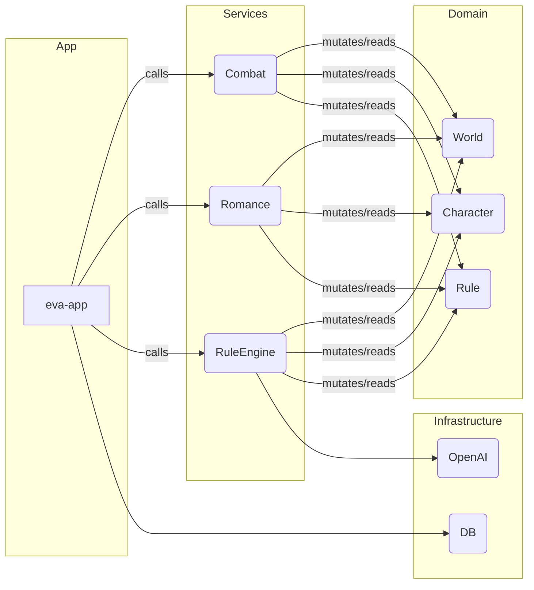

# EVA Interactive Novel Engine

[](docs/module_map.mmd)

這是 **EVA** 的全新重構版專案入口，採 Rust Workspace 分層：

```
Eva/
└─ crates/
   ├─ app/            # 二進位 crate：CLI / TUI / Server 入口
   ├─ services/       # 遊戲服務 (Combat, Romance, RuleEngine)
   ├─ domain/         # 純資料與核心商業規則
   ├─ infrastructure/ # DB、OpenAI、TTS… 外部依賴
```

> 完整分層說明請見 [`ARCHITECTURE.md`](ARCHITECTURE.md)

---

## 🚀 快速開始 (Build & Run)

```bash
# 1. 複製 .env 範例並填入金鑰
cp .env.example .env

# 2. 建置 Workspace
cargo build --workspace

# 3. 執行
cargo run -p eva-app
```

---

## 📂 模組總覽 (TL;DR)

| Crate | 角色 | 入口檔 |
|-------|------|-------|
| `domain` | 純資料 + 商業邏輯 | `crates/domain/src/lib.rs` |
| `services` | 戰鬥、戀愛、規則引擎 | `crates/services/src/lib.rs` |
| `infrastructure` | SeaORM、OpenAI、TTS Adapter | `crates/infrastructure/src/lib.rs` |
| `app` | CLI/TUI 與流程控制 | `crates/app/src/main.rs` |

---

## 🧪 測試

```bash
# 單元測試 + 整合測試
cargo nextest run --all-features --workspace
```

---

## 🔄 CI Pipeline
GitHub Actions: `.github/workflows/ci.yml`
1. Check formatting (`cargo fmt -- --check`)
2. Lint (`cargo clippy --all-targets -- -D warnings`)
3. Test (`cargo nextest run`)
4. Build docs (`cargo doc --no-deps`)

---

## 🗺 模組互動關係圖
Mermaid 原始碼於 `docs/module_map.mmd`，可用 [Mermaid Live](https://mermaid.live/) 預覽。



---

## 🔌 外部 API / Prompt
請參閱 [`docs/external_api.md`](docs/external_api.md)

---

## 📜 授權
MIT
